Ship Resistance and Propulsion is dedicated to providing a comprehensive and modern scientific approach to evaluating ship resistance and propulsion. The study of propulsive power enables the size and mass of the propulsion engines to be established and estimates made of the fuel consumption and likely operating costs. This book, written by experts in the field, includes the latest developments from applied research, including those in experimental and CFD techniques, and provides guidance for the practical estimation of ship propulsive power for a range of ship types. This text includes sufficient published standard series data for hull resistance and propeller performance to enable practitioners to make ship power predictions based on material and data contained within the book. A large number of fully worked examples are included to illustrate applications of the data and powering methodologies; these include cargo and container ships, tankers and bulk carriers, ferries, warships, patrol craft, work boats, planing craft and yachts. The book is aimed at a broad readership including practising naval architects and marine engineers, sea-going officers, small craft designers and undergraduate and postgraduate degree students. It should also appeal to others involved in transportation, transport efficiency and eco-logistics, who need to carry out reliable estimates of ship power requirements.

Anthony F. Molland is Emeritus Professor of Ship Design at the University of Southampton in the United Kingdom. For many years, Professor Molland has extensively researched and published papers on ship design and ship hydrodynamics including propellers and ship resistance components, ship rudders and control surfaces. He also acts as a consultant to industry in these subject areas and has gained international recognition through presentations at conferences and membership on committees of the International Towing Tank Conference (ITTC). Professor Molland is the co-author of Marine Rudders and Control Surfaces (2007) and editor of The Maritime Engineering Reference Book (2008).

Stephen R. Turnock is Professor of Maritime Fluid Dynamics at the University of Southampton in the United Kingdom. Professor Turnock lectures on many subjects, including ship resistance and propulsion, powercraft performance, marine renewable energy and applications of CFD. His research encompasses both experimental and theoretical work on energy efficiency of shipping, performance sport, underwater systems and renewable energy devices, together with the application of CFD for the design of propulsion systems and control surfaces. He acts as a consultant to industry in these subject areas, and as a member of the committees of the International Towing Tank Conference (ITTC) and International Ship and Offshore Structures Congress (ISSC). Professor Turnock is the co-author of Marine Rudders and Control Surfaces (2007).

Dominic A. Hudson is Senior Lecturer in Ship Science at the University of Southampton in the United Kingdom. Dr. Hudson lectures on ship resistance and propulsion, powercraft performance and design, recreational and high-speed craft and ship design. His research interests are in all areas of ship hydrodynamics, including experimental and theoretical work on ship resistance components, seakeeping and manoeuvring, together with ship design for minimum energy consumption. He is a member of the 26th International Towing Tank Conference (ITTC) specialist committee on high-speed craft and was a member of the 17th International Ship and Offshore Structures Congress (ISSC) committee on sailing yacht design.

# Ship Resistance and Propulsion

# PRACTICAL ESTIMATION OF SHIP PROPULSIVE POWER

Anthony F. Molland

University of Southampton

Stephen R. Turnock

University of Southampton

Dominic A. Hudson

University of Southampton

cambridge university press

Cambridge, New York, Melbourne, Madrid, Cape Town, Singapore, Sao Paulo, Delhi, Tokyo, Mexico City ˜

Cambridge University Press

32 Avenue of the Americas, New York, NY 10013-2473, USA

www.cambridge.org

Information on this title: www.cambridge.org/9780521760522

-c Anthony F. Molland, Stephen R. Turnock, and Dominic A. Hudson 2011

This publication is in copyright. Subject to statutory exception and to the provisions of relevant collective licensing agreements, no reproduction of any part may take place without the written permission of Cambridge University Press.

First published 2011

Printed in the United States of America

A catalog record for this publication is available from the British Library.

Library of Congress Cataloging in Publication data

Molland, Anthony F.

Ship resistance and propulsion : practical estimation of ship propulsive power / Anthony F. Molland, Stephen R. Turnock, Dominic A. Hudson.

p. cm.

Includes bibliographical references and index.

ISBN 978-0-521-76052-2 (hardback)

1. Ship resistance. 2. Ship resistance – Mathematical models.

3. Ship propulsion. 4. Ship propulsion – Mathematical models.

I. Turnock, Stephen R. II. Hudson, Dominic A. III. Title. VM751.M65 2011

623.8′12–dc22 2011002620

ISBN 978-0-521-76052-2 Hardback

Cambridge University Press has no responsibility for the persistence or accuracy of URLs for external or third-party Internet Web sites referred to in this publication and does not guarantee that any content on such Web sites is, or will remain, accurate or appropriate.

# Contents

Preface page xv

Nomenclature xvii

Abbreviations xxi

Figure Acknowledgements xxv

1 Introduction . .

History 1

Powering: Overall Concept 3

Improvements in Efficiency 3

references (chapter 1) 5

2 Propulsive Power . . . .

2.1 Components of Propulsive Power 7

2.2 Propulsion Systems 7

2.3 Definitions 9

2.4 Components of the Ship Power Estimate 10

3 Components of Hull Resistance . . . 12

3.1 Physical Components of Main Hull Resistance 12

3.1.1 Physical Components 12

3.1.2 Momentum Analysis of Flow Around Hull 17

3.1.3 Systems of Coefficients Used in Ship Powering 21

3.1.4 Measurement of Model Total Resistance 23

3.1.5 Transverse Wave Interference 29

3.1.6 Dimensional Analysis and Scaling 33

3.2 Other Drag Components 36

3.2.1 Appendage Drag 36

3.2.2 Air Resistance of Hull and Superstructure 45

3.2.3 Roughness and Fouling 51

3.2.4 Wind and Waves 57

3.2.5 Service Power Margins 63

references (chapter 3) 64

# 4 Model-Ship Extrapolation . . 69

4.1 Practical Scaling Methods 69

4.1.1 Traditional Approach: Froude 69   
4.1.2 Form Factor Approach: Hughes 70

4.2 Geosim Series 71

4.3 Flat Plate Friction Formulae 72

4.3.1 Froude Experiments 72   
4.3.2 Schoenherr Formula 76   
4.3.3 The ITTC Formula 78   
4.3.4 Other Proposals for Friction Lines 79

4.4 Derivation of Form Factor (1 + k) 79

4.4.1 Model Experiments 80   
4.4.2 CFD Methods 81   
4.4.3 Empirical Methods 81   
4.4.4 Effects of Shallow Water 82

references (chapter 4) 83

# 5 Model-Ship Correlation . . . . . . . 85

5.1 Purpose 85   
5.2 Procedures 85

5.2.1 Original Procedure 85   
5.2.2 ITTC1978 Performance Prediction Method 87   
5.2.3 Summary 90

5.3 Ship Speed Trials and Analysis 90

5.3.1 Purpose 90   
5.3.2 Trials Conditions 91   
5.3.3 Ship Condition 91   
5.3.4 Trials Procedures and Measurements 91   
5.3.5 Corrections 92   
5.3.6 Analysis of Correlation Factors and Wake Fraction 94

references (chapter 5) 96

# 6 Restricted Water Depth and Breadth . . . . . . 97

6.1 Shallow Water Effects 97

6.1.1 Deep Water 97   
6.1.2 Shallow Water 97

6.2 Bank Effects 100   
6.3 Blockage Speed Corrections 100   
6.4 Squat 103   
6.5 Wave Wash 103

references (chapter 6) 105

# 7 Measurement of Resistance Components . . . . . . 108

7.1 Background 108   
7.2 Need for Physical Measurements 108   
7.3 Physical Measurements of Resistance Components 110

7.3.1 Skin Friction Resistance 110

7.3.2 Pressure Resistance 115

7.3.3 Viscous Resistance 118

7.3.4 Wave Resistance 123

7.4 Flow Field Measurement Techniques 136

7.4.1 Hot-Wire Anemometry 136

7.4.2 Five-Hole Pitot Probe ˆ 136

7.4.3 Photogrammetry 137

7.4.4 Laser-Based Techniques 138

7.4.5 Summary 140

references (chapter 7) 141

# 8 Wake and Thrust Deduction . . . . 144

8.1 Introduction 144

8.1.1 Wake Fraction 144

8.1.2 Thrust Deduction 145

8.1.3 Relative Rotative Efficiency ηR 145

8.2 Origins of Wake 145

8.2.1 Potential Wake: wP 146

8.2.2 Frictional Wake: wF 146

8.2.3 Wave Wake: wW 146

8.2.4 Summary 146

8.3 Nominal and Effective Wake 146

8.4 Wake Distribution 147

8.4.1 General Distribution 147

8.4.2 Circumferential Distribution of Wake 148

8.4.3 Radial Distribution of Wake 149

8.4.4 Analysis of Detailed Wake Measurements 149

8.5 Detailed Physical Measurements of Wake 150

8.5.1 Circumferential Average Wake 150

8.5.2 Detailed Measurements 151

8.6 Computational Fluid Dynamics Predictions of Wake 151

8.7 Model Self-propulsion Experiments 151

8.7.1 Introduction 151

8.7.2 Resistance Tests 152

8.7.3 Propeller Open Water Tests 152

8.7.4 Model Self-propulsion Tests 152

8.7.5 Trials Analysis 155

8.7.6 Wake Scale Effects 155

8.8 Empirical Data for Wake Fraction and Thrust Deduction Factor 156

8.8.1 Introduction 156

8.8.2 Single Screw 156

8.8.3 Twin Screw 159

8.8.4 Effects of Speed and Ballast Condition 161

8.9 Tangential Wake 162

8.9.1 Origins of Tangential Wake 162

8.9.2 Effects of Tangential Wake 163

references (chapter 8) 164

# 9 Numerical Estimation of Ship Resistance . . . . . . 166

9.1 Introduction 166   
9.2 Historical Development 167   
9.3 Available Techniques 168

9.3.1 Navier–Stokes Equations 168   
9.3.2 Incompressible Reynolds Averaged Navier–Stokes equations (RANS) 169   
9.3.3 Potential Flow 170   
9.3.4 Free Surface 171

9.4 Interpretation of Numerical Methods 172

9.4.1 Introduction 172   
9.4.2 Validation of Applied CFD Methodology 174   
9.4.3 Access to CFD 176

9.5 Thin Ship Theory 177

9.5.1 Background 177   
9.5.2 Distribution of Sources 178   
9.5.3 Modifications to the Basic Theory 179   
9.5.4 Example Results 179

9.6 Estimation of Ship Self-propulsion Using RANS 180

9.6.1 Background 180   
9.6.2 Mesh Generation 180   
9.6.3 Boundary Conditions 181   
9.6.4 Methodology 181   
9.6.5 Results 183

9.7 Summary 185

references (chapter 9) 185

# 10 Resistance Design Data . . . . . . . 188

10.1 Introduction 188   
10.2 Data Sources 188

10.2.1 Standard Series Data 188   
10.2.2 Other Resistance Data 190   
10.2.3 Regression Analysis of Resistance Data 190   
10.2.4 Numerical Methods 191

10.3 Selected Design Data 192

10.3.1 Displacement Ships 192   
10.3.2 Semi-displacement Craft 208   
10.3.3 Planing Craft 212   
10.3.4 Small Craft 220   
10.3.5 Multihulls 223   
10.3.6 Yachts 229

10.4 Wetted Surface Area 235

10.4.1 Background 235   
10.4.2 Displacement Ships 235   
10.4.3 Semi-displacement Ships, Round-Bilge Forms 236   
10.4.4 Semi-displacement Ships, Double-Chine Forms 238

10.4.5 Planing Hulls, Single Chine 239

10.4.6 Yacht Forms 239

references (chapter 10) 240

# 11 Propulsor Types . . . . . . . 246

11.1 Basic Requirements: Thrust and Momentum Changes 246   
11.2 Levels of Efficiency 246   
11.3 Summary of Propulsor Types 247

11.3.1 Marine Propeller 247

11.3.2 Controllable Pitch Propeller (CP propeller) 248

11.3.3 Ducted Propellers 248

11.3.4 Contra-Rotating Propellers 249

11.3.5 Tandem Propellers 250

11.3.6 Z-Drive Units 250

11.3.7 Podded Azimuthing Propellers 251

11.3.8 Waterjet Propulsion 252

11.3.9 Cycloidal Propeller 252

11.3.10 Paddle Wheels 253

11.3.11 Sails 253

11.3.12 Oars 254

11.3.13 Lateral Thrust Units 254

11.3.14 Other Propulsors 255

11.3.15 Propulsion-Enhancing Devices 256

11.3.16 Auxiliary Propulsion Devices 257

references (chapter 11) 258

# 12 Propeller Characteristics . . . . . 261

12.1 Propeller Geometry, Coefficients, Characteristics 261

12.1.1 Propeller Geometry 261

12.1.2 Dimensional Analysis and Propeller Coefficients 266

12.1.3 Presentation of Propeller Data 266

12.1.4 Measurement of Propeller Characteristics 267

12.2 Cavitation 270

12.2.1 Background 270

12.2.2 Cavitation Criterion 272

12.2.3 Subcavitating Pressure Distributions 273

12.2.4 Propeller Section Types 275

12.2.5 Cavitation Limits 275

12.2.6 Effects of Cavitation on Thrust and Torque 277

12.2.7 Cavitation Tunnels 278

12.2.8 Avoidance of Cavitation 281

12.2.9 Preliminary Blade Area – Cavitation Check 282

12.2.10 Example: Estimate of Blade Area 284

12.3 Propeller Blade Strength Estimates 284

12.3.1 Background 284

12.3.2 Preliminary Estimates of Blade Root Thickness 285

12.3.3 Methods of Estimating Propeller Stresses 285

12.3.4 Propeller Strength Calculations Using Simple Beam Theory 286

references (chapter 12) 293

13 Powering Process . . . . . . 296

13.1 Selection of Marine Propulsion Machinery 296

13.1.1 Selection of Machinery: Main Factors to Consider 296

13.1.2 Propulsion Plants Available 296

13.1.3 Propulsion Layouts 299

13.2 Propeller–Engine Matching 299

13.2.1 Introduction 299

13.2.2 Controllable Pitch Propeller (CP Propeller) 301

13.2.3 The Multi-Engined Plant 302

13.3 Propeller Off-Design Performance 303

13.3.1 Background 303

13.3.2 Off-Design Cases: Examples 304

13.4 Voyage Analysis and In-service Monitoring 306

13.4.1 Background 306

13.4.2 Data Required and Methods of Obtaining Data 307

13.4.3 Methods of Analysis 307

13.4.4 Limitations in Methods of Logging and Data Available 310

13.4.5 Developments in Voyage Analysis 311

13.4.6 Further Data Monitoring and Logging 311

references (chapter 13) 312

14 Hull Form Design . . 313

14.1 General 313

14.1.1 Introduction 313

14.1.2 Background 313

14.1.3 Choice of Main Hull Parameters 314

14.1.4 Choice of Hull Shape 318

14.2 Fore End 322

14.2.1 Basic Requirements of Fore End Design 322

14.2.2 Bulbous Bows 323

14.2.3 Seakeeping 328

14.2.4 Cavitation 328

14.3 Aft End 328

14.3.1 Basic Requirements of Aft End Design 328

14.3.2 Stern Hull Geometry to Suit Podded Units 331

14.3.3 Shallow Draught Vessels 333

14.4 Computational Fluid Dynamics Methods Applied to Hull Form Design 334

references (chapter 14) 334

15 Numerical Methods for Propeller Analysis . . . . . . . 337

15.1 Introduction 337

15.2 Historical Development of Numerical Methods 337

15.3 Hierarchy of Methods 338   
15.4 Guidance Notes on the Application of Techniques 339

15.4.1 Blade Element-Momentum Theory 339   
15.4.2 Lifting Line Theories 340   
15.4.3 Surface Panel Methods 340   
15.4.4 Reynolds Averaged Navier–Stokes 342

15.5 Blade Element-Momentum Theory 343

15.5.1 Momentum Theory 343   
15.5.2 Goldstein K Factors [15.8] 345   
15.5.3 Blade Element Equations 346   
15.5.4 Inflow Factors Derived from Section Efficiency 349   
15.5.5 Typical Distributions of a, a′ and dKT/dx 350   
15.5.6 Section Design Parameters 350   
15.5.7 Lifting Surface Flow Curvature Effects 352   
15.5.8 Calculations of Curvature Corrections 353   
15.5.9 Algorithm for Blade Element-Momentum Theory 355

15.6 Propeller Wake Adaption 356

15.6.1 Background 356   
15.6.2 Optimum Spanwise Loading 357   
15.6.3 Optimum Diameters with Wake-Adapted Propellers 359

15.7 Effect of Tangential Wake 359

15.8 Examples Using Blade Element-Momentum Theory 361

15.8.1 Approximate Formulae 361   
15.8.2 Example 1 362   
15.8.3 Example 2 363   
15.8.4 Example 3 364

references (chapter 15) 366

16 Propulsor Design Data . . . . . . . . 369

16.1 Introduction 369

16.1.1 General 369   
16.1.2 Number of Propeller Blades 369

16.2 Propulsor Data 371

16.2.1 Propellers 371   
16.2.2 Controllable Pitch Propellers 385   
16.2.3 Ducted Propellers 385   
16.2.4 Podded Propellers 386   
16.2.5 Cavitating Propellers 391   
16.2.6 Supercavitating Propellers 392   
16.2.7 Surface-Piercing Propellers 395   
16.2.8 High-Speed Propellers, Inclined Shaft 398   
16.2.9 Small Craft Propellers: Locked, Folding and Self-pitching 399   
16.2.10 Waterjets 400   
16.2.11 Vertical Axis Propellers 404   
16.2.12 Paddle Wheels 405   
16.2.13 Lateral Thrust Units 405

16.2.14 Oars 407   
16.2.15 Sails 408

16.3 Hull and Relative Rotative Efficiency Data 411

16.3.1 Wake Fraction wT and Thrust Deduction t 411   
16.3.2 Relative Rotative Efficiency, ηR 411

references (chapter 16) 413

# 17 Applications . . . . 418

17.1 Background 418   
17.2 Example Applications 418

17.2.1 Example Application 1. Tank Test Data: Estimate of Ship Effective Power 418   
17.2.2 Example Application 2. Model Self-propulsion Test Analysis 420   
17.2.3 Example Application 3. Wake Analysis from Full-Scale Trials Data 421   
17.2.4 Example Application 4. 140 m Cargo Ship: Estimate of Effective Power 422   
17.2.5 Example Application 5. Tanker: Estimates of Effective Power in Load and Ballast Conditions 423   
17.2.6 Example Application 6. 8000 TEU Container Ship: Estimates of Effective and Delivered Power 424   
17.2.7 Example Application 7. 135 m Twin-Screw Ferry, 18 knots: Estimate of Effective Power PE 429   
17.2.8 Example Application 8. 45.5 m Passenger Ferry, 37 knots, Twin-Screw Monohull: Estimates of Effective and Delivered Power 432   
17.2.9 Example Application 9. 98 m Passenger/Car Ferry, 38 knots, Monohull: Estimates of Effective and Delivered Power 435   
17.2.10 Example Application 10. 82 m Passenger/Car Catamaran Ferry, 36 knots: Estimates of Effective and Delivered Power 437   
17.2.11 Example Application 11. 130 m Twin-Screw Warship, 28 knots, Monohull: Estimates of Effective and Delivered Power 440   
17.2.12 Example Application 12. 35 m Patrol Boat, Monohull: Estimate of Effective Power 446   
17.2.13 Example Application 13. 37 m Ocean-Going Tug: Estimate of Effective Power 448   
17.2.14 Example Application 14. 14 m Harbour Work Boat, Monohull: Estimate of Effective Power 448   
17.2.15 Example Application 15. 18 m Planing Craft, Single-Chine Hull: Estimates of Effective Power Preplaning and Planing 450   
17.2.16 Example Application 16. 25 m Planing Craft, 35 knots, Single-Chine Hull: Estimate of Effective Power 453

17.2.17 Example Application 17. 10 m Yacht: Estimate of Performance 454

17.2.18 Example Application 18. Tanker: Propeller Off-Design Calculations 460

17.2.19 Example Application 19. Twin-Screw Ocean-Going Tug: Propeller Off-Design Calculations 462

17.2.20 Example Application 20. Ship Speed Trials: Correction for Natural Wind 464

17.2.21 Example Application 21. Detailed Cavitation Check on Propeller Blade Section 466

17.2.22 Example Application 22. Estimate of Propeller Blade Root Stresses 467

17.2.23 Example Application 23. Propeller Performance Estimates Using Blade Element-Momentum Theory 469

17.2.24 Example Application 24. Wake-Adapted Propeller 471 references (chapter 17) 472

APPENDIX A1: Background Physics . . . . . . . 473

A1.1 Background 473

A1.2 Basic Fluid Properties and Flow 473

Fluid Properties 473

Steady Flow 474

Uniform Flow 474

Streamline 475

A1.3 Continuity of Flow 475

A1.4 Forces Due to Fluids in Motion 476

A1.5 Pressure and Velocity Changes in a Moving Fluid 476

A1.6 Boundary Layer 477

Origins 477

Outer Flow 478

Flow Within the Boundary Layer 478

Displacement Thickness 479

Laminar Flow 480

A1.7 Flow Separation 480

A1.8 Wave Properties 481

Wave Speed 482

Deep Water 482

Shallow Water 482

references (appendix a1) 483

APPENDIX A2: Derivation of Eggers Formula for Wave Resistance . . . . . . 484

APPENDIX A3: Tabulations of Resistance Design Data . . . . . . . . 487

APPENDIX A4: Tabulations of Propulsor Design Data . . . . . . . 522

Index 529

# Preface

New ship types and applications continue to be developed in response to economic, societal and technical factors, including changes in operational speeds and fluctuations in fuel costs. These changes in ship design all depend on reliable estimates of ship propulsive power. There is a growing need to minimise power, fuel consumption and operating costs driven by environmental concerns and from an economic perspective. The International Maritime Organisation (IMO) is leading the shipping sector in efforts to reduce emissions such as NOx, SOx and $\mathrm { C O } _ { 2 }$ through the development of legislation and operational guidelines.

The estimation of ship propulsive power is fundamental to the process of designing and operating a ship. Knowledge of the propulsive power enables the size and mass of the propulsion engines to be established and estimates made of the fuel consumption and likely operating costs. The methods whereby ship resistance and propulsion are evaluated will never be an exact science, but require a combination of analysis, experiments, computations and empiricism. This book provides an up-todate detailed appraisal of the data sources, methods and techniques for establishing propulsive power.

Notwithstanding the quantity of commercial software available for estimating ship resistance and designing propellers, it is our contention that rigorous and robust engineering design requires that engineers have the ability to carry out these calculations from first principles. This provides a transparent view of the calculation process and a deeper understanding as to how the final answer is obtained. An objective of this book is to include enough published standard series data for hull resistance and propeller performance to enable practitioners to make ship power predictions based on material and data contained within the book. A large number of fully worked examples are included to illustrate applications of the data and powering methodologies; these include cargo and container ships, tankers and bulk carriers, ferries, warships, patrol craft, work boats, planing craft and yachts.

The book is aimed at a broad readership, including practising professional naval architects and marine engineers and undergraduate and postgraduate degree students. It should also be of use to other science and engineering students and professionals with interests in the marine field.

The book is arranged in 17 chapters. The first 10 chapters broadly cover resistance, with Chapter 10 providing both sources of resistance data and useable data. Chapters 11 to 16 cover propellers and propulsion, with Chapter 16 providing both sources of propeller data and useable data. Chapter 17 includes a number of worked example applications. For the reader requiring more information on basic fluid mechanics, Appendix A1 provides a background to the physics of fluid flow. Appendix A2 derives a wave resistance formula and Appendices A3 and A4 contain tabulated resistance and propeller data. References are provided at the end of each chapter to facilitate readers’ access to the original sources of data and information and further depth of study when necessary.

Proceedings, conference reports and standard procedures of the International Towing Tank Conference (ITTC) are referred to frequently. These provide an invaluable source of reviews and developments of ship resistance and propulsion. The proceedings and procedures are freely available through the website of the Society of Naval Architects and Marine Engineers (SNAME), which kindly hosts the ITTC website, http://ittc.sname.org. The University of Southampton Ship Science Reports, referenced in the book, can be obtained free from www.eprints .soton.ac.uk.

The authors acknowledge the help and support of their colleagues at the University of Southampton. Thanks must also be conveyed to national and international colleagues for their continued support over the years. Particular acknowledgement should also be made to the many undergraduate and postgraduate students who, over many years, have contributed to a better understanding of the subject through research and project and assignment work.

Many of the basic sections of the book are based on notes of lectures on ship resistance and propulsion delivered at the University of Southampton. In this context, particular thanks are due to Dr. John Wellicome, who assembled and delivered many of the original versions of the notes from the foundation of the Ship Science degree programme in Southampton in 1968.

Finally, the authors wish especially to thank their respective families for their practical help and support.

Anthony F. Molland

Stephen R. Turnock

Dominic A. Hudson

Southampton 2011

# Nomenclature

<table><tr><td>A</td><td>Wetted surface area, thin ship theory (m2)</td></tr><tr><td> $A_0$ </td><td>Propeller disc area [ $\pi D^2/4$ ]</td></tr><tr><td> $A_D$ </td><td>Propeller developed blade area ratio, or developed blade area (m2)</td></tr><tr><td> $A_E$ </td><td>Propeller expanded blade area ratio</td></tr><tr><td> $A_P$ </td><td>Projected bottom planing area of planing hull (m2) or projected area of propeller blade (m2)</td></tr><tr><td> $A_T$ </td><td>Transverse frontal area of hull and superstructure above water (m2)</td></tr><tr><td> $A_X$ </td><td>Midship section area (m2)</td></tr><tr><td>b</td><td>Breadth of catamaran demihull (m), or mean chine beam of planing craft (m)</td></tr><tr><td>B</td><td>Breadth of monohull or overall breadth of catamaran (m)</td></tr><tr><td> $B_{pa}$ </td><td>Mean breadth over chines [=  $A_P/L_P$ ] (m)</td></tr><tr><td> $B_{px}$ </td><td>Maximum breadth over chines (m)</td></tr><tr><td> $B_{WL}$ </td><td>Breadth on waterline (m)</td></tr><tr><td>c</td><td>Section chord (m)</td></tr><tr><td> $C_A$ </td><td>Model-ship correlation allowance coefficient</td></tr><tr><td> $C_B$ </td><td>Block coefficient</td></tr><tr><td> $C_{\text{Dair}}$ </td><td>Coefficient of air resistance [ $R_{\text{air}}/^{1/2}\rho_a A_T V^2$ ]</td></tr><tr><td> $C_f$ </td><td>Local coefficient of frictional resistance</td></tr><tr><td> $C_F$ </td><td>Coefficient of frictional resistance [ $R_F/^{1/2}\rho_W SV^2$ ]</td></tr><tr><td> $C_L$ </td><td>Lift coefficient</td></tr><tr><td> $C_M$ </td><td>Midship coefficient [ $A_X/(B \times T)$ ]</td></tr><tr><td> $C_P$ </td><td>Prismatic coefficient [ $\nabla/(L \times A_X)$ ] or pressure coefficient</td></tr><tr><td> $C_R$ </td><td>Coefficient of residuary resistance [ $R_R/^{1/2}\rho SV^2$ ]</td></tr><tr><td> $C_S$ </td><td>Wetted surface coefficient [ $S/\sqrt{\nabla \cdot L}$ ]</td></tr><tr><td> $C_T$ </td><td>Coefficient of total resistance [ $R_T/^{1/2}\rho SV^2$ ]</td></tr><tr><td> $C_V$ </td><td>Coefficient of viscous resistance [ $R_V/^{1/2}\rho SV^2$ ]</td></tr><tr><td> $C_W$ </td><td>Coefficient of wave resistance [ $R_W/^{1/2}\rho SV^2$ ]</td></tr><tr><td> $C_{WP}$ </td><td>Coefficient of wave pattern resistance [ $R_{WP}/^{1/2}\rho SV^2$ ]</td></tr><tr><td>D</td><td>Propeller diameter (m)</td></tr><tr><td> $D_{\text{air}}$ </td><td>Aerodynamic drag, horizontal (planing craft) (N)</td></tr><tr><td> $D_{\text{APP}}$ </td><td>Appendage resistance (N)</td></tr><tr><td> $D_F$ </td><td>Planing hull frictional resistance, parallel to keel (N)</td></tr><tr><td>Demihull</td><td>One of the hulls which make up the catamaran</td></tr><tr><td>E</td><td>Energy in wave front</td></tr><tr><td> $F_H$ </td><td>Hydrostatic pressure acting at centre of pressure of planing hull (N)</td></tr><tr><td> $F_P$ </td><td>Pressure force over wetted surface of planing hull (N)</td></tr><tr><td>Fr</td><td>Froude number  $[V/\sqrt{g \cdot L}]$ </td></tr><tr><td> $Fr_h$ </td><td>Depth Froude number  $[V/\sqrt{g \cdot h}]$ </td></tr><tr><td> $Fr_\nabla$ </td><td>Volume Froude number  $[V/\sqrt{g \cdot \nabla^{1/3}}]$ </td></tr><tr><td>Fx</td><td>Yacht sail longitudinal force (N)</td></tr><tr><td>Fy</td><td>Yacht sail transverse force (N)</td></tr><tr><td>g</td><td>Acceleration due to gravity (m/s2)</td></tr><tr><td>G</td><td>Gap between catamaran hulls (m)</td></tr><tr><td>GM</td><td>Metacentric height (m)</td></tr><tr><td>h</td><td>Water depth (m)</td></tr><tr><td>H</td><td>Wave height (m)</td></tr><tr><td> $H_T$ </td><td>Transom immersion (m)</td></tr><tr><td> $i_E$ </td><td>Half angle of entrance of waterline (deg.), see also  $1/2 \alpha_E$ </td></tr><tr><td>J</td><td>Propeller advance coefficient ( $V_A/nD$ )</td></tr><tr><td>k</td><td>Wave number</td></tr><tr><td> $K_T$ </td><td>Propeller thrust coefficient ( $T/\rho n^2 D^4$ )</td></tr><tr><td> $K_Q$ </td><td>Propeller torque coefficient  $Q/\rho n^2 D^5$ </td></tr><tr><td>L</td><td>Length of ship (m)</td></tr><tr><td> $L_{\text{air}}$ </td><td>Aerodynamic lift, vertically upwards (planing craft) (N)</td></tr><tr><td> $L_{\text{APP}}$ </td><td>Appendage lift (N)</td></tr><tr><td> $L_{\text{BP}}$ </td><td>Length of ship between perpendiculars (m)</td></tr><tr><td> $l_c$ </td><td>Wetted length of chine, planing craft (m)</td></tr><tr><td>LCB</td><td>Longitudinal centre of buoyancy (% L forward or aft of amidships)</td></tr><tr><td>LCG</td><td>Longitudinal centre of gravity (% L forward or aft of amidships)</td></tr><tr><td> $L_f$ </td><td>Length of ship (ft)</td></tr><tr><td> $l_K$ </td><td>Wetted length of keel, planing craft (m)</td></tr><tr><td> $l_m$ </td><td>Mean wetted length, planing craft [= ( $l_K + l_c$ )/2]</td></tr><tr><td> $L_{OA}$ </td><td>Length of ship overall (m)</td></tr><tr><td>lp</td><td>Distance of centre of pressure from transom (planing craft)(m)</td></tr><tr><td> $L_P$ </td><td>Projected chine length of planing hull (m)</td></tr><tr><td> $L_{PS}$ </td><td>Length between pressure sources</td></tr><tr><td> $L_{WL}$ </td><td>Length on waterline (m)</td></tr><tr><td> $L/\nabla^{1/3}$ </td><td>Length-displacement ratio</td></tr><tr><td>n</td><td>Propeller rate of revolution (rps)</td></tr><tr><td>N</td><td>Propeller rate of revolution (rpm), or normal bottom pressure load on planing craft (N)</td></tr><tr><td>P</td><td>Propeller pitch (m)</td></tr><tr><td> $P_{AT}$ </td><td>Atmospheric pressure (N/m2)</td></tr><tr><td>P/D</td><td>Propeller pitch ratio</td></tr><tr><td> $P_D$ </td><td>Delivered power (kW)</td></tr><tr><td> $P_E$ </td><td>Effective power (kW)</td></tr><tr><td> $P_L$ </td><td>Local pressure (N/m2)</td></tr><tr><td> $P_S$ </td><td>Installed power (kW)</td></tr><tr><td> $P_V$ </td><td>Vapour pressure (N/m2)</td></tr><tr><td>Q</td><td>Propeller torque (Nm)</td></tr><tr><td> $R_{air}$ </td><td>Air resistance (N)</td></tr><tr><td> $R_{app}$ </td><td>Appendage resistance (N)</td></tr><tr><td>Re</td><td>Reynolds Number ( $\rho VL/\mu$  or  $VL/v$ )</td></tr><tr><td> $R_F$ </td><td>Frictional resistance (N)</td></tr><tr><td> $R_{Fh}$ </td><td>Frictional resistance of yacht hull (N)</td></tr><tr><td> $R_{Ind}$ </td><td>Induced resistance of yacht (N)</td></tr><tr><td>rps</td><td>Revolutions per second</td></tr><tr><td>rpm</td><td>Revolutions per minute</td></tr><tr><td> $R_R$ </td><td>Residuary resistance (N)</td></tr><tr><td> $R_{Rh}$ </td><td>Residuary resistance of yacht hull (N)</td></tr><tr><td> $R_{RK}$ </td><td>Residuary resistance of yacht keel (N)</td></tr><tr><td> $R_T$ </td><td>Total hull resistance (N)</td></tr><tr><td> $R_V$ </td><td>Viscous resistance (N)</td></tr><tr><td> $R_{VK}$ </td><td>Viscous resistance of yacht keel (N)</td></tr><tr><td> $R_{VR}$ </td><td>Viscous resistance of yacht rudder (N)</td></tr><tr><td> $R_W$ </td><td>Wave resistance (N)</td></tr><tr><td> $R_{WP}$ </td><td>Wave pattern resistance (N)</td></tr><tr><td>S</td><td>Wetted surface area (m2)</td></tr><tr><td> $S_{APP}$ </td><td>Wetted area of appendage (m2)</td></tr><tr><td> $S_C$ </td><td>Wetted surface area of yacht canoe body (m2) or separation between catamaran demihull centrelines (m)</td></tr><tr><td>sfc</td><td>Specific fuel consumption</td></tr><tr><td> $S_P$ </td><td>Propeller/hull interaction on planing craft (N)</td></tr><tr><td>t</td><td>Thrust deduction factor, or thickness of section (m)</td></tr><tr><td>T</td><td>Draught (m), or propeller thrust (N), or wave period (secs)</td></tr><tr><td> $T_C$ </td><td>Draught of yacht canoe body (m)</td></tr><tr><td>U</td><td>Speed (m/s)</td></tr><tr><td>V</td><td>Speed (m/s)</td></tr><tr><td>Va</td><td>Wake speed ( $V_S(1-w_T)$ ) (m/s)</td></tr><tr><td> $V_A$ </td><td>Relative or apparent wind velocity (m/s)</td></tr><tr><td> $V_K$ </td><td>Ship speed (knots)</td></tr><tr><td> $V_K/\sqrt{L_f}$ </td><td>Speed length ratio (knots and feet)</td></tr><tr><td> $V_R$ </td><td>Reference velocity (m/s)</td></tr><tr><td> $V_S$ </td><td>Ship speed (m/s)</td></tr><tr><td>W</td><td>Channel width (m)</td></tr><tr><td> $w_T$ </td><td>Wake fraction</td></tr><tr><td>Z</td><td>Number of blades of propeller</td></tr><tr><td>(1+k)</td><td>Form-factor, monohull</td></tr><tr><td>(1+ $\beta k$ )</td><td>Form factor, catamaran</td></tr><tr><td> $\frac{1}{2}\alpha_E$ </td><td>Half angle of entrance of waterline (deg.), see also  $i_E$ </td></tr><tr><td>β</td><td>Viscous resistance interference factor, or appendage scaling factor, or deadrise angle of planing hull (deg.) or angle of relative or apparent wind (deg.)</td></tr><tr><td>δ</td><td>Boundary layer thickness (m)</td></tr><tr><td>ε</td><td>Angle of propeller thrust line to heel (deg.)</td></tr><tr><td>ηD</td><td>Propulsive coefficient (η0ηHηR)</td></tr><tr><td>ηO</td><td>Open water efficiency (JKT/2π KQ)</td></tr><tr><td>ηH</td><td>Hull efficiency (1-t)/(1-wT)</td></tr><tr><td>ηR</td><td>Relative rotative efficiency</td></tr><tr><td>ηT</td><td>Transmission efficiency</td></tr><tr><td>γ</td><td>Surface tension (N/m), or wave height decay coefficient, or course angle of yacht (deg.), or wave number</td></tr><tr><td>φ</td><td>Heel angle (deg.), or hydrodynamic pitch angle (deg.)</td></tr><tr><td>λ</td><td>Leeway angle (deg.)</td></tr><tr><td>μ</td><td>Dynamic viscosity (g/ms)</td></tr><tr><td>ν</td><td>Kinematic viscosity (μ/ρ) (m2/s)</td></tr><tr><td>ρ</td><td>Density of water (kg/m3)</td></tr><tr><td>ρa</td><td>Density of air (kg/m3)</td></tr><tr><td>σ</td><td>Cavitation number, or source strength, or allowable stress (N/m2)</td></tr><tr><td>τ</td><td>Wave resistance interference factor (catamaran resistance/monohull resistance), or trim angle of planing hull (deg.)</td></tr><tr><td>τc</td><td>Thrust/unit area, cavitation (N/m2)</td></tr><tr><td>τR</td><td>Residuary resistance interference factor (catamaran resistance/monohull resistance)</td></tr><tr><td>τW</td><td>Surface or wall shear stress (N/m2)</td></tr><tr><td>θ</td><td>Wave angle (deg.)</td></tr><tr><td>ζ</td><td>Wave elevation (m)</td></tr><tr><td>∇</td><td>Ship displacement volume (m3)</td></tr><tr><td>∇C</td><td>Displacement volume of yacht canoe body (m3)</td></tr><tr><td>Δ</td><td>Ship displacement mass (∇ρ) (tonnes), or displacement force (∇ρg) (N)</td></tr></table>

Conversion of Units 

<table><tr><td>1 m = 3.28 ft</td><td>1 ft = 12 in.</td></tr><tr><td>1 in. = 25.4 mm</td><td>1 km = 1000 m</td></tr><tr><td>1 kg = 2.205 lb</td><td>1 tonne = 1000 kg</td></tr><tr><td>1 ton = 2240 lb</td><td>1 lb = 4.45 N</td></tr><tr><td>1 lbs/in. $^{2}$  = 6895 N/m $^{2}$ </td><td>1 bar = 14.7 lbs/in. $^{2}$ </td></tr><tr><td>1 mile = 5280 ft</td><td>1 nautical mile (Nm) = 6078 ft</td></tr><tr><td>1 mile/hr = 1.61 km/hr</td><td>1 knot = 1 Nm/hr</td></tr><tr><td>Fr = 0.2974  $V_{K}$ / $\sqrt{L_{f}}$ </td><td>1 knot = 0.5144 m/s</td></tr><tr><td>1 HP = 0.7457 kW</td><td>1 UK gal = 4.546 litres</td></tr></table>

# Abbreviations

ABS American Bureau of Shipping

AEW Admiralty Experiment Works (UK)

AFS Antifouling systems on ships

AHR Average hull roughness

AP After perpendicular

ARC Aeronautical Research Council (UK)

ATTC American Towing Tank Conference

BDC Bottom dead centre

BEM Boundary element method

BEMT Blade element-momentum theory

BMEP Brake mean effective pressure

BMT British Maritime Technology

BN Beaufort Number

BSRA British Ship Research Association

BTTP British Towing Tank Panel

CAD Computer-aided design

CCD Charge-coupled device

CFD Computational fluid dynamics

CG Centre of gravity

CLR Centre of lateral resistance

CODAG Combined diesel and gas

CP Controllable pitch (propeller)

CSR Continuous service rating

DES Detached eddy simulation

DNS Direct numerical simulation

DNV Det Norske Veritas

DSYHS Delft systematic yacht hull series

DTMB David Taylor Model Basin

EFD Experimental fluid dynamics

FEA Finite element analysis

FP Forward perpendicular, or fixed pitch (propeller)

FRP Fibre-reinforced plastic

FV Finite volume

<table><tr><td>GL</td><td>Germanischer Lloyd</td></tr><tr><td>GPS</td><td>Global Positioning System</td></tr><tr><td>HP</td><td>Horsepower</td></tr><tr><td>HSVA</td><td>Hamburg Ship Model Basin</td></tr><tr><td>IESS</td><td>Institute of Engineers and Shipbuilders in Scotland</td></tr><tr><td>IMarE</td><td>Institute of Marine Engineers (became IMarEST from 2001)</td></tr><tr><td>IMarEST</td><td>Institute of Marine Engineering, Science and Technology</td></tr><tr><td>IMechE</td><td>Institution of Mechanical Engineers</td></tr><tr><td>IMO</td><td>International Maritime Organisation</td></tr><tr><td>INSEAN</td><td>Instituto di Architectura Navale (Rome)</td></tr><tr><td>ISO</td><td>International Standards Organisation</td></tr><tr><td>ITTC</td><td>International Towing Tank Conference</td></tr><tr><td>JASNAOE</td><td>Japan Society of Naval Architects and Ocean Engineers</td></tr><tr><td>LCG</td><td>Longitudinal centre of gravity</td></tr><tr><td>LDA</td><td>Laser Doppler anemometry</td></tr><tr><td>LDV</td><td>Laser Doppler velocimetry</td></tr><tr><td>LE</td><td>Leading edge of foil or fin</td></tr><tr><td>LES</td><td>Large eddy simulation</td></tr><tr><td>LR</td><td>Lloyd's Register of Shipping</td></tr><tr><td>MAA</td><td>Mean apparent amplitude</td></tr><tr><td>MARIN</td><td>Maritime Research Institute of the Netherlands (formerly NSMB)</td></tr><tr><td>MCR</td><td>Maximum continuous rating</td></tr><tr><td>MEMS</td><td>Microelectromechanical systems</td></tr><tr><td>NACA</td><td>National Advisory Council for Aeronautics (USA)</td></tr><tr><td>NECIES</td><td>North East Coast Institution of Engineers and Shipbuilders</td></tr><tr><td>NPL</td><td>National Physical Laboratory (UK)</td></tr><tr><td>NSMB</td><td>The Netherlands Ship Model Basin (later to become MARIN)</td></tr><tr><td>NTUA</td><td>National Technical University of Athens</td></tr><tr><td>ORC</td><td>Offshore Racing Congress</td></tr><tr><td>P</td><td>Port</td></tr><tr><td>PIV</td><td>Particle image velocimetry</td></tr><tr><td>QPC</td><td>Quasi propulsive coefficient</td></tr><tr><td>RANS</td><td>Reynolds Averaged Navier-Stokes</td></tr><tr><td>RB</td><td>Round back (section)</td></tr><tr><td>RINA</td><td>Royal Institution of Naval Architects</td></tr><tr><td>ROF</td><td>Rise of floor</td></tr><tr><td>rpm</td><td>Revolutions per minute</td></tr><tr><td>rps</td><td>Revolutions per second</td></tr><tr><td>S</td><td>Starboard</td></tr><tr><td>SAC</td><td>Sectional area curve</td></tr><tr><td>SCF</td><td>Ship correlation factor</td></tr><tr><td>SG</td><td>Specific gravity</td></tr><tr><td>SNAJ</td><td>Society of Naval Architects of Japan (later to become JASNAOE)</td></tr><tr><td>SNAK</td><td>Society of Naval Architects of Korea</td></tr><tr><td>SNAME</td><td>Society of Naval Architects and Marine Engineers (USA)</td></tr><tr><td>SP</td><td>Self-propulsion</td></tr><tr><td>SSPA</td><td>Statens Skeppsprovingansalt, Götaborg, Sweden</td></tr><tr><td>STG</td><td>Schiffbautechnische Gesellschaft, Hamburg</td></tr><tr><td>TBT</td><td>Tributyltin</td></tr><tr><td>TDC</td><td>Top dead centre</td></tr><tr><td>TDW</td><td>Tons deadweight</td></tr><tr><td>TE</td><td>Trailing edge of foil or fin</td></tr><tr><td>TEU</td><td>Twenty foot equivalent unit [container]</td></tr><tr><td>UTS</td><td>Ultimate tensile stress</td></tr><tr><td>VCB</td><td>Vertical centre of buoyancy</td></tr><tr><td>VLCC</td><td>Very large crude carrier</td></tr><tr><td>VPP</td><td>Velocity prediction program</td></tr><tr><td>VWS</td><td>Versuchsanstalt für Wasserbau und Schiffbau Berlin (Berlin Model Basin)</td></tr><tr><td>WUMTIA</td><td>Wolfson Unit for Marine Technology and Industrial Aerodynamics, University of Southampton</td></tr></table>

# Figure Acknowledgements

The authors acknowledge with thanks the assistance given by the following companies and publishers in permitting the reproduction of illustrations and tables from their publications:

Figures 8.5, 10.7, 10.9, 10.10, 10.12, 12.24, 14.17, 14.18, 14.19, 14.20, 14.21, 14.22, 14.23, 14.24, 14.30, 15.4, 15.14, 15.15, 15.17, 16.1, 16.2 and Tables A3.13, A3.14, A3.15, A4.3 reprinted courtesy of The Society of Naval Architects and Marine Engineers (SNAME), New York.   
Figures 3.28, 3.29, 4.4, 4.5, 4.6, 7.6, 7.10, 7.16, 7.28, 8.4, 10.2, 10.3, 10.4, 10.5, 10.13, 10.14, 10.20, 10.21, 12.26, 14.15, 16.7, 16.8, 16.9, 16.10, 16.15, 16.16, 16.17, 16.19, 16.26 and Tables A3.1, A3.6, A3.24, A3.25, A3.26, A4.4, A4.5 reprinted courtesy of The Royal Institution of Naval Architects (RINA), London.   
Figures 10.11, 16.24 and Tables A3.2, A3.3, A3.4, A3.5, A3.12, A3.23, A4.1, A4.2, A4.6 reprinted courtesy of IOS Press BV, Amsterdam.   
Figures 4.8, 8.3, 8.12, 8.13, 16.3, 16.4, 16.5, 16.6, 16.13 reprinted courtesy of MARIN, Wageningen.   
Figure 10.23 and Tables 10.13, 10.14, 10.15, 10.16, 10.17 reprinted courtesy of The HISWA Symposium Foundation, Amsterdam.   
Figures A1.1, A1.7, A1.8 and Sections A1.1–A1.7 reprinted courtesy of Elsevier Ltd., Oxford.   
Figure 10.22 reprinted courtesy of The Japan Society of Naval Architects and Ocean Engineers (JASNAOE), Tokyo (formerly The Society of Naval Architects of Japan (SNAJ), Tokyo).   
Figure 3.10 reprinted courtesy of WUMTIA, University of Southampton and Dubois Naval Architects Ltd., Lymington.   
Figure 7.3 reprinted courtesy of WUMTIA, University of Southampton.   
Figure 12.29 reprinted courtesy of The University of Newcastle upon Tyne.   
Figures 12.31, 13.9, 15.17 reprinted courtesy of The North East Coast Institution of Engineers and Shipbuilders (NECIES), Newcastle upon Tyne.   
Table A3.7 reprinted courtesy of Ship Technology Research, Hamburg.   
Table A3.27 reprinted courtesy of STG, Hamburg.

Figure 10.6 reprinted courtesy of BMT Group Ltd., Teddington.

Figure 12.25 reprinted courtesy of The Institution of Mechanical Engineers (IMechE), London.

Figures 16.27, 16.28 and Tables 16.8, 16.9 reprinted courtesy of The Offshore Racing Congress (ORC).

#

# Introduction

The estimation of ship propulsive power is fundamental to the process of designing and operating a ship. A knowledge of the propulsive power enables the size and mass of the propulsion engines to be established and estimates made of the fuel consumption and operating costs. The estimation of power entails the use of experimental techniques, numerical methods and theoretical analysis for the various aspects of the powering problem. The requirement for this stems from the need to determine the correct match between the installed power and the ship hull form during the design process. An understanding of ship resistance and propulsion derives from the fundamental behaviour of fluid flow. The complexity inherent in ship hydrodynamic design arises from the challenges of scaling from practical model sizes and the unsteady flow interactions between the viscous ship boundary layer, the generated free-surface wave system and a propulsor operating in a spatially varying inflow.

# History

Up to the early 1860s, little was really understood about ship resistance and many of the ideas on powering at that time were erroneous. Propeller design was very much a question of trial and error. The power installed in ships was often wrong and it was clear that there was a need for a method of estimating the power to be installed in order to attain a certain speed.

In 1870, W. Froude initiated an investigation into ship resistance with the use of models. He noted that the wave configurations around geometrically similar forms were similar if compared at corresponding speeds, that is, speeds proportional to the square root of the model length. He propounded that the total resistance could be divided into skin friction resistance and residuary, mainly wavemaking, resistance. He derived estimates of frictional resistance from a series of measurements on planks of different lengths and with different surface finishes [1.1], [1.2]. Specific residuary resistance, or resistance per ton displacement, would remain constant at corresponding speeds between model and ship. His proposal was initially not well received, but gained favour after full-scale tests had been carried out. HMS Greyhound (100 ft) was towed by a larger vessel and the results showed a substantial level of agreement with the model predictions [1.3]. Model tests had been vindicated and the way opened for the realistic prediction of ship power. In a 1877 paper, Froude gave a detailed explanation of wavemaking resistance which lent further support to his methodology [1.4].

In the 1860s, propeller design was hampered by a lack of understanding of negative, or apparent, slip; naval architects were not fully aware of the effect of wake. Early propeller theories were developed to enhance the propeller design process, including the momentum theory of Rankine [1.5] in 1865, the blade element theory of Froude [1.6] in 1878 and the actuator disc theory of Froude [1.7] in 1889. In 1910, Luke [1.8] published the first of three important papers on wake, allowing more realistic estimates of wake to be made for propeller design purposes. Cavitation was not known as such at this time, although several investigators, including Reynolds [1.9], were attempting to describe its presence in various ways. Barnaby [1.10] goes some way to describing cavitation, including the experience of Parsons with Turbinia. During this period, propeller blade area was based simply on thrust loading, without a basic understanding of cavitation.

By the 1890s the full potential of model resistance tests had been realised. Routine testing was being carried out for specific ships and tests were also being carried out on series of models. A notable early contribution to this is the work of Taylor [1.11], [1.12] which was closely followed by Baker [1.13].

The next era saw a steady stream of model resistance tests, including the study of the effects of changes in hull parameters, the effects of shallow water and to challenge the suitability and correctness of the Froude friction values [1.14]. There was an increasing interest in the performance of ships in rough water. Several investigations were carried out to determine the influence of waves on motions and added resistance, both at model scale and from full-scale ship measurements [1.15].

Since about the 1960s there have been many developments in propulsor types. These include various enhancements to the basic marine propeller such as tip fins, varying degrees of sweep, changes in section design to suit specific purposes and the addition of ducts. Contra-rotating propellers have been revisited, cycloidal propellers have found new applications, waterjets have been introduced and podded units have been developed. Propulsion-enhancing devices have been proposed and introduced including propeller boss cap fins, upstream preswirl fins or ducts, twisted rudders and fins on rudders. It can of course be noted that these devices are generally at their most efficient in particular specific applications.

From about the start of the 1980s, the potential future of computational fluid dynamics (CFD) was fully realised. This would include the modelling of the flow around the hull and the derivation of viscous resistance and free-surface waves. This generated the need for high quality benchmark data for the physical components of resistance necessary for the validation of the CFD. Much of the earlier data of the 1970s were revisited and new benchmark data developed, in particular, for viscous and wave drag. Much of the gathering of such data has been coordinated by the International Towing Tank Conference (ITTC). Typical examples of the application of CFD to hull form development and resistance prediction are given in [1.16] and [1.17].

Propeller theories had continued to be developed in order to improve the propeller design process. Starting from the work of Rankine, Froude and Perring, these included blade element-momentum theories, such as Burrill [1.18] in 1944, and

flowchart

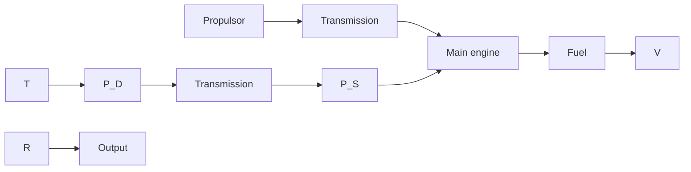
```mermaid
graph LR
    A["Propulsor"] --> B["Transmission"]
    B --> C["Main engine"]
    C --> D["Fuel"]
    D --> E["V"]
    F["T"] --> G["P_D"]
    G --> H["Transmission"]
    H --> I["P_S"]
    I --> C
    J["R"] --> K["Output"]
```

Figure 1.1. Overall concept of energy conversion.

Lerbs [1.19] in 1952 using a development of the lifting line and lifting surface methods where vorticity is distributed over the blade. Vortex lattice methods, boundary element, or panel, methods and their application to propellers began in the 1980s. The 1990s saw the application of CFD and Reynolds-Averaged Navier– Stokes (RANS) solvers applied to propeller design and, bringing us to the current period, CFD modelling of the combined hull and propeller [1.20].

# Powering: Overall Concept

The overall concept of the powering system may be seen as converting the energy of the fuel into useful thrust (T) to match the ship resistance (R) at the required speed (V), Figure 1.1. It is seen that the overall efficiency of the propulsion system will depend on:

Fuel type, properties and quality.

The efficiency of the engine in converting the fuel energy into useful transmittable power.

The efficiency of the propulsor in converting the power (usually rotational) into useful thrust (T).

The following chapters concentrate on the performance of the hull and propulsor, considering, for a given situation, how resistance (R) and thrust (T) may be estimated and then how resistance may be minimised and thrust maximised. Accounts of the properties and performance of engines are summarised separately.

The main components of powering may be summarised as the effective power $P _ { E }$ to tow the vessel in calm water, where $P _ { E } = R \times V$ and the propulsive efficiency η, leading to the propulsive (or delivered) power $P _ { D }$ , defined as: $P _ { D } = P _ { E } / \eta$ . This is the traditional breakdown and allows the assessment of the individual components to be made and potential improvements to be investigated.

# Improvements in Efficiency

The factors that drive research and investigation into improving the overall efficiency of the propulsion of ships are both economic and environmental. The main economic drivers amount to the construction costs, disposal costs, ship speed and, in particular, fuel costs. These need to be combined in such a way that the shipowner makes an adequate rate of return on the investment. The main environmental drivers amount to emissions, pollution, noise, antifoulings and wave wash.

The emissions from ships include NOx, SOx and $\mathrm { C O } _ { 2 } .$ , a greenhouse gas. Whilst NOx and SOx mainly affect coastal regions, carbon dioxide $\left( \mathbf { C O } _ { 2 } \right)$ emissions have a global climatic impact and a concentrated effort is being made worldwide towards their reduction. The International Maritime Organisation (IMO) is co-ordinating efforts in the marine field, and the possibilities of $\mathrm { C O } _ { 2 }$ Emissions Control and an Emissions Trading Scheme are under consideration.

Table 1.1. Potential savings in resistance and propulsive efficiency 

<table><tr><td>RESISTANCE(a) Hull resistance(b) Appendages(c) Air drag</td><td>Principal dimensions: main hull form parameters, U- or V-shape sectionsLocal detail: bulbous bows, vortex generatorsFrictional resistance: WSA, surface finish, coatingsBilge keels, shaft brackets, rudders: careful designDesign and fairing of superstructuresStowage of containers</td></tr><tr><td>PROPULSIVE EFFICIENCY(d) Propeller(e) Propeller–hull interaction</td><td>Choice of main dimensions: D, P/D, BAR, optimum diameter, rpm.Local detail: section shape, tip fins, twist, tip rake, skew etc.Surface finishMain effects: local hull shape, U, V or ‘circular’ forms [resistance vs. propulsion]Changes in wake, thrust deduction, hull efficiencyDesign of appendages: such as shaft brackets and ruddersLocal detail: such as pre- and postswirl fins, upstream duct, twisted rudders</td></tr></table>

The likely extension of a carbon dioxide based emissions control mechanism to international shipping will influence the selection of propulsion system components together with ship particulars. Fuel costs have always provided an economic imperative to improve propulsive efficiency. The relative importance of fuel costs to overall operational costs influences the selection of design parameters such as dimensions, speed and trading pattern. Economic and environmental pressures thus combine to create a situation which demands a detailed appraisal of the estimation of ship propulsive power and the choice of suitable machinery. There are, however, some possible technical changes that will decrease emissions, but which may not be economically viable. Many of the auxiliary powering devices using renewable energy sources, and enhanced hull coatings, are likely to come into this category. On the basis that emissions trading for ships may be introduced in the future, all means of improvement in powering and reduction in greenhouse gas emissions should be explored and assessed, even if such improvements may not be directly economically viable.

The principal areas where improvements might be expected to be made at the design stage are listed in Table 1.1. It is divided into sections concerned first with resistance and then propulsive efficiency, but noting that the two are closely related in terms of hull form, wake fraction and propeller–hull interaction. It is seen that there is a wide range of potential areas for improving propulsive efficiency.

Power reductions can also be achieved through changes and improvements in operational procedures, such as running at a reduced speed, weather routeing, running at optimum trim, using hydrodynamically efficient hull coatings, hull/propeller cleaning and roll stabilisation. Auxiliary propulsion devices may also be employed, including wind assist devices such as sails, rotors, kites and wind turbines, wave propulsion devices and solar energy.

The following chapters describe the basic components of ship powering and how they can be estimated in a practical manner in the early stages of a ship design. The early chapters describe fundamental principles and the estimation of the basic components of resistance, together with influences such as shallow water, fouling and rough weather. The efficiency of various propulsors is described including the propeller, ducted propeller, supercavitating propeller, surface piercing and podded propellers and waterjets. Attention is paid to their design and off design cases and how improvements in efficiency may be made. Databases of hull resistance and propeller performance are included in Chapters 10 and 16. Worked examples of the overall power estimate using both the resistance and propulsion data are described in Chapter 17.

References are provided at the end of each chapter. Further more detailed accounts of particular subject areas may be found in the publications referenced and in the more specialised texts such as [1.21] to [1.29].

# REFERENCES (CHAPTER 1)

1.1 Froude, W. Experiments on the surface-friction experienced by a plane moving through water, 42nd Report of the British Association for the Advancement of Science, Brighton, 1872.   
1.2 Froude, W. Report to the Lords Commissioners of the Admiralty on experiments for the determination of the frictional resistance of water on a surface, under various conditions, performed at Chelston Cross, under the Authority of their Lordships, 44th Report by the British Association for the Advancement of Science, Belfast, 1874.   
1.3 Froude, W. On experiments with HMS Greyhound. Transactions of the Royal Institution of Naval Architects, Vol. 15, 1874, pp. 36–73.   
1.4 Froude, W. Experiments upon the effect produced on the wave-making resistance of ships by length of parallel middle body. Transactions of the Royal Institution of Naval Architects, Vol. 18, 1877, pp. 77–97.   
1.5 Rankine, W.J. On the mechanical principles of the action of propellers. Transactions of the Royal Institution of Naval Architects, Vol. 6, 1865, pp. 13–35.   
1.6 Froude, W. On the elementary relation between pitch, slip and propulsive efficiency. Transactions of the Royal Institution of Naval Architects, Vol. 19, 1878, pp. 47–65.   
1.7 Froude, R.E. On the part played in propulsion by differences in fluid pressure. Transactions of the Royal Institution of Naval Architects, Vol. 30, 1889, pp. 390–405.   
1.8 Luke, W.J. Experimental investigation on wake and thrust deduction values. Transactions of the Royal Institution of Naval Architects, Vol. 52, 1910, pp. 43–57.   
1.9 Reynolds, O. The causes of the racing of the engines of screw steamers investigated theoretically and by experiment. Transactions of the Royal Institution of Naval Architects, Vol. 14, 1873, pp. 56–67.   
1.10 Barnaby, S.W. Some further notes on cavitation. Transactions of the Royal Institution of Naval Architects, Vol. 53, 1911, pp. 219–232.   
1.11 Taylor, D.W. The influence of midship section shape upon the resistance of ships. Transactions of the Society of Naval Architects and Marine Engineers, Vol. 16, 1908.   
1.12 Taylor, D.W. The Speed and Power of Ships. U.S. Government Printing Office, Washington, DC, 1943.   
1.13 Baker, G.S. Methodical experiments with mercantile ship forms. Transactions of the Royal Institution of Naval Architects, Vol. 55, 1913, pp. 162–180.

1.14 Stanton, T.E. The law of comparison for surface friction and eddy-making resistance in fluids. Transactions of the Royal Institution of Naval Architects, Vol. 54, 1912, pp. 48–57.   
1.15 Kent, J.L. The effect of wind and waves on the propulsion of ships. Transactions of the Royal Institution of Naval Architects, Vol. 66, 1924, pp. 188–213.   
1.16 Valkhof, H.H., Hoekstra, M. and Andersen, J.E. Model tests and CFD in hull form optimisation. Transactions of the Society of Naval Architects and Marine Engineers, Vol. 106, 1998, pp. 391–412.   
1.17 Huan, J.C. and Huang, T.T. Surface ship total resistance prediction based on a nonlinear free surface potential flow solver and a Reynolds-averaged Navier-Stokes viscous correction. Journal of Ship Research, Vol. 51, 2007, pp. 47–64.   
1.18 Burrill, L.C. Calculation of marine propeller performance characteristics. Transactions of the North East Coast Institution of Engineers and Shipbuilders, Vol. 60, 1944.   
1.19 Lerbs, H.W. Moderately loaded propellers with a finite number of blades and an arbitrary distribution of circulation. Transactions of the Society of Naval Architects and Marine Engineers, Vol. 60, 1952, pp. 73–123.   
1.20 Turnock, S.R., Phillips, A.B. and Furlong, M. URANS simulations of static drift and dynamic manoeuvres of the KVLCC2 tanker, Proceedings of the SIM-MAN International Manoeuvring Workshop, Copenhagen, April 2008.   
1.21 Lewis, E.V. (ed.) Principles of Naval Architecture. The Society of Naval Architects and Marine Engineers, New York, 1988.   
1.22 Harvald, S.A. Resistance and Propulsion of Ships. Wiley Interscience, New York, 1983.   
1.23 Breslin, J.P. and Andersen, P. Hydrodynamics of Ship Propellers. Cambridge Ocean Technology Series, Cambridge University Press, Cambridge, UK, 1996.   
1.24 Carlton, J.S. Marine Propellers and Propulsion. 2nd Edition, Butterworth-Heinemann, Oxford, UK, 2007.   
1.25 Bose, N. Marine Powering Predictions and Propulsors. The Society of Naval Architects and Marine Engineers, New York, 2008.   
1.26 Faltinsen, O.M. Hydrodynamics of High-Speed Marine Vehicles. Cambridge University Press, Cambridge, UK, 2005.   
1.27 Bertram, V. Practical Ship Hydrodynamics. Butterworth-Heinemann, Oxford, UK, 2000.   
1.28 Kerwin, J.E. and Hadler, J.B. Principles of Naval Architecture: Propulsion. The Society of Naval Architects and Marine Engineers, New York, 2010.   
1.29 Larsson, L. and Raven, H.C. Principles of Naval Architecture: Ship Resistance and Flow. The Society of Naval Architects and Marine Engineers, New York, 2010.

# 2 Propulsive Power

# 2.1 Components of Propulsive Power

During the course of designing a ship it is necessary to estimate the power required to propel the ship at a particular speed. This allows estimates to be made of:

(a) Machinery masses, which are a function of the installed power, and   
(b) The expected fuel consumption and tank capacities.

The power estimate for a new design is obtained by comparison with an existing similar vessel or from model tests. In either case it is necessary to derive a power estimate for one size of craft from the power requirement of a different size of craft. That is, it is necessary to be able to scale powering estimates.

The different components of the powering problem scale in different ways and it is therefore necessary to estimate each component separately and apply the correct scaling laws to each.

One fundamental division in conventional powering methods is to distinguish between the effective power required to drive the ship and the power delivered to the propulsion unit(s). The power delivered to the propulsion unit exceeds the effective power by virtue of the efficiency of the propulsion unit being less than 100%.

The main components considered when establishing the ship power comprise the ship resistance to motion, the propeller open water efficiency and the hull– propeller interaction efficiency, and these are summarised in Figure 2.1.

Ship power predictions are made either by

(1) Model experiments and extrapolation, or   
(2) Use of standard series data (hull resistance series and propeller series), or   
(3) Theoretical (e.g. components of resistance and propeller design).   
(4) A mixture of (1) and (2) or (1), (2) and (3).

# 2.2 Propulsion Systems

When making power estimates it is necessary to have an understanding of the performance characteristics of the chosen propulsion system, as these determine the operation and overall efficiency of the propulsion unit.

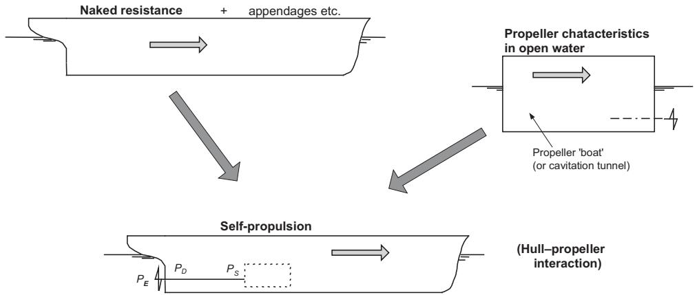

flowchart

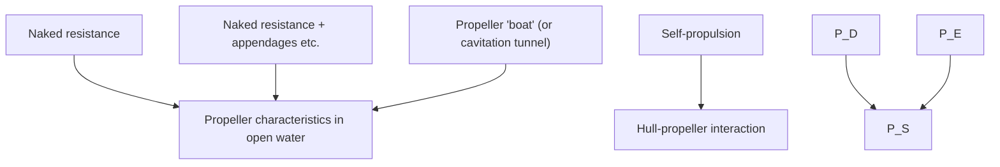
```mermaid
graph TD
    A["Naked resistance"] --> B["Propeller characteristics in open water"]
    C["Naked resistance + appendages etc."] --> B
    D["Self-propulsion"] --> E["Hull-propeller interaction"]
    F["Propeller 'boat' (or cavitation tunnel)"] --> B
    G["P_D"] --> H["P_S"]
    I["P_E"] --> H
```

Figure 2.1. Components of ship powering – main considerations.

A fundamental requirement of any ship propulsion system is the efficient conversion of the power (P) available from the main propulsion engine(s) [prime mover] into useful thrust (T) to propel the ship at the required speed (V), Figure 2.2.

There are several forms of main propulsion engines including:

Diesel.

Gas turbine.

Steam turbine.

Electric.

(And variants / combinations of these).

and various propulsors (generally variants of a propeller) which convert the power into useful thrust, including:

Propeller, fixed pitch (FP).

Propeller, controllable pitch (CP).

Ducted propeller.

Waterjet.

Azimuthing podded units.

(And variants of these).

Each type of propulsion engine and propulsor has its own advantages and disadvantages, and applications and limitations, including such fundamental attributes as size, cost and efficiency. All of the these propulsion options are in current use and the choice of a particular propulsion engine and propulsor will depend on the ship type and its design and operational requirements. Propulsors and propulsion machinery are described in Chapters 11 and 13.

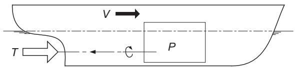

text_image

V
T
C
P

Figure 2.2. Conversion of power to thrust.

The overall assessment of the marine propulsion system for a particular vessel will therefore require:

(1) A knowledge of the required thrust (T) at a speed (V), and its conversion into required power (P),   
(2) A knowledge and assessment of the physical properties and efficiencies of the available propulsion engines,   
(3) The assessment of the various propulsors and engine-propulsor layouts.

# 2.3 Definitions

(1) Effective power $( P _ { E } )$ = power required to tow the ship at the required speed   
= total resistance × ship speed   
$= { R _ { T } } \times { V _ { S } }$   
(2) Thrust power $( P _ { T } )$ = propeller thrust × speed past propeller   
$= T \times V _ { a }$   
(3) Delivered power $( P _ { D } )$ = power required to be delivered to the propulsion unit (at the tailshaft)   
(4) Quasi-propulsive coefficient $\left( \mathrm { Q P C } \right) \left( \eta _ { D } \right) = \frac { \mathrm { e f f e c t i v e ~ p o w e r } } { \mathrm { d e l i v e r e d ~ p o w e r } } = \frac { P _ { E } } { P _ { D } } .$ PE

The total installed power will exceed the delivered power by the amount of power lost in the transmission system (shafting and gearing losses), and by a design power margin to allow for roughness, fouling and weather, i.e.

(5) Transmission Efficiency $( \eta _ { T } ) = \frac { \mathrm { d e l i v e r e d p o w e r } } { \mathrm { p o w e r r e q u i r e d a t e n g i n e } } , \mathrm { h e n c e } ,$

(6) Installed power $( P _ { I } ) = \frac { P _ { E } } { \eta _ { D } } \times \frac { I } { \eta _ { T } } +$ margin (roughness, fouling and weather)

The powering problem is thus separated into three parts:

(1) The estimation of effective power   
(2) The estimation of QPC (ηD)   
(3) The estimation of required power margins

The estimation of the effective power requirement involves the estimation of the total resistance or drag of the ship made up of:

1. Main hull naked resistance.   
3. Air resistance of the hull above water.

2. Resistance of appendages such as shafting, shaft brackets, rudders, fin stabilisers and bilge keels.

The QPC depends primarily upon the efficiency of the propulsion device, but also depends on the interaction of the propulsion device and the hull. Propulsor types and their performance characteristics are described in Chapters 11, 12 and 16.

The required power margin for fouling and weather will depend on the areas of operation and likely sea conditions and will typically be between 15% and 30% of installed power. Power margins are described in Chapter 3.

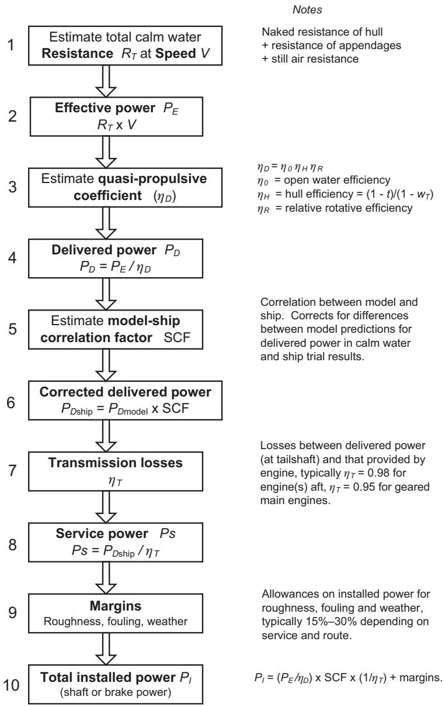

flowchart

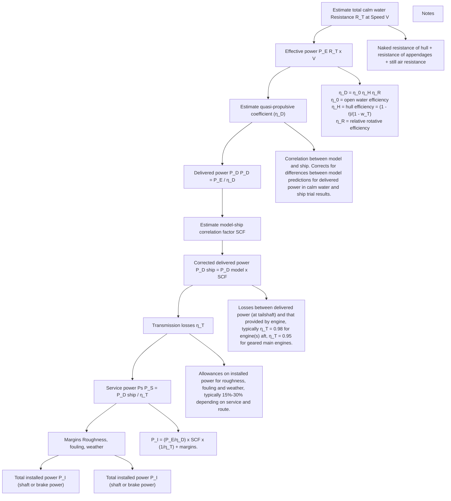
```mermaid
graph TD
    A["Estimate total calm water Resistance R_T at Speed V"] --> B["Effective power P_E R_T x V"]
    B --> C["Estimate quasi-propulsive coefficient (η_D)"]
    C --> D["Delivered power P_D P_D = P_E / η_D"]
    D --> E["Estimate model-ship correlation factor SCF"]
    E --> F["Corrected delivered power P_D ship = P_D model x SCF"]
    F --> G["Transmission losses η_T"]
    G --> H["Service power Ps P_S = P_D ship / η_T"]
    H --> I["Margins Roughness, fouling, weather"]
    I --> J["Total installed power P_I (shaft or brake power)"]
    
    note1["Notes"]
    A --> note2["Naked resistance of hull + resistance of appendages + still air resistance"]
    B --> note3["η_D = η_0 η_H η_R\nη_0 = open water efficiency\nη_H = hull efficiency = (1 - t)/(1 - w_T)\nη_R = relative rotative efficiency"]
    C --> note4["Correlation between model and ship. Corrects for differences between model predictions for delivered power in calm water and ship trial results."]
    F --> note5["Losses between delivered power (at tailshaft) and that provided by engine, typically η_T = 0.98 for engine(s) aft, η_T = 0.95 for geared main engines."]
    G --> note6["Allowances on installed power for roughness, fouling and weather, typically 15%-30% depending on service and route."]
    H --> note7["P_I = (P_E/η_D) x SCF x (1/η_T) + margins."]
    I --> note8["Total installed power P_I (shaft or brake power)"]
```

Figure 2.3. Components of the ship power estimate.

The overall components of the ship power estimate are summarised in Section 2.4.

# 2.4 Components of the Ship Power Estimate

The various components of the ship power estimate and the stages in the powering process are summarised in Figure 2.3.

The total calm water resistance is made up of the hull naked resistance, together with the resistance of appendages and the air resistance.

The propeller quasi-propulsive coefficient (QPC), or ηD, is made up of the open water, hull and relative rotative efficiencies. The hull efficiency is derived as $( 1 - t ) /$ $( 1 - w _ { T } )$ , where t is the thrust deduction factor and wT is the wake fraction.

For clarity, the model-ship correlation allowance is included as a single-ship correlation factor, SCF, applied to the overall delivered power. Current practice recommends more detailed corrections to individual components of the resistance estimate and to the components of propeller efficiency. This is discussed in Chapter 5.

Transmission losses, $\eta _ { T } ,$ between the engine and tailshaft/propeller are typically about $\eta _ { T } = 0 . 9 8$ for direct drive engines aft, and $\eta _ { T } = 0 . 9 5$ for transmission via a gearbox.

The margins in stage 9 account for the increase in resistance, hence power, due to roughness, fouling and weather. They are derived in a scientific manner for the purpose of installing propulsion machinery with an adequate reserve of power. This stage should not be seen as adding a margin to allow for uncertainty in the earlier stages of the power estimate.

The total installed power, $P _ { I }$ will typically relate to the MCR (maximum continuous rating) or CSR (continuous service rating) of the main propulsion engine, depending on the practice of the ship operator.

#

# Components of Hull Resistance

# 3.1 Physical Components of Main Hull Resistance

# 3.1.1 Physical Components

An understanding of the components of ship resistance and their behaviour is important as they are used in scaling the resistance of one ship to that of another size or, more commonly, scaling resistance from tests at model size to full size. Such resistance estimates are subsequently used in estimating the required propulsive power.

Observation of a ship moving through water indicates two features of the flow, Figure 3.1, namely that there is a wave pattern moving with the hull and there is a region of turbulent flow building up along the length of the hull and extending as a wake behind the hull.

Both of these features of the flow absorb energy from the hull and, hence, constitute a resistance force on the hull. This resistance force is transmitted to the hull as a distribution of pressure and shear forces over the hull; the shear stress arises because of the viscous property of the water.

This leads to the first possible physical breakdown of resistance which considers the forces acting:

# (1) Frictional resistance

The fore and aft components of the tangential shear forces τ acting on each element of the hull surface, Figure 3.2, can be summed over the hull to produce the total shear resistance or frictional resistance.

# (2) Pressure resistance

The fore and aft components of the pressure force P acting on each element of hull surface, Figure 3.2, can be summed over the hull to produce a total pressure resistance.

The frictional drag arises purely because of the viscosity, but the pressure drag is due in part to viscous effects and to hull wavemaking.

An alternative physical breakdown of resistance considers energy dissipation.

# (3) Total viscous resistance

text_image

Wake
Wave pattern

Figure 3.1. Waves and wake.

Bernoulli’s theorem (see Appendix A1.5) states that $\begin{array} { r } { \frac { P } { g } + \frac { V ^ { 2 } } { 2 g } + h = H } \end{array}$ and, in the absence of viscous forces, H is constant throughout the flow. By means of a Pitot tube, local total head can be measured. Since losses in total head are due to ˆ viscous forces, it is possible to measure the total viscous resistance by measuring the total head loss in the wake behind the hull, Figure 3.3.

This resistance will include the skin frictional resistance and part of the pressure resistance force, since the total head losses in the flow along the hull due to viscous forces result in a pressure loss over the afterbody which gives rise to a resistance due to pressure forces.

# (4) Total wave resistance

The wave pattern created by the hull can be measured and analysed into its component waves. The energy required to sustain each wave component can be estimated and, hence, the total wave resistance component obtained.

Thus, by physical measurement it is possible to identify the following methods of breaking down the total resistance of a hull:

1. Pressure resistance  frictional resistance   
2. Viscous resistance  remainder   
3. Wave resistance remainder

These three can be combined to give a final resistance breakdown as:

$$
\begin{array}{l} \text { Total   resistance } = \quad \text { Frictional   resistance } \\ + \text {   Viscous   pressure   resistance   } \\ + \text { Wave   resistance } \\ \end{array}
$$

The experimental methods used to derive the individual components of resistance are described in Chapter 7.

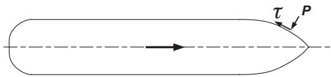

text_image

τ
P

Figure 3.2. Frictional and pressure forces.

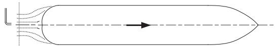

natural_image

Pure diagram of a cylindrical object with internal flow lines and an arrow, no text or symbols present

Figure 3.3. Measurement of total viscous resistance.

It should also be noted that each of the resistance components obeys a different set of scaling laws and the problem of scaling is made more complex because of interaction between these components.

A summary of these basic hydrodynamic components of ship resistance is shown in Figure 3.4. When considering the forces acting, the total resistance is made up of the sum of the tangential shear and normal pressure forces acting on the wetted surface of the vessel, as shown in Figure 3.2 and at the top of Figure 3.4. When considering energy dissipation, the total resistance is made up of the sum of the energy dissipated in the wake and the energy used in the creation of waves, as shown in Figure 3.1 and at the bottom of Figure 3.4.

Figure 3.5 shows a more detailed breakdown of the basic resistance components together with other contributing components, including wave breaking, spray, transom and induced resistance. The total skin friction in Figure 3.5 has been divided into two-dimensional flat plate friction and three-dimensional effects. This is used to illustrate the breakdown in respect to some model-to-ship extrapolation methods, discussed in Chapter 4, which use flat plate friction data.

Wave breaking and spray can be important in high-speed craft and, in the case of the catamaran, significant wave breaking may occur between the hulls at particular speeds. Wave breaking and spray should form part of the total wavemaking

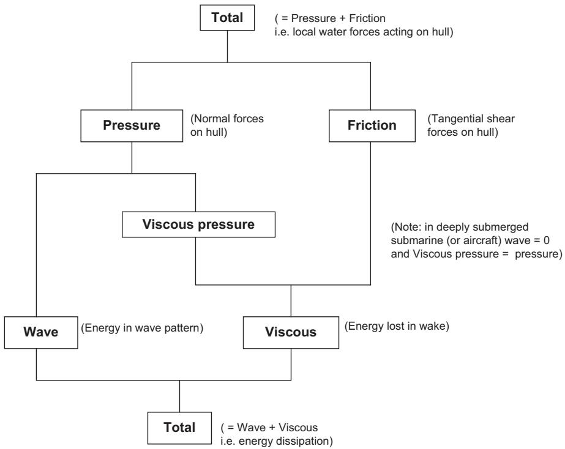

flowchart

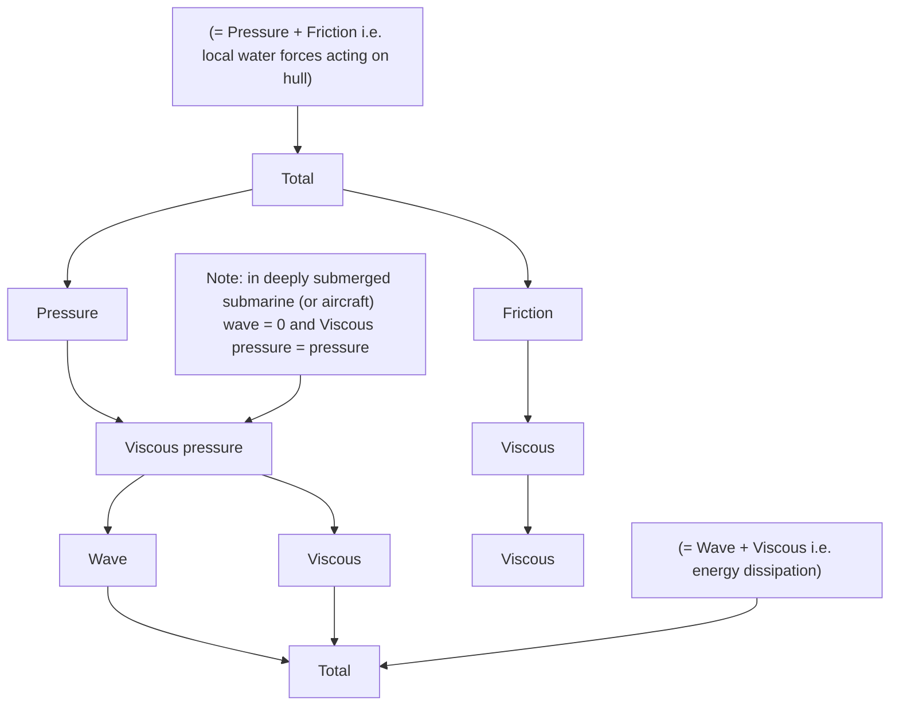
```mermaid
graph TD
    A["Total"] --> B["Pressure"]
    A --> C["Friction"]
    B --> D["Viscous pressure"]
    C --> E["Viscous"]
    D --> F["Wave"]
    D --> G["Viscous"]
    E --> H["Viscous"]
    F --> I["Total"]
    G --> I
    note1["Note: in deeply submerged submarine (or aircraft) wave = 0 and Viscous pressure = pressure"] --> D
    note2[" (= Pressure + Friction i.e. local water forces acting on hull) "] --> A
    note3[" (= Wave + Viscous i.e. energy dissipation) "] --> I
```

Figure 3.4. Basic resistance components.

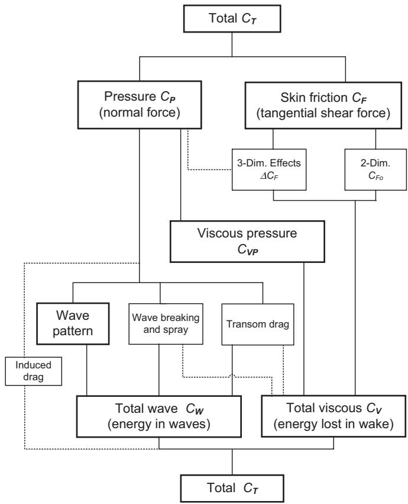

flowchart

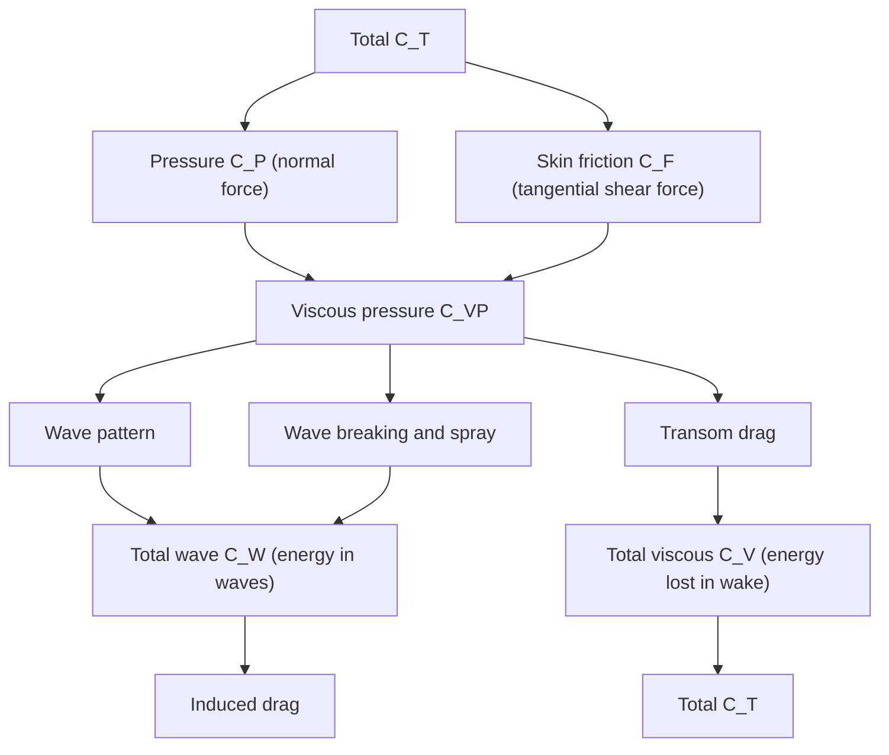
```mermaid
graph TD
    A["Total C_T"] --> B["Pressure C_P (normal force)"]
    A --> C["Skin friction C_F (tangential shear force)"]
    B --> D["Viscous pressure C_VP"]
    C --> D
    D --> E["Wave pattern"]
    D --> F["Wave breaking and spray"]
    D --> G["Transom drag"]
    E --> H["Total wave C_W (energy in waves)"]
    F --> H
    G --> I["Total viscous C_V (energy lost in wake)"]
    H --> J["Induced drag"]
    I --> K["Total C_T"]
```

Figure 3.5. Detailed resistance components.

resistance, but, in practice, this energy will normally be lost in the wake; the dotted line in Figure 3.5 illustrates this effect.

The transom stern, used on most high-speed vessels, is included as a pressure drag component. It is likely that the large low-pressure area directly behind the transom, which causes the transom to be at atmospheric pressure rather than stagnation pressure, causes waves and wave breaking and spray which are not fully transmitted to the far field. Again, this energy is likely to be lost in the wake, as illustrated by the dotted line in Figure 3.5.

Induced drag will be generated in the case of yachts, resulting from the lift produced by keels and rudders. Catamarans can also create induced drag because of the asymmetric nature of the flow between and over their hulls and the resulting production of lift or sideforce on the individual hulls. An investigation reported in [3.1] indicates that the influence of induced drag for catamarans is likely to be very small. Multihulls, such as catamarans or trimarans, will also have wave resistance interaction between the hulls, which may be favourable or unfavourable, depending on ship speed and separation of the hulls.

Lackenby [3.2] provides further useful and detailed discussions of the components of ship resistance and their interdependence, whilst [3.3 and 3.4] pay particular attention to the resistance components of catamarans.

The following comments are made on the resistance components of some highspeed craft and sailing vessels.

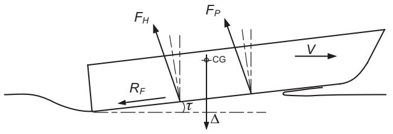

text_image

F_H
F_P
CG
V
R_F
τ
Δ

Figure 3.6. Planing craft forces.

# 3.1.1.1 Planing Craft

The basic forces acting are shown in Figure 3.6 where, for a trim angle τ , $F _ { P }$ is the pressure force over the wetted surface, $F _ { H }$ is the hydrostatic force acting at the centre of pressure of the hull and $R _ { F }$ is the skin friction resistance. Trim τ has an important influence on drag and, for efficient planing, τ is small. As the speed of planing is increased, the wetted length and consequently the wedge volume decrease rapidly, lift becomes mainly dynamic and $F _ { H } \ll F _ { P }$ . A reasonable proportion of buoyant reaction should be maintained, for example in the interests of seakeeping.

The resistance components may be summarised as

$$
R _ {T} = R _ {F} + R _ {W} + R _ {I}, \tag {3.1}
$$

where $R _ { I }$ is the drag resulting from the inclination of the pressure force $F _ { P }$ to the vertical. At high speed, wavemaking resistance $R _ { W }$ becomes small. Spray resistance may be important, depending on hull shape and the use of spray rails, according to Savitsky et al. [3.5]. The physics of planing and the forces acting are described in some detail in [3.6] and [3.7]. The estimation of the resistance of planing craft is described in Chapter 10.

# 3.1.1.2 Sailing Vessels

The sailing vessel has the same basic resistance components as a displacement or semi-displacement craft, together with extra components. The fundamental extra component incurred by a sailing vessel is the induced drag resulting from the lift produced by the keel(s) and rudder(s) when moving at a yaw angle. The production of lift is fundamental to resisting the sideforce(s) produced by the sails, Figure 11.12. Some consider the resistance due to heel a separate resistance, to be added to the upright resistance. Further information on sailing vessels may be obtained from [3.8] and [3.9]. The estimation of the resistance of sailing craft is outlined in Chapter 10.

# 3.1.1.3 Hovercraft and Hydrofoils

Hovercraft (air cushion vehicles) and hydrofoil craft have resistance components that are different from those of displacement and semi-displacement ships and require separate treatment. Outline summaries of their components are given as follows:

(1) Air cushion vehicles (including surface effect ships or sidewall hovercraft).

The components of resistance for air cushion vehicles include

(a) Aerodynamic (or profile) drag of the above-water vehicle   
(b) Inlet momentum drag due to the ingestion of air through the lift fan, where the air must acquire the craft speed   
(c) Drag due to trim

The trim drag is the resultant force of two physical effects: 1) the wave drag due to the pressure in the cushion creating a wave pattern and 2) outlet momentum effects due to a variable air gap at the base of the cushion and consequent non-uniform air outflow. The air gap is usually larger at the stern than at the bow and thus the outflow momentum creates a forward thrust.

(d) Other resistance components include sidewall drag (if present) for surface effect ships, water appendage drag (if any) and intermittent water contact and spray generation

For hovercraft with no sidewalls, the intermittent water contact and spray generation drag are usually estimated as that drag not accounted for by (a)–(c).

The total power estimate for air cushion vehicles will consist of the propulsive power required to overcome the resistance components (a)–(d) and the lift fan power required to sustain the cushion pressure necessary to support the craft weight at the required (design) air gap. The basic physics, design and performance characteristics of hovercraft are described in some detail in [3.6], [3.7], [3.10] and [3.12].

(2) Hydrofoil-supported craft

Hydrofoil-supported craft experience the same resistance components on their hulls as conventional semi-displacement and planing hulls at lower speeds and as they progress to being supported by the foils. In addition to the hull resistance, there is the resistance due to the foil support system. This consists of the drag of the non-lifting components such as vertical support struts, antiventilation fences, rudders and propeller shafting and the drag of the lifting foils. The lifting foil drag comprises the profile drag of the foil section, the induced drag caused by generation of lift and the wavemaking drag of the foil beneath the free surface. The lift generated by a foil in proximity to the free surface is reduced from that of a deeply immersed foil because of wavemaking, flow curvature and a reduction in onset flow speed. The induced drag is increased relative to a deeply submerged foil as a result of the free surface increasing the downwash. The basic physics, design and performance characteristics of hydrofoil craft are described in some detail in [3.6], [3.7] and [3.11].

# 3.1.2 Momentum Analysis of Flow Around Hull

# 3.1.2.1 Basic Considerations

The resistance of the hull is clearly related to the momentum changes taking place in the flow. An analysis of these momentum changes provides a precise definition of what is meant by each resistance component in terms of energy dissipation.

text_image

z = 0
U
z = - h
A
B
y
x
w
v
U + u

Figure 3.7. Momentum analysis.

Consider a model held in a stream of speed U in a rectangular channel of breadth b and depth h, Figure 3.7. The momentum changes in the fluid passing through the ‘control box’ from plane A to plane B downstream can be related to the forces on the control planes and the model.

Let the free-surface elevation be $z = \zeta ( x , y )$ where $\zeta$ is taken as small, and let the disturbance to the flow have a velocity $\boldsymbol { q } = ( u , v , w )$ . For continuity of flow, flow through A = flow through B,

$$
U \cdot b \cdot h = \int_ {- b / 2} ^ {b / 2} \int_ {- h} ^ {\varsigma_ {B}} (U + u) d z d y \tag {3.2}
$$

where $\varsigma _ { B } = \varsigma ( x _ { B } , y )$ . The momentum flowing out through B in unit time is

$$
M _ {B} = \rho \int_ {- b / 2} ^ {b / 2} \int_ {- h} ^ {\varsigma_ {B}} (U + u) ^ {2} d z d y. \tag {3.3}
$$

The momentum flowing in through A in unit time is

$$
M _ {A} = \rho U ^ {2} \cdot b \cdot h.
$$

Substituting for U · b · h from Equation (3.2),

$$
M _ {A} = \rho \int_ {- b / 2} ^ {b / 2} \int_ {- h} ^ {\varsigma_ {B}} U (U + u) d z d y. \tag {3.4}
$$

Hence, the rate of change of momentum of fluid flowing through the control box is $M _ { B } - M _ { A }$

i.e.

$$
M _ {B} - M _ {A} = \rho \int_ {- b / 2} ^ {b / 2} \int_ {- h} ^ {\varsigma_ {B}} u (U + u) d z d y. \tag {3.5}
$$

This rate of change of momentum can be equated to the forces on the fluid in the control box and, neglecting friction on the walls, these are R (hull resistance), $F _ { A }$ (pressure force on plane A) and $F _ { B }$ (pressure force on plane B). Therefore, $M _ { B } \mathrm { ~ - ~ }$ $M _ { A } = - \ R + F _ { A } - F _ { B }$ .

Bernoulli’s equation can be used to derive expressions for the pressures at A and B, hence, for forces $F _ { A }$ and $F _ { B }$

$$
H = \frac {P _ {A}}{\rho} + \frac {1}{2} U ^ {2} + g z = \frac {P _ {B}}{\rho} + \frac {1}{2} [ (U + u) ^ {2} + v ^ {2} + w ^ {2} ] + g z _ {B} + \frac {\Delta P}{\rho}, \tag {3.6}
$$

where $\Delta P$ is the loss of pressure in the boundary layer and $\Delta P / \rho$ is the corresponding loss in total head.

If atmospheric pressure is taken as zero, then ahead of the model, $P _ { A } = 0$ on the free surface where $z = 0$ and the constant term is $\begin{array} { r } { H = \frac { 1 } { 2 } U ^ { 2 } } \end{array}$ . Hence,

$$
P _ {B} = - \rho \left\{g z _ {B} + \frac {\Delta P}{\rho} + \frac {1}{2} [ 2 U u + u ^ {2} + v ^ {2} + w ^ {2} ] \right\}. \tag {3.7}
$$

On the upstream control plane,

$$
F _ {A} = \int_ {- b / 2} ^ {b / 2} \int_ {- h} ^ {0} P _ {A} d z d y = - \rho g \int_ {- b / 2} ^ {b / 2} \int_ {- h} ^ {0} z d z d y = \frac {1}{2} \rho g \int_ {- b / 2} ^ {b / 2} h ^ {2} d y = \frac {1}{2} \rho g b h ^ {2}. \tag {3.8}
$$

On the downstream control plane, using Equation (3.7),

$$
\begin{array}{l} F _ {B} = \int_ {- b / 2} ^ {b / 2} \int_ {- h} ^ {\varsigma_ {B}} P _ {B} d z d y = - \rho \int_ {- b / 2} ^ {b / 2} \int_ {- h} ^ {\varsigma_ {B}} \left\{g z _ {B} + \frac {\Delta P}{\rho} + \frac {1}{2} [ 2 U u + u ^ {2} + v ^ {2} + w ^ {2} ] \right\} d z d y \\ = \frac {1}{2} \rho g \int_ {- b / 2} ^ {b / 2} \left(h ^ {2} - \varsigma_ {B} ^ {2}\right) d y - \int_ {- b / 2} ^ {b / 2} \int_ {- h} ^ {\varsigma_ {B}} \Delta P d z d y - \frac {\rho}{2} \int_ {- b / 2} ^ {b / 2} \int_ {- h} ^ {\varsigma_ {B}} [ 2 U u + u ^ {2} + v ^ {2} + w ^ {2} ] d z d y. \tag {3.9} \\ \end{array}
$$

The resistance force $R = F _ { A } - F _ { B } - \left( M _ { B } - M _ { A } \right)$ .

Substituting for the various terms from Equations (3.5), (3.8) and (3.9),

$$
R = \left\{\frac {1}{2} \rho g \int_ {- b / 2} ^ {b / 2} \varsigma_ {B} ^ {2} d y + \frac {1}{2} \rho \int_ {- b / 2} ^ {b / 2} \int_ {- h} ^ {\varsigma_ {B}} (v ^ {2} + w ^ {2} - u ^ {2}) d z d y \right\} + \int_ {- b / 2} ^ {b / 2} \int_ {- h} ^ {\varsigma_ {B}} \Delta P d z d y. \tag {3.10}
$$

In this equation, the first two terms may be broadly associated with wave pattern drag, although the perturbation velocities v, w and u, which are due mainly to wave orbital velocities, are also due partly to induced velocities arising from the viscous shear in the boundary layer. The third term in the equation is due to viscous drag.

The use of the first two terms in the analysis of wave pattern measurements, and in formulating a wave resistance theory, are described in Chapters 7 and 9.

# 3.1.2.2 Identification of Induced Drag

A ficticious velocity component $u ^ { \prime }$ may be defined by the following equation:

$$
\frac {p _ {B}}{\rho} + \frac {1}{2} [ (U + u ^ {\prime}) ^ {2} + v ^ {2} + w ^ {2} ] + g z _ {B} = \frac {1}{2} U ^ {2}, \tag {3.11}
$$

where $u ^ { \prime }$ is the equivalent velocity component required for no head loss in the boundary layer. This equation can be compared with Equation (3.6). $u ^ { \prime }$ can be calculated from $\Delta p$ since, by comparing Equations (3.6) and (3.11),

$$
\frac {1}{2} \rho (U + u ^ {\prime}) ^ {2} = \frac {1}{2} \rho (U + u) ^ {2} + \Delta p,
$$

then

$$
\begin{array}{l} R = \frac {1}{2} \rho g \int_ {- b / 2} ^ {b / 2} \zeta_ {B} ^ {2} d y + \frac {1}{2} \rho \int_ {- b / 2} ^ {b / 2} \int_ {- h} ^ {\zeta_ {B}} (v ^ {2} + w ^ {2} - u ^ {\prime 2}) d z d y \\ + \iint_ {\text { wake }} \left\{\Delta p + \frac {1}{2} \rho (u ^ {2} - u ^ {2}) \right\} d z d y. \tag {3.12} \\ \end{array}
$$

The integrand of the last term $\{ \Delta p + { \textstyle { \frac { 1 } { 2 } } } \rho ( u ^ { \prime 2 } - u ^ { 2 } ) \}$ is different from zero only inside the wake region for which $\Delta p \neq 0$ . In order to separate induced drag from wave resistance, the velocity components $( u _ { I } , v _ { I } , w _ { I } )$ of the wave orbit motion can be introduced. [The components $( u , v , w )$ include both wave orbit and induced velocities.] The velocity components $( u _ { I } , v _ { I } , w _ { I } )$ can be calculated by measuring the freesurface wave pattern, and applying linearised potential theory.

It should be noted that, from measurements of wave elevation $\zeta$ and perturbation velocities u, v, w over plane B, the wave resistance could be determined. However, measurements of subsurface velocities are difficult to make, so linearised potential theory is used, in effect, to deduce these velocities from the more conveniently measured surface wave pattern $\zeta$ . This is discussed in Chapter 7 and Appendix A2. Recent developments in PIV techniques would allow subsurface velocities to be measured; see Chapter 7.

Substituting $( u _ { I } , v _ { I } , w _ { I } )$ into the last Equation (3.12) for $R ,$

$$
R = R _ {W} + R _ {V} + R _ {I},
$$

where $R _ { W }$ is the wave pattern resistance

$$
R _ {W} = \frac {1}{2} \rho g \int_ {- b / 2} ^ {b / 2} \zeta_ {B} ^ {2} d y + \frac {1}{2} \rho \int_ {- b / 2} ^ {b / 2} \int_ {- h} ^ {\zeta_ {B}} (v _ {I} ^ {2} + w _ {I} ^ {2} - u _ {I} ^ {2}) d z d y, \tag {3.13}
$$

$R _ { V }$ is the total viscous resistance

$$
R _ {V} = \iint_ {\text { wake }} \left\{\Delta p + \frac {1}{2} \rho (u ^ {2} - u ^ {2}) \right\} d z d y \tag {3.14}
$$

and $R _ { I }$ is the induced resistance

$$
R _ {I} = \frac {1}{2} \rho \int_ {- b / 2} ^ {b / 2} \int_ {- h} ^ {\zeta_ {B}} (v ^ {2} - v _ {I} ^ {2} + w ^ {2} - w _ {I} ^ {2} - u ^ {\prime 2} + u _ {I} ^ {2}) d z d y. \tag {3.15}
$$

For normal ship forms, $R _ { I }$ is expected to be small.

# 3.1.3 Systems of Coefficients Used in Ship Powering

Two principal forms of presentation of resistance data are in current use. These are the ITTC form of coefficients, which were based mainly on those already in use in the aeronautical field, and the Froude coefficients [3.13].

# 3.1.3.1 ITTC Coefficients

The resistance coefficient is

$$
C _ {T} = \frac {R _ {T}}{1 / 2 \rho S V ^ {2}}, \tag {3.16}
$$

where

$R _ { T }$ = total resistance force,

S = wetted surface area of hull, V = ship speed,

$C _ { T }$ = total resistance coefficient or, for various components,

$C _ { F }$ = frictional resistance coefficient (flat plate),

$C _ { V }$ = total viscous drag coefficient, including form allowance, and

CW wave resistance coefficient.

The speed parameter is Froude number

$$
F r = \frac {V}{\sqrt {g L}},
$$

and the hull form parameters include the wetted area coefficient

$$
C _ {S} = \frac {S}{\sqrt {\nabla L}}
$$

and the slenderness coefficient

$$
C _ {\nabla} = \frac {\nabla}{L ^ {3}},
$$

where

$$
\nabla = \text { immersed   volume }, L = \text { ship   length }.
$$

# 3.1.3.2 Froude Coefficients

A basic design requirement is to have the least power for given displacement  and speed V. Froude chose a resistance coefficient representing a ‘resistance per ton displacement’ (i.e. R/). He used a circular notation to represent non-dimensional coefficients, describing them as -K , -L , -S , -M and -C .

The speed parameters include

$$
ⓧ = \frac {V}{\sqrt {\frac {g \nabla^ {1 / 3}}{4 \pi}}} \quad \text { and } \quad Ⓛ = \frac {V}{\sqrt {\frac {g L}{4 \pi}}} \propto F r
$$

(4π was introduced for wave speed considerations). The hull form parameters include the wetted area coefficient

$$
Ⓢ = \frac {S}{\nabla^ {2 / 3}},
$$

and the slenderness coefficient

$$
Ⓜ = \frac {L}{\nabla^ {1 / 3}}
$$

(now generally referred to as the length-displacement ratio). The resistance coefficient is

$$
Ⓒ = \frac {1 0 0 0 R}{\Delta Ⓚ ^ {2}}, \tag {3.17}
$$

i.e. resistance per ton $R / \Delta \ ( R = \mathrm { r e s i s t a n c e }$ force and $\Delta = \mathrm { d i s p l a c e m e n t }$ force, same units).

The 1000 was introduced to create a more convenient value for $©$ . The subscript for each component is as for $C _ { T } , C _ { F } ,$ etc., i.e. $© _ { \mathrm { { T } } } , \nobreakspace \textcircled { \mathrm { { C } } } _ { \mathrm { { F } } }$ . The presentation $R / \Delta$ was also used by Taylor in the United States in his original presentation of the Taylor standard series [3.14].

Some other useful relationships include the following: in imperial units,

$$
Ⓒ = \frac {4 2 7 . 1 P _ {E}}{\Delta^ {2 / 3} V ^ {3}} \tag {3.18}
$$

$( P _ { E } = h p , \Delta = \mathrm { t o n s } , V = \mathrm { k n o t s } )$ , and in metric units,

$$
Ⓒ = \frac {5 7 9 . 8 P _ {E}}{\Delta^ {2 / 3} V ^ {3}} \tag {3.19}
$$

$( P _ { E } = \mathbf { k } \mathbf { W } , \Delta = \mathrm { { t o n n e s } } , V = \mathrm { { k n o t s } , \mathrm { { a n d } ~ u s i n g } ~ 1 ~ k n o t = 0 . 5 1 4 4 ~ m / s ) . }$

The following relationships between the ITTC and Froude coefficients allow conversion between the two presentations:

$$
C _ {s} = S / (\nabla . L) ^ {1 / 2},
$$

$$
ⓢ = S / \nabla^ {2 / 3},
$$

$$
Ⓜ = L / \nabla^ {1 / 3},
$$

$$
C s = Ⓢ / Ⓜ ^ {1 / 2} \text {   and   }
$$

$$
C _ {T} = (8 \times \pi / 1 0 0 0) \times Ⓒ / ⓢ.
$$

It should be noted that for fixed  and $V ,$ the smallest $©$ implies least $P _ { E } .$ , Equation (3.19), but since S can change for a fixed , this is not true for $C _ { T }$ , Equation (3.16).

It is for such reasons that other forms of presentation have been proposed. These have been summarised by Lackenby [3.15] and Telfer [3.16]. Lackenby and Telfer argue that, from a design point of view, resistance per unit of displacement $( \mathrm { i } . \mathrm { e } . R / \Delta )$ , plotted to a suitable base, should be used in order to rank alternative hull shapes correctly. In this case, taking $R / \Delta$ as the criterion of performance, and using only displacement and length as characteristics of ship size, the permissible systems of presentation are

$( 1 ) ~ { \frac { R } { \Delta ^ { 2 / 3 } V ^ { 2 } } } ~ ( \mathrm { e . g . ~ } \bigodot ) { \mathrm { ~ o n ~ } } { \frac { V } { \Delta ^ { 1 / 6 } } } ~ ( \mathrm { e . g . ~ } \bigodot )$ 1/6   
$( 2 ) ~ { \frac { R L } { \Delta V ^ { 2 } } } \operatorname { o n } F r$ V2 on Fr   
$( 3 ) \ { \frac { R } { \Delta } } \ { \mathrm { o n ~ e i t h e r } } \ { \frac { V } { \Delta ^ { 1 / 6 } } } \ { \mathrm { o r } } \ F r .$ or Fr. 1/6

Consistent units must be used in all cases in order to preserve the non-dimensional nature of the coefficients.

For skin friction resistance, Lackenby points out that the most useful characteristic of ship size to be included is wetted surface area, which is one of the primary variables affecting this resistance.

A coefficient of the form $C _ { F } = R _ { F } / 1 / 2 \rho S V ^ { 2 }$ is then acceptable. In which case, the other components of resistance also have to be in this form. This is the form of the ITTC presentation, described earlier, which has been in common use for many years.

It is also important to be able to understand and apply the circular coefficient notation, because many useful data have been published in $\textcircled{ C } - F r$ format, such as the BSRA series of resistance tests discussed in Chapter 10.

Doust [3.17] uses the resistance coefficient $R L / \Delta V ^ { 2 }$ in his regression analysis of trawler resistance data. Sabit [3.18] also uses this coefficient in his regression analysis of the BSRA series resistance data, which is discussed in Chapter 10. It is useful to note that this coefficient is related to C as follows:

$$
\frac {R L}{\Delta V ^ {2}} = 2. 4 9 3 8 Ⓒ \times \left[ \frac {L}{\nabla^ {1 / 3}} \right]. \tag {3.20}
$$

# 3.1.4 Measurement of Model Total Resistance

# 3.1.4.1 Displacement Ships

The model resistance to motion is measured in a test tank, also termed a towing tank. The first tank to be used solely for such tests was established by William Froude in 1871 [3.19]. The model is attached to a moving carriage and towed down the tank at a set constant speed (V), and the model resistance (R) is measured, Figure 3.8. The towing force will normally be in line with the propeller shafting in order to minimise unwanted trim moments during a run. The model is normally free to trim and to rise/sink vertically and the amount of sinkage and trim during a run is measured. Typical resistance test measurements, as described in ITTC (2002)

text_image

Carriage
V
Carriage rails
Dynamometer
R
Model
Water level

Figure 3.8. Schematic layout of model towing test.

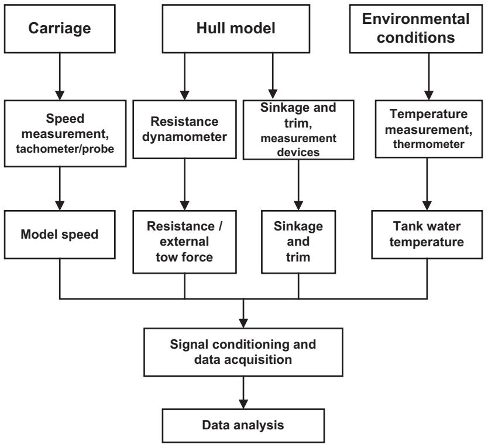

flowchart

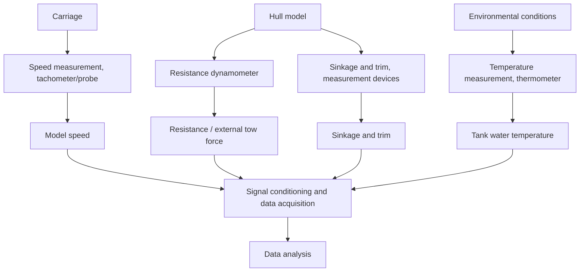
```mermaid
graph TD
    A["Carriage"] --> B["Speed measurement, tachometer/probe"]
    C["Hull model"] --> D["Resistance dynamometer"]
    C --> E["Sinkage and trim, measurement devices"]
    F["Environmental conditions"] --> G["Temperature measurement, thermometer"]
    B --> H["Model speed"]
    D --> I["Resistance / external tow force"]
    E --> J["Sinkage and trim"]
    G --> K["Tank water temperature"]
    H --> L["Signal conditioning and data acquisition"]
    I --> L
    J --> L
    K --> L
    L --> M["Data analysis"]
```

Figure 3.9. Resistance test measurements.

[3.20], are shown in Figure 3.9. An example of a model undergoing a resistance test is shown in Figure 3.10.

Model speed is measured either from the carriage wheel speed (speed over ground), from the time taken for the carriage to travel over a known distance (speed over ground) or by a Pitot-static tube or water speed meter attached to the carriage ˆ ahead of the model (speed through water). If the model speed remains constant during the course of a run and the tank water does not develop any significant drift during the test programme, then all of these methods are equally satisfactory.

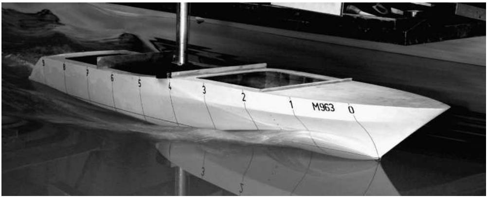

natural_image

Black-and-white photo of a white boat with visible hull number M963 and numbered markings, resting on water surface (no text or symbols on the boat itself)

Figure 3.10. Model resistance test. Photograph courtesy of WUMTIA and Dubois Naval Architects Ltd.

The total hydrodynamic resistance to motion (R) is measured by a dynamometer. The dynamometer may be mechanical, using a spring balance and counterbalance weights, or electromechanical, where the displacement of flexures is measured by a linear voltmeter or inductor, or where the flexures have strain gauges attached. In all cases, a calibration procedure of measured output against an applied calibration force will take place before and after the experiments. Twocomponent (resistance and sideforce) or three-component (resistance, sideforce and yaw moment [torque]) dynamometers may be used in the case of yawed tests for assessing manoeuvring performance and for the testing of yacht models.

Model test tanks vary in size from about 60 m × 3.7 m × 2 m water depth up to 300 m × 12 m × 3 m water depth, with carriage speeds ranging from 3 m/s to 15 m/s. A ‘beach’ is normally incorporated at the end of the tank (and sometimes down the sides) in order to absorb the waves created by the model and to minimise wave reflections back down the tank. This also helps to minimise the settling time between runs.

Circulating water channels are also employed for resistance and other tests. In this case, in Figure 3.8, the model is static and the water is circulated at speed V. Such channels often have glass side and bottom windows, allowing good flow visualisation studies. They are also useful when multiple measurements need to be carried out, such as hull surface pressure or skin friction measurements (see Chapter 7). Circulating water channels need a lot of power to circulate the water, compared say with a wind tunnel, given the density of water is about 1000 times that of air.

For many years, models were made from paraffin wax. Current materials used for models include wood, high-density closed-cell foam and fibre reinforced plastic (FRP). The models, or plugs for plastic models, will normally be shaped using a multiple-axis cutting machine. Each model material has its merits, depending on producibility, accuracy, weight and cost. Model size may vary from about 1.6 m in a 60-m tank up to 9 m in a 300-m tank.

The flow over the fore end of the model may be laminar, whilst turbulent flow would be expected on the full-scale ship. Turbulence stimulators will normally be incorporated near the fore end of the model in order to stimulate turbulent flow. Turbulence stimulators may be in the form of sand strips, trip wires or trip studs located about 5% aft of the fore end of the model. Trip studs will typically be of 3 mm diameter and 2.5 mm height and spaced at 25 mm intervals. Trip wires will typically be of 0.90 mm diameter. For further details see [3.20], [3.21], [3.22] and [3.23]. Corrections for the parasitic drag of the turbulence stimulators will normally be carried out; a detailed investigation of such corrections is contained in Appendix A of [3.24]. One common correction is to assume that the deficit in resistance due to laminar flow ahead of the trip wire or studs balances the additional parasitic drag of the wire or studs.

In order to minimise scale effect, the model size should be as large as possible without incurring significant interference (blockage) effects from the walls and tank floor. A typical assumption is that the model cross-sectional area should not be more than 0.5% of the tank cross-sectional area. Blockage speed corrections may be applied if necessary. Typical blockage corrections include those proposed by Hughes [3.25] and Scott [3.26], [3.27]. The correction proposed by Hughes (in its

approximate form) is as follows:

$$
\frac {\Delta V}{V} = \frac {m}{1 - m - F r _ {h} ^ {2}}, \tag {3.21}
$$

where $\Delta V$ is the correction to speed, $F r _ { h }$ is the depth Froude number.

$$
F r _ {h} = \frac {V}{\sqrt {g h}},
$$

where h is the tank water depth and m is the mean blockage

$$
m = \frac {a}{A _ {T}} = \frac {\nabla}{L _ {M} A _ {T}},
$$

where $L _ { M }$ and  are model length and displacement, and $A _ { T }$ is the tank section area.

The temperature of the test water will be measured in the course of the experiments and appropriate corrections made to the resistance data. Viscosity values for water are a function of water temperature. As a result, Re and, hence, $C _ { F }$ vary with water temperature in a manner which can be calculated from published viscosity values (see Tables A1.1 and A1.2 in Appendix A1). Standard practice is to correct all model results to, and predict ship performance for, 15◦C (59◦F), i.e.

$$
C _ {T (1 5)} = C _ {T (T)} + \left(C _ {F (1 5)} - C _ {F (T)}\right). \tag {3.22}
$$

The ITTC recommended procedure for the standard resistance test is described in ITTC 2002 [3.20]. Uncertainty analysis of the results should take place, involving the accuracy of the model and the measurements of resistance and speed. A background to uncertainty analysis is given in [3.28], and recommended procedures are described in [3.20].

After the various corrections are made (e.g. to speed and temperature), the model resistance test results will normally be presented in terms of the total resistance coefficient $C _ { T } : = R / \% S V ^ { 2 } )$ against Froude number $F r ,$ where S is the static wetted area of the model. Extrapolation of the model results to full scale is described in Chapter 4.

# 3.1.4.2 High-Speed Craft and Sailing Vessels

High-speed craft and sailing yachts develop changes in running attitude when under way. Compared with a conventional displacement hull, this leads to a number of extra topics and measurements to be considered in the course of a resistance test. The changes and measurements required are reviewed in [3.29]. Because of the higher speeds involved, such craft may also be subject to shallow water effects and corrections may be required, as discussed in Chapters 5 and 6. The typical requirements for testing high-speed craft, compared with displacement hulls, are outlined as follows:

# (i) Semi-displacement craft

High-speed semi-displacement craft develop changes in running trim and wetted surface area when under way. The semi-displacement craft is normally tested free to heave (vertical motion) and trim, and the heave/sinkage and trim are measured during the course of a test run. Running wetted surface area may be measured during a run, for example, by noting the wave profile against a grid on the hull (or by a photograph) and applying the new girths (up to the wave profile) to the body plan. There are conflicting opinions as to whether static or running wetted area should be used in the analysis. Appendix B in [3.24] examines this problem in some detail and concludes that, for examination of the physics, the running wetted area should be used, whilst for practical powering purposes, the use of the static wetted area is satisfactory. It can be noted that, for this reason, standard series test data for semidisplacement craft, such as those for the NPL Series and Series 64, are presented in terms of static wetted area.

text_image

Tow force
W
x₂
R
Model free to trim and heave
x₁
T
Expected thrust line

Figure 3.11. Trim compensation for offset tow line.

Since the high-speed semi-displacement craft is sensitive to trim, the position and direction of the tow force has to be considered carefully. The tow force should be located at the longitudinal centre of gravity (LCG) and in the line of the expected thrust line, otherwise erroneous trim changes can occur. If, for practical reasons, the tow force is not in line with the required thrust line, then a compensating moment can be applied, shown schematically in Figure 3.11. If the tow line is offset from the thrust line by a distance $x _ { 1 }$ , then a compensating moment $\left( w \times x _ { 2 } \right)$ can be applied, where $( w \times x _ { 2 } ) = ( R \times x _ { 1 } )$ . This process leads to an effective shift in the LCG. w will normally be part of the (movable) ballast in the model, and the lever x2 can be changed as necessary to allow for the change in R with change in speed. Such corrections will also be applied as necessary to inclined shaft/thrust lines.

# (ii) Planing craft

A planing craft will normally be run free to heave and trim. Such craft incur significant changes in trim with speed, and the position and direction of the tow line is important. Like the semi-displacement craft, compensating moments may have to be applied, Figure 3.11. A friction moment correction may also be applied to allow for the difference in friction coefficients between model and ship (model is too large). If $R _ { F m }$ is the model frictional resistance corresponding to $C _ { F m }$ and $R _ { F m s }$ is the model frictional resistance corresponding to $C _ { F s }$ , then, assuming the friction drag acts at half draught, a counterbalance moment can be used to counteract the force $\left( R _ { F m } - R _ { F m s } \right)$ . This correction is analogous to the skin friction correction in the model self-propulsion experiment, Chapter 8.

Care has to be taken with the location of turbulence stimulation on planing craft, where the wetted length varies with speed. An alternative is to use struts or wires in the water upstream of the model [3.29].

Air resistance can be significant in high-speed model tests and corrections to the resistance data may be necessary. The actual air speed under the carriage should be measured with the model removed. Some tanks include the superstructure and then make suitable corrections based on airflow speed and suitable drag coefficients. The air resistance can also cause trimming moments, which should be corrected by an effective shift of LCG.

Planing craft incur significant changes in wetted surface area with change in speed. Accurate measurement of the running wetted area and estimation of the frictional resistance is fundamental to the data analysis and extrapolation process. Methods of measuring the running wetted surface area include noting the position of the fore end of the wetted area on the centreline and at the side chines, using underwater photography, or using a clear bottom on the model. An alternative is to apply the running draught and trim to the hydrostatic information on wetted area, although this approach tends not to be very accurate. The spray and spray root at the leading edge of the wetted area can lead to difficulties in differentiating between spray and the solid water in contact with the hull.

For high-speed craft, appendage drag normally represents a larger proportion of total resistance than for conventional displacement hulls. If high-speed craft are tested without appendages, then the estimated trim moments caused by the appendages should be compensated by an effective change in LCG.

Captive tests on planing craft have been employed. For fully captive tests, the model is fixed in heave and trim whilst, for partially captive tests, the model is tested free to heave over a range of fixed trims [3.29]. Heave and trim moment are measured, together with lift and drag. Required values will be obtained through interpolation of the test data in the postanalysis process.

Renilson [3.30] provides a useful review of the problems associated with measuring the hydrodynamic performance of high-speed craft.

# (iii) Sailing craft

A yacht model will normally be tested in a semi-captive arrangement, where it is free to heave and trim, but fixed in heel and yaw. A special dynamometer is required that is capable of measuring resistance, sideforce, heave, trim, roll moment and yaw moment. Measurement of the moments allows the centre of lateral resistance (CLR) to be determined. A typical test programme entails a matrix of tests covering a range of heel and yaw angles over a range of speeds. Small negative angles of heel and yaw will also be tested to check for any asymmetry. Typical test procedures, dynamometers and model requirements are described by Claughton et al. [3.8].

In the case of a yacht, the position and line of the tow force is particularly important because the actual position, when under sail, is at the centre of effort of the sails. This leads to trim and heel moments and a downward component of force. As the model tow fitting will be at or in the model, these moments and force will need to be compensated for during the model test. An alternative approach that has been used is to apply the model tow force at the estimated position of the centre of effort of the sails, with the model set at a predetermined yaw angle. This is a more elegant approach, although it does require more complex model arrangements [3.8].

text_image

+P
-V
-P
+V
→
+P
-V

Figure 3.12. Pressure variations around a body.

# 3.1.5 Transverse Wave Interference

# 3.1.5.1 Waves

When a submerged body travels through a fluid, pressure variations are created around the body, Figure 3.12.

Near a free surface, the pressure variations manifest themselves by changes in the fluid level, creating waves, Figure 3.13. With a body moving through a stationary fluid, the waves travel at the same speed as the body.

# 3.1.5.2 Kelvin Wave Pattern

The Kelvin wave is a mathematical form of the wave system created by a travelling pressure point source at the free surface, see Chapter 7. The wave system formed is made up of transverse waves and divergent waves, Figure 3.14. The heights of the divergent cusps diminish at a slower rate than transverse waves, and the divergent waves are more predominant towards the rear. The wave system travels at a speed according to the gravity–wave speed relationship, see Appendix A1.8,

$$
\mathrm{V} = \sqrt {\frac {\mathrm{g} \lambda}{2 \pi}}, \tag {3.23}
$$

and with wavelength of the transverse waves,

$$
\lambda = \frac {2 \pi V ^ {2}}{g}. \tag {3.24}
$$

The ship wave system is determined mainly by the peaks of high and low pressure, or pressure points, that occur in the pressure distribution around the hull. The overall ship wave system may be considered as being created by a number of travelling pressure points, with the Kelvin wave pattern being a reasonable representation of the actual ship wave system. The ship waves will not follow the Kelvin pattern exactly due to the non-linearities in the waves and viscous effects (e.g. stern wave damping) not allowed for in the Kelvin wave theory. This is discussed further in Chapter 9. It should also be noted that the foregoing analysis is strictly for deep water. Shallow water has significant effects on the wave pattern and these are discussed in Chapter 6.

text_image

Stern wave system
Bow wave system

Figure 3.13. Ship waves.

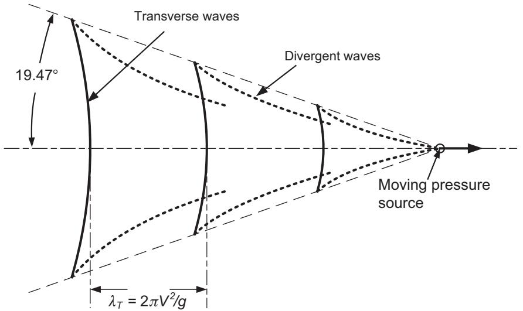

text_image

Transverse waves
19.47°
Divergent waves
Moving pressure source
λT = 2πV²/g

Figure 3.14. Kelvin wave pattern.

# 3.1.5.3 Wave System Interference

The pressure peaks around the hull create a wave system with a crest (trough for negative pressure peak) situated some distance behind the point of high pressure. The wave system for a ship is built up of four components, Figure 3.15.

(1) Bow wave system, with a high pressure at entry, starting with a crest.   
(2) Forward shoulder system, due to low pressure between forward and amidships.

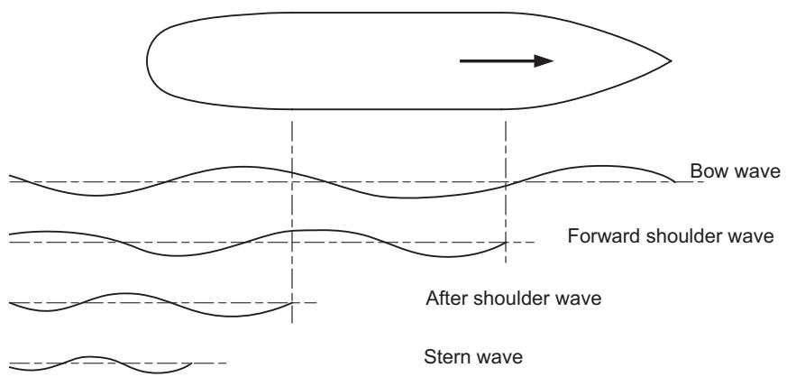

text_image

Bow wave
Forward shoulder wave
After shoulder wave
Stern wave

Figure 3.15. Components of wave system.

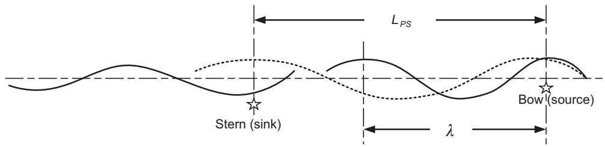

text_image

L_PS
Stern (sink)
λ
Bow (source)

Figure 3.16. Bow and stern wave systems.

(3) After shoulder system, due to low pressure at amidships and higher pressure at stern.   
(4) Stern wave system, due to rising pressure gradient and decreasing velocity, starting with a trough.

Components (1) and (4) will occur at ‘fixed’ places, whilst the magnitude and position of (2) and (3) will depend on the form and the position of the shoulders. Components (2) and (3) are usually associated with fuller forms with hard shoulders.

The amplitudes of the newly formed stern system are superimposed on those of the bow system. Waves move forward with the speed of the ship, and phasing will alter with speed, Figure 3.16. For example, as speed is increased, the length of the bow wave will increase (Equation (3.24)) until it coincides and interferes with the stern wave.

As a result of these wave interference effects, ship resistance curves exhibit an oscillatory nature with change in speed, that is, they exhibit humps and hollows, Figure 3.17. Humps will occur when the crests (or troughs) coincide (reinforcement), and hollows occur when a trough coincides with a crest (cancellation).

# 3.1.5.4 Speeds for Humps and Hollows

The analysis is based on the bow and stern transverse wave systems, Figure 3.16, where $L _ { P S }$ is the pressure source separation. Now $L _ { P S } = k \times L _ { B P }$ , where k is typically 0.80–0.95, depending on the fullness of the vessel. The lengths λ of the individual waves are given by Equation (3.24).

It is clear from Figure 3.16 that when the bow wavelength λ is equal to $L _ { P S } .$ , the crest from the bow wave is on the stern trough and wave cancellation will occur. At lower speeds there will be several wavelengths within $L _ { P S }$ and the following analysis indicates the speeds when favourable interference (hollows) or unfavourable interference (humps) are likely to occur.

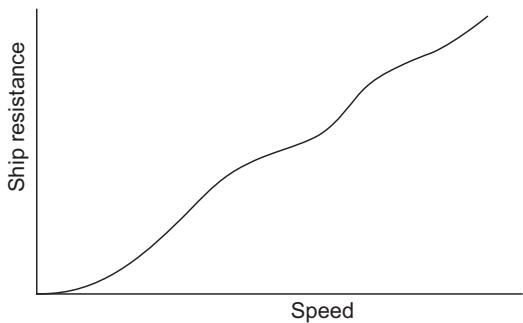

line

| Speed | Ship resistance |
|-------|-----------------|
| Low   | 0               |
| Mid   | Increasing      |
| High  | Increasing      |

Figure 3.17. Humps and hollows in ship resistance curve.

Table 3.1. Speeds for humps and hollows 

<table><tr><td></td><td colspan="4">Humps</td></tr><tr><td> $\lambda / L_{PS}$ </td><td>2</td><td>2/3</td><td>2/5</td><td>2/7</td></tr><tr><td> $Fr$ </td><td>0.535</td><td>0.309</td><td>0.239</td><td>0.202</td></tr><tr><td></td><td colspan="4">Hollows</td></tr><tr><td> $\lambda / L_{PS}$ </td><td>1</td><td>1/2</td><td>1/3</td><td>1/4</td></tr><tr><td> $Fr$ </td><td>0.378</td><td>0.268</td><td>0.219</td><td>0.189</td></tr></table>

Hollows: Bow crests coincide with stern troughs approximately at

$$
\frac {\lambda}{L _ {P S}} = 1, \frac {1}{2}, \frac {1}{3}, \frac {1}{4} \dots \dots .
$$

Humps: Bow crests coincide with stern crests approximately at:

$$
\frac {\lambda}{L _ {P S}} = 2, \frac {2}{3}, \frac {2}{5}, \frac {2}{7} \dots \dots .
$$

The speeds for humps and hollows may be related to the ship speed as follows: Ship Froude number

$$
F _ {r} = \frac {V}{\sqrt {g \cdot L _ {B P}}}
$$

and

$$
V ^ {2} = F r ^ {2} g L _ {B P} = F r ^ {2} g \frac {L _ {P S}}{k}
$$

and, from Equation (3.24), the wavelength $\lambda = \frac { 2 \pi } { g } V ^ { 2 } = \frac { 2 \pi } { g } F r ^ { 2 } g \frac { L _ { P S } } { k }$ and

$$
F r = \sqrt {\frac {k}{2 \pi}} \cdot \sqrt {\frac {\lambda}{L _ {P S}}}. \tag {3.25}
$$

If say $k = 0 . 9 0$ , then speeds for humps and hollows would occur as shown in Table 3.1. The values of speed in Table 3.1 are based only on the transverse waves. The diverging waves can change these speeds a little, leading to higher values for humps and hollows.

At the design stage it is desirable to choose the design ship length and/or speed to avoid resistance curve humps. This would, in particular, include avoiding the humps at or around Froude numbers of 0.30, the so-called prismatic hump and 0.50, the so-called main hump. Alternatively, a redistribution of displacement volume may be possible. For example, with a decrease in midship area $( C _ { M } )$ and an increase in prismatic coefficient $( C _ { P } )$ , displacement is moved nearer the ends, with changes in the position of the pressure sources and, hence, wave interference. Furthermore, a decrease in bow wavemaking may be achieved by careful design of the entrance and sectional area curve (SAC) slope, or by the use of a bulbous bow for wave cancellation. These aspects are discussed further under hull form design in Chapter 14.

The wave characteristics described in this section are strictly for deep water. The effects of shallow water are discussed in Chapter 6.

# 3.1.6 Dimensional Analysis and Scaling

# 3.1.6.1 Dimensional Analysis

In addition to the physical approach to the separation of total resistance into identifiable components, the methods of dimensional analysis may also be applied [3.31], [3.32]. Physical variables and their dimensions are as follows:

<table><tr><td>Hull resistance:</td><td> $R_{T}$ </td><td> $\frac{ML}{T^{2}}$  (force),</td></tr><tr><td>Hull speed:</td><td> $V$ </td><td> $\frac{L}{T}$  (velocity),</td></tr><tr><td>Hull size:</td><td> $L$ </td><td></td></tr><tr><td>Fluid density:</td><td> $\rho$ </td><td> $\frac{M}{L^{3}}$  (mass/unit volume),</td></tr><tr><td>Fluid viscosity:</td><td> $\mu$ </td><td> $\frac{M}{LT}$  (stress/rate of strain),</td></tr><tr><td>Acceleration due to gravity:</td><td> $g$ </td><td> $\frac{M}{T^{2}}$  (acceleration).</td></tr></table>

According to the methods of dimensional analysis, the relationship between the quantities may be expressed as

$$
f (R _ {T}, V, L, \rho , \mu , g, \alpha_ {i}) = 0 \mathrm{or}
$$

$$
R _ {T} = f (V, L, \rho , \mu , g, \alpha_ {i}), \tag {3.26}
$$

where $\alpha _ { i }$ are non-dimensional parameters of hull shape.

If geometrically similar models are considered, the method of dimensional analysis yields

$$
\frac {R _ {T}}{L ^ {2} V ^ {2} \rho} = k \left[ \left(\frac {v}{V L}\right) ^ {x} \cdot \left(\frac {g L}{V ^ {2}}\right) ^ {y} \right], \tag {3.27}
$$

where $\begin{array} { r } { v = \frac { \mu } { \rho } } \end{array}$ , and

$$
\frac {R _ {T}}{L ^ {2} V ^ {2} \rho} = k \left[ R e ^ {x} F r ^ {y} \right], \tag {3.28}
$$

or say $C _ { T } = f ( R e , F r )$ , where

$$
C _ {T} = \frac {R _ {T}}{0 . 5 S V ^ {2}}, \tag {3.29}
$$

where S = hull wetted surface area and $S \propto L ^ { 2 }$ for geometrically similar hulls (geosims), and 0.5 in the denominator does not disturb the non-dimensionality, where

$\begin{array} { r } { R e = \frac { V L } { v } } \end{array}$ is the Reynolds number, and

$\begin{array} { r } { F r = \frac { V } { \sqrt { g L } } } \end{array}$ Fr = √VgL is the Froude number.

Hence, for complete dynamic similarity between two hull sizes (e.g. model and ship), three conditions must apply.

1. Shape parameters $\alpha _ { i }$ must be the same. This implies that geometric similarity is required

2. Reynolds numbers must be the same   
3. Froude numbers must be the same

The last two conditions imply:

$$
\frac {V _ {1} L _ {1}}{v _ {1}} = \frac {V _ {2} L _ {2}}{v _ {2}} \quad \text { and } \quad \frac {V _ {1}}{\sqrt {g _ {1} L _ {1}}} = \frac {V _ {2}}{\sqrt {g _ {2} L _ {2}}}
$$

i.e.

$$
\frac {L _ {1} \sqrt {g _ {1} L _ {1}}}{v _ {1}} = \frac {L _ {2} \sqrt {g _ {2} L _ {2}}}{v _ {2}} \mathrm{or}
$$

$$
\frac {g _ {1} L _ {1} ^ {3}}{v _ {1}} = \frac {g _ {2} L _ {2} ^ {3}}{v _ {2}} \mathrm{or}
$$

$$
\frac {v _ {1}}{v _ {2}} = \left[ \frac {L _ {1}}{L _ {2}} \right] ^ {3 / 2} \tag {3.30}
$$

for constant g. Hence, complete similarity cannot be obtained without a large change in g or fluid viscosity ν, and the ship scaling problem basically arises because complete similarity is not possible between model and ship.

The scaling problem can be simplified to some extent by keeping Re or Fr constant. For example, with constant Re,

$$
\frac {V _ {1} L _ {1}}{v _ {1}} = \frac {V _ {2} L _ {2}}{v _ {2}},
$$

i.e.

$$
\frac {V _ {1}}{V _ {2}} = \frac {L _ {2} v _ {1}}{L _ {1} v _ {2}} = \frac {L _ {2}}{L _ {1}}
$$

if the fluid medium is water in both cases. If the model scale is say $\begin{array} { r } { \frac { L _ { 2 } } { L _ { 1 } } = 2 5 . } \end{array}$ , then $\begin{array} { r } { \frac { V _ { 1 } } { V _ { 2 } } = 2 5 , } \end{array}$ , i.e. the model speed is 25 times faster than the ship, which is impractical.

With constant Fr,

$$
\frac {V _ {1}}{\sqrt {g _ {1} L _ {1}}} = \frac {V _ {2}}{\sqrt {g _ {2} L _ {2}}},
$$

i.e.

$$
\frac {V _ {1}}{V _ {2}} = \sqrt {\frac {L _ {1}}{L _ {2}}} = \frac {1}{5}
$$

for 1/25th scale, then the model speed is 1/5th that of the ship, which is a practical solution.

Hence, in practice, scaling between model and ship is carried out at constant Fr. At constant Fr,

$$
\frac {R e _ {1}}{R e _ {2}} = \frac {V _ {1} L _ {1}}{\nu_ {1}} \cdot \frac {\nu_ {2}}{V _ {2} L _ {2}} = \frac {\nu_ {2}}{\nu_ {1}} \cdot \frac {L _ {1} ^ {3 / 2}}{L _ {2} ^ {3 / 2}}.
$$

Hence with a 1/25th scale, $\begin{array} { r } { \frac { R e _ { 1 } } { R e _ { 2 } } = \frac { 1 } { 1 2 5 } } \end{array}$ and Re for the ship is much larger than Re for the model.

The scaling equation, Equation (3.28): $C _ { T } = k [ R e ^ { x } \cdot F r ^ { y } ]$ can be expanded and rewritten as

$$
C _ {T} = f _ {1} (R e) + f _ {2} (F r) + f _ {3} (R e \cdot F r), \tag {3.31}
$$

that is, parts dependent on Reynolds number (broadly speaking, identifiable with viscous resistance), Froude number (broadly identifiable with wave resistance) and a remainder dependent on both Re and $F r$ .

In practice, a physical breakdown of resistance into components is not available, and such components have to be identified from the character of the total resistance of the model. The methods of doing this assume that $f _ { 3 } ( R e \cdot F r )$ is negligibly small, i.e. it is assumed that

$$
C _ {T} = f _ {1} (R e) + f _ {2} (F r). \tag {3.32}
$$

It is noted that if gravitational effects are neglected, dimensional analysis yields $C _ { T } = f ( R e )$ and if viscous effects are neglected, $C _ { T } = f \left( F r \right)$ ; hence, the breakdown as shown is not unreasonable.

However, Re and Fr can be broadly identified with viscous resistance and wavemaking resistance, but since the stern wave is suppressed by boundary layer growth, the wave resistance is not independent of Re. Also, the viscous resistance depends on the pressure distribution around the hull, which is itself dependent on wavemaking. Hence, viscous resistance is not independent of $F r ,$ and the dimensional breakdown of resistance generally assumed for practical scaling is not identical to the actual physical breakdown.

# 3.1.6.2 Froude’s Approach

The foregoing breakdown of resistance is basically that suggested by Froude working in the 1860s [3.19] and [3.33], although he was unaware of the dimensional methods discussed. He assumed that

${ \mathrm { t o t a l ~ r e s i s t a n c e } } = { \mathrm { s k i n ~ f r i c t i o n } } + { \mathrm { \{ w a v e m a k i n g ~ a n d ~ p r e s s u r e ~ f o r m \} } }$

or skin friction + ‘the rest’, which he termed residuary,

i.e.

$$
C _ {T} = C _ {F} + C _ {R}. \tag {3.33}
$$

The skin friction, $C _ { F } ,$ , is estimated from data for a flat plate of the same length, wetted surface and velocity of model or ship.

The difference between the skin friction resistance and the total resistance gives the residuary resistance, $C _ { R }$ . Hence, the part dependent on Reynolds number, $R e ,$ , is separately determined and the model test is carried out at the corresponding velocity which gives equality of Froude number, $F r ,$ for ship and model; hence, dynamic similarity for the wavemaking (or residuary) resistance is obtained. Hence, if the residuary resistance is considered:

$$
R _ {R} = \rho V ^ {2} L ^ {2} f _ {2} \bigg [ \frac {V}{\sqrt {g L}} \bigg ].
$$

For the model,

$$
R _ {R m} = \rho V _ {m} ^ {2} L _ {m} ^ {2} f _ {2} \left[ \frac {V _ {m}}{\sqrt {g L _ {m}}} \right].
$$

For the ship,

$$
R _ {R s} = \rho V _ {s} ^ {2} L _ {s} ^ {2} f _ {2} \left[ \frac {V _ {s}}{\sqrt {g L _ {s}}} \right],
$$

where $\rho$ is common, $g$ is constant and $f _ { 2 }$ is the same for the ship and model. It follows that if

$$
\frac {V _ {m}}{\sqrt {L _ {m}}} = \frac {V _ {s}}{\sqrt {L _ {s}}}, \quad \mathrm{or} \quad \frac {V _ {m} ^ {2}}{V _ {s} ^ {2}} = \frac {L _ {m}}{L _ {s}},
$$

then

$$
\frac {R _ {R m}}{R _ {R s}} = \frac {V _ {m} ^ {2}}{V _ {s} ^ {2}} \cdot \frac {L _ {m} ^ {2}}{L _ {s} ^ {2}} = \frac {L _ {m} ^ {3}}{L _ {s} ^ {3}} = \frac {\Delta_ {m}}{\Delta_ {s}}
$$

which is Froude’s law; that is, when the speeds of the ship and model are in the ratio of the square root of their lengths, then the resistance due to wavemaking varies as their displacements.

The speed in the ratio of the square root of lengths is termed the corresponding speed. In coefficient form,

$$
C _ {T} = \frac {R _ {T}}{0 . 5 S V ^ {2}} \quad C _ {F} = \frac {R _ {F}}{0 . 5 S V ^ {2}} \quad C _ {R} = \frac {R _ {R}}{0 . 5 S V ^ {2}}.
$$

S $L ^ { 2 } , V ^ { 2 }$ L; hence, $0 . 5 S V ^ { 2 } \propto L ^ { 3 } \propto \Delta$ .

$$
\frac {C _ {R m}}{C _ {R s}} = \frac {R _ {R m}}{\Delta_ {m}} \times \frac {\Delta_ {s}}{R _ {R s}} = \frac {\Delta_ {m}}{\Delta_ {s}} \times \frac {\Delta_ {s}}{\Delta_ {m}} = 1
$$

at constant √gL. $\frac { V } { \sqrt { g L } }$ Hence, at constant √g L , $\textstyle { \frac { V } { \sqrt { g L } } } , C _ { R }$ is the same for model and ship and $C _ { R m } = C _ { R s }$ .

$\mathrm { N o w } , C _ { T m } = C _ { F m } + C _ { R m } , \quad C _ { T s } = C _ { F s } + C _ { R s } , \quad \mathrm { a n d ~ } C _ { R m } = C _ { R s } .$

Hence,

$$
C _ {T m} - C _ {T s} = C _ {F m} - C _ {F s}
$$

or

$$
C _ {T s} = C _ {T m} - (C _ {F m} - C _ {F s}), \tag {3.34}
$$

that is, change in total resistance coefficient is the change in friction coefficient, and the change in the total resistance depends on the Reynolds number, Re. In practical terms, $C _ { T m }$ is derived from a model test with a measurement of total resistance, see Section 3.1.4, $C _ { F m }$ and $C _ { F s }$ are derived from published skin friction data, see Section 4.3, and estimates of $C _ { T s }$ and ship resistance $R _ { T s }$ can then be made.

Practical applications of this methodology are described in Chapter 4, modelship extrapolation, and a worked example is given in Chapter 17.

# 3.2 Other Drag Components

# 3.2.1 Appendage Drag

# 3.2.1.1 Background

Typical appendages found on ships include rudders, stabilisers, bossings, shaft brackets, bilge keels and water inlet scoops and all these items give rise to additional resistance. The main appendages on a single-screw ship are the rudder and bilge keels, with a total appendage drag of about 2%–5%. On twin-screw vessels, the main appendages are the twin rudders, twin shafting and shaft brackets, or bossings, and bilge keels. These may amount to as much as 8%–25% depending on ship size. The resistance of appendages can be significant and some typical values, as a percentage of calm-water test resistance, are shown in Table 3.2. Typical total resistance of appendages, as a percentage of hull naked resistance, are shown in Table 3.3.

Table 3.2. Resistance of appendages, as a percentage of hull naked resistance 

<table><tr><td>Item</td><td>% of naked resistance</td></tr><tr><td>Bilge keels</td><td>2–3</td></tr><tr><td>Rudder</td><td>up to about 5 (e.g. about 2 for a cargo vessel) but may be included in hull resistance tests</td></tr><tr><td>Stabiliser fins</td><td>3</td></tr><tr><td>Shafting and brackets, or bossings</td><td>6–7</td></tr><tr><td>Condenser scoops</td><td>1</td></tr></table>

# 3.2.1.2 Factors Affecting Appendage Drag

With careful alignment, the resistance of appendages will result mainly from skin friction, based on the wetted area of the appendage. With poor alignment and/or badly designed bluff items, separated flow may occur leading to an increase in resistance. An appendage relatively near the surface may create wave resistance. Careful alignment needs a knowledge of the local flow direction. Model tests using paint streaks, tufts, flags or particle image velocimetry (PIV) and computational fluid dynamics (CFD) may be used to determine the flow direction and characteristics. This will normally be for the one design speed condition, whereas at other speeds and trim conditions cross flow may occur with a consequent increase in drag.

In addition to the correct alignment to flow, other features that affect the appendage drag include the thickness of the boundary layer in which the appendage is working and the local flow velocity past the appendage; for example, an increase of up to about 10% may occur over the bilges amidships, a decrease of up to 10% near the bow and an even bigger decrease at the stern.

Further features that affect the measurement and assessment of appendage drag at model and full scale are the type of flow over the appendage, separated flow on the appendage and velocity gradients in the flow.

Table 3.3. Total resistance of appendages as a percentage of hull naked resistance 

<table><tr><td>Vessel type</td><td>% of naked resistance</td></tr><tr><td>Single screw</td><td>2–5</td></tr><tr><td>Large fast twin screw</td><td>8–14</td></tr><tr><td>Small fast twin screw</td><td>up to 25</td></tr></table>

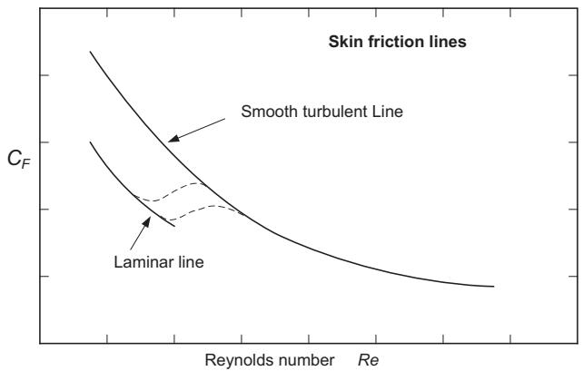

line

| Reynolds number | CF (Smooth turbulent Line) | CF (Laminar line) |
| --------------- | -------------------------- | ----------------- |
| Re              | High                       | Low               |
| Re              | Medium                     | Medium            |
| Re              | Low                        | Low               |

Figure 3.18. Skin friction lines.

# 3.2.1.3 Skin Friction Resistance

During a model test, the appendages are running at a much smaller Reynolds number than full scale, see Section 3.1.6. As a consequence, a model appendage may be operating in laminar flow, whilst the full-scale appendage is likely to be operating in turbulent flow. The skin friction resistance is lower in laminar flow than in turbulent flow, Figure 3.18, and that has to be taken into account when scaling model appendage resistance to full size.

Boundary layer velocity profiles for laminar and turbulent flows are shown in Figure 3.19. The surface shear stress $\tau _ { w }$ is defined as

$$
\tau_ {w} = \mu \left[ \frac {\partial u}{\partial y} \right] _ {y = 0}, \tag {3.35}
$$

where $\mu$ is the fluid dynamic viscosity and $\textstyle { \left[ { \frac { \partial u } { \partial \nu } } \right] }$ is the velocity gradient at the surface.

The local skin friction coefficient $C _ { F }$ is defined as

$$
C _ {F} = \frac {\tau_ {w}}{0 . 5 \rho U ^ {2}}. \tag {3.36}
$$

# 3.2.1.4 Separation Resistance

Resistance in separated flow is higher in laminar flow than in turbulent flow, Figure 3.20. This adds further problems to the scaling of appendage resistance.

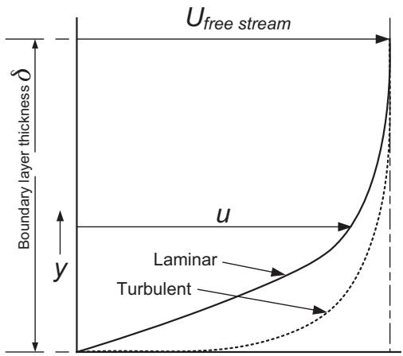

text_image

Ufree stream
Boundary layer thickness δ
u
y
Laminar
Turbulent

Figure 3.19. Boundary layer velocity profiles.

text_image

Laminar
Turbulent
Inflow

Figure 3.20. Separated flow.

# 3.2.1.5 Velocity Gradient Effects

It should be borne in mind that full-scale boundary layers are, when allowing for scale, about half as thick as model ones. Hence, the velocity gradient effects are higher on the model than on the full-scale ship.

Appendages which are wholly inside the model boundary layer may project through the ship boundary layer, Figure 3.21, and, hence, laminar conditions can exist full scale outside the boundary layer which do not exist on the model. This may increase or decrease the drag depending on whether the flow over the appendage separates. This discrepancy in the boundary layer thickness can be illustrated by the following approximate calculations for a 100 m ship travelling at 15 knots and a 1/20th scale 5 m geometrically similar tank test model.

For turbulent flow, using a 1/7th power law velocity distribution in Figure 3.19, an approximation to the boundary layer thickness δ on a flat plate is given as

$$
\frac {\delta}{x} = 0. 3 7 0 R e ^ {- 1 / 5}, \tag {3.37}
$$

where x is the distance from the leading edge.

For a 100 m ship, $R e = V L / v = 1 5 \times 0 . 5 1 4 4 \times 1 0 0 / 1 . 1 9 \times 1 0 ^ { - 6 } = 6 . 4 8 \times 1 0 ^ { 8 } .$

The approximate boundary layer thickness at the aft end of the ship is $\delta = x \times$ 0.370 $R e ^ { - 1 / 5 } = 1 0 0 \times 0 . 3 7 0 \times ( 6 . 4 8 \times 1 0 ^ { 8 } ) ^ { - 1 / 5 } = 6 4 0$ mm.

For the 5 m model, ${ \mathrm { c o r r e s p o n d i n g ~ s p e e d } } = 1 5 \times 0 . 5 1 4 4 \times 1 / { \sqrt { 2 0 } } = 1 . 7 3 { \mathrm { ~ m } } / { \mathrm { s } } .$ .

The model $R e = V L / v = 1 . 7 3 \times 5 / 1 . 1 4 \times 1 0 ^ { - 6 } = 7 . 5 9 \times 1 0 ^ { 6 }$ . The approximate boundary layer thickness for the model is $\delta = 5 \times 0 . 3 7 0 ( 7 . 5 9 \times 1 0 ^ { 6 } ) ^ { - 1 / 5 } = 7 8$ mm.

Scaling geometrically (scale 1/20) from ship to model (as would the propeller and appendages) gives a required model boundary layer thickness of only 32 mm.

Hence, the model boundary layer thickness at 78 mm is more than twice as thick as it should be, as indicated in Figure 3.21. It should be noted that Equation (3.37) is effectively for a flat plate, but may be considered adequate for ship shapes as a first approximation.

text_image

Boundary layer
Control surface
Model
Boundary layer
Control surface
Ship

Figure 3.21. Model and full-scale boundary layers.

# 3.2.1.6 Estimating Appendage Drag

The primary methods are the following:

(i) Test the hull model with and without appendages. The difference in model $C _ { T }$ with and without appendages represents the appendage drag which is then scaled to full size.   
(ii) Form factor approach. This is similar to (i), but a form factor is used, $C _ { D s } = ( 1 +$ k) $C _ { D m }$ , where the form factor (1 + k) is derived from a geosim set of appended models of varying scales. The approach is expensive and time consuming, as noted for geosim tests, in general, in Section 4.2.   
(iii) Test a larger separate model of the appendage at higher speeds. With large models of the appendages and high flow speeds, for example in a tank, circulating water channel or wind tunnel, higher Reynolds numbers, closer to full-scale values, can be achieved. This technique is typically used for ship rudders and control surfaces [3.34] and yacht keels [3.8].   
(iv) Use of empirical data and equations derived from earlier model (and limited full-scale) tests.

# 3.2.1.7 Scaling Appendage Drag

When measuring the drag of appendages attached to the model hull, each appendage runs at its own Re and has a resistance which will, theoretically, scale differently to full size. These types of effects, together with flow type, separation and velocity gradient effects mentioned earlier, make appendage scaling uncertain. The International Towing Tank Conference (ITTC) has proposed the use of a scale effect factor $\beta$ where, for appendages,

$$
C _ {D \text { ship }} = \beta C _ {D \text { model }}. \tag {3.38}
$$

The factor $\beta$ varies typically from about 0.5 to 1.0 depending on the type of appendage.

There is a small amount of actual data on scaling. In the 1940s Allan at NPL tested various scales of model in a tank [3.35]. The British Ship Research Association (BSRA), in the 1950s, jet propelled the 58 m ship Lucy Ashton, fitted with various appendages. The jet engine was mounted to the hull via a load transducer, allowing direct measurements of thrust, hence resistance, to be made. The ship results were compared with six geosim models tested at NPL, as reported by Lackenby [3.36]. From these types of test results, the $\beta$ factor is found to increase with larger-scale models, ultimately tending to 1.0 as the model length approaches the ship length. A summary of the $\beta$ values for A-brackets and open shafts, derived from the Lucy Ashton tests, are given in Table 3.4. These results are relatively consistent, whereas some of the other test results did not compare well with earlier work. The resulting information from the Lucy Ashton and other such tests tends to be inconclusive and the data have been reanalysed many times over the years.

In summary, typical tank practice is to run the model naked, then with appendages and to apply an approximate scaling law to the difference. Typical practice when using the ITTC β factor is to take bilge keels and rudders at full model value, $\beta = 1$ , and to halve the resistance of shafts and brackets, $\beta = 0 . 5 .$ . For example, streamlined appendages placed favourably along streamlines may be expected to experience frictional resistance only. This implies (with more laminar flow over appendages likely with the ship) less frictional resistance for the ship, hence half of model values, $\beta = 0 . 5 ,$ , are used as an approximation.

Table 3.4. β values for A-brackets and open shafts from the Lucy Ashton tests 

<table><tr><td rowspan="2">Ship speed (knots)</td><td colspan="6">Model</td></tr><tr><td>2.74 m</td><td>3.66 m</td><td>4.88 m</td><td>6.10 m</td><td>7.32 m</td><td>9.15 m</td></tr><tr><td>8</td><td>0.48</td><td>0.52</td><td>0.56</td><td>0.58</td><td>0.61</td><td>0.67</td></tr><tr><td>12</td><td>0.43</td><td>0.47</td><td>0.52</td><td>0.54</td><td>0.57</td><td>0.61</td></tr><tr><td>14.5</td><td>0.33</td><td>0.37</td><td>0.41</td><td>-</td><td>0.46</td><td>0.51</td></tr></table>

# 3.2.1.8 Appendage Drag Data

LOCAL FLOW SPEED. When carrying out a detailed analysis of the appendage drag, local flow speed and boundary layer characteristics are required. Approximations to speed, such as ±10% around hull, and boundary layer thickness mentioned earlier, may be applied. For appendages in the vicinity of the propeller, wake speed may be appropriate, i.e. $V a = V s \left( 1 - w _ { T } \right)$ (see Chapter 8). For rudders downstream of a propeller, Va is accelerated by 10%–20% due to the propeller and the use of Vs as a first approximation might be appropriate.

# (a) Data

A good source of data is Hoerner [3.37] who provides drag information on a wide range of items such as:

- Bluff bodies such as sonar domes.   
- Struts and bossings, including root interference drag.   
- Shielding effects of several bodies in line.   
- Local details: inlet heads, plate overlaps, gaps in flush plating.   
- Scoops, inlets.   
- Spray, ventilation, cavitation, normal and bluff bodies and hydrofoils.   
- Separation control using vortex generator guide vanes.   
- Rudders and control surfaces.

Mandel [3.38] discusses a number of the hydrodynamic aspects of appendage design.

The following provides a number of equations for estimating the drag of various appendages.

# (b) Bilge keels

The sources of resistance are the following:

- Skin friction due to additional wetted surface.   
- Interference drag at junction between bilge keel and hull.

text_image

X
Y
Z
L

Figure 3.22. Geometry of bilge keel.

ITTC recommends that the total resistance be multiplied by the ratio $( S + S _ { B K } ) / S$ , where S is the wetted area of the hull and $S _ { B K }$ is the wetted area of the bilge keels.

Drag of bilge keel according to Peck [3.39], and referring to Figure 3.22, is

$$
D _ {B} = \frac {1}{2} \rho S V ^ {2} C _ {F} \left[ 2 - \frac {2 Z}{X + Y} \right], \tag {3.39}
$$

where S is the wetted surface of the bilge keel and L is the average length of the bilge keel to be used when calculating $C _ { F }$ . When Z is large, interference drag tends to zero; when Z tends to zero (a plate bilge keel), interference drag is assumed to equal skin friction drag.

(c) Rudders, shaft brackets and stabiliser fins

Sources of drag are the following:

(1) Control surface or strut drag, $D _ { C S }$   
(2) Spray drag if rudder or strut penetrates water surface, $D _ { S P }$   
(3) Drag of palm, $D _ { P }$   
(4) Interference drag of appendage with hull, $D _ { I N T }$

Total drag may be defined as

$$
D _ {A P} = D _ {C S} + D _ {S P} + D _ {P} + D _ {I N T}. \tag {3.40}
$$

Control surface drag, $D _ { C S }$ , as proposed by Peck [3.39], is

$$
D _ {C S} = \frac {1}{2} \rho S V ^ {2} C _ {F} \left[ 1. 2 5 \frac {C m}{C f} + \frac {S}{A} + 4 0 \left(\frac {t}{C a}\right) ^ {3} \right] \times 1 0 ^ {- 1}, \tag {3.41}
$$

where Cm is the mean chord length which equals $( C f + C a )$ , Figure 3.23, used for calculation of $C _ { F } ,$ , S is the wetted area, A is frontal area of maximum section, t is the maximum thickness and V is the ship speed.

Control surface drag as proposed by Hoerner [3.37], for 2D sections,

$$
C _ {D} = C _ {F} \left[ 1 + 2 \left(\frac {t}{c}\right) + 6 0 \left(\frac {t}{c}\right) ^ {4} \right], \tag {3.42}
$$

where c is the chord length used for the calculation of $C _ { F }$ .

A number of alternative formulae are proposed by Kirkman and Kloetzli [3.40] when the appendages of the models are running in laminar or partly laminar flow.

Spray drag, $D _ { S P }$ , as proposed by Hoerner [3.37], is

$$
D _ {S P} = 0. 2 4 \frac {1}{2} \rho V ^ {2} t _ {w} ^ {2}, \tag {3.43}
$$

where $t _ { w }$ is the maximum section thickness at the water surface.

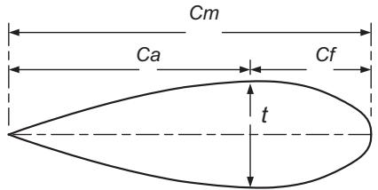

text_image

Cm
Ca
Cf
t

Figure 3.23. Geometry of strut or control surface.

Drag of palm, $D _ { P } ,$ according to Hoerner [3.37], is

$$
D _ {P} = 0. 7 5 C _ {D \text { Palm }} \left(\frac {h _ {P}}{\delta}\right) ^ {1 / 3} W h _ {P} \frac {1}{2} \rho V ^ {2}, \tag {3.44}
$$

where $h _ { P }$ is the height of palm above surface, W is the frontal width of palm, δ is the boundary layer thickness, $C _ { D \mathrm { { P a l m } } }$ is 0.65 if the palm is rectangular with rounded edges and V is the ship speed.

Interference drag, $D _ { I N T }$ , according to Hoerner [3.37], is

$$
D _ {I N T} = \frac {1}{2} \rho V ^ {2} t ^ {2} \left[ 0. 7 5 \frac {t}{c} - \frac {0 . 0 0 0 3}{(t / c) ^ {2}} \right], \tag {3.45}
$$

where t is the maximum thickness of appendage at the hull and c is the chord length of appendage at the hull.

Extensive drag data suitable for rudders, fin stabilisers and sections applicable to support struts may be found in Molland and Turnock [3.34]. A practical working value of rudder drag coefficient at zero incidence with section thickness ratio $t / c =$ 0.20–0.25 is found to be $C _ { D 0 } = 0 . 0 1 3$ [3.34], based on profile area (span × chord), not wetted area of both sides. This tends to give larger values of rudder resistance than Equations (3.41) and 3.48).

Further data are available for particular cases, such as base-ventilating sections, Tulin [3.41] and rudders with thick trailing edges, Rutgersson [3.42].

# (d) Shafts and bossings

Propeller shafts are generally inclined at some angle to the flow, Figure 3.24, which leads to lift and drag forces on the shaft and shaft bracket. Careful alignment of the shaft bracket strut is necessary in order to avoid cross flow.

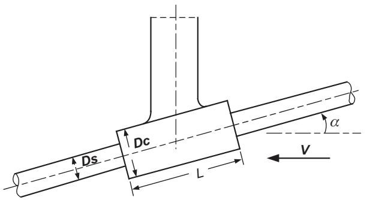

text_image

Ds
Dc
L
α
V

Figure 3.24. Shaft and bracket.

The sources of resistance are

(1) Drag of shaft, $D _ { S H }$   
(2) Pressure drag of cylindrical portion, $C _ { D P }$   
(3) Skin friction of cylindrical portion, $C _ { F }$   
(4) Drag of forward and after ends of the cylinder, $C _ { D E }$

The drag of shaft, for $R e < 5 \times 1 0 ^ { 5 }$ (based on diameter of shaft), according to Hoerner [3.37], is

$$
D _ {S H} = \frac {1}{2} \rho L _ {S H} D s V ^ {2} (1. 1 \sin^ {3} \alpha + \pi C _ {F}), \tag {3.46}
$$

where $L _ { S H }$ is the total length of shaft and bossing, $D s$ is the diameter of shaft and bossing and α is the angle of flow in degrees relative to shaft axis, Figure 3.24.

For the cylindrical portions, Kirkman and Kloetzli [3.40] offer the following equations. The equations for pressure drag, $C _ { D P }$ , are as follows:

For $R e < 1 \times 1 0 ^ { 5 } , C _ { D P } = 1 . 1 \sin ^ { 3 } \alpha$

For $1 \times 1 0 ^ { 5 } < R e < 5 \times 1 0 ^ { 5 }$ , and $\alpha > \beta , C _ { D P } = - 0 . 7 1 5 4 \log _ { 1 0 } R e + 4 . 6 7 7$ , and

For α < β, CDP = (– 0.754 log10 Re + 4.677) [sin3(1.7883 log10 Re − 7.9415) α]

For $R e > 5 \times 1 0 ^ { 5 }$ , and $0 < \alpha < 4 0 ^ { \circ } , C _ { D P } = 0 . 6 0 \sin ^ { 3 } ( 2 . 2 5 \alpha )$ and for $4 0 ^ { \circ } < \alpha <$

$$
9 0 ^ {\circ}, C _ {D P} = 0. 6 0
$$

where $R e = V D c / v , \beta = - 7 1 . 5 4 \log _ { 1 0 } R e + 4 4 7 . 7$ and the reference area is the cylinder projected area which is $( L \times D c )$ .

For friction drag, $C _ { F } ,$ the equations are as follows:

$\mathrm { F o r } \ R e < 5 \times 1 0 ^ { 5 } , C _ { F } = 1 . 3 2 7 \ R e ^ { - 0 . 5 }$

For Re > 5 × 105, CF = $\mathrm { F o r ~ } R e > 5 \times 1 0 ^ { 5 } , C _ { F } = \frac { 1 } { ( 3 . 4 6 1 \log _ { 1 0 } \ R e - 5 . 6 ) ^ { 2 } } - \frac { 1 7 0 0 } { R e }$ (3.47)

where $R e = V L c / v , L c = L / \tan \alpha , L c > L$ and the reference area is the wetted surface area which equals $\pi ~ \times$ length  diameter.

Equations for drag of ends, if applicable, $C _ { D E }$ , are the following:

For support cylinder with sharp edges, $C _ { D E } = 0 . 9 0 \cos ^ { 3 } \alpha$

For support cylinder with faired edges, $C _ { D E } = 0 . 0 1 \cos ^ { 3 } \alpha$ .

Holtrop and Mennen [3.43] provide empirical equations for a wide range of appendages and these are summarised as follows:

$$
R _ {\mathrm{APP}} = \frac {1}{2} \rho V _ {S} ^ {2} C _ {F} (1 + k _ {2}) _ {E} \sum S _ {\mathrm{APP}} + R _ {B T}, \tag {3.48}
$$

where $V _ { S }$ is ship speed, $C _ { F }$ is for the ship and is determined from the ITTC1957 line and $S _ { \mathrm { A P P } }$ is the wetted area of the appendage(s). The equivalent $( 1 + k _ { 2 } )$ value for the appendages, $( 1 + k _ { 2 } ) _ { E }$ , is determined from

$$
(1 + k _ {2}) _ {E} = \frac {\sum (1 + k _ {2}) S _ {\mathrm{APP}}}{\sum S _ {\mathrm{APP}}}. \tag {3.49}
$$

Table 3.5. Appendage form factors $( 1 + k _ { 2 } )$ 

<table><tr><td>Appendage type</td><td> $(1 + k_2)$ </td></tr><tr><td>Rudder behind skeg</td><td>1.5–2.0</td></tr><tr><td>Rudder behind stern</td><td>1.3–1.5</td></tr><tr><td>Twin-screw balanced rudders</td><td>2.8</td></tr><tr><td>Shaft brackets</td><td>3.0</td></tr><tr><td>Skeg</td><td>1.5–2.0</td></tr><tr><td>Strut bossings</td><td>3.0</td></tr><tr><td>Hull bossings</td><td>2.0</td></tr><tr><td>Shafts</td><td>2.0–4.0</td></tr><tr><td>Stabiliser fins</td><td>2.8</td></tr><tr><td>Dome</td><td>2.7</td></tr><tr><td>Bilge keels</td><td>1.4</td></tr></table>

The appendage resistance factors $( 1 + k _ { 2 } )$ are defined by Holtrop as shown in Table 3.5. The term $R _ { B T }$ in Equation (3.48) takes account of bow thrusters, if fitted, and is defined as

$$
R _ {B T} = \pi \rho V _ {S} ^ {2} d _ {T} C _ {B T O}, \tag {3.50}
$$

where $d _ { T }$ is the diameter of the thruster and the coefficient $C _ { B T O }$ lies in the range $0 . 0 0 3 \substack { - 0 . 0 1 2 }$ . When the thruster lies in the cylindrical part of the bulbous bow, $C _ { B T O } \to 0 . 0 0 3$ .

# (e) Summary

In the absence of hull model tests (tested with and without appendages), detailed estimates of appendage drag may be carried out at the appropriate Reynolds number using the equations and various data described. Alternatively, for preliminary powering estimates, use may be made of the approximate data given in Tables 3.2 and 3.3. Examples of appendage drag estimates are given in Chapter 17.

# 3.2.2 Air Resistance of Hull and Superstructure

# 3.2.2.1 Background

A ship travelling in still air experiences air resistance on its above-water hull and superstructure. The level of air resistance will depend on the size and shape of the superstructure and on ship speed. Some typical values of air resistance for different ship types, as a percentage of calm water hull resistance, are given in Table 3.6.

The air drag of the above-water hull and superstructure is generally a relatively small proportion of the total resistance. However, for a large vessel consuming large quantities of fuel, any reductions in air drag are probably worth pursuing. The air drag values shown are for the ship travelling in still air. The proportion will of course rise significantly in any form of head wind.

The air drag on the superstructure and hull above the waterline may be treated as the drag on a bluff body. Typical values of $C _ { D }$ for bluff bodies for $R e > 1 0 ^ { 3 }$ are given in Table 3.7.

Table 3.6. Examples of approximate air resistance 

<table><tr><td>Type</td><td> $L_{BP}$ (m)</td><td> $C_B$ </td><td>Dw (tonnes)</td><td>Service speed(knots)</td><td>Service power(kW)</td><td>Fr</td><td>Air drag(%)</td></tr><tr><td>Tanker</td><td>330</td><td>0.84</td><td>250,000</td><td>15</td><td>24,000</td><td>0.136</td><td>2.0</td></tr><tr><td>Tanker</td><td>174</td><td>0.80</td><td>41,000</td><td>14.5</td><td>7300</td><td>0.181</td><td>3.0</td></tr><tr><td>Bulk carrier</td><td>290</td><td>0.83</td><td>170,000</td><td>15</td><td>15,800</td><td>0.145</td><td>2.5</td></tr><tr><td>Bulk carrier</td><td>180</td><td>0.80</td><td>45,000</td><td>14</td><td>7200</td><td>0.171</td><td>3.0</td></tr><tr><td>Container</td><td>334</td><td>0.64</td><td>100,000</td><td>26</td><td>62,000</td><td>0.234</td><td>4.5</td></tr><tr><td></td><td></td><td></td><td>10,000 TEU</td><td></td><td></td><td></td><td></td></tr><tr><td>Container</td><td>232</td><td>0.65</td><td>37,000</td><td>23.5</td><td>29,000</td><td>0.253</td><td>4.0</td></tr><tr><td></td><td></td><td></td><td>3500 TEU</td><td></td><td></td><td></td><td></td></tr><tr><td>Catamaran ferry</td><td>80</td><td>0.47</td><td>650 pass</td><td>36</td><td>23,500</td><td>0.661</td><td>4.0</td></tr><tr><td></td><td></td><td></td><td>150 cars</td><td></td><td></td><td></td><td></td></tr><tr><td>Passenger ship</td><td>265</td><td>0.66</td><td>2000 pass</td><td>22</td><td>32,000</td><td>0.222</td><td>6.0</td></tr><tr><td></td><td></td><td></td><td>GRT90,000</td><td></td><td></td><td></td><td></td></tr></table>

When travelling into a wind, the ship and wind velocities and the relative velocity are defined as shown in Figure 3.25.

The resistance is

$$
R _ {A} = \frac {1}{2} \rho_ {A} C _ {D} A _ {P} V _ {A} ^ {2}, \tag {3.51}
$$

where $A _ { p }$ is the projected area perpendicular to the relative velocity of the wind to the ship, $V _ { A }$ is the relative wind and, for air, $\rho _ { A } = 1 . 2 3 \mathrm { k g } / \mathrm { m } ^ { 3 }$ , see Table A1.1.

It is noted later that results of wind tunnel tests on models of superstructures are normally presented in terms of the drag force in the ship fore and aft direction (X-axis) and based on $A _ { T } ,$ the transverse frontal area.

# 3.2.2.2 Shielding Effects

The wake behind one superstructure element can shield another element from the wind, Figure 3.26(a), or the wake from the sheerline can shield the superstructure, Figure 3.26(b).

# 3.2.2.3 Estimation of Air Drag

In general, the estimation of the wind resistance involves comparison with model data for a similar ship, or performing specific model tests in a wind tunnel. It can be noted that separation drag is not sensitive to $R e ,$ , so scaling from model tests is generally acceptable, on the basis that $C _ { D s } = C _ { D m } .$

Table 3.7. Approximate values of drag coefficient for bluff bodies, based on frontal area 

<table><tr><td>Item</td><td> $C_D$ </td></tr><tr><td>Square plates</td><td>1.1</td></tr><tr><td>Two-dimensional plate</td><td>1.9</td></tr><tr><td>Square box</td><td>0.9</td></tr><tr><td>Sphere</td><td>0.5</td></tr><tr><td>Ellipsoid, end on ( $Re 2 \times 10^5$ )</td><td>0.16</td></tr></table>

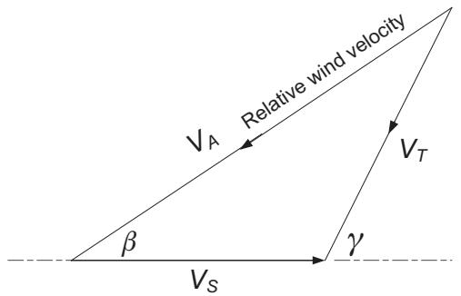

text_image

Relative wind velocity
V_A
V_T
β
γ
V_S

Figure 3.25. Vector diagram.

A typical air drag diagram for a ship model is broadly as shown in Figure 3.27. Actual wind tunnel results for different deckhouse configurations [3.44] are shown in Figure 3.28. In this particular case, $C _ { X }$ is a function of $( A _ { T } / L ^ { 2 } )$ .

Wind drag data are usually referred to the frontal area of the hull plus superstructure, i.e. transverse area $A _ { T }$ . Because of shielding effects with the wind ahead, the drag coefficient may be lower at $0 ^ { \circ }$ wind angle than at $3 0 ^ { \circ }$ wind angle, where $C _ { D }$ is usually about maximum, Figure 3.27. The drag is the fore and aft drag on the ship centreline X-axis.

In the absence of other data, wind tunnel tests on ship models indicate values of about $C _ { D } = 0 . 8 0$ for a reasonably streamlined superstructure, and about $C _ { D } =$ 0.25 for the main hull. ITTC recommends that, if no other data are available, air drag may be approximated from $C _ { A A } = 0 . 0 0 1 A _ { T } / S$ , see Chapter 5, where $A _ { T }$ is the transverse projected area above the waterline and S is the ship hull wetted area. In this case, $\begin{array} { r } { D _ { \mathrm { a i r } } = \mathbf C _ { \mathrm { A A } } \times \frac { 1 } { 2 } \rho _ { W } S V ^ { 2 } } \end{array}$ . Further typical air drag values for commercial ships can be found in Shearer and Lynn [3.45], White [3.46], Gould [3.47], Isherwood [3.48], van Berlekom [3.49], Blendermann [3.50] and Molland and Barbeau [3.51].

natural_image

Pure technical diagram showing a curved surface with hatched shading and two rectangular blocks, no text or symbols present.

Figure 3.26. (a) Shielding effects of superstructure.

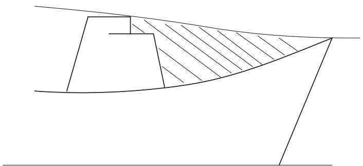

natural_image

Pure geometric line drawing with shaded triangular region and diagonal lines (no text or symbols)

Figure 3.26. (b) Shielding effects of the sheerline.

line

| Relative wind angle β | CD     |
| --------------------- | ------ |
| 90°                   | Peak   |
| 180°                  | Decreasing |

Figure 3.27. Typical air drag data from model tests.

The regression equation for the Isherwood air drag data [3.48] in the longitudinal X-axis is

$$
\begin{array}{l} C _ {X} = A _ {0} + A _ {1} \left(\frac {2 A _ {L}}{L ^ {2}}\right) + A _ {2} \left(\frac {2 A _ {T}}{B ^ {2}}\right) + A _ {3} \left(\frac {L}{B}\right) \\ + A _ {4} \left(\frac {S _ {P}}{L}\right) + A _ {5} \left(\frac {C}{L}\right) + A _ {6} (M), \tag {3.52} \\ \end{array}
$$

where

$$
C _ {X} = \frac {F _ {X}}{0 . 5 \rho_ {A} A _ {T} V _ {R} ^ {2}}, \tag {3.53}
$$

and $\rho _ { A }$ is the density of air (Table A1.1 in Appendix A1), L is the length overall, B is the beam, $A _ { L }$ is the lateral projected area, $A _ { T }$ is the transverse projected area, $S _ { P }$ is the length of perimeter of lateral projection of model (ship) excluding waterline and slender bodies such as masts and ventilators, C is the distance from the bow

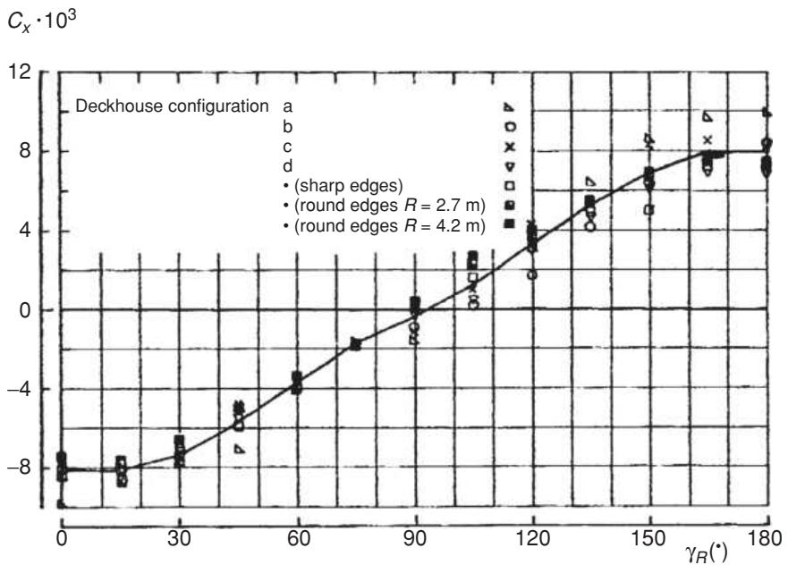

line

| γR(°) | Cx·10³ | Shape     | Edge Type       |
|-------|--------|-----------|-----------------|
| 0     | -8.0   | ▲         | (sharp edges)   |
| 30    | -7.5   | △         | (round edges R = 4.2 m) |
| 60    | -4.0   | ■         | (sharp edges)   |
| 90    | 0.0    | ○         | (round edges R = 4.2 m) |
| 120   | 4.0    | ▼         | (sharp edges)   |
| 150   | 7.0    | ×         | (round edges R = 4.2 m) |
| 180   | 8.0    | ▼         | (sharp edges)   |

Figure 3.28. Wind coefficient curves [3.44].

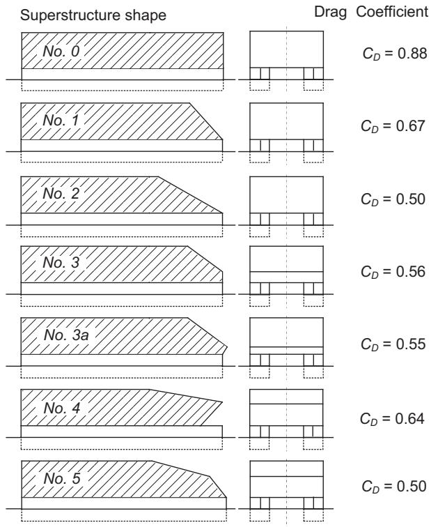

bar

| Superstructure shape | Drag Coefficient |
| --------------------- | ---------------- |
| No. 0                 | C_D = 0.88       |
| No. 1                 | C_D = 0.67       |
| No. 2                 | C_D = 0.50       |
| No. 3                 | C_D = 0.56       |
| No. 3a                | C_D = 0.55       |
| No. 4                 | C_D = 0.64       |
| No. 5                 | C_D = 0.50       |

The aerodynamic drag coefficient $C _ { D }$ is based on the total transverse frontal area of superstructure and hulls

Figure 3.29. Drag on the superstructures of fast ferries [3.51].

of the centroid of the lateral projected area, M is the number of distinct groups of masts or king posts seen in the lateral projection.

The coefficients $A _ { 0 } – A _ { 6 }$ are tabulated in Appendix A3, Table A3.1. Note, that according to the table, for 180◦ head wind, $A _ { 4 }$ and $A _ { 6 }$ are zero, and estimates of $S _ { P }$ and M are not required. For preliminary estimates, $C / L$ can be taken as 0.5.

Examples of $C _ { D }$ from wind tunnel tests on representative superstructures of fast ferries [3.51] are shown in Figure 3.29. These coefficients are suitable also for monohull fast ferries.

# 3.2.2.4 CFD Applications

CFD has been used to investigate the flow over superstructures. Most studies have concentrated on the flow characteristics rather than on the forces acting. Such studies have investigated topics such as the flow around funnel uptakes, flow aft of the superstructures of warships for helicopter landing and over leisure areas on the top decks of passenger ships (Reddy et al. [3.52], Sezer-Uzol et al. [3.53], Wakefield et al. [3.54]). Moat et al. [3.55, 3.56] investigated, numerically and experimentally, the effects of flow distortion created by the hull and superstructure and the influences on actual onboard wind speed measurements. Few studies have investigated the actual air drag forces numerically. A full review of airwakes, including experimental and computational fluid dynamic approaches, is included in ITTC [3.57].

# 3.2.2.5 Reducing Air Drag

Improvements to the superstructure drag of commercial vessels with box-shaped superstructures may be made by rounding the corners, leading to reductions in drag.

It is found that the rounding of sharp corners can be beneficial, in particular, for box-shaped bluff bodies, Hoerner [3.37] and Hucho [3.58]. However, a rounding of at least $r / B s = 0 . 0 5$ (where r is the rounding radius and $B _ { S }$ is the breadth of the superstructure) is necessary before there is a significant impact on the drag. At and above this rounding, decreases in drag of the order of 15%–20% can be achieved for rectangular box shapes, although it is unlikely such decreases can be achieved with shapes which are already fairly streamlined. It is noted that this procedure would conflict with design for production, and the use of ‘box type’ superstructure modules.

A detailed investigation into reducing the superstructure drag on large tankers is reported in [3.59].

Investigations by Molland and Barbeau [3.51] on the superstucture drag of large fast ferries indicated a reduction in drag coefficient (based on frontal area) from about 0.8 for a relatively bluff fore end down to 0.5 for a well-streamlined fore end, Figure 3.29.

# 3.2.2.6 Wind Gradient Effects

It is important to distinguish between still air resistance and resistance in a natural wind gradient. It is clear that, as air drag varies as the relative air speed squared, there will be significant increases in air drag when travelling into a wind. This is discussed further in Section 3.2.4. The relative air velocity of a ship travelling with speed Vs in still air is shown in Figure 3.30(a) and that of a ship travelling into a wind with speed Vw is shown in Figure 3.30(b).

Normally, relative wind measurements are made high up, for example, at mast head or bridge wings. Relative velocities near the water surface are much lower.

An approximation to the natural wind gradient is

$$
\frac {V}{V _ {0}} = \left(\frac {h}{h _ {0}}\right) ^ {n} \tag {3.54}
$$

text_image

Vs

Figure 3.30. (a) Relative velocity in still air.

text_image

Vw Vs

Figure 3.30. (b) Relative velocity in head wind.

text_image

V₀
b

Figure 3.31. Illustration of wind gradient effect.

where n lies between 1/5 and 1/9. This applies over the sea; the index n varies with surface condition and temperature gradient.

# 3.2.2.7 Example of Gradient Effect

Consider the case of flow over a square box, Figure 3.31. $V _ { 0 }$ is measured at the top of the box $( h = h _ { 0 } )$ . Assume $V / V _ { 0 } = ( h / h _ { 0 } ) ^ { 1 / 7 }$ and b and $C _ { D }$ are constant up the box.

Resistance in a wind gradient is

$$
R = \frac {1}{2} \rho b C _ {D} V _ {0} ^ {2} \int_ {0} ^ {h _ {0}} \left(\frac {h}{h _ {0}}\right) ^ {2 / 7} d h
$$

i.e.

$$
R = \frac {1}{2} \rho b C _ {D} \frac {V _ {0} ^ {2}}{h _ {0} ^ {2 / 7}} \left[ h ^ {9 / 7} \cdot \frac {7}{9} \right] _ {0} ^ {h _ {0}}
$$

and

$$
R = \frac {1}{2} \rho b C _ {D} V _ {0} ^ {2} \cdot \frac {7}{9} h _ {0} = \frac {7}{9} R _ {0} = 0. 7 7 8 R _ {0}. \tag {3.55}
$$

Comparative measurements on models indicate $R / R _ { 0 }$ of this order. Air drag corrections as applied to ship trial results are discussed in Section 5.4.

# 3.2.2.8 Other Wind Effects

1. With the wind off the bow, forces and moments are produced which cause the hull to make leeway, leading to a slight increase in hydrodynamic resistance; rudder angle, hence, a drag force, is required to maintain course. These forces and moments may be defined as wind-induced forces and moments but will, in general, be very small relative to the direct wind force (van Berlekom [3.44], [3.49]). Manoeuvring may be adversely affected.

2. The wind generates a surface drift on the sea of the order of 2%–3% of wind velocity. This will reduce or increase the ship speed over the ground.

# 3.2.3 Roughness and Fouling

# 3.2.3.1 Background

Drag due to hull roughness is separation drag behind each individual item of roughness. Turbulent boundary layers have a thin laminar sublayer close to the surface and this layer can smooth out the surface by flowing round small roughness without separating. Roughness only causes increasing drag if it is large enough to project through the sublayer. As Re increases (say for increasing V), the sublayer gets thinner and eventually a point is reached at which the drag coefficient ceases to follow the smooth turbulent line and becomes approximately constant, Figure 3.32. From the critical Re, Figure 3.33, increasing separation drag offsets falling $C _ { F } .$ . It should be noted that surface undulations such as slight ripples in plating will not normally cause a resistance increase because no separation is caused.

line

| Reynolds number Re | CF     |
| ------------------ | ------ |
| Low                | High   |
| Medium             | Medium |
| High               | Low    |

Figure 3.32. Effect of roughness on skin friction coefficient.

# 3.2.3.2 Density of Roughness

As the density of the roughness increases over the surface, the additional resistance caused rises until a point is reached at which shielding of one ‘grain’ by another takes place. Further increase in roughness density can, in fact, then reduce resistance.

# 3.2.3.3 Location of Roughness

Boundary layers are thicker near the stern than at the bow and thinner at the bilge than at the waterline. Roughness has more effect where the boundary layer is thin. It also has the most effect where the local flow speed is high. For small yachts and models, roughness can cause early transition from laminar to turbulent flow, but this is not significant for normal ship forms since transition may, in any case, occur as close as 1 m from the bow.

line

| Reynolds number | CF (k/I = 10⁻³) | CF (k/I = 10⁻⁴) | CF (k/I = 10⁻⁵) | CF (k/I = 10⁻⁶) |
| ---------------- | --------------- | --------------- | --------------- | --------------- |
| Critical Re      | ~10⁻⁵           | ~10⁻⁵           | ~10⁻⁵           | ~10⁻⁵           |
| Re               | ~10⁻⁶           | ~10⁻⁶           | ~10⁻⁶           | ~10⁻⁶           |

Figure 3.33. Schematic of a typical friction diagram.

Table 3.8. Roughness of different materials 

<table><tr><td>Quality of surface</td><td>Grain size,  $\mu m$  ( $= 10^{-6}$  m)</td></tr><tr><td>Plate glass</td><td> $10^{-1}$ </td></tr><tr><td>Bare steel plate</td><td>50</td></tr><tr><td>Smooth marine paint</td><td>50*</td></tr><tr><td>Marine paint + antifouling etc.</td><td>100–150</td></tr><tr><td>Galvanised steel</td><td>150</td></tr><tr><td>Hot plastic coated</td><td>250</td></tr><tr><td>Bare wood</td><td>500</td></tr><tr><td>Concrete</td><td>1000</td></tr><tr><td>Barnacles</td><td>5000</td></tr></table>

∗ Possible with airless sprays and good conditions.

A typical friction diagram is shown in Figure 3.33. The roughness criterion, $k / l ,$ is defined as grain size (or equivalent sand roughness) / length of surface. The critical $R e = ( 9 0 \tan 1 2 0 ) / ( k _ { s } / x )$ , where x is distance from the leading edge. The numerator can be taken as 100 for approximate purposes. At Re above critical, $C _ { F }$ is constant and approximately equal to the smooth $C _ { F }$ at the critical Re. Some examples of roughness levels are shown in Table 3.8.

For example, consider a 200 m hull travelling at 23 knots, having a paint surface with $k _ { s } = 1 0 0 \times 1 0 ^ { - 6 }$ m. For this paint surface,

$$
\text { Critical } R e = \frac {1 0 0}{1 0 0 \times 1 0 ^ {- 6} / 2 0 0} = 2. 0 \times 1 0 ^ {8}. \tag {3.56}
$$

The Re for the 200 m hull at 23 kno $\mathrm { t s } = V L / v = 2 3 \times 0 . 5 1 4 4 \times 2 0 0 / 1 . 1 9 \times 1 0 ^ { - 6 } =$ $2 . 0 \times 1 0 ^ { 9 }$ .

Using the ITTC1957 friction formula, Equation (4.15) at $R e = 2 . 0 \times 1 0 ^ { 8 } , C _ { F } =$ $1 . 8 9 \times 1 0 ^ { - 3 }$ ; at $R e = 2 . 0 \times 1 0 ^ { 9 } , C _ { F } = 1 . 4 1 \times 1 0 ^ { - 3 }$ and the approximate increase due to roughness $\Delta C _ { F } = 0 . 4 8 \times 1 0 ^ { - 3 } \approx 3 4 \%$ . The traditional allowance for roughness for new ships, in particular, when based on the Schoenherr friction line (see Section 4.3), has been $0 . 4 0 \times 1 0 ^ { - 3 }$ . This example must be considered only as an illustration of the phenomenon. The results are very high compared with available ship results.

Some ship results are described by the Bowden–Davison equation, Equation (3.57), which was derived from correlation with ship thrust measurements and which gives lower values.

$$
\Delta C _ {F} = \left[ 1 0 5 \left(\frac {k _ {S}}{L}\right) ^ {1 / 3} - 0. 6 4 \right] \times 1 0 ^ {- 3}. \tag {3.57}
$$

This formula was originally recommended by the ITTC for use in the 1978 Performance Prediction Method, see Chapter 5. If roughness measurements are not available, a value of $k _ { S } = 1 5 0 \times 1 0 ^ { - 6 }$ m is recommended, which is assumed to be the approximate roughness level for a newly built ship. The Bowden–Davison equation, Equation (3.57), was intended to be used as a correlation allowance including roughness, rather than just a roughness allowance, and should therefore not be used to predict the resistance increase due to change in hull roughness.

$k _ { S }$ is the mean apparent amplitude (MAA) as measured over 50 mm. A similar criterion is average hull roughness (AHR), which attempts to combine the individual MAA values into a single parameter defining the hull condition. It should be noted that Grigson [3.60] considers it necessary to take account of the ‘texture’, that is the form of the roughness, as well as $k _ { S } .$ Candries and Atlar [3.61] discuss this aspect in respect to self-polishing and silicone-based foul release coatings, where the self-polishing paint is described as having a more ‘closed’ spiky texture, whereas the foul release surface may be said to have a ‘wavy’ open texture.

It has also been determined that $\Delta C _ { F }$ due to roughness is not independent of Re since ships do not necessarily operate in the ‘fully rough’ region; they will be forward, but not necessarily aft. The following equation, incorporating the effect of Re, has been proposed by Townsin [3.62]:

$$
\Delta C _ {F} = \left\{4 4 \left[ \left(\frac {k _ {S}}{L}\right) ^ {1 / 3} - 1 0 R e ^ {- 1 / 3} \right] + 0. 1 2 5 \right\} \times 1 0 ^ {- 3}. \tag {3.58}
$$

More recently, it has been recommended that, if roughness measurements are available, this equation should be used in the ITTC Performance Prediction Method (ITTC [3.63]), together with the original Bowden–Davison equation (3.57), in order to estimate $\Delta C _ { F }$ due only to roughness, see Chapter 5.

# 3.2.3.4 Service Conditions

In service, metal hulls deteriorate and corrosion and flaking paint increase roughness. Something towards the original surface quality can be recovered by shot blasting the hull back to bare metal. Typical values of roughness for actual ships, from Townsin et al. [3.64], for initial (new) and in-service increases are as follows:

Initial roughness, 80∼120 μm

Annual increase, 10 μm for high-performance coating and cathodic protection, 75 150 μm with resinous coatings and no cathodic protection and up to -3 μm for self-polishing.

The approximate equivalent power increases are 1% per 10 μm increase in roughness (based on a relatively smooth hull, 80∼100 μm) or about 0.5% per 10 μm starting from a relatively rough hull (say, 200 300 μm).

# 3.2.3.5 Hull Fouling

Additional ‘roughness’ is caused by fouling, such as the growth of weeds and barnacles. The total increase in ‘roughness’ (including fouling) leads typically to increases in $C _ { F }$ of about 2%–4% $C _ { F } /$ month, e.g. see Aertssen [3.65–3.69]. If $C _ { F } \approx$ 60% $C _ { T }$ , increase in $C _ { T } \approx 1 \% { \sim } 2 \% _ { \prime }$ /month, i.e. 10%∼30%/year (approximately half roughness, half fouling).

The initial rate of increase is often higher than this, but later growth is slower. Fouling growth rates depend on the ports being used and the season of the year. Since growth occurs mainly in fresh and coastal waters, trade patterns and turnaround times are also important. The typical influence of the growth of roughness and fouling on total resistance is shown in Figure 3.34.

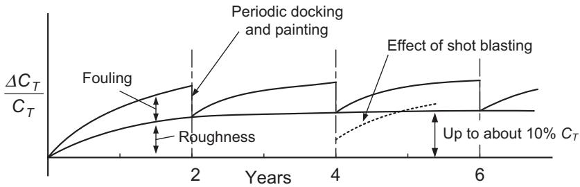

line

| Years | Fouling | Roughness | Effect of shot blasting |
|-------|---------|-----------|--------------------------|
| 0     | 0       | 0         | 0                        |
| 2     | ~0.8    | ~0.3      | ~0.1                     |
| 4     | ~0.9    | ~0.3      | ~0.5                     |
| 6     | ~0.9    | ~0.3      | ~0.7                     |

Figure 3.34. Growth of roughness and fouling.

The period of docking and shot blasting, whilst following statutory and classification requirements for frequency, will also depend on the economics of hull surface finish versus fuel saved [3.64], [3.70].

It is seen that minimising roughness and fouling is important. With relatively high fuel costs, large sums can be saved by good surface finishes when new, and careful bottom maintenance in service. Surface finish and maintenance of the propeller is also important, Carlton [3.71]. Consequently, much attention has been paid to paint and antifouling technology such as the development of constant emission toxic coatings, self-polishing paints and methods of applying the paint [3.72], [3.73] and [3.74].

Antifouling paints commonly used since the 1960s have been self-polishing and have contained the organotin compound tributyltin (TBT). Such paints have been effective. However, TBT has since been proven to be harmful to marine life. The International Maritime Organisation (IMO) has consequently introduced regulations banning the use of TBT. The International Convention for the Control of Antifouling Systems on Ships (AFS) came into effect in September 2008. Under the Convention, ships are not allowed to use organotin compounds in their antifouling systems.

Since the ban on the tin-based, self-polishing antifouling systems, new alternatives have been investigated and developed. These include tin-free self-polishing coatings and silicone-based foul release coatings which discourage marine growth from occurring, Candries and Atlar [3.61]. It is shown that a reduction in skin friction resistance of 2%–5% can be achieved with foul release coatings compared with self-polishing. It is difficult to measure actual roughness of the ‘soft surface’ silicone-based foul release coatings and, hence, difficult to match friction reductions against roughness levels. In addition, traditional rough-brush cleaning can damage the silicone-based soft surface, and brushless systems are being developed for this purpose.

Technology is arriving at the possibility of preventing most fouling, although the elimination of slime is not always achievable, Candries and Atlar [3.61] and Okuno et al. [3.74]. Slime can have a significant effect on resistance. For example, a $\Delta C _ { F }$ of up to 80% over two years due to slime was measured by Lewthwaite et al. [3.75].

# 3.2.3.6 Quantifying Power/Resistance Increases

# Due to Roughness and Fouling

GLOBAL INFORMATION. The methods used for global increases in resistance entail the use of voyage analysis techniques, that is, the analysis of ship voyage power data over a period of time, corrected for weather. Rates of increase and actual increases in power (hence, resistance) can be monitored. The work of Aertssen [3.66] and Aertssen and Van Sluys [3.68], discussed earlier, uses such techniques. The results of such analyses can be used to estimate the most beneficial frequency of docking and to estimate suitable power margins.

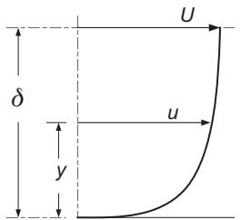

text_image

U
δ
y
u

Figure 3.35. Boundary layer velocity profile.

DETAILED INFORMATION. A detailed knowledge of the changes in the local skin friction coefficient $C _ { f , }$ due say to roughness and fouling and hence, increase in resistance, can be gained from a knowledge of the local boundary layer profile, as described by Lewthwaite et al. [3.75]. Such a technique might be used to investigate the properties of particular antifouling systems.

The boundary layer velocity profile, Figure 3.35, can be measured by a Pitotˆ static tube projecting through the hull of the ship, or a laser doppler anemometer (LDA) projected through glass panels in the ship’s hull.

The inner 10% of boundary layer is known as the inner region and a logarithmic relationship for the velocity distribution is satisfactory.

$$
\frac {u}{u _ {0}} = \frac {1}{k} \log_ {e} \left(\frac {y u _ {0}}{v}\right) + B r, \tag {3.59}
$$

where $\begin{array} { r } { u _ { 0 } = \sqrt { \frac { \tau _ { 0 } } { \rho } } } \end{array}$ is the wall friction velocity, k is the Von Karman constant, Br is a roughness function and

$$
\tau_ {0} = \frac {1}{2} \rho C _ {f} U ^ {2}. \tag {3.60}
$$

From a plot of $\frac { u } { u _ { 0 } }$ against loge $( y U / v )$ , the slope of the line can be obtained, and it can be shown that $C _ { f } = 2 \times ( \mathrm { s l o p e } \times k ) ^ { 2 }$ , whence the local skin friction coefficient, $C _ { f } ,$ can be derived.

Boundary layer profiles can be measured on a ship over a period of time and, hence, the influence of roughness and fouling on local $C _ { f }$ monitored. Other examples of the use of such a technique include Cutland [3.76], Okuno et al. [3.74] and Aertssen [3.66], who did not analyse the boundary layer results.

# 3.2.3.7 Summary

Equations (3.57) and (3.58) provide approximate values for $\Delta C _ { F }$ , which may be applied to new ships, see model-ship correlation, Chapter 5.

Due to the continuing developments of new coatings, estimates of in-service roughness and fouling and power increases can only be approximate. For the purposes of estimating power margins, average annual increases in power due to roughness and fouling may be assumed. In-service monitoring of power and speed may be used to determine the frequency of underwater cleaning and/or docking, see

Chapter 13. Further extensive reviews of the effects of roughness and fouling may be found in Carlton [3.71] and ITTC2008 [3.63].

# 3.2.4 Wind and Waves

# 3.2.4.1 Background

Power requirements increase severely in rough weather, in part, because of wave action and, in part, because of wind resistance. Ultimately, ships slow down voluntarily to avoid slamming damage or excessive accelerations.

Ships on scheduled services tend to operate at constant speed and need a sufficient power margin to maintain speed in reasonable service weather. Other ships usually operate at maximum continuous rated power and their nominal service speed needs to be high enough to offset their average speed losses in rough weather.

Whatever the mode of operation, it is necessary, at the design stage, to be able to estimate the power increases due to wind and waves at a particular speed. This information will be used to estimate a suitable power margin for the main propulsion machinery. It also enables climatic design to be carried out, Satchwell [3.77], and forms a component of weather routeing. Climatic design entails designing the ship for the wind and wave conditions measured over a previous number of years for the relevant sea area(s). Weather routeing entails using forecasts of the likely wind and waves in a sea area the ship is about to enter. Both scenarios have the common need to be able to predict the likely ship speed loss or power increase for given weather conditions.

The influence of wind and waves on ship speed and power can be estimated by experimental and theoretical methods. The wind component will normally be estimated using the results of wind tunnel tests for a particular ship type, for example, van Berlekom et al. [3.44] (see also, Section 3.2.2). The wave component can be estimated as a result of tank tests and/or theoretical calculations, Townsin and Kwon [3.78], Townsin et al. [3.79], and ITTC2008 [3.80]. A common alternative approach is to analyse ship voyage data, for example, Aertssen [3.65], [3.66], and Aertssen and Van Sluys [3.68]. Voyage analysis is discussed further in Chapter 13. Whatever approach is used, the ultimate aim is to be able to predict the increase in power to maintain a particular speed, or the speed loss for a given power.

For ship trials, research and seakeeping investigations, the sea conditions such as wind speed, wave height, period and direction will be measured with a wave buoy. For practical purposes, the sea condition is normally defined by the Beaufort number, BN. The Beaufort scale of wind speeds, together with approximate wave heights, is shown in Table 3.9.

Typical speed loss curves, to a base of BN, are shown schematically in Figure 3.36. There tends to be little speed loss in following seas. Table 3.10 gives an example of head sea data for a cargo ship, extracted from Aertssen [3.65].

Considering head seas, the proportions of wind and wave action change with increasing BN, Figure 3.37, derived using experimental and theoretical estimates extracted from [3.66] and [3.67], and discussion of [3.49] indicates that, at BN = 4, about 10%–20% of the power increase at constant speed (depending on hull fullness and ship type) is due to wave action, whilst at BN = 7, about 80% is due to wave action. The balance is due to wind resistance. A detailed investigation of wave action and wave–wind proportions was carried out by Townsin et al. [3.79].

Table 3.9. Beaufort scale 

<table><tr><td rowspan="2">Beaufort number BN</td><td rowspan="2">Description</td><td colspan="2">Limits of speed</td><td rowspan="2">Approximate wave height (m)</td></tr><tr><td>knots</td><td>m/s</td></tr><tr><td>0</td><td>Calm</td><td>1</td><td>0.3</td><td>-</td></tr><tr><td>1</td><td>Light air</td><td>1–3</td><td>0.3–1.5</td><td>-</td></tr><tr><td>2</td><td>Light breeze</td><td>4–6</td><td>1.6–3.3</td><td>0.7</td></tr><tr><td>3</td><td>Gentle breeze</td><td>7–10</td><td>3.4–5.4</td><td>1.2</td></tr><tr><td>4</td><td>Moderate breeze</td><td>11–16</td><td>5.5–7.9</td><td>2.0</td></tr><tr><td>5</td><td>Fresh breeze</td><td>17–21</td><td>8.0–10.7</td><td>3.1</td></tr><tr><td>6</td><td>Strong breeze</td><td>22–27</td><td>10.8–13.8</td><td>4.0</td></tr><tr><td>7</td><td>Near gale</td><td>28–33</td><td>13.9–17.1</td><td>5.5</td></tr><tr><td>8</td><td>Gale</td><td>34–40</td><td>17.2–20.7</td><td>7.1</td></tr><tr><td>9</td><td>Strong gale</td><td>41–47</td><td>20.8–24.4</td><td>9.1</td></tr><tr><td>10</td><td>Storm</td><td>48–55</td><td>24.5–28.4</td><td>11.3</td></tr><tr><td>11</td><td>Violent storm</td><td>56–63</td><td>28.5–32.6</td><td>13.2</td></tr><tr><td>12</td><td>Hurricane</td><td>64 and over</td><td>32.7 and over</td><td>-</td></tr></table>

# 3.2.4.2 Practical Data

The following formulae are suitable for estimating the speed loss in particular sea conditions.

Aertssen formula [3.78], [3.81]:

$$
\frac {\Delta V}{V} \times 100 \% = \frac {m}{L _ {B P}} + n, \tag{3.61}
$$

where m and n vary with Beaufort number but do not account for ship type, condition or fullness. The values of m and n are given in Table 3.11.

Townsin and Kwon formulae [3.78], [3.82] and updated by Kwon in [3.83]: The percentage speed loss is given by

$$
\alpha \cdot \mu \frac {\Delta V}{V} 100 \%, \tag{3.62}
$$

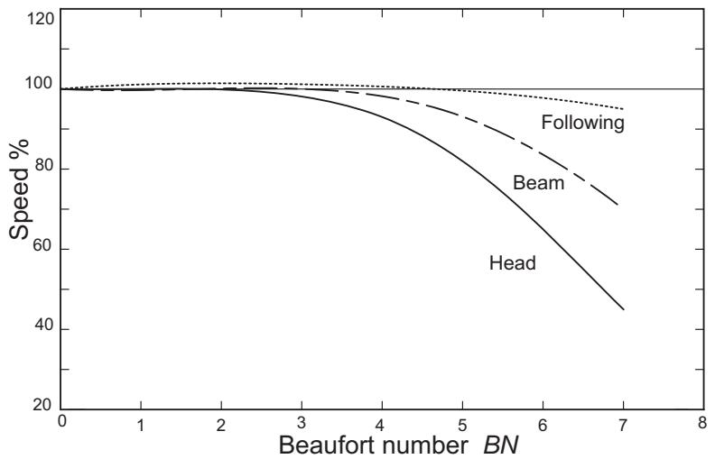

line

| Beaufort number BN | Head  | Beam  | Following |
| ------------------ | ----- | ----- | --------- |
| 0                  | 100   | 100   | 100       |
| 1                  | 99    | 99    | 99        |
| 2                  | 98    | 98    | 98        |
| 3                  | 95    | 96    | 97        |
| 4                  | 85    | 92    | 95        |
| 5                  | 70    | 85    | 92        |
| 6                  | 55    | 75    | 88        |
| 7                  | 45    | 65    | 82        |

Figure 3.36. Speed loss with increase in Beaufort number BN.

Table 3.10. Typical speed loss data for a cargo vessel, Aerrtssen [3.65] 

<table><tr><td>Beaufort number BN</td><td> $\Delta P (\%)$ </td><td> $\Delta V (\%)$ </td><td>Approximate wave height (m)</td></tr><tr><td>0</td><td>0</td><td>-</td><td>-</td></tr><tr><td>1</td><td>1</td><td>-</td><td>-</td></tr><tr><td>2</td><td>2</td><td>-</td><td>0.2</td></tr><tr><td>3</td><td>5</td><td>1</td><td>0.6</td></tr><tr><td>4</td><td>15</td><td>3</td><td>1.5</td></tr><tr><td>5</td><td>32</td><td>6</td><td>2.3</td></tr><tr><td>6</td><td>85</td><td>17</td><td>4.2</td></tr><tr><td>7</td><td>200</td><td>40</td><td>8.2</td></tr></table>

where $\Delta V / V$ is the speed loss in head weather given by Equations (3.63, 3.64, 3.65), α is a correction factor for block coefficient $( C _ { B } )$ and Froude number (Fr) given in Table 3.12 and $\mu$ is a weather reduction factor given by Equations (3.66).

For all ships (with the exception of containerships) laden condition, $C _ { B } = 0 . 7 5$ , 0.80 and 0.85, the percentage speed loss is

$$
\frac {\Delta V}{V} 100 \% = 0.5 BN + \frac {B N ^ {6.5}}{2.7 \nabla^ {2 / 3}}. \tag{3.63}
$$

For all ships (with the exception of containerships) ballast condition, $C _ { B } = 0 . 7 5 , 0 . 8 0$ and 0.85, the percentage speed loss is

$$
\frac {\Delta V}{V} 100 \% = 0.7 B N + \frac {B N ^ {6.5}}{2.7 \nabla^ {2 / 3}}. \tag{3.64}
$$

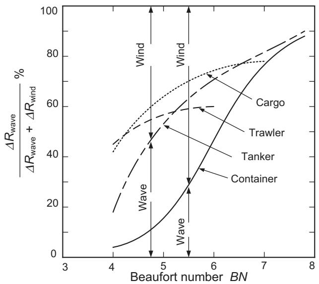

line

| Beaufort number BN | ΔR_wave / ΔR_wind + ΔR_wind (%) |
| ------------------ | -------------------------------- |
| 4                  | ~10                              |
| 5                  | ~25                              |
| 6                  | ~50                              |
| 7                  | ~70                              |
| 8                  | ~90                              |

Figure 3.37. Proportions of wind and wave action.

Table 3.11. Aertssen values for m and n 

<table><tr><td rowspan="2">BN</td><td colspan="2">Head sea</td><td colspan="2">Bow sea</td><td colspan="2">Beam sea</td><td colspan="2">Following sea</td></tr><tr><td>m</td><td>n</td><td>m</td><td>n</td><td>m</td><td>n</td><td>m</td><td>n</td></tr><tr><td>5</td><td>900</td><td>2</td><td>700</td><td>2</td><td>350</td><td>1</td><td>100</td><td>0</td></tr><tr><td>6</td><td>1300</td><td>6</td><td>1000</td><td>5</td><td>500</td><td>3</td><td>200</td><td>1</td></tr><tr><td>7</td><td>2100</td><td>11</td><td>1400</td><td>8</td><td>700</td><td>5</td><td>400</td><td>2</td></tr><tr><td>8</td><td>3600</td><td>18</td><td>2300</td><td>12</td><td>1000</td><td>7</td><td>700</td><td>3</td></tr></table>

where Head sea  up to 30◦ off bow; Bow $\mathrm { s e a } = 3 0 ^ { \circ } - 6 0 ^ { \circ }$ off bow; Beam $\mathrm { s e a } = 6 0 ^ { 0 } { - } 1 5 0 ^ { \circ }$ off bow; Following sea $= 1 5 0 ^ { \circ } - 1 8 0 ^ { \circ }$ off bow.

For containerships, normal condition, $C _ { B } = 0 . 5 5 , 0 . 6 0 , 0 . 6 5$ and 0.70, the percentage speed loss is

$$
\frac {\Delta V}{V} 100 \% = 0.7 BN + \frac {B N ^ {6.5}}{22 \nabla^ {2 / 3}}, \tag{3.65}
$$

where BN is the Beaufort number and ∇ is the volume of displacement in $\mathbf { m } ^ { 3 }$

The weather reduction factors are

$$
2 \mu_ {\text { bow }} = 1. 7 - 0. 0 3 (B N - 4) ^ {2} \quad 3 0 ^ {\circ} - 6 0 ^ {\circ} \tag {3.66a}
$$

$$
2 \mu_ {\text {beam}} = 0. 9 - 0. 0 6 (B N - 6) ^ {2} \quad 6 0 ^ {\circ} - 1 5 0 ^ {\circ} \tag {3.66b}
$$

$$
2 \mu_ {\text { following }} = 0. 4 - 0. 0 3 (B N - 8) ^ {2} \quad 1 5 0 ^ {\circ} - 1 8 0 ^ {\circ}. \tag {3.66c}
$$

There is reasonable agreement between the Aertssen and Townsin-Kwon formulae as shown in Table 3.13, where Equations (3.61) and (3.65) have been compared for a container ship with a length of 220 m, $C _ { B } = 0 . 6 0 0 , \nabla = 3 6 { , } 5 0 0 \mathrm { m } ^ { 3 }$ and $F r = 0 . 2 3 3$ .

# 3.2.4.3 Derivation of Power Increase and Speed Loss

If increases in hull resistance have been calculated or measured in certain conditions and if it is assumed that, for small changes, resistance R varies as $V ^ { 2 }$ , then

$$
\frac {\Delta V}{V} = \left[ 1 + \frac {\Delta R}{R} \right] ^ {1 / 2} - 1, \tag {3.67}
$$

where V is the calm water speed and R is the calm water resistance.

Table 3.12. Values of correction factor α 

<table><tr><td> $C_B$ </td><td>Condition</td><td>Correction factor  $\alpha$ </td></tr><tr><td>0.55</td><td>Normal</td><td> $1.7 - 1.4Fr - 7.4(Fr)^2$ </td></tr><tr><td>0.60</td><td>Normal</td><td> $2.2 - 2.5Fr - 9.7(Fr)^2$ </td></tr><tr><td>0.65</td><td>Normal</td><td> $2.6 - 3.7Fr - 11.6(Fr)^2$ </td></tr><tr><td>0.70</td><td>Normal</td><td> $3.1 - 5.3Fr - 12.4(Fr)^2$ </td></tr><tr><td>0.75</td><td>Laden or normal</td><td> $2.4 - 10.6Fr - 9.5(Fr)^2$ </td></tr><tr><td>0.80</td><td>Laden or normal</td><td> $2.6 - 13.1Fr - 15.1(Fr)^2$ </td></tr><tr><td>0.85</td><td>Laden or normal</td><td> $3.1 - 18.7Fr + 28.0(Fr)^2$ </td></tr><tr><td>0.75</td><td>Ballast</td><td> $2.6 - 12.5Fr - 13.5(Fr)^2$ </td></tr><tr><td>0.80</td><td>Ballast</td><td> $3.0 - 16.3Fr - 21.6(Fr)^2$ </td></tr><tr><td>0.85</td><td>Ballast</td><td> $3.4 - 20.9Fr + 31.8.4(Fr)^2$ </td></tr></table>

Table 3.13. Comparison of Aertssen and Townsin–Kwon formulae 

<table><tr><td>Beaufort number BN</td><td>Aertssen ΔV/V (%)</td><td>Townsin-Kwon ΔV/V (%)</td></tr><tr><td>5</td><td>6.1</td><td>5.4</td></tr><tr><td>6</td><td>11.9</td><td>9.7</td></tr><tr><td>7</td><td>20.5</td><td>19.4</td></tr><tr><td>8</td><td>34.4</td><td>39.5</td></tr></table>

For small changes, power and thrust remain reasonably constant. Such an equation has typically been used to develop approximate formulae such as Equations (3.63, 3.64, 3.65). For larger resistance increases, and for a more correct interpretation, changes in propeller efficiency should also be taken into account. With such increases in resistance, hence a required increase in thrust at a particular speed, the propeller is clearly working off-design. Off-design propeller operation is discussed in Chapter 13. Taking the changes in propeller efficiency into account leads to the following relationship, van Berlekom [3.49], Townsin et al. [3.79]:

$$
\frac {\Delta P}{P} = \frac {\Delta R / R}{1 + \Delta \eta_ {0} / \eta_ {0}} - 1, \tag {3.68}
$$

where $\Delta \eta _ { 0 }$ is the change in propeller efficiency $\eta _ { 0 }$ due to change in propeller loading.

# 3.2.4.4 Conversion from Speed Loss to Power Increase

An approximate conversion from speed loss $\Delta V$ at a constant power to a power increase $\Delta P$ at a constant speed may be made as follows, using the assumption that power P varies as $V ^ { 3 }$ , Figure 3.38:

$$
V _ {1} = V _ {S} \left(1 - \frac {\Delta V}{V _ {S}}\right)
$$

$$
\frac {\mathrm{New} P}{\mathrm{Old} P} = \frac {V _ {S} ^ {3}}{V _ {1} ^ {3}} = \frac {V _ {S} ^ {3}}{V _ {S} ^ {3} \left(1 - \frac {\Delta V}{V _ {S}}\right) ^ {3}} = \frac {1}{\left(1 - \frac {\Delta V}{V _ {S}}\right) ^ {3}},
$$

text_image

P
P α V³
ΔP
P α V³
ΔV
V
V₁
Vₛ

Figure 3.38. Conversion from $\Delta V$ to $\Delta P .$

then

$$
\frac {\Delta P}{P} = \frac {1}{\left(1 - \frac {\Delta V}{V _ {S}}\right) ^ {3}} - 1 \tag {3.69}
$$

also

$$
\frac {\Delta V}{V} = 1 - \sqrt [ 3 ]{\frac {1}{1 + \frac {\Delta P}{P}}}. \tag {3.70}
$$

Townsin and Kwan [3.78] derive the following approximate conversion:

$$
\frac {\Delta P}{P} = (n + 1) \frac {\Delta V}{V}, \tag {3.71}
$$

where $\Delta P / P$ has been derived from Equation (3.68) and n has typical values, as follows:

VLCC laden n = 1.91

VLCC ballast n  2.40

Container n 2.16

Comparison of Equations (3.69) and (3.71) with actual data would suggest that Equation (3.71) underestimates the power increase at higher BN. For practical purposes, either Equation (3.69) or (3.71) may be applied.

# 3.2.4.5 Weighted Assessment of Average Increase in Power

It should be noted that in order to assess correctly the influences of weather on a certain route, power increases and/or speed losses should be judged in relation to the frequency with which the wave conditions occur (i.e. the occurrence of Beaufort number, BN, or significant wave height, $H _ { 1 / 3 } )$ , Figure 3.39. Such weather conditions for different parts of the world may be obtained from [3.84], or the updated version [3.85]. Then, the weighted average power increase =  (power increase × frequency) =  (P × σ ).

Satchwell [3.77] applies this approach to climatic design and weather routeing. This approach should also be used when assessing the necessary power margin for a ship operating on a particular route.

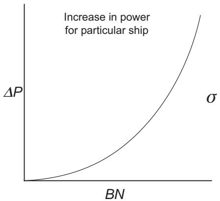

line

| BN  | ΔP  | σ   |
| --- | --- | --- |
| Low | Low | Low |
| High | High | High |

line

| BN   | Probability of occurrence |
| ---- | ------------------------- |
| Low  | 0                         |
| Peak | High                      |
| High | 0                         |

Figure 3.39. Weighted average power increase.

Table 3.14. Weighted average power 

<table><tr><td>Beaufort number BN</td><td>Increase in power ΔP</td><td>Wave occurrence σ</td><td>ΔP × σ</td></tr><tr><td>0</td><td>0</td><td>0</td><td>0</td></tr><tr><td>1</td><td>1</td><td>0.075</td><td>0.075</td></tr><tr><td>2</td><td>2</td><td>0.165</td><td>0.330</td></tr><tr><td>3</td><td>5</td><td>0.235</td><td>1.175</td></tr><tr><td>4</td><td>15</td><td>0.260</td><td>3.900</td></tr><tr><td>5</td><td>32</td><td>0.205</td><td>6.560</td></tr><tr><td>6</td><td>85</td><td>0.060</td><td>5.100</td></tr><tr><td>7</td><td>200</td><td>0</td><td>0</td></tr><tr><td></td><td></td><td>Σ ΔP × σ</td><td>17.14</td></tr></table>

A numerical example of such an approach is given in Table 3.14. Here, the power increase is taken from Table 3.10, but could have been derived using Equations (3.61) to (3.65) for a particular ship. The sea conditions for a particular sea area may typically be derived from [3.85]. It is noted that the average, or mean, power increase in this particular example is 17.14% which would therefore be a suitable power margin for a ship operating solely in this sea area. Margins are discussed further in Section 3.2.5.

# 3.2.5 Service Power Margins

# 3.2.5.1 Background

The basic ship power estimate will entail the estimation of the power to drive the ship at the required speed with a clean hull and propeller in calm water. In service, the hull will roughen and foul, leading to an increase in resistance and power, and the ship will encounter wind and waves, also leading to an increase in resistance. Some increase in resistance will occur from steering and coursekeeping, but this is likely to be relatively small. An increase in resistance will occur if the vessel has to operate in a restricted water depth; this would need to be taken into account if the vessel has to operate regularly in such conditions. The effects of operating in shallow water are discussed in Chapter 6. Thus, in order to maintain speed in service, a margin must be added to the basic clean hull calm water power, allowing the total installed propulsive power to be estimated. Margins and their estimation have been reviewed by ITTC [3.86], [3.63].

# 3.2.5.2 Design Data

ROUGHNESS AND FOULING. As discussed in Section 3.2.3, because of changes and ongoing developments in antifouling coatings, it is difficult to place a precise figure on the resistance increases due to roughness and fouling. Rate of fouling will also depend very much on factors such as the area of operation of the ship, time in port, local sea temperatures and pollution. Based on the voyage data described in Section 3.2.3, it might be acceptable to assume an annual increase in frictional resistance of say 10%, or an increase in total resistance and power of about 5%. If the hull were to be cleaned say every two years, then an assumed margin for roughness and fouling would be 10%.

WIND AND WAVES. The increase in power due to wind and waves will vary widely, depending on the sea area of operation. For example, the weather margin for a ship operating solely in the Mediterranean might be 10%, whilst to maintain a speed trans-Atlantic westbound, a ship might need a weather margin of 30% or higher. As illustrated in Section 3.2.4, a rigorous weighted approach is to apply the likely power increase for a particular ship to the wave conditions in the anticipated sea area of operation. This will typically lead to a power increase of 10%–30%. Methods of estimating added resistance in waves are reviewed in ITTC [3.80].

TOTAL. Based on the foregoing discussions, an approximate overall total margin will be the sum of the roughness-fouling and wind–wave components, typically say 10% plus 15%, leading to a total margin of 25%. This is applicable to approximate preliminary estimates. It is clear that this figure might be significantly larger or smaller depending on the frequency of underwater hull and propeller cleaning, the sea areas in which the ship will actually operate and the weather conditions it is likely to encounter.

# 3.2.5.3 Engine Operation Margin

The engine operation margin describes the mechanical and thermodynamic reserve of power for the economical operation of the main propulsion engine(s) with respect to reasonably low fuel and maintenance costs. Thus, an operator may run the engine(s) up to the continuous service rating (CSR), which is say 10% below the maximum continuous rating (MCR). Even bigger margins may be employed by the operator, see Woodyard [3.87] or Molland [3.88]. Some margin on revolutions will also be made to allow for changes in the power–rpm relationship in service, see propeller-engine matching, Chapter 13.

# REFERENCES (CHAPTER 3)

3.1 Couser, P.R., Wellicome, J.F. and Molland, A.F. Experimental measurement of sideforce and induced drag on catamaran demihulls. International Shipbuilding Progress, Vol. 45(443), 1998, pp. 225–235.   
3.2 Lackenby, H. An investigation into the nature and interdependence of the components of ship resistance. Transactions of the Royal Institution of Naval Architects, Vol. 107, 1965, pp. 474–501.   
3.3 Insel, M. and Molland, A.F. An investigation into the resistance components of high speed displacement catamarans. Transactions of the Royal Institution of Naval Architects, Vol. 134, 1992, pp. 1–20.   
3.4 Molland, A.F. and Utama, I.K.A.P. Experimental and numerical investigations into the drag characteristics of a pair of ellipsoids in close proximity. Proceedings of the Institution of Mechanical Engineers. Journal of Engineering for the Maritime Environment, Vol. 216, Part M, 2002, pp. 107–115.   
3.5 Savitsky, D., DeLorme, M.F. and Datla, R. Inclusion of whisker spray drag in performance prediction method for high-speed planing hulls. Marine Technology, SNAME, Vol. 44, No. 1, 2007, pp. 35–36.   
3.6 Clayton, B.R. and Bishop, R.E.D. Mechanics of Marine Vehicles. E. and F.N. Spon, London, 1982.   
3.7 Faltinsen, O.M. Hydrodynamics of High-Speed Marine Vehicles. Cambridge University Press, Cambridge, UK, 2005.

3.8 Claughton, A.R., Wellicome, J.R. and Shenoi, R.A. (eds). Sailing Yacht Design. Vol. 1 Theory, Vol. 2 Practice. The University of Southampton, Southampton, UK, 2006.   
3.9 Larsson, L. and Eliasson, R. Principles of Yacht Design. 3rd Edition. Adlard Coles Nautical, London, 2007.   
3.10 Crewe, P.R. and Eggington, W.J. The hovercraft – a new concept in marine transport. Transactions of the Royal Institution of Naval Architects, Vol. 102, 1960, pp. 315–365.   
3.11 Crewe, P.R. The hydrofoil boat: its history and future prospects. Transactions of the Royal Institution of Naval Architects, Vol. 100, 1958, pp. 329–373.   
3.12 Yun, L. and Bliault, A. Theory and Design of Air Cushion Craft. Elsevier Butterworth-Heinemann, Oxford, UK, 2005.   
3.13 Froude, R.E. On the ‘constant’ system of notation of results of experiments on models used at the Admiralty Experiment Works, Transactions of the Royal Institution of Naval Architects, Vol. 29, 1888, pp. 304–318.   
3.14 Taylor, D.W. The Speed and Power of Ships. U.S. Government Printing Office, Washington, DC, 1943.   
3.15 Lackenby, H. On the presentation of ship resistance data. Transactions of the Royal Institution of Naval Architects, Vol. 96, 1954, pp. 471–497.   
3.16 Telfer, E.V. The design presentation of ship model resistance data. Transactions of the North East Coast Institution of Engineers and Shipbuilders, Vol. 79, 1962–1963, pp. 357–390.   
3.17 Doust, D.J. Optimised trawler forms. Transactions of the North East Coast Institution of Engineers and Shipbuilders, Vol. 79, 1962–1963, pp. 95–136.   
3.18 Sabit, A.S. Regression analysis of the resistance results of the BSRA Series. International Shipbuilding Progress, Vol. 18, No. 197, January 1971, pp. 3–17.   
3.19 Froude, W. Experiments on the surface-friction experienced by a plane moving through water. 42nd Report of the British Association for the Advancement of Science, Brighton, 1872.   
3.20 ITTC. Recommended procedure for the resistance test. Procedure 7.5–0.2-0.2- 0.1 Revision 01, 2002.   
3.21 ITTC. Recommended procedure for ship models. Procedure 7.5-01-01-01, Revision 01, 2002.   
3.22 Hughes, G. and Allan, J.F. Turbulence stimulation on ship models. Transactions of the Society of Naval Architects and Marine Engineers, Vol. 59, 1951, pp. 281–314.   
3.23 Barnaby, K.C. Basic Naval Architecture. Hutchinson, London, 1963.   
3.24 Molland, A.F., Wellicome, J.F. and Couser, P.R. Resistance experiments on a systematic series of high speed displacement catamaran forms: Variation of length-displacement ratio and breadth-draught ratio. University of Southampton, Ship Science Report No. 71, 1994.   
3.25 Hughes, G. Tank boundary effects on model resistance. Transactions of the Royal Institution of Naval Architects, Vol. 103, 1961, pp. 421–440.   
3.26 Scott, J.R. A blockage corrector. Transactions of the Royal Institution of Naval Architects, Vol. 108, 1966, pp. 153–163.   
3.27 Scott, J.R. Blockage correction at sub-critical speeds. Transactions of the Royal Institution of Naval Architects, Vol. 118, 1976, pp. 169–179.   
3.28 Coleman, H.W. and Steele, W.G. Experimentation and Uncertainty Analysis for Engineers. 2nd Edition. Wiley, New York, 1999.   
3.29 ITTC. Final report of The Specialist Committee on Model Tests of High Speed Marine Vehicles. Proceedings of the 22nd International Towing Tank Conference, Seoul and Shanghai, 1999.   
3.30 Renilson, M. Predicting the hydrodynamic performance of very high-speed craft: A note on some of the problems. Transactions of the Royal Institution of Naval Architects, Vol. 149, 2007, pp. 15–22.

3.31 Duncan, W.J., Thom, A.S. and Young, A.D. Mechanics of Fluids. Edward Arnold, Port Melbourne, Australia, 1974.   
3.32 Massey, B.S. and Ward-Smith J. Mechanics of Fluids. 8th Edition. Taylor and Francis, London, 2006.   
3.33 Froude, W. Report to the Lords Commissioners of the Admiralty on experiments for the determination of the frictional resistance of water on a surface, under various conditions, performed at Chelston Cross, under the Authority of their Lordships. 44th Report by the British Association for the Advancement of Science, Belfast, 1874.   
3.34 Molland, A.F. and Turnock, S.R. Marine Rudders and Control Surfaces. Butterworth-Heinemann, Oxford, UK, 2007.   
3.35 Allan, J.F. Some results of scale effect experiments on a twin-screw hull series. Transactions of the Institute of Engineers and Shipbuilders in Scotland, Vol. 93, 1949/50, pp. 353–381.   
3.36 Lackenby, H. BSRA resistance experiments on the Lucy Ashton. Part III. The ship model correlation for the shaft appendage conditions. Transactions of the Royal Institution of Naval Architects, Vol. 97, 1955, pp. 109–166.   
3.37 Hoerner, S.F. Fluid-Dynamic Drag. Published by the Author. Washington, DC, 1965.   
3.38 Mandel, P. Some hydrodynamic aspects of appendage design. Transactions of the Society of Naval Architects and Marine Engineers, Vol. 61, 1953, pp. 464–515.   
3.39 Peck, R.W. The determination of appendage resistance of surface ships. AEW Technical Memorandum, 76020, 1976.   
3.40 Kirkman, K.L. and Kloetzli, J.N. Scaling problems of model appendages, Proceedings of the 19th ATTC, Ann Arbor, Michigan, 1981.   
3.41 Tulin, M.P. Supercavitating flow past foil and struts. Proceedings of Symposium on Cavitation in Hydrodynamics. NPL, 1955.   
3.42 Rutgersson, O. Propeller-hull interaction problems on high-speed ships: on the influence of cavitation. Symposium on Small Fast Warships and Security Vessels. The Royal Institution of Naval Architects, London, 1982.   
3.43 Holtrop, J. and Mennen, G.G.J. An approximate power prediction method. International Shipbuilding Progress, Vol. 29, No. 335, July 1982, pp. 166–170.   
3.44 van Berlekom, W.B., Trag¨ ardh, P. and Dellhag, A. Large tankers – wind coef- ˚ ficients and speed loss due to wind and waves. Transactions of the Royal Institution of Naval Architects, Vol. 117, 1975, pp. 41–58.   
3.45 Shearer, K.D.A. and Lynn, W.M. Wind tunnel tests on models of merchant ships. Transactions of the North East Coast Institution of Engineers and Shipbuilders, Vol. 76, 1960, pp. 229–266.   
3.46 White, G.P. Wind resistance – suggested procedure for correction of ship trial results. NPL TM116, 1966.   
3.47 Gould, R.W.F. The Estimation of wind loadings on ship superstructures. RINA Marine Technology Monograph 8, 1982.   
3.48 Isherwood, R.M. Wind resistance of merchant ships. Transactions of the Royal Institution of Naval Architects, Vol. 115, 1973, pp. 327–338.   
3.49 van Berlekom, W.B. Wind forces on modern ship forms–effects on performance. Transactions of the North East Coast Institute of Engineers and Shipbuilders, Vol. 97, No. 4, 1981, pp. 123–134.   
3.50 Blendermann, W. Estimation of wind loads on ships in wind with a strong gradient. Proceedings of the 14th International Conference on Offshore Mechanics and Artic Engineering (OMAE), New York, ASME, Vol. 1-A, 1995, pp. 271–277.   
3.51 Molland, A.F. and Barbeau, T.-E. An investigation into the aerodynamic drag on the superstructures of fast catamarans. Transactions of the Royal Institution of Naval Architects, Vol. 145, 2003, pp. 31–43.

3.52 Reddy, K.R., Tooletto, R. and Jones, K.R.W. Numerical simulation of ship airwake. Computers and Fluids, Vol. 29, 2000.   
3.53 Sezer-Uzol, N., Sharma, A. and Long, L.N. Computational fluid dynamics simulations of ship airwake. Proceedings of the Institution of Mechanical Engineers. Journal of Aerospace Engineering, Vol. 219, Part G, 2005, pp. 369–392.   
3.54 Wakefield, N.H., Newman, S.J. and Wilson, P.A. Helicopter flight around a ship’s superstructure. Proceedings of the Institution of Mechanical Engineers, Journal of Aerospace Engineering, Vol. 216, Part G, 2002, pp. 13–28.   
3.55 Moat, I, Yelland, M., Pascal, R.W. and Molland, A.F. Quantifying the airflow distortion over merchant ships. Part I. Validation of a CFD Model. Journal of Atmospheric and Oceanic Technology, Vol. 23, 2006, pp. 341–350.   
3.56 Moat, I, Yelland, M., Pascal, R.W. and Molland, A.F. Quantifying the airflow distortion over merchant ships. Part II. Application of the model results. Journal of Atmospheric and Oceanic Technology, Vol. 23, 2006, pp. 351–360.   
3.57 ITTC. Report of Resistance Committee. 25th ITTC, Fukuoka, Japan, 2008.   
3.58 Hucho, W.H. (ed.) Aerodynamics of Road Vehicles. 4th Edition. Society of Automotive Engineers, Inc., Warrendale, PA, USA, 1998.   
3.59 Anonymous. Emissions are a drag. The Naval Architect, RINA, London, January 2009, pp. 28–31.   
3.60 Grigson, C.W.B. The drag coefficients of a range of ship surfaces. Transactions of the Royal Institution of Naval Architects, Vol. 123, 1981, pp. 195–208.   
3.61 Candries, M. and Atlar, M. On the drag and roughness characteristics of antifoulings. Transactions of the Royal Institution of Naval Architects, Vol. 145, 2003, pp. 107–132.   
3.62 Townsin, R.L. The ITTC line–its genesis and correlation allowance. The Naval Architect, RINA, London, September 1985, pp. E359–E362.   
3.63 ITTC. Report of the Specialist Committee on Powering Performance Prediction, Proceedings of the 25th International Towing Tank Conference, Vol. 2, Fukuoka, Japan, 2008.   
3.64 Townsin, R.L., Byrne, D., Milne, A. and Svensen, T. Speed, power and roughness – the economics of outer bottom maintenance. Transactions of the Royal Institution of Naval Architects, Vol. 122, 1980, pp. 459–483.   
3.65 Aertssen, G. Service-performance and seakeeping trials on MV Lukuga. Transactions of the Royal Institution of Naval Architects, Vol. 105, 1963, pp. 293–335.   
3.66 Aertssen, G. Service-performance and seakeeping trials on MV Jordaens. Transactions of the Royal Institution of Naval Architects, Vol. 108, 1966, pp. 305–343.   
3.67 Aertssen, G., Ferdinande, V. and de Lembre, R. Service-performance and seakeeping trials on a stern trawler. Transactions of the North East Coast Institution of Engineers and Shipbuilders, Vol. 83, 1966–1967, pp. 13–27.   
3.68 Aertssen, G. and Van Sluys, M.F. Service-performance and seakeeping trials on a large containership. Transactions of the Royal Institution of Naval Architects, Vol. 114, 1972, pp. 429–447.   
3.69 Aertssen, G. Service performance and trials at sea. App.V Performance Committee, 12th ITTC, 1969.   
3.70 Townsin, R.L., Moss, B, Wynne, J.B. and Whyte, I.M. Monitoring the speed performance of ships. Transactions of the North East Coast Institution of Engineers and Shipbuilders, Vol. 91, 1975, pp. 159–178.   
3.71 Carlton, J.S. Marine Propellers and Propulsion. 2nd Edition. Butterworth-Heinemann, Oxford, UK, 2007.   
3.72 Atlar, M., Glover, E.J., Candries, M., Mutton, R. and Anderson, C.D. The effect of foul release coating on propeller performance. Proceedings of 2nd International Conference on Marine Research for Environmental Sustainability ENSUS 2002, University of Newcastle upon Tyne, UK, 2002.

3.73 Atlar, M., Glover, E.J., Mutton, R. and Anderson, C.D. Calculation of the effects of new generation coatings on high speed propeller performance. Proceedings of 2nd International Warship Cathodic Protection Symposium and Equipment Exhibition. Cranfield University, Shrivenham, UK, 2003.   
3.74 Okuno, T., Lewkowicz, A.K. and Nicholson, K. Roughness effects on a slender ship hull. Second International Symposium on Ship Viscous Resistance, SSPA, Gothenburg, 1985, pp. 20.1–20.27.   
3.75 Lewthwaite, J.C., Molland, A.F. and Thomas, K.W. An investigation into the variation of ship skin frictional resistance with fouling. Transactions of the Royal Institution of Naval Architects, Vol. 127, 1985, pp. 269–284.   
3.76 Cutland, R.S. Velocity measurements in close proximity to a ship’s hull. Transactions of the North East Coast Institution of Engineers and Shipbuilders. Vol. 74, 1958, pp. 341–356.   
3.77 Satchwell, C.J. Windship technology and its application to motor ships. Transactions of the Royal Institution of Naval Architects, Vol. 131, 1989, pp. 105–120.   
3.78 Townsin, R.L. and Kwon, Y.J. Approximate formulae for the speed loss due to added resistance in wind and waves. Transactions of the Royal Institution of Naval Architects, Vol. 125, 1983, pp. 199–207.   
3.79 Townsin, R.L., Kwon, Y.J., Baree, M.S. and Kim, D.Y. Estimating the influence of weather on ship performance. Transactions of the Royal Institution of Naval Architects, Vol. 135, 1993, pp. 191–209.   
3.80 ITTC. Report of the Seakeeping Committee, Proceedings of the 25th International Towing Tank Conference, Vol. 1, Fukuoka, Japan, 2008.   
3.81 Aertssen, G. The effect of weather on two classes of container ship in the North Atlantic. The Naval Architect, RINA, London, January 1975, p. 11.   
3.82 Kwon, Y.J. Estimating the effect of wind and waves on ship speed and performance. The Naval Architect, RINA, London, September 2000.   
3.83 Kwon, Y.J. Speed loss due to added resistance in wind and waves. The Naval Architect, RINA, London, March 2008, pp. 14–16.   
3.84 Hogben, N. and Lumb, F.E. Ocean Wave Statistics. Her Majesty’s Stationery Office, London, 1967.   
3.85 Hogben, N., Dacunha, N.M.C. and Oliver, G.F. Global Wave Statistics. Compiled and edited by British Maritime Technology, Unwin Brothers, Old Woking, UK, 1985.   
3.86 ITTC. Report of The Specialist Committee on Powering Performance and Prediction. Proceedings of the 24th International Towing Tank Conference, Vol. 2, Edinburgh, UK, 2005.   
3.87 Woodyard, D.F. Pounder’s Marine Diesel Engines and Gas Turbines. 8th Edition. Butterworth-Heinemann, Oxford, UK, 2004.   
3.88 Molland, A.F. (ed.) The Maritime Engineering Reference Book. Butterworth-Heinemann, Oxford, UK, 2008.

# 4 Model-Ship Extrapolation

# 4.1 Practical Scaling Methods

When predicting ship power by the use of model tests, the resistance test results have to be scaled, or extrapolated, from model to ship. There are two main methods of extrapolation, one due to Froude which was introduced in the 1870s [4.1–4.3] and the other due to Hughes introduced in the 1950s [4.4] and later adopted by the International Towing Tank Conference (ITTC).

# 4.1.1 Traditional Approach: Froude

The basis of this approach is described in Section 3.1.6 and is summarised as follows:

$$
C _ {T} = C _ {F} + C _ {R} \tag {4.1}
$$

where $C _ { F }$ is for an equivalent flat plate of a length equal to the model or ship, $C _ { R }$ is the residuary resistance and is derived from the model test as:

$$
C _ {R} = C _ {T m} - C _ {F m}.
$$

For the same Froude number, and following Froude’s law,

$$
C _ {R s} = C _ {R m}
$$

and

$$
C _ {T s} = C _ {F s} + C _ {R s} = C _ {F s} + C _ {R m} = C _ {F s} + \left[ C _ {T m} - C _ {F m} \right]
$$

i.e.

$$
C _ {T s} = C _ {T m} - (C _ {F m} - C _ {F s}). \tag {4.2}
$$

This traditional approach is shown schematically in Figure 4.1, with $C _ { R s } = C _ { R m }$ at the ship Re corresponding to the same (model = ship) Froude number. $( C _ { F m } -$ $C _ { F s } )$ is a skin friction correction to $C _ { T m }$ for the model. The model is not run at the correct Reynolds number (i.e. the model Re is much smaller than that for the ship, Figure 4.1) and consequently the skin friction coefficient for the model is higher than that for the ship. The method is still used by some naval architects, but it tends to overestimate the power for very large ships.

line

| Point | Value |
|-------|-------|
| Model | C_Tm  |
| Re    | C_Rm  |
| Re    | C_Fm  |
| Re    | C_R   |
| Ship at same Fr as model | C_Ts  |
| Ship at same Fr as model | C_Rs  |
| Ship at same Fr as model | C_Fs  |

Figure 4.1. Model-ship extrapolation: Froude traditional.

It should be noted that the $C _ { F }$ values developed by Froude were not explicitly defined in terms of $R e ,$ , as suggested in Figure 4.1. This is discussed further in Section 4.3.

# 4.1.2 Form Factor Approach: Hughes

Hughes proposed taking form effect into account in the extrapolation process. The basis of the approach is summarised as follows:

$$
C _ {T} = (1 + k) C _ {F} + C _ {W} \tag {4.3}
$$

or

$$
C _ {T} = C _ {V} + C _ {W}, \tag {4.4}
$$

where

$$
C _ {V} = (1 + k) C _ {F},
$$

and $( 1 + k )$ is a form factor which depends on hull form, $C _ { F }$ is the skin friction coefficient based on flat plate results, $C _ { V }$ is a viscous coefficient taking account of both skin friction and viscous pressure resistance and $C _ { W }$ is the wave resistance coefficient. The method is shown schematically in Figure 4.2.

On the basis of Froude’s law,

$$
C _ {W s} = C _ {W m}
$$

and

$$
C _ {T s} = C _ {T m} - (1 + k) \left(C _ {F m} - C _ {F s}\right). \tag {4.5}
$$

line

| Phase | C_Tm  | C_Wm  | C_Vm  | C_V   | C_F   | C_F   | C_Vs  | C_Ws  |
|-------|-------|-------|-------|-------|-------|-------|-------|-------|
| Model | High  | Medium| Low   | Low   | Low   | Low   | Low   | Low   |
| Re    | Low   | Low   | Low   | Low   | Low   | Low   | Low   | Low   |
| Ship  | High  | High  | High  | High  | High  | High  | High  | High  |

Figure 4.2. Model-ship extrapolation: form factor approach.

This method is recommended by ITTC and is the one adopted by most naval architects. A form factor approach may not be applied for some high-speed craft and for yachts.

The form factor $( 1 + k )$ depends on the hull form and may be derived from low-speed tests when, at low $F r ,$ , wave resistance $C _ { W }$ tends to zero and $( 1 + k ) =$ $C _ { T m } / C _ { F m }$ . This and other methods of obtaining the form factor are described in Section 4.4.

It is worth emphasising the fundamental difference between the two scaling methods described. Froude assumes that all resistance in excess of $C _ { F }$ (the residuary resistance $C _ { R } )$ scales according to Froude’s law, that is, as displacement at the same Froude number. This is not physically correct because the viscous pressure (form) drag included within $C _ { R }$ should scale according to Reynolds’ law. Hughes assumes that the total viscous resistance (friction and form) scales according to Reynolds’ law. This also is not entirely correct as the viscous resistance interferes with the wave resistance which is Froude number dependent. The form factor method (Hughes) is, however, much closer to the actual physical breakdown of components than Froude’s approach and is the method now generally adopted.

It is important to note that both the Froude and form factor methods rely very heavily on the level and slope of the chosen skin friction, $C _ { F }$ , line. Alternative skin friction lines are discussed in Section 4.3.

# 4.2 Geosim Series

In order to identify $f _ { 1 }$ and $f _ { 2 }$ in Equation (3.26), $C _ { T } = f _ { 1 } ( R e ) + f _ { 2 } ( F r )$ , from measurements of total resistance only, several experimenters have run resistance tests for a range of differently sized models of the same geometric form. Telfer [4.5–4.7] coined the term ‘Geosim Series’, or ‘Geosims’ for such a series of models. The results of such a series of tests, plotted on a Reynolds number base, would appear as shown schematically in Figure 4.3.

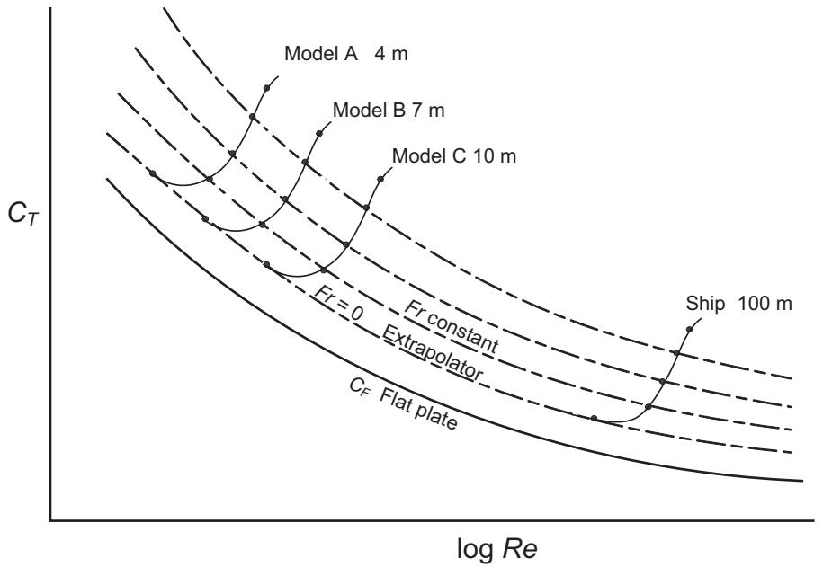

line

| log Re | CT (Model A 4 m) | CT (Model B 7 m) | CT (Model C 10 m) | Cr constant | Extrapolator | Ship 100 m |
|--------|------------------|------------------|-------------------|-------------|--------------|------------|
| Low    | ~0.8             | ~0.7             | ~0.6              | ~0.5        | ~0.4         | ~0.3       |
| Medium | ~0.9             | ~0.8             | ~0.7              | ~0.6        | ~0.5         | ~0.4       |
| High   | ~1.0             | ~0.9             | ~0.8              | ~0.7        | ~0.6         | ~0.5       |

Figure 4.3. Schematic layout of Geosim test results.

The successive sets of $C _ { T }$ measurements at increasing Reynolds numbers show successively lower $C _ { T }$ values at corresponding Froude numbers, the individual resistance curves being approximately the same amount above the resistance curve for a flat plate of the same wetted area. In other words, the ship resistance is estimated directly from models, without separation into frictional and residuary resistance. Lines drawn through the same Froude numbers should be parallel with the friction line. The slope of the extrapolator can be determined experimentally from the models, as shown schematically in Figure 4.3. However, whilst Geosim tests are valuable for research work, such as validating single model tests, they tend not to be costeffective for routine commercial testing. Examples of actual Geosim tests for the Simon Bolivar and Lucy Ashton families of models are shown in Figures 4.4 and 4.5 [4.8, 4.9, 4.10].

# 4.3 Flat Plate Friction Formulae

The level and slope of the skin friction line is fundamental to the extrapolation of resistance data from model to ship, as discussed in Section 4.1. The following sections outline the principal skin friction lines employed in ship resistance work.

# 4.3.1 Froude Experiments

The first systematic experiments to determine frictional resistance in water of thin flat planks were carried out in the late 1860s by W. Froude. He used planks 19 in deep, 3/16 in thick and lengths of 2 to 50 ft, coated in different ways [4.1, 4.2] A mechanical dynamometer was used to measure the total model resistance, Barnaby [4.11], using speeds from 0 to 800 ft/min (4 m/s).

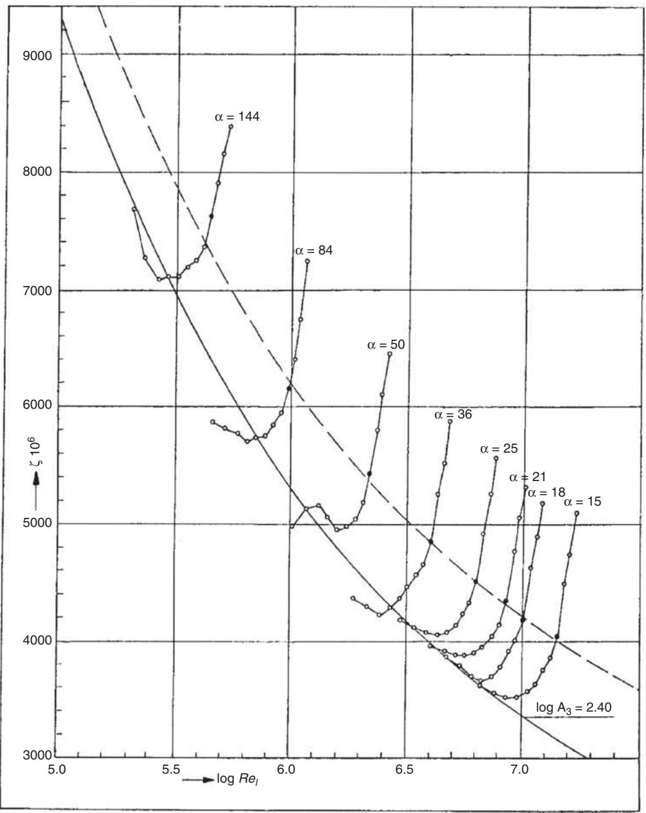  
Figure 4.4. The Simon Bolivar model family, α = scale [4.8].

Froude found that he could express the results in the empirical formula

$$
R = f \cdot S \cdot V ^ {\mathrm{n}}. \tag {4.6}
$$

The coefficient f and index n were found to vary for both type and length of surface. The original findings are summarised as follows:

1. The coefficient f decreased with increasing plank length, with the exception of very short lengths.

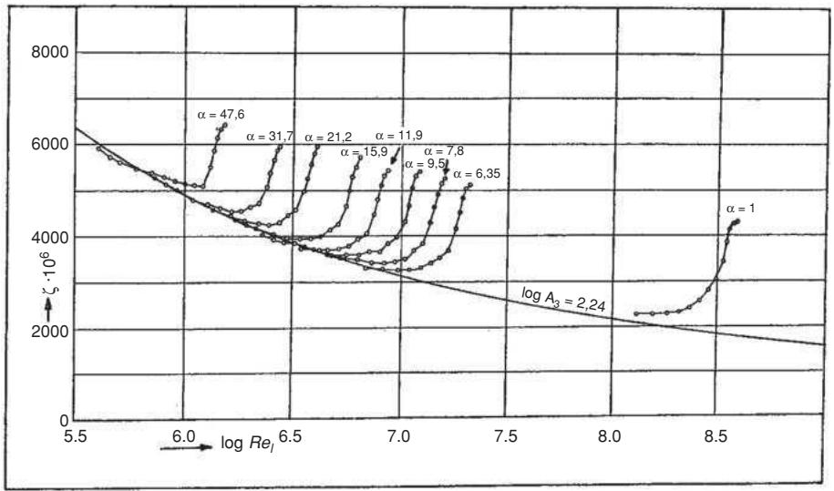

line

| log Re₁ | ξ (×10⁶) for α = 47.6 | ξ (×10⁶) for α = 31.7 | ξ (×10⁶) for α = 21.2 | ξ (×10⁶) for α = 15.9 | ξ (×10⁶) for α = 11.9 | ξ (×10⁶) for α = 7.8 | ξ (×10⁶) for α = 9.5 | ξ (×10⁶) for α = 6.35 |
| ------- | --------------------- | --------------------- | --------------------- | --------------------- | --------------------- | --------------------- | --------------------- | ---------------------- |
| 5.5     | ~6000                 | ~6000                 | ~6000                 | ~6000                 | ~6000                 | ~6000                 | ~6000                 | ~6000                  |
| 6.0     | ~5000                 | ~5000                 | ~5000                 | ~5000                 | ~5000                 | ~5000                 | ~5000                 | ~5000                  |
| 6.5     | ~4500                 | ~4500                 | ~4500                 | ~4500                 | ~4500                 | ~4500                 | ~4500                 | ~4500                  |
| 7.0     | ~4000                 | ~4000                 | ~4000                 | ~4000                 | ~4000                 | ~4000                 | ~4000                 | ~4000                  |
| 7.5     | ~3500                 | ~3500                 | ~3500                 | ~3500                 | ~3500                 | ~3500                 | ~3500                 | ~3500                  |
| 8.0     | ~3000                 | ~3000                 | ~3000                 | ~3000                 | ~3000                 | ~3000                 | ~3000                 | ~3000                  |
| 8.5     | ~2500                 | ~2500                 | ~2500                 | ~2500                 | ~2500                 | ~2500                 | ~2500                 | ~2500                  |
| 9.0     | ~2244                 | ~2244                 | ~2244                 | ~2244                 | ~2244                 | ~2244                 | ~2244                 | ~2244                  |

Figure 4.5. The Lucy Ashton model family, α = scale [4.8].

2. The index n is appreciably less than 2 with the exception of rough surfaces when it approaches 2 (is >2 for a very short/very smooth surface).   
3. The degree of roughness of the surface has a marked influence on the magnitude of f.

Froude summarised his values for f and n for varnish, paraffin wax, fine sand and coarse sand for plank lengths up to 50 ft (for >50 ft Froude suggested using f for 49–50 ft).

R. E. Froude (son of W. Froude) re-examined the results obtained by his father and, together with data from other experiments, considered that the results of planks having surfaces corresponding to those of clean ship hulls or to paraffin wax models could be expressed as the following:

$$
R _ {F} = f \cdot S \cdot V ^ {1. 8 2 5}, \tag {4.7}
$$

with associated table of f values, see Table 4.1.

If Froude’s data are plotted on a Reynolds Number base, then the results appear as follows:

$$
R = f \cdot S \cdot V ^ {1. 8 2 5}.
$$

$$
C _ {F} = R / \frac {1}{2} \rho S V ^ {2} = 2 \cdot f \cdot V ^ {- 0. 1 7 5} / \rho
$$

$$
= 2 \cdot f \cdot V ^ {- 0. 1 7 5} \cdot R e ^ {- 0. 1 7 5} / \rho L ^ {- 0. 1 7 5},
$$

then

$$
C _ {F} = f ^ {\prime} \cdot R e ^ {- 0. 1 7 5},
$$

Table 4.1. R.E. Froude’s skin friction f values 

<table><tr><td>Length (m)</td><td>f</td><td>Length (m)</td><td>f</td><td>Length (m)</td><td>f</td></tr><tr><td>2.0</td><td>1.966</td><td>11</td><td>1.589</td><td>40</td><td>1.464</td></tr><tr><td>2.5</td><td>1.913</td><td>12</td><td>1.577</td><td>45</td><td>1.459</td></tr><tr><td>3.0</td><td>1.867</td><td>13</td><td>1.566</td><td>50</td><td>1.454</td></tr><tr><td>3.5</td><td>1.826</td><td>14</td><td>1.556</td><td>60</td><td>1.447</td></tr><tr><td>4.0</td><td>1.791</td><td>15</td><td>1.547</td><td>70</td><td>1.441</td></tr><tr><td>4.5</td><td>1.761</td><td>16</td><td>1.539</td><td>80</td><td>1.437</td></tr><tr><td>5.0</td><td>1.736</td><td>17</td><td>1.532</td><td>90</td><td>1.432</td></tr><tr><td>5.5</td><td>1.715</td><td>18</td><td>1.526</td><td>100</td><td>1.428</td></tr><tr><td>6.0</td><td>1.696</td><td>19</td><td>1.520</td><td>120</td><td>1.421</td></tr><tr><td>6.5</td><td>1.681</td><td>20</td><td>1.515</td><td>140</td><td>1.415</td></tr><tr><td>7.0</td><td>1.667</td><td>22</td><td>1.506</td><td>160</td><td>1.410</td></tr><tr><td>7.5</td><td>1.654</td><td>24</td><td>1.499</td><td>180</td><td>1.404</td></tr><tr><td>8.0</td><td>1.643</td><td>26</td><td>1.492</td><td>200</td><td>1.399</td></tr><tr><td>8.5</td><td>1.632</td><td>28</td><td>1.487</td><td>250</td><td>1.389</td></tr><tr><td>9.0</td><td>1.622</td><td>30</td><td>1.482</td><td>300</td><td>1.380</td></tr><tr><td>9.5</td><td>1.613</td><td>35</td><td>1.472</td><td>350</td><td>1.373</td></tr><tr><td>10.0</td><td>1.604</td><td></td><td></td><td></td><td></td></tr></table>

where $f ^ { \prime }$ depends on length. According to the data, $f ^ { \prime }$ increases with length as seen in Figure 4.6 [4.12].

On dimensional grounds this is not admissible since $C _ { F }$ should be a function of Re only. It should be noted that Froude was unaware of dimensional analysis, or of the work of Reynolds [4.13].

Although it was not recognised at the time, the Froude data exhibited three boundary layer characteristics. Referring to the classical work of Nikuradse,

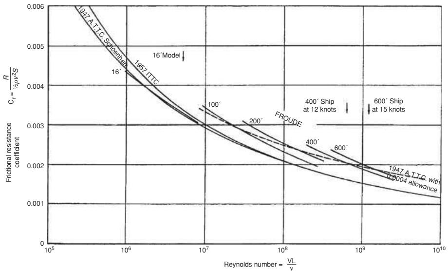

line

| Reynolds number = VL/v | Frictional resistance coefficient |
| ---------------------- | ---------------------------------- |
| 10^5                   | 0.006                              |
| 10^6                   | 0.004                              |
| 10^7                   | 0.003                              |
| 10^8                   | 0.002                              |
| 10^9                   | 0.0015                             |
| 10^10                  | 0.001                              |

Figure 4.6. Comparison of different friction formulae.

line

| Re     | CF (Laminar) | CF (Smooth turbulent) |
| ------ | ------------ | --------------------- |
| Low    | High         | Low                   |
| Mid    | Medium       | Medium                |
| High   | Low          | Low                   |

Figure 4.7. Effects of laminar flow and roughness on $C _ { F }$ .

Figure 4.7, and examining the Froude results in terms of $R e ,$ , the following characteristics are evident.

(i) The Froude results for lengths < 20 ft are influenced by laminar or transitional flow; Froude had recorded anomalies.   
(ii) At high $R e , C _ { F }$ for rough planks becomes constant independent of $R e$ at a level that depends on roughness, Figure 4.7; $C _ { F }$ constant implies $R \ : \alpha V ^ { 2 }$ as Froude observed.   
(iii) Along sharp edges of the plank, the boundary layer is thinner; hence $C _ { F }$ is higher. Hence, for the constant plank depth used by Froude, the edge effect is more marked with an increase in plank length; hence $f ^ { \prime }$ increases with length.

The Froude values of $f ,$ hence $C _ { F } ,$ for higher ship length (high $R e )$ , lie well above the smooth turbulent line, Figure 4.6. The Froude data are satisfactory up to about 500 ft (152 m) ship length, and are still in use, but are obviously in error for large ships when the power by Froude is overestimated (by up to 15%). Froude $f$ values are listed in Table 4.1, where $L$ is waterline length (m) and units in Equation (4.7) are as follows: V is speed (m/s), S is wetted area $( \mathbf { m } ^ { 2 } )$ and $R _ { F }$ is frictional resistance (N).

A reasonable approximation (within 1.5%) to the table of f values is

$$
f = 1. 3 8 + 9. 4 / [ 8. 8 + (L \times 3. 2 8) ] (L \text { in   metres }). \tag {4.8}
$$

R. E. Froude also established the circular non-dimensional notation, [4.14], together with the use of $\cdot _ { \mathrm { { O } ^ { \prime } } }$ values for the skin friction correction, see Sections 3.1 and 10.3.

# 4.3.2 Schoenherr Formula

In the early 1920s Von Karman deduced a friction law for flat plates based on a two-dimensional analysis of turbulent boundary layers. He produced a theoretical ‘smooth turbulent’ friction law of the following form:

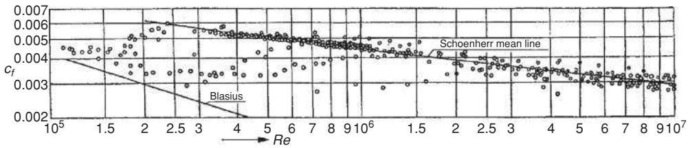

scatter

| Re       | Cf      |
| -------- | ------- |
| 10^5     | 0.004   |
| 1.5      | 0.004   |
| 2        | 0.005   |
| 2.5      | 0.005   |
| 3        | 0.005   |
| 4        | 0.005   |
| 5        | 0.005   |
| 6        | 0.005   |
| 7        | 0.005   |
| 8        | 0.005   |
| 9        | 0.005   |
| 10^6     | 0.005   |
| 1.5      | 0.004   |
| 2        | 0.004   |
| 2.5      | 0.004   |
| 3        | 0.004   |
| 4        | 0.003   |
| 5        | 0.003   |
| 6        | 0.003   |
| 7        | 0.003   |
| 8        | 0.003   |
| 9        | 0.003   |
| 10^7     | 0.003   |

scatter

| Re       | Cf      |
| -------- | ------- |
| 10^7     | 0.003   |
| 1.5      | 0.0028  |
| 2        | 0.0026  |
| 2.5      | 0.0024  |
| 3        | 0.0022  |
| 4        | 0.002   |
| 5        | 0.0018  |
| 6        | 0.0016  |
| 7        | 0.0015  |
| 8        | 0.0014  |
| 9        | 0.0013  |
| 10^8     | 0.0012  |
| 1.5      | 0.0011  |
| 2        | 0.001   |
| 2.5      | 0.0009  |
| 3        | 0.0008  |
| 4        | 0.0007  |
| 5        | 0.0006  |
| 6        | 0.0005  |
| 7        | 0.0004  |
| 8        | 0.0003  |
| 9        | 0.0002  |
| 10^9     | 0.0001  |

Figure 4.8. The Schoenherr mean line for $C _ { F }$ .

$$
1 / \sqrt {C _ {F}} = A + B \operatorname{Log} (R e \cdot C _ {F}), \tag {4.9}
$$

where A and B were two undetermined constants. Following the publication of this formula, Schoenherr replotted all the available experimental data from plank experiments both in air and water and attempted to determine the constants A and B to suit the available data, [4.15]. He determined the following formula:

$$
1 / \sqrt {C _ {F}} = 4. 1 3 \log_ {1 0} (R e \cdot C _ {F}) \tag {4.10}
$$

The use of this formula provides a better basis for extrapolating beyond the range of the experimental data than does the Froude method simply because of the theoretical basis behind the formula. The data published by Schoenherr as a basis for his line are shown in Figure 4.8 from [4.16]. The data show a fair amount of scatter and clearly include both transition and edge effects, and the mean line shown must be judged in this light. The Schoenherr line was adopted by the American Towing Tank Conference (ATTC) in 1947. When using the Schoenherr line for model-ship extrapolation, it has been common practice to add a roughness allowance $\Delta C _ { F } =$ 0.0004 to the ship value, see Figure 4.6.

The Schoenherr formula is not very convenient to use since $C _ { F }$ is not explicitly defined for a given $R e .$ . In order to determine $C _ { F }$ for a given $R e ,$ , it is necessary to assume a range of $C _ { F } ,$ calculate the corresponding Re and then interpolate. Such iterations are, however, simple to carry out using a computer or spreadsheet. A reasonable fit to the Schoenherr line (within 1%) for preliminary power estimates is given in [4.17]

$$
C _ {F} = \frac {1}{(3 . 5 \log_ {1 0} R e - 5 . 9 6) ^ {2}}. \tag {4.11}
$$

Table 4.2. Variation in $C _ { F }$ with Re 

<table><tr><td>Re</td><td> $C_{F}$ </td><td> $\log_{10} Re$ </td><td> $\log_{10} C_{F}$ </td></tr><tr><td> $10^{5}$ </td><td> $8.3 \times 10^{-3}$ </td><td>5</td><td>-2.06</td></tr><tr><td> $10^{9}$ </td><td> $1.53 \times 10^{-3}$ </td><td>9</td><td>-2.83</td></tr></table>

# 4.3.3 The ITTC Formula

Several proposals for a more direct formula which approximates the Schoenherr values have been made. The Schoenherr formula (Equation (4.10)) can be expanded as follows:

$$
1 / \sqrt {C _ {F}} = 4. 1 3 \log_ {1 0} (R e. C _ {F}) = 4. 1 3 (\log_ {1 0} R e + \log_ {1 0} C _ {F}). \tag {4.12}
$$

$C _ { F }$ and log $C _ { F }$ vary comparatively slowly with Re as shown in Table 4.2. Thus, a formula of the form

$$
1 / \sqrt {C _ {F}} = A (\log_ {1 0} R e - B)
$$

may not be an unreasonable approximation with B assumed as 2. The formula can then be rewritten as:

$$
C _ {F} = \frac {A ^ {\prime}}{(\log_ {1 0} R e - 2) ^ {2}}. \tag {4.13}
$$

There are several variations of this formula type which are, essentially, approximations of the Schoenherr formula.

In 1957 the ITTC adopted one such formula for use as a ‘correlation line’ in powering calculations. It is termed the ‘ITTC1957 model-ship correlation line’. This formula was based on a proposal by Hughes [4.4] for a two-dimensional line of the following form:

$$
C _ {F} = \frac {0 . 0 6 6}{(\log_ {1 0} R e - 2 . 0 3) ^ {2}}. \tag {4.14}
$$

The ITTC1957 formula incorporates some three-dimensional friction effects and is defined as:

$$
C _ {F} = \frac {0 . 0 7 5}{(\log_ {1 0} R e - 2) ^ {2}}. \tag {4.15}
$$

It is, in effect, the Hughes formula (Equation (4.14)) with a 12% form effect built in.

A comparison of the ITTC correlation line and the Schoenherr formula, Figure 4.6, indicates that the ITTC line agrees with the Schoenherr formula at ship Re values, but is above the Schoenherr formula at small Re values. This was deliberately built into the ITTC formula because experience with using the Schoenherr formula indicated that the smaller models were overestimating ship powers in comparison with identical tests with larger models.

At this point it should be emphasised that there is no pretence that these various formulae represent the drag of flat plates (bearing in mind the effects of roughness and edge conditions) and certainly not to claim that they represent the skin friction (tangential shear stress) resistance of an actual ship form, although they may be a tolerable approximation to the latter for most forms. These lines are used simply as correlation lines from which to judge the scaling allowance to be made between model and ship and between ships of different size.

The ITTC1978 powering prediction procedure (see Chapter 5) recommends the use of Equation (4.15), together with a form factor. The derivation of the form factor (1 + k) is discussed in Section 4.4.

# 4.3.4 Other Proposals for Friction Lines

# 4.3.4.1 Grigson Formula

The most serious alternative to the Schoenherr and ITTC formulae is a proposal by Grigson [4.18], who argues the case for small corrections to the ITTC formula, Equation (4.15), at low and high Reynolds numbers. Grigson’s proposal is as follows:

$$
\begin{array}{l} C _ {F} = \left[ 0. 9 3 + 0. 1 3 7 7 (\log R e - 6. 3) ^ {2} - 0. 0 6 3 3 4 (\log R e - 6. 3) ^ {4} \right] \\ \times \frac {0 . 0 7 5}{(\log_ {1 0} R e - 2) ^ {2}}, \tag {4.16} \\ \end{array}
$$

$\mathrm { f o r } 1 . 5 \times 1 0 ^ { 6 } < R e < 2 \times 1 0 ^ { 7 } .$

$$
\begin{array}{l} C _ {F} = \left[ 1. 0 3 2 + 0. 0 2 8 1 6 (\log R e - 8) - 0. 0 0 6 2 7 3 (\log R e - 8) ^ {2} \right] \\ \times \frac {0 . 0 7 5}{(\log_ {1 0} R e - 2) ^ {2}}, \tag {4.17} \\ \end{array}
$$

for $1 0 ^ { 8 } < R e < 4 \times 1 0 ^ { 9 }$ .

It seems to be agreed, in general, that the Grigson approach is physically more correct than the existing methods. However, the differences and improvements between it and the existing methods tend to be small enough for the test tank community not to adopt it for model-ship extrapolation purposes, ITTC [4.19, 4.20]. Grigson suggested further refinements to his approach in [4.21].

# 4.3.4.2 CFD Methods

Computational methods have been used to simulate a friction line. An example of such an approach is provided by Date and Turnock [4.22] who used a Reynolds averaged Navier–Stokes (RANS) solver to derive friction values over a plate for a range of speeds, and to develop a resistance correlation line. The formula produced was very close to the Schoenherr line. This work demonstrated the ability of computational fluid dynamics (CFD) to predict skin friction reasonably well, with the potential also to predict total viscous drag and form factors. This is discussed further in Chapter 9.

# 4.4 Derivation of Form Factor (1 + k)

It is clear from Equation (4.5) that the size of the form factor has a direct influence on the model to ship extrapolation process and the size of the ship resistance estimate. These changes occur because of the change in the proportion of viscous to wave resistance components, i.e. Re and Fr dependency. For example, when extrapolating model resistance to full scale, an increase in derived (or assumed) model $( 1 + k )$ will result in a decrease in $C _ { W }$ and a decrease in the estimated full-scale resistance. Methods of estimating $( 1 + k )$ include experimental, numerical and empirical.

# 4.4.1 Model Experiments

There are a number of model experiments that allow the form factor to be derived directly or indirectly. These are summarised as follows:

1. The model is tested at very low Fr until $C _ { T }$ runs parallel with $C _ { F }$ , Figure 4.9. In this case, $C _ { W }$ tends to zero and $( 1 + k ) = C _ { T } / C _ { F }$ .   
2. $C _ { W }$ is extrapolated back at low speeds. The procedure assumes that:

$$
R _ {W} \propto V ^ {6} \quad \mathrm{or} \quad C _ {W} \propto R _ {W} / V ^ {2} \propto V ^ {4}
$$

that is

$$
C _ {W} \propto F r ^ {4}, \quad \mathrm{or} \quad C _ {W} = A F r ^ {4},
$$

where A is a constant. Hence, from two measurements of $C _ { T }$ at relatively low speeds, and using $C _ { T } = \left( 1 + k \right) C _ { F } + A F r ^ { 4 } , \left( 1 + k \right)$ can be found. Speeds as low as $F r =$ 0.1∼0.2 are necessary for this method and a problem exists in that it is generally difficult to achieve accurate resistance measurements at such low speeds.

The methods described are attributable to Hughes. Prohaska [4.23] uses a similar technique but applies more data points to the equation as follows:

$$
C _ {T} / C _ {F} = (1 + k) + A F r ^ {4} / C _ {F}, \tag {4.18}
$$

where the intercept is $( 1 + k )$ , and the slope is A, Figure 4.10.

For full form vessels the points may not plot on a straight line and a power of $F r$ between 4 and 6 may be more appropriate.

A later ITTC recommendation as a modification to Prohaska is

$$
C _ {T} / C _ {F} = (1 + k) + A F r ^ {\mathrm{n}} / C _ {F}, \tag {4.19}
$$

where n, A and k are derived from a least-squares approximation.

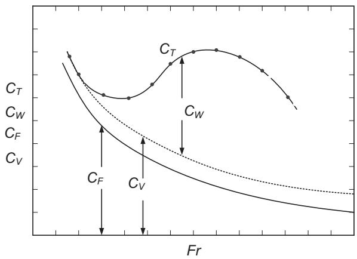

line

| Fr   | CT     | CW     | CF     | CV     |
|------|--------|--------|--------|--------|
| Low  | High   | High   | High   | High   |
| Mid  | Medium | Medium | Medium | Medium |
| High | Low    | Low    | Low    | Low    |

Figure 4.9. Resistance components.

scatter

| F_r^4 / C_F | C_T / C_F |
| ----------- | --------- |
| 0           | 0         |
| 1           | 1         |
| 2           | 2         |
| 3           | 3         |
| 4           | 4         |
| 5           | 5         |
| 6           | 6         |
| 7           | 7         |
| 8           | 8         |
| 9           | 9         |
| 10          | 10        |

Figure 4.10. Prohaska plot.

3. (1 + k) from direct physical measurement of resistance components:

$$
\begin{array}{l} C _ {T} = (1 + k) C _ {F} + C _ {W} \\ = C _ {V} + C _ {W}. \\ \end{array}
$$

(a) Measurement of total viscous drag, CV (e.g. from a wake traverse; see Chapter 7):

$$
C _ {V} = (1 + k) C _ {F}, \text {   and   } (1 + k) = C _ {V} / C _ {F}.
$$

(b) Measurement of wave pattern drag, CW (e.g. using wave probes, see Chapter 7):

$$
(1 + k) C _ {F} = C _ {T} - C _ {W}, \text {   and   } (1 + k) = (C _ {T} - C _ {W}) / C _ {F}.
$$

Methods 3(a) and 3(b) are generally used for research purposes, rather than for routine testing, although measurement of wave pattern drag on a routine basis is a practical option. It should be noted that methods 3(a) and 3(b) allow the derivation of (1 + k) over the whole speed range and should indicate any likely changes in (1 + k) with speed.

# 4.4.2 CFD Methods

CFD may be employed to derive viscous drag and form factors. The derivation of a friction line using a RANS solver is discussed in Section 4.3.4.2. Form factors for ellipsoids, both in monohull and catamaran configurations, were estimated by Molland and Utama [4.24] using a RANS solver and wind tunnel tests. The use of CFD for the derivation of viscous drag and skin friction drag is discussed further in Chapter 9.

# 4.4.3 Empirical Methods

Several investigators have developed empirical formulae for (1 + k) based on model test results. The following are some examples which may be used for practical powering purposes.

Table 4.3. $C _ { s t e r n }$ parameter 

<table><tr><td>Afterbody form</td><td> $C_{\text{stern}}$ </td></tr><tr><td>Pram with gondola</td><td>-25</td></tr><tr><td>V-shaped sections</td><td>-10</td></tr><tr><td>Normal section shape</td><td>0</td></tr><tr><td>U-shaped sections with Hogner stern</td><td>10</td></tr></table>

Watanabe:

$$
k = - 0. 0 9 5 + 2 5. 6 \frac {C _ {B}}{\left[ \frac {L}{B} \right] ^ {2} \sqrt {\frac {B}{T}}}. \tag {4.20}
$$

Conn and Ferguson [4.9]:

$$
k = 1 8. 7 \left[ C _ {B} \frac {B}{L} \right] ^ {2}. \tag {4.21}
$$

Grigson [4.21], based on a slightly modified ITTC line:

$$
k = 0. 0 2 8 + 3. 3 0 \left[ \frac {S}{L ^ {2}} \sqrt {C _ {B} \frac {B}{L}} \right]. \tag {4.22}
$$

Holtrop regression [4.25]:

$$
(1 + k) = 0. 9 3 + 0. 4 8 7 1 1 8 (1 + 0. 0 1 1 C _ {\text { stern }}) \times (B / L) ^ {1. 0 6 8 0 6} (T / L) ^ {0. 4 6 1 0 6}
$$

$$
\times (L _ {W L} / L _ {R}) ^ {0. 1 2 1 5 6 3} (L _ {W L} ^ {3} / \nabla) ^ {0. 3 6 4 8 6} \times (1 - C _ {P}) ^ {- 0. 6 0 4 2 4 7}. \tag {4.23}
$$

If the length of run $L _ { R }$ is not known, it may be estimated using the following formula:

$$
L _ {R} = L _ {W L} \left[ 1 - C _ {P} + \frac {0 . 0 6 C _ {P} L C B}{\left(4 C _ {P} - 1\right)} \right], \tag {4.24}
$$

where $L C B$ is a percentage of $L _ { W L }$ forward of 0.5LWL. The stern shape parameter $C _ { \mathrm { s t e r n } }$ for different hull forms is shown in Table 4.3.

Wright [4.26]:

$$
(1 + k) = 2. 4 8 0 C _ {B} ^ {0. 1 5 2 6} (B / T) ^ {0. 0 5 3 3} (B / L _ {B P}) ^ {0. 3 8 5 6}. \tag {4.25}
$$

Couser et al. [4.27], suitable for round bilge monohulls and catamarans:

$$
\text { Monohulls: } (1 + k) = 2. 7 6 (L / \nabla^ {1 / 3}) ^ {- 0. 4}. \tag {4.26}
$$

$$
\text { Catamarans: } (1 + \beta k) = 3. 0 3 (L / \nabla^ {1 / 3}) ^ {- 0. 4 0}. \tag {4.27}
$$

For practical purposes, the form factor is assumed to remain constant over the speed range and between model and ship.

# 4.4.4 Effects of Shallow Water

Millward [4.28] investigated the effects of shallow water on form factor. As a result of shallow water tank tests, he deduced that the form factor increases as water depth decreases and that the increase in form factor could be approximated by the relationship:

$$
\Delta k = 0. 6 4 4 (T / h) ^ {1. 7 2}, \tag {4.28}
$$

where T is the ship draught (m) and h the water depth (m).

# REFERENCES (CHAPTER 4)

4.1 Froude, W. Experiments on the surface-friction experienced by a plane moving through water, 42nd Report of the British Association for the Advancement of Science, Brighton, 1872.   
4.2 Froude, W. Report to the Lords Commissioners of the Admiralty on experiments for the determination of the frictional resistance of water on a surface, under various conditions, performed at Chelston Cross, under the Authority of their Lordships, 44th Report of the British Association for the Advancement of Science, Belfast, 1874.   
4.3 Froude, W. The Papers of William Froude. The Royal Institution of Naval Architects, 1955.   
4.4 Hughes, G. Friction and form resistance in turbulent flow and a proposed formulation for use in model and ship correlation. Transactions of the Royal Institution of Naval Architects, Vol. 96, 1954, pp. 314–376.   
4.5 Telfer, E.V. Ship resistance similarity. Transactions of the Royal Institution of Naval Architects, Vol. 69, 1927, pp. 174–190.   
4.6 Telfer, E.V. Frictional resistance and ship resistance similarity. Transactions of the North East Coast Institution of Engineers and Shipbuilders, 1928/29.   
4.7 Telfer, E.V. Further ship resistance similarity. Transactions of the Royal Institution of Naval Architects, Vol. 93, 1951, pp. 205–234.   
4.8 Lap, A.J.W. Frictional drag of smooth and rough ship forms. Transactions of the Royal Institution of Naval Architects, Vol. 98, 1956, pp. 137–172.   
4.9 Conn, J.F.C. and Ferguson, A.M. Results obtained with a series of geometrically similar models. Transactions of the Royal Institution of Naval Architects, Vol. 110, 1968, pp. 255–300.   
4.10 Conn, J.F.C., Lackenby, H. and Walker, W.P. BSRA Resistance experiments on the Lucy Ashton. Transactions of the Royal Institution of Naval Architects, Vol. 95, 1953, pp. 350–436.   
4.11 Barnaby, K.C. Basic Naval Architecture. Hutchinson, London, 1963.   
4.12 Clements, R.E. An analysis of ship-model correlation using the 1957 ITTC line. Transactions of the Royal Institution of Naval Architects, Vol. 101, 1959, pp. 373–402.   
4.13 Reynolds, O. An experimental investigation of the circumstances which determine whether the motion of water shall be direct or sinuous, and the law of resistance in parallel channels. Philosophical Transactions of the Royal Society, Vol. 174, 1883, pp. 935–982.   
4.14 Froude, R.E. On the ‘constant’ system of notation of results of experiments on models used at the Admiralty Experiment Works, Transactions of the Royal Institution of Naval Architects, Vol. 29, 1888, pp. 304–318.   
4.15 Schoenherr, K.E. Resistance of flat surfaces moving through a fluid. Transactions of the Society of Naval Architects and Marine Engineers. Vol. 40, 1932.   
4.16 Lap, A.J.W. Fundamentals of ship resistance and propulsion. Part A Resistance. Publication No. 129a of the Netherlands Ship Model Basin, Wageningen. Reprinted in International Shipbuilding Progress.   
4.17 Zborowski, A. Approximate method for estimating resistance and power of twin-screw merchant ships. International Shipbuilding Progress, Vol. 20, No. 221, January 1973, pp. 3–11.

4.18 Grigson, C.W.B. An accurate smooth friction line for use in performance prediction. Transactions of the Royal Institution of Naval Architects, Vol. 135, 1993, pp. 149–162.   
4.19 ITTC. Report of Resistance Committee, p. 64, 23rd International Towing Tank Conference, Venice, 2002.   
4.20 ITTC. Report of Resistance Committee, p. 38, 25th International Towing Tank Conference, Fukuoka, 2008.   
4.21 Grigson, C.W.B. A planar friction algorithm and its use in analysing hull resistance. Transactions of the Royal Institution of Naval Architects, Vol. 142, 2000, pp. 76–115.   
4.22 Date, J.C. and Turnock, S.R. Computational fluid dynamics estimation of skin friction experienced by a plane moving through water. Transactions of the Royal Institution of Naval Architects, Vol. 142, 2000, pp. 116–135.   
4.23 ITTC Recommended Procedure, Resistance Test 7.5-02-02-01, 2008.   
4.24 Molland, A.F. and Utama, I.K.A.P. Experimental and numerical investigations into the drag characteristics of a pair of ellipsoids in close proximity. Proceedings of the Institution of Mechanical Engineers, Vol. 216, Part M. Journal of Engineering for the Maritime Environment, 2002.   
4.25 Holtrop, J. A statistical re-analysis of resistance and propulsion data. International Shipbuilding Progress, Vol. 31, November 1984, pp. 272–276.   
4.26 Wright, B.D.W. Apparent viscous levels of resistance of a series of model geosims. BSRA Report WG/H99, 1984.   
4.27 Couser, P.R., Molland, A.F., Armstrong, N.A. and Utama, I.K.A.P. Calm water powering prediction for high speed catamarans. Proceedings of 4th International Conference on Fast Sea Transportation, FAST’97, Sydney, 1997.   
4.28 Millward, A. The effects of water depth on hull form factor. International Shipbuilding Progress, Vol. 36, No. 407, October 1989.

# 5 Model-Ship Correlation

# 5.1 Purpose

When making conventional power predictions, no account is usually taken of scale effects on:

(1) Hull form effect,   
(2) Wake and thrust deduction factors,   
(3) Scale effect on propeller efficiency,   
(4) Uncertainty of scaling laws for appendage drag.

Experience shows that power predictions can be in error and corrections need to be applied to obtain a realistic trials power estimate. Suitable correction (or correlation) factors have been found using voyage analysis techniques applied to trials data. The errors in predictions are most significant with large, slow-speed, high $C _ { B }$ vessels.

Model-ship correlation should not be confused with model-ship extrapolation. The extrapolation process entails extrapolating the model results to full scale to create the ship power prediction. The correlation process compares the full-scale ship power prediction with measured or expected full-scale ship results.

# 5.2 Procedures

# 5.2.1 Original Procedure

# 5.2.1.1 Method

Predictions of power and propeller revolutions per minute (rpm) are corrected to give the best estimates of trial-delivered power $P _ { D }$ and revs N , i.e.

$$
P _ {D s} = (1 + x) P _ {D} \tag {5.1}
$$

and

$$
N _ {S} = (1 + k _ {2}) N \tag {5.2}
$$

where $P _ { D }$ and N are tank predictions, $P _ { D s }$ and $N _ { S }$ are expected ship values, $( 1 + x )$ is the power correlation allowance (or ship correlation factor, SCF) and (1 + k2) is the rpm correction factor.

Factors used by the British Ship Research Association (BSRA) and the UK towing tanks for single-screw ships [5.1, 5.2, 5.3] have been derived from an analysis of more than 100 ships (mainly tankers) in the range 20 000–100 000 TDW, together with a smaller amount of data from trawlers and smaller cargo vessels. This correlation exercise involved model tests, after the trials, conducted in exactly the condition (draught and trim) of the corresponding ship trial. Regression analysis methods were used to correct the trial results for depth of water, sea condition, wind, time out of dock and measured hull roughness. The analysis showed a scatter of about 5% of power about the mean trend as given by the regression equation. This finding is mostly a reflection of measurement accuracies and represents the basic level of uncertainty in any power prediction.

# 5.2.1.2 Values of $( 1 + x )$ (SCF) and $( 1 + k _ { 2 } )$

VALUES OF $( 1 + x )$ These values vary greatly with ship size and the basic $C _ { F }$ formula used. Although they are primarily functions of ship length, other parameters, such as draught and $C _ { B }$ can have significant influences.

Typical values for these overall correction (correlation) factors are contained in [5.1], and some values for $( 1 + x )$ for ‘average hull/best trial’ are summarised in Table 5.1.

A suitable approximation to the Froude friction line SCF data is:

$$
\mathrm{SCF} = 1. 2 - \frac {\sqrt {L _ {B P}}}{4 8}; \tag {5.3}
$$

hence, estimated ship-delivered power

$$
P _ {D s} = (P _ {E} / \eta_ {D}) \times (1 + x). \tag {5.4}
$$

VALUES OF $( 1 ~ + ~ k _ { 2 } )$ . These values vary slightly depending on ship size (primarily length) and the method of analysis (torque or thrust identity) but, in general, they are of the order of 1.02; hence, estimated ship rpm

$$
N _ {s} = N _ {\text { model }} \times (1 + k _ {2}) \tag {5.5}
$$

In 1972–1973 the UK tanks published further refinements to the factors [5.2, 5.3]. The predictions were based on $( 1 + x ) _ { \mathrm { I T T C } }$ of unity, with corrections for roughness and draught different from assumed standard values. The value of $k _ { 2 }$ is based on length, plus corrections for roughness and draught.

Table 5.1. Typical values for ship correlation factor SCF (1 + x) 

<table><tr><td> $L_{BP}$  (m)</td><td>122</td><td>150</td><td>180</td><td>240</td><td>300</td></tr><tr><td>Froude friction line</td><td>0.97</td><td>0.93</td><td>0.90</td><td>0.86</td><td>0.85</td></tr><tr><td>ITTC friction line</td><td>1.17</td><td>1.12</td><td>1.08</td><td>1.04</td><td>1.02</td></tr></table>

Note: for L < 122 m, SCF  1.0 assumed.

Scott [5.4, 5.5] carried out multiple regression analyses on available data and determined (1 + x) and $k _ { 2 }$ in terms of length, hull roughness, Fr, $C _ { B }$ and so on. Some small improvements were claimed for each of the above methods.

# 5.2.2 ITTC1978 Performance Prediction Method

Recommendations of the International Towing Tank Conference (ITTC) through the 1970s led to a proposed new ‘unified’ method for power prediction. This method attempts to separate out and correct the various elements of the prediction process, rather than using one overall correlation factor such as (1 + x). This was generally accepted by most test tanks across the world in 1978 and the procedure is known as ‘The 1978 ITTC Performance Prediction Method for Single Screw Ships’ [5.6].

The process comprises three basic steps:

(1) Total resistance coefficient for ship, $C _ { T S }$

$$
C _ {T S} = (1 + k) C _ {F S} + C _ {R} + \Delta C _ {F} + C _ {A A}, \tag {5.6}
$$

(Note, ITTC chose to use $C _ { R }$ rather than $C _ { W } )$

where the form factor $( 1 + k )$ is based on the ITTC line,

$$
C _ {F} = \frac {0 . 0 7 5}{\left[ \log_ {1 0} R e - 2 \right] ^ {2}}. \tag {5.7}
$$

The residual coefficient $C _ { R }$ is the same for the model and ship and is derived as:

$$
C _ {R} = C _ {T M} - (1 + k) C _ {F M} \tag {5.8}
$$

The roughness allowance $\Delta C _ { F }$ is:

$$
\Delta C _ {F} = \left[ 1 0 5 \left(\frac {k _ {S}}{L}\right) ^ {1 / 3} - 0. 6 4 \right] \times 1 0 ^ {- 3}. \tag {5.9}
$$

If roughness measurements are lacking, $k _ { S } = 1 5 0 \times 1 0 ^ { - 6 }$ m is recommended.

The following equation, incorporating the effect of Re, has been proposed by Townsin [5.7]:

$$
\Delta C _ {F} = \left\{4 4 \left[ \left(\frac {k _ {S}}{L}\right) ^ {1 / 3} - 1 0 R e ^ {- 1 / 3} \right] + 0. 1 2 5 \right\} \times 1 0 ^ {- 3} \tag {5.10}
$$

It was a recommendation of the 19th ITTC (1990), and discussed in [5.8, 5.9], that if roughness measurements are available, then the Bowden – Davison formula, Equation (5.9), should be replaced by Townsin’s formula, Equation (5.10). It should be recognised that Equation (5.9) was recommended as a correlation allowance, including effects of roughness, rather than solely as a roughness allowance. Thus, the difference between Equations (5.9) and (5.10) may be seen as a component that is not accounted for elsewhere. This component amounts to:

$$
\left[ \Delta C _ {F} \right] _ {\text { Bowden }} - \left[ \Delta C _ {F} \right] _ {\text { Townsin }} = \left[ 5. 6 8 - 0. 6 \log_ {1 0} R e \right] \times 1 0 ^ {- 3}. \tag {5.11}
$$

Air resistance $C _ { A A }$ is approximated from Equation (5.12), when better information is not available, as follows.

$$
C _ {A A} = 0. 0 0 1 \frac {A _ {T}}{S}, \tag {5.12}
$$

where $A _ { T }$ is the transverse projected area above the waterline and S is the ship wetted area. See also Chapter 3 for methods of estimating air resistance.

If the ship is fitted with bilge keels, the total resistance is increased by the ratio:

$$
\frac {S + S _ {B K}}{S}
$$

where S is the wetted area of the naked hull and $S _ { B K }$ is the wetted area of the bilge keels.

# (2) Propeller characteristics

The values of $K _ { T } , K _ { Q }$ and $\eta _ { 0 }$ determined in open water tests are corrected for the differences in drag coefficient $C _ { D }$ between the model and full-scale ship.

$C _ { D M } > C _ { D S } ;$ hence, for a given J, $K _ { Q }$ full scale is lower and $K _ { T }$ higher than in the model case and $\eta _ { \theta }$ is larger full scale.

The full-scale characteristics are calculated from the model characteristics as follows:

$$
K _ {T S} = K _ {T M} + \Delta K _ {T}, \tag {5.13}
$$

and

$$
K _ {Q S} = K _ {Q M} - \Delta K _ {Q}, \tag {5.14}
$$

where

$$
\Delta K _ {T} = \Delta C _ {D} \cdot 0. 3 \frac {P}{D} \frac {c \cdot Z}{D}, \tag {5.15}
$$

$$
\Delta K _ {Q} = \Delta C _ {D} \cdot 0. 2 5 \frac {c \cdot Z}{D} \tag {5.16}
$$

The difference in drag coefficient is

$$
\Delta C _ {D} = C _ {D M} - C _ {D S} \tag {5.17}
$$

where

$$
C _ {D M} = 2 \left(1 + 2 \frac {t}{c}\right) \left[ \frac {0 . 0 4}{\left(R e _ {c o}\right) ^ {1 / 6}} - \frac {5}{\left(R e _ {c o}\right) ^ {2 / 3}} \right], \tag {5.18}
$$

and

$$
C _ {D S} = 2 \left(1 + 2 \frac {t}{c}\right) \left[ 1. 8 9 + 1. 6 2 \log_ {1 0} \frac {c}{k _ {p}} \right] ^ {- 2. 5}. \tag {5.19}
$$

In the above equations, Z is the number of blades, P/D is the pitch ratio, c is the chord length, t is the maximum thickness and $R e _ { c o }$ is the local Reynolds number at a non-dimensional radius $x = 0 . 7 5$ . The blade roughness is set at $k _ { p } = 3 0 \times 1 0 ^ { - 6 } \mathrm { ~ m ~ }$ . $R e _ { c o }$ must not be lower than $2 \times 1 0 ^ { 5 }$ at the open-water test.

When estimating $R e _ { c o } ~ ( = V _ { R } \cdot { c } / \nu )$ , an approximation to the chord ratio at $x =$ $0 . 7 5 \ : ( = 0 . 7 5 { \mathrm { R } } )$ , based on the Wageningen series of propellers (Figure 16.2) is:

$$
\left(\frac {c}{D}\right) _ {0. 7 5 R} = X _ {1} \times B A R, \tag {5.20}
$$

where $X _ { 1 } = 0 . 7 3 2$ for three blades, 0.510 for four blades and 0.413 for five blades.

An approximate estimate of the thickness t may be obtained from Table 12.4, and $V _ { R }$ is estimated as

$$
V _ {R} = \sqrt {V a ^ {2} + (0 . 7 5 \pi n D) ^ {2}}. \tag {5.21}
$$

It can also be noted that later regressions of the Wageningen propeller series data include corrections for Re, see Chapter 16.

(3) Propulsive coefficients $\eta _ { H } = ( 1 - t ) / ( 1 - w _ { T } )$ and ηR

Propulsive coefficients $\eta _ { H }$ and $\eta _ { R }$ determined from the self-propulsion (SP) test are corrected as follows. t and $\eta _ { R }$ are to be assumed the same for the ship and the model. The full-scale wake fraction $w _ { T }$ is calculated from the model wake fraction and thrust deduction factor as follows:

$$
w _ {T S} = (t + 0. 0 4) + \left(w _ {T M} - t - 0. 0 4\right) \frac {(1 + k) C _ {F S} + \Delta C _ {F}}{(1 + k) C _ {F M}}, \tag {5.22}
$$

where 0.04 takes into account the rudder effect and $\Delta C _ { F }$ is the roughness allowance as given by Equation (5.9).

The foregoing gives an outline of the ‘ITTC Performance Prediction Method’ for $P _ { D }$ and $N .$ The final trial prediction is obtained by multiplying $P _ { D }$ and $N$ by trial prediction coefficients $C _ { P }$ and $C _ { N }$ (or by introducing individual $\Delta C _ { F }$ and $\Delta w _ { T }$ corrections). $C _ { P }$ and $C _ { N }$ are introduced to account for any remaining differences between the predicted and the trial (in effect, $C _ { P }$ replaces $( 1 + x )$ and $C _ { N }$ replaces $\left( 1 + k _ { 2 } \right) )$ . The magnitude of these corrections depends on the model and trial test procedures used as well as the choice of prediction margin.

A full account of the ITTC1978 Procedure is given in [5.6]. Further reviews, discussions and updates are provided by the ITTC Powering Performance Committee [5.8, 5.9].

# 5.2.2.1 Advantages of the Method

A review by SSPA [5.10] indicates that the advantages of the ITTC1978 method are as follows:

No length correction is necessary for $C _ { P }$ and $C _ { N }$ .

The same correction is satisfactory for load and ballast.

The standard deviation is better than the original method, although the scatter in $C _ { P }$ and $C _ { N }$ is still relatively large (within 6% and 2% of mean).

# 5.2.2.2 Shortcomings of the Method

The methods of estimating form factor $( 1 + k )$ (e.g. low-speed tests or assuming that $C _ { W } \propto F r ^ { 4 } )$ lead to errors and it may also not be correct to assume that $( 1 + k )$ is independent of $F r$ .

$\Delta C _ { F }$ is empirical and approximate.

$\Delta C _ { D }$ correction to propeller is approximate, and a $C _ { L }$ correction is probably required because there is some change with $R e .$ .

$\eta _ { R }$ has a scale effect which may be similar to measurement errors.

$w _ { T }$ correction is empirical and approximate. However, CFD is being used to predict model and full-scale wake distributions (see Chapters 8 and 9) and full-scale LDV measurements are being carried out which should contribute to improving the model–full-scale correlation.

It should be noted that a number of tanks and institutions have chosen to use $C _ { A }$ as an overall ‘correlation allowance’ rather than to use $\Delta C _ { F } .$ . In effect, this is defining Equation (5.9) as $C _ { A }$ . Some tanks choose to include air drag in $C _ { A }$ . Regression analysis of test tank model resistance data, such as those attributable to Holtrop [5.11], tend to combine $\Delta C _ { F }$ and $C _ { A A }$ into $C _ { A }$ as an overall model-ship correlation allowance (see Equations (10.24) and (10.34)).

The ITTC1978 method has in general been adopted by test tanks, with some local interpretations and with updates of individual component corrections being applied as more data are acquired. Bose [5.12] gives a detailed review of variations from the ITTC method used in practice.

# 5.2.3 Summary

The use of the ITTC1978 method is preferred as it attempts to scale the individual components of the power estimate. It also allows updates to be made to the individual components as new data become available.

The original method, using an overall correlation factor such as that shown in Table 5.1, is still appropriate for use with results scaled using the Froude friction line(s), such as the BSRA series and other data of that era.

# 5.3 Ship Speed Trials and Analysis

# 5.3.1 Purpose

The principal purposes of ship speed trials may be summarised as follows:

(1) to fulfil contractual obligations for speed, power and fuel consumption.   
(2) to obtain performance and propulsive characteristics of the ship:

- speed through the water under trials conditions   
- power against speed   
- power against rpm   
- speed against rpm for in-service use.

(3) to obtain full-scale hull–propeller interaction/wake data.

(4) to obtain model-ship correlation data.

Detailed recommendations for the conduct of speed/power trials and the analysis of trials data are given in ITTC [ 5.8, 5.13, 5.14] and [5.15].

# 5.3.2 Trials Conditions

The preferred conditions may be summarised as:

- zero wind   
- calm water   
- deep water   
- minimal current and tidal influence.

# 5.3.3 Ship Condition

This will normally be a newly completed ship with a clean hull and propeller. It is preferable to take hull roughness measurements prior to the trials, typically leading to AHR values of 80–150 μm. The ITTC recommends an AHR not greater than 250 μm.

# 5.3.4 Trials Procedures and Measurements

Measurements should include:

(1) Water depth   
(2) Seawater SG and temperature   
(3) Wind speed and direction and estimated wave height   
(4) Ship draughts (foreward, aft and amidships for large ships); hence, trim and displacement (should be before and after trials, and an average is usually adequate)   
(5) Propeller rpm (N)   
(6) Power (P): possibly via BMEP, preferably via torque   
(7) Torque (Q): preferably via torsionmeter (attached to shaft) or strain gauge rosette on shaft and power $P = 2 \pi N Q$   
(8) Thrust measurement (possibly from main shaft thrust bearing/load cells): direct strain gauge measurements are generally for research rather than for routine commercial trials   
(9) Speed: speed measurements normally at fixed/constant rpm

Speed is derived from recorded time over a fixed distance (mile). Typically, time measurements are taken for four runs over a measured mile at a fixed heading (e.g. E  W  E) in order to cancel any effects of current, Figure 5.1. The mile is measured from posts on land or GPS. 1 Nm  6080 ft  1853.7 m; 1 mile  5280 ft.

text_image

V₃
V₄
V₂
V₁
1 Nm
Sufficient distance to reach
and maintain steady speed

Figure 5.1. Typical runs on a measured mile.

Table 5.2. Analysis of speed, including change in current 

<table><tr><td>No. of run</td><td>Speed over ground</td><td> $V_1$ </td><td> $V_2$ </td><td> $V_3$ </td><td> $V_4$ </td><td>Final</td><td>Current</td></tr><tr><td>1E</td><td>6.50</td><td></td><td></td><td></td><td></td><td></td><td>+1.01</td></tr><tr><td>2W</td><td>8.52</td><td>7.51</td><td></td><td></td><td></td><td></td><td>-1.01</td></tr><tr><td>3E</td><td>6.66</td><td>7.59</td><td>7.55</td><td></td><td></td><td></td><td>+0.85</td></tr><tr><td>4W</td><td>8.09</td><td>7.38</td><td>7.48</td><td>7.52</td><td></td><td></td><td>-0.58</td></tr><tr><td>5E</td><td>7.28</td><td>7.69</td><td>7.53</td><td>7.51</td><td>7.51</td><td>7.51</td><td>0.23</td></tr><tr><td>6W</td><td>7.43</td><td>7.36</td><td>7.52</td><td>7.53</td><td>7.52</td><td></td><td>-0.08</td></tr></table>

An analysis of speed, from distance/time and using a ‘mean of means’, is as follows:

$$
\left. \begin{array}{l} V _ {1} \\ V _ {2} \\ V _ {3} \\ V _ {4} \end{array} \right\} \left. \begin{array}{c} \frac {V _ {1} + V _ {2}}{2} \\ \frac {V _ {2} + V _ {3}}{2} \\ \frac {V _ {3} + V _ {4}}{2} \end{array} \right\} \left. \begin{array}{l} \sum V / 2 \\ \sum V / 2 \end{array} \right\} \sum V / 2, \tag {5.23}
$$

i.e. mean speed $V _ { m } = \{ V _ { 1 } + 3 V _ { 2 } + 3 V _ { 3 } + V _ { 4 } \} \times \frac { 1 } { 8 }$ . In principle, this eliminates the effect of current, see Table 5.2.

The process is repeated at different rpm, hence speed, to develop $P - V , P - N$ and V – N relationships.

(10) Record the use of the rudder during measured speed runs (typically varies up to 5 deg for coursekeeping)

# 5.3.5 Corrections

# 5.3.5.1 Current

This is carried out noting that current can change with time, Figure 5.2.

- testing when low current changes, or assuming linear change over the period of trial   
- running with/against current and using ‘mean of means’ speed effectively minimises/eliminates the problem, Table 5.2.

text_image

Mean
12 hours

Figure 5.2. Change in current with time.

# 5.3.5.2 Water Depth

Potential shallow water effects are considered relative to water depth h and depth Froude number

$$
F r _ {h} = \frac {V}{\sqrt {g h}},
$$

where $F r _ { h } < 1 . 0$ is subcritical and $F r _ { h } > 1 . 0$ is supercritical. Once operating near or approaching $F r _ { h } = 1$ , corrections will be required, usually based on water depth and ship speed.

The recommended limit on trial water depths, according to SNAME 73/21st ITTC code for sea trials, is a water depth $( h ) \ge 1 0 \ T \ V / \surd \ V L$ . According to the 12th/22nd ITTC, the recommended limit is the greater of $h \geq 3 ~ ( \mathbf { B } \times T ) ^ { 0 . 5 }$ and $h \geq 2 . 7 5 ~ V ^ { 2 } / \mathrm { g }$ . According to the ITTC procedure, it is the greater of $h \geq 6 . 0 A _ { M } { } ^ { 0 . 5 }$ and $h \geq 0 . 5 V ^ { 2 }$ .

At lower depths of water, shallow water corrections should be applied, such as that attributable to Lackenby [5.16]:

$$
\frac {\Delta V}{V} = 0. 1 2 4 2 \left[ \frac {A _ {M}}{h ^ {2}} - 0. 0 5 \right] + 1 - \left[ \tanh \left(\frac {g h}{V ^ {2}}\right) \right] ^ {0. 5}, \tag {5.24}
$$

where h is the depth of water, $A _ { M }$ is the midship area under water and $\Delta V$ is the speed loss due to the shallow water effect.

A more detailed account of shallow water effects is given in Chapter 6.

# 5.3.5.3 Wind and Weather

It is preferable that ship trials not be carried out in a sea state > Beaufort No. 3 and/or wind speed > 20 knots. For waves up to 2.0 m ITTC [5.14] recommends a resistance increase corrector, according to Kreitner, as

$$
\Delta R _ {T} = 0. 6 4 \xi_ {W} ^ {2} B ^ {2} C _ {B} \rho 1 / L, \tag {5.25}
$$

where $\xi _ { W }$ is the wave height. Power would then be corrected using Equations (3.67), (3.68), and (3.69).

BSRA WIND CORRECTION. The BSRA recommends that, for ship trials, the results should be corrected to still air conditions, including a velocity gradient allowance.

The trials correction procedure entails deducting the wind resistance (hence, power) due to relative wind velocity (taking account of the velocity gradient and using the $C _ { D }$ from model tests for a similar vessel) to derive the corresponding power in a vacuum. To this vacuum condition is added the power due to basic air resistance caused by the uniform wind generated by the ship forward motion.

If ship speed = V, head wind = U and natural wind gradient, Figure 5.3, is say

$$
{\frac {u}{U}} = \left({\frac {h}{H}}\right) ^ {1 / 5}
$$

i.e.

$$
u = U \left(\frac {h}{H}\right) ^ {1 / 5},
$$

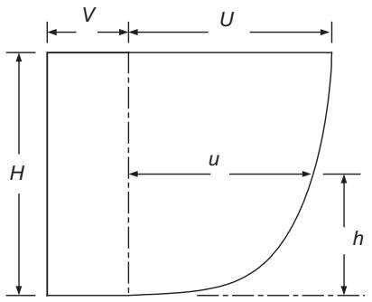

text_image

V
U
H
u
h

Figure 5.3. Wind velocity gradient.

$$
\text { the   correction } = \left\{- \int_ {0} ^ {H} (V + u) ^ {2} d h + V ^ {2} H \right\} \times \frac {1}{2} \rho \frac {A _ {T}}{H} C _ {D},
$$

where $\begin{array} { r } { \frac { A _ { T } } { H } = B . } \end{array}$ Note that the first term within the brackets corrects to a vacuum, and the second term corrects back to still air.

$$
\begin{array}{l} = \left\{- \int_ {0} ^ {H} \left(V + U \left[ \frac {h}{H} \right] ^ {1 / 5}\right) ^ {2} d h + V ^ {2} H \right\} \times \dots \dots . \\ = \left\{- \int_ {0} ^ {H} V ^ {2} + 2 \frac {V U}{H ^ {1 / 5}} h ^ {1 / 5} + \frac {U ^ {2}}{H ^ {2 / 5}} h ^ {2 / 5} d h + V ^ {2} H \right\} \times \dots \dots . \\ = \left\{- \left[ V ^ {2} h + 2 \frac {V U}{H ^ {1 / 5}} h ^ {6 / 5} \cdot \frac {5}{6} + \frac {U ^ {2}}{H ^ {2 / 5}} h ^ {7 / 5} \cdot \frac {5}{7} \right] _ {0} ^ {H} + V ^ {2} H \right\} \times \dots \tag {5.26} \\ \end{array}
$$

i.e. the correction to trials resistance to give ‘still air’ resistance.

$$
\begin{array}{l} \text { Correction } = \left\{- \frac {5}{7} U ^ {2} - \frac {5}{3} V U \right\} \times \frac {1}{2} \rho A _ {T} C _ {D} \\ = \left\{- \left[ V ^ {2} + 2 V U \cdot \frac {5}{6} + U ^ {2} \cdot \frac {5}{7} \right] H + V ^ {2} H \right\} \times \dots \tag {5.27} \\ \end{array}
$$

Breaks in area can be accounted for by integrating vertically in increments, e.g. 0 to $H _ { 1 } , H _ { 1 }$ to $H _ { 2 }$ etc. A worked example application in Chapter 17 illustrates the use of the wind correction.

# 5.3.5.4 Rudder

Calculate and subtract the added resistance due to the use of the rudder(s). This is likely to be small, in particular, in calm conditions.

# 5.3.6 Analysis of Correlation Factors and Wake Fraction

# 5.3.6.1 Correlation Factor

The measured ship power for a given speed may be compared with the model prediction. The process may need a displacement $( \Delta ^ { 2 / 3 } )$ correction to full-scale resistance (power) if the ship $\Delta$ is not the same as the model, or the model may be retested at trials $\Delta$ if time and costs allow.

line

| Region | K_T  | K_Q  | η_0  | K_QS |
|--------|------|------|------|------|
| J      | -    | -    | -    | -    |
| Ja     | -    | -    | -    | -    |

Figure 5.4. Ja from torque identity.

# 5.3.6.2 Wake Fraction

Assuming that thrust measurements have not been made on trial, which is usual for most commercial tests, the wake fraction will be derived using a torque identity method, i.e. using measured ship torque $Q _ { S }$ at revs $n _ { S }$ ,

$$
K _ {Q S} = Q _ {S} / \rho n _ {S} ^ {2} D ^ {5}.
$$

The propeller open water chart is entered, at the correct $P / D$ for this propeller, with ship $K _ { Q S }$ to derive the ship value of Ja, Figure 5.4.

The full-scale ship wake fraction is then derived as follows:

$$
J a = \frac {V a}{n D} = \frac {V s (1 - w _ {T})}{n D}
$$

and

$$
J s = \frac {V s}{n D},
$$

hence,

$$
(1 - w _ {T}) = \frac {J a n D}{V s} = \frac {J a}{J s}
$$

and

$$
w _ {T} = 1 - \frac {J a}{J s} = 1 - \frac {V a}{V s}. \tag {5.28}
$$

A worked example application in Chapter 17 illustrates the derivation of a fullscale wake fraction.

It can be noted that most test establishments use a thrust identity in the analysis of model self-propulsion tests, as discussed in Chapter 8.

# 5.3.7 Summary

The gathering of full-scale data under controlled conditions is very important for the development of correct scaling procedures. There is still a lack of good quality full-scale data, which tends to inhibit improvements in scaling methods.

# REFERENCES (CHAPTER 5)

5.1 NPL. BTTP 1965 standard procedure for the prediction of Ship performance from model experiments, NPL Ship TM 82. March 1965.   
5.2 NPL. Prediction of the performance of SS ships on measured mile trials, NPL Ship Report 165, March 1972.   
5.3 NPL. Performance prediction factors for T.S. ships, NPL Ship Report 172, March 1973.   
5.4 Scott, J.R. A method of predicting trial performance of single screw merchant ships. Transactions of the Royal Institution of Naval Architects. Vol. 115, 1973, pp. 149–171.   
5.5 Scott, J.R. A method of predicting trial performance of twin screw merchant ships. Transactions of the Royal Institution of Naval Architects, Vol. 116, 1974, pp. 175–186.   
5.6 ITTC Recommended Procedure. 1978 Performance Prediction Method, Procedure Number 7.5-02-03-01.4, 2002.   
5.7 Townsin, R.L. The ITTC line – its genesis and correlation allowance. The Naval Architect. RINA, London, September 1985.   
5.8 ITTC Report of Specialist Committee on Powering Performance and Prediction, 24th International Towing Tank Conference, Edinburgh, 2005.   
5.9 ITTC Report of Specialist Committee on Powering Performance Prediction, 25th International Towing Tank Conference, Fukuoka, 2008.   
5.10 Lindgren, H. and Dyne, G. Ship performance prediction, SSPA Report No. 85, 1980.   
5.11 Holtrop, J. A statistical re-analysis of resistance and propulsion data. International Shipbuilding Progress, Vol. 31, 1984, pp. 272–276.   
5.12 Bose, N. Marine Powering Predictions and Propulsors. The Society of Naval Architects and Marine Engineers, New York, 2008.   
5.13 ITTC Recommended Procedure. Full scale measurements. Speed and power trials, Preparation and conduct of speed/power trials. Procedure Number 7.5- 04-01-01.1, 2005.   
5.14 ITTC Recommended Procedure. Full scale measurements. Speed and power trials. Analysis of speed/power trial data, Procedure Number 7.5-04-01-01.2, 2005.   
5.15 ITTC, Report of Specialist Committee on Speed and Powering Trials, 23rd International Towing Tank Conference, Venice, 2002.   
5.16 Lackenby, H. Note on the effect of shallow water on ship resistance, BSRA Report No. 377, 1963.

# 6 Restricted Water Depth and Breadth

# 6.1 Shallow Water Effects

When a ship enters water of restricted depth, termed shallow water, a number of changes occur due to the interaction between the ship and the seabed. There is an effective increase in velocity, backflow, decrease in pressure under the hull and significant changes in sinkage and trim. This leads to increases in potential and skin friction drag, together with an increase in wave resistance. These effects can be considered in terms of the water depth, ship speed and wave speed. Using wave theory [6.1], and outlined in Appendix A1.8, wave velocity c can be developed in terms of h and λ, where h is the water depth from the still water level and λ is the wave length, crest to crest.

# 6.1.1 Deep Water

When $h / \lambda$ is large,

$$
c = \sqrt {\frac {g \lambda}{2 \pi}}. \tag {6.1}
$$

This deep water relationship is suitable for approximately $h / \lambda \geq 1 / 2$ .

# 6.1.2 Shallow Water

When $h / \lambda$ is small,

$$
c = \sqrt {g h}. \tag {6.2}
$$

The velocity now depends only on the water depth and waves of different wavelength propagate at the same speed. This shallow water relationship is suitable for approximately $h / \lambda \leq 1 / 2 0$ and $c = { \sqrt { g h } }$ is known as the critical speed.

It is useful to discuss the speed ranges in terms of the depth Froude number, noting that the waves travel at the same velocity, c, as the ship speed V. The depth Froude number is defined as:

$$
F r _ {h} = \frac {V}{\sqrt {g h}}. \tag {6.3}
$$

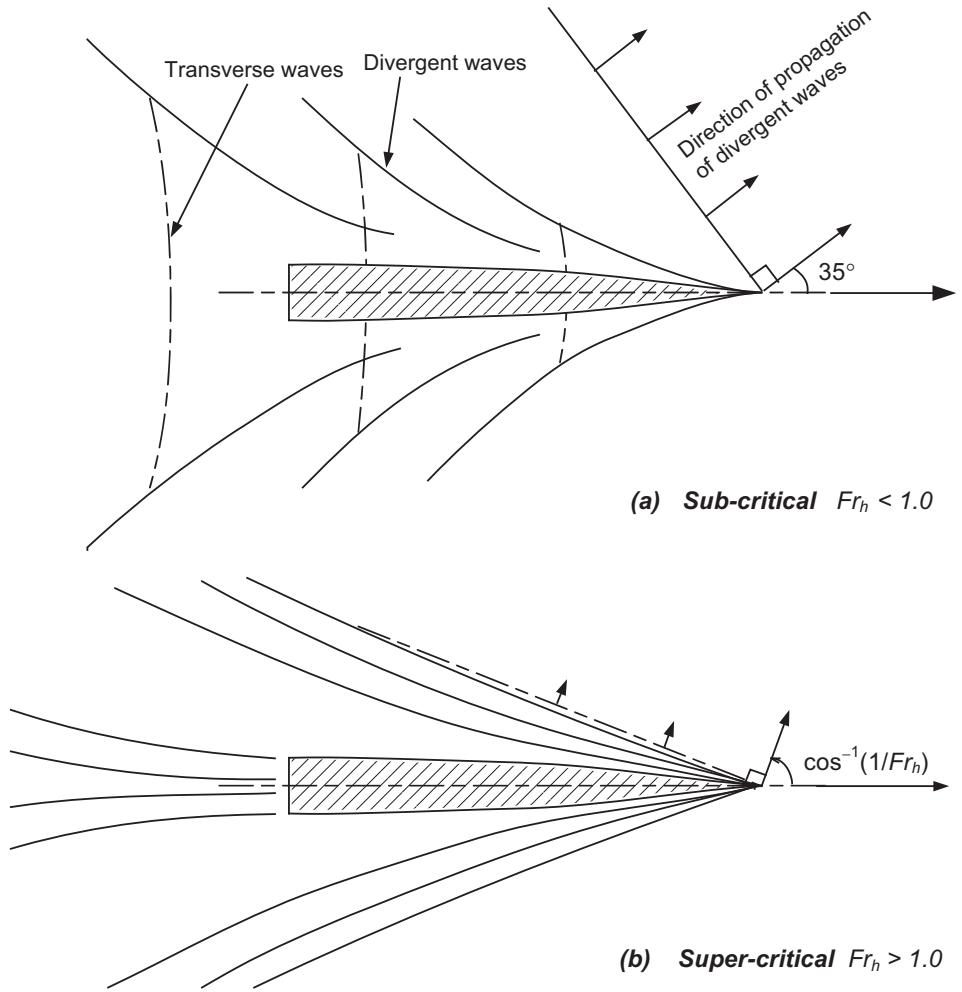

text_image

Transverse waves
Divergent waves
Direction of propagation
of divergent waves
35°
(a) Sub-critical Frh < 1.0
cos-1(1/Frh)
(b) Super-critical Frh > 1.0

Figure 6.1. Sub-critical and super-critical wave patterns.

At the critical speed, or critical $F r _ { h } , F r _ { h } = 1 . 0 .$

Speeds < $F r _ { h } = 1 . 0$ are known as subcritical speeds;

Speeds > Frh = 1.0 are known as supercritical speeds.

Around the critical speed the motion is unsteady and, particularly in the case of a model in a test tank with finite width, solitary waves (solitons) may be generated that move ahead of the model, [6.2]. For these sorts of reasons, some authorities define a region with speeds in the approximate range $0 . 9 0 < F r _ { h } < 1 . 1$ as the transcritical region.

At speeds well below $F r _ { h } = 1 . 0$ , the wave system is as shown in Figure $6 . 1 ( \mathrm { a } )$ , with a transverse wave system and a divergent wave system propagating away from the ship at an angle of about $3 5 ^ { \circ }$ . See also the Kelvin wave pattern, Figure 3.14. As the ship speed approaches the critical speed, $F r _ { h } = 1 . 0$ , the wave angle approaches $0 ^ { \circ }$ , or perpendicular to the track of the ship. At speeds greater than the critical speed, the diverging wave system returns to a wave propagation angle of about $\cos ^ { - 1 } ( 1 / F r _ { h } )$ , Figure 6.1(b). It can be noted that there are now no transverse waves.

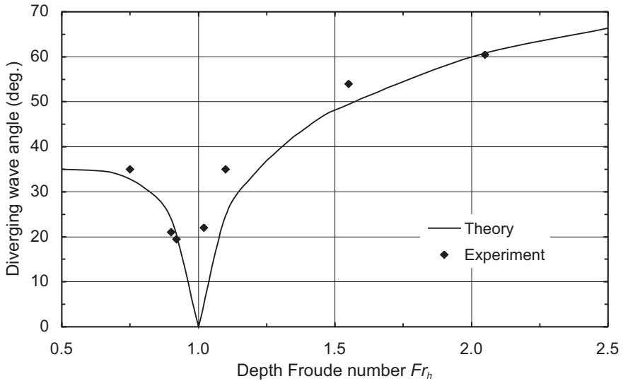

line

| Depth Froude number Fr_h | Diverging wave angle (deg.) - Theory | Diverging wave angle (deg.) - Experiment |
| ------------------------ | ------------------------------------- | ----------------------------------------- |
| 0.5                      | ~35                                   | -                                         |
| 0.75                     | ~34                                   | 35                                        |
| 0.9                      | ~20                                   | 20                                        |
| 1.0                      | 0                                     | 22                                        |
| 1.1                      | ~35                                   | 35                                        |
| 1.5                      | ~50                                   | 54                                        |
| 2.0                      | ~60                                   | 60                                        |
| 2.5                      | ~65                                   | -                                         |

Figure 6.2. Change in wave angle with speed.

Because a gravity wave cannot travel at $c > { \sqrt { g h } }$ the transverse wave system is left behind and now only divergent waves are present. The changes in divergent wave angle with speed are shown in Figure 6.2. Experimental values [6.2] show reasonable agreement with the theoretical predictions.

As the speed approaches the critical speed, $F r _ { h } = 1 . 0 $ , a significant amplification of wave resistance occurs. Figure 6.3 shows the typical influence of shallow water on the resistance curve, to a base of length Froude number, and Figure 6.4 shows the ratio of shallow to deep water wave resistance to a base of depth Froude number. At speeds greater than critical, the resistance reduces again and can even fall to a little less than the deep water value. In practice, the maximum interference occurs at a $F r _ { h }$ a little less than $F r _ { h } = 1 . 0$ , in general in the range 0.96–0.98. At speeds around critical, the increase in resistance, hence required propeller thrust, leads also to a decrease in propeller efficiency as the propeller is now working well off design.

The influence of shallow water on the resistance of high-speed displacement monohull and catamaran forms is described and discussed by Molland et al. [6.2] and test results are presented for a series of models. The influence of a solid boundary on the behaviour of high-speed ship forms was investigated by Millward and Bevan [6.3].

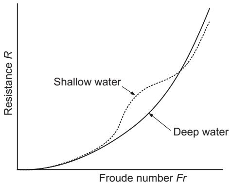

line

| Froude number Fr | Resistance R (Shallow water) | Resistance R (Deep water) |
| ---------------- | ---------------------------- | ------------------------- |
| 0                | 0                            | 0                         |
| Low              | Low                          | Low                       |
| Medium           | Medium                       | Medium                    |
| High             | High                         | High                      |

Figure 6.3. Influence of shallow water on the resistance curve.

line

| Depth Froude number Fr_h | R_Wh / R_WD |
| ------------------------ | ----------- |
| 1.0                      | 4           |

Figure 6.4. Amplification of wave drag at $F r _ { h } = 1 . 0 .$ .

In order to describe fully the effects of shallow water, it is necessary to use a parameter such as $T / h$ or $L / h$ as well as depth $F r _ { h }$ . The results of resistance experiments, to a base of length Fr, for changes in $L / h$ are shown in Figure 6.5 [6.2]. The increases in resistance around $F r _ { h } = 1 . 0$ , when $F r = 1 / \sqrt { L / h }$ , can be clearly seen.

# 6.2 Bank Effects

The effects of a bank, or restricted breadth, on the ship are similar to those experienced in shallow water, and exaggerate the effects of restricted depth.

Corrections for bank effects may be incorporated with those for restricted depth, such as those described in Section 6.3.

# 6.3 Blockage Speed Corrections

Corrections for the effect of shallow water are generally suitable for speeds up to about $F r _ { h } = 0 . 7$ . They are directed at the influences of potential and skin friction drag, rather than at wave drag whose influence is weak below about $F r _ { h } = 0 . 7$ .

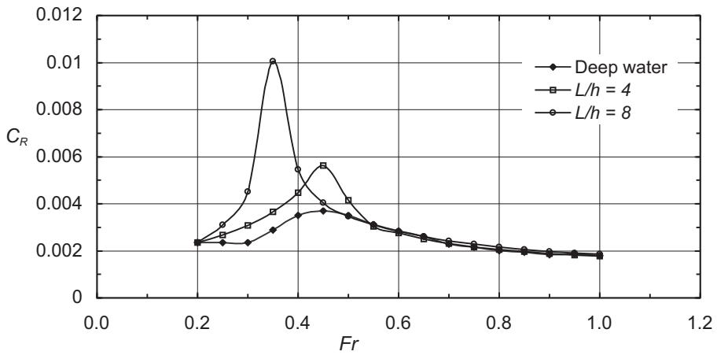

line

| Fr   | Deep water | L/h = 4 | L/h = 8 |
|------|------------|---------|---------|
| 0.2  | 0.002      | 0.002   | 0.002   |
| 0.3  | 0.0025     | 0.003   | 0.0045  |
| 0.4  | 0.0035     | 0.0045  | 0.010   |
| 0.5  | 0.0035     | 0.0055  | 0.004   |
| 0.6  | 0.0025     | 0.003   | 0.0025  |
| 0.7  | 0.002      | 0.0025  | 0.002   |
| 0.8  | 0.0015     | 0.002   | 0.0015  |
| 1.0  | 0.001      | 0.0015  | 0.001   |

Figure 6.5. Influence of water depth on resistance.

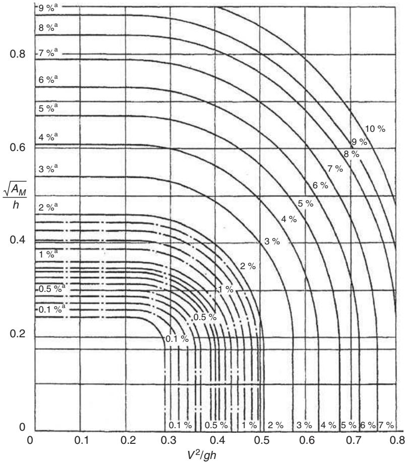  
Figure 6.6. Speed loss (%) due to shallow water [6.4].

A commonly used correction is that due to Lackenby [6.4], shown in Figure 6.6. This amounts to a correction formula, attributable to Lackenby [6.5] of the following form:

$$
\frac {\Delta V}{V} = 0. 1 2 4 2 \left[ \frac {A _ {M}}{h ^ {2}} - 0. 0 5 \right] + 1 - \left[ \tanh \left(\frac {g h}{V ^ {2}}\right) \right] ^ {0. 5}, \tag {6.4}
$$

which is recommended by the International Towing Tank Conference (ITTC) as a correction for the trials procedure (Section 5.3).

For higher speeds, a simple shallow water correction is not practicable due to changes in sinkage and trim, wave breaking and other non-linearities. Experimental and theoretical data, such as those found in [6.2, 6.3, 6.6 and 6.7] provide some guidance, for higher-speed ship types, on likely increases in resistance and speed loss in more severe shallow water conditions.

Figure 6.6 and Equation (6.4) apply effectively to water of infinite breadth. A limited amount of data is available for the influence of finite breadth. Landweber [6.8] carried out experiments and developed corrections for the effects of different sized rectangular channels. These data are presented in [6.9]. An approximate curve

fit to the data is

$$
\frac {V _ {h}}{V _ {\infty}} = 1 - 0. 0 9 \left[ \frac {\sqrt {A _ {M}}}{R _ {H}} \right] ^ {1. 5}, \tag {6.5}
$$

where $V _ { \infty }$ is the speed in deep water, $V _ { h }$ is the speed in shallow water of depth h and $R _ { H }$ is the hydraulic radius, defined as the area of cross section of a channel divided by its wetted perimeter, that is:

$$
R _ {H} = b h / (b + 2 h)
$$

It is seen that as the breadth of the channel b becomes large, $R _ { H }$ tends to h. When a ship or model is in a rectangular channel, then

$$
R _ {H} = (b h - A _ {M}) / (b + 2 h + p),
$$

where $A _ { M }$ is the maximum cross-sectional area of the hull and p is the wetted girth of the hull at this section. It is found that if $R _ { H }$ is set equal to h (effectively infinite breadth), then Equation (6.5) is in satisfactory agreement with Figure 6.6 and Equation (6.4) up to about $\sqrt { A _ { M } / h } = 0 . 7 0$ and $V ^ { 2 } / g h = 0 . 3 6$ , or $F r _ { h } = 0 . 6 0$ , up to which the corrections tend to be independent of speed.

Example: A cargo vessel has $L = 1 3 5$ m, B  22 m and $T = 9 . 5$ m. For a given power, the vessel travels at 13 knots in deep water. Determine the speed loss, (a) when travelling at the same power in water of infinite breadth and with depth of water $h = 1 4$ m and, (b) in a river with a breadth of 200 m and depth of water $h = 1 4$ m when travelling at the same power as in deep water at 8 knots. Neglect any changes in propulsive efficiency.

$$
F r = V / \sqrt {g L} = 1 3 \times 0. 5 1 4 4 / \sqrt {9 . 8 1 \times 1 3 5} = 0. 1 8 4.
$$

$$
F r _ {h} = V / \sqrt {g h} = 1 3 \times 0. 5 1 4 4 / \sqrt {9 . 8 1 \times 1 4} = 0. 5 7 1.
$$

$$
A _ {M} = 2 2 \times 9. 5 = 2 0 9 \mathrm{m} ^ {2}; \sqrt {A _ {M}} / h = \sqrt {2 0 9 / 1 4} = 1. 0 3 3.
$$

$$
V ^ {2} / g h = (1 3 \times 0. 5 1 4 4) ^ {2} / (9. 8 1 \times 1 4) = 0. 3 2 5; \mathrm{and} g h / V ^ {2} = 3. 0 7.
$$

For water with infinite breadth:

Using Equation (6.4), speed loss $\Delta V / V = 0 . 1 2 6 = 1 2 . 6 \%$ and speed  11.4 knots.

Using Equation (6.5) and $R _ { H } = h = 1 4$ m, $V _ { h } / V _ { \infty } = 0 . 9 0 6$ , or $\Delta V / V = 9 . 4 \%$ and speed  11.8 knots.

For water with finite breadth 200 m:

Wetted girth $p = ( B + 2 T ) = 2 2 + ( 2 \times 9 . 5 ) = 4 1 \mathrm { m }$ .

$$
R _ {H} = (2 0 0 \times 1 4 - 2 0 9) / (2 0 0 + 2 \times 1 4 + 4 1) = 9. 6 3 \mathrm{m}.
$$

$$
\sqrt {A _ {M}} / R _ {H} = \sqrt {2 0 9 / 9 . 6 3} = 1. 5 0 1.
$$

Using Equation (6.5), $V _ { h } / V _ { \infty } = 0 . 8 3 4$ , or $\Delta V / V = 1 6 . 6 \%$ and speed decreases from 8 to 6.7 knots.

A blockage corrector for canals was developed by Dand [6.10]. The analysis and tank tests include sloping banks and flooded banks. The corrections entail some complex reductions, but allow changes in width, changes in depth or combinations of the two to be investigated.

Hoffman and Kozarski [6.11] applied the theoretical work of Strettensky [6.12] to develop shallow water resistance charts including the critical speed region. Their results were found to show satisfactory agreement with published model data.

Blockage correctors developed primarily for the correction of model resistance tests are discussed in Section 3.1.4.

# 6.4 Squat

When a ship proceeds through shallow water there is an effective increase in flow speed, backflow, under the vessel and a drop in pressure. This drop in pressure leads to squat which is made up of vertical sinkage together with trim by the bow or stern. If a vessel is travelling too fast in shallow water, squat will lead to a loss of underkeel clearance and possible grounding. Various investigations into squat have been carried out, such as [6.13 and 6.14]. The following simple formula has been proposed by Barrass and Derrett [6.15] for estimating maximum squat $\delta _ { \mathrm { m a x } }$ in a confined channel such as a river:

$$
\delta_ {\max} = \frac {C _ {B} \times S _ {B} ^ {0 . 8 1} \times V _ {S} ^ {2 . 0 8}}{2 0} \text { metres }, \tag {6.6}
$$

where $C _ { B }$ is the block coefficient, $S _ { B }$ is a blockage factor, being the ratio of the ship’s cross section to the cross section of the channel, and $V _ { S }$ is the ship speed in knots.

Maximum squat will be at the bow if $C _ { B } > 0 . 7 0 0$ and at the stern if $C _ { B } < 0 . 7 0 0$ .

Equation (6.6) may be used for estimating preliminary values of squat and indicating whether more detailed investigations are necessary.

Example: Consider a bulk carrier with breadth 40 m, draught 11 m and $C _ { B } =$ 0.80, proceeding at 5 knots along a river with breadth 200 m and depth of water 14 m.

$$
S _ {B} = (B \times T) / (B _ {R I V} \times h) = (4 0 \times 1 1) / (2 0 0 \times 1 4) = 0. 1 5 7.
$$

$$
\delta_ {\mathrm{max}} = 0. 8 0 \times 0. 1 5 7 ^ {0. 8 1} \times 5 ^ {2. 0 8} / 2 0 = 0. 2 5 \mathrm{m}.
$$

The squat of 0.25 m will be at the bow, since $C _ { B } > 0 . 7 0 0 .$

Barrass [6.16] reports on an investigation into the squat for a large passenger cruise liner, both for open water and for a confined channel. Barrass points out that squat in confined channels can be over twice that measured in open water.

# 6.5 Wave Wash

The waves generated by a ship propagate away from the ship and to the shore. In doing so they can have a significant impact on the safety of smaller craft and on the local environment. This is particularly important for vessels operating anywhere near the critical depth Froude number, $F r _ { h } = 1 . 0$ , when very large waves are generated, Figure 6.4. Operation at or near the critical Froude number may arise from high speed and/or operation in shallow water. Passenger-car ferries are examples of vessels that often have to combine high speed with operation in relatively shallow water. A full review of wave wash is carried out in ITTC [6.17] with further discussions in ITTC [6.18, 6.19].

In assessing wave wash, it is necessary to

- estimate the wave height at or near the ship,   
- estimate its direction of propagation and,   
- estimate the rate of decay in the height of the wave between the ship and shore, or area of interest.

The wave height in the near field, say within 0.5 to 1.0 ship lengths of the ship’s track, may be derived by experimental or theoretical methods [6.20, 6.21, 6.22, 6.23, 6.24]. In this way the effect of changes in hull shape, speed, trim and operational conditions can be assessed. An approximation for the direction of propagation may be obtained from data such as those presented in Figure 6.2. Regarding wave decay, in deep water the rate of decay can be adequately described by Havelock’s theoretical prediction of decay [6.25], that is:

$$
H \propto \gamma y ^ {- n}, \tag {6.7}
$$

where H is wave height (m), n is 0.5 for transverse wave components and n is 0.33 for divergent waves. The value of γ can be determined experimentally based on a wave height at an initial value (offset) of y (m) from the ship and as a function of the speed of the vessel. Thus, once the maximum wave height is measured close to the ship’s track, it can be calculated at any required distance from the ship.

It is noted that the transverse waves decay at a greater rate than the divergent waves. At a greater distance from the vessel, the divergent waves will therefore become more prominent to an observer than the transverse waves. As a result, it has been suggested that the divergent waves are more likely to cause problems in the far field [6.26]. It is generally found that in deep water the divergent waves for real ships behave fairly closely to the theoretical predictions.

In shallow water, further complications arise and deep water decay rates are no longer valid. Smaller values of n in Equation (6.7) between 0.2 and 0.4 may be applicable, depending on the wave period and the water depth/ship length ratio. The decay rates for shallow water waves (supercritical with $F r _ { h } > 1 . 0 )$ are less than for deep water and, consequently, the wave height at a given distance from the ship is greater than that of the equivalent height of a wave in deep water (sub-critical, $F r _ { h } \ < \ 1 . 0 )$ , Doyle et al. [6.27]. Robbins et al. [6.28] carried out experiments to determine rates of decay at different depth Froude numbers.

River, port, harbour and coastal authorities are increasingly specifying maximum levels of acceptable wave wash. This in turn allows such authorities to take suitable actions where necessary to regulate the speed and routes of ships. It is therefore necessary to apply suitable criteria to describe the wave system on which the wave or wave system may then be judged. The most commonly used criterion is maximum wave height $H _ { M }$ . This is a simple criterion, is easy to measure and understand and can be used to compare one ship with another. In [6.29] it is argued that the criterion should be based on the wave height immediately before breaking.

The energy $( E )$ in the wave front may also be used as a criterion. It can be seen as a better representation of the potential damaging effects of the waves since it combines the effects of wave height and speed. For deep water, the energy is

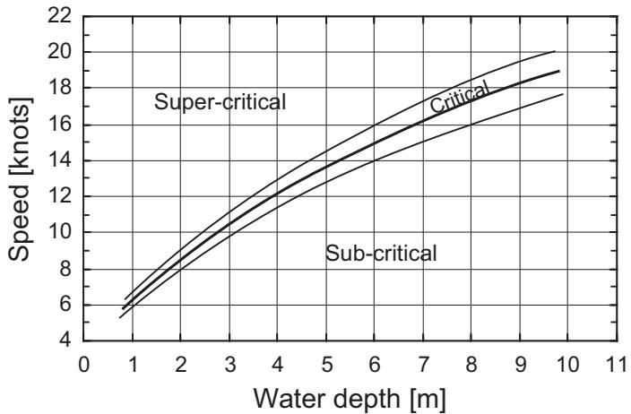

line

| Water depth [m] | Super-critical | Critical |
| --------------- | -------------- | -------- |
| 1               | 6              | 5        |
| 2               | 8              | 7        |
| 3               | 10             | 9        |
| 4               | 12             | 11       |
| 5               | 14             | 13       |
| 6               | 16             | 15       |
| 7               | 18             | 17       |
| 8               | 20             | 19       |
| 9               | 21             | 20       |
| 10              | 22             | 21       |

Figure 6.7. Sub-critical and super-critical operating regions.

$$
E = \rho g ^ {2} H ^ {2} T ^ {2} / 1 6 \pi , \tag {6.8}
$$

where H is the wave height (m) and T is the wave period (s). This approach takes account, for example, of those waves with long periods which, as they approach more shallow water, may be more damaging to the environment.

In the case of shallow water,

$$
E = \rho g H ^ {2} \lambda / 8, \tag {6.9}
$$

where $\lambda = ( g T ^ { 2 } / 2 \pi ) \mathrm { t a n h } ( 2 \pi h / L _ { W } )$ , h is the water depth and $L _ { W }$ is the wave length.

In shallow water, most of the wave energy is contained in a single long-period wave with a relatively small decay of wave energy and wave height with distance from the ship. In [6.27] it is pointed out that if energy alone is used, the individual components of wave height and period are lost, and it is recommended that the description of wash waves in shallow water should include both maximum wave height and maximum wave energy.

Absolute values need to be applied to the criteria if they are to be employed by port, harbour or coastal authorities to regulate the speeds and courses of ships in order to control the impact of wave wash. A typical case may require a maximum wave height of say 280 mm at a particular location, [6.30], or 350 mm for 3 m water depth and wave period 9 s [6.29].

From the ship operational viewpoint, it is recommended that ships likely to operate frequently in shallow water should carry a graph such as that shown in Figure 6.7. This indicates how the ship should operate well below or well above the critical speed for a particular water depth. Phillips and Hook [6.31] address the problems of operational risks and give an outline of the development of risk assessment passage plans for fast commercial ships.

# REFERENCES (CHAPTER 6)

6.1 Lamb, H. Hydrodynamics. Cambridge University Press, Cambridge, 1962.   
6.2 Molland, A.F., Wilson, P.A., Taunton, D.J., Chandraprabha, S. and Ghani, P.A. Resistance and wash measurements on a series of high speed

displacement monohull and catamaran forms in shallow water. Transactions of the Royal Institution of Naval Architects, Vol. 146, 2004, pp. 97–116.   
6.3 Millward, A. and Bevan, M.G. The behaviour of high speed ship forms when operating in water restricted by a solid boundary. Transactions of the Royal Institution of Naval Architects, Vol. 128, 1986, pp. 189–204.   
6.4 Lackenby, H. The effect of shallow water on ship speed. Shipbuilder and Marine Engine Builder. Vol. 70, 1963.   
6.5 Lackenby, H. Note on the effect of shallow water on ship resistance. BSRA Report No. 377, 1963.   
6.6 Millward, A. The effect of shallow water on the resistance of a ship at high sub-critical and super-critical speeds. Transactions of the Royal Institution of Naval Architects, Vol. 124, 1982, pp. 175–181.   
6.7 Millward, A. Shallow water and channel effects on ship wave resistance at high sub-critical and super-critical speeds. Transactions of the Royal Institution of Naval Architects, Vol. 125, 1983, pp. 163–170.   
6.8 Landweber, L. Tests on a model in restricted channels. EMB Report 460, 1939.   
6.9 Comstock, J.P. (Ed.) Principles of Naval Architecture, SNAME, New York, 1967.   
6.10 Dand, I.W. On ship-bank interaction. Transactions of the Royal Institution of Naval Architects, Vol. 124, 1982, pp. 25–40.   
6.11 Hofman, M. and Kozarski, V. Shallow water resistance charts for preliminary vessel design. International Shipbuilding Progress, Vol. 47, No. 449, 2000, pp. 61–76.   
6.12 Srettensky, L.N. Theoretical investigations of wave-making resistance. (in Russian). Central Aero-Hydrodynamics Institute Report 319, 1937.   
6.13 Dand, I.W. and Ferguson, A.M. The squat of full ships in shallow water. Transactions of the Royal Institution of Naval Architects, Vol. 115, 1973, pp. 237–255.   
6.14 Gourlay, T.P. Ship squat in water of varying depth. Transactions of the Royal Institution of Naval Architects, Vol. 145, 2003, pp. 1–14.   
6.15 Barrass, C.B. and Derrett, D.R. Ship Stability for Masters and Mates. 6th Edition. Butterworth-Heinemann, Oxford, UK, 2006.   
6.16 Barrass, C.B. Maximum squats for Victoria. The Naval Architect, RINA, London, February 2009, pp. 25–34.   
6.17 ITTC Report of Resistance Committee. 23rd International Towing Tank Conference, Venice, 2002.   
6.18 ITTC Report of Resistance Committee. 24th International Towing Tank Conference, Edinburgh, 2005.   
6.19 ITTC Report of Resistance Committee. 25th International Towing Tank Conference, Fukuoka, 2008.   
6.20 Molland, A.F., Wilson, P.A., Turnock, S.R., Taunton, D.J. and Chandraprabha, S. The prediction of the characterstics of ship generated near-field wash waves. Proceedings of Sixth International Conference on Fast Sea Transportation, FAST’2001, Southampton, September 2001, pp. 149–164.   
6.21 Day, A.H. and Doctors, L.J. Rapid estimation of near- and far-field wave wake from ships and application to hull form design and optimisation. Journal of Ship Research, Vol. 45, No. 1, March 2001, pp. 73–84.   
6.22 Day, A.H. and Doctors, L.J. Wave-wake criteria and low-wash hullform design. Transactions of the Royal Institution of Naval Architects, Vol. 143, 2001, pp. 253–265.   
6.23 Macfarlane, G.J. Correlation of prototype and model wave wake characteristics at low Froude numbers. Transactions of the Royal Institution of Naval Architects, Vol. 148, 2006, pp. 41–56.

6.24 Raven, H.C. Numerical wash prediction using a free-surface panel code. International Conference on the Hydrodynamics of High Speed Craft, Wake Wash and Motion Control, RINA, London, 2000.   
6.25 Havelock, T.H. The propagation of groups of waves in dispersive media, with application to waves produced by a travelling disturbance. Proceedings of the Royal Society, London, Series A, 1908, pp. 398–430.   
6.26 Macfarlane, G.J. and Renilson, M.R. Wave wake – a rational method for assessment. Proceedings of International Conference on Coastal Ships and Inland Waterways RINA, London, February 1999, Paper 7, pp. 1–10.   
6.27 Doyle, R., Whittaker, T.J.T. and Elsasser, B. A study of fast ferry wash in shallow water. Proceedings of Sixth International Conference on Fast Sea Transportation, FAST’2001, Southampton, September 2001, Vol. 1, pp. 107–120.   
6.28 Robbins, A., Thomas, G., Macfarlane, G.J., Renilson, M.R. and Dand, I.W. The decay of catamaran wave wake in deep and shallow water. Proceedings of Ninth International Conference on Fast Sea Transportation, FAST’2007, Shanghai, 2007, pp. 184–191.   
6.29 Kofoed-Hansen, H. and Mikkelsen, A.C. Wake wash from fast ferries in Denmark. Fourth International Conference on Fast Sea Transportation, FAST’97, Sydney, 1997.   
6.30 Stumbo, S., Fox, K. and Elliott, L. Hull form considerations in the design of low wash catamarans. Proceedings of Fifth International Conference on Fast Sea Transportation, FAST’99, Seattle, 1999, pp. 83–90.   
6.31 Phillips, S. and Hook, D. Wash from ships as they approach the coast. International Conference on Coastal Ships and Inland Waterways. RINA, London, 2006.

# 7 Measurement of Resistance Components

# 7.1 Background

The accurate experimental measurement of ship model resistance components relies on access to high-quality facilities. Typically these include towing tanks, cavitation tunnels, circulating water channels and wind tunnels. Detailed description of appropriate experimental methodology and uncertainty analysis are contained within the procedures and guidance of the International Towing Tank Conference (ITTC) [7.1]. There are two approaches to understanding the resistance of a ship form. The first examines the direct body forces acting on the surface of the hull and the second examines the induced changes to pressure and velocity acting at a distance away from the ship. It is possible to use measurements at model scale to obtain global forces and moments with the use of either approach. This chapter considers experimental methods that can be applied, typically at model scale, to measure pressure, velocity and shear stress. When applied, such measurements should be made in a systematic manner that allows quantification of uncertainty in all stages of the analysis process. Guidance on best practice can be found in the excellent text of Coleman and Steele [7.2], the processes recommended by the International Standards Organisation (ISO) [7.3] or in specific procedures of the ITTC, the main ones of which are identified in Table 7.1.

In general, if the model is made larger (smaller scale factor), the flow will be steadier, and if the experimental facility is made larger, there will be less uncertainty in the experimental measurements. Facilities such as cavitation tunnels, circulating water channels and wind tunnels provide a steady flow regime more suited to measurements at many spatially distributed locations around and on ship hulls. Alternatively, the towing tank provides a straightforward means of obtaining global forces and moments as well as capturing the unsteady interaction of a ship with a head or following sea.

# 7.2 Need for Physical Measurements

Much effort has been devoted to the direct experimental determination of the various components of ship resistance. This is for three basic reasons:

(1) To obtain a better understanding of the physical mechanism   
(2) To formulate more accurate scaling procedures

Table 7.1. ITTC procedures of interest to ship resistance measurement 

<table><tr><td>Section number</td><td>Topic of recommended procedure</td></tr><tr><td>7.5-01-01-01</td><td>Ship models</td></tr><tr><td>7.5-02-02-01</td><td>Resistance tests</td></tr><tr><td>7.5-02-05-01</td><td>Resistance tests: high-speed marine vehicles</td></tr><tr><td>7.5-02-01-02</td><td>Uncertainty analysis in EFD: guideline for resistance towing tank test</td></tr></table>

(3) To support theoretical methods which may, for example, be used to minimise certain resistance components and derive more efficient hull forms.

The experimental methods used are:

(a) Measurement of total head loss across the wake of the hull to determine the total ‘viscous’ resistance.   
(b) Measurements of velocity profile through the boundary layer.   
(c) Measurements of wall shear stress using the Preston tube technique to measure ‘skin friction’ resistance.   
(d) Measurement of surface pressure distribution to determine the ‘pressure’ resistance.   
(e) Measurement of the wave pattern created by the hull to determine the ‘wave pattern’ resistance (as distinct from total ‘wave’ resistance, which may include wave breaking).   
(f) Flow visualisation observations to determine the basic character of the flow past the model using wool tufts, neutral buoyancy particles, dye streaks and paint streaks etc. Particular interest is centred on observing separation effects.

The total resistance can be broken down into a number of physically identifiable components related to one of three basic causes:

(1) Boundary layer growth,   
(2) Wave making,   
(3) Induced drag due to the trailing vortex system.

As discussed in Chapter 3, Section 3.1.1, when considering the basic components of hull resistance, it is apparent that the total resistance of the ship may be determined from the resolution of the forces acting at each point on the hull, i.e. tangential and normal forces (summation of fore and aft components of tangential forces  frictional resistance, whilst a similar summation of resolved normal forces gives the pressure resistance) or by measuring energy dissipation (in the waves and in the wake).

Hence, these experimentally determined components may be summarised as:

1. Shear stress (friction) drag
    +    } forces acting
2. Pressure drag
3. Viscous wake (total viscous resistance)
    +    } energy dissipation
4. Wave pattern resistance

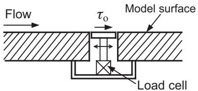

text_image

Flow
τ₀
Model surface
Load cell

Figure 7.1. Schematic layout of transducer for direct measurement of skin friction.

# 7.3 Physical Measurements of Resistance Components

# 7.3.1 Skin Friction Resistance

The shear of flow across a hull surface develops a force typically aligned with the flow direction at the edge of the boundary layer and proportional to the viscosity of the water and the velocity gradient normal to the surface, see Appendix A1.2. Measurement of this force requires devices that are sufficiently small to resolve the force without causing significant disturbance to the fluid flow.

# 7.3.1.1 Direct Method

This method uses a transducer, as schematically illustrated in Figure 7.1, which has a movable part flush with the local surface. A small displacement of this surface is a measure of the tangential force. Various techniques can be used to measure the calibrated displacement. With the advent of microelectromechanical systems (MEMS) technology [7.4] and the possibility of wireless data transmission, such measurements will prove more attractive. This method is the most efficient as it makes no assumptions about the off-surface behaviour of the boundary layer. As there can be high curvature in a ships hull, a flat transducer surface may cause a discontinuity. Likewise, if there is a high longitudinal pressure gradient, the pressures in the gaps each side of the element are different, leading to possible errors in the transducer measurements.

In wind tunnel applications it is possible to apply a thin oil film and use optical interference techniques to measure the thinning of the film as the shear stress varies [7.5].

# 7.3.1.2 Indirect Methods

A number of techniques make use of the known behaviour of boundary layer flow characteristics in order to infer wall shear stress and, hence, skin friction [7.4, 7.5]. All these devices require suitable calibration in boundary layers of known velocity profile and sufficiently similar to that experienced on the hull.

(1) HOT-FILM PROBE. The probe measures the electrical current required to maintain a platinum film at a constant temperature when placed on surface of a body, Figure 7.2. Such a device has a suitably sensitive time response so that it is also used for measuring turbulence levels. The method is sensitive to temperature variations in the water and to surface bubbles. Such probes are usually insensitive to direction and measure total friction at a point. Further experiments are required to determine flow direction from which the fore and aft force components are then derived. Calibration is difficult; a rectangular duct is used in which the pressure drop along a fixed length is accurately measured, then equated to the friction force. Such a calibration is described for the Preston tube. The method is relatively insensitive to pressure gradient and is therefore good for ship models, where adverse pressure gradients aft plus separation are possible. The probes are small and can be mounted flush with the hull, Figure 7.2. Hot films may also be surface mounted, being similar in appearance to a strain gauge used for measuring surface strain in a material. An example application of surface-mounted hot films is shown in Figure 7.3. In this case the hot films were used to detect the transition from laminar to turbulent flow on a rowing scull.

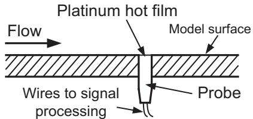

text_image

Platinum hot film
Flow
Model surface
Wires to signal
processing
Probe

Figure 7.2. Hot-film probe.

(2) STANTON TUBE. The Stanton tube is a knife-edged Pitot tube, lying within the ˆ laminar sublayer, see Appendix A1.6. The height is adjusted to give a convenient reading at maximum velocity. The height above the surface is measured with a feeler gauge. Clearances are generally too small for ship model work, taking into account surface undulations and dirt in the water. The method is more suitable for wind tunnel work.   
(3) PRESTON TUBE. The layout of the Preston tube is shown in Figure 7.4. A Pitotˆ tube measures velocity by recording the difference between static press $P _ { O }$ and total pressure $P _ { T }$ . If the tube is in contact with a hull surface then, since the velocity is zero at the wall, any such ‘velocity’ measurement will relate to velocity gradient at the surface and, hence, surface shear stress. This principle was first used by Professor Preston in the early 1950s.

For the inner region of the boundary layer,

$$
\frac {u}{u _ {\tau}} = f \left[ \frac {y u _ {\tau}}{\nu} \right]. \tag {7.1}
$$

This is termed the inner velocity law or, more often, ‘law of the wall’, where the friction velocity $\begin{array} { r } { u _ { \tau } = ( \frac { \tau _ { 0 } } { \rho } ) ^ { 1 / 2 } } \end{array}$ and the shear stress at the wall is $\begin{array} { r } { \tau _ { 0 } = \mu \frac { d u } { d y } } \end{array}$ and noting

$$
\frac {u}{u _ {\tau}} = A \log \left[ \frac {y u _ {\tau}}{\nu} \right] + B. \tag {7.2}
$$

Since Equation (7.1) holds, it must be in a region in which quantities depend only on $\rho , \nu , \tau _ { 0 }$ and a suitable length. Thus, if a Pitot tube of circular section and ˆ outside diameter d is placed in contact with the surface and wholly immersed in the ‘inner’ region, the difference between the total Pitot press ˆ $P _ { T }$ and static press $P _ { 0 }$ must depend only on ρ, ν, τ0 and d where

τ0 wall shear stress

ρ = fluid density

ν  kinematic viscosity

d  external diameter of Preston tube

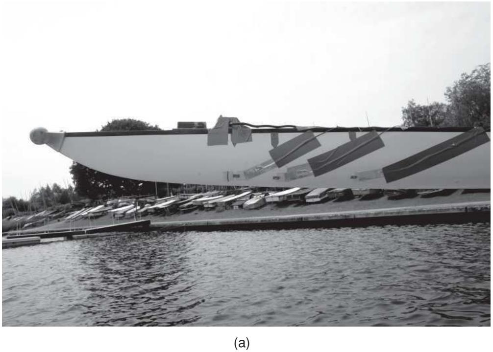

natural_image

Black-and-white photo of a white underwater vehicle with visible hull and wake, partially submerged in water (no text or symbols)

Figure 7.3. Hot-film surface-mounted application to determine the location of laminarturbulent transition on a rowing scull. Photographs courtesy of WUMTIA.

text_image

Preston tube
O.D. = 1mm
I.D. = 0.6 mm
Flow
PT
50 mm
Static pressure
tapping
Model surface
P0
Tube to manometer/
transducer

Figure 7.4. Layout of the Preston tube.

text_image

P₀
τ₀
P₁
x

Figure 7.5. Calibration pipe with a known static pressure drop between the two measurement locations.

It should be noted that the diameter of the tube (d) must be small enough to be within the inner region of the boundary layer (about 10% of boundary layer thickness or less).

It can be shown by using dimensional methods that

$$
\frac {(p _ {T} - p _ {0}) d ^ {2}}{\rho \nu^ {2}} \quad \text { and } \quad \frac {\tau_ {0} d ^ {2}}{\rho \nu^ {2}}
$$

are dimensionless and, hence, the calibration of the Preston tube is of the following form:

$$
\frac {\tau_ {0} d ^ {2}}{\rho \nu^ {2}} = F \left[ \frac {(p _ {T} - p _ {0}) d ^ {2}}{\rho \nu^ {2}} \right].
$$

The calibration of the Preston tube is usually carried out inside a pipe with a fully turbulent flow through it. The shear stress at the wall can be calculated from the static pressure gradient along the pipe as shown in Figure 7.5.

$$
(p _ {1} - p _ {0}) \frac {\pi D ^ {2}}{4} = \tau_ {0} \pi D x,
$$

where D is the pipe diameter and

$$
\tau_ {0} = \frac {(P _ {1} - P _ {0})}{x} \cdot \frac {D}{4} = \frac {D}{4} \cdot \frac {d p}{d x}. \tag {7.3}
$$

Preston’s original calibration was as follows:

Within pipes

$$
\log_ {1 0} \frac {\tau_ {0} d ^ {2}}{4 \rho v ^ {2}} = - 1. 3 9 6 + 0. 8 7 5 \log_ {1 0} \left[ \frac {(P _ {T} - P _ {0}) d ^ {2}}{4 \rho v ^ {2}} \right] \tag {7.4}
$$

Flat plates

$$
= - 1. 3 6 6 + 0. 8 7 7 \log_ {1 0} \left[ \frac {\left(P _ {T} - P _ {0}\right) d ^ {2}}{4 \rho v ^ {2}} \right] \tag {7.5}
$$

hence, if $P _ { T }$ and $P _ { 0 }$ deduced at a point then $\tau _ { 0 }$ can be calculated and

$$
C _ {F} = \frac {\tau_ {0}}{\frac {1}{2} \rho U ^ {2}}
$$

where U is model speed (not local). For further information on the calibration of Preston tubes see Patel [7.6].

Measurements at the National Physical Laboratory (NPL) of skin friction on ship models using Preston tubes are described by Steele and Pearce [7.7] and Shearer and Steele [7.8]. Some observations on the use of Preston tubes based on [7.7] and [7.8] are as follows:

(a) The experiments were used to determine trends rather than an absolute measure of friction. Experimental accuracy was within about $\pm 5 \%$ .   
(b) The method is sensitive to pressure gradients as there are possible deviations from the ‘Law of the wall’ in favourable pressure gradients.   
(c) Calibration is valid only in turbulent flow; hence, the distance of total turbulence from the bow is important, to ensure transition has occurred.   
(d) Ideally, the Preston tube total and static pressures should be measured simultaneously. For practical reasons, this is not convenient; hence, care must be taken to repeat identical conditions.   
(e) There are difficulties in measuring the small differences in water pressure experienced by this type of experiment.   
(f) Flow direction experiments with wool tufts or surface ink streaks are required to precede friction measurements. The Preston tubes are aligned to the direction of flow at each position in order to measure the maximum skin friction.   
(g) Findings at NPL for water in pipes indicated a calibration close to that of Preston.

Results for a tanker form [7.8] are shown in Figure 7.6. In Figure 7.6, the local $C _ { f }$ has been based on model speed not on local flow speed. It was observed that the waviness of the measured $C _ { f }$ closely corresponds to the hull wave profile, but is inverted, that is, a high $C _ { f }$ in a trough and low $C _ { f }$ at a crest. The $C _ { f }$ variations are therefore primarily a local speed change effect due to the waves. At the deeper measurements, where the wave orbital velocities are less effective, it is seen that the undulations in measured $C _ { f }$ are small.

The Hughes local $C _ { f }$ is based on the differentiation of the ITTC formula for a flat plate. The trend clearly matches that of the mean line through the measured $C _ { f } .$ It is also noted that there is a difference in the distribution of skin friction between the raked (normal) bow and the bulbous bow.

(4) MEASUREMENTS OF BOUNDARY LAYER PROFILE. These are difficult to make at model scale. They have, however, been carried out at ship scale in order to derive local $C _ { f } ,$ as discussed in Chapter 3, Section 3.2.3.6.

(5) LIQUID CRYSTALS. These can be designed to respond to changes in surface temperature. A flow over a surface controls the heat transfer rate and, hence, local surface temperature. Hence, the colour of a surface can be correlated with the local shear rate. This is related to the temperature on the surface, see Ireland and Jones [7.9]. To date, in general, practical applications are only in air.

# 7.3.1.3 Summary

Measurements of surface shear are difficult and, hence, expensive to make and are generally impractical for use as a basis for global integration of surface shear. However, they can provide insight into specific aspects of flow within a local area as, for example, in identifying areas of higher shear stress and in determining the location of transition from laminar to turbulent flow. Such measurements require a steady flow best achieved either in a circulating water channel or a wind tunnel.

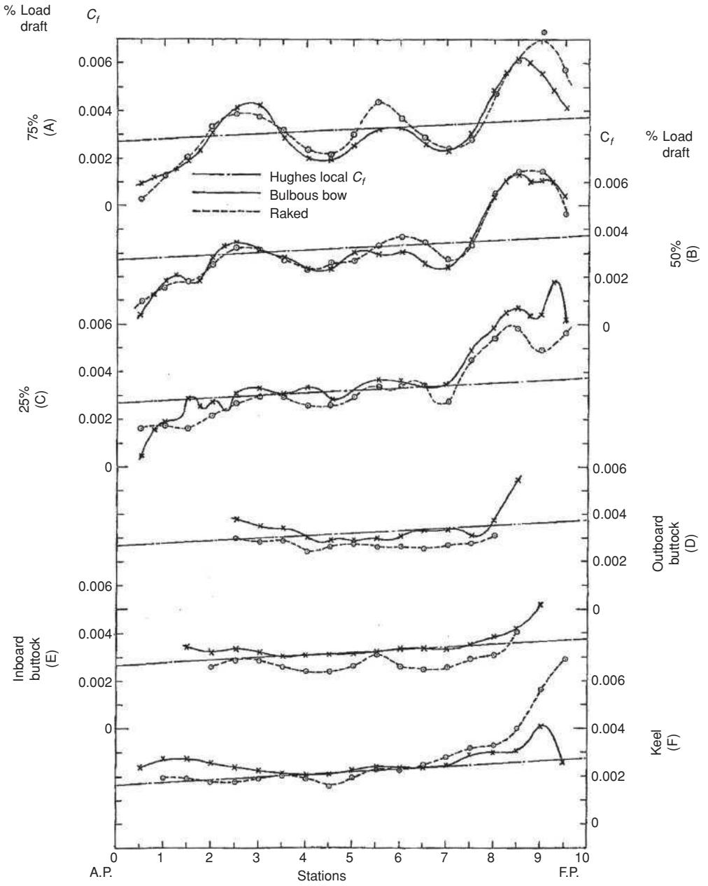

line

| Station | Hughes local Cf (% Load draft) | Bulbous bow (% Load draft) | Raked (% Load draft) | Hughes local Cf (% Outboard buttock) | Bulbous bow (% Outboard buttock) | Raked (% Outboard buttock) | Hughes local Cf (% Inboard buttock) | Bulbous bow (% Inboard buttock) | Raked (% Inboard buttock) |
| ------- | ------------------------------ | -------------------------- | --------------------- | ------------------------------------ | --------------------------------- | --------------------------- | ----------------------------------- | ------------------------------- | ------------------------- |
| 1       | ~0.001                         | ~0.001                     | ~0.001                | ~0.003                               | ~0.003                            | ~0.003                      | ~0.002                              | ~0.003                          | ~0.002                    |
| 2       | ~0.002                         | ~0.002                     | ~0.002                | ~0.003                               | ~0.003                            | ~0.003                      | ~0.002                              | ~0.003                          | ~0.002                    |
| 3       | ~0.004                         | ~0.004                     | ~0.004                | ~0.003                               | ~0.003                            | ~0.003                      | ~0.002                              | ~0.003                          | ~0.002                    |
| 4       | ~0.002                         | ~0.002                     | ~0.002                | ~0.003                               | ~0.003                            | ~0.003                      | ~0.002                              | ~0.003                          | ~0.002                    |
| 5       | ~0.003                         | ~0.003                     | ~0.003                | ~0.003                               | ~0.003                            | ~0.003                      | ~0.002                              | ~0.003                          | ~0.002                    |
| 6       | ~0.004                         | ~0.004                     | ~0.004                | ~0.003                               | ~0.003                            | ~0.003                      | ~0.002                              | ~0.003                          | ~0.002                    |
| 7       | ~0.003                         | ~0.003                     | ~0.003                | ~0.003                               | ~0.003                            | ~0.003                      | ~0.002                              | ~0.003                          | ~0.002                    |
| 8       | ~0.005                         | ~0.005                     | ~0.005                | ~0.003                               | ~0.003                            | ~0.003                      | ~0.002                              | ~0.003                          | ~0.002                    |
| 9       | ~0.015                         | ~0.015                     | ~0.15                 | ~-                                  | -                                 | -                           | -                                   | -                               | -                         |
| 10      | ~-                             | -                          | -                     | -                                    | -                                 | -                           | -                                   | -                               | -                         |

Figure 7.6. Skin friction distribution on a tanker model.

# 7.3.2 Pressure Resistance

The normal force imposed on the hull by the flow around it can be measured through the use of static pressure tappings and transducers. Typically, 300–400 static pressure points are required to be distributed over the hull along waterlines in order that sufficient resolution of the fore-aft force components can be made. As shown in Figure 7.7(a) each tapping comprises a tube of internal diameter of about 1–1.5 mm mounted through the hull surface. This is often manufactured from brass, glued in place and then sanded flush with the model surface. A larger diameter PVC tube is then sealed on the hull inside and run to a suitable manometer bank or multiport scanning pressure transducer. An alternative that requires fewer internal pressure tubes but more test runs uses a tube mounted in a waterline groove machined in the surface, see Figure 7.7(b), and backfilled with a suitable epoxy. A series of holes are drilled along the tube. For a given test, one of the holes is left exposed with the remainder taped.

text_image

Flow
Static pressure
tapping
Model surface
Tube to
manometer/
transducer

(a) End tube

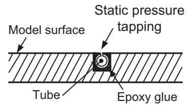

text_image

Static pressure
tapping
Model surface
Tube
Epoxy glue

(b) Flush tube   
Figure 7.7. Alternative arrangements for surface pressure measurements.

It is worth noting that pressure measurements that rely on a water-filled tube are notorious for difficulties in ensuring that there are no air bubbles within the tube. Typically, a suitable pump system is required to flush the tubes once they are immersed in the water and/or a suitable time is required to allow the air to enter solution. If air remains, then its compressibility prevents accurate transmission of the surface pressure to the measurement device.

Typical references describing such measurements include Shearer and Cross [7.10], Townsin [7.11] and Molland and Turnock [7.12, 7.13] for models in a wind tunnel. In water, there can be problems with the waves generated when in motion, for example, leaving pressure tappings exposed in a trough. Hence, pressures at the upper part of the hull may have to be measured by diaphragm/electric pressure gauges, compared with a water manometry system. Such electrical pressure sensors [7.4] need to be suitably water proof and are often sensitive to rapid changes in temperature [7.14].

There are some basic experimental difficulties which concern the need for:

(a) Very accurate measurement of hull trim β for resolving forces and   
(b) The measurement of wave surface elevation, for pressure integration.

In Figure 7.8, the longitudinal force (drag) is $P d s \cdot \mathrm { s i n } \theta = P d s ^ { \prime } $ . Similarly, the vertical force is Pdv′. The horizontal force is

$$
R _ {p} = \int P d s ^ {\prime} \cos \beta + \int P d v ^ {\prime} \sin \beta . \tag {7.6}
$$

The vertical force

$$
R _ {v} = \int P d s ^ {\prime} \sin \beta - \int P d v ^ {\prime} \cos \beta = W (= - B). \tag {7.7}
$$

text_image

P
ds
ds'
θ
B
Pdv'
RP
Pds'
β
W
β = trim angle

Figure 7.8. Measurement of surface pressure.

From Equation (7.7)

$$
\int P d v ^ {\prime} = \int P d s ^ {\prime} \tan \beta - W / \cos \beta ,
$$

and substituting in Equation (7.6), hence

$\mathrm { T o t a l h o r i z o n t a l f o r c e } = \int P d s ^ { \prime } ( \cos \beta + \sin \beta \tan \beta ) - W \tan \beta .$ (7.8)

W is large, hence the accurate measurement of trim $\beta$ is important, possibly requiring the use, for example, of linear displacement voltmeters at each end of the model.

In the analysis of the data, the normal pressure (P) is projected onto the midship section for pressure tappings along a particular waterline, Figure 7.9. The Pds′ values are then integrated to give the total pressure drag.

The local pressure measurements for a tanker form, [7.8], were integrated to give the total pressure resistance, as have the local $C _ { f }$ values to give the total skin friction. Wave pattern measurements and total resistance measurements were also made, see Section 7.3.4. The resistance breakdown for this tanker form is shown in Figure 7.10.

The following comments can be made on the resistance breakdown in Figure 7.10:

(1) There is satisfactory agreement between measured pressure + skin friction resistance and total resistance.   
(2) Measured wave pattern resistance for the tanker is small (6% of total).   
(3) Measured total $C _ { F }$ is closely comparable with the ITTC estimate, but it shows a slight dependence on Froude number, that is, the curve undulates.

text_image

Wave elevation
P
ds'
Positions of
pressure tappings

Figure 7.9. Projection of pressures on midship section.

line

| V_NL | C'_f     | C'_f + C'_f | C'_T      |
|------|----------|-------------|-----------|
| 0.60 | 0.0035   | 0.0035      | 0.0052    |
| 0.65 | 0.0034   | 0.0034      | 0.0053    |
| 0.70 | 0.0033   | 0.0033      | 0.0055    |
| 0.75 | 0.0034   | 0.0034      | 0.0058    |

Figure 7.10. Results for a tanker form.

(4) There was a slight influence of hull form on measured $C _ { F } .$ . Changes in $C _ { F }$ of about 5% can occur due to changes in form. Changes occurred mainly at the fore end.

In summary, the measurement and then integration of surface pressure is not a procedure to be used from day to day. It is expensive to acquire sufficient points to give an accurate value of resistance, especially as it involves the subtraction of two quantities of similar magnitude.

# 7.3.3 Viscous Resistance

The use of a control volume approach to identify the effective change in fluid momentum and, hence, the resistance of the hull has many advantages in comparison with the direct evaluation of shear stress and surface normal pressure. It is widely applied in the wind tunnel measurement of aircraft drag. More recently, it has also been found to exhibit less susceptibility to issues of surface mesh definition in computational fluid dynamics (CFD) [7.15], see Chapter 9. Giles and Cummings [7.16] give the full derivation of all the relevant terms in the control volume. In the case of CFD evaluations, the effective momentum exchange associated with the turbulent wake Reynolds averaged stress terms should also be included. In more practical experimentation, these terms are usually neglected, although the optical laser-based flow field measurement techniques (Section 7.4) do allow their measurement.

In Chapter 3, Equation (3.14) gives the total viscous drag for the control volume as the following:

$$
R _ {V} = \iint_ {\text { wake }} \left\{\Delta p + \frac {1}{2} \rho (u ^ {\prime 2} - u ^ {2}) \right\} d z d y, \tag {7.9}
$$

where $\Delta p$ and $u ^ { \prime }$ are found from the following equations:

$$
\frac {p _ {B}}{\rho} + \frac {1}{2} [ (U + u ^ {\prime}) ^ {2} + v ^ {2} + w ^ {2} ] + g z _ {B} + \frac {\Delta p}{\rho} = \frac {1}{2} U ^ {2} \tag {7.10}
$$

and

$$
\frac {1}{2} \rho (U + u ^ {\prime}) ^ {2} = \frac {1}{2} \rho (U + u) ^ {2} + \Delta p, \tag {7.11}
$$

remembering $u ^ { \prime }$ is the equivalent velocity that includes the pressure loss along the streamline. This formula is the same as the Betz formula for viscous drag, but it is generally less convenient to use for the purpose of experimental analysis.

An alternative formula is that originally developed by Melville Jones when measuring the viscous drag of an aircraft wing section:

$$
R _ {V} = \rho U ^ {2} \sqrt {g - p} d y d z, \tag {7.12}
$$

where two experimentally measured non-dimensional quantities

$$
p = \frac {p _ {B} - p _ {0}}{\frac {1}{2} \rho U ^ {2}} \quad \text { and } \quad g = p + \left(\frac {U + u}{U}\right) ^ {2}
$$

can be found through measurement of total head and static pressure loss downstream of the hull using a rake or traverse of Pitot and static probes. ˆ

# 7.3.3.1 Derivation of Melville Jones Formula

In this derivation, viscous stresses are neglected as are wave-induced velocity components as these are assumed to be negligible at the plane of interest. Likewise, the influence of vorticity is assumed to be small. Figure 7.11 illustrates the two downstream measurement planes 1 and 2 in a ship fixed system with the upstream plane 0, the undisturbed hydrostatic pressure field $P _ { 0 }$ and ship speed u. Far downstream at plane 2, any wave motion is negligible and $P _ { 2 } = P _ { 0 }$ .

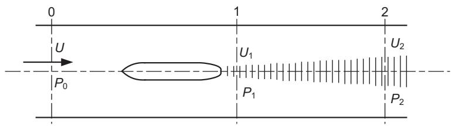

text_image

0
U
P₀
1
U₁
P₁
2
U₂
P₂

Figure 7.11. Plan view of ship hull with two wake planes identified.

The assumption is that, along a streamtube between 1 and 2, no total head loss occurs (e.g. viscous mixing is minimal) so that the total head $H _ { 2 } = H _ { 1 }$ . The assumption of no total head loss is not strictly true, since the streamlines/tubes will not be strictly ordered, and there will be some frictional losses. The total viscous drag $R _ { V }$ will then be the rate of change of momentum between stations 0 and 2 (no net pressure loss), i.e.

$$
R _ {V} = \rho \iint u _ {2} (u - u _ {2}) d S _ {2}
$$

(where $d S _ { 2 }$ is the area of the streamtube). For mass continuity along streamtube,

$$
\begin{array}{l} u _ {1} d S _ {1} = u _ {2} d S _ {2} \\ \therefore R _ {V} = \rho \iint u _ {1} (u - u _ {2}) d S _ {1} \text {   over   plane   } 1 \\ \end{array}
$$

as

$$
\begin{array}{l} H _ {0} = \frac {1}{2} \rho u ^ {2} + P _ {0} \\ H _ {2} = \frac {1}{2} \rho u _ {2} ^ {2} + P _ {2} = \frac {1}{2} \rho u _ {2} ^ {2} + P _ {0} = \frac {1}{2} \rho u _ {1} ^ {2} + P _ {1} \\ \frac {u _ {2}}{u} = \sqrt {g}, \\ \end{array}
$$

$$
\frac {H _ {0} - H _ {2}}{\frac {1}{2} \rho u ^ {2}} = 1 - \left(\frac {u _ {2}}{u}\right) ^ {2} \quad \text { or }
$$

where

$$
g = 1 - \frac {H _ {0} - H _ {2}}{\frac {1}{2} \rho u ^ {2}} \mathrm{also}
$$

$$
\left(\frac {u _ {1}}{u}\right) ^ {2} = \left(\frac {u _ {2}}{u}\right) ^ {2} - \frac {\left(P _ {1} - P _ {0}\right)}{\frac {1}{2} \rho u ^ {2}}
$$

$$
= g - p
$$

where

$$
\begin{array}{l} p = \frac {P _ {1} - P _ {0}}{\frac {1}{2} \rho u ^ {2}}, \\ \frac {u _ {1}}{u} = \sqrt {g - p} \quad \text { and } \quad g = p + \left(\frac {u _ {1}}{u}\right) ^ {2} \\ \end{array}
$$

Substitute for $u _ { 1 }$ and $u _ { 2 }$ for $R _ { V }$ to get the following:

$$
R _ {V} = \rho u ^ {2} \iint_ {\text { wake }} (1 - \sqrt {g}) (\sqrt {g - p}) d y d z \text { over   plane   at } 1.
$$

At the edge of the wake $u _ { 2 }$ or $u _ { 1 } = u$ and $g = 1$ and the integrand goes to zero; measurements must extend to edge of the wake to obtain this condition.

The Melville Jones formula, as derived, does not include a free surface, but experimental evidence and comparison with the Betz formula indicates satisfactory use, Townsin [7.17]. For example, experimental evidence indicates that the Melville

Jones and Betz formulae agree at a distance above about 5% of body length downstream of the model aft end (a typical measurement position is 25% downstream).

# 7.3.3.2 Experimental Measurements

Examples of this analysis applied to ship models can be found in Shearer and Cross [7.10], Townsin [7.17, 7.18] and, more recently, Insel and Molland [7.19] who applied the methods to monohulls and catamarans. In these examples, for convenience, pressures are measured relative to a still-water datum, whence

$$
p = \frac {P _ {1}}{\frac {1}{2} \rho u ^ {2}} \quad \mathrm{and} \quad g = \frac {P _ {1} + \frac {1}{2} \rho u _ {1} ^ {2}}{\frac {1}{2} \rho u ^ {2}},
$$

where $P _ { 1 }$ is the local static head (above $\begin{array} { r } { P _ { 0 } ) , [ P _ { 1 } + \frac { 1 } { 2 } \rho u _ { 1 } ^ { 2 } ] } \end{array}$ is the local total head and u is the free-stream velocity.

Hence, for a complete wake integration behind the model, total and static heads are required over that part of the plane within which total head differs from that in the free stream. Figure 7.12 illustrates a pressure rake. This could combine a series of total and static head probes across the wake. Alternatively, the use of static caps fitted over the total head tubes can be used, and the data taken from a pair of matched runs at a given depth. The spacing of the probes and vertical increments should be chosen to capture the wake with sufficient resolution.

If used in a towing tank, pressures should be measured only during the steady phase of the run by using pressure transducers with suitably filtered averaging applied. Measurement of the local transverse wave elevation is required to obtain the local static pressure deficit $p = 2 g \zeta / u ^ { 2 }$ , where $\zeta$ is the wave elevation above the still water level at the rake position.

A typical analysis might be as follows (shown graphically in Figure 7.13). For a particular speed, $2 { \sqrt { g - p } } ( 1 - { \sqrt { g } } )$ is computed for each point in the field and plotted to a base of $y$ for each depth of immersion. Integration of these curves yields the viscous resistance $R _ { V }$ .

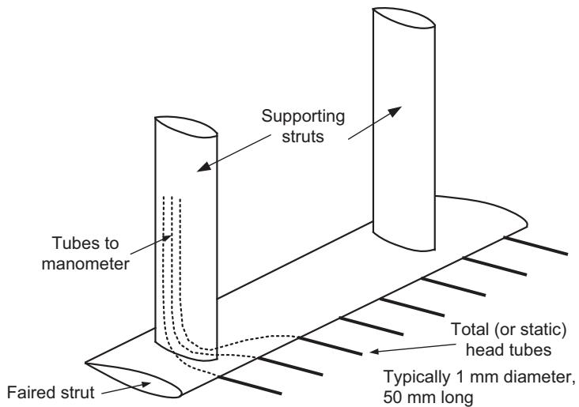

text_image

Supporting struts
Tubes to manometer
Total (or static) head tubes
Typically 1 mm diameter,
50 mm long
Faired strut

Figure 7.12. Schematic layout of a pressure probe rake.

  
Integration of left-hand curve in y plotted to base of Z (right-hand curve).   
Integration of right-hand curve with respect to $Z$ yields $R _ { V }$

Figure 7.13. Schematic sketches of wake integration process.

# 7.3.3.3 Typical Wake Distribution for a High $\scriptstyle { C _ { B } }$ Form

The typical wake distribution for a high $C _ { B }$ form is shown in Figure 7.14. This shows that, besides the main hull boundary layer wake deficit, characteristic side lobes may also be displayed. These result from turbulent ‘debris’ due to a breaking bow wave. They may contain as much as $5 \%$ of total resistance (and may be comparable with wave pattern resistance for high $C _ { B }$ forms).

Similar characteristics may be exhibited by high-speed multihulls [7.19], both outboard of the hulls and due to interaction and the breaking of waves between the hulls, Figure 7.15.

# 7.3.3.4 Examples of Results of Wake Traverse and Surface Pressure Measurements

Figure 7.16 shows the results of wake traverse and surface pressure measurements on a model of the Lucy Ashton (Townsin [7.17]). Note that the frictional resistance is obtained from the total resistance minus the pressure resistance. The results show the same general trends as other measurements of resistance components, such as Preston tube $C _ { F }$ measurements, where $C _ { F }$ is seen to be comparable to normal flat plate estimates but slightly Froude number dependent (roughly reciprocal with humps and hollows in total drag). The form drag correction is approximately of the same order as the Hughes/ITTC-type correction $[ ( 1 + k ) C _ { F } ]$ .

text_image

Side lobes due to turbulent debris
Main hull boundary
layer deficit

Figure 7.14. Typical wake distribution for a high block coefficient form.

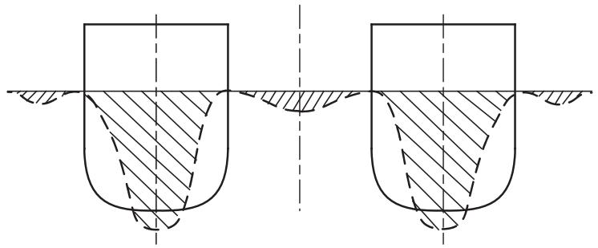

natural_image

Pure diagram of two identical container-like structures with hatched fill and directional arrows, no text or symbols present.

Figure 7.15. Typical wake distribution for a catamaran form.

# 7.3.4 Wave Resistance

From a control-volume examination of momentum exchange the ship creates a propagating wave field that in steady motion remains in a fixed position relative to the ship. Measurement of the energy associated with this wave pattern allows the wave resistance to be evaluated. This section explains the necessary analysis of the wave pattern specifically tailored to measurements made in a channel of finite depth and width. A more detailed explanation of the underpinning analysis is given, for example, by Newman [7.20].

line

| Fr = u/√gL | Total resistance pressure measurement model | Total resistance wake traverse model | Wake traverse resistance | Schoenherr & Granville | Frictional resistance (from total minus pressure) |
| ---------- | ------------------------------------------ | -------------------------------------- | ------------------------ | ----------------------- | ------------------------------------------------- |
| 0.2        | ~3.8                                       | ~3.7                                   | ~3.5                     | ~3.4                    | ~3.0                                              |
| 0.3        | ~5.5                                       | ~5.4                                   | ~3.0                     | ~2.8                    | ~2.5                                              |
| 0.4        | ~6.0                                       | ~5.9                                   | ~2.5                     | ~2.3                    | ~2.0                                              |

Figure 7.16. A comparison of undulations in the wake traverse resistance and the frictional resistance (Townsin [7.17]).

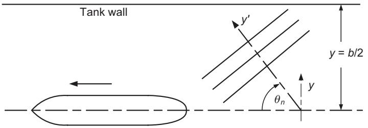

text_image

Tank wall
y'
θn
y = b/2

Figure 7.17. Schematic view of a of ship model moving with a wave system.

# 7.3.4.1 Assumed Character of Wave Pattern

Figure 7.17 shows the case of a model travelling at uniform speed down a rectangular channel. The resultant wave pattern can be considered as being composed of a set of plane gravity waves travelling at various angles $\theta _ { n }$ to the model path. The ship fixed system is chosen such that:

(a) The wave pattern is symmetrical and stationary,   
(b) The wave pattern moves with the model (wave speed condition),   
(c) The wave pattern reflects so there is no flow through the tank walls.

The waves are generated at the origin $x = 0 , y = 0$ . The wave components propagate at an angle $\theta _ { n }$ and hold a fixed orientation relative to each other and to the ship when viewed in a ship fixed axis system.

(A) WAVE PATTERN. Each wave of angle $\theta _ { n }$ can be expressed as a sinusoidally varying surface elevation $\zeta _ { n }$ which is a function of distance $y ^ { \prime }$ along its direction of propagation. $\zeta _ { n } = A _ { n }$ cos $( \gamma _ { n } y ^ { \prime } + \varepsilon _ { n } )$ say, where $A _ { n }$ and $\varepsilon _ { n }$ are the associated amplitude and phase shift, and $\gamma _ { n }$ is the wave number. The distance along the wave can be expressed as a surface elevation $\zeta _ { n }$ which is a function of $y ^ { \prime } .$ Now, $y ^ { \prime } = y$ sin $\theta _ { n } - x \cos \theta _ { n }$ . Expressing this in terms of the lateral distance y gives the following:

$$
\begin{array}{l} \zeta_ {n} = A _ {n} \cos \left(y \gamma_ {n} \sin \theta - x \gamma_ {n} \cos \theta_ {n} + \varepsilon_ {n}\right) \\ = A _ {n} \left[ \cos \left(x \gamma_ {n} \cos \theta_ {n} - \varepsilon_ {n}\right) \cos \left(y \gamma_ {n} \sin \theta_ {n}\right) + \sin \left(x \gamma_ {n} \cos \theta_ {n} - \varepsilon_ {n}\right) \sin \left(y \gamma_ {n} \sin \theta_ {n}\right) \right]. \\ \end{array}
$$

In order for the wave system to be symmetric, every component of wave angle $\theta _ { n }$ is matched by a component of angle $- \theta _ { n } ;$ for which

$$
\zeta_ {n} ^ {\prime} = A _ {n} \left[ \cos (\mathbf {\theta}) \cos (\mathbf {\theta}) - \sin (\mathbf {\theta}) \sin (\mathbf {\theta}) \right].
$$

Hence, adding the two components, a symmetric wave system consists of the terms:

$$
\begin{array}{l} \zeta_ {n} = 2 A _ {n} \cos (x \gamma_ {n} \cos \theta_ {n} - \varepsilon_ {n}) \cos (y \gamma_ {n} \sin \theta_ {n}) \\ = \left[ \xi_ {n} \cos \left(x \gamma_ {n} \cos \theta_ {n}\right) + \eta_ {n} \sin \left(x \gamma_ {n} \cos \theta_ {n}\right) \right] \cos \left(y \gamma_ {n} \sin \theta_ {n}\right), \tag {7.13} \\ \end{array}
$$

where $\xi _ { n } , \eta _ { n }$ are modified wave amplitude coefficients and

$$
\xi_ {n} = 2 A _ {n} \cos \varepsilon_ {n} \quad \eta_ {n} = 2 A _ {n} \sin \varepsilon_ {n}.
$$

The complete wave system is considered to be composed of a sum of a number of waves of the above form, known as the Eggers Series, with a total elevation as follows:

$$
\zeta = \sum_ {n = 0} ^ {\infty} \left[ \xi_ {n} \cos \left(x \gamma_ {n} \cos \theta_ {n}\right) + \eta_ {n} \sin \left(x \gamma_ {n} \cos \theta_ {n}\right) \right] \cos \left(y \gamma_ {n} \sin \theta_ {n}\right). \tag {7.14}
$$

(B) WAVE SPEED CONDITION. For water of finite depth h, a gravity wave will move with a speed $c _ { n }$ of $\begin{array} { r } { c _ { n } ^ { 2 } = \frac { g } { \gamma _ { n } } } \end{array}$ tanh $( \gamma _ { n } h )$ , see Appendix A1.8. The wave system travels with the model, and $c _ { n } = c \cos \theta _ { n } .$ , where c is the model speed. Hence,

$$
\gamma_ {n} \cos^ {2} \theta_ {n} = \frac {g}{c ^ {2}} \tanh (\gamma_ {n} h). \tag {7.15}
$$

(C) WALL REFLECTION. At the walls $y = \pm b / 2$ , the transverse components of velocities are zero, and $\begin{array} { r } { \frac { d \zeta _ { n } } { d y } = 0 } \end{array}$ . Hence from Equation (7.13) sin $\begin{array} { r } { \left( \frac { b } { 2 } \gamma _ { n } \sin \theta _ { n } \right) = 0 , \mathrm { i . e } } \end{array}$ .

$$
\frac {b}{2} \gamma_ {n} \sin \theta_ {n} = 0, \pi , 2 \pi , 3 \pi , \dots
$$

from which

$$
\gamma_ {n} \sin \theta_ {n} = \frac {2 \pi m}{b}, \tag {7.16}
$$

where m  0, 1, 2, 3  From Equations (7.15) and (7.16), noting $\cos ^ { 2 } \theta + \sin ^ { 2 } \theta = 1$ and eliminating $\theta _ { n }$ , the wave number needs to satisfy

$$
\gamma_ {n} ^ {2} = \frac {g}{c ^ {2}} \gamma_ {n} \tanh (\gamma_ {n} h) + \left(\frac {2 m \pi}{b}\right) ^ {2}. \tag {7.17}
$$

For infinitely deep water, tanh $( \gamma _ { n } h )  1$ and Equation (7.17) becomes a quadratic equation.

It should be noted that there are a number of discrete sets of values of $\gamma _ { n }$ and $\theta _ { n }$ for a channel of finite width, where $\gamma _ { n }$ can be found from the roots of Equation (7.17) and $\theta _ { n }$ can be found by substituting in Equation (7.16). As the channel breadth increases, the wave angles become more numerous and ultimately the distribution becomes a continuous spectrum.

It is worth examining a typical set of values for $\theta _ { n }$ and $\gamma _ { n }$ which are shown in Table 7.2. These assume that $g / c ^ { 2 } = 2 , b = 1 0$ , deep water, $h = \infty$ .

Note the way that $\left( \theta _ { n } - \theta _ { n - 1 } \right)$ becomes much smaller as n becomes larger. It will be shown in Section 7.3.4.3 that the transverse part of the Kelvin wave system corresponds to $\theta _ { n } < 3 5 ^ { \circ }$ . The above example is typical of a ship model in a (large) towing tank, and it is to be noted how few components there are in this range of angles for a model experiment.

Table 7.2. Typical sets of allowable wave components for a finite-width tank of infinite depth 

<table><tr><td>n</td><td> $\gamma_n$ </td><td> $\theta_n$ </td><td>n</td><td> $\gamma_n$ </td><td> $\theta_n$ </td></tr><tr><td>0</td><td>2</td><td> $0^\circ$ </td><td>10</td><td>7.35</td><td> $59.0^\circ$ </td></tr><tr><td>1</td><td>2.18</td><td> $16.8^\circ$ </td><td>15</td><td>10.5</td><td> $63.5^\circ$ </td></tr><tr><td>2</td><td>2.60</td><td> $28.9^\circ$ </td><td>20</td><td>13.6</td><td> $67.1^\circ$ </td></tr><tr><td>3</td><td>3.13</td><td> $37.1^\circ$ </td><td>25</td><td>16.7</td><td> $69.6^\circ$ </td></tr><tr><td>4</td><td>3.76</td><td> $42.0^\circ$ </td><td>30</td><td>19.8</td><td> $71.5^\circ$ </td></tr><tr><td>5</td><td>4.3</td><td> $47.0^\circ$ </td><td></td><td></td><td></td></tr></table>

# 7.3.4.2 Restriction on Wave Angles in Shallow Water

It can be shown that for small $\gamma _ { n } h$ , tanh $( \gamma _ { n } h ) < \gamma _ { n } h$ and so, from Equation (7.15),

$$
\gamma_ {n} \cos^ {2} \theta_ {n} = \frac {g}{c ^ {2}} \tanh (\gamma_ {n} h) <   \frac {g}{c ^ {2}} \gamma_ {n} h
$$

$$
\therefore \cos \theta_ {n} <   \frac {\sqrt {g h}}{c}. \tag {7.18}
$$

If $c < { \sqrt { g h } }$ this creates no restriction (since cos $\theta \leq 1 . 0$ for 0−90◦). Above $c =$ $\sqrt { g h } , \theta _ { n }$ must be restricted to lie in the range as follows:

$$
\theta_ {n} > \cos^ {- 1} \left(\frac {\sqrt {g h}}{c}\right).
$$

Speeds of $c < { \sqrt { g h } }$ are called sub-critical speeds and of $c > { \sqrt { g h } }$ are called supercritical speeds.

At super-critical speeds part of the transverse wave system must vanish, as a gravity wave cannot travel at speeds greater than ${ \sqrt { g h } } .$

As an example for shallow water assume that $h = 1 , g = 9 . 8 1 \ \sqrt { g h } = 3 . 1 3$ and $c = 4$ .

Take

$$
\frac {\sqrt {g h}}{c} = \frac {3 . 1 3}{4} = 0. 7 8 3
$$

i.e.

$$
\cos \theta <   0. 7 8 3 \quad \text { or } \quad \theta > 3 8 ^ {\circ}
$$

If c is reduced to 3.13, cos $\theta \leq 1 , \theta > 0$ and all angles are now included.

# 7.3.4.3 Kelvin Wave System

It can be shown theoretically that the wave system generated by a point source is such that, for all components, $\eta _ { n } = 0$ , so all the wave components will have a crest at the point $x = y = 0$ above the source position. This fact can be used to construct the Kelvin wave pattern from a system of plane waves.

If a diagram is drawn for the wave system, Figure 7.18, it is found that the crest lines of the wave components cross over each other and there is one region where many wave crests (or troughs) come together to produce a large crest (or trough) in the overall system.

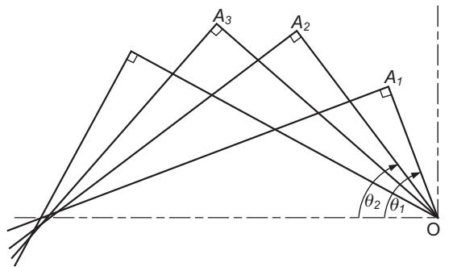

text_image

A₃
A₂
A₁
θ₂ θ₁
O

Figure 7.18. Graphical representation of wave components showing relative change in wave-length and intersection of crests.

Figure 7.18 defines the location of the wave crests. Let $\mathrm { O A } _ { 1 }$ be a given multiple of one wave length for a wave angle $\theta _ { 1 }$ , and $\mathrm { O A } _ { 2 }$ be the same multiple of wave length for wave angle $\theta _ { 2 }$ etc. The corresponding wave crest lines overlay to produce the envelope shown.

If A-A is a crest line in waves from 0, in order to define the wave envelope in deep water, the equation of any given crest line A-A associated with a wave angle θ is required, where A-A is a crest line m waves from 0, Figure 7.19.

For a stationary wave pattern, the wave speed is $C _ { n } ( \theta ) = c \cos { \theta }$ and $\lambda =$ $2 \pi c ^ { 2 } / g$ . In wave pattern, m lengths at $\theta _ { n }$ along $O P$

$$
= \frac {2 \pi c _ {n} ^ {2} m}{g} = \frac {2 \pi c ^ {2} m \cos^ {2} \theta}{g} = m \lambda \cos^ {2} \theta .
$$

Hence, the distance of A-A from source origin 0 is $\lambda \cos ^ { 2 } \theta$ , for $m = 1$ , (since source waves all have crest lines through 0, and $m = 1 , 2 , 3 \ldots )$ .The co-ordinates of P are $\left( - \lambda \cos ^ { 3 } \theta \lambda \cos ^ { 2 } \theta \right)$ sin θ ) and the slope of A-A is $\tan ( \pi / 2 - \theta ) = \cot \theta$ . Hence, the equation for A-A is $y - y _ { p } = ( x - x _ { p } )$ cot θ . Substitution for $x _ { p } , y _ { p }$ gives the following:

$$
y = \frac {\lambda \cos^ {2} \theta}{\sin \theta} + x \cot \theta . \tag {7.19a}
$$

In order to find the equation of the wave envelope it is required to determine the point where this line meets a neighbouring line at wave angle $\theta + \delta \theta$ . The equation

text_image

Crest line
m waves from source at O
λ cos²θ
A
P
C
θₙ
O
Wave
direction
A

Figure 7.19. Geometrical representation of a wave crest relative to the origin.

of this neighbouring crest line is

$$
y ^ {\prime} = y + \frac {d y}{d \theta} \delta \theta .
$$

Now, as

$$
y = (x + \lambda \cos \theta) \cot \theta
$$

$$
\frac {d y}{d \theta} = - (x + \lambda \cos \theta) \sec^ {2} \theta - \lambda \sin \theta \cot \theta
$$

$$
= - x \sec^ {2} \theta - \lambda \cos \theta \sec^ {2} \theta - \lambda \sin \theta \cot \theta
$$

$$
= - x \sec^ {2} \theta - \lambda \cos \theta (\sec^ {2} \theta + 1)
$$

hence,

$$
y ^ {\prime} = y + \left[ - x \operatorname{cosec} ^ {2} \theta - \lambda \cos \theta (\operatorname{cosec} ^ {2} \theta + 1) \right] \delta \theta
$$

$$
= y + \frac {1}{\sin^ {2} \theta} [ - x - \lambda \cos \theta (1 + \sin^ {2} \theta) ] \delta \theta
$$

In order for the wave crests for wave angles θ and $\theta + \delta \theta$ to intersect, $y ^ { \prime } = y$ and, hence, $[ - x - \lambda \cos \theta ( 1 + \sin ^ { 2 } \theta ) ] = 0 ,$ . Thus, the intersection is at the point:

$$
x = - \lambda \cos \theta (1 + \sin^ {2} \theta)
$$

and

$$
y = - \lambda \cos^ {2} \theta \sin \theta . \tag {7.19b}
$$

These parametric Equations (7.19b) represent the envelope of the wave crest lines, shown schematically in Figure 7.20.

On differentiating with respect to $\theta ,$

$$
\frac {\mathrm{d} x}{\mathrm{d} \theta} = \lambda \sin \theta (1 + \sin^ {2} \theta) - \lambda \cos \theta 2 \sin \theta \cos \theta
$$

$$
= - \lambda \sin \theta (1 - 3 \sin^ {2} \theta).
$$

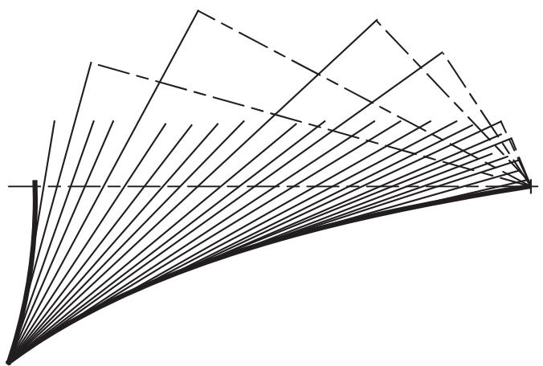

natural_image

Pure geometric diagram of intersecting lines and curves without any text, numbers, or symbols

Figure 7.20. Overlay of crest lines and wave envelope.

text_image

B
θ
α
A
O

Figure 7.21. Deep water wave envelope with cusp located at A.

Similarly

$$
\begin{array}{l} \frac {\mathrm{d} y}{\mathrm{d} \theta} = - \lambda 2 \cos \theta \sin \theta \sin \theta - \cos \theta \lambda \cos^ {2} \theta \\ = - \lambda (- 2 \cos \theta \sin^ {2} \theta + \cos^ {3} \theta) \\ = - \lambda \cos \theta (- 2 \sin^ {2} \theta + \cos^ {2} \theta) \\ = - \lambda \cos \theta (1 - 3 \sin^ {2} \theta) \\ \end{array}
$$

and

$$
\frac {\mathrm{d} x}{\mathrm{d} \theta} = \frac {d y}{d \theta} = 0 \quad \text { at } \quad \theta = \sin^ {- 1} (1 / \sqrt {3}) = 3 5. 3 ^ {\circ}.
$$

The point A corresponding to $\theta = \sin ^ { - 1 } ( 1 / \sqrt { 3 } )$ is a cusp on the curve as shown in Figure 7.21. $\theta = 0$ corresponds to $x = - \lambda , y = 0$ (point B on Figure 7.21) and $\theta =$ $\pi / 2$ corresponds to $x = y = 0$ the origin. Hence, the envelope has the appearance as shown.

By substituting the co-ordinates of A,

$$
x = \frac {- 4 \sqrt {2}}{3 \sqrt {3}} \lambda
$$

$$
y = \frac {- 2}{3 \sqrt {3}} \lambda .
$$

The slope of line OA is such that

$$
\begin{array}{l} \alpha = \tan^ {- 1} \left(\frac {y}{x}\right) = \tan^ {- 1} \left(\frac {1}{2 \sqrt {2}}\right) = 1 9 ^ {\circ} 4 7 ^ {\prime} \text { or } \\ \alpha = \sin^ {- 1} \left(\frac {1}{3}\right) \\ \end{array}
$$

Figure 7.22 summarises the preceding description with a graphical representation of a deep water Kelvin wave. As previously noted in Chapter 3, Section 3.1.5, a ship hull can be considered as a number of wave sources acting along its length, typically dominated by the bow and stern systems.

Figure 7.22 shows the construction of the complete wave system for a Kelvin wave source. Varying values of mλ correspond to successive crest lines and a whole series of geometrically similar crest lines are formed to give the complete Kelvin pattern, Figure 7.23.

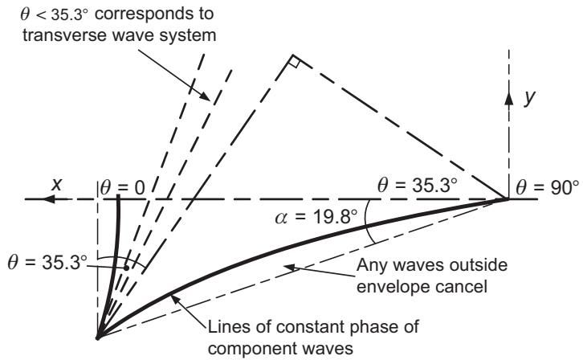

text_image

θ < 35.3° corresponds to transverse wave system
x
θ = 0
θ = 35.3°
α = 19.8°
θ = 90°
Any waves outside envelope cancel
Lines of constant phase of component waves

Figure 7.22. Kelvin wave system development.

# 7.3.4.4 Eggers Formula for Wave Resistance (Summary)

The following is a summary of the wave resistance analysis given in more detail in Appendix A2. The analysis is also explained in some detail in the publications of Hogben [7.21, 7.22 and 7.23], together with the use of wave probes to measure wave resistance.

From the momentum analysis of the flow around a hull (see Chapter 3, Equation (3.10)), it can be deduced that

$$
\begin{array}{l} R = \left\{\frac {1}{2} \rho g \int_ {- b / 2} ^ {b / 2} \zeta_ {B} ^ {2} d y + \frac {1}{2} \rho \int_ {- b / 2} ^ {b / 2} \int_ {- h} ^ {\zeta_ {B}} (v ^ {2} + w ^ {2} - u ^ {2}) d z d y \right\} \\ + \int_ {- b / 2} ^ {b / 2} \int_ {- h} ^ {\zeta_ {B}} \Delta p d z d y, \tag {7.20} \\ \end{array}
$$

where the first two terms are broadly associated with wave pattern drag, although perturbation velocities v, w, u are due partly to viscous shear in the boundary layer.

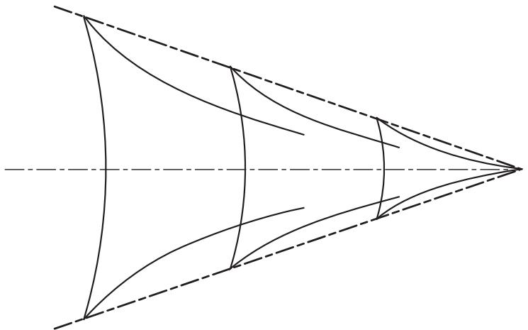

natural_image

Pure geometric diagram of intersecting curved lines and dashed boundaries without any text or symbols

Figure 7.23. Complete Kelvin pattern.

Thus, from measurements of wave elevation ζ and perturbation velocity components u, v, w over the downstream plane, the wave resistance could be determined. However, measurements of subsurface velocities u, v, w would be difficult to make, so linearised potential theory is used, in effect, to deduce these velocities from the more conveniently measured wave pattern (height ζ ).

It has been shown that the wave elevation may be expressed as the Eggers series, as follows:

$$
\zeta = \sum_ {n = 0} ^ {\infty} \left[ \xi_ {n} \cos \left(x \gamma_ {n} \cos \theta_ {n}\right) + \eta_ {n} \sin \left(x \gamma_ {n} \cos \theta_ {n}\right) \right] \cos \left(\frac {2 \pi n y}{b}\right), \tag {7.21}
$$

as

$$
\gamma_ {n} \sin \theta_ {n} = \frac {2 \pi n}{b}.
$$

Linearising the free-surface pressure condition for small waves yields the following:

$$
c \frac {\partial \theta}{\partial x} + g \zeta = 0 \quad \text {or} \quad \zeta = - \frac {c}{g} \left. \frac {\partial \theta}{\delta x} \right| _ {z = 0}.
$$

by using this result, the velocity potential for the wave pattern can be deduced as the following:

$$
\phi = \frac {g}{c} \sum_ {n = 0} ^ {\infty} \frac {\cosh \gamma_ {n} (z + h)}{\lambda_ {n} \cosh (\gamma_ {n} h)} [ \eta_ {n} \cos \lambda_ {n} x - \xi_ {n} \sin \lambda_ {n} x ] \cos \frac {2 \pi n y}{b}, \tag {7.22}
$$

where

$$
\lambda_ {n} = \gamma_ {n} \cos \theta_ {n}.
$$

From the momentum analysis, Equation (7.20), wave resistance will be found from

$$
R _ {w} = \left\{\frac {1}{2} \rho g \int_ {- b / 2} ^ {b / 2} \zeta_ {B} ^ {2} d y + \int_ {- b / 2} ^ {b / 2} \int_ {- h} ^ {\zeta_ {B}} (v ^ {2} + w ^ {2} - u ^ {2}) d z d y \right\}, \tag {7.23}
$$

now

$$
u = \frac {\partial \phi}{\partial x} \qquad v = \frac {\partial \phi}{\partial y} \qquad w = \frac {\partial \phi}{\partial z},
$$

which can be derived from Equation (7.22).

Hence, substituting these values of $u , v ,$ , w into Equation (7.23) yields the Eggers formula for wave resistance $R _ { w }$ in terms of $\xi _ { n }$ and $\eta _ { n } ,$ , i.e. for the deep water case:

$$
R _ {w} = \frac {1}{4} \rho g b \left\{\left(\xi_ {0} ^ {2} + \eta_ {0} ^ {2}\right) + \sum_ {n = 1} ^ {\infty} \left(\xi_ {n} ^ {2} + \eta_ {n} ^ {2}\right) \left(1 - \frac {1}{2} \cos^ {2} \theta_ {n}\right) \right\}. \tag {7.24}
$$

If the coefficients $\gamma _ { n }$ and $\theta _ { n }$ have been determined from Equations (7.17) and (7.16), the wave resistance may readily be found from (7.24) once the coefficients $\xi _ { n }$ and $\eta _ { n }$ have been determined. The coefficients $\xi _ { n }$ and $\eta _ { n }$ can be found by measuring the wave pattern elevation. They can also be obtained theoretically, as described in Chapter 9.

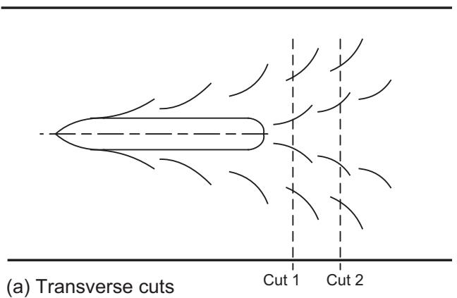

text_image

(a) Transverse cuts
Cut 1
Cut 2

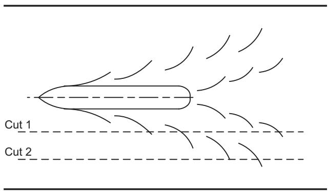

text_image

Cut 1
Cut 2

(b) Longitudinal cuts   
Figure 7.24. Possible wave cuts to determine wave resistance.

# 7.3.4.5 Methods of Wave Height Measurement and Analysis

Figure 7.24 shows schematically two possible methods of measuring wave elevation (transverse and longitudinal cuts) that can be applied to determine wave resistance.

(A) TRANSVERSE CUT. In this approach the wave elevation is measured for at least two positions behind the model, Figure 7.24(a). Each cut will be a Fourier series in y.

$$
\zeta = \sum_ {n = 0} ^ {\infty} \left[ \xi_ {n} \cos \left(x \gamma_ {n} \cos \theta_ {n}\right) + \eta_ {n} \sin \left(x \gamma_ {n} \cos \theta_ {n}\right) \right] \cos \left(\frac {2 \pi n y}{b}\right).
$$

For a fixed position x

$$
\zeta = \sum A _ {n} \cos {\frac {2 \pi n y}{b}},
$$

and for cut 1 $A _ { n 1 } = \xi _ { n } \cos ( x _ { 1 } \gamma _ { n } \cos \theta _ { n } ) + \eta _ { n } \sin ( x _ { 1 } \gamma _ { n } \cos \theta _ { n } )$ .

$\mathrm { F o r } \operatorname { c u t } 2 A _ { n 2 } = \xi _ { n } \cos ( x _ { 2 } \gamma _ { n } \cos \theta _ { n } ) + \eta _ { n } \sin ( x _ { 2 } \gamma _ { n } \cos \theta _ { n } ) .$

Values of $A _ { n 1 } , A _ { n 2 }$ are obtained from a Fourier analysis of

$$
\zeta = \sum A _ {n} \cos \frac {2 \pi n y}{b}
$$

hence, two equations from which $\xi _ { n }$ and $\eta _ { n }$ can be found for various known values of $\theta _ { n }$ .

This is generally not considered a practical method. Stationary probes fixed to the towing tank are not efficient as a gap must be left for the model to pass through. Probes moving with the carriage cause problems such as non-linear velocity effects for typical resistance or capacitance two-wire wave probes. Carriage-borne mechanical pointers can be used, but the method is very time consuming. The method is theoretically the most efficient because it correctly takes account of the tank walls.

(B) LONGITUDINAL CUT. The cuts are made parallel to the centreline, Figure 7.24(b). The model is driven past a single wave probe and measurements are made at equally spaced intervals of time to give the spatial variation.

Only one cut is required. In practice, up to four cuts are used to eliminate the possible case of the term cos 2π ny/b tending to zero for that n, i.e. is a function of ny, hence a different cut (y value) may be required to get a reasonable value of $\zeta$ .

$$
\zeta = \sum_ {n = 0} ^ {\infty} \left[ \xi_ {n} \cos \left(x \gamma_ {n} \cos \theta_ {n}\right) + \eta_ {n} \sin \left(x \gamma_ {n} \cos \theta_ {n}\right) \right] \cos \left(\frac {2 \pi n y}{b}\right). \tag {7.25}
$$

In theory, for a particular value of y, the ζ values can be measured for different values of x and simultaneous equations for $\xi _ { n }$ and $\eta _ { n }$ solved. In practice, this approach tends to be inaccurate, and more rigorous analysis methods are usually used to overcome this deficiency [7.21–7.23].

Current practice is to use (multiple) longitudinal cuts to derive $\xi _ { n }$ and $\eta _ { n }$ and, hence, find $R _ { w }$ from the Eggers resistance formula. Analysis techniques differ, and multiple longitudinal cuts are sometimes referred to as ‘matrix’ methods [7.23].

# 7.3.4.6 Typical Results from Wave Pattern Analysis

Figures 7.25–7.27 give typical wave resistance contributions for given wave components. Summation of the resistance components gives the total wave resistance for a finite width tank. Work on the performance of the technique for application to catamaran resistance is described in the doctoral theses of Insel [7.24], Couser [7.25] and Taunton [7.26].

Figure 7.25 shows that the wave energy is a series of humps dying out at about $7 5 ^ { \circ }$ . The largest hump extends to higher wave angles as speed increases. Energy due to the transverse wave system lies between $\theta = 0 ^ { \circ }$ and approximately 35◦. At low speeds, the large hump lies within the transverse part of the wave pattern and, there, transverse waves predominate, but at higher speeds the diverging waves become more significant. Figure 7.26 shows low wave resistance associated with transverse wave interference.

In shallow water, cos $\theta _ { n } < \sqrt { g h } / c$ and above $c = { \sqrt { g h } } , \theta$ is restricted to lie in the range $\theta _ { n } > \cos ^ { - 1 } \sqrt { g h } / c$ . Above $c = { \sqrt { g h } }$ (super-critical), part of the transverse wave system must vanish, Figure 7.27, since a gravity wave cannot travel at speeds $> \sqrt { g h }$ . At these speeds, only diverging waves are present, Figure 7.27.

# 7.3.4.7 Example Results of Wake Traverse and Wave Pattern Measurements

Insel and Molland [7.19] carried out a detailed study of the resistance components of semi-displacement catamarans using wake traverse and wave resistance measurements. Figure 7.28 demonstrates the relative importance of each resistance

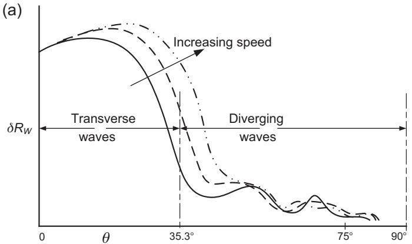

line

| θ       | δR_W (Increasing speed) | δR_W (Transverse waves) | δR_W (Diverging waves) |
| ------- | ------------------------ | ------------------------ | ----------------------- |
| 0°      | ~1.0                     | ~1.0                     | ~1.0                    |
| 35.3°   | ~0.8                     | ~0.6                     | ~0.4                    |
| 75°     | ~0.2                     | ~0.1                     | ~0.1                    |
| 90°     | ~0.1                     | ~0.05                    | ~0.05                   |

text_image

(b)
θ = 0°
Prominent
90°

Figure 7.25. Typical wave energy distribution and prominent part of wave pattern.

line

| θ       | δR_W     |
| ------- | -------- |
| 0°      | Low      |
| 35.3°   | High     |
| 75°     | Low      |
| 90°     | Very Low |

text_image

(b)
θ = 0°
90°
Prominent

Figure 7.26. Wave energy distribution: effect of transverse wave interference and prominent parts of wave pattern.

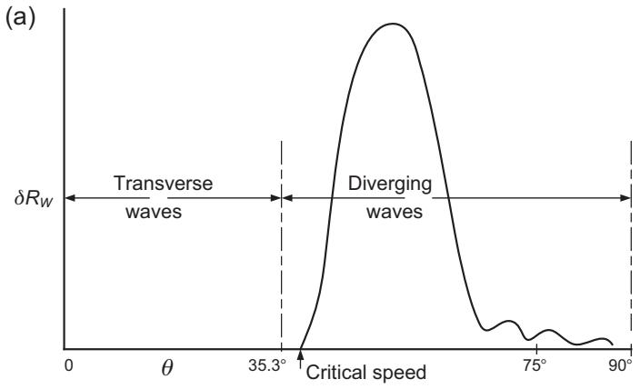

line

| Critical speed | δRw     |
| -------------- | ------- |
| 0              | 0       |
| 35.3°          | Peak    |
| 75°            | Low     |
| 90°            | Very Low|

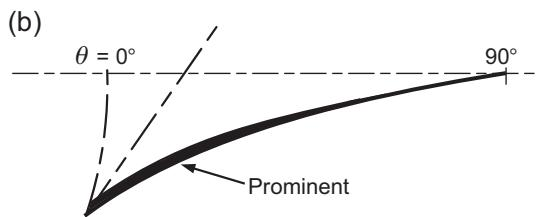

text_image

(b)
θ = 0°
90°
Prominent

Figure 7.27. Wave energy distribution: influence of shallow water and prominent part of wave pattern.

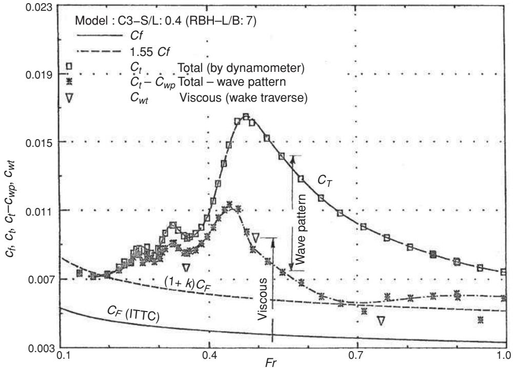

line

| Fr    | Cf     | 1.55 Cf | Total (by dynamometer) | Ct - Cwp | Total - wave pattern | Cwt   |
|-------|--------|---------|------------------------|----------|----------------------|-------|
| 0.1   | ~0.006 | ~0.008  | ~0.019                 | ~0.007   | ~0.019               | ~0.007|
| 0.4   | ~0.007 | ~0.011  | ~0.015                 | ~0.011   | ~0.015               | ~0.011|
| 0.7   | ~0.007 | ~0.007  | ~0.012                 | ~0.007   | ~0.012               | ~0.007|
| 1.0   | ~0.007 | ~0.007  | ~0.011                 | ~0.007   | ~0.011               | ~0.007|

Figure 7.28. Resistance components of C3 catamaran with hull separation ratio of 0.4 [7.19].

component. It is noted that broad agreement is achieved between the total measured drag (by dynamometer) and the sum of the viscous and wave pattern drags. In this particular research programme one of the objectives was to deduce the form factors of catamaran models, both by measuring the total viscous drag (by wake traverse) $C _ { V }$ , whence $C _ { V } = ( 1 + k ) C _ { F }$ , hence $( 1 + k )$ , and by measuring wave pattern drag $C _ { W P }$ , whence $C _ { V } = ( C _ { T } - C _ { W P } ) = ( 1 + k ) C _ { F }$ , hence, $( 1 + k )$ . See also Chapter 4, Section 4.4 for a discussion of the derivation of form factors.

# 7.4 Flow Field Measurement Techniques

The advent of significant computational power and development of coherent (laser) light sources has made possible non-invasive measurements of the flow field surrounding a ship hull. Although these techniques are usually too expensive to be applied to measure the resistance components directly, they are invaluable in providing data for validation of CFD-based analysis. As an example of the development of such datasets, Kim et al. [7.27] report on the use of a five-hole Pitot tra- ˆ verse applied to the towing tank tests of two crude carriers and a container ship hull forms. Wave pattern and global force measurements were also applied. Associated tests were also carried out in a wind tunnel using laser Doppler velocimetry (LDV) for the same hull forms. This dataset formed part of the validation dataset for the ITTC related international workshops on CFD held in Gothenburg (2000) and Tokyo (2005).

The following sections give a short overview of available techniques, including both the traditional and the newer non-invasive methods.

# 7.4.1 Hot-Wire Anemometry

The hot wire is used in wind tunnel tests and works in the same manner as the hotfilm shear stress gauge, that is, the passage of air over a fine wire through which an electric current flows, which responds to the rapid changes in heat transfer associated fluctuations in velocity. Measurement of the current fluctuations and suitable calibration allows high-frequency velocity field measurements to be made [7.28]. A single wire allows measurement of the mean flow U and fluctuating component $u ^ { \prime } .$ The application of two or three wires at different orientations allows the full mean and Reynolds stress components to be found. The sensitivity of the wire is related to its length and diameter and, as a result, tends to be vulnerable to damage. The wires would normally be moved using an automated traverse.

# 7.4.2 Five-Hole Pitot Probe ˆ

A more robust device for obtaining three mean velocity components is a five-hole Pitot probe. As the name suggests, these consist of five Pit ˆ ot probes bound closely ˆ together. Figure 7.29 illustrates the method of construction and a photograph of an example used to measure the flow components in a wind tunnel model of a waterjet inlet, Turnock et al. [7.29].

There are two methods of using these probes. In the first, two orthogonal servo drives are moved to ensure that there is no pressure difference between the vertical and transverse pressure pairs. Measuring the dynamic pressure and the two resultant orientations of the whole probe allows the three velocity components to be found. In the normal approach, an appropriate calibration map of pressure differences between the side pairs of probes allows the flow direction and magnitude to be found.

(a)   
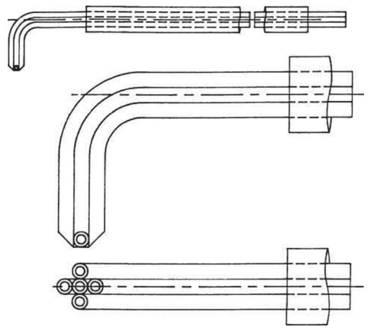

natural_image

Technical line drawings of three types of pipe fittings or connectors (no text or symbols present)

natural_image

Close-up of a dental tool tip with a curved metallic end (no text or symbols visible)

Figure 7.29. Five-hole Pitot.ˆ

Total pressure measurements are only effective if the onset flow is towards the Pitot probe. Caution has to be taken to ensure that the probe is not being used in a ˆ region of separated flow. The earlier comments about the measurement of pressure in water similarly apply to use of a five-hole probe. The pressure measurement is most responsive for larger diameter and small runs of pressure tube.

# 7.4.3 Photogrammetry

The recent advances in the frame rate and pixel resolution of digital cameras, both still and moving, offer new opportunities for capturing free-surface wave elevations.

Capture rates of greater than 5000 frames per second are now possible, with typical colour image sizes of 5–10 Mbit. Lewis et al. [7.14] used such a camera to capture the free-surface elevation as a free-falling two-dimensional wedge impacted still water. Glass microparticles were used to enhance the contrast of the free surface. Good quality images rely on application of suitable strength light sources. Again, recent improvements in light-emitting diodes (LEDs) allow much more intense light to be created without the usual problems with halogen bulbs of high power, and the need to dissipate heat which is difficult underwater.

Alternative application of the technology can be applied to capture the freesurface elevation of a wider area or along a hull surface. One of the difficulties is the transparency of water. Methods to overcome this problem include the methods used by competition divers where a light water mist is applied to the free surface to improve contrast for determining height, or a digital data projector is used to project a suitable pattern onto the water surface. Both of these allow image recognition software to infer surface elevation. Such methods are still the subject of considerable development.

# 7.4.4 Laser-Based Techniques

The first applications of the newly developed single frequency, coherent (laser) light sources to measurements in towing tanks took place in the early 1970s (see for example Halliwell [7.30] who used single component laser Doppler velocimetry in the Lamont towing tank at the University of Southampton). In the past decade there has been a rapid growth in their area of application and in the types of technique available. They can be broadly classed into two different types of system as follows.

# 7.4.4.1 Laser Doppler Velocimetry

In this technique the light beam from a single laser source is split. The two separate beams are focussed to intersect in a small volume in space. As small particles pass through this volume, they cause a Doppler shift in the interference pattern between the beams. Measurement of this frequency shift allows the instantaneous velocity of the particle to be inferred. If sufficient particles pass through the volume, the frequency content of the velocity component can be determined. The use of three separate frequency beams, all at difficult angles to the measurement volume, allows three components of velocity to be measured. If enough passages of a single particle can be captured simultaneously on all three detectors, then the correlated mean and all six Reynolds stress components can be determined. This requires a high density of seeded particles. A further enhancement for rotating propellers is to record the relative location of the propeller and to phase sort the data into groups of measurements made with the propeller at the same relative orientation over many revolutions. Such measurements, for instance, can give significant insight into the flow field interaction between a hull, propeller and rudder. Laser systems can also be applied on full-scale ships with suitable boroscope or measurement windows placed at appropriate locations on a ship hull, for instance, at or near the propeller plane. In this case, the system usually relies on there being sufficient existing particulates within the water.

The particles chosen have to be sufficiently small in size and mass that they can be assumed to be moving with the underlying flow. One of the main difficulties is in ensuring that sufficient particles are ‘seeded’ within the area of interest. A variety of particles are available and the technique can be used in air or water. Within water, a good response has been found with silver halide-based particles. These can, however, be expensive to seed at a high enough density throughout a large towing tank as well as imposing environmental constraints on the eventual disposal of water from the tank. In wind tunnel applications, smoke generators, as originally used in theatres, or vapourised vegetable oil particles can be applied.

Overall LDV measurement can provide considerable physical insight into the time-varying flow field at a point in space. Transverse spatial distributions can only be obtained by traversing the whole optical beam head/detector system so that it is focussed on another small volume. These measurement volumes are of the order of a cubic millimetre. Often, movement requires slight re-alignment of multiple beams which can often be time consuming. Guidance as to the uncertainty associated with such measurements in water based facilities, and general advice with regard to test processes, can be found in ITTC report 7.5-01-03-02 [7.31].

# 7.4.4.2 Particle Image Velocimetry

A technology being more rapidly adopted is that of particle image velocimetry (PIV) and its many variants. Raffel et al. [7.32] give a thorough overview of all the possible techniques and designations and Gui et al. [7.33] give a description of its application in a towing tank environment. The basic approach again relies on the presence of suitable seeded particles within the flow. A pulsed beam of laser light is passed through a lens that produces a sheet of light. A digital camera is placed whose axis of view is perpendicular to the plane of the sheet, Figure 7.30. The lens of the camera is chosen such that the focal plane lies at the sheet and that the capture area maps across the whole field of view of the camera. Two images are captured in short succession. Particles which are travelling across the laser sheet will produce a bright flash at two different locations. An area based statistical correlation technique is usually used to infer the likely transverse velocity components for each interrogation area. As a result, the derivation of statistically satisfactory results requires the results from many pairs of images to be averaged.

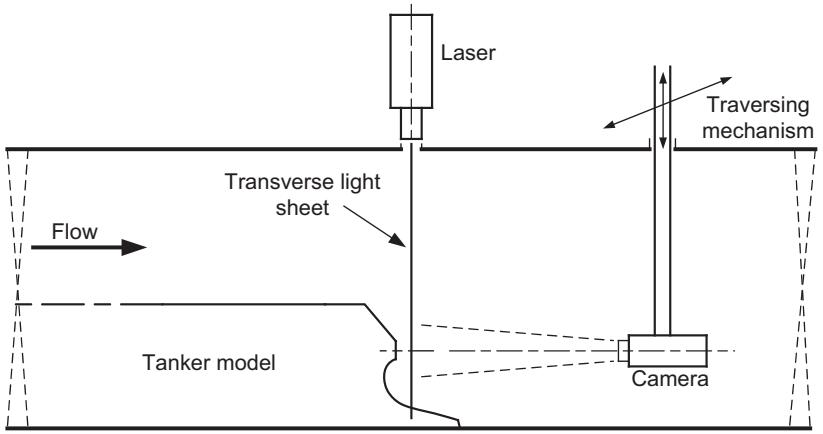

text_image

Laser
Transverse light
sheet
Flow
Traversing
mechanism
Tanker model
Camera

Figure 7.30. Schematic layout of PIV system in wind tunnel.

line

| y/d    | z/d     |
| ------ | ------- |
| -0.03  | -0.06   |
| -0.02  | -0.04   |
| -0.01  | -0.03   |
| 0      | -0.02   |
| 0.01   | -0.03   |
| 0.02   | -0.04   |

Figure 7.31. PIV measurements on the KVLCC hull.

The main advantage of this method is that the average velocity field can be found across an area of a flow. The resolution of these pairs of transverse velocity components is related to the field of view and the pixel size of the charge-coupled device (CCD) camera. Larger areas can be constructed using a mosaic of overlapping sub-areas. Again, the physical insight gained can be of great importance. For instance, the location of an off-body flow feature, such as a bilge vortex, can be readily identified and its strength assessed.

A restriction on earlier systems was the laser pulse recharge rate so that obtaining sufficient images of approximately 500 could require a long time of continuous operation of the experimental facility. The newer laser systems allow many more dynamic measurements to be made and, with the application of multiple cameras and intersecting laser sheets, all velocity components can be found at a limited number of locations.

Figure 7.30 shows the schematic layout of the application of a PIV system to the measurement of the flow field at the propeller plane of a wind tunnel model (1 m long) in the 0.9 m × 0.6 m open wind tunnel at the University of Southampton [7.34].

Figure 7.31 gives an example of PIV measurements on the KVLCC hull at a small yaw angle, clearly showing the presence of a bilge vortex on the port side [7.34], [7.35].

# 7.4.5 Summary

The ability of the experimenter to resolve the minutiae of the flow field around as well as on a hull model surface allows a much greater depth of understanding of the fluid dynamic mechanisms of resistance and propulsion. The drawback of such detail is the concomitant cost in terms of facility hire, model construction and experimenter expertise. Such quality of measurement is essential if the most is to be made of the CFD-based analysis tools described in Chapters 9 and 15. It is vital that the uncertainty associated with the test environment, equipment, measurements and subsequent analysis are known.

In summarising, it is worth noting that measurements of total viscous and wave pattern resistance yield only overall effects. These indicate how energy dissipation is modified by hull form variation, although they do not indicate the local origins of the effects. However, local surface measurements of pressure and frictional resistance allow an examination of the distribution of forces to be made and, hence, an indication of the effect due to specific hull and appendage modifications. Although pressure measurements are reasonably straightforward, friction measurements are extremely difficult and only a few tests on this component have been carried out.

Particular problems associated with the measurement of the individual components of resistance include the following:

(a) When measuring pressure resistance it is very important to measure model trim and to take this into account in estimating local static pressures.   
(b) Wave breaking regions can be easily overlooked in making wake traverse experiments.   
(c) Measurements of wave patterns can (incorrectly) be made in the local hull disturbance region and longitudinal cuts made for too short a spatial distance.

As a general comment it is suggested that wave resistance measurements should be made as a matter of course during the assessment of total resistance and in self-propulsion tests. This incurs little additional cost and yet provides considerable insight into any possible Froude number dependence of form factor and flow regimes where significant additional viscous or induced drag components exist.

# REFERENCES (CHAPTER 7)

7.1 ITTC International Towing Tank Conference. Register of Recommended Procedures. Accessed via www.sname.org. Last accessed January 2011.   
7.2 Coleman, H.W. and Steele, W.G. Experimentation and Uncertainty Analysis for Engineers. 2nd Edition. Wiley, New York, 1999.   
7.3 ISO (1995) Guide to the expression of uncertainty in measurement. International Organisation for Standardisation, Geneve, Switzerland. ISO ISBN 92- \` 67-10188-9, 1995.   
7.4 Lofdahl, L. and Gad-el-Hak, M., MEMS-based pressure and shear stress sensors for turbulent flows. Measurement Science Technology, Vol. 10, 1999, pp. 665–686.   
7.5 Fernholz, H.H., Janke, G., Schober, M., Wagner, P.M. and Warnack, D., New developments and applications of skin-friction measuring techniques. Measurement Science Technology, Vol. 7, 1996, pp. 1396–1409.   
7.6 Patel, V.C. Calibration of the Preston tube and limitations on its use in pressure gradients. Journal of Fluid Mechanics, Vol. 23, 1965, pp. 185–208.   
7.7 Steele, B.N. and Pearce, G.B. Experimental determination of the distribution of skin friction on a model of a high speed liner. Transactions of the Royal Institution of Naval Architects, Vol. 110, 1968, pp. 79–100.   
7.8 Shearer, J.R. and Steele, B.N. Some aspects of the resistance of full form ships. Transactions of the Royal Institution of Naval Architects, Vol. 112, 1970, pp. 465–486.

7.9 Ireland, P.T. and Jones, T.V. Liquid crystal measurements of heat transfer and surface shear stress. Measurement Science Technology, Vol. 11, 2000, pp. 969–986.   
7.10 Shearer, J.R. and Cross, J.J. The experimental determination of the components of ship resistance for a mathematical model. Transactions of the Royal Institution of Naval Architects, Vol. 107, 1965, pp. 459–473.   
7.11 Townsin, R.L. The frictional and pressure resistance of two ‘Lucy Ashton’ geosims. Transactions of the Royal Institution of Naval Architects, Vol. 109, 1967, pp. 249–281.   
7.12 Molland A.F. and Turnock, S.R. Wind tunnel investigation of the influence of propeller loading on ship rudder performance. University of Southampton, Ship Science Report No. 46, 1991.   
7.13 Molland A.F., Turnock, S.R. and Smithwick, J.E.T. Wind tunnel tests on the influence of propeller loading and the effect of a ship hull on skeg-rudder performance, University of Southampton, Ship Science Report No. 90, 1995.   
7.14 Lewis, S.G., Hudson, D.A., Turnock, S.R. and Taunton, D.J. Impact of a freefalling wedge with water: synchronised visualisation, pressure and acceleration measurements, Fluid Dynamics Research, Vol. 42, No. 3, 2010.   
7.15 van Dam, C.P. Recent experience with different methods of drag prediction. Progress in Aerospace Sciences, Vol. 35, 1999, pp. 751–798.   
7.16 Giles, M.B. and Cummings, R.M. Wake integration for three-dimensional flowfield computations: theoretical development, Journal of Aircraft, Vol. 36, No. 2, 1999, pp. 357–365.   
7.17 Townsin, R.L. Viscous drag from a wake survey. Measurements in the wake of a ‘Lucy Ashton’ model. Transactions of the Royal Institution of Naval Architects, Vol. 110, 1968, pp. 301–326.   
7.18 Townsin, R.L. The viscous drag of a ‘Victory’ model. Results from wake and wave pattern measurements. Transactions of the Royal Institution of Naval Architects, Vol. 113, 1971, pp. 307–321.   
7.19 Insel, M. and Molland, A.F. An investigation into the resistance components of high speed displacement catamarans. Transactions of the Royal Institution of Naval Architects, Vol. 134, 1992, pp. 1–20.   
7.20 Newman, J. Marine Hydrodynamics. MIT Press, Cambridge, MA, 1977.   
7.21 Gadd, G.E. and Hogben, N. The determination of wave resistance from measurements of the wave profile. NPL Ship Division Report No. 70, November 1965.   
7.22 Hogben, N. and Standing, B.A. Wave pattern resistance from routine model tests. Transactions of the Royal Institution of Naval Architects, Vol. 117, 1975, pp. 279–299.   
7.23 Hogben, N. Automated recording and analysis of wave patterns behind towed models. Transactions of the Royal Institution of Naval Architects, Vol. 114, 1972, pp. 127–153.   
7.24 Insel, M. An investigation into the resistance components of high speed displacement catamarans. Ph.D. thesis, University of Southampton, 1990.   
7.25 Couser, P. An investigation into the performance of high-speed catamarans in calm water and waves. Ph.D. thesis, University of Southampton, 1996.   
7.26 Taunton, D.J. Methods for assessing the seakeeping performance of high speed displacement monohulls and catamarans. Ph.D. thesis, University of Southampton, 2001.   
7.27 Kim, W.J., Van, S.H., Kim, D.H., Measurement of flows around modern commercial ship models, Experiments in Fluids, Vol. 31, 2001, pp. 567–578.   
7.28 Bruun, H.H. Hot-Wire Anemometry: Principles and Signal Processing. Oxford University Press, Oxford, UK, 1995.   
7.29 Turnock, S.R., Hughes, A.W., Moss, R. and Molland, A.F. Investigation of hull-waterjet flow interaction. Proceedings of Fourth International Conference

on Fast Sea Transportation, FAST’97, Sydney, Australia. Vol. 1, Baird Publications, South Yarra, Australia, July 1997, pp. 51–58.   
7.30 Halliwell, N.A. A laser anemometer for use in ship research. University of Southampton, Ship Science Report No. 1, 1975.   
7.31 International Towing Tank Conference. Uncertainty analysis: laser Doppler velocimetry calibration. Document 7.5-01-03-02, 2008, 14 pp.   
7.32 Raffel, M., Willert, C., Werely, S. and Kompenhans, J. Particle Image Velocimetry: A Practicle Guide. 2nd Edition. Springer, New York, 2007.   
7.33 Gui, L., Longo, J. and Stern, F, Towing tank PIV measurement system, data and uncertainty assessment for DTMB Model 5512. Experiments in Fluids, Vol. 31, 2001, pp. 336–346.   
7.34 Pattenden, R.J.,Turnock, S.R., Bissuel, M. and Pashias, C. Experiments and numerical modelling of the flow around the KVLCC2 hullform at an angle of yaw. Proceedings of 5th Osaka Colloquium on Advanced Research on Ship Viscous Flow and Hull Form Design, 2005, pp. 163–170.   
7.35 Bissuel, M. Experimental investigation of the flow around a KVLCC2 hull for CFD validation. M.Sc. thesis, University of Southampton, 2004.

# 8 Wake and Thrust Deduction

# 8.1 Introduction

An interaction occurs between the hull and the propulsion device which affects the propulsive efficiency and influences the design of the propulsion device. The components of this interaction are wake, thrust deduction and relative rotative efficiency.

Direct detailed measurements of wake velocity at the position of the propeller plane can be carried out in the absence of the propeller. These provide a detailed knowledge of the wake field for detailed aspects of propeller design such as radial pitch variation to suit a particular wake, termed wake adaption, or prediction of the variation in load for propeller strength and/or vibration purposes.

Average wake values can be obtained indirectly by means of model open water and self-propulsion tests. In this case, an integrated average value over the propeller disc is obtained, known as the effective wake. It is normally this average effective wake, derived from self-propulsion tests or data from earlier tests, which is used for basic propeller design purposes.

# 8.1.1 Wake Fraction

A propeller is situated close to the hull in such a position that the flow into the propeller is affected by the presence of the hull. Thus, the average speed of flow into the propeller (Va) is different from (usually less than) the speed of advance of the hull (Vs), Figure 8.1. It is usual to refer this change in speed to the ship speed, termed the Taylor wake fraction wT, where wT is defined as

$$
w _ {T} = \frac {(V s - V a)}{V s} \tag {8.1}
$$

and

$$
V a = V s (1 - w _ {T}). \tag {8.2}
$$

text_image

Vs
Va

Figure 8.1. Wake speed Va.

# 8.1.2 Thrust Deduction

The propulsion device (e.g. propeller) accelerates the flow ahead of itself, thereby (a) increasing the rate of shear in the boundary layer and, hence, increasing the frictional resistance of the hull and (b) reducing pressure (Bernouli) over the rear of the hull, and hence, increasing the pressure resistance. In addition, if separation occurs in the afterbody of the hull when towed without a propeller, the action of the propeller may suppress the separation by reducing the unfavourable pressure gradient over the afterbody. Hence, the action of the propeller is to alter the resistance of the hull (usually to increase it) by an amount that is approximately proportional to thrust. This means that the thrust will exceed the naked resistance of the hull. Physically, this is best understood as a resistance augment. In practice, it is taken as a thrust deduction, where the thrust deduction factor t is defined as

$$
t = \frac {(T - R)}{T} \tag {8.3}
$$

and

$$
T = \frac {R}{(1 - t)}. \tag {8.4}
$$

# 8.1.3 Relative Rotative Efficiency ηR

The efficiency of a propeller in the wake behind the ship is not the same as the efficiency of the same propeller under the conditions of the open water test. There are two reasons for this. (a) The level of turbulence in the flow is low in an open water test in a towing tank, whereas it is very high in the wake behind a hull and (b) the flow behind a hull is non-uniform so that flow conditions at each radius are different from the open water test.

The higher turbulence levels tend to reduce propeller efficiency, whilst a propeller deliberately designed for a radial variation in wake can gain considerably when operating in the wake field for which it was designed.

The derivation of relative rotative efficiency in the self-propulsion test is described in Section 8.7 and empirical values are given with the propeller design data in Chapter 16.

# 8.2 Origins of Wake

The wake originates from three sources: potential flow effects, the effects of friction on the flow around the hull and the influence of wave subsurface velocities.

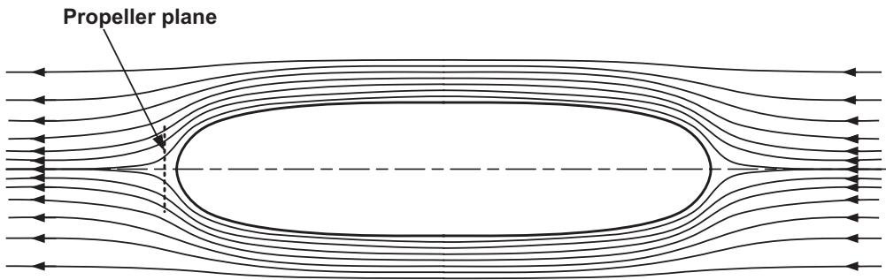

text_image

Propeller plane

Figure 8.2. Potential wake.

# 8.2.1 Potential Wake: wP

This arises in a frictionless or near-frictionless fluid. As the streamlines close in aft there is a rise in pressure and decrease in velocity in the position of the propeller plane, Figure 8.2.

# 8.2.2 Frictional Wake: wF

This arises due to the hull surface skin friction effects and the slow-moving layer of fluid (boundary layer) that develops on the hull and increases in thickness as it moves aft. Frictional wake is usually the largest component of total wake. The frictional wake augments the potential wake. Harvald [8.1] discusses the estimation of potential and frictional wake.

# 8.2.3 Wave Wake: wW

This arises due to the influence of the subsurface orbital motions of the waves, see Appendix A1.8. In single-screw vessels, this component is likely to be small. It can be significant in twin-screw vessels where the propeller may be effectively closer to the free surface. The direction of the wave component will depend on whether the propeller is located under a wave crest or a wave trough, which in turn will change with speed, see Section 3.1.5 and Appendix A1.8.

# 8.2.4 Summary

Typical values for the three components of wake fraction, from [8.1], are

Potential wake: 0.08–0.12

Frictional wake: 0.09–0.23

Wave wake: 0.03–0.05

With total wake fraction being 0.20–0.40.

A more detailed account of the components of wake is given in Harvald [8.2].

# 8.3 Nominal and Effective Wake

The nominal wake is that measured in the vicinity of the propeller plane, but without the propeller present.

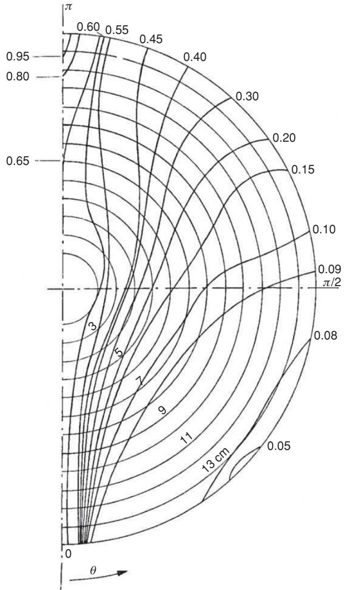

radar

| Angle (°) | Value |
| --------- | ----- |
| 0         | 0.95  |
| 3         | 0.80  |
| 6         | 0.65  |
| 9         | 0.55  |
| 11        | 0.45  |
| 13        | 0.30  |
| 15        | 0.20  |
| 17        | 0.15  |
| 19        | 0.10  |
| 21        | 0.09  |
| 23        | 0.08  |
| 25        | 0.05  |
| π/2       | π/2   |

Figure 8.3. Wake distribution: single-screw vessel.

The effective wake is that measured in the propeller plane, with the propeller present, in the course of the self-propulsion experiment (see Section 8.7).

Because the propeller influences the boundary layer properties and possible separation effects, the nominal wake will normally be larger than the effective wake.

# 8.4 Wake Distribution

# 8.4.1 General Distribution

Due to the hull shape at the aft end and boundary layer development effects, the wake distribution is non-uniform in the general vicinity of the propeller. An example of the wake distribution (contours of constant wake fraction $w _ { T } )$ for a single-screw vessel is shown in Figure 8.3 [8.3].

  
Figure 8.4. Influence of afterbody shape on wake distribution.

Different hull aft end shapes lead to different wake distributions and this is illustrated in Figure 8.4 [8.4]. It can be seen that as the stern becomes more ‘bulbous’, moving from left to right across the diagram, the contours of constant wake become more ‘circular’ and concentric. This approach may be adopted to provide each radial element of the propeller blade with a relatively uniform circumferential inflow velocity, reducing the levels of blade load fluctuations. These matters, including the influences of such hull shape changes on both propulsion and hull resistance, are discussed in Chapter 14.

A typical wake distribution for a twin-screw vessel is shown in Figure 8.5 [8.5], showing the effects of the boundary layer and local changes around the shafting and bossings. The average wake fraction for twin-screw vessels is normally less than for single-screw vessels.

# 8.4.2 Circumferential Distribution of Wake

The circumferential wake fraction, $w _ { T } ^ { \prime \prime }$ , for a single-screw vessel, at a particular propeller blade radius is shown schematically in Figure 8.6.

It is seen that there are high wake values at top dead centre (TDC) and bottom dead centre (BDC) as the propeller blade passes through the slow-moving water near the centreline of the ship. The value is lower at about $9 0 ^ { \circ }$ where the propeller blade passes closer to the edge of the boundary layer, and this effect is more apparent towards the blade tip.

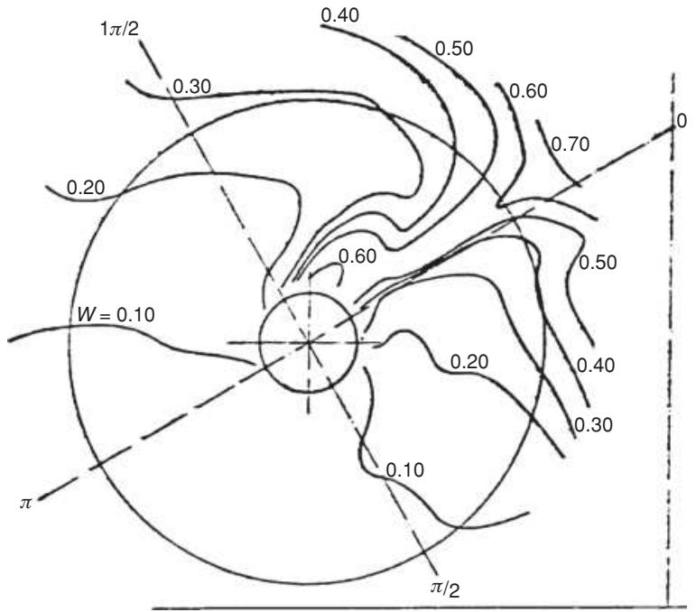

contour

| Contour Value | Axis Label |
| ------------- | ---------- |
| 0.40          | 1π/2       |
| 0.50          | 0.30       |
| 0.60          | 0.20       |
| 0.70          | 0        |
| 0.60          | W = 0.10   |
| 0.50          | 0.50       |
| 0.40          | 0.30       |
| 0.30          | π/2        |
| 0.20          | π          |
| 0.10          | π/2        |

Figure 8.5. Wake distribution: twin-screw vessel.

# 8.4.3 Radial Distribution of Wake

Typical mean values of wake fraction $w _ { T } ^ { \prime }$ for a single-screw vessel, when plotted radially, are shown in Figure 8.7. Twin-screw vessels tend to have less variation and lower average wake values. Integration of the average value at each radius yields the overall average wake fraction, $w _ { T }$ , in way of the propeller disc.

# 8.4.4 Analysis of Detailed Wake Measurements

Detailed measurements of wake are described in Section 8.5. These detailed measurements can be used to obtain the circumferential and radial wake distributions, using a volumetric approach, as follows:

Assume the local wake fraction, Figures 8.3 and 8.6, derived from the detailed measurements, to be denoted $w _ { T } ^ { \prime \prime } .$ , the radial wake fraction, Figure 8.7, to be denoted $w _ { T } ^ { \prime }$ and the overall average or nominal mean wake to be $w _ { T } .$ . The volumetric mean wake fraction $w _ { T } ^ { \prime }$ at radius r is

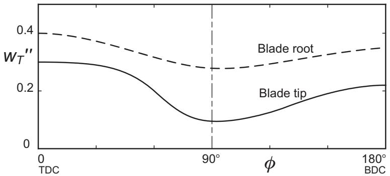

line

| φ     | Blade tip | Blade root |
|-------|-----------|------------|
| 0     | 0.3       | 0.4        |
| 90°   | 0.05      | 0.25       |
| 180°  | 0.2       | 0.35       |

Figure 8.6. Circumferential distribution of wake fraction.

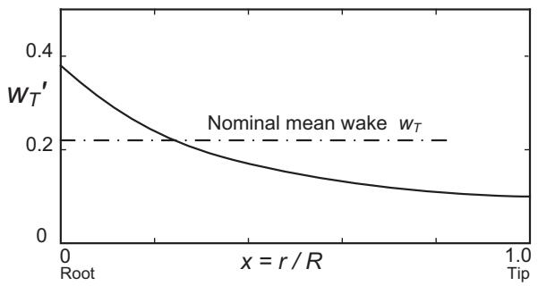

line

| x = r / R | w_T' |
| --------- | ---- |
| 0         | 0.4  |
| 1.0       | 0.1  |

Figure 8.7. Radial distribution of wake fraction.

$$
w _ {T} ^ {\prime} = \frac {\int_ {0} ^ {2 \pi} w _ {T} ^ {\prime \prime} \cdot r \cdot d \theta}{\int_ {0} ^ {2 \pi} r \cdot d \theta} \tag {8.5}
$$

or

$$
w _ {T} ^ {\prime} = \frac {1}{2 \pi} \int_ {0} ^ {2 \pi} w _ {T} ^ {\prime \prime} \cdot d \theta , \tag {8.6}
$$

where $w _ { T } ^ { \prime }$ is the circumferential mean at each radius, giving the radial wake distribution, Figure 8.7.

The radial wake can be integrated to obtain the nominal mean wake $w _ { T } ,$ , as follows:

$$
w _ {T} = \frac {\int_ {r _ {B}} ^ {R} w _ {T} ^ {\prime} \cdot 2 \pi r \cdot d r}{\int_ {r _ {B}} ^ {R} 2 \pi r \cdot d r} = \frac {\int_ {r _ {B}} ^ {R} w _ {T} ^ {\prime} \cdot r \cdot d r}{\frac {1}{2} (R ^ {2} - r _ {B} ^ {2})}, \tag {8.7}
$$

where R is the propeller radius and $r _ { B }$ is the boss radius.

If a radial distribution of screw loading is adopted, and if the effective mean wake $w _ { T e }$ is known, for example from a self-propulsion test, then a suitable variation in radial wake would be

$$
(1 - w _ {T} ^ {\prime}) \times \frac {(1 - w _ {T e})}{(1 - w _ {T})}. \tag {8.8}
$$

Such a radial distribution of wake would be used in the calculations for a wakeadapted propeller, as described in Section 15.6.

# 8.5 Detailed Physical Measurements of Wake

# 8.5.1 Circumferential Average Wake

The two techniques that have been used to measure circumferential average wake $\left( w _ { T } ^ { \prime } \right)$ in Figure 8.7) are as follows:

(a) Blade wheels: The model is towed with a series of light blade wheels freely rotating behind the model. Four to five small blades (typically 1-cm square) are set at an angle to the spokes, with the wheel diameter depending on the model size. The rate of rotation of the blade wheel is measured and compared with an open water calibration, allowing the estimation of the mean wake over a range of diameters.

(b) Ring meters: The model is towed with various sizes of ring (resembling the duct of a ducted propeller) mounted at the position of the propeller disc and the drag of the ring is measured. By comparison with an open water drag calibration of drag against speed, a mean wake can be determined. It is generally considered that the ring meter wake value (compared with the blade wheel) is nearer to that integrated by the propeller.

# 8.5.2 Detailed Measurements

Detailed measurements of wake may be carried out in the vicinity of the propeller plane. The techniques used are the same as, or similar to, those used to measure the flow field around the hull, Chapter 7, Section 7.4.

(a) Pitot static tubes: These may be used to scan a grid of points at the propeller ˆ plane. An alternative is to use a rake of Pitot tubes mounted on the propeller ˆ shaft which can be rotated through 360◦. The measurements provide results such as those shown in Figures 8.3 to 8.6.   
(b) Five-holed Pitot: This may be used over a grid in the propeller plane to provide ˆ measurements of flow direction as well as velocity. Such devices will determine the tangential flow across the propeller plane. A five-holed Pitot is described in ˆ Chapter 7.   
(c) LDV: Laser Doppler velocimetry (or LDA, laser Doppler anemometry) may be used to determine the local velocity at a point in the propeller plane. Application of LDV is discussed further in Chapter 7.   
(d) PIV: Particle image velocimetry can be used to determine the distribution of velocity over a plane, providing a more detailed image of the overall flow. This is discussed further in Chapter 7.

Experimental methods of determining the wake field are fully reviewed in ITTC2008 [8.6]. Examples of typical experimental investigations into wake distribution include [8.7] and [8.8].

# 8.6 Computational Fluid Dynamics Predictions of Wake

The techniques used are similar to those used to predict the flow around the hull, Chapter 9. Cuts can be made in the propeller plane to provide a prediction of the detailed distribution of wake. Typical numerical investigations into model and fullscale wake include [8.9] and [8.10].

# 8.7 Model Self-propulsion Experiments

# 8.7.1 Introduction

The components of propulsive efficiency (wake, thrust deduction and relative rotative efficiency) can be determined from a set of propulsion experiments with models. A partial analysis can also be made from an analysis of ship trial performance, provided the trial takes place in good weather on a deep course and the ship is adequately instrumented.

A complete set of performance experiments would comprise the following:

(i) A set of model resistance experiments: to determine $C _ { T M }$ as a function of Fr, from which ship $C _ { T S }$ can be found by applying appropriate scaling methods, see Chapter 4.   
(ii) A propeller open water test: to determine the performance of the model propeller. This may possibly be backed by tests in a cavitation tunnel, see Chapter 12.   
(iii) A self-propulsion test with the model, or a trial result corrected for tide, wind, weather, shallow water etc.

The ITTC recommended procedure for the standard propulsion test is described in ITTC2002 [8.11]

# 8.7.2 Resistance Tests

The model total resistance is measured at various speeds, as described in Section 3.1.4.

# 8.7.3 Propeller Open Water Tests

Open water tests may be made either in a towing tank under cavitation conditions appropriate to the model, or in a cavitation tunnel at cavitation conditions appropriate to the ship. These are described in Chapter 12. Thrust and torque are measured at various J values, usually at constant speed of advance, unless bollard conditions $( J = 0 )$ are required, such as for a tug.

# 8.7.4 Model Self-propulsion Tests

The model is towed at various speeds and at each speed a number of tests are made at differing propeller revolutions, spanning the self-propulsion condition for the ship.

For each test, propeller revolutions, thrust and torque are measured, together with resistance dynamometer balance load and model speed. The measurements made, as described in [8.11], are summarised in Figure 8.8.

# 8.7.4.1 Analysis of Self-propulsion Tests

In theory, the case is required when thrust  resistance, R  T or R  T  0.

In practice, it is difficult to obtain this condition in one run. Common practice is to carry out a series of runs at constant speed with different revolutions, hence, different values of $R - T$ passing through zero. In the case of the model, the model self-propulsion point is as shown in Figure 8.9.

# 8.7.4.2 Analysis for Ship

If the total resistance obeyed Froude’s law, then the ship self-propulsion point would be the same as that for the model. However, $C _ { T M } > C _ { T S }$ , Figure 8.10, where $C _ { T S }$ is the ship prediction (which may include allowances for $C _ { V }$ scaling of hull, appendages, hull roughness and fouling, temperature and blockage correction to tank resistance, shallow water effects and weather allowance full scale). This difference $( C _ { T M } -$ $C _ { T S } )$ has to be offset on the resistance dynamometer balance load, or on the diagram, Figure 8.9, in order to determine the ship self-propulsion point. If $R _ { T m }$ is the model resistance corresponding to $C _ { T M }$ and $R _ { T m s }$ is the model resistance corresponding to $C _ { T S } .$ , then the ship self-propulsion point is at $( R - T ) = ( R _ { T m } - R _ { T m s } )$ . This then allows the revolutions $n ,$ behind thrust $T _ { b }$ and behind torque $Q _ { b }$ to be obtained for the ship self-propulsion point.

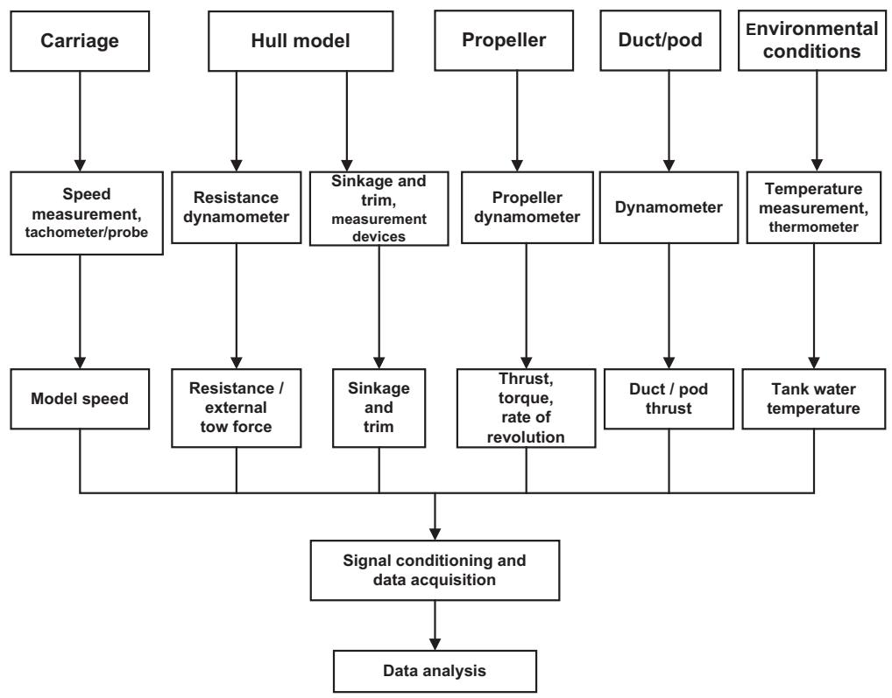

flowchart

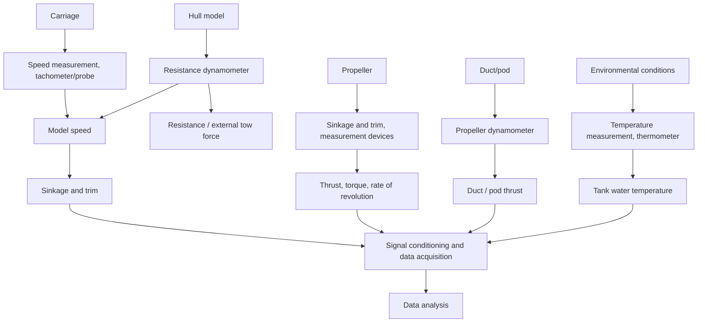
```mermaid
graph TD
    A["Carriage"] --> B["Speed measurement, tachometer/probe"]
    C["Hull model"] --> D["Resistance dynamometer"]
    D --> E["Model speed"]
    F["Propeller"] --> G["Sinkage and trim, measurement devices"]
    H["Duct/pod"] --> I["Propeller dynamometer"]
    J["Environmental conditions"] --> K["Temperature measurement, thermometer"]
    B --> E
    D --> L["Resistance / external tow force"]
    E --> M["Sinkage and trim"]
    G --> N["Thrust, torque, rate of revolution"]
    I --> O["Duct / pod thrust"]
    K --> P["Tank water temperature"]
    M --> Q["Signal conditioning and data acquisition"]
    N --> Q
    O --> Q
    P --> Q
    Q --> R["Data analysis"]
```

Figure 8.8. Propulsion test measurements.

text_image

Q
T
R - T
R - T
(R_Tm - R_Tms)
Q_b
T_b
Ship self-propulsion point
Model self-propulsion point
0
n

Figure 8.9. Model and ship self-propulsion points.

text_image

C_T
(C_{Tm} - C_{Ts})
C_{Tm}
C_{Ts}
Fr

Figure 8.10. Model and ship $C _ { T }$ values.

In order to determine the wake fraction and thrust deduction factor an equivalent propeller open water condition must be assumed. The equivalent condition is usually taken to be that at which the screw produces either

(i) the same thrust as at the self-propulsion test revolutions per minute (rpm), known as thrust identity or   
(ii) the same torque as at the self-propulsion test rpm, known as torque identity.

The difference between the analysed wake and thrust deduction values from these two analyses is usually quite small. The difference depends on the relative rotative efficiency $\eta _ { R }$ and disappears for $\eta _ { R } = 1 . 0$ .

# 8.7.4.3 Procedure: Thrust Identity

(a) From the resistance curves, Figure 8.10, $\left( C _ { T m } - C _ { T s } \right)$ can be calculated to allow for differences between the model- and ship-predicted $C _ { T }$ values. (Various loadings can be investigated to allow for the effects of fouling and weather etc.)   
(b) n and $\begin{array} { r } { J _ { b } \left( = \frac { V s } { n . D } \right) } \end{array}$ can be determined for the self-propulsion point and $T _ { b }$ and $Q _ { b }$ ; hence, $K _ { T b }$ and $K _ { Q b }$ can be obtained from the self-propulsion data, Figure 8.9.   
(c) Thrust identity analysis assumes $K _ { T o } = K _ { T b }$ . The open water curve, Figure 8.11(a), is entered with $K _ { T b }$ to determine the corresponding $J _ { o } , K _ { Q o }$ and $\eta _ { o }$ .

The suffix $\cdot _ { b } ,$ indicates values behind the model and suffix $\cdot _ { o } ,$ values in the open water test.

(a)   

line

| Point | Value |
|-------|-------|
| η     | 10K_Q |
| η     | K_Q0  |
| η     | K_Q   |
| η     | K_T   |
| η     | K_Tb  |
| J     |       |
| J_0   |       |

(b)   
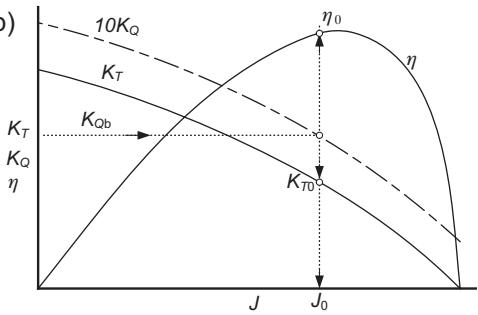

line

| Point | Label | Value |
|-------|-------|-------|
| 10K_Q |       | 10K_Q |
| K_T   |       | K_T   |
| K_Qb  |       | K_Qb  |
| K_T0  |       | K_T0  |
| η     | η     | η     |
| J     | J     | J     |
| J_0   | J_0   | J_0   |

Figure 8.11. Open water curve, (a) showing thrust identity, (b) showing torque identity.

The wake fraction is given by the following:

$$
w _ {T} = \frac {(V _ {S} - V _ {O})}{V _ {S}} = 1 - \frac {V _ {O}}{V _ {S}} = 1 - \frac {n D J _ {o}}{n D J _ {b}} = 1 - \frac {J _ {o}}{J _ {b}}, \tag {8.9}
$$

where $\begin{array} { r } { J _ { b } ~ = ~ \frac { V _ { s } } { n D } } \end{array}$ and $V _ { S }$ is ship speed.

The thrust deduction is given by the following:

$$
t = \frac {(T _ {b} - R)}{T _ {b}} = 1 - \frac {R}{T _ {b}} = 1 - \frac {0 . 5 \rho S V ^ {2} C _ {T S}}{\rho n ^ {2} D ^ {4} K _ {T b}} = 1 - \frac {0 . 5 J _ {b} ^ {2} S C _ {T S}}{D ^ {2} K _ {T b}}. \tag {8.10}
$$

The relative rotative efficiency is given by the following:

$$
\eta_ {R} = \frac {\eta_ {b}}{\eta_ {o}} = \frac {J _ {o} K _ {T b}}{2 \pi K _ {Q b}}. \frac {2 \pi K _ {Q o}}{J _ {o} K _ {T o}} = \frac {K _ {T b}}{K _ {T o}}. \frac {K _ {Q o}}{K _ {Q b}}. \tag {8.11}
$$

For thrust identity,

$$
K _ {T o} = K _ {T b} \quad \text { and } \quad \eta_ {R} = \frac {K _ {Q o}}{K _ {Q b}}. \tag {8.12}
$$

For torque identity, $J _ { o } = J$ for which $K _ { Q o } = K _ { Q b }$ and $\eta _ { R } = K _ { T b } / K _ { T o }$ . Most commercial test tanks employ the thrust identity method.

Finally, all the components of the quasi-propulsive coefficient (QPC) $\eta _ { D }$ are now known and $\eta _ { D }$ can be assembled as

$$
\eta_ {D} = \eta_ {o} \eta_ {H} \eta_ {R} = \eta_ {o} \frac {(1 - t)}{(1 - w _ {T})} \eta_ {R}. \tag {8.13}
$$

# 8.7.5 Trials Analysis

Ship trials and trials analysis are discussed in Chapter 5. Usually only torque, revolutions and speed are available on trials so that ship analysis wake fraction $w _ { T }$ values are obtained on a torque identity basis. Thrust deduction t can only be estimated on the basis of scaled model information (e.g. [8.12]), and $\eta _ { R }$ can only be obtained using estimated thrust from effective power $( P _ { E } )$ , see worked example application 3, Chapter 17.

# 8.7.6 Wake Scale Effects

The model boundary layer when scaled (see Figure 3.21) is thicker than the ship boundary layer. Hence, the wake fraction $w _ { T }$ tends to be smaller for the ship, although extra ship roughness compensates to a certain extent. Equation (5.22) was adopted by the ITTC in its 1978 Performance Prediction Method to allow for wake scale effect. Detailed full-scale measurements of wake are relatively sparse. Work, such as by Lubke [8.13], is helping to shed some light on scale effects, as are the ¨ increasing abilities of CFD analyses to predict aft end flows at higher Reynolds numbers [8.9, 8.10]. Lubke describes an investigation into the estimation of wake ¨ at model and full scale. At model scale the agreement between computational fluid dynamics (CFD) and experiment was good. The comparisons of CFD with experiment at full scale indicated that further validation was required.

# 8.8 Empirical Data for Wake Fraction and Thrust Deduction Factor

# 8.8.1 Introduction

Empirical data for wake fraction $w _ { T }$ and thrust deduction factor t suitable for preliminary design purposes are summarised. It should be noted that the following data are mainly for models. The data are generally nominal values and are not strictly correct due to scale effects and dependence on detail not included in the formulae.

Empirical data for $\eta _ { R } ,$ , the third component of hull–propeller interaction, are included in Chapter 16.

# 8.8.2 Single Screw

# 8.8.2.1 Wake Fraction ${ \pmb w } _ { T }$

Wake fraction data attributable to Harvald for single-screw vessels, reproduced in [8.3], are shown in Figure 8.12. This illustrates the dependence of $w _ { T }$ on $C _ { B } , L / B$ , hull shape and propeller diameter.

A satisfactory fit to the Harvald single-screw data is the following:

$$
w _ {T} = \left[ 1. 0 9 5 - 3. 4 C _ {B} + 3. 3 C _ {B} ^ {2} \right] + \left[ \frac {0 . 5 C _ {B} ^ {2} (6 . 5 - L / B)}{L / B} \right], \tag {8.14}
$$

suitable for $C _ { B }$ range 0.525–0.75 and $L / B$ range 5.0–8.0.

An earlier formula, attributable to Taylor [8.14], is the following:

$$
w _ {T} = 0. 5 0 C _ {B} - 0. 0 5, \tag {8.15}
$$

noting that Equation (8.15) tends to give low values of $w _ { T }$ at high $C _ { B }$

The British Ship Research Association (BSRA) wake data regression [8.15, 8.16] gives the following:

$$
w _ {T} = - 0. 0 4 5 8 + 0. 3 7 4 5 C _ {B} ^ {2} + 0. 1 5 9 0 D _ {W} - 0. 8 6 3 5 F r + 1. 4 7 7 3 F r ^ {2}, \tag {8.16}
$$

where $D _ { W }$ is the wake fraction parameter defined as

$$
D _ {W} = \frac {B}{\nabla^ {1 / 3}}. \sqrt {\frac {\nabla^ {1 / 3}}{D}},
$$

suitable for $C _ { B }$ range 0.55–0.85 and Fr range 0.12–0.36.

Holtrop wake data regression [8.17] gives the following:

$$
\begin{array}{l} w _ {T} = c _ {9} c _ {2 0} C _ {V} \frac {L}{T _ {A}} \left(0. 0 5 0 7 7 6 + 0. 9 3 4 0 5 c _ {1 1} \frac {C _ {V}}{\left(1 - C _ {P 1}\right)}\right) \\ + 0. 2 7 9 1 5 c _ {2 0} \sqrt {\frac {B}{L (1 - C _ {P 1})}} + c _ {1 9} c _ {2 0}. \tag {8.17} \\ \end{array}
$$

The coefficient $c _ { 9 }$ depends on the coefficient $^ { c _ { 8 } , }$ defined as:

$$
\begin{array}{l} c _ {8} = B S / (L D T _ {A}) \text {   when   } B / T _ {A} \leq 5 \\ = \mathrm{S} (7 B / T _ {A} - 2 5) / (L D (B / T _ {A} - 3)) \text {when} B / T _ {A} > 5 \\ c _ {9} = c _ {8} \text {   when   } c _ {8} \leq 2 8 \\ = 3 2 - 1 6 / \left(c _ {8} - 2 4\right) \text {   when   } c _ {8} > 2 8 \\ \end{array}
$$

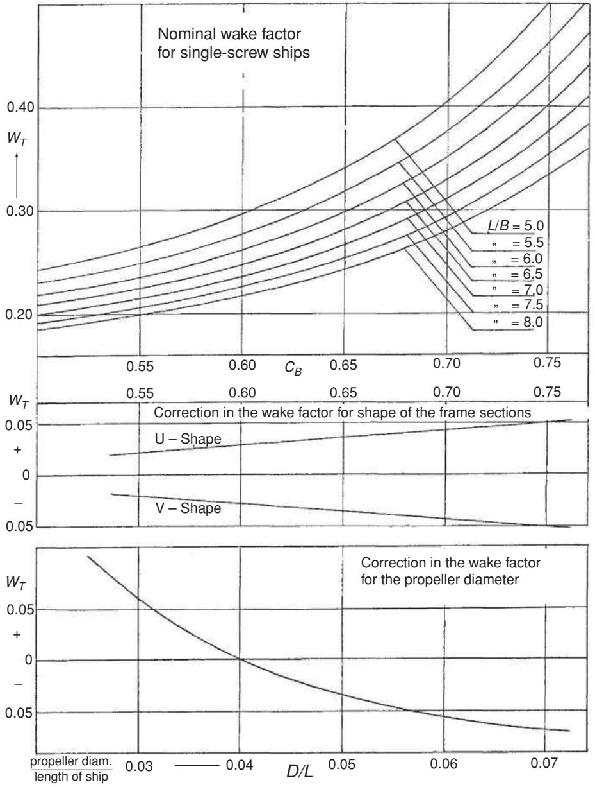

line

| L/B   | nominal wake factor for single-screw ships | Correction in the wake factor for shape of the frame sections | Correction in the wake factor for the propeller diameter |
|-------|---------------------------------------------|---------------------------------------------------------------|--------------------------------------------------------------|
| 5.0   | 0.20                                        | +                                                             | -                                                            |
| 5.5   | 0.22                                        | +                                                             | -                                                            |
| 6.0   | 0.24                                        | +                                                             | -                                                            |
| 6.5   | 0.26                                        | +                                                             | -                                                            |
| 7.0   | 0.28                                        | +                                                             | -                                                            |
| 7.5   | 0.30                                        | +                                                             | -                                                            |
| 8.0   | 0.32                                        | +                                                             | -                                                            |

Figure 8.12. Wake fraction data for single-screw vessels.

$$
c _ {1 1} = T _ {A} / D \text {   when   } T _ {A} / D \leq 2
$$

$$
= 0. 0 8 3 3 3 3 3 (T _ {A} / D) ^ {3} + 1. 3 3 3 3 3 \text {   when   } T _ {A} / D > 2
$$

$$
c _ {1 9} = 0. 1 2 9 9 7 / \left(0. 9 5 - C _ {B}\right) - 0. 1 1 0 5 6 / \left(0. 9 5 - C _ {P}\right) \text {   when   } C _ {P} \leq 0. 7
$$

$$
= 0. 1 8 5 6 7 / \left(1. 3 5 7 1 - C _ {M}\right) - 0. 7 1 2 7 6 + 0. 3 8 6 4 8 C _ {P} \text {   when   } C _ {P} > 0. 7
$$

$$
c _ {2 0} = 1 + 0. 0 1 5 C _ {\text { stern }}
$$

$C _ { P 1 } = 1 . 4 5 C _ { P } - 0 . 3 1 5 - 0 . 0 2 2 5 L C B$ (where LCB is LCB forward of 0.5L as a percentage of L)

$C _ { V }$ is the viscous resistance coefficient with $C _ { V } = ( 1 + { \bf k } ) C _ { F } + C _ { A }$ and $C _ { A }$ is the correlation allowance coefficient, discussed in Chapters 5 and 10, Equation (10.34). S is wetted area, D is propeller diameter and $T _ { A }$ is draught aft.

Table 8.1. $C _ { s t e r n }$ parameter 

<table><tr><td>Afterbody form</td><td> $C_{\text{stern}}$ </td></tr><tr><td>Pram with gondola</td><td>-25</td></tr><tr><td>V-shaped sections</td><td>-10</td></tr><tr><td>Normal section shape</td><td>0</td></tr><tr><td>U-shaped sections with Hogner stern</td><td>10</td></tr></table>

# 8.8.2.2 Thrust Deduction (t)

For single-screw vessels a good first approximation is the following:

$$
t = k _ {R} \cdot w _ {T}, \tag {8.18}
$$

where $k _ { R }$ varies between 0.5 for thin rudders and 0.7 for thick rudders [8.3].

BSRA thrust deduction regression [8.16] gives Equation (8.19a) which is the preferred expression and Equation (8.19b) which is an alternative if the pitch ratio $\left( P / D \right)$ is not available.

$$
\begin{array}{l} t = - 0. 2 0 6 4 + 0. 3 2 4 6 C _ {B} ^ {2} - 2. 1 5 0 4 C _ {B} (L C B / L _ {B P}) \\ + 0. 1 7 0 5 (B / \nabla^ {1 / 3}) + 0. 1 5 0 4 (P / D). \tag {8.19a} \\ \end{array}
$$

$$
\begin{array}{l} t = - 0. 5 3 5 2 - 1. 6 8 3 7 C _ {B} + 1. 4 9 3 5 C _ {B} ^ {2} \\ - 1. 6 6 2 5 (L C B / L _ {B P}) + 0. 6 6 8 8 D _ {t}, \tag {8.19b} \\ \end{array}
$$

where $D _ { t }$ is the thrust deduction ameter defined as $\frac { B } { \nabla ^ { 1 / 3 } } . \frac { D } { \nabla ^ { 1 / 3 } }$ the breadth (m) $\mathbf { m } ^ { 3 }$ $C _ { B }$ and $P / D$ range 0.60–1.10.

Holtrop thrust deduction regression [8.17] gives the following:

$$
\begin{array}{l} t = 0. 2 5 0 1 4 (B / L) ^ {0. 2 8 9 5 6} (\sqrt {B T / D}) ^ {0. 2 6 2 4} / \left(1 - C _ {P} + 0. 0 2 2 5 L C B\right) ^ {0. 0 1 7 6 2} \\ + 0. 0 0 1 5 C _ {\text { stern }} \tag {8.20} \\ \end{array}
$$

where $C _ { \mathrm { s t e r n } }$ is given in Table 8.1.

# 8.8.2.3 Tug Data

Typical approximate mean values of $w _ { T }$ and t from Parker – Dawson [8.18] and Moor [8.19] are given in Table 8.2. Further data for changes in propeller diameter and hull form are given in [8.18 and 8.19].

# 8.8.2.4 Trawler Data

See BSRA [8.20]–[8.22].

Typical approximate values of $w _ { T }$ and t for trawler forms, from BSRA [8.21], are given in Table 8.3. Speed range $F r = 0 . 2 9 – 0 . 3 3$ . The influence of $L / \nabla ^ { 1 / 3 } , B / T _ { ☉ }$ , LCB and hull shape variations are given in BSRA [8.20 and 8.22].

Table 8.2. Wake fraction and thrust deduction for tugs 

<table><tr><td>Source</td><td> $Fr$ </td><td> $w_{T}$ </td><td> $t$ </td><td>Case</td></tr><tr><td rowspan="5">[8.18]  $C_{B}=0.503$ </td><td>0.34</td><td>0.21</td><td>0.23</td><td>Free running</td></tr><tr><td>0.21</td><td>-</td><td>0.12</td><td>Towing</td></tr><tr><td>0.15</td><td>-</td><td>0.10</td><td>Towing</td></tr><tr><td>0.09</td><td>-</td><td>0.07</td><td>Towing</td></tr><tr><td>0 (bollard)</td><td>-</td><td>0.02</td><td>Bollard</td></tr><tr><td rowspan="4">[8.19]  $C_{B}=0.575$ </td><td>0.36</td><td>0.20</td><td>0.25</td><td>Free running</td></tr><tr><td>0.21</td><td>0.20</td><td>0.15</td><td>Towing</td></tr><tr><td>0.12</td><td>0.25</td><td>0.12</td><td>Towing</td></tr><tr><td>0 (bollard)</td><td>-</td><td>0.07</td><td>Bollard</td></tr></table>

# 8.8.3 Twin Screw

# 8.8.3.1 Wake Fraction (wT)

Wake fraction data attributable to Harvald for twin-screw vessels, reproduced in [8.3], are shown in Figure 8.13. A satisfactory fit to the Harvald twin-screw data is the following:

$$
w _ {T} = [ 0. 7 1 - 2. 3 9 C _ {B} + 2. 3 3 C _ {B} ^ {2} ] + [ 0. 1 2 C _ {B} ^ {4} (6. 5 - L / B) ], \tag {8.21}
$$

suitable for $C _ { B }$ range 0.525–0.675 and $L / B$ range 6.0–7.0.

An earlier formula, attributable to Taylor [8.14] is the following:

$$
w _ {T} = 0. 5 5 C _ {B} - 0. 2 0, \tag {8.22}
$$

noting that Equation (8.22) tends to give high values at high $C _ { B }$ .

The Holtrop [8.17] wake data regression analysis for twin-screw ships gives the following:

$$
w _ {T} = 0. 3 0 9 5 C _ {B} + 1 0 C _ {V} C _ {B} - \frac {D}{\sqrt {B T}}, \tag {8.23}
$$

where $C _ { V }$ is the viscous resistance coefficient with $C _ { V } = ( 1 + k ) C _ { F } + C _ { A } , ( 1 + k )$ is the form factor, Chapter 4, and $C _ { A }$ is the correlation allowance coefficient (discussed in Chapters 5 and 10, Equation (10.34)). Equation (8.23) is suitable for $C _ { B }$ range 0.55–0.80, see Table 10.2.

The Flikkema et al. [8.23] wake data regression analysis for podded units gives the following:

$$
w _ {T p} = - 0. 2 1 0 3 5 + 0. 1 8 0 5 3 C _ {B} + 5 6. 7 2 4 C _ {V} C _ {B}
$$

Table 8.3. Wake fraction and thrust deduction for trawlers 

<table><tr><td> $C_B$ </td><td> $w_T$ </td><td>t</td></tr><tr><td>0.53</td><td>0.153</td><td>0.195</td></tr><tr><td>0.57</td><td>0.178</td><td>0.200</td></tr><tr><td>0.60</td><td>0.200</td><td>0.230</td></tr></table>

line

| CB    | WT (L/B=6.5) | WT (L/B=7.0) | WT (L/B=7.5) |
|-------|--------------|--------------|--------------|
| 0.55  | ~0.09        | ~0.085       | ~0.08        |
| 0.60  | ~0.11        | ~0.10        | ~0.095       |
| 0.65  | ~0.15        | ~0.13        | ~0.12        |

Figure 8.13. Wake fraction data for twin-screw vessels.

$$
+ 0. 1 8 5 6 6 \frac {D}{\sqrt {B T}} + 0. 0 9 0 1 9 8 \frac {C _ {\text {Tip}}}{D}, \tag {8.24}
$$

where $C _ { V }$ is as defined for Equation (8.23) and $C _ { \mathrm { T i p } }$ is the tip clearance which was introduced to account for the degree in which the pod is embedded in the hull boundary layer; a typical value for $C _ { \mathrm { T i p } } / D$ is 0.35 (Z/D in Table 16.4).

# 8.8.3.2 Thrust Deduction (t)

For twin screws, a suitable first approximation is as follows:

$$
t = w _ {T}. \tag {8.25}
$$

The Holtrop [8.17] thrust deduction regression analysis for twin-screw ships gives the following:

$$
t = 0. 3 2 5 C _ {B} - 0. 1 8 8 5 \frac {D}{\sqrt {B T}}. \tag {8.26}
$$

Table 8.4. Wake fraction and thrust deduction for round bilge semi-displacement forms 

<table><tr><td> $C_B$  range</td><td> $Fr_{\nabla}$ </td><td> $w_T$ </td><td>t</td></tr><tr><td rowspan="3"> $C_B \leq 0.45$ </td><td>0.6</td><td>0</td><td>0.12</td></tr><tr><td>1.4</td><td>-0.04</td><td>0.07</td></tr><tr><td>2.6</td><td>0</td><td>0.08</td></tr><tr><td rowspan="3"> $C_B > 0.45$ </td><td>0.6</td><td>0.08</td><td>0.15</td></tr><tr><td>1.4</td><td>-0.02</td><td>0.07</td></tr><tr><td>2.2</td><td>0.04</td><td>0.06</td></tr></table>

The Flikkema et al. [8.23] thrust deduction regression analysis for podded units gives the following:

$$
t _ {P} = 0. 2 1 5 9 3 + 0. 0 9 9 7 6 8 C _ {B} - 0. 5 6 0 5 6 \frac {D}{\sqrt {B T}}. \tag {8.27}
$$

# 8.8.3.3 Round Bilge Semi-displacement Craft

NPL ROUND BILGE SERIES (BAILEY [8.24]). Typical approximate mean values of $w _ { T }$ and t for round bilge forms are given in Table 8.4. The data are generally applicable to round bilge forms in association with twin screws. Speed range $F r _ { \nabla } = 0 . 5 8 – 2 . 7 6$ , where $F r _ { \nabla } = 0 . 1 6 5 ~ V / \Delta ^ { 1 / 6 }$ (V in knots,  in tonnes) and $C _ { B }$ range is 0.37–0.52. Regression equations are derived for $w _ { T }$ and t in [8.24].

# ROUND BILGE SKLAD SERIES (GAMULIN [8.25]).

For $C _ { B } \leq 0 . 4 5$ ,

Speed range Fr 0.60–1.45

$$
w _ {T} = 0. 0 5 6 - 0. 0 6 6 F r _ {\nabla}, \tag {8.28}
$$

Speed range $F r _ { \nabla } = 1 . 4 5 – 3 . 0 0$

$$
w _ {T} = 0. 0 4 F r _ {\nabla} - 0. 1 0. \tag {8.29}
$$

For $C _ { B } \leq 0 . 4 5$ ,

Speed range $F r _ { \nabla } = 0 . 6 0 – 1 . 4 5$

$$
t = 0. 1 5 - 0. 0 8 F r _ {\nabla}, \tag {8.30}
$$

Speed range $F r _ { \nabla } = 1 . 4 5 – 3 . 0 0$

$$
t = 0. 0 2 F r _ {\nabla}. \tag {8.31}
$$

# 8.8.4 Effects of Speed and Ballast Condition

# 8.8.4.1 Speed

Wake fraction tends to decrease a little with increasing speed, but is usually assumed constant for preliminary calculations. Equation (8.16) provides an indication of the influence of speed (Fr) for single-screw vessels.

# 8.8.4.2 Ballast (or a Part Load) Condition

The wake fraction in the ballast, or a part load, condition tends to be $5 \mathrm { - } 1 5 \%$ larger than the wake fraction in the loaded condition.

Moor and O’Connor [8.26] provide equations which predict the change in wake fraction and thrust deduction with draught ratio $( T ) _ { R } ,$ , as follows:

$$
(1 - w _ {T}) _ {R} = 1 + [ (T) _ {R} - 1 ] (0. 2 8 8 2 + 0. 1 0 5 4 \theta), \tag {8.32}
$$

where θ is the trim angle expressed as $\theta = ( 1 0 0 \times \mathrm { t r i m ~ b y ~ b o w } ) / \ L _ { B P }$

$$
(1 - t) _ {R} = 1 + [ (T) _ {R} - 1 ] (0. 4 3 2 2 - 0. 4 8 8 0 C _ {B}), \tag {8.33}
$$

where

$$
(1 - w _ {T}) _ {R} = \frac {(1 - w _ {T}) _ {\text { Ballast }}}{(1 - w _ {T}) _ {\text { Load }}} (1 - t) _ {R} = \frac {(1 - t) _ {\text { Ballast }}}{(1 - t) _ {\text { Load }}} \text { and } (T) _ {R} = \left(\frac {T _ {\text { Ballast }}}{T _ {\text { Load }}}\right).
$$

Example: Consider a ship with $L _ { B P } = 1 5 0 \mathrm { m } , C _ { B } = 0 . 7 5 0$ and $w _ { T }$ and t values in the loaded condition of $w _ { T } = 0 . 3 2 0$ and $t = 0 . 1 8 0 .$ .

In a ballast condition, the draught ratio $( T ) _ { \mathrm { R } } = 0 . 7 0$ and trim is 3.0 m by the stern.

Trim angle $\theta = 1 0 0 \times \left( - 3 / 1 5 0 \right) = - 2 . 0$

Using Equation (8.32),

$( 1 - w _ { T } ) _ { R } = 1 + [ 0 . 7 0 - 1 ] ( 0 . 2 8 8 2 + 0 . 1 0 5 4 \times ( - 2 . 0 ) ) = 0 . 9 7 7$

$( 1 - w _ { T } ) _ { \mathrm { B a l l a s t } } = ( 1 - 0 . 3 2 0 ) \times 0 . 9 7 7 = 0 . 6 6 4 \mathrm { a n d } w _ { T \mathrm { B a l l a s t } } = 0 . 3 3 6$

Using Equation (8.33),

$( 1 - t ) _ { R } = 1 + [ 0 . 7 0 - 1 ] ( 0 . 4 3 2 2 - 0 . 4 8 8 0 \times 0 . 7 5 0 ) = 0 . 9 8 0$

$( 1 - t ) _ { \mathrm { B a l l a s t } } = ( 1 - 0 . 1 8 ) \times 0 . 9 8 0 = 0 . 8 0 4 \mathrm { a n d } t _ { \mathrm { B a l l a s t } } = 0 . 1 9 6$

# 8.9 Tangential Wake

# 8.9.1 Origins of Tangential Wake

The preceding sections of this chapter have considered only the axial wake as this is the predominant component as far as basic propeller design is concerned. However, in most cases, there is also a tangential flow across the propeller plane. For example, in a single-screw vessel there is a general upflow at the aft end leading to an axial component plus an upward or tangential component $V _ { T }$ , Figure 8.14.

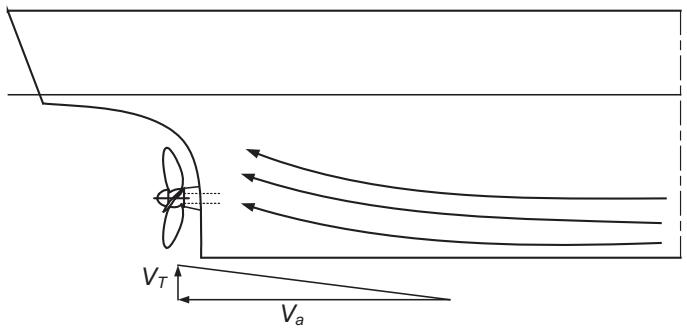

text_image

V_T
V_a

Figure 8.14. General upflow at aft end of single-screw vessel.

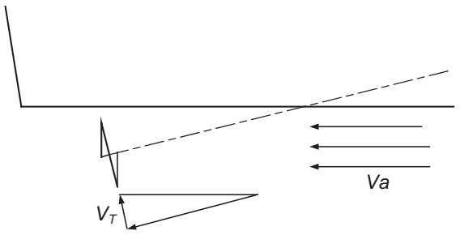

text_image

V_T
Va

Figure 8.15. Tangential flow due to inclined shaft.

In the case of an inclined shaft, often employed in smaller higher-speed craft, the propeller encounters an axial flow together with a tangential component $V _ { T } ,$ Figure 8.15. Cyclic load variations of the order of 100% can be caused by shaft inclinations.

# 8.9.2 Effects of Tangential Wake

The general upflow across the propeller plane, Figure 8.14, decreases blade angles of attack, hence forces, as the blade rises towards TDC and increases angles of attack as the blades descend away from TDC, Figure 8.16.

For a propeller rotating clockwise, viewed from aft, the load on the starboard side is higher than on the port side. The effect is to offset the centre of thrust to starboard, Figure 8.17. It may be offset by as much as 33% of propeller radius. The effect of the varying torque force is to introduce a vertical load on the shaft. The forces can be split into a steady-state load together with a time varying component.

text_image

TDC

Figure 8.16. Effect of upflow at propeller plane.

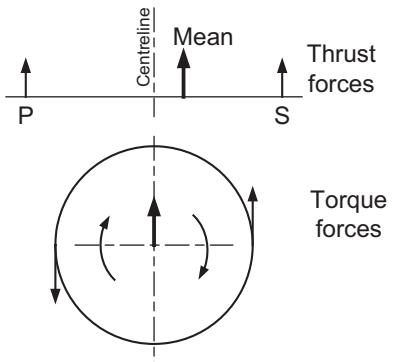

text_image

Centreline
Mean
P
S
Thrust
forces
Torque
forces

Figure 8.17. Thrust and torque forces due to tangential wake.

The forces resulting from an inclined shaft are shown in Figure 16.21 and the effects on blade loadings are discussed in Chapter 16, Section 16.2.8. A blade element diagram including tangential flow is described in Chapter 15.

# REFERENCES (CHAPTER 8)

8.1 Harvald, S.A. Potential and frictional wake of ships. Transactions of the Royal Institution of Naval Architects, Vol. 115, 1973, pp. 315–325.   
8.2 Harvald, S.A. Resistance and Propulsion of Ships. Wiley Interscience, New York, 1983.   
8.3 Van Manen, J.D. Fundamentals of ship resistance and propulsion. Part B Propulsion. Publication No. 129a of NSMB, Wageningen. Reprinted in International Shipbuilding Progress.   
8.4 Harvald, S.A. Wake distributions and wake measurements. Transactions of the Royal Institution of Naval Architects, Vol. 123, 1981, pp. 265–286.   
8.5 Van Manen, J.D. and Kamps, J. The effect of shape of afterbody on propulsion. Transactions of the Society of Naval Architects and Marine Engineers, Vol. 67, 1959, pp. 253–289.   
8.6 ITTC. Report of the specialist committee on wake fields. Proceedings of 25th ITTC, Vol. II, Fukuoka, 2008.   
8.7 Di Felice, F., Di Florio, D., Felli, M. and Romano, G.P. Experimental investigation of the propeller wake at different loading conditions by particle image velocimetry. Journal of Ship Research, Vol. 48, No. 2, 2004, pp. 168–190.   
8.8 Felli, M. and Di Fellice, F. Propeller wake analysis in non uniform flow by LDV phase sampling techniques. Journal of Marine Science and Technology, Vol. 10, 2005.   
8.9 Visonneau, M., Deng, D.B. and Queutey, P. Computation of model and full scale flows around fully-appended ships with an unstructured RANSE solver. 26th Symposium on Naval Hydrodynamics, Rome, 2005.   
8.10 Starke, B., Windt, J. and Raven, H. Validation of viscous flow and wake field predictions for ships at full scale. 26th Symposium on Naval Hydrodynamics, Rome, 2005.   
8.11 ITTC. Recommended procedure for the propulsion test. Procedure 7.5-02-03- 01.1. Revision 01, 2002.   
8.12 Dyne, G. On the scale effect of thrust deduction. Transactions of the Royal Institution of Naval Architects, Vol. 115, 1973, pp. 187–199.   
8.13 Lubke, L. Calculation of the wake field in model and full scale. ¨ Proceedings of International Conference on Ship and Shipping Research, NAV’2003, Palermo, Italy, June 2003.   
8.14 Taylor, D.W. The Speed and Power of Ships. Government Printing Office, Washington, DC, 1943.   
8.15 Lackenby, H. and Parker, M.N. The BSRA methodical series – An overall presentation: variation of resistance with breadth-draught ratio and lengthdisplacement ratio. Transactions of the Royal Institution of Naval Architects, Vol. 108, 1966, pp. 363–388.   
8.16 Pattullo, R.N.M. and Wright, B.D.W. Methodical series experiments on singlescrew ocean-going merchant ship forms. Extended and revised overall analysis. BSRA Report NS333, 1971.   
8.17 Holtrop J. A statistical re-analysis of resistance and propulsion data. International Shipbuilding Progress, Vol. 31, 1984, pp. 272–276.   
8.18 Parker, M.N. and Dawson, J. Tug propulsion investigation. The effect of a buttock flow stern on bollard pull, towing and free-running performance. Transactions of the Royal Institution of Naval Architects, Vol. 104, 1962, pp. 237–279.

8.19 Moor, D.I. An investigation of tug propulsion. Transactions of the Royal Institution of Naval Architects, Vol. 105, 1963, pp. 107–152.   
8.20 Pattulo, R.N.M. and Thomson, G.R. The BSRA Trawler Series (Part I). Beamdraught and length-displacement ratio series, resistance and propulsion tests. Transactions of the Royal Institution of Naval Architects, Vol. 107, 1965, pp. 215–241.   
8.21 Pattulo, R.N.M. The BSRA Trawler Series (Part II). Block coefficient and longitudinal centre of buoyancy series, resistance and propulsion tests. Transactions of the Royal Institution of Naval Architects, Vol. 110, 1968, pp. 151–183.   
8.22 Thomson, G.R. and Pattulo, R.N.M. The BSRA Trawler Series (Part III). Resistance and propulsion tests with bow and stern variations. Transactions of the Royal Institution of Naval Architects, Vol. 111, 1969, pp. 317–342.   
8.23 Flikkema, M.B., Holtrop, J. and Van Terwisga, T.J.C. A parametric power prediction model for tractor pods. Proceedings of Second International Conference on Advances in Podded Propulsion, T-POD. University of Brest, France, October 2006.   
8.24 Bailey, D. A statistical analysis of propulsion data obtained from models of high speed round bilge hulls. Symposium on Small Fast Warships and Security Vessels. RINA, London, 1982.   
8.25 Gamulin, A. A displacement series of ships. International Shipbuilding Progress, Vol. 43, No. 434, 1996, pp. 93–107.   
8.26 Moor, D.I. and O’Connor, F.R.C. Resistance and propulsion factors of some single-screw ships at fractional draught. Transactions of the North East Coast Institution of Engineers and Shipbuilders. Vol. 80, 1963–1964, pp. 185–202.

# 9 Numerical Estimation of Ship Resistance

# 9.1 Introduction

The appeal of a numerical method for estimating ship hull resistance is in the ability to seek the ‘best’ solution from many variations in shape. Such a hull design optimisation process has the potential to find better solutions more rapidly than a conventional design cycle using scale models and associated towing tank tests.

Historically, the capability of the numerical methods has expanded as computers have become more powerful and faster. At present, there still appears to be no diminution in the rate of increase in computational power and, as a result, numerical methods will play an ever increasing role. It is worth noting that the correct application of such techniques has many similarities to that of high-quality experimentation. Great care has to be taken to ensure that the correct values are determined and that there is a clear understanding of the level of uncertainty associated with the results.

One aspect with which even the simplest methods have an advantage over traditional towing tank tests is in the level of flow field detail that is available. If correctly interpreted, this brings a greatly enhanced level of understanding to the designer of the physical behaviour of the hull on the flow around it. This chapter is intended to act as a guide, rather than a technical manual, regarding exactly how specific numerical techniques can be applied. Several useful techniques are described that allow numerical tools to be used most effectively.

The ability to extract flow field information, either as values of static pressure and shear stress on the wetted hull surface, or on the bounding surface of a control volume, allows force components or an energy breakdown to be used to evaluate a theoretical estimate of numerical resistance using the techniques discussed in Chapter 7. It should always be remembered that the uncertainty associated with experimental measurement is now replaced by the uncertainties associated with the use of numerical techniques. These always contain inherent levels of abstraction away from physical reality and are associated with the mathematical representation applied and the use of numerical solutions to these mathematical models.

This chapter is not intended to give the details of the theoretical background of all the available computational fluid dynamic (CFD) analysis techniques, but rather an overview that provides an appreciation of the inherent strengths and weaknesses and their associated costs. A number of publications give a good overview of CFD, for example, Ferziger and Peric [9.1], and how best to apply CFD to maritime problems [9.2, 9.3].

Table 9.1. Evolution of CFD capabilities for evaluating ship powering 

<table><tr><td>Location</td><td>Year</td><td> $ITTC Proc. Resistance Committee^{(1)}$ </td><td>Methods used</td><td>Test cases</td><td>Ref.</td></tr><tr><td>Gothenburg</td><td>1980</td><td>16th (1981)</td><td>16 boundary layer-based methods (difference and integral) and 1 RANS</td><td>HSVA tankers</td><td>[9.4]</td></tr><tr><td>Gothenburg</td><td>1990</td><td>20th (1993)</td><td>All methods RANS except 1 LES and 1 boundary layer</td><td>HSVA tankers</td><td>[9.5]</td></tr><tr><td>Tokyo</td><td>1994</td><td>21st (1996)</td><td>Viscous and inviscid free-surface methods, and viscous at zero  $Fr$ (double hull)</td><td>Series 60 ( $C_B = 0.6$ )HSVA tanker</td><td>[9.6, 9.7]</td></tr><tr><td>Gothenburg</td><td>2000</td><td>23rd (2002)</td><td>All RANS but with/without free-surface both commercial and in-house codes</td><td>KVLCC2, KCS, DTMB5415</td><td>[9.8, 9.9]</td></tr><tr><td>Tokyo</td><td>2005</td><td>25th (2008)</td><td>RANS with self-propelled, at drift and in head seas</td><td>KVLCC2, KCS, DTMB5415</td><td>[9.10]</td></tr><tr><td>Gothenburg</td><td>2010</td><td>26th (2011)</td><td>RANS with a variety of turbulence models, free surface, dynamic heave and trim, propeller, waves and some LES</td><td>KVLCC2, KCS, DTMB5415</td><td></td></tr></table>

Note: (1) Full text available via ITTC website, http://ittc.sname.org

# 9.2 Historical Development

The development of numerical methods and their success or otherwise is well documented in the series of proceedings of the International Towing Tank Conference (ITTC). In particular, the Resistance Committee has consistently reported on the capabilities of the various CFD techniques and their developments. Associated with the ITTC have been a number of international workshops which aimed to benchmark the capability of the prediction methods against high-quality experimental test cases. The proceedings of these workshops and the associated experimental test cases still provide a suitable starting point for those wishing to develop such capabilities.

Table 9.1 identifies the main workshops and the state-of-the-art capability at the time. The theoretical foundations of most techniques have been reasonably well understood, but the crucial component of their subsequent development has been the rapid reduction in computational cost. This is the cost associated with both the processing power in terms of floating point operations per second of a given processor and the cost of the necessary memory storage associated with each processor. A good measure of what is a practical (industrial) timescale for a large-scale single CFD calculation has been that of the overnight run, e.g. the size of problem that can be set going when engineers go home in the evening and the answer is ready when they arrive for work the next morning. To a large extent this dictates the computational mesh size that can be applied to a given problem and the likely numerical accuracy.

# 9.3 Available Techniques

The flow around a ship hull, as previously described in Chapters 3 and 4, is primarily incompressible and inviscid. Viscous effects are confined to a thin boundary layer close to the hull and a resultant turbulent wake. What makes the flow particularly interesting and such a challenge to the designer of a ship hull is the interaction between the development of the hull boundary layer and the generation of freesurface gravity waves due to the shape of the hull. The challenge of capturing the complexity of this flow regime is described by Landweber and Patel [9.11]. In particular, they focus on the interaction at the bow between the presence, or otherwise, of a stagnation point and the creation of the bow wave which may or may not break and, even if it does not break, may still induce flow separation at the stem and create significant vorticity. It is only recently that computations of such complex flow interactions have become possible [9.12].

# 9.3.1 Navier–Stokes Equations

Ship flows are governed by the general conservation laws for mass, momentum and energy, collectively referred to as the Navier–Stokes equations.

\- The continuity equation states that the rate of change of mass in an infinitesimally small control volume equals the rate of mass flux through its bounding surface.

$$
\frac {\partial \rho}{\partial t} + \nabla \cdot (\rho V) = 0, \tag {9.1}
$$

where ∇ is the differential operator $( \partial / \partial x , \partial / \partial y , \partial / \partial z )$ .

\- The momentum equation states that the rate of change of momentum for the infinitesimally small control volume is equal to the rate at which momentum is entering or leaving through the surface of the control volume, plus the sum of the forces acting on the volume itself.

$$
\begin{array}{l} \frac {\partial (\rho u)}{\partial t} + \nabla \cdot (\rho u \mathbf {V}) = - \frac {\partial p}{\partial x} + \frac {\partial \tau_ {x x}}{\partial x} + \frac {\partial \tau_ {y x}}{\partial y} + \frac {\partial \tau_ {z x}}{\partial z} + \rho f _ {x} \\ \frac {\partial (\rho v)}{\partial t} + \nabla \cdot (\rho v \mathbf {V}) = - \frac {\partial p}{\partial y} + \frac {\partial \tau_ {x y}}{\partial x} + \frac {\partial \tau_ {y y}}{\partial y} + \frac {\partial \tau_ {z y}}{\partial z} + \rho f _ {y} \\ \frac {\partial (\rho w)}{\partial t} + \nabla \cdot (\rho w \mathbf {V}) = - \frac {\partial p}{\partial z} + \frac {\partial \tau_ {x z}}{\partial x} + \frac {\partial \tau_ {y z}}{\partial y} + \frac {\partial \tau_ {z z}}{\partial z} + \rho f _ {z}, \tag {9.2} \\ \end{array}
$$

$\operatorname { w h e r e } \mathbf { V } = ( u , v , w ) .$

\- The energy equation states that the rate of change in internal energy in the control volume is equal to the rate at which enthalpy is entering, plus work done on the control volume by the viscous stresses.

$$
\begin{array}{l} \frac {\partial}{\partial t} \left[ \rho \left(e + \frac {V ^ {2}}{2}\right) \right] + \nabla \cdot \left[ \rho \left(e + \frac {V ^ {2}}{2}\right) \mathbf {V} \right] = \rho \dot {q} + \frac {\partial}{\partial x} \left(k \frac {\partial T}{\partial x}\right) \\ + \frac {\partial}{\partial y} \left(k \frac {\partial T}{\partial y}\right) + \frac {\partial}{\partial z} \left(k \frac {\partial T}{\partial z}\right) - \frac {\partial (u p)}{\partial x} - \frac {\partial (v p)}{\partial y} - \frac {\partial (w p)}{\partial z} + \frac {\partial (u \tau_ {x x})}{\partial x} \\ + \frac {\partial (u \tau_ {y x})}{\partial y} + \frac {\partial (u \tau_ {z x})}{\partial z} + \frac {\partial (v \tau_ {x y})}{\partial x} + \frac {\partial (v \tau_ {y y})}{\partial y} + \frac {\partial (v \tau_ {z y})}{\partial z} + \frac {\partial (w \tau_ {x z})}{\partial x} \\ + \frac {\partial (w \tau_ {y z})}{\partial y} + \frac {\partial (w \tau_ {z z})}{\partial z} + \rho f \cdot V. \tag {9.3} \\ \end{array}
$$

and $V ^ { 2 } = \mathbf { V } \cdot \mathbf { V } .$

The Navier–Stokes equations can only be solved analytically for just a few cases, see for example Batchelor [9.13] and, as a result, a numerical solution has to be sought.

In practice, it is possible to make a number of simplifying assumptions that can either allow an analytical solution to be obtained or to significantly reduce the computational effort required to solve the full Navier–Stokes equations. These can be broadly grouped into the three sets of techniques described in the following sections.

# 9.3.2 Incompressible Reynolds Averaged Navier–Stokes equations (RANS)

In these methods the flow is considered as incompressible, which simplifies Equations (9.1) and (9.2) and removes the need to solve Equation (9.3). The Reynolds averaging process assumes that the three velocity components can be represented as a rapidly fluctuating turbulent velocity around a slowly varying mean velocity. This averaging process introduces six new terms, known as Reynolds stresses. These represent the increase in effective fluid velocity due to the presence of turbulent eddies within the flow.

$$
\begin{array}{l} \frac {\partial U}{\partial t} + U \left(\frac {\partial U}{\partial x} + \frac {\partial V}{\partial x} + \frac {\partial W}{\partial x}\right) \\ = \frac {- 1}{\rho} \frac {\partial P}{\partial x} + v \left(\frac {\partial^ {2} U}{\partial x ^ {2}} + \frac {\partial^ {2} U}{\partial y ^ {2}} + \frac {\partial^ {2} U}{\partial z ^ {2}}\right) - \left(\frac {\partial \overline {{u ^ {\prime 2}}}}{\partial x ^ {2}} + \frac {\partial \overline {{u ^ {\prime} v ^ {\prime}}}}{\partial x \partial y} + \frac {\partial \overline {{u ^ {\prime} w ^ {\prime}}}}{\partial x \partial z}\right) \\ \end{array}
$$

$$
\begin{array}{l} \frac {\partial V}{\partial t} + V \left(\frac {\partial U}{\partial y} + \frac {\partial V}{\partial y} + \frac {\partial W}{\partial y}\right) \\ = \frac {- 1}{\rho} \frac {\partial P}{\partial y} + \nu \left(\frac {\partial^ {2} V}{\partial x ^ {2}} + \frac {\partial^ {2} V}{\partial y ^ {2}} + \frac {\partial^ {2} V}{\partial z ^ {2}}\right) - \left(\frac {\partial \overline {{u ^ {\prime} v ^ {\prime}}}}{\partial x \partial y} + \frac {\partial \overline {{v ^ {\prime 2}}}}{\partial y ^ {2}} + \frac {\partial \overline {{v ^ {\prime} w ^ {\prime}}}}{\partial y \partial z}\right) \\ \end{array}
$$

$$
\begin{array}{l} \frac {\partial W}{\partial t} + W \left(\frac {\partial U}{\partial z} + \frac {\partial V}{\partial z} + \frac {\partial W}{\partial z}\right) \\ = \frac {- 1}{\rho} \frac {\partial P}{\partial z} + \nu \left(\frac {\partial^ {2} W}{\partial x ^ {2}} + \frac {\partial^ {2} W}{\partial y ^ {2}} + \frac {\partial^ {2} W}{\partial z ^ {2}}\right) - \left(\frac {\partial \overline {{u ^ {\prime} w ^ {\prime}}}}{\partial x \partial z} + \frac {\partial \overline {{v ^ {\prime} w ^ {\prime}}}}{\partial y \partial z} + \frac {\partial \overline {{w ^ {\prime 2}}}}{\partial z ^ {2}}\right). \tag {9.4} \\ \end{array}
$$

$\mathrm { w h e r e } u = U + u ^ { \prime } , v = V + v ^ { \prime } , w = W + w ^ { \prime } .$

In order to close this system of equations a turbulence model has to be introduced that can be used to represent the interaction between these Reynolds stresses and the underlying mean flow. It is in the appropriate choice of the model used to achieve turbulence closure that many of the uncertainties arise. Wilcox [9.14] discusses the possible approaches that range from a simple empirical relationship which introduces no additional unknowns to those which require six or more additional unknowns and appropriate auxiliary equations. Alternative approaches include:

(1) Large eddy simulation (LES), which uses the unsteady Navier–Stokes momentum equations and only models turbulence effects at length scales comparable with the local mesh size; or   
(2) Direct numerical simulation (DNS) which attempts to resolve all flow features across all length and time scales.

LES requires a large number of time steps to derive a statistically valid solution and a very fine mesh for the boundary layer, whereas DNS introduces an extremely large increase in mesh resolution and a very small time step. In practice, zonal approaches, such as detached eddy simulation (DES), provide a reasonable compromise through use of a suitable wall boundary layer turbulence closure and application of an LES model through use of a suitable switch in separated flow regions [9.15].

In all of the above methods the flow is solved in a volume of space surrounding the hull. The space is divided up into contiguous finite volumes (FV) or finite elements (FE) within which the mass and momentum conservation properties, alongside the turbulence closure conditions, are satisfied. Key decisions are associated with how many such FV or FE are required, and their size and location within the domain.

# 9.3.3 Potential Flow

In addition to treating the flow as incompressible, if the influence of viscosity is ignored, then Equation (9.2) can be reduced to Laplace’s equation, as follows:

$$
\nabla^ {2} \phi = 0, \tag {9.5}
$$

where φ is the velocity potential. In this case, the flow is representative of that at an infinite Reynolds number. As the length based Reynolds number of a typical ship can easily be 109, this provides a reasonable representation of the flow. The advantage of this approach is that, through the use of an appropriate Green’s function, the problem can be reduced to a solution of equations just on the wetted ship hull. Such boundary element (or surface panel) methods are widely applied [9.16, 9.17]. The selection of a Green’s function that incorporates the free-surface boundary condition will give detailed knowledge of the wave pattern and associated drag. Section 9.5 gives a particular example of such an approach using thin ship theory.

The removal of viscous effects requires the use of an appropriate empiricism to estimate the full-scale resistance of a ship, for example, using the ITTC 1957 correlation line, Chapter 4. However, as in the main, the ship boundary layer is thin, it is possible to apply a zonal approach. In this zonal approach, the inner boundary layer is solved using a viscous method. This could include, at its simplest, an integral boundary layer method ranging to solution of the Navier–Stokes equations with thin boundary layer assumptions [9.4, 9.11]. The solution of the boundary layer requires a detailed knowledge of the surface pressure distribution and the ship hull geometry. This can be obtained directly using an appropriate surface panel method. These methods are best applied in an iterative manner with application of a suitable matching condition between the inner (viscous) and outer (inviscid) zone. Considerable effort went into the development of these techniques through the 1980s.

Typically, potential methods only require a definition of the hull surface in terms of panels mapped across its wetted surface. As a result, for a given resolution of force detail on the hull surface, the number of panels scale as $N ^ { 2 }$ compared with $N ^ { 3 }$ for a steady RANS calculation.

# 9.3.4 Free Surface

The inability of the free-surface interface to withstand a significant pressure differential poses a challenge when determining the flow around a ship. Until the flow field around a hull is known it is not possible to define the location of the free surface which in turn will influence the flow around a hull. The boundary conditions are [9.1] as follows:

(1) Kinematic: the interface is sharp with a local normal velocity of the interface that is the same as that of the normal velocity of the air and water at the interface.   
(2) Dynamic or force equilibrium: the pressure difference across the interface is associated with that sustained due to surface tension and interface curvature, and the shear stress is equal and of opposite direction either side.

There are two approaches to determining the location of the free surface for RANS methods, as illustrated schematically in Figure 9.1. The first approach attempts to track the interface location by moving a boundary so that it is located where the sharp free-surface interface lies. This requires the whole mesh and boundary location to move as the solution progresses. The second captures the location implicitly through determining where, within the computational domain, the boundary between air and water is located. Typically this is done by introducing an extra conservation variable as in the volume of fluid approach which determines the proportion of water in the particular mesh cell, a value of one being assigned for full and zero for empty, [9.18], or in the level set method [9.19] where an extra scalar is a distance to the interface location.

natural_image

Abstract wavy line pattern with grid lines, no text or symbols present

text_image

(b)

Figure 9.1. Location of free surface. (a) Tracking: mesh fitted to boundary. (b) Capture: boundary located across mesh elements.

For potential flow surface panel codes, which use a simple Rankine source/ dipole Green’s function, the free surface is considered as a physical boundary with a distribution of panels [9.20] located on the free surface, or often in linearised methods on the static water level. It is possible to develop more advanced hull panel boundary Green’s functions that satisfy the free-surface boundary condition automatically. Again, these can use a variety of linearisation assumptions: the boundary is on the static water level and the wave amplitudes are small. It is outside the scope of this book to describe the many variations and developments in this area and interested readers can consult Newman [9.21] for greater detail.

A difficulty for both potential and RANS approaches is for more dynamic flow regimes where the sinkage and trim of the hull become significant $( \sim F n > 0 . 1 5 )$ . An iterative approach has to be applied to obtain the dynamic balance of forces and moments on the hull for its resultant trim and heave.

In consideration of the RANS free-surface methods, there are a number of approaches to dealing with the flow conditions at the location of the air–water interface. These typically result in choices as to whether both air and water flow problems will be solved and as to whether the water and air are treated as incompressible or not. Godderidge et al. [9.22, 9.23] examined the various alternatives and suggest guidance as to which should be selected. The choice made reflects the level of fidelity required for the various resistance components and how much of the viscous free-surface interaction is to be captured.

# 9.4 Interpretation of Numerical Methods

# 9.4.1 Introduction

The art of effective CFD analysis is in being able to identify the inherent approximations and to have confidence that the level of approximation is acceptable. CFD tools should never replace the importance of sound engineering judgement in assessing the results of the analysis. Indeed, one of the inherent problems of the latest CFD methods is the wealth of data generated, and the ability to ‘visualise’ the implications of the results requires considerable skill. Due to this, interpretation is still seen as a largely subjective process based on personal experience of hydrodynamics. The subjective nature of the process can often be seen to imply an unknown level of risk. This is one of the reasons for the concern expressed by the maritime industry for the use of CFD as an integral part of the design process.

The ever reducing cost of computational resources has made available tools which can deliver results within a sufficiently short time span that they can be included within the design process. Uses of such tools are in concept design and parametric studies of main dimensions; optimization of hull form, appendages and propulsion systems; and detailed analysis of individual components and their interaction with the whole ship, for example, appendage alignment or sloshing of liquids in tanks. In addition to addressing these issues during the design process, CFD methods are often applied as a diagnostic technique for identifying the cause of a particular problem. Understanding the fluid dynamic cause of the problem also then allows possible remedies to be suggested.

The easy availability of results from complex computational analysis often fosters the belief that, when it comes to data, more detail implies more accuracy. Hence, greater reliance can be placed on the results. Automatic shape optimisation in particular exposes the ship design process to considerable risk. An optimum shape found using a particular computational implementation of a mathematical model will not necessarily be optimum when exposed to real conditions.

An oft assumed, but usually not stated, belief that small changes in input lead only to small changes in output [9.24] cannot be guaranteed for the complex, highly non-linear nature of the flow around vessels. Typical everyday examples of situations which violate this assumption include laminar-turbulent transition, flow separation, cavitation and breaking waves. It is the presence or otherwise of these features which can strongly influence the dependent parameters such as wave resistance, viscous resistance, wake fraction and so on, for which the shape is optimised. Not surprisingly, it is these features which are the least tractable for CFD analysis.

Correct dimensional analysis is essential to the proper understanding of the behaviour of a ship moving through water, see Chapter 3. Knowledge of the relative importance of the set of non-dimensional parameters, constructed from the independent variables, in controlling the behaviour of the non-dimensional dependent variables is the first step in reducing the ship design challenge to a manageable problem. It is the functional relationships of non-dimensional independent variables, based on the properties of the fluid, relative motions, shape parameters and relative size and position, which control ship performance.

The physical behaviour of moving fluids is well understood. However, understanding the complex interrelationship between a shape and how the fluid responds is central to ship design. The power required to propel a ship, the dynamic distortions of the structure of the ship and its response to imposed fluid motions are fundamental features of hydrodynamic design.

Engineers seek to analyse problems and then to use the information obtained to improve the design of artefacts and overall systems. Historically, two approaches have been possible in the analysis of fluid dynamic problems.

(1) Systematic experimentation can be used to vary design parameters and, hence, obtain an optimum design. However, the cost of such test programmes can be prohibitive. A more fundamental drawback is the necessity to carry out tests at model scale and extrapolate the results to full scale, see Chapter 4. These still cause a considerable level of uncertainty in the extrapolation of model results to that of full scale.   
(2) An analytical approach is the second possibility. Closed form solutions exist for a few tightly specified flows. In addition, approximations can be made, for example, slender body theory, which at least gives reasonable predictions. In general, the more complex the flow the greater the level of mathematical detail required to specify and, if possible, to solve the problem. Errors and uncertainty arise from the assumptions made. Many ‘difficult’ integrals require asymptotic approximations to be made or equations are linearised based on the assumption that only small perturbations exist. These greatly restrict the range of applicability of the analytic solution and there is always the temptation to use results outside their range of validity.

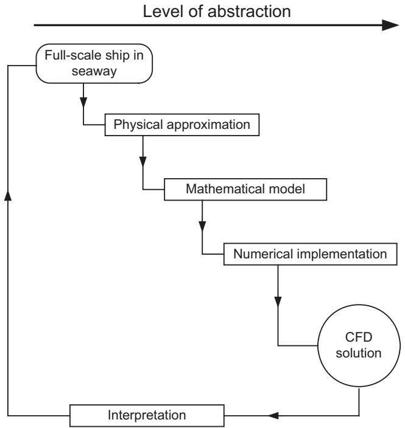

flowchart

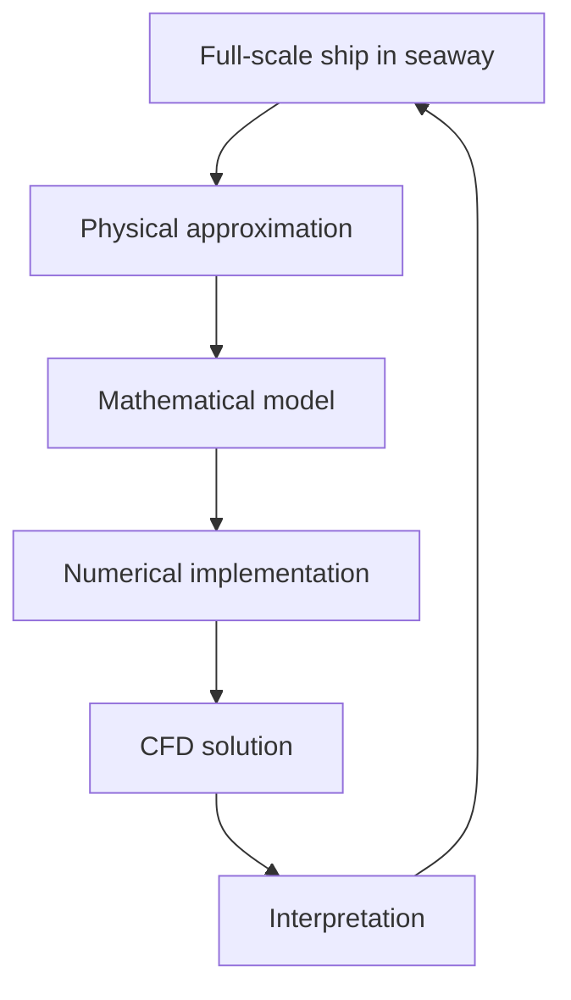
```mermaid
graph TD
    A["Full-scale ship in seaway"] --> B["Physical approximation"]
    B --> C["Mathematical model"]
    C --> D["Numerical implementation"]
    D --> E["CFD solution"]
    E --> F["Interpretation"]
    F --> A
```

Figure 9.2. Levels of abstraction of CFD solution from physical reality.

The advent of powerful computers has, over the past five decades, allowed progressively more complex problems to be solved numerically. These computational techniques now offer the engineer a third, numerical alternative. In general, the continuous mathematical representation of a fluid is replaced by a discrete representation. This reduces the complexity of the mathematical formulation to such a level that it can be solved numerically through the repetitive application of a large number of mathematical operations. The result of the numeric analysis is a solution defined at discrete positions in time and/or space. The spatial and temporal resolution of the solution in some way is a measure of the usefulness and validity of the result. However, the cost of higher resolution is a greatly increased requirement for both data storage and computational power. The numerical approximation will also limit the maximum achievable resolution, as will the accuracy with which a computer can represent a real number.

The process of simplifying the complex unsteady flow regime around a full-scale ship can be considered to be one of progressive abstraction of simpler models from the complete problem, Figure 9.2. Each level of abstraction corresponds to the neglect of a particular non-dimensional parameter. Removal of these parameters can be considered to occur in three distinct phases: those which relate to physical parameters, those which relate to the assumptions made when deriving a continuous mathematical representation and, finally, those used in constructing a numerical (or discrete) representation of the mathematical model.

# 9.4.2 Validation of Applied CFD Methodology

In assessing ship resistance with the use of a numerical tool it is essential to be able to quantify the approximation in the different levels of interpretation applied. This