

flowchart

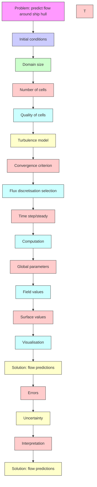
```mermaid
graph TD
    A["Problem: predict flow around ship hull"] --> B["Initial conditions"]
    B --> C["Domain size"]
    C --> D["Number of cells"]
    D --> E["Quality of cells"]
    E --> F["Turbulence model"]
    F --> G["Convergence criterion"]
    G --> H["Flux discretisation selection"]
    H --> I["Time step/steady"]
    I --> J["Computation"]
    J --> K["Global parameters"]
    K --> L["Field values"]
    L --> M["Surface values"]
    M --> N["Visualisation"]
    N --> O["Solution: flow predictions"]
    O --> P["Errors"]
    P --> Q["Uncertainty"]
    Q --> R["Interpretation"]
    R --> S["Solution: flow predictions"]
    style A fill:#f9f,stroke:#333
    style B fill:#ccf,stroke:#333
    style C fill:#cfc,stroke:#333
    style D fill:#fcc,stroke:#333
    style E fill:#cff,stroke:#333
    style F fill:#ffc,stroke:#333
    style G fill:#fcc,stroke:#333
    style H fill:#cff,stroke:#333
    style I fill:#fcc,stroke:#333
    style J fill:#cff,stroke:#333
    style K fill:#fcc,stroke:#333
    style L fill:#cff,stroke:#333
    style M fill:#fcc,stroke:#333
    style N fill:#cff,stroke:#333
    style O fill:#ffc,stroke:#333
    style P fill:#fcc,stroke:#333
    style Q fill:#ffc,stroke:#333
    style R fill:#fcc,stroke:#333
    style S fill:#ffc,stroke:#333
    style T fill:#fcc,stroke:#333
```

Figure 9.3. CFD process.

process of validation has been investigated in depth by the Resistance Committee of the ITTC and the workshops described in Table 9.1.

The process of validation can be seen as an attempt to eliminate or at least quantify these uncertainties. The process of code validation can be seen as a series of stages. Figure 9.3 illustrates the various stages required to solve the flow around a ship hull to obtain its resistance. Each of these stages requires use of an appropriate tool or analysis. Exactly how each stage is actually implemented depends on the numerical approach and the layout of the computational code.

Verification of the applied code implementation considers how well it represents the underlying mathematical formulation. This verification ensures that the code is free of error due to mistakes in expressing the mathematics in the particular computer language used. Ideally, the comparison should be made against an analytic solution, although often the comparison can only be made with other numerical codes.

CFD typically requires the user, or more often these days the code designer, to define a number of parameters for each stage of the process. Each of these parameters will introduce a solution dependence. Investigation of the sensitivity of the solution to all of these numerical parameters will require a significant investment of effort. It is in this area that an experienced user will be able to make rational and informed choices.

The most common form of dependence will be that due to the density and quality of the grid of points at which the governing equations are solved [9.25]. The process of grid, or often now mesh, generation [9.26] requires specialist software tools that ideally interface well to an underlying geometry definition. These tools typically will be from a general purpose computer–aided design (CAD) package, and they often struggle to work well when defining a ship hull and it is well to be conversant with methods for defining the complex curvature required in hull geometry definition [9.27].

The goal of effective mesh generation is to use just sufficient numbers of FV of the correct size, shape and orientation to resolve all the necessary flow features that control ship resistance. To date, it is rare that any practical computational problem can be said to have achieved this level of mesh resolution. However, with the reduction of computational cost, multimillion FV problems have been solved for steady flows and these appear to give largely mesh-independent solutions.

The final arbiter of performance will always be comparison with a physically measured quantity. It is in this comparison that the efforts of the maritime CFD communities, through the ongoing workshop series, Table 9.1, provides a valuable resource to the user of CFD for ship design. These publically available datasets provide a suitable series of test cases to develop confidence in the whole CFD process. As the majority of fluid dynamic codes are an approximation to the actual physics of the flow, differences will occur between the experimental and numerical results. Experimental data should always have a specified accuracy. This should then allow the difference between experiment and theory to be quantified. In many codes, however, some degree of empiricism is used to adjust the numerical model to fit specific experimental data. The extent to which such an empirically adjusted model can be said to be valid for cases run at different conditions requires careful consideration. A comparison will only be valid if both experiment and computation are at the same level of abstraction, i.e. all assumptions and values of nondimensional parameters are the same.

# 9.4.3 Access to CFD

Users have four possible routes to using CFD.

(1) Development of their own bespoke computational code. This requires a significant investment of resources and time to achieve a level of performance comparable with those available through (2) and (4). It is unlikely that this route can still be recommended.   
(2) Purchase of a commercial, usually general purpose, CFD flow solver. There are only a few commercial codes that can be applied to the problem of freesurface ship flows. Details of these vary and can typically be found via various

web-based CFD communities such as [9.28]. The likely commercial licence and training costs can be high. This still makes application of CFD techniques prohibitively expensive for small to medium scale enterprises unless they have employed individuals already conversant with use of CFD to a high standard and who can ensure a highly productive usage of the licence.

(3) Use of third party CFD consultants. As always with consultancy services, they cost a significant premium and there is often little knowledge transfer to the organisation. Such services, however, will provide detailed results that can be used as part of the design process and there is little wasted effort.

(4) Development of open-source CFD software. A number of these software products are now available. As in (1) and (2), they can require a significant training and organisational learning cost. The organisations that coordinate their development have an alternative business model which will still require investment. They do, however, offer a flexible route to bespoke computational analysis. This may have advantages because it allows a process tailored to the design task and one that can be readily adapted for use in automated design optimisation.

The remaining choice is then of the computational machine upon which the calculations are to be performed. As the price of computational resources is reduced, suitable machines are now affordable. Large scale computations can also be accessed via web-based computational resources at a reasonable cost.

# 9.5 Thin Ship Theory

# 9.5.1 Background

Potential flow theory provides a powerful approach for the calculation of wave resistance, as through the suitable choice of the Green’s function in a boundary element method, the free-surface boundary condition can be automatically captured. Thin ship theory provides a direct method of determining the likely wave field around a hull form. The background and development of the theory is described in [9.29–9.31].

In the theory, it is assumed that the ship hull(s) will be slender, the fluid is inviscid, incompressible and homogeneous, the fluid motion is steady and irrotational, surface tension may be neglected and the wave height at the free surface is small compared with the wave length. For the theory in its basic form, ship shape bodies are represented by planar arrays of Kelvin sources on the local hull centrelines, together with the assumption of linearised free-surface conditions. The theory includes the effects of a channel of finite breadth and the effects of shallow water.

The strength of the source on each panel may be calculated from the local slope of the local waterline, Equation (9.6):

$$
\sigma = \frac {- U}{2 \pi} \frac {d y}{d x} d S, \tag {9.6}
$$

where $d y / d x$ is the slope of the waterline, σ is the source strength and S is the wetted surface area.

The hull waterline offsets can be obtained directly and rapidly as output from a commercial lines fairing package, such as ShipShape [9.32].

The wave system is described as a series using the Eggers coefficients as follows:

$$
\zeta = \sum_ {m = 0} ^ {m} \left[ \xi_ {m} \cos \left(x k _ {m} \cos \theta_ {m}\right) + \eta_ {m} \sin \left(x k _ {m} \cos \theta_ {m}\right) \right] \cos \frac {m \pi y}{W}. \tag {9.7}
$$

This is derived as Equation (7.21) in Chapter 7.

The wave coefficients $\xi _ { m }$ and $\eta _ { m }$ can be derived theoretically using Equation (9.8), noting that they can also be derived experimentally from physical measurements of $\zeta$ in Equation (9.7), as described in Chapter 7. This is an important property of the approach described.

$$
\begin{array}{l} \left| \begin{array}{c} \xi_ {m} \\ \eta_ {m} \end{array} \right| = \frac {1 6 \pi U}{W g} \frac {k _ {0} + k _ {m} \cos^ {2} \theta_ {m}}{1 + \sin^ {2} \theta_ {m} - k _ {0} h \sec h ^ {2} (k _ {m} h)} \\ \times \sum_ {\sigma} \left[ \sigma_ {\sigma} e ^ {- k _ {m} h} \cosh \left[ k _ {m} (h + z _ {\sigma}) \right] \left| \begin{array}{l} \cos (k _ {m} x _ {\sigma} \cos \theta_ {m}) \\ \sin (k _ {m} x _ {\sigma} \cos \theta_ {m}) \end{array} \right| \begin{array}{l} \cos \frac {m \pi y _ {\sigma}}{W} \\ \sin \frac {m \pi y _ {\sigma}}{W} \end{array} \right] \tag {9.8} \\ \end{array}
$$

The wave pattern resistance may be calculated from Equation (9.9) which describes the resistance in terms of the Eggers coefficients, as follows:

$$
\begin{array}{l} R _ {W P} = \frac {\rho g W}{4} \left\{\left(\xi_ {0} ^ {2} + \eta_ {0} ^ {2}\right) \left(1 - \frac {2 k _ {0} h}{\sinh (2 k _ {0} h)}\right) \right. \\ \left. + \sum_ {m = 1} ^ {M} \left(\xi_ {m} ^ {2} + \eta_ {m} ^ {2}\right) \left[ 1 - \frac {\cos^ {2} \theta_ {m}}{2} \left(1 + \frac {2 k _ {m} h}{\sinh (2 k _ {m} h)}\right) \right] \right\}. \tag {9.9} \\ \end{array}
$$

This is derived as Equation (7.24) in Chapter 7 and a full derivation is given in Appendix 2, Equation (A2.1). Note that the theory provides an estimate of the proportions of transverse and diverging content in the wave system, see Chapter 7, and that the theoretical predictions of the wave pattern and wave resistance can be compared directly with values derived from physical measurements of the wave elevation.

# 9.5.2 Distribution of Sources

The hull is represented by an array of sources on the hull centreline and the strength of each source is derived from the slope of the local waterline. It was found from earlier use of the theory, e.g. [9.31], that above about 18 waterlines and 30 sections the difference in the predicted results became very small as the number of panels was increased further. The main hull source distribution finally adopted for most of the calculations was derived from 20 waterlines and 50 sections. This number was also maintained for changes in trim and sinkage.

surface_3d

| x    | y    | z     |
| ---- | ---- | ----- |
| -5   | 0    | 0.2   |
| -4   | 1    | 0.3   |
| -3   | 2    | 0.4   |
| -2   | 3    | 0.3   |
| -1   | 4    | 0.2   |
| 0    | 5    | 0.1   |
| 1    | 4    | 0.2   |
| 2    | 3    | 0.3   |
| 3    | 2    | 0.4   |
| 4    | 1    | 0.3   |
| 5    | 0    | 0.2   |
| 6    | -1   | 0.1   |
| 7    | -2   | 0.2   |
| 8    | -3   | 0.3   |

line

| Theta (degree) | C_WP     |
| -------------- | -------- |
| 0.1            | 0.0007   |
| 0.2            | 0.0007   |
| 0.3            | 0.0007   |
| 0.4            | 0.0007   |
| 0.5            | 0.0004   |
| 0.6            | 0.0002   |
| 0.7            | 0.0001   |
| 0.8            | 0.0001   |
| 0.9            | 0.0001   |
| 1.0            | 0.0001   |

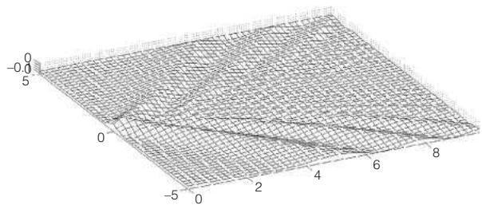

line

| Theta (degree) | C_WP     |
| -------------- | -------- |
| 30             | 0.0000   |
| 40             | 0.0009   |
| 50             | 0.0005   |
| 60             | 0.0002   |
| 70             | 0.0001   |
| 80             | 0.0001   |
| 90             | 0.0001   |

Figure 9.4. Examples of thin ship theory predictions of wave elevation and wave energy distribution.

# 9.5.3 Modifications to the Basic Theory

The basic theory was modified in order to facilitate the insertion of additional sources and sinks to simulate local pressure changes. These could be used, for example, to represent the transom stern, a bulbous bow and other discontinuities on the hull.

It had been noted from model tests and full-scale operation that trim and, hence, transom immersion can have a significant influence on the wave pattern and consequently on the wave resistance and wave wash. An important refinement to the basic theory, and a requirement of all wave resistance and wave wash theories, therefore does concern the need to model the transom stern in a satisfactory manner. A popular and reasonably satisfactory procedure had been to apply a hydrostatic $( \rho g H _ { T } )$ transom resistance correction [9.33]. Whilst this gives a reasonable correction to the resistance, it does not do so by correcting the wave system and is therefore not capable of predicting the wave pattern correctly. The creation of a virtual stern and associated source strengths [9.31] and [9.34] has been found to provide the best results in terms of wave pattern resistance and the prediction of wash waves.

# 9.5.4 Example Results

Examples of predicted wave patterns and distributions of wave energy using thin ship theory are shown in Figure 9.4 [9.35]. These clearly show the effects of shallow water on the wave system and on the distribution of wave energy, see Chapter 7, Section 7.3.4.6. These results were found to correlate well with measurements of wave height and wave resistance [9.35].

Table 9.2. Computational parameters applied to the self-propulsion of the KVLCC2 

<table><tr><td>Parameter</td><td>Setting</td></tr><tr><td>Computing</td><td>64-bit desktop PC 4 GB of RAM</td></tr><tr><td>No. of elements</td><td>Approx. 2 million</td></tr><tr><td>Mesh type</td><td>Unstructured -hybrid (tetrahedra/prism)</td></tr><tr><td>Turbulence model</td><td>Shear stress transport</td></tr><tr><td>Advection scheme</td><td>CFX high resolution</td></tr><tr><td>Convergence control</td><td>RMS residual  $<10^{-5}$ </td></tr><tr><td>Pseudo time step</td><td>Automatic</td></tr><tr><td>Simulation time</td><td>Typically 5 hours</td></tr><tr><td>Wall modelling</td><td>CFX automatic wall modelling</td></tr><tr><td> $y^{+}$ </td><td>~30</td></tr></table>

# 9.6 Estimation of Ship Self-propulsion Using RANS

# 9.6.1 Background

It is possible to model the performance of a ship propeller using a solution of the RANS equation, see Chapter 15. In practice this is a computationally expensive process, and it can often be more effective to represent the integrating effect of the propeller on the hull nominal wake. The process couples a RANS solution of the flow over the hull with a propeller analysis tool, see Chapter 15, that evaluates the axial and momentum changes for a series of annuli, typically 10–20. These momentum changes are then used as appropriate body force $\{ f _ { x } , f _ { y } , f _ { z } \}$ terms over the region of the propeller and the RANS equations resolved. If necessary, this process can be repeated until no significant changes in propeller thrust occur [9.36].

There are a number of alternative methods of evaluating the propeller momentum sources [9.37]. These range from a straightforward specified constant thrust, an empirically based thrust distribution through to distribution of axial and angular momentum derived from the methods described in Chapter 15. In the following example the fluid flow around the KVLCC2 hull form has been modelled using the commercial finite-volume code [9.38]. The motion of the fluid is modelled using the incompressible isothermal RANS equations (9.4) in order to determine the Cartesian flow (u, v, w) and pressure (p) field of the water around the KVLCC2 hull and rudder. Table 9.2 gives details of the computational model applied. Blade element-momentum theory (BEMT), as detailed in Section 15.5, is applied to evaluate the propeller performance.

# 9.6.2 Mesh Generation

A hybrid finite-volume unstructured mesh was built using tetrahedra in the far field and inflated prism elements around the hull with a first element thickness equating to a $y ^ { + } = 3 0$ , with 10–15 elements capturing the boundary layer of both hull and rudder. Separate meshes were produced for each rudder angle using a representation of the skeg (horn) rudder with gaps between the movable and fixed part of the rudder. Examples of various areas of the generated mesh are shown in Figure 9.5.

Full domain   

natural_image

Abstract geometric pattern with triangular and polygonal shapes, no text or symbols present

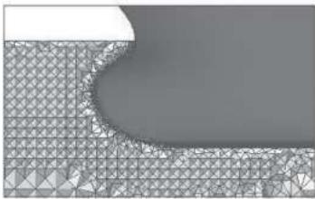

natural_image

Abstract geometric pattern with triangular and polygonal shapes, no text or symbols present

Bow

natural_image

Abstract geometric pattern with triangular and polygonal shapes, no text or symbols present

Stern   
Figure 9.5. Mesh generated around KVLCC2.

# 9.6.3 Boundary Conditions

The solution of the RANS equations requires a series of appropriate boundary conditions to be defined. The hull is modelled using a no-slip wall condition. A Dirichlet inlet condition, one body length upstream of the hull, is defined where the inlet velocity and turbulence are prescribed explicitly. The model scale velocity is replicated in the CFD analyses and inlet turbulence intensity is set at 5%. A mass flow outlet is positioned $3 \times { \cal L } _ { B P }$ downstream of the hull. The influence of the tank cross section (blockage effect) on the self-propulsion is automatically included through use of sidewall conditions with a free-slip wall condition placed at the locations of the floor and sides of the tank (16 m wide × 7 m deep) to enable direct comparison with the experimental results without having to account for blockage effects. The influence of a free surface is not included in these simulations due to the increase in computational cost, and the free surface is modelled with a symmetry plane. The Froude number is sufficiently low, $F r = 0 . 1 4$ , that this is a reasonable assumption.

Figure 9.6 shows an example including the free-surface flow in the stern region of a typical container ship (Korean container ship) with and without the application of a self-propulsion propeller model where free-surface effects are much more important. A volume of fluid approach is used to capture the free-surface location. The presence of the propeller influences the wave hump behind the stern and hence alters the pressure drag.

# 9.6.4 Methodology

In placing the propeller at the stern of the vessel the flow into the propeller is modified compared with the open water, see Chapter 8. The presence of the hull boundary layer results in the average velocity of the fluid entering the propeller disc $( V _ { A } )$ varying across the propeller disc. The propeller accelerates the flow ahead of itself, increasing the rate of shear in the boundary layer, leading to an increase in the skin friction resistance, and reducing the pressure over the rear of the hull, leading to an increase in pressure drag and a possible suppression of flow separation. Within the RANS mesh the propeller is represented as a cylindrical subdomain with a diameter equal to that of the propeller. The subdomain is divided into a series of ten annuli corresponding to ten radial slices (dr) along the blade. The appropriate momentum source terms from BEMT, a and a′ in Section 15.5.5, are then applied over the subdomain in cylindrical co-ordinates to represent the axial and tangential influence of the propeller.

natural_image

3D surface plot with contour lines and grid overlay, showing a curved structural element (no text or symbols)

(a)

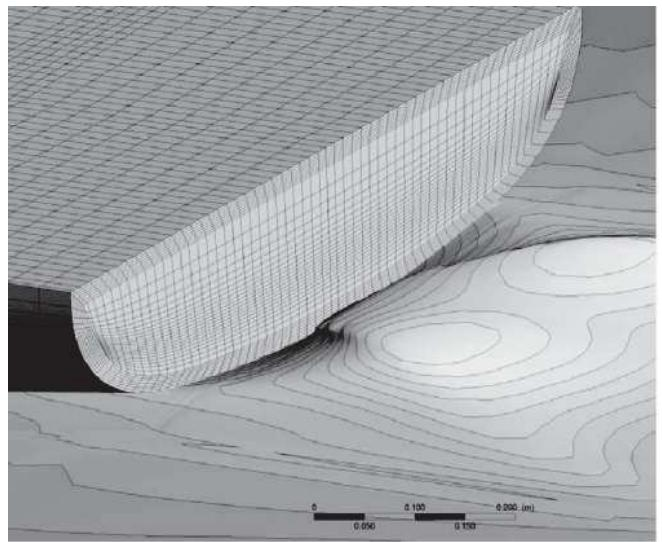

natural_image

3D surface plot of a mechanical component with grid overlay and contour lines, showing no text or symbols

(b)   
Figure 9.6. RANS CFD solution using ANSYS CFX v.12 [9.38] capturing the free-surface contours at the stern of the Korean container ship (KCS). (a) Free surface with propeller. (b) Free surface without propeller.

Table 9.3. Force components for self-propulsion with rudder at $1 0 ^ { o }$ 

<table><tr><td></td><td>Towing tank</td><td>Fine 2.1 M</td><td>Medium 1.5 M</td><td>Coarse 1.05 M</td></tr><tr><td>Longitudinal force, X (N)</td><td>-11.05</td><td>-11.74</td><td>-12.60</td><td>-13.82</td></tr><tr><td>Transverse force, Y (N)</td><td>6.79</td><td>7.6</td><td>7.51</td><td>7.33</td></tr><tr><td>Yaw moment, N (Nm)</td><td>-19.47</td><td>-18.75</td><td>-18.70</td><td>-18.35</td></tr><tr><td>Thrust, T (N)</td><td>10.46</td><td>12.53</td><td>12.37</td><td>12.08</td></tr><tr><td>Rudder X force, Rx (N)</td><td>-2.02</td><td>-1.83</td><td>-1.89</td><td>-1.94</td></tr><tr><td>Rudder Y force, Ry (N)</td><td>4.32</td><td>4.94</td><td>4.99</td><td>4.88</td></tr></table>

The following procedure is used to calculate the propeller performance and replicate it in the RANS simulations.

1. An initial converged stage of the RANS simulation (RMS residuals $< 1 \times 1 0 ^ { - 5 } )$ ) of flow past the hull is performed, without the propeller model. The local nominal wake fraction, $w _ { T } ^ { \prime } .$ , is then determined for each annulus by calculating the average circumferential mean velocity at the corresponding annuli, as follows:

$$
w _ {T} ^ {\prime} = \frac {1}{2 \pi r} \int_ {0} ^ {2 \pi} \left(1 - \frac {U}{V _ {A}}\right) r d \theta , \tag {9.10}
$$

where U is the axial velocity at a given r and θ .

2. A user specified Fortran module is used to export the set of local axial wake fractions to the BEMT code.   
3. The BEMT code is used to calculate the thrust $( d K _ { T } )$ and torque $( d K _ { Q } )$ for the 10 radial slices based on ship speed, the local nominal wake fraction and the propeller rpm.   
4. The local thrust and torque derived by the BEMT code are assumed to act uniformly over the annulus corresponding to each radial slice. The thrust is converted to axial momentum sources (momentum/time) distributed over the annuli by dividing the force by the volume of annuli. The torque is converted to tangential momentum sources by dividing the torque by the average radius of the annulus and the volume of the annulus.   
5. These momentum sources are then returned to the RANS solver by a user Fortran Module which distributes them equally over the axial length of the propeller disc.   
6. The RANS simulation is then restarted from the naked hull solution but now with the additional momentum sources. The final solution is assumed to have converged when the RMS residuals $< 1 \times 1 0 ^ { - 5 }$ .

Further refinements to the model add an iterative loop that uses the solution found in stage 6 by re-entering the wake fractions at stage 2 and, for manoeuvring use, a series of circumferential sectors to examine the influence of cross flow [9.36].

# 9.6.5 Results

As an example, the self-propulsion performance of the KVLCC2 hull is evaluated at model scale. The full-size ship design is 320 m and is modelled at 1:58 scale. A four bladed fixed-pitch propeller with $P / D = 0 . 7 2 1$ and diameter of 9.86 m is used. The model propeller is operated at 515 rpm, the equivalent of full-scale self-propulsion. The advantage of the BEMT approach is that the influence of the rudder on propeller performance can be accurately captured [9.39]. Table 9.3 identifies the influence of mesh resolution on the evaluation of various force components. The finest mesh has 2.1M FV cells and a rudder angle of 10◦ is used. Convergent behaviour can be seen for all force components. Using the fine mesh, Table 9.4 illustrates the influence of the rudder on the self-propulsion point of the model. Figure 9.7 shows the influence of the propeller model on streamlines passing through the propeller disk.

Table 9.4. Influence of the rudder on propeller performance at the model self-propulsion point [9.36] 

<table><tr><td></td><td>CFD – no rudder</td><td>CFD – rudder</td></tr><tr><td>Wake fraction,  $w_{t}$ </td><td>0.467</td><td>0.485</td></tr><tr><td>Thrust deduction factor,  $t$ </td><td>0.326</td><td>0.258</td></tr><tr><td>Rpm at model self-propulsion point</td><td>552</td><td>542</td></tr><tr><td>Advance coefficient,  $J$ </td><td>0.357</td><td>0.351</td></tr><tr><td>Thrust coefficient,  $K_{T}$ </td><td>0.226</td><td>0.233</td></tr><tr><td>Torque coefficient,  $K_{Q}$ </td><td>0.026</td><td>0.027</td></tr><tr><td>Efficiency,  $\eta$ </td><td>0.494</td><td>0.482</td></tr></table>

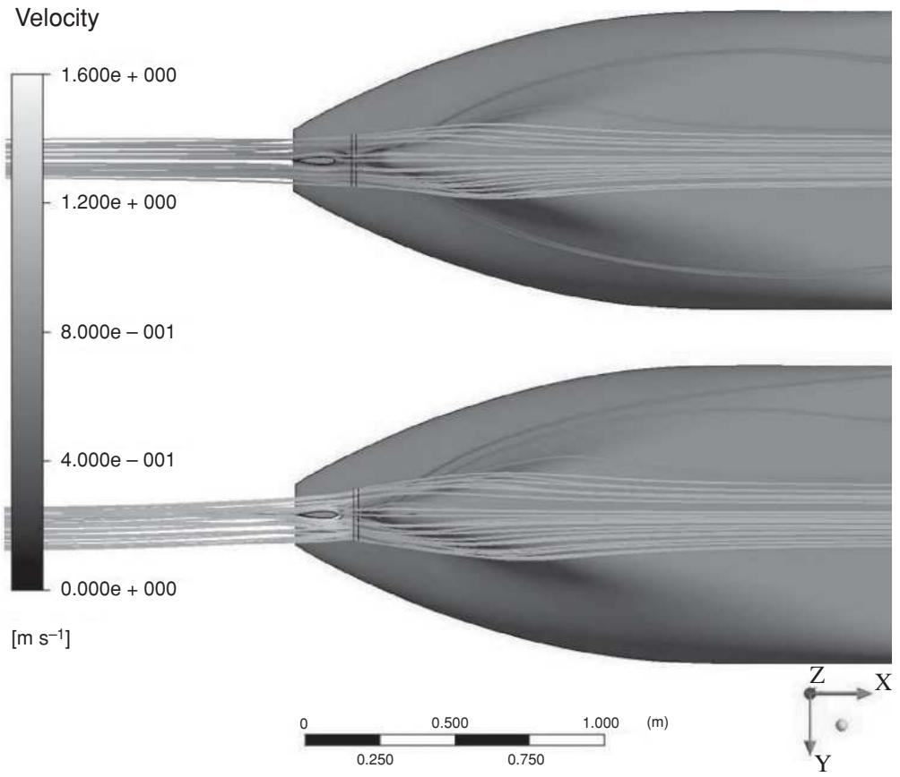

other

| Velocity Range         | [m s⁻¹] Value |
| ---------------------- | ------------- |
| 1.600e + 000           | ~1.600        |
| 1.200e + 000           | ~1.200        |
| 8.000e - 001           | ~8.000        |
| 4.000e - 001           | ~4.000        |
| 0.000e + 000           | ~0.000        |

Figure 9.7. Comparison of streamlines passing through the propeller disc for the appended hull, no propeller model (top), and with propeller model on (bottom) [9.36].

# 9.7 Summary

It is clear that numerical methods will provide an ever increasing role in the design of new ship hull forms. Their correct application will always rely on the correct interpretation of their result to the actual full-scale ship operating condition. It should also be recognised that a fully automated ship optimisation process will remain a computationally costly process. A range of computational tools ranging from simple thin ship theory and surface panel codes through to a self-propelled ship operating in a seaway solved using an unsteady RANS method will provide the designer with a hierarchical approach that will prove more time- and cost-effective.

# REFERENCES (CHAPTER 9)

9.1 Ferziger, J.H. and Peric, M. Computational Methods for Fluid Dynamics. Axel-Springer Verlag, Berlin, 2002.   
9.2 Best Practice Guidelines for Marine Applications of Computational Fluid Dynamics, W.S. Atkins Ltd., Epsom, UK, 2003.   
9.3 Molland, A.F. and Turnock, S.R., Marine Rudders and Control Surfaces. Butterworth-Heinemann, Oxford, UK, 2007, Chapter 6. pp. 233–31.   
9.4 Larsson, L. SSPA-ITTC Workshop on Ship Boundary Layers. SSPA Publication No. 90, Ship Boundary Layer Workshop Goteburg, 1980. ¨   
9.5 Larsson, L., Patel, V., Dyne, G. (eds.) Proceedings of the 1990 SSPA-CTH-IIHR Workshop on Ship Viscous Flow. Flowtech International Report No. 2, 1991.   
9.6 Kodama, Y., Takeshi, H., Hinatsu, M., Hino, T., Uto, S., Hirata, N. and Murashige, S. (eds.) Proceedings, CFD Workshop. Ship Research Institute, Tokyo, Japan. 1994.   
9.7 Tahara, Y. and Stern, F. A large-domain approach for calculating ship boundary layers and wakes and wave fields for nonzero Froude number. Journal of Computational Physics, Vol. 127, 1996, pp. 398–411.   
9.8 Larsson, L., Stern F. and Bertram V. (eds.) Gothenburg 2000 a Workshop on Numerical Ship Hydrodynamics. Chalmers University of Technology, CHA/NAV/R-02/0073, 2000.   
9.9 Larsson, L., Stern, F. and Bertram, V. Benchmarking of computational fluid dynamics for ship flows: the Gothenburg 2000 workshop. Journal of Ship Research, Vol. 47, No. 1, March 2003, pp. 63–81.   
9.10 Hino, T. Proceedings of the CFD Workshop Tokyo. National Maritime Institute of Japan, 2005.   
9.11 Landweber, L. and Patel V.C. Ship boundary layers. Annual Review of Fluid Mechanics, Vol. 11, 1979, pp. 173–205.   
9.12 Wilson, R.V., Carrica, P.M. and Stern, F. Simulation of ship breaking bow waves and induced vortices and scars. International Journal of Numerical Methods in Fluids, Vol. 54, pp. 419–451.   
9.13 Batchelor, G.K. An Introduction to Fluid Dynamics. Cambridge University Press, Cambride, UK, 1967.   
9.14 Wilcox, D.C. Turbulence Modeling for CFD. 2nd Edition DCW Industries, La Canada, CA, 1998.   
9.15 Pattenden, R.J., Bressloff, N.W., Turnock, S.R. and Zhang, X. Unsteady simulations of the flow around a short surface-mounted cylinder. International Journal for Numerical Methods in Fluids, Vol. 53, No. 6, 2007, pp. 895–914.

9.16 Hess, J.L. Panel methods in computational fluid dynamics. Annual Review of Fluid Mechanics, Vol. 22, 1990, pp. 255–274.   
9.17 Katz, J. and Plotkin, A. Low Speed Aerodynamics: From Wing Theory to Panel Methods, Mcgraw-Hill, New York, 1991.   
9.18 Hirt, C.W. and Nicolls, B.D. Volume of fluid (VOF) method for the dynamics of free boundaries. Journal of Computational Physics, Vol. 39, No. 1, January 1981, pp. 201–225.   
9.19 Sethian, J.A. and Smereka, P. Level set method for fluid interfaces. Annual Review of Fluid Mechanics, Vol. 35, 2003, pp. 341–372.   
9.20 Farmer, J., Martinelli, L. and Jameson, A. A fast multigrid method for solving incompressible hydrodynamic problems with free surfaces, AIAA-93-0767, pp. 15.   
9.21 Newman, J. Marine Hydrodynamics. MIT Press, Cambridge, MA, 1977.   
9.22 Godderidge, B., Turnock, S.R., Earl, C. and Tan, M. The effect of fluid compressibility on the simulation of sloshing impacts. Ocean Engineering, Vol. 36, No. 8, 2009, pp. 578–587.   
9.23 Godderidge, B., Turnock, S.R., Tan, M. and Earl, C. An investigation of multiphase CFD modelling of a lateral sloshing tank. Computers and Fluids, Vol. 38, No. 2, 2009, pp.183–193.   
9.24 Gleick, J. Chaos, the Amazing Science of the Unpredictable. William Heinemann, Portsmouth, NH, 1988.   
9.25 Wright, A.M. Automated adaptation of spatial grids for flow solutions around marine bodies of complex geometry. Ph.D. thesis, University of Southampton, 2000.   
9.26 Thompson, J.F., Soni, B.K. and Weatherill, N.P. (eds.) Handbook of Grid Generation, CRC Press, Boca Raton, FL, 1998.   
9.27 Nowacki, H., Bloor, M.I.G. and Oleksiewicz, B. (eds.) Computational geometry for ships, World Scientific Publishing, London, 1995.   
9.28 CFD Online. www.cfd-online.com Last accessed May 2010.   
9.29 Insel, M. An investigation into the resistance components of high speed displacement catamarans. Ph.D. thesis, University of Southampton, 1990.   
9.30 Couser, P.R. An investigation into the performance of high-speed catamarans in calm water and waves. Ph.D. thesis, University of Southampton, 1996.   
9.31 Couser, P.R., Wellicome, J.F. and Molland, A.F. An improved method for the theoretical prediction of the wave resistance of transom stern hulls using a slender body approach. International Shipbuilding Progress, Vol. 45, No. 444, 1998, pp. 331–349.   
9.32 ShipShape User Manual, Wolfson Unit MTIA, University of Southampton, 1990.   
9.33 Insel, M., Molland, A.F. and Wellicome, J.F. Wave resistance prediction of a catamaran by linearised theory. Proceedings of Fifth International Conference on Computer Aided Design, Manufacture and Operation, CADMO’94. Computational Mechanics Publications, Southampton, UK, 1994.   
9.34 Doctors, L.J. Resistance prediction for transom-stern vessels. Proceedings of Fourth International Conference on Fast Sea Transportation, FAST’97, Sydney, 1997.   
9.35 Molland, A.F., Wilson, P.A. and Taunton, D.J. Theoretical prediction of the characteristics of ship generated near-field wash waves. Ship Science Report No. 125, University of Southampton, November 2002.   
9.36 Phillips, A.B. Simulations of a self propelled autonomous underwater vehicle, Ph.D. thesis, University of Southampton, 2010.   
9.37 Phillips, A.B., Turnock, S.R. and Furlong, M.E. Evaluation of manoeuvring coefficients of a self-propelled ship using a blade element momentum propeller model coupled to a Reynolds averaged Navier Stokes flow solver. Ocean Engineering, Vol. 36, 2009, pp. 1217–1225.

9.38 Ansys CFX User Guide v11, Ansys, Canonsburg, PA, 2007.   
9.39 Phillips, A.B., Turnock, S.R. and Furlong, M.E. Accurate capture of rudderpropeller interaction using a coupled blade element momentum-RANS approach. Ship Technology Research (Schiffstechnik), Vol. 57, No. 2, 2010, pp. 128–139.

# 10 Resistance Design Data

# 10.1 Introduction

Resistance data suitable for power estimates may be obtained from a number of sources. If model tests are not carried out, the most useful sources are standard series data, whilst regression analysis of model resistance test results provides a good basis for preliminary power estimates. Numerical methods can provide useful inputs for specific investigations of hull form changes and this is discussed in Chapter 9. Methods of presenting resistance data are described in Section 3.1.3. This chapter reviews sources of resistance data. Design charts or tabulations of data for a number of the standard series, together with coefficients of regression analyses, are included in Appendix A3.

# 10.2 Data Sources

# 10.2.1 Standard Series Data

Standard series data result from systematic resistance tests that have been carried out on particular series of hull forms. Such tests entail the systematic variation of the main hull form parameters such as $C _ { B } , L / \nabla ^ { 1 / 3 }$ , $B / T$ and LCB. Standard series tests provide an invaluable source of resistance data for use in the power estimate, in particular, for use at the early design stage and/or when model tank tests have not been carried out. The data may typically be used for the following:

(1) Deriving power requirements for a given hull form,   
(2) Selecting suitable hull forms for a particular task, including the investigation of the influence of changes in hull parameters such as $C _ { B }$ and $B / T ,$ , and as   
(3) A standard for judging the quality of a particular (non-series) hull form.

Standard series data are available for a large range of ship types. The following section summarises the principal series. Some sources are not strictly series data, but are included for completeness as they make specific contributions to the database. Design data, for direct use in making practical power predictions, have been extracted from those references marked with an asterisk ∗. These are described in Section 10.3.

# 10.2.1.1 Single-Screw Merchant Ship Forms

Series 60 [10.1], [10.2], [10.3]∗.

British Ship Research Association (BSRA) Series [10.4], [10.5], [10.6]∗.

Statens Skeppsprovingansalt (SSPA) series [10.7], [10.8].

Maritime Administration (US) MARAD Series [10.9].

# 10.2.1.2 Twin-Screw Merchant Ship Forms

Taylor–Gertler series [10.10]∗.

Lindblad series [10.11], [10.12].

Zborowski Polish series [10.13]∗.

# 10.2.1.3 Coasters

Dawson series [10.14], [10.15], [10.16], [10.17].

# 10.2.1.4 Trawlers

BSRA series [10.18], [10.19], [10.20], [10.21].

Ridgely–Nevitt series [10.22], [10.23], [10.24].

# 10.2.1.5 Tugs

Parker and Dawson tug investigations [10.25].

Moor tug investigations [10.26].

# 10.2.1.6 Semi-displacement Forms, Round Bilge

SSPA Nordstrom [10.27]. ¨

SSPA series, Lindgren and Williams [10.28].

Series 63, Beys [10.29].

Series 64, Yeh [10.30] ∗, [10.31], [10.32], [10.33].

National Physical Laboratory (NPL) series, Bailey [10.34]∗.

Semi-planing series, Compton [10.35].

High-speed displacement hull forms, Robson [10.36].

Fast transom-stern hulls, Lahtiharju et al. [10.37].

SKLAD semi-displacement series, Gamulin [10.38], Radojcic et al. [10.39].

# 10.2.1.7 Semi-displacement Forms, Double Chine

National Technical University of Athens (NTUA) Series, Radojcic et al. [10.40] ∗, Grigoropoulos and Loukakis [10.41].

# 10.2.1.8 Planing Hulls

Series 62, Clement and Blount, [10.42] , Keuning and Gerritsma [10.43].

United States Coast Guard (USCG) series, Kowalyshyn and Metcalf, [10.44].

Series 65, Hadler et al. [10.45].

Savitsky et al. [10.46], [10.47], [10.48]∗, [10.49].

# 10.2.1.9 Multihulls

Southampton catamaran series. Insel and Molland et al. [10.50], [10.51]∗, [10.52], [10.53].

Other multihull data, Steen, Cassella, Bruzzone et al. [10.54]–[10.58].

Versuchsanstalt fur Wasserbau und Schiffbau Berlin (VWS) catamaran series, ¨ Muller-Graf [10.59], Zips, [10.60] ¨ ∗, Muller-Graf and Radojcic, [10.61]. ¨

# 10.2.1.10 Yachts

Delft series. Gerritsma and Keuning et al. [10.62] to [10.67]∗.

# 10.2.2 Other Resistance Data

Average -C data, Moor and Small [10.70]∗.

Tanker and bulk carrier forms. Moor [10.71].

0.85 Block coefficient series, Clements and Thompson [10.72], [10.73].

Fractional draught data, Moor and O’Connor [10.74]∗.

Regressions:

Sabit regressions: BSRA series [10.75]∗, Series 60, [10.76]∗ and SSPA series [10.77].

Holtrop and Mennen [10.78], [10.79], [10.80], [10.81]∗.

Hollenbach [10.82]∗.

Radojcic [10.83], [10.84]∗.

Van Oortmerssen, small craft [10.85] .

Robinson, Wolfson Unit for Marine Technology and Industrial Aerodynamics (WUMTIA) small craft [10.86]∗.

# 10.2.3 Regression Analysis of Resistance Data

If sufficient data for a large number of independent designs exist in a standard form (e.g. from tests on models of similar size in one towing tank), then statistical treatment (regression analysis) gives an alternative to standard series which in principle allows the evaluation of optimum parameter combinations free from artificial constraints.

Regression methods can only be applied in the long term to ships of closely similar type since upwards of 150 models may be required to provide an adequate analysis of non-linear combinations of parameters. Typical regressions of note include those reported in [10.75–10.91] and the results of some of these are discussed in Section 10.3.

A typical set of variables for ship resistance regression analysis might be as follows:

$$
C _ {T} = f \big [ C _ {B}, L \nabla^ {1 / 3}, B / T, L C B, \frac {1}{2} \alpha_ {E} \mathrm{etc.} \big ]
$$

The references indicate the scope of published work on regression analysis. For example, Sabit’s regression of the BSRA series [10.75], uses:

$$
C R _ {4 0 0} = f [ L / \nabla^ {1 / 3}, B / T, C _ {B}, L C B ]
$$

where

$$
C R = \frac {R \cdot L}{\Delta \cdot V ^ {2}} \text { and } C R = 2. 4 9 3 8 Ⓒ L / \nabla^ {1 / 3}
$$

for each speed increment, and for three draught values (per series)

$$
\text { and } \quad C R _ {4 0 0} = a _ {1} + a _ {2} L / \nabla^ {1 / 3} + a _ {3} B / T + \dots .. a _ {6} (L / \nabla^ {1 / 3}) ^ {2} + a _ {7} (B / T) ^ {2} + \dots ..
$$

and coefficients $a _ { n }$ are published for each speed and draught.

scatter

| CB    | LCB   |
|-------|-------|
| 0.5   | -2%   |
| 0.6   | -1%   |
| 0.7   | 0%    |
| 0.8   | 1%    |

Figure 10.1. Typical limitations of database.

Holtrop [10.81] breaks down the resistance into viscous and wave, and includes speed $( F r )$ in the analysis. $C _ { F } ( 1 + k )$ is derived using the International Towing Tank Conference (ITTC) $C _ { F }$ line and $( 1 + k )$ by regression. $C _ { W }$ is based on Havelock’s wavemaking theory:

$$
R _ {w} / \Delta = C _ {1} e ^ {- m F r * * - 2 / 9} + e ^ {- F r * * - 2} \{C _ {2} + C _ {3} \cos (\lambda F r ^ {- 2}) \}
$$

$C _ { 1 } , C _ { 2 } , C _ { 3 , } \lambda$ and m are coefficients which depend on hull form and are derived by regression analysis.

Molland and Watson [10.90] use $\begin{array} { r } { \bigodot = f [ L / B , B / T , C _ { B } , L C B , \ : 1 / _ { 2 } \alpha _ { E } ] } \end{array}$ at each speed increment.

Lin et al. [10.91] include the slope properties of the sectional area curve in the $C _ { W }$ formulation.

The limitations of regression analysis are the following:

1. Analysis data should be for the correct ship type   
2. Note the ‘statistical quality’ of the data, such as standard error   
3. Great care must be taken that the prediction is confined to the limits of the database, in particular, where such a regression is used for hull form optimisation

Predictions should not be made for unrealistic combinations of hull parameters. For example, simply stating the limits as $0 . 5 < C _ { B } < 0 . 8$ and $- 2 \% < \mathrm { L C B } < + 2 \%$ may not be satisfactory, as the actual source data will probably be made up as shown in Figure 10.1. In other words, the regression should not be used, for example, to predict results for a hull form with a block coefficient $C _ { B }$ of 0.8 and an LCB of −2%L (2% aft).

# 10.2.4 Numerical Methods

Viscous resistance and wave resistance may be derived by numerical and theoretical methods. Such methods provide a powerful tool, allowing parametric changes in hull form to be investigated and the influence of Reynolds number to be explored. Raven et al. [10.92] describe a computational fluid dynamics (CFD)-based prediction of resistance, including an investigation of scale effects. CFD and numerical methods are outlined in Chapter 9.

contour

| Contour Line | Label         | Value     |
| ------------ | ------------- | --------- |
| 1/2          |               |           |
| 1            |               |           |
| 2            |               |           |
| 3            |               |           |
| 4            |               |           |
| 5            |               |           |
| 6            | 4 FT WL       |           |
| 7            | 4 FT WL       |           |
| 8            | 10 FT WL      |           |
| 9            | 22 FT WL      |           |
| 10           | 10 FT WL      |           |
| 11           | 26 FT WL (load)|           |
| 12           | 30 FT WL      |           |
| 13           | 34 FT WL      |           |
| 14           |               |           |
| 15           |               |           |
| 16           |               |           |
| 17           |               |           |
| 18           |               |           |
| 19           |               |           |
| 20           |               |           |
| 21           |               |           |
| 22           |               |           |
| 23           |               |           |
| 24           |               |           |
| 25           |               |           |
| 26           |               |           |
| 27           |               |           |
| 28           |               |           |
| 29           |               |           |
| 30           |               |           |
| 31           |               |           |
| 32           |               |           |
| 33           |               |           |
| 34           |               |           |
| 35           |               |           |
| 36           |               |           |
| 37           |               |           |
| 38           |               |           |
| 39           |               |           |
| 40           |               |           |
| 41           |               |           |
| 42           |               |           |
| 43           |               |           |
| 44           |               |           |
| 45           |               |           |
| 46           |               |           |
| 47           |               |           |
| 48           |               |           |
| 49           |               |           |
| 50           |               |           |
| 51           |               |           |
| 52           |               |           |
| 53           |               |           |
| 54           |               |           |
| 55           |               |           |
| 56           |               |           |
| 57           |               |           |
| 58           |               |           |
| 59           |               |           |
| 60           |               |           |
| 61           |               |           |
| 62           |               |           |
| 63           |               |           |
| 64           |               |           |
| 65           |               |           |
| 66           |               |           |
| 67           |               |           |
| 68           |               |           |
| 69           |               |           |
| 70           |               |           |
| 71           |               |           |
| 72           |               |           |
| 73           |               |           |
| 74           |               |           |
| 75           |               |           |
| 76           |               |           |
| 77           |               |           |
| 78           |               |           |
| 79           |               |           |
| 80           |               |           |
| 81           |               |           |
| 82           |               |           |
| 83           |               |           |
| 84           |               |           |
| 85           |               |           |
| 86           |               |           |
| 87           |               |           |
| 88           |               |           |
| 89           |               |           |
| 90           |               |             |
| 91           |               |             |
| 92           |               |             |
| 93           |               |             |
| 94           |               |             |
| 95           |               |             |
| 96           |               |             |
| 97           |               |             |
| 98           |               |             |
| 99           |               |             |
| 100          |               |             |
The chart displays a contour plot of the data points along the x-axis (labeled 'FP' to 'AP') and the y-axis (labeled '30' to '34') with corresponding labels. There are no additional data series in this view.

Figure 10.2. BSRA series body plan $C _ { B } = 0 . 6 5$ .

# 10.3 Selected Design Data

# 10.3.1 Displacement Ships

# 10.3.1.1 BSRA Series

This series, suitable for single-screw merchant ships, was developed by the British Ship Research Association during the 1950s and 1960s.

The data for the BSRA series are summarised in [10.4, 10.5, 10.6]. These include full details of the body plans for the series, together with propulsion data. An example of a body plan for the series is shown in Figure 10.2 and the series covers the following range of speeds and hull parameters:

${ \mathrm { S p e e d : ~ } } V _ { k } / { \sqrt { L _ { f } : 0 . 2 0 { - } 0 . 8 5 \left( V _ { k } \mathrm { ~ k n o t s , ~ } L _ { f } \mathrm { ~ f t } \right) [ F r { \mathrm { : ~ } } 0 . 0 6 { - } 0 . 2 5 ] } } .$

$C _ { B } \colon 0 . 6 0 - 0 . 8 5 ; B / T \colon 2 - 4 ; L / \nabla ^ { 1 / 3 } \colon 4 . 5 - 6 . 5 ; L C B \colon - 2 ^ { \circ } \circ L - + 2 ^ { \circ } \circ L .$

$\begin{array} { r } { \mathrm { O u t p u t : } \textcircled { \textmd C } _ { 4 0 0 } = \frac { 5 7 9 . 8 P _ { E } } { \Delta ^ { 2 / 3 } V ^ { 3 } } . } \end{array}$ Output: -C 400 = 579.8 PE

$\textcircled{ C} _ { 4 0 0 }$ values are presented for a standard ship with dimensions (ft): $4 0 0 \times 5 5 \times 2 6$ (load draught) and standard $L C B = 2 0 ( C _ { B } - 0 . 6 7 5 )$ %L forward of amidships, and at reduced draughts (ft) of 21, 16 and 16 trimmed.

The $\textcircled{ C} _ { 4 0 0 }$ data (for a 400 ft ship) are presented to a base of $C _ { B }$ for a range of speeds, as shown for the 26 ft load draught in Figure 10.3.

Charts are provided to correct changes from the standard ship dimensions to the actual ship for $B / T ,$ , LCB and $L / \nabla ^ { 1 / 3 }$ . Examples of these corrections are shown in Figure 10.4.

A skin friction correction $\delta \mathcal { O }$ must be applied to correct the 400 ft (122 m) ship value to the actual ship length value $\textcircled{ C} _ { s }$ as follows:

$$
Ⓒ _ {s} = ⓒ _ {4 0 0} \pm \delta ⓒ.
$$

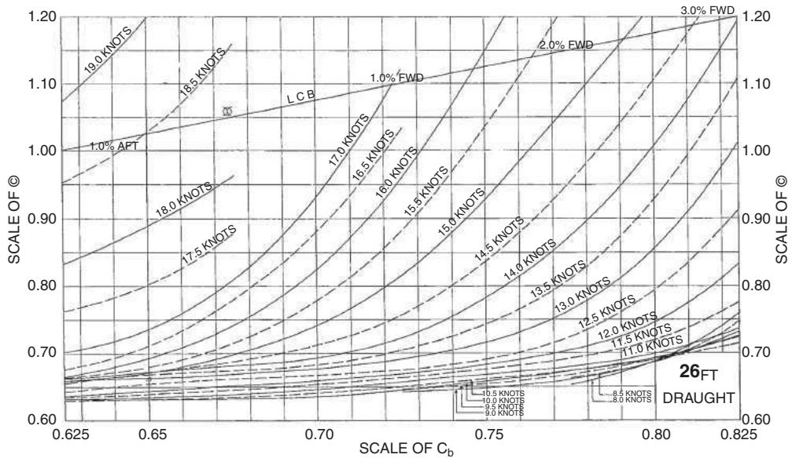

line

| SCALE OF Cb | SCALE OF © | FWD (%) | Knot Count |
|-------------|------------|---------|------------|
| 0.625       | 1.00       | 1.0     | 19.0       |
| 0.65        | 1.05       | 1.0     | 18.5       |
| 0.70        | 1.10       | 1.0     | 17.0       |
| 0.75        | 1.15       | 1.0     | 16.5       |
| 0.80        | 1.20       | 1.0     | 16.0       |
| 0.825       | 1.20       | 3.0     | 2.0        |
| 0.825       | 1.20       | 3.0     | 1.0        |
| 0.825       | 1.20       | 3.0     | 1.0        |
| 0.825       | 1.20       | 3.0     | 1.0        |
| 0.825       | 1.20       | 3.0     | 1.0        |
| 0.825       | 1,20       | 3.0     | 19.0       |
| 0.825       | 1,20       | 3.0     | 18.5       |
| 0.825       | 1,20       | 3.0     | 17.5       |
| 0.825       | 1,20       | 3.0     | 17.0       |
| 0.825       | 1,20       | 3.0     | 16.5       |
| 0.825       | 1,20       | 3.0     | 16.0       |
| 0.825       | 1,20       | 3.0     | 15.5       |
| 0.825       | 1,20       | 3.0     | 15.0       |
| 0.825       | 1,20       | 3.0     | 14.5       |
| 0.825       | 1,20       | 3.0     | 14.0       |
| 0.825       | 1,20       | 3.0     | 13.5       |
| 0.825       | 1,20       | 3.0     | 13.0       |
| 0.825       | 1,20       | 3.0     | 12.5       |
| 0.825       | 1,20       | 3.0     | 12.0       |
| 0.825       | 1,20       | 3.0     | 11.5       |
| 0.825       | 1,20       | 3.0     | 11.0       |
| 0.825       | 1,20       | 3.0     | 10.5       |
| 0.825       | 1,20       | 3.0     | 10.0       |
| 0.825       | 1,20       | 3.0     | 9.5        |
| 0.825       | 1,20       | 3.0     | 9.0        |
| 0.825       | 1,20       | 3.0     | 8.5        |
| 0.825       | 1,20       | 3.0     | 8.0        |
| 0.825       | 1,20       | 3.0     | 7.5        |
| 0.825       | 1,20       | 3.0     | 7.0        |
| 0.825       | 1,20       | 3.0     | 6.5        |
| 0.825       | 1,20       | 3.0     | 6.0        |
| 0.825       | 1,20       | 3.0     | -          |
| -           | -          | -       | -          |
| -           | -          | -       | -          |
| -           | -          | -       | -          |
| -           | -          | -       | -          |
| -           | -          | -       | -          |
| -           | -          | -       | -          |
| -           | -          | -       | -          |
| -           | -          | -       | -          |
| -           | ~67        | ~67     | ~67        |
| -           | ~67        | ~67     | ~67        |
| -           | ~67        | ~67     | ~67        |
| -           | ~67        | ~67     | ~67        |
| -           | ~67        | ~67     | ~67        |
| -           | ~67        | ~67     | ~67        |
| -           (not labeled) – SCALE OF ©; SCALE OF ©; SCALE OF ©; L C B; SCALE OF ©; SCALE OF ©; L APT; SCALE OF ©; SCALE OF ©; L APT; SCALE OF ©; L APT; L APT; L APT; L APT; L APT; L APT; L APT; L APT; L APT; L APT; L APT; L APT; L APT; L APT; L APT; L APT; L APT; L APT; L APT; L APT; L APT; L APT; L APT; L APT; L APT; L AMT; SCALE OF ©: SCALE OF ©: SCALE OF ©: SCALE OF ©: SCALE OF ©: SCALE OF ©: SCALE OF ©: SCALE OF ©: SCALE OF ©: SCALE OF ©: SCALE OF ©: SCALE OF ©: SCALE OF ©: SCALE OF ©: SCALE OF ©: SCALE OF ©: SCALE OF ©: SCALE OF ©: SCALE OF ©: SCALE OF ©: SCALE OF ©: SCALE OF ©: SCALE OF ©: SCALE OF ©: SCALE OF ©: SCALE OF © : SCALE OF © : SCALE OF © : SCALE OF © : SCALE OF © : SCALE OF © : SCALE OF © : SCALE OF © : SCALE OF © : SCALE OF © : SCALE OF © : SCALE OF © : SCALE OF © : SCALE OF © : SCALE OF © : SCALE OF © : SCALE OF © : SCALE OF © : SCALE OF © : SCALE OF © : SCALE OF © : SCALE OF © : SCALE OF © : SCALE OF © : SCALE OF © : SCALE OF © / SCALE OF © / SCALE OF © / SCALE OF © / SCALE OF © / SCALE OF © / SCALE OF © / SCALE OF © / SCALE OF © / SCALE OF © / SCALE OF © / SCALE OF © / SCALE OF © / SCALE OF © / SCALE OF © / SCALE OF © / SCALE OF © / SCALE OF © / SCALE OF © / SCALE OF © / SCALE OF © / SCALE of % / % / % / % / % / % / % / % / % / % / % / % / % / % / % / % / % / % / % / % / % / % / % / % / % / % / % / % / % / % / % / % / % / % / % / % / % / % / % / % / % / % / % / % / % / % / % / % / % / % / % (Note: The percentage of % and % of scale of % for the same series) is estimated based on the number of knots in a circle (e.g., “DRAUGHT” or “DRAUGHT”). The chart displays multiple contour lines indicating contours of the plot area under each curve.

Figure 10.3. BSRA $\textcircled{ C} _ { 4 0 0 }$ values to a base of block coefficient.

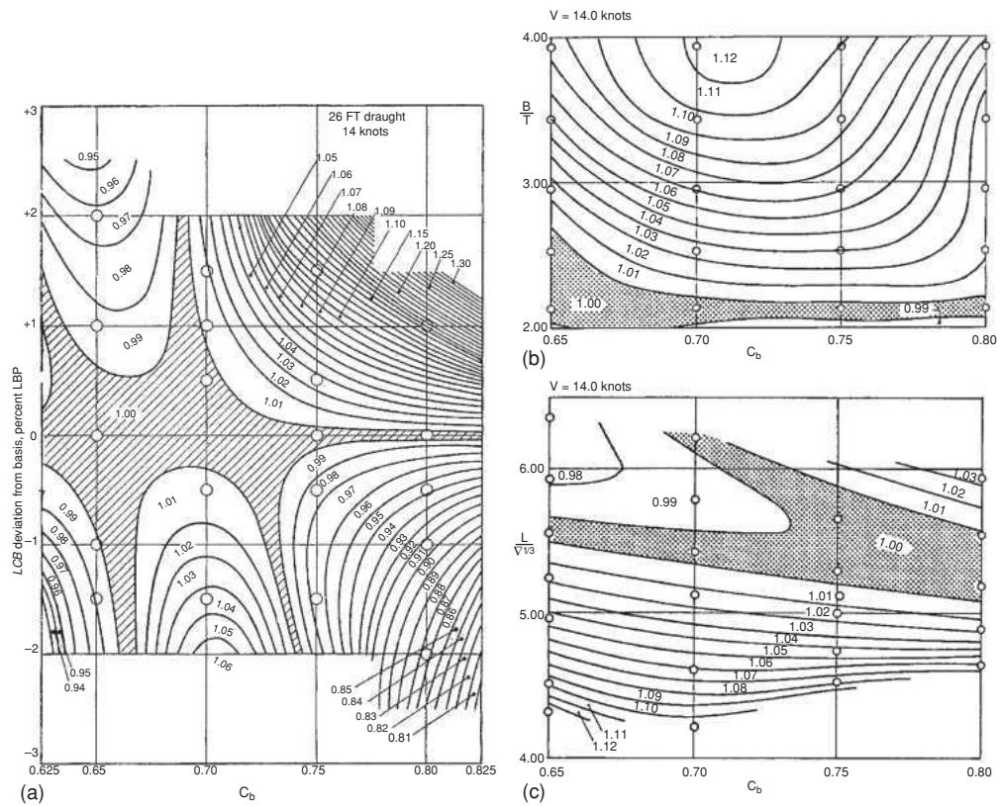  
Figure 10.4. Examples of corrections to BSRA standard values of $\textcircled{ C} _ { 4 0 0 }$

The correction is added for ships <122 m, and subtracted for ships >122 m. Using the Froude $O _ { M }$ and $O _ { S }$ values [10.93], the correction is

$$
\delta Ⓒ = ⓒ _ {4 0 0} - ⓒ _ {s} = (O _ {4 0 0} - O _ {S}) Ⓢ - Ⓛ ^ {- 0. 1 7 5}
$$

where $\mathrm { { ( L ) } } = 1 . 0 5 5 \ : V _ { k } / \surd L _ { f } .$

A chart is provided in [10.4], reproduced in Figure 10.5, which is based on the Froude $O _ { M }$ and $O _ { S }$ values. This allows the $\delta \mathcal { O }$ correction to be derived for ship lengths other than 400 ft (122 m).

Approximations to $\delta \mathcal { O }$ based on Figure 10.5 and a mean $V _ { k } / \sqrt { L _ { f } } = 0 . 7 0$ are as follows:

For $L < 1 2 2 \mathrm { m } , \delta \textcircled { \mathrm { C } }$ is added to $\textcircled{ C} _ { 4 0 0 }$ .

$$
\delta \textcircled {C} = + 0. 5 4 \times (1 2 2 - L) ^ {1. 6 3} \times 1 0 ^ {- 4}. \tag {10.1}
$$

For $L \ge 1 2 2 \mathrm { m } , \delta \textcircled { \mathrm { C } }$ is subtracted from $\textcircled{ C} _ { 4 0 0 }$ .

$$
\delta (\textcircled {C}) = - \frac {0 . 1 0}{1 + \frac {1 8 8}{(L - 1 2 2)}}. \tag {10.2}
$$

When using Equations (10.1) and (10.2), for typical $©$ values of 0.6–0.8, the error in $©$ due to possible error in $\delta \mathcal { O }$ at a ship length of 250 m (820 ft) over the speed range $V _ { k } / \sqrt { L _ { f } } = 0 . 5 – 0 . 9$ is less than 0.5%. At 60 m (197 ft) the error is also less than 0.5%.

Finally, the effective power $P _ { E }$ may be derived using Equation (3.12) as

$$
P _ {E} = Ⓒ _ {s} \times \Delta^ {2 / 3} V ^ {3} / 5 7 9. 8, \tag {10.3}
$$

where $P _ { E }$ is in $k W , \Delta$ is in tonne, V is in knots and using 1 knot 0.5144 m/s.

A ship correlation (or load) factor (SCF), or (1 + x), should be applied using Equation (5.3) as follows:

For $L \ge 1 2 2 \mathrm { m }$

$$
(1 + x) = 1. 2 - \frac {\sqrt {L}}{4 8}. \tag {10.4}
$$

For $L < 1 2 2 \mathrm { m } , ( 1 + x ) = 1 . 0$ is recommended (Table 5.1).

$$
P _ {E \text { ship }} = P _ {E \text { model }} \times (1 + x).
$$

The basic $\textcircled{ C} _ { 4 0 0 }$ values and corrections for $B / T ,$ , LCB and $L / \nabla ^ { 1 / 3 }$ are contained in $[ 1 0 . 4 - 1 0 . 6 ]$ .

BULBOUS BOW. Reference [10.6] contains charts which indicate whether or not the use of a bulbous bow would be beneficial. These are reproduced in Figure 10.6. The data cover a range of speeds and block coefficients and are based on results for the BSRA series. The data are for the loaded condition only and are likely to be suitable for many merchant ships, such as cargo and container ships, tankers and bulk carriers and the like. However, basing a decision on the loaded condition alone may not be suitable for tankers and bulk carriers, where the effect of a bulb in the ballast condition is likely to be advantageous. For this reason, most tankers and bulk carriers are fitted with a bulb. A more detailed discussion on the application of bulbous bows is included in Chapter 14.

line

| Length FT. | V/√L = 0.50 | V/√L = 0.60 | V/√L = 0.70 | V/√L = 0.80 | V/√L = 0.90 |
| ---------- | ----------- | ----------- | ----------- | ----------- | ----------- |
| 200        | 0.90        | 0.70        | 0.50        | 0.80        | 0.60        |

Figure 10.5. Skin friction correction δ-C : Effect of change in length from 400 ft (122 m).

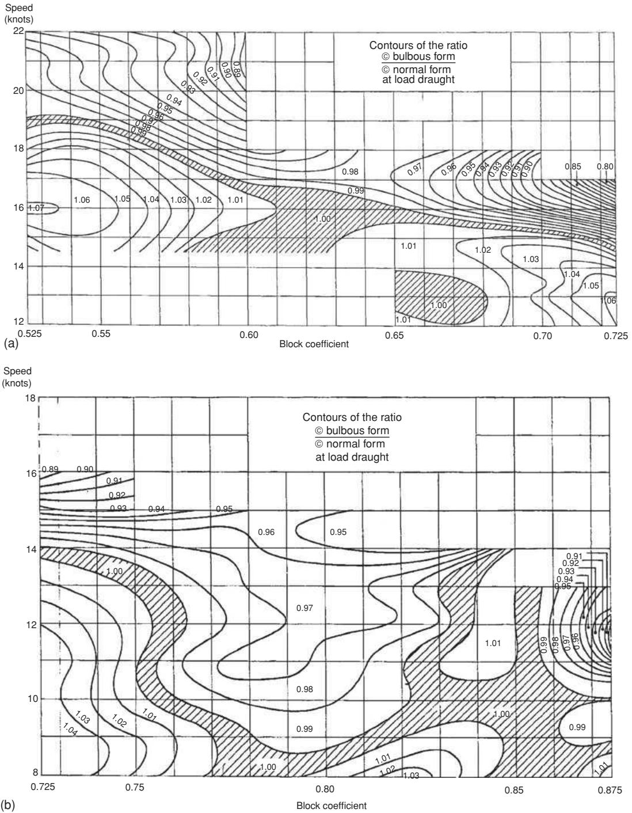  
Figure 10.6. Effect of bulbous bow on resistance (speed in knots for 400 ft ship).

SABIT REGRESSION. A useful alternative that harnesses most of the BSRA series data is the regression analysis of the series carried out by Sabit [10.75]. These were carried out for the load, medium and light draught conditions.

The resistance data are presented in terms of

$$
C R _ {4 0 0} = f \left[ L / \nabla^ {1 / 3}, B / T, C _ {B}, L C B \right], \tag {10.5}
$$

where

$$
C R = \frac {R \cdot L}{\Delta \cdot V ^ {2}} \tag {10.6}
$$

and the suffix 400 denotes values for a 400 ft ship, and at speeds $V _ { k } / \sqrt { L _ { f } } = 0 . 5 0 , 0 . 5 5$ , 0.60, 0.65, 0.70, 0.75, 0.80. The values of $L / \nabla ^ { 1 / 3 } , C _ { B } , B / T$ and LCB used in the analysis are for the load, medium and light draught conditions. Values of $\nabla$ and $L C B$ for the medium and light conditions, based on a draught ratio TR ( intermediate draught/load draught) may be derived from the following equations. $L _ { B P }$ is assumed constant, B is assumed constant, $T _ { \mathrm { m e d i u m } } = 0 . 8 0 8 ~ T _ { \mathrm { l o a d } }$ and $T _ { \mathrm { l i g h t } } = 0 . 6 1 6 T _ { \mathrm { l o a d } }$ . Displacement ratio $\Delta _ { R }$ (= intermediate displacement/load displacement).

For $C _ { B } = 0 . 6 5 – 0 . 7 2 5$ ,

$$
\Delta_ {R} = 1. 0 + (T _ {R} - 1. 0) \big [ 3. 7 7 6 - 7. 1 6 C _ {B} + 4. 8 C _ {B} ^ {2} \big ]. \tag {10.7}
$$

For $C _ { B } = 0 . 7 2 5 – 0 . 8 0 .$ ,

$$
\Delta_ {R} = 1. 0 + (T _ {R} - 1. 0) \bigl [ - 1. 1 2 4 5 + 6. 3 6 6 C _ {B} - 4. 5 3 3 C _ {B} ^ {2} \bigr ]. \tag {10.8}
$$

These two expressions can be used to derive the displacement and $L / \nabla ^ { 1 / 3 }$ at any intermediate draught. $C _ { B }$ is at load displacement.

For $C _ { B } = 0 . 6 5 – 0 . 7 2 5$ ,

$$
\begin{array}{l} L C B = L C B _ {\text { load }} - (1 - T _ {R}) \left[ - 1 2 4. 3 3 5 + 3 2 8. 9 8 C _ {B} - 2 1 8. 9 3 C _ {B} ^ {2} \right. \\ \left. - 1 0. 5 5 3 L C B _ {\text { load }} + 2 7. 4 2 \left(L C B _ {\text { load }} \times C _ {B}\right) - 1 8. 4 \left(L C B _ {\text { load }} \times C _ {B} ^ {2}\right) \right]. \tag {10.9} \\ \end{array}
$$

For CB 0.725–0.80,

$$
\begin{array}{l} L C B = L C B _ {\text { load }} - (1 - T _ {R}) \left[ - 1 6 9. 9 7 5 + 4 4 9. 7 4 C _ {B} - 2 9 8. 6 6 7 C _ {B} ^ {2} \right. \\ + 3. 8 5 5 L C B _ {\text { load }} - 1 2. 5 6 \left(L C B _ {\text { load }} \times C _ {B}\right) \\ \left. + 9. 3 3 3 \left(L C B _ {\text { load }} \times C _ {B} ^ {2}\right) \right]. \tag {10.10} \\ \end{array}
$$

These two expressions can be used to derive the LCB at any intermediate draught. $C _ { B }$ is at load displacement.

The regression equations for the load, medium and light draughts take the following form.

LOAD DRAUGHT. Limits of parameters in the load condition are: $L / \nabla ^ { 1 / 3 } 4 . 2 – 6 . 4 , B / T$ $2 . 2 \mathrm { - } 4 . 0 , C _ { B } 0 . 6 5 \mathrm { - } 0 . 8 0 , L C B \mathrm { - } 2 . 0 \% \mathrm { - } + 3 . 5 \%$ . Extrapolation beyond these limits can result in relatively large errors.

$$
\begin{array}{l} \mathrm{Y} _ {4 0 0} = \mathrm{a} 1 \times \mathrm{X} 1 + \mathrm{a} 2 \times \mathrm{X} 2 + \mathrm{a} 3 \times \mathrm{X} 3 + \mathrm{a} 4 \times \mathrm{X} 4 + \mathrm{a} 5 \times \mathrm{X} 5 + \mathrm{a} 6 \times \mathrm{X} 6 \\ + \mathrm{a} 7 \times \mathrm{X} 7 + \mathrm{a} 8 \times \mathrm{X} 8 + \mathrm{a} 9 \times \mathrm{X} 9 + \mathrm{a} 1 0 \times \mathrm{X} 1 0 + \mathrm{a} 1 1 \times \mathrm{X} 1 1 \\ + \mathrm{a} 1 2 \times \mathrm{X} 1 2 + \mathrm{a} 1 3 \times \mathrm{X} 1 3 + \mathrm{a} 1 4 \times \mathrm{X} 1 4 + \mathrm{a} 1 5 \times \mathrm{X} 1 5 \\ + \mathrm{a} 1 6 \times \mathrm{X} 1 6, \tag {10.11} \\ \end{array}
$$

where:

<table><tr><td>X1 = 1</td><td> $\text{X2} = (L/\nabla^{1/3} - 5.296)/1.064$ </td></tr><tr><td>X3 = 10(B/T - 3.025)/9.05</td><td> $\text{X4} = 1000(C_B - 0.725)/75$ </td></tr><tr><td>X5 = (LCB - 0.77)/2.77</td><td> $\text{X6} = \text{X2}^2$ </td></tr><tr><td>X7 =  $\text{X3}^2$ </td><td> $\text{X8} = \text{X4}^2$ </td></tr><tr><td>X9 =  $\text{X5}^2$ </td><td> $\text{X10} = \text{X2} \times \text{X3}$ </td></tr><tr><td>X11 = X2 × X4</td><td> $\text{X12} = \text{X2} \times \text{X5}$ </td></tr><tr><td>X13 = X3 × X4</td><td> $\text{X14} = \text{X3} \times \text{X5}$ </td></tr><tr><td>X15 = X4 × X5</td><td> $\text{X16} = \text{X5} \times \text{X4}^2$ </td></tr></table>

$$
C R _ {4 0 0} = (Y _ {4 0 0} \times 5. 1 6 3 5) + 1 3. 1 0 3 5, \tag {10.12}
$$

and from Equation (3.20), $\textcircled { \mathrm { C } } _ { 4 0 0 } = ( C R _ { 4 0 0 } \times \nabla ^ { 1 / 3 } ) / \left( 2 . 4 9 3 8 \times L \right)$ .

The coefficients a1 to a16 are given in Table A3.2, Appendix A3.

MEDIUM DRAUGHT. Limits of parameters in the medium condition are: $L / \nabla ^ { 1 / 3 } \ 4 . 6 \mathrm { - }$ $6 . 9 , B / T 2 . 6 - 4 . 9 , C _ { B } 0 . 6 2 - 0 . 7 8 , L C B - 1 . 6 \% - + 3 . 9 \%$ . Extrapolation beyond these limits can result in relatively large errors.

$$
\begin{array}{l} \mathrm{Z} _ {4 0 0} = \mathrm{b} 1 \times \mathrm{R} 1 + \mathrm{b} 2 \times \mathrm{R} 2 + \mathrm{b} 3 \times \mathrm{R} 3 + \mathrm{b} 4 \times \mathrm{R} 4 + \mathrm{b} 5 \times \mathrm{R} 5 + \mathrm{b} 6 \times \mathrm{R} 6 \\ + \mathrm{b} 7 \times \mathrm{R} 7 + \mathrm{b} 8 \times \mathrm{R} 8 + \mathrm{b} 9 \times \mathrm{R} 9 + \mathrm{b} 1 0 \times \mathrm{R} 1 0 + \mathrm{b} 1 1 \times \mathrm{R} 1 1 \\ + \mathrm{b} 1 2 \times \mathrm{R} 1 2 + \mathrm{b} 1 3 \times \mathrm{R} 1 3 + \mathrm{b} 1 4 \times \mathrm{R} 1 4 + \mathrm{b} 1 5 \times \mathrm{R} 1 5 \\ + \mathrm{b} 1 6 \times \mathrm{R} 1 6, \tag {10.13} \\ \end{array}
$$

where

<table><tr><td>R1 = 1</td><td> $\mathrm{R}2 = (L/\nabla^{1/3} - 5.7605)/1.1665$ </td></tr><tr><td>R3 =  $(B/T - 3.745)/1.125$ </td><td> $\mathrm{R}4 = 100(C_B - 0.7035)/8.05$ </td></tr><tr><td>R5 =  $(LCB - 1.20)/2.76$ </td><td> $\mathrm{R}6 = \mathrm{R}2^2$ </td></tr><tr><td>R7 =  $\mathrm{R}3^2$ </td><td> $\mathrm{R}8 = \mathrm{R}4^2$ </td></tr><tr><td>R9 =  $\mathrm{R}5^2$ </td><td> $\mathrm{R}10 = \mathrm{R}2 \times \mathrm{R}3$ </td></tr><tr><td>R11 = R2 × R4</td><td> $\mathrm{R}12 = \mathrm{R}2 \times \mathrm{R}5$ </td></tr><tr><td>R13 = R3 × R4</td><td> $\mathrm{R}14 = \mathrm{R}3 \times \mathrm{R}5$ </td></tr><tr><td>R15 = R4 × R5</td><td> $\mathrm{R}16 = \mathrm{R}5 \times \mathrm{R}4^2$ </td></tr></table>

$$
C R _ {4 0 0} = (Z _ {4 0 0} \times 6. 4 4 9) + 1 5. 0 1 0, \tag {10.14}
$$

and from Equation (3.20), $\textcircled { \scriptsize { \mathrm { C } } } _ { 4 0 0 } = ( C R _ { 4 0 0 } \times \nabla \ ^ { 1 / 3 } ) / \ ( 2 . 4 9 3 8 \times L )$ . The coefficients b1 to b16 are given in Table A3.3, Appendix A3. $T , \nabla , C _ { B }$ and LCB are for the medium draught condition.

LIGHT DRAUGHT. Limits of parameters in the light condition are: $L / \nabla ^ { 1 / 3 } 5 . 1 – 7 . 7 , B / T$ $3 . 4 \mathrm { - } 6 . 4 , C _ { B } 0 . 5 9 \mathrm { - } 0 . 7 7 , L C B \mathrm { - } 1 . 1 \% \mathrm { - } + 4 . 3 \%$ . Extrapolation beyond these limits can result in relatively large errors.

$$
\begin{array}{l} \mathrm{S} _ {4 0 0} = \mathrm{c} 1 \times \mathrm{T} 1 + \mathrm{c} 2 \times \mathrm{T} 2 + \mathrm{c} 3 \times \mathrm{T} 3 + \mathrm{c} 4 \times \mathrm{T} 4 + \mathrm{c} 5 \times \mathrm{T} 5 + \mathrm{c} 6 \times \mathrm{T} 6 \\ + \mathrm{c} 7 \times \mathrm{T} 7 + \mathrm{c} 8 \times \mathrm{T} 8 + \mathrm{c} 9 \times \mathrm{T} 9 + \mathrm{c} 1 0 \times \mathrm{T} 1 0 + \mathrm{c} 1 1 \times \mathrm{T} 1 1 + \mathrm{c} 1 2 \times \mathrm{T} 1 2 \\ + \mathrm{c} 1 3 \times \mathrm{T} 1 3 + \mathrm{c} 1 4 \times \mathrm{T} 1 4 + \mathrm{c} 1 5 \times \mathrm{T} 1 5 + \mathrm{c} 1 6 \times \mathrm{T} 1 6, \tag {10.15} \\ \end{array}
$$

contour

| BASE | 5 | 6 & 5 |
|------|----|-------|
| 150% WL | 10 | 125% WL |
| 125% WL | 9/4 | 9/2 |
| 100% WL | 9/4 | 75% WL |
| 75% WL | 9 | 50% WL |
| 50% WL | 8/2 | 25% WL |
| 25% WL | 7/2 | 75% WL |
| 20% WL | 2/2 | 50% WL |
| 15% WL | 1/2 | 25% WL |
| 10% WL | 3/4 | 50% WL |
| 7% WL | 1/2 | 25% WL |
| 5% WL | 3 | 20% WL |
| 4% WL | 4 | 15% WL |

Figure 10.7. Series 60 body plan $C _ { B } = 0 . 6 5 .$ .

where

<table><tr><td>T1 = 1</td><td> $T2 = (L/\nabla^{1/3} - 6.4085)/1.3085$ </td></tr><tr><td>T3 =  $(B/T - 4.915)/1.475$ </td><td> $T4 = 100(C_B - 0.679)/8.70$ </td></tr><tr><td>T5 = LCB - 1.615)/2.735</td><td> $T6 = T2^2$ </td></tr><tr><td>T7 = T3 $^{2}$ </td><td> $T8 = T4^2$ </td></tr><tr><td>T9 = T5 $^{2}$ </td><td> $T10 = T2 \times T3$ </td></tr><tr><td>T11 = T2 × T4</td><td> $T12 = T2 \times T5$ </td></tr><tr><td>T13 = T3 × T4</td><td> $T14 = T3 \times T5$ </td></tr><tr><td>T15 = T4 × T5</td><td> $T16 = T5 \times T4^2$ </td></tr></table>

$$
C R _ {4 0 0} = (S _ {4 0 0} \times 7. 8 2 6) + 1 7. 4 1 7, \tag {10.16}
$$

and from Equation (3.20), $\textcircled { \mathrm { C } } _ { 4 0 0 } = ( C R _ { 4 0 0 } \times \nabla ^ { 1 / 3 } ) / ( 2 . 4 9 3 8 \times L )$ . The coefficients c1 to c16 are given in Table A3.4, Appendix A3. $L , \nabla , C _ { B }$ and LCB are for the light draught condition.

The $\textcircled{ C} _ { 4 0 0 }$ will be corrected for skin friction and correlation, and $P _ { E }$ derived, in a manner similar to that described earlier for the BSRA series.

# 10.3.1.2 Series 60

The Series 60 was developed in the United States during the 1950s [10.1, 10.2]. A new presentation was proposed by Lackenby and Milton [10.3] and a regression analysis of the data was carried out by Sabit [10.76]. An example of a body plan for the series is shown in Figure 10.7 and the series covers the following range of speeds and hull parameters:

Speed: $V _ { k } / { \sqrt { L _ { f } } } ; 0 . 2 0 { - 0 . 9 0 } [ F r ; 0 . 0 6 { - 0 . 2 7 } ] .$

$$
C _ {B}: 0. 6 0 - 0. 8 0; B / T: 2. 5 - 3. 5; L / B: 5. 5 - 8. 5; L C B: - 2. 5 \% - + 3. 5 \%.
$$

Output, using Lackenby and Milton’s presentation [10.3],

$$
Ⓒ _ {4 0 0} = \frac {5 7 9 . 8 P _ {E}}{\Delta^ {2 / 3} V ^ {3}}.
$$

Lackenby and Milton [10.3] used both the Schoenherr and Froude friction lines.

SABIT REGRESSION. A useful tool is the regression analysis of the Series 60 carried out by Sabit [10.76]. The approach is similar to that used for the BSRA series, but using $L / B$ rather than $L / \nabla ^ { 1 / 3 }$ . The Froude $C _ { F }$ line was used to determine the 400 ft ship values.

The resistance data are presented in terms of

$$
C R _ {4 0 0} = f [ L / B, B / T, C _ {B}, L C B ], \tag {10.17}
$$

and at speeds $V _ { k } / \sqrt { L _ { f } } = 0 . 5 0 , 0 . 5 5 , 0 . 6 0 , 0 . 6 5 , 0 . 7 0 , 0 . 7 5 , 0 . 8 0 , 0 . 8 5 , 0 . 9 0 .$ .

The regression equation for the load draught takes the following form:

$$
\begin{array}{l} \mathrm{Y} _ {4 0 0} = \mathrm{a} 1 \times \mathrm{X} 1 + \mathrm{a} 2 \times \mathrm{X} 2 + \mathrm{a} 3 \times \mathrm{X} 3 + \mathrm{a} 4 \times \mathrm{X} 4 + \mathrm{a} 5 \times \mathrm{X} 5 + \mathrm{a} 6 \times \mathrm{X} 6 \\ + \mathrm{a} 7 \times \mathrm{X} 7 + \mathrm{a} 8 \times \mathrm{X} 8 + \mathrm{a} 9 \times \mathrm{X} 9 + \mathrm{a} 1 0 \times \mathrm{X} 1 0 + \mathrm{a} 1 1 \times \mathrm{X} 1 1 + \mathrm{a} 1 2 \times \mathrm{X} 1 2 \\ + \mathrm{a} 1 3 \times \mathrm{X} 1 3 + \mathrm{a} 1 4 \times \mathrm{X} 1 4 + \mathrm{a} 1 5 \times \mathrm{X} 1 5 + \mathrm{a} 1 6 \times \mathrm{X} 1 6, \tag {10.18} \\ \end{array}
$$

where

<table><tr><td>X1 = 1</td><td>X2 = 2(L/B - 7.0)/3.0</td></tr><tr><td>X3 = 2(B/T - 3)</td><td>X4 = 10( $C_B$  - 0.7)</td></tr><tr><td>X5 = (LCB - 0.515) / 2.995</td><td>X6 = X2 $^{2}$ </td></tr><tr><td>X7 = X3 $^{2}$ </td><td>X8 = X4 $^{2}$ </td></tr><tr><td>X9 = X5 $^{2}$ </td><td>X10 = X2 × X3</td></tr><tr><td>X11 = X2 × X4</td><td>X12 = X2 × X5</td></tr><tr><td>X13 = X3 × X4</td><td>X14 = X3 × X5</td></tr><tr><td>X15 = X4 × X5</td><td>X16 = X5 × X4 $^{2}$ </td></tr></table>

$$
C R _ {4 0 0} = \left(\mathrm{Y} _ {4 0 0} \times 8. 3 3 7 5\right) + 1 7. 3 5 0 5, \tag {10.19}
$$

and from Equation (3.20), $\textcircled { \mathrm { C } } _ { 4 0 0 } = ( C R _ { 4 0 0 } \times \nabla ^ { 1 / 3 } ) / ( 2 . 4 9 3 8 \times L )$ . The coefficients a1 to a16 are given in Table A3.5, Appendix A3.

# 10.3.1.3 Average -C Data

Moor and Small [10.70] gathered together many model resistance test data during the 1950s, including the results for the BSRA series. These data were cross faired and so-called average data were tabulated. These average values are given in Table A3.6 in Appendix A3. The data provide a good first estimate of resistance, but in many cases can be improved upon with small refinements to the hull parameters.

$\textcircled{ C} _ { 4 0 0 }$ values are presented for a standard ship with dimensions (ft): $4 0 0 \times 5 5 \times$ 26 for a range of speed, $C _ { B }$ and LCB values.

Speed: $V _ { k } / { \sqrt { L _ { f } } } ; 0 . 5 0 { - 0 . 9 0 } [ F r ; 0 . 1 5 { - 0 . 2 7 } ] .$

$$
C _ {B}: 0. 6 2 5 - 0. 8 2 5; L C B: - 2. 0 \% - + 2. 5 \%.
$$

In order to correct for the dimensions of a proposed new ship, compared with the standard dimensions $( 4 0 0 \times 5 5 \times 2 6 )$ , Moor and Small propose the use of Mumford’s indicies x and y. In this approach, it is assumed that $P _ { E } \propto B ^ { x } \cdot T ^ { y }$ where the indicies x and y vary primarily with speed.

The correction becomes

$$
P _ {E 2} = P _ {E 1} \times \left(\frac {B _ {2}}{B _ {1}}\right) ^ {x} \left(\frac {T _ {2}}{T _ {1}}\right) ^ {y}, \tag {10.20}
$$

Table 10.1. Mumford indicies 

<table><tr><td> $V/\sqrt{L}$ </td><td>0.50</td><td>0.55</td><td>0.60</td><td>0.65</td><td>0.70</td><td>0.75</td><td>0.80</td><td>0.85</td><td>0.90</td></tr><tr><td> $y$ </td><td>0.54</td><td>0.55</td><td>0.57</td><td>0.58</td><td>0.60</td><td>0.62</td><td>0.64</td><td>0.67</td><td>0.70</td></tr><tr><td> $x$ </td><td>0.90</td><td>0.90</td><td>0.90</td><td>0.90</td><td>0.90</td><td>0.90</td><td>0.90</td><td>0.90</td><td>0.90</td></tr></table>

and, using the analysis of resistance data for many models, it is proposed that $x = 0 . 9 0$ and y has the Mumford values shown in Table 10.1.

If -C is used, the correction becomes

$$
Ⓠ _ {2} = ⓒ _ {1} \times \left(\frac {B _ {2}}{B _ {1}}\right) ^ {x - \frac {2}{3}} \left(\frac {T _ {2}}{T _ {1}}\right) ^ {y - \frac {2}{3}}. \tag {10.21}
$$

After correction for dimensions $[ ( B _ { 2 } / B _ { 1 }$ and $\left( T _ { 2 } / T _ { 1 } \right) ]$ , the $\textcircled{ C} _ { 4 0 0 }$ will be corrected for skin friction and correlation, and $P _ { E }$ derived, in a manner similar to that described earlier for the BSRA series.

The -C data specifically for full form vessels such as tankers and bulk carriers can be found in [10.71, 10.72, 10.73]. These C data can be derived and corrected in a manner similar to that described in this section.

# 10.3.1.4 Fractional Draught Data/Equations

Values of resistance at reduced draught (for example, at ballast draught), as fractions of the resistance at load draught for single-screw ships, have been published by Moor and O’Connor [10.74]. Equations were developed that predict the effective displacement and power ratios in terms of the draught ratio $( T ) _ { R } ,$ , as follows:

$$
\frac {\Delta_ {2}}{\Delta_ {1}} = (T) _ {R} ^ {1. 6 0 7 - 0. 6 6 1 C _ {B}}, \tag {10.22}
$$

where

$$
(T) _ {R} = \left(\frac {T _ {\mathrm{Ballast}}}{T _ {\mathrm{load}}}\right)
$$

$$
\begin{array}{l} \frac {P _ {E \text {   ballast   }}}{P _ {E \text {   load   }}} = 1 + [ (T) _ {R} - 1 ] \left\{\left(0. 7 8 9 - 0. 2 7 0 [ (T) _ {R} - 1 ] + 0. 5 2 9 C _ {B} \left(\frac {L}{1 0 T}\right) ^ {0. 5}\right) \right. \\ + V / \sqrt {L} \left(2. 3 3 6 + 1. 4 3 9 [ (T) _ {R} - 1 ] - 4. 6 0 5 C _ {B} \left(\frac {L}{1 0 T}\right) ^ {0. 5}\right) \\ \left. + (V / \sqrt {L}) ^ {2} \left(- 2. 0 5 6 - 1. 4 8 5 [ (T) _ {R} - 1 ] + 3. 7 9 8 C _ {B} \left(\frac {L}{1 0 T}\right) ^ {0. 5}\right) \right\}. \tag {10.23} \\ \end{array}
$$

where T is the load draught.

As developed, the equations should be applied to the 400 ft ship before correction to actual ship length. Only relatively small errors are incurred if the correction is applied directly to the actual ship size. The data for deriving the equations were based mainly on the BSRA series and similar forms. The equations should, as a first approximation, be suitable for most single-screw forms. Example 5 in Chapter 17 illustrates the use of these equations.

Table 10.2. Parameter ranges, Holtrop et al. [10.78] 

<table><tr><td>Ship type</td><td>Fr max</td><td> $C_P$ </td><td>L/B</td></tr><tr><td>Tankers and bulk carriers</td><td>0.24</td><td>0.73–0.85</td><td>5.1–7.1</td></tr><tr><td>General cargo</td><td>0.30</td><td>0.58–0.72</td><td>5.3–8.0</td></tr><tr><td>Fishing vessels, tugs</td><td>0.38</td><td>0.55–0.65</td><td>3.9–6.3</td></tr><tr><td>Container ships, frigates</td><td>0.45</td><td>0.55–0.67</td><td>6.0–9.5</td></tr></table>

# 10.3.1.5 Holtrop and Mennen – Single-screw and Twin-screw Vessels

The regression equations developed by Holtrop et al. [10.78–10.81] have been used extensively in the preliminary prediction of ship resistance. The equations proposed in [10.80] and [10.81] are summarised in the following. The approximate ranges of the parameters are given in Table 10.2.

The total resistance is described as

$$
R _ {T} = R _ {F} (1 + k _ {1}) + R _ {\mathrm{APP}} + R _ {W} + R _ {B} + R _ {T R} + R _ {A}, \tag {10.24}
$$

where $R _ { F }$ is calculated using the ITTC1957 formula, $( 1 + k _ { I } )$ is the form factor, $R _ { \mathrm { A P P } }$ is the appendage resistance, $R _ { W }$ is the wave resistance, $R _ { B }$ is the extra resistance due to a bulbous bow, $R _ { T R }$ is the additional resistance due to transom immersion and $R _ { A }$ is the model-ship correlation resistance which includes such effects as hull roughness and air drag. $R _ { \mathrm { A P P } }$ and $( 1 + k _ { 1 } )$ are discussed in Chapters 3 and 4. This section discusses $R _ { W } ,$ , RB, $R _ { T R }$ and $R _ { A }$ .

WAVE RESISTANCE $\pmb { R } _ { \pmb { W } } .$ . In order to improve the quality of prediction of $R _ { W }$ , three speed ranges were used as follows:

(i) $F r < 0 . 4 0$ obtained using Equation (10.25)

(ii) $F r > 0 . 5 5$ obtained using Equation (10.26)

(iii) $0 . 4 0 < F r < 0 . 5 5$ obtained by interpolation using Equation (10.27)

(i) $F r < 0 . 4 0$

$$
R _ {W} = \mathrm{c} _ {1} \mathrm{c} _ {2} \mathrm{c} _ {5} \nabla \rho g \exp \left\{m _ {1} F r ^ {d} + m _ {4} \cos \left(\lambda F r ^ {- 2}\right) \right\}, \tag {10.25}
$$

where

$$
\mathrm{c} _ {1} = 2 2 2 3 1 0 5 \mathrm{c} _ {7} ^ {3. 7 8 6 1 3} (T / B) ^ {1. 0 7 9 6 1} (9 0 - i _ {E}) ^ {- 1. 3 7 5 6 5}
$$

$$
\mathrm{c} _ {2} = \exp (- 1. 8 9 \sqrt {\mathrm{c} _ {3}})
$$

$$
\mathrm{c} _ {3} = 0. 5 6 A _ {B T} ^ {1. 5} / \left\{B T \left(0. 3 1 \sqrt {A _ {B T}} + T _ {F} - h _ {B}\right) \right\}
$$

$$
\mathrm{c} _ {5} = 1 - 0. 8 A _ {T} / \left(B T C _ {M}\right)
$$

$$
\mathrm{c} _ {7} = 0. 2 2 9 5 7 7 (B / L) ^ {0. 3 3 3 3 3} \quad \text { when } B / L <   0. 1 1
$$

$$
\mathrm{c} _ {7} = B / L \quad \text { when } 0. 1 1 <   B / L <   0. 2 5
$$

$$
\mathrm{c} _ {7} = 0. 5 - 0. 0 6 2 5 L / B \quad \text { when } B / L > 0. 2 5
$$

$$
m _ {1} = 0. 0 1 4 0 4 0 7 L / T - 1. 7 5 2 5 4 \nabla^ {1 / 3} / L - 4. 7 9 3 2 3 B / L - c _ {1 6}
$$

$$
\mathrm{c} _ {1 6} = 8. 0 7 9 8 1 C _ {P} - 1 3. 8 6 7 3 C _ {P} ^ {2} + 6. 9 8 4 3 8 8 C _ {P} ^ {3} \quad \text {when} C _ {P} <   0. 8
$$

$$
\mathrm{c} _ {1 6} = 1. 7 3 0 1 4 - 0. 7 0 6 7 C _ {P} \quad \text {when} C _ {P} > 0. 8
$$

$$
m _ {4} = \mathrm{c} _ {1 5} 0. 4 \exp (- 0. 0 3 4 F r ^ {- 3. 2 9})
$$

$$
\mathrm{c} _ {1 5} = - 1. 6 9 3 8 5 \quad \text {when} L ^ {3} / \nabla <   5 1 2
$$

$$
\mathrm{c} _ {1 5} = - 1. 6 9 3 8 5 + \left(L / \nabla^ {1 / 3} - 8\right) / 2. 3 6 \quad \text {when} 5 1 2 <   L ^ {3} / \nabla <   1 7 2 6. 9 1
$$

$$
\mathrm{c} _ {1 5} = 0 \quad \text {when} L ^ {3} / \nabla > 1 7 2 6. 9 1
$$

$$
d = - 0. 9 0
$$

(ii) $F r > 0 . 5 5$

$$
R _ {W} = \mathrm{c} _ {1 7} \mathrm{c} _ {2} \mathrm{c} _ {5} \nabla \rho g \exp \left\{m _ {3} F r ^ {d} + m _ {4} \cos \left(\lambda F r ^ {- 2}\right) \right\}, \tag {10.26}
$$

where

$$
\mathrm{c} _ {1 7} = 6 9 1 9. 3 C _ {M} ^ {- 1. 3 3 4 6} \left(\nabla / L ^ {3}\right) ^ {2. 0 0 9 7 7} (L / B - 2) ^ {1. 4 0 6 9 2}
$$

$$
m _ {3} = - 7. 2 0 3 5 (B / L) ^ {0. 3 2 6 8 6 9} (T / B) ^ {0. 6 0 5 3 7 5}
$$

$$
\lambda = 1. 4 4 6 C _ {P} - 0. 0 3 L / B \quad \text {when} L / B <   1 2
$$

$$
\lambda = 1. 4 4 6 C _ {P} - 0. 3 6 \quad \text { when } L / B > 1 2
$$

(iii) $0 . 4 0 < F r < 0 . 5 5$

$$
R _ {W} = R _ {W (F r = 0. 4 0)} + (1 0 F r - 4) \left[ R _ {W (F r = 0. 5 5)} - R _ {W (F r = 0. 4 0)} \right] / 1. 5, \tag {10.27}
$$

where $R _ { W ( F r = 0 . 4 0 ) }$ is obtained using Equation (10.25) and $R _ { W ( F r = 0 . 5 5 ) }$ is obtained using Equation (10.26).

The angle $i _ { E }$ is the half angle of entrance of the waterline at the fore end. If it is not known, the following formula can be used:

$$
i _ {E} = 1 + 8 9 \exp \{- (L / B) ^ {0. 8 0 8 5 6} (1 - C _ {W P}) ^ {0. 3 0 4 8 4}
$$

$$
\times (1 - C _ {P} - 0. 0 2 2 5 L C B) ^ {0. 6 3 6 7} \left(L _ {R} / B\right) ^ {0. 3 4 5 7 4} \left(1 0 0 \nabla / L ^ {3}\right) ^ {0. 1 6 3 0 2} \}. \tag {10.28}
$$

where LCB is $L C B$ forward of 0.5 L as a percentage of $L$

If the length of run $L _ { R }$ is not known, it may be estimated from the following formula:

$$
L _ {R} = L _ {W L} \left[ 1 - C _ {P} + 0. 0 6 C _ {P} L C B / \left(4 C _ {P} - 1\right) \right]. \tag {10.29a}
$$

If $C _ { M }$ is not known, a reasonable approximation for small ships is

$$
C _ {M} = 0. 7 8 + 0. 2 1 C _ {B} \text {   and   for   larger   ships   is   }
$$

$$
C _ {M} = 0. 8 0 + 0. 2 1 C _ {B} (\text { Molland }). \tag {10.29b}
$$

If $C _ { W P }$ is not known, a reasonable approximation for displacement craft, $0 . 6 5 <$ < $C _ { B } < 0 . 8 0$ is

$$
C _ {W P} = 0. 6 7 C _ {B} + 0. 3 2. \tag {10.29c}
$$

In the preceding equations, $T _ { A }$ is the draught aft, $T _ { F }$ is the draught forward, $C _ { M }$ is the midship section coefficient, $C _ { W P }$ is the waterplane coefficient, $C _ { P }$ is the prismatic coefficient, $A _ { T }$ is the immersed area of transom at rest, $A _ { B T }$ is the transverse area of bulbous bow, and $h _ { B }$ is the centre of area of $A _ { B T }$ above the keel, Figure 10.8. It is recommended that $h _ { B }$ should not exceed the upper limit of 0.6 $T _ { F }$ .

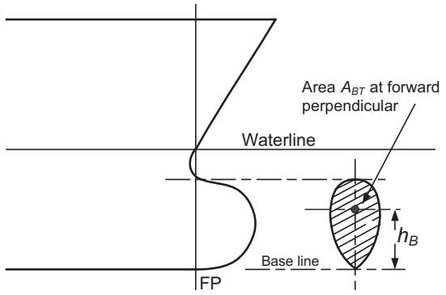

text_image

Area ABT at forward perpendicular
Waterline
FP
Base line
hB

Figure 10.8. Definition of bulbous bow.

# RESISTANCE DUE TO BULB $\pmb { R } _ { B }$ .

$$
R _ {B} = 0. 1 1 \exp \left(- 3 P _ {B} ^ {- 2}\right) F r _ {i} ^ {3} A _ {B T} ^ {1. 5} \rho g / \left(1 + F r _ {i} ^ {2}\right), \tag {10.30}
$$

where $P _ { B }$ is a measure of the emergence of the bow and $F r _ { i }$ is the Froude number based on the immersion as follows:

$$
P _ {B} = 0. 5 6 \sqrt {A _ {B T}} / (T _ {F} - 1. 5 h _ {B}) \text {   and   }
$$

$$
F r _ {i} = V / \sqrt {g (T _ {F} - h _ {B} - 0 . 2 5 \sqrt {A _ {B T}}) + 0 . 1 5 V ^ {2}}. \tag {10.31}
$$

# RESISTANCE DUE TO TRANSOM ${ \pmb R } _ { T R }$ .

$$
R _ {T R} = 0. 5 \rho V ^ {2} A _ {T} \mathrm{c} _ {6}, \tag {10.32}
$$

where ${ \displaystyle \mathfrak { c } _ { 6 } = 0 . 2 ( 1 - 0 . 2 F r _ { T } ) }$ when $F r _ { T } < 5$ or ${ \mathrm { c } } _ { 6 } = 0$ when $F r _ { T } \ge 5 . ~ F r _ { T }$ is the Froude number based on transom immersion, as follows:

$$
F r _ {T} = V / \sqrt {2 g A _ {T} / (B + B C _ {W P})} \tag {10.33}
$$

# MODEL-SHIP CORRELATION RESISTANCE $\pmb { R _ { A } }$ .

$$
R _ {A} = 0. 5 \rho S V ^ {2} C _ {A},
$$

where S is the wetted surface area of the hull, for example, using Equations (10.83– 10.86), and

$$
C _ {A} = 0. 0 0 6 (L + 1 0 0) ^ {- 0. 1 6} - 0. 0 0 2 0 5 + 0. 0 0 3 \sqrt {L / 7 . 5} C _ {B} ^ {4} c _ {2} (0. 0 4 - c _ {4}), \tag {10.34}
$$

where L is in metres and

$$
\mathrm{c} _ {4} = T _ {F} / L \quad \text { when } T _ {F} / L \leq 0. 0 4
$$

$$
\text { or } \quad c _ {4} = 0. 0 4 \quad \text { when } T _ {F} / L > 0. 0 4.
$$

It is noted that $C _ { A }$ may be higher or lower depending on the levels of hull surface roughness. The most recent analysis would suggest that the prediction for $C _ { A }$ can be up to 9% high, but for practical purposes use of Equation (10.34) is still recommended by Holtrop. Equation (10.34) is based on a standard roughness figure of $k _ { S } = 1 5 0 \ \mu \mathrm { m }$ . Approximate modifications to $C _ { A }$ for hull roughness can be made using the ITTC Bowden–Davison formula for $\Delta C _ { F }$ , Equation (5.9), or the Townsin formula Equation (5.10).

# 10.3.1.6 Hollenbach – Single-screw and Twin-screw Vessels

Hollenbach [10.82] carried out a regression on the results of resistance tests on 433 models at the Vienna Ship Model Basin from 1980 to 1995. The models were of single- and twin-screw vessels. Results are presented in terms of

$$
C _ {R} = \frac {R _ {R}}{0 . 5 \rho B \cdot T V ^ {2}}.
$$

It should be noted that $( B \cdot T / 1 0 )$ is used as the reference area rather than the more usual wetted surface area $S . C _ { R }$ was derived using the $\Pi \mathrm { C } C _ { F }$ line.

In addition to $L = L _ { B P }$ and $L _ { W L }$ which have their usual meaning, a ‘Length over surface’ $L o s$ is used and is defined as follows:

- for the design draught, length between the aft end of the design waterline and the most forward point of the ship below the design waterline, for example, the fore end of a bulbous bow   
- for the ballast draught, length between the aft end and the forward end of the hull at the ballast waterline, for example, the fore end of a bulbous bow would be taken into account but a rudder is not taken into account

The Froude number used in the formulae is based on the length $L _ { f n }$ , as follows:

$$
\begin{array}{l} L _ {f n} = L _ {O S} \quad \text { for } L _ {O S} / L <   1 \\ = L + 2 / 3 \left(L _ {O S} - L\right) \quad \text { for } 1 \leq L _ {O S} / L <   1. 1 \\ = 1. 0 6 6 7 L \quad \text { for } 1. 1 \leq L _ {O S} / L \\ \end{array}
$$

Hollenbach analysed and presented the data in terms of a ‘mean’ value of resistance when normal constraints on the hull form will occur for design purposes and a ‘minimum’ resistance which might be achieved for good hull lines developed following computational and experimental investigations, and not subject to design constraints.

The coefficient $C _ { R }$ is generally expressed for ‘mean’ and ‘minimum’ values as

$$
\begin{array}{l} C _ {R} = C _ {R \cdot \text { Standard }} \cdot C _ {R \cdot \text { FrKrit }} \cdot k _ {L} (T / B) ^ {\mathrm{a1}} (B / L) ^ {\mathrm{a2}} \left(L _ {O S} / L _ {W L}\right) ^ {\mathrm{a3}} \left(L _ {W L} / L\right) ^ {\mathrm{a4}} \\ \times (1 + (T _ {A} - T _ {F}) / L) ^ {\mathrm{a5}} (D _ {P} / T _ {A}) ^ {\mathrm{a6}} (1 + N _ {\mathrm{Rud}}) ^ {\mathrm{a7}} \\ \times \left(1 + N _ {\text { Brac }}\right) ^ {\mathrm{a} 8} \left(1 + N _ {\text { Boss }}\right) ^ {\mathrm{a} 9} \left(1 + N _ {\text { Thr }}\right) ^ {\mathrm{a} 1 0} \tag {10.35} \\ \end{array}
$$

where $k _ { L } = e _ { 1 } L ^ { e 2 } , T _ { A }$ is the draught at $\mathbf { A P } , T _ { F }$ is the draught at $\mathrm { F P } , D _ { P }$ is the propeller diameter, $N _ { \mathrm { R u d } }$ is the number of rudders (1 or 2), $N _ { \mathrm { B r a c } }$ is the number of brackets (0–2), $N _ { \mathrm { B o s s } }$ is the number of bossings (0–2), $N _ { \mathrm { T h r } }$ is the number of side thrusters (0–4).

$$
\begin{array}{l} C _ {R \cdot \text { Standard }} = b _ {1 1} + b _ {1 2} F r + b _ {1 3} F r ^ {2} + C _ {B} (b _ {2 1} + b _ {2 2} F r + b _ {2 3} F r ^ {2}) \\ + C _ {B} ^ {2} (\mathrm{b} _ {3 1} + \mathrm{b} _ {3 2} F r + \mathrm{b} _ {3 3} F r ^ {2}). \tag {10.36} \\ \end{array}
$$

$$
C _ {R \cdot \text { FrKrit }} = \max [ 1. 0, (F r / F _ {r \cdot \text { Krit }}) ^ {\mathrm{c} 1} ]. \tag {10.37}
$$

where $F _ { r \cdot \mathrm { K r i t } } = { \bf d } _ { 1 } + { \bf d } _ { 2 } C _ { B } + { \bf d } _ { 3 } C _ { B } ^ { 2 }$

The formulae are valid for Froude number intervals as follows:

$$
F r \cdot_ {\min} = \min (f _ {1}, f _ {1} + f _ {2} (f _ {3} - C _ {B})).
$$

$$
F r \cdot_ {\max} = \mathrm{g} _ {1} + \mathrm{g} _ {2} C _ {B} + \mathrm{g} _ {3} C _ {B} ^ {2}.
$$

The ‘maximum’ total resistance is given as $R _ { T \cdot \mathrm { m a x } } = \mathrm { h } _ { 1 } \cdot R _ { T \cdot \mathrm { m e a n } }$

Note that for the ‘minimum’ resistance case, $K _ { L }$ and $C _ { R \mathrm { { F r K i t } } }$ in Equation (10.35) should be set at 1.0.

The coefficients in these equations, for ‘mean’ and ‘minimum’ resistance and single- and twin-screw vessels, are given in Table A3.7, Appendix A3.

Note that in the table of coefficients in the original paper [10.82], there was a sign error in coefficient $a _ { 3 }$ ballast which should be 1.1606 not  1.1606.

# 10.3.1.7 Taylor-Gertler Series

The original tests on twin-screw model hulls were carried out by Taylor during 1910– 1920 and cover the widest range of $C _ { P } , B / T$ and Fr yet produced. Gertler reanalysed the data as described in [10.10]. The series represents a transformation of a mathematical hull form based on an R.N. cruiser Leviathan. An example of a body plan for the series is shown in Figure 10.9 and the series covered the following range of speeds and hull parameters:

Speed: $V _ { k } / { \sqrt { L _ { f } } } ; 0 . 3 0 { - 2 . 0 } \left[ F r ; 0 . 0 9 { - 0 . 6 0 } \right] .$

B/T: 2.25, 3.00, 3.75; CP: 0.48 to 0.86; /L3: 1.0  10−3 to 7.0  10−3 [L/  1/3:

5–10]; LCB was fixed at amidships.

Output: CR = 0.5ρSV2 $\begin{array} { r } { C _ { R } = \frac { R _ { R } } { 0 . 5 \rho S V ^ { 2 } } } \end{array}$ RR where $R _ { R }$ is the residuary resistance, with $C _ { R }$ derived from $C _ { R } = C _ { T \mathrm { m o d e l } } \stackrel { \cdot } { - } C _ { F \mathrm { S c h o e n h e r r } } ,$ , where $C _ { F \mathrm { S c h o e n h e r r } }$ is the Schoenherr friction line, Equation (4.10).

A typical presentation of the data, from [10.10], is shown in Figure 10.10 where, in this case, B/H is the $B / T$ ratio.

If charts are not available, and in order to provide readily available data for design purposes, a range of data have been digitised from the charts. These are listed in Tables A3.8, A3.9, A3.10, and A3.11 in Appendix A3. Linear interpolation

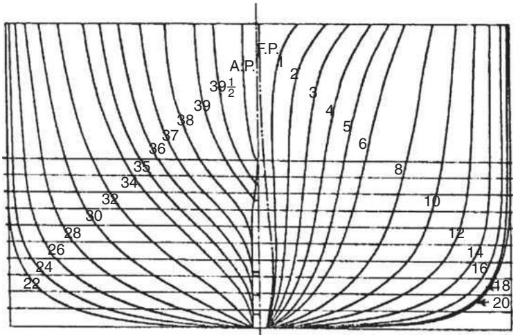

contour

| Point | Value |
|-------|-------|
| 1     | 39/2  |
| 2     | 38    |
| 3     | 37    |
| 4     | 36    |
| 5     | 35    |
| 6     | 34    |
| 7     | 32    |
| 8     | 30    |
| 9     | 28    |
| 10    | 26    |
| 11    | 24    |
| 12    | 22    |
| 13    | 20    |
| 14    | 18    |
| 15    | 16    |
| 16    | 14    |
| 17    | 12    |
| 18    | 10    |
| 19    | 8     |
| 20    | 6     |
| 21    | 4     |
| 22    | 2     |
| 23    | 0     |
| 24    | -2    |
| 25    | -4    |
| 26    | -6    |
| 27    | -8    |
| 28    | -10   |
| 29    | -12   |
| 30    | -14   |
| 31    | -16   |
| 32    | -18   |
| 33    | -20   |
| 34    | -22   |
| 35    | -24   |
| 36    | -26   |
| 37    | -28   |
| 38    | -30   |
| 39    | -32   |
| 40    | -34   |
| 41    | -36   |
| 42    | -38   |
| 43    | -40   |
| 44    | -42   |
| 45    | -44   |
| 46    | -46   |
| 47    | -48   |
| 48    | -50   |
| 49    | -52   |
| 50    | -54   |
| 51    | -56   |
| 52    | -58   |
| 53    | -60   |
| 54    | -62   |
| 55    | -64   |
| 56    | -66   |
| 57    | -68   |
| 58    | -70   |
| 59    | -72   |
| 60    | -74   |
| 61    | -76   |
| 62    | -78   |
| 63    | -80   |
| 64    | -82   |
| 65    | -84   |
| 66    | -86   |
| 67    | -88   |
| 68    | -90   |
| 69    | -92   |
| 70    | -94   |
| 71    | -96   |
| 72    | -98   |
| 73    | -100  |
| 74    | -102  |
| 75    | -104  |
| 76    | -106  |
| 77    | -108  |
| 78    | -110  |
| 79    | -112  |
| 80    | -114  |
| 81    | -116  |
| 82    | -118  |
| 83    | -120  |
| 84    | -122  |
| 85    | -124  |
| 86    | -126  |
| 87    | -128  |
| 88    | -130  |
| 89    | -132  |
| 90    | -134  |
| 91    | -136  |
| 92    | -138  |
| 93    | -140  |
| 94    | -142  |
| 95    | -144  |
| 96    | -146  |
| 97    | -148  |
| 98    | -150  |
| 99    | -152  |
| A.P.   | —     |
| F.P.   | —     |

Figure 10.9. Taylor series body plan.

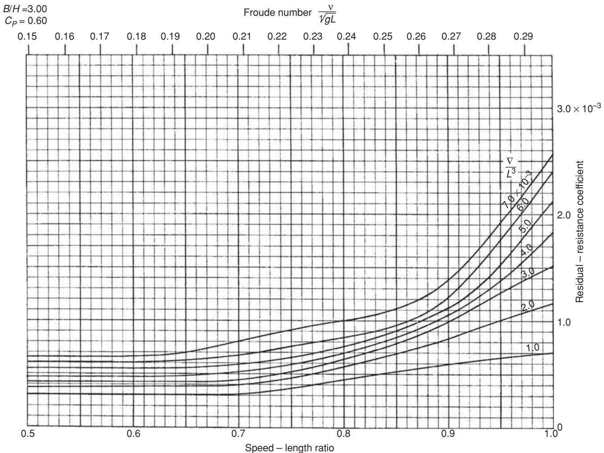

line

| Speed – length ratio | Residual – resistance coefficient (ν/L³ = 1.0) | Residual – resistance coefficient (ν/L³ = 2.0) | Residual – resistance coefficient (ν/L³ = 3.0) | Residual – resistance coefficient (ν/L³ = 4.0) | Residual – resistance coefficient (ν/L³ = 5.0) | Residual – resistance coefficient (ν/L³ = 6.0) | Residual – resistance coefficient (ν/L³ = 7.0) |
| --------------------- | ----------------------------------------------- | ----------------------------------------------- | ----------------------------------------------- | ----------------------------------------------- | ----------------------------------------------- | ----------------------------------------------- | ----------------------------------------------- |
| 0.5                   | ~0.0005                                         | ~0.0006                                         | ~0.0007                                         | ~0.0008                                         | ~0.0009                                         | ~0.0010                                         | ~0.0011                                         |
| 0.6                   | ~0.0006                                         | ~0.0007                                         | ~0.0008                                         | ~0.0009                                         | ~0.0010                                         | ~0.0011                                         | ~0.0012                                         |
| 0.7                   | ~0.0007                                         | ~0.0008                                         | ~0.0009                                         | ~0.0010                                         | ~0.0011                                         | ~0.0012                                         | ~0.0013                                         |
| 0.8                   | ~0.0008                                         | ~0.0009                                         | ~0.0010                                         | ~0.0011                                         | ~0.0012                                         | ~0.0013                                         | ~0.0014                                         |
| 0.9                   | ~0.0010                                         | ~0.0011                                         | ~0.0012                                         | ~0.0013                                         | ~0.0014                                         | ~0.0015                                         | ~0.0016                                         |
| 1.0                   | ~0.0012                                         | ~0.0013                                         | ~0.0014                                         | ~0.0015                                         | ~0.0016                                         | ~0.0017                                         | ~0.0018                                         |

Figure 10.10. Taylor–Gertler CR values to a base of speed.

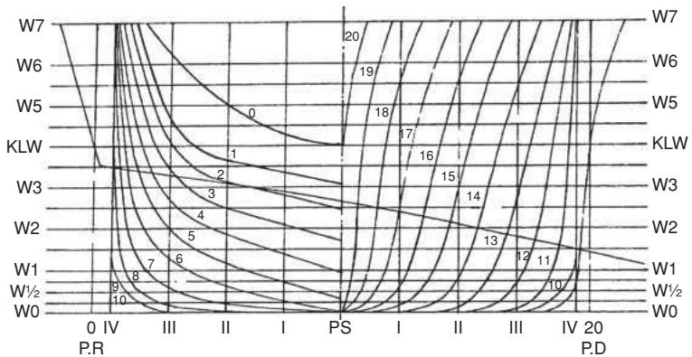

line

|        | W0   | W1/2 | W1   | W2   | W3   | W5   | W6   | W7   |
| ------ | ---- | ---- | ---- | ---- | ---- | ---- | ---- | ---- |
| P.R    | 10   | 8    | 7    | 6    | 5    | 4    | 3    | 2    |
| PS     |      |      |      |      |      |      |      | 20   |
| I      |      |      |      |      |      |      |      | 19   |
| II     |      |      |      |      |      |      |      | 18   |
| III    |      |      |      |      |      |      |      | 17   |
| IV     |      |      |      |      |      |      |      | 16   |
| 20     |      |      |      |      |      |      |      | 15   |
| P.D    | 10   | 8    | 7    | 6    | 5    | 4    | 3    | 2    |
|        |      |      |      |      |      |      |      | 19   |
|        |      |      |      |      |      |      |      | 18   |
|        |      |      |      |      |      |      |      | 17   |
|        |      |      |      |      |      |      |      | 16   |
|        |      |      |      |      |      |      |      | 15   |
|        |      |      |      |      |      |      |      | 14   |
|        |      |      |      |      |      |      |      | 13   |
|        |      |      |      |      |      |      |      | 12   |
|        |      |      |      |      |      |      |      | 11   |
|        |      |      |      |      |      |      |      | 10   |
|        |      |      |      |      |      |      |      |       |
|        |      |      |      |      |      |      |      |       |
|        |      |      |      |      |      |      |      |       |
|        |      |      |      |      |      |      |      |       |
|        |      |      |      |      |      |      |      |       |
|        |      |      |      |      |      |      |      |       |
|        | H/A  | H/A  | H/A  | H/A  | H/A  | H/A  | H/A  | H/A  |
|        /       /         /         /          /            /             /                 /                          /                          /                             /                              /                                /                                 /                               /                                  /                                /                                /                                /                                /                                /                                /                                /                                /                                /                                /                                /                                /                                /                                /                                /                                /                                /                                /                                /                                /                                /                                /                                /                                /                                /                                /                                /                                /                                /                                /                                /                                /                                /                                /                                /                                /                                /                                /                                /                                /                                /                                /                                /                                /                                /                                /                                /                                /                                /                                /                               /                               |
    end

Figure 10.11. Polish series body plan: parent.

of the data in these tables should, in most cases, be satisfactory. The wetted surface area can be estimated using Equation (10.86). $C _ { p } = C _ { B } / C _ { M }$ and, if $C _ { M }$ is not known, reasonable approximations are given in Equation (10.29b). When using the Taylor–Gertler series, the Schoenherr $C _ { F }$ should be used, Equation (4.10) or Equation (4.11), and it has been the practice to add a roughness allowance $\Delta C _ { F } = 0 . 0 0 0 4$ .

# 10.3.1.8 Zborowski Series

A small systematic series of twin-screw models was tested in Poland [10.13]. The body plan is shown in Figure 10.11 and the series covered the following range of speed and hull parameters:

Speed: Fr: 0.25–0.35.

B/T: 2.25, 2.80, 3.35; CB: 0.518–0.645; $L / \nabla ^ { 1 / 3 }$ : 6.0, 6.5, 7.0; LCB was fixed at 2.25%L aft of amidships; $C _ { M } = 0 . 9 7 7$ .

Output: values $\begin{array} { r } { C _ { T \mathrm { m o d e l } } = \frac { R _ { T \mathrm { m o d e l } } } { 0 . 5 \rho S V ^ { 2 } } } \end{array}$ M =  The model length is 1.9 m and extrapolation to shipard procedure described in Section 4.1, as follows:

$$
C _ {T S} = C _ {T M} - \left(C _ {F M} - C _ {F S}\right)
$$

or

$$
C _ {T S} = C _ {T M} - (1 + k) (C _ {F M} - C _ {F S}).
$$

Values for $C _ { T M }$ for different values of speed and hull parameters are listed in Table A3.12, Appendix A3. (1 + k), if used, may be estimated using the data in Chapter 4. Hull wetted surface area may be estimated using an appropriate formula, such as Equations (10.83) to (10.86), to be found in Section 10.4.

The tests did not include an aft centreline skeg and it is recommended in [10.13] that the drag of the skeg, assuming only frictional drag based on the wetted area of the skeg, should be added to the naked resistance derived above.

# 10.3.2 Semi-displacement Craft

# 10.3.2.1 Series 64

This systematic series of round bilge hull forms was tested at the David Taylor Model Basin (DTMB), West Bethesda, MD, on a wide range of hull parameters. These are described by Yeh [10.30].

natural_image

Pure 3D wireframe diagram of a curved surface with grid lines, no text or symbols present

Figure 10.12. Series 64 body plan.

An example of a body plan for the series is shown in Figure 10.12. The series covered the following range of speed and hull parameters:

Speed: $V _ { k } / { \sqrt { L _ { f } } } ; 0 . 2 \mathrm { - } 5 . 0 [ F r ; 0 . 0 6 \mathrm { - } 1 . 5 ] .$

B/T: 2.0, 3.0, 4.0; CB: 0.35, 0.45, 0.55; $L / \nabla ^ { 1 / 3 } $ : 8.0–12.4; LCB was fixed at 6.0%L aft of amidships. Data for $C _ { R }$ are presented in graphical and tabular form where

$$
C _ {R} = \frac {R _ {R}}{0 . 5 \rho S V ^ {2}}.
$$

The original values for $C _ { R }$ were derived by subtracting Schoenherr $C _ { F }$ from the model total $C _ { T }$ . In order to provide some commonality with the NPL series, described in the next section, the Series 64 $C _ { R }$ values were converted to ITTC format. That is, Schoernherr $C _ { F }$ (Equation (4.10)) based on the model length of 3.05 m was added to the original model $C _ { R }$ to give model $C _ { T }$ . ITTC $C _ { F }$ Equation (4.15) was then subtracted from the model $C _ { T }$ to give $C _ { R }$ . The values for $C _ { R }$ (based on ITTC $C _ { F } )$ are given in Tables A3.13, A3.14, and A3.15, Appendix A3. The wetted surface area can be estimated using Equation (10.88). Further specific tests on Series 64 hull forms are reported in [10.31], [10.32].

The resistance of high-speed semi-displacement craft tends to be dominated by $L / \nabla ^ { 1 / 3 }$ ratio and a useful presentation for such craft is resistance coefficient to a base of $L / \nabla ^ { 1 / 3 }$ at a fixed Froude number. An early use of such an approach was by Nordstrom [10.27]. Examination of the data for Series 64 forms in [10.30] indic- ¨ ates that changes in $B / T$ have a relatively small influence, with all $C _ { R }$ values lying within about 5% of a mean line. For these reasons, and to provide a practical design approach, regression analyses were carried out, [10.33]. These relate residuary resistance, $C _ { R } ,$ , solely to the $L / \nabla ^ { 1 / 3 }$ ratio at a number of fixed Froude numbers, $F r ,$ for the data in [10.30]. The form of the equations is

$$
C _ {R} = \mathrm{a} (L / \nabla^ {1 / 3}) ^ {\mathrm{n}}. \tag {10.38}
$$

Table 10.3. Coefficients in the equation 1000 $\begin{array} { r } { C _ { R } = { a } ( L / \nabla ^ { 1 / 3 } ) ^ { n } } \end{array}$ for Series 64, monohulls, $C _ { B } = 0 . 3 5$ 

<table><tr><td>Fr</td><td>a</td><td>n</td><td> $R^{2}$ </td></tr><tr><td>0.4</td><td>288</td><td>-2.33</td><td>0.934</td></tr><tr><td>0.5</td><td>751</td><td>-2.76</td><td>0.970</td></tr><tr><td>0.6</td><td>758</td><td>-2.81</td><td>0.979</td></tr><tr><td>0.7</td><td>279</td><td>-2.42</td><td>0.971</td></tr><tr><td>0.8</td><td>106</td><td>-2.06</td><td>0.925</td></tr><tr><td>0.9</td><td>47</td><td>-1.74</td><td>0.904</td></tr><tr><td>1.0</td><td>25</td><td>-1.50</td><td>0.896</td></tr></table>

The coefficients of the regressions, a and n, are given in Tables 10.3, 10.4 and 10.5.

# 10.3.2.2 NPL Series

This systematic series of round-bilge semi-displacement hull forms was tested at NPL, Teddington, UK, in the 1970s, Bailey [10.34]. An example of the body plan for the series is shown in Figure 10.13 and the series covered the following range of speeds and hull parameters:

Speed: $V _ { k } / \sqrt { L _ { f } . } \ 0 . 8 \mathrm { - } 4 . 1 \ [ F r ; 0 . 3 0 \mathrm { - } 1 . 1 , F r _ { \nabla } ; 0 . 6 \mathrm { - } 3 . 2 ] ,$ .

$B / T ; 1 . 7 - 6 . 7 ; C _ { B } = 0 . 4 \ ( \mathrm { f i x e d } ) ; L / \nabla ^ { 1 / 3 } \colon 4 . 5 - 8 . 3 ;$ LCB was fixed at 6.4% aft of amidships. Model length $L _ { W L } = 2 . 5 4 \mathfrak { n }$ .

Data for $R _ { R } / \Delta$ and $C _ { T }$ for a 30.5-m ship are presented in graphical form for a range of $L / B , L / \nabla ^ { 1 / 3 }$ and $F r \cdot R _ { R }$ was derived by subtracting $R _ { F } ,$ , using the ITTC line, from the total resistance $R _ { T }$ .

In order to provide a more compatible presentation of the NPL data, $C _ { R }$ values have been calculated for the data where

$$
C _ {R} = \frac {R _ {R}}{0 . 5 \rho S V ^ {2}}.
$$

Table 10.4. Coefficients in the equation 1000 $\boldsymbol { C } _ { R } = \boldsymbol { a } ( L / \nabla ^ { 1 / 3 } ) ^ { n }$ for Series 64, monohulls, $C _ { B } = 0 . 4 5$ 

<table><tr><td>Fr</td><td>a</td><td>n</td><td> $R^{2}$ </td></tr><tr><td>0.4</td><td>36,726</td><td>-4.41</td><td>0.979</td></tr><tr><td>0.5</td><td>55,159</td><td>-4.61</td><td>0.989</td></tr><tr><td>0.6</td><td>42,184</td><td>-4.56</td><td>0.991</td></tr><tr><td>0.7</td><td>29,257</td><td>-4.47</td><td>0.995</td></tr><tr><td>0.8</td><td>27,130</td><td>-4.51</td><td>0.997</td></tr><tr><td>0.9</td><td>20,657</td><td>-4.46</td><td>0.996</td></tr><tr><td>1.0</td><td>11,644</td><td>-4.24</td><td>0.995</td></tr></table>

Table 10.5. Coefficients in the equation 1000 $C _ { R } = a ( L / \nabla ^ { 1 / 3 } ) ^ { n }$ for Series 64, monohulls, $C _ { B } = 0 . 5 5$ 

<table><tr><td>Fr</td><td>a</td><td>n</td><td> $R^{2}$ </td></tr><tr><td>0.4</td><td>926</td><td>-2.74</td><td>0.930</td></tr><tr><td>0.5</td><td>1775</td><td>-3.05</td><td>0.971</td></tr><tr><td>0.6</td><td>1642</td><td>-3.08</td><td>0.983</td></tr><tr><td>0.7</td><td>1106</td><td>-2.98</td><td>0.972</td></tr><tr><td>0.8</td><td>783</td><td>-2.90</td><td>0.956</td></tr><tr><td>0.9</td><td>458</td><td>-2.73</td><td>0.941</td></tr><tr><td>1.0</td><td>199</td><td>-2.38</td><td>0.922</td></tr></table>

The resulting values for $C _ { R }$ are given in Table A3.16, Appendix A3. Wetted surface area can be estimated using an appropriate formula, such as Equation (10.88) or (10.90), to be found in Section 10.4.

# 10.3.2.3 NTUA Series

This systematic series of double-chine semi-displacement hull forms was developed by NTUA, Greece. These hull forms are suitable for fast semi-displacement monohull ferries and other such applications. A regression analysis of the resistance and trim data for the series is presented by Radojcic et al. [10.40]. An example of a body plan for the series is shown in Figure 10.14. The series covered the following range of speeds and hull parameters:

Speed: Fr: 0.3–1.1.

$B / T ; ~ 3 . 2 \mathrm { - } 6 . 2 ; ~ C _ { B } = 0 . 3 4 \mathrm { - } 0 . 5 4 ; ~ L / \nabla ^ { 1 / 3 } \colon 6 . 2 \mathrm { - } 8 . 5 ; ~ L C B \colon 1 2 . 4 \mathrm { - } 1 4 . 6 ^ { \circ _ { 0 } } L$ aft of amidships. Approximate mean model length is 2.35 m.

Data are presented for $C _ { R }$ and trim τ where

$$
C _ {R} = \frac {R _ {R}}{0 . 5 \rho S V ^ {2}}.
$$

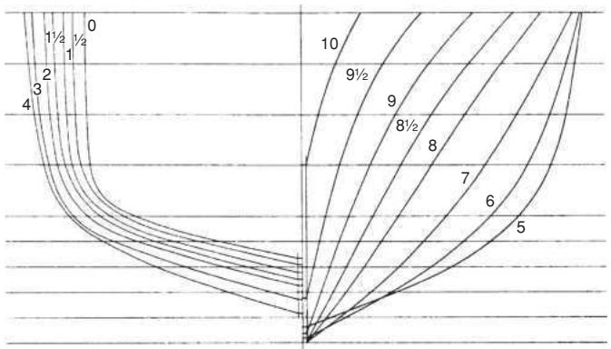

contour

| Contour Value | X-Coordinate | Y-Coordinate |
| ------------- | ------------ | ------------ |
| 0             | -            | -            |
| 1/2           | -            | -            |
| 1             | -            | -            |
| 1/2           | -            | -            |
| 3             | -            | -            |
| 4             | -            | -            |
| 9½            | -            | -            |
| 9             | -            | -            |
| 8½            | -            | -            |
| 8             | -            | -            |
| 7             | -            | -            |
| 6             | -            | -            |
| 5             | -            | -            |

Figure 10.13. NPL series body plan: parent.

natural_image

3D wireframe surface plot showing curved grid lines and a shaded region, no text or symbols present

Figure 10.14. NTUA double-chine body plan.

$C _ { R }$ was derived by subtracting the ITTC $C _ { F M }$ from the model total resistance coefficient, $C _ { T M } . \mathrm { { C } _ { R } }$ and τ are presented as regression equations as follows:

$$
C _ {R} = \Sigma a _ {i} \cdot x _ {i} \quad \text { and } \quad \tau = \Sigma b _ {i} \cdot x _ {i}. \tag {10.39}
$$

Values of the variables $x _ { i }$ and coefficients $a _ { i } , ~ b _ { i }$ of the regressions for $C _ { R }$ and trim τ are given in Tables A3.17 and A3.18, Appendix A3. Wetted surface area can be estimated using an appropriate formula, such as Equation (10.92) to be found in Section 10.4.

The results of further resistance and seakeeping experiments on the NTUA series are included in [10.41].

# 10.3.3 Planing Craft

The main sources of data presented are the single-chine Series 62, the Savitsky equations for planing craft and, for the lower speed range, the WUMTIA regression of hard chine forms. The WUMTIA regression is described in Section 10.3.4.2. Blount [10.94] describes the selection of hard chine or round-bilge hulls for high Froude numbers. Savitsky and Koelbel [10.95] provide an excellent review of seakeeping considerations in the design and operation of hard chine planing hulls.

# 10.3.3.1 Series 62

This systematic series of single chine hull forms was tested at DTMB, over a range of hull parameters. These are described by Clement and Blount [10.42]. An example of the body plan for the series is shown in Figure 10.15 and definitions of length and breadth are shown in Figure 10.16. The series covered the following range of speed and hull parameters:

Speed: $F r _ { \nabla } \colon$ 1.0–3.5.

Length/breadth ratio $L _ { p } / B _ { p x } \colon 2 . 0 , 3 . 0 6 , 4 . 0 9 , 5 . 5 0 , 7 . 0 0 .$

Loading coefficient $A _ { P } / \nabla ^ { 2 / 3 } \colon 5 . 5 , 7 . 0 , 8 . 5 . L C G$ aft of centroid of $A _ { p } \colon 0 , 4 , 8 , 1 2 .$

Deadrise angle $\beta \colon 1 3 ^ { \circ }$ . Keuning and Gerritsma [10.43] later extended the series using a deadrise angle $\beta$ of 25◦.

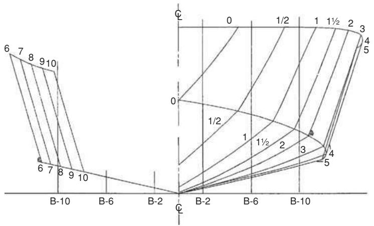

line

| Point | Value |
|-------|-------|
| 1     | 1/2   |
| 2     | 1½    |
| 3     | 3     |
| 4     | 5     |
| 5     | 4     |
| 6     | 6     |
| 7     | 7     |
| 8     | 8     |
| 9     | 9     |
| 10    | 10    |

Figure 10.15. Series 62 body plan.

$L _ { p }$ is the projected chine length (Figure 10.16), $A _ { P }$ is the projected planing bottom area (for practical purposes, it can be assumed to be equivalent to the static waterplane area), $B _ { p x }$ is the maximum breadth over chines and  is the displaced volume at rest.

The data are presented in terms of total resistance per ton $R _ { T } / \Delta$ for a 100,000 lb displacement ship.

Radojcic [10.83] carried out a regression analysis of the Series 62 resistance data and later updated the analysis [10.84]. Radojcic included the extension to the Series 62 by Keuning and Gerritsma [10.43], together with some of the models from Series 65 [10.45].

The resistance data are presented in terms of

$$
R _ {T} / \Delta = f [ A _ {P} / \nabla^ {2 / 3}, L _ {p} / B _ {p a}, L C G / L _ {p}, \beta_ {x} ].
$$

at speeds of Fr = 1.0, 1.25, 1.50, 1.75, 2.0, 2.5, 3.0, 3.5, where $B _ { p a }$ is the mean breadth over chines and $B _ { p a }$ is $A _ { p } / L _ { p }$ and $\beta _ { x }$ is the deadrise angle at 50% $L _ { p }$ .

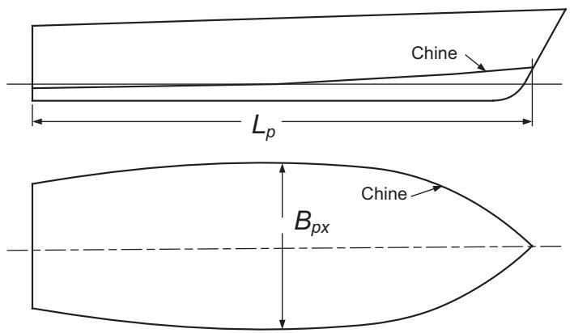

text_image

Chine
Lp
Bpx
Chine

Figure 10.16. Definitions of length and breadth.

The limits of the parameters in the regression are as follows:

Loading coefficient $A _ { P } / \nabla ^ { 2 / 3 } ,$ : 4.25–9.5.

Length/beam ratio $L _ { p } / B _ { p a } \colon 2 . 3 6 \mathrm { - } 6 . 7 3 .$

LCG from transom 100 $L C G / L _ { p } \colon 3 0 \% { - 4 4 . 8 \% }$ .

Deadrise angle at 50% $L _ { p } \colon 1 3 ^ { \circ } - 3 7 . 4 ^ { \circ } .$ .

Analysis of the Series 62 hull forms indicates that the ratio of maximum chine breadth to mean chine breadth $B _ { p x } / B _ { p a }$ varies from 1.18 to 1.22. It is suggested that a value of $B _ { p x } / B _ { p a } = 1 . 2 1$ be used for preliminary design and powering purposes.

Regression analysis was carried out for resistance $R _ { T } / \Delta$ , trim τ , wetted surface coefficient $S / \nabla ^ { 2 / 3 }$ and wetted length/chine length (length of wetted area) $L _ { W } / L _ { p }$ .

The regression equations for $R _ { T } / \Delta , \tau , S / \bigtriangledown ^ { 2 / 3 }$ and $L _ { W } / L _ { p }$ all take the following form:

$$
R _ {T} / \Delta = \mathrm{b0} + \mathrm{b1} \times \mathrm{X1} + \mathrm{b2} \times \mathrm{X2} + \mathrm{b3} \times \mathrm{X3} + \mathrm{b4} \times \mathrm{X4} + \mathrm{b5} \times \mathrm{X5} + \mathrm{b6}
$$

$$
\times \mathrm{X} 6 + \mathrm{b} 7 \times \mathrm{X} 7 \dots\dots\mathrm{b} 2 6 \times \mathrm{X} 2 6, \tag {10.40}
$$

where

<table><tr><td> $\mathrm{X1} = (A_P/\nabla^{2/3} - 6.875)/2.625$ </td><td> $\mathrm{X2} = (100\ LCG/L_p - 37.4)/7.4$ </td></tr><tr><td> $\mathrm{X3} = (L_p/B_{pa} - 4.545)/2.185$ </td><td> $\mathrm{X4} = (\beta_x - 25.2)/12.2$ </td></tr><tr><td> $\mathrm{X5} = \mathrm{X1} \times \mathrm{X2}$ </td><td> $\mathrm{X6} = \mathrm{X1} \times \mathrm{X3}$ </td></tr><tr><td> $\mathrm{X7} = \mathrm{X1} \times \mathrm{X4}$ </td><td> $\mathrm{X8} = \mathrm{X2} \times \mathrm{X3}$ </td></tr><tr><td> $\mathrm{X9} = \mathrm{X2} \times \mathrm{X4}$ </td><td> $\mathrm{X10} = \mathrm{X3} \times \mathrm{X4}$ </td></tr><tr><td> $\mathrm{X11} = \mathrm{X1}^2$ </td><td> $\mathrm{X12} = \mathrm{X2}^2$ </td></tr><tr><td> $\mathrm{X13} = \mathrm{X3}^2$ </td><td> $\mathrm{X14} = \mathrm{X4}^2$ </td></tr><tr><td> $\mathrm{X15} = \mathrm{X1} \times \mathrm{X2}^2$ </td><td> $\mathrm{X16} = \mathrm{X1} \times \mathrm{X3}^2$ </td></tr><tr><td> $\mathrm{X17} = \mathrm{X1} \times \mathrm{X4}^2$ </td><td> $\mathrm{X18} = \mathrm{X2} \times \mathrm{X1}^2$ </td></tr><tr><td> $\mathrm{X19} = \mathrm{X2} \times \mathrm{X3}^2$ </td><td> $\mathrm{X20} = \mathrm{X2} \times \mathrm{X4}^2$ </td></tr><tr><td> $\mathrm{X21} = \mathrm{X3} \times \mathrm{X1}^2$ </td><td> $\mathrm{X22} = \mathrm{X3} \times \mathrm{X2}^2$ </td></tr><tr><td> $\mathrm{X23} = \mathrm{X3} \times \mathrm{X4}^2$ </td><td> $\mathrm{X24} = \mathrm{X4} \times \mathrm{X1}^2$ </td></tr><tr><td> $\mathrm{X25} = \mathrm{X4} \times \mathrm{X2}^2$ </td><td> $\mathrm{X26} = \mathrm{X4} \times \mathrm{X3}^2$ </td></tr></table>

$R _ { T } / \Delta , \tau , S / \nabla ^ { 2 / 3 }$ and $L _ { W } / L _ { p }$ all have the same X1 to X26 values, with $R _ { T } / \Delta$ having the $\mathbf { \hat { b } } ^ { \dagger }$ coefficients b0 to b26, τ the $\mathbf { \dot { a } } _ { } ^ { \mathbf { \dot { a } } }$ coefficients, $S / \nabla ^ { 2 / 3 }$ the $\cdot _ { \mathrm { c } } \cdot$ coefficients and $L _ { W } / L _ { p }$ the $ { \mathrm { \Delta } } \cdot  { \mathrm { d } } ^ { \flat }$ coefficients. The coefficients a0–a26, b0–b26, c0–c26 and d0–d26 are given in Tables A3.19 to A3.22 in Appendix A3. These are the updated coefficients, taken from [10.84].

$R _ { T } / \Delta$ is for a 100,000 lb displacement ship. It is more convenient to consider this as a displacement volume of $\nabla = 4 4 . 2 ~ \mathrm { m } ^ { 3 }$ , a displacement mass of $\Delta = 4 5 . 3$ tonnes or a displacement force of 444.4 kN.

The total resistance $R _ { T }$ is then calculated as

$$
R _ {T} = R _ {T} / \Delta \times (\nabla \times \rho \times g) k N.
$$

For ships other than the basis 100,000 lb (45.3 tonnes) displacement, a skin friction correction is required, as follows:

$$
\text { Corrected } \left(R _ {T} / \Delta\right) _ {\text { corr }} = R _ {T} / \Delta - \left[ \left(C _ {F \text { basis }} - C _ {F \text { new }}\right) \times \frac {1}{2} \rho \times S \times V ^ {2} / 1 0 0 0 \right] / \Delta ,
$$

and $\Delta _ { \mathrm { b a s i s } }$ is the basis displacement of 444.4 kN. The correction will be subtracted for vessels with a length greater than the basis and added for vessels with a length less than the basis. Schoenherr $C _ { F }$ , Equation (4.10), or ITTC $C _ { F } ,$ Equation (4.15), would both be suitable.

The scale ratio can be used to derive the length of the basis ship as follows:

$$
\lambda = \sqrt [ 3 ]{\frac {\Delta_ {\text { new }} \cdot \rho_ {\text { basis }}}{\Delta_ {\text { basis }} \cdot \rho_ {\text { new }}}}. \tag {10.41}
$$

The basis displacement $\Delta _ { \mathrm { b a s i s } } = 4 5 . 3$ tonnes. The cube root of the largest likely change in density would lead to a correction of less than 1% and the density correction can be omitted. The scale ratio can then be written as

$$
\lambda = \sqrt [ 3 ]{\frac {\Delta_ {\mathrm{new}}}{4 5 . 3}}. \tag {10.42}
$$

Analysis of the Series 62 hull forms indicates that the waterline length $L _ { W L }$ , at rest, is shorter than $L _ { p }$ by about 1% at $L / B = 7$ up to about 2.5% at $L / B = 2$ . It is suggested that an average value of 2% be used for preliminary design and powering purposes, that is:

$$
L _ {p \mathrm{new}} = L _ {W L} \times 1. 0 2
$$

$$
L _ {p \mathrm{basis}} = L _ {p \mathrm{new}} / \lambda
$$

$$
L _ {\mathrm{basis}} = (L _ {W} / L _ {p}) \times L _ {p \mathrm{basis}}
$$

$$
L _ {\mathrm{new}} = \left(L _ {W} / L _ {p}\right) \times L _ {p \mathrm{new}}
$$

$$
R e _ {\text { basis }} = V \cdot L _ {\text { basis }} / 1. 1 9 \times 1 0 ^ {- 6} \text {   and   } C _ {F \text { basis }} = f (R e)
$$

$$
R e _ {\text { new }} = V \cdot L _ {\text { new }} / 1. 1 9 \times 1 0 ^ {- 6} \text { and } C _ {F \text { new }} = f (R e).
$$

Example: Consider a craft with $L _ { W L } = 3 0 \mathrm { m } , \Delta = 1 5 3$ tonnes (1501 kN), travelling at 35 knots. From the regression analysis, $R _ { T } / \Delta = 0 . 1 4 0 , S = 2 2 7 { \mathrm m } ^ { 2 }$ and $L _ { W } / L _ { p } = 0 . 6 3$ at this speed.

$$
\lambda = \sqrt [ 3 ]{\frac {1 5 3}{4 5 . 3}} = 1. 5 0.
$$

$$
L _ {p \mathrm{new}} = L _ {W L} \times 1. 0 2 = 3 0 \times 1. 0 2 = 3 0. 6 \mathrm{m}.
$$

$$
L _ {p \mathrm{basis}} = \mathrm{L} _ {p \mathrm{new}} / 1. 5 = 3 0. 6 / 1. 5 = 2 0. 4 \mathrm{m}.
$$

$$
L _ {\text { basis }} = \left(L _ {W} / L p\right) \times L _ {p \text { basis }} = 0. 6 3 \times 2 0. 4 = 1 2. 8 5 \mathrm{m}.
$$

$$
L _ {\text { new }} = \left(L _ {W} / L p\right) \times L _ {p \text { new }} = 0. 6 3 \times 3 0. 6 = 1 9. 2 8 \mathrm{m}.
$$

$$
R e _ {\text { basis }} = V L / \nu = 3 5 \times 0. 5 1 4 4 \times 1 2. 8 5 / 1. 1 9 \times 1 0 ^ {- 6} = 1. 9 4 4 \times 1 0 ^ {8}.
$$

$$
C _ {F \text {basis}} = 0. 0 7 5 / (\log R e - 2) ^ {2} = 0. 0 7 5 / (8. 2 8 9 - 2) ^ {2} = 0. 0 0 1 8 9 6.
$$

$$
R e _ {\text { new }} = V L / \nu = 3 5 \times 0. 5 1 4 4 \times 1 9. 2 8 / 1. 1 9 \times 1 0 ^ {- 6} = 2. 9 1 7 \times 1 0 ^ {8}.
$$

$$
C _ {F \mathrm{new}} = 0. 0 7 5 / (\log R e - 2) ^ {2} = 0. 0 7 5 / (8. 4 6 5 - 2) ^ {2} = 0. 0 0 1 7 9 4.
$$

Skin friction correction

$$
\begin{array}{l} = \left(C _ {F \text { basis }} - C _ {F \text { new }}\right) \times {} ^ {1} / 2 \rho \times S \times V ^ {2} / 1 0 0 0 \\ = (0. 0 0 1 8 9 6 - 0. 0 0 1 7 9 4) \times {} ^ {1 / 2} \times 1 0 2 5 \times 2 2 7 \times (3 5 \times 0. 5 1 4 4) ^ {2} / 1 0 0 0 \\ = 3. 8 5 \mathrm{kN}. \\ \end{array}
$$

$$
R _ {T} / \Delta = 0. 1 4 0, \text { and   (uncorrected) } R _ {T} = 0. 1 4 0 \times 1 5 0 1 = 2 1 0. 1 4 \mathrm{kN}.
$$

Corrected $R _ { T } = 2 1 0 . 1 4 - 3 . 8 5 = 2 0 6 . 2 9 \mathrm { k N } .$

It is seen that going from a 20 m/45 tonne craft up to a 30 m/153 tonne craft has led to a skin friction correction of 1.8%. It is effectively not necessary to apply the correction between about 18 m/33 tonnes up to about 23 m/67 tonnes. Applications of the Series 62 data are described in Chapter 17.

# 10.3.3.2 Savitsky Equations for Prismatic Planing Forms

The force developed by a planing surface and the centre at which it acts is described through equations by Savitsky [10.46].

Following flat plate tests, the following formula is put forward for the total lift (buoyant contribution and dynamic lift) acting on a flat surface with zero deadrise:

$$
C _ {L 0} = \tau^ {1. 1} \left[ 0. 0 1 2 0 \lambda^ {1 / 2} + 0. 0 0 5 5 \frac {\lambda^ {2 . 5}}{C _ {V} ^ {2}} \right], \tag {10.43}
$$

with limits of application: $0 . 6 0 \leq C _ { V } \leq 1 3 ; 2 ^ { \circ } \leq \tau \leq 1 5 ^ { \circ }$ , with $\tau$ in degrees; $\lambda \leq 4 . 0 .$ .

For surfaces with deadrise $\beta$ , the lift coefficient requires correction to

$$
C _ {L \beta} = C _ {L 0} - 0. 0 0 6 5 \beta C _ {L 0} ^ {0. 6 0}, \tag {10.44}
$$

with limit of application $\beta \leq 3 0 ^ { \circ }$ , with $\beta$ in degrees.

By consideration of the point of action of the buoyant contribution and the dynamic contribution, the overall position of the centre of pressure is given as

$$
C _ {P} = 0. 7 5 - \frac {1}{5 . 2 1 \left(\frac {C _ {V}}{\lambda}\right) ^ {2} + 2 . 3 9} = \frac {l _ {P}}{\lambda b} = \frac {l _ {P}}{l _ {m}} \tag {10.45}
$$

where $C _ { P } = { \frac { l _ { P } } { \lambda b } } = { \frac { l _ { P } } { l _ { m } } }$

${ \mathrm { w i t h ~ } } \ \lambda = { \frac { ( l _ { K } + l _ { C } ) / 2 } { b } } = { \frac { l _ { m } } { b } }$

${ \mathrm { a n d ~ } } C _ { V } = { \frac { V } { \sqrt { g b } } }$

${ \mathrm { w h e r e } } \quad C _ { L } = { \frac { \Delta } { 0 . 5 \rho b ^ { 2 } V ^ { 2 } } } \quad { \mathrm { a n d } } \quad S = \lambda b ^ { 2 } { \mathrm { s e c } } \beta .$ where CL =

Further definitions, including reference to Figure 10.17, are as follows:

N: Normal bottom pressure load, buoyant and dynamic, acting perpendicular to keel through the centre of pressure.

b: Mean chine beam $( = B _ { p a }$ in Series 62 definition).

$D _ { \mathrm { A P P } } \colon$ Appendage resistance (rudder, shafting, shaft brackets, etc.).

$L _ { \mathrm { A P P } } .$ Appendage lift.

T: Propeller thrust, along shaft line at ε to keel.

$S _ { P } \mathrm { : }$ Propeller–hull interaction load, perpendicular to keel, downwards or upwards.

At the preliminary design stage, the lift and its corresponding point of action, along with the frictional forces acting, comprise the most important components in the balance of forces on a planing craft, Figure 10.17. The Savitsky equations can be used in an overall balance of forces and moments to determine the running trim angle and the thrust required. The forces acting are shown in Figure 10.17 and the general approach for deriving a balance of forces and moments is shown in Figure 10.18.

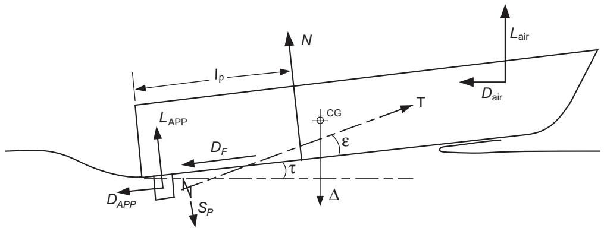

text_image

L'app
D_F
S_P
N
I_p
CG
T
ε
τ
Δ
D_APP
L_air
D_air

Figure 10.17. Forces on a planing craft.

EXAMPLE USING THE SAVITSKY EQUATIONS. Consider a vessel with displacement $\Delta =$ 70 tonnes, mean chine beam $b = 6 . 5 \mathrm { ~ m ~ }$ , deadrise $\beta = 2 0 ^ { \circ }$ and $L C G = 1 0 . 0$ m forward of transom. Speed Vs = 45 knots (23.15 m/s), CV = √Vgb $V s = 4 5$ $\begin{array} { r } { C _ { V } = \frac { V } { \sqrt { g b } } = \frac { 2 3 . 1 5 } { \sqrt { 9 . 8 1 \times 6 . 5 } } = 2 . 8 9 9 . } \end{array}$ . Required calculations are for $l _ { m } , R _ { T }$ (thrust T) and trim $\tau .$ .

Appendage drag and air drag are not included in this illustrative example. They can, in principle, be included in the overall balance of forces, Hadler [10.49].

It is assumed that the lines of action of the frictional drag forces and thrust act through the centre of gravity (CG), leading to the simplified force diagram shown in Figure 10.19. These forces could be applied at different lines of action and included separately in the moment balance.

Resolved forces parallel to the keel are

$$
T = \Delta \sin \tau + D _ {F}, \tag {10.46}
$$

where $D _ { F }$ is the frictional drag with

$$
D _ {F} = \frac {1}{2} \rho S V ^ {2} C _ {F}
$$

and $S = l _ { m }$ b sec $\beta$ , where $\beta$ is the deadrise angle.

$C _ { F }$ is derived using the ITTC formula, Equation (4.15), $C _ { F } = 0 . 0 7 5 / ( \log _ { 1 0 }$ $R e - 2 ) ^ { 2 }$ .

Resolving forces perpendicular to keel,

$$
N = \Delta \cos \tau . \tag {10.47}
$$

Taking moments about transom at height of $_ \mathrm { C G }$ ,

$$
\Delta \times L _ {C G} = N \times l p, \tag {10.48}
$$

with $\Delta = \rho g \nabla \left( \mathbf { k N } \right) , \Delta = 9 . 8 1 \times 7 0 . 0 = 6 8 6 . 7 \ \mathbf { k N }$ , and $L _ { C G } = 1 0 . 0 \ : \mathrm { m }$ , then $6 8 6 7 . 0 =$ $N \times l p$ .

flowchart

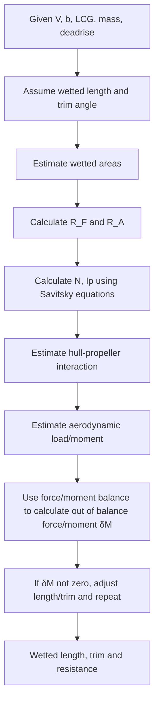
```mermaid
graph TD
    A["Given V, b, LCG, mass, deadrise"] --> B["Assume wetted length and trim angle"]
    B --> C["Estimate wetted areas"]
    C --> D["Calculate R_F and R_A"]
    D --> E["Calculate N, Ip using Savitsky equations"]
    E --> F["Estimate hull-propeller interaction"]
    F --> G["Estimate aerodynamic load/moment"]
    G --> H["Use force/moment balance to calculate out of balance force/moment δM"]
    H --> I["If δM not zero, adjust length/trim and repeat"]
    I --> J["Wetted length, trim and resistance"]
```

Figure 10.18. Derivation of the balance of forces and moments on a planing hull.

The Savitsky equations are used with the above force and moment balances to determine $\tau , l _ { m } , l _ { p }$ and N, and the resulting required thrust, T.

Following the procedure outlined in Figure 10.18, assume trim angle, τ , calculate $\begin{array} { r } { C _ { L \beta } = \frac { \Delta } { 0 . 5 \rho b ^ { 2 } V ^ { 2 } } } \end{array}$ . Find $C _ { L 0 }$ giving the value of $C _ { L \beta }$ from satisfaction of Equation (10.44). The mean wetted length, $l _ { m }$ , required to achieve this lift at this trim angle is found through satisfaction of the Savitsky equation for $C _ { L 0 }$ , Equation (10.43), where $\lambda = l _ { m } / b$ and, in this example at 45 knots, $C _ { V } = 2 . 8 9 9$ .

Having derived $l _ { m } \left( \lambda \right)$ , the centre of pressure $l _ { p }$ can be determined from Equation (10.45), as follows:

$$
\frac {l _ {p}}{l _ {m}} = 0. 7 5 - \frac {1}{5 . 2 1 \left(\frac {C _ {V}}{\lambda}\right) ^ {2} + 2 . 3 9}.
$$

Table 10.6. Summary of iterative procedure using Savitsky equations 

<table><tr><td> $\tau$ </td><td> $C_{L\beta}$ </td><td> $C_{L0}$ (10.44)</td><td> $\lambda$ (10.43)</td><td> $l_m$ </td><td> $l_p$ (10.45)</td><td>N(10.47)</td><td> $\delta M$ </td></tr><tr><td> $2.0^\circ$ </td><td>0.0592</td><td>0.0898</td><td>3.8083</td><td>24.754</td><td>13.989</td><td>686.28</td><td>-2733.27</td></tr><tr><td> $3.0^\circ$ </td><td>0.0592</td><td>0.0898</td><td>2.6310</td><td>17.102</td><td>10.864</td><td>685.76</td><td>-582.98</td></tr><tr><td> $4.0^\circ$ </td><td>0.0592</td><td>0.0898</td><td>1.8701</td><td>12.155</td><td>8.301</td><td>685.03</td><td>1180.42</td></tr><tr><td> $3.50^\circ$ </td><td>0.0592</td><td>0.0898</td><td>2.2138</td><td>14.390</td><td>9.527</td><td>685.42</td><td>340.759</td></tr><tr><td> $3.31^\circ$ </td><td>0.0592</td><td>0.0898</td><td>2.3658</td><td>15.378</td><td>10.028</td><td>685.55</td><td>-7.42</td></tr></table>

The overall balance of moments on the craft: $\Delta \times L _ { C G } - N \times l p = \delta M$ for $\delta M =$ 0 may now be checked using the obtained values of N and lp for the assumed trim τ and derived $l _ { m }$ . If the forces on the craft are not in balance, a new trim angle is chosen and the calculations are repeated until $\delta M = 0$ .

A summary of the calculations and iterative procedure is shown in Table 10.6.

From a cross plot or interpolation, equilibrium (δM  0) is obtained with a trim τ of $3 . 3 1 ^ { \circ }$ and $l _ { m } = 1 5 . 3 7 8 \mathrm { m }$ .

Reynolds number $R e = V l _ { m } / \nu = 2 3 . 1 5 \times 1 5 . 3 7 8 / 1 . 1 9 \times 1 0 ^ { - 6 } = 2 . 9 9 1 \times 1 0 ^ { 8 }$

and

$$
C _ {F} = 0. 0 7 5 / (\log R e - 2) ^ {2} = 1. 7 8 8 4 \times 1 0 ^ {- 3}.
$$

$$
S = l _ {m} b \sec \beta = 1 5. 3 7 8 \times 6. 5 \times \sec 2 0 ^ {\circ} = 1 0 6. 3 7 \mathrm{m} ^ {2}.
$$

$$
D _ {F} = \frac {1}{2} \rho S V ^ {2} C _ {F} = 0. 5 \times 1 0 2 5 \times 1 0 6. 3 7 \times 2 3. 1 5 ^ {2} \times 1. 7 8 8 4 \times 1 0 ^ {- 3} = 5 2. 2 4 \mathrm{kN}.
$$

Thrust required along shaft line

$$
T = \Delta \sin \tau + D _ {F} = 6 8 6. 7 \sin 3. 3 1 + 5 2. 2 4 = 9 1. 8 9 \mathrm{kN}
$$

Resistance $R _ { T } = T \cos \tau = 9 1 . 8 9 \times \cos 3 . 3 1 = 9 1 . 7 4 \mathrm { k N }$

Effective power $P _ { E } = R _ { T } \times V s = 9 1 . 7 4 \times 2 3 . 1 5 = 2 1 2 3 . 5 \mathrm { k W }$

The effects of appendages, propulsive forces and air drag can also be incorporated in the resistance estimating procedure, Hadler [10.49]. Similarly, the lines of action of the various forces can be modified as necessary.

Example applications of the Savitsky equations are included in Chapter 17.

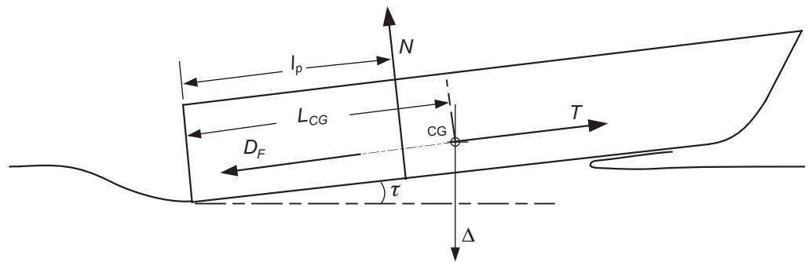

text_image

I_p
N
L_CG
D_F
CG
T
τ
Δ

Figure 10.19. Simplified forces on a planing craft.

# 10.3.4 Small Craft

# 10.3.4.1 Oortmerssen: Small Ships

Van Oortmerssen [10.85] developed regression equations for estimating the resistance of small ships such as tugs, fishing boats, stern trawlers and pilot boats, etc., broadly in the length range from 15 m to 75 m. The objective was to provide equations that would be accurate enough for design purposes. The analysis was based on 970 data points from 93 ship models that had been tested at The Netherlands Ship Model Basin (NSMB) (now Maritine Research Institute of the Netherlands [MARIN]) in the 1960s.

Approximate limits of the data (extracted from the diagrams) are as follows:

Speed: $F r = 0 . 2 – 0 . 5 .$ .

L/B: 3.4–6.2.

LCB: − 4.4%L to + 1.6%L (mainly about −1%L).

$i _ { E } \colon 1 5 ^ { \circ } - 3 5 ^ { \circ }$ (mainly about 18◦–30◦).

where $i _ { E }$ is the half-angle of entrance of the waterline. If $i _ { E }$ is not known, an approximation is $i _ { E } = 1 2 0 \ C _ { B } - 5 0 ( 0 . 5 < C _ { B } < 0 . 7 )$ (Molland)

B/T: 1.9–3.2.

$C _ { P } { : 0 . 5 5 { - 0 . 7 0 } }$ (mainly about 0.60).

$C _ { M } \mathrm { : 0 . 7 6 - 0 . 9 4 }$ (mainly about 0.82–0.92).

If $C _ { M }$ is not known, an approximation for small ships is given in Equation (10.29b).

A displacement length $L _ { D }$ is used, defined as ${ \cal L } _ { D } = 0 . 5 ( { \cal L } _ { B P } + { \cal L } _ { W L } )$ , with $F r ,$ $R e , L C B , C _ { P }$ and $C _ { M }$ being based on $L _ { D }$ . An angle of entrance parameter is defined as

$$
C _ {W L} = i _ {E} \times L _ {D} / B.
$$

$L _ { W L }$ can be used for length without incurring significant error.

The residuary resistance was derived using the ITTC1957 line for $C _ { F } .$ The components of the equation for residuary resistance ratio $R _ { R } / \Delta$ are as follows:

$$
\begin{array}{l} \frac {R _ {R}}{\Delta} = c _ {1} e ^ {- \frac {m}{9} F r ^ {- 2}} + c _ {2} e ^ {- m F r ^ {- 2}} + c _ {3} e ^ {- m F r ^ {- 2}} \sin F r ^ {- 2} \\ + c _ {4} e ^ {- m F r ^ {- 2}} \cos F r ^ {- 2}, \tag {10.49} \\ \end{array}
$$

where

$$
\begin{array}{l} m = 0. 1 4 3 4 7 C _ {P} ^ {- 2. 1 9 7 6} \\ \mathrm{c} _ {\mathrm{i}} = \left\{\mathrm{d} _ {\mathrm{i}, 0} + \mathrm{d} _ {\mathrm{i}, 1} \cdot L C B + \mathrm{d} _ {\mathrm{i}, 2} \cdot L C B ^ {2} + \mathrm{d} _ {\mathrm{i}, 3} \cdot C _ {P} + \mathrm{d} _ {\mathrm{i}, 4} \cdot C _ {P} ^ {2} \right. \\ = \mathrm{d} _ {\mathrm{i}, 5} \cdot (L _ {D} / B) + \mathrm{d} _ {\mathrm{i}, 6} \cdot (L _ {D} / B) ^ {2} + \mathrm{d} _ {\mathrm{i}, 7} C _ {W L} + \mathrm{d} _ {\mathrm{i}, 8} C _ {W L} ^ {2} \\ + \mathrm{d} _ {\mathrm{i}, 9} \cdot (B / T) + \mathrm{d} _ {\mathrm{i}, 1 0} \cdot (B / T) ^ {2} + \mathrm{d} _ {\mathrm{i}, 1 1} \cdot C _ {M} \} \times 1 0 ^ {- 3}, \\ \end{array}
$$

where LCB is LCB forward of 0.5 L as a percentage of L and the coefficients $\mathrm { d _ { i } }$ are given in Table A3.23, Appendix A3. Note that in the table of coefficients in the original paper [10.85], there was a sign error in coefficient $\mathrm { d } _ { 3 , 5 }$ which should be 9.86873, not –9.86873.

Table 10.7. Trial allowances for $\Delta C _ { F }$ 

<table><tr><td>Allowances for</td><td> $\Delta C_{F}$ </td></tr><tr><td>Roughness, all-welded hulls</td><td>0.00035</td></tr><tr><td>Steering resistance</td><td>0.00004</td></tr><tr><td>Bilge keel resistance</td><td>0.00004</td></tr><tr><td>Air resistance</td><td>0.00008</td></tr></table>

The residuary resistance is calculated as

$$
R _ {R} = R _ {R} / \Delta \times (\nabla \times \rho \times g).
$$

$C _ { F }$ is derived using the ITTC formula.

$\Delta C _ { F }$ allowances for trial conditions are given in Table 10.7.

Friction resistance is then derived as

$$
R _ {F} = (C _ {F} + \Delta C _ {F}) \times \frac {1}{2} \rho S V ^ {2}.
$$

S can be calculated from

$$
S = 3. 2 2 3 \nabla^ {2 / 3} + 0. 5 4 0 2 L _ {D} \nabla^ {1 / 3}
$$

which has a format similar to Equation (10.85) for larger ships.

# 10.3.4.2 WUMTIA: Small Craft: Round Bilge and Hard Chine

A regression analysis was carried out on chine and round-bilge hull forms which had been tested by WUMTIA at the University of Southampton, Robinson [10.86]. Over 600 hull forms had been tested by WUMTIA since 1968, including both chine and round-bilge hull forms representing vessels ranging typically from 10 m to 70 m.

Thirty test models of round-bilge generic form were used in the regression analysis and 66 of chine generic form. Tests at different displacements were also included leading to a total of 47 sets of round-bilge resistance data and 103 sets of hard chine resistance data. Separate regression coefficients were derived for the round-bilge and hard chine forms. The data were all taken from hull forms that had been optimised for their running trim characteristics at realistic operating speeds and include, for the chine hulls, the effects of change in wetted area with speed.

The analyses covered the speed range, as follows: The volume Froude number $F r _ { \nabla } \colon 0 . 5 0 { - 2 } . 7 5$ , approximate length Froude number range $F r = 0 . 2 5 – 1 . 2$ , where

$$
F r _ {\nabla} = \frac {V}{\sqrt {g \nabla^ {1 / 3}}}, \quad F r = \frac {V}{\sqrt {g L}} \quad \text { and } \quad F r _ {\nabla} = F r \times \left(\frac {L}{\nabla^ {1 / 3}}\right) ^ {0. 5}. \tag {10.50}
$$

The range of hull parameters $L / B$ and $L / \nabla ^ { 1 / 3 }$ are shown in Figure 10.20

It is noted that for the round-bilge hulls there are few data between $L / B = 5 . 5 -$ 6.5. Above $F r _ { \nabla } = 1 . 5 ,$ , the upper limit of $L / B$ is 5.5, and it is recommended that the data for $L / B > 5 . 5$ be restricted to speeds $< F r _ { \nabla } = 1 . 5$ .

(a)   
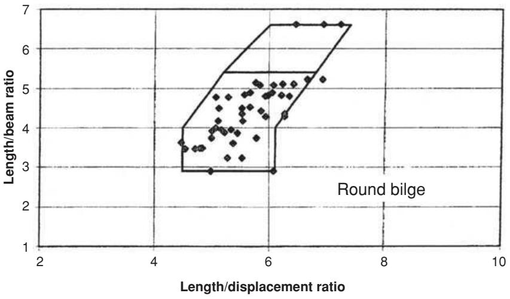

scatter

| Length/displacement ratio | Length/beam ratio |
| ------------------------- | ----------------- |
| 4.5                       | 3.5               |
| 5.0                       | 4.0               |
| 5.5                       | 4.5               |
| 6.0                       | 5.0               |
| 6.5                       | 5.5               |
| 7.0                       | 6.0               |
| 7.5                       | 6.5               |
| 8.0                       | 6.5               |

(b)   
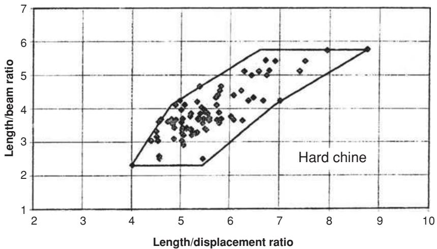

scatter

| Length/displacement ratio | Length/beam ratio |
| ------------------------- | ----------------- |
| 4.0                       | 2.5               |
| 5.0                       | 3.5               |
| 6.0                       | 4.5               |
| 7.0                       | 5.5               |
| 8.0                       | 6.0               |
| 9.0                       | 6.0               |

Figure 10.20. WUMTIA data boundaries: (a) Round bilge, (b) Hard chine.

The data are presented in terms of a C-Factor $( C _ { \mathrm { F A C } } )$ which was developed by small craft designers for the prediction of power at an early design stage.

$$
C _ {\mathrm{FAC}} = 3 0. 1 2 6 6 \frac {V _ {K}}{\sqrt [ 4 ]{L}} \sqrt {\frac {\Delta}{2 P _ {E}}}, \tag {10.51}
$$

where the constant 30.1266 was introduced to conserve the value of $C _ { \mathrm { F A C } }$ , which was originally based on imperial units. Above a $F r _ { \nabla }$ of about $1 . 0 , C _ { \mathrm { F A C } }$ lies typically between about 50 and 70.

Rearranging Equation (10.51),

$$
P _ {E} = 4 5 3. 8 \Delta \frac {V _ {K} ^ {2}}{\sqrt {L}} \frac {1}{C _ {\mathrm{FAC}} ^ {2}}, \tag {10.52}
$$

where $P _ { E }$ is in kW,  is in tonnes, $V _ { K }$ is in knots and L is in metres.

The predictions for $C _ { \mathrm { F A C } }$ are presented as regression equations.

For round-bilge hulls:

$$
\begin{array}{l} C _ {\mathrm{FAC}} = \mathrm{a} _ {0} + \mathrm{a} _ {1} (L / \nabla^ {1 / 3}) + \mathrm{a} _ {2} L / B + \mathrm{a} _ {3} (S / L ^ {2}) ^ {1 / 2} + \mathrm{a} _ {4} (L / \nabla^ {1 / 3}) ^ {2} + \mathrm{a} _ {5} (L / B) ^ {2} \\ + \mathrm{a} _ {6} (S / L ^ {2}) + \mathrm{a} _ {7} (L / \nabla^ {1 / 3}) ^ {3} + \mathrm{a} _ {8} (L / B) ^ {3} + \mathrm{a} _ {9} (S / L ^ {2}) ^ {3 / 2}. \tag {10.53} \\ \end{array}
$$

For chine hulls:

$$
C _ {\mathrm{FAC}} = \mathrm{a} _ {0} + \mathrm{a} _ {1} L / \nabla^ {1 / 3} + \mathrm{a} _ {2} L / B + \mathrm{a} _ {3} (L / \nabla^ {1 / 3}) ^ {2}
$$

$$
+ \mathrm{a} _ {4} (L / B) ^ {2} + \mathrm{a} _ {5} (L / \nabla^ {1 / 3}) ^ {3} + \mathrm{a} _ {6} (L / B) ^ {3}. \tag {10.54}
$$

The wetted area S for the round-bilge and hard chine forms can be estimated using Equations (10.91) and (10.93), to be found in Section 10.4, noting that for the chine hull the wetted area is speed dependent.

The regression coefficients a0 to a9 in Equations (10.53) and (10.54) are given in Tables A3.24 and A3.25, Appendix A3. Note that in the table of coefficients for the hard chine hulls in the original paper [10.86], there was a sign error at $F r _ { \nabla } = 2 . 0$ . The sixth term should be 0.298946, not  0.298946.

It should be noted that these regression equations, (10.53) and (10.54), tend to give slightly pessimistic predictions of power. As a result of advances in scaling techniques and the inclusion of extra model data in an updated analysis, it is recommended [10.96] that the original predictions [10.86] for the round bilge hulls be reduced on average by 4% and those for the chine hulls by 3%.

# 10.3.5 Multihulls

# 10.3.5.1 Southampton Round-Bilge Catamaran Series

This systematic series of high-speed semi-displacement catamaran hull forms was developed by the University of Southampton. These hull forms are suitable for fast semi-displacement ferries and other such applications. The results of the tests and investigations are reported in [10.50] and [10.51] and offer one of the widest parametric sets of resistance data for catamarans. Insel and Molland [10.50] also include the results of direct physical measurements of viscous resistance and wave resistance. Details of the models are given in Table 10.8. All models were tested in monohull mode and in catamaran mode at four lateral hull separations. The body plans for the series were based on extended versions of the NPL round-bilge series, Figure 10.13, and are shown in Figure 10.21. Reference [10.52] extended these data to include change in $C _ { P }$ .

The series covered the following range of speeds and demihull parameters:

Speed: Fr: 0.20–1.0.

Demihull parameters: $C _ { B } \colon 0 . 4 0 ( \mathrm { f i x e d } ) ; L / \nabla ^ { 1 / 3 } \colon 6 . 3 - 9 . 5 ; B / T \colon 1 . 5 , 2 . 0 , 2 . 5 ; L C B$ : 6.4% aft; $S _ { C } / L = 0 . 2 0 , 0 . 3 0 , 0 . 4 0 , 0 . 5 0$ , where $S _ { C }$ is the separation of the centrelines of the demihulls.

Insel and Molland [10.50] describe the total resistance of a catamaran as

$$
C _ {T} = (1 + \phi k) \sigma C _ {F} + \tau C _ {W}, \tag {10.55}
$$

Table 10.8. Details of models: Southampton catamaran series 

<table><tr><td>Model</td><td> $L(m)$ </td><td> $L/B$ </td><td> $B/T$ </td><td> $L/\nabla^{1/3}$ </td><td> $C_B$ </td><td> $C_P$ </td><td> $C_M$ </td><td> $S (m^2)$ </td><td> $LCB \%L$ </td></tr><tr><td>3b</td><td>1.6</td><td>7.0</td><td>2.0</td><td>6.27</td><td>0.397</td><td>0.693</td><td>0.565</td><td>0.434</td><td>-6.4</td></tr><tr><td>4a</td><td>1.6</td><td>10.4</td><td>1.5</td><td>7.40</td><td>0.397</td><td>0.693</td><td>0.565</td><td>0.348</td><td>-6.4</td></tr><tr><td>4b</td><td>1.6</td><td>9.0</td><td>2.0</td><td>7.41</td><td>0.397</td><td>0.693</td><td>0.565</td><td>0.338</td><td>-6.4</td></tr><tr><td>4c</td><td>1.6</td><td>8.0</td><td>2.5</td><td>7.39</td><td>0.397</td><td>0.693</td><td>0.565</td><td>0.340</td><td>-6.4</td></tr><tr><td>5a</td><td>1.6</td><td>12.8</td><td>1.5</td><td>8.51</td><td>0.397</td><td>0.693</td><td>0.565</td><td>0.282</td><td>-6.4</td></tr><tr><td>5b</td><td>1.6</td><td>11.0</td><td>2.0</td><td>8.50</td><td>0.397</td><td>0.693</td><td>0.565</td><td>0.276</td><td>-6.4</td></tr><tr><td>5c</td><td>1.6</td><td>9.9</td><td>2.5</td><td>8.49</td><td>0.397</td><td>0.693</td><td>0.565</td><td>0.277</td><td>-6.4</td></tr><tr><td>6a</td><td>1.6</td><td>15.1</td><td>1.5</td><td>9.50</td><td>0.397</td><td>0.693</td><td>0.565</td><td>0.240</td><td>-6.4</td></tr><tr><td>6b</td><td>1.6</td><td>13.1</td><td>2.0</td><td>9.50</td><td>0.397</td><td>0.693</td><td>0.565</td><td>0.233</td><td>-6.4</td></tr><tr><td>6c</td><td>1.6</td><td>11.7</td><td>2.5</td><td>9.50</td><td>0.397</td><td>0.693</td><td>0.565</td><td>0.234</td><td>-6.4</td></tr></table>

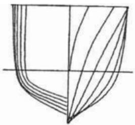

natural_image

Abstract geometric line drawing with curved and straight lines forming a symmetrical shape (no text or symbols)

Model: 3b

natural_image

Abstract curved line pattern forming a symmetrical shape with a central axis (no text or symbols)

Model: 4a

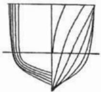

natural_image

Abstract geometric line drawing with curved and straight lines forming a symmetrical shape (no text or symbols)

Model: 4b

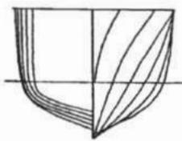

natural_image

Abstract geometric line drawing with curved and straight lines forming a symmetrical shape (no text or symbols)

Model: 4c

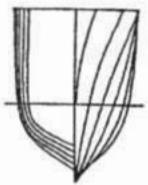  
Model: 5a

  
Model: 5b

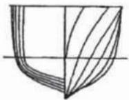  
Model: 5c

  
Model: 6a

  
Model: 6b

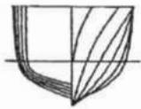  
Model: 6c   
Figure 10.21. Model body plans: Southampton catamaran series.

Table 10.9. Form factors 

<table><tr><td rowspan="2"> $L/\nabla^{1/3}$ </td><td colspan="2">Form factors</td></tr><tr><td>Monohulls $(1 + k)$ </td><td>Catamarans $(1 + \beta k)$ </td></tr><tr><td>6.3</td><td>1.35</td><td>1.48</td></tr><tr><td>7.4</td><td>1.21</td><td>1.33</td></tr><tr><td>8.5</td><td>1.17</td><td>1.29</td></tr><tr><td>9.5</td><td>1.13</td><td>1.24</td></tr></table>

where $C _ { F }$ is derived from the ITTC1957 correlation line, $( 1 + k )$ is the form factor for a demihull in isolation, $\phi$ is introduced to take account of the pressure field change around the hull, $\sigma$ takes account of the velocity augmentation between the two hulls and would be calculated from an integration of local frictional resistance over the wetted surface, $C _ { W }$ is the wave resistance coefficient for a demihull in isolation and $\tau$ is the wave resistance interference factor.

For practical purposes, $\phi$ and σ were combined into a viscous interference factor $\beta ,$ where $( 1 + \phi k ) \sigma C _ { F }$ is replaced by $( 1 + \beta k ) C _ { F }$

$$
\text { whence } \quad C _ {T} = (1 + \beta k) C _ {F} + \tau C _ {W}, \tag {10.56}
$$

noting that, for the demihull (monohull) in isolation, $\beta = 1$ and $\tau = 1$ .

Data are presented in terms of $C _ { R }$ , where $\begin{array} { r } { C _ { R } = \frac { R _ { R } } { 0 . 5 \rho S V ^ { 2 } } } \end{array}$ and S is the static wetted area, noting that the sum of the wetted areas of both demihulls was used in the case of the catamarans. $C _ { R }$ was derived from

$$
C _ {R} = C _ {T M} - C _ {F \text { MITTC }}. \tag {10.57}
$$

$C _ { R }$ data for the series are presented for the monohull and catamaran modes in Table A3.26, Appendix A3.

In applying the data, a form factor $( 1 + k )$ may or may not be used. Values of $( 1 + k )$ and $( 1 + \beta k )$ were derived and presented in the original references [10.50] and [10.51]. These values were later revised [10.53] and the proposed form factors are given in Table 10.9.

A satisfactory fit to the monohull form factors is

$$
(1 + k) = 2. 7 6 \left(\frac {L}{\nabla^ {1 / 3}}\right) ^ {- 0. 4 0}. \tag {10.58}
$$

A satisfactory fit to the catamaran form factors is

$$
(1 + \beta k) = 3. 0 3 \left(\frac {L}{\nabla^ {1 / 3}}\right) ^ {- 0. 4 0}. \tag {10.59}
$$

It is argued by some that there is effectively little form effect on these types of hull forms and, for lack of adequate information, ITTC recommends a value $( 1 + k ) = 1 . 0$ for high-speed craft. The results reported in [10.54 to 10.58], however, indicate in a number of cases practical working values of $( 1 + k )$ and $( 1 + \beta k )$ up to the same order of magnitude as those in Table 10.9.

Table 10.10. Coefficients in the equation 1000 $\begin{array} { r } { C _ { R } = { a } ( L / \nabla ^ { 1 / 3 } ) ^ { n } } \end{array}$ for extended NPL monohulls 

<table><tr><td>Fr</td><td>a</td><td>n</td><td> $R^{2}$ </td></tr><tr><td>0.4</td><td>152</td><td>-1.76</td><td>0.946</td></tr><tr><td>0.5</td><td>2225</td><td>-3.00</td><td>0.993</td></tr><tr><td>0.6</td><td>1702</td><td>-2.96</td><td>0.991</td></tr><tr><td>0.7</td><td>896</td><td>-2.76</td><td>0.982</td></tr><tr><td>0.8</td><td>533</td><td>-2.58</td><td>0.982</td></tr><tr><td>0.9</td><td>273</td><td>-2.31</td><td>0.970</td></tr><tr><td>1.0</td><td>122</td><td>-1.96</td><td>0.950</td></tr></table>

In deriving the $C _ { T S }$ value for the ship, the following equations are applied.

For monohulls,

$$
C _ {T S} = C _ {F S} + C _ {R \text { mono }} - k (C _ {F M} - C _ {F S}). \tag {10.60}
$$

For catamarans,

$$
C _ {T S} = C _ {F S} + C _ {R \text { cat }} - \beta k (C _ {F M} - C _ {F S}). \tag {10.61}
$$

In Equations (10.60) and (10.61), $C _ { F M }$ is derived using the model length from which $C _ { R }$ was derived, in this case, 1.60 m, Table 10.8.

As discussed in Section 10.3.2.1, when describing Series $6 4 ,$ , the resistance of high-speed semi-displacement craft tends to be dominated by $L / \nabla ^ { 1 / 3 }$ ratio and a useful presentation for such craft is resistance coefficient to a base of $L / \nabla ^ { 1 / 3 }$ at fixed Froude number. For these reasons, and to provide a practical design approach, regression analyses were carried out [10.33]. These relate residuary resistance, $C _ { R }$ , solely to $L / \nabla ^ { 1 / 3 }$ ratio at a number of fixed Froude numbers, $F r ,$ , for the monohull case. The form of the equation for the demihull (monohull) is as follows:

$$
C _ {R} = \mathrm{a} (L / \nabla^ {1 / 3}) ^ {\mathrm{n}}. \tag {10.62}
$$

In the case of the catamaran, a residuary resistance interference factor was expressed in a similar manner, the form of the equation being:

$$
\tau_ {R} = \mathrm{a} (L / \nabla^ {1 / 3}) ^ {\mathrm{n}}, \tag {10.63}
$$

where $\tau _ { R }$ is the residuary resistance interference factor and is defined as the ratio of the catamaran residuary resistance to the monohull residuary resistance.

The value of $\tau _ { R }$ was found to be dependent on speed, $L / \nabla ^ { 1 / 3 }$ , and separation of the hulls $S / L ,$ , but not to be influenced significantly by the particular hull shape. This was confirmed by comparing the interference factors for the extended NPL series [10.51] with results for a Series 64 hull form catamaran reported in [10.31], where similar trends in $\tau _ { R }$ were observed. This is a significant outcome as it implies that the interference factors could be used in conjunction with a wider range of monohull forms, such as the Series 64 monohull forms [10.30] described in Section 10.3.2.1.

Equation (10.61) for catamarans is now written as

$$
C _ {T S} = C _ {F S} + \tau_ {R} C _ {R} - \beta k (C _ {F M} - C _ {F S}), \tag {10.64}
$$

and in this case, $C _ { R }$ is for the demihull (monohull).

Table 10.11. Residuary resistance interference factor, $\tau _ { R }$ 

<table><tr><td rowspan="2">Fr</td><td colspan="2">S/L = 0.20</td><td colspan="2">S/L = 0.30</td><td colspan="2">S/L = 0.40</td><td colspan="2">S/L = 0.50</td></tr><tr><td>a</td><td>n</td><td>a</td><td>n</td><td>a</td><td>n</td><td>a</td><td>n</td></tr><tr><td>0.4</td><td>1.862</td><td>-0.15</td><td>0.941</td><td>0.17</td><td>0.730</td><td>0.28</td><td>0.645</td><td>0.32</td></tr><tr><td>0.5</td><td>1.489</td><td>0.04</td><td>1.598</td><td>-0.05</td><td>0.856</td><td>0.20</td><td>0.485</td><td>0.45</td></tr><tr><td>0.6</td><td>2.987</td><td>-0.34</td><td>1.042</td><td>0.09</td><td>0.599</td><td>0.34</td><td>0.555</td><td>0.36</td></tr><tr><td>0.7</td><td>0.559</td><td>0.40</td><td>0.545</td><td>0.39</td><td>0.456</td><td>0.47</td><td>0.518</td><td>0.41</td></tr><tr><td>0.8</td><td>0.244</td><td>0.76</td><td>0.338</td><td>0.61</td><td>0.368</td><td>0.57</td><td>0.426</td><td>0.51</td></tr><tr><td>0.9</td><td>0.183</td><td>0.89</td><td>0.300</td><td>0.67</td><td>0.352</td><td>0.60</td><td>0.414</td><td>0.52</td></tr><tr><td>1.0</td><td>0.180</td><td>0.90</td><td>0.393</td><td>0.55</td><td>0.541</td><td>0.40</td><td>0.533</td><td>0.39</td></tr></table>

Coefficients in the equation $\tau _ { R } = \mathrm { a } ( L / \nabla ^ { 1 / 3 } ) ^ { \mathrm { n } }$ .

The coefficients of the regressions, a and n, are given in Tables 10.10, 10.11. Wetted surface area can be estimated using Equation (10.88) or (10.90), which can be found in Section 10.4.

# 10.3.5.2 VWS Hard Chine Catamaran Hull Series

A series of hard chine catamarans was tested at VWS, Berlin [10.59, 10.60, 10.61]. Typical body plans, for the largest $L _ { W L } / b$ ratio, are shown in Figure 10.22; the series covered the following range of speed and hull parameters:

Speed: $F r _ { \nabla } = 1 . 0 – 3 . 5$ based on demihull .

LWL/b: 7.55–13.55, where b is breadth of demihull.

${ L _ { W L } } / { \nabla ^ { 1 / 3 } }$ (demihull): 6.25–9.67.

Midship deadrise angle $\beta _ { M } = 1 6 ^ { \circ } - 3 8 ^ { \circ }$

LCB: 0.42 LWL at $\beta _ { M } = 3 8 ^ { \circ }$ to 0.38 LWL at $\beta _ { M } = 1 6 ^ { \circ }$ .

Transom flap (wedge) angle $\delta _ { W } : 0 ^ { \circ } - 1 2 ^ { \circ }$ .

Gap ratio (clearance between demihulls) is constant at $G / L _ { W L } = 0 . 1 6 7$ . (This leads to $S _ { C } / L _ { W L }$ values of 0.240 at $L _ { W L } / b = 1 3 . 5 5$ up to 0.300 at $L _ { W L } / b = 7 . 5 5$ , where $S _ { C }$ is the separation of the demihull centrelines.)

Muller-Graf [10.59] describes the scope and details of the VWS hard chine cata- ¨ maran series. Zips [10.60] carried out a regression analysis of the resistance data for the series, which is summarised as follows.

Non-dimensional residuary resistance ratio is expressed as $R _ { R } / \Delta \ [ R _ { R }$ in Newtons,  in Newtons $\mathbf { \sigma } = \nabla \times \rho \mathbf { \sigma } \times g \mathbf { ] }$ . The residuary resistance was derived using the ITTC1957 line.

The three independent hull parameters were transformed to the normalised parameters, as follows:

$$
\mathrm{X} 1 = (L _ {W L} / b - 1 0. 5 5) / 3.
$$

$$
\mathrm{X} 2 = (\beta_ {M} - 2 7 ^ {\circ}) / 1 1 ^ {\circ}.
$$

$$
\mathrm{X} 3 = \delta_ {W} / 1 2 ^ {\circ}.
$$

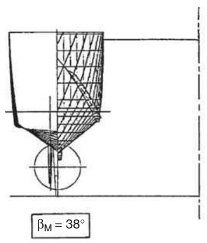

text_image

βM = 38°

text_image

βM = 27°

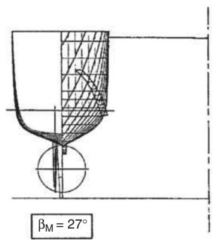

text_image

β_M = 27°

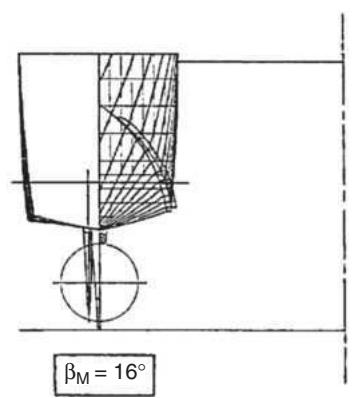

text_image

βM = 16°

Figure 10.22. VWS catamaran series body plans: $L _ { W L } / b = 1 3 . 5 5$ .

In terms of these parameters, the length displacement ratio of the demihull is given as

$$
L _ {W L} / \nabla^ {1 / 3} = 7. 6 5 1 8 7 7 + 1. 6 9 4 4 1 3 \times \mathrm{X} 1 + 0. 2 8 2 1 3 9 \times \mathrm{X} 1 ^ {2} - 0. 0 5 2 4 9 6 \times \mathrm{X} 1 ^ {2} \times \mathrm{X} 2.
$$

The wetted surface area coefficient $S / \nabla ^ { 2 / 3 }$ (for a demihull) is given as

$$
S / \nabla^ {2 / 3} = \Sigma C S _ {i} \times X S _ {i} \times 1 0, \tag {10.65}
$$

where $C S _ { i }$ and $\mathbf { X } S _ { i }$ are given in Table 10.12

Table 10.12. Wetted area coefficients: VWS catamaran series 

<table><tr><td> $CS_i$ </td><td> $XS_i$ </td></tr><tr><td>1.103767</td><td>1</td></tr><tr><td>0.151489</td><td>X1</td></tr><tr><td>0.00983</td><td> $X2^2$ </td></tr><tr><td>-0.009085</td><td> $X1^2$ </td></tr><tr><td>0.008195</td><td> $X1^2 \cdot X2$ </td></tr><tr><td>-0.029385</td><td> $X1 \cdot X2^2$ </td></tr><tr><td>0.041762</td><td> $X1^3 \cdot X2^2$ </td></tr></table>

The residual resistance ratio is given as

$$
R _ {R} / \Delta = \Sigma (X R _ {i} \times C R _ {i}) / 1 0 0, \tag {10.66}
$$

where the regression parameters $\mathrm { X } R _ { i }$ and the regression coefficients $C R _ { i }$ are given in Table A3.27, Appendix A3.

Finally, the residuary resistance is calculated as

$$
R _ {R} = R _ {R} / \Delta \times (\nabla \times \rho \times g), \tag {10.67}
$$

and, if required,

$$
C _ {R} = R _ {R} \frac {1}{2} \rho S V ^ {2}.
$$

The required input parameters to carry out the analysis for a particular speed are $L _ { W L } / b$ (which is transformed to X1), $\beta _ { M }$ (which is transformed to X2), $\delta _ { W }$ (which is transformed to X3) and $\nabla \left( \mathrm { o r } { \cal L } _ { W L } \right)$ .

Further regression analyses of the VWS Series are presented by Muller-Graf ¨ and Radojcic [10.61], from which predictions with more accuracy may be expected.

# 10.3.6 Yachts

# 10.3.6.1 Background

For estimates of yacht resistance in the preliminary design stage, prior to towing tank or extensive CFD analysis, most designers are reliant on the Delft Systematic Yacht Hull Series (DSYHS) which is by far the most extensive published research on yacht hull performance. Data for the series have been published in [10.62] to [10.66], with the most recent update being that due to Keuning and Sonnenberg [10.67]. An example of a body plan for the series is shown in Figure 10.23.

The DSYHS consists of 50 different dedicated yacht models. Since the first publication of the series data in 1974 the series has been steadily extended to cover a large range of yacht parameters as well as an extended collection of appendage arrangements, heel angles and sea states. The first series (now known as DSYHS Series 1) consists of the parent hull (model 1) and 21 variations to this design, in 1974, of a contemporary racing yacht (models 2–22). In 1983 a new parent hull was introduced, this time a dedicated design was used and models 23–28 became known as Series 2. Series 3 was a very light displacement variation on Series 2 and ranges from model 29 to 40. The most recent Series 4 (models 42–50) is based on a typical 40 foot International Measurement System (IMS) design by Sparkman and Stevens (see Keuning and Sonnenberg [10.67]). Given the large number of models, the DSYHS is suitable for predicting resistance for a relatively wide range of design ratios. It is therefore used by many designers and the data are used by the Offshore Racing Congress in their Velocity Prediction Program (VPP), for the issuing of ratings to racing yachts, Offshore Racing Congress [10.68].

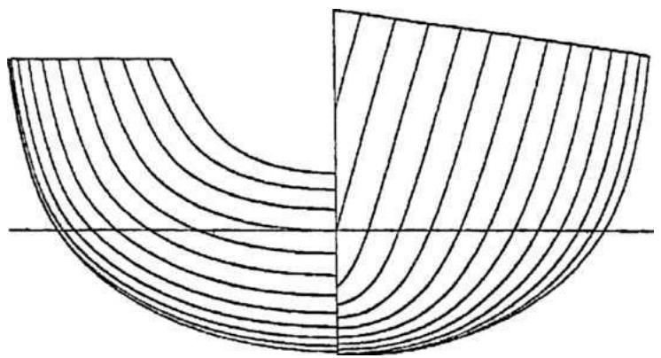

natural_image

Pure curved line diagram without any text, numbers, or symbols

Figure 10.23. Example of Delft yacht series body plan (Sysser 44).

The DSYHS divides the resistance of the yacht’s hull into a number of components and then presents a regression equation for each component, based on the towing tank tests. The sum of these components yields the total resistance for the hull. In the Delft series the resistance is treated as the sum of the resistance of the yacht in the upright condition (including appendages) and the additions (or subtractions) to this resistance when the hull is in its sailing (heeled and yawed) condition. The change in resistance due to trim, caused by crew movement and sail drive force, and added resistance in waves are also included in the more recent publications, e.g. Keuning and Sonnenberg [10.67]. These last components are not considered further here.

From Keuning and Sonnenberg [10.67], the total resistance for a hull at an angle of heel and leeway is expressed as

$$
R _ {\text { Total }} = R _ {F h} + R _ {R h} + R _ {V K} + R _ {V R} + R _ {R K} + \Delta R _ {R h} + \Delta R _ {R K} + R _ {\text { Ind }}, \tag {10.68}
$$

where

$R _ { \mathrm { T o t a l } }$ = total resistance of the hull, keel and rudder at an angle of heel and leeway.

$R _ { F h }$ frictional resistance of the hull.

$R _ { R h }$ residuary resistance of the hull.

$R _ { V K }$ = viscous resistance of the keel.

$R _ { V R }$ viscous resistance of the rudder.

$R _ { R K }$ residuary resistance of the keel.

RRh = change in residuary resistance of the hull with the heel angle, $\phi .$ .

RRK = change in residuary resistance of the keel with the heel angle, $\phi$ .

$R _ { \mathrm { I n d } }$ = induced resistance, due to generation of side force (F y)

at the angle of leeway, λ.

Each component is considered in turn, with equations and polynomial coefficients taken (with permission) from Keuning and Sonnenberg [10.67].

# 10.3.6.2 Frictional Resistance of Hull, $\boldsymbol { R _ { F h } }$

The model test data in the Delft series have been extrapolated to a yacht length of 10.0 m. This extrapolation does not use a form factor $( 1 + k )$ , since the measured form factor using a Prohaska technique for the parent hulls of the series was small and there is no accepted means to calculate a form factor from the geometry of the hull. Recent measurements of the form factor of modern yacht hulls suggests that the form factor may be larger than those measured for the Delft series, however. The total viscous resistance is thus considered to be given by the frictional resistance of the hull, where

Table 10.13. Coefficients for polynomial: Residuary resistance of bare hull (Equation (10.72)) 

<table><tr><td>Fr</td><td>0.1</td><td>0.15</td><td>0.2</td><td>0.25</td><td>0.3</td><td>0.35</td><td>0.4</td><td>0.45</td><td>0.5</td><td>0.55</td><td>0.6</td></tr><tr><td> $a_0$ </td><td>-0.0014</td><td>0.0004</td><td>0.0014</td><td>0.0027</td><td>0.0056</td><td>0.0032</td><td>-0.0064</td><td>-0.0171</td><td>-0.0201</td><td>0.0495</td><td>0.0808</td></tr><tr><td> $a_1$ </td><td>0.0403</td><td>-0.1808</td><td>-0.1071</td><td>0.0463</td><td>-0.8005</td><td>-0.1011</td><td>2.3095</td><td>3.4017</td><td>7.1576</td><td>1.5618</td><td>-5.3233</td></tr><tr><td> $a_2$ </td><td>0.047</td><td>0.1793</td><td>0.0637</td><td>-0.1263</td><td>0.4891</td><td>-0.0813</td><td>-1.5152</td><td>-1.9862</td><td>-6.3304</td><td>-6.0661</td><td>-1.1513</td></tr><tr><td> $a_3$ </td><td>-0.0227</td><td>-0.0004</td><td>0.009</td><td>0.015</td><td>0.0269</td><td>-0.0382</td><td>0.0751</td><td>0.3242</td><td>0.5829</td><td>0.8641</td><td>0.9663</td></tr><tr><td> $a_4$ </td><td>-0.0119</td><td>0.0097</td><td>0.0153</td><td>0.0274</td><td>0.0519</td><td>0.032</td><td>-0.0858</td><td>-0.145</td><td>0.163</td><td>1.1702</td><td>1.6084</td></tr><tr><td> $a_5$ </td><td>0.0061</td><td>0.0118</td><td>0.0011</td><td>-0.0299</td><td>-0.0313</td><td>-0.1481</td><td>-0.5349</td><td>-0.8043</td><td>-0.3966</td><td>1.761</td><td>2.7459</td></tr><tr><td> $a_6$ </td><td>-0.0086</td><td>-0.0055</td><td>0.0012</td><td>0.011</td><td>0.0292</td><td>0.0837</td><td>0.1715</td><td>0.2952</td><td>0.5023</td><td>0.9176</td><td>0.8491</td></tr><tr><td> $a_7$ </td><td>-0.0307</td><td>0.1721</td><td>0.1021</td><td>-0.0595</td><td>0.7314</td><td>0.0223</td><td>-2.455</td><td>-3.5284</td><td>-7.1579</td><td>-2.1191</td><td>4.7129</td></tr><tr><td> $a_8$ </td><td>-0.0553</td><td>-0.1728</td><td>-0.0648</td><td>0.122</td><td>-0.3619</td><td>0.1587</td><td>1.1865</td><td>1.3575</td><td>5.2534</td><td>5.4281</td><td>1.1089</td></tr></table>

$$
R _ {F h} = \frac {1}{2} \rho S _ {c} V ^ {2} C _ {F}, \tag {10.69}
$$

where $C _ { F }$ is the skin friction coefficient using the ITTC1957 extrapolation line in which the Reynolds number is determined using a reference length of $0 . 7 L _ { W L } . S _ { C }$ is the wetted surface area of the hull canoe body at zero speed, which, if not known from the hydrostatic calculations, can be estimated using Equations (10.94) and (10.95), to be found in Section 10.4.

# 10.3.6.3 Residuary Resistance of Hull, ${ \cal R } _ { R h }$

The regression equations for residuary resistance have changed as the series has developed and more models have been tested. This may cause confusion when comparing predictions. The Delft series consists of two different residuary resistance calculation methods; one is a combination of predictions for $0 . 1 2 5 \leq F r \leq 0 . 4 5$ (Equation (10.70)) and $0 . 4 7 5 \leq F r \leq 0 . 7 5$ (Equation (10.71)), whilst the other method is for $0 . 1 \leq F r \leq 0 . 6$ (Equation (10.72)). The factors $a _ { \mathrm { n } }$ in Equations (10.70) and (10.72) are different coefficients for each polynomial. Equation (10.70) was first presented by Gerritsma et al. [10.63] with only seven polynomial factors and has subsequently been developed through the addition of further tests and regression analysis. In 1991 Equation (10.70) was updated, Gerritsma et al. [10.64] and a first version of Equation (10.71) was introduced. A year later the polynomial coefficients for Equation (10.70) were modified and the equation for the range $F r = 0 . 4 7 5 – 0 . 7 5$ changed to Equation (10.71) (Gerritsma et al. [10.65]). Further evaluation of the testing resulted in the publication of Equation (10.72) (Keuning et al. [10.66]) with subsequent changes to the polynomial presented in Keuning and Sonnenberg [10.67]. The combination of Equations (10.70) and (10.71) is known as the Delft III method, with the prediction following Equation (10.72) generally referred to as Delft I, II method as the latter covers a range for which all models of the Delft series I and II have been tested. The polynomial coefficients for Equation (10.72) are given in Table 10.13.

Table 10.14. Coefficients for polynomial: Change in residuary resistance of hull at $2 0 ^ { \circ }$ heel (coefficients are multiplied by 1000) 

<table><tr><td>Fr</td><td>0.25</td><td>0.30</td><td>0.35</td><td>0.40</td><td>0.45</td><td>0.50</td><td>0.55</td></tr><tr><td> $u_0$ </td><td>-0.0268</td><td>0.6628</td><td>1.6433</td><td>-0.8659</td><td>-3.2715</td><td>-0.1976</td><td>1.5873</td></tr><tr><td> $u_1$ </td><td>-0.0014</td><td>-0.0632</td><td>-0.2144</td><td>-0.0354</td><td>0.1372</td><td>-0.148</td><td>-0.3749</td></tr><tr><td> $u_2$ </td><td>-0.0057</td><td>-0.0699</td><td>-0.164</td><td>0.2226</td><td>0.5547</td><td>-0.6593</td><td>-0.7105</td></tr><tr><td> $u_3$ </td><td>0.0016</td><td>0.0069</td><td>0.0199</td><td>0.0188</td><td>0.0268</td><td>0.1862</td><td>0.2146</td></tr><tr><td> $u_4$ </td><td>-0.007</td><td>0.0459</td><td>-0.054</td><td>-0.58</td><td>-1.0064</td><td>-0.7489</td><td>-0.4818</td></tr><tr><td> $u_5$ </td><td>-0.0017</td><td>-0.0004</td><td>-0.0268</td><td>-0.1133</td><td>-0.2026</td><td>-0.1648</td><td>-0.1174</td></tr></table>

For $0 . 1 2 5 \leq F r \leq 0 . 4 5 0$ (Gerritsma et al. [10.64]).

$$
\frac {R _ {R}}{\nabla_ {C} \rho g} 1 0 ^ {3} = a _ {0} + a _ {1} C _ {P} + a _ {2} L C B + a _ {3} \frac {B _ {W L}}{T _ {C}} + a _ {4} \frac {L _ {W L}}{\nabla_ {C} ^ {1 / 3}} + a _ {5} C _ {P} ^ {2} + a _ {6} C _ {P} \frac {L _ {W L}}{\nabla_ {C} ^ {1 / 3}}
$$

$$
+ a _ {7} (L C B) ^ {2} + a _ {8} \left(\frac {L _ {W L}}{\nabla_ {C} ^ {1 / 3}}\right) ^ {2} + a _ {9} \left(\frac {L _ {W L}}{\nabla_ {C} ^ {1 / 3}}\right) ^ {3}. \tag {10.70}
$$

For $0 . 4 7 5 \leq F r \leq 0 . 7 5$ (Gerritsma et al. [10.65]),

$$
\frac {R _ {R}}{\nabla_ {C} \rho g} 1 0 ^ {3} = c _ {0} + c _ {1} \frac {L _ {W L}}{B _ {W L}} + c _ {2} \frac {A _ {W}}{\nabla_ {C} ^ {2 / 3}} + c _ {3} L C B
$$

$$
+ c _ {4} \left(\frac {L _ {W L}}{B _ {W L}}\right) ^ {2} + c _ {5} \left(\frac {L _ {W L}}{B _ {W L}}\right) \left(\frac {A _ {W}}{\nabla_ {C} ^ {2 / 3}}\right) ^ {3}. \tag {10.71}
$$

For $0 . 1 \leq F r \leq 0 . 6$ (Keuning and Sonnenberg [10.67]), with $L C B _ { \mathrm { F P P } } = \mathrm { L C B }$ aft $F P$ in $m$ ,

$$
\frac {R _ {R h}}{\nabla_ {C} \rho g} = a _ {0} + \left(a _ {1} \frac {L C B _ {\mathrm{FPP}}}{L _ {W L}} + a _ {2} C _ {P} + a _ {3} \frac {\nabla_ {C} ^ {1 / 3}}{A w} + a _ {4} \frac {B _ {W L}}{L _ {W L}}\right) \frac {\nabla_ {C} ^ {1 / 3}}{L _ {W L}}
$$

$$
+ \left(a _ {5} \frac {\nabla_ {\mathrm{C}} ^ {1 / 3}}{S c} + a _ {6} \frac {L C B _ {\mathrm{FPP}}}{L C F _ {\mathrm{FPP}}} + a _ {7} \left(\frac {L C B _ {\mathrm{FPP}}}{L _ {W L}}\right) ^ {2} + a _ {8} C _ {P} ^ {2}\right) \frac {\nabla_ {\mathrm{C}} ^ {1 / 3}}{L _ {W L}}. \tag {10.72}
$$

# 10.3.6.4 Change in Residuary Resistance of Hull with Heel, $\Delta R _ { R h }$

When the hull heels there is a change to the distribution of displaced volume along the hull caused by the asymmetry of the heeled geometry. This results in a change to the residuary resistance of the hull. The approach taken in Keuning and Sonnenberg [10.67] is to represent this with a polynomial expression for the change in residuary resistance due to a heel angle of $2 0 ^ { \circ }$ , for which all models in the series have been tested, namely,

$$
\frac {\Delta R _ {R h \phi = 2 0}}{\nabla_ {C} \rho g} = u _ {0} + u _ {1} \left(\frac {L _ {W L}}{B _ {W L}}\right) + u _ {2} \left(\frac {B _ {W L}}{T _ {C}}\right) + u _ {3} \left(\frac {B _ {W L}}{T _ {C}}\right) ^ {2}
$$

$$
+ u _ {4} L C B + u _ {5} L C B ^ {2}, \tag {10.73}
$$

where the coefficients are given in Table 10.14.

The residuary resistance for heel angles other than $2 0 ^ { \circ }$ , based on a smaller experimental dataset, is then calculated as

$$
\Delta R _ {R h} = 6. 0 \phi^ {1. 7} \Delta R _ {R h \phi = 2 0}, \tag {10.74}
$$

where the heel angle is in radians.

# 10.3.6.5 Appendage Viscous Resistance, $R _ { V K } , R _ { V R }$

The viscous resistance of the appendages (keel and rudder) is considered to be a summation of frictional resistance and viscous pressure resistance, determined through use of a form factor. Thus,

$$
R _ {V} = R _ {F} (1 + k) \tag {10.75}
$$

$$
R _ {F} = \frac {1}{2} \rho S V ^ {2} C _ {F}, \tag {10.76}
$$

where $C _ { F }$ is the skin friction coefficient using the ITTC1957 extrapolation line, Equation (4.15), in which the Reynolds number is determined using the average chord length of the appendage. S is the wetted surface area of the appendage.

The form factor is given as a function of the thickness/chord ratio of the sections from Hoerner [10.69], as follows:

$$
(1 + k) = \left(1 + 2 \left(\frac {t}{c}\right) + 6 0 \left(\frac {t}{c}\right) ^ {4}\right). \tag {10.77}
$$

The keel and rudder are treated in an identical manner.

A more accurate procedure may be used whereby the appendage is divided into spanwise segments, with the individual contributions to viscous resistance determined for each segment. In this case the Reynolds number for each segment is based on the local chord length of the segment. Typically, five spanwise segments are used as, for example, in the Offshore Racing Congress (ORC) velocity prediction program (VPP).

# 10.3.6.6 Appendage Residuary Resistance, $\boldsymbol { R } _ { \boldsymbol { R } \kappa }$

The contribution of the keel to the total residuary resistance of the yacht is estimated based on experimental tests with a variety of keels fitted beneath two hull models. A more complete description of the tests undertaken is given in Keuning and Sonnenberg [10.67]. This resistance is given by a polynomial expression, as follows:

$$
\frac {R _ {R K}}{\nabla_ {K} \rho g} = A _ {0} + A _ {1} \left(\frac {T}{B _ {W L}}\right) + A _ {2} \left(\frac {T _ {C} + z _ {C B K}}{\nabla_ {K} ^ {1 / 3}}\right) + A _ {3} \left(\frac {\nabla_ {C}}{\nabla_ {K}}\right), \tag {10.78}
$$

where $\nabla _ { C }$ is the displacement volume of the canoe body, $\nabla _ { K }$ is the displacement volume of the keel and $z _ { C B K }$ is centre of buoyancy of keel below the waterline. T is total draught of hull plus keel.

The coefficients $A _ { 0 } – A _ { 3 }$ are given in Table 10.15.

# 10.3.6.7 Change in Residuary Resistance of Keel with Heel, $\Delta R _ { R K }$

The residuary resistance due to the keel of the yacht changes with heel angle as the volume of the keel is brought closer to the free surface. The interaction of the wave produced by the hull and keel is also important. Based on experimental measurements the change in keel residuary resistance may be expressed as

Table 10.15. Coefficients for polynomial: Residuary resistance of keel 

<table><tr><td>Fr</td><td>0.20</td><td>0.25</td><td>0.30</td><td>0.35</td><td>0.40</td><td>0.45</td><td>0.50</td><td>0.55</td><td>0.60</td></tr><tr><td> $A_0$ </td><td>-0.00104</td><td>-0.0055</td><td>-0.0111</td><td>-0.00713</td><td>-0.03581</td><td>-0.0047</td><td>0.00553</td><td>0.04822</td><td>0.01021</td></tr><tr><td> $A_1$ </td><td>0.00172</td><td>0.00597</td><td>0.01421</td><td>0.02632</td><td>0.08649</td><td>0.11592</td><td>0.07371</td><td>0.0066</td><td>0.14173</td></tr><tr><td> $A_2$ </td><td>0.00117</td><td>0.0039</td><td>0.00069</td><td>-0.00232</td><td>0.00999</td><td>-0.00064</td><td>0.05991</td><td>0.07048</td><td>0.06409</td></tr><tr><td> $A_3$ </td><td>-0.00008</td><td>-0.00009</td><td>0.00021</td><td>0.00039</td><td>0.00017</td><td>0.00035</td><td>-0.00114</td><td>-0.00035</td><td>-0.00192</td></tr></table>

$$
\frac {\Delta R _ {R K}}{\nabla_ {K} \rho g} = C h F r ^ {2} \phi , \tag {10.79}
$$

where

$$
C h = H _ {1} \left(\frac {T _ {C}}{T}\right) + H _ {2} \left(\frac {B _ {W L}}{T _ {C}}\right) + H _ {3} \left(\frac {T _ {C}}{T}\right) \left(\frac {B _ {W L}}{T _ {C}}\right) + H _ {4} \left(\frac {L _ {W L}}{\nabla_ {C} ^ {1 / 3}}\right), \tag {10.80}
$$

and the coefficients are given in Table 10.16.

# 10.3.6.8 Induced Resistance, $R _ { \mathrm { l n d } }$

The induced resistance of a yacht sailing at an angle of heel and leeway is that component of the resistance associated with the generation of hydrodynamic sideforce necessary to balance the sideforce produced by the rig, Fh. The induced resistance is related to the circulation around the foil and its geometry. In this formulation an ‘effective’ span of the foil, accounting for the presence of the free surface is used, usually referred to as the ‘effective draught’ of the yacht. The induced resistance is thus obtained as

$$
R _ {\text { Ind }} = \frac {F h ^ {2}}{\pi T _ {E} ^ {2} \frac {1}{2} \rho V ^ {2}}, \tag {10.81}
$$

where Fh is the heeling force from the rig and $T _ { E }$ is the effective span of hull and appendages, given as

$$
\frac {T _ {E}}{T} = \left(A _ {1} \left(\frac {T _ {C}}{T}\right) + A _ {2} \left(\frac {T _ {C}}{T}\right) ^ {2} + A _ {3} \left(\frac {B _ {W L}}{T _ {C}}\right) + A _ {4} T R\right) (B _ {0} + B _ {1} F r), \tag {10.82}
$$

where TR is the taper ratio of the keel and the polynomial coefficients are given in Table 10.17.

Table 10.16. Coefficients for polynomial: Change in residuary resistance of keel with heel 

<table><tr><td> $H_1$ </td><td>-3.5837</td></tr><tr><td> $H_2$ </td><td>-0.0518</td></tr><tr><td> $H_3$ </td><td>0.5958</td></tr><tr><td> $H_4$ </td><td>0.2055</td></tr></table>

Table 10.17. Coefficients for polynomial: Effective span of yacht 

<table><tr><td> $\phi$  deg.</td><td>0</td><td>10</td><td>20</td><td>30</td></tr><tr><td> $A_{1}$ </td><td>3.7455</td><td>4.4892</td><td>3.9592</td><td>3.4891</td></tr><tr><td> $A_{2}$ </td><td>-3.6246</td><td>-4.8454</td><td>-3.9804</td><td>-2.9577</td></tr><tr><td> $A_{3}$ </td><td>0.0589</td><td>0.0294</td><td>0.0283</td><td>0.025</td></tr><tr><td> $A_{4}$ </td><td>-0.0296</td><td>-0.0176</td><td>-0.0075</td><td>-0.0272</td></tr><tr><td> $B_{0}$ </td><td>1.2306</td><td>1.4231</td><td>1.545</td><td>1.4744</td></tr><tr><td> $B_{1}$ </td><td>-0.7256</td><td>-1.2971</td><td>-1.5622</td><td>-1.3499</td></tr></table>

# 10.4 Wetted Surface Area

# 10.4.1 Background

The wetted surface area is the area of the hull in contact with the water and is normally used to non-dimensionalise the resistance coefficients, Section 3.1.3. The static wetted area is generally used. Some change in running wetted area may occur with fast semi-displacement forms but, for practical design purposes, the static wetted area is normally used. The errors in using the static wetted area for such craft are relatively small, as discussed in the appendix to [10.97]. Planing craft will have significant changes in wetted area with change in speed, and such changes must be taken into account, see Equation (10.93) and Table 10.23, and Section 10.3.3.

If a body plan is available, the static wetted surface area may be obtained from an integration of the girths, or numerically from a CAD representation. Otherwise, approximations have to be made using empirical data. A summary is made of some empirical equations suitable for preliminary design and powering purposes.

# 10.4.2 Displacement Ships

The Sabit regression of BSRA Series [10.68] is as follows:

$$
\frac {S}{\nabla^ {2 / 3}} = \mathrm{a} _ {0} + \mathrm{a} _ {1} (L / B) + \mathrm{a} _ {2} (B / T) - \mathrm{a} _ {3} C _ {B}. \tag {10.83}
$$

The regression coefficients are given in Table 10.18

Sabit notes (discussion in [10.5]) that this equation is for the BSRA Series and vessels generally of that hull form; vessels with more ‘U’ form sections (such as Series 60) will have higher $\frac { S } { \nabla ^ { 2 / 3 } }$ for the same dimensions.

Table 10.18. Sabit equation (10.83) 

<table><tr><td rowspan="2">Parameter</td><td colspan="3">Coefficient</td></tr><tr><td></td><td>BSRA</td><td>Series 60</td></tr><tr><td>Constant</td><td> $a_0$ </td><td>+3.371</td><td>+3.432</td></tr><tr><td> $(L/B)$ </td><td> $a_1$ </td><td>+0.296</td><td>+0.305</td></tr><tr><td> $(B/T)$ </td><td> $a_2$ </td><td>+0.437</td><td>+0.443</td></tr><tr><td> $C_B$ </td><td> $a_3$ </td><td>-0.595</td><td>-0.643</td></tr></table>

Table 10.19. Cs values, Taylor series, Equation (10.86) 

<table><tr><td rowspan="2"> $L/\nabla^{1/3}$ </td><td rowspan="2"> $B/T$ </td><td colspan="4"> $C_P$ </td></tr><tr><td>0.5</td><td>0.6</td><td>0.7</td><td>0.8</td></tr><tr><td>5.5</td><td>2.25</td><td>2.589</td><td>2.562</td><td>2.557</td><td>2.576</td></tr><tr><td>5.5</td><td>3.00</td><td>2.526</td><td>2.540</td><td>2.566</td><td>2.605*</td></tr><tr><td>5.5</td><td>3.75</td><td>2.565</td><td>2.596</td><td>2.636</td><td>2.685</td></tr><tr><td>6.0</td><td>2.25</td><td>2.583</td><td>2.557</td><td>2.554</td><td>2.571</td></tr><tr><td>6.0</td><td>3.00</td><td>2.523</td><td>2.536</td><td>2.560</td><td>2.596</td></tr><tr><td>6.0</td><td>3.75</td><td>2.547</td><td>2.580</td><td>2.625</td><td>2.675</td></tr><tr><td>7.0</td><td>2.25</td><td>2.575</td><td>2.553</td><td>2.549</td><td>2.566</td></tr><tr><td>7.0</td><td>3.00</td><td>2.520</td><td>2.532</td><td>2.554</td><td>2.588</td></tr><tr><td>7.0</td><td>3.75</td><td>2.541</td><td>2.574</td><td>2.614</td><td>2.660</td></tr><tr><td>8.0</td><td>2.25</td><td>2.569</td><td>2.549</td><td>2.546</td><td>2.561</td></tr><tr><td>8.0</td><td>3.00</td><td>2.518*</td><td>2.530</td><td>2.551</td><td>2.584</td></tr><tr><td>8.0</td><td>3.75</td><td>2.538</td><td>2.571</td><td>2.609</td><td>2.652</td></tr><tr><td>9.0</td><td>2.25</td><td>2.566</td><td>2.547</td><td>2.543</td><td>2.557</td></tr><tr><td>9.0</td><td>3.00</td><td>2.516*</td><td>2.528</td><td>2.544</td><td>2.581</td></tr><tr><td>9.0</td><td>3.75</td><td>2.536</td><td>2.568</td><td>2.606</td><td>2.649</td></tr></table>

∗ Extrapolated data.

Coefficients for Series 60 [10.76] are included in Table 10.18, which should also be applied to Equation (10.83).

$$
\text { Denny   Mumford: } \quad S = 1. 7 L T + \frac {\nabla}{T}. \tag {10.84}
$$

$$
\text { Froude: } \quad S = 3. 4 \nabla^ {2 / 3} + 0. 4 8 5 L \cdot \nabla^ {1 / 3} \text { or } \frac {S}{\nabla^ {2 / 3}} = 3. 4 + \frac {L}{2 . 0 6 \nabla^ {1 / 3}}. \tag {10.85}
$$

$$
\text { Taylor: } \quad S = C s \sqrt {\nabla \cdot L}, \tag {10.86}
$$

where Cs depends on $C _ { P } , B / T$ and $L / \nabla ^ { 1 / 3 }$ and values, extracted from [10.10], are given in Table 10.19.

$$
C _ {P} = C _ {B} / C _ {M}.
$$

typical values for $C _ { M }$ are tankers/bulk carriers, 0.98; cargo, 0.96; container, 0.95; warship, 0.92 and, as a first approximation,

$$
C _ {M} = 0. 8 0 + 0. 2 1 C _ {B}. \tag {10.87}
$$

# 10.4.3 Semi-displacement Ships, Round-Bilge Forms

The regression equation given in [10.30] for the Series 64 hull forms provides a good starting point, and its potential use in the wider sense for other round-bilge forms was investigated. The wetted area is described as

$$
S = C s \sqrt {\nabla \cdot L}, \tag {10.88}
$$

where the wetted surface coefficient $C _ { S }$ is expressed in terms of $B / T$ and $C _ { B }$ which are normally known at the preliminary design stage. It is found from the Series 64 and NPL data that, for a given $C _ { B } , C _ { S }$ can be adequately described in terms of $B / T$ and is effectively independent of the $L / \nabla ^ { 1 / 3 }$ ratio. The regression coefficients from [10.30] have been recalculated for $C _ { S }$ to be in consistent (non-dimensional) units and rounded where necessary for preliminary design purposes. The form of the equation is given in Equation (10.89), and the parameters and regression coefficients are given in Table 10.20.

Table 10.20. Static wetted surface area regression coefficients for the derivation $o f C _ { S }$ in Equation (10.89) 

<table><tr><td>Parameter</td><td colspan="2">Coefficient</td></tr><tr><td>Constant</td><td> $a_0$ </td><td>+6.554</td></tr><tr><td> $(B/T)$ </td><td> $a_1$ </td><td>-1.226</td></tr><tr><td> $(B/T)^2$ </td><td> $a_2$ </td><td>+0.216</td></tr><tr><td> $C_B$ </td><td> $a_3$ </td><td>-15.409</td></tr><tr><td> $(B/T)C_B$ </td><td> $a_4$ </td><td>+4.468</td></tr><tr><td> $(B/T)^2C_B$ </td><td> $a_5$ </td><td>-0.694</td></tr><tr><td> $C_B^2$ </td><td> $a_6$ </td><td>+15.404</td></tr><tr><td> $(B/T)C_B^2$ </td><td> $a_7$ </td><td>-4.527</td></tr><tr><td> $(B/T)^2C_B^2$ </td><td> $a_8$ </td><td>+0.655</td></tr></table>

$$
\begin{array}{l} C _ {S} = \mathrm{a} _ {0} + \mathrm{a} _ {1} (B / T) + \mathrm{a} _ {2} (B / T) ^ {2} + \mathrm{a} _ {3} C _ {B} + \mathrm{a} _ {4} (B / T) C _ {B} \\ + \mathrm{a} _ {5} (B / T) ^ {2} C _ {B} + \mathrm{a} _ {6} C _ {B} ^ {2} + \mathrm{a} _ {7} (B / T) C _ {B} ^ {2} + \mathrm{a} _ {8} (B / T) ^ {2} C _ {B} ^ {2} \tag {10.89} \\ \end{array}
$$

The equation is plotted for four values of $C _ { B }$ in Figure 10.24. Values for the original NPL series with $C _ { B } = 0 . 4 0 [ 1 0 . 3 4 ]$ have also been plotted on Figure 10.24 and it is seen that they all lie within 3% of the regression values. Values for the extended NPL forms with $C _ { B } = 0 . 4 [ 1 0 . 5 1 ]$ also lie within 3%. The data in Lahtiharju et al. [10.37] (NPL basis, but changes in $C _ { B } )$ also fit the regressions well. The data in Lindgren and Williams [10.28] $( C _ { B } = 0 . 4 5 )$ are not so good, being about 5% higher than the regression, but a docking keel is included in the wetted area.

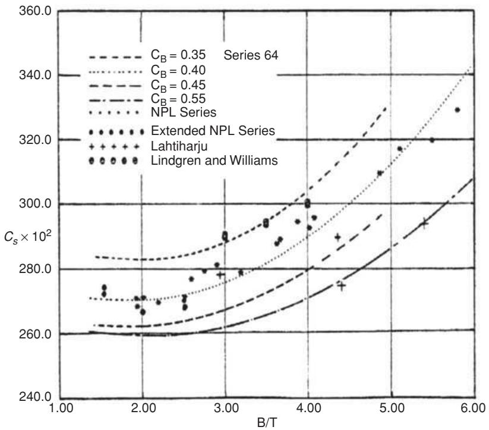

line

| B/T   | Cs × 10² (Series 64) | Cs × 10² (NPL Series) | Cs × 10² (Extended NPL Series) |
|-------|----------------------|------------------------|--------------------------------|
| 1.00  | ~285                 | ~260                   | ~270                           |
| 2.00  | ~288                 | ~265                   | ~275                           |
| 3.00  | ~295                 | ~275                   | ~285                           |
| 4.00  | ~300                 | ~285                   | ~300                           |
| 5.00  | ~315                 | ~295                   | ~315                           |
| 6.00  | ~330                 | ~305                   | ~330                           |

Figure 10.24. Wetted surface area coefficient Cs, Equation (10.89).

Table 10.21. Wolfson round-bilge Equation (10.91) 

<table><tr><td>Parameter</td><td colspan="2">Coefficient</td></tr><tr><td> $(\nabla)$ </td><td> $a_{1}$ </td><td>+0.355636</td></tr><tr><td> $(L)$ </td><td> $a_{2}$ </td><td>+5.75893</td></tr><tr><td> $(B)$ </td><td> $a_{3}$ </td><td>-3.17064</td></tr></table>

A better fit to the NPL data $( C _ { B } = 0 . 4 0 )$ is as follows, but it is restricted to the one hull form and $C _ { B } = 0 . 4 0 \mathrm { : }$ :

$$
C _ {S} = 2. 5 3 8 + 0. 0 4 9 4 (B / T) + 0. 0 1 3 0 7 (B / T) ^ {2}. \tag {10.90}
$$

In light of the sources of the data it is recommended that the use of the equations be restricted to the $B / T$ range 1.5–6.0 and $C _ { B }$ range 0.35–0.55. It is noted that there are few data at $C _ { B } = 0 . 3 5$ for $B / T$ higher than about 4.0, although its trend is likely to be similar to the $C _ { B } = 0 . 4 0$ curve.

The Wolfson Unit [10.86] regression for the static wetted surface area for roundbilge hulls is as follows:

$$
S = \mathrm{a} _ {1} (\nabla) + \mathrm{a} _ {2} (L) + \mathrm{a} _ {3} (B). \tag {10.91}
$$

The regression coefficients are given in Table 10.21.

# 10.4.4 Semi-displacement Ships, Double-Chine Forms

The NTUA series [10.40] provides a regression for the static wetted area of hulls of double-chine form, as follows:

$$
\begin{array}{l} \frac {S}{\nabla^ {2 / 3}} = \mathrm{a} _ {0} + \mathrm{a} _ {1} (B / T) (L / \nabla^ {1 / 3}) ^ {2} + \mathrm{a} _ {2} (B / T) ^ {3} + \mathrm{a} _ {3} (L / \nabla^ {1 / 3}) \\ + \mathrm{a} _ {4} (B / T) ^ {5} + \mathrm{a} _ {5} (L / \nabla^ {1 / 3}) ^ {2}. \tag {10.92} \\ \end{array}
$$

The regression coefficients are given in Table 10.22.

Table 10.22. NTUA equation (10.92) 

<table><tr><td>Parameter</td><td></td><td>Coefficient</td></tr><tr><td>Constant</td><td>a0</td><td>+2.400678</td></tr><tr><td>(B/T)(L/∇1/3)2</td><td>a1</td><td>+0.002326</td></tr><tr><td>(B/T)3</td><td>a2</td><td>+0.012349</td></tr><tr><td>(L/∇1/3)</td><td>a3</td><td>+0.689826</td></tr><tr><td>(B/T)5</td><td>a4</td><td>-0.000120</td></tr><tr><td>(L/∇1/3)2</td><td>a5</td><td>-0.018380</td></tr></table>

Table 10.23. Wolfson hard chine regression coefficients, Equation (10.93), for a range of volumetric Froude numbers 

<table><tr><td>Parameter</td><td> $Fr_{\nabla}$ </td><td>0.5</td><td>1.0</td><td>1.5</td><td>2.0</td><td>2.5</td><td>3.0</td></tr><tr><td>(∇)</td><td> $a_1$ </td><td>0.985098</td><td>0.965983</td><td>0.915863</td><td>0.860915</td><td>0.936348</td><td>0.992033</td></tr><tr><td>(L)</td><td> $a_2$ </td><td>2.860999</td><td>3.229803</td><td>3.800066</td><td>4.891762</td><td>4.821847</td><td>4.818481</td></tr><tr><td>(B)</td><td> $a_3$ </td><td>-1.113826</td><td>-2.060285</td><td>-4.064968</td><td>-7.594861</td><td>-9.013914</td><td>-10.85827</td></tr></table>

# 10.4.5 Planing Hulls, Single Chine

The Wolfson Unit [10.86] regression for running wetted surface area of hard chine hulls is as follows:

$$
S = \mathrm{a} _ {1} (\nabla) + \mathrm{a} _ {2} (L) + \mathrm{a} _ {3} (B), \tag {10.93}
$$

noting that the wetted area is now speed dependent.

The regression coefficients for a range of volumetric Froude numbers are given in Table 10.23.

# 10.4.6 Yacht Forms

For the Delft series of hull forms [10.67], for the canoe body,

$$
S _ {C} = \left(1. 9 7 + 0. 1 7 1 \frac {B _ {W L}}{T _ {C}}\right) \left(\frac {0 . 6 5}{C _ {M}}\right) ^ {1 / 3} (\nabla_ {C} L _ {W L}) ^ {1 / 2}, \tag {10.94}
$$

where $S _ { C }$ is the wetted surface area of the canoe body, $T _ { C }$ is the draught of the canoe body, $\nabla _ { \mathrm { C } }$ is the displacement (volume) of the canoe body and $C _ { M }$ is the midship area coefficient.

The change in viscous resistance due to heel is attributed only to the change in wetted area of the hull. This change in wetted surface area with heel angle may be approximated by

$$
S _ {C \phi} = S _ {C (\phi = 0)} \left(1 + \frac {1}{1 0 0} \left(\mathrm{s} _ {0} + \mathrm{s} _ {1} \left(\frac {B _ {W L}}{T _ {C}}\right) + \mathrm{s} _ {2} \left(\frac {B _ {W L}}{T _ {C}}\right) ^ {2} + \mathrm{s} _ {3} C _ {M}\right)\right), \tag {10.95}
$$

with coefficients given in Table 10.24.

Table 10.24. Coefficients for polynomial: Change in wetted surface area with heel (Equation (10.95) 

<table><tr><td> $\phi$ </td><td>5</td><td>10</td><td>15</td><td>20</td><td>25</td><td>30</td><td>35</td></tr><tr><td> $s_0$ </td><td>-4.112</td><td>-4.522</td><td>-3.291</td><td>1.85</td><td>6.51</td><td>12.334</td><td>14.648</td></tr><tr><td> $s_1$ </td><td>0.054</td><td>-0.132</td><td>-0.389</td><td>-1.2</td><td>-2.305</td><td>-3.911</td><td>-5.182</td></tr><tr><td> $s_2$ </td><td>-0.027</td><td>-0.077</td><td>-0.118</td><td>-0.109</td><td>-0.066</td><td>0.024</td><td>0.102</td></tr><tr><td> $s_3$ </td><td>6.329</td><td>8.738</td><td>8.949</td><td>5.364</td><td>3.443</td><td>1.767</td><td>3.497</td></tr></table>

# REFERENCES (CHAPTER 10)

10.1 Todd, F.H. Some further experiments on single-screw merchant ship forms – Series 60. Transactions of the Society of Naval Architects and Marine Engineers, Vol. 61, 1953, pp. 516–589.   
10.2 Todd, F.H., Stuntz, G.R. and Pien, P.C. Series 60 – The effect upon resistance and power of variation in ship proportions. Transactions of the Society of Naval Architects and Marine Engineers, Vol. 65, 1957, pp. 445–589.   
10.3 Lackenby, H. and Milton, D. DTMB Standard series 60. A new presentation of the resistance data for block coefficient, LCB, breadth-draught ratio and length-breadth ratio variations. Transactions of the Royal Institution of Naval Architects, Vol. 114, 1972, pp. 183–220.   
10.4 Moor, D.I., Parker, M.N. and Pattullo, R.N.M. The BSRA methodical series – An overall presentation. Geometry of forms and variation in resistance with block coefficient and LCB. Transactions of the Royal Institution of Naval Architects, Vol. 103, 1961, pp. 329–440.   
10.5 Lackenby, H. and Parker, M.N. The BSRA methodical series – An overall presentation: Variation of resistance with breadth-draught ratio and lengthdisplacement ratio. Transactions of the Royal Institution of Naval Architects, Vol. 108, 1966, pp. 363–388.   
10.6 BSRA. Methodical series experiments on single-screw ocean-going merchant ship forms. Extended and revised overall analysis. BSRA Report NS333, 1971.   
10.7 Williams, A. The SSPA cargo liner series propulsion. SSPA Report No. 67, ˚ 1970.   
10.8 Williams, A. The SSPA cargo liner series resistance. SSPA Report No. 66, ˚ 1969.   
10.9 Roseman, D.P. (ed.) The MARAD systematic series of full-form ship models. Society of Naval Architects and Marine Engineers, 1987.   
10.10 Gertler, M. A reanalysis of the original test data for the Taylor Standard Series. DTMB Report No. 806, DTMB, Washington, DC, 1954. Reprinted by SNAME, 1998.   
10.11 Linblad, A.F. Experiments with models of cargo liners. Transactions of the Royal Institution of Naval Architects, Vol. 88, 1946, pp. 174–195.   
10.12 Linblad, A.F. Some experiments with models of high-speed ships: Influence of block coefficient and longitudinal centre of buoyancy. Transactions of the Royal Institution of Naval Architects, Vol. 91, 1949, pp. 137–158.   
10.13 Zborowski, A. Approximate method for estimation of resistance and power of twin screw merchant ships. International Shipbuilding Progress, Vol. 20, No. 221, January 1973, pp. 3–11.   
10.14 Dawson, J. Resistance of single screw coasters. Part I, L/B = 6, Transactions of the Institute of Engineers and Shipbuilders in Scotland. Vol. 96, 1952–1953, pp. 313–384.   
10.15 Dawson, J. Resistance and propulsion of single screw coasters. Part II, L/B = 6, Transactions of the Institute of Engineers and Shipbuilders in Scotland, Vol. 98, 1954–1955, pp. 49–84.   
10.16 Dawson, J. Resistance and propulsion of single screw coasters. Part III, L/B = 6.5, Transactions of the Institute of Engineers and Shipbuilders in Scotland. Vol. 99, 1955–1956, pp. 360–441.   
10.17 Dawson, J. Resistance and propulsion of single screw coasters. Part IV, L/B = 5.5. Transactions of the Institute of Engineers and Shipbuilders in Scotland. Vol. 102, 1958–1959, pp. 265–339.   
10.18 Pattullo, R.N.M. and Thomson, G.R. The BSRA trawler series (Part I). Beam-draught and length-displacement ratio series, resistance and propulsion tests. Transactions of the Royal Institution of Naval Architects, Vol. 107, 1965, pp. 215–241.

10.19 Pattullo, R.N.M. The BSRA Trawler Series (Part II). Block coefficient and longitudinal centre of buoyancy variation series, resistance and propulsion tests. Transactions of the Royal Institution of Naval Architects, Vol. 110, 1968, pp. 151–183.   
10.20 Thomson, G.R. and Pattullo, R.N.M. The BSRA Trawler Series (Part III). Block coefficient and longitudinal centre of buoyancy variation series, tests with bow and stern variations. Transactions of the Royal Institution of Naval Architects, Vol. 111, 1969, pp. 317–342.   
10.21 Pattullo, R.N.M. The resistance and propulsion qualities of a series of stern trawlers. Variation of longitudinal position of centre of buoyancy, beam, draught and block coefficient. Transactions of the Royal Institution of Naval Architects, Vol. 116, 1974, pp. 347–372.   
10.22 Ridgely-Nevitt, C. The resistance of trawler hull forms of 0.65 prismatic coefficient. Transactions of the Society of Naval Architects and Marine Engineers, Vol. 64, 1956, pp. 443–468.   
10.23 Ridgely-Nevitt, C. The development of parent hulls for a high displacementlength series of trawler forms. Transactions of the Society of Naval Architects and Marine Engineers, Vol. 71, 1963, pp. 5–30.   
10.24 Ridgely-Nevitt, C. The resistance of a high displacement-length ratio trawler series. Transactions of the Society of Naval Architects and Marine Engineers, Vol. 75, 1967, pp. 51–78.   
10.25 Parker, M.N. and Dawson, J. Tug propulsion investigation. The effect of a buttock flow stern on bollard pull, towing and free-running performance. Transactions of the Royal Institution of Naval Architects, Vol. 104, 1962, pp. 237–279.   
10.26 Moor, D.I. An investigation of tug propulsion. Transactions of the Royal Institution of Naval Architects, Vol. 105, 1963, pp. 107–152.   
10.27 Nordstrom, H.F. Some tests with models of small vessels. Publications of the ¨ Swedish State Shipbuilding Experimental Tank. Report No. 19, 1951.   
10.28 Lindgren, H. and Williams, A. Systematic tests with small fast displacement ˚ vessels including the influence of spray strips. SSPA Report No. 65, 1969.   
10.29 Beys, P.M. Series 63 – round bottom boats. Stevens Institute of Technology, Davidson Laboratory Report No. 949, 1993.   
10.30 Yeh, H.Y.H. Series 64 resistance experiments on high-speed displacement forms. Marine Technology, July 1965, pp. 248–272.   
10.31 Wellicome, J.F., Molland, A.F., Cic, J. and Taunton, D.J. Resistance experiments on a high speed displacement catamaran of Series 64 form. University of Southampton, Ship Science Report No. 106, 1999.   
10.32 Karafiath, G. and Carrico, T. Series 64 parent hull displacement and static trim variations. Proceedings of Seventh International Conference on Fast Sea Transportation, FAST’2003, Ischia, Italy, October 2003, pp. 27–30.   
10.33 Molland, A.F., Karayannis, T., Taunton, D.J. and Sarac-Williams, Y. Preliminary estimates of the dimensions, powering and seakeeping characteristics of fast ferries. Proceedings of Eighth International Marine Design Conference, IMDC’2003, Athens, Greece, May 2003.   
10.34 Bailey, D. The NPL high speed round bilge displacement hull series. Maritime Technology Monograph No. 4, Royal Institution of Naval Architects, 1976.   
10.35 Compton, R.H. Resistance of a systematic series of semi-planing transom stern hulls. Marine Technology, Vol. 23, No. 4, 1986, pp. 345–370.   
10.36 Robson, B.L. Systematic series of high speed displacement hull forms for naval combatants. Transactions of the Royal Institution of Naval Architects, Vol. 130, 1988, pp. 241–259.   
10.37 Lahtiharju, E., Karppinen, T., Helleraara, M. and Aitta, T. Resistance and seakeeping characteristics of fast transom stern hulls with systematically

varied form. Transactions of the Society of Naval Architects and Marine Engineers, Vol. 99, 1991, pp. 85–118.   
10.38 Gamulin, A. A displacement series of ships. International Shipbuilding Progress, Vol. 43, No. 434, 1996, pp. 93–107.   
10.39 Radojcic, D., Princevac, M. and Rodic, T. Resistance and trim predictions for the SKLAD semi-displacement hull series. Ocean Engineering International, Vol. 3, No. 1, 1999, pp. 34–50.   
10.40 Radojcic, D., Grigoropoulos, G.J., Rodic, T., Kuvelic, T. and Damala, D.P. The resistance and trim of semi-displacement, double-chine, transom-stern hulls. Proceedings of Sixth International Conference on Fast Sea Transportation, FAST’2001, Southampton, September 2001, pp. 187–195.   
10.41 Grigoropoulos, G.J. and Loukakis, T.A. Resistance and seakeeping characteristics of a systematic series in the pre-planing condition (Part I). Transactions of the Society of Naval Architects and Marine Engineers, Vol. 110, 2002, pp. 77–113.   
10.42 Clement, E.P. and Blount, D.L. Resistance tests on a systematic series of planing hull forms. Transactions of the Society of Naval Architects and Marine Engineers, Vol. 71, 1963, pp. 491–579.   
10.43 Keuning, J.A. and Gerritsma, J. Resistance tests on a series of planing hull forms with 25◦ deadrise angle. International Shipbuilding Progress, Vol. 29, No. 337, September 1982.   
10.44 Kowalyshyn, D.H. and Metcalf, B. A USCG systematic series of high-speed planing hulls. Transactions of the Society of Naval Architects and Marine Engineers, Vol. 114, 2006.   
10.45 Hadler, J.B., Hubble, E.N. and Holling, H.D. Resistance characteristics of a systematic series of planing hull forms – Series 65. The Society of Naval Architects and Marine Engineers, Chesapeake Section, May 1974.   
10.46 Savitsky, D. The hydrodynamic design of planing hulls. Marine Technology, Vol. 1, 1964, pp. 71–95.   
10.47 Mercier, J.A. and Savitsky, D. Resistance of transom stern craft in the pre-planing regime. Davidson Laboratory, Stevens Institute of Technology, Report No. 1667, 1973.   
10.48 Savitsky, D. and Ward Brown, P. Procedures for hydrodynamic evaluation of planing hulls in smooth and rough waters. Marine Technology, Vol. 13, No. 4, October 1976, pp. 381–400.   
10.49 Hadler, J.B. The prediction of power performance of planing craft. Transactions of the Society of Naval Architects and Marine Engineers, Vol. 74, 1966, pp. 563–610.   
10.50 Insel, M. and Molland, A.F. An investigation into the resistance components of high speed displacement catamarans. Transactions of the Royal Institution of Naval Architects, Vol. 134, 1992, pp. 1–20.   
10.51 Molland, A.F. Wellicome, J.F. and Couser, P.R. Resistance experiments on a systematic series of high speed displacement catamaran forms: Variation of length-displacement ratio and breadth-draught ratio. Transactions of the Royal Institution of Naval Architects, Vol. 138, 1996, pp. 55–71.   
10.52 Molland, A.F. and Lee, A.R. An investigation into the effect of prismatic coefficient on catamaran resistance. Transactions of the Royal Institution of Naval Architects, Vol. 139, 1997, pp. 157–165.   
10.53 Couser, P.R., Molland, A.F., Armstrong, N.A. and Utama, I.K.A.P. Calm water powering predictions for high speed catamarans. Proceedings of Fourth International Conference on Fast Sea Transportation, FAST’97, Sydney, July 1997.   
10.54 Steen, S., Rambech, H.J., Zhao, R. and Minsaas, K.J. Resistance prediction for fast displacement catamarans. Proceedings of Fifth International Conference on Fast Sea Transportation, FAST’99, Seattle, September 1999.

10.55 Cassella, P., Coppola, C, Lalli, F., Pensa, C., Scamardella, A. and Zotti, I. Geosim experimental results of high-speed catamaran: Co-operative investigation on resistance model tests methodology and ship-model correlation. Proceedings of the 7th International Symposium on Practical Design of Ships and Mobile Units, PRADS’98, The Hague, The Netherlands, September 1998.   
10.56 Bruzzone, D., Cassella, P., Pensa, C., Scamardella, A. and Zotti, I. On the hydrodynamic characteristics of a high-speed catamaran with round-bilge hull: Wave resistance and wave pattern experimental tests and numerical calculations. Proceedings of the Fourth International Conference on Fast Sea Transportation, FAST’97, Sydney, July 1997.   
10.57 Bruzzone, D., Cassella, P., Coppola, C., Russo Krauss, G. and Zotti, I. power prediction for high-speed catamarans from analysis of geosim tests and from numerical results. Proceedings of the Fifth International Conference on Fast Sea Transportation, FAST’99, Seattle, September 1999.   
10.58 Utama, I.K.A.P. Investigation of the viscous resistance components of catamaran forms. Ph.D. thesis, University of Southampton, Department of Ship Science, 1999.   
10.59 Muller-Graf, B. SUSA – The scope of the VWS hard chine catamaran hull ¨ series’89. Proceedings of Second International Conference on Fast Sea Transportation, FAST’93, Yokahama, 1993, pp. 223–237.   
10.60 Zips, J.M. Numerical resistance prediction based on the results of the VWS hard chine catamaran hull series’89. Proceedings of the Third International Conference on Fast Sea Transportation, FAST’95, Lubeck-Travem ¨ unde, ¨ Germany, 1995, pp. 67–74.   
10.61 Muller-Graf, B. and Radojcic, D. Resistance and propulsion character- ¨ istics of the VWS hard chine catamaran hull series’89. Transactions of the Society of Naval Architects and Marine Engineers, Vol. 110, 2002, pp. 1–29.   
10.62 Gerritsma, J., Moeyes, G. and Onnink, R. Test results of a systematic yacht hull series. International Shipbuilding Progress, Vol. 25, No. 287, July 1978, pp. 163–180.   
10.63 Gerritsma, J., Onnink, R. and Versluis, A. Geometry, resistance and stability of the Delft Systematic Yacht Hull Series. 7th International Symposium on Developments of Interest to Yacht Architecture 1981. Interdijk BV, Amsterdam, 1981, pp. 27–40.   
10.64 Gerritsma, J., Keuning, J. and Onnink, R. The Delft Systematic Yacht Hull (Series II) experiments. The 10th Chesapeake Sailing Yacht Symposium, Annapolis. The Society of Naval Architects and Marine Engineers, 1991, pp. 27–40.   
10.65 Gerritsma, J., Keuning, J. and Onnink, R. Sailing yacht performance in calm water and waves. 12th International HISWA Symposium on “Yacht Design and Yacht Construction.” Delft University of Technology Press, Amsterdam, 1992, pp. 115–149.   
10.66 Keuning, J., Onnink, R., Versluis, A. and Gulik, A. V. Resistance of the unappended Delft Systematic Yacht Hull Series. 14th International HISWA Symposium on “Yacht Design and Yacht Construction.” Delft University of Technology Press, Amsterdam, 1996, pp. 37–50.   
10.67 Keuning, J. and Sonnenberg, U. Approximation of the hydrodynamic forces on a sailing yacht based on the ‘Delft Systematic Yacht Hull Series’. 15th International HISWA Symposium on “Yacht Design and Yacht Construction”, Amsterdam. Delft University of Technology Press, Amsterdam, 1998, pp. 99–152.   
10.68 ORC VPP Documentation 2009. Offshore Racing Congress. http://www.orc. org/ (last accessed 3rd June 2010). 69 pages.

10.69 Hoerner, S.F. Fluid-Dynamic Drag. Published by the author, New York, 1965.   
10.70 Moor, D.I. and Small, V.F. The effective horsepower of single-screw ships: Average modern attainment with particular reference to variation of CB and LCB. Transactions of the Royal Institution of Naval Architects, Vol. 102, 1960, pp. 269–313.   
10.71 Moor, D.I. Resistance and propulsion properties of some modern single screw tanker and bulk carrier forms. Transactions of the Royal Institution of Naval Architects, Vol. 117, 1975, pp. 201–214.   
10.72 Clements, R.E. and Thompson, G.R. Model experiments on a series of 0.85 block coefficient forms. The effect on resistance and propulsive efficiency of variation in LCB. Transactions of the Royal Institution of Naval Architects, Vol. 116, 1974, pp. 283–317.   
10.73 Clements, R.E. and Thompson, G.R. Model experiments on a series of 0.85 block coefficient forms. The effect on resistance and propulsive efficiency of variation in breadth-draught ratio and length-displacement ratio. Transactions of the Royal Institution of Naval Architects, Vol. 116, 1974, pp. 319–328.   
10.74 Moor, D.I. and O’Connor, F.R.C. Resistance and propulsion factors of some single-screw ships at fractional draught. Transactions of the North East Coast Institution of Engineers and Shipbuilders, Vol. 80, 1963–1964, pp. 185–202.   
10.75 Sabit, A.S. Regression analysis of the resistance results of the BSRA series. International Shipbuilding Progress, Vol. 18, No. 197, January 1971, pp. 3–17.   
10.76 Sabit, A.S. An analysis of the Series 60 results: Part I, Analysis of forms and resistance results. International Shipbuilding Progress, Vol. 19, No. 211, March 1972, pp. 81–97.   
10.77 Sabit, A.S. The SSPA cargo liner series regression analysis of the resistance and propulsive coefficients. International Shipbuilding Progress, Vol. 23, 1976, pp. 213–217.   
10.78 Holtrop, J. A statistical analysis of performance test results. International Shipbuilding Progress, Vol. 24, No. 270, February 1977, pp. 23–28.   
10.79 Holtrop, J. and Mennen, G.G.J. A statistical power prediction method. International Shipbuilding Progress, Vol. 25, No. 290, October 1978, pp. 253–256.   
10.80 Holtrop, J. and Mennen, G.G.J. An approximate power prediction method. International Shipbuilding Progress, Vol. 29, No. 335, July 1982, pp. 166–170.   
10.81 Holtrop, J. A statistical re-analysis of resistance and propulsion data. International Shipbuilding Progress, Vol. 31, 1984, pp. 272–276.   
10.82 Hollenbach, K.U. Estimating resistance and propulsion for single-screw and twin-screw ships. Ship Technology Research, Vol. 45, Part 2, 1998, pp. 72–76.   
10.83 Radojcic, D. A statistical method for calculation of resistance of the stepless planing hulls. International Shipbuilding Progress, Vol. 31, No. 364, December 1984, pp. 296–309.   
10.84 Radojcic, D. An approximate method for calculation of resistance and trim of the planing hulls. University of Southampton, Ship Science Report No. 23, 1985.   
10.85 van Oortmerssen, G. A power prediction method and its application to small ships. International Shipbuilding Progress, Vol. 18, No. 207, 1971, pp. 397–412.   
10.86 Robinson, J.L. Performance prediction of chine and round bilge hull forms. International Conference: Hydrodynamics of High Speed Craft. Royal Institution of Naval Architects, London, November 1999.   
10.87 Doust, D.J. Optimised trawler forms. Transactions NECIES, Vol. 79, 1962– 1963, pp. 95–136.

10.88 Swift, P.M., Nowacki H. and Fischer, J.P. Estimation of Great Lakes bulk carrier resistance based on model test data regression. Marine Technology, Vol. 10, 1973, pp. 364–379.   
10.89 Fairlie-Clarke, A.C. Regression analysis of ship data. International Shipbuilding Progress, Vol. 22, No. 251, 1975, pp. 227–250.   
10.90 Molland, A.F. and Watson, M.J. The regression analysis of some ship model resistance data. University of Southampton, Ship Science Report No. 36, 1988.   
10.91 Lin, C.-W., Day, W.G. and Lin W.-C. Statistical Prediction of ship’s effective power using theoretical formulation and historic data. Marine Technology, Vol. 24, No. 3, July 1987, pp. 237–245.   
10.92 Raven, H.C., Van Der Ploeg, A., Starke, A.R. and Ec¸a, L. Towards a CFDbased prediction of ship performance – progress in predicting full-scale resistance and scale effects. Transactions of the Royal Institution of Naval Architects, Vol. 150, 2008, pp. 31–42.   
10.93 Froude, R.E. On the ‘constant’ system of notation of results of experiments on models used at the Admiralty Experiment Works. Transactions of the Royal Institution of Naval Architects, Vol. 29, 1888, pp. 304–318.   
10.94 Blount, D.L. Factors influencing the selection of a hard chine or round-bilge hull for high Froude numbers. Proceedings of Third International Conference on Fast Sea Transportation, FAST’95, Lubeck-Travem ¨ unde, 1995. ¨   
10.95 Savitsky, D. and Koelbel, J.G. Seakeeping considerations in design and operation of hard chine planing hulls. The Naval Architect. Royal Institution of Naval Architects, London, March 1979, pp. 55–59.   
10.96 Correspondence with WUMTIA, University of Southampton, March 2010.   
10.97 Molland, A.F., Wellicome, J.F. and Couser, P.R. Resistance experiments on a systematic series of high speed displacement catamaran forms: Variation of length-displacement ratio and breadth-draught ratio. University of Southampton, Ship Science Report No. 71, 1994.

# 11 Propulsor Types

# 11.1 Basic Requirements: Thrust and Momentum Changes

All propulsion devices operate on the principle of imparting momentum to a ‘working fluid’ in accordance with Newton’s laws of motion:

(a) The force acting is equal to the rate of change of momentum produced.   
(b) Action and reaction are equal and opposite.

Thus, the force required to produce the momentum change in the working fluid appears as a reaction force on the propulsion device, which constitutes the thrust produced by the device.

Suppose the fluid passing through the device has its speed increased from $V _ { 1 }$ t o $V _ { 2 }$ by the device, and the mass flow per unit time through the device is $\dot { m }$ , then the thrust (T) produced is given by

$$
\begin{array}{l} T = \text { rate   of   change   of   momentum } \\ = \dot {m} (V _ {2} - V _ {1}). \tag {11.1} \\ \end{array}
$$

The momentum change can be produced in a number of ways, leading to the evolution of a number of propulsor types.

# 11.2 Levels of Efficiency

The general characteristics of any propulsion device are basically as shown in Figure 11.1. The thrust equation, $T = \dot { m } \left( V _ { 2 } - V _ { 1 } \right)$ , indicates that as $V _ { 1 }  V _ { 2 }$ , $T \to 0$ . Thus, as the ratio (speed of advance/jet speed) $\ l _ { 1 } = { { V } _ { 1 } } / { { V } _ { 2 } }$ increases, the thrust decreases. Two limiting situations exist as follows:

(i) $V _ { 1 } = V _ { 2 }$ . Thrust is zero; hence, there is no useful power output $( P = T V _ { 1 } )$ . At this condition viscous losses usually imply that there is a slight power input and, hence, at this point propulsive efficiency $\eta = 0$ .   
(ii) $V _ { 1 } = 0$ . At this point, although the device is producing maximum thrust (usually), no useful work is being performed (i.e. $T V _ { 1 } = 0 )$ and, hence, again $\eta = 0$ .

line

| Speed of advance / jet speed | Thrust (T) | Efficiency (η) |
| ----------------------------- | ---------- | -------------- |
| V₁/V₂                         | -          | 0              |

Figure 11.1. Propulsor characteristics.

Between these two conditions η reaches a maximum value for some ratio $V _ { 1 } / V _ { 2 }$ . Hence, it is desirable to design the propulsion device to operate close to this condition of maximum efficiency.

# 11.3 Summary of Propulsor Types

The following sections provide outline summaries of the properties of the various propulsor types. Detailed performance data for the various propulsors for design purposes are given in Chapter 16.

# 11.3.1 Marine Propeller

A propeller accelerates a column of fluid passing through the swept disc, Figure 11.2. It is by far the most common propulsion device. It typically has 3–5 blades, depending on hull and shafting vibration frequencies, a typical boss/diameter ratio of 0.18– 0.20 and a blade area ratio to suit cavitation requirements. Significant amounts of skew may be incorporated which will normally reduce levels of propeller-excited vibration and allow some increase in diameter and efficiency. The detailed characteristics of the marine propeller are described in Chapter 12. A more detailed review of the origins and development of the marine propeller may be found in Carlton [11.1]. Modifications and enhancements to the basic blade include tip rake [11.2, 11.3] and end plates [11.4].

text_image

V₂ = wake speed
Propeller
V₁ = speed of advance

Figure 11.2. Propeller action.

line

| Ship speed Vs knots | Propeller efficiency (Sub-cavitating) | Propeller efficiency (Surface piercing) | Propeller efficiency (Supercavitating) |
| ------------------- | -------------------------------------- | --------------------------------------- | --------------------------------------- |
| 0                   | ~0                                     | ~0                                      | ~0                                      |
| 10                  | ~2                                     | ~1.5                                    | ~1                                      |
| 20                  | ~4                                     | ~3                                      | ~2                                      |
| 30                  | ~5                                     | ~4                                      | ~3                                      |
| 40                  | ~4                                     | ~3.5                                    | ~3.5                                    |
| 50                  | ~3                                     | ~3                                      | ~3                                      |
| 60                  | ~2                                     | ~2.5                                    | ~2.5                                    |

Figure 11.3. Trends in the efficiency of propellers for high-speed craft.

Specialist applications of the marine propeller include supercavitating propellers which are used when cavitation levels are such that cavitation has to be accepted, and surface piercing (partially submerged) propellers for high-speed craft. Typical trends in the efficiency and speed ranges for these propeller types are shown in Figure 11.3.

Data Sources. Published $K _ { T } { - } K _ { Q }$ data are available for propeller series including fixed-pitch, supercavitating and surface-piercing propellers, see Chapter 16.

# 11.3.2 Controllable Pitch Propeller (CP propeller)

Such propellers allow the resetting of pitch for different propeller loading conditions. Hence, it is useful for vessels such as tugs, trawlers and ferries. It also provides reverse thrust. Compared with the fixed-pitch cast propeller it has a larger boss/diameter ratio of the order of 0.25. The CP propeller has increased mechanical complexity, tends to be more expensive (first cost and maintenance) than the fixedpitch propeller, and it has a relatively small 2%–3% loss in efficiency. There may be some restriction on blade area in order to be able to reverse the blades.

Data Sources. Published series charts of $K _ { T } - K _ { Q }$ for fixed-pitch propellers can be used, treating pitch as variable and allowing for a small loss in efficiency due to the increased boss size. [11.5] provides an indication of the influence of boss ratio on efficiency and [11.6] gives a description of the mechanical components of the controllable pitch propeller.

# 11.3.3 Ducted Propellers

# 11.3.3.1 Accelerating Duct

In this case the duct accelerates the flow inside the duct, Figure 11.4(a). The accelerating ducted propeller provides higher efficiency in conditions of high thrust loading, with the duct thrust augmenting the thrust of the propeller. Thus, it finds applications in vessels such as tugs when towing and trawlers when trawling. The duct can be steerable. The Kort nozzle is a proprietary brand of ducted propeller. The efficiency of ducted propellers when free-running and lightly loaded tends to be less than that of a non-ducted propeller. Rim-driven ducted thrusters have been developed where the duct forms part of the motor [11.7].

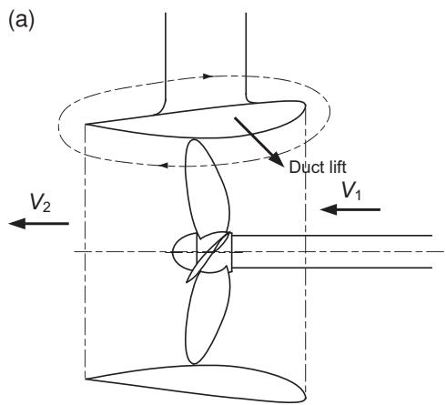

text_image

(a)
Duct lift
V₂
V₁

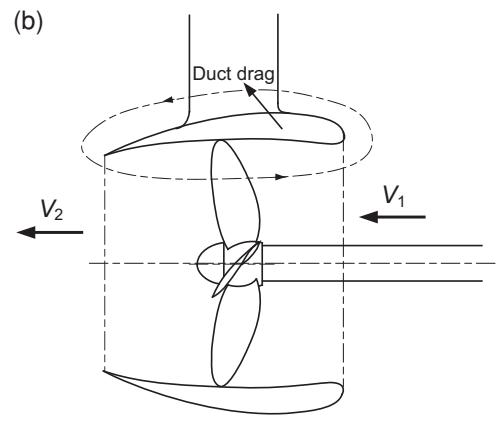

text_image

(b)
Duct drag
V₂
V₁

Figure 11.4. (a) Ducted propeller (accelerating). (b) Ducted propeller (decelerating).

Data Sources. Published series $K _ { T } \mathrm { ~ - ~ } K _ { Q }$ charts for accelerating ducted propellers are available, see Chapter 16.

# 11.3.3.2 Decelerating Duct

In this case the duct circulation reduces the flow speed inside the duct, Figure 11.4(b). There is a loss of efficiency and thrust with this duct type. Its purpose is to increase the pressure (decrease velocity) at the propeller in order to reduce cavitation and its associated noise radiation. Its use tends to be restricted to military vessels where minimising the level of noise originating from cavitation is important.

# 11.3.4 Contra-Rotating Propellers

These propellers have coaxial contra-rotating shafts, Figure 11.5. The aft propeller is smaller than the upstream propeller to take account of slipstream contraction.

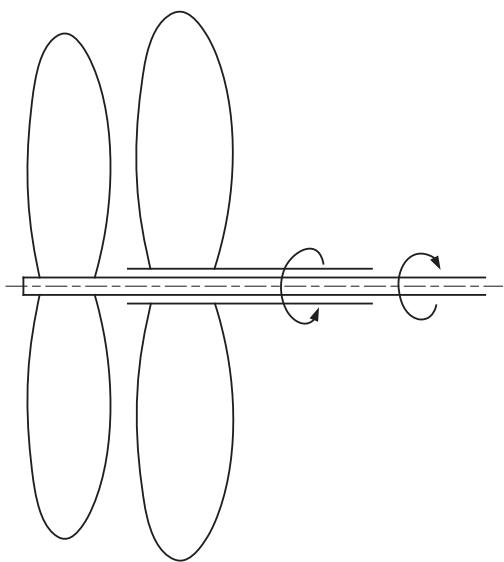

natural_image

Pure diagram of three elliptical shapes with curved arrows indicating rotational motion, no text or symbols present

Figure 11.5. Contra-rotating propellers.

natural_image

Pure diagram of two parallel ovals on a horizontal line with curved arrows indicating rotation, no text or symbols present.

Figure 11.6. Tandem propellers.

The unit allows some recovery of rotational losses, producing a higher efficiency than the conventional propeller of the order of 5%–7%. The unit is mechanically more complex and expensive than a single propeller, including extra weight and complex gearing and sealing, together with higher maintenance costs. It has been used on torpedoes to counteract the torque reaction rotating the torpedo body. Research carried out into contra-rotating propellers includes [11.8–11.10]. Experiments have been carried out on a hybrid arrangement which comprises a combination of a conventional propeller and a downstream contra-rotating podded propeller [11.11, 11.12].

Data Sources. Some ac hoc data exist, such as [11.8–11.12], but little systematic data are available.

# 11.3.5 Tandem Propellers

In this design, more than one propeller is attached to the same shaft, Figure 11.6. It has been used when the thrust required to be transmitted by a shaft could not be adequately carried by one propeller on that shaft, [11.13]. This is particularly the case when there is a need to lower the risk of cavitation. An historical example is the fast naval vessel Turbinia [11.14].

Data Sources. Few systematic data are available, but some model test results are given in [11.13].

# 11.3.6 Z-Drive Units

The power is transmitted by mechanical shafting between the motor and propeller via bevel gears, Figure 11.7. There is no need for shaft brackets and space associated with conventional propellers. The propeller may be ducted. The unit is normally able to azimuth through 360 , providing directional thrust without the need for a rudder. Some efficiency losses occur through the gearing. Some systems use a propeller at both the fore and aft ends of the unit, and the propellers work in tandem.

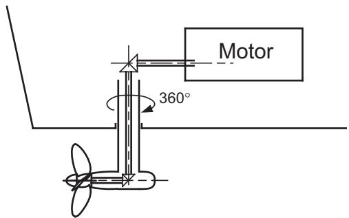

text_image

Motor
360°

Figure 11.7. Z-Drive unit.

Data Sources. Published series $K _ { T } - K _ { Q }$ charts for fixed-pitch propellers, with or without duct, may be used.

# 11.3.7 Podded Azimuthing Propellers

This it is an application of the fixed-pitch propeller and incorporates a slender highefficiency electric drive motor housed within the pod, Figure 11.8. The propeller may be ducted. It is normally able to azimuth through 360◦ providing directional thrust and good manoeuvring properties. A rudder is not required. If the propeller is mounted at the leading edge of the pod, termed a puller type or tractor, a relatively clean and uniform wake is encountered, leading to less vibration, cavitation and noise. Some systems use a propeller at both the fore and aft ends of the pod; the propellers work in tandem.

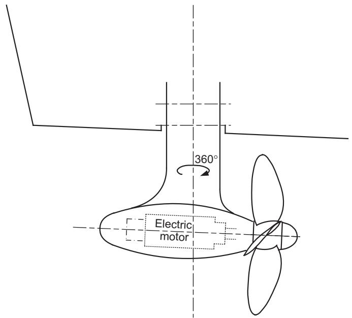

text_image

360°
Electric
motor

Figure 11.8. Podded propulsor.

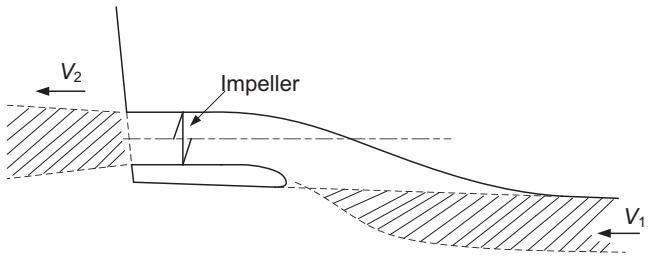

text_image

V₂
Impeller
V₁

Figure 11.9. Waterjet.

The podded unit is usually associated with a pram-type stern, and the shaft may be inclined to the flow. A flap may be added at the aft end of the vertical support strut and a fin added under the pod in order to improve manoeuvring and coursekeeping performance.

Data Sources. Published series $K _ { T } - K _ { Q }$ charts for fixed-pitch propellers can be used, together with an appropriate wake fraction and corrections for the presence of the relatively large pod and supporting strut. These aspects are discussed further in Chapter 16.

# 11.3.8 Waterjet Propulsion

Jet units involve drawing fluid into the hull through an intake and discharging it either above or below water (usually above) at high velocity, Figure 11.9. Various pumps may be used such as axial flow, centrifugal or piston types, but mixed axial/ centrifugal pumps tend to be the most common. Waterjets have no underwater appendages which can be an advantage in some applications. For example, the safety of a shrouded propeller is attractive for small sporting and rescue craft and dive support craft. A swivelling nozzle and reversing bucket provide change of thrust direction and reverse thrust. Power losses in the pump and inlet/outlet ducting can result in low propulsive efficiency at lower speeds. It is more efficient than conventional propellers at speeds greater than about 30 knots. At lower speeds the conventional subcavitating propeller is more efficient, whilst at speeds greater than about 40–45 knots supercavitating or surface-piercing propellers may be more efficient.

Data Sources. Manufacturers’ data and theoretical approaches tend to be used for design purposes, see Chapter 16.

# 11.3.9 Cycloidal Propeller

This is a vertical axis propeller, with the blades acting as aerofoils, Figure 11.10. Thrust can be produced in any direction and a rudder is not needed. The Voith Schneider unit is a proprietary brand of the cycloidal propeller. These propellers are commonly fitted to vessels requiring a high degree of manoeuvrability or station keeping, such as tugs and ferries. Such vessels are often double ended with a propulsion unit at each end so that the craft can be propelled directly sideways or rotated about a vertical axis without moving ahead.

text_image

V₂
V₁

Figure 11.10. Cycloidal propeller (Voith Schneider).

Data Sources. Some published data are available in $K _ { T } - K _ { Q }$ form, together with manufacturers’ data, see Chapter 16.

# 11.3.10 Paddle Wheels

Paddle wheels accelerate a surface fluid layer, Figure 11.11. They can be side or stern mounted, with fixed or feathering blades. The efficiencies achieved with feathering blades are comparable to the conventional marine propeller.

Data Sources. Some systematic performance data are available for design purposes, see Chapter 16.

# 11.3.11 Sails

Sails have always played a role in the propulsion of marine vessels. They currently find applications ranging from cruising and racing yachts [11.15] to the sail assist of large commercial ships [11.16, 11.17], which is discussed further in Section 11.3.16. Sails may be soft or solid and, in both cases, the sail acts like an aerofoil with the ability to progress into the wind. The forces generated, including the propulsive force, are shown in Figure 11.12. The sail generates lift (L) and drag (D) forces normal to and in the direction of the relative wind. The resultant force is F. The resultant force can be resolved along the X and Y body axes of the boat or ship, $F _ { X }$ on the longitudinal ship axis and $F _ { Y }$ on the transverse Y axis. $F _ { X }$ is the driving or propulsive force.

text_image

V₂
V₁

Figure 11.11. Paddle wheel.

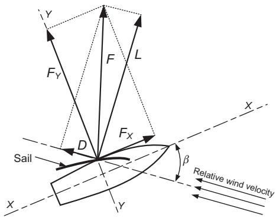

text_image

Y
Fy
L
D
Fx
Sail
X
Y
β
Relative wind velocity

Figure 11.12. Sail forces.

Data Sources. Sail performance data are usually derived from wind tunnel tests. Experimental and theoretical data for soft sails are available for preliminary design purposes, see Chapter 16.

# 11.3.12 Oars

Rowing or sculling using oars is usually accepted as the first method of boat or ship propulsion. Typical references for estimating propulsive power when rowing include [11.18–11.21].

# 11.3.13 Lateral Thrust Units

Such units were originally employed as ‘bow thrusters’, Figure 11.13. They are now employed at the bow and stern of vessels requiring a high degree of manoeuvrability at low speeds. This includes manoeuvring in and out of port, or holding station on a dynamically positioned ship.

Data Sources. Some published data and manufacturers’ data are available, see Chapter 16.

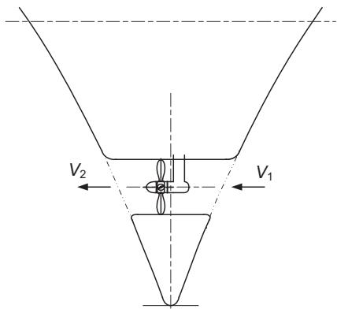

text_image

V₂
V₁

Figure 11.13. Lateral thrust unit.

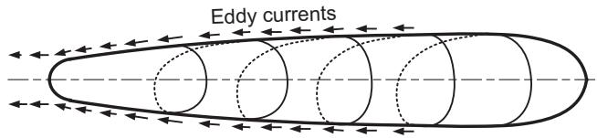

text_image

Eddy currents

Figure 11.14. Electrolytic propulsion.

# 11.3.14 Other Propulsors

All of the foregoing devices are, or have been, used in service and are of proven effectiveness. There are a number of experimental systems which, although not efficient in their present form, show that there can be other ways of achieving propulsion, as discussed in the following sections.

# 11.3.14.1 Electrolytic Propulsion

By passing a low-frequency AC current along a solenoid immersed in an electrolyte (in this case, salt water), eddy currents induced in the electrolyte are directed aft along the coil, Figure 11.14. Thrust and efficiency tend to be low. There are no moving parts or noise, which would make such propulsion suitable for strategic applications. Research into using such propulsion for a small commercial craft is described in [11.1 and 11.22].

# 11.3.14.2 Ram Jets

Expanding bubbles of gas in the diffuser section of a ram jet do work on the fluid and, hence, produce momentum changes, Figure 11.15. The gas can come from either the injection of compressed air at the throat or by chemical reaction between the water and a ‘fuel’ of sodium or lithium pellets. The device is not self-starting and its efficiency is low. An investigation into a bubbly water ram jet is reported in [11.23].

# 11.3.14.3 Propulsion of Marine Life

The resistance, propulsion and propulsive efficiency of marine life have been studied over the years. It is clear that a number of marine species have desirable engineering features. The process of studying areas inspired by the actions of marine life has become known as bioinspiration [11.24]. Research has included efforts to emulate the propulsive action of fish [11.25–11.28] and changes in body shape and surface finish to minimise resistance [11.29, 11.30]. Work is continuing on the various areas of interest, and other examples of relevant research are included in [11.28, 11.31, 11.32, 11.33].

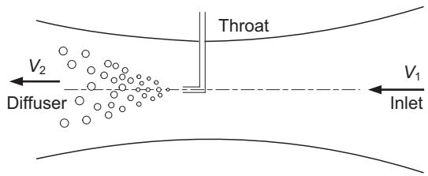

text_image

Throat
V₂
Diffuser
V₁
Inlet

Figure 11.15. Ram jet.

# 11.3.15 Propulsion-Enhancing Devices

# 11.3.15.1 Potential Propeller Savings

The components of the quasi-propulsive coefficient (ηD) may be written as follows:

$$
\eta_ {D} = \eta_ {o} \times \eta_ {H} \times \eta_ {R}, \tag {11.2}
$$

where $\eta _ { H }$ is the hull efficiency (see Chapters 8 and 16) and $\eta _ { R }$ is the relative rotative efficiency (see Chapter 16).

The efficiency $\eta _ { o }$ is the open water efficiency of the propeller and will depend on the propeller diameter (D), pitch ratio $\left( P / D \right)$ and revolutions (rpm). Clearly, an optimum combination of these parameters is required to achieve maximum efficiency. Theory and practice indicate that, in most circumstances, an increase in diameter with commensurate changes in $P / D$ and rpm will lead to improvements in efficiency. Propeller tip clearances will normally limit this improvement. For a fixed set of propeller parameters, $\eta _ { o }$ can be considered as being made up of

$$
\eta_ {o} = \eta_ {a} \cdot \eta_ {r} \cdot \eta_ {f}, \tag {11.3}
$$

where $\eta _ { a }$ is the ideal efficiency, based on axial momentum principles and allowing for a finite blade number, $\eta _ { r }$ accounts for losses due to fluid rotation induced by the propeller and $\eta _ { f }$ accounts for losses due to blade friction drag (Dyne [11.34, 11.35]). This breakdown of efficiency components is also derived using blade elementmomentum theory in Chapter 15. Theory would suggest typical values of these components at moderate thrust loading as $\eta _ { a } = 0 . 8 0$ (with a significant decrease with increase in thrust loading), $\eta _ { r } = 0 . 9 5$ (reasonably independent of thrust loading) and $\eta _ { f } = 0 . 8 5$ (increasing a little with increase in thrust loading), leading to $\eta _ { \mathrm { o } } = 0 . 6 4 6$ . This breakdown of the components of $\eta _ { \mathrm { o } }$ is important because it indicates where likely savings might be made, such as the use of pre- and post-swirl devices to improve $\eta _ { r }$ or surface treatment of the propeller to improve $\eta _ { f } .$

# 11.3.15.2 Typical Devices

A number of devices have been developed and used to improve the overall efficiency of the propulsion arrangement. Many of the devices recover downstream rotational losses from the propeller. Some recover the energy of the propeller hub vortex. Others entail upstream preswirl ducts or fins to provide changes in the direction of the flow into the propeller. Improvements in the overall efficiency of the order of 3%–8% are claimed for such devices. Some examples are listed below:

- Twisted stern upstream of propeller [11.36]   
- Twisted rudder [11.37, 11.38]   
- Fins on rudder [11.39]   
- Upstream preswirl duct [11.40, 11.41]   
- Integrated propeller-rudder [11.42]   
- Propeller boss cap fins [11.43]

# 11.3.16 Auxiliary Propulsion Devices

A number of devices provide propulsive power using renewable energy. The energy sources are wind, wave and solar. Devices using these sources are outlined in the following sections.

# 11.3.16.1 Wind

Wind-assisted propulsion can be provided by sails, rotors, kites and wind turbines. Good reviews of wind-assisted propulsion are given in [11.16] and Windtech’85 [11.44].

SAILS. Sails may be soft or rigid. Soft sails generally require complex control which may not be robust enough for large commercial vessels. Rigid sails in the form of rigid vertical aerofoil wings are attractive for commercial applications [11.44]. They can be robust in construction and controllable in operation. Prototypes, designed by Walker Wingsails, were applied successfully on a coaster in the 1980s.

ROTORS. These rely on Magnus effect and were demonstrated successfully on a cargo ship by Flettner in the 1920s. There is renewed interest in rotors; significant contributions to propulsive power have been claimed [11.45]. It may be difficult to achieve adequate robustness when rotors are applied to large commercial ships.

KITES. These have been developed over the past few years and significant contributions to power of the order of 10%–35% are estimated [11.46]. Their launching and retrieval might prove too complex and lack robustness for large commercial ships.

WIND TURBINES. These may be vertical or horizontal axis, and they were researched in some detail in the 1980s [11.44]. They are effective in practice, but require large diameters and structures to provide effective propulsion for large ships. The drive may be direct to the propeller, or to an electrical generator to supplement an electric drive.

# 11.3.16.2 Wave

The wave device comprises a freely flapping symmetrical foil which is driven by the ship motions of pitch and heave. With such vertical motion, the flapping foil produces a net forward propulsive force [11.28]. Very large foils, effectively impractical in size, tend to be required in order to provide any significant contribution to overall propulsive power.

# 11.3.16.3 Solar, Using Photovoltaic Cells

Much interest has been shown recently in this technique. Large, effectively impractical areas of panels are, however, required in order to provide any significant amounts of electricity for propulsive power at normal service speeds. Some effective applications can be found for vessels such as relatively slow-speed ferries and sight-seeing cruisers.

# 11.3.16.4 Auxiliary Power–Propeller Interaction

It is important to take note of the interaction between auxiliary sources of thrust, such as sails, rotors or kites, and the main propulsion engine(s), Molland and

Hawksley [11.47]. Basically, at a particular speed, the auxiliary thrust causes the propulsion main engine(s) to be offloaded and possibly to move outside its operational limits. This may be overcome by using a controllable pitch propeller or multiple engines (via a gearbox), which can be individually shut down as necessary. This also depends on whether the ship is to be run at constant speed or constant power. Such problems can be overcome at the design stage for a new ship, perhaps with added cost. Such requirements can, however, create problems if auxiliary power is to be fitted to an existing vessel.

# 11.3.16.5 Applications of Auxiliary Power

Whilst a number of the devices described may be impractical as far as propulsion is concerned, some, such as wind turbines and solar panels, may be used to provide supplementary power to the auxiliary generators. This will lead to a decrease in overall power, including propulsion and auxiliary electrical generation.

# REFERENCES (CHAPTER 11)

11.1 Carlton, J.S. Marine Propellers and Propulsion. 2nd Edition. Butterworth-Heinemann, Oxford, UK, 2007.   
11.2 Andersen, P. Tip modified propellers. Ocean Engineering International, Vol. 3, No. 1, 1999.   
11.3 Dang, J. Improving cavitation performance with new blade sections for marine propellers. International Shipbuilding Progress, Vol. 51, 2004.   
11.4 Dyne, G. On the principles of propellers with endplates. Transactions of the Royal Institution of Naval Architects, Vol. 147, 2005, pp. 213–223.   
11.5 Baker, G.S. The effect of propeller boss diameter upon thrust and efficiency at given revolutions. Transactions of the Royal Institution of Naval Architects, Vol. 94, 1952, pp. 92–109.   
11.6 Brownlie, K. Controllable Pitch Propellers. IMarEST, London, UK, 1998.   
11.7 Abu Sharkh, S.M., Turnock, S.R. and Hughes, A.W. Design and performance of an electric tip-driven thruster. Proceedings of the Institution of Mechanical Engineers, Part M: Journal of Engineering for the Maritime Environment, Vol. 217, No. 3, 2003.   
11.8 Glover, E.J. Contra rotating propellers for high speed cargo vessels. A theoretical design study. Transactions North East Coast Institution of Engineers and Shipbuilders, Vol. 83, 1966–1967, pp. 75–89.   
11.9 Van Manen, J.D. and Oosterveld, M.W.C. Model tests on contra-rotating propellers. International Shipbuilding Progress, Vol. 15, No. 172, 1968, pp. 401–417.   
11.10 Meier-Peter, H. Engineering aspects of contra-rotating propulsion systems for seagoing merchant ships. International Shipbuilding Progress, Vol. 20, No. 221, 1973.   
11.11 Praefke, E., Richards, J. and Engelskirchen, J. Counter rotating propellers without complex shafting for a fast monohull ferry. Proceedings of Sixth International Conference on Fast Sea Transportation, FAST’2001, Southampton, UK, 2001.   
11.12 Kim, S.E., Choi, S.H. and Veikonheimo, T. Model tests on propulsion systems for ultra large container vessels. Proceedings of the International Offshore and Polar Engineering Conference, ISOPE-2002, Kitakyushu, Japan, 2002.   
11.13 Qin, S. and Yunde, G. Tandem propellers for high powered ships. Transactions of the Royal Institution of Naval Architects, Vol. 133, 1991, pp. 347–362.

11.14 Telfer, E.V. Sir Charles Parsons and the naval architect. Transactions of the Royal Institution of Naval Architects, Vol. 108, 1966, pp. 1–18.   
11.15 Claughton, A., Wellicome, J.F. and Shenoi, R.A. (eds.) Sailing Yacht Design, Vol. 1 Theory, Vol. 2 Practice. The University of Southampton, Southampton, UK, 2006.   
11.16 RINA. Proceedings of the Symposium on Wind Propulsion of Commercial Ships. The Royal Institution of Naval Architects, London, 1980.   
11.17 Murata, M., Tsuji, M. and Watanabe, T. Aerodynamic characteristics of a 1600 Dwt sail-assisted tanker. Transactions North East Coast Institution of Engineers and Shipbuilders, Vol. 98, No. 3, 1982, pp. 75–90.   
11.18 Alexander, F.H. The propulsive efficiency of rowing. Transactions of the Royal Institution of Naval Architects, Vol. 69, 1927, pp. 228–244.   
11.19 Wellicome, J.F. Some hydrodynamic aspects of rowing. In Rowing – A Scientific Approach, ed. J.P.G. Williams and A.C. Scott. A.S. Barnes, New York, 1967.   
11.20 Shaw, J.T. Rowing in ships and boats. Transactions of the Royal Institution of Naval Architects, Vol. 135, 1993, pp. 211–224.   
11.21 Kleshnev, V. Propulsive efficiency of rowing. Proceedings of XVII International Symposium on Biomechanics in Sports, Perth, Australia, 1999, pp. 224–228.   
11.22 Molland, A.F. (ed.) The Maritime Engineering Reference Book. Butterworth-Heinemann, Oxford, UK, 2008.   
11.23 Mor, M. and Gany, A. Performance mapping of a bubbly water ramjet. Technical Note. International Journal of Maritime Engineering, Transactions of the Royal Institution of Naval Architects, Vol. 149, 2007, pp. 45–50.   
11.24 Bar-Cohen, Y. Bio-mimetics – using nature to inspire human innovation. Bioinspiration and Biomimetics, Vol. 1, No. 1, 2006, pp. 1–12.   
11.25 Gawn, R.W.L. Fish propulsion in relation to ship design. Transactions of the Royal Institution of Naval Architects, Vol. 92, 1950, pp. 323–332.   
11.26 Streitlien, K., Triantafyllou, G.S. and Triantafyllou, M.S. Efficient foil propulsion through vortex control. AIAA Journal, Vol. 34, 1996, pp. 2315–2319.   
11.27 Long, J.H., Schumacher, L., Livingston, N. and Kemp, M. Four flippers or two? Tetrapodal swimming with an aquatic robot. Bioinspiration and Biomimetics, Vol. 1, No. 1, 2006, pp. 20–29.   
11.28 Bose, N. Marine Powering Prediction and Propulsors. The Society of Naval Architects and Marine Engineers, New York, 2008.   
11.29 Fish, F.E. The myth and reality of Gray’s paradox: implication of dolphin drag reduction for technology. Bioinspiration and Biomimetics, Vol. 1, No. 2, 2006, pp. 17–25.   
11.30 Anderson, E.J., Techet, A., McGillis, W.R., Grosenbaugh, M.A. and Triantafyllou, M.S. Visualisation and analysis of boundary layer flow in live and robotic fish. First Symposium on Turbulence and Shear Flow Phenomena, Santa Barbara, CA, 1999, pp. 945–949.   
11.31 Fish, F.E. and Rohr, J.J. Review of dolphin hydrodynamics and swimming performance. Technical Report 1801, SPAWAR Systems Center, San Diego, CA, 1999.   
11.32 Triantafyllou, M.S., Triantafyllou, G.S. and Yue, D.K.P. Hydrodynamics of fish like swimming. Annual Review of Fluid Mechanics, Vol. 32, 2000, pp. 33–54.   
11.33 Lang, T.G. Hydrodynamic Analysis of Cetacean Performance: Whales, Dolphins and Porpoises. University of California Press, Berkeley, CA, 1966.   
11.34 Dyne, G. The efficiency of a propeller in uniform flow. Transactions of the Royal Institution of Naval Architects, Vol. 136, 1994, pp. 105–129.   
11.35 Dyne, G. The principles of propulsion optimisation. Transactions of the Royal Institution of Naval Architects, Vol. 137, 1995, pp. 189–208.

11.36 Anonymous. Development of the asymmetric stern and service results. The Naval Architect. RINA, London, 1985, p. E181.   
11.37 Molland A.F. and Turnock, S.R. Marine Rudders and Control Surfaces. Butterworth-Heinemann, Oxford, UK, 2007.   
11.38 Anonymous. Twisted spade rudders for large fast vessels. The Naval Architect, RINA, London, September 2004, pp. 49–50.   
11.39 Motozuna, K. and Hieda, S. Basic design of an energy saving ship. Proceedings of Ship Costs and Energy Symposium’82. SNAME, New York, 1982, pp. 327–353.   
11.40 Anonymous. The SHI SAVER fin. Marine Power and Propulsion Supplement. The Naval Architect. RINA London, 2008, p. 36.   
11.41 Mewis, F. Development of a novel power-saving device for full-form vessels. HANSA International Maritime Journal, Vol. 145, No. 11, November 2008, pp. 46–48.   
11.42 Anonymous. The integrated propulsion manoeuvring system. Ship and Boat International, RINA, London, September/October 2008, pp. 30–32.   
11.43 Atlar, M. and Patience, G. An investigation into effective boss cap designs to eliminate hub vortex cavitation. Proceedings of the 7th International Symposium on Practical Design of Ships and Mobile Units, PRADS’98, The Hague, 1998.   
11.44 Windtech’85 International Symposium on Windship Technology. University of Southampton, UK, 1985.   
11.45 Anonymous. Christening and launch of ‘E-Ship1’ in Kiel. The Naval Architect. RINA, London, September 2008, p. 43.   
11.46 Anonymous. Skysails hails latest data. The Naval Architect. RINA, London, September 2008, pp. 55–57.   
11.47 Molland, A.F. and Hawksley, G.J. An investigation of propeller performance and machinery applications in wind assisted ships. Journal of Wind Engineering and Industrial Aerodynamics, Vol. 20, 1985, pp. 143–168.

# 12 Propeller Characteristics

# 12.1 Propeller Geometry, Coefficients, Characteristics

# 12.1.1 Propeller Geometry

A marine propeller consists of a number of blades (2–7) mounted on a boss, Figure 12.1. Normal practice is to cast the propeller in one piece. For special applications, built-up propellers with detachable blades may be employed, such as for controllable pitch propellers or when the blades are made from composite materials.

The propeller is defined in relation to a generator line, sometimes referred to as the directrix, Figure 12.1. This line may be drawn at right angles to the shaft line, but more normally it is raked. For normal applications, blades are raked aft to provide the best clearance in the propeller aperture. For high-speed craft, the blades may be raked forward to balance bending moments due to centrifugal forces against those due to thrust loading.

Viewed from aft, the projected blade outline is not normally symmetric about the generator line but is given some skew or throw round to help clear debris and improve vibration characteristics. With skew, the blade sections meet any wake concentrations in a progressive manner, with possible reductions in vibration loading. Skew and rake generally do not have any great effect on performance.

The propeller blade is defined by a number of sections drawn through the blade, Figure 12.2. The sections lie on cylindrical surfaces coaxial with the propeller shaft. The sections are defined in relation to a pseudohelical surface defined by sweeping the generator along the shaft axis in such a way that the angle of rotation from some datum is proportional to the forward movement of the generator along the shaft axis. The intersection of the generator surface and the cylinder for a given section is thus a true helix and, when the cylinder is developed, this helix appears as a straight line. The longitudinal distance the generator moves in one complete revolution is called the pitch of the section, in this case the geometric pitch.

Although at each radius the generator sweeps out a helix, the complete generator surface is usually not a helix because of the following:

(a) The generator is raked by an amount that can vary with radius.   
(b) The geometric pitch (P), Figure 12.3, is usually not constant. It normally varies with radius and is usually less at the boss than at the tip of the blade.

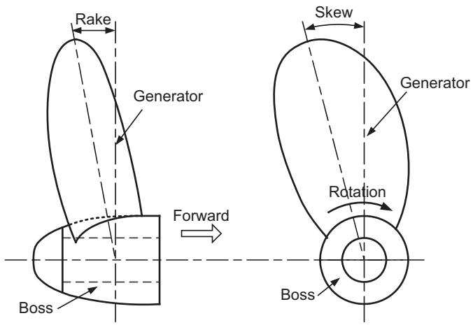

text_image

Rake
Generator
Forward
Boss
Skew
Generator
Rotation
Boss

Figure 12.1. Propeller geometry.

Section shape is usually defined in relation to the generator surface at stations normal to the generator surface. Blade face and back surface heights are given above the generator surface, Figure 12.4.

The blade projected and developed section lengths are laid off around arcs, whilst the expanded lengths are laid off at fixed radii, Figure 12.5.

Typical blade sections are as follows:

(i) Simple round back sections, Figure 12.6(a). These were in common use at one time and are still used for the outermost sections of a blade and for wide-bladed propellers.   
(ii) The inner (thicker) sections of most merchant propellers are normally of aerofoil shape, Figure 12.6(b), selected to give a favourable pressure distribution for avoiding cavitation and offering less drag than the equivalent round back section for the same lift. The overall application tends to amount to aerofoil sections near the root of the blade, changing gradually to round back sections

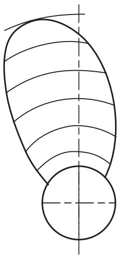

natural_image

Pure geometric diagram showing a curved shape intersecting a circle, with dashed centerlines (no text or symbols)

Figure 12.2. Propeller sections.

text_image

Axis
Generator surface
θ Pitch angle
2πr
P

Figure 12.3. Geometric pitch.

towards the tip. Section shape is particularly important as far as cavitation inception is concerned and this is discussed in more detail in Section 12.2.

(iii) Wedge-type sections, Figure 12.6(c), are used on propellers designed for supercavitating operation. Although not necessary for supercavitating operation, the trailing edge of the back of the section needs to be shaped in order to retain adequate performance under subcavitating operation (part loading) and operation astern.

# 12.1.1.1 Propeller Design Parameters

# (A) Pitch, P

Various definitions are used, all being derived from the advance of some feature of the propeller during one revolution. Pitch is normally expressed nondimensionally as a fraction of propeller diameter.

(1) Geometric pitch, Figure 12.3.

$$
P / D = \text { pitch   of   generator   surface / diameter }.
$$

This is sometimes called the face pitch ratio. The pitch (and pitch ratio) may be constant across the blade radius. Where the propeller pitch varies radially, a mean or virtual pitch may be quoted which is an average value over the blade. It should be noted that even for constant radial pitch, the pitch angle θ will vary radially, from a large angle at the blade root to a small angle at the tip. From Figure 12.3, r is the local radius and if R is the propeller radius, then let

$$
\frac {r}{R} = x.
$$

In Figure 12.3, for one revolution, $2 \pi r = 2 \pi x R = \pi x D$ . Then, at any radius r, pitch angle θ is: $\begin{array} { r } { \theta = \tan ^ { - 1 } ( \frac { P } { \pi x D } ) } \end{array}$ and the actual local geometric pitch angle at any radius can be calculated as follows:

$$
\theta = \tan^ {- 1} \left(\frac {P / D}{\pi x}\right). \tag {12.1}
$$

text_image

Back
Face

Figure 12.4. Section thickness offsets.

text_image

Projected outline (B–C)
Developed outline (A–D)
Expanded outline (A’–D’)
Axis
A B C D
A A B C D'

Figure 12.5. Projected, developed and expanded blade outline.

(2) Hydrodynamic pitch.

The advance at which a section will produce no thrust is the hydrodynamic pitch of that section. It is approximately the no-lift condition at that section, Figure 12.7.

(3) Effective pitch.

This is the advance for no thrust on the entire propeller, for example the point where $K _ { T }$ passes through zero on a $K _ { T } - K _ { Q }$ propeller chart, Figure 12.9.

For any given propeller type there is a fixed relationship between the various values of pitch ratio as defined above. So far as performance is concerned, the effective pitch is the critical value and the relation between mean geometric pitch and the effective pitch depends upon the pitch distribution, section type and thickness ratio.

  
Figure 12.6. Some propeller blade sections.

text_image

No lift line
Face pitch line
α₀
2πr

Figure 12.7. Hydrodynamic pitch.

# (B) Blade area ratio (BAR)

Area ratios are defined in relation to the disc area of the propeller. Three values are in common use, Figure 12.5.

Projected blade area ratio is the projected area viewed along shaft/disc area, B–C in Figure 12.5

Developed blade area ratio (DAR) is the area enclosed by developed outline/disc area, A–D in Figure 12.5

Expanded blade area ratio (EAR) is the area enclosed by expanded outline/disc area, A′–D′ in Figure 12.5.

In each case the area taken is that outside the boss. EAR and DAR are nearly equal and either may be called BAR (simply blade area ratio). BAR values are normally chosen to avoid cavitation, as discussed in Section 12.2.

# (C) Blade thickness ratio, t/D

$t / D$ is the maximum blade thickness projected to shaft line/diameter, Figure 12.8. Typical values of t/D are 0.045  0.050

# (D) Boss/diameter ratio

The boss diameter is normally taken at the point where the generator line cuts the boss outline, Figure 12.1, and this value is used for the boss/diameter ratio. Typical values for solid propellers are 0.18∼0.20, whilst built-up and controllable pitch propellers are larger at about 0.25.

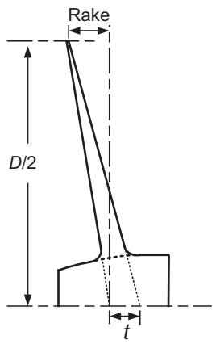

text_image

Rake
D/2
t

Figure 12.8. Propeller blade thickness.

# 12.1.2 Dimensional Analysis and Propeller Coefficients

Several systems of non-dimensional coefficients are used in propeller design work. The physical variables and their dimensions normally related by these coefficients are as follows:

$$
\begin{array}{l} \text { Thrust }, \quad T \quad \frac {M L}{T ^ {2}} (\text { force }) \\ \text { Torque }, \quad \mathrm{Q} \frac {M L ^ {2}}{T ^ {2}} (\text { force } \times \text { length }) \\ \text { Revs / sec }, \quad n \quad \frac {1}{T} \\ \text { Speed   of   advance, } \quad V \quad \frac {L}{T} \quad (\text { velocity }) \\ \text { Diameter }, \quad D L \\ \text { Fluid   density, } \quad \rho \quad \frac {M}{L ^ {3}} \quad (\text { mass / unit   volume }) \\ \end{array}
$$

According to the methods of dimensional analysis [12.1], [12.2], the relationships between the quantities may be expressed as:

$$
\begin{array}{c c} \text {Thrust} & \text {Torque} \\ f (T, D, V, n, \rho) = 0 & f (Q, D, V, n, \rho) = 0 \\ \text {or} \quad T = f (D, V, n, \rho) & \text {and} \quad Q = f (D, V, n, \rho) \end{array}
$$

whence

$$
\begin{array}{l} f _ {1} \left[ \left(\frac {T}{\rho n ^ {2} D ^ {4}}\right), \left(\frac {V}{n \cdot D}\right) \right] = 0 \quad f _ {2} \left[ \left(\frac {Q}{\rho n ^ {2} D ^ {5}}\right), \left(\frac {V}{n \cdot D}\right) \right] = 0 \\ f _ {3} \left[ \left(\frac {T}{\rho V ^ {2} D ^ {2}}\right), \left(\frac {V}{n \cdot D}\right) \right] = 0 \quad f _ {4} \left[ \left(\frac {Q}{\rho V ^ {2} D ^ {3}}\right), \left(\frac {V}{n \cdot D}\right) \right] = 0 \\ \end{array}
$$

Commonly found systems of presentation are as follows:

(a) $K _ { T } = T / \rho n ^ { 2 } D ^ { 4 } ; ~ K _ { Q } = Q / \rho n ^ { 2 } D ^ { 5 } ; ~ J = V / n D$   
(b) $C _ { T } = T / \rho V ^ { 2 } D ^ { 2 } ; \quad C _ { Q } = Q / \rho V ^ { 2 } D ^ { 3 } ; \quad J = V / n D$   
(c) $\mu = n ( \rho D ^ { 5 } / Q ) ^ { 1 / 2 } ; \phi = V ( \rho D ^ { 3 } / Q ) ^ { 1 / 2 } ; \sigma = D T / 2 \pi Q$   
(d) If a power approach is used, this yields $B _ { P } ( = N P ^ { 1 / 2 } / V ^ { 2 . 5 } ) ; \quad \delta ( = N D / V )$

# 12.1.3 Presentation of Propeller Data

The preferred system has become $K _ { T } , K _ { Q } , J$ for most purposes, Figure 12.9, since $C _ { T } , C _ { Q } , J$ suffers from the disadvantage that $C _ { T } , C _ { Q }  \infty$ as $V  0$ . This renders $C _ { T } , C _ { Q }$ charts useless for low-speed towing work, and meaningless at the bollard pull condition when $V = 0$ .

The $\mu , \sigma , \phi$ charts are convenient for certain towing duty calculations, and design charts have been developed for this purpose, Figure 16.6. For a power approach, $B _ { P } , \delta$ charts have been used extensively in the past, although they are not suitable for low-speed or bollard conditions, Figure 16.5. It is now more usual to find data presented in terms of $K _ { T } , K _ { Q } , J ,$ and this is the presentation in common use, Figure 12.9.

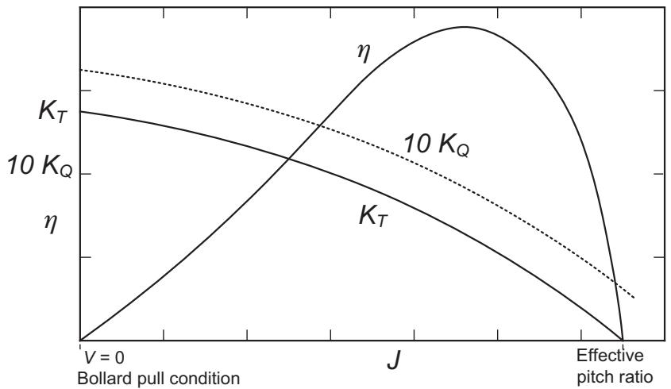

line

| Effective pitch ratio | η (solid line) | η (dashed line) |
| --------------------- | -------------- | --------------- |
| V = 0                 | 0              | 10 K_Q          |
| J                     | η              | 10 K_Q          |
| End                   | 0              | 0               |

Figure 12.9. Open water $K _ { T } - K _ { Q }$ chart, for one pitch ratio.

As 10KQ is about the same order of magnitude as $K _ { T }$ , this is normally plotted on the $K _ { T } - K _ { Q }$ chart. For a given blade area ratio, data for variation in the pitch ratio are normally shown on the same chart, Figure 16.3. Examples of the three types of chart and their applications are given in Chapter 16.

Propeller efficiency is determined as follows:

$$
\eta_ {0} = \text { power   output / power   input } = \frac {T V _ {a}}{2 \pi n Q}.
$$

This basic formula can be written in terms of the non-dimensional coefficients as:

$$
\eta_ {0} = \frac {\rho n ^ {2} D ^ {4} K _ {T} V _ {a}}{2 \pi n \rho n ^ {2} D ^ {5} K _ {Q}}
$$

or

$$
\eta_ {0} = \frac {J K _ {T}}{2 \pi K _ {Q}} \tag {12.2}
$$

This is a very useful formula and shows the relationship between $\eta _ { 0 } , J , K _ { T }$ and $K _ { Q }$

There have been several curve fits to $K _ { T } , K _ { Q }$ charts and it is clear that only $K _ { T }$ and $K _ { Q }$ need to be defined since $\eta _ { 0 }$ , which would be more difficult to curve fit, may be derived from Equation (12.2).

# 12.1.4 Measurement of Propeller Characteristics

Performance characteristics for the propeller in isolation are known as open water data. The propeller open water data may be measured using a propeller ‘boat’ in a test tank, Figure 12.10. In this case, unless it is a depressurised test tank such as that described in [12.3], cavitation will not occur. Alternatively, the propeller may be tested in a cavitation tunnel where open water characteristics can be measured, Figure 12.28, the pressure reduced and cavitation performance also observed, see Section 12.2.

Tests will normally entail the measurement of propeller thrust (T), torque (Q), revolutions (n) and speed (V). These may be corrected for temperature (to 15◦C)

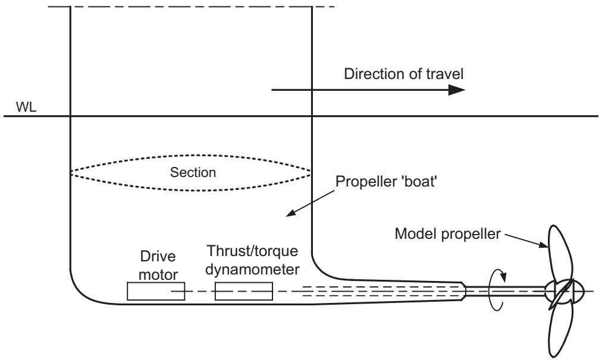

flowchart

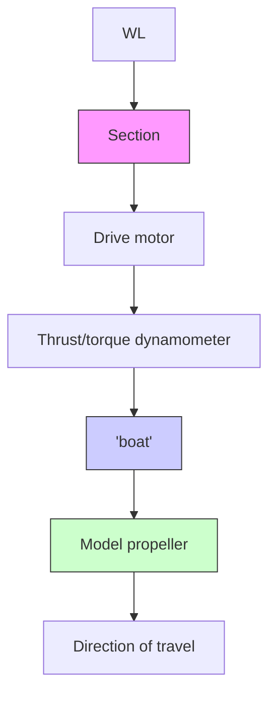
```mermaid
graph TD
    WL["WL"] --> Section["Section"]
    Section --> DriveMotor["Drive motor"]
    DriveMotor --> ThrustTortqueDynamometer["Thrust/torque dynamometer"]
    ThrustTortqueDynamometer --> Propeller["'boat'"]
    Propeller --> ModelPropeller["Model propeller"]
    ModelPropeller --> Direction["Direction of travel"]
    style Section fill:#f9f,stroke:#333
    style Propeller fill:#ccf,stroke:#333
    style ModelPropeller fill:#cfc,stroke:#333
```

Figure 12.10. Open water propeller ‘boat’.

and for tunnel wall effects (blockage) in the case of the cavitation tunnel. Finally, the results can be non-dimensionalised and plotted in terms of $K _ { T } , K _ { Q }$ and η to a base of J, per Figure 12.9.

The International Towing Task Conference (ITTC) recommended procedure for propeller open water tests may be found in ITTC2002 [12.4]. The measurements made are summarised in Figure 12.11.

Other propulsors are as follows:

Ducted propellers: The tests are broadly similar to those described for the propeller, with a separate dynamometer measuring the duct thrust or drag.

Supercavitating propellers: The tests are carried out in a cavitation tunnel (Section 12.2) and are broadly similar to those described.

Surface-piercing propellers: Open water tests follow a similar pattern to those for submerged propellers, but on an inclined shaft with the propeller only partially immersed in a tank or circulating water channel. Besides rpm, speed, thrust and torque, measurements will normally also include that of the vertical force. Results of such tests are given in [12.5] and [12.6].

Podded propellers: A schematic layout of a suitable test rig is shown in Figure 12.12. It is equipped with a dynamometer close to the propeller to measure propeller thrust and torque. A separate dynamometer at the top of the unit measures the thrust of the whole unit (effectively the thrust of the propeller minus the drag of the pod and support strut). The pod/support strut can be rotated enabling tests in oblique flow to be made, such as when manoeuvring. The drive motor may be housed in the pod in line with the propeller if space allows.

Typical tests will include open water tests on the propeller alone, followed by tests on the podded unit without the propeller, then on the total podded unit including the propeller. In this way, the drag of the pod/support strut and the interference

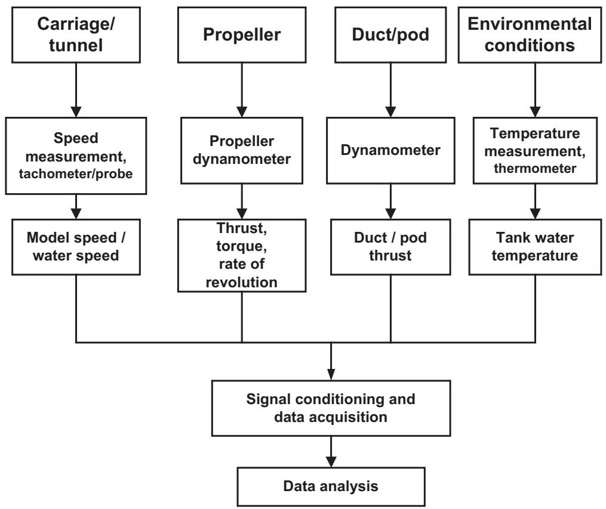

flowchart

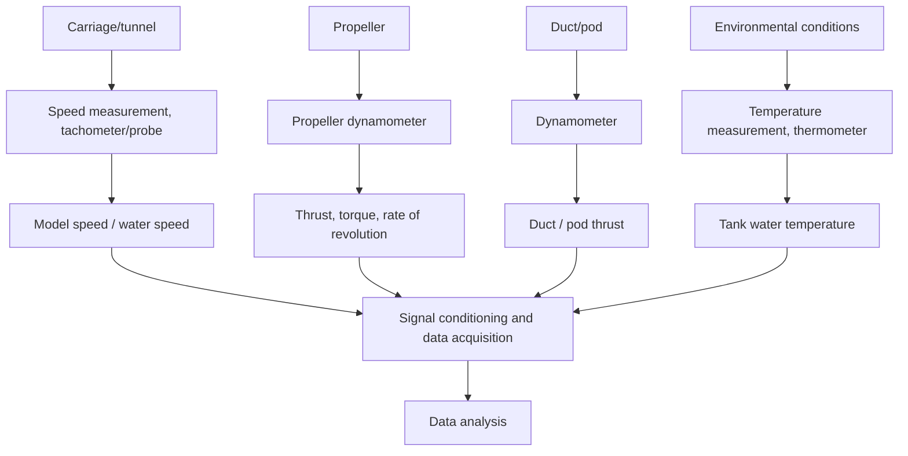
```mermaid
graph TD
    A["Carriage/tunnel"] --> B["Speed measurement, tachometer/probe"]
    C["Propeller"] --> D["Propeller dynamometer"]
    E["Duct/pod"] --> F["Dynamometer"]
    G["Environmental conditions"] --> H["Temperature measurement, thermometer"]
    B --> I["Model speed / water speed"]
    D --> J["Thrust, torque, rate of revolution"]
    F --> K["Duct / pod thrust"]
    H --> L["Tank water temperature"]
    I --> M["Signal conditioning and data acquisition"]
    J --> M
    K --> M
    L --> M
    M --> N["Data analysis"]
```

Figure 12.11. Open water test measurements.

text_image

Drive motor
Tunnel wall or bottom of a propeller boat
Unit thrust dynamometer
Fixed strut
End plate
Strut gap
Pod strut (rotatable)
Shaft and shaft housing
Propeller gap
Pod
Propeller thrust/ torque dynamometer

Figure 12.12. Schematic layout of podded propeller test rig.

effects of the supporting strut, pod and propeller can be determined. There are gaps between the pod strut and the fixed strut and between the propeller and the pod. It should be noted that gap effects between the propeller and pod can cause erroneous thrust readings for the propeller. This can make it difficult to differentiate between the total thrust of the unit, the thrust of the propeller and the net drag of the pod/support strut. The drag of the pod/support strut in isolation can, however, be determined by testing with the propeller removed, but this does not provide any information on propeller-pod interference effects. If problems with gap effects on propeller thrust are carried into the self-propulsion tests, then it is advisable to use a torque identity analysis, as the torque is little affected by the gap.

A recommended test procedure for podded units is described in the Appendix of ITTC2005 [12.7]. Recommended procedures for extrapolating the propeller data and the drag of the pod/strut support to full scale are described in ITTC2008 [12.8]. This subject is also discussed in Section 16.2.4.

Waterjets: A special approach is necessary. The equivalent of an open water test with direct thrust measurements is generally not feasible. Pump jet efficiency will normally be derived from separate tests. Thrust will normally be determined from momentum flux calculations using flow rate measurements. Full reviews and discussions of the methods employed and problems encountered are given in ITTC2002 [12.9] and ITTC2005 [12.10].

Cycloidal propellers: A special approach is necessary. Results of such tests are given Chapter 16 and in [12.11], [12.12].

Paddle wheels: A special approach is necessary. Results of such tests are given in [12.13, 12.14, 12.15].

# 12.2 Cavitation

# 12.2.1 Background

Cavitation occurs when the local fluid pressure drops to the vapour pressure of the liquid, that is, the pressure at which the liquid vapourises. Vapour pressure depends on temperature and the quality and content of the liquid. Cavitation can occur, in particular, on marine propellers where peaks of low (suction) pressure can arise, Figure 12.13. Sheet cavitation tends to occur near the nose of the blade section and bubble cavitation tends to occur on the back.

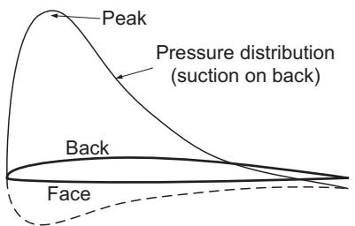

text_image

Peak
Pressure distribution
(suction on back)
Back
Face

Figure 12.13. Pressure distribution on propeller blade section.

text_image

Peak
Normal aerofoil

text_image

Lower peak
Round back

Figure 12.14. Alternative section shapes.

The magnitude (and peaks) of the pressure distribution depends on the lift coefficient (for required thrust) and on section shape and thickness. For example, compared with a normal aerofoil type section, a round back section will exhibit a lower suction peak for the same lift, Figure 12.14, although this will usually be accompanied by some increase in drag.

The effects of cavitation are as follows:

- Flow along the surface is disturbed; the effective profile properties change, causing thrust and torque reductions and decrease in efficiency,   
- Possible erosion attributed to the collapse of cavitation bubbles as they move into regions of higher pressure, Figure 12.15,   
- Noise as cavities collapse,   
- Possible vibration, leading to blade fracture.

Thus, it is desirable to size the area of the propeller blades whereby the thrust loadings, hence the magnitude of pressure peaks, are limited in order to avoid cavitation. Also, careful choice of section shape is necessary in order to smooth out pressure peaks.

The basic physics of cavitation, and cavitation inception, is described in some detail by Carlton [12.16]. Examples of cavitation tests on propellers are included in [12.17–12.20].

It must be noted that cavitation should not be confused with ventilation. In the case of ventilation, the propeller blades are near or breaking the surface. Air is drawn down to fill the cavities in the flow at atmospheric pressure, compared with vapour pressure for cavitation. Apart from the level of pressure and the lack of erosion, the general phenomena that occur are similar to cavitation.

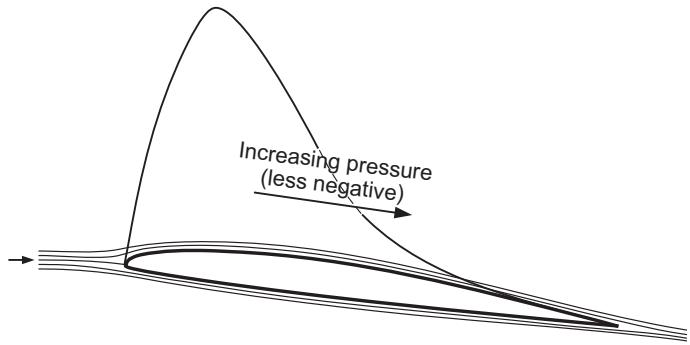

text_image

Increasing pressure
(less negative)

Figure 12.15. Increasing pressure as fluid flows aft.

text_image

P_O V
P_L V_L
σ
ΔP/q
Cavitation

Figure 12.16. Cavitation inception.

# 12.2.2 Cavitation Criterion

Cavitation occurs when the local pressure $P _ { L }$ decreases to less than the vapour pressure, $P _ { V }$ , Figure 12.16.

For NO cavitation,

$$
P _ {L} \geq P _ {V}.
$$

If $\Delta P = P _ { 0 } - P _ { L }$ , then $\Delta P = P _ { 0 } - P _ { L } \le P _ { 0 } - P _ { V }$ for NO cavitation, i.e. $\Delta P / q \leq$ $( P _ { 0 } - P _ { V } ) / q$ , where $\begin{array} { r } { q = \frac { 1 } { 2 } \rho V ^ { 2 } } \end{array}$ . Hence, $\Delta P / q \le \sigma$ for NO cavitation, where σ is the cavitation number and $\sigma = ( P _ { 0 } - P _ { V } ) / q$ , where:

$P _ { 0 }$ is the static pressure in free stream (including atmospheric) at the point considered.

$$
P _ {0} = P _ {A T} + \rho g h.
$$

h is the immersion, usually quoted to shaft axis (m)

$P _ { A T }$ is the atmospheric pressure $\cong 1 0 1 \times 1 0 ^ { 3 } \ : \mathrm { N } / \mathrm { m } ^ { 2 }$

$P _ { V }$ is the vapour pressure, assume for initial design purposes $\cong 3 \times 1 0 ^ { 3 } \mathrm { N } / \mathrm { m } ^ { 2 }$ for water.

Hence, the peaks of the pressure distribution curve $\Delta P / q$ should not exceed the cavitation number $\sigma . ~ { \Delta P } / q$ is a function of the shape of the section and angle of attack, with $\Delta P / q \propto C _ { L }$ for a particular section, Figure 12.17.

The cavitation number σ can be written as

$$
\sigma = \frac {(P _ {A T} + \rho g h - P _ {V})}{0 . 5 \rho V ^ {2}} \tag {12.3}
$$

and a pressure coefficient can be written as

$$
C _ {P} = \frac {(P _ {L} - P _ {0})}{0 . 5 \rho V ^ {2}}. \tag {12.4}
$$

line

| ΔP/q | Increasing C_L |
|------|----------------|
| 0    | 0              |
| Peak | ~1.5           |
| Decline | Decreasing     |

Figure 12.17. Pressure distribution change with increase in $C _ { L }$ .

text_image

r
V_R
Va
2πnr

Figure 12.18. Reference velocity.

The reference velocity used $( V _ { R } )$ is usually the local section velocity including inflow:

$$
V _ {R} = \sqrt {V a ^ {2} + (2 \pi r n) ^ {2}} \tag {12.5}
$$

where $V a$ is the propeller advance velocity, r is the radius of propeller section considered and n is rps, Figure 12.18. For example, preliminary design criteria often consider

$$
r = 0. 7 R = 0. 7 \frac {D}{2}
$$

and

$$
\sigma = \frac {(P _ {A T} + \rho g h - P _ {V})}{0 . 5 \rho V _ {R} ^ {2}}. \tag {12.6}
$$

# 12.2.3 Subcavitating Pressure Distributions

Marine propellers normally work in a non-uniform wake, see Chapter 8; hence, for a particular section on the propeller, the effective angle of attack will change in one revolution and may also become negative, Figure 12.19.

The subcavitating pressure distributions around the propeller sections show characteristic variations as the angle of attack changes, Figure 12.20. In each case, cavities may form at the point of minimum pressure. The physical appearance in each case is shown schematically in Figure 12.21.

Type of cavitation are as follows:

(i) Attached sheet cavitation: Attached sheet cavitation at the blade leading edge. This forms on the back for $\alpha > \alpha _ { i }$ and on the face for $\alpha < \alpha _ { i }$ , where $\alpha _ { i }$ is the ideal incidence.   
(ii) Bubble cavitation: Bubble cavitation is initiated on the blade back only at the location of the pressure minimum. This can occur even at $\alpha = \alpha _ { i }$ . It can occur with sheet cavitation and a combination of face sheet cavitation with back

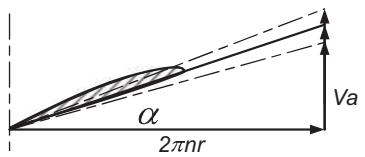

text_image

α
2πnr
Va

Figure 12.19. Change in blade angle of attack with change in Va.

  
Figure 12.20. Subcavitating pressure distributions.

bubble cavitation is possible. There is the possibility of cloud cavitation downstream of sheet cavitation. With sheet cavitation at the leading edge, the cavitation core is likely to be separated from the blade by a thin layer of fluid; hence, there is a smaller risk of erosion. With bubble cavitation, the cavity is in direct contact with the blade and erosion is likely.

(iii) Tip vortex cavitation: This is similar to the shed tip vortex on a finite lifting foil. The low pressure core of the vortex can impinge on adjacent hull structure and rudders. It can be difficult to distinguish from sheet cavitation.   
(iv) Hub vortex cavitation: This depends on the convergence of the boss (hub), and can affect face or back cavitation in the blade root sections. Erosion and

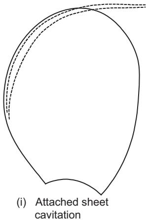

text_image

(i) Attached sheet
cavitation

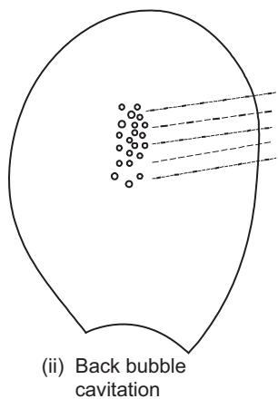

text_image

(ii) Back bubble
cavitation

Figure 12.21. Sheet and back bubble cavitation.

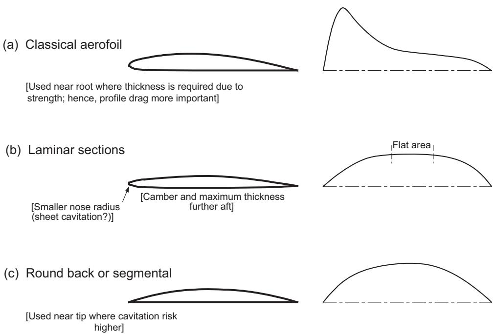  
[Used near root where thickness is required due to strength; hence, profile drag more important]

Figure 12.22. Section types: typical pressure distributions at ideal incidence.

rudder damage may occur. The use of truncated cones with no boss fairing at the trailing edge may provide a solution.

# 12.2.4 Propeller Section Types

These can be characterised by the pressure distributions at ideal incidence, Figure 12.22. It can be noted that the profile drag of laminar and round back sections is generally greater than for aerofoil type sections. Thus, the aerofoil type section tends to be used near the root, where thickness is required for strength, changing to round back near the tip, see also Figure 16.2.

# 12.2.5 Cavitation Limits

The cavitation limits for a normal propeller section can be indicated on a Gutsche type diagram, that is, an envelope of cavitation limits, or sometimes termed a cavitation bucket which is cavitation free, Figure 12.23.

The maximum thrust $( \mathrm { i } . \mathrm { e } . { C } _ { L } )$ is at the intersection of the back bubble and back sheet lines. The lines have the following forms:

$\mathrm { B a c k ~ b u b b l e ~ l i n e ~ } ( \mathrm { n e a r } \alpha _ { i } ) \colon \sigma = \Delta p / q = f ( C _ { L } ) , \qquad \mathrm { o r } \ C _ { L } = \sigma / \mathbf { k } _ { 1 } .$ (12.7)

Back sheet line (at LE): $\sigma = \Delta p / q = f ( C _ { L } - C _ { L i } ) , ~ \mathrm { o r } ~ C _ { L } = \sigma / { \bf k } _ { 2 } + C _ { L i } .$ (12.8)

Face sheet line (at LE): $\sigma = \Delta p / q = f ( C _ { L i } - C _ { L } ) , \quad \mathrm { o r } \ : C _ { L } = C _ { L i } - \sigma / { \bf k } _ { 3 } .$ (12.9)

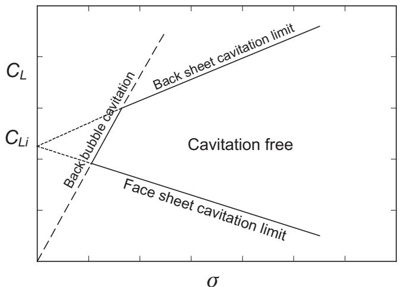

text_image

C_L
Back bubble cavitation
Back sheet cavitation limit
C_Li
Back bubble cavitation
Cavitation free
Face sheet cavitation limit
σ

Figure 12.23. Cavitation inception envelope.

In terms of section characteristics, the limits of cavitation are given approximately by the following formulae, for sections approaching round back:

$$
\text { Back   bubble   cavitation: } \sigma = 2 / 3 C _ {L} + 5 / 2 (t / c). \tag {12.10}
$$

$$
\text { Sheet   cavitation: } \sigma = 0. 0 6 (C _ {L} - C _ {L i}) ^ {2} / (r / c), \tag {12.11}
$$

where $C _ { L }$ is the operating lift coefficient, $C _ { L i }$ is the ideal design lift coefficient, t is maximum thickness, r is the nose radius, c is the section chord, and $\sigma$ is based on the local relative flow speed, Equation (12.5). Typical values of the nose radius are $( r / c ) = k ( t / c ) ^ { 2 }$ , where k is given in Table 12.1.

Typical experimentally derived data attributable to Walcher, and presented in the same form as Gutsche, are shown in Figure 12.24, for changes in section thickness ratio $t / l ,$ [12.21]. This figure illustrates the main features of such data. The (vertical) width of the bucket is a measure of the tolerance of the section to cavitationfree operation, i.e. with a wider bucket, the section will be able to tolerate a much wider variation in the angle of attack without cavitating. The width and shape of the bucket will depend on section characteristics such as thickness, camber, overall shape and nose shape. For example, as seen in Figure 12.24, an increase in section thickness tends to widen the bucket and move the bucket width and shape vertically to higher values of $C _ { L }$ .

Table 12.1. Values of k 

<table><tr><td>Section type</td><td>k</td></tr><tr><td>Round back</td><td>0.15</td></tr><tr><td>Joukowski</td><td>0.12</td></tr><tr><td>NACA 00 symmetrical</td><td>0.11</td></tr><tr><td>Elliptic leading edge</td><td>0.50</td></tr></table>

NACA, National Advisory Council for Aeronautics.

line

| Δρ/q | CL (0°) | CL (1°) | CL (2°) | CL (4°) | CL (6°) | CL (7°) |
|------|---------|---------|---------|---------|---------|---------|
| 0.0  | 0.25    | 0.25    | 0.25    | 0.25    | 0.25    | 0.25    |
| 0.5  | 0.50    | 0.50    | 0.50    | 0.50    | 0.50    | 0.50    |
| 1.0  | 0.75    | 0.75    | 0.75    | 0.75    | 0.75    | 0.75    |
| 1.5  | 0.85    | 0.85    | 0.85    | 0.85    | 0.85    | 0.85    |
| 2.0  | 0.95    | 0.95    | 0.95    | 0.95    | 0.95    | 0.95    |
| 2.5  | 1.00    | 1.00    | 1.00    | 1.00    | 1.00    | 1.00    |

Figure 12.24. Cavitation envelopes attributable to Walcher.

It should be noted that such section information allows the detailed propeller section characteristics and choice to be investigated in some depth with respect to cavitation. For example, for a given σ and section type, the $C _ { L }$ to avoid cavitation (from a chart such as in Figure 12.23 or 12.24) can be retained by the choice of chord length, hence, blade area ratio. Namely, $C _ { L } = L / \% \rho c V ^ { 2 }$ ; hence, for required lift (thrust) from a spanwise thrust loading curve, and limiting value of $C _ { L }$ for cavitation, a suitable chord length c can be determined. This can be repeated across the blade span and a blade outline produced. A simple example applying the envelope in Figure 12.23 and Equations (12.7)–(12.11) to one elemental section is given in Chapter 17.

Some approaches use numerical methods to determine the blade surface pressures, linked to cavitation criteria, as discussed in references such as Szantyr [12.22], Carlton [12.16] and ITTC2008 [12.23]. For example, a first approximation may be achieved by applying a two-dimensional (2-D) panel method at a particular section to predict the pressure distribution, as in Figure 12.16; hence, the incidence $( \mathrm { o r } C _ { L } )$ when $\Delta P / q = \mathrm { l o c a l } \sigma$ . This can then be used in the development of the back bubble and sheet cavitation curves in Figures 12.23 and 12.24. An example of the technique is described in [12.24], where the panel code described in [12.25] was used to predict cavitation inception on sections suitable for marine current turbines. Satisfactory correlation was obtained between the 2-D panel code and the cavitation tunnel results, Figure 12.25, although the panel code was a little conservative on the face.

# 12.2.6 Effects of Cavitation on Thrust and Torque

With the presence of cavitation, the flow along the surface is disturbed. The profile properties change, which causes thrust and torque reductions and a decrease in efficiency. As the extent of the cavitation increases, there is a progressive loss of load as the suction lift on the blade is destroyed. The effects on $K _ { T }$ and $K _ { Q }$ of a decrease in cavitation number (increase in cavitation) are illustrated in Figure 12.26.

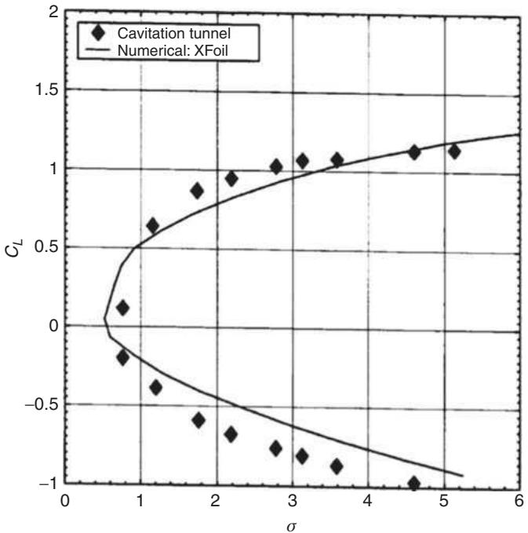

line

| σ    | G_L (Cavitation tunnel) | G_L (Numerical: XFoil) |
| ---- | ------------------------ | ---------------------- |
| 0.5  | -0.2                     | 0.0                    |
| 1.0  | 0.6                      | 0.5                    |
| 1.5  | 0.8                      | 0.7                    |
| 2.0  | 0.9                      | 0.8                    |
| 2.5  | 1.0                      | 0.9                    |
| 3.0  | 1.0                      | 1.0                    |
| 3.5  | 1.0                      | 1.1                    |
| 4.0  | 1.1                      | 1.2                    |
| 4.5  | 1.1                      | 1.3                    |
| 5.0  | 1.1                      | 1.4                    |
| 5.5  | -0.9                     | 1.5                    |
| 6.0  | -0.9                     | 1.6                    |

Figure 12.25. Cavitation inception envelopes for NACA 63-215 section; comparison of numerical and experimental results [12.24].

Where possible, propellers should be designed to be entirely free of cavitation (subcavitating propellers). If the cavitation number σ falls significantly, cavitation is unavoidable and, to prevent erosion, it is desirable to deliberately design so far into the back sheet cavitation zone that cavity collapse occurs well behind the blade (supercavitating propellers). As the supercavitating state is reached, the thrust, now due to face pressure only, stabilises at about half the subcavitating level. The effect on $K _ { T }$ is shown schematically in Figure 12.27. The effect on $K _ { Q }$ is similar with a subsequent loss in efficiency.

Wedge-shaped sections are often used on propellers designed for supercavitating operation, as discussed in Section 12.1.1 and shown in Figure 12.6 (c). Data for supercavitating propellers are described in Chapter 16.

# 12.2.7 Cavitation Tunnels

In open water propeller tests, total thrust (T) varies as the cube of scale $( \lambda ^ { 3 } )$ and surface area (A) varies as the square of scale (λ2). Therefore, thrust intensity $\left( T / A \right)$ cYanmaaGentaYlowb is proportional to scale. Also, atmospheric pressure is not reduced to scale. Hence, there is less thrust intensity at model scale compared with that found on working propellers at full scale. Thus, cavitation is not observed in model open water propeller tests in an experimental test tank.

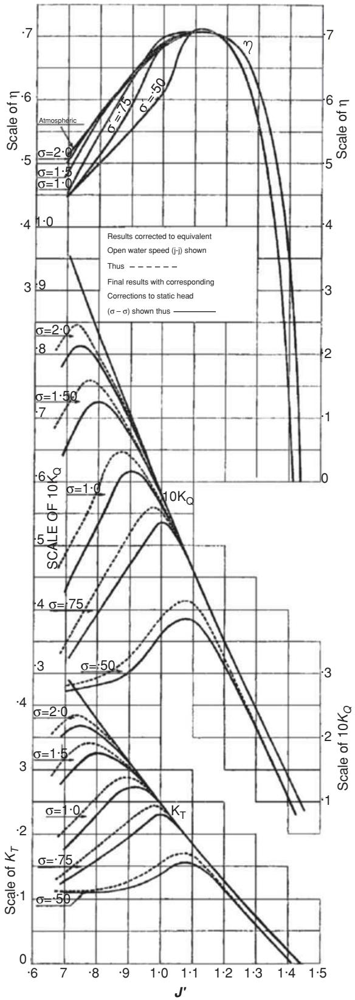  
Figure 12.26. Loss of load with increase in cavitation (decrease in σ) [12.17].

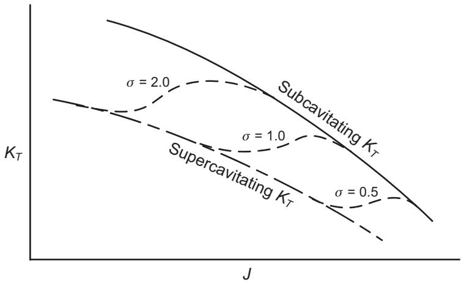

line

| J    | Subcavitating K_T | Supercavitating K_T |
|------|-------------------|---------------------|
| Low  | High              | High                |
| Medium-Low | Medium           | Medium            |
| High | Low               | Low                 |

Figure 12.27. Sub- and supercavitating $K _ { T } .$ .

A cavitation tunnel is used to simulate the correct thrust intensity at model scale, Figure 12.28. The correct cavitating conditions are reached by reducing the pressure in the tunnel. A special type of sealed test tank may also be used, which can be evacuated and the pressure reduced [12.3].

Typical cavitation tunnel working section cross-sectional dimensions vary from about 600 mm  600 mm to 2800 mm  1600 mm in the largest facilities. In the larger tunnels, it is possible to include a wake screen or a truncated dummy hull upstream of the propeller under test in order to simulate suitable wake distributions. In order to minimise scale effects, the propeller diameter will normally be as large as possible without incurring significant blockage effects from the tunnel walls.

flowchart

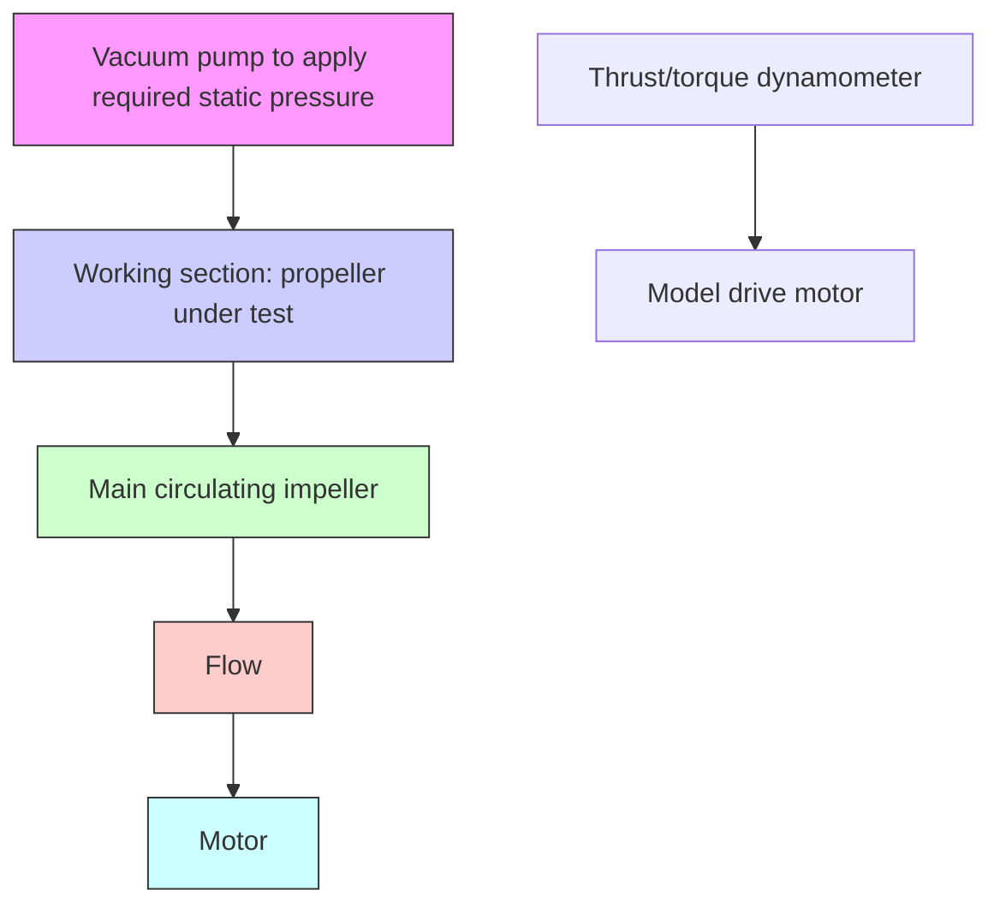
```mermaid
graph TD
    A["Vacuum pump to apply required static pressure"] --> B["Working section: propeller under test"]
    B --> C["Main circulating impeller"]
    C --> D["Flow"]
    D --> E["Motor"]
    F["Thrust/torque dynamometer"] --> G["Model drive motor"]
    style A fill:#f9f,stroke:#333
    style B fill:#ccf,stroke:#333
    style C fill:#cfc,stroke:#333
    style D fill:#fcc,stroke:#333
    style E fill:#cff,stroke:#333
```

Figure 12.28. Diagrammatic layout of a cavitation tunnel.

natural_image

Close-up of a metallic propeller or fan blade mounted on a metal frame, with no visible text or symbols.

natural_image

Close-up of a metallic propeller or fan device with visible blades and internal structure, mounted on a metal frame (no text or symbols)

natural_image

Close-up of a metallic propeller or fan-shaped object with curved blades, mounted on a metal frame (no visible text or symbols)

(c)

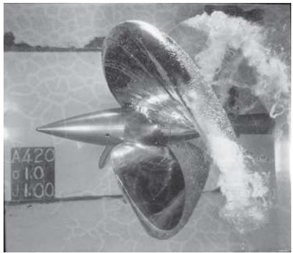

natural_image

Close-up of a metallic propeller with a spool of white foam or liquid flowing out, no visible text or symbols.

Figure 12.29. Development of cavitation; Emerson Cavitation Tunnel. Photographs courtesy of The University of Newcastle upon Tyne.

Blockage speed corrections may be applied if necessary. Water speed is usually kept as high as possible to maximise Reynolds number and minimise skin friction scale effects. The model is run at the correct J value, which then determines the propeller rpm. The pressure will be lowered as necessary to achieve the required cavitation number. The normal practice, for a given cavitation number, is to test a range of rpm at constant water speed. During each run the propeller rpm, thrust, torque, water temperature and tunnel pressure will be measured. Air content in the water will also be monitored as this can affect the onset of cavitation and affect visual flow studies. Photographs showing the development of cavitation are shown in Figure 12.29 for progressive lowering of the cavitation number. A more detailed account of cavitation and cavitation tunnels is included in Carlton [12.16].

# 12.2.8 Avoidance of Cavitation

It is seen from the previous sections that cavitation may be avoided by giving due attention to the blade section shape, thickness and blade area. The blade outline shape may also be modified. For example, tip offloading may be applied by a local reduction in pitch or a reduction in chord size near the tip. Blade skew may also improve cavitation performance [12.26]. At the preliminary design stage, however, achieving the correct blade area will be the predominant requirement.

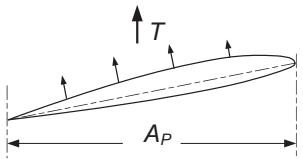

text_image

T
A_P

Figure 12.30. Average pressure.

# 12.2.9 Preliminary Blade Area – Cavitation Check

In the early stages of the propeller design process, the designer is primarily concerned with the selection of a suitable blade area, and hence, the choice of the most suitable standard series chart.

In general, the cavitation limit $\Delta P / \frac { 1 } { 2 } \rho V _ { R } ^ { 2 }$ can be transformed, Figure 12.30, by relating the local dynamic pressure $\Delta P$ to the average difference over the blade $\bar { p }$ given by

$$
\bar {p} = \frac {T}{A _ {P}}, \tag {12.12}
$$

where $T$ is the thrust and $A _ { P }$ is the projected area (viewed from aft). Thus, at cavitation inception,

$$
\sigma = \tau_ {c},
$$

where

$$
\tau_ {c} = \frac {T}{0 . 5 \rho A _ {P} V _ {R} ^ {2}}. \tag {12.13}
$$

Such an approach is proposed by Burrill and Emmerson [12.18] for use at the preliminary design stage. Burrill and others have plotted data from cavitation tunnel and full-scale tests showing limiting $\tau _ { c }$ values for a given cavitation number $( \sigma )$ , as seen in Figure 12.31. Such charts normally use a reference velocity $V _ { R }$ at $0 . 7 R = 0 . 7 \frac { \mathrm { D } } { 2 }$ and

$$
V _ {R} = \sqrt {V a ^ {2} + (0 . 7 \pi n D) ^ {2}}. \tag {12.14}
$$

Burrill provides an empirical relationship between developed area $\left( A _ { D } \right)$ , and projected area $\left( A _ { P } \right)$ as follows:

$$
A _ {P} = A _ {D} (1. 0 6 7 - 0. 2 2 9 P / D), \tag {12.15}
$$

where $P / D$ is the pitch ratio and

$$
\mathrm{BAR} = A _ {D} = A _ {P} / (1. 0 6 7 - 0. 2 2 9 P / D). \tag {12.16}
$$

Empirical relationships have been developed for the various lines on the Burrill chart, Figure 12.31, as follows:

$$
\text { Line   (1) } \quad \tau_ {c} = 0. 2 1 (\sigma - 0. 0 4) ^ {0. 4 6}. \tag {12.17}
$$

line

| Local cavitation number at 0.7R σ(0.7R) | T_C = 0.5ρAPVR²(0.7R) | Percentage of Back Cavitation |
| -------------------------------------- | ---------------------- | ----------------------------- |
| 0.1                                    | ~0.02                  | 10% back cavitation           |
| 0.2                                    | ~0.08                  | 10% back cavitation           |
| 0.3                                    | ~0.16                  | 10% back cavitation           |
| 0.4                                    | ~0.24                  | 10% back cavitation           |
| 0.5                                    | ~0.32                  | 10% back cavitation           |
| 0.6                                    | ~0.4                   | 10% back cavitation           |
| 0.7                                    | ~0.48                  | 10% back cavitation           |
| 0.8                                    | ~0.56                  | 10% back cavitation           |
| 0.9                                    | ~0.64                  | 10% back cavitation           |
| 1.0                                    | ~0.72                  | 10% back cavitation           |
| 1.5                                    | ~0.8                   | 30% back cavitation          |
| 2.0                                    | ~0.88                  | 30% back cavitation          |
| Upper limit for heavily        | ~0.1                   | 5% back cavitation            |
| Losted propellers (1943)     | ~0.1                   | 5% back cavitation            |
| Warship propellers with special sections | ~0.2                   | 5% back cavitation            |
| Suggested upper limit (1943)    | ~0.3                   | 5% back cavitation            |
| Suggested lower limit (1943)   | ~0.4                   | 5% back cavitation            |
| Weathering (for merchant ship propellers) | ~0.5                   | 5% back cavitation            |
| Weathering (for tugs, trawlers, etc.) | ~0.6                   | 5% back cavitation            |
| Weathering (for Vα × A_P)      | ~0.7                   | 5% back cavitation            |
| Weathering (for Vα × EFFY × 2·26) | ~0.8                   | 5% back cavitation            |
| Weathering (for Vα × A_P)      | ~0.9                   | 5% back cavitation            |
| Weathering (for Vα × EFFY × 2·26) | ~1.0                   | 5% back cavitation            |
| Weathering (for Vα × A_P)      | ~1.5                   | 2½%                          |
| Weathering (for Vα × EFFY × 2·26) | ~2.0                   | 2½%                          |
| Weathering (for Vα × A_P)      | ~2.5                   | 2½%                          |
| Weathering (for Vα × EFFY × 2·26) | ~3.0                   | 2½%                          |
| Weathering (for Vα × A_P)      | ~3.5                   | 2½%                          |
| Weathering (for Vα × EFFY × 2·26) | ~4.0                   | 2½%                          |
| Weathering (for Vα × A_P)      | ~4.5                   | 2½%                          |
| Weathering (for Vα × EFFY × 2·26) | ~5.0                   | 2½%                          |
| Weathering (for Vα × A_P)      | ~5.5                   | 2½%                          |
| Weathering (for Vα × EFFY × 2·26) | ~6.0                   | 2½%                          |
| Weathering (for Vα × A_P)      | ~6.5                   | 2½%                          |
| Weathering (for Vα × EFFY × 2·26) | ~7.0                   | 2½%                          |
| Weathering (for Vα × A_P)      | ~7.5                   | 2½%                          |
| Weathering (for Vα × EFFY × 2·26) | ~8.0                   | 2½%                          |
| Weathering (for Vα × A_P)      | ~8.5                   | 2½%                          |
| Weathering (for Vα × EFFY × 2·26) | ~9.0                   | 2½%                          |
| Weathering (for Vα × A_P)      | ~9.5                   | 2½%                          |
| Weathering (for Vα × EFFY × 2·26) | ~10.0                  | 2½%                          |
| Weathering (for Vα × A_P)      | ~10.5                  | 2½%                          |
| Weathering (for Vα × EFFY × 2·26) | ~11.0                  | 2½%                          |
| Weathering (for Vα × A_P)      | ~11.5                  | 2½%                          |
| Weathering (for Vα × EFFY × 2·26) | ~12.0                  | 2½%                          |
| Weathering (for Vα × A_P)      | ~12.5                  | 2½%                          |
| Weathering (for Vα × EFFY × 2·26) | ~13.0                  | 2½%                          |
| Weathering (for Vα × A_P)      | ~13.5                  | 2½%                          |
| Weathering (for Vα × EFFY × 2·26) | ~14.0                  | 2½%                          |
| Weathering (for Vα × A_P)      | ~14.5                  | 2½%                          |
| Weathering (for Vα × EFFY × 2·26) | ~15.0                  | 2½%                          |
| Weathering (for Vα × A_P)      | ~15.5                  | 2½%                          |
| Weathering (for Vα × EFFY × 2·26) | ~16.0                  | 2½%                          |
| Weathering (for Vα × A_P)      | ~16.5                  | 2½%                          |
| Weathering (for Vα × EFFY × 2·26) | ~17.0                  | 2½%                          |
| Weathering (for Vα × A_P)      | ~17.5                  | 2½%                          |
| Weathering (for Vα × EFFY × 2·26) | ~18.0                  | 2½%                          |
| Weathering (for Vα × A_P)      | ~18.5                  | 2½%                          |
| Weathering (for Vα × EFFY × 2·26) | ~19.0                  | 2½%                          |
| Weathering (for Vα × A_P)      | ~19.5                  | 2½%                          |
| Weathering (for Vα × EFFY × 2·26) | ~20.0                  | 2½%                          |
| Weathering (for Vα × A_P)      | ~20.5                  | 2½%                          |
| Weathering (for Vα × EFFY × 2·26) | ~21.0                  | 2½%                          |
| Weathering (for Vα × A_P)      | ~21.5                  | 2½%                          |
| Weathering (for Vα × EFFY × 2·26) | ~22.0                  | 2½%                          |
| Weathering (for Vα × A_P)      | ~22.5                  | 2½%                          |
| Weathering (for Vα × EFFY × 2·26) | ~23.0                  | 2½%                          |
| Weathering (for Vα × A_P)      | ~23.5                  | 2½%                          |
| Weathering (for Vα × EFFY × 2·26) | ~24.0                  | 2½%                          |
| Weathering (for Vα × A_P)      | ~24.5                  | 2½%                          |
| Weathering (for Vα × EFFY × 2·26) | ~25.0                  | 2½%                          |
| Weathering (for Vα × A_P)      | ~25.5                  | 2½%                          |
| Weathering (for Vα × EFFY × 2·26) | ~26.0                  | 2½%                          |
| Weathering (for Vα × A_P)      | ~26.5                  | 2½%                          |
| Weathering (for Vα × EFFY × 2·26) | ~27.0                  | 2½%                          |
| Weathering (for Vα × A_P)      | ~27.5                  | 2½%                          |
| Weathering (for Vα × EFFY × 2·26) | ~28.0                  | 2½%                          |
| Weathering (for Vα × A_P)      | ~28.5                  | 2½%                          |
| Weathering (for Vα × EFFY × 2·26) | ~29.0                  | 2½%                          |
| Weathering (for Vα × A_P)      | ~29.5                  | 2½%                          |
| Weathering (for Vα × EFFY × 2·26) | ~30.0                  | 2½%                          |
| Weathering (for Vα × A_P)      | ~30.5                  | 2½%                          |
| Weathering (for Vα × EFFY × 2·26) | ~31.0                  | 2½%                          |
| Weathering (for Vα × A_P)      | ~31.5                  | 2½%                          |
| Weathering (for Vα × EFFY × 2·26) | ~32.0                  | 2½%                          |
| Weathering (for Vα × A_P)      | ~32.5                  | 2½%                          |
| Weathering (for Vα × EFFY × 2·26) | ~33.0                  | 2½%                          |
| Weathering (for Vα × A_P)      | ~33.5                  | 2½%                          |
| Weathering (for Vα × EFFY × 2·26) | ~34.0                  | 2½%                          |
| Weathering (for Vα × A_P)      | ~34.5                  | 2½%                          |
| Weathering (for Vα × EFFY × 2·26) | ~35.0                  | 2½%                          |
| Weathering (for Vα × A_P)      | ~35.5                  | 2½%                          |
| Weathering (for Vα × EFFY × 2·26) / Warship propellers with special sections (%) - Upper limit for heavily located propellers (1943). The suggested upper limit for heavily located propellers (1943). The suggested lower limit for heavily located propellers (1943). The suggested upper limit for heavily located propellers (1943). The suggested lower limit for heavily located propellers (1943). The suggested upper limit for heavily located propellers (1943). The suggested lower limit for heavily located propellers (1943). The suggested upper limit for heavily located propellers (1943). The suggested lower limit for heavily located propellers (19<ecel><ecel><nl>

Figure 12.31. Burrill cavitation diagram.

Line (1) is a lower limit, used for heavily loaded propellers on tugs, trawlers etc.

$$
\text { Line   (2) } \quad \tau_ {c} = 0. 2 8 (\sigma - 0. 0 3) ^ {0. 5 7}. \tag {12.18}
$$

Line (2) is an upper limit, for merchant vessels etc., 2%–5% back cavitation, using aerofoil sections and this line is equivalent to the frequently quoted Burrill line,

$$
\text { Line   (3) } \quad \tau_ {c} = 0. 4 3 (\sigma - 0. 0 2) ^ {0. 7 1}. \tag {12.19}
$$

Line (3) is an upper limit used for naval vessels, fast craft etc, with 10%–15% back cavitation. This line is for uniform suction type sections and accepts a greater risk of cavitation at full power. [12.17] indicates that this line is just below the likely onset of thrust breakdown due to cavitation.

# 12.2.10 Example: Estimate of Blade Area

Consider a propeller with the following particulars:

D = 4.0 m, P/D = 0.7 (derived using an assumed BAR and propeller chart)

rpm = 120 (2.0 rps), Va = 10 knots (= 5.144 m/s)

Immersion of shaft h  3.0 m

Required thrust T  250  103 N

$$
\begin{array}{l} V _ {R} ^ {2} = V _ {a} ^ {2} + (0. 7 \pi n D) ^ {2} = 5. 1 4 4 ^ {2} + (0. 7 \pi \times 2. 0 \times 4. 0) ^ {2} = 3 3 5. 9 7 \mathrm{m} ^ {2} / \mathrm{s} ^ {2} \\ \sigma = (\rho g h + P _ {A T} - P _ {V}) / ^ {1 / 2} \rho V _ {R} ^ {2} \\ = (1 0 2 5 \times 9. 8 1 \times 3. 0 + 1 0 1 \times 1 0 ^ {3} - 3 \times 1 0 ^ {3}) / ^ {1 / _ {2}} \times 1 0 2 5 \times 3 3 5. 9 7 = 0. 7 4 4. \\ \end{array}
$$

Using line (2), Equation (12.18), for upper limit merchant ships, $\tau _ { c } = 0 . 2 3 1$ .

A similar value can be determined directly from Figure 12.31. Then, $A _ { P } =$

$$
T / ^ {1} _ {2} \rho V _ {R} ^ {2} \tau_ {c} = 2 5 0 \times 1 0 ^ {3} / ^ {1} _ {2} \times 1 0 2 5 \times 3 3 5. 9 7 \times 0. 2 3 1 = 6. 2 8 5 \mathrm{m} ^ {2},
$$

$$
A _ {D} = A _ {P} / (1. 0 6 7 - 0. 2 2 9 P / D) = 6. 2 8 5 / (1. 0 6 7 - 0. 2 2 9 \times 0. 7 0) = 6. 9 3 2 \mathrm{m} ^ {2}
$$

$\mathrm { a n d D A R } = ( \mathrm { B A R } ) = 6 . 9 3 2 / \left( \pi D ^ { 2 } / 4 \right) = 6 . 9 3 2 / \left( \pi \times 4 ^ { 2 } / 4 \right) = 0 . 5 5 2 .$

This would suggest the use of a B 4.55 propeller chart (BAR  0.550).

If the derived $P / D$ using the BAR = 0.55 chart is significantly different from the original 0.70, and the required BAR deviates significantly from the assumed BAR, then a further iteration(s) of the cavitation–blade area check may be necessary. This would be carried out using the nearest in BAR to that required.

# 12.3 Propeller Blade Strength Estimates

# 12.3.1 Background

It is normal to make propeller blades as thin as possible, in part to save expensive material and unnecessary weight and, in part, because thinner blades generally result in better performance, provided the sections are correctly chosen.

Propellers operate in a non-uniform wake flow and possibly in an unsteady flow so that blade loads are varying cyclically as the propeller rotates. Under these circumstances, blade failure is almost always due to fatigue, unless some accident arises (e.g. grounding) to cause loadings in excess of normal service requirements.

Table 12.2. Nominal propeller design stress levels: manganese bronze 

<table><tr><td>Ship Type</td><td>Nominal mean design stress (MN/m2)</td></tr><tr><td>Cargo vessels</td><td>40</td></tr><tr><td>Passenger vessel</td><td>41</td></tr><tr><td>Large naval vessels</td><td>76</td></tr><tr><td>Frigates/destroyers</td><td>82–89</td></tr><tr><td>Patrol craft</td><td>110–117</td></tr></table>

Two types of fatigue crack occur in practice; both originate in the blade pressure face where tensile stresses are highest. Most blades crack across the width near the boss, with the crack starting close to mid chord. Wide or skewed blades may fail by cracking inwards from the blade edge, Figure 12.32.

# 12.3.2 Preliminary Estimates of Blade Root Thickness

Blade design can be based on the selection of a nominal mean design stress due to the average blade loading in one revolution at steady speed, with the propeller absorbing full power. The stress level must be chosen so that stress fluctuations about this mean level do not give rise to cracking.

The normal stress level has to be chosen in relation to the following:

(i) the degree of non-uniformity in the wake flow,   
(ii) additional loading due to ship motions,   
(iii) special loadings due to backing and manoeuvring,   
(iv) the percentage of service life spent at full power,   
(v) the required propeller service life, and   
(vi) the degree of approximation of the analysis used.

In practice, the mean nominal blade stress is chosen empirically on the basis of service experience with different ship types and materials, such as those from various sources, including [12.27], quoted in Tables 12.2 and 12.3. [12.27] indicates that the allowable stresses in Table 12.3 can be increased by 10% for twin-screw vessels. The classification societies, such as [12.27], define a minimum blade thickness requirement at 0.25R, together with blade root radius requirements.

# 12.3.3 Methods of Estimating Propeller Stresses

Simplified methods are available for predicting blade root stresses in which the propeller blade is treated as a simple cantilever and beam theory is applied.

Structural shell theories, using finite-element methods, may be used to predict the detailed stress distributions for the propeller blades, [12.28], [12.29], [12.30], [12.31]. These will normally be used in conjunction with computational fluid dynamics (CFD) techniques, including vortex lattice or panel methods, to determine the distribution of hydrodynamic loadings on the blades. Radial cracking conditions can only be predicted by the use of such techniques. For example, vortex lattice/panel methods are required for highly skewed propellers, coupled with a finite-element stress analysis (FEA). Hydroelastic techniques [12.32] can relate the deflections from the finite-element analysis back to the CFD analysis, illustrated schematically in Figure 12.33.

Table 12.3. Nominal propeller design stress levels for merchant ships 

<table><tr><td>Material</td><td>Nominal mean design stress (allowable) (MN/m2)</td><td>UTS (MN/m2)</td><td>Density (kg/m3)</td></tr><tr><td>Cast iron</td><td>17</td><td>250</td><td>7200</td></tr><tr><td>Cast steel (low grade)</td><td>21</td><td>400</td><td>7900</td></tr><tr><td>Stainless steel</td><td>41</td><td>450–590</td><td>7800</td></tr><tr><td>Manganese bronze</td><td>39</td><td>440</td><td>8300</td></tr><tr><td>Nickel aluminium bronze</td><td>56</td><td>590</td><td>7600</td></tr></table>

Such methods provide local stresses but are computer intensive. Simple bending theories applied to the blade root section are commonly used as a final check [12.33].

# 12.3.4 Propeller Strength Calculations Using Simple Beam Theory

The calculation method treats the blade as a simple cantilever for which stresses can be calculated by beam theory. The method takes into account stresses due to the following:

(a) Bending moments associated with thrust and torque loading   
(b) Bending moment and direct tensile loads due to centrifugal action

# 12.3.4.1 Bending moments due to Thrust Loading

In Figure 12.34, for a section at radius $r _ { 0 }$ , the bending moment due to thrust is as follows:

$$
M _ {T} (r _ {0}) = \int_ {r _ {0}} ^ {R} (r - r _ {0}) \frac {d T}{d r} d r. \tag {12.20}
$$

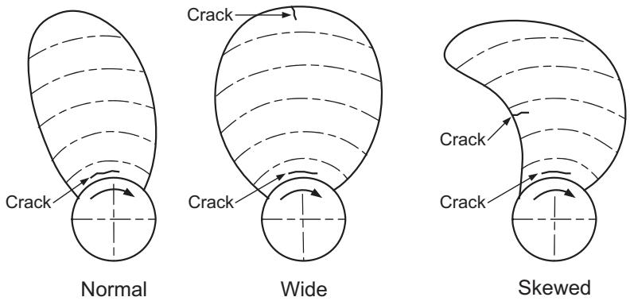  
Figure 12.32. Potential origins of fatigue cracks.

text_image

CFD methods: distribution of loading
Potential location of high stresses
FEA methods: distribution of deflections and stresses

Figure 12.33. Illustration of hydroelastic approach.

This can be rewritten as

$$
M _ {T} (r _ {0}) = \int_ {r _ {0}} ^ {R} r \frac {d T}{d r} \cdot d r - r _ {0} T _ {0} \tag {12.21}
$$

$$
= T _ {0} \bar {r} - T _ {0} r _ {0} = T _ {0} (\bar {r} - r _ {0}), \tag {12.22}
$$

where $T _ { 0 }$ is the thrust of that part of the blade outboard of $r _ { 0 }$ , and $\bar { r }$ is the centre of thrust from centreline. $M _ { T }$ is about an axis perpendicular to shaft centreline and blade generator.

# 12.3.4.2 Bending Moments due to Torque Loading

In Figure 12.35, the bending moment due to torque about an axis parallel to shaft centreline at radius $r _ { 0 }$ is as follows:

$$
M _ {Q} = \int_ {r _ {0}} ^ {R} (r - r _ {0}) \frac {d F _ {Q}}{d r} \cdot d r
$$

text_image

dT dr
dr
r
M_T
r_0

Figure 12.34. Bending moments due to thrust.

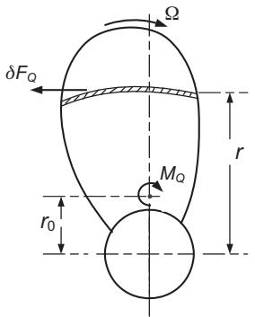

text_image

Ω
δFQ
r
MQ
r0

Figure 12.35. Moments due to torque loading.

but

$$
\frac {d Q}{d r} = r \frac {d F _ {Q}}{d r},
$$

hence

$$
\begin{array}{l} M _ {Q} = \int_ {r _ {0}} ^ {R} \left(1 - \frac {r _ {0}}{r}\right) \frac {d Q}{d r} \cdot d r = Q _ {0} - r _ {0} \int_ {r _ {0}} ^ {R} \frac {1}{r} \cdot \frac {d Q}{d r} d r \\ = Q _ {0} - \frac {r _ {0}}{\bar {r}} Q _ {0} = Q _ {0} \left(1 - \frac {r _ {0}}{\bar {r}}\right), \tag {12.23} \\ \end{array}
$$

where $Q _ { 0 }$ is torque due to blade outboard of $r _ { 0 }$ and ¯r is the centre of torque load from the centreline.

# 12.3.4.3 Forces and Moments due to Blade Rotation

Bending moments due to rotation arise when blades are raked, Figure 12.36. Let the tensile load $L ( r )$ be the load arising due to centripetal acceleration and $A ( r )$ be the local blade cross-sectional area. The change in $L ( r )$ across an element $\delta r$ at radius r is given by the following:

text_image

L + \u03b1L
Z(r)
L
r
M_R Z_0
r_0

Figure 12.36. Moments due to blade rotation.

$$
\delta L = [ \rho A (r) \delta r ] r \Omega^ {2}, \tag {12.24}
$$

where $\rho$ is the metal density, $\left[ \rho A ( r ) \delta r \right]$ is the mass and

$$
d L / d r = \rho \Omega^ {2} r A (r). \tag {12.25}
$$

Since $L ( r ) = 0$ at the blade tip, then at $r = r _ { 0 }$ ,

$$
L (r _ {0}) = \rho \Omega^ {2} \int_ {r _ {0}} ^ {R} r A (r) d r. \tag {12.26}
$$

It is convenient to assume that the area A is proportional to $r ,$ and that $A ( r )$ varies from $A = 0$ at the tip.

If the centre of gravity (CG) of the blade section is raked abaft the generator line by a distance $Z ( r )$ , then the elementary load $\delta L$ from (12.24) contributes to a bending moment about the same axis as the thrust moment $M _ { T }$ given by

$$
M _ {R} (r _ {0}) = \int_ {r _ {0}} ^ {R} [ Z (r) - Z (r _ {0}) ] \frac {d L}{d r} \cdot d r = \rho \Omega^ {2} \int_ {r _ {0}} ^ {R} (Z - Z _ {0}) r A (r) d r \tag {12.27}
$$

or

$$
M _ {R} (r _ {0}) = \rho \Omega^ {2} \int_ {r _ {0}} ^ {R} r Z (r) A (r) d r - \rho \Omega^ {2} Z (r _ {0}) \int_ {r _ {0}} ^ {R} r A (r) d r,
$$

$$
M _ {R} (r _ {0}) = \rho \Omega^ {2} \left\{\int_ {r _ {0}} ^ {R} r Z (r) A (r) d r - Z (r _ {0}) L (r _ {0}) \right\}
$$

and

$$
M _ {R} (r _ {0}) = \rho \Omega^ {2} \left\{\int_ {r _ {0}} ^ {R} r Z (r) A (r) d r - Z (r _ {0}) L (r _ {0}) \right\}. \tag {12.28}
$$

Equation (12.27) a can be written in a more readily useable form and, for a radius ratio $r / R = 0 . 2$ , as follows:

$$
M _ {R _ {0. 2}} = \int_ {0. 2 R} ^ {R} m (r) \cdot r \cdot \Omega^ {2} Z ^ {\prime} (r) \cdot d r, \tag {12.29}
$$

where $Z ^ { \prime } \mathrm { i s } ( Z - Z _ { 0 } )$ and $r _ { 0 }$ is assumed to be 0.2R.

The centrifugal force can be written as

$$
F _ {c} = \int_ {0. 2 R} ^ {R} m (r) \cdot r \cdot \Omega^ {2} \cdot d r, \tag {12.30}
$$

where $m \left( r \right) = \rho A ( r ) = { \mathrm { m a s s } } / { \mathrm { u n i t ~ r a d i u s } }$ s.

# 12.3.4.4 Resolution of Bending Moments

The primary bending moments $M _ { T } , M _ { Q }$ and $M _ { R }$ must be resolved into bending moments about the principal axes of the propeller blade section, Figure 12.37. The direction of these principal axes depends on the precise blade section shape and on the pitch angle of the section datum face at the radius $r _ { 0 }$ . Of the two principal axes shown, A–A and B–B, the section modules $( I / y )$ is least about the axis A–A, leading to the greatest tensile stress in the middle of the blade face at P and the largest compressive stress at Q, Figure 12.38.

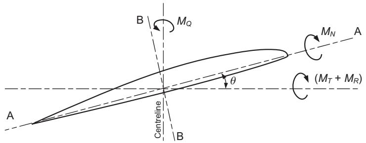

text_image

B
M_Q
A
M_N
θ
(M_T + M_R)
Centreline
A
B

Figure 12.37. Resolution of bending moments.

Applying Equation (12.1), the pitch angle is as follows:

$$
\theta = \tan^ {- 1} \left(\frac {P / D}{\pi x}\right).
$$

The significant bending moment from the blade strength point of view is thus

$$
M _ {N} = (M _ {T} + M _ {R}) \cos \theta + M _ {Q} \sin \theta . \tag {12.31}
$$

This equation is used for computing the blade bending stress.

# 12.3.4.5 Properties of Blade Structural Section

It can be argued that the structural modulus should be obtained for a plane section A–A, Figure 12.39. In practice, cylindrical sections A′–A′ are used in defining the blade geometry and a complex drawing procedure is needed to derive plane sections.

Since pitch angles reduce as radius increases, a plane section assumes an S-shape with the nose drooping and the tail lifting, Figure 12.40.

Compared with the other approximations inherent in the simple beam theory method, the error involved in calculating the section modulus from a cylindrical section rather than a plane section is not significant. Common practice is to use cylindrical sections and to assume that the principal axis is parallel to the pitch datum line.

Typical values of $I / y$ are as follows:

$\mathrm { A e r o f o i l } \qquad I / y = 0 . 0 9 5 c t ^ { 2 } .$ (12.32)

$\mathrm { R o u n d b a c k } \qquad I / y = 0 . 1 1 2 c t ^ { 2 } .$ (12.33)

text_image

Q
P

Figure 12.38. Location of largest stresses.

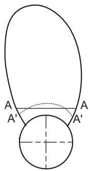

text_image

A
A'
A
A'

Figure 12.39. Section types.

Typical values of the area at the root are as follows:

$$
\mathrm{A} = 0. 7 0 c t \text {   to   } 0. 7 2 c t, \tag {12.34}
$$

where c is the chord and t is the thickness.

An approximation to the root chord ratio at 0.2R, based on the Wageningen series, Figure 16.2 [12.34] is as follows:

$$
\left(\frac {c}{D}\right) _ {0. 2 R} = 0. 4 1 6 \times \mathrm{BAR} \times \frac {4}{Z}, \tag {12.35}
$$

where Z is the number of blades.

Thickness ratio $t / D$ at the centreline for the Wageningen series is shown in Table 12.4, together with approximate estimates of $t / D$ at 0.2R, 0.7R and 0.75R.

Finally, the design stress σ  direct stress  bending stress, as follows:

$$
\sigma = \frac {F c}{A} + \frac {M _ {N}}{I / y}. \tag {12.36}
$$

# 12.3.4.6 Standard Loading Curves

Where blade element-momentum or other theoretical calculations have been performed, curves of $d T / d r$ and $d Q / d x$ based on these calculations may be used; see Chapter 15.

In situations where this information is not available, the following standard loading formulae provide a reasonable representation of a normal optimum load distribution [12.35]. The form of the distribution is shown in Figure 12.41.

$$
\frac {d T}{d x} \quad \text { or } \quad \frac {d Q}{d x} \propto x ^ {2} \sqrt {1 - x}, \tag {12.37}
$$

where $\begin{array} { r } { x = \frac { r } { R } . } \end{array}$

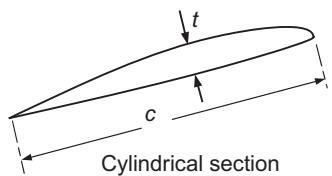

text_image

t
c
Cylindrical section

natural_image

Simple line drawing of a curved shape labeled 'Plane section' (no other text or symbols)

Figure 12.40. Section shapes.

Table 12.4. Blade thickness ratio, Wageningen series [12.34] 

<table><tr><td>Number of blades</td><td> $(t/D)$  to centreline</td><td> $(t/D)_{0.2R}$ </td><td> $(t/D)_{0.7R}$ </td><td> $(t/D)_{0.75R}$ </td></tr><tr><td>2</td><td>0.055</td><td>0.044</td><td>0.0165</td><td>0.0138</td></tr><tr><td>3</td><td>0.050</td><td>0.040</td><td>0.0150</td><td>0.0125</td></tr><tr><td>4</td><td>0.045</td><td>0.036</td><td>0.0135</td><td>0.0113</td></tr><tr><td>5</td><td>0.040</td><td>0.032</td><td>0.0120</td><td>0.0100</td></tr></table>

In evaluating the moments $M _ { T }$ and $M _ { Q }$ using the distribution in Equation (12.37), the following integrals are needed:

$$
\int x \sqrt {1 - x} d x = \frac {2}{1 5} (3 x ^ {2} - x - 2) \sqrt {1 - x}. \tag {12.38}
$$

$$
\int x ^ {2} \sqrt {1 - x} d x = \frac {2}{1 0 5} \left(1 5 x ^ {3} - 3 x ^ {2} - 4 x - 8\right) \sqrt {1 - x}. \tag {12.39}
$$

$$
\int x ^ {3} \sqrt {1 - x} d x = \frac {2}{3 1 5} \left(3 5 x ^ {4} - 5 x ^ {3} - 6 x ^ {2} - 8 x - 1 6\right) \sqrt {1 - x}. \tag {12.40}
$$

It may also be appropriate to assume a linear variation of blade sectional area $A ( r )$ and blade rake $Z ( r )$ .

# 12.3.4.7 Propeller Strength Formulae

The following formulae are useful when using beam theory, and these may be readily inserted into Equations (12.29) and (12.30).

When the distribution of $K _ { T }$ and $K _ { Q }$ is assumed $\propto x ^ { 2 } { \sqrt { 1 - x } }$ , then ¯r can be derived either by numerical integration of a load distribution curve, or from Equations (12.38–12.40). When using Equations (12.38–12.40) it is found that $\bar { r }$ for thrust is 0.67R and ¯r for torque is 0.57R. Carlton [12.16] suggests values of 0.70R for thrust and 0.66R for torque, based on optimum load distributions. Based on these various values and actual load distributions, it is suggested that a value of $\bar { r } = 0 . 6 8 R$ for both thrust and torque will be satisfactory for preliminary stress calculations.

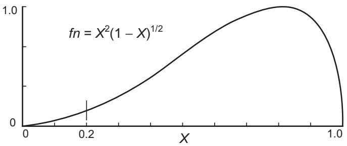

line

| x    | f_n = X²(1 - X)^{1/2} |
| ---- | --------------------- |
| 0.0  | 0.0                   |
| 0.2  | ~0.2                  |
| 0.4  | ~0.6                  |
| 0.6  | ~0.9                  |
| 0.8  | ~1.0                  |
| 1.0  | 0.0                   |

Figure 12.41. Typical spanwise load distribution.

# 12.3.4.8 Mass Distribution: Assumed Linear

Say M  total blade mass. Then, for an assumed boss ratio of 0.2R,

$$
M = m (r) _ {0. 2} \times \frac {0 . 8 R}{2}, \tag {12.41}
$$

where $m ( r ) _ { 0 . 2 } = ( A _ { 0 . 2 R } \times \rho )$ and $A _ { 0 . 2 R }$ can be derived from Equation (12.34). It can then be shown that the mass distribution

$$
m (r) = \frac {M}{0 . 3 2 R} \left(1 - \frac {r}{R}\right) \tag {12.42}
$$

# 12.3.4.9 Rake Distribution: Assumed Linear

When defined from the centreline,

$$
Z ^ {\prime} (r) = \mu \left(\frac {r}{R} - 0. 2\right), \tag {12.43}
$$

where $\mu$ is the tip rake to centreline, Figures 12.8 and 12.36.

# 12.3.4.10 High-Performance Propellers

With blades raked aft for clearance reasons, $M _ { R }$ and $M _ { T }$ are additive. Raking the blades forward reverses the sign of $M _ { R }$ and it is possible to use $M _ { R }$ to offset $M _ { T }$ to reduce the total bending stresses. This property is used on high-performance craft, where the amount of rake can be chosen to minimise the total bending stresses.

# 12.3.4.11 Accuracy of Beam Theory Strength Estimates

The beam theory strength calculation produces nominal stress values, which are an underestimate of the true blade stresses. Shell theory calculations indicate an actual stress, for a given loading, some 25% higher that the beam theory estimate. Calculations for a practical range of radial load distributions indicate that variations in loading can change estimated stress values by about 10%.

The mean stresses under the standard mean full power loading are considerably lower than the maximum blade stresses occurring in practice. For instance, trials using a strain-gauged propeller showed that, during backing and manoeuvring, a frigate propeller is subject to stresses some $3 \%$ times the nominal stress level, whilst the effect of non-uniform inflow into the propeller causes stress levels to vary between $\boldsymbol { \mathrm { 1 } } _ { \mathit { h } }$ and $1 \%$ times the mean stress level. Similar stress variations in one revolution are associated with shaft inclinations to the mean flow and with ship pitch and heave motions.

The above reasons indicate why the chosen nominal design stress levels are such a small fraction of the ultimate strength of the propeller material, Table 12.3. A worked example, illustrating the estimation of propeller blade root stresses, is given in Chapter 17.

# REFERENCES (CHAPTER 12)

12.1 Massey, B.S. and Ward-Smith J. Mechanics of Fluids. 8th Edition. Taylor and Francis, London, 2006.   
12.2 Duncan, W.J., Thom, A.S. and Young, A.D. Mechanics of Fluids. Edward Arnold, Port Melbourne, Australia, 1974.

12.3 Noordzij, L. Some experiments on cavitation inception with propellers in the NSMB-Depressurised towing tank. International Shipbuilding Progress, Vol. 23, No. 265, 1976, pp. 300–306.   
12.4 ITTC. Report of the Specialist Committee on Procedures for Resistance, Propulsion and Propeller Open Water Tests. Recommended procedure for Open Water Test, No. 7.5-02-03-02.1, Rev 01, 2002.   
12.5 Rose, J.C. and Kruppa, F.L. Surface piercing propellers: methodical series model test results, Proceedings of First International Conference on Fast Sea Transportation, FAST’91, Trondheim, 1991.   
12.6 Ferrando, M., Scamardella, A., Bose, N., Liu, P. and Veitch, B. Performance of a family of surface piercing propellers. Transactions of The Royal Institution of Naval Architects, Vol. 144, 2002, pp. 63–75.   
12.7 ITTC 2005 Report of Specialist Comitteee on Azimuthing Podded Propulsors. Proceedings of 24th ITTC, Vol. II. Edinburgh, 2005.   
12.8 ITTC Report of Specialist Comitteee on Azimuthing Podded Propulsors. Proceedings of 25th ITTC, Vol. II. Fukuoka, 2008.   
12.9 ITTC Report of Specialist Committee on Validation of Waterjet Test Procedures. Proceedings of 23rd ITTC, Vol. II, Venice, 2002.   
12.10 ITTC Report of Specialist Committee on Validation of Waterjet Test Procedures. Proceedings of 24th ITTC, Vol. II, Edinburgh, 2005.   
12.11 Van Manen, J.D. Results of systematic tests with vertical axis propellers. International Shipbuilding Progress, Vol. 13, 1966.   
12.12 Van Manen, J.D. Non-conventional propulsion devices. International Shipbuilding Progress, Vol. 20, No. 226, June 1973, pp. 173–193.   
12.13 Volpich, H. and Bridge, I.C. Paddle wheels. Part I, Preliminary model experiments. Transactions, Institute of Engineers and Shipbuilders in Scotland, Vol. 98, 1954–1955, pp. 327–380.   
12.14 Volpich, H. and Bridge, I.C. Paddle wheels. Part II, Systematic model experiments. Transactions, Institute of Engineers and Shipbuilders in Scotland, Vol. 99, 1955–1956, pp. 467–510.   
12.15 Volpich, H. and Bridge, I.C. Paddle wheels. Parts IIa, III, Further model experiments and ship model correlation. Transactions, Institute of Engineers and Shipbuilders in Scotland, Vol. 100, 1956–1957, pp. 505–550.   
12.16 Carlton, J. S. Marine Propellers and Propulsion. 2nd Edition. Butterworth-Heinemann, Oxford, UK, 2007.   
12.17 Gawn, R.W.L and Burrill, L.C. Effect of cavitation on the performance of a series of 16 in. model propellers. Transactions of the Royal Institution of Naval Architects, Vol. 99, 1957, pp. 690–728.   
12.18 Burrill, L.C. and Emerson, A. Propeller cavitation: Further tests on 16in. propeller models in the King’s College cavitation tunnel. Transactions North East Coast Institution of Engineers and Shipbuilders, Vol. 79, 1962–1963, pp. 295–320.   
12.19 Emerson, A. and Sinclair, L. Propeller cavitation. Systematic series of tests on five and six bladed model propellers. Transactions of the Society of Naval Architects and Marine Engineers, Vol. 75, 1967, pp. 224–267.   
12.20 Emerson, A. and Sinclair, L. Propeller design and model experiments. Transactions North East Coast Institution of Engineers and Shipbuilders, Vol. 94, No. 6, 1978, pp. 199–234.   
12.21 Van Manen, J.D. The choice of propeller. Marine Technology, SNAME, Vol. 3, No. 2, April 1966, pp. 158–171.   
12.22 Szantyr, J.A. A new method for the analysis of unsteady propeller cavitation and hull surface pressures. Transactions of the Royal Institution of Naval Architects, Vol. 127, 1985, pp. 153–167.   
12.23 ITTC. Report of Specialist Comitteee on Cavitation. Proceedings of 25th ITTC, Vol. II. Fukuoka, 2008.

12.24 Molland, A.F., Bahaj, A.S., Chaplin, J.R. and Batten, W.M.J. Measurements and predictions of forces, pressures and cavitation on 2-D sections sutable for marine current turbines. Proceedings of Institution of Mechanical Engineers, Vol. 218, Part M, 2004.   
12.25 Drela, M. Xfoil: an analysis and design system for low Reynolds number aerofoils. Conference on Low Reynolds Number Airfoil Aerodynamics, University of Notre Dame, Notre Dame, IN, 1989.   
12.26 English, J.W. Propeller skew as a means of improving cavitation performance. Transactions of the Royal Institution of Naval Architects, Vol. 137, 1995, pp. 53–70.   
12.27 Lloyds Register. Rules and Regulations for the Classification of Ships. Part 5, Chapter 7, Propellers. 2005.   
12.28 Conolly, J.E. Strength of propellers. Transactions of the Royal Institution of Naval Architects, Vol. 103, 1961, pp. 139–160.   
12.29 Atkinson, P. The prediction of marine propeller distortion and stresses using a superparametric thick-shell finite-element method. Transactions of the Royal Institution of Naval Architects, Vol. 115, 1973, pp. 359–375.   
12.30 Atkinson, P. A practical stress analysis procedure for marine propellers using finite elements. 75 Propeller Symposium. SNAME, 1975.   
12.31 Praefke, E. On the strength of highly skewed propellers. Propellers/ Shafting’91 Symposium, SNAME, Virginia Beach, VA, 1991.   
12.32 Atkinson, P and Glover, E. Propeller hydroelastic effects. Propeller’88 Symposium. SNAME, 1988, pp. 21.1–21.10.   
12.33 Atkinson, P. On the choice of method for the calculation of stress in marine propellers. Transactions of the Royal Institution of Naval Architects, Vol. 110, 1968, pp. 447–463.   
12.34 Van Lammeren, W.P.A., Van Manen, J.D. and Oosterveld, M.W.C. The Wageningen B-screw series. Transactions of the Society of Naval Architects and Marine Engineers, Vol. 77, 1969, pp. 269–317.   
12.35 Schoenherr, K.E. Formulation of propeller blade strength. Transactions of the Society of Naval Architects and Marine Engineers, Vol. 71, 1963, pp. 81–119.

# 13 Powering Process

# 13.1 Selection of Marine Propulsion Machinery

The selection of propulsion machinery and plant layout will depend on design features such as space, weight and noise levels, together with overall requirements including areas of operation, running costs and maintenance. All of these factors will depend on the ship type, its function and operational patterns.

# 13.1.1 Selection of Machinery: Main Factors to Consider

1. Compactness and weight: Extra deadweight and space. Height may be important in ships such as ferries and offshore supply vessels which require long clear decks.   
2. Initial cost.   
3. Fuel consumption: Influence on running costs and bunker capacity (deadweight and space).   
4. Grade of fuel (lower grade/higher viscosity, cheaper).   
5. Level of emission of NOx, SOx and CO2.   
6. Noise and vibration levels: Becoming increasingly important.   
7. Maintenance requirements/costs, costs of spares.   
8. Rotational speed: Lower propeller speed plus larger diameter generally leads to increased efficiency.

Figure 13.1 shows a summary of the principal options for propulsion machinery arrangements and the following notes provide some detailed comments on the various propulsion plants.

# 13.1.2 Propulsion Plants Available

# 13.1.2.1 Steam Turbines

1. Relatively heavy installation including boilers. Relatively high fuel consumption but can use the lowest grade fuels.   
2. Limited marine applications, but include nuclear submarines and gas carriers where the boilers may be fuelled by the boil-off from the cargo.

text_image

(a)
Engine
FP prop

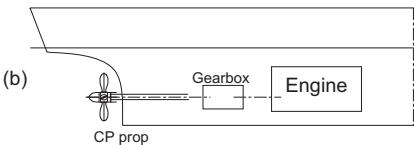

text_image

(b)
CP prop
Gearbox
Engine

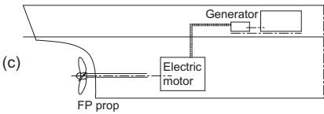

flowchart

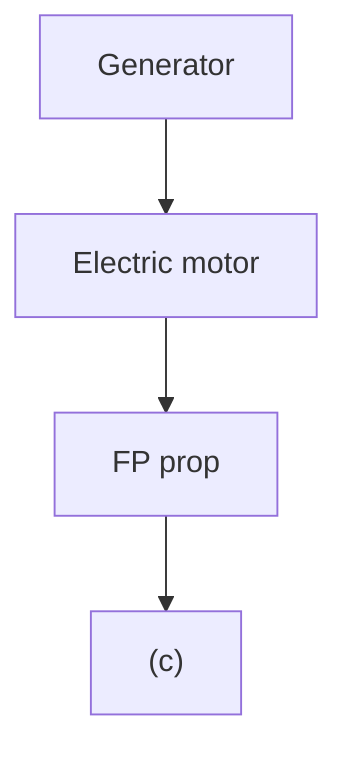
```mermaid
graph TD
    A["Generator"] --> B["Electric motor"]
    B --> C["FP prop"]
    C --> D["(c)"]
```

text_image

(d)
Electric motor
Generator

Hybrids such as CODAG   

flowchart

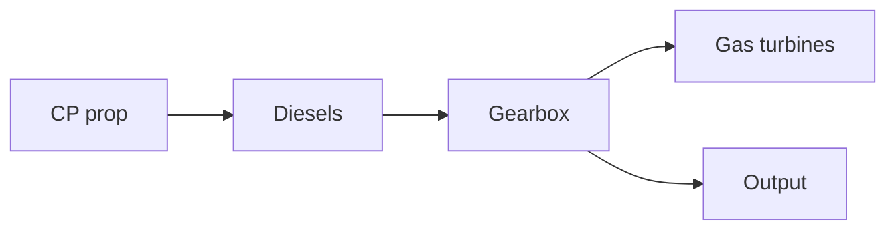
```mermaid
graph LR
    A["CP prop"] --> B["Diesels"]
    B --> C["Gearbox"]
    C --> D["Gas turbines"]
    C --> E["Output"]
```

High-speed vessels / ferries   
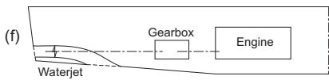

text_image

(f)
Gearbox
Engine
Waterjet

• Direct drive diesel   
• Slow Speed: 90 rpm – 130 rpm engine reverses   
• Most tankers, bulk carriers, cargo and container ships.

• Geared diesels

• Medium speed: 500 rpm – 600 rpm   
• 1-engine / 1-gearbox, 2-engines / 1-gearbox   
• CP prop.: reversing/manoeuvring   
• Possible constant rpm operation / electrical power generation   
• Ferries, passenger ships, some cargo vessels.

• Electric drive

• ‘Remote’ generators, flexible platform / mounts.   
• Generators provide propulsion and hotel load   
• Generators mainly diesel, possibly gas turbine (weight)   
Passenger ships, warships, vessels requiring low speed control / manoeuvring, dynamic positioning   
• Podded electric drive (alternative propulsor / directional etc.)

• Typically used on warships.

• Diesels for low-speed cruising / gas turbines (good power/mass ratio) for high-speed/high-power   
• Need to run at design revs, CP prop., with high-grade fuel for gas turbines.

• Medium- (500 rpm) or high-speed (1000 rpm) diesel or gas turbine (weight / space) [narrow hulls in catamarans]

• Normally waterjets, but possibly surface piercing propellers

Figure 13.1. Propulsion machinery layouts: Principal options.

# 13.1.2.2 Gas Turbines

1. Good power/weight ratio.   
2. Use where lightness, compactness and operating flexibility (e.g. fast start-up) are important.   
3. Need for high-grade fuels (expensive) and prefer to run at design revs; hence, there is generally a need for a controllable pitch propeller (or the use of a waterjet).   
4. Little application to merchant/cargo ships, but applicable to warships and, more recently, to high-speed passenger/car ferries, Figure 13.1(f). Also used to generate electricity for ship services and propulsion.

Further details concerning gas turbines may be found in [13.1 and 13.2].

# 13.1.2.3 Diesel Engines

Diesel engines are by far the most popular form of installation for merchant ships. They have now been developed to burn heavy fuels, and engine efficiency has improved significantly over the past 20 years. Diesel engines can be divided into slow speed (90–130 rpm), medium speed (400–600 rpm) and high speed (1000–1800 rpm).

The following summarises the merits of the various diesels. More detailed accounts may be found in [13.1–13.4].

# SLOW-SPEED DIESELS. Advantages/disadvantages

1. Fewer cylinders/low maintenance.   
2. Use of lower quality fuels possible.   
3. Possibility of direct drive: no gearbox, simple, reliable.   
4. No gearbox losses (2%–5%).   
5. Low engine revs implies low noise levels.   
6. In general, heavier than medium-speed diesels, and propeller reversal for direct drive requires engine reversal.

# MEDIUM-SPEED DIESELS. Advantages/disadvantages

1. Smaller, lighter, less height.   
2. Choice of optimum propeller revs using a gearbox.   
3. In the main, cheaper than slow-speed direct drive (even including gearbox) because of larger production for extensive land use applications.   
4. Engines installed in ship in one piece, with less chance of faults or incursion of dirt.   
5. Possibility of driving generator from power-take-off (PTO) shafts from gearbox.   
6. Possibility of multi-engined plants: reliability, maintenance of one engine when under way, use of less than full number of engines when slow steaming.   
7. Spares lighter: can be sent by air freight.   
8. Better able to cope with slow-speed running.

HIGH-SPEED DIESELS. These are generally lighter than medium-speed engines, otherwise their merits are similar to the medium-speed engine.

In general, the differences between slow- and medium-speed diesels are decreasing with the choice tending to depend on application. Slow-speed/directdrive plants are very popular for cargo ships, container ships, bulk carriers and tankers, etc., Figure 13.1(a). Geared medium-speed diesels are used for ferries, tugs, trawlers, support vessels and some passenger ships, Figure 13.1(b). High-speed engines find applications in the propulsion of fast naval craft and fast ferries. It should be noted that the use of combinations such as gas/diesel, Figure 13.1(e), and gas/gas, may be used on warships and large fast passenger/car ferries for increased flexibility and economy of operation.

# 13.1.2.4 Diesel (or Turbo) Electric

Diesel or gas turbine generated electricity with electric propulsor(s), Figures 13.1(c) and (d).

The merits of electric propulsion include the following:

1. Flexibility of layout, for example, the generating station can be separate from the propulsion motor(s).   
2. Load diversity between ship service load and propulsion (hence, popularity for passenger ships and recent warships).   
3. Economical part load running; a fixed-pitch propeller is feasible, as an electric propulsion motor can provide high torque at low revolutions.   
4. Ease of control.   
5. Low noise and vibration characteristics, e.g. diesel generators can be flexibly mounted/rafted, and   
6. Electric podded drives are also now becoming popular, Figure 13.1(d).

Regarding electric drives, it is generally accepted that there will be some overall increase in propulsion machinery mass and some decrease in transmission efficiency between engine and propeller, that is, diesel to electricity to propeller; instead, of diesel directly to propeller.

However, the above attributes have led to the increasing use of electric drive on many passenger cruise ships, warships and other vessels such as cable and survey ships where control and dynamic positioning is important.

# 13.1.3 Propulsion Layouts

The principal options for propulsion machinery arrangements are summarised in Figure 13.1. It is clear that there are several alternative arrangements, but the various options are generally applied to a particular ship or group of ships types. Further detailed propulsion machinery layouts are given by Gallin et al. [13.5].

# 13.2 Propeller–Engine Matching

# 13.2.1 Introduction

It is important to match the propeller revolutions, torque and developed power to the safe operating limits of the installed propulsion engine. Typical power, torque and revolutions limits for a diesel engine are shown in Figure 13.2, within ABCDE.

It should be noted that the propeller pitch determines at what revolutions the propeller, and hence engine, will run. Consequently, the propeller design (pitch and revs) must be such that it is suitably matched to the installed engine.

Figure 13.3 is indicative of a typical engine-propeller matching chart. Typically it is assumed that the operator will not run the engine to higher than 90% of its continuous service rating (CSR), Figure 13.3. The marine diesel engine characteristics are usually based on the ‘propeller law’ which assumes $P \propto N ^ { 3 }$ , which is acceptable for most displacement ships. The $N ^ { 3 }$ basic design power curve passes through the point A. When designing the propeller for say clean hull and calm water, it is usual to keep the actual propeller curve to the right of the engine $( N ^ { 3 } )$ line, such as on line [1], to allow for the effects of future fouling and bad weather. In the case of line [1] the pitch is said to be light and if the design pitch is decreased further, the line will move to line [1a], etc.

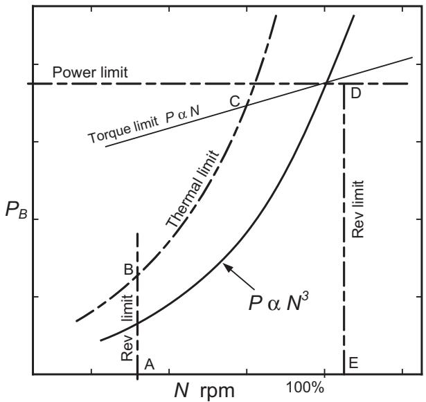

line

| Point | N rpm | PB     |
|-------|-------|--------|
| A     | ~0    | Rev limit |
| B     | ~50   | Rev limit |
| C     | ~75   | Thermal limit |
| D     | 100%  | Power limit |
| E     | 100%  | Rev limit |
| PαN³  | ~50   | PαN³   |

Figure 13.2. Typical diesel engine limits (within ABCDE).

As the ship fouls, or encounters heavy weather, the design curve [1] will move to the left, first to the $N ^ { 3 }$ line and then say to line [2]. It must be noted that, in the case of line [2], the maximum available power at B is now not available due to the torque limit, and the maximum operating point is at C, with a consequent decrease in power and, hence, ship speed.

Note also the upper rpm limit on the (design) line [1], say point D at 105% maximum rpm. At this point the full available power will not be absorbed in the ‘clean hull-calm water’ trials, and the full ‘design’ speed will not be achieved. In a similar manner, if the ship has a light load, such as in ballast, the design curve [1] will move to the right (e.g. towards line [1a]) and, again, the full power will not be available due to the rpm limit and speed will be curtailed. These features must be allowed for when drawing up contractual ship design speeds (load and ballast) and trial speeds.

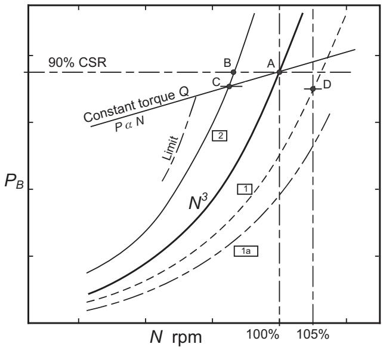

line

| Point | N rpm | P_B |
|-------|-------|-----|
| A     | ~100% | ~100 |
| B     | ~80%  | ~90 |
| C     | ~70%  | ~85 |
| D     | ~105% | ~90 |
| Limit | N^3   | 2   |
| 1a    | ~60%  | ~40 |
| 2     | ~70%  | ~50 |
| 90% CSR| N rpm | PB = 90% CSR

Figure 13.3. Matching of propeller to diesel engine.

The basic assumption is made that $P \propto N ^ { 3 } \cdot P \propto N ^ { 3 }$ is defined by the engine manufacturers as the ‘Propeller Law’ and they design their engines for best efficiency (e.g. fuel consumption) about this line. It does not necessarily mean that the propeller actually operates on this line, as discussed earlier.

Now $P = 2 \pi n Q$ and, for constant torque (e.g. maximum torque), $P \propto n$ Figure 13.2. If it is assumed that $P ( = 2 \pi n Q ) \propto n ^ { 3 }$ , then $Q \propto n ^ { 2 }$ , which implies that $K _ { Q }$ is constant $( K _ { Q } = Q / \rho n ^ { 2 } D ^ { 5 } ) , \cdot$ J is constant $( J = V / n D )$ ; hence, if J is constant, $K _ { T }$ is constant $( K _ { T } = T / \pi n ^ { 2 } D ^ { 4 } )$ . If $K _ { T }$ is constant, then $T \propto n ^ { 2 } ,$ , but if J is constant, $n ^ { 2 } \propto V ^ { 2 }$ and $T \propto V ^ { 2 }$ (or $R \propto V ^ { 2 }$ for constant thrust deduction, t). $R \propto V ^ { 2 }$ is a reasonable assumption in the normal speed range for displacement craft, and, hence, $P \propto N ^ { 3 }$ is a reasonable assumption. It should be noted, however, that the speed index does change with different craft (e.g. high-speed craft) or if a displacement craft is overdriven, in which case $P \propto N ^ { x }$ , where x will not necessarily be 3, although it will generally lie between 2.5 and 3.5.

# 13.2.2 Controllable Pitch Propeller (CP Propeller)

Using a controllable pitch propeller is equivalent to fitting an infinitely variable gearbox between the engine and the propeller, resulting in a range of curves for different pitch ratios, Figure 13.4.

Whilst the fixed-pitch propeller imposes a fixed relationship between revolutions and torque, say the 100% pitch line in Figure 13.4, the CP propeller gives independence between these two variables. For example, the different load requirements in Figure 13.3, curves [1], [1a] and [2], could be met with the use of a controllable pitch propeller. Typical vessels that exploit the merits of the CP propeller include tugs and trawlers where line [1] might represent the free-running condition, whilst line [2] would represent a tug towing or a trawler trawling. A decrease in propeller pitch (with a CP propeller) will move line [2] on to the $N ^ { 3 }$ line, whilst an increase in pitch can be used to move line [1] to the $N ^ { 3 }$ line.

line

| N rpm | Pitch 110% | Pitch 90% | Pitch 80% |
|-------|------------|-----------|-----------|
| Low   | Low        | Low       | Low       |
| High  | High       | High      | High      |

Figure 13.4. Controllable pitch propeller characteristics.

It should be noted that a particular pitch will be chosen as the ‘design’ pitch for a CP propeller, on which will be based the design calculations and blade pitch distribution, etc. When the pitch is moved away from the ‘design’ condition, the blades are in fact working a little off-design, but generally without significant differences in comparison with if the blades had been redesigned at each pitch ratio.

A further possible mode of operation is to run the CP propeller at constant revolutions. For example, a power take-off at constant revolutions can be used to drive a generator. This can, however, lead to inefficient operation of the engine, in particular, at reduced power, since the engine will have been designed to operate efficiently (minimum specific fuel consumption $s f c )$ around the $N ^ { 3 }$ line.

Further applications of the CP propeller include ferries, offshore supply vessels and warships when good manoeuvrability or station keeping is required and when a quick response to a ‘crash astern’ order is required and the risk of such an order is high.

# 13.2.3 The Multi-Engined Plant

A multi-engine plant, Figure 13.1(b), with two medium-speed engines geared to a single propeller, offers gains in operational safety and flexibility. Some limitations in operation do, however, have to be noted. Figure 13.5 shows the case of the propeller designed to absorb 100% power with two engines at 100% rpm. The maximum constant torque is assumed to extend from 90% to 100% rpm with P ∝ N, and from 0% to 90% rpm with $Q \propto N$ and $P \propto N ^ { 2 }$ .

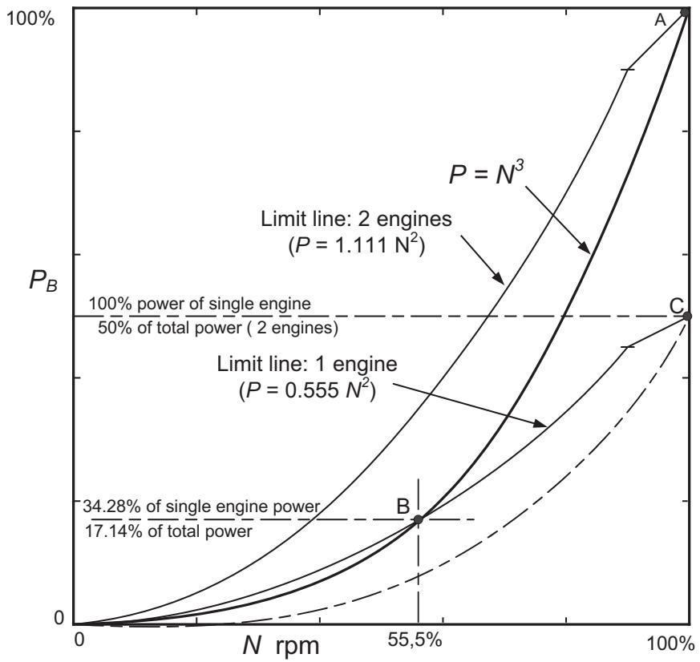

line

| N rpm | P_B (Limit line: 2 engines, P = 1.111 N²) | P_B (Limit line: 1 engine, P = 0.555 N²) | P_B (Total Power: 2 engines, P = N³) | P_B (Total Power: 1 engine, P = 0.555 N²) | P_B (Total Power: 34.28% of single engine power) | P_B (Total Power: 17.14% of total power) |
|-------|------------------------------------------|------------------------------------------|--------------------------------------|------------------------------------------|--------------------------------------------------|-----------------------------------------------|
| 0     | 0                                        | 0                                        | 0                                    | 0                                        | 0                                                | 0                                             |
| 55.5% | ~34.28%                                  | ~34.28%                                  | ~100%                                | ~55.5%                                   | ~100%                                            | ~50%                                          |
| 100%  | 100%                                     | 100%                                     | 100%                                 | ~100%                                    | ~100%                                            | ~100%                                         |

Figure 13.5. Twin-engine power curves.

If one engine is disconnected, the limit line for the remaining engine cuts the propeller curve at 55.5% of full rpm, at point B, and develops only 34.28% of its full power (or 17.14% of the original combined output). If the propeller had been designed to absorb say 85% of the combined power, then the remaining engine would operate at 65.4% rpm and 47.7% power (23.7% of total). These are still very low figures and represent less than half of the available power.

If a considerable time is to be spent running on one engine then a CP propeller becomes attractive, allowing the single engine to run up to its full power and rpm at position C in Figure 13.5. An alternative would be to use a two-speed gearbox, which would also allow the single engine to run up to its full power and rpm.

The foregoing discussion is also applicable to the off-loading of a propulsion engine when some form of auxiliary propulsive power is present, such as using wind power including sails (motor sailing), wing sails, kites and wind turbines (Molland and Hawksley [13.6]).

# 13.3 Propeller Off-Design Performance

# 13.3.1 Background

It is frequently required to evaluate propeller performance at conditions other than those for which the propeller has been designed. In this case the propeller characteristics (such as diameter and pitch ratio) are already fixed and the variables are V, N, T and Q. Some examples are as follows:

<table><tr><td>Design</td><td>Performance</td></tr><tr><td>Tug towing</td><td>Tug free-running</td></tr><tr><td>Trawler free-running</td><td>Trawler trawling</td></tr><tr><td>Tanker/bulk carrier loaded</td><td>Tanker/bulk carrier in ballast</td></tr><tr><td>Service speed-load condition</td><td>Trials (or service) at light displacementOverload due to weather (at same speed)Off-loaded propeller due to auxiliary power such as wind (sails, kites, rotors)Estimation of ship acceleration or stopping performance</td></tr></table>

It is necessary to distinguish between the torque (or power) absorbed by the propeller at a given condition and the maximum torque (or power) that can be delivered by the propelling machinery, which depends on the type of machinery installed. Clearly, Q absorbed ≤ Q delivered (max), and the maximum running propeller revolutions will be such that the two are equal. At speeds less than maximum, the engine throttles must be closed such that Q delivered = Q absorbed (< Qmax). For example, the off-design propeller torque for a range of speeds can be estimated and then matched to the available (max) engine torque.

In the absence of a manufacturer’s performance curves for the engine it is commonly assumed that diesel engines have constant maximum Q independent of n, i.e.

$P { = } 2 \pi n Q$ , and $P \propto n$ (Figure 13.2), whilst steam turbines have constant maximum P independent of n, i.e. $Q \propto 1 / n$ . Gas turbines are considerably less flexible than steam plant or diesel engines and should be run at or close to the design rpm, thus indicating the need for a CP propeller in this case or the use of fluid or electric power transmissions.

# 13.3.2 Off-Design Cases: Examples

These should be considered in association with the propeller design example calculations in Chapter 16.

# 13.3.2.1 Case 1: Speed Less Than Design Speed

Assume that D and $P / D$ are fixed by some design condition. The ship is travelling at less than design speed and it is required to find the new delivered power and propeller revolutions.

Va and $P _ { E }$ are known for the new speed; hence, also T from an estimate of t, i.e.

$$
P _ {E} = R \cdot V _ {s}, T = R / (1 - t) = P _ {E} / V s / (1 - t).
$$

$V a = V s ( 1 - w _ { T } )$ and data for wake fraction $w _ { T }$ and thrust deduction factor t are given in Chapter 8.

Hence, at new speed, assume a range of revolutions

$$
J = V a / n D = f (1 / n).
$$

$$
\begin{array}{c c c c} \text {Assumed} & & \text {Estimated} \\ n \to J \to K _ {T} \to T ^ {\prime} (= K _ {T} \rho   n ^ {2} D ^ {4}) \\ - & - & - & - \\ - & - & - & - \text {hence,} n \text {when} T ^ {\prime} = T \\ - & - & - & - \end{array}
$$

for given n, J is calculated and $K _ { T }$ is read from the $K _ { T } - K _ { Q }$ chart at given (fixed) $P / D \left( T ^ { \prime } \right.$ is the thrust provided by the propeller, T is the thrust required by the hull). Knowing n for the required $T \left( = T ^ { \prime } \right)$ , recalculate $J ,$ hence, $K _ { Q }$ from the chart for given (fixed) $P / D$ . Hence,

$$
P _ {D} = 2 \pi n Q / \eta_ {R} = 2 \pi n [ K _ {Q} \rho n ^ {2} D ^ {5} ] / \eta_ {R} \quad \mathrm{and} \quad N = n \times 6 0.
$$

# 13.3.2.2 Case 2: Increase in Resistance at Same Speed

Assume that D and $P / D$ are fixed by some design condition. Find the power and rpm for say 20% increase in resistance (hence, T for const t) at the same speed.

Repeat Case 1 since T and Va are known. Note that in the case of overload such as this (e.g. increase in resistance at constant speed) torque will rise and care must be taken that maximum engine torque (e.g. in case of diesels and shafting) is not exceeded, i.e. $P _ { D } = 2 \pi n Q$ and torque Q for new condition $= P _ { D } / 2 \pi n$ .

If the maximum torque is exceeded, the throttle is closed and the ship speed decreases. A more rigorous approach, taking account of torque limits, is described in Case 3.

line

| Va   | T (solid) | T' (dashed) |
|------|-----------|-------------|
| 0    | Low       | Low         |
| 100  | High      | Medium      |

Figure 13.6. Thrust matching, noting that $T ^ { \prime }$ is the thrust provided by the propeller and T is the thrust required by the hull.

# 13.3.2.3 Case 3: Increase in Resistance at Same Speed with Torque Limit

Assume that $D$ and $P / D$ are fixed by some design condition. Find the power, rpm and speed for say $5 0 \%$ increase in resistance, hence, T. The maximum torque Qm of the diesel engine must not be exceeded. It is assumed that the thrust curve (hence, $T + 5 0 \% )$ is known over a range of speeds.

First, assume a range of speeds, say $V a _ { 1 } , V a _ { 2 } , V a _ { 3 }$

For $V a _ { 1 }$

$$
\begin{array}{c c c c c c} \text {Assume} & & \text {Estimated} \\ n \to J & \to K _ {Q} \to Q (= K _ {Q} \rho n ^ {2} D ^ {5}) & K _ {T} \to T ^ {\prime} (= K _ {T} \rho n ^ {2} D ^ {4}) \\ - & - & - & - & - & - \\ - & - & - & - & - & - \\ - & - & - & - & - & - \end{array}
$$

for given $n , J$ is calculated and $K _ { Q }$ read from the chart at given (fixed) $P / D$ . rpm n increased until $Q = Q m ;$ hence, rpm and $T ^ { \prime }$ for maximum torque $( Q m )$ .

Repeat for $V a _ { 2 } , V a _ { 3 }$ ; hence, speed is derived at which $T ^ { \prime }$ matches T from the cross plot, Figure 13.6.

# 13.3.2.4 Case 4: Diesel Tug Maximum Thrust When Towing

Assume that propeller/engine is restricted to a maximum torque $Q m$ .

Repeat Case 3, but only for the one towing speed; hence, maximum total thrust $T$ at that speed.

Towing thrust (pull) available = [total T × (1 − t)] − tug hull resistance

where [total $T \times ( 1 - t ) ]$ is the effective thrust $T _ { E }$ . Values of thrust deduction factor t for the low and zero speed (bollard) conditions are included in Chapter 8.

As discussed in Section 13.2, in order for a diesel tug (or trawler) to develop full power when towing (or trawling) as well as when free-running, a CP propeller or a two-speed gearbox would be required in order to increase the engine rpms/decrease torque and develop full power.

# 13.3.2.5 Summary

Example applications of these various off-design cases are included in Chapter 17.

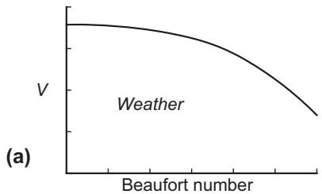

line

| Beaufort number | V     |
| --------------- | ----- |
| 0               | 1.0   |
| 1               | 0.9   |
| 2               | 0.8   |
| 3               | 0.7   |
| 4               | 0.6   |
| 5               | 0.5   |
| 6               | 0.4   |
| 7               | 0.3   |
| 8               | 0.2   |
| 9               | 0.1   |
| 10              | 0.0   |

line

| Time out of dock | V     |
| ---------------- | ----- |
| 0                | 1.0   |
| 1                | 0.95  |
| 2                | 0.85  |
| 3                | 0.7   |
| 4                | 0.5   |
| 5                | 0.3   |
| 6                | 0.1   |

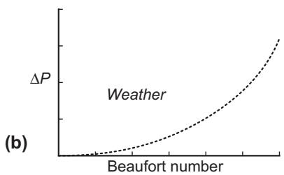

line

| Beaufort number | ΔP     |
| --------------- | ------ |
| 0               | 0      |
| 1               | ~0.5   |
| 2               | ~1.0   |
| 3               | ~1.5   |
| 4               | ~2.0   |
| 5               | ~2.5   |
| 6               | ~3.0   |
| 7               | ~3.5   |
| 8               | ~4.0   |
| 9               | ~4.5   |
| 10              | ~5.0   |

line

| Time out of dock | ΔP     |
| ---------------- | ------ |
| 0                | 0      |
| 1                | 0.5    |
| 2                | 1      |
| 3                | 1.5    |
| 4                | 2      |
| 5                | 2.5    |
| 6                | 3      |
| 7                | 3.5    |
| 8                | 4      |
| 9                | 4.5    |
| 10               | 5      |

Figure 13.7. Presentation of data derived from voyage analysis.

# 13.4 Voyage Analysis and In-service Monitoring

# 13.4.1 Background

Voyage analysis entails the logging and analysis of technical data such as speed, power, propeller revolutions, displacement and weather conditions during the course of normal ship operation. The analysis is aimed at assessing the influence on propulsive power of hull roughness, fouling and wind and waves. Examples of the results of voyage analysis investigations are described in Section 3.2.3 for fouling and in Section 3.2.4 for weather.

A continuous comprehensive analysis of voyage data of ships in operation can indicate the operating efficiency and opportunities for improvement of existing ships, and lead to possible improvements which should be incorporated in future new designs.

The analysis should be designed to include quantitative assessment of the power and fuel consumption variations with speed, fouling and weather. The results of the analysis should indicate the following:

(i) The effect of weather on speed, power and fuel consumption   
(ii) The effect of fouling on power, speed, fuel consumption and propeller efficiency, relative say to a time out of dock

The effects of (i) and (ii) may be presented as a speed loss for constant power, Figure 13.7(a), or the power augment required to maintain a constant speed, Figure 13.7(b), that is the cost of maintaining a scheduled speed in all weathers and hull conditions and the amount of reserve power to be installed in future tonnage, see Section 3.2.5.

A knowledge of speed loss due to weather for different ships is also necessary if weather routeing is to be employed, since routeing around a rough weather area can be economic for a ship with a high speed loss per unit wave height, or Beaufort number, and uneconomic for one with a small speed loss.

The effect of fouling will help to assess such items as the best hull finish and protection and the most economically favourable frequency of hull and propeller cleaning and docking.

The basic objectives and methodologies for voyage data analysis are described in [13.7, 13.8 and 13.9]; the basic requirements of such analyses have changed little over the years. Much pioneering work on the applications of such techniques was carried out by Aertssen [13.10, 13.11 and 13.12]. Further useful developments of the techniques are described in [13.13, 13.14]. Carlton [13.15] makes a wide-ranging review of voyage data analysis and in-service monitoring.

# 13.4.2 Data Required and Methods of Obtaining Data

Speed: shipborne log; noon to noon ground speed readings, sextant or GPS.

Power: measured by torsionmeter attached to shaft and $P { = } 2 \pi n Q$ , average per watch per day, or measure indicated power using BMEP, [13.1].

Revolutions: average per watch per day.

Fuel: average consumption per watch per day.

Weather: defined by wind speed (or force) and direction, and wave height and direction. Wind force and direction can be measured by instruments mounted high on the ship, or estimated by ship deck personnel as for the deck log. Wave height and direction are ideally measured by wave-recording buoys or shipborne wave recorder. It is generally impractical to measure wave properties during a normal voyage, and it is usual to assume that waves are a function of wind force and direction. Readings are normally taken each watch and averaged for day.

Fouling: time out of dock (days or weeks) recorded as an indirect measure of the deterioration of the ship’s hull and propeller.

Displacement/trim: daily displacement to be recorded, normally estimated from departure displacement minus consumed fuel, stores, etc.

Normally, only whole days will be used in the analysis. Days of fog or machinery trouble will be excluded. Days during which large variations in speed, power or revolutions occur will be discarded. Draughts should be limited to a certain range, for example, between full load and 0.8 full load. Alternatively, data can be corrected to some mean draught. Data can be recorded by personnel on standard forms. Automatic data logging is likely to be employed for power, fuel, revolutions and speed. Erroneous data still have to be discarded when using this method. The data may be transmitted ashore continuously for analysis by shore-based staff, Carlton [13.15].

# 13.4.3 Methods of Analysis

# 13.4.3.1 Speed as a Base Parameter

Speed: corrected for temperature, for example, using a Reynolds number $C _ { F }$ type correction, as described for tank tests in Section 3.1.4.

Revolutions: corrected to some mean, using trial power/rpm relationship.

Power: corrected to some mean power (say mean for voyage) using trial power– speed curve, or assuming power to vary as $V ^ { 3 }$ .

Displacement: corrected using $\Delta ^ { 2 / 3 }$ ratios, or tank data if available, to correct to a mean displacement.

The corrections to $P _ { 1 } , N _ { 1 }$ and $\Delta _ { 1 }$ to some standard $\Delta _ { 2 }$ and new $P _ { 2 }$ and $N _ { 2 }$ may be approximated as

$$
P _ {2} = \left[ \frac {\Delta_ {2}}{\Delta_ {1}} \right] ^ {2 / 3} P _ {1} \tag {13.1}
$$

and

$$
N _ {2} = N _ {1} \left[ \frac {P _ {2}}{P _ {1}} \right] ^ {1 / 3} = N _ {1} \left[ \frac {\Delta_ {2}}{\Delta_ {1}} \right] ^ {2 / 9}. \tag {13.2}
$$

Effect of weather: resulting speeds can be plotted to a base of Beaufort number for ahead or cross winds.

Effect of fouling: fine weather results (Beaufort number <2.5 say) used, and plotted on a time base.

The method is ‘graphical’ and depends on fair curves being drawn through plotted data.

# 13.4.3.2 Admiralty Coefficient $\pmb { A } _ { C }$

The Admiralty coefficient is defined as follows:

$$
A _ {C} = \frac {\Delta^ {2 / 3} V ^ {3}}{P}. \tag {13.3}
$$

The Admiralty coefficient can be plotted to a base of time (fine weather results for fouling effects), or Beaufort number (for weather effects). Mean voyage values give a mean power increase due to fouling or weather, Figure 13.8.

  
Figure 13.8. Influence of fouling and weather on Admiralty coefficient.

line

| Beaufort wind force | Head wind | Beam wind | Wind astern |
| ------------------- | --------- | --------- | ----------- |
| 0                   | 0         | 0         | 0           |
| 1                   | ~1        | ~0.5      | ~0.2        |
| 2                   | ~3        | ~1.5      | ~0.8        |
| 3                   | ~6        | ~3        | ~1.5        |
| 4                   | ~10       | ~5        | ~2.5        |
| 5                   | ~15       | ~7        | ~3.5        |
| 6                   | ~20       | ~9        | ~4.5        |
| 7                   | ~25       | ~11       | ~5.5        |
| 8                   | ~30       | ~13       | ~6.5        |
| 9                   | ~35       | ~15       | ~7.5        |
| 10                  | ~40       | ~17       | ~8.5        |

Figure 13.9. Weather factor for different headings [13.8].

If measurements of power are not available, then a fuel coefficient $( F _ { C } )$ may be used, as follows:

$$
F _ {C} = \frac {\Delta^ {2 / 3} V ^ {3}}{F}, \tag {13.4}
$$

where F is the fuel consumption (tonnes) per 24 hours. This criterion has often been used by shipping companies as an overall measure of the effects of changes in engine efficiency, fouling and weather.

It should be noted that the uses of Admiralty or fuel coefficients are best confined to the derivation of trends and approximate margins. The statistical methods described in the next section place more control on the manipulation of the data and the outcomes.

# 13.4.3.3 Statistical Methods

If hull roughness and fouling are assumed to be a function of time out of dock, and the weather to be described as a weather factor W, then the analyses of the data might entail multiple regression analyses of the following type:

$$
\frac {\Delta P}{P} = a T _ {D} + b W + c, \tag {13.5}
$$

where $\textstyle { \frac { \Delta P } { P } }$ is the increase in power, $T _ { D }$ is the time out of dock and W is a weather factor, based say on four quadrants with a separate weighting for each quadrant, Figure 13.9. Power will be corrected to some mean displacement, a standard speed and mean revolutions, as described in the previous sections.

Calm water data can be used to determine the effects of roughness and fouling on power, based on time out of dock, and early clean smooth hull data can be used to determine the effects of weather on power, based on a weather factor, as shown in Figure 13.10.

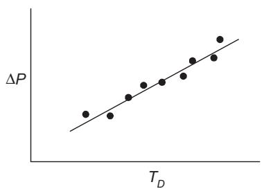

scatter

| T_D | ΔP  |
|-----|-----|
| 1   | 0.5 |
| 2   | 0.6 |
| 3   | 0.7 |
| 4   | 0.8 |
| 5   | 0.9 |
| 6   | 1.0 |
| 7   | 1.1 |
| 8   | 1.2 |
| 9   | 1.3 |
| 10  | 1.4 |

scatter

| W | ΔP |
| --- | --- |
| 1 | 0.5 |
| 2 | 0.6 |
| 3 | 0.7 |
| 4 | 0.8 |
| 5 | 0.9 |
| 6 | 1.0 |

Figure 13.10. Influence on power of time out of dock (TD) and weather (W).

An alternative approach is to use the following:

$$
\frac {P}{N ^ {3}} = a T _ {D} + b W + c. \tag {13.6}
$$

$P / N ^ { 3 }$ may not vary linearly with $T _ { D }$ , in which case an equation of the form of Equation (13.7) might be suitable, as follows:

$$
\frac {P}{N ^ {3}} = a T _ {D} ^ {2} + b T _ {D} + c W + d. \tag {13.7}
$$

A further analysis of the data can include the effects of apparent slip as follows:

$$
\frac {P}{N ^ {3}} = a _ {1} S _ {a} + b _ {1}, \tag {13.8}
$$

where $S _ { a }$ is the apparent slip defined as

$$
S _ {a} = \frac {P _ {P} N - V _ {S}}{P _ {P} N} = 1 - \frac {V _ {S}}{P _ {P} N}, \tag {13.9}
$$

and $P _ { P }$ is the propeller pitch (m), N the revolutions/sec (rps) and $V _ { S }$ is the ship speed (m/s). It should be noted that this is the apparent slip, based on ship speed $V _ { S }$ , and not the ‘true’ slip which is different and is based on the wake speed, Va.

Use of Equations (13.8) and (13.9) yields the increase in power due to fouling [13.8]. Manipulation of the formulae will also yield the loss of speed due to weather. Burrill [13.9] describes how the wake fraction may be derived from changes in $P / N ^ { 3 }$ , Figure 13.11.

# 13.4.4 Limitations in Methods of Logging and Data Available

Speed: measurement of speed through the water using shipborne logs can be inaccurate because of effects such as the influence of the boundary layer or ship motions. Average speed over the ground can be measured using Global Positioning System (GPS), but this does not take account of ocean currents.

Power: torsionmeters require relatively frequent calibration. Many ships are not fitted with a torsionmeter, in which case indirect methods may be adopted such as the use of Brake Mean Effective Pressure (BMEP) [13.1] or of fuel consumption as the objective criterion.

Weather: ideally this should entail a measure of the mean wave height and direction and wind speed and direction. Wave recording buoys or a shipborne wave recorder are not normally feasible for continuous assessment during a normal ship voyage. It is therefore possible, and often assumed, that a single weather scale can be obtained for a relative wind speed and direction, and a sea scale assumed proportional to this. This is not an unreasonable assumption since the sea disturbances are generated by the wind.

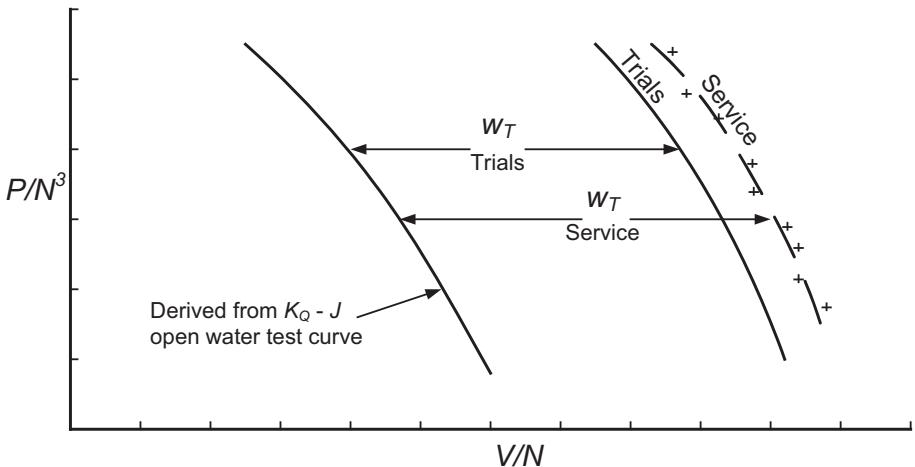

line

| V/N | P/N³ (Derived from K_Q - J open water test curve) |
|-----|--------------------------------------------------|
| Low | High                                             |
| Mid  | Medium                                           |
| High | Low                                              |

Figure 13.11. Derivation of service wake fraction.

Varying draught (displacement) and trim: data have to be corrected to some mean draught by alternative methods. Alternatively, data might be limited to within certain draught limitations.

Data quality: when considering the various methods of obtaining the data for voyage analysis purposes, it is inevitable that the analysed data will show a high degree of scatter.

# 13.4.5 Developments in Voyage Analysis

Carlton [13.15] reviews, in some detail, the work of Townsin et al. [13.16], Whipps [13.17] and Bazari [13.18]. Townsin et al. establish a methodology for analysing the effects of roughness on the hull and propeller, Whipps develops coefficients of performance for the engine and navigation areas and Bazari applies energy-auditing principles to ship operation and design. Carlton goes on to discuss on-line data acquisition systems, continuous monitoring, integrated ship management and shipto-shore data transmission.

# 13.4.6 Further Data Monitoring and Logging

Extensive engine and component condition monitoring now takes place on most ships. This may be considered as a separate process to that described for obtaining voyage data, although properties such as rpm and BMEP are complementary and will be recorded in any standard monitoring process.

A number of large ships such as bulk carriers monitor stresses in potentially high-stress areas in the hull structure. Some ships monitor motions, accelerations and slamming pressures, although such measurements are normally confined to seakeeping trials and research purposes.

# REFERENCES (CHAPTER 13)

13.1 Woodyard, D.F. Pounder’s Marine Diesel Engines and Gas Turbines. 8th Edition. Butterworth-Heinemann, Oxford, UK, 2004.   
13.2 Molland, A.F. (ed.) The Maritime Engineering Reference Book. Butterworth-Heinemann, Oxford, UK, 2008.   
13.3 Taylor, D.A. Introduction to Marine Engineering. Revised 2nd Edition. Butterworth-Heinemann, Oxford, UK, 1996.   
13.4 Harrington, R.L. (ed.) Marine Engineering. Society of Naval Architects and Marine Engineers, New York, 1971.   
13.5 Gallin, C., Hiersig, H. and Heiderich, O. Ships and Their Propulsion Systems – Developments in Power Transmission. Lohmann and Stolterfaht Gmbh, Hannover, 1983.   
13.6 Molland, A.F. and Hawksley, G.J. An investigation of propeller performance and machinery applications in wind assisted ships. Journal of Wind Engineering and Industrial Aerodynamics, Vol. 20, 1985, pp. 143–168.   
13.7 Bonebakker, J.W. The application of statistical methods to the analysis of service performance data. Transactions of the North East Coast Institution of Engineers and Shipbuilders, Vol. 67, 1951, pp. 277–296.   
13.8 Clements, R.E. A method of analysing voyage data. Transactions of the North East Coast Institution of Engineers and Shipbuilders, Vol. 73, 1957, pp. 197–230.   
13.9 Burrill, L.C. Propellers in action behind a ship. Transactions of the North East Coast Institution of Engineers and Shipbuilders, Vol. 76, 1960, pp. 25–44.   
13.10 Aertssen, G. servive-performance and seakeeping trials on MV Lukuga. Transactions of the Royal Institution of Naval Architects, Vol. 105, 1963, pp. 293–335.   
13.11 Aertssen, G. Service-performance and seakeeping trials on MV Jordaens. Transactions of the Royal Institution of Naval Architects, Vol. 108, 1966, pp. 305–343.   
13.12 Aertssen, G. and Van Sluys, M.F. Service-performance and seakeeping trials on a large containership. Transactions of the Royal Institution of Naval Architects, Vol. 114, 1972, pp. 429–447.   
13.13 Berlekom, Van W.B., Trag¨ ardh, P. and Dellhag, A. Large tankers – Wind ˚ coefficients and speed loss due to wind and sea. Transactions of the Royal Institution of Naval Architects, Vol. 117, 1975, pp. 41–58.   
13.14 Townsin, R.L., Moss, B., Wynne, J.B. and Whyte, I.M. Monitoring the speed performance of ships. Transactions of the North East Coast Institution of Engineers and Shipbuilders, Vol. 91, 1975, pp. 159–178.   
13.15 Carlton, J.S. Marine Propellers and Propulsion. 2nd Edition. Butterworth-Heinemann, Oxford, UK, 2007.   
13.16 Townsin, R.L., Spencer, D.S., Mosaad, M. and Patience, G. Rough propeller penalties. Transactions of the Society of Naval Architects and Marine Engineers, Vol. 93, 1985, pp. 165–187.   
13.17 Whipps, S.L. On-line ship performance monitoring system: operational experience and design requirements. Transactions IMarEST, Vol. 98, Paper 8, 1985.   
13.18 Bazari, Z. Ship energy performance benchmarking/rating: Methodology and application. Transactions of the World Maritime Technology Conference International Co-operation on Marine Engineering Systems, (ICMES 2006), London, 2006.

# 14 Hull Form Design

# 14.1 General

# 14.1.1 Introduction

The hydrodynamic behaviour of the hull over the total speed range may be separated into three broad categories as displacement, semi-displacement and planing. The approximate speed range of each of these categories is shown in Figure 14.1. Considering the hydrodynamic behaviour of each, the displacement craft is supported entirely by buoyant forces, the semi-displacement craft is supported by a mixture of buoyant and dynamic lift forces whilst, when planing, the hull is supported entirely by dynamic lift. The basic development of the hull form will be different for each of these categories.

This chapter concentrates on a discussion of displacement craft, with some comments on semi-displacement craft. Further comments and discussion of semidisplacement and planing craft are given in Chapters 3 and 10.

# 14.1.2 Background

The underwater hull form is designed such that it displaces a prescribed volume of water ∇, and its principal dimensions are chosen such that

$$
\nabla = L \times B \times T \times C _ {B}, \tag {14.1}
$$

where ∇ is the volume of displacement $( \mathbf { m } ^ { 3 } )$ , L, B and T are the ship length, breadth and draught (m) and $C _ { B }$ is the block coefficient.

In theory, with no limits on the dimensions, there are an infinite number of combinations of L, B, T and $C _ { B }$ that would satisfy Equation (14.1). In practice, there are many objectives and constraints which limit the range of choice of the dimensions. These include physical limits on length due to harbours, docks and docking, on breadth due to harbour and canal restrictions and on draught due to operational water depth. Combinations of the dimensions are constrained by operational requirements and efficiency. These include combinations to achieve low calm water resistance and powering, hence fuel consumption, combinations to behave well in a seaway and the ability to maintain speed with no slamming, breadth to achieve adequate stability together with the cost of construction which will influence operational costs. In practice, different combinations of L, B, T and $C _ { B }$ will generally evolve to meet best the requirements of alternative ship types. It should be noted that the ‘optimum’ choice of dimensions will relate to one, say design, speed and it is unlikely that the hull form will be the optimum at all speeds.

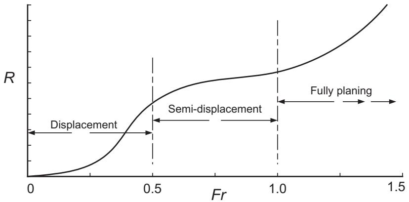

line

| Fr   | R     |
|------|-------|
| 0.0  | 0.0   |
| 0.5  | Semi-displacement |
| 1.0  | Fully planing |
| 1.5  | > Fully planing |

Figure 14.1. Approximate speed ranges for displacement, semi-displacement and planing craft.

The next section discusses the choice of suitable hull form parameters subject to these various, and sometimes conflicting, constraints and requirements.

# 14.1.3 Choice of Main Hull Parameters

This section discusses the main hull parameters that influence performance and the typical requirements that should be taken into account when considering the choice of these parameters.

# 14.1.3.1 Length-Displacement Ratio, $L / \nabla ^ { 1 / 3 }$

The length-displacement ratio (or slenderness ratio) usually has an important influence on hull resistance for most ship types. With increasing $L / \nabla ^ { 1 / 3 }$ for constant displacement, the residuary resistance $R _ { R }$ decreases; the effect is more important as speed increases. With constant displacement ∇ and draught T, wetted surface area and frictional resistance $R _ { F }$ tend to increase with increase in length (being greater than the decrease in $C _ { F }$ due to increase in $R e )$ with net increase in $R _ { F } ,$ the opposite effect from the residuary resistance. Hence, there is the possibility of an optimum L where total resistance $R _ { T }$ is minimum, Figure 14.2. This may be termed the optimum ‘hydrodynamic’ length. Results of standard series tests, such as the BSRA series [14.1] indicate the presence of an optimum $L / \nabla ^ { 1 / 3 }$ . The influence of $L / \nabla ^ { 1 / 3 }$ is also illustrated by the Taylor series [14.2], using the summarised Taylor–Gertler data in Tables A3.8–A3.11, Appendix A3. The range of $L / \nabla ^ { 1 / 3 }$ is typically 5.5–7.0 for cargo vessels, 5.5–6.5 for tankers and bulk carriers, 7.0–8.0 for passenger ships and 6.0–9.0 for semi-displacement craft.

# 14.1.3.2 Length/Breadth Ratio, L/B

With increase in $L / \nabla ^ { 1 / 3 }$ , and other parameters held constant, $L / B$ increases. With the effect of an increase in L leading to a decrease in $R _ { R }$ , large $L / B$ is favourable for faster ships. For most commercial ships, length is the most expensive dimension as far as construction costs are concerned. Hence, whilst an increase in $L / B$ will lead to a decrease in specific resistance, power and fuel costs, there will be an increase in capital costs of construction. The sum of the capital and fuel costs leads to what may be termed the optimum ‘economic’ length, Figure 14.3, which is likely to be different from (usually smaller than) the ‘hydrodynamic’ optimum. It should also be noted that a longer ship will normally provide a better seakeeping performance.

line

| L    | R_T = R_F + R_R | R_F   | R_R   |
|------|-----------------|-------|-------|
| Low  | High            | High  | High  |
| Mid  | Medium          | Medium| Medium|
| High | Low             | Low   | Low   |

Figure 14.2. ‘Hydrodynamic’ optimum length.

The range of $L / B$ is typically 6.0–7.0 for cargo vessels, 5.5–6.5 for tankers and bulk carriers, 6.0–8.0 for passenger ships and 5.0–7.0 for semi-displacement craft.

# 14.1.3.3 Breadth/Draught Ratio, B/T

Wave resistance increases with increase in $B / T$ as displacement is brought nearer to the surface. Results of standard series tests, for example, the British Ship Research Associatin (BSRA) series [14.1], indicate such an increase in resistance with increase in $B / T .$ This might, however, conflict with a need to improve transverse stability, which would require an increase in B and $B / T .$ The influence of $B / T$ is also clearly illustrated by the Taylor series [14.2], using the summarised Taylor–Gertler data in Tables A3.8–A3.11, Appendix A3. A typical average $B / T$ for a cargo vessel is about 2.5, with values for stability-sensitive vessels such as ferries and passenger ships rising to as much as 5.0.

# 14.1.3.4 Longitudinal Centre of Buoyancy, LCB

LCB is normally expressed as a percentage of length from amidships. The afterbody of a symmetrical hull (symmetrical fore and aft with $L C B = 0 \% L )$ produces less wavemaking resistance than the forebody, due to boundary layer suppression of the afterbody waves. By moving LCB aft, the wavemaking of the forebody decreases more than the increase in the afterbody, although the pressure resistance of the afterbody will increase. The pressure resistance of fine forms (low $C _ { P } )$ is low; hence, LCB can be moved aft to advantage. The ultimate limitation will be due to pressure drag and propulsion implications. Conversely, the optimum LCB (or optimum range of LCB) will move forward for fuller ships. The typical position of LCB for a range of $C _ { B }$ is shown in Figure 14.4 which is based on data from various sources, including mean values from the early work of Bocler [14.3] and data from Watson [14.4]. It is seen in Figure 14.4 that, for single-screw vessels, the LCB varies typically from about 2%L aft of amidships for faster finer vessels to about 2%L to 2.5%L forward for slower full form vessels. Bocler’s twin-screw values are about 1% aft of the single-screw values. This is broadly due to the fact that the twin-screw vessel is not as constrained as a single-screw vessel regarding the need to achieve a good flow into the propeller. It should also be noted that these optimum LCB values are generally associated with a particular speed range, normally one that relates $C _ { B }$ to $F r _ { ; }$ , such as Equation (14.2). For example, the data of Bocler [14.3] and others would indicate that the LCB of overdriven coasters should be about 0.5%L further forward than that for single-screw cargo vessels.

line

| L/B | Fuel + capital | Capital costs | Fuel costs |
| --- | -------------- | ------------- | ---------- |
| Low | High           | Medium        | Low        |
| High | Low            | Low           | Low        |

Figure 14.3. ‘Economic’ optimum length.

line

| CB    | LCB (Watson: Normal bow) | LCB (Watson: Bulbous bow) |
|-------|--------------------------|----------------------------|
| 0.55  | ~1.5%                    | ~1.5%                      |
| 0.65  | ~2.5%                    | ~2.5%                      |
| 0.75  | ~4.0%                    | ~4.0%                      |
| 0.85  | ~3.0%                    | ~3.0%                      |

Figure 14.4. Optimum position of LCB.

It should be noted that, in general, the optimum position, or optimum range, of LCB will change for different hull parameters and, for example, with the addition of a bulbous bow. For example, the Watson data would indicate that the LCB for a vessel with a bulbous bow is about 0.5%L forward of the LCB for a vessel with a normal bow, Figure 14.4. However, whilst the LCB data and lines in Figure 14.4 show suggested mean values for minimum resistance, there is some freedom in the position of $L C B \mathrm { \ ( s a y \pm 0 . 5 \% L ) }$ without having a significant impact on the resistance. For this reason, a suitable approach at the design stage is to use an average value for LCB from the data in Figure 14.4.

line

| CB     | R/Δ (Fr1) | R/Δ (Fr2) | R/Δ (Fr3) |
|--------|-----------|-----------|-----------|
| C_B1   | Low       | Low       | Low       |
| C_B2   | Medium    | Medium    | Medium    |
| C_B3   | High      | High      | High      |

Figure 14.5. Hydrodynamic boundary, or economic, speed.

The hydrodynamic characteristics discussed may be modified by the practical requirements of a particular location of LCG, and its relation to LCB, or required limits on trim. Such practical design requirements are discussed by Watson [14.4].

# 14.1.3.5 Block Coefficient, $C _ { B }$

$C _ { B }$ defines the overall fullness of the design, as described by Equation (14.1) and will have been derived in the basic design process. This is likely to have entailed the use of empirical formulae such as Equation (14.2), variations of which can be found in [14.5] and [14.6].

$$
C _ {B} = 1. 2 3 - 2. 4 1 \times F r. \tag {14.2}
$$

This is sometimes termed the hydrodynamic boundary, or economic, speed and can be found from standard series data, such as for the BSRA series in Figure 10.3. For each speed, the hydrodynamic boundary $C _ { B }$ is taken to be where the resistance curve starts to increase rapidly, Figure 14.5. A relationship, such as Equation (14.2), can then be established.

The hydrodynamic performance of the hull form is described better by the midship and prismatic coefficients, $C _ { M }$ and $C _ { P }$ .

# 14.1.3.6 Midship Coefficient, $c _ { M }$

$C _ { M } = C _ { B } / C _ { P }$ , and $C _ { B }$ should remain constant to preserve the design displacement, Equation (14.1). A fuller $C _ { M }$ will lead to a smaller $C _ { P } .$ . This may also give rise to a decrease in resistance, but this is limited since the transition between amidships and the ends of the ship has to be gradual.

# 14.1.3.7 Prismatic Coefficient, $C _ { P }$

An increase in $C _ { P }$ leads to a decrease in $C _ { M }$ , whilst retaining the same $C _ { B }$ and $\nabla .$ . The displacement is shifted from amidships towards the ends. The bow and stern waves change, and interference effects change the wavemaking, as discussed in Section 3.1.5. In general, fine ends are favourable at low speeds, whilst at higher speeds fuller ends may be favourable, Figure 14.6. Thus, the $C _ { P }$ will increase at higher speeds, such as the trend shown in Figure 14.7, based on data for the Taylor series, [14.2]. For the lower speed range, Fr up to about 0.28, $C _ { P }$ is generally limited by the hydrodynamic boundary speed. The overall variation in $C _ { P }$ with Fr is shown in Figure 14.7.

line

| x/L | Cp (Solid Line) | Cp (Dashed Line) |
|-----|-----------------|------------------|
| 0   | 0               | 0                |
| 0.5 | ~0.8            | ~0.9             |
| 1   | 0               | 0                |

Figure 14.6. Typical sectional area curves.

# 14.1.3.8 Sectional Area Curve

The influence of the sectional area curve (SAC) depends on the size and distribution of $C _ { P }$ , discussed earlier, and with similar influences on performance.

The fore end of the SAC may be adjusted whereby some wave cancellation may be achieved. The objectives are to place the maximum curvature under the first bow wave crest and the maximum SAC slope under the bow wave trough, λ/2 from the fore end, where λ is the length of the wave and $\lambda / L = 2 \pi F r ^ { 2 }$ . The concept is shown in Figure 14.8. The suitable location of the SAC maximum slope, based on wave length theory and experiment, is shown in Figure 14.9. It is noted that the theoretical values are aft of the best location derived from experiments.

# 14.1.4 Choice of Hull Shape

It is useful to consider the hull shape in terms of horizontal waterlines and vertical sections, Figure 14.10.

The midship shape, and area, will result from the choice of $C _ { M }$ and $C _ { P }$ for hydrodynamic reasons and for practical hold shapes, Figure 14.11. A small bilge radius and large ${ \cal C } _ { M } ~ ( \approx 0 . 9 8 )$ tends to be used for large tankers and bulk carriers, maximising tank space and leading to a ‘box $\mathrm { { \ t y p e ^ { \circ } } }$ vessel, which is also easier to construct. There may be a practical incentive to increase $C _ { M }$ for a container ship as far as is hydrodynamically reasonable, in order to provide the best hold shape for containers. A small rise of floor (ROF) may be employed, which aids drainage and pumping in double-bottom tanks and may offer some improvement in directional stability.

line

| Fr   | Cp    |
|------|-------|
| 0.20 | 0.75  |
| 0.30 | 0.52  |
| 0.40 | 0.63  |
| 0.50 | 0.66  |
| 0.60 | 0.67  |

Figure 14.7. Variation in design $C _ { P }$ with speed.

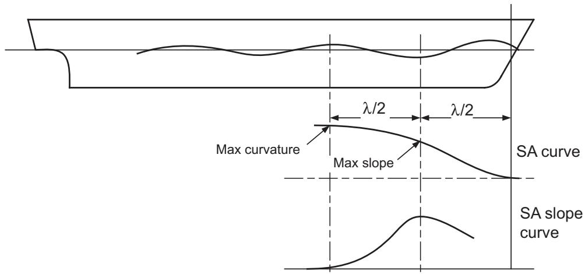

text_image

Max curvature
λ/2
λ/2
Max slope
SA curve
SA slope curve

Figure 14.8. Suitable location of maximum slope of SAC.

line

| Fr   | Experiment | Theory |
|------|------------|--------|
| 0.20 | 8.9        | 8.7    |
| 0.25 | 8.0        | 8.0    |
| 0.30 | 7.5        | 7.1    |

Figure 14.9. Variation of SAC maximum slope with speed.   

text_image

Profile
Waterlines
Sections

Figure 14.10. Horizontal waterlines and transverse vertical sections.

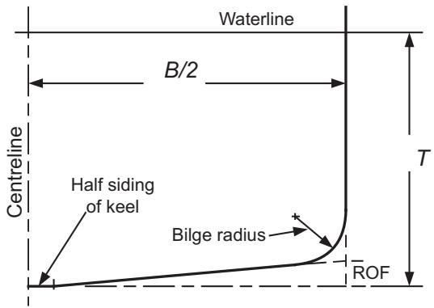

text_image

Waterline
B/2
Centreline
Half siding
of keel
Bilge radius
+
-
ROF
T

Figure 14.11. Midship section.

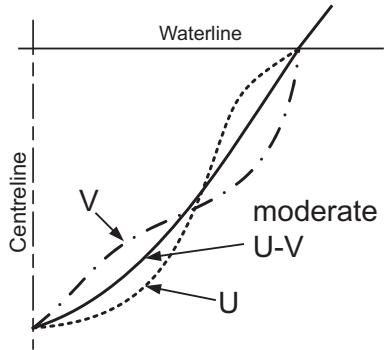

text_image

Waterline
Centreline
moderate
U-V
U
V

Figure 14.12. Alternative section shapes, with same underwater sectional area and same waterline breadth.

As one moves away from amidships, it should be appreciated that, fundamentally, there is an infinite number of alternative section shapes that would provide the correct underwater sectional area, hence correct underwater volume. Examples of three such alternatives are shown in Figure 14.12. The two extremes are often termed ‘U’-type sections and ‘V’-type sections.

In Figure 14.12, the waterline breadth has been held constant. If the design process is demanding extra initial stability then, from a hull design point of view, the simplest way is to provide more breadth B and, possibly, to decrease draught T, i.e.

$$
G M = K B + B M - K G
$$

and

$$
B M = J _ {X X} / \nabla = f [ L \cdot B ^ {3} / L \cdot B \cdot T \cdot C _ {B} ] = f [ B ^ {2} / T \cdot C _ {B} ],
$$

noting that, for constant $C _ { B }$ , the change in metacentric height GM is a function of $[ B ^ { 2 } / T ]$ .

The approach, therefore, is to increase the waterline breadth but maintain the same underwater transverse sectional area, hence displacement, Figure 14.13. This procedure, as a consequence, tends to reshape the sections from a $\mathbf { \nabla } ^ { 6 } \mathbf { U } ^ { 5 }$ form to a more $\mathbf { \Delta } ^ { 6 } \mathbf { V } ^ { \flat }$ form. Such a procedure has been applied to passenger ships and the aft end of twin-screw car ferries, where an increase in breadth for car lanes may be required and/or higher stability may be sought.

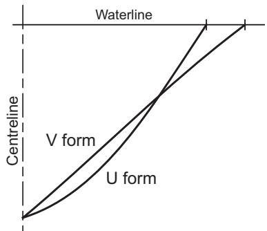

text_image

Waterline
Centreline
V form
U form

Figure 14.13. Alternative section shapes, with same underwater sectional area but change in waterline breadth.

natural_image

Abstract geometric line drawing with intersecting planes and a central spiral (no text or symbols)

Figure 14.14. Hull form of Pioneer ship.

A number of straight framed ships (rather than using curved frames) have been proposed and investigated over the years. This has generally been carried out in order to achieve a more production-friendly design and/or to provide a hold shape that is more suitable for box-type cargoes such as pallets and containers. Such investigations go back to the period of the First World War, [14.7].

Blohm and Voss Shipbuilders developed the straight framed Pioneer ship in the 1960s, with a view to significantly reducing ship production costs. The hull form is built up from straight lines, with a number of knuckles, and the hull structure is comprised of a number of flat panels, Figure 14.14. Compared with preliminary estimates, the extra time taken for fairing the flat panels and the forming/joining of knuckle joints in the transverse frames, tended to negate some of the production cost savings.

Johnson [14.8] investigated the hydrodynamic consequences of adopting straight framed hull shapes. Model resistance and propulsion tests were carried out on the four hull shapes shown in Figure 14.15, which follow an increasing degree of simplification. The block coefficient was held constant at $C _ { B } = 0 . 7 1$ . The basic concept was to form the knuckle lines to follow the streamlines that had been mapped on the conventionally shaped parent model, A71. In addition, many of the resulting plate shapes could be achieved by two-dimensional rolling.

Resistance and propulsion tests were carried out on the four models. At the approximate design speed, relative to parent model A71, model B71 gave a reduction in resistance of 2.9%, whilst models C71 and D71 gave increases in resistance of 5.3% and 50.3%. The results for C71 indicate the penalty for adopting a flat bottom aft, and for model D71 the penalty for adopting very simplified sections. Relative to the parent model, A71, propulsive power, including propeller efficiency was –4.7% for B71, −1.5% for C71 and +39.8% for D71.

Wake patterns were also measured for models B71, C71 and D71 to help understand the changes in propulsive efficiency.

Tests were also carried out on a vessel with a block coefficient of 0.82. The first model was a conventionally shaped parent and, the second, a very simplified model with straight frames for fabrication purposes. The resistance results for the straight framed model were 19% worse than the parent, but there was relatively little change in the propulsive efficiency.

Overall, the results of these tests showed that it is possible to construct ship forms with straight sections and yet still get improvements in resistance and self propulsion in still water. This was found to hold, however, on the condition that the knuckle lines follow the stream flow.

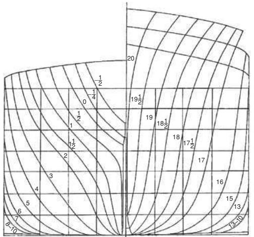

contour

| Contour Line | Value Label |
| ------------ | ----------- |
| 1/2          | 1/2         |
| 1/4          | 1/4         |
| 19/2         | 19/2        |
| 18/2         | 18/2        |
| 17/2         | 17/2        |
| 16           | 16          |
| 15           | 15          |
| 13           | 13          |
| 12           | 12          |
| 11           | 11          |
| 10           | 10          |
| 9            | 9           |
| 8            | 8           |
| 7            | 7           |
| 6            | 6           |
| 5            | 5           |
| 4            | 4           |
| 3            | 3           |
| 2            | 2           |
| 1            | 1           |
| 0            | 0           |

Body plan A 71

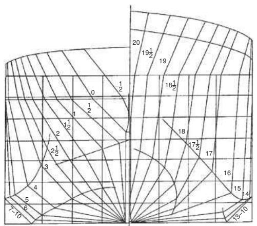

radar

| Axis Label | Value |
|---|---|
| 0 | 1/2 |
| 1 | 1/2 |
| 2 | 1/2 |
| 3 | 2/2 |
| 4 | 4 |
| 5 | 6 |
| 6 | -10 |
| 7 | -10 |
| 8 | -10 |
| 9 | -10 |
| 10 | -10 |
| 11 | -10 |
| 12 | -10 |
| 13 | -10 |
| 14 | -10 |
| 15 | -10 |
| 16 | -10 |
| 17 | -10 |
| 18 | -10 |
| 19 | -10 |
| 20 | -10 |
| 21 | -10 |
| 22 | -10 |
| 23 | -10 |
| 24 | -10 |
| 25 | -10 |
| 26 | -10 |
| 27 | -10 |
| 28 | -10 |
| 29 | -10 |
| 30 | -10 |
| 31 | -10 |
| 32 | -10 |
| 33 | -10 |
| 34 | -10 |
| 35 | -10 |
| 36 | -10 |
| 37 | -10 |
| 38 | -10 |
| 39 | -10 |
| 40 | -10 |
| 41 | -10 |
| 42 | -10 |
| 43 | -10 |
| 44 | -10 |
| 45 | -10 |
| 46 | -10 |
| 47 | -10 |
| 48 | -10 |
| 49 | -10 |
| 50 | -10 |
| 51 | -10 |
| 52 | -10 |
| 53 | -10 |
| 54 | -10 |
| 55 | -10 |
| 56 | -10 |
| 57 | -10 |
| 58 | -10 |
| 59 | -10 |
| 60 | -10 |
| 61 | -10 |
| 62 | -10 |
| 63 | -10 |
| 64 | -10 |
| 65 | -10 |
| 66 | -10 |
| 67 | -10 |
| 68 | -10 |
| 69 | -10 |
| 70 | -10 |
| 71 | -10 |
| 72 | -10 |
| 73 | -10 |
| 74 | -10 |
| 75 | -10 |
| 76 | -10 |
| 77 | -10 |
| 78 | -10 |
| 79 | -10 |
| 80 | -10 |
| 81 | -10 |
| 82 | -10 |
| 83 | -10 |
| 84 | -10 |
| 85 | -10 |
| 86 | -10 |
| 87 | -10 |
| 88 | -10 |
| 89 | -10 |
| 90 | -10 |
| 91 | -10 |
| 92 | -10 |
| 93 | -10 |
| 94 | -10 |
| 95 | -10 |
| 96 | -10 |
| 97 | -10 |
| 98 | -10 |
| 99 | -10 |
| 100 | -10 |

Body plan B 71

radar

| Value | Label |
| :--- | :--- |
| 19 | 1/2 |
| 18 | 1/2 |
| 17 | 1/2 |
| 16 | |
| 15 | |
| 14 | |
| 13 | -0.6 |
| 12 | |
| 11 | |
| 10 | -0.7 |
| 9 | |
| 8 | -0.8 |
| 7 | |
| 6 | |
| 5 | |
| 4 | |
| 3 | |
| 2 | |
| 1 | |
| 0 | |

Body plan C 71

radar

| Region | Value |
|---|---|
| Top Left | 19½ |
| Top Right | 19 |
| Bottom Left | 1½ |
| Bottom Right | 18½ |
| Bottom Center | 1½ |
| Bottom Right | 18 |
| Bottom Center | 7½ |
| Bottom Right | 17 |
| Bottom Center | 16 |
| Bottom Right | 15 |
| Bottom Center | 14 |
| Bottom Left | 2½ |
| Bottom Right | 3 |
| Bottom Center | 4 |
| Bottom Right | 5 |
| Bottom Center | 6 |
| Bottom Left | 6 |
| Bottom Right | 7 |
| Bottom Center | 10 |
The chart displays a grid-like structure with diagonal lines and numerical labels indicating relative magnitudes. The top-left region contains the highest value (19½), while the bottom-right region contains the lowest (10). The grid is partitioned into four quadrants with each region labeled by its corresponding numeric value.

Body plan D 71   
Figure 14.15. Straight framed hull shapes tested by Johnson [14.8].

Silverleaf and Dawson [14.9] provide a good overview of the fundamentals of hydrodynamic hull design. A wide discussion of hull form design is offered in Schneekluth and Bertram [14.6].

# 14.2 Fore End

# 14.2.1 Basic Requirements of Fore End Design

There are two requirements of fore end design:

(i) Determine the influence on hull resistance in various conditions of loading   
(ii) Take note of the influence on seakeeping and manoeuvring performance.

The shape of the sections at the fore end can be considered in association with the half angle of entrance of the design waterline, $1 / 2 \alpha _ { E } ,$ , Figure 14.16. With a constant sectional area curve, $1 / 2 \alpha _ { E }$ governs the form of the forebody sections, that is low $1 / 2 \alpha _ { E }$ leads to a $\mathbf { \hat { \Delta } } ^ { \mathrm { { s } } } \mathbf { U } ^ { \mathrm { { , } } }$ form and high $1 / 2 \alpha _ { E }$ leads to a $\mathbf { \Delta } ^ { 6 } \mathbf { V } ^ { \lessgtr }$ form. $\mathbf { \Delta } ^ { \left\{ \mathbf { V } \right\} }$ forms tend to move displacement nearer the surface and to produce more wavemaking. At the same time, vessels such as container ships, looking for extra breadth forward to accommodate more containers on deck, might be forced towards $\mathbf { \Delta } ^ { 6 } \mathbf { V } ^ { \lessgtr }$ sections. The effect of $1 / 2 \alpha _ { E }$ depends on speed. With a large $1 / 2 \alpha _ { E }$ there is high resistance at low speeds whilst at high speed a contrary effect may exist, such as in the case of overpowered or ‘overdriven’ coasters. With a relatively low $C _ { P }$ and high speeds, a small $1 / 2 \alpha _ { E }$ is preferable, yielding $\mathbf { \nabla } ^ { 6 } \mathrm { U } ^ { , }$ sections and lower wavemaking. This may be tempered by the fact that $\mathbf { \nabla } ^ { 6 } \mathbf { U } ^ { 5 }$ forms tend to be more susceptible to slamming. The effect of forebody shape on ship motions and wetness is discussed in [14.10], [14.11] and [14.12]. Moderate $\mathrm { \Omega U J }$ forms may provide a suitable compromise. Typical values of $1 / 2 \alpha _ { E }$ for displacement vessels are shown in Table 14.1.

text_image

Waterline
1/2 αE
Centreline

Figure 14.16. Definition of half-angle of entrance $1 / 2 \alpha _ { E } .$ .

# 14.2.2 Bulbous Bows

Bulbous bows can be employed to reduce the hull resistance of ships. Their role in the case of finer faster vessels tends to entail the reduction of wavemaking resistance whilst, in the case of slower fuller ships, the role tends to entail the reduction of viscous resistance. The resistance reduction due to a bulb for a full form slow ship can exceed the wave resistance alone. For full form slower ships the bulbous bow tends to show most benefit in the ballast condition. It should also be noted that a bulb tends to realign the flow around the fore end, but this is carried downstream and the bulb is also found to influence the values of wake fraction, thrust deduction factor and hull efficiency [14.13].

The application of a bulbous bow entails the following two steps:

(i) Decide whether a bulb is likely to be beneficial, which will depend on parameters such as ship type, speed and block coefficient   
(ii) Determine the actual required characteristics and design of the bulb.

Table 14.1. Typical values of half-angle of entrance: displacement ships 

<table><tr><td> $C_B$ </td><td> $1/2\alpha_E$ (deg)</td></tr><tr><td>0.55</td><td>8</td></tr><tr><td>0.60</td><td>10</td></tr><tr><td>0.70</td><td>20</td></tr><tr><td>0.80</td><td>35</td></tr></table>

The benefits of using a bulb are likely to depend on the existing basic components of resistance, namely the proportions of wave and viscous resistance. The longitudinal position of the bulb causes a wave phase difference whilst its volume is related to wave amplitude. At low speeds, where wavemaking is small, the increase in skin friction resistance arising from the increase in wetted area due to the bulb is likely to cancel any reductions in resistance. At higher speeds, a bulb can improve the flow around the hull and reduce the friction drag, as deduced by Steele and Pearce [14.14] from tests on models with normal and bulbous bows.

Also, bulb cancellation effects are likely to be speed dependent because the wave length (and position of the wave) changes with speed, whereas the position of the bulb (pressure source) is fixed. The early work of Froude around 1890 and that of Taylor around 1907 should be acknowledged; both recognised the possible benefits of bulbous bows. The earliest theoretical work on the effectiveness of bulbous bows was carried out by Wigley [14.15]. Ferguson and Dand [14.16] provide a fundamental study of hull and bulbous bow interaction.

Sources providing guidance on the suitability of fitting a bulbous bow include the work of BSRA [14.1], the classical work of Kracht [14.13] and the regression work of Holtrop [14.17]. The BSRA results are included in Figure 10.6 in Chapter 10. The data are for the loaded condition and are likely to be suitable for many merchant ships such as cargo and container ships, tankers and bulk carriers and the like. It is interesting to note from Figure 10.6 that the largest reductions occur at lower $C _ { B }$ and higher speeds, with reductions up to 20% being realised. For higher $C _ { B }$ and lower speeds, the reductions are generally much smaller. However, for slower full form ships, significant benefits can be achieved in the ballast condition and, for this reason, most full form vessels such as tankers and bulk carriers, which travel for significant periods in the ballast condition, are normally fitted with a bulbous bow. Reductions in resistance in the ballast condition of up to 15% have been reported for such vessels [14.18].

The regression analysis of Holtrop [14.17] includes an estimate of the influence of a bulbous bow. This is included as Equation (10.30) in Chapter 10. Holtrop, in his discussion to [14.13] indicates that, for a test case, his approach produces broadly similar results to those in [14.13].

Moor [14.19] presents useful experimental data from tests on a series of bulbous (ram) bows with a progressive increase in size. Guidance is given on choice of bow, which depends on load and/or ballast conditions and speed.

When considering the actual required characteristics of the bulb, the work of Kracht [14.13] provides a good starting point. Kracht defines three types of bulb as the -Type, the O-Type and the ∇-Type, Figure 14.17. Broad applications of these three types are summarised as follows:

-Type: Suitable for ships with large draught variations and U-type forward sections. The effect of the bulb decreases with increasing draught and vice versa. There is a danger of slamming at decreased draught.   
O-Type: Suitable for both full and finer form ships, fits well into U- and V-type sections and offers space for sonar and sensing equipment. It is less susceptable to slamming.   
∇-Type: It is easily faired into V-shaped forward sections and has, in general, a good seakeeping performance.

text_image

H_B
B_B
S

a. ∆ - Type

text_image

B_B
S

b. O - Type

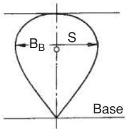

text_image

B_B
S
Base

c. ∇ - Type   
Figure 14.17. Bulb types.

In all cases, the bulb should not emerge in the ballast condition beyond point B in Figure 14.18.

Six parameters used to describe the geometry of the bulb are as follows: Figure 14.18:

Length parameter: $C _ { L P R } = L _ { P R } / L _ { B P }$ , where $L _ { P R }$ is the protruding length of the bulb.

Breadth parameter: $C _ { B B } = B _ { B } / B$ , where $B _ { B }$ is the maximum breadth of the bulb at the forward perpendicular (FP) and B is the ship breadth

Depth parameter: $C _ { Z B } = Z _ { B } / T _ { F P }$ , where $Z _ { B }$ is the height of the forward most point of the bulb and $T _ { F P }$ is the draught at the forward perpendicular.

Cross-section parameter: $C _ { A B T } { = } A _ { B T } / A _ { X }$ , where $A _ { B T }$ is the cross-sectional area of the bulb at the FP and $A _ { X }$ is the midship section area.

Lateral parameter: $C _ { A B L } = A _ { B L } / A _ { X } ,$ , where $A _ { B L }$ is the area of the ram bow in the longitudinal plane and $A _ { X }$ is the midship section area.

Volume parameter: $C _ { \boldsymbol { \nabla } P R } = \nabla _ { P R } / \nabla$ , where $\nabla _ { P R }$ is the nominal bulb volume and ∇ is the ship volumetric displacement.

Kracht suggests that the length, cross-section and volume parameters are the most important.

In order to describe the characteristics and benefits of the bulbous bow, Kracht uses a residual power reduction coefficient, $\Delta C _ { P \nabla R }$ , which is a measure of the percentage reduction in power using a bulb compared with a normal bow, a larger value representing a larger reduction in power. The data were derived from an analysis of routine test results in two German test tanks. Examples of $\Delta C _ { P \nabla R }$ for $C _ { B } = 0 . 7 1$ over a range of Froude numbers $F r ( F _ { N }$ in diagram) are shown in Figures 14.19–14.23 for $C _ { L P R } , C _ { B B } , C _ { A B T } , C _ { A B L }$ and $C _ {  { \boldsymbol } { \nabla } P R }$ .

text_image

z
A_{BT}
\frac{1}{2} A_{BL} B T_{FT}
H_B Z_B
B_F.P. Base
x
L_{PR}

Figure 14.18. Definitions of bulb dimensions.

line

| C_LPR   | ΔC_PVR (Upper limit) |
|---------|----------------------|
| 0.025   | 0.3                  |
| 0.03    | 0.4                  |
| 0.035   | 0.4                  |
| 0.04    | 0.3                  |
| 0.045   | 0.4                  |
| 0.05    | 0.5                  |

Figure 14.19. Residual power reduction coefficient as a function of $C _ { L P R }$ .

Use of the data allows combinations of bulb characteristics to be chosen to maximise the savings in power (maximum $\Delta C _ { P \nabla R } )$ . For example, assume a speed of $F r = 0 . 2 6$ , and assume a design requirement of $L _ { P R } / L _ { B P } < 3 . 5 \%$ . If $L _ { P R } / L _ { B P } <$ 0.035, then from Figure 14.19 the maximum $\Delta C _ { P \nabla R }$ at $F r = 0 . 2 6 \mathrm { i s } 0 . 3 8$ at $L _ { P R } / L _ { B P } =$ 0.033 (3.3%). From Figure 14.20 at $\Delta C _ { P \nabla R } = 0 . 3 8$ , a suitable breadth coefficient $C _ { B B } = 0 . 1 5 5 ~ ( 1 5 . 5 \% )$ and from Figure 14.21 a suitable cross-section coefficient $C _ { A B T } = 0 . 1 2 \ ( 1 2 \% )$ . Suitable values for $C _ { A B L }$ and $\mathrm { C } _ { \boldsymbol { \nabla } { P R } }$ can be found in a similar manner.

The data and methodology of Kracht have been applied to high-speed fine form ships by Hoyle et al. [14.20]. A series of bulb forms were developed and analysed using numerical and experimental methods, Figure 14.24. The use of the design charts is illustrated and the derivation of charts for other block coefficients is described. The Kracht design charts produced acceptable, but not optimum, initial

  
Figure 14.20. Residual power reduction coefficient as a function of CBB.

line

| C_ABT | Upper limit | 0.20 = F_N | 0.22 | 0.24 |
|-------|-------------|------------|------|------|
| 0.04  | ~0.25       | ~0.15      | ~0.22| ~0.28|
| 0.05  | ~0.26       | ~0.18      | ~0.23| ~0.29|
| 0.06  | ~0.27       | ~0.20      | ~0.24| ~0.30|
| 0.07  | ~0.28       | ~0.22      | ~0.25| ~0.31|
| 0.08  | ~0.29       | ~0.24      | ~0.26| ~0.32|
| 0.09  | ~0.15       | ~0.10      | ~0.18| ~0.25|
| 0.10  | ~0.35       | ~0.25      | ~0.32| ~0.38|
| 0.11  | ~0.45       | ~0.35      | ~0.42| ~0.45|
| 0.12  | ~0.48       | ~0.38      | ~0.45| ~0.47|
| 0.13  | ~0.49       | ~0.40      | ~0.46| ~0.48|
| 0.14  | ~0.50       | ~0.42      | ~0.47| ~0.49|

Figure 14.21. Residual power reduction coefficient as a function of $C _ { A B T }$   

line

| C_ABL | Upper limit | 0.24 | 0.20 | 0.22 |
|-------|-------------|------|------|------|
| 0.10  | ~0.3        | ~0.3 | ~0.3 | ~0.3 |
| 0.11  | ~0.25       | ~0.25| ~0.25| ~0.25|
| 0.12  | ~0.1        | ~0.1 | ~0.1 | ~0.1 |
| 0.13  | ~0.3        | ~0.3 | ~0.3 | ~0.3 |
| 0.14  | ~0.2        | ~0.2 | ~0.2 | ~0.2 |
| 0.15  | ~0.4        | ~0.4 | ~0.4 | ~0.4 |
| 0.16  | ~0.45       | ~0.45| ~0.45| ~0.45|
| 0.17  | ~0.4        | ~0.4 | ~0.4 | ~0.4 |
| 0.18  | ~0.3        | ~0.3 | ~0.3 | ~0.3 |

Figure 14.22. Residual power reduction coefficient as a function of $C _ { A B L }$

line

| C_∇PR [%] | Upper limit | 0.22 | 0.24 | 0.20 | 0.26 = F_N |
| --------- | ----------- | ---- | ---- | ---- | ---------- |
| 0.1       | 0.2         | 0.18 | 0.19 | 0.17 | 0.16       |
| 0.2       | 0.3         | 0.25 | 0.27 | 0.23 | 0.22       |
| 0.3       | 0.4         | 0.32 | 0.35 | 0.30 | 0.28       |
| 0.4       | 0.25        | 0.28 | 0.30 | 0.25 | 0.23       |
| 0.5       | 0.45        | 0.40 | 0.42 | 0.38 | 0.35       |
| 0.6       | 0.48        | 0.45 | 0.47 | 0.43 | 0.41       |

Figure 14.23. Residual power reduction coefficient as a function of $C _ {  { \boldsymbol { \nabla } } P R }$

  
Figure 14.24. Bulb designs investigated by Hoyle et al. [14.20].

designs; increases in bulb breadth and volume tended to lower the resistance further. The decreases in resistance due to the bulbs varied with speed. Bulb 8 showed the worst results, whilst Bulb 0 showed reasonable reductions, although bettered over much of the speed range by Bulbs 4 and 6. The numerical methods employed provided an accurate relative resistance ranking of the bulbous bow configurations. This demonstrated the potential future use of numerical methods for such investigations.

# 14.2.3 Seakeeping

In general, a bulbous bow does not significantly affect ship motions or seakeeping characteristics [14.13], [14.18] and [14.21], and the bulb can be designed for the calm water condition. It is, however, recommended in [14.21] that it is prudent to avoid extremely large bulbs, which tend to lose their calm water benefits in a seaway.

# 14.2.4 Cavitation

Cavitation can occur over the fore end of bulbous bows of fast vessels. The use of elliptical horizontal sections at the fore end can help delay the onset of cavitation.

# 14.3 Aft End

# 14.3.1 Basic Requirements of Aft End Design

There are four requirements of aft end design:

(i) The basic aft end shape should minimise the likelihood of flow separation and its influence on hull resistance and the performance of the propulsor.

text_image

Waterline
1/2 αR
Centreline

Figure 14.25. Definition of half-angle of run $1 / 2 \alpha _ { R }$ .

(ii) The shape should ideally be such that it produces a uniform wake in way of the propulsor(s).   
(iii) The aft end should suit the practical and efficient arrangement of propulsors, shaft brackets or bossings and rudders.   
(iv) There should be adequate clearances between propulsor(s) and the adjacent structure such as hull, sternframe and rudder.

Resistance tests and flow visualisation studies are used to measure the effectiveness of the hull shape. Wake surveys (see Chapter 8) are used to assess the distribution of the wake and degree of non-uniformity. These provide a measure of the likely variation in propeller thrust loading and the possibility of propeller-excited vibration.

The shape of the sections at the aft end can be considered in association with the half angle of run, $1 / 2 \alpha _ { R }$ , Figure 14.25. Large $1 / 2 \alpha _ { R }$ leads to $\mathbf { \Delta } ^ { \left\{ \mathbf { V } \right\} }$ sections aft and less resistance, and is typically applied to twin-screw vessels. Smaller $1 / 2 \alpha _ { R }$ with moderate $\mathbf { \nabla } ^ { 6 } \mathbf { U } ^ { 5 }$ sections is normally applied to single-screw vessels, in general leading to an increase in resistance. This is generally offset by an increase in propulsive efficiency. For example, Figure 8.4 in Chapter 8 illustrates the influence on wake distribution when moving from what is effectively a $\mathbf { \Delta } ^ { \left\{ \mathbf { V } \right\} }$ section stern to a $\cdot _ { \mathrm { U } } ,$ shape and then to a bulbous stern, as shown in Figure 14.26. With the $\cdot _ { \mathrm { U } } ,$ and bulbous sterns, the lines of constant wake become almost concentric, leading to decreases in propeller force variation and vibration, and a likely improvement in overall efficiency.

Excellent insights into the performance of different aft end section shapes and arrangements are provided in [14.22], [14.23] and [14.24]. Resistance and propulsion tests were carried out on vessels with $C _ { B } = 0 . 6 5 [ 1 4 . 2 2 ]$ and $C _ { B } = 0 . 8 0 \ [ 1 4 . 2 3 ]$ and with aft end section shapes representing the parent (moderate U-V form), U form, a bulb (bulbous near base line) and concentric bulb (concentric with shaft line). Some results extracted from [14.23] for $C _ { B } = 0 . 8 0$ and $F r = 0 . 2 1$ , are given in Table 14.2. This table broadly demonstrates the phenomena already described in terms of changes in resistance and propulsive efficiency. Namely, in general terms, the resistance increases when moving to U-shaped sections, but there is a small improvement in propulsive efficiency and a net decrease in delivered power $P _ { D } \left( = f \odot / \ \eta _ { D } \right)$ . This is true also for the concentric form. There is also a more uniform wake distribution for the U and concentric bulb forms. These results serve to demonstrate the need to consider both resistance and propulsion effects when designing the aft end.

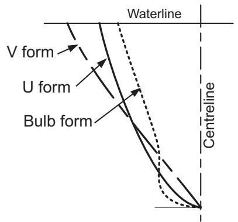

text_image

Waterline
V form
U form
Bulb form
Centreline

Figure 14.26. ‘V’, ‘U’ and bulbous sterns.

Table 14.2. Effect of bulb on resistance and propulsion 

<table><tr><td>Stern type</td><td>©</td><td> $\eta_{D}$ </td><td>© /  $\eta_{D}$ </td></tr><tr><td>Parent</td><td>1.012</td><td>0.643</td><td>1.574</td></tr><tr><td>U type</td><td>1.041</td><td>0.674</td><td>1.545</td></tr><tr><td>Bulb</td><td>1.042</td><td>0.662</td><td>1.574</td></tr><tr><td>Concentric</td><td>1.000</td><td>0.654</td><td>1.529</td></tr></table>

For single-screw vessels, the aft end profile generally evolves from the requirements of draught, propeller diameter, rudder location and clearances, Figure 14.27. Draught issues will include the ballast condition and adequate propeller immersion. Rudder location and its influence on propulsion is discussed by Molland and Turnock [14.25]. Suitable propeller clearances (in particular, to avoid propeller vibration) can be obtained from the recommendations of classification societies, such as [14.26]. For preliminary design purposes, a minimum propeller tip clearance of $2 0 \% D$ can be used (‘a’ in Figure 14.27). Most vessels now incorporate a transom stern which increases deck area, providing more space for mooring equipment, or allowing the deckhouse to be moved aft, or containers to be stowed aft, whilst at the same time generally lowering the cost of construction.

For twin-screw vessels, conventional V-type sections have generally been adopted, with the propeller shafts supported in bossings or on shaft brackets, Figure 14.28. Again, a transom stern is employed. For some faster twin-screw forms, such as warships, a stern wedge (or flap) over the breadth of the transom may be employed which deflects the flow downward as it leaves the transom, providing a trim correction and resistance reduction, [14.27].

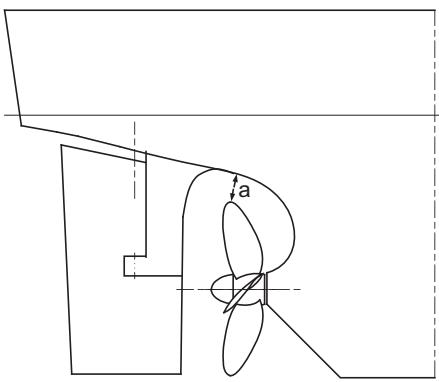

text_image

a

Figure 14.27. Aft end profile, single screw.

natural_image

Technical line drawing of a mechanical component or structure with no visible text or symbols

Figure 14.28. Aft end arrangement, twin screw.

More recent investigations, mainly for large container ships requiring very large propulsive power, have considered twin screws with twin-skeg forms [14.28]. The stern is broadly pram shape, with the skegs suitably attached, Figure 14.29. Satisfactory overall resistance and propulsion properties have been reported for these arrangements, although first and running costs are likely to be higher than for an equivalent single-screw installation.

# 14.3.2 Stern Hull Geometry to Suit Podded Units

When podded propulsors are employed, a pram-type stern can be adopted. Because there are no bossings or shafting upstream, a tractor (pulling) unit is then working in a relatively undisturbed wake.

The pram-type stern promotes buttock flow which, if the hull lines are designed appropriately, can lead to a decrease in hull resistance [14.29]. It is generally accepted that, in order to avoid flow separation, the slope of the pram stern should not be more than about 15◦. A useful investigation into pram stern slope was carried out by Tregde [14.30]. He estimated the limiting slope using an inverse design method and the principle of Stratford flow [14.31], where a pressure and, hence, velocity distribution is prescribed which just precludes the onset of separation.

natural_image

Pure diagram of fluid flow lines around a central object, no text or symbols present

Figure 14.29. Twin-skeg aft end arrangement.

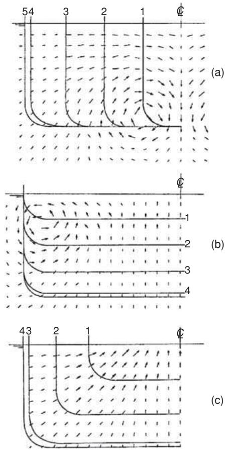

text_image

54 3 2 1
(a)
(b)
43 2 1
(c)

Figure 14.30. Shed vortices.

When considering the overall shape, it should be noted that a steady change in waterline and buttock slope should be adopted in order to avoid shed vortices, with consequent increase in resistance. This can be seen from the tuft study results in Figure 14.30 [14.32], where (a) is waterline flow, (b) is buttock flow and (c) provides a good compromise with the absence of vortices.

Research has shown [14.33] that the optimum longitudinal pod inclination is about the same as that for the corresponding buttock line. For good propeller efficiency, the pod should be located at a minimum distance of 5%L from the transom.

Ukon et al. [14.29] investigated the propulsive performance of podded units for single-screw vessels with a conventional stern hull, buttock flow stern and a stern bulb hull form. The buttock flow stern was found to have the lowest resistance and effective power requirement. The wake fraction and thrust deduction factor for the buttock flow stern were low, leading to a low hull efficiency of 1.031. The wake gain for the stern bulb hull led to the highest hull efficiency (1.304) and overall propulsive efficiency, and the lowest overall delivered power requirement. The paper concludes that (for single-screw vessels) the bulb stern is a promising option.

The seakeeping behaviour of a pram stern has to be taken into account. If the stern surfaces are too flat, this can give rise to slamming in a following sea. In [14.33] it is proposed that the transverse slope of a section relative to the still waterplane should be greater than about 5◦. In order to provide directional stability, a skeg will normally be incorporated in the pram stern. This may be incorporated as a separate fabrication, Figure 14.31 (a), or shaped to form part of the hull, Figure 14.31 (b).

natural_image

Pure geometric diagram with curved lines and dashed vertical lines, no text or symbols present

natural_image

Pure curved line diagram without any text, numbers, or symbols

Figure 14.31. Pram stern.

# 14.3.3 Shallow Draught Vessels

Some tankers with a draught, and hence propeller diameter, limitation have been designed with twin screws. This is technically viable and acceptable, but will generally lead to higher build and operational costs. Other shallow draught tankers have been fitted with ducted propellers with successful results [14.34], [14.35]. The restricted propeller diameter leads to higher thrust loadings, which is where the ducted propeller can be helpful, with the duct augmenting the thrust of the propeller, see Section 11.3.3.

Shallow draught vessels such as those found on inland waterways have successfully employed tunnel sterns, Figure 14.32. As a larger propeller diameter will normally improve the efficiency, the use of a tunnel allows some increase in diameter. Care must be taken to ensure that there is adequate immersion of the propeller, and adequate vertical tunnel outboard of the propeller to preclude ventilation of the propeller around the side of the hull. A combination of a ducted propeller within a partial tunnel has also been employed. Tunnels can also be applied to single-screw vessels using similar approaches.

Some discussion on the use of tunnels is included in Carlton [14.36]. For smaller craft, a useful source of information on tunnels for such craft may be found in Harbaugh and Blount [14.37].

natural_image

Pure optical ray diagram showing light paths through a lens system with no text or symbols

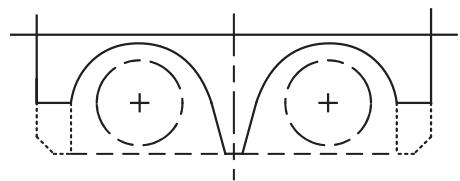

natural_image

Pure mechanical diagram showing symmetrical curved components with plus signs, no text or symbols present

Figure 14.32. Shallow draught vessel with tunnel stern.

# 14.4 Computational Fluid Dynamics Methods Applied to Hull Form Design

Until recent years, hull form development has been mainly carried out using experimental techniques. Initially, this concerned the measurement of model total resistance and its extrapolation to full scale, as discussed in Chapter 4. Since the 1960s, much experimental effort has been directed at measuring the individual components of hull resistance, allowing a better insight into why changes in hull form lead to changes in resistance. This is discussed in Chapter 7.

Theoretical work has been carried out over many years, including that of Havelock and Kelvin, but it was the advent of the modern computer and numerical computational methods that allowed extensive investigations into the flow over the hull and the influence of hull form changes on the flow. Computational fluid dynamics (CFD) has not yet replaced the experimental approach, but can be used very successfully with experiments in a complementary manner. In particular, CFD predictions can be used in planning experiments and indicating potential areas of investigation. At the same time, good quality experimental data, particularly those relating to the individual resistance components, are used to validate CFD predictions. Rapid progress is being made towards developing computational methods that offer very realistic predictions both at model and full scale [14.38].

Further discussion of the applications of CFD approaches to hull design, wake and propeller design are included in Chapters 8, 9 and 15.

Examples where hull forms have been developed using a mixture of CFD and experiments are provided [14.39] and [14.40]. Other examples of the use of CFD and experiments in hull form design and interaction with the propeller may be found in [14.41], [14.42] and [14.43].

# REFERENCES (CHAPTER 14)

14.1 BSRA. Methodical series experiments on single-screw ocean-going merchant ship forms. Extended and revised overall analysis. BSRA Report NS333, 1971.   
14.2 Gertler, M. A reanalysis of the original test data for the Taylor standard series. David Taylor Model Basin Report No. 806. DTMB, Washington, DC, 1954. Reprinted by Society of Naval Architects and Marine Engineers, 1998.   
14.3 Bocler, H. The position of the longitudinal centre of buoyancy for minimum resistance. Transactions of the Institute of Engineers and Shipbuilders in Scotland. Vol. 97, 1953–1954, pp. 11–63.   
14.4 Watson, D.G.M. Practical Ship Design. Elsevier Science, Oxford, UK, 1998.   
14.5 Molland, A.F. (ed.) Maritime Engineering Reference Book. Butterworth-Heinemann, Oxford, UK, 2008.   
14.6 Schneekluth, H. and Bertram, V. Ship Design for Efficiency and Economy. 2nd Edition. Butterworth-Heinemann, Oxford, UK, 1998.   
14.7 McEntee, W. Cargo ship lines on simple form. Transactions of the Society of Naval Architects and Marine Engineers, Vol. 25, 1917.   
14.8 Johnson, N.V. Experiments with straight framed ships. Transactions of the Royal Institution of Naval Architects, Vol. 106, 1964, pp. 197–211.   
14.9 Silverleaf, A. and Dawson, J. Hydrodynamic design of merchant ships for high speed operation. Transactions of the Royal Institution of Naval Architects, Vol. 109, 1967, pp. 167–196.

14.10 Swaan, W.A. and Vossers, G. The effect of forebody section shape on ship behaviour in waves. Transactions of the Royal Institution of Naval Architects, Vol. 103, 1961, pp. 297–328.   
14.11 Ewing, J.A. The effect of speed, forebody shape and weight distribution on ship motions. Transactions of the Royal Institution of Naval Architects, Vol. 109, 1967, pp. 337–346.   
14.12 Lloyd, A.R.J.M., Salsich, J.O. and Zseleczky, J.J. The effect of bow shape on deck wetness in heads seas. Transactions of the Royal Institution of Naval Architects, Vol. 128, 1986, pp. 9–25.   
14.13 Kracht, A.M. Design of bulbous bows. Transactions of the Society of Naval Architects and Marine Engineers, Vol. 86, 1978, pp. 197–217.   
14.14 Steele, B.N. and Pearce, G.B. Experimental determination of the distribution of skin friction on a model of a high speed liner. Transactions of the Royal Institution of Naval Architects, Vol. 110, 1968, pp. 79–100.   
14.15 Wigley, W.C.S. The theory of the bulbous bow and its practical application. Transactions of the North East Coast Institution of Engineers and Shipbuilders, Vol. 52, 1935–1936.   
14.16 Ferguson, A.M. and Dand, I.W. Hull and bulbous bow interaction. Transactions of the Royal Institution of Naval Architects, Vol. 112, 1970, pp. 421– 441.   
14.17 Holtrop, J. A statistical re-analysis of resistance and propulsion data. International Shipbuilding Progress, Vol. 31, 1984, pp. 272–276.   
14.18 Lewis, E.V. (ed.). Principles of Naval Architecture. The Society of Naval Architects and Marine Engineers, New York, 1989.   
14.19 Moor, D.I. Resistance and propulsion properties of some modern single screw tanker and bulk carrier forms. Transactions of the Royal Institution of Naval Architects, Vol. 117, 1975, pp. 201–204.   
14.20 Hoyle, J.W., Cheng, B.H., Hays, B., Johnson, B. and Nehrling, B. A bulbous bow design methodology for high-speed ships. Transactions of the Society of Naval Architects and Marine Engineers, Vol. 94, 1986, pp. 31–56.   
14.21 Blume, P. and Kracht, A.M. Prediction of the behaviour and propulsive performance of ships with bulbous bows in waves. Transactions of the Society of Naval Architects and Marine Engineers, Vol. 93, 1985, pp. 79–94.   
14.22 Thomson, G.R. and White, G.P. Model experiments with stern variations of a 0.65 block coefficient form. Transactions of the Royal Institution of Naval Architects, Vol. 111, 1969, pp. 299–316.   
14.23 Dawson, J. and Thomson, G.R. Model experiments with stern variations of a 0.80 block coefficient form. Transactions of the Royal Institution of Naval Architects, Vol. 111, 1969, pp. 507–524.   
14.24 Thomson, G.R. and Pattullo, R.N.M. The BSRA Trawler Series (Part III). Block coefficient and longitudinal centre of buoyancy variation series, tests with bow and stern variations. Transactions of the Royal Institution of Naval Architects, Vol. 111, 1969, pp. 317–342.   
14.25 Molland, A.F. and Turnock, S.R. Marine Rudders and Control Surfaces. Butterworth-Heinemann, Oxford, UK, 2007.   
14.26 Lloyd’s Register. Rules and Regulations for the Classification of Ships. Part 3, Chapter 6. July 2005.   
14.27 Kariafiath, G., Gusanelli, D. and Lin, C.W. Stern wedges and stern flaps for improved powering – US Navy experience. Transactions of the Society of Naval Architects and Marine Engineers, Vol. 107, 1999, pp. 67–99.   
14.28 Kim, J., Park, I.-R., Van, S.-H., and Park, N.-J. Numerical computation for the comparison of stern flows around various twin skegs. Journal of Ship and Ocean Technology, Vol. 10, No. 2, 2006.   
14.29 Ukon, Y., Sasaki, N, Fujisawa, J. and Nishimura, E. The propulsive performance of podded propulsion ships with different shape of stern hull. Second

International Conference on Technological Advances in Podded Propulsion, T-POD. University of Brest, France, 2006.   
14.30 Tregde, V. Aspects of ship design; Optimisation of aft hull with inverse geometry design. Dr.Ing. thesis, Department of Marine Hydrodynamics, University of Science and Technology, Trondheim, 2004.   
14.31 Stratford, B.S. The prediction of separation of the turbulent boundary layer. Journal of Fluid Mechanics, Vol. 5, No. 17, 1959, pp. 1–16.   
14.32 Muntjewert, J.J. and Oosterveld, M.W.C. Fuel efficiency through hull form and propulsion research – a review of recent MARIN activities. Transactions of the Society of Naval Architects and Marine Engineers, Vol. 95, 1987, pp. 167–181.   
14.33 Bertaglia, G., Serra, A. and Lavini, G. Pod propellers with 5 and 6 blades. Proceedings of International Conference on Ship and Shipping Research, NAV’2003, Palermo, Italy, 2003.   
14.34 Flising, A. Ducted propeller installation on a 130,000 TDW tanker – A research and development project. RINA Symposium on Ducted Propellers. RINA, London, 1973.   
14.35 Andersen, O. and Tani, M. Experience with SS Golar Nichu. RINA Symposium on Ducted Propellers. RINA, London, 1973.   
14.36 Carlton, J.S. Marine Propellers and Propulsion. 2nd Edition. Butterworth-Heinemann, Oxford, UK, 2007.   
14.37 Harbaugh, K.H. and Blount, D.L. An experimental study of a high performance tunnel hull craft. Paper H, Society of Naval Architects and Marine Engineers, Spring Meeting, 1973.   
14.38 Raven, H.C., Van Der Ploeg, A., Starke, A.R. and Ec¸a, L. Towards a CFD- based prediction of ship performance – progress in predicting full-scale resistance and scale effects. Transactions of the Royal Institution of Naval Architects, Vol. 150, 2008, pp. 31–42.   
14.39 Ham¨ al¨ ainen, R. and Van Heerd, J. Hydrodynamic development for a large ¨ fast monohull passenger ferry. Transactions of the Society of Naval Architects and Marine Engineers, Vol. 106, 1998, pp. 413–441.   
14.40 Valkhof, H.H., Hoekstra, M. and Andersen, J.E. Model tests and CFD in hull form optimisation. Transactions of the Society of Naval Architects and Marine Engineers, Vol. 106, 1998, pp. 391–412.   
14.41 Tzabiras, G.D. A numerical study of additive bulb effects on the resistance and self-propulsion characteristics of a full form ship. Ship Technology Research, Vol. 44, 1997.   
14.42 Turnock, S.R., Phillips, A.B. and Furlong, M. URANS simulations of static drift and dynamic manoeuvres of the KVLCC2 Tanker. Proceedings of the SIMMAN International Manoeuvring Workshop. Copenhagen, April 2008.   
14.43 Larsson, L. and Raven, H.C. Principles of Naval Architecture: Ship Resistance and Flow. The Society of Naval Architects and Marine Engineers, New York, 2010.

# 15 Numerical Methods for Propeller Analysis

# 15.1 Introduction

Ship powering relies on a reliable estimate of the relationship between the shaft torque applied and the net thrust generated by a propulsor acting in the presence of a hull. The propeller provides the main means for ship propulsion. This chapter considers numerical methods for propeller analysis and the hierarchy of the possible methods from the elementary through to those that apply the most recent computational fluid dynamics techniques. It concentrates on the blade element momentum approach as the method best suited to gaining an understanding of the physical performance of propeller action. Further sections examine the influence of oblique flow and tangential wake, the design of wake-adapted propellers and finally the assessment of cavitation risk and effects.

Although other propulsors can be used, Chapter 11, the methods of determining their performance have many similarities to those applied to the conventional ship propeller and so will not be explicitly covered. The main details of the computational fluid dynamic (CFD) based approaches are covered in Chapter 9 as are the methods whereby coupled self-propulsion calculations can be applied, Section 9.6.

Further details of potential-based numerical analysis of propellers are covered by Breslin and Anderson [15.1], and Carlton [15.2] gives a good overview.

# 15.2 Historical Development of Numerical Methods

From the start of mechanically based propulsion, there was an awareness of the need to match propeller design to the requirement of a specific ship design. The key developments are summarised, based on [15.2, 15.3], as follows.

Rankine [15.4], considering fluid momentum, found the ideal efficiency of a propeller acting as an actuator disc. The rotor is represented as a disc capable of sustaining a pressure difference between its two sides and imparting linear momentum to the fluid that passes through it. The mechanism of thrust generation requires the evaluation of the mass flow through a stream tube bounded by the disc. Froude [15.5], in his momentum theory, allowed the propeller to impart a rotational velocity to the slipstream.

In 1878 William Froude [15.6] developed the theory of how a propeller section, or blade element, could develop the force applied to the fluid. It was not until the work of Betz [15.7] in 1919, and later Goldstein [15.8] in 1929 employing Prandtl’s [15.9] lifting line theory, that it was shown that optimum propellers could be designed. This approach is successful for high-aspect ratio blades more suited to aircraft. For the low-aspect ratio blades widely used for marine propellers, this assumption is not valid. It was not until 1952, when Lerbs [15.10] published his paper on the extension of Goldstein’s lifting line theory for propellers with arbitrary radial distributions of circulation in both uniform and radially varying inflow, that, at last, marine propellers could be modelled with some degree of accuracy. Although its acceptance was slow, it still is, even today, universally accepted as a good procedure for establishing the principal characteristics of the propeller at an early design stage.

The onset of digital computers allowed the practical implementation of numerical lifting surface methods. This allowed the influence of skew and the radial distribution of circulation to be modelled, Sparenberg [15.11]. There was a rapid development of techniques based on lifting surfaces [15.12–15.15] which were then further refined as computer power increased [15.16, 15.17].

The above methods, although suitable for design purposes, provided limited information on the section flow. Hess and Valarezo [15.18] developed a boundary element method (BEM) or surface panel code that allowed the full geometry of the propeller to be modelled, and this approach, or related ones, has been widely adopted.

At a similar time early work was being undertaken into the use of Reynolds averaged Navier–Stokes (RANS) codes for propeller analysis. For example, Kim and Stern [15.19] showed the possibilities of such analysis for a simplified propeller geometry. The work of authors such as Uto [15.20] and Stanier [15.21–15.23] provided solutions for realistic propeller geometries with detailed flow features. Chen and Stern [15.24] undertook unsteady viscous computations and investigated their applicability, although they obtained poor results due to the limited mesh size feasible at the time. Maksoud et al. [15.25, 15.26] performed unsteady calculations for a propeller operating in the wake of a ship using a non-matching multiblock scheme.

Finally, the ability to deal with large-scale unsteadiness through the availability of massive computational power has allowed propeller analysis to be extended to extreme off-design conditions. The application of large eddy simulations (LES) to propeller flows such as crash back manoeuvres is the current state of the art. Notable examples are found in the publications of Jessup [15.27] and Bensow and Liefvendahl [15.28] along with the triennial review of the International Towing Tank Conference (ITTC) Propulsion Committee [15.29].

# 15.3 Hierarchy of Methods

Table 15.1, developed from Phillips et al. [15.30], classifies the various approaches in increasing order of physical and temporal accuracy. A simplified computational cost measure is also included. This represents an estimate of the relative cost of each technique normalised to the baseline blade element-momentum theory (BEMT) which has a cost of one. As can be seen, the hierarchy reflects the historical development, as well as the progressively more expensive computational cost.

Table 15.1. Numerical methods for modelling propellers 

<table><tr><td>Method</td><td>Description</td><td>Cost</td></tr><tr><td>Momentum theory</td><td>The propeller is modelled as an actuator disc over which there is an instantaneous pressure change, resulting in a thrust acting at the disc. The thrust, torque and delivered power are attributed to changes in the fluid velocity within the slipstream surrounding the disc, Rankine [15.4], Froude [15.5]</td><td>&lt;1</td></tr><tr><td>Blade element theory</td><td>The forces and moments acting on the blade are derived from a number of independent sections represented as two-dimensional aerofoils at an angle of attack to the fluid flow. Lift and drag information for the sections must be provided a priori and the induced velocities in the fluid due to the action of the propeller are not accounted for, Froude [15.6].</td><td>&lt;1</td></tr><tr><td>Blade element-momentum theory</td><td>By combining momentum theory with blade element theory, the induced velocity field can be found around the two-dimensional sections, Burrill [15.42], Eckhardt and Morgan [15.40], O&#x27;Brien [15.41]. Corrections have been presented to account for the finite number of blades and strong curvature effects.</td><td>1</td></tr><tr><td>Lifting line method</td><td>The propeller blades are represented by lifting lines, which have a varying circulation as a function of radius. This approach is unable to capture stall behaviour, Lerbs [15.10].</td><td>~10</td></tr><tr><td>Lifting surface method</td><td>The propeller blade is represented as an infinitely thin surface fitted to the blade camber line. A distribution of vorticity is applied in the spanwise and chordwise directions, Pien [15.12].</td><td>~ $10^{2}$ </td></tr><tr><td>Panel method</td><td>Panel methods extend the lifting surface method to account for blade thickness and the hub by representing the surface of the blade by a finite number of vortex panels, Kerwin [15.13].</td><td>~ $10^{3}$ </td></tr><tr><td>Reynolds averaged Navier-stokes</td><td>Full three-dimensional viscous flow field modelled using a finite volume or finite-element approach to solve the averaged flow field, Stanier [15.21–15.23], Adbel-Maksoud et al. [15.25, 15.26].</td><td>~ $10^{6}$ </td></tr><tr><td>Large eddy simulation</td><td>Bensow and Liefvendahl [15.28]</td><td>~ $10^{8}$ </td></tr></table>

Automated design optimisation techniques rely on the ability to evaluate multiple designs within a reasonable time frame and at an appropriate cost. The design goals of a propeller optimisation seek to minimise required power for delivered thrust with a sufficiently strong propeller that avoids cavitation erosion at design and offdesign conditions [15.2, 15.31]. The physical fidelity of the simulation can be traded against the computational cost if suitable empiricism can be included in interpreting the results of the analysis. For instance, as viscous effects often only have limited influence at design, an estimate of skin friction can be included with a potentialbased surface panel method alongside a cavitation check based on not going beyond a certain minimum surface pressure to select an optimum propeller.

# 15.4 Guidance Notes on the Application of Techniques

# 15.4.1 Blade Element-Momentum Theory

As will be shown in Section 15.5, for concept propeller design the blade elementmomentum theory in its various manifestations provides a very rapid technique for achieving suitable combinations of chord and pitch for given two-dimensional sectional data. The resultant load distributions can be used with the one-dimensional beam theory–based propeller strength calculations in Section 12.3 to determine the required blade section thickness and cavitation inception envelopes, Figures 12.23 and 12.24, to assess cavitation risk.

Although the method relies on empirical or derived two-dimensional section data, this is also one of its strengths as it allows tuned performance to account for the influence of sectional thickness, chord-based Reynolds number, and viscousinduced effects such as stall.

# 15.4.2 Lifting Line Theories

In these methods each blade section is represented by a single-line vortex whose strength varies from section to section [15.9, 15.10]. A trailing vortex sheet, behind each blade, is typically forced to follow a suitable helical surface. As a result, there is no detail as to the likely based variation in chordwise loading or location of the centre of effort. Such an approach is more suited to high aspect ratio blades which are lightly loaded, e.g. $J > 0 . 2 5$ , and not those with significant skew.

# 15.4.3 Surface Panel Methods

The surface panel method may be considered as the workhorse computational tool for detailed propeller design that, if used appropriately, can predict propeller performance with a high degree of confidence. Difficulties arise in more extreme designs or where significant cavitation is expected. The typical process of applying this method requires a series of steps to develop the full surface geometry. Figure 15.1 illustrates such a process for solving a propeller design using the Palisupan surface panel code, Turnock [15.32]. In this process, a table of propeller section offsets, chord, pitch, rake, skew and thickness is processed to generate a series of sections, each consisting of a set of Cartesian coordinate nodes [15.3]. A bicubic spline interpolation is used to subdivide the complete blade surface into a map of Nt chordwise and Ns spanwise panels. The use of appropriate clustering functions allows the panels to be clustered near the leading and trailing edges as well as the tip. The quality of the numerical solution will strongly depend on selection of the appropriate number of panels for a given geometry. As the outboard propeller sections are thin $( t / c \sim 6 \% )$ , a large number of panels are required around each section (50+) in order to avoid numerical problems at the trailing edge. Similarly, the aspect ratio of panels should typically not exceed three, so the spanwise number of panels should be selected to keep the panel aspect ratio below this threshold.

The most complex part of the process is the selection of the appropriate shape of the strip of wake panels that trail behind from each pair of trailing edge panels. Numerically, the surface panel method requires the trailing wake to follow a stream surface. However, the shape of this stream surface is not known a priori. What is known is that, as the wake trails behind the propeller, the race contracts and the conservation of angular momentum requires the local pitch to reduce. In the far wake, the vorticity associated with all the wake panels will have coalesced into a single tip vortex and a contra-rotating hub vortex for each blade. The stability of numerical schemes that attempt to model such a process is always in question. As a result, practical techniques will make an assumption of the expected wake pitch and race contraction variation based on the expected propeller thrust loading [15.3, 15.33]. A practical way of doing this is to use blade element-momentum theory along with the wake contraction expressions of Gutsche [15.34]. A simpler approach is often adopted based on defining an average wake pitch that usually is chosen to be a suitable value between the geometric pitch and the far wake hydrodynamic pitch. It is worth noting that altering this wake pitch value can shift the thrust and torque values up or down for a given J. It is found that the propeller wake needs to be panelled for 5 to 10 diameters downstream and, as a result, the number of wake panels can be an order of magnitude higher than the number of blade panels.

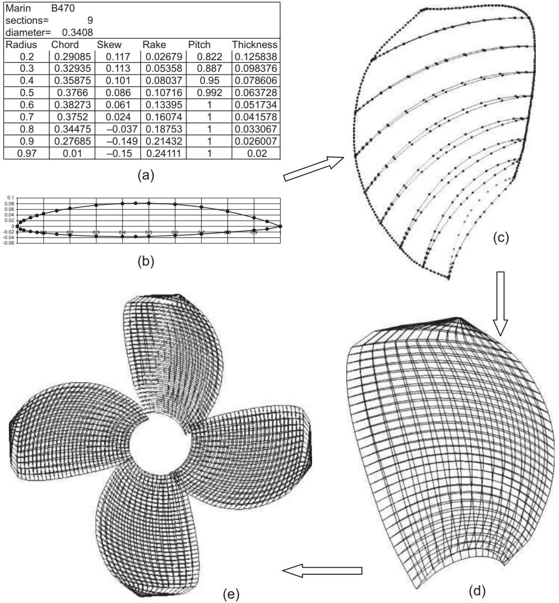

other

| Radius | Chord | Skew | Rake | Pitch | Thickness |
|-------|-------|------|------|-------|---------|
| 0.2   | 0.29085 | 0.117 | 0.02679 | 0.822 | 0.125838 |
| 0.3   | 0.32935 | 0.113 | 0.05358 | 0.887 | 0.098376 |
| 0.4   | 0.35875 | 0.101 | 0.08037 | 0.95  | 0.078606 |
| 0.5   | 0.3766 | 0.086 | 0.10716 | 0.992 | 0.063728 |
| 0.6   | 0.38273 | 0.061 | 0.13395 | 1     | 0.051734 |
| 0.7   | 0.3752 | 0.024 | 0.16074 | 1     | 0.041578 |
| 0.8   | 0.34475 | -0.037 | 0.18753 | 1     | 0.033067 |
| 0.9   | 0.27685 | -0.149 | 0.21432 | 1     | 0.026007 |
| 0.97  | 0.01   | -0.15 | 0.24111 | 1     | 0.02    |
The image displays three technical diagrams (a), (b), and (c), all depicting a curved surface in a grid-like structure (e) and a wireframe sphere in (d). The text 'Marin B470' and 'diameter' are present in the top left column.

Figure 15.1. Propeller generation process for a surface panel code.

The influence of the hub is required to ensure the correct circulation at the blade root. The panels on this hub are usually best aligned with the local geometric pitch of the propeller. The generation of the panels in this region, as shown in Figure 15.1, requires a suitable geometrical transformation to ensure orthogonality.

Once the propeller, hub and wake have had a panel geometry created, the numerical application of a surface panel method is straightforward. For a steady flow, the boundary condition on the propeller blade surface requires zero normal velocity based on the resultant velocity of the free stream and blade rotational speed. Rotational symmetry can used so that the problem is only solved for one of multiple blades and a segment of hub. It is good practice to investigate the sensitivity of the resultant propeller thrust and torque to the number of panels on the blade, hub and in the wake. An advantage of surface panel methods is that the blade loading can be applied directly to three-dimensional finite-element analysis based structural codes, as mentioned in Chapter 12, Section 12.3.3.

Unsteady versions of panel codes can be used to investigate the behaviour of a propeller in a hull wake or even to deal with the complex flow found in surfacepiercing propellers [15.35].

# 15.4.4 Reynolds Averaged Navier–Stokes

As detailed in Chapter 9, it is not the intention in this book to give the full details of the complexity associated with applying RANS-based CFD. However, there are a number of practical aspects of using CFD flow solvers for ship propellers that are worth noting.

In addition to defining precisely the surface geometry of the propeller and hub, CFD codes will require a suitably created mesh of elements that fill the space within the solution domain. It is the definition of this domain that is particularly complex for a rotating propeller. The quality of the mesh and whether it suitably captures all the necessary flow features will determine the accuracy of the solution. In the case of the propeller, the viscous wake and its downstream propagation, along with the tip vortex, has a strong influence on the accurate prediction of forces [15.3, 15.36].

The mesh around the blade needs to be chosen to match the selected turbulence model and to expand at a suitable rate in the surface normal direction. Typically, at least 10 cells will be required within the turbulent boundary layer thickness which should have a first cell thickness of between 30 and 250 for ‘law of the wall’ turbulence models or <3 for those which capture the sublayer directly. A similar approach should be chosen for the hub. It should be noted that for many real hubs there may be a flow separation zone. The accurate capture of this behaviour can be important in determining an accurate prediction of propeller thrust, although it is worth noting that better design to avoid separation will improve the efficiency of the propeller.

For a steady and open flow condition only a single blade requires modelling with the interface faces selected as periodic boundary conditions. Typical domain size would extend to at least two diameters in a radial direction and in the upstream direction, whereas 5 to 10 diameters would be appropriate in the downstream direction.

Ideally, the mesh will consist of hexahedral cells, one of whose principal axes is aligned with the flow. Thus, a mesh which follows an approximately helical structure is more likely to avoid problems with numerical diffusion. The off-body features of the viscous wake and the vorticity sheet roll up into the tip and hub vortices are much more difficult to capture. A recommended approach, developed by Pashias [15.3] and refined by Phillips [15.37], uses the vortex identification technique, Vortfind of Pemberton et al. [15.38], to first run a coarse mesh that identifies the tip vortex near to the blade, predict its track and then generate a refined mesh suited to capturing a vortex for a suitable distance downstream. Resolving on this finer mesh, and progressively repeating the process as necessary, allows the wake structure to be maintained for significant distances (>10D) downstream.

In selecting the turbulence closure model it is worth considering that the behaviour of turbulent strain is likely to be anisotropic within the vortex core. The correct modelling of this behaviour will be important in controlling the accuracy with which the vortex core pressure is predicted and hence the likelihood of cavitation prediction in multiphase calculations.

# 15.5 Blade Element-Momentum Theory

The combination of axial momentum theory and analysis of section, or blade element, performance is used to derive a rapid and, with appropriate empirical correction factors, a powerful propeller analysis tool suitable for overall shape optimisation [15.39–15.41]. The approach combines the two initial strands of propeller analysis with the blade element, identifying the developed forces for a given flow incidence at a given section with the necessary momentum changes needed to generate those forces. This is illustrated in Figure 15.2(a) where the blade element approach provides information on the action of the blade element but not the momentum changes (induced velocities $a , a ^ { \prime } )$ whilst the momentum approach, Figure 15.2(b), provides information on the momentum changes $( a , a ^ { \prime } )$ but not the actual action of the blade element. The problem can be solved by combining the theories in such a way that that part of the propeller between radius r and $( r + \delta r )$ is analysed by matching forces generated by the blade elements, as two-dimensional lifting foils, to the momentum changes occurring in the fluid flowing through the propeller disc between these radii.

# 15.5.1 Momentum Theory

Simple actuator disc theory shows that the increment of axial velocity at the disc is half that which occurs downstream. It can be shown that the same result is true of the angular momentum change. Figure 15.3 illustrates the changes to an annular stream tube as it passes through an actuator disc. An actuator disc, defined as having no thickness, is porous so that flow passes through it, but yet develops a pressure increase due to work being done on the fluid.

text_image

Centreline
T
Q
α
a'Ωr
aV
V
Ωr
Blade element

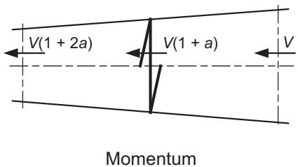

text_image

V(1 + 2a)
V(1 + a)
V
Momentum

Figure 15.2. Blade element and momentum representations of propeller action.

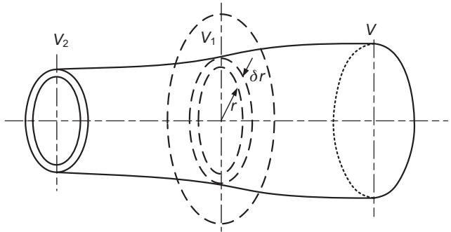

text_image

V₂
V₁
δr
r
V

Figure 15.3. Annulus breakdown of momentum through propeller disc.

The relative axial velocity at disc $V _ { 1 } = V ( 1 { + } a )$ , where a is the axial inflow factor. Similarly, if the angular velocity relative to the blades forward of the propeller is , then the angular velocity relative to the blades at disc is $\Omega ( 1 - a ^ { \prime } )$ , where $a ^ { \prime }$ is the circumferential inflow factor.

Consider the flow along an annulus of radius r and thickness δr at the propeller disc of an infinitely bladed propeller. The thrust and torque on the corresponding section of the propeller can be obtained from the momentum changes occurring as the fluid flow downstream of the annulus. Definitions are as follows:

Speed of advance of propeller = V.

Angular velocity of propeller  .

Disc radius R.

Axial velocity at disc $V _ { 1 } = V ( 1 + a )$ , where a is the axial inflow factor.

Axial velocity in wake $V _ { 2 } = V ( 1 + 2 a )$ .

Fluid angular velocity at disc $\omega _ { 1 } = a ^ { \prime } \Omega$ , where a′ is the circumferential inflow factor.

Fluid angular velocity in wake $\omega _ { 2 } = 2 a ^ { \prime } \Omega$ .

The mass flow rate through annulus is 2π $\cdot r \delta r \rho V ( 1 + a )$ and the thrust on the annular disc will be equal to the axial rate of momentum change, as follows:

$$
\delta T = 2 \pi r \delta r \rho V (1 + a) (V _ {2} - V) = 2 \pi r \delta r \rho V ^ {2} (1 + a) 2 a \text {as} V _ {2} = V (1 + 2 a).
$$

The torque on element is the angular momentum change (or moment of momentum change), as follows:

$$
\delta Q = 2 \pi r \delta r \rho V (1 + a) r ^ {2} \omega_ {2} = 2 \pi r \delta r \rho V (1 + a) r ^ {2} 2 a ^ {\prime} \Omega .
$$

Thus, the thrust and torque loadings per unit span on the propulsor are as follows:

$$
\frac {d T}{d r} = 4 \pi \rho r V ^ {2} a (1 + a) \tag {15.1}
$$

and

$$
\frac {d Q}{d r} = 4 \pi \rho r ^ {3} \Omega V a ^ {\prime} (1 + a). \tag {15.2}
$$

# 15.5.1.1 Correction for Finite Number of Blades

With a finite number of blades, flow conditions will not be circumferentially uniform and the average inflow factors will differ from those at the blades. An averaging factor, K, called the Goldstein factor, can be introduced and Equations (15.1) and (15.2) can be rewritten as follows:

$$
\frac {d T}{d r} = 4 \pi \rho r V ^ {2} K a (1 + a) \tag {15.3}
$$

and

$$
\frac {d Q}{d r} = 4 \pi \rho r ^ {3} \Omega V K a ^ {\prime} (1 + a), \tag {15.4}
$$

where a and $a ^ { \prime }$ are now values at the blade location. Lifting line theory can be used to calculate K and charts are available for propellers with 2–7 blades, as discussed in the next section.

The local section efficiency η can be obtained from these equations as follows:

$$
\eta = \frac {P _ {E}}{P _ {D}} = \frac {T V}{2 \pi n Q} = \frac {T V}{\Omega Q} \quad \text { and } \quad \eta = \frac {V \frac {d T}{d r}}{\Omega \frac {d Q}{d r}} = \left(\frac {V}{r \Omega}\right) ^ {2} \frac {a}{a ^ {\prime}}. \tag {15.5}
$$

These basic momentum equations can be put into a non-dimensional form as follows:

$\mathrm { W r i t e } ~ r = x R , R = \mathrm { d i s c ~ r a d i u s } , D = \mathrm { d i s c ~ d i a m e t e r ~ a n d } ~ \Omega = 2 \pi n , n = \mathrm { r p s } .$

$$
d T = \rho \mathfrak {n} ^ {2} D ^ {4} d K _ {T} d r = R d x = \frac {D}{2} d x
$$

$$
d Q = \rho \mathsf {n} ^ {2} D ^ {5} d K _ {Q} J = \frac {V}{n D},
$$

whence Equation (15.3) becomes

$$
\frac {d K _ {T}}{d x} = \pi J ^ {2} x K a (1 + a), \tag {15.6}
$$

Equation (15.4) becomes

$$
\frac {d K _ {Q}}{d x} = \frac {1}{2} \pi^ {2} J x ^ {3} K a ^ {\prime} (1 + a) \tag {15.7}
$$

and Equation (15.5) becomes

$$
\eta = \left(\frac {J}{\pi x}\right) ^ {2} \frac {a}{a ^ {\prime}}. \tag {15.8}
$$

# 15.5.2 Goldstein K Factors [15.8]

Goldstein analysed the flow induced by a system of constant pitch helical surfaces of infinite length and produced a method of computing average momentum flux, as compared with infinite blades, in terms of the fluid velocities on the surface of the sheets in way of the blades.

Several authors have published calculated values of Goldstein K factors for sheets with 2–7 blades [15.39–15.41]. Figure 15.4 illustrates typical charts for three and four blade propellers. Widely differing values can be seen for different radii x and $\lambda _ { i } = x$ tan φ, where φ is the local section hydrodynamic pitch angle, Figure 15.5.

It should be noted that, in some theories, such as the theory of Burrill [15.42], the slipstream contraction is allowed for and separate Goldstein factors applied at the disc and downstream.

A suitable functional relationship for K, due to Wellicome, is given by:

$$
K = \frac {2}{\pi} \cos^ {- 1} \left(\frac {\cosh (x F)}{\cosh (F)}\right)
$$

where $\begin{array} { r } { F = \frac { Z } { 2 x \tan \phi } - \frac { 1 } { 2 } } \end{array}$ for $F \leq 8 5$ , otherwise $K = 1$ , and Z is the number of blades.

# 15.5.3 Blade Element Equations

A velocity vector diagram including the inflow velocity components induced by the propeller action is shown in Figure 15.5. The axial inflow increases the relative fluid velocity whilst the circumferential inflow reduces the relative velocity, since the angular velocity produced in the fluid is in the same sense as the blade rotation.

Using two-dimensional section data the spanwise lift and drag forces on the blade can be expressed as follows:

$$
\frac {d L}{d r} = \frac {1}{2} \rho Z c U ^ {2} C _ {L} (\alpha) \tag {15.9}
$$

$$
\frac {d D}{d r} = \frac {1}{2} \rho Z c U ^ {2} C _ {D} (\alpha). \tag {15.10}
$$

where Z is the number of blades, c is the blade chord and lift and drag coefficients $C _ { L }$ and $C _ { D }$ depend on angle of attack α. From Equations (15.9) and (15.10) tan γ = D CL(α) $\begin{array} { r } { \gamma = \frac { C _ { D } ( \alpha ) } { C _ { L } ( \alpha ) } } \end{array}$ and from the vector diagram,

$$
\tan \psi = \frac {V}{\Omega r} = \frac {J}{\pi x} \tag {15.11}
$$

and

$$
\tan \phi = \frac {V (1 + a)}{\Omega r (1 - a ^ {\prime})} = \frac {1 + a}{1 - a ^ {\prime}} \cdot \tan \psi . \tag {15.12}
$$

The local section pitch P is the sum of the induced flow angle $\phi$ and the effective angle of attack α, Figure 15.6, and $2 \pi r = 2 \pi x R = \pi x D$ . Hence,

$$
\tan (\phi + \alpha) = \frac {P}{2 \pi r} = \frac {P}{2 \pi x R} = \frac {P}{\pi x D} = \left(\frac {P / D}{\pi x}\right). \tag {15.13}
$$

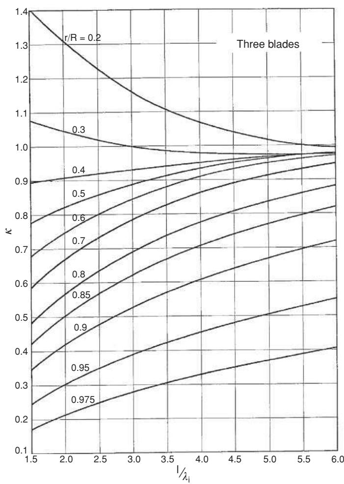

  
Figure 15.4. Goldstein K factors for three- and four-bladed propellers [15.40].

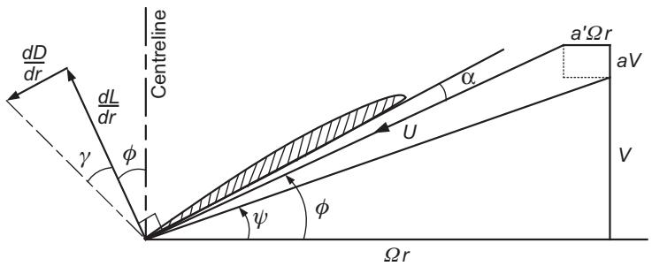

text_image

dD
dr
γ
φ
dl
dr
Centreline
α
U
ψ
φ
Ωr
V
a'Ωr
aV

Figure 15.5. Blade element diagram.

The section lift and drag can be resolved to give the section thrust and torque as follows:

$$
\frac {d T}{d r} = \frac {d L}{d r} \cdot \cos \phi - \frac {d D}{d r} \cdot \sin \phi = \frac {d L}{d r} \cdot \cos \phi (1 - \tan \phi \tan \gamma) \tag {15.14}
$$

$$
\frac {d Q}{d r} = r \left(\frac {d L}{d r} \cdot \sin \phi + \frac {d D}{d r} \cdot \cos \phi\right) = r \frac {d L}{d r} \cos \phi (\tan \phi + \tan \gamma). \tag {15.15}
$$

From the velocity diagram

$$
\begin{array}{l} U = r \Omega (1 - a ^ {\prime}) \sec \phi \\ = \pi n D x (1 - a ^ {\prime}) \sec \phi . \\ \end{array}
$$

Combining Equations (15.14) and (15.9) then,

$$
2 \rho n ^ {2} D ^ {3} \frac {d K _ {T}}{d x} = \frac {1}{2} \rho Z c C _ {L} \cdot \pi^ {2} n ^ {2} D ^ {2} x ^ {2} (1 - a ^ {\prime}) ^ {2} \sec \phi (1 - \tan \phi \cdot \tan \gamma)
$$

$$
d r = \frac {D}{2} d x
$$

$$
\therefore \quad \frac {d K _ {T}}{d x} = \frac {\pi^ {2}}{4} \left(\frac {Z c}{D}\right) C _ {L} \cdot x ^ {2} (1 - a ^ {\prime}) ^ {2} \sec \phi (1 - \tan \phi \cdot \tan \gamma). \tag {15.16}
$$

Similarly, Equation (15.15) becomes

$$
\frac {d K _ {Q}}{d x} = \frac {\pi^ {2}}{8} \left(\frac {Z c}{D}\right) C _ {L} \cdot x ^ {3} (1 - a ^ {\prime}) ^ {2} \sec \phi (\tan \phi + \tan \gamma). \tag {15.17}
$$

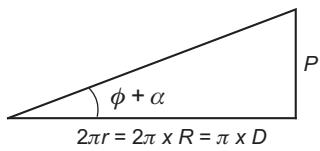

text_image

φ + α
2πr = 2π x R = π x D

Figure 15.6. Pitch angle.

Equations (15.14) and (15.15) can be combined into an alternative equation for local efficiency, as follows:

$$
\eta = \frac {V \frac {d T}{d r}}{\Omega \frac {d Q}{d r}} = \frac {V}{r \Omega}. \frac {1 - \tan \phi \tan \gamma}{\tan \phi + \tan \gamma} = \frac {\tan \psi}{\tan (\phi + \gamma)}. \tag {15.18}
$$

This equation can be expressed in various forms, as follows:

$$
\eta = \frac {\tan \psi}{\tan \phi} \cdot \frac {\tan \phi}{\tan (\phi + \gamma)} = \frac {1 - a ^ {\prime}}{1 + a} \cdot \frac {\tan \phi}{\tan (\phi + \gamma)} \tag {15.19}
$$

or

$$
\eta = \eta_ {a} \times \eta_ {r} \times \eta_ {f}, \tag {15.20}
$$

where $\begin{array} { r } { \eta _ { a } = \frac { 1 } { 1 + a } } \end{array}$ ideal, per actuator disc theory (Froude efficiency), $\eta _ { r } = ( 1 - a ^ { \prime } )$ , the rotational loss factor and η f = tan φtan(φ γ ) $\begin{array} { r } { \eta _ { f } = \frac { \tan \phi } { \tan ( \phi + \gamma ) } } \end{array}$ the blade friction drag loss factor. Typical values are $\eta _ { a } = 0 . 8 0 , \eta _ { r } = 0 . 9 5$ and $\dot { \eta } _ { f } = 0 . 9 0$ , giving an overall $\eta = 0 . 8 \times 0 . 9 5 \times$ $0 . 9 0 = 0 . 6 8$ .

This particular breakdown of the components of open water efficiency is discussed further in Section 11.3.15, when considering propeller efficiency improvements and energy savings.

# 15.5.4 Inflow Factors Derived from Section Efficiency

There are two independently derived equations for η and the combination of these is fundamental to the solution of the blade element-momentum theory. From momentum theory, Equation (15.8),

$$
\eta = \frac {a}{a ^ {\prime}} \cdot \tan^ {2} \psi
$$

From blade element theory, Equation (15.18),

$$
\eta = \frac {\tan \psi}{\tan (\phi + \gamma)}
$$

and ideal efficiency

$$
\eta_ {i} = \frac {\tan \psi}{\tan \phi} = \frac {(1 - a ^ {\prime})}{(1 + a)} (C _ {D} = 0; \gamma = 0)
$$

Hence,

$$
(1 + a) = \frac {(1 - a ^ {\prime})}{\eta_ {i}}
$$

and

$$
a ^ {\prime} = 1 - \eta_ {i} (1 + a). \tag {15.21}
$$

Also, from Equation (15.8),

$$
a ^ {\prime} = \frac {a \tan^ {2} \psi}{\eta}, \tag {15.22}
$$

equating Equations (15.21) and (15.22), as follows:

$$
\frac {a \tan^ {2} \psi}{\eta} = 1 - \eta_ {i} (1 + a)
$$

$$
= 1 - \eta_ {i} - a \eta_ {i}
$$

$$
a \left(\eta_ {i} + \frac {\tan^ {2} \psi}{\eta}\right) = 1 - \eta_ {i}
$$

and finally,

$$
a = \frac {1 - \eta_ {i}}{\eta_ {i} + \frac {1}{\eta} \tan^ {2} \psi}. \tag {15.23}
$$

The overall design procedure, and the derivation of $a , a ^ { \prime } , d K _ { T } / d x$ and $\eta ,$ will normally be an iterative process, typically following the steps shown in Figure 15.7.

Since $C _ { L }$ and $d K _ { T } / d x$ are not very dependent on drag, a common approach is initially to assume $C _ { D } = 0$ , hence $\gamma = 0$ and $\eta = \eta _ { i }$ for a first iteration, and an initial solution for a can be obtained from Equation (15.23). This can be used to derive $d K _ { T } / d x$ from Equation (15.6), hence, $C _ { L }$ from Equation (15.16). $C _ { D }$ can then be introduced to yield $\gamma \left( = \tan ^ { - 1 } C _ { D } / C _ { L } \right)$ and the actual η. The process is then repeated until convergence for η is achieved.

The process described so far is for an element of the propeller span dr at radius $r \left( x = r / R \right)$ . This is repeated over the range of x values $( 0 . 2 0  1 . 0 )$ and total values of $K _ { T } , K _ { Q }$ and η obtained by quadrature.

# 15.5.5 Typical Distributions of a, a′ and $d \kappa _ { T } / d x$

The radial variation of the inflow factors a and $a ^ { \prime }$ has the general form shown in Figure 15.8. Typical values are $a = 0 . 3 – 0 . 4$ and $a ^ { \prime } = 0 . 0 2 – 0 . 0 4$ .

The actual thrust loading $( d K _ { T } / d x )$ curve exhibits the general form shown in Figure 15.9, noting that the presence of the hub holds up the thrust generated towards the root and that, for reasons of structural strength, open water propellers tend to have less thrust per unit span towards the tip.

# 15.5.6 Section Design Parameters

The design of two-dimensional sections for propellers has many similarities to the design of those for lifting surfaces such as rudders or aircraft wings. The main aspects of the flow regime and associated section performance that require understanding are the following:

(i) The local chord-based Reynolds number.   
(ii) The required local camber.   
(iii) The necessary strength required at a given section, for example, the second moment area and associated strength of the material used for construction; this often influences the selected thickness, camber and choice of section type.   
(iv) Likelihood of different types of cavitation.   
(v) Sensitivity to imperfections such as roughness and fouling.

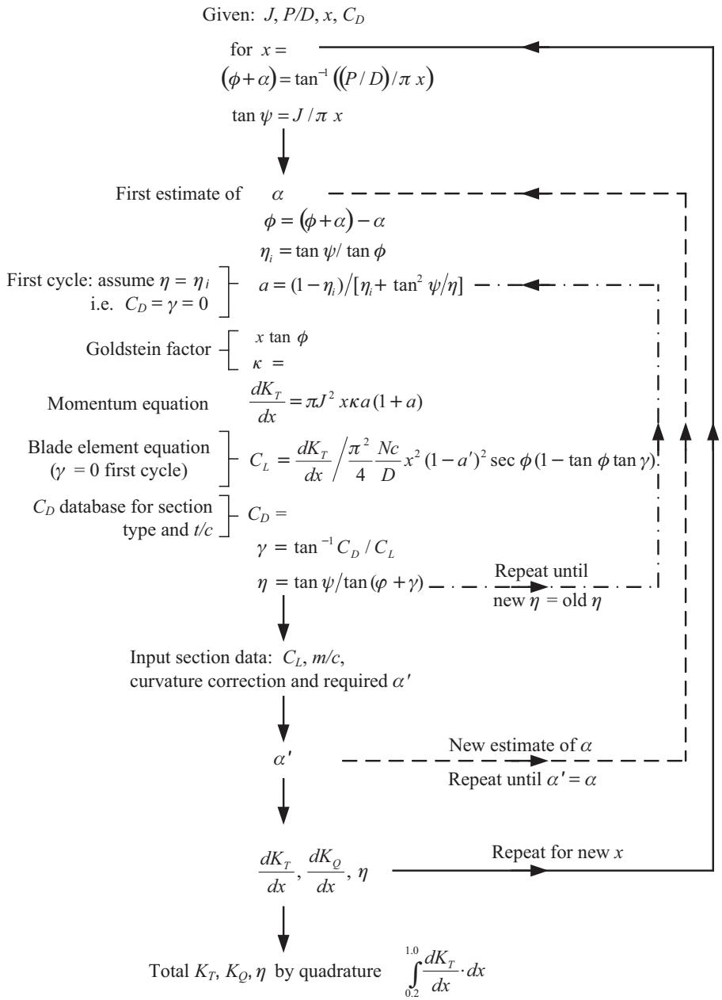

flowchart

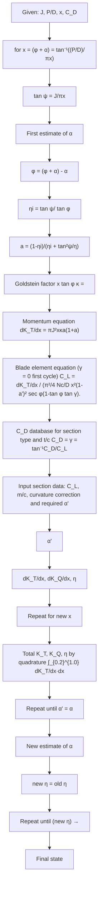
```mermaid
graph TD
    A["Given: J, P/D, x, C_D"] --> B["for x = (φ + α) = tan⁻¹((P/D)/πx)"]
    B --> C["tan ψ = J/πx"]
    C --> D["First estimate of α"]
    D --> E["φ = (φ + α) - α"]
    E --> F["ηi = tan ψ/ tan φ"]
    F --> G["a = (1-ηi)/(ηi + tan²ψ/η)"]
    G --> H["Goldstein factor x tan φ κ ="]
    H --> I["Momentum equation dK_T/dx = πJ²xκa(1+a)"]
    I --> J["Blade element equation (γ = 0 first cycle) C_L = dK_T/dx / (π²/4 Nc/D x²(1-a')² sec φ(1-tan φ tan γ)."]
    J --> K["C_D database for section type and t/c C_D = γ = tan⁻¹C_D/C_L"]
    K --> L["Input section data: C_L, m/c, curvature correction and required α'"]
    L --> M["α'"]
    M --> N["dK_T/dx, dK_Q/dx, η"]
    N --> O["Repeat for new x"]
    O --> P["Total K_T, K_Q, η by quadrature ∫_{0.2}^{1.0} dK_T/dx·dx"]
    P --> Q["Repeat until α' = α"]
    Q --> R["New estimate of α"]
    R --> S["new η = old η"]
    S --> T["Repeat until (new η) →"]
    T --> U["Final state"]
```

Figure 15.7. Flow algorithm for blade element-momentum theory.

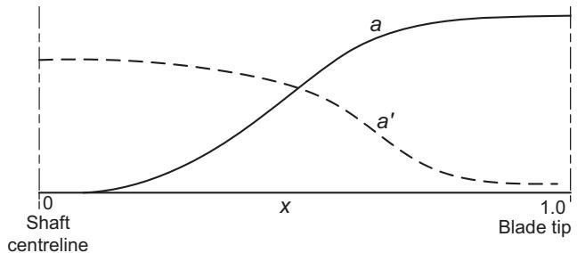

line

| Blade tip | a     | a'    |
| --------- | ----- | ----- |
| 0         | 0.0   | 0.0   |
| x         | 0.5   | 0.2   |
| 1.0       | 1.0   | 0.0   |

Figure 15.8. Distributions of a, a′ on a typical propeller.

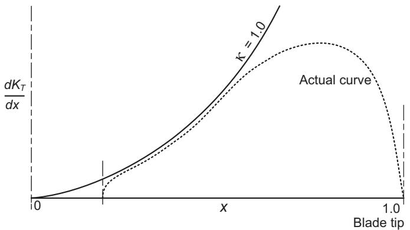

line

| Blade tip | dK_T/dx (k = 1.0) | dK_T/dx (Actual curve) |
| --------- | ----------------- | ---------------------- |
| 0         | 0                 | 0                      |
| x         | ~0.5              | ~0.4                   |
| 1.0       | 0                 | 0                      |

Figure 15.9. Typical distribution of $d K _ { T } / d x .$

Most of these factors, and how they influence the selection of an appropriate section and the design of a specific section, need to be borne in mind when considering section design. Section selection is discussed in Carlton [15.2] and in Molland and Turnock [15.43]. An excellent analysis tool, Xfoil, developed by Drela [15.44], is suitable for foil section design and optimisation.

# 15.5.7 Lifting Surface Flow Curvature Effects

The velocity diagram used in the blade element analysis applies essentially at about blade mid chord of the relatively wide blade (large $c / D$ and BAR) employed for marine propellers. As the flow progresses downstream, the inflow velocities (and, hence, local $a$ and $a ^ { \prime }$ factors) are continuously changing, as shown in Figure 15.10. This is particularly true of $a ^ { \prime }$ which varies rapidly near the propeller. The result is a progressive rotation of the local flow vector as the fluid passes the propeller blade so that the propeller is working in a curving flow, as shown schematically in Figure 15.11.

Because of the flow curvature, the effective camber of the section, Figure 15.12, is reduced and this results in a loss of lift at a fixed angle of attack compared with the two-dimensional section performance in a straight flow, Figure 15.13. This loss in lift can be compensated for by either an increase in camber or a change of angle of attack (i.e. in local pitch), compared with the values from two-dimensional section data. Within the limits imposed by cavitation criteria and possible manufacturing constraints, camber and angle of attack can be considered as interchangeable.

Detailed two-dimensional section data, see for example [15.45], can be used for precise information, but the following values give a broad guide:

$$
\frac {d C _ {L}}{d \alpha} = 0. 1 0 \text {   per   degree } \tag {15.24}
$$

text_image

Far upstream
L.E.
Mid - chord
T.E.
Far downstream

Figure 15.10. Effect of flow acceleration on effective incidence.

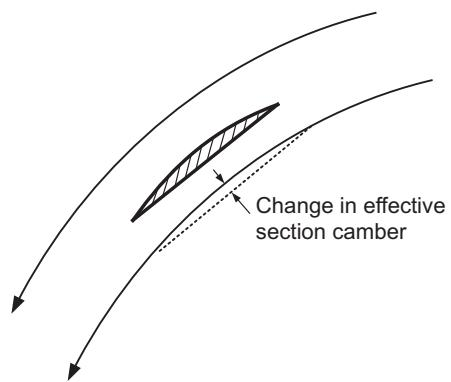

text_image

Change in effective
section camber

Figure 15.11. Change of flow direction with section camber.

is a suitable approximation for most sections.

$$
\frac {d C _ {L}}{d (m / c)} = \begin{array}{l} 9 \text {   NACA   a } = 0. 5 \text {   mean   line } \\ 1 1 \text {   NACA   a } = 0. 7 \text {   mean   line } \\ 1 2 \text {   Round   back   sections } \end{array} \tag {15.25}
$$

where $m / c$ is the maximum camber/chord.

# 15.5.8 Calculations of Curvature Corrections

The earliest curvature corrections were empirical and involved parameters chosen to bring calculated thrust loadings into line with open water test data [15.39, 15.42].

Common practice is to use curvature corrections based on a theoretical model devised by Ludweig and Ginzel [15.46] or further variants of this type of model [15.47]. This model represents the earliest use of a vortex lattice model to represent a marine propeller blade. Curvature corrections derived from this model have been published in various papers. One commonly used correction diagram is that given in Eckhardt and Morgan [15.40], which gives a two-stage correction based on the assumption that the blade sections were designed for $\alpha = 0$ (or to run at $\alpha = \alpha _ { i } )$ .

Figure 15.14 shows an example of a Ludweig–Ginzel chart that gives the camber correction as a function of blade area ratio, where $x = r / R$ and $\lambda _ { i } = x$ tan $\phi .$ . Restrictions on the Ludweig–Ginzel model were as follows:

1. The blade outline was elliptical and symmetric about mid chord.   
2. The chordwise loading was constant $\left( \Delta P = \mathrm { c o n s t a n t } \right)$ corresponding to a NACA $a = 1 . 0$ mean line.   
3. The radial load distribution was that for open water optimum loading.   
4. The calculations were restricted to the induced velocities and rate of change of induced velocities at midchord.

text_image

Camber line
m = camber = t/2
t = thickness    c = chord
m/c = camber ratio

Figure 15.12. Definition of camber.

text_image

(m/c)₂ >(m/c)₁
(m/c)₁
Cₗ
α

Figure 15.13. Change in lift with flow-induced curvature and reduced camber.

Less restrictive curvature corrections have been developed, such as those by Morgan et al. [15.47].

The Ludweig–Ginzel approach may be summarised as follows. The required camber of a propeller at $\alpha = 0$ is obtained as follows:

$$
\frac {m}{c} = k _ {1} k _ {2} \cdot \frac {m _ {o}}{c}, \tag {15.26}
$$

where $m _ { o } / c$ is the camber required to produce the same $C _ { L }$ with straight twodimensional flow. For example, consider a section at $x = 0 . 7 0$ of a propeller $\mathrm { w i t h } \ A _ { D } = 0 . 9 2 0 , \mathrm { p r o d u c i n g } \ C _ { L } = 0 . 1 4 5 \mathrm { a t } \phi = 2 3 . 4 5 ^ { \circ } .$

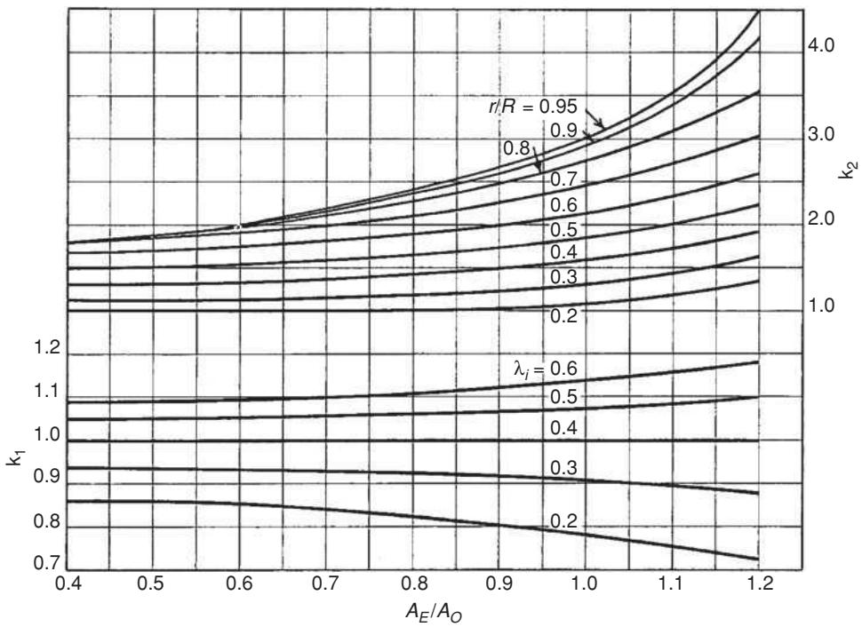

line

| A_E/A_O | k1 (r/R = 0.95) | k1 (λ_i = 0.6) | k1 (λ_i = 0.5) | k1 (λ_i = 0.4) | k1 (λ_i = 0.3) | k1 (λ_i = 0.2) | k1 (λ_i = 0.1) | k1 (λ_i = 0.05) | k1 (λ_i = 0.04) | k1 (λ_i = 0.03) | k1 (λ_i = 0.02) |
| ------- | --------------- | -------------- | -------------- | -------------- | -------------- | -------------- | -------------- | --------------- | --------------- | --------------- | --------------- |
| 0.4     | ~1.2            | ~1.0           | ~0.9           | ~0.8           | ~0.7           | ~0.6           | ~0.5           | ~0.4            | ~0.3            | ~0.2            | ~0.1            |
| 0.5     | ~1.3            | ~1.1           | ~1.0           | ~0.9           | ~0.8           | ~0.7           | ~0.6           | ~0.5            | ~0.4            | ~0.3            | ~0.2            |
| 0.6     | ~1.4            | ~1.2           | ~1.1           | ~1.0           | ~0.9           | ~0.8           | ~0.7           | ~0.6            | ~0.5            | ~0.4            | ~0.3            |
| 0.7     | ~1.5            | ~1.3           | ~1.2           | ~1.1           | ~1.0           | ~0.9           | ~0.8           | ~0.7            | ~0.6            | ~0.5            | ~0.4            |
| 0.8     | ~1.6            | ~1.4           | ~1.3           | ~1.2           | ~1.1           | ~1.0           | ~0.9           | ~0.8            | ~0.7            | ~0.6            | ~0.5            |
| 0.9     | ~1.7            | ~1.5           | ~1.4           | ~1.3           | ~1.2           | ~1.1           | ~1.0           | ~0.9            | ~0.8            | ~0.7            | ~0.6            |
| 1.0     | ~1.8            | ~1.6           | ~1.5           | ~1.4           | ~1.3           | ~1.2           | ~1.1           | ~1.0            | ~0.9            | ~0.8            | ~0.7            |
| 1.1     | ~1.9            | ~1.7           | ~1.6           | ~1.5           | ~1.4           | ~1.3           | ~1.2           | ~1.1            | ~1.0            | ~0.9            | ~0.8            |
| 1.2     | ~2.0            | ~1.8           | ~1.7           | ~1.6           | ~1.5           | ~1.4           | ~1.3           | ~1.2            | ~1.1            | ~1.0            | ~0.9            |

Figure 15.14. Ludweig–Ginzel camber correction coefficients [15.40].

text_image

t/c = 2m/c

Figure 15.15. Use of camber to give a flat back.

$$
\lambda_ {i} = x \tan \phi = 0. 3 0 4, \quad k _ {1} = 0. 9 2 \quad \text { and } k _ {2} = 2. 3,
$$

using Equation (15.25) for a round back (RB) section, $\begin{array} { r } { \frac { m _ { o } } { c } = \frac { 0 . 1 4 5 } { 1 2 } = 0 . 0 1 2 1 } \end{array}$ then at $\alpha = 0 , ~ \frac { m } { c } = 0 . 9 2 ~ \times ~ 2 . 3 ~ \times ~ 0 . 0 1 2 1 = 2 . 1 2 ~ \times ~ 0 . 0 1 2 1 = 0 . 0 2 5 6$ in curved flow. Assume $\alpha = 1 ^ { \circ }$ , then $d C _ { L } = 0 . 1 \times 1 . 0 = 0 . 1 0$ using Equation (15.24) in straight flow. The equivalent camber reduction is $\begin{array} { r } { \delta ( m / c ) = \frac { 0 . 1 0 } { 1 2 } = 0 . 0 0 8 4 } \end{array}$ . Hence, the camber required for operation at $\alpha = 1 ^ { \circ }$ is $m / c = 0 . 0 2 5 6 - 0 . 0 0 8 4 = 0 . 0 1 7 2$ .

This information can be used to designate a round back section whose thickness is $t / c = 2 m / c$ , as shown in Figure 15.15.

In this particular case, camber would be provided by a flat-faced RB section of thickness $t / c = 0 . 0 1 7 2 \times 2 = 0 . 0 3 4 4$ which would be about right at this radius from the strength viewpoint.

The curvature correction applied directly as just a camber correction can lead to hollow-faced sections, Figure 15.16. These have the drawback of being difficult to manufacture and often have poor astern performance.

# 15.5.9 Algorithm for Blade Element-Momentum Theory

Figure 15.7 shows a flow chart for the application of blade element-momentum theory for assessing propeller performance. The overall flow path lends itself to a computer-based process. The Goldstein factors, Figure 15.4, and the Ludweig– Ginzel curvature corrections, Figure 15.14, can be incorporated as curve fits or lookup tables. The drag coefficient can be obtained using Figure 15.17 which shows data derived from Hill [15.39] and Burrill [15.42]. It can be noted that working angles of attack for a blade section are typically up to about $2 ^ { \circ }$ and, over the main working portion of the blade span, the drag coefficient is of the order of $C _ { D } = 0 . 0 0 8 – 0 . 0 1 5$ .

Such an algorithm can be used as part of an optimisation process by supplying the necessary outer loops that supply test values of overall advance ratio J and $P / D$ ratio for each radius. Progressively more sophisticated approaches can be adopted. For example, a constant value of $C _ { D }$ and lift–curve slope can be used, or a look– up table that supplies the two-dimensional values for the local angle of attack and sectional Reynolds number. Such a modification allows the influence of stall and other viscous-related effects to be included within the optimisation process.

Section chord size c (hence BAR) can be chosen for a required local $C _ { L }$ (based on cavitation number) to avoid cavitation. The drag coefficient can be systematically varied to investigate the influence of thickness or roughness on efficiency or the likely influence of scale effect. The radial load distributions can be investigated, such as off-loading the tip by reducing $P / D$ to avoid cavitation and the overall influence on efficiency. The algorithm has been used to derive the velocities a and $a ^ { \prime }$ induced by the propeller across the blade span and to predict the direction and velocity of flow onto a rudder downstream of a propeller [15.48].

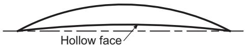

text_image

Hollow face

Figure 15.16. Example of a hollow face.

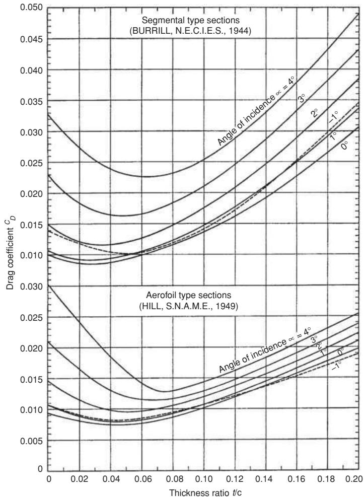

line

| Thickness ratio t/c | BURRILL (Angle of incidence ∝ = 4°) | HILL (Angle of incidence ∝ = 4°) |
| ------------------- | ----------------------------------- | -------------------------------- |
| 0.00                | 0.033                               | 0.021                            |
| 0.02                | 0.028                               | 0.015                            |
| 0.04                | 0.024                               | 0.012                            |
| 0.06                | 0.023                               | 0.010                            |
| 0.08                | 0.024                               | 0.011                            |
| 0.10                | 0.026                               | 0.012                            |
| 0.12                | 0.028                               | 0.013                            |
| 0.14                | 0.030                               | 0.014                            |
| 0.16                | 0.032                               | 0.015                            |
| 0.18                | 0.034                               | 0.016                            |
| 0.20                | 0.036                               | 0.017                            |

Figure 15.17. Blade section drag coefficient data.

The influence of a real ship wake can be included through the use of a modified inflow speed at each radius based on $w _ { T ^ { \prime } }$ , as explained in Chapter 8. This allows a wake-adapted propeller to be found directly using the blade element-momentum theory algorithm.

# 15.6 Propeller Wake Adaption

# 15.6.1 Background

All the necessary elements of a simplified method of designing a marine propeller have been considered, using the blade element-momentum equations, the Goldstein K factor tip loss correction and the Ludweig–Ginzel curvature correction. Provided the blades are not too close to cavitation inception, when more rigorous methods are needed, and provided the blockage due to blade thickness can be ignored (which basically implies a small number of blades), these methods are sufficiently accurate for normal design purposes.

text_image

r₂
r₁

Figure 15.18. Two sample sections efficiency compared at two radii.

One missing parameter is the type of radial load distribution to choose. In most cases, the design is for a propeller to work in a non-uniform wake field behind a ship. The propeller is to be designed for the circumferential average flow conditions at each radius in order to achieve the best overall quasi-propulsive coefficient to minimise the delivered power requirement $P _ { D }$ for a specified effective power $P _ { E }$ .

# 15.6.2 Optimum Spanwise Loading

From the basic equation (see Section 16.1),

$$
\eta_ {D} = \eta_ {o} \times \eta_ {R} \times \eta_ {H} = \eta_ {b} \times \eta_ {H},
$$

where $\eta _ { b } = \eta _ { o } \times \eta _ { R }$ is the efficiency behind the ship. It can be argued using a comparison of load at two radii, as shown in Figure 15.18, as follows:

1. By altering the pitch distribution the load can be redistributed from radius $r _ { 1 }$ to radius $r _ { 2 }$ or vice versa to achieve the desired thrust T.   
2. If the local efficiency $\eta _ { D 1 } > \eta _ { D 2 }$ (i.e. position 2 is more heavily loaded than position 1), then a transfer of load from $r _ { 1 }$ to $r _ { 2 }$ will reduce the overall $\eta _ { D }$ whilst a transfer from $r _ { 2 }$ to $r _ { 1 }$ will improve $\eta _ { D }$ . (Note, $\eta _ { H } = ( 1 - t ) / ( 1 - w _ { T } )$ , $w _ { T 1 } > w _ { T 2 }$ and $\eta _ { H 1 } > \eta _ { H 2 } )$ .   
3. If any pair of radii can be found for which $\eta _ { D 1 } \neq \eta _ { D 2 }$ , then a change of pitch distribution can improve $\eta _ { D }$ overall and hence, as it stands, the propeller will not be optimum.   
4. The only case where no improvement can be made is when $\eta _ { D } = \mathrm { c o n s t a n t }$ from boss to tip.

Thus the propeller is optimum if $\eta _ { D } = \eta _ { b } \cdot \eta _ { H } = \mathrm { c o n s t a n t }$ .

In terms of thrust deduction fraction t and average (circumferential) wake fraction,

$$
\eta_ {b} \cdot \frac {1 - t}{1 - w _ {T}} = \text { constant }. \tag {15.27}
$$

This equation is the Van Manen optimum loading criterion. In the case of a propeller designed for open water $t = w _ { T } = 0$ and then η = constant (for all radii).

The above analysis is a simplification of the situation since it ignores the fact that a change of radial loading also produces a change of local efficiency. In other words, a transfer of load from $r _ { 1 }$ to $r _ { 2 }$ could reverse the inequality $\eta _ { D 1 } < \eta _ { D 2 }$ . A more rigorous argument attributable to Betz results in the following criterion:

$$
\eta_ {o} \sqrt {\eta_ {H}} = \text { constant }. \tag {15.28}
$$

For a lightly loaded propeller, $\begin{array} { r } { \eta = \frac { 1 - a ^ { \prime } } { 1 + a } } \end{array}$ (when γ = 0) or

$$
\eta^ {2} = \frac {(1 - a ^ {\prime}) ^ {2}}{(1 + a) ^ {2}} = \frac {1 - 2 a ^ {\prime}}{1 + 2 a}
$$

if a and $a ^ { \prime }$ are small, so that Equation (15.28) can be written in an alternative form, as follows:

$$
\frac {1 - 2 a ^ {\prime}}{1 + 2 a} \cdot \frac {1 - t}{1 - W _ {T}} = \text { constant. } \tag {15.29}
$$

Both forms can be found in published papers and are referred to either as the Betz condition or as the Lerbs condition. In practical operation, $w _ { T }$ can be measured, but local values of t cannot be easily assessed. Lerbs recommends taking t constant and applying Equation (15.28) in the following form:

$$
\eta_ {0} \propto \sqrt {1 - w _ {T}}. \tag {15.30}
$$

Van Manen prefers to assume, with some theoretical justification, that $( 1 - t )$ ∝ $( 1 - w _ { T } ) ^ { 1 / 4 }$ , in which case Equation (15.27) reduces to

$$
\eta \propto (1 - w _ {T}) ^ {3 / 4}. \tag {15.31}
$$

The differences between pitch distributions and overall performance of propellers designed according to either of these two criteria are generally small. Pitch distributions of propellers designed to fit a normal radial mean wake variation (see Chapter 8) show a 10%–20% pitch reduction towards the boss. The open water optimum is nearly constant pitch as shown schematically in Figure 15.19. A propeller which has a pitch distribution calculated as optimum for a particular wake is said to be a wake-adapted propeller. Wake-adapted propellers should give $\eta _ { R } > 1$ , as they perform better behind the ship than in open water.

It should be noted that in order to suppress the tip vortex and hence to reduce propeller noise, the pitch of naval propellers is frequently reduced below the optimum design at the blade tip. Also, tip loadings for commercial propellers may be reduced to reduce blade stresses and to reduce cavitation and propellerexcited vibration. Off-loading the tip, for example by reducing $P / D$ locally or by changing the blade shape, Figure 15.20, leads to a redistribution of load as shown schematically in Figure 15.21.

line

| X    | Pitch (Wake-adapted) | Pitch (Wageningen B series) |
|------|------------------------|------------------------------|
| 0.2  | ~10%                   | ~10%                         |
| 1.0  | ~10%                   | ~10%                         |

Figure 15.19. Typical pitch distributions.

A worked example for a wake-adapted propeller is included as Example 17 in Chapter 17.

# 15.6.3 Optimum Diameters with Wake-Adapted Propellers

Circumferential average wake values are higher near the boss and, hence, average $\eta _ { H }$ values increase as the propeller diameter is reduced. An optimum $\eta _ { D } = \eta _ { b } \eta _ { H }$ is required and, for slight reductions in diameter, a gain in $\eta _ { H }$ more than offsets a small loss in $\eta _ { b }$ . Thus, the wake-adapted optimum diameter is less than the open water optimum as derived from design charts.

On the basis of optimum diameter calculations from blade element-momentum theory, Burrill [15.49] recommended that diameters computed from open water charts should be reduced as follows: single-screw merchant ships, 8% less (5% less, BSRA recommendation); twin-screw, 3% less; planing hull types, no reduction.

These figures reflect the degree of non-uniformity in each type of wake distribution. Pitch should be increased by about the same percentage that the diameter is reduced.

# 15.7 Effect of Tangential Wake

The origins of tangential wake are described in Chapter 8, Section 8.9. For propellers which operate in a non-zero tangential wake the blade element diagram can be suitably modified. Figure 15.22 includes the necessary modifications. It can be seen that, depending on the sign of the tangential wake $( \pm a ^ { \prime \prime } )$ , the effective incidence will be either reduced or increased. The analysis can be correspondingly modified as follows. $U _ { \tau }$ is taken to be the wake fraction in the plane of propeller and tangential to the radial direction, Figure 15.23. This is equivalent to a local rotation of wake.

text_image

Off-loaded tip

Figure 15.20. Change in shape to reduce propeller tip loading.

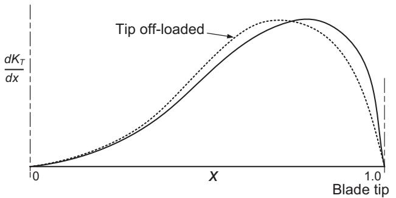

line

| Blade tip | Tip off-loaded |
| --------- | -------------- |
| 0.0       | 0.0            |
| X         | ~0.5           |
| 0.5       | ~0.9           |
| 1.0       | 0.0            |

Figure 15.21. Redistribution of load with propeller tip off-loading.

$$
\begin{array}{l} \text { Tangential   wake   velocity } V _ {T} = U _ {\tau} V _ {S} = \frac {U _ {\tau} V a}{(1 - w _ {T})} \\ = r \Omega a ^ {\prime \prime} \text { say } \\ \end{array}
$$

hence, the wake rotation factor

$$
a ^ {\prime \prime} = \frac {U _ {\tau}}{(1 - w _ {T})} \frac {V _ {a}}{r \Omega} = \frac {U _ {\tau}}{(1 - w _ {T})} \tan \psi
$$

that is a correction to tan $\psi \cdot a ^ { \prime \prime }$ accounts for tangential wake in Figure 15.22.

The momentum equations remain unchanged, whereas the blade element equations now include the additional tangential component with the appropriate sign. Hence, the blade element efficiency Equation (15.18) becomes

$$
\eta = \frac {\tan \psi}{\tan (\phi + \gamma)} = \frac {\tan \psi}{\tan \phi} \cdot \frac {\tan \phi}{\tan (\phi + \gamma)} = \frac {1 - a ^ {\prime \prime} - a ^ {\prime}}{1 + a} \cdot \frac {\tan \phi}{\tan (\phi + \gamma)} \tag {15.32}
$$

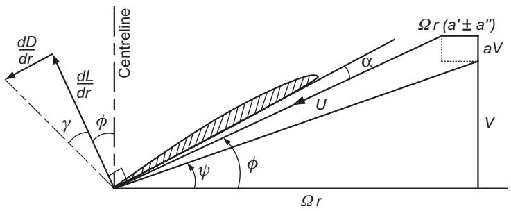

text_image

dD/dr
γ
φ
dl/dr
Centreline
U
ψ
φ
Ω r (a'±a'')
α
V
aV
Ω r

Figure 15.22. Blade velocity diagram including tangential wake.

text_image

Ω
Uτ

Figure 15.23. Definition of $U _ { \tau }$ .

This replaces the earlier equation. The calculation of performance proceeds as for the non-rotating case. For example, for a downgoing blade (with upward flow), the blade element equations change as follows:

$$
\eta_ {i} = \frac {1 - a ^ {\prime} + a ^ {\prime \prime}}{1 + a}, \quad \text { and } \quad \eta = \frac {a}{a ^ {\prime}} \tan^ {2} \psi
$$

giving

$$
a = \frac {1 - \eta_ {i} + a ^ {\prime \prime}}{\eta_ {i} + \frac {1}{\eta} \tan^ {2} \psi}
$$

and, neglecting friction

$$
\frac {d K _ {T}}{d x} = \pi x K J ^ {2} a (1 + a) = \frac {\pi x}{2} \left(\frac {C \cdot Z}{D}\right) \left(1 - a ^ {\prime} + a ^ {\prime \prime}\right) \sec \phi C _ {L}
$$

where

$$
\tan \phi = \frac {1 + a}{1 - a ^ {\prime} + a ^ {\prime \prime}} \tan \psi .
$$

For an upgoing blade, the sign would change $\mathrm { t o } - a ^ { \prime \prime }$ .

# 15.8 Examples Using Blade Element-Momentum Theory

# 15.8.1 Approximate Formulae

The following approximate formulae, based on one section only, are useful for preliminary calculations. Simple estimates can be made using one representative propeller section only, for example, at $x = 0 . 7 0$ , and estimating the overall performance from the data at this section using a standard approximation to the $\bar { \frac { d K _ { T } } { d x } }$ and $\textstyle { \frac { d K _ { Q } } { d x } }$ curves.

Such estimates frequently assume that $\begin{array} { r } { \frac { d K _ { T } } { d x } \propto x ^ { 2 } \sqrt { 1 - x } } \end{array}$ and that dKQ $\textstyle { \frac { d K _ { Q } } { d x } }$ also varies in this way.

The section $x = 0 . 7 0$ is chosen as the basis. On this basis and assuming a normal boss radius $( x = 0 . 2 0 )$ , it is found that the propeller coefficients are as follows:

$$
K _ {T} = 0. 5 5 9 \left(\frac {d K _ {T}}{d x}\right) _ {x = 0. 7} \tag {15.33}
$$

and

$$
K _ {Q} = 0. 5 5 9 \left(\frac {d K _ {Q}}{d x}\right) _ {x = 0. 7}. \tag {15.34}
$$

Propeller outlines vary somewhat, but a typical blade width at $x = 0 . 7 0$ is as follows:

$$
\left(\frac {Z \cdot c}{D}\right) _ {x = 0.7} = 2.2 A _ {D} \pm 5 \%, \tag{15.35}
$$

where Z is the number of blades and $A _ { D }$ is the developed blade area ratio  Blade area ratio (BAR).

# 15.8.2 Example 1

An example of an approximate preliminary performance estimate (excluding detailed section design) follows.

Consider section $x = 0 . 7 0$ on a propeller with $P / D = 1 . 0$ operating at $J = 0 . 7 0$ and $\alpha = 1 . 0 ^ { \circ }$ .

From Equation (15.11),

$$
\tan \psi = \frac {J}{\pi x} = 0. 3 1 8 3.
$$

From vector diagram,

$$
\tan (\phi + \alpha) = \frac {P / D}{\pi x} = 0. 4 5 4 7,
$$

$$
\therefore \phi + \alpha = 2 4. 4 5 ^ {\circ}
$$

$$
\phi = 2 3. 4 5 ^ {\circ}.
$$

Assumed section data are as follows:

$C _ { L } = 0 . 1 4 5$ (chosen to suit cavitation number).

$C _ { D } = 0 . 0 1 0$ (from section data).

$\alpha = 1 . 0 ^ { \circ }$ (to suit required CL).

From tan $\gamma = C _ { D } / C _ { L } , \gamma = 3 . 9 5 ^ { \circ } .$

From Equation (15.18), η f = tan(φ γ ) $\begin{array} { r } { \eta _ { f } = \frac { \tan \phi } { \tan ( \phi + \gamma ) } = 0 . 8 3 7 . } \end{array}$ tan φ

$$
\eta_ {i} = \frac {1 - a ^ {\prime}}{1 + a} = \frac {\tan \psi}{\tan (\phi + \gamma)} = 0. 7 3 4 \quad (\text { with } \gamma = 0)
$$

and overall efficiency $\eta = \eta _ { i } \times \eta _ { f } = 0 . 6 1 4 .$

From Equation (15.23), $\begin{array} { r } { a = \frac { 1 - \eta _ { i } } { \eta _ { i } + \tan ^ { 2 } \psi / \eta } = 0 . 2 9 6 } \end{array}$

and $\begin{array} { r } { a ^ { \prime } = \frac { a } { n } \cdot \tan ^ { 2 } \psi = 0 . 0 4 8 8 . } \end{array}$

λi x tan φ  x tan 23.45  0.304.

From the Goldstein chart for a three-bladed propeller, Figure $1 5 . 4 ( \mathrm { a } ) , K = 0 . 8 2$ .

From Equation (15.6), $\begin{array} { r } { \frac { d K _ { T } } { d x } = \pi J ^ { 2 } x K a ( 1 + a ) = 0 . 3 3 9 . } \end{array}$

From Equation (15.33) estimated overall $K _ { T } = 0 . 5 5 9 \times 0 . 3 3 9 = 0 . 1 9 0 .$

From Equation (15.7), $\begin{array} { r } { \frac { d K _ { Q } } { d x } = \frac { \pi ^ { 2 } } { 2 } J x ^ { 3 } K a ^ { \prime } ( 1 + a ) = 0 . 0 6 1 5 . } \end{array}$ dx

From Equation (15.34), estimated overall $K _ { O } = 0 . 5 5 9 \times 0 . 0 6 1 5 = 0 . 0 3 4 4 .$

From Equation (15.16)

$$
\frac {d K _ {T}}{d x} = \frac {\pi^ {2}}{4} \left(\frac {Z c}{D}\right) C _ {L} x ^ {2} (1 - a ^ {\prime}) ^ {2} \sec \phi (1 - \tan \phi \tan \gamma).
$$

Hence, $Z c / D = 2 . 0 2 1$

From Equation (15.35), estimated $A _ { D } ( = \mathbf { B } \mathbf { A } \mathbf { R } ) = 0 . 9 2 0$ .

In summary, the estimate indicates the following performance from a propeller with $A _ { D } = 0 . 9 2$ :

$$
P / D = 1. 0 \text {   at   } J = 0. 7 0: K _ {T} = 0. 1 9 0, K _ {Q} = 0. 0 3 4 4, \eta = 0. 6 1 4.
$$

This can be compared with the Gawn series $A _ { D } = 0 . 9 2$ (interpolating for $\mathbf { B A R } =$ $0 . 8 0 \mathrm { - } 0 . 9 5 ) , K _ { T } = 0 . 1 8 8 , K _ { O } = 0 . 0 3 4 , \eta = 0 . 6 3 0 .$ .

# 15.8.3 Example 2

These calculations exclude detailed section design: given $J , P / D$ or $\eta _ { i } , C _ { D }$ . Design for given α, e.g. if given $P / D$ ,

$$
(\phi + \alpha) = \tan^ {- 1} \frac {P / D}{\pi x}.
$$

$$
\phi = (\phi + \alpha) - \alpha .
$$

$\mathrm { h e n c e ~ t a n } \phi \quad \mathrm { a n d } \quad \tan \psi = J / \pi x .$

$$
\eta_ {i} = \tan \psi / \tan \phi .
$$

If given ηi ,

$$
\tan \phi = \tan \psi / \eta_ {i}.
$$

$$
\phi = \tan^ {- 1} (\tan \psi / \eta_ {i}) (\phi + \alpha) = \phi + \alpha \quad \text { and } \quad \frac {P / D}{\pi x} = \tan^ {- 1} (\phi + \alpha),
$$

hence, $P / D$ for required $\eta _ { i }$ .

EXAMPLE. Given the data below (for $x = 0 . 7 0 )$ calculate $d K _ { T } / d x , C _ { L }$ and the overall section efficiency at radius $x = 0 . 7 0$ for a propeller designed to operate at $J = 0 . 6 5$ , $P / D = 0 . 8 5 , Z \cdot c / D = 1 . 5 0 , \alpha = 0 . 5 0 ^ { 0 } , C _ { D } = 0 . 0 1 0$ ,

$$
\tan (\phi + \alpha) = \frac {P / D}{\pi x} = \frac {0 . 8 5}{\pi \times 0 . 7} = 0. 3 8 6 5,
$$

$$
(\phi + \alpha) = 2 1. 1 3 ^ {\circ}.
$$

$\alpha = 0 . 5 0 ^ { \circ }$ given

$$
\text { Then } \phi = 2 0. 6 3 ^ {\circ} \quad \{\tan \phi = 0. 3 7 6 \}
$$

$$
\tan \psi = J / \pi x = 0. 6 5 / \pi \times 0. 7 0 = 0. 2 9 6.
$$

$$
\eta_ {i} = \tan \psi / \tan \phi = \frac {0 . 2 9 6}{0 . 3 7 6} = 0. 7 8 6.
$$

Using Equation (15.23),

$$
a = \frac {1 - \eta_ {i}}{\eta_ {i} + \tan^ {2} \psi / \eta}.
$$

Blade drag loss has a relatively small influence on the working values of $C _ { L }$ and $\alpha ,$ hence initially assume $\gamma = 0 , ( C _ { D } = 0 )$ and $\eta = \eta _ { i }$ . Hence, the first estimate of a is as follows:

$$
a = (1 - 0. 7 8 6) / \left(0. 7 8 6 + \frac {0 . 2 9 6 ^ {2}}{0 . 7 8 6}\right) = 0. 2 3 8 4 \quad \{0. 2 3 1 9 \}
$$

$\lambda _ { i } = x$ tan $\phi = 0 . 7 \times 0 . 3 7 6 = 0 . 2 6 3$ and $1 / \lambda _ { i } = 3 . 8 .$ .

From the Goldstein chart for four blades, Figure 15.4(b), K = 0.92, then

$$
\frac {d K _ {T}}{d x} = \pi J ^ {2} x K a (1 + a) = 0. 2 5 2 4 \quad \{0. 2 4 4 1 \}
$$

also

$$
\frac {d K _ {T}}{d x} = \frac {\pi^ {2}}{4} \left(\frac {Z c}{D}\right) C _ {L} x ^ {2} (1 - a ^ {\prime}) ^ {2} \phi \quad (\text { assuming } \gamma = 0)
$$

$$
[ \text { and } (1 - a ^ {\prime}) = \eta_ {i} (1 + a) = 0. 9 7 3 4 ] \quad \{0. 9 6 8 3 \},
$$

whence

$$
C _ {L} = 0. 1 3 7 5 \quad \{0. 1 3 4 3 \}
$$

$$
\tan \gamma = \frac {C _ {D}}{C _ {L}} = \frac {0 . 0 1}{0 . 1 3 7 5} = 0. 0 7 2 7 \quad \{0. 0 7 4 4 6 \}
$$

and

$$
\gamma = 4. 1 6 0 ^ {\circ} \quad \{4. 2 5 8 ^ {\circ} \}
$$

As an approximate correction for blade drag write:

$$
\text {(see Equation (15.16))} \quad \frac {d K _ {T}}{d x} = 0. 2 5 2 4 \times (1 - \tan \phi \tan \gamma) = 0. 2 4 5 5
$$

and overall

$$
\eta = \frac {\tan \psi}{\tan (\phi + \gamma)} = 0. 6 4 1 \qquad \{0. 6 3 8 \}
$$

or iterate with a new value of η, hence, new $^ { a , }$ and correct $\textstyle { \frac { d K _ { T } } { d x } } = 0 . 2 4 4 1$ etc. The second iteration is shown in {braces}.

# 15.8.4 Example 3

The previous calculations are extended to include section design and derivation of required α.

Estimate $K _ { T } , K _ { Q } , \eta$ at $J = 1 . 2 0$ for a three-bladed propeller with $A _ { D } = 0 . 9 5$ , $P / D = 1 . 4 0$ . Approximate geometric data at $x = 0 . 7 0 $ , from Equation (15.35):

$$
\frac {Z c}{D} = 2. 0 9 (\text { i.e. } = 2. 2 \times A _ {D}).
$$

Assume section camber $m / c = 0 . 0 1 7 5 \ : ( \mathrm { i . e . \ : } t / c = 3 1 _ { 2 } \%$ for round back or segmental section) and assume $C _ { D } = 0 . 0 0 8$ for this section thickness/type.

$$
(\phi + \alpha) = \tan^ {- 1} \frac {P / D}{\pi x} = 3 2. 4 8 ^ {\circ}
$$

at

$$
J = 1. 2 0, \tan \psi = J / \pi x = 0. 5 4 5 7.
$$

Working values of $C _ { L }$ and α are affected very little by blade drag, so initially assume $\gamma = 0 .$

The calculations are carried out per Table $1 5 . 2 . \ \alpha ^ { \prime }$ is the incidence required to produce the $C _ { L }$ value. $( m / c ) _ { \alpha = 0 }$ is derived from Equation (15.25) and using a Ludweig–Ginzel curvature correction and noting assumed $m / c = 0 . 0 1 7 5 . { \ : } K$ comes from the Goldstein chart.

In general, two to three iterations are all that are needed. From the third estimate in Table 15.2:

$$
\tan \gamma = \frac {C _ {D}}{C _ {L}} = 0. 0 0 8 / 0. 0 9 9 9 = 0. 0 8 0
$$

$$
\therefore \quad \gamma = 4. 5 8 ^ {\circ}.
$$

From Equation (15.18) the section efficiency can be computed as follows:

$$
\eta = \tan \psi / \tan (\phi + \gamma) = \frac {0 . 5 4 5 7}{\tan (3 2 . 2 2 + 4 . 5 8)} = 0. 7 2 9.
$$

From Equation (15.16), the effect of drag is to reduce dKT by a factor (1 − $\textstyle { \frac { d K _ { T } } { d x } }$ $( 1 -$ tan φ tan γ ) from which the final estimate of $\frac { d \bar { K _ { T } } } { d x }$ is as follows:

$$
\frac {d K _ {T}}{d x} = 0. 2 7 6 0 (1 - \tan (3 2. 2 2) \tan (4. 5 8)) = 0. 2 6 2 1
$$

and $K _ { T } = 0 . 5 5 9 \times 0 . 2 6 2 1 = 0 . 1 4 7$ and, from the general equation, $\begin{array} { r } { K _ { Q } = \frac { J K _ { T } } { 2 \pi \eta } = } \end{array}$ 2πη 0.0384, or repeat the whole cycle using η in Equation (15.23) to derive updated a (including drag), hence dKTdx . The method is shown in the full analysis path in Fig- $\textstyle { \frac { d K _ { T } } { d x } }$ ure 15.7.

In this and the previous examples, for a more reliable estimate of total $K _ { T }$ and $K _ { Q } ,$ , the whole procedure should be repeated at each radius and overall values should be derived by quadrature.

A calculation to derive $\alpha ^ { \prime }$ in the first iteration, with assumed $m / c = 0 . 0 1 7 5$ , is as follows:

First iteration: required $C _ { L } = 0 . 1 0 7 4$ .

Assuming $\begin{array} { r } { \frac { d C _ { L } } { d ( m / c ) } = 1 2 } \end{array}$ , Equation (15.25).

Camber required (for $C _ { L } = 0 . 1 0 7 4$ and $\lambda _ { i } = x$ tan $\phi = 0 . 4 4 6 )$ is as follows:

$$
(m / c) _ {\alpha = 0} = \frac {C _ {L}}{1 2} \times k _ {1} \times k _ {2} = \frac {0 . 1 0 7 4}{1 2} \times 1. 0 3 \times 2. 3 = 0. 0 2 1 2,
$$

$( k _ { 1 } , k _ { 2 }$ from Figure 15.14),

but actual camber  0.0175.

Then, camber $\mathrm { ^ { * } d e f i c i t ^ { * } } = 0 . 0 2 1 2 - 0 . 0 1 7 5 = 0 . 0 0 3 7 .$

Table 15.2. Iterations for α 

<table><tr><td rowspan="2"></td><td colspan="10">Equation No.</td></tr><tr><td></td><td></td><td>15.18</td><td>15.23</td><td></td><td></td><td>15.6</td><td>15.16</td><td>15.25</td><td>15.24</td></tr><tr><td>Item</td><td> $\alpha$ </td><td> $\phi$ </td><td> $\eta_i$ </td><td>a</td><td>x tan  $\phi$ </td><td>K</td><td> $\frac{dK_T}{dx}$ </td><td> $C_L$ </td><td> $(m/c)_{\alpha=0}$ </td><td> $\alpha'$ </td></tr><tr><td>1st estimate</td><td>0</td><td>32.48</td><td>.8572</td><td>.1185</td><td>.446</td><td>.705</td><td>.2959</td><td>.1074</td><td>.0212</td><td>0.440</td></tr><tr><td>2nd estimate</td><td> $0.5^\circ$ </td><td>31.98</td><td>.8745</td><td>.1033</td><td>.437</td><td>.711</td><td>.2567</td><td>.0926</td><td>.0183</td><td> $0.09^\circ$ </td></tr><tr><td>3rd estimate</td><td> $0.26^\circ$ </td><td>32.22</td><td>.8659</td><td>.1108</td><td>.441</td><td>.708</td><td>.2760</td><td>.0999</td><td>.0197</td><td> $0.27^\circ$ </td></tr></table>

The deficit is required to be made up by the incidence ‘deficit’ of lift $( C _ { L } ) =$ $0 . 0 0 3 7 \times 1 2 = 0 . 0 4 4$ . From Equation (15.24) $\begin{array} { r } { \frac { d C _ { L } } { d \alpha } = 0 . 1 } \end{array}$ dα , and the incidence required $\alpha ^ { \prime } = 0 . 0 4 4 / 0 . 1 = 0 . 4 4 ^ { \circ }$ (see first row of Table 15.2).

Further example applications of blade element-momentum theory are given in Chapter 17, Example Application 23.

# REFERENCES (CHAPTER 15)

15.1 Breslin, J.P. and Anderson, P. Hydrodynamics of Ship Propellers. Cambridge Ocean Technology Series, Cambridge University Press, Cambridge, UK, 1996.   
15.2 Carlton, J.S. Marine Propellers and Propulsion. 2nd Edition, Butterworth-Heinemann, Oxford, UK, 2007.   
15.3 Pashias, C. Propeller tip vortex capture using adaptive grid refinement with vortex identification. PhD thesis, University of Southampton, 2005.   
15.4 Rankine, W.J.M. On the mechanical principles of the action of propellers. Transactions of the Institution of Naval Architects, Vol. 6, 1865, pp. 13–39.   
15.5 Froude, R.E. On the part played in propulsion by differences in fluid pressure. Transactions of the Royal Institution of Naval Architects, Vol. 30, 1889, pp. 390–405.   
15.6 Froude, W. On the elementary relation between pitch, slip and propulsive efficiency. Transactions of the Institution of Naval Architects, Vol. 19, 1878, pp. 47–65.   
15.7 Betz, A. Schraubenpropeller mit geringstem Energieverlust. K. Ges. Wiss, Gottingen Nachr. Math.-Phys., 1919, pp. 193–217.   
15.8 Goldstein, S. On the vortex theory of screw propellers. Proceedings of the Royal Society, London Series A, Vol. 123, 1929, pp. 440–465.   
15.9 Prandtl, L. Application of modern hydrodynamics to aeronautics. NACA Annual Report, 7th, 1921, pp. 157–215.   
15.10 Lerbs, H.W. Moderately loaded propellers with a finite number of blades and an arbitrary distribution of circulation. Transactions of the Society of Naval Architects and Marine Engineers, Vol. 60, 1952, pp. 73–123.   
15.11 Sparenberg, J.A. Application of lifting surface theory to ship screws. Proceedings of the Koninhlijke Nederlandse Akademie van Wetenschappen, Series B, Physical Sciences, Vol. 62, No. 5, 1959, pp. 286–298.   
15.12 Pien, P.C. The calculation of marine propellers based on lifting surface theory. Journal of Ship Research, Vol. 5, No. 2, 1961, pp. 1–14.   
15.13 Kerwin, J.E. The solution of propeller lifting surface problems by vortex lattice methods. Report, Department Ocean Engineering, MIT, 1979.   
15.14 van Manen J.D. and Bakker A.R. Numerical results of Sparenberg’s lifting surface theory of ship screws. Proceedings of 4th Symposium on Naval Hydrodynamics, Washington, DC, 1962, pp. 63–77.

15.15 English J.W. The application of a simplified lifting surface technique to the design of marine propellers. National Physical Laboratory, Ship Division Report, 1962.   
15.16 Brockett, T.E. Lifting surface hydrodynamics for design of rotating blades. Proceedings of SNAME Propellers ’81 Symposium, Virginia, 1981.   
15.17 Greeley, D.S. and Kerwin, J.E. Numerical methods for propeller design and analysis in steady flow. Transactions of the Society of Naval Architects and Marine Engineers, Vol. 90, 1982, pp. 415–453.   
15.18 Hess, J.L. and Valarezo, W.O. Calculation of steady flow about propellers by means of a surface panel method. AIAA Paper No. 85-0283, 1985.   
15.19 Kim, H.T. and Stern, F. Viscous flow around a propeller-shaft configuration with infinite pitch rectangular blades. Journal of Propulsion and Power, Vol. 6, No. 4, 1990, pp. 434–444.   
15.20 Uto, S. Computation of incompressible viscous flow around a marine propeller. Journal of Society of Naval Architects of Japan, Vol. 172, 1992, pp. 213– 224.   
15.21 Stanier, M.J. Design and evaluation of new propeller blade section, 2nd International STG Symposium on Propulsors and Cavitation, Hamburg, Germany, 1992.   
15.22 Stanier, M.J. Investigation into propeller skew using a ‘RANS’ code. Part 1: Model scale. International Shipbuilding Progress, Vol. 45, No. 443, 1998, pp. 237–251.   
15.23 Stanier, M.J. Investigation into propeller skew using a ‘RANS’ code. Part 2: Scale effects. International Shipbuilding Progress, Vol. 45, No. 443, 1998, pp. 253–265.   
15.24 Chen, B. and Stern, F. RANS simulation of marine-propulsor P4119 at design condition, 22nd ITTC Propulsion Committee Propeller RANS/PANEL Method Workshop, Grenoble, April 1998.   
15.25 Maksoud, M., Menter, F.R. and Wuttke, H. Numerical computation of the viscous flow around Series 60 CB=0.6 ship with rotating propeller. Proceedings of 3rd Osaka Colloquium on Advanced CFD Applications to Ship Flow and Hull Form Design, Osaka, Japan, 1998, pp. 25–50.   
15.26 Maksoud, M., Menter F., Wuttke, H. Viscous flow simulations for conventional and high-skew marine propellers. Ship Technology Research, Vol. 45, 1998.   
15.27 Jessup, S. Experimental data for RANS calculations and comparisons (DTMB4119. 22nd ITTC Propulsion Committee, Propeller RANS/Panel Method Workshop, Grenoble, France, April 1998.   
15.28 Bensow, R.E. and Liefvendahl, M. Implicit and explicit subgrid modelling in LES applied to a marine propeller. 38th Fluid Dynamics Conference, AIAA Paper, 2008-4144, 2008.   
15.29 Kim, K., Turnock, S.R., Ando, J., Becchi, P., Minchev, A., Semionicheva, E.Y., Van, S.H., Zhou, W.X. and Korkut, E. The Propulsion Committee: final report and recommendations. The 25th International Towing Tank Conference, Fukuoka, Japan, 2008.   
15.30 Phillips, A.B., Turnock, S.R. and Furlong, M.E. Evaluation of manoeuvring coefficients of a self-propelled ship using a blade element momentum propeller model coupled to a Reynolds Averaged Navier Stokes flow solver. Ocean Engineering, Vol. 36, 2009, pp. 1217–1225.   
15.31 Liu, Z. and Young, Y.L. Utilization of bend-twist coupling for performance enhancement of composite marine propellers, Journal of Fluids and Structures, 25(6), 2009, pp. 1102–1116.   
15.32 Turnock, S.R. Technical manual and user guide for the surface panel code: PALISUPAN. University of Southampton, Ship Science Report No. 100, 66 p., 1997.

15.33 Turnock, S.R. Prediction of ship rudder-propeller interaction using parallel computations and wind tunnel measurements. PhD thesis, University of Southampton, 1993.   
15.34 Gutsche, F, Die induction der axialen strahlzusatgescnwindigheit in der umgebung der shcraubenebene. Schiffstecknik, No. 12/13, 1955.   
15.35 Young, Y.L. and Kinnas, S.A. Analysis of supercavitating and surfacepiercing propeller flows via BEM. Computational Mechanics, Vol. 32, 2003, pp. 269–280.   
15.36 Turnock, S.R., Pashias, C. and Rogers, E. Flow feature identification for capture of propeller tip vortex evolution. Proceedings of the 26th Symposium on Naval Hydrodynamics. Rome, Italy, INSEAN Italian Ship Model Basin / Office of Naval Research, 2006, pp. 223–240.   
15.37 Phillips, A.B. Simulations of a self propelled autonomous underwater vehicle. Ph.D. thesis, University of Southampton, 2010.   
15.38 Pemberton, R.J., Turnock, S.R., Dodd, T.J. and Rogers, E. A novel method for identifying vortical structures. Journal of Fluids and Structures, Vol. 16, No. 8, 2002, pp. 1051–1057.   
15.39 Hill, J.G. The design of propellers. Transactions of the Society of Naval Architects and Marine Engineers, Vol. 57, 1949, pp. 143–192.   
15.40 Eckhardt, M.K. and Morgan, W.B. A propeller design method. Transactions of the Society of Naval Architects and Marine Engineers, Vol. 63, 1955, pp. 325–374.   
15.41 O’Brien, T.P. The Design of Marine Screw Propellers. Hutchinson & Co., London, 1967.   
15.42 Burrill, L.C. Calculation of marine propeller performance characteristics. Transactions of North East Coast Institution of Engineers and Shipbuilders, Vol. 60, 1944.   
15.43 Molland, A.F., and Turnock, S.R. Marine Rudders and Control Surfaces. Butterworth-Heinemann, Oxford, UK, 2007.   
15.44 Drela, M. Xfoil: an analysis and design system for low Reynolds number aerofoils. Conference on Low Reynolds Number Airfoil Aerodynamics. University of Notre Dame, Indiana, 1989.   
15.45 Abbott, I.H. and Von Doenhoff, A.E. Theory of Wing Sections. Dover Publications, New York, 1958.   
15.46 Ginzel, G.I. Theory of the broad–bladed propeller, ARC, Current Papers, No. 208, Her Majesty’s Stationery Office, London, 1955.   
15.47 Morgan, W.B., Silovic, V. and Denny, S.B. Propeller lifting surface corrections. Transactions of the Society of Naval Architects and Marine Engineers, Vol. 76, 1968, pp. 309–347.   
15.48 Molland, A.F. and Turnock, S.R. A compact computational method for predicting forces on a rudder in a propeller slipstream. Transactions of the Royal Institution of Naval Architects. Vol. 138, 1996, pp. 227–244.   
15.49 Burrill, L.C. The optimum diameter of marine propellers: A new design approach. Transactions of North East Coast Institution of Engineers and Shipbuilders, Vol. 72, 1955, pp. 57–82.

# 16 Propulsor Design Data

# 16.1 Introduction

# 16.1.1 General

The methods of presenting propeller data are described in Section 12.1.3. A summary of the principal propulsor types is given in Chapter 11. It is important to note that different propulsors are employed for different overall design and operational requirements. For example, a comparison of different propulsors based solely on efficiency is shown in Figure 16.1, [16.1]. This does not, however, take account of other properties such as the excellent manoeuvring capabilities of the vertical axis propeller, the mechanical complexities of the highly efficient contra-rotating propeller or the restriction of the higher efficiency of the ducted propeller to higher thrust loadings.

As described in Chapter 2, the propeller quasi-propulsive coefficient $\eta _ { D }$ can be written as follows:

$$
\eta_ {D} = \eta_ {O} \times \eta_ {H} \times \eta_ {R}, \tag {16.1}
$$

where $\eta _ { O }$ is the propeller open water efficiency, and $\eta _ { H }$ is the hull efficiency, defined as follows:

$$
\eta_ {H} = \frac {(1 - t)}{(1 - w _ {T})}, \tag {16.2}
$$

where t is the thrust deduction factor, and $w _ { T }$ is the wake fraction. $\eta _ { R }$ is the relative rotative efficiency. Data for the components of $\eta _ { H }$ and $\eta _ { R }$ are included in Section 16.3.

Section 16.2 describes design data and data sources for $\eta _ { O }$ . The propulsors have been divided into a number of categories. Sources of data for the various categories are described. Examples and applications of the data are provided where appropriate.

# 16.1.2 Number of Propeller Blades

An early design decision concerns the choice of the number of blades. The number of blades is governed mainly by the effects of propeller-excited vibration and, in particular, vibration frequencies. Such excitation occurs due to the non-uniform nature of the wake field, see Chapter 8. Propeller forces are transmitted to the hull through bearing forces via the stern bearing, and hull surface forces which are transmitted from the pressure field that rotates with the propeller. Exciting frequencies arising are the blade passage frequency (rpm) and multiples of blade number (rpm × Z). For example, a four-bladed propeller running at 120 rpm would excite at 120 cpm, 480 cpm, 960 cpm, etc. For a propeller with an even number of blades, the most important periodic loads are T and Q which would excite shaft vibration or torsional hull vibration. For a propeller with an odd number of blades, the vertical and horizontal forces and moments, $F _ { V } , M _ { V } , F _ { H }$ and $M _ { H }$ , will be dominant, leading to vertical or horizontal hull vibration. Changing the number of blades can therefore cure one problem but create another. Estimates will normally be made of hull vibration frequencies (vertical, horizontal and torsional) and propeller-rpm (and multiples) chosen to avoid these frequencies. A more detailed discussion of propeller-excited vibration can be found in [16.2–16.4]. From the point of view of propeller efficiency at the design stage, changes in blade number do not lead to large changes in open water efficiency η0. Four blades are the most common, and changing to three blades would typically lead to an increase in efficiency of about 3% for optimum diameter (1% for non-optimum diameter), whilst changing to five blades would typically lead to a reduction in efficiency of about 1% [16.5]. The magnitude of such efficiency changes can be estimated using, say, the Wageningen Series data for two to seven blades, Section 16.2.1.

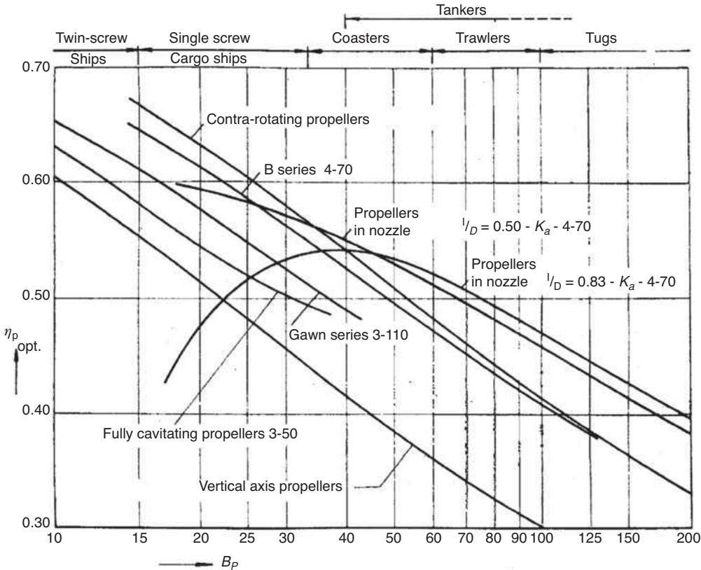

line

| Ship Type              | Bp  | ηp_opt. |
| ---------------------- | --- | ------- |
| Twin-screw             | 10  | 0.60    |
| Single screw           | 15  | 0.58    |
| Cargo ships            | 20  | 0.55    |
| Coasters               | 25  | 0.52    |
| Trawlers               | 30  | 0.50    |
| Tugs                   | 40  | 0.48    |
| Contra-rotating propellers | 10  | 0.65    |
| B series 4-70          | 15  | 0.62    |
| Propellers in nozzle   | 20  | 0.58    |
| Propellers in nozzle   | 30  | 0.55    |
| Propellers in nozzle   | 40  | 0.52    |
| Propellers in nozzle   | 50  | 0.50    |
| Propellers in nozzle   | 60  | 0.48    |
| Propellers in nozzle   | 70  | 0.46    |
| Propellers in nozzle   | 80  | 0.44    |
| Propellers in nozzle   | 90  | 0.42    |
| Propellers in nozzle   | 100 | 0.40    |
| Gawn series 3-110      | 15  | 0.63    |
| Fully cavitating propellers | 20 | 0.60    |
| Vertical axis propellers | 25 | 0.58    |
| Vertical axis propellers | 30 | 0.55    |
| Vertical axis propellers | 40 | 0.52    |
| Vertical axis propellers | 50 | 0.50    |
| Vertical axis propellers | 60 | 0.48    |
| Vertical axis propellers | 70 | 0.46    |
| Vertical axis propellers | 80 | 0.44    |
| Vertical axis propellers | 90 | 0.42    |
| Vertical axis propellers | 100 | 0.40    |
| Vertical axis propellers | 125 | 0.38    |
| Vertical axis propellers | 150 | 0.36    |
| Vertical axis propellers | 200 | 0.34    |

Figure 16.1. Efficiency of different propulsor types.

# 16.2 Propulsor Data

# 16.2.1 Propellers

# 16.2.1.1 Data

Tests on series of propellers have been carried out over a number of years. In such tests, systematic changes in $P / D$ and BAR are carried out and the performance characteristics of the propeller are measured. The results of standard series tests provide an excellent source of data for propeller design and analysis, comparison with other propellers and benchmark data for computational fluid dynamics (CFD) and numerical analyses.

The principal standard series of propeller data, for fixed pitch, fully submerged, non-cavitating propellers, are summarised as follows: Wageningen B series [16.6], Gawn series [16.7], Au series [16.8], Ma series [16.9], KCA series [16.10], KCD series [16.11, 16.12], Meridian series [16.13]. The Wageningen and Gawn series are discussed in more detail. All of the series are described in some detail by Carlton [16.14].

(I) WAGENINGEN SERIES. The Wageningen series has two to seven blades, $\mathbf { B A R } =$ 0.3–1.05 and $P / D = 0 . 6 0 – 1 . 4 0$ . The general blade outline of the Wagengingen B series, for four blades, is shown in Figure 16.2. The full geometry of the propellers is included in [16.14]. Typical applications include most merchant ship types. Figures 16.3 and 16.4 give examples of Wageningen $K _ { T } - K _ { Q }$ charts for the B4.40 and B4.70 propellers. Examples of $B p - \delta$ and $\mu - \sigma - \phi$ charts are given in Figures 16.5 and 16.6.

As discussed in Section 12.1.3, the $\mu - \sigma - \phi$ chart is designed for towing calculations and the $B p - \delta$ chart is not applicable to low- or zero-speed work. The $K _ { T } - K _ { Q }$ chart covers all speeds and is more readily curve-fitted or digitised for computational calculations. Consequently, it has become the most practical and popular presentation in current use.

Polynomials have been fitted to the Wageningen $K _ { T } - K _ { Q }$ data [16.15], Equations (16.3) and (16.4). These basic equations are for a Reynolds number Re of $2 \times 1 0 ^ { 6 }$ . Further equations, (16.5) and (16.6), allow corrections for Re between $2 \times 1 0 ^ { 6 }$ and $2 \times 1 0 ^ { 9 }$ . The coefficients of the polynomials, together with the $\Delta K _ { T }$ and $\Delta K _ { Q }$ corrections for Reynolds number, are listed in Appendix A4, Tables A4.1 and A4.2.

$$
K _ {T} = \sum_ {n = 1} ^ {3 9} C _ {n} (J) ^ {S _ {n}} (P / D) ^ {t _ {n}} (A _ {E} / A _ {0}) ^ {u _ {n}} (z) ^ {v _ {n}}. \tag {16.3}
$$

$$
K _ {Q} = \sum_ {n = 1} ^ {4 7} C _ {n} (J) ^ {S _ {n}} (P / D) ^ {t _ {n}} (A _ {E} / A _ {0}) ^ {u _ {n}} (z) ^ {v _ {n}}, \tag {16.4}
$$

other

| Configuration | Pitch Reduction (%) |
| ------------- | ------------------- |
| B 4-40        | 100%                |
| B 4-55        | 99.2%               |
| B 4-70        | 95.0%               |
| B 4-40        | 88.7%               |
| B 4-55        | 82.2%               |
| B 4-70        | 80.0%               |

Figure 16.2. Blade outline of the Wageningen B series (4 blades) [16.6].

line

| J    | ηO   | K_T  | 10K_Q |
|------|------|------|-------|
| 0.0  | 0.0  | 0.0  | 0.0   |
| 0.1  | 0.2  | 0.1  | 0.3   |
| 0.2  | 0.3  | 0.2  | 0.4   |
| 0.3  | 0.4  | 0.3  | 0.5   |
| 0.4  | 0.5  | 0.4  | 0.6   |
| 0.5  | 0.6  | 0.5  | 0.7   |
| 0.6  | 0.7  | 0.6  | 0.8   |
| 0.7  | 0.8  | 0.7  | 0.9   |
| 0.8  | 0.9  | 0.8  | 1.0   |
| 0.9  | 1.0  | 0.9  | 1.1   |
| 1.0  | 1.1  | 1.0  | 1.2   |
| 1.1  | 1.2  | 1.1  | 1.3   |
| 1.2  | 1.3  | 1.2  | 1.4   |
| 1.3  | 1.4  | 1.3  | 1.5   |
| 1.4  | 1.5  | 1.4  | 1.6   |
| 1.5  | 1.6  | 1.5  | 1.7   |
| 1.6  | 1.7  | 1.6  | 1.8   |

Figure 16.3. KT − KQ characteristics for Wageningen B4.40 propeller (Courtesy of MARIN).

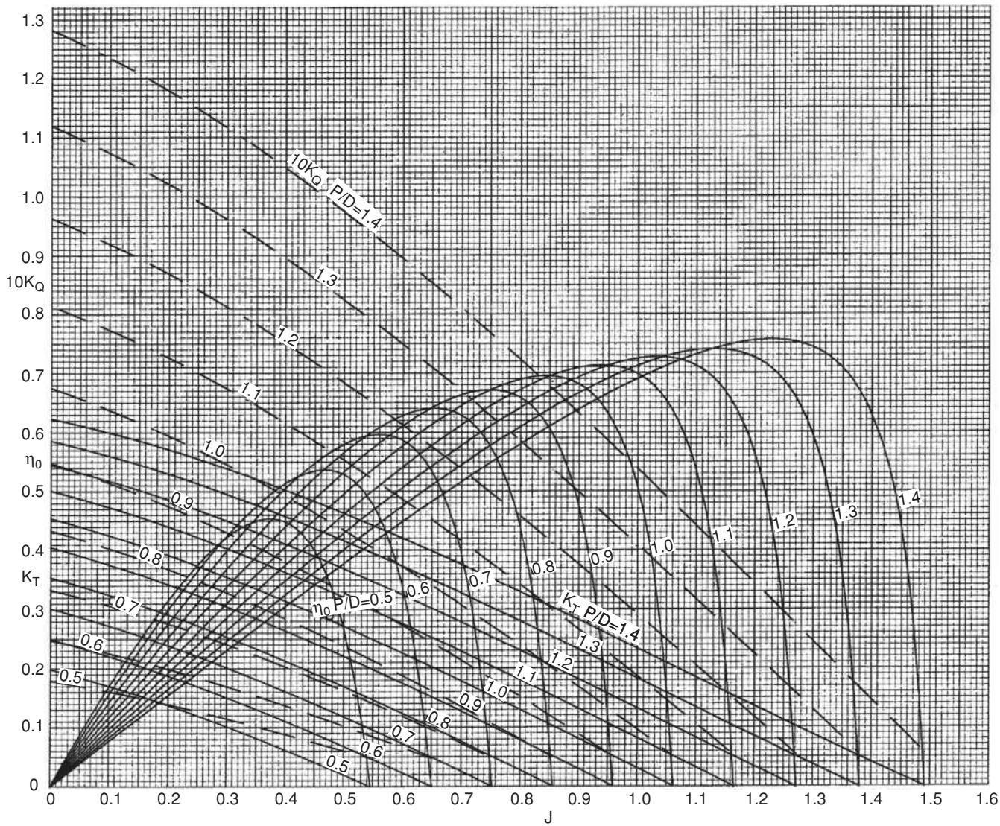

line

| J    | K_T (P/D=0.5) | K_T (P/D=0.6) | K_T (P/D=0.7) | K_T (P/D=0.8) | K_T (P/D=0.9) | K_T (P/D=1.0) | K_T (P/D=1.1) | K_T (P/D=1.2) | K_T (P/D=1.3) | K_T (P/D=1.4) |
|------|---------------|---------------|---------------|---------------|---------------|---------------|---------------|---------------|---------------|---------------|
| 0.0  | 0.0           | 0.0           | 0.0           | 0.0           | 0.0           | 0.0           | 0.0           | 0.0           | 0.0           | 0.0           |
| 0.1  | 0.1           | 0.15          | 0.2           | 0.25          | 0.3           | 0.35          | 0.4           | 0.45          | 0.5           | 0.55          |
| 0.2  | 0.2           | 0.25          | 0.3           | 0.35          | 0.4           | 0.45          | 0.5           | 0.55          | 0.6           | 0.65          |
| 0.3  | 0.3           | 0.35          | 0.4           | 0.45          | 0.5           | 0.55          | 0.6           | 0.65          | 0.7           | 0.75          |
| 0.4  | 0.4           | 0.45          | 0.5           | 0.55          | 0.6           | 0.65          | 0.7           | 0.75          | 0.8           | 0.85          |
| 0.5  | 0.5           | 0.55          | 0.6           | 0.65          | 0.7           | 0.75          | 0.8           | 0.85          | 0.9           | 0.95          |
| 0.6  | 0.6           | 0.65          | 0.7           | 0.75          | 0.8           | 0.85          | 0.9           | 0.95          | 1.0           | 1.05          |
| 0.7  | 0.7           | 0.75          | 0.8           | 0.85          | 0.9           | 0.95          | 1.0           | 1.05          | 1.1           | 1.15          |
| 0.8  | 0.8           | 0.85          | 0.9           | 0.95          | 1.0           | 1.05          | 1.1           | 1.15          | 1.2           | 1.25          |
| 0.9  | 0.9           | 0.95          | 1.0           | 1.05          | 1.1           | 1.15          | 1.2           | 1.25          | 1.3           | 1.35          |
| 1.0  | 1.0           | 1.05          | 1.1           | 1.15          | 1.2           | 1.25          | 1.3           | 1.35          | 1.4           | 1.45          |
| 1.1  | -             | -             | -             | -             | -             | -             | -             | -             | -             | -             |
| 1.2  | -             | -             | -             | -             | -             | -             | -             | -             | -             | -             |
| 1.3  | -             | -             | -             | -             | -             | -             | -             | -             | -             | -             |
| 1.4  | -             | -             | -             | -             | -             | -             | -             | -             | -             | -             |
| 1.5  | -             | -             | -             | -             | -             | -             | -             | -             | -             | -             |
| 1.6  | -             | -             | -             | -             | -             | -             | -             | -             | -             | -             |
| J=1   | ~13K_Q        | ~12K_Q        | ~11K_Q        | ~10K_Q        | ~9K_Q         | ~8K_Q         | ~7K_Q         | ~6K_Q         | ~5K_Q         | ~4K_Q         |
| J=2   | ~12K_Q        | ~11K_Q        | ~10K_Q        | ~9K_Q         | ~8K_Q         | ~7K_Q         | ~6K_Q         | ~5K_Q         | ~4K_Q         | ~3K_Q         |
| J=3   | ~11K_Q        | ~10K_Q        | ~9K_Q         | ~8K_Q         | ~7K_Q         | ~6K_Q         | ~5K_Q         | ~4K_Q         | ~3K_Q         | ~2K_Q         |
| J=4   | ~10K_Q        | ~9K_Q         | ~8K_Q         | ~7K_Q         | ~6K_Q         | ~5K_Q         | ~4K_Q         | ~3K_Q         | ~2K_Q         | ~1K_Q         |
| J=5   | ~9K_Q         | ~8K_Q         | ~7K_Q         | ~6K_Q         | ~5K_Q         | ~4K_Q         | ~3K_Q         | ~2K_Q         | ~1K_Q         | ~0K_Q         |
| J=6   | ~8K_Q         | ~7K_Q         | ~6K_Q         | ~5K_Q         | ~4K_Q         | ~3K_Q         | ~2K_Q         | ~1K_Q         | ~0K_Q         | ~-1K_Q        |
| J=7   | ~7K_Q         | ~6K_Q         | ~5K_Q         | ~4K_Q         | ~3K_Q         | ~2K_Q         | ~1K_Q         | ~-1K_Q        | ~-2K_Q        | ~-3K_Q        |
| J=8   | ~6K_Q         | ~5K_Q         | ~4K_Q         | ~3K_Q         | ~2K_Q         | ~1K_Q         | ~-1K_Q        | ~-2K_Q        | ~-3K_Q        | ~-4K_Q        |
| J=9   | ~5K_Q         | ~4K_Q         | ~3K_Q         | ~2K_Q         | ~1K_Q         | ~-1K_Q        | ~-2K_Q        | ~-3K_Q        | ~-4K_Q        | ~-5K_Q        |
| J=10+                <fcel>-            <fcel>-            <fcel>-            <fcel>-            <fcel>-            <fcel>-            <fcel>-            <fcel>-            <fcel>-            <fcel>-            <fcel>-            <nl>

Figure 16.4. KT − KQ characteristics for Wageningen B4.70 propeller (Courtesy of MARIN).