  
Figure 16.5. Bp-δ characteristics for Wageningen B4.40 propeller (Courtesy of MARIN).

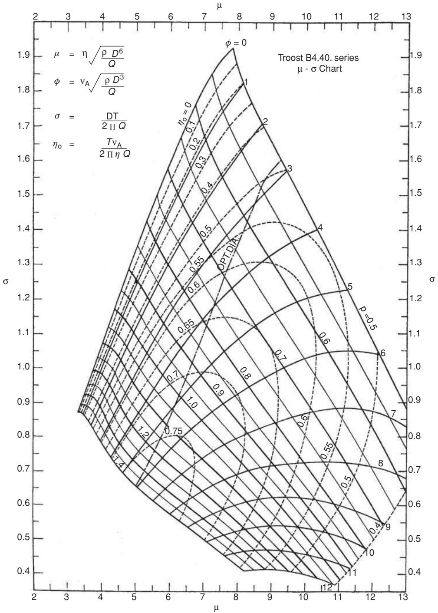

<details>
<summary>contour</summary>

| μ    | σ    | η₀   | σ    |
|------|------|------|------|
| 8.0  | 1.9  | 0    | 1.9  |
| 9.0  | 1.7  | 0    | 1.7  |
| 10.0 | 1.5  | 0    | 1.5  |
| 11.0 | 1.3  | 0    | 1.3  |
| 12.0 | 1.1  | 0    | 1.1  |
| 13.0 | 0.9  | 0    | 0.9  |
| 8.0  | 1.6  | 1    | 1.6  |
| 9.0  | 1.4  | 1    | 1.4  |
| 10.0 | 1.2  | 1    | 1.2  |
| 11.0 | 1.0  | 1    | 1.0  |
| 12.0 | 0.8  | 1    | 0.8  |
| 8.0  | 1.4  | 2    | 1.4  |
| 9.0  | 1.2  | 2    | 1.2  |
| 10.0 | 1.0  | 2    | 1.0  |
| 11.0 | 0.8  | 2    | 0.8  |
| 12.0 | 0.6  | 2    | 0.6  |
| 8.0  | 1.2  | ∞    | ∞    |
| 9.0  | 1.0  | ∞    | ∞    |
| 10.0 | 0.8  | ∞    | ∞    |
| 11.0 | 0.6  | ∞    | ∞    |
| 12.0 | 0.4  | ∞    | ∞    |
| 8.0  | 1.0  | ∞    | ∞    |
| 9.0  | 0.8  | ∞    | ∞    |
| 10.0 | 0.6  | ∞    | ∞    |
| 11.0 | 0.4  | ∞    | ∞    |
| 12.0 | 0.2  | ∞    | ∞    |
| 8.0  | 0.8  | ∞    | ∞    |
| 9.0  | 0.6  | ∞    | ∞    |
| 10.0 | 0.4  | ∞    | ∞    |
| 11.0 | 0.2  | ∞    | ∞    |
| 12.0 | 0.05 | ∞    | ∞    |
The plot displays a contour plot with contour lines labeled 'σ' and 'P', where the x-axis represents μ and the y-axis represents σ, and the legend indicates 'η₀' and 'p'. The chart title is 'Troost B4.40 series μ - σ Chart'. Parameters are provided in the top-left corner: μ = η√(ρD⁶/Q), φ = νA√(ρD³/Q), σ = DT/(2ΠQ), η₀ = TvA/(2ΠηQ). The contour lines are labeled with values such as "OPT.DIA" and "P=0.5". The axes are labeled "μ" (range ~2–13) and "σ" (range ~0–1).
</details>

Figure 16.6. µ-σ-φ characteristics for Wageningen B4.40 propeller (Courtesy of MARIN).

Table 16.1(a). Coefficients in $K _ { T }$ and $K _ { Q } ,$ Equations (16.9, 16.10), B4.40 

<table><tr><td>P/D</td><td> $K_{To}$ </td><td>a</td><td>n</td><td> $K_{Qo}$ </td><td>b</td><td>m</td></tr><tr><td>0.5</td><td>0.200</td><td>0.59</td><td>1.26</td><td>0.0170</td><td>0.72</td><td>1.50</td></tr><tr><td>0.6</td><td>0.240</td><td>0.70</td><td>1.27</td><td>0.0225</td><td>0.80</td><td>1.50</td></tr><tr><td>0.7</td><td>0.280</td><td>0.80</td><td>1.29</td><td>0.0290</td><td>0.90</td><td>1.50</td></tr><tr><td>0.8</td><td>0.320</td><td>0.90</td><td>1.30</td><td>0.0360</td><td>0.98</td><td>1.60</td></tr><tr><td>0.9</td><td>0.355</td><td>1.01</td><td>1.32</td><td>0.0445</td><td>1.07</td><td>1.65</td></tr><tr><td>1.0</td><td>0.390</td><td>1.11</td><td>1.35</td><td>0.0535</td><td>1.18</td><td>1.65</td></tr><tr><td>1.1</td><td>0.420</td><td>1.22</td><td>1.37</td><td>0.0630</td><td>1.28</td><td>1.67</td></tr><tr><td>1.2</td><td>0.445</td><td>1.32</td><td>1.40</td><td>0.0730</td><td>1.39</td><td>1.67</td></tr></table>

where $( A _ { E } / A _ { \theta } )$ can be taken as BAR.

$$
K _ {T} (R e) = K _ {T} (R e = 2 \times 1 0 ^ {6}) + \Delta K _ {T} (R e). \tag {16.5}
$$

$$
K _ {Q} (R e) = K _ {Q} (R e = 2 \times 1 0 ^ {6}) + \Delta K _ {Q} (R e). \tag {16.6}
$$

Reynolds number $R e \left( = V _ { R } \cdot c / \nu \right)$ is based on the chord length and relative velocity $V _ { R }$ at 0.7R, as follows:

$$
V _ {R} = \sqrt {V a ^ {2} + (0 . 7 \pi n D) ^ {2}}. \tag {16.7}
$$

An approximation to the chord length at 0.7R, based on the Wageningen series, Figure 16.2, [16.6] is as follows:

$$
\left(\frac {c}{D}\right) _ {0. 7 R} = X _ {2} \times \mathrm{BAR}, \tag {16.8}
$$

where $X _ { 2 } = 0 . 7 4 7$ for three blades, 0.520 for four blades and 0.421 for five blades

Approximate Equations for $\kappa _ { \tau }$ and $\kappa _ { \circ }$ . Approximate fits in the form of Equations (16.9) and (16.10) have been made to the Wageningen $K _ { T } - K _ { Q }$ data. These are suitable for approximate estimates of $K _ { T }$ and $K _ { Q }$ at the preliminary design stage.

$$
K _ {T} = K _ {T o} \left[ 1 - \left(\frac {J}{a}\right) ^ {n} \right] \tag {16.9}
$$

$$
K _ {Q} = K _ {Q o} \left[ 1 - \left(\frac {J}{b}\right) ^ {m} \right] \tag {16.10}
$$

and

$$
\eta_ {0} = \frac {J K _ {T}}{2 \pi K _ {Q}}, \tag {16.11}
$$

where $K _ { T o }$ and $K _ { Q o }$ are values of $K _ { T }$ and $K _ { Q }$ at $J = 0 . \ K _ { T o } , K _ { Q o }$ and coefficients a, b, n and m have been derived for a range of $P / D$ for the Wageningen B4.40 and B4.70 propellers and are listed in Tables 16.1(a) and (b).

(II) GAWN SERIES. All the propellers in the Gawn series have three blades, $\mathbf { B A R } =$ 0.20–1.10 and $P / D = 0 . 4 0 – 2 . 0 0$ . The general blade outline of the Gawn series is shown in Figure 16.7. Typical applications of the Gawn series include ferries, warships, small craft and higher speed craft. Figures 16.8, 16.9 and 16.10, reproduced with permission from [16.7], give examples of Gawn $K _ { T } - K _ { Q }$ charts for propellers with a BAR of 0.35, 0.65 and 0.95.

Table 16.1(b). Coefficients in $K _ { T }$ and $K _ { Q } ,$ , Equations (16.9, 16.10), B4.70 

<table><tr><td>P/D</td><td> $K_{To}$ </td><td>a</td><td>n</td><td> $K_{Qo}$ </td><td>b</td><td>m</td></tr><tr><td>0.5</td><td>0.200</td><td>0.55</td><td>1.15</td><td>0.0180</td><td>0.70</td><td>1.18</td></tr><tr><td>0.6</td><td>0.250</td><td>0.65</td><td>1.20</td><td>0.0250</td><td>0.79</td><td>1.18</td></tr><tr><td>0.7</td><td>0.300</td><td>0.75</td><td>1.20</td><td>0.0332</td><td>0.86</td><td>1.20</td></tr><tr><td>0.8</td><td>0.352</td><td>0.86</td><td>1.20</td><td>0.0433</td><td>0.95</td><td>1.23</td></tr><tr><td>0.9</td><td>0.405</td><td>0.96</td><td>1.20</td><td>0.0545</td><td>1.03</td><td>1.29</td></tr><tr><td>1.0</td><td>0.455</td><td>1.06</td><td>1.20</td><td>0.0675</td><td>1.12</td><td>1.29</td></tr><tr><td>1.1</td><td>0.500</td><td>1.16</td><td>1.21</td><td>0.0810</td><td>1.22</td><td>1.30</td></tr><tr><td>1.2</td><td>0.545</td><td>1.27</td><td>1.21</td><td>0.0960</td><td>1.32</td><td>1.31</td></tr></table>

Polynomials have been fitted to the Gawn $K _ { T } - K _ { Q }$ data [16.16] in the form of Equations (16.3) and (16.4). The results are approximate in places and their application should be limited to $0 . 8 < P / D < 1 . 4$ . The coefficients of the polynomials are listed in Appendix A4, Table A4.3.

# 16.2.1.2 Applications of Standard Series $K \tau - K _ { Q }$ Charts

Fundamentally, the propeller has to deliver a required thrust (T) at a speed of advance (Va), where $T = R / ( 1 - 1 )$ , $V a = V s ( 1 - w _ { T } )$ , R is resistance, t is thrust deduction factor and wT is the wake fraction.

A typical approach, using $K _ { T } - K _ { Q }$ charts, is shown in Figure 16.11. This shows the approach starting from an assumed diameter, leading to optimum revolutions.

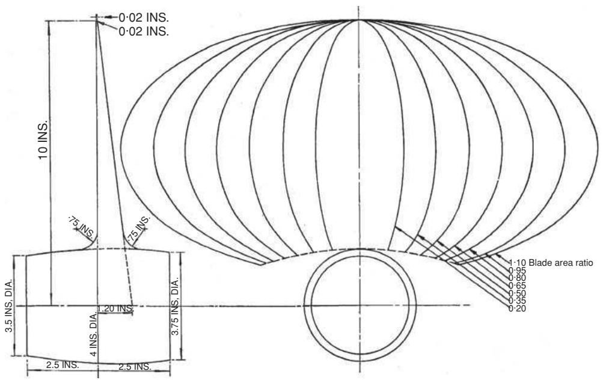

<details>
<summary>text_image</summary>

0·02 INS.
0·02 INS.
10 INS.
75 INS.
75 INS.
3.5 INS. DIA.
4 INS. DIA.
2.5 INS.
2.5 INS.
1·10 Blade area ratio
0·95
0·80
0·65
0·50
0·35
0·20
</details>

Figure 16.7. Blade outline of the Gawn series [16.10].


<details>
<summary>line</summary>

| Advance coefficient J. | Thrust coefficient η (η) | Torque coefficient KQ (η) |
| ---------------------- | ------------------------ | ------------------------- |
| 0.0                    | 0.0                      | 0.0                       |
| 0.2                    | 0.1                      | 0.02                      |
| 0.4                    | 0.2                      | 0.04                      |
| 0.6                    | 0.3                      | 0.06                      |
| 0.8                    | 0.4                      | 0.08                      |
| 1.0                    | 0.5                      | 0.10                      |
| 1.2                    | 0.6                      | 0.12                      |
| 1.4                    | 0.7                      | 0.14                      |
| 1.6                    | 0.8                      | 0.16                      |
| 1.8                    | 0.9                      | 0.18                      |
| 2.0                    | 1.0                      | 0.20                      |
| 2.2                    | 1.1                      | 0.22                      |
</details>

Figure 16.8. KT − KQ characteristics for Gawn propeller with BAR = 0.35.

An alternative is to start with assumed revolutions, leading to an optimum diameter.

In theory, there is an infinite range of propeller diameters (D) and pitch ratios $\left( P / D \right)$ , hence, rpm (N) that meet the design requirement. In practice, there will be an optimum diameter (for maximum efficiency) or diameter limitation due to required clearances, and optimum rpm (or some rpm limit due to engine requirements) that will lead to a suitable solution. The following worked example illustrates the application of the Wageningen series B4.40 $K _ { T } - K _ { Q }$ chart, Figure 16.3, for a typical marine propeller.

WORKED EXAMPLE. Given that $P _ { E } , V s , w _ { T }$ and t are available for a particular vessel, derive suitable propeller characteristics and efficiency. $P _ { E } = 2 8 0 0 \mathrm { k W } , V s = 1 4$ knots, $w _ { T } = 0 . 2 6 , t = 0 . 2 0$ and assume $\eta _ { R } = 1 . 0 . \ T = R _ { T } / ( 1 - t ) = ( P _ { E } / V _ { S } ) / ( 1 -$ $t ) = 2 8 0 0 / ( 1 4 \times 0 . 5 1 4 4 ) / ( 1 - 0 . 2 ) = 4 8 6 . 0$ kN and $V a = 1 4 ( 1 - 0 . 2 6 ) \times 0 . 5 1 4 4 =$ 5.329 m/s.

Case 1: given Diameter and revolutions. Given that D = 5.2 m and $N = 1 2 0$ rpm $( n = 2 . 0 { \mathrm { ~ r p s } } ) K _ { T } = T / \rho { \mathrm { n } } ^ { 2 } D ^ { 4 } = 4 8 6 \times 1 0 0 0 / 1 0 2 5 \times 2 ^ { 2 } \times 5 . 2 ^ { 4 } = 0 . 1 6 2 .$ ,

$$
J = V a / n D = 5. 3 2 9 / 2. 0 \times 5. 2 = 0. 5 1 2.
$$


<details>
<summary>line</summary>

| Advance coefficient J. | Thrust coefficient η | Torque coefficient KQ |
| ---------------------- | --------------------- | ---------------------- |
| 0.0                    | 0.0                   | 0.24                   |
| 0.2                    | 0.1                   | 0.22                   |
| 0.4                    | 0.2                   | 0.20                   |
| 0.6                    | 0.3                   | 0.18                   |
| 0.8                    | 0.4                   | 0.16                   |
| 1.0                    | 0.5                   | 0.14                   |
| 1.2                    | 0.6                   | 0.12                   |
| 1.4                    | 0.7                   | 0.10                   |
| 1.6                    | 0.8                   | 0.08                   |
| 1.8                    | 0.9                   | 0.06                   |
| 2.0                    | 1.0                   | 0.04                   |
| 2.2                    | 1.1                   | 0.02                   |
</details>

Figure 16.9. $K \tau - K _ { Q }$ characteristics for Gawn propeller with ${ \mathsf { B A R } } = 0 . 6 5 .$ .

The steps are as follows:

(a) Enter chart (B4.40, Figure 16.3) at $J = 0 . 5 1 2 .$ ,   
(b) Read appropriate $P / D$ from required $K _ { T } \left( = 0 . 1 6 2 \right) = 0 . 7 9$   
(c) Read appropriate $\eta _ { \theta }$ from required $P / D = 0 . 5 8 8 ,$   
(d) Read appropriate $K _ { Q }$ from required $P / D = 0 . 0 2 2 5$

From Equation (16.1), $\eta _ { D } = \eta _ { 0 } \times \eta _ { H } \times \eta _ { R } = 0 . 5 8 8 \times ( 1 - 0 . 2 ) / ( 1 - 0 . 2 6 ) \times$ $1 . 0 = 0 . 6 3 6$ and $P _ { D } = P _ { E } / \eta _ { D } = 2 8 0 0 / 0 . 6 3 6 = 4 4 0 2 . 5 k W$ . Or more directly, using the chart $K _ { Q }$ and noting that $P _ { D } = 2 \pi n Q / \eta _ { R }$ and $Q = K _ { Q } \times \rho n ^ { 2 } D ^ { 5 }$

$$
\begin{array}{l} \therefore P _ {D} = 2 \pi n K _ {Q} \rho n ^ {2} D ^ {5} / \eta_ {R} \\ = 2 \pi 2. 0 \times 0. 0 2 2 5 \times 1 0 2 5 \times 2 ^ {2} \times 5. 2 ^ {5} / 1 0 0 0 = 4 4 0 7. 5 \mathrm{kW} \\ \end{array}
$$

(the 5 kW difference is within the accuracy of reading the chart).


<details>
<summary>line</summary>

| Advance coefficient J. | Thrust coefficient η | Torque coefficient KQ |
| ---------------------- | --------------------- | ---------------------- |
| 0.0                    | 0.0                   | 0.0                    |
| 0.2                    | 0.1                   | 0.12                   |
| 0.4                    | 0.2                   | 0.16                   |
| 0.6                    | 0.3                   | 0.20                   |
| 0.8                    | 0.4                   | 0.24                   |
| 1.0                    | 0.5                   | 0.28                   |
| 1.2                    | 0.6                   | 0.32                   |
| 1.4                    | 0.7                   | 0.36                   |
| 1.6                    | 0.8                   | 0.40                   |
| 1.8                    | 0.9                   | 0.44                   |
| 2.0                    | 1.0                   | 0.48                   |
| 2.2                    | 1.1                   | 0.52                   |
</details>

Figure 16.10. $K _ { T } - K _ { Q }$ characteristics for Gawn propeller with BAR = 0.95.

Case 2: optimum revolutions. Given that the diameter D = 5.0 m, for example, due to tip clearances which might typically be from 0.15D to 0.20D, find the optimum rpm for this diameter.

$$
K _ {T} = T / \rho n ^ {2} D ^ {4} = 4 8 6 \times 1 0 0 0 / 1 0 2 5 \times n ^ {2} \times 5. 0 ^ {4} = 0. 7 5 9 / n ^ {2}.
$$

$$
J = V a / n D = 5. 3 2 9 / n \times 5. 0 = 1. 0 6 6 / n.
$$

Assume a range of rpm, deduce $\eta _ { 0 }$ from the chart for each rpm; hence, deduce from say a cross plot the rpm at optimum (maximum) η0. The steps are shown in Table 16.2. At $J = 0 . 5 4 8 , P / D = 0 . 9 0 8$ and $K _ { Q } = 0 . 0 3 0 1 , P _ { D } = 2 \pi n Q / \eta _ { R } = 2 \pi \ \times$ $1 . 9 4 5 \times 0 . 0 3 0 1 \times 1 0 2 5 \times 1 . 9 4 5 ^ { 2 } \times 5 . 0 ^ { 5 } / 1 0 0 0 = 4 4 5 7 . 3 \mathrm { k W }$ . {or $\eta _ { D } = \eta _ { 0 } \times \eta _ { H } \times \eta _ { R }$ $= 0 . 5 8 3 \times ( 1 - 0 . 2 ) / ( 1 - 0 . 2 6 ) \times 1 . 0 = 0 . 6 3 0 \}$ and $P _ { D } = P _ { E } / \eta _ { D } = 2 8 0 0 / 0 . 6 3 0 =$ 4444.4 kW, the 12.9 kW difference being due to the accuracy of reading from a chart.

Case 3: optimum diameter. Given that the rpm $N = 1 3 0 \mathrm { r p m }$ , for example, due to the requirements of the installed engine, find the optimum diameter for these rpm.

$$
N = 1 3 0 \mathrm{rpm} = 2. 1 7 \mathrm{rps}.
$$

$$
K _ {T} = T / \rho n ^ {2} D ^ {4} = 4 8 6 \times 1 0 0 0 / 1 0 2 5 \times 2. 1 7 ^ {2} \times D ^ {4} = 1 0 0. 6 9 / D ^ {4}.
$$

$$
J = V a / n D = 5. 3 2 9 / (2. 1 7 \times D) = 2. 4 5 6 / D.
$$

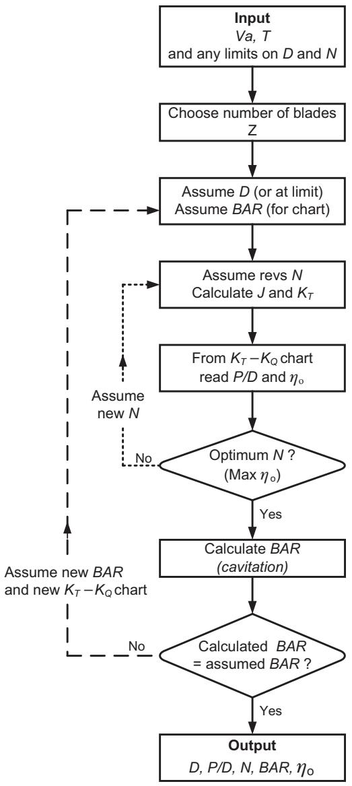

<details>
<summary>flowchart</summary>

```mermaid
graph TD
    A["Input Va, T and any limits on D and N"] --> B["Choose number of blades Z"]
    B --> C["Assume D (or at limit) Assume BAR (for chart)"]
    C --> D["Assume revs N Calculate J and K_T"]
    D --> E["From K_T - K_Q chart read P/D and η_o"]
    E --> F{Optimum N ? (Max η_o)}
    F -->|No| G["Assume new N"]
    G --> H["Calculate BAR (cavitation)"]
    H --> I{Calculated BAR = assumed BAR ?}
    I -->|Yes| J["Output D, P/D, N, BAR, η_o"]
    I -->|No| H
```
</details>

Figure 16.11. Typical propeller preliminary design path–optimum rpm.

Assume a range of D, deduce $\eta _ { 0 }$ from the chart for each $D ;$ hence, deduce from say a cross plot the D at optimum (maximum) $\eta _ { 0 }$ . The steps are shown in Table 16.3. At $J = 0 . 4 8 3 , P / D = 0 . 7 4$ and $K _ { Q } = 0 . 0 2 0 0 . \ P _ { D } = 2 \pi \ n Q / \eta _ { R } = 2 \pi \ \times$ $2 . 1 7 \times 0 . 0 2 0 0 \times 1 0 2 5 \times 2 . 1 7 ^ { 2 } \times 5 . 0 9 ^ { 5 } / 1 0 0 0 = 4 4 9 6 . 8 ~ \mathrm { k W }$ or $\eta _ { D } = \eta _ { 0 } \times \eta _ { H } \times \eta _ { R } =$ $0 . 5 7 8 \times ( 1 - 0 . 2 ) / ( 1 - 0 . 2 6 ) \times 1 . 0 = 0 . 6 2 5$ and $P _ { D } = P _ { E } / \eta _ { D } = 2 8 0 0 / 0 . 6 2 5 = 4 4 8 0 . 0$ kW, the 16.8 kW difference being due to accuracy of reading from chart.

It should also be noted that the B4.40 chart has been chosen to illustrate the calculation method. A cavitation check, Chapter 12, would indicate which would be the most appropriate chart to use from say the B4.40, B4.55 or B4.70 charts, etc.

Case 4: power approach. Required to design the propeller for a given delivered power at given rpm (for example, having chosen a particular direct drive diesel engine). In this case, speed is also initially not known.

Table 16.2. Derivation of optimum rpm 

<table><tr><td colspan="2">Assume</td><td colspan="2">Calculate</td><td colspan="2">From chart</td><td rowspan="2">From cross plot</td></tr><tr><td>N</td><td>n</td><td>J</td><td> $K_T$ </td><td>P/D</td><td> $η_0$ </td></tr><tr><td>102</td><td>1.7</td><td>0.627</td><td>0.263</td><td>1.12</td><td>0.570</td><td>Optimum J = 0.548</td></tr><tr><td>114</td><td>1.9</td><td>0.561</td><td>0.210</td><td>0.94</td><td>0.582</td><td> $\therefore n = 1.945 (116.7 rpm)$ </td></tr><tr><td>126</td><td>2.1</td><td>0.508</td><td>0.172</td><td>0.81</td><td>0.575</td><td> $η_0 = 0.583 and P/D = 0.908$ </td></tr></table>

Approach 1. If the diameter is known, or estimated (e.g. maximum allowing for clearances), assume a range of speeds (covering the expected speed) and repeat Case 1 for each speed. Increase speed until the delivered power $P _ { D }$ matches that required.

Approach 2. Optimum diameter required. Assume a range of speeds and repeat Case 3 for each speed, producing a delivered power and optimum diameter at each speed. Increase speed until delivered power $P _ { D }$ matches that required. A cross plot of $P _ { D }$ and D to a base of speed will yield the speed at the required $P _ { D }$ , together with the optimum diameter at that speed.

It should be noted that $B _ { P } - \delta$ charts (rather than $K _ { T } - K _ { Q }$ charts) may be more suitable for a power approach, see Section 16.2.1.3.

Case 5: bollard pull condition $\mathrm { ~ \bf ~ ( ~ J ~ } = \mathrm { ~ \bf ~ 0 ~ } )$ . At $J = 0 , K _ { T 0 } = T / \rho n ^ { 2 } D ^ { 4 } , K _ { Q 0 } =$ $Q / \rho n ^ { 2 } D ^ { 5 } , T = K _ { T 0 } \times \rho n ^ { 2 } D ^ { 4 }$ and $Q = K _ { Q 0 } \times \rho n ^ { 2 } D ^ { 5 }$ .

From Figure 16.3, for an assumed $P / D , K _ { T 0 }$ and $K _ { Q 0 }$ can be obtained. For an assumed (or limiting) D, a range of rpm may be assumed until a limiting Q or $P _ { D }$ is reached. This point would represent the maximum achievable thrust. This process may be repeated (within any prescribed limits) for a range of D and range of n until the most efficient combination of n and D is achieved. As noted in Section 13.3, the effective thrust $T _ { E } = T \times ( 1 - t )$ , where t is the thrust deduction factor. Values of t for tugs in the bollard pull condition are given in Chapter 8. Worked example application 19, Chapter 17, includes the bollard pull condition for a tug.

Case 6: preliminary screening. A suitable approach at the preliminary design stage is to apply Case 2 a number of times, whereby the sensitivity of efficiency $\eta _ { 0 }$ to diameter D can be checked. The results of such an investigation are shown schematically in Figure 16.12.

# 16.2.1.3 Applications of Standard Series $B _ { P } - \delta$ Charts

$B _ { P } - \delta$ charts can be usefully employed when it is required to design a propeller for a given delivered power and rpm (for example, having chosen a particular direct drive diesel engine). In this case, in the first instance speed has to be assumed as propeller efficiency and delivered propeller thrust are not yet known.

Table 16.3. Derivation of optimum diameter 

<table><tr><td rowspan="2">Assume $D$ </td><td colspan="2">Calculate</td><td colspan="2">From chart</td><td rowspan="2">From cross plot</td></tr><tr><td> $J$ </td><td> $K_{T}$ </td><td> $P/D$ </td><td> $\eta_0$ </td></tr><tr><td>4.8</td><td>0.512</td><td>0.190</td><td>0.85</td><td>0.571</td><td>Optimum  $J = 0.483$ </td></tr><tr><td>5.0</td><td>0.491</td><td>0.161</td><td>0.77</td><td>0.577</td><td> $D = 5.09$ </td></tr><tr><td>5.2</td><td>0.472</td><td>0.138</td><td>0.70</td><td>0.577</td><td> $\eta_0 = 0.578$ </td></tr><tr><td>5.4</td><td>0.455</td><td>0.118</td><td>0.64</td><td>0.562</td><td> $P/D = 0.74$ </td></tr></table>

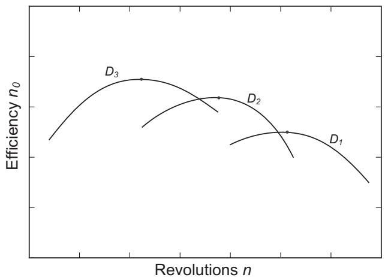

<details>
<summary>line</summary>

| Revolutions n | Efficiency n0 (D1) | Efficiency n0 (D2) | Efficiency n0 (D3) |
| ------------- | ------------------ | ------------------ | ------------------ |
| Low           | Low                | Low                | Low                |
| Mid           | Medium             | High               | Peak               |
| High          | Low                | Low                | Low                |
</details>

Figure 16.12. Variation in efficiency with diameter and revolutions.

WORKED EXAMPLE. The service delivered power $P _ { D }$ for a ship travelling at an estimated speed of 17 knots is 12,500 kW at 110 rpm.

Calculate the optimum propeller diameter, propeller pitch and efficiency.

From empirical data for this ship type, wT = 0.25, t = 0.15 and $\eta _ { R } = 1 . 0 1$ .

$$
\eta_ {H} = (1 - t) / \left(1 - w _ {T}\right) = (1 - 0. 1 5) / (1 - 0. 2 5) = 1. 1 3 3.
$$

$$
P _ {D} = 1 2, 5 0 0 \mathrm{kW} = 1 2, 5 0 0 / 0. 7 4 5 7 = 1 6, 7 6 3 \mathrm{hp}.
$$

$$
V s = 1 7. 0 \text {   knots.   } V a = V s (1 - w _ {T}) = 1 7 (1 - 0. 2 5) = 1 2. 7 5 \text {   knots.   }
$$

$$
B _ {P} = N \cdot P ^ {1 / 2} / V a ^ {2. 5} = 1 1 0 \times 1 6, 7 6 3 ^ {1 / 2} / 1 2. 7 5 ^ {2. 5} = 2 4. 5 4.
$$

Using the Wageningen B4.40 chart shown in Figure 16.5, for $B _ { P } = 2 4 . 5 4$ at the optimum diameter (chain dotted) line, $\eta _ { 0 } = 0 . 6 2 5 , \delta = 2 0 0$ and $P / D = 0 . 7 3 0 . \ \delta =$ ND/Va, diameter $D = \delta V a / N = 2 0 0 \times 1 2 . 7 5 / 1 1 0 = 2 3 . 1 8 \mathrm { f t } = 7 . 0 7$ m and $\eta _ { D } = \eta _ { 0 }$ $\eta _ { H } \eta _ { R } = 0 . 6 2 5 \times 1 . 1 3 3 \times 1 . 0 1 = 0 . 7 1 5$ .

If the propeller diameter were limited to say $6 . 3 \ : \mathrm { m } = 2 0 . 6 6 \ : \mathrm { f t }$ , then, in this case, $B _ { P } = 2 4 . 5 4$ as before, but $\delta = N D / V a = 1 1 0 \times 2 0 . 6 6 / 1 2 . 7 5 = 1 7 8 . 2 4$ and from the B4.40 chart, $\eta _ { 0 } = 0 . 6 0 0$ (non-optimum) and $P / D = 0 . 9 7 0$ .

$$
\eta_ {D} = \eta_ {0} \eta_ {H} \eta_ {R} = 0. 6 0 0 \times 1. 1 3 3 \times 1. 0 1 = 0. 6 8 7.
$$

Considering the optimum diameter case, the ‘effective’ power output from the engine $P _ { E } ^ { \prime } = P _ { D } \times \eta _ { D } = 1 2 , 5 0 0 \times 0 . 7 1 5 = 8 9 3 7 . 5 \mathrm { k W }$ . In practice, if the effective power output $P { _ { E } } ^ { \prime }$ from the installed engine is not equal to $P _ { E }$ for the hull $( R _ { T } \times$ Vs) at that speed, then from the $P _ { E } - V s$ curve for the ship, a new speed for $P _ { E } =$ 8937.5 kW can be deduced and calculations can be repeated for the new speed. Hence, the optimum propeller and actual speed can be obtained by iteration.

It should also be noted that the B4.40 chart has been chosen to illustrate the calculation method. A cavitation check, Chapter 12, would indicate which would be the most appropriate chart to use from say the B4.40, B4.55 or B4.70 charts, etc.

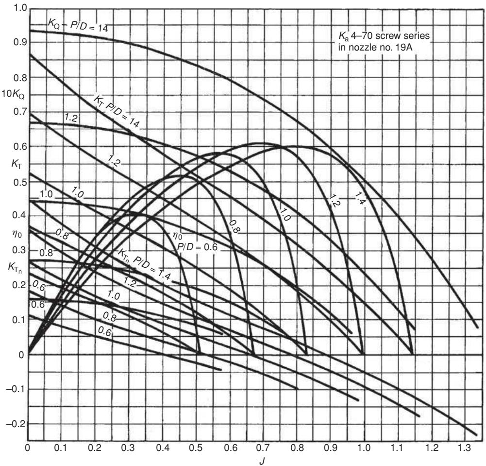

<details>
<summary>line</summary>

| J    | K_T (P/D=14) | K_T (P/D=12) | K_T (P/D=10) | K_T (P/D=8) | K_T (P/D=6) | K_T (P/D=4) | K_T (P/D=2) | K_T (P/D=0) |
|------|--------------|--------------|--------------|-------------|-------------|-------------|-------------|-------------|
| 0.0  | 0.95         | 0.90         | 0.85         | 0.80        | 0.75        | 0.70        | 0.65        | 0.60        |
| 0.1  | 0.92         | 0.85         | 0.80         | 0.75        | 0.70        | 0.65        | 0.60        | 0.55        |
| 0.2  | 0.88         | 0.80         | 0.75         | 0.70        | 0.65        | 0.60        | 0.55        | 0.50        |
| 0.3  | 0.82         | 0.75         | 0.70         | 0.65        | 0.60        | 0.55        | 0.50        | 0.45        |
| 0.4  | 0.75         | 0.70         | 0.65         | 0.60        | 0.55        | 0.50        | 0.45        | 0.40        |
| 0.5  | 0.68         | 0.65         | 0.60         | 0.55        | 0.50        | 0.45        | 0.40        | 0.35        |
| 0.6  | 0.62         | 0.60         | 0.55         | 0.50        | 0.45        | 0.40        | 0.35        | 0.30        |
| 0.7  | 0.58         | 0.55         | 0.50         | 0.45        | 0.40        | 0.35        | 0.30        | 0.25        |
| 0.8  | 0.52         | 0.50         | 0.45         | 0.40        | 0.35        | 0.30        | 0.25        | 0.20        |
| 0.9  | 0.48         | 0.45         | 0.40         | 0.35        | 0.30        | 0.25        | 0.20        | 0.15        |
| 1.0  | 0.42         | 0.40         | 0.35         | 0.30        | 0.25        | 0.20        | 0.15        | 0.10        |
| 1.1  | 0.38         | 0.35         | 0.30         | 0.25        | 0.20        | 0.15        | 0.10        | 0.05        |
| 1.2  | 0.32         | 0.30         | 0.25         | 0.20        | 0.15        | 0.10        | 0.05        | 0.02        |
| 1.3  | 0.28         | 0.25         | 0.20         | 0.15        | 0.10        | 0.05        | 0.02        | -           |
| >1   | ~-          | ~-           | ~-           | ~-          | ~-          | ~-          | ~-          | ~-          |
</details>

Figure 16.13. $K _ { T } - K _ { Q }$ data for a ducted propeller (Courtesy of MARIN).

# 16.2.2 Controllable Pitch Propellers

Series $K _ { T } - K _ { Q }$ charts for fixed-pitch propellers, Figures 16.3 to 16.10, can be used, treating pitch as a variable and allowing for a small loss in efficiency due to the increase in boss diameter/propeller diameter ratio. Results in [16.17] would suggest that a 40% increase in boss/diameter ratio (say from 0.18 to 0.25) leads approximately to a 2%–3% decrease in efficiency.

# 16.2.3 Ducted Propellers

Open water data are available for ducted propellers. An example is given in Figure 16.13 which shows the $K _ { T } - K _ { Q }$ data for the Wageningen Ka4.70 propeller in a 19A nozzle (duct). The use of such a $K _ { T } - K _ { Q }$ chart is the same as for the conventional non-ducted propeller in Section 16.2.1. The contribution of the duct is also shown in Figure 16.13; note that, at lower thrust loadings, higher J values, the duct thrust becomes negative, or a drag force. Further ducted propeller data may be found in [16.18 and 16.19].

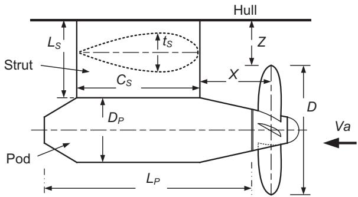

<details>
<summary>text_image</summary>

Strut
Ls
tS
Cs
Dp
Pod
LP
Hull
Z
X
D
Va
</details>

Figure 16.14. Schematic layout of podded unit.

# 16.2.4 Podded Propellers

The propeller may be assumed to behave in a similar manner to the conventional propeller and the charts in Figures 16.3 to 16.10 provide suitable open water data. The particular differences compared with the conventionally mounted propeller concern the larger propeller boss/diameter ratio, the relatively large diameter of the pod in order to house the electric drive motor, and the drag of the supporting strut. The wake fraction and the thrust deduction factor may be different for the hull forms cut up at the aft end to accommodate the podded unit. The drag of the relatively large pod has to be allowed for and the pod support strut has to be taken into account, either as an appendage drag or a thrust deduction change.

# 16.2.4.1 Pod Housing Drag

For practical powering predictions, simple semi-empirical methods for estimating the full-scale drag of the pod housing, suggested in International Towing Tank Conference (ITTC) (2008) [16.20], may be applied. The main components of a podded unit are shown schematically in Figure 16.14.

The total pod housing drag (pod plus strut) is assumed to be the following:

$$
R _ {\text { Pod }} = R _ {\text { Body }} + R _ {\text { Strut }} + R _ {\text { Int }} + R _ {\text { Lift }}, \tag {16.12}
$$

which are the components of resistance associated with the pod body (nacelle), strut, strut-body interference and lift due to rotating flow downstream of the propeller. For lightly loaded propellers $R _ { \mathrm { L i f t } }$ may be neglected but, if the propeller is heavily loaded (low J), the induced drag can be significant. The effect is similar to that arising from the influence of the propeller slipstream on a rudder, as described by Molland and Turnock [16.21].

A form factor approach is proposed, where $( 1 + k _ { B } )$ and $( 1 + k _ { S } )$ are the form factors for the pod body and strut, respectively. The semi-empirical formulae, from Hoerner [16.22], are as follows:

# 16.2.4.2 Pod Body

$$
R _ {\text { Body }} = (1 + k _ {B}) \left(C _ {F} \frac {1}{2} \rho S _ {B} V _ {I} ^ {2}\right) \tag {16.13}
$$

and

$$
k _ {B} = 1. 5 \left(\frac {D _ {P}}{L _ {P}}\right) ^ {3 / 2} + 7 \left(\frac {D _ {P}}{L _ {P}}\right) ^ {3}, \tag {16.14}
$$

where $L _ { P } , D _ { P }$ and $S _ { B }$ are the length, diameter and wetted surface area of the pod body (nacelle) and $V _ { \mathrm { I } }$ is the inflow velocity.

# STRUT.

$$
R _ {\text { Strut }} = (1 + k _ {S}) \left(C _ {F} \frac {1}{2} \rho S _ {S} V _ {I} ^ {2}\right) \tag {16.15}
$$

and

$$
k _ {S} = 2 \left(\frac {t _ {S}}{C _ {S}}\right) + 6 0 \left(\frac {t _ {S}}{C _ {S}}\right) ^ {4}, \tag {16.16}
$$

where $S _ { S }$ is the wetted surface area of the strut, $t _ { S } / C _ { S }$ is the average thickness ratio of the strut and $V _ { I }$ is the inflow velocity.

# STRUT-POD INTERFERENCE.

$$
R _ {\text { Int }} = \frac {1}{2} \rho t _ {S} ^ {2} V _ {I} ^ {2} f \left(\frac {t _ {\text { root }}}{C _ {\text { root }}}\right), \tag {16.17}
$$

with a fillet joint

$$
f \left(\frac {t _ {\text { root }}}{C _ {\text { root }}}\right) = \left(0. 4 \left(\frac {t _ {\text { root }}}{C _ {\text { root }}}\right) - 0. 0 5\right), \tag {16.18}
$$

where $t _ { \mathrm { r o o t } }$ is maximum thickness at strut root (joint with pod) and $C _ { \mathrm { r o o t } }$ is the chord length at the root. It is noted that $R _ { \mathrm { { I n t } } }$ is independent of friction and will not be subject to scale effect.

EFFECT OF PROPELLER SLIPSTREAM. The propeller accelerates the flow over the pod and strut. An equation derived using modified actuator disc theory is proposed [16.21], as follows. The inflow velocity at pod and/or strut

$$
V _ {1} = V a + K _ {R} V a \left\{\left[ 1 + \frac {8 K _ {T}}{\pi J ^ {2}} \right] ^ {1 / 2} - 1 \right\}, \tag {16.19}
$$

where $K _ { R }$ is a Gutsche-type correction to account for the fluid acceleration between the propeller and strut, based on the distance of strut from the propeller, and can be represented as follows:

$$
K _ {R} = 0. 5 + \frac {0 . 5}{\left[ 1 + (0 . 1 5 / (X / D)) \right]}, \tag {16.20}
$$

noting that when $X / D = 0 , K _ { R } = 0 . 5$ and when $X / D = \infty , K _ { R } = 1 . 0$ .

It is recommended that flow velocity over the strut within the propeller slipstream be taken as $V _ { \mathrm { I } }$ and that outside the slipstream the flow velocity be taken as $V a .$ . Flow over the pod may also be taken as $V _ { \mathrm { I } }$ , being an approximate average of the accelerated flow over the pod.

Flikkema et al. [16.23] describe the components of pod resistance. For the strut input velocity, they propose the use of a weighted average of the actuator disc prediction, Equation (16.19) and that for the propeller no-slip condition.

FRICTION COEFFICIENT $\complement _ { \ F }$ . It is assumed that, at full scale, the flow over the pod and strut is fully turbulent and that the ITTC1957 line may be used (Equation (4.15)), as follows:

$$
C _ {F} = \frac {0 . 0 7 5}{\left[ \log_ {1 0} R e - 2 \right] ^ {2}}. \tag {16.21}
$$

It is noted in ITTC2008 [16.20] that, at model scale, the recommendation is to use laminar/transitional flow formulae for the area outside the propeller slipstream.

# CORRECTION TO $K _ { T O P E N }$ FOR A CONVENTIONALLY MOUNTED PROPELLER.

$$
\text { Correction   due   to   pod   drag } K _ {R \text { pod }} = \frac {R _ {\text { pod }}}{\rho n ^ {2} D ^ {4}}. \tag {16.22}
$$

Finally, total net thrust is propeller thrust minus pod resistance, as follows:

$$
K _ {T \text {total}} = K _ {\text {Topen}} - K _ {R \text {pod}}. \tag {16.23}
$$

The corrected efficiency for podded unit is as follows:

$$
\eta_ {O \text {pod}} = \frac {J _ {O} K _ {T \text {total}}}{2 \pi K _ {Q o}}. \tag {16.24}
$$

If the correction is being applied to the open water data for a conventionally mounted propeller with a boss/diameter ratio of say 0.20, then a correction for an increase in the boss/diameter ratio for the podded propeller to say 0.35 should be applied. [16.17] would suggest that this order of increase in boss diameter would lead to a decrease in propeller efficiency of about 3%.

It must be noted that these are first approximations to the likely changes in efficiency when incorporating the results for an open propeller in a podded unit. Any changes in torque and wake (hence, J) have not been accounted for. Some guidance on the likely changes in $K _ { T }$ and $K _ { Q }$ due to a rudder downstream of a propeller (analogous to the pod/strut–propeller arrangement) can be found in Stierman [16.24] and Molland and Turnock [16.21].

APPROXIMATIONS TO POD DIMENSIONS AT INITIAL DESIGN STAGE. The dimensions of the pod will not necessarily be known at the initial design stage. Starting from the propeller diameter D, derived from calculations for a conventionally mounted propeller, Table 16.4 gives approximate average values that have been derived from a survey of existing podded propulsors. This allows suitable pod dimensions to be established for preliminary powering purposes.

APPLICATION OF FORMULAE FOR POD HOUSING DRAG. Apply a podded propulsor to the worked example, Case 1, Section 16.2.1. Given $D = 5 . 2 \mathrm { m } , n = 2 \mathrm { r p s } , w _ { T } = 0 . 2 6$ , t = 0.20, T = 486 kN, KTo = 0.162, Va = (1 − 0.26) × 14 × 0.5144 = 5.329 m/s and $J = 0 . 5 1 2$ .

Table 16.4. Pod dimensions, based on propeller diameter D, Figure 16.14 

<table><tr><td> $D_P/D$ </td><td> $L_P/D$ </td><td> $C_S/L_P$ </td><td> $L_S/D$ </td><td> $t_S/C_S$ </td><td>Z/D</td><td>X/D</td></tr><tr><td>0.50</td><td>1.60</td><td>0.60</td><td>0.60</td><td>0.30</td><td>0.35</td><td>0.50</td></tr></table>

From the basic calculations using a B4.40 chart, the following were derived:

$$
K _ {Q o} = 0. 0 2 2 5, P / D = 0. 7 9, \eta_ {o} = 0. 5 8 8.
$$

Using Table 16.4, approximate dimensions of podded unit are as follows: with $D = 5 . 2 ~ \mathrm { m } , D _ { \mathrm { p o d } } = 2 . 6 ~ \mathrm { m } , L _ { P } = 8 . 3 2 ~ \mathrm { m } , C _ { S } = 4 . 9 9 ~ \mathrm { m } , L _ { S } = 3 . 1 2 , t _ { S } / C _ { S } = 0 . 3 0 , t _ { S } = 1 . 4 ~ \mathrm { m } , D _ { \mathrm { p o d } } = 3 . 1 ~ \mathrm { m } , D _ { \mathrm { p o d } } = 1 . 6 ~ \mathrm { m }$ 1.5 m, Z = 1.82 m, $( L _ { S } - \mathsf { Z } ) = 1 . 3 \ : \mathrm { m }$ .

Applying the correction equations, using Equation (16.19), with $X / D = 0 . 5 0$ , $V a = 5 . 3 2 9$ m/s, $V _ { \mathrm { I } } = 8 . 1 7 7 ~ \mathrm { m / s }$ , for pod, $L _ { P } = 8 . 3 2$ , Re = VI × LP/ν = 5.717 × $1 0 ^ { 7 }$ (with $\nu = 1 . 1 9 \times 1 0 ^ { - 6 }$ salt water) and $C _ { F } = 2 . 2 6 3 \times 1 0 ^ { - 3 }$ . Using Equations (16.13) and (16.14) for pod body, neglecting ends, and assuming the pod to be cylindrical with constant diameter, wetted area $S _ { B } = \pi \times D _ { P } \times L _ { P } = 6 7 . 9 6 ~ \mathrm { m } ^ { 2 }$ , $k _ { B } = 0 . 4 7 6$ and $R _ { \mathrm { B o d y } } = 7 . 7 8$ kN.

For strut, using Equations (16.15) and (16.16), strut in slipstream, $C _ { S } = 4 . 9 9 $ , $R e = V _ { \mathrm { I } } \times C _ { S } / \nu = 3 . 4 2 9 \times 1 0 ^ { 7 } ( \mathrm { w i t h } \ \nu = 1 . 1 9 \times 1 0 ^ { - 6 }$ salt water), and $C _ { F } = 2 . 4 4 8 \times$ $1 0 ^ { - 3 }$ , assuming 10% expansion for girth, ${ \mathrm { g i r t h } } = 1 . 1 0 \times C _ { S } = 1 . 1 \times 4 . 9 9 = 5 . 4 9 { \mathrm { ~ m } }$ . The wetted area inside slipstream $S _ { S } = 5 . 4 9 \times 1 . 3 \times 2$ (both sides) = 14.274 m2, $k _ { S } = 1 . 0 8 6$ and in slipstream, $R _ { \mathrm { S t r u t } } = 2 . 4 9 \mathrm { ~ k N }$ . Strut outside slipstream, $C _ { S } = 4 . 9 9$ , $R e = V a \times C _ { S } / \nu = 2 . 2 3 5 \times 1 0 ^ { 7 } ( \mathrm { w i t h } \ \nu = 1 . 1 9 \times 1 0 ^ { - 6 }$ salt water), and $C _ { F } = 2 . 6 2 1 \times$ $1 0 ^ { - 3 }$ .

The wetted area outside slipstream $S _ { S } = 5 . 4 9 \times 1 . 8 2 \times 2 ( { \mathrm { b o t h s i d e s } } ) = 1 9 . 9 8 { \mathrm { m } } ^ { 2 }$ . $k _ { S } = 1 . 0 8 6$ and the outside slipstream, $R _ { \mathrm { S t r u t } } = 1 . 5 9 \mathrm { k N }$ .

$$
\text { Total   strut   resistance } = R _ {\text { Strut }} = 2. 4 9 + 1. 5 9 = 4. 0 8 \mathrm{kN}.
$$

Using Equations (16.17) and (16.18) for strut-pod body interference, assuming $t _ { S } / C _ { S }$ constant across strut, $R _ { \mathrm { I n t } } = 5 . 3 8 \mathrm { k N }$ .

Total strut-pod resistance $R _ { \mathrm { P o d } } = R _ { \mathrm { B o d y } } + R _ { \mathrm { S t r u t } } + R _ { \mathrm { I n t } } = 7 . 7 8 + 4 . 0 8 + 5 . 3 8 =$ 17.24 kN.

$$
K _ {R \text {pod}} = R _ {\text {Pod}} / \rho n ^ {2} D ^ {4} = 1 7. 2 4 \times 1 0 0 0 / 1 0 2 5 \times 2 ^ {2} \times 5. 2 ^ {4} = 0. 0 0 5 8.
$$

$$
K _ {T \mathrm{total}} = K _ {T \mathrm{open}} - K _ {R \mathrm{pod}} = 0. 1 6 2 - 0. 0 0 5 8 = 0. 1 5 6.
$$

The corrected efficiency for podded unit is as follows:

$$
\eta_ {O \text { pod }} = J K _ {T \text { total }} / 2 \pi K _ {Q O} = 0. 5 1 2 \times 0. 1 5 6 / 2 \pi \times 0. 0 2 2 5 = 0. 5 6 5.
$$

A further decrease in efficiency of 3% should be included due to the increase in boss diameter, as follows: correction $0 . 5 8 8 \times 0 . 0 3 = 0 . 0 1 8$ , and the final $\eta _ { O \mathrm { p o d } } =$ $0 . 5 6 5 - 0 . 0 1 8 = 0 . 5 4 7 ( - 7 \% )$ .

It can be noted that this apparent loss in efficiency may be substantially offset by the resistance reduction due to the removal of appendages such as propeller bossing(s) or bracket(s) and rudder(s). These reductions will be seen as a decrease in effective power, $P _ { E }$ .

CORRECTION METHOD ATTRIBUTABLE TO FUNENO. Funeno [16.25] developed a simple design method for podded propellers, using CFD and experimental data, in which account is taken of the differences between when the propeller is operating in open water and when it is operating as part of a podded unit. The design method is based on the use of standard open water series, such as the Wageningen B series, together with suitable corrections for $K _ { Q }$ and $K _ { T }$ due to the presence of the pod and strut.

The propeller is first designed using conventional wake fraction and thrust deduction data and open water propeller data to match the required thrust, leading to the design values of J, $K _ { T } , K _ { Q }$ and a suitable pitch ratio, $P / D$ . Corrections for scale effect on $K _ { T }$ and $K _ { Q }$ (see Chapter 5) should be applied.

The torque is modified according to the following:

$$
K _ {Q \text { prop - pod }} = [ 0. 1 7 1 5 \times J + 1. 0 0 1 9 ] \times K _ {Q \text { open }}. \tag {16.25}
$$

The propeller thrust is modified according to the following:

$$
K _ {T \text { prop - pod }} = [ 0. 2 4 9 1 \times J + 1. 0 3 2 3 ] \times K _ {T \text { open }}. \tag {16.26}
$$

Pod resistance is estimated as follows:

$$
K _ {R \text { pod }} = [ - 0. 1 1 2 5 \times J - 0. 0 6 2 5 ] \times K _ {T \text { prop - pod }}. \tag {16.27}
$$

Finally, total net thrust is the sum of the propeller thrust and pod resistance, leading to $K _ { T }$ for the whole unit as follows:

$$
K _ {T \text { total }} = K _ {T \text { prop - pod }} + K _ {R \text { pod }}. \tag {16.28}
$$

Further iterations are applied until $K _ { T \mathrm { t o t a l } }$ matches the required design $K _ { T }$ . The effect of any change in pitch was not included in Funeno’s method because the results of the open water tests indicated that this effect was very small. Funeno’s approach is considered suitable for the initial design stage.

APPLICATION OF FUNENO’S METHOD. Apply a podded propulsor to the worked example, Case 1, Section 16.2.1. Given J = 0.512, wT = 0.26, t = 0.20, $K _ { T o } = 0 . 1 6 2$ .

From the basic calculations using a B4.40 chart the following were derived:

$$
K _ {Q o} = 0. 0 2 2 5, P / D = 0. 7 9, \eta_ {o} = 0. 5 8 8.
$$

Apply the correction Equations (16.25) to (16.28).

$$
\begin{array}{l} K _ {T \text {prop - pod}} = [ 0. 2 4 9 1 \times J + 1. 0 3 2 3 ] \times K _ {T \text {open}} = 0. 1 8 7 8 (+ 16 \%). \\ K _ {R \text {pod}} = [ - 0. 1 1 2 5 \times J - 0. 0 6 2 5 ] \times K _ {T \text {prop - pod}} = - 0. 0 2 2 6. \\ K _ {T \text {total}} = K _ {T \text {prop - pod}} + K _ {R \text {pod}} = 0. 1 6 5 (+ 2 \%). \\ K _ {Q \text {prop - pod}} = [ 0. 1 7 1 5 \times J + 1. 0 0 1 9 ] \times K _ {Q \text {open}} = 0. 0 2 4 5 (+ 9 \%). \\ \end{array}
$$

Corrected efficiency is as follows:

$$
\eta_ {O _ {\mathrm{pod}}} = \frac {J _ {O} K _ {T _ {\mathrm{total}}}}{2 \pi K _ {Q _ {\mathrm{prop - pod}}}} = 0. 5 1 2 \times 0. 1 6 5 / 2 \pi \times 0. 0 2 4 5 = 0. 5 4 9 (- 6. 6 \%).
$$

It can be noted that this apparent loss in efficiency may be effectively offset by the resistance reduction due to the removal of appendages, such as propeller bossing(s) or bracket(s) and rudder(s). These reductions will be seen as a decrease in effective power, $P _ { E }$ .

Approximations to wT and t for podded units are discussed in Chapter 8 and an estimate of $\eta _ { R }$ for podded units is given in Section 16.3.

A number of publications consider the design of podded units. Islam et al. [16.26] provide useful information for comparing pushing and pulling podded propulsors and their cavitation characteristics. They concluded that, in general, the puller propellers had higher efficiency than the pusher propellers. The cavitation performance was similar for the two types. Another useful paper by Islam et al. [16.27] concerns an investigation into the variation of geometry of podded propulsors. The results indicated that the ratio of the pod body diameter/propeller diameter and the hub angle can have a significant effect on $K _ { T }$ and $K _ { Q }$ . Much of this work is reviewed by Bose [16.28]. Heinke and Heinke [16.29] describe an investigation into the use of podded drives for fast ships. They concluded that the thrust loading and pod diameter/propeller diameter ratio are important parameters in the design; an increase in pod diameter results in increases in thrust and torque and a decrease in efficiency. For the size range considered, it was found that the podstrut drag of the pushing propeller was lower than that for the pulling propeller and, overall, the efficiency of the pushing propeller was a little higher than the pulling propeller. A small series of podded propellers, suitable for sizes up to 4500 kW, is described by Frolova et al. [16.30].

Other useful papers which consider various aspects of podded propulsor design are contained in the proceedings of the T-POD conferences [16.31, 16.32]. Further reviews and information on the design, testing and performance of podded propellers can be found in the proceedings of ITTC conferences [16.20, 16.33, 16.34].

# 16.2.5 Cavitating Propellers

The influence of cavitation on propeller thrust and torque can be obtained from series tests, such as those reported by Gawn and Burrill [16.10] for the KCA propeller series. Radojcic [16.35] fitted polynomials to these test results, describing $K _ { T }$ and $K _ { Q }$ by Equations (16.29) and (16.30). The influence of cavitation on thrust and torque, $\Delta K _ { T }$ and $\Delta K _ { Q }$ , for change in cavitation number $\sigma$ is described by Equations (16.31) and (16.32).

$$
K _ {T} = \sum_ {n = 1} ^ {1 6} C _ {t} \cdot 1 0 ^ {e} (A _ {D} / A _ {0}) ^ {x} (P / D) ^ {y} (J) ^ {z}. \tag {16.29}
$$

$$
K _ {Q} = \sum_ {n = 1} ^ {1 7} C _ {q} \cdot 1 0 ^ {e} (A _ {D} / A _ {0}) ^ {x} (P / D) ^ {y} (J) ^ {z}. \tag {16.30}
$$

$$
\Delta K _ {T} = \sum_ {n = 1} ^ {2 0} d _ {t} \cdot 1 0 ^ {e} (A _ {D} / A _ {0}) ^ {s} (\sigma) ^ {t} (K _ {T}) ^ {u} (P / D) ^ {v}. \tag {16.31}
$$

$$
\Delta K _ {Q} = \sum_ {n = 1} ^ {1 8} d _ {q} \cdot 1 0 ^ {e} (A _ {D} / A _ {0}) ^ {s} (\sigma) ^ {t} (K _ {T}) ^ {u} (P / D) ^ {v}, \tag {16.32}
$$

where $\left( A _ { D } / A _ { 0 } \right)$ may be taken as BAR.


<details>
<summary>line</summary>

| 10 J | n atm. (σ=0.6) | n atm. (σ=0.9) | n atm. (σ=0.4) | n atm. (σ=0.6) | n atm. (σ=0.9) | Kq atm. (σ=0.6) | Kq atm. (σ=0.9) | Kt atm. (σ=0.6) | Kt atm. (σ=0.9) |
|------|----------------|----------------|----------------|----------------|----------------|-----------------|-----------------|-----------------|-----------------|
| 7    | ~6.5           | ~6.2           | ~5.8           | ~5.5           | ~5.2           | ~4.5            | ~4.2            | ~3.8            | ~3.5            |
| 8    | ~6.0           | ~5.8           | ~5.5           | ~5.2           | ~5.0           | ~4.2            | ~4.0            | ~3.5            | ~3.2            |
| 9    | ~5.5           | ~5.3           | ~5.0           | ~4.8           | ~4.5           | ~3.8            | ~3.6            | ~3.2            | ~3.0            |
| 10   | ~5.0           | ~4.8           | ~4.5           | ~4.3           | ~4.0           | ~3.5            | ~3.3            | ~3.0            | ~2.8            |
| 11   | ~4.5           | ~4.3           | ~4.0           | ~3.8           | ~3.5           | ~3.2            | ~3.0            | ~2.8            | ~2.6            |
| 12   | ~4.0           | ~3.8           | ~3.5           | ~3.3           | ~3.0           | ~2.8            | ~2.6            | ~2.4            | ~2.2            |
| 13   | ~3.5           | ~3.3           | ~3.0           | ~2.8           | ~2.5           | ~2.5            | ~2.3            | ~2.0            | ~1.8            |
| 14   | ~3.0           | ~2.8           | ~2.5           | ~2.3           | ~2.0           | ~2.0            | ~1.8            | ~1.5            | ~1.3            |
</details>

Figure 16.15. $K \tau - K _ { Q }$ curves for the KCA series [16.35] showing the influence of cavitation.

The coefficients of the polynomials are listed in Appendix A4, Tables A4.4 and A4.5. The limits of these equations are as follows: $z = 3 , 0 . 5 \leq \mathrm { B A R } \leq 1 . 1 , 0 . 8 \leq$ $P / D \le 1 . 8 , J \ge 0 . 3 , K _ { T } \le [ ( J / 2 . 5 ) - 0 . 1 ] ^ { 1 / 2 }$ .

In this application, cavitation number σ is defined as follows:

$$
\sigma = \frac {P - P _ {V}}{0 . 5 \rho V a ^ {2}}, \tag {16.33}
$$

where P is the static pressure at the shaft axis $( = \rho g h + P _ { A T } )$ , see Section 12.2, $P _ { V }$ is the vapour pressure and Va is the speed of advance.

Examples of open water $K _ { T } - K _ { Q }$ curves for the KCA series, subject to cavitation, and generated by the polynomials, reproduced with permission, are shown in Figure 16.15. As σ is reduced, $K _ { T } , K _ { Q }$ and η are seen to decrease. Thrust breakdown will not normally start until about 10% back cavitation has developed. Further details of cavitation and estimates of suitable BAR are included in Section 12.2.

# 16.2.6 Supercavitating Propellers

In the case of the supercavitating propeller, the back (low pressure) side of the section fully cavitates, cavity collapse occurs downstream of the propeller and erosion is avoided. Supercavitating propellers suffer a significant loss in thrust when in the supercavitating zone. Figure 16.16 shows the blade outline and section details for the Newton–Rader series of propellers [16.36] and Figure 16.17, reproduced with permission from [16.36], shows examples of $K _ { T } , K _ { Q }$ and η0 data. These charts are for $\mathbf { B A R } = 0 . 7 1$ and $P / D = 1 . 2 5$ . Data for other BARs and $P / D \mathsf { s }$ are given in [16.36]. For these tests, cavitation number $\sigma$ is defined as $\sigma = ( P _ { O } - P _ { V } ) / { } ^ { 1 } / _ { 2 } \rho V a ^ { 2 }$ , where $P _ { O }$ is the static pressure to the centre of the shaft $( = \rho g h + P _ { A T } )$ , see Section 12.2, $P _ { V }$ is the vapour pressure of water and Va is the speed of advance; see the cavitation Section 12.2 for other datum points for pressure and speed. The blade section shape for the Newton–Rader propellers is a slightly concave round back, with modified leading and trailing edges, Figures 16.16 and 16.18(a). It is noted that the use of such $K _ { T } - K _ { Q }$ charts follows the same methodology as for the conventional propellers in Section 16.2.1. In Figures $1 6 . 1 7 ( \mathrm { a } )$ and 16.17(b), it is seen that at the lowest cavitation number, $K _ { T }$ and $K _ { Q }$ are about half the values at atmospheric pressure. Another significant work on supercavitating foils is that by Tulin [16.37] who developed wedgeshaped sections, Figure 16.18(b). See also [16.14] for further discussion of supercavitating propellers.

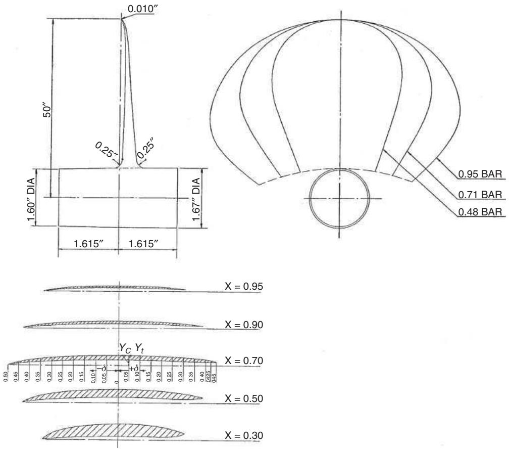  
Figure 16.16. Blade outline and section details for the Newton–Rader series of propellers [16.36].

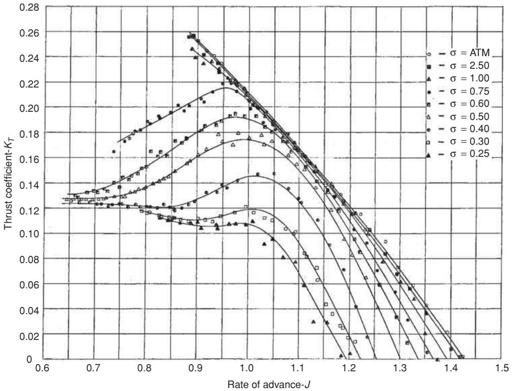

<details>
<summary>line</summary>

| Rate of advance-J | σ = ATM | σ = 2.50 | σ = 1.00 | σ = 0.75 | σ = 0.60 | σ = 0.50 | σ = 0.40 | σ = 0.30 | σ = 0.25 |
| ----------------- | ------- | -------- | -------- | -------- | -------- | -------- | -------- | -------- | -------- |
| 0.6               | ~0.13   | ~0.13    | ~0.13    | ~0.13    | ~0.13    | ~0.13    | ~0.13    | ~0.13    | ~0.13    |
| 0.7               | ~0.14   | ~0.14    | ~0.14    | ~0.14    | ~0.14    | ~0.14    | ~0.14    | ~0.14    | ~0.14    |
| 0.8               | ~0.16   | ~0.16    | ~0.16    | ~0.16    | ~0.16    | ~0.16    | ~0.16    | ~0.16    | ~0.16    |
| 0.9               | ~0.20   | ~0.20    | ~0.20    | ~0.20    | ~0.20    | ~0.20    | ~0.20    | ~0.20    | ~0.20    |
| 1.0               | ~0.22   | ~0.22    | ~0.22    | ~0.22    | ~0.22    | ~0.22    | ~0.22    | ~0.22    | ~0.22    |
| 1.1               | ~0.18   | ~0.18    | ~0.18    | ~0.18    | ~0.18    | ~0.18    | ~0.18    | ~0.18    | ~0.18    |
| 1.2               | ~0.14   | ~0.14    | ~0.14    | ~0.14    | ~0.14    | ~0.14    | ~0.14    | ~0.14    | ~0.14    |
| 1.3               | ~0.10   | ~0.10    | ~0.10    | ~0.10    | ~0.10    | ~0.10    | ~0.10    | ~0.10    | ~0.10    |
| 1.4               | ~0.06   | ~0.06    | ~0.06    | ~0.06    | ~0.06    | ~0.06    | ~0.06    | ~0.06    | ~0.06    |
| 1.5               | ~0.02   | ~0.02    | ~0.02    | ~0.02    | ~0.02    | ~0.02    | ~0.02    | ~0.02    | ~0.02    |
</details>

Figure 16.17. (a) $K _ { T }$ data for the Newton–Rader series of propellers [16.36].


<details>
<summary>line</summary>

| Rate of advance-J | σ = ATM | σ = 250 | σ = 1.00 | σ = 0.75 | σ = 0.60 | σ = 0.50 | σ = 0.40 | σ = 0.30 | σ = 0.25 |
| ----------------- | ------- | ------- | -------- | -------- | -------- | -------- | -------- | -------- | -------- |
| 0.6               | ~0.028  | ~0.028  | ~0.028   | ~0.028   | ~0.028   | ~0.028   | ~0.028   | ~0.028   | ~0.028   |
| 0.7               | ~0.029  | ~0.029  | ~0.029   | ~0.029   | ~0.029   | ~0.029   | ~0.029   | ~0.029   | ~0.029   |
| 0.8               | ~0.031  | ~0.031  | ~0.031   | ~0.031   | ~0.031   | ~0.031   | ~0.031   | ~0.031   | ~0.031   |
| 0.9               | ~0.035  | ~0.035  | ~0.035   | ~0.035   | ~0.035   | ~0.035   | ~0.035   | ~0.035   | ~0.035   |
| 1.0               | ~0.042  | ~0.042  | ~0.042   | ~0.042   | ~0.042   | ~0.042   | ~0.042   | ~0.042   | ~0.042   |
| 1.1               | ~0.038  | ~0.038  | ~0.038   | ~0.038   | ~0.038   | ~0.038   | ~0.038   | ~0.038   | ~0.038   |
| 1.2               | ~0.032  | ~0.032  | ~0.032   | ~0.032   | ~0.032   | ~0.032   | ~0.032   | ~0.032   | ~0.032   |
| 1.3               | ~0.025  | ~0.025  | ~0.025   | ~0.025   | ~0.025   | ~0.025   | ~0.025   | ~0.025   | ~0.025   |
| 1.4               | ~0.018  | ~0.018  | ~0.018   | ~0.018   | ~0.018   | ~0.018   | ~0.018   | ~0.018   | ~0.018   |
| 1.5               | ~0.012  | ~0.012  | ~0.012   | ~0.012   | ~0.012   | ~0.012   | ~0.012   | ~0.012   | ~0.012   |
</details>

Figure 16.17. (b) $K _ { Q }$ data for the Newton–Rader series of propellers [16.36].

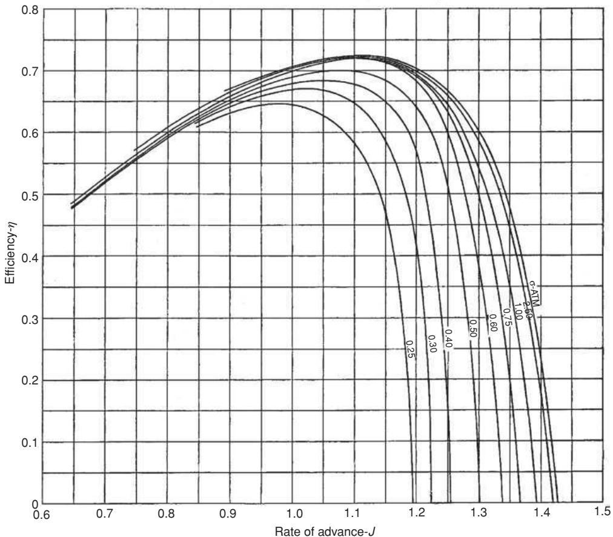

<details>
<summary>line</summary>

| Rate of advance-J | Efficiency-η (σ ATM = 0.25) | Efficiency-η (σ ATM = 0.30) | Efficiency-η (σ ATM = 0.40) | Efficiency-η (σ ATM = 0.50) | Efficiency-η (σ ATM = 0.60) | Efficiency-η (σ ATM = 0.75) | Efficiency-η (σ ATM = 0.80) | Efficiency-η (σ ATM = 1.00) | Efficiency-η (σ ATM = 1.20) | Efficiency-η (σ ATM = 1.40) |
| ----------------- | -------------------------- | -------------------------- | -------------------------- | -------------------------- | -------------------------- | -------------------------- | -------------------------- | -------------------------- | -------------------------- | -------------------------- |
| 0.6               | 0.49                       | 0.49                       | 0.49                       | 0.49                       | 0.49                       | 0.49                       | 0.49                       | 0.49                       | 0.49                       | 0.49                       |
| 0.7               | 0.55                       | 0.55                       | 0.55                       | 0.55                       | 0.55                       | 0.55                       | 0.55                       | 0.55                       | 0.55                       | 0.55                       |
| 0.8               | 0.60                       | 0.60                       | 0.60                       | 0.60                       | 0.60                       | 0.60                       | 0.60                       | 0.60                       | 0.60                       | 0.60                       |
| 0.9               | 0.65                       | 0.65                       | 0.65                       | 0.65                       | 0.65                       | 0.65                       | 0.65                       | 0.65                       | 0.65                       | 0.65                       |
| 1.0               | 0.70                       | 0.70                       | 0.70                       | 0.70                       | 0.70                       | 0.70                       | 0.70                       | 0.70                       | 0.70                       | 0.70                       |
| 1.1               | 0.72                       | 0.72                       | 0.72                       | 0.72                       | 0.72                       | 0.72                       | 0.72                       | 0.72                       | 0.72                       | 0.72                       |
| 1.2               | 0.71                       | 0.71                       | 0.71                       | 0.71                       | 0.71                       | 0.71                       | 0.71                       | 0.71                       | 0.71                       | 0.71                       |
| 1.3               | 0.68                       | 0.68                       | 0.68                       | 0.68                       | 0.68                       | 0.68                       | 0.68                       | 0.68                       | 0.68                       | 0.68                       |
| 1.4               | 0.62                       | 0.62                       | 0.62                       | 0.62                       | 0.62                       | 0.62                       | 0.62                       | 0.62                       | 0.62                       | 0.62                       |
| 1.5               | 0.55                       | 0.55                       | 0.55                       | 0.55                       | 0.55                       | 0.55                       | 0.55                       | 0.55                       | 0.55                       | 0.55                       |
</details>

Figure 16.17. (c) η data for the Newton–Rader series of propellers [16.36].

# 16.2.7 Surface-Piercing Propellers

Data are available for surface-piercing propellers [16.28] and [16.38–16.40]. Figure 16.19 shows typical $K _ { T } - K _ { Q }$ curves for a series of surface-piercing propellers, reproduced with permission from [16.39]. It is noted that the data have a large scatter, which is due in part to the fact that tests were carried out in three different facilities. These charts may be used in a similar way to the conventional fully submerged propellers, Section 16.2.1. In the case of surface-piercing propellers, J is defined as $J _ { \psi } = V$ cos $\psi / n D$ , where ψ is the propeller shaft inclination to the horizontal (typically, $4 ^ { \circ } - 8 ^ { \circ } ) . K _ { T } { } ^ { \prime } = T / \rho n ^ { 2 } D ^ { 2 } A _ { 0 } { } ^ { \prime }$ and $K _ { Q } ^ { \prime } = Q / \rho n ^ { 2 } D ^ { 3 } A _ { 0 } ^ { \prime }$ , where $A _ { 0 } ^ { \prime }$ is the nominal immersed propeller disc area, Figure 16.20 (typically about $0 . 5 \pi D ^ { 2 } / 4 )$ .

Due to the use of $A _ { 0 } ^ { \prime }$ in the denominator, the $K { _ { T } } ^ { \prime }$ and $K _ { Q } { ' }$ values are higher than the $K _ { T }$ and $K _ { Q }$ values for a conventional submerged propeller. Following the tests on the surface piercing propellers [16.39], regression models were developed


<details>
<summary>natural_image</summary>

Simple curved line diagram with dashed baseline, labeled (a), no text or symbols present
</details>


<details>
<summary>natural_image</summary>

Simple line diagram showing a curved path above a dashed baseline, labeled (b) (no text or symbols within the diagram itself)
</details>

Figure 16.18. Supercavitating propeller sections: (a) Newton–Rader [16.36], (b) Tulin. [16.37].

  
Figure 16.19. $K \tau ^ { \prime } - K _ { Q } { ' }$ data for surface-piercing propellers [16.39].


<details>
<summary>text_image</summary>

Still
water
A₀'
hₜ
</details>

Figure 16.20. Nominal disk-immersed area.

for $K { _ { T } } ^ { \prime }$ and $K _ { Q } { ' }$ as follows:

$$
\begin{array}{l} K _ {T ^ {\prime}} = - 0. 6 9 1 6 2 5 J _ {\psi} + 0. 7 9 4 9 7 3 (P / D) + 0. 8 7 0 6 9 6 J _ {\psi} (P / D) \\ - 0. 3 9 5 0 1 2 J _ {\psi} ^ {2} - 0. 5 1 5 1 8 3 (P / D) ^ {2}. \tag {16.34} \\ \end{array}
$$

$$
\begin{array}{l} 1 0 K _ {Q ^ {\prime}} = - 0. 3 0 0 4 5 3 J _ {\psi} + 0. 5 4 3 7 3 8 (P / D) + 0. 8 7 7 6 3 8 J _ {\psi} (P / D) \\ - 0. 6 4 9 3 1 4 J _ {\psi} ^ {2} - 0. 2 0 8 9 7 4 (P / D) ^ {2}. \tag {16.35} \\ \end{array}
$$

Ferrando et al. [16.39] point out that, as partially submerged propellers operate at the interface between air and water, two additional parameters need to be taken into account. These are the immersion coefficient $I _ { T }$ and the Weber number We which takes account of surface tension effects.

$$
I _ {T} = \frac {h _ {T}}{D}, \tag {16.36}
$$

where $h _ { T }$ is the maximum blade tip immersion, Figure 16.20, and $I _ { T }$ is typically about 0.5.

In the context of this work, a special Weber number is defined as follows:

$$
W e ^ {\prime \prime} = \sqrt {\frac {\rho n ^ {2} D ^ {3} I _ {T}}{\gamma}}, \tag {16.37}
$$

where $\gamma$ is the surface tension with a value of about 0.073 N/m at the fresh water–air interface, and with a value of about 0.078 N/m for salt water.

In order to produce reliable data for scaling, it is important to know when the transition from fully wetted to fully vented propeller operation takes place. From the experiments it was found that as We is increased, there is an increase in $J _ { \psi }$ at which the transition takes place. The transition was found to be controlled by We and $P / D$ and, from the experimental data, a critical $J _ { \psi }$ value was derived which provides a minimum $J _ { \psi }$ above which the predictions of the propeller performance may be deemed acceptable. The critical $J _ { \psi }$ value is defined as follows:

$$
J _ {\psi \text {Crit}} = 0. 8 2 5 \frac {P}{D} - 1. 2 5 \frac {P}{D} e ^ {- 0. 0 1 8 W e ^ {\prime \prime}}. \tag {16.38}
$$

In general, the influence of Weber number on $J _ { \psi \mathrm { c r i t } }$ was found to become negligible at Weber numbers greater than about 260.

WORKED EXAMPLE. Surface-piercing propeller.

Consider a vessel travelling at 50 knots. Propeller diameter $D = 1 . 1$ m, shaft inclination $\psi = 7 ^ { \circ }$ . Revolutions = 1400 rpm (= 23.33 rps). hT = 0.55 m, then $I _ { T } =$ $h _ { T } / D = 0 . 5 5 / 1 . 1 = 0 . 5 0$ .

Estimate the thrust T and power $P _ { D }$ with a propeller pitch ratio $P / D = 1 . 2 $ .

$$
A _ {o} ^ {\prime} = 0. 5 \pi D ^ {2} / 4 = 0. 4 7 5 \mathrm{m} ^ {2}.
$$

Wake fraction $w _ { T }$ is likely to be close to zero, depending on the thickness of the boundary layer. Thrust deduction t for such a hull form with conventional screws is $t = 0 . 0 7$ (see Table 8.4). As the surface-piercing propeller will be further from the hull, assume t = 0.03.

$$
J _ {\psi} = V \cos \psi / n D = 5 0 \times 0. 5 1 4 4 \times \cos 7 ^ {\circ} / 2 3. 3 3 \times 1. 1 = 0. 9 9 5.
$$

Using Equation(16.34), $K _ { T } ^ { \prime } = 0 . 1 7 2 5 .$ .

Using Equation(16.35, $K _ { Q } ^ { \prime } = 0 . 0 4 5 7 7$ .

$$
\eta_ {0} = J _ {\psi} K _ {T} ^ {\prime} / 2 \pi K _ {Q} ^ {\prime} = 0. 9 9 5 \times 0. 1 7 2 5 / 2 \pi \times 0. 0 4 5 7 7 = 0. 5 9 7.
$$

$$
W e ^ {\prime \prime} = \sqrt {\frac {\rho n ^ {2} D ^ {3} I _ {T}}{\gamma}} = \sqrt {\frac {1 0 2 5 \times 2 3 . 3 3 ^ {2} \times 1 . 1 ^ {3} \times 0 . 5}{0 . 0 7 8}} = 2 1 8 1. 7.
$$

$$
\begin{array}{l} J _ {\psi \text { Crit }} = 0. 8 2 5 \frac {P}{D} - 1. 2 5 \frac {P}{D} e ^ {- 0. 0 1 8 W e ^ {\prime \prime}}. \\ = 0. 8 2 5 \times 1. 2 - 1. 2 5 \times 1. 2 \times e ^ {- 0. 0 1 8 \times 2 1 8 1. 7} = 0. 9 9 0. \\ \end{array}
$$

Hence, $J _ { \psi } = 0 . 9 9 5$ is acceptable.

$$
\eta_ {H} = (1 - t) / (1 - w _ {T}) = (1 - 0. 0 3) / (1 - 0) = 0. 9 7 0.
$$

Assume $\eta _ { R } = 1 . 0 .$ .

$$
\begin{array}{l} \eta_ {D} = \eta_ {0} \times \eta_ {H} \times \eta_ {R} = 0. 5 9 7 \times 0. 9 7 0 \times 1. 0 = 0. 5 7 9. \\ P _ {D} = 2 \pi n Q = 2 \pi n \times K _ {Q} ^ {\prime} \rho n ^ {2} D ^ {3} A _ {0} ^ {\prime} \\ = 2 \pi \times 2 3. 3 3 \times 0. 0 4 5 7 7 \times 1 0 2 5 \times 2 3. 3 3 ^ {2} \times 1. 1 ^ {3} \times 0. 4 7 5 = 2 3 6 6. 5 \mathrm{kW}. \\ \end{array}
$$

Thrust produced is as follows:

$$
\begin{array}{l} T = K _ {T} ^ {\prime} \rho n ^ {2} D ^ {2} A _ {0} ^ {\prime}. \\ = 0. 1 7 2 5 \times 1 0 2 5 \times 2 3. 3 3 ^ {2} \times 1. 1 ^ {2} \times 0. 4 7 5 = 5 5. 3 1 \mathrm{kN}. \\ \end{array}
$$

[Check: Resistance $R = T ( 1 - t ) = 5 5 . 3 1 \times 0 . 9 7 = 5 3 . 6 5 \mathrm { k N } .$ .

$$
P _ {E} = R \times V s = 5 3. 6 5 \times 5 0 \times 0. 5 1 4 4 \times \cos 7 ^ {\circ} = 1 3 6 9. 6 \mathrm{kW}.
$$

$$
P _ {D} = P _ {E} / \eta_ {D} = 1 3 6 9. 6 / 0. 5 7 9 = 2 3 6 5. 5 \mathrm{kW} ].
$$

# 16.2.8 High-Speed Propellers, Inclined Shaft

Many high-speed propellers are mounted on inclined shafts and the propeller is operating at incidence to the inflow, Figure 16.21. The incidence is typically between $7 ^ { \circ }$ and 15◦. Two flow components act at the propeller plane, Va cos ψ and Va sin ψ, where ψ is the propeller shaft inclination to the horizontal. The component of flow Va sinψ, perpendicular to the propeller shaft, gives rise to an eccentricity of the propeller thrust. On one side, as the propeller blade is upward going, there is a decrease in relative velocity and blade load; on the other side, the propeller blade is downward going and there is an increase in relative velocity and blade load. The net effect is to move the centre of thrust off the centreline. This leads also a significant fluctuation in blade loading as the blade rotates.

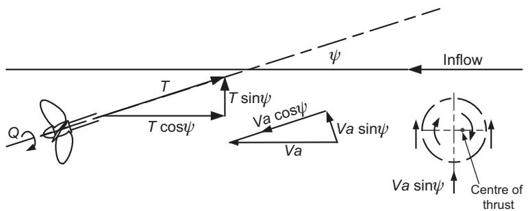

<details>
<summary>text_image</summary>

Q
T
T cosψ
T sinψ
Va cosψ
Va
Va sinψ
ψ
Inflow
Va sinψ
Centre of
thrust
</details>

Figure 16.21. Flow and force components with an inclined shaft.

The thrust $T$ can be resolved into a horizontal thrust T cos $\psi$ and a vertical (lift) force $T$ sin $\psi .$ which may make a significant contribution to the balance of masses and forces in the case of a planing craft. It should be noted that, if trim is present, then trim angle should be added to the shaft inclination when resolving for horizontal thrust.

Guidance on the performance of propellers on inclined shafts may be derived from Gutsche [16.41], Hadler [16.42], Peck and Moore [16.43] and Radojcic [16.35].

# 16.2.9 Small Craft Propellers: Locked, Folding and Self-pitching

The Gawn series propellers, Figures 16.8–16.10, have found many applications in the small craft field. They are all three-bladed and go up to a BAR of 1.10; high BAR is necessary when cavitation is likely to occur, see Chapter 12. The Wageningen B series [16.6] provides one of the few sources of data for two-bladed propellers suitable for small craft.

# 16.2.9.1 Drag of Locked Propellers

The drag of the propeller can be significant when locked at 0 rpm. There are occasions when propeller thrust is not required, such as in the case of the sailing yacht moving solely under sail power, or a larger merchant ship employing sail assistance or a multiple engine/propeller installation with one engine/propeller shut down. In these situations there are three options, Barnaby [16.44]:

(i) Provide enough power to run the propeller at the point of zero slip, $( K _ { T } = 0$ on the $K _ { T } - K _ { Q }$ chart, Figure 16.3), effectively leading to zero propeller drag. It is, however, generally impractical to carry out this approach.   
(ii) Allow the propeller to rotate freely. In this case, with the propeller windmilling, negative torque is developed which must be absorbed by the shaft bearings and clutch. Estimates of drag in this mode are approximate. As pointed out by Barnaby, unless the developed rpm are high enough, requiring free glands, bearings and clutch, etc., it is better to lock the propeller. Both Barnaby [16.44] and Hoerner [16.22] suggest approximate procedures for estimating the drag of a windmilling propeller.

(iii) The propeller is locked. In this case the propeller blades can be treated in a way similar to that of plates in a flow normal to their surface. The drag coefficient will depend on the pitch angle θ. Hoerner [16.22], based on experimental evidence and the blade angle θ at 0.7 radius, suggests the following relationship for the blade drag coefficient $C _ { D B } \mathrm { : }$ :

$$
C _ {D B} = 0. 1 + \cos^ {2} \theta . \tag {16.39}
$$

Using Equation (12.1), θ can be found from

$$
\theta = \tan^ {- 1} \left(\frac {P / D}{0 . 7 \pi}\right) \tag {16.40}
$$

and propeller drag

$$
D = C _ {D B} \times \frac {1}{2} \rho A _ {B} V a ^ {2}, \tag {16.41}
$$

where blade area (all blades)

$$
A _ {B} = \frac {\pi D ^ {2}}{4} \times \text { BAR }. \tag {16.42}
$$

For example, consider a locked propeller with diameter $D = 4 0 0$ mm, blade area ratio $\mathbf { B A R } = 0 . 6 5$ , pitch ratio $P / D = 0 . 8 0$ and moving in a wake speed $V a = 8$ knots, then:

$$
A _ {B} = \left(\pi D ^ {2} / 4\right) \times \mathrm{BAR} = \left(\pi 0. 4 ^ {2} / 4\right) \times 0. 6 5 = 0. 0 8 2 \mathrm{m} ^ {2}
$$

$$
\theta = \tan^ {- 1} [ (P / D) / 0. 7 \pi ] = \tan^ {- 1} [ 0. 8 0 / 0. 7 \pi ] = 1 9. 9 9 ^ {\circ}
$$

$$
C _ {D B} = 0. 1 + \cos^ {2} \theta = 0. 1 + \cos^ {2} 1 9. 9 9 = 0. 9 8 3
$$

and propeller drag $D = C _ { D B } \times 1 / 2 \rho A _ { B } V a ^ { 2 } = 0 . 9 8 3 \times 1 / 2 \times 1 0 2 5 \times 0 . 0 8 2 \times ( 8 \times$ $0 . 5 1 4 4 ) ^ { 2 } = 6 9 9 \mathrm { N }$ .

It is interesting to note that if the blades are set to $\theta = 9 0 ^ { \circ }$ , then $C _ { D B } = 0 . 1$ and the propeller drag is only 71 N.

An investigation into the drag of propellers when sailing, with the propeller stationary at 0 rpm, is reported by Mackenzie and Forrester [16.45]. Folding propellers are useful for minimising drag on sail craft when the propeller is not in use. Self-pitching propellers, [16.46], offer a good solution for sailing and motor sailing. The blades are free to rotate through 360◦, can fully reverse for astern rpm, and can feather for low drag at 0 rpm. Efficiency is comparable with the conventional propeller, [16.46].

# 16.2.10 Waterjets

# 16.2.10.1 Background

An outline of the waterjet and its applications is given in Section 11.3.8. Units are available in the range 50 kW to 38,000 kW. Descriptions of the basic operation of waterjets and the components of efficiency can be found in Allison [16.47] and Carlton [16.14]. A propulsion prediction method for waterjets, using the components of efficiency, losses and hull interaction is given by Van Terwisga [16.48]. Summaries of research into the operation of waterjets and test procedures may be found in the proceedings of ITTC and conferences [16.49–16.52]. Data suitable for the practical estimation of the performance characteristics and efficiency of waterjets are, however, sparse. This is particularly true for preliminary powering purposes.


<details>
<summary>text_image</summary>

Impeller
Stator
V_T
h_2
P_0
A
Inlet
B
WL
h_1
U
P_1
</details>

Figure 16.22. Schematic details of waterjet.

Considerable research on waterjets using experimental and CFD methods has been carried out. This has been mainly centred on a suitable shape and slope of the duct at fluid entry, in particular, in areas A and B in Figure 16.22. This has been carried out in order to avoid possible separation, choking and cavitation in the duct and to achieve a clean and uniform flow through the duct to the impeller. Other research and development has concerned the pump, such as [16.53]. Pumps are normally axial or mixed centrifugal/axial flow with one pump stage plus stator blades ahead and/or downstream of the impeller. Increasing the ducting area at the impeller can slow down the flow in order to increase the static pressure and, hence, avoid cavitation on the impeller blades. Care has to be taken as too much diffusion in the ducting can lead to choking.

An outline is given here of the basic principles of operation of the waterjet using a momentum analysis, together with a proposed formula for propulsive efficiency ηD suitable for practical use at the initial design stage.

# 16.2.10.2 Momentum Analysis of Waterjet Performance

A useful understanding of waterjet performance can be obtained from a momentum analysis of operation. The schematic details of the waterjet are shown in Figure 16.22.

Total pressures are as follows:

at inlet

$$
\frac {P _ {T 1}}{\rho} = \frac {P _ {1}}{\rho} + \frac {1}{2} U ^ {2} - g h _ {1} \quad \text { but } \quad \frac {P _ {1}}{\rho} = \frac {P _ {0}}{\rho} + g h _ {1}
$$

and

$$
\frac {P _ {T 1}}{\rho} = \frac {P _ {0}}{\rho} + \frac {1}{2} U ^ {2}, \tag {16.43}
$$

where U is the free-stream or ship speed.

at tailpipe

$$
\frac {P _ {T 2}}{\rho} = \frac {P _ {0}}{\rho} + \frac {1}{2} V _ {T} ^ {2} + g h _ {2}. \tag {16.44}
$$

Equations (16.43) and (16.44) represent the energy per unit volume. Before the inlet, the total pressure is assumed to be constant, but between the inlet and exit nozzle, the pump imparts energy to the fluid. The difference between the two terms represents the useful work (per unit volume) done on the fluid, minus losses in the inlet and grille, ducting, pump and exit nozzle. The mass flow rate $m = \rho A V _ { T }$ , where A is the tailpipe or nozzle exit area

and power input is as follows:

$$
P _ {D} = m \left\{P _ {T 2} - P _ {T 1} + \text { pressure   losses } \right\}, \tag {16.45}
$$

hence,

$$
P _ {D} = \rho A V _ {T} \left\{\frac {1}{2} V _ {T} ^ {2} + g h _ {2} - \frac {1}{2} U ^ {2} + \text { pressure   losses } \right\}. \tag {16.46}
$$

Assume that the system pressure losses are $\begin{array} { r } { \frac { \Delta P } { \rho } = k \frac { 1 } { 2 } V _ { T } ^ { 2 } } \end{array}$ , where k is typically 0.10– 0.20, then

$$
P _ {D} = \rho A V _ {T} \left\{\frac {1}{2} (1 + k) V _ {T} ^ {2} + g h _ {2} - \frac {1}{2} U ^ {2} \right\}. \tag {16.47}
$$

The overall momentum change gives thrust T as the following:

$$
T = \rho A V _ {T} \left\{V _ {T} - U \right\}. \tag {16.48}
$$

The efficiency of the unit η = Delivered power $\mathrm { T h e e f f i c i e n c y o f t h e u n i t } \eta = { \frac { \mathrm { U s e f u l w o r k } } { \mathrm { D e l i v e r e d p o w e r } } } = { \frac { T U } { P _ { D } } }$ (16.49)

and

$$
\eta = \frac {2 U (V _ {T} - U)}{(1 + k) V _ {T} ^ {2} + 2 g h _ {2} - U ^ {2}}. \tag {16.50}
$$

If the exit velocity ratio is written as $\begin{array} { r } { x = \frac { V _ { T } } { U } } \end{array}$ and a height factor is written as $\begin{array} { r } { H = \frac { 2 g h _ { 2 } } { U ^ { 2 } } } \end{array}$ , then

$$
\eta = \frac {2 (x - 1)}{(1 + k) x ^ {2} + H - 1} \tag {16.51}
$$

There is optimum efficiency when $\begin{array} { r } { \frac { d \eta } { d x } = 0 } \end{array}$ or when

$$
x = 1 + \sqrt {\frac {k + H}{1 + k}} \tag {16.52}
$$

The value of k is typically 0.10–0.20 and its evaluation requires estimates of pressure losses at (i) inlet and grille, (ii) ducting ahead of the impeller, (iii) losses through the pump and (iv) losses in the tailpipe/exit nozzle. The separate assessment of these losses is complicated and, in the present analysis, it is convenient to group them under one heading (k). Van Terwisga [16.48] describes a methodology for estimating these losses separately. Thrust loading may be expressed as follows:

$$
C _ {T} = \frac {T}{0 . 5 \rho A U ^ {2}} = 2 x (x - 1). \tag {16.53}
$$

Table 16.5 shows typical optimum values for $H = 0 . 0 5 0 .$ . Figure 16.23 shows the overall influences of losses (k) and thrust loading $( C _ { T } )$ on efficiency, for $H = 0$ . It is noted that the effects of the losses are most marked at low values of $C _ { T }$ .

Table 16.5. Waterjet optimum efficiency 

<table><tr><td>k</td><td> $x_{\text{opt}}$ </td><td> $\eta_{\text{opt}}$ </td><td> $C_{T\text{opt}}$ </td></tr><tr><td>0.10</td><td>1.37</td><td>0.66</td><td>1.01</td></tr><tr><td>0.15</td><td>1.42</td><td>0.61</td><td>1.18</td></tr><tr><td>0.20</td><td>1.46</td><td>0.57</td><td>1.33</td></tr></table>

In assessing overall system performance, account needs to be taken of the wake effect, if the waterjet inlet ingests boundary layer material, when U will be less than ship speed, and the inlet external drag, or thrust deduction. Methods of incorporating these in the design process are described by Van Terwisga [16.48].

Account should also be taken of the weight of water in the unit when it is operational, which adds to the displacement of the craft and, hence drag. Operating at above optimum $C _ { T }$ will reduce unit size and net weight substantially and the overall best unit will be smaller than the ‘optimum’. For example, from Equation (16.53), for a given thrust, $A \propto C _ { T } { } ^ { - 1 }$ . The volume of the unit is $\propto A ^ { 3 / 2 } \propto C _ { T } { } ^ { - 3 / 2 }$ . Table 16.6 illustrates, for $k = 0 . 1 0$ and $H = 0 . 0 5 0$ , the influence of $C _ { T }$ and volume on efficiency. It can be seen that increasing $C _ { T }$ from 1.00 to 1.50 almost halves the unit volume for only a 1% loss in unit efficiency. Increasing $C _ { T }$ will ultimately be limited by the possible onset of cavitation.

PUMPS. The pump is normally axial flow or mixed centrifugal-axial flow. A detailed description of pump design is given by Brennen [16.54] and typical research into pumps is described in [16.53]. The pump is required to pass a required flow rate Q at a given rotational speed through a head rise h. This can be expressed as a nondimensional specific speed $N _ { \mathrm { S } } .$ , as follows:

$$
N _ {S} = \frac {n Q ^ {1 / 2}}{g h ^ {3 / 4}}. \tag {16.54}
$$

Different pump geometries have a typical range of optimum specific speeds for optimum efficiency. For axial flow pumps these are typically 3.0–6.5 and for mixed flow pumps these are 1.5–3.0. The volume, hence weight and cost, of a pump is proportional to the torque required which, for a given speed, varies inversely with speed. Typically, the higher the speed, the lighter and cheaper the pump. The occurrence of cavitation will set an upper limit on viable specific speeds, see Terwisga [16.48]. Finally, the power required to drive the waterjet impeller is given by the following

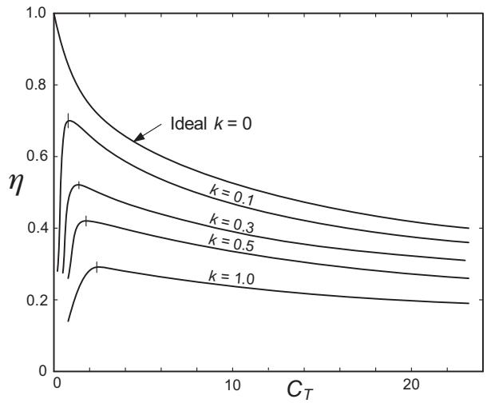

<details>
<summary>line</summary>

| CT | k = 0 | k = 0.1 | k = 0.3 | k = 0.5 | k = 1.0 | Ideal k = 0 |
|----|-------|---------|---------|---------|---------|-------------|
| 0  | 1.0   | 1.0     | 1.0     | 1.0     | 1.0     | 1.0         |
| 2  | 0.7   | 0.65    | 0.55    | 0.45    | 0.3     | 0.7         |
| 5  | 0.6   | 0.55    | 0.45    | 0.35    | 0.25    | 0.6         |
| 10 | 0.5   | 0.45    | 0.35    | 0.25    | 0.2     | 0.5         |
| 20 | 0.4   | 0.35    | 0.25    | 0.2     | 0.15    | 0.4         |
</details>

Figure 16.23. Influence of losses (k) on waterjet efficiency.

Table 16.6. Influence of thrust loading on waterjet volume 

<table><tr><td> $C_T$ </td><td>x</td><td>η</td><td>Volume factor =  $C_T^{-3/2}$ </td></tr><tr><td>1.00</td><td>1.36</td><td>0.664</td><td>1.00</td></tr><tr><td>1.50</td><td>1.50</td><td>0.656</td><td>0.54</td></tr><tr><td>2.00</td><td>1.62</td><td>0.641</td><td>0.35</td></tr><tr><td>2.50</td><td>1.72</td><td>0.624</td><td>0.25</td></tr></table>

$$
P _ {i} = \rho Q g h. \tag {16.55}
$$

# 16.2.10.3 Practical Estimates of Waterjet Efficiency

Practical design data suitable for estimating the overall thrust, torque and efficiency of waterjets are sparse. Assembling and estimating the various components of efficiency, and losses, is not practical at the early design stage. Information derived from manufacturers’ data, including Svensson [16.55], has therefore been used to estimate waterjet efficiency. The data were derived from model and full-scale measurements. An approximate formula for $\eta _ { D }$ , based on the manufacturers’ data and suitable for use at the initial design stage, is given as Equation (16.56).

$$
\eta_ {D} = \frac {1}{[ 1 + 8 . 6 4 / V ]}, \tag {16.56}
$$

where V is ship speed in m/s. Equation (16.56) is suitable for speeds up to about 50 knots.

For preliminary design purposes, based on manufacturers’ data, the approximate diameter D (m) of the waterjet at the impeller/transom for a given power $P _ { D }$ (kW) may be assumed to be the following:

$$
D = \frac {4 . 0 5}{1 + [ 1 1 5 0 0 / P _ {D} ] ^ {0 . 9}} \tag {16.57}
$$

and the displaced (entrained) volume $D V ( \mathbf { m } ^ { 3 } )$ may be assumed to be the following:

$$
D V = 0. 1 2 \left[ \frac {P _ {D}}{1 0 0 0} \right] ^ {1. 6}. \tag {16.58}
$$

# 16.2.11 Vertical Axis Propellers

There are some limited published data for vertical axis (cycloidal) propellers [16.56, 16.57]. A review of performance prediction and theoretical methods for cycloidal propellers is included in Bose [16.28]. An example of such data for $K _ { T }$ and $K _ { Q }$ is that reported by Van Manen [16.57] and reproduced with permission in Figure 16.24. These charts may be used in the same way as for conventional propellers, Section 16.2.1. In Figure 16.24, $\boldsymbol { J } ~ ( = V e / n D )$ is the advance coefficient, Ve is the advance velocity, six-blades with length l, chord $c ; e$ is equivalent to pitch and $e = 2 a / D$ , where a is offset of centre of blade control.


<details>
<summary>line</summary>

| J    | K_T   | K_Q   | η_o   |
|------|-------|-------|-------|
| 0.0  | 0.0   | 0.0   | 0.40  |
| 0.2  | 0.2   | 0.4   | 0.50  |
| 0.4  | 0.4   | 0.6   | 0.60  |
| 0.6  | 0.6   | 0.8   | 0.71  |
| 0.8  | 0.8   | 1.0   | 0.80  |
| 1.0  | 1.0   | 1.2   | 0.90  |
| 1.2  | 1.2   | 1.4   | 1.00  |
| 1.4  | 1.4   | 1.6   | 1.10  |
| 1.6  | 1.6   | 1.8   | 1.20  |
| 1.8  | 1.8   | 2.0   | 1.30  |
| 2.0  | 2.0   | 2.2   | 1.40  |
| 2.2  | 2.2   | 2.4   | 1.50  |
| 2.4  | 2.4   | 2.6   | 1.60  |
| 2.6  | 2.6   | 2.8   | 1.70  |
| 2.8  | 2.8   | 3.0   | 1.80  |
| 3.0  | 3.0   | 3.2   | 1.90  |
</details>

Figure 16.24. $K _ { T } - K _ { Q }$ curves for vertical axis propellers [16.57].

# 16.2.12 Paddle Wheels

Useful data are available following the tests carried out by Volpich and Bridge [16.58–16.60]. It is found that a paddle employing fully feathering blades can achieve efficiencies reasonably close to the conventional propeller.

# 16.2.13 Lateral Thrust Units

Data for the design and sizing of lateral thrust units at the initial design stage are derived mainly from manufacturers’ information and results from thrust units in service. In the following, simple theory is used to derive the basic equations of operation.


<details>
<summary>text_image</summary>

V₂ = V₁
V₁
V₀
</details>

Figure 16.25. Assumed velocities in lateral thrust unit.

Applying actuator disc theory and the velocity changes in Figure 16.25, it can be shown that

$$
\text { Thrust } T = \rho A V _ {1} ^ {2} \tag {16.59}
$$

$$
\text { Power } P = \frac {1}{2} \rho A V _ {1} ^ {3}. \tag {16.60}
$$

Actual power requirements will need to be much higher than this to allow for gearing losses, and drag losses on the impeller and duct walls not taken into account in this simple theory.

In dimensional terms,

$$
\text {   From   Equation   (16.59),   } T = f (D ^ {2} \cdot V ^ {2})
$$

$$
\text { and   from   Equation   (16.60), } P = f (D ^ {2} \cdot V ^ {3}),
$$

$$
\text { hence }, T = f (P \cdot D) ^ {2 / 3}
$$

$$
\text { and } T = C [ P \cdot D ] ^ {2 / 3}, \tag {16.61}
$$

where $C = T / ( P \cdot D ) ^ { 2 / 3 }$ can be seen as a measure of efficiency and may be derived from published data.

Based on published data, and with units T (kN), D (m) and P (kW), a suitable average value is $C = 0 . 8 2$ .

A suitable approximate value for diameter, for use at the initial design stage is the following:

$$
D = 1. 9 \left[ \frac {P}{1 0 0 0} \right] ^ {0. 4 5}. \tag {16.62}
$$

Equations (16.61) and (16.62) can be used to determine preliminary dimensions of the thrust unit for a given thrust, power for a required thrust and diameter and the influence of diameter on thrust and efficiency.

A useful background to lateral thrust units and design data are described by English [16.61]. Figure 16.26, reproduced with permission from [16.61], provides typical data for different propulsors and thrust units. The $\mathbf { \overrightarrow { C } } _ { }$ values in Figure 16.26 for lateral thrust units, defined in the same way as Equation (16.61), lie typically in the range 55–70. It should be noted that the information in Figure 16.26 is in imperial units, is not dimensionless and applies to units operating in salt water. The foregoing has considered the ship with zero forward speed. The influence of forward speed on the performance of lateral thrust units is discussed in [16.62, 16.63, 16.64].


<details>
<summary>scatter</summary>

| Propeller Type | H.P. of lateral thrust unit | C = [P(H.P.) × D(FT)]^2/3 |
| --- | --- | --- |
| Controllable pitch screws (2) | 150 | 68 |
| Controllable pitch screws (2) | 300 | 66 |
| Controllable pitch screws (2) | 500 | 68 |
| Controllable pitch screws (2) | 800 | 68 |
| Controllable pitch screws (2) | 1200 | 68 |
| Cycloidal propellers (4) | 300 | 65 |
| Cycloidal propellers (4) | 350 | 62 |
| Cycloidal propellers (4) | 400 | 58 |
| Cycloidal propellers (4) | 450 | 57 |
| Ducted propeller KA 4-55 in nozzle 19A (20) | 100 | 100 |
| Ducted propeller KA 4-55 in nozzle 19A (20) | 1200 | 67 |
| Canadian ferry (4) | 150 | 57 |
| Oceanographic vessel (makers estimate) | 350 | 62 |
| Australian ferry (4) | 500 | 57 |
| Dredger (3) | 150 | 57 |
| Dredger (3) | 300 | 57 |
| Ship | 250 | 49 |
| Russian vessel (5) | 250 | 49 |
| Optimum pitch ratios: K 4-55 (19), KA 4-55 (20) | 850 | 52 |
| Contra-rotating propellers | 1200 | 67 |
</details>

Figure 16.26. Design data for thrusters, with applications to lateral thrust units [16.61].

Example application of Equations (16.61) and (16.62) follows:

Given an available thruster power of 2000 kW, from Equation (16.62), diameter $D = 1 . 9 \ : ( 2 0 0 0 / 1 0 0 0 ) ^ { 0 . 4 5 } = 2 . 6 0$ m, from Equation (16.61), estimated thrust $T = 0 . 8 2$ $( 2 0 0 0 \times 2 . 6 0 ) ^ { 2 / 3 } = 2 4 6 . 8 \mathrm { { k N } }$ . (In Imperial units, $T = 5 5 . 6 \times 1 0 ^ { 3 }$ lb, $P = 2 6 8 1 . 0$ hp, $D = 8 . 5 3 \mathrm { f t }$ , and the C factor in Figure 16.26 is 68.8).

# 16.2.14 Oars

Useful information on the performance of oars, the thrust produced and efficiency is provided in [16.65–16.68].

Table 16.7. Rig terminology 

<table><tr><td>I</td><td>Height of foretriangle (m)</td></tr><tr><td>J</td><td>Base of foretriangle (m)</td></tr><tr><td>FA</td><td>Average freeboard (m)</td></tr><tr><td>EHM</td><td>Mast height above sheer line (m)</td></tr><tr><td>EMDC</td><td>Average mast diameter (m)</td></tr><tr><td>P</td><td>Mainsail hoist (m)</td></tr><tr><td>BAD</td><td>Height of main boom above sheer line (m)</td></tr><tr><td>B</td><td>Beam (m)</td></tr></table>

# 16.2.15 Sails

# 16.2.15.1 Background

In estimating the performance of a sailing yacht it is necessary to predict the forces generated by the sails. In reality, this depends not only on the apparent wind speed and direction and the sail characteristics, but also on the skill of the sailor in trimming the sails for the prevailing conditions. This aspect of performance is extremely hard to replicate at the design stage and in making predictions of yacht speed.

If wind tunnel tests are undertaken, then it is possible to adjust the trim of the sails in order to maximise the useful drive force from them at each wind speed and direction and for the complete set of sails to be used on the yacht. In this manner, the sail’s lift and drag coefficients may be obtained and used for subsequent performance predictions. This process is described, for example, in Marchaj [16.69] and Campbell [16.70].

The treatment of sail performance in most modern velocity prediction programs (VPPs), including that of the Offshore Racing Congress (ORC [16.71]) used for yacht rating, is based on the approach first described by Hazen [16.72]. This produces the force coefficients for the rig as a whole based on the contributions of individual sails. It also includes the facility to consider the effects of ‘flattening’ and ‘reefing’ the sails through factors, thus allowing some representation of the manner in which a yacht is sailed in predicting its performance. Since Hazen [16.72], the model has been updated to include the effects of sail–sail interaction and more modern sail types and shapes. These updates are described, for example, in Claughton [16.73] and ORC [16.71]. The presentation included here essentially follows that of Larsson and Eliasson [16.74] and ORC [16.71].

The method is based on the lift and viscous drag coefficients of the individual sails, which are applied to an appropriate vector diagram, such as Figure 11.12.

The rig terminology adopted is that used by the International Measurement System (IMS) in measuring the rig of a yacht. A summary of the parameters is given in Table 16.7.

# 16.2.15.2 Lift and Drag Coefficients

Typical values of lift and drag coefficient, taken with permission from ORC [16.71], for mainsail and jib for a range of apparent wind angles are given in Tables 16.8 and 16.9 and Figures 16.27 and 16.28.

Table 16.8. Lift and drag coefficients for mainsail 

<table><tr><td> $\beta$  deg</td><td>0</td><td>7</td><td>9</td><td>12</td><td>28</td><td>60</td><td>90</td><td>120</td><td>150</td><td>180</td></tr><tr><td> $C_{L}$ </td><td>0.000</td><td>0.862</td><td>1.052</td><td>1.164</td><td>1.347</td><td>1.239</td><td>1.125</td><td>0.838</td><td>0.296</td><td>-0.112</td></tr><tr><td> $C_{D}$ </td><td>0.043</td><td>0.026</td><td>0.023</td><td>0.023</td><td>0.033</td><td>0.113</td><td>0.383</td><td>0.969</td><td>1.316</td><td>1.345</td></tr></table>

The total lift and viscous drag coefficients are given by the weighted contribution of each sail as follows:

$$
C _ {L} = \frac {C _ {L m} A _ {m} + C _ {L j} A _ {j}}{A _ {n}} \tag {16.63}
$$

and

$$
C _ {D p} = \frac {C _ {D m} A _ {m} + C _ {D j} A _ {j}}{A _ {n}}, \tag {16.64}
$$

where the reference (nominal) area is calculated as the sum of the mainsail and foretriangle areas $A _ { n } = A _ { m } + A _ { F }$ . The fore triangle area is $A _ { F } = 0 . 5 I J$ .

The total drag coefficient for the rig is given by the following:

$$
C _ {D} = C _ {D p} + C _ {D 0} + C _ {D I}, \tag {16.65}
$$

where $C _ { D 0 }$ is the drag of mast and hull topsides and may be estimated as follows:

$$
C _ {D 0} = 1. 1 3 \frac {(F A \cdot B) + (E H M \cdot E M D C)}{A _ {n}}. \tag {16.66}
$$

$C _ { D I }$ is the induced drag due to the generation of lift, estimated as follows:

$$
C _ {D I} = C _ {L} ^ {2} \left(\frac {1}{A R} + 0. 0 0 5\right), \tag {16.67}
$$

where the effective rig aspect ratio, AR, for close hauled sailing is as follows:

$$
A R = \frac {(1 . 1 (E H M + F A)) ^ {2}}{A _ {n}}. \tag {16.68}
$$

The effective AR for other course angles is as follows:

$$
A R = \frac {(1 . 1 E H M) ^ {2}}{A _ {n}}. \tag {16.69}
$$

The effects of ‘flattening’ and ‘reefing’ the sails are given by, $\boldsymbol { C _ { L } } = \boldsymbol { C _ { L } } \boldsymbol { F } \cdot \boldsymbol { R ^ { 2 } }$ and $C _ { D p } = C _ { D p } R ^ { 2 }$ , where F and R are factors between 0 and 1, and 1 represents the normal unreefed sail.

The centre of effort of the rig is important, since it determines the overall heeling moment from the rig. The centre of effort is given by weighting the contribution of each sail’s individual centre of effort by its area and contribution to total force (based on lift and viscous drag). Individual sail centres of effort are given as follows:

Table 16.9. Lift and drag coefficients for jib 

<table><tr><td> $\beta$  deg</td><td>7</td><td>15</td><td>20</td><td>27</td><td>50</td><td>60</td><td>100</td><td>150</td><td>180</td></tr><tr><td> $C_{L}$ </td><td>0.000</td><td>1.000</td><td>1.375</td><td>1.450</td><td>1.430</td><td>1.250</td><td>0.400</td><td>0.000</td><td>-0.100</td></tr><tr><td> $C_{D}$ </td><td>0.050</td><td>0.032</td><td>0.031</td><td>0.037</td><td>0.250</td><td>0.350</td><td>0.730</td><td>0.950</td><td>0.900</td></tr></table>


<details>
<summary>line</summary>

| Apparent wind angle β deg | Lift coefficient (main) | Drag coefficient (main) |
| ------------------------- | ------------------------ | ------------------------ |
| 0                         | 0.0                      | 0.0                      |
| 10                        | 0.85                     | 0.0                      |
| 20                        | 1.15                     | 0.0                      |
| 30                        | 1.35                     | 0.0                      |
| 60                        | 1.25                     | 0.1                      |
| 90                        | 1.15                     | 0.4                      |
| 120                       | 0.85                     | 0.95                     |
| 150                       | 0.3                      | 1.3                      |
| 180                       | -0.1                     | 1.35                     |
</details>

Figure 16.27. Lift and drag coefficients for mainsail.

$$
C _ {E m} = 0. 3 9 P + B A D \tag {16.70}
$$

and

$$
C _ {E j} = 0. 3 9 I. \tag {16.71}
$$

In order to account for the effect of heel on the aerodynamic performance of the rig, the apparent wind speed and direction to be used in calculations are those in the heeled mast plane. These are referred to as the ‘effective’ apparent wind speed and direction and are found as follows:

$$
V _ {A E} = \sqrt {V _ {1} ^ {2} + V _ {2} ^ {2}} \tag {16.72}
$$

$$
\beta_ {E} = \cos^ {- 1} \left(\frac {V _ {1}}{V _ {A E}}\right), \tag {16.73}
$$

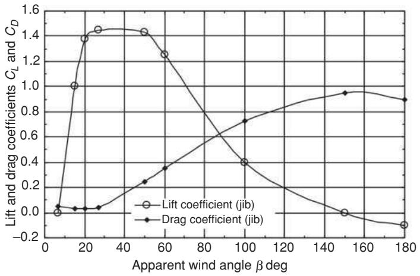

<details>
<summary>line</summary>

| Apparent wind angle β deg | Lift coefficient (jib) | Drag coefficient (jib) |
| ------------------------- | ---------------------- | ---------------------- |
| 0                         | 0.0                    | 0.0                    |
| 20                        | 1.4                    | 0.0                    |
| 40                        | 1.4                    | 0.2                    |
| 60                        | 1.2                    | 0.3                    |
| 80                        | 0.8                    | 0.5                    |
| 100                       | 0.4                    | 0.7                    |
| 120                       | 0.2                    | 0.8                    |
| 140                       | 0.0                    | 0.9                    |
| 160                       | -0.1                   | 0.9                    |
| 180                       | -0.2                   | 0.9                    |
</details>

Figure 16.28. Lift and drag coefficients for jib.

with $V _ { 1 } = V _ { S } + V _ { T }$ cos $\gamma$ and $V _ { 2 } \approx V _ { T }$ sin γ cos $\phi .$ , where γ is the true wind angle (or course angle), $V _ { T }$ is the true wind velocity, $V _ { S }$ is the boat speed and $\phi$ is the heel angle.

In making performance estimates the total lift and drag values from the rig are used, calculated from the force coefficients as follows:

$$
L = \frac {1}{2} \rho_ {A} A _ {n} V _ {A} ^ {2} C _ {L} \tag {16.74}
$$

$$
D = \frac {1}{2} \rho_ {A} A _ {n} V _ {A} ^ {2} C _ {D}. \tag {16.75}
$$

These rig forces are resolved into the track axes of the yacht and need to balance the hydrodynamic forces. An example of this procedure is given in example application 17, Chapter 17.

# 16.3 Hull and Relative Rotative Efficiency Data

# 16.3.1 Wake Fraction $w \tau$ and Thrust Deduction t

Hull efficiency is defined as $\eta _ { H } = \left( 1 - t \right) / \left( 1 - w _ { T } \right)$ . Wake fractions and thrust deduction factors are dealt with in Chapter 8.

# 16.3.2 Relative Rotative Efficiency, ηR

The relative rotative efficiency is the ratio of the efficiency of the propeller in a wake behind the hull and the efficiency of the propeller in open water, see Chapter 8. It is obtained from the model self-propulsion test, Section 8.7. $\eta _ { R }$ ranges typically from 0.95 to 1.05 and is often assumed to be unity for preliminary design purposes. ηR depends on a number of parameters, including propeller diameter and pitch and hull form. In the absence of self-propulsion tests, empirical data for $\eta _ { R }$ may be used for preliminary powering calculations. Data are available from references such as [16.75–16.84] and are summarised below.

# 16.3.2.1 Single Screw

BRITISH SHIP RESEARCH ASSOCIATION (BSRA) SERIES [16.75]. Equation (16.76) is the preferred expression. Equation (16.77) is an alternative if pitch ratio $( P / D )$ and blade area ratio (BAR) are not available.

$$
\eta_ {R} = 0. 8 3 7 2 + 0. 1 3 3 8 C _ {B} + 1. 5 1 8 8 D / L _ {B P} + 0. 1 2 4 0 P / D - 0. 1 1 5 2 \text {BAR}. \tag {16.76}
$$

$$
\eta_ {R} = 0. 5 5 2 4 + 0. 8 4 4 3 C _ {B} - 0. 5 0 5 4 C _ {B} ^ {2} + 1. 1 5 1 1 D / L _ {B P} + 0. 4 7 1 8 D / \nabla^ {1 / 3}, \tag {16.77}
$$

where D is the propeller diameter in m, ∇ is displaced volume in $\mathbf { m } ^ { 3 }$ , the $C _ { B }$ range is 0.55–0.85, the $P / D$ range is 0.60–1.10, the BAR range is 0.40–0.80 and the $D / L _ { B P }$ range is 0.02–0.06.

SERIES 60 [16.76]. A regression equation for $\eta _ { R }$ was developed, Equation (16.78). The ranges of the hull parameters are as follows: $L / B , 5 . 5 \mathrm { - } 8 . 5 ; B / T , 2 . 5 \mathrm { - } 3 . 5 ; C _ { B }$ , 0.60–0.80 and $L C B , - 2 . 4 8 \% \ \mathrm { t o } + 3 . 5 1 \%$ . The regression $ { \mathrm { \Delta } } \cdot  { \mathrm { d } } ^ { \flat }$ coefficients for a range of speeds are tabulated in Appendix A4, Table A4.6.

$$
\begin{array}{l} \eta_ {R} = \mathrm{d} _ {1} + \mathrm{d} _ {2} (L / B) + \mathrm{d} _ {3} (B / T) + \mathrm{d} _ {4} (C _ {B}) + \mathrm{d} _ {5} (L C B) + \mathrm{d} _ {6} (L / B) ^ {2} \\ + \mathrm{d} _ {7} (B / T) ^ {2} + \mathrm{d} _ {8} (C _ {B}) ^ {2} + \mathrm{d} _ {9} (L C B) ^ {2} + \mathrm{d} _ {1 0} (L / B) (B / T) \\ + \mathrm{d} _ {1 1} (L / B) \left(C _ {B}\right) + \mathrm{d} _ {1 2} (L / B) (L C B) + \mathrm{d} _ {1 3} (B / T) \left(C _ {B}\right) \\ + \mathrm{d} _ {1 4} (B / T) (L C B) + \mathrm{d} _ {1 5} (C _ {B}) (L C B). \tag {16.78} \\ \end{array}
$$

HOLTROP [16.77].

$$
\eta_ {R} = 0. 9 9 2 2 - 0. 0 5 9 0 8 (\mathrm{BAR}) + 0. 0 7 4 2 4 (C p - 0. 0 2 2 5 L C B), \tag {16.79}
$$

where LCB is $L _ { C B }$ forward of 0.5L as a percentage of L.

# 16.3.2.2 Twin Screw

HOLTROP [16.77].

$$
\eta_ {R} = 0. 9 7 3 7 + 0. 1 1 1 (C p - 0. 0 2 2 5 L C B) - 0. 0 6 3 2 5 P / D, \tag {16.80}
$$

where $L C B$ is $L _ { C B }$ forward of 0.5L as a percentage of L.

# 16.3.2.3 Podded Unit

FLIKKEMA ET AL. [16.23].

$$
\eta_ {R p} = 1. 4 9 3 - 0. 1 8 4 2 5 C _ {P} - 0. 4 2 7 8 L C B - 0. 3 3 8 0 4 P / D \tag {16.81}
$$

where LCB is $( L _ { C B }$ forward of $0 . 5 L ) / L$ .

# 16.3.2.4 Tug Data

PARKER–DAWSON [16.78] AND MOOR [16.79]. Typical approximate mean values of $\eta _ { R }$ from [16.78, 16.79] are given in Table 16.10. Further data for changes in propeller diameter and hull form are given in [16.78 and 16.79].

# 16.3.2.5 Trawler Data

BSRA [16.80, 16.81, 16.82]. Typical approximate values of $\eta _ { R }$ for trawler forms, from [16.81], are given in Table 16.11. Speed range $F r = 0 . 2 9 – 0 . 3 3$ . The influence of $L / \nabla ^ { 1 / 3 }$ , B/T, LCB and hull shape variations are given in [16.80 and 16.82].

Table 16.10. Relative rotative efficiency for tugs 

<table><tr><td>Source</td><td>Fr</td><td> $\eta_R$ </td><td>Case</td></tr><tr><td rowspan="5">Reference [16.78]  $C_B = 0.503$ </td><td>0.34</td><td>1.02</td><td>Free-running</td></tr><tr><td>0.21</td><td>-</td><td>Towing</td></tr><tr><td>0.15</td><td>-</td><td>Towing</td></tr><tr><td>0.09</td><td>-</td><td>Towing</td></tr><tr><td>0 (bollard)</td><td>-</td><td>Bollard</td></tr><tr><td rowspan="4">Reference [16.79]  $C_B = 0.575$ </td><td>0.36</td><td>1.01</td><td>Free-running</td></tr><tr><td>0.21</td><td>1.03</td><td>Towing</td></tr><tr><td>0.12</td><td>1.02</td><td>Towing</td></tr><tr><td>0 (bollard)</td><td>-</td><td>Bollard</td></tr></table>

Table 16.11. Relative rotative efficiency for trawlers 

<table><tr><td>$ C_{B} $</td><td>$ \eta_{R} $</td></tr><tr><td>0.53</td><td>1.048</td></tr><tr><td>0.57</td><td>1.043</td></tr><tr><td>0.60</td><td>1.030</td></tr></table>

Table 16.12. Relative rotative efficiency for round bilge semi-displacement forms 

<table><tr><td> $C_B$  range</td><td> $Fr_{\nabla}$ </td><td> $\eta_R$ </td></tr><tr><td rowspan="3"> $C_B < 0.45$ </td><td>0.6</td><td>0.95</td></tr><tr><td>1.4</td><td>0.95</td></tr><tr><td>2.6</td><td>0.95</td></tr><tr><td rowspan="3"> $C_B > 0.45$ </td><td>0.6</td><td>1.07</td></tr><tr><td>1.4</td><td>0.95</td></tr><tr><td>2.2</td><td>0.96</td></tr></table>

# 16.3.2.6 Round Bilge Semi-displacement Craft

BAILEY [16.83]. Typical approximate mean values of $\eta _ { R }$ for round bilge forms are given in Table 16.12. The data are generally applicable to round bilge forms in association with twin screws. Speed range $F r _ { \nabla } = 0 . 5 8 – 2 . 7 6 .$ , where $F r _ { \nabla } = V / \sqrt { g \nabla ^ { 1 / 3 } }$ [V, m/s; $\nabla , \mathbf { m } ^ { 3 } ]$ or $F r _ { \nabla } = 0 . 1 6 5 ~ V / \Delta ^ { 1 / 6 }$ [V in knots, $\Delta$ in tonnes] and the $C _ { B }$ range is 0.37–0.52. Regression equations are derived for $\eta _ { R }$ in [16.83].

GAMULIN [16.84]. In the round bilge SKLAD series, typical approximate values can be obtained as follows: $C _ { B } \leq 0 . 4 5$ , speed range $F r _ { \nabla } = 0 . 6 0 – 3 . 0$

$$
\eta_ {R} = 0. 0 3 5 F r _ {\Delta} + 0. 9 0.
$$

# REFERENCES (CHAPTER 16)

16.1 Van Manen, J.D. The choice of propeller. Marine Technology, SNAME, Vol. 3, No. 2, April 1966, pp. 158–171.   
16.2 Lewis, E.V. (ed.) Principles of Naval Architecture. The Society of Naval Architects and Marine Engineers, New York, 1988.   
16.3 Rawson, K.J. and Tupper, E.C. Basic Ship Theory. 5th Edition, Combined Volume. Butterworth-Heinemann, Oxford, UK, 2001.   
16.4 Molland, A.F. (ed.) The Maritime Engineering Reference Book. Butterworth-Heinemann, Oxford, UK, 2008.   
16.5 O’Brien, T.P. The Design of Marine Screw Propellers. Hutchinson and Co., London, 1969.   
16.6 Van Lammeren, W.P.A., Van Manen, J.D. and Oosterveld, M.W.C. The Wageningen B-Screw Series. Transactions of the Society of Naval Architects and Marine Engineers, Vol. 77, 1969, pp. 269–317.

16.7 Gawn, R.W.L. Effects of pitch and blade width on propeller performance. Transactions of the Royal Institution of Naval Architects, Vol. 95, 1953, pp. 157–193.   
16.8 Yazaki, A. Design diagrams of modern four, five, six and seven-bladed propellers developed in Japan. 4th Naval Hydrodynamics Symposium, National Academy of Sciences, Washington, DC, 1962.   
16.9 Lingren, H. Model tests with a family of three and five bladed propellers. SSPA Paper No. 47, Gothenburg, 1961.   
16.10 Gawn, R.W.L. and Burrill, L.C. Effect of cavitation on the performance of a series of 16 in. model propellers. Transactions of the Royal Institution of Naval Architects, Vol. 99, 1957, pp. 690–728.   
16.11 Burrill, L.C. and Emerson, A. Propeller cavitation: some observations from 16 in. propeller tests in the new King’s College Cavitation Tunnel. Transactions of the North East Coast Institution of Engineers and Shipbuilders, Vol. 70, 1953, pp. 121–150.   
16.12 Burrill, L.C. and Emerson, A. Propeller cavitation: further tests on 16 in. propeller models in the King’s College Cavitation Tunnel. Transactions of the North East Coast Institution of Engineers and Shipbuilders, Vol. 79, 1962– 1963, pp. 295–320.   
16.13 Emerson, A. and Sinclair, L. Propeller design and model experiments. Transactions of the North East Coast Institution of Engineers and Shipbuilders, Vol. 94, No. 6, 1978, pp. 199–234.   
16.14 Carlton, J.S. Marine Propellers and Propulsion. 2nd Edition Butterworth-Heinemann, Oxford, UK, 2007.   
16.15 Oosterveld, M.W.C., van Oossanen, P. Further computer-analysed data of the Wageningen B-screw series. International Shipbuilding Progress, Vol. 22, No. 251, July 1975, pp. 251–262.   
16.16 Blount, D.L. and Hubble, E.N. Sizing segmental section commercially available propellers for small craft. Propellers 1981. SNAME Symposium, 1981.   
16.17 Baker, G.S. The effect of propeller boss diameter upon thrust and efficiency at given revolutions. Transactions of the Royal Institution of Naval Architects, Vol. 94, 1952, pp. 92–109.   
16.18 Oosterveld, M.W.C. Wake adapted ducted propellers. NSMB Wageningen Publication No. 345, 1970.   
16.19 Oosterveld, M.W.C. Ducted propeller characteristics. RINA Symposium on Ducted Propellers, RINA, London, 1973.   
16.20 ITTC. Report of specialist comitteee on azimuthing podded propulsors. Proceedings of 25th ITTC, Vol. II. Fukuoka, 2008.   
16.21 Molland, A.F. and Turnock, S.R. Marine Rudders and Control Surfaces. Butterworh-Heinemann, Oxford, UK. 2007.   
16.22 Hoerner, S.F. Fluid-Dynamic Drag. Published by the author, New York, 1965.   
16.23 Flikkema, M.B., Holtrop, J. and Van Terwisga, T.J.C. A parametric power prediction model for tractor pods. Proceedings of the Second International Conference on Advances in Podded Propulsion, T-POD. University of Brest, France, October 2006.   
16.24 Stierman, E.J. The influence of the rudder on the propulsive performance of ships. Parts I and II. International Shipbuilding Progress, Vol. 36, No. 407, 1989, pp. 303–334; No. 408, 1989, pp. 405–435.   
16.25 Funeno, I. Hydrodynamic development and propeller design method of azimuthing podded propulsion systems. Ninth Symposium on Practical Design of Ships and Other Floating Structures, PRADS’2004, Lubeck- Travem ¨ unde, ¨ Germany, 2004, pp. 888–893.   
16.26 Islam, M.F., He, M. and Veitch, B. Cavitation characteristics of some pushing and pulling podded propellers. Transactions of the Royal Institution of Naval Architects, Vol. 149, 2007, pp. 41–50.

16.27 Islam, M.F., Molloys, S., He, M., Veitch, B., Bose, N. and Liu, P. Hydrodynamic study of podded propulsors with systematically varied geometry. Proceedings of the Second International Conference on Advances in Podded Propulsion, T-POD. University of Brest, France, October 2006.   
16.28 Bose, N. Marine Powering Predictions and Propulsors. The Society of Naval Architects and Marine Engineers. New York, 2008.   
16.29 Heinke, C. and Heinke, H-J. Investigations about the use of podded drives for fast ships. Proceedings of Seventh International Conference on Fast Sea Transportation, FAST’2003, Ischia, Italy, October 2003.   
16.30 Frolova, I., Kaprantsev, S., Pustoshny, A. and Veikonheimo, T. Development of the propeller series for azipod compact. Proceedings of the Second International Conference on Advances in Podded Propulsion, T-POD. University of Brest, France, October 2006.   
16.31 T-POD First International Conference on Advances in Podded Propulsion, Conference Proceedings, University of Newcastle, UK, 2004.   
16.32 T-POD Second International Conference on Advances in Podded Propulsion, Conference Proceedings, University of Brest, France, October 2006.   
16.33 ITTC. Report of Propulsion Committee. Proceedings of the 23rd ITTC, Venice, 2002.   
16.34 ITTC. Report of specialist comitteee on azimuthing podded propulsors. Proceedings of 24th ITTC, Vol. II. Edinburgh, 2005.   
16.35 Radojcic, D. An engineering approach to predicting the hydrodynamic performance of planing craft using computer techniques. Transactions of the Royal Institution of Naval Architects, Vol. 133, 1991, pp. 251–267.   
16.36 Newton, R.N. and Rader, H.P. Performance data of propellers for highspeed craft. Transactions of the Royal Institution of Naval Architects, Vol. 103, 1961, pp. 93–129.   
16.37 Tulin, M.P. Supercavitating flow past foils and struts. Proceedings of NPL Symposium on Cavitation in Hydrodynamics. Her Majesty’s Stationery Office, London, 1956.   
16.38 Rose, J.C. and Kruppa, F.L. Surface piercing propellers: Methodical series model test results, Proceedings of First International Conference on Fast Sea Transportation, FAST’91, Trondheim, 1991.   
16.39 Ferrando, M., Scamardella, A., Bose, N., Liu, P. and Veitch, B. Performance of a family of surface piercing propellers. Transactions of the Royal Institution of Naval Architects, Vol. 144, 2002, pp. 63–75.   
16.40 Chudley, J., Grieve, D. and Dyson, P.K. Determination of transient loads on surface piercing propellers. Transactions of the Royal Institution of Naval Architects, Vol. 144, 2002, pp. 125–141.   
16.41 Gutsche, F. The study of ships’ propellers in oblique flow. Schiffbauforschung 3, 3/4. Translation from German, Defence Research Information Centre DRIC Translation No. 4306, 1964, pp. 97–122.   
16.42 Hadler, J.B. The prediction of power performance of planing craft. Transactions of the Society of Naval Architects and Marine Engineers, Vol. 74, 1966, pp. 563–610.   
16.43 Peck, J.G. and Moore, D.H. Inclined-shaft propeller performance characteristics. Paper G, SNAME Spring Meeting, April 1973, pp. G1–G21.   
16.44 Barnaby, K.C. Basic Naval Architecture. Hutchinson, London, 1963.   
16.45 Mackenzie, P.M. and Forrester, M.A. Sailboat propeller drag. Ocean Engineering, Vol. 35, No. 1, January 2008, p. 28.   
16.46 Miles, A., Wellicome, J.F. and Molland, A.F. The technical and commercial development of self-pitching propellers. Transactions of the Royal Institution of Naval Architects, Vol. 135, 1993, pp. 133–147.   
16.47 Allison, J.L. Marine waterjet propulsion. Transactions of the Society of Naval Architects and Marine Engineers, Vol. 101, 1993, pp. 275–335.

16.48 Van Terwisga, T. A parametric propulsion prediction method for waterjet driven craft. Proceedings of Fourth International Conference on Fast Sea Transportation, FAST’97, Sydney, Australia. Baird Publications, South Yarra, Australia, July 1997.   
16.49 ITTC. Report of Specialist Committee on Validation of Waterjet Test Procedures. Proceedings of 23rd ITTC, Vol. II, Venice, 2002.   
16.50 ITTC. Report of Specialist Committee on Validation of Waterjet Test Procedures. Proceedings of 24th ITTC, Vol. II, Edinburgh, 2005.   
16.51 Proceedings of International Conference on Waterjet Propulsion III, RINA, Gothenburg, 2001.   
16.52 Proceedings of International Conference on Waterjet Propulsion IV, RINA, London, 2004.   
16.53 Michael, T.J. and Chesnakas, C.J. Advanced design, analysis and testing of waterjet pumps. 25th Symposium on Naval Hydrodynamics, St. John’s, Newfoundland and Labrador, Canada, August 2004, pp. 104–114.   
16.54 Brennen, C.E. Hydrodynamics of Pumps. Oxford University Press, 1994.   
16.55 Svensson, R. Water jet for naval applications. RINA International Conference on New Developments in Warship Propulsion. RINA, London, 1989.   
16.56 Van Manen, J.D. Results of systematic tests with vertical axis propellers. International Shipbuilding Progress, Vol. 13, 1966.   
16.57 Van Manen, J.D. Non-conventional propulsion devices. International Shipbuilding Progress, Vol. 20, No. 226, June 1973, pp. 173–193.   
16.58 Volpich, H. and Bridge, I.C. Paddle wheels: Part I, Preliminary model experiments. Transactions Institute of Engineers and Shipbuilders in Scotland IESS, Vol. 98, 1954–1955, pp. 327–380.   
16.59 Volpich, H. and Bridge, I.C. Paddle wheels: Part II, Systematic model experiments. Transactions Institute of Engineers and Shipbuilders in Scotland IESS, Vol. 99, 1955–1956, pp. 467–510.   
16.60 Volpich, H. and Bridge, I.C. Paddle wheels: Part IIa, III, Further model experiments and ship/model correlation. Transactions Institute of Engineers and Shipbuilders in Scotland IESS, Vol. 100, 1956–1957, pp. 505–550.   
16.61 English, J.W. The design and performance of lateral thrust units. Transactions of the Royal Institution of Naval Architects, Vol. 105, 1963, pp. 251–278.   
16.62 Ridley, D.E. Observations on the effect of vessel speed on bow thruster performance. Marine Technology, 1971, pp. 93–96.   
16.63 Norrby, R.A. and Ridley, D.E. Notes on ship thrusters. Transactions of the Institute of Marine Engineers. Vol. 93, Paper 6, 1981, pp. 2–8.   
16.64 Brix, J. (ed.) Manoeuvring Technical Manual, Seehafen Verlag, Hamburg, 1993.   
16.65 Alexander, F.H. The propulsive efficiency of rowing. In Transactions of the Royal Institution of Naval Architects, Vol. 69, 1927, pp. 228–244.   
16.66 Wellicome, J.F. Some hydrodynamic aspects of rowing. In Rowing – A Scientific Approach, ed. J.P.G. Williams and A.C. Scott. A.S. Barnes, New York, 1967.   
16.67 Shaw, J.T. Rowing in ships and boats. Transactions of the Royal Institution of Naval Architects, Vol. 135, 1993, pp. 211–224.   
16.68 Kleshnev, V. Propulsive efficiency of rowing. Proceedings of XVII International Symposium on Biomechanics in Sports, Perth, Australia, 1999, pp. 224– 228.   
16.69 Marchaj, C.A. Aero-Hydrodynamics of Sailing, Adlard Coles Nautical, London, 1979.   
16.70 Campbell, I.M.C. Optimisation of a sailing rig using wind tunnel data, The 13th Chesapeake Sailing Yacht Symposium, Annapolis. SNAME. 1997.   
16.71 Offshore Racing Congress. VPP Documentation 2009 Offshore Racing Congress. http://www.orc.org/ (last accessed 3 June 2010). 69 pages.

16.72 Hazen, G.S. A model of sail aerodynamics for diverse rig types, New England Sailing Yacht Symposium. SNAME, 1980.   
16.73 Claughton, A.R. Developments in the IMS VPP formulations, The 14th Chesapeake Sailing Yacht Symposium, Annapolis. The Society of Naval Architects and Marine Engineers, 1999, pp. 27–40.   
16.74 Larsson, L. and Eliasson, R.E. Principles of Yacht Design. 3rd Edition, Adlard Coles Nautical, London, 2009.   
16.75 Pattullo, R.N.M. and Wright, B.D.W. Methodical series experiments on single-screw ocean-going merchant ship forms. Extended and revised overall analysis. BSRA Report NS333, 1971.   
16.76 Sabit, A.S. An analysis of the Series 60 results: Part II, Regression analysis of the propulsion factors. International Shipbuilding Progress, Vol. 19, No. 217, September 1972, pp. 294–301.   
16.77 Holtrop, J. and Mennen, G. G. J. An approximate power prediction method. International Shipbuilding Progress, Vol. 29, No. 335, July 1982, pp. 166–170.   
16.78 Parker, M.N. and Dawson, J. Tug propulsion investigation. The effect of a buttock flow stern on bollard pull, towing and free-running performance. Transactions of the Royal Institution of Naval Architects, Vol. 104, 1962, pp. 237–279.   
16.79 Moor, D.I. An investigation of tug propulsion. Transactions of the Royal Institution of Naval Architects, Vol. 105, 1963, pp. 107–152.   
16.80 Pattulo, R.N.M. and Thomson, G.R. The BSRA Trawler Series (Part I). Beam-draught and length-displacement ratio series, resistance and propulsion tests. Transactions of the Royal Institution of Naval Architects, Vol. 107, 1965, pp. 215–241.   
16.81 Pattulo, R.N.M. The BSRA Trawler Series (Part II). Block coefficient and longitudinal centre of buoyancy series, resistance and propulsion tests. Transactions of the Royal Institution of Naval Architects, Vol. 110, 1968, pp. 151–183.   
16.82 Thomson, G.R. and Pattulo, R.N.M. The BSRA Trawler Series (Part III). Resistance and propulsion tests with bow and stern variations. Transactions of the Royal Institution of Naval Architects, Vol. 111, 1969, pp. 317–342.   
16.83 Bailey, D. A statistical analysis of propulsion data obtained from models of high speed round bilge hulls. Symposium on Small Fast Warships and Security Vessels. RINA, London, 1982.   
16.84 Gamulin, A. A displacement series of ships. International Shipbuilding Progress, Vol. 43, No. 434, 1996, pp. 93–107.

# 17 Applications

# 17.1 Background

The overall ship powering process is shown in Figure 2.3. A number of worked examples are presented to illustrate typical applications of the resistance and propulsor data and methodologies for estimating ship propulsive power for various ship types and size. The examples are grouped broadly into the estimation of effective power and propeller/propulsor design for large and small displacement ships, semi-displacement ships, planing craft and sailing vessels.

The resistance data are presented in Chapter 10 together with tables of data in Appendix A3. The propeller data are presented in Chapter 16, together with tables of data in Appendix A4.

It should be noted that the example applications use resistance data derived mainly from the results of standard series experiments and regression analyses. As such, they serve a very useful purpose, particularly at the preliminary design stage, but they tend to predict results only at an average level. Many favourable developments in hull form have occurred since the publication of the standard series data, leading to more efficient hull forms. These are, however, generally not in parametric variation form or published. Consequently, improvements in the resistance predictions in some of the worked example applications would be likely with the use of experimental and computational investigations. There have not been such significant improvements in the basic propeller series data and, as such, the series should broadly predict efficiencies likely to be achieved.

# 17.2 Example Applications

# 17.2.1 Example Application 1. Tank Test Data: Estimate of Ship Effective Power

The following data relate to the resistance test on a ship model:

Model L: 4.3 m. Ship L: 129 m. (scale λ = 30).

Model wetted surface area: $3 . 7 5 \mathrm { m } ^ { 2 }$ , model test speed: 1.5 m/s.

Model total resistance at 1.5 m/s: 18.0 N.

With the use of empirical data, such as that described in Chapter 4, the form factor $( 1 + k )$ is estimated to be 1.15. The ship wetted surface area is as follows:

$$
S = 3. 7 5 \times \left(\frac {1 2 9}{4 . 3}\right) ^ {2} = 3 3 7 5 \mathrm{m} ^ {2}.
$$

The corresponding ship speed (constant Froude number) is as follows:

$$
V _ {S} = 1. 5 \times \sqrt {\frac {1 2 9}{4 . 3}} = 8. 2 2 \mathrm{m/s} = 1 5. 9 8 \mathrm{knots}.
$$

From Table A1.2, $\nu _ { F W } = 1 . 1 4 0 \times 1 0 ^ { - 6 } \mathrm { m } ^ { 2 }$ /s and $\nu _ { S W } = 1 . 1 9 0 \times 1 0 ^ { - 6 } \mathrm { m } ^ { 2 } / \mathrm { s } .$

# 17.2.1.1 Estimate of Ship $P _ { E }$ Using International Towing Tank Conference (ITTC) Correlation Line, Without a Form Factor

$$
C _ {T M} = R _ {T} / \frac {1}{2} \rho S V ^ {2} = 1 8. 0 \times 2 / (1 0 0 0 \times 3. 7 5 \times 1. 5 ^ {2}) = 4. 2 6 7 \times 1 0 ^ {- 3}.
$$

$$
R e _ {M} = V L / \nu = 1. 5 \times 4. 3 / 1. 1 4 \times 1 0 ^ {- 6} = 5. 6 6 \times 1 0 ^ {6}.
$$

$$
C _ {F M} = 0. 0 7 5 / (\log R e - 2) ^ {2} = 0. 0 7 5 / (6. 7 5 3 - 2) ^ {2} = 3. 3 2 0 \times 1 0 ^ {- 3}.
$$

$$
C _ {R M} = C _ {T M} - C _ {F M} = (4. 2 6 7 - 3. 3 2 0) \times 1 0 ^ {- 3} = 0. 9 4 7 \times 1 0 ^ {- 3}.
$$

$$
R e _ {S} = V L / \nu = 8. 2 2 \times 1 2 9 / 1. 1 9 \times 1 0 ^ {- 6} = 8. 9 1 \times 1 0 ^ {8}.
$$

$$
C _ {F S} = 0. 0 7 5 / (\log R e - 2) ^ {2} = 0. 0 7 5 / (8. 9 5 0 - 2) ^ {2} = 1. 5 5 3 \times 1 0 ^ {- 3}.
$$

$$
C _ {R S} = C _ {R M} = 0. 9 4 7 \times 1 0 ^ {- 3}.
$$

$$
C _ {T S} = C _ {F S} + C _ {R S} = (1. 5 5 3 + 0. 9 4 7) \times 1 0 ^ {- 3} = 2. 5 0 0 \times 1 0 ^ {- 3}.
$$

Ship total resistance is as follows:

$$
\begin{array}{l} R _ {T S} = C _ {T S} \times \frac {1}{2} \rho S V _ {S} ^ {2} \\ = 2. 5 0 0 \times 1 0 ^ {- 3} \times 1 0 2 5 \times 3 3 7 5 \times 8. 2 2 ^ {2} / (2 \times 1 0 0 0) = 2 9 2. 1 8 \mathrm{kN} \\ \end{array}
$$

Ship effective power is as follows:

$$
P _ {E} = R _ {T S} \times V s = 2 9 2. 1 8 \times 8. 2 2 = 2 4 0 1. 7 \mathrm{kW}.
$$

# 17.2.1.2 Estimate of Ship $P _ { E }$ Using the ITTC Correlation Line and a Form Factor (1.15)

$$
C _ {T M} = R _ {T} / \frac {1}{2} \rho S V ^ {2} = 1 8. 0 \times 2 / (1 0 0 0 \times 3. 7 5 \times 1. 5 ^ {2}) = 4. 2 6 7 \times 1 0 ^ {- 3}.
$$

$$
R e _ {M} = V L / \nu = 1. 5 \times 4. 3 / 1. 1 4 \times 1 0 ^ {- 6} = 5. 6 6 \times 1 0 ^ {6}.
$$

$$
C _ {F M} = 0. 0 7 5 / (\log R e - 2) ^ {2} = 0. 0 7 5 / (6. 7 5 3 - 2) ^ {2} = 3. 3 2 0 \times 1 0 ^ {- 3}.
$$

$$
C _ {V M} = (1 + k) C _ {F} = 1. 1 5 \times 3. 3 2 0 \times 1 0 ^ {- 3} = 3. 8 1 8 \times 1 0 ^ {- 3}.
$$

$$
C _ {W M} = C _ {T M} - C _ {V M} = (4. 2 6 7 - 3. 8 1 8) \times 1 0 ^ {- 3} = 0. 4 4 9 \times 1 0 ^ {- 3}.
$$

$$
R e _ {S} = V L / \nu = 8. 2 2 \times 1 2 9 / 1. 1 9 \times 1 0 ^ {- 6} = 8. 9 1 \times 1 0 ^ {8}.
$$

$$
C _ {F S} = 0. 0 7 5 / (\log R e - 2) ^ {2} = 0. 0 7 5 / (8. 9 5 0 - 2) ^ {2} = 1. 5 5 3 \times 1 0 ^ {- 3}.
$$

$$
C _ {V s} = (1 + k) C _ {F} = 1. 1 5 \times 1. 5 5 3 \times 1 0 ^ {- 3} = 1. 7 8 6 \times 1 0 ^ {- 3}.
$$

$$
C _ {W S} = C _ {W M} = 0. 4 4 9 \times 1 0 ^ {- 3}.
$$

$$
C _ {T S} = C _ {V S} + C _ {W S} = (1. 7 8 6 + 0. 4 4 9) \times 1 0 ^ {- 3} = 2. 2 3 5 \times 1 0 ^ {- 3}.
$$

Ship total resistance is as follows:

$$
\begin{array}{l} R _ {T S} = C _ {T S} \times \frac {1}{2} \rho S V _ {S} ^ {2} \\ = 2. 2 3 5 \times 1 0 ^ {- 3} \times 1 0 2 5 \times 3 3 7 5 \times 8. 2 2 ^ {2} / (2 \times 1 0 0 0) = 2 6 1. 2 \mathrm{kN}. \\ \end{array}
$$

Ship effective power is as follows:

$$
P _ {E} = R _ {T S} \times V _ {s} = 2 6 1. 2 \times 8. 2 2 = 2 1 4 7. 1 \mathrm{kW}.
$$

It can be noted that, for this case, the effective power reduces by about 11% when a form factor is employed. Based on modern practice, the use of a form factor would be generally recommended, but see also Chapters 4 and 5.

# 17.2.2 Example Application 2. Model Self-propulsion Test Analysis

The following data relate to the self-propulsion test on the model of a single-screw ship. The data are for the ship self-propulsion point, as described in Chapter 8 and Figure 8.9.

Model speed: 1.33 m/s, propeller diameter $D = 0 . 1 9$ m and pitch ratio $P / D =$ 0.80

Revolutions at ship self-propulsion point: 10.0 rps

Towed model resistance corresponding to the ship self-propulsion point: 18.5 N

Thrust at self-propulsion point: 22.42 N

Torque at self-propulsion point: 0.58 Nm

It is convenient (for illustrative purposes) to use the $K _ { T } - K _ { Q }$ open water data for the Wageningen propeller B4.40 for $P / D = 0 . 8 0$ , given in Table 16.1(a). In this case, the following relationships are suitable:

$$
K _ {T} = 0. 3 2 0 \left[ 1 - \left(\frac {J}{0 . 9 0}\right) ^ {1. 3 0} \right]. \quad K _ {Q} = 0. 0 3 6 0 \left[ 1 - \left(\frac {J}{0 . 9 8}\right) ^ {1. 6 0} \right].
$$

$$
J _ {b} = V s / n D = 1. 3 3 / 1 0. 0 \times 0. 1 9 = 0. 7 0 0.
$$

$$
K _ {T b} = T _ {b} / \rho n ^ {2} D ^ {4} = 2 2. 4 2 / 1 0 0 0 \times 1 0. 0 ^ {2} \times 0. 1 9 ^ {4} = 0. 1 7 2.
$$

$$
K _ {Q b} = Q _ {b} / \rho n ^ {2} D ^ {5} = 0. 5 8 / 1 0 0 0 \times 1 0. 0 ^ {2} \times 0. 1 9 ^ {5} = 0. 0 2 3 4.
$$

With the use of a thrust identity, $K _ { T O } = K _ { T b } = 0 . 1 7 2$ . From the open water propeller data at $K _ { T O } = 0 . 1 7 2$ , the following values are obtained:

$$
\begin{array}{l} J _ {O} = 0. 4 9 7 \quad \mathrm{and} \quad K _ {Q O} = 0. 0 2 3 9. \\ w _ {T} = 1 - \left(J _ {O} / J _ {b}\right) = 1 - (0. 4 9 7 / 0. 7 0 0) = 0. 2 9 0. \\ t = 1 - (R / T _ {b}) = 1 - (1 8. 5 / 2 2. 4 2) = 0. 1 7 5. \\ \eta_ {R} = \left[ \frac {K _ {Q O}}{K _ {Q b}} \right] _ {\text {Thrust identity}} = \frac {0 . 0 2 3 9}{0 . 0 2 3 4} = 1. 0 2 1. \\ \end{array}
$$

$$
\eta_ {O} = \frac {J _ {O} K _ {T O}}{2 \pi K _ {Q O}} = \frac {0 . 4 9 7 \times 0 . 1 7 2}{2 \pi \times 0 . 0 2 3 9} = 0. 5 6 9.
$$

$$
\begin{array}{l} \mathrm{QPC} = \eta_ {D} = \eta_ {O} \times \eta_ {H} \times \eta_ {R} = \eta_ {O} \times (1 - t) / (1 - w _ {T}) \times \eta_ {R} \\ = 0. 5 6 9 \times (1 - 0. 1 7 5) / (1 - 0. 2 9 0) \times 1. 0 2 1 \\ = 0. 6 7 5, \\ \end{array}
$$

or directly as

$$
\eta_ {D} = (R V) / (2 \pi n Q) = 1 8. 5 \times 1. 3 3 / 2 \pi \times 1 0. 0 \times 0. 5 8 = 0. 6 7 5.
$$

$K _ { T }$ and $K _ { Q }$ , hence $\eta _ { O } .$ , can be scaled from model to full size using Equations (5.13) to (5.19), or using the $R e$ correction given with the Wageningen series in Chapter 16. $w _ { T }$ can be scaled from model to full size using Equation (5.22). $\eta _ { R }$ is assumed the same for model and full scale.

# 17.2.3 Example Application 3. Wake Analysis from Full-Scale Trials Data

Measurements during a ship trial included ship speed, propeller revolutions and measurement of propeller shaft torque.

The details of the propeller and measurements from the trial are as follows:

Propeller diameter: $D = 6 . 0$ m, pitch ratio $P / D = 0 . 9 0 .$ .

Propeller revolutions $N = 1 1 5$ rpm.

Delivered power $P _ { D } = 1 1 , 6 0 0 \mathrm { k W }$ (from measurement of torque and rpm).

Estimated effective power $P _ { E } = 7 7 0 0$ kW (from model tank tests)

Estimated thrust deduction factor $t = 0 . 1 8$ (from model self-propulsion tests).

It is convenient (for illustrative purposes) to use the $K _ { T } - K _ { Q }$ open water data for the Wageningen propeller B4.40 for $P / D = 0 . 9 0$ , given in Table 16.1(a). In this case, the following relationships are suitable:

$$
K _ {T} = 0. 3 5 5 \left[ 1 - \left(\frac {J}{1 . 0 1}\right) ^ {1. 3 2} \right]. K _ {Q} = 0. 0 4 4 5 \left[ 1 - \left(\frac {J}{1 . 0 7}\right) ^ {1. 6 5} \right].
$$

$$
N = 1 1 5 \mathrm{rpm} \text {   and   } n = 1 1 5 / 6 0 = 1. 9 1 7 \mathrm{rps}.
$$

$$
P _ {D} = 2 \pi n Q _ {b},
$$

where $Q _ { b }$ is the measured torque in the behind condition.

$$
Q _ {b} = P _ {D} / 2 \pi n = 1 1 6 0 0 / (2 \pi \times 1. 9 1 7) = 9 6 3. 1 \mathrm{kNm}.
$$

Behind $K _ { O b } = \mathcal { Q } _ { b } / \rho n ^ { 2 } D ^ { 5 } = 9 6 3 . 1 \times 1 0 0 0 / ( 1 0 2 5 \times 1 . 9 1 7 ^ { 2 } \times 6 . 0 ^ { 5 } ) = 0 . 0 3 2 9 ,$ , using a torque identity, $K _ { Q O } = K _ { Q b } = 0 . 0 3 2 9$ , from the open water propeller data at $K _ { Q O } = 0 . 0 3 2 9$ ,

$$
J _ {0} = 0. 4 7 2 \text { and } K _ {T 0} = 0. 2 2 5.
$$

$$
J _ {b} = V s / n D = 1 6 \times 0. 5 1 4 4 / 1. 9 1 7 \times 6. 0 = 0. 7 1 6
$$

$$
w _ {T} = 1 - \left(J _ {0} / J _ {b}\right) = 1 - (0. 4 7 2 / 0. 7 1 6) = 0. 3 4 1.
$$

Estimated thrust (based on the model experiments) is as follows:

$$
T = P _ {E} / [ (1 - t) V s ] = 7 7 0 0 / [ (1 - 0. 1 8) \times 1 6 \times 0. 5 1 4 4 ] = 1 1 4 0. 9 2 \mathrm{kN}
$$

Table 17.1. Equivalent 400 ft ship dimensions, cargo ship 

<table><tr><td>Units</td><td>L</td><td>B</td><td>T</td></tr><tr><td>m</td><td>140</td><td>21.5</td><td>8.5</td></tr><tr><td>ft</td><td>459.2</td><td>70.52</td><td>27.88</td></tr><tr><td>Equivalent 400 ft</td><td>400</td><td>61.43</td><td>24.29</td></tr><tr><td>BSRA ft</td><td>400</td><td>55</td><td>26</td></tr></table>

and

$$
K _ {T b} = T / p n ^ {2} D ^ {4} = 1 1 4 0. 9 2 \times 1 0 0 0 / (1 0 2 5 \times 1. 9 1 7 ^ {2} \times 6. 0 ^ {4}) = 0. 2 3 4
$$

$$
\eta_ {R} = \left[ \frac {K _ {T b}}{K _ {T o}} \right] _ {\text { Torque   identity }} = \frac {0 . 2 3 4}{0 . 2 2 5} = 1. 0 4.
$$

This estimate of $\eta _ { R }$ must only be seen as approximate, as full-scale measurement of propeller thrust would be required to obtain a fully reliable estimate. Measurement of full-scale propeller thrust is not common practice. The scaling of wake is discussed in Chapter 5.

# 17.2.4 Example Application 4. 140 m Cargo Ship: Estimate of Effective Power

The dimensions are as follows: $L _ { B P } = 1 4 0 \ \mathrm { m } \times { B } = 2 1 . 5 \ \mathrm { m } \times { T } = 8 . 5 \ \mathrm { m } \times { C } _ { B } =$ $0 . 7 0 0 \times L C B = 0 . 2 5 ^ { \circ } \circ F . C _ { P } = 0 . 7 2 2 , C _ { W } = 0 . 8 0 0 , S = 4 1 3 0 { \mathrm { m } } ^ { 2 }$ and propeller diameter $\textrm { D } = ~ 5 . 0 \mathrm { m }$ . The service speed is 15 knots. Load displacement: $\nabla =$ 17,909.5 m3,   18357.2 tonnes, $L / \nabla ^ { 1 / 3 } = 5 . 3 5 , L / B = 6 . 5 1 , B / T = 2 . 5 3$ .

$$
F r = V / \sqrt {g L} = 1 5 \times 0. 5 1 4 4 / \sqrt {9 . 8 1 \times 1 4 0} = 0. 2 0 8.
$$

The length, 140 m = 459.2 ft, and $V _ { k } / \surd L _ { f } = 1 5 / \surd 4 5 9 . 2 = 0 . 7 0 0 ~ [ V _ { 4 0 0 } = \surd 4 0 0 \times$ $0 . 7 0 = 1$ 4 knots]. Equivalent 400 ft dimensions are given in Table 17.1.

Using the Moor and Small data, Section 10.3.1.3 and Table ${ \bf A } 3 . 6 .$ , for $V _ { k } / \sqrt { L _ { f } } = 0 . 7 0 0 \ [ V _ { 4 0 0 } = 1 4 \mathrm { k n o t s } ]$ , $C _ { B } = 0 . 7 0 0$ and $L C B = + 0 . 2 5 \% \mathrm { F } , \odot _ { 4 0 0 } = 0 . 7 0 2$ (for standard BSRA dimensions 400 ft $\times 5 5 \mathrm { f t } \times 2 6 \mathrm { f t } )$ .

Applying Mumford indices, Equation (10.21),

$$
ⓒ 1 = ⓒ 2 \times \left(\frac {B _ {2}}{B _ {1}}\right) ^ {x - \frac {2}{3}} \left(\frac {T _ {2}}{T _ {1}}\right) ^ {y - \frac {2}{3}}.
$$

From Table 10.1, at $V _ { k } / \sqrt { L _ { f } } = 0 . 7 0 , x = 0 . 9 0 , y = 0 . 6 0 ,$ , and

$$
© 400 = 0.702 \times \left(\frac {61.43}{55}\right)^{0.90 - \frac{2}{3}}\left(\frac {24.29}{26}\right)^{0.60 - \frac{2}{3}} = 0.724 (\text{an increase of} 3\%).
$$

The skin friction correction, using Equation (10.2) for $L > 1 2 2 \mathrm { m }$ , is as follows:

$$
\delta Ⓒ = - 0. 1 / [ 1 + (1 8 8 / (L - 1 2 2)) ],
$$

for $\mathrm { L } = 1 4 0 \mathrm { m } , \delta \odot = - 0 . 0 0 8 7$ (or take from Figure 10.5) and corrected $\circled { \mathbf { C } } _ { 1 4 0 } =$ $0 . 7 2 4 - 0 . 0 0 8 7 = 0 . 7 1 5 .$ .

Using Equation (10.3), the effective power is as follows:

$$
\begin{array}{l} P _ {E} = @ _ {s} \times \Delta^ {2 / 3} V ^ {3} / 5 7 9. 8 \\ = 0. 7 1 5 \times (1 8 3 5 7. 2) ^ {2 / 3} \times 1 5 ^ {3} / 5 7 9. 8 \\ = 2 9 0 5. 8 \mathrm{kW}. \\ \end{array}
$$

[BSRA series regression estimates 2838 kW (−2.5%)].

Applying a ship correlation/load factor SCF (1 + x), Table 5.1 or Equation (10.4),

$$
(1 + x) = 1. 2 - \frac {\sqrt {L}}{4 8} = 0. 9 5 3.
$$

Final naked effective power is as follows:

$$
\begin{array}{l} P _ {\text { Enaked }} = 2 9 0 5. 8 \times 0. 9 5 3 \\ = 2 7 6 9. 2 \mathrm{kW}. \\ \end{array}
$$

[Holtrop regression estimates 2866(+3.5%) and Hollenbach 2543(−8%)].

BULBOUS BOW. Inspection of Figure 10.6 indicates that, with $C _ { B } = 0 . 7 0 0$ and $V _ { 4 0 0 } =$ 14, a bulbous bow would not be beneficial. At $C _ { B } = 0 . 7 0 0$ , a bulbous bow would be beneficial at speeds greater than about $V _ { 4 0 0 } = 1 5 . 5$ knots, Figure 10.6 (V140 greater than about 16.6 knots).

APPENDAGES ETC. Total effective power would include any resistance due to appendages and still air (see Chapter 3), together with a roughness/correlation allowance, $C _ { A }$ or $\Delta C _ { F }$ , if applied to Holtrop or Hollenbach (see Chapter 5).

# 17.2.5 Example Application 5. Tanker: Estimates of Effective Power in Load and Ballast Conditions

The dimensions are as follows: $L _ { B P } = 1 7 5 \mathrm { m } \times B = 3 2 . 2 \mathrm { m } \times T = 1 1 . 0 \mathrm { m } \times$ $C _ { B } = 0 . 8 0 0 \times L C B = 2 . 0 ^ { \% } F . \ C _ { P } = 0 . 8 2 0 , \ S = 7 7 8 1 { \mathrm { m } } ^ { 2 } . \ C _ { W } = 0 . 8 8 0$ and propeller diameter D  7.2 m. The service speed is 14.5 knots. Load displacement

$$
\nabla = 4 9, 5 8 8 \mathrm{m} ^ {3}, \Delta = 5 0, 8 2 8 \text {tonnes}, L / \nabla^ {1 / 3} = 4. 7 8, L / B = 5. 4 3, B / T = 2. 9 3.
$$

$$
F r = V / \sqrt {g L} = 1 4. 5 \times 0. 5 1 4 4 / \sqrt {9 . 8 1 \times 1 7 5} = 0. 1 8 0.
$$

Length 175 m = 574 ft and $V _ { k } / L _ { f } = 0 . 6 0 5$ . Using the regression of the BSRA series, the effective power has been estimated as $P _ { E } = 5 0 5 1 \mathrm { k W }$ [Holtrop regression estimates 5012 kW (−2%) and Hollenbach 4899 kW (−3%)]. The displacement in the ballast condition, using all the water ballast, is estimated to be 35,000 tonnes.

Options to estimate the power in the lower (ballast) displacement condition include the BSRA regression analysis in the medium and light conditions and the use of the Moor–O’Connor fractional draught equations, Section 10.3.1.4. This example uses the Moor–O’Connor equations to estimate the effective power in the ballast condition.

Equation (10.22) can be used to estimate the draught in the ballast condition as follows:

$$
\frac {\Delta_ {2}}{\Delta_ {1}} = (T) _ {R} ^ {1. 6 0 7 - 0. 6 6 1 C _ {B}}
$$

where the draught ratio $\begin{array} { r } { ( T ) _ { R } = \big ( \frac { T _ { \mathrm { B a l l a s t } } } { T _ { \mathrm { L o a d } } } \big ) } \end{array}$ ( TBallast ). TLoad

$$
\Delta_ {2} / \Delta_ {1} = 3 5, 0 0 0 / 5 0, 8 2 8 = (T) _ {R} ^ {1. 6 0 7 - 0. 6 6 1 \times 0. 8 0 0} \text { and } (T) _ {R} = 0. 7 0 7 5.
$$

The ballast draught $( \mathrm { l e v e l } ) ~ = 1 1 . 0 \times 0 . 7 0 7 5 = 7 . 8 \ : \mathrm { m }$ .

Equation (10.23) can be used as follows:

$$
\begin{array}{l} \frac {P _ {\text { E   b   a   l   l   a   s   t }}}{P _ {\text { E   l   o   a   d }}} = 1 + [ (T) _ {R} - 1 ] \left\{\left(0. 7 8 9 - 0. 2 7 0 [ (T) _ {R} - 1 ] + 0. 5 2 9 C _ {B} \left(\frac {L}{1 0 T}\right) ^ {0. 5}\right) \right. \\ + V / \sqrt {L} \left(2. 3 3 6 + 1. 4 3 9 [ (T) _ {R} - 1 ] - 4. 0 6 5 C _ {B} \left(\frac {L}{1 0 T}\right) ^ {0. 5}\right) \\ \left. \left. + (V / \sqrt {L}) ^ {2} (- 2. 0 5 6 - 1. 4 8 5) [ (T) _ {R} - 1 ] + 3. 7 9 8 C _ {B} \left(\frac {L}{1 0 T}\right) ^ {0. 5}\right) \right\}, \\ \end{array}
$$

where $[ ( T ) _ { R } - 1 ] = - 0 . 2 9 2 5 .$

$$
C _ {B} \times (L / 1 0 T) ^ {0. 5} = 0. 8 0 0 \times (1 7 5 / (1 0 \times 1 1)) ^ {0. 5} = 1. 0 0 9.
$$

$$
V _ {k} / \sqrt {L _ {f}} = 1 4. 5 / \sqrt {(1 7 5 \times 3 . 2 8)} = 0. 6 0 5
$$

and

$$
\frac {P _ {\text { E   b   a   l   l   a   s   t }}}{P _ {\text { E   l   o   a   d }}} = 0. 8 3 7.
$$

The ballast effective power is as follows:

$$
P _ {\mathrm{Eballast}} = 5 0 5 1 \times 0. 8 3 7 = 4 2 2 8 \mathrm{kW}.
$$

It is likely that the ship would operate at more than 14.5 knots in the ballast condition, for example, on the ship measured mile trials and whilst in service. In this case a curve of ballast power would be developed from the curve of power against speed for the loaded condition.

Example application 6 includes a typical propeller design procedure. Example application 18 investigates the performance of the propeller for a tanker working off-design in the ballast condition.

# 17.2.6 Example Application 6. 8000 TEU Container Ship: Estimates of Effective and Delivered Power

The dimensions are as follows: $L _ { B P } = 3 2 0 \mathrm { m } \times B = 4 3 \mathrm { m } \times T = 1 3 \mathrm { m } \times C _ { B } = 0 . 6 5 0 \times$ $L C B = 1 . 5 \%$ aft. $C _ { P } = 0 . 6 6 3 , C _ { W } = 0 . 7 5 0$ and $S = 1 6 { , } 0 1 6 \mathbf { m } ^ { 2 }$ . The service speed is 25 knots. Using clearance limitations, the propeller diameter is 8.8 m. The load displacement and ratios are as follows:

$$
\nabla = 1 1 6, 2 7 2 \mathrm{m} ^ {3}, \Delta = 1 1 9, 1 7 8. 8 \text {tonnes}, L / \nabla^ {1 / 3} = 6. 5 8, L / B = 7. 4 4, B / T = 3. 3 1.
$$

$$
F r = V / \sqrt {g L} = 2 5 \times 0. 5 1 4 4 / \sqrt {9 . 8 1 \times 3 2 0} = 0. 2 3 0
$$

Table 17.2. Equivalent 400 ft ship dimensions, container ship 

<table><tr><td>Units</td><td>L</td><td>B</td><td>T</td></tr><tr><td>m</td><td>320</td><td>43.0</td><td>13.0</td></tr><tr><td>ft</td><td>1049.6</td><td>141.04</td><td>42.64</td></tr><tr><td>Equivalent 400 ft</td><td>400</td><td>53.75</td><td>16.25</td></tr><tr><td>BSRA ft</td><td>400</td><td>55</td><td>26</td></tr></table>

The length, 320 $\mathrm { m } = 1 0 4 9 . 6 \mathrm { f t }$ , and $V _ { k } / { \sqrt { L _ { f } } } = 2 5 / { \sqrt { 1 0 4 9 . 6 } } = 0 . 7 7 2 \left[ V _ { 4 0 0 } = { \sqrt { 4 0 0 \times } } \right.$ $0 . 7 7 2 = 1 5 . 4 \mathrm { k n o t s } ]$ . Equivalent 400 ft dimensions are given in Table 17.2.

# 17.2.6.1 Effective Power

Using the Moor and Small data, Section 10.3.1.3 and Table A3.6, for $V _ { k } / \sqrt { L _ { f } } =$ $0 . 7 7 2 [ V _ { 4 0 0 } = 1 5 . 4$ knots], $C _ { B } = 0 . 6 5 0$ and $L C B = - 1 . 5 \%$ A, $\textcircled { \mathbb { C } } _ { 4 0 0 } = 0 . 6 9 1$ (for standard BSRA dimensions 400 ft  55 ft  26 ft).

Applying Mumford indices, Equation (10.21),

$$
ⓒ 1 = ⓒ 2 \times \left(\frac {B _ {2}}{B _ {1}}\right) ^ {x - \frac {2}{3}} \left(\frac {T _ {2}}{T _ {1}}\right) ^ {y - \frac {2}{3}}
$$

From Table 10.1, at $V _ { k } / L _ { f } = 0 . 7 7 2 , x = 0 . 9 0 , y = 0 . 6 3$ and

$$
© 400 = 0.691 \times \left(\frac {53.75}{55}\right)^{0.90 - \frac{2}{3}}\left(\frac {16.25}{26}\right)^{0.63 - \frac{2}{3}} = 0.700 (\text{an increase of} 1.3\%).
$$

The skin friction correction, using Equation (10.2) for $L > 1 2 2 \mathrm { m }$ is

$$
\delta Ⓒ = - 0. 1 / [ 1 + (1 8 8 / (L - 1 2 2)) ]
$$

for $L = 3 2 0 \mathrm { \ m } , \delta \odot = - 0 . 0 5 1 3$ (or take from Figure 10.5) and corrected $\textcircled { \scriptsize { \mathrm { c } } } _ { 3 2 0 } =$ $0 . 7 0 0 - 0 . 0 5 1 3 = 0 . 6 4 9$ .

Using Equation (10.3), the effective power is:

$$
\begin{array}{l} P _ {E} = ⓒ _ {s} \times \Delta^ {2 / 3} V ^ {3} / 5 7 9. 8 \\ = 0. 6 4 9 \times (1 1 9, 1 7 8. 8) ^ {2 / 3} \times 2 5 ^ {3} / 5 7 9. 8 \\ = 4 2, 5 2 1. 8 \mathrm{kW} [ \text {using} 2 / 3 = 0. 6 6 7 ]. \\ \end{array}
$$

[BSRA series regression estimates 43,654 kW (= + 2.7%), Holtrop regression estimates 41,422 (= −2.5%)].

Applying a ship correlation/load factor SCF (1 + x), Table 5.1 or Equation (10.4),

$$
(1 + x) = 1. 2 - \frac {\sqrt {L}}{4 8} = 0. 8 2 7.
$$

The final naked effective power is as follows:

$$
P _ {\mathrm{Enaked}} = 4 2 5 2 1. 8 \times 0. 8 2 7 = 3 5 1 6 5. 5 \mathrm{kW}.
$$

[Hollenbach ‘mean’ estimates 35,352 kW]

BULBOUS BOW. A bulbous bow would normally be fitted to this ship type. Inspection of Figure 10.6 indicates that, with $C _ { B } = 0 . 6 5 0$ and $V _ { 4 0 0 } = 1 5 . 4$ , a bulbous bow would not have significant benefits. If a bulb is fitted, an outline of suitable principal characteristics can be obtained from the Kracht data in Chapter 10.

APPENDAGES FOR THIS SHIP TYPE. The appendages to be added are the rudder, bow thrusters(s) and, possibly, bilge keels. Bilge keels will be omitted in this estimate.

RUDDER. For this type of single-screw aft end arrangement, the propeller diameter will span about 80% of the rudder, see Molland and Turnock [17.1]. The rudder span $= 8 . 8 / 0 . 8 = 1 1 . 0 \mathrm { m }$ , and assuming a geometric aspect ratio = 1.5, the rudder chord = 7.3 m. (Rudder area $= 1 1 \times 7 . 3 = 8 0 . 3 \mathrm { { m } ^ { 2 } } [ 8 0 . 3 / ( L \times T ) = 2 \%$ $L \times T ]$ , which is suitable).

A practical value for drag coefficient is $C _ { D 0 } = 0 . 0 1 3$ , see Section 3.2.1.8(c).

As a first approximation, assume that the decrease in flow speed due to wake is matched by the acceleration due to the propeller, and use ship speed as the flow speed.

$$
\begin{array}{l} D _ {\mathrm{Rudder}} = C _ {D 0} \times \frac {1}{2} \rho A V ^ {2} \\ = 0. 0 1 3 \times 0. 5 \times 1 0 2 5 \times 8 0. 3 \times (2 5 \times 0. 5 1 4 4) ^ {2} / 1 0 0 0 = 8 8. 4 8 \mathrm{kN}. \\ \end{array}
$$

$R _ { T } = P _ { E } / V _ { S } = 4 2 { , } 5 2 1 . 8 / ( 2 5 \times 0 . 5 1 4 4 ) = 3 3 0 6 . 5 \mathrm { k N } ,$ , and rudder $\mathrm { d r a g } ~ = 8 8 . 4 8 /$ 3306.5  2.7% of total naked resistance.

Check using Equation (3.41) attributable to Holtrop, as follows:

$$
D _ {\mathrm{Rudder}} = \frac {1}{2} \rho V _ {S} ^ {2} C _ {F} (1 + k _ {2}) S,
$$

where Vs is ship speed, $C _ { F }$ is for ship, S is the wetted area and $( 1 + k _ { 2 } )$ is an appendage form factor which, for rudders, varies from 1.3 to 2.8 depending on rudder type (Table 3.5). Assume for the rudder in this case that $( 1 + k _ { 2 } ) = 1 . 5 .$ . Ship $R e =$ $V L / \nu = 2 5 \times 0 . 5 1 4 4 \times 3 2 0 / 1 . 1 9 \times 1 0 ^ { - 6 } = 3 . 4 5 8 \times 1 0 ^ { 9 } , C _ { F } = 0 . 0 7 5 / ( \log { R e } - 2 ) ^ { 2 } =$ 0.00132 and $D _ { \mathrm { R u d d e r } } = 1 / 2 \times 1 0 2 5 \times ( 2 5 \times 0 . 5 1 4 4 ) ^ { 2 } \times 0 . 0 0 1 3 2 \times 1 . 5 \times ( 2 \times 8 0 . 3 ) /$ $1 0 0 0 = 2 6 . 9 5 \mathrm { k N }$ (about 30% the value of the earlier estimate).

BOW THRUSTERS. Using Equation (3.43) attributable to Holtrop, the resistance due to bow thruster is as follows:

$$
R _ {B T} = \pi \rho V _ {S} ^ {2} d _ {T} \times C _ {B T 0},
$$

where $d _ { T } = \mathrm { t h r u s t e r }$ diameter. Assuming that $d _ { T } = 2 . 0$ m and $C _ { B T 0 } = 0 . 0 0 5$ , the resistance due to bow thruster is as follows:

$$
\begin{array}{l} R _ {B T} = \pi \times 1 0 2 5 \times (2 5 \times 0. 5 1 4 4) ^ {2} \times 2. 0 \\ \times 0.005 = 5.33 \mathrm{kN} (\text {about} 0.15 \% \text {of total resistance}). \\ \end{array}
$$

The total drag of appendages $= 8 8 . 4 8 + 5 . 3 3 = 9 3 . 8 1 \mathrm { k N }$ , and the equivalent effective power increase $= 9 3 . 8 1 \times 2 5 \times 0 . 5 1 4 4 = 1 2 0 6 . 4 \mathrm { k W }$ .

Finally the corrected $P _ { E } = ( 4 2 , 5 2 1 . 8 + 1 2 0 6 . 4 ) \times 0 . 8 2 7 = 3 6 1 6 3 . 2 \mathrm { k W } .$

AIR DRAG. Still air drag can be significant for a container ship, being of the order of up to 6% of the hull resistance for the larger vessels. It is not included in this particular estimating procedure as it is assumed to have been subsumed within the correlation factor.

If air drag is to be estimated and included, for example for use in the ITTC1978 prediction procedure (Chapter 5), then the following approach can be used. A drag coefficient based on the transverse area of hull and superstructure above the waterline is used, see Chapter 3. For this vessel size, the height of the deckhouse above water is approximately 52 m and, allowing for windage of containers and assuming the full breadth of 43 m, the transverse area $A _ { T } = 5 2 \times 4 3 = 2 2 3 6 \mathrm { m } ^ { 2 }$ . Assume a drag coefficient $C _ { D } = 0 . 8 0$ for hull and superstructure, see Chapter 3, Section 3.2.2. The still air drag $D _ { \mathrm { A I R } } = C _ { D } \times { ^ 1 / 2 } \rho _ { A } A _ { T } V ^ { 2 } = 0 . 8 0 \times 0 . 5 \times 1 . 2 3 \times 2 2 3 6 \times$ (25 × $0 . 5 1 4 4 ) ^ { 2 } / 1 0 0 0 = 1 8 1 . 9 \mathrm { k N }$ , and the air dra $\mathrm { | g = ( 1 8 1 . 9 / 3 3 0 6 . 5 ) \times 1 0 0 = 5 . 5 \% }$ of hull naked resistance.[Check using the ITTC approximate formula, $C _ { A A } = 0 . 0 0 1 \left( A _ { T } / S \right)$ , Equation (5.12), where S is the wetted area of the hull and $D _ { \mathrm { A I R } } = C _ { A A } \times 1 / 2 \rho _ { W }$ $S V ^ { 2 } = ( 0 . 0 0 1 \times ( 2 2 3 6 / S ) ) \times 1 / _ { 2 } \times 1 0 2 5 \times S \times ( 2 5 \times 0 . 5 1 4 4 ) ^ { 2 } / 1 0 0 0 = 1 8 9 . 5 \mathrm { k N } ]$ .

# 17.2.6.2 Preliminary Propeller Design

Allowing for propeller tip clearances, for example 20% of diameter, the propeller diameter $D = 8 . 8  { \mathrm { m } }$ . The choice of a particular direct drive diesel leads to the requirement for approximately 94 rpm (1.57 rps) at the service power.

WAKE FRACTION. Using Equation (8.14) and Figure 8.12 for the Harvald data for single-screw ships: $w _ { T } = 0 . 2 5 3 + \mathrm { c o r r e c t i o n }$ due to $D / L \left( 0 . 0 2 7 5 \right) \mathrm { o f } + 0 . 0 7 = 0 . 3 2 3$ . (Check using BSRA Equation (8.16) for wake fraction, $F r = 0 . 2 3 0$ and $D w = 2 . 0 7 9$ , gives $w _ { T } = 0 . 3 2 2 )$ .

THRUST DEDUCTION. As a first approximation, using Equation (8.18), $t = 0 . 6 0 \times$ $w _ { T } = 0 . 1 9 4$ [check using BSRA Equation (8.19b) for thrust deduction, $D t = 0 . 1 6 0$ and $L _ { C B } / L = - 0 . 0 1 5$ , gives t = 0.204].

RELATIVE ROTATIVE EFFICIENCY. ηR. See Section 16.3. Using Equation (16.77) for BSRA Series, with $\nabla ^ { 1 / 3 } = 4 8 . 6 2$ and $D / L = 8 . 8 / 3 2 0 , \eta _ { R } = 1 . 0 0 5$ [check using Holtrop Equation (16.79), assume $\mathbf { B A R } = 0 . 7 0 0$ and $C _ { P } = 0 . 6 6 3 , \eta _ { R } = 1 . 0 0 3 ]$ .

Hence, for propeller design purposes, required thrust, T, is as follows:

$$
\begin{array}{l} T = R _ {T} / (1 - t) = \left(P _ {E} / V s\right) / (1 - t) \\ = (3 6 1 6 3. 2 / (2 5 \times 0. 5 1 4 4)) / (1 - 0. 2 0 4) = 3 5 3 2. 7 5 \mathrm{kN}. \\ \end{array}
$$

Wake speed, Va, is as follows:

$$
\begin{array}{l} V a = V s \left(1 - w _ {T}\right) = 2 5 \times 0. 5 1 4 4 \times (1 - 0. 3 2 3) = 8. 7 0 6 \mathrm{m} / \mathrm{s}. \\ J = V / n D = 8. 7 0 6 / (1. 5 7 \times 8. 8) = 0. 6 3 0. \\ K _ {T} = T / \rho n ^ {2} D ^ {4} = 3 5 3 2. 7 5 \times 1 0 0 0 / (1 0 2 5 \times 1. 5 7 ^ {2} \times 8. 8 ^ {4}) = 0. 2 3 3. \\ \end{array}
$$

Assume a four-bladed propeller and from the $K _ { T } - K _ { Q }$ chart, Figure 16.4, for a Wageningen B4.70 propeller, at $J = 0 . 6 3 0$ and $K _ { T } = 0 . 2 3 3 , P / D = 1 . 0 5$ and $\eta _ { 0 } =$ 0.585.

Note that, with such a large propeller, there may be scale effects on $\eta _ { 0 }$ derived from the open water propeller charts. $K _ { T }$ and $K _ { Q } ,$ , hence $\eta _ { O }$ , can be scaled from model to full size using Equations (5.13) to (5.19), or using the Re correction given with the Wageningen series in Chapter 16.

$$
\eta_ {D} = \eta_ {0} \times \eta_ {H} \times \eta_ {R} \quad \text { where } \eta_ {H} = (1 - t) / (1 - w _ {T})
$$

$$
= 0. 5 8 5 \times (1 - 0. 2 0 4) / (1 - 0. 3 2 3) \times 1. 0 0 5 = 0. 6 9 1.
$$

Delivered power is as follows:

$$
P _ {D} = P _ {E} / \eta_ {D} = 3 6 1 6 3. 2 / 0. 6 9 1 = 5 2 3 3 4. 6 \mathrm{kW}.
$$

Service (or shaft) power is as follows:

$$
P _ {S} = P _ {D} / \eta_ {T},
$$

where $\eta _ { T }$ is the transmission efficiency, and is typically about 0.98 for a direct drive installation. Hence $P _ { S } = 5 2 3 3 4 . 6 / 0 . 9 8 = 5 3 4 0 2 . 7 \mathrm { k W }$ at 94 rpm.

A margin for roughness, fouling and weather can be established using rigorous techniques described in Chapter 3. In this example, a margin of 15% is assumed. An operator will not normally operate the engine at higher than 90% maximum continuous rating (MCR), hence, the final installed power, $P _ { \mathrm { I } }$ can be calculated as follows:

$$
P _ {I} = 5 3 4 0 2. 7 \times 1. 1 5 / 0. 9 0 = 6 8 2 3 6. 8 \mathrm{kW} \text {   at   about   } 1 0 2 \mathrm{rpm}, \text {   assuming   that   } P \propto N ^ {3}.
$$

# CAVITATION BLADE AREA CHECK. See Section 12.2.10.

Immersion of the shaft is as follows: $h = 1 3 . 0 - 4 . 4 0 - 0 . 2 0 = 8 . 4 \mathrm { m }$

The required thrust $T = 3 5 3 2 . 7 5 \times 1 0 ^ { 3 } \mathrm { N } .$ , at service speed and power condition.

$$
\begin{array}{l} V _ {R} ^ {2} = V a ^ {2} + (0. 7 \pi n D) ^ {2} = 8. 7 0 6 ^ {2} + (0. 7 \pi \times 1. 5 7 \times 8. 8) ^ {2} = 9 9 8. 9 1 \mathrm{m} ^ {2} / \mathrm{s} ^ {2} \\ \sigma = \left(\rho g h + P _ {A T} - P _ {V}\right) / \frac {1}{2} \rho V _ {R} ^ {2} \\ = (1 0 2 5 \times 9. 8 1 \times 8. 4 + 1 0 1 \times 1 0 ^ {3} - 3 \times 1 0 ^ {3}) / \frac {1}{2} \times 1 0 2 5 \times 9 9 8. 9 1 \\ = 0. 3 5 6 \\ \end{array}
$$

Using line (2), Equation (12.18), for upper limit merchant ships, when $\sigma = 0 . 3 5 6$ , then $\tau _ { C } = 0 . 1 4 8$ . A similar value can be determined directly from Figure 12.31. Then,

$$
A _ {P} = T / \frac {1}{2} \rho V _ {R} ^ {2} \tau_ {C} = 3 5 3 2. 7 5 \times 1 0 ^ {3} / \frac {1}{2} \times 1 0 2 5 \times 9 9 8. 9 1 \times 0. 1 4 8 = 4 6. 6 3 \mathrm{m} ^ {2}.
$$

$$
A _ {D} = A _ {P} / (1. 0 6 7 - 0. 2 2 9 P / D) = 4 6. 6 3 / (1. 0 6 7 - 0. 2 2 9 \times 1. 0 5) = 5 6. 4 2 \mathrm{m} ^ {2}.
$$

and

$$
\mathrm{DAR} = (\mathrm{BAR}) = 5 6. 4 2 / \left(\pi D ^ {2} / 4\right) = 5 6. 4 2 / \left(\pi \times 8. 8 ^ {2} / 4\right) = 0. 9 2 8.
$$

This BAR is reasonably close to 0.70 in order to assume that, for preliminary design purposes, the use of the B4.70 chart is acceptable. For a more precise estimate the calculation would be repeated with the next size chart, and a suitable BAR would be derived by interpolation between the results.

The BAR has been estimated for the service speed, clean hull and calm water. A higher thrust loading may be assumed to account for increases in resistance due to hull fouling and weather. For example, if the thrust required is increased by say 10% at the same speed and revolutions, then the BAR would increase to 1.020.

SUMMARY OF PROPELLER PARTICULARS. $D \ = \ 8 . 8 \mathrm { m }$ , $P / D = 1 . 0 5$ , 94 rpm and $\mathbf { B A R } = 0 . 9 2 8$ .

# 17.2.6.3 Notes on the Foregoing Calculations

The calculations represent typical procedures carried out to derive preliminary estimates of power at the early design stage. It should be noted that, for this type of direct drive diesel installation, the propeller pitch and revolutions should be matched carefully to the engine, with the initial propeller design curve to the right of the engine $N ^ { 3 }$ line, see Section 13.2. If the decision is made to build the ship(s), then a full hydrodynamic investigation would normally be carried out. This might include both experimental and computational investigations. The experimental programme might entail hull resistance tests, self-propulsion tests and propeller tests in a cavitation tunnel. Typical investigations would include hull shape, bulbous bow shape and aft end shapes to optimise resistance versus propulsive efficiency. In the case of a large container ship, propeller–rudder cavitation would also be investigated.

Detailed aspects of the propeller design would be investigated. The number of blades might be investigated in terms of propeller excited vibration, taking into account hull natural frequencies. Wake adaption would take place and skew might be introduced to permit further increase in diameter and efficiency.

# 17.2.7 Example Application 7. 135 m Twin-Screw Ferry, 18 knots: Estimate of Effective Power $P _ { E }$

The example uses two sets of resistance data for twin-screw vessels, as follows:

(a) The Taylor–Gertler series data for the residuary resistance coefficient $C _ { R }$ , the Schoenherr friction line for $C _ { F }$ and a skin friction allowance $\Delta C _ { F } = 0 . 0 0 0 4$   
(b) the Zborowski series data for $C _ { T M }$ , together with the ITTC friction correlation line for $C _ { F } ,$ with and without a form factor

The Holtrop and the Hollenbach regression analyses would also both be suitable for this vessel.

The dimensions of the ferry are as follows: $L _ { B P } = 1 3 5 \mathrm { m } \times B = 2 1 \mathrm { ~ m } \times T =$ 6.4 $\mathrm { m } \times C _ { B } = 0 . 6 2 0 \times C _ { W } = 0 . 7 2 0 \times L C B = - 1 . 7 5 \% L$ , Propeller diameter $D =$ 4.5 m. The service speed is 18 knots.

$$
\begin{array}{l} F r = V / \sqrt {g L} = 0. 2 5 4, \quad V _ {k} / \sqrt {L _ {f}} = 0. 8 5 5. \\ \nabla = 1 1 2 4 9. 3 \mathrm{m} ^ {3}, \Delta = 1 1 5 3 0. 5 \text {tonnes}, L / \nabla^ {1 / 3} = 6. 0 4, \nabla / L ^ {3} = 4. 5 7 \times 1 0 ^ {- 3}. \\ \end{array}
$$

$$
L / B = 1 3 5 / 2 1 = 6. 4 3, \quad B / T = 2 1 / 6. 4 = 3. 2 8.
$$

Approximation for $C _ { M }$ using Equation (10.29b), is as follows:

$$
C _ {M} = 0. 8 0 + 0. 2 1 C _ {B} = 0. 8 0 + 0. 2 1 \times 0. 6 2 0 = 0. 9 3 0.
$$

$$
C _ {P} = C _ {B} / C _ {M} = 0. 6 6 7.
$$

Estimate the wetted surface area, using Equation (10.86), $S = C _ { S } \sqrt { \nabla L }$ and Table 10.19 for $C _ { S }$ . By interpolation in Table 10.19, for $C _ { P } = 0 . 6 6 7 , L / \nabla ^ { 1 / 3 } = 6 . 0 4$ and $B / T = 3 . 2 8 \mathrm { . }$ ,

$$
C _ {S} = 2. 5 7 3,
$$

and the wetted surface area is as follows:

$$
S = C _ {S} \sqrt {\nabla L} = 2. 5 7 3 \sqrt {1 1 2 4 9 . 3 \times 1 3 5} = 3 1 7 0. 8 \mathrm{m} ^ {2}
$$

[check using Denny Mumford, Equation (10.84): $S = 1 . 7 L T + \nabla / T = 1 . 7 \times 1 3 5 \times$ $6 . 4 + 1 1 2 4 9 . 3 / 6 . 4 = 3 2 2 6 . 5  { \mathrm { m } } ^ { 2 } ( + 1 . 7 \% ) ]$ .

# 17.2.7.1 Using Taylor–Gertler Series

For the Taylor–Gertler series, using the graphs of $C _ { R }$ data in [10.10] or the tabulated $C _ { R }$ data in Tables A3.8 to A3.11 in Appendix A3, and interpolating for $F r = 0 . 2 5 4$ , $C _ { P } = 0 . 6 6 7 , B / T = 3 . 2 8$ and $L / \nabla ^ { 1 / 3 } = 6 . 0 4 \left( \nabla / L ^ { 3 } = 4 . 5 7 \times 1 0 ^ { - 3 } \right)$ ,

$$
C _ {R} = 1. 3 6 \times 1 0 ^ {- 3} = 0. 0 0 1 3 6 (\text { from   the   tabulated   data })
$$

$$
R e = V L / \nu = 1 8. 0 \times 0. 5 1 4 4 \times 1 3 5 / 1. 1 9 \times 1 0 ^ {- 6} = 1 0. 5 0 \times 1 0 ^ {8}.
$$

Using an approximation to the Schoenherr line, Equation (4.11),

$$
C _ {F} = 1 / (3. 5 \mathrm{Log} R e - 5. 9 6) ^ {2} = 0. 0 0 1 5 2
$$

$$
C _ {T} = C _ {F} + \Delta C _ {F} + C _ {R} = 0. 0 0 1 5 2 + 0. 0 0 0 4 + 0. 0 0 1 3 6 = 0. 0 0 3 2 8,
$$

total ship resistance is as follows:

$$
\begin{array}{l} R _ {T S} = C _ {T} \times \frac {1}{2} \rho S V ^ {2} \\ = 0. 0 0 3 2 8 \times 0. 5 \times 1 0 2 5 \times 3 1 7 0. 8 \times (1 8. 0 \times 0. 5 1 4 4) ^ {2} / 1 0 0 0 \\ = 4 5 7. 0 \mathrm{kN}. \\ \end{array}
$$

Ship effective power is:

$$
P _ {E} = R _ {T S} \times V _ {S} = 4 5 7. 0 \times 1 8. 0 \times 0. 5 1 4 4 \times 4 2 3 1. 5 \mathrm{kW}
$$

(If $\Delta C _ { F } = 0 . 0 0 0 4$ is omitted, then $P _ { E } = 3 7 1 5 . 1 \mathrm { k W }$ , a reduction of 12.5%) (Holtrop regression estimates 4304 kW, Hollenbach regression estimates 3509 kW).

# 17.2.7.2 Using Zborowski Series

Interpolating from Table A3.12 for $F r = 0 . 2 5 4 , C _ { B } = 0 . 6 2 0 , L / \nabla ^ { 1 / 3 } = 6 . 0 4$ and $B / T = 3 . 2 8 $ ,

$$
C _ {T M} = 5. 7 7 4 \times 1 0 ^ {- 3}.
$$

Model length $L _ { M }$ is 1.90 m, ship length $L _ { S }$ is 135 m, ship speed $V s = 1 8 \times 0 . 5 1 4 4 =$ 9.26 m/s and model speed is as follows:

$$
V _ {M} = V _ {s} \times \sqrt {\frac {L _ {M}}{L _ {S}}} = 9. 2 6 \times \sqrt {\frac {1 . 9 0}{1 3 5}} = 1. 0 9 9 \mathrm{m/s}.
$$

$$
R e _ {M} = V L / \nu = 1. 0 9 9 \times 1. 9 / 1. 1 4 \times 1 0 ^ {- 6} = 1. 8 3 2 \times 1 0 ^ {6}.
$$

$$
C _ {F M} = 0. 0 7 5 / (\log R e - 2) ^ {2} = 0. 0 7 5 / (6. 2 6 3 - 2) ^ {2} = 4. 1 3 0 \times 1 0 ^ {- 3}.
$$

$$
R e _ {S} = V L / \nu = 9. 2 6 \times 1 3 5 / 1. 1 9 \times 1 0 ^ {- 6} = 1 0. 5 0 5 \times 1 0 ^ {8}.
$$

$$
C _ {F S} = 0. 0 7 5 / (\log R e - 2) ^ {2} = 0. 0 7 5 / (9. 0 2 1 4 - 2) ^ {2} = 1. 5 2 1 \times 1 0 ^ {- 3}.
$$

# WITHOUT A FORM FACTOR

$$
\begin{array}{l} C _ {T S} = C _ {T M} - \left(C _ {F M} - C _ {F S}\right) \\ = 0. 0 0 5 7 7 4 - (0. 0 0 4 1 3 - 0. 0 0 1 5 2 1) = 0. 0 0 3 1 6 5. \\ \end{array}
$$

Total ship resistance is as follows:

$$
\begin{array}{l} R _ {T S} = C _ {T} \times \frac {1}{2} \rho S V ^ {2} \\ = 0. 0 0 3 1 6 5 \times 0. 5 \times 1 0 2 5 \times 3 1 7 0. 8 \times (1 8. 0 \times 0. 5 1 4 4) ^ {2} / 1 0 0 0 \\ = 4 4 0. 9 4 \mathrm{kN}. \\ \end{array}
$$

Ship effective power is:

$$
P _ {E} = R _ {T S} \times V _ {S} \times 4 4 0. 9 4 \times 1 8. 0 \times 0. 5 1 4 4 = 4 0 8 2. 8 \mathrm{kW}
$$

(3.5% less than the Taylor–Gertler estimate including $\Delta C _ { F } = 0 . 0 0 0 4 )$ .

WITH A FORM FACTOR. An estimate of the form factor can be made using the empirical data in Chapter 4; using Watanabe’s Equation (4.20) (1  k)  1.12, Conn and Ferguson’s Equation (4.21) (1 + k) = 1.17, Holtrop’s Equation (4.23) (1 + k) = 1.19 and Wright’s Equation (4.25) (1 + k) = 1.20. Based on these values, $( 1 + k ) = 1 . 1 7$ is assumed.

$$
\begin{array}{l} C _ {T S} = C _ {T M} - (1 + k) \left(C _ {F M} - C _ {F S}\right) \\ = 0. 0 0 5 7 7 4 - (1. 1 7) (0. 0 0 4 1 3 - 0. 0 0 1 5 2 1) = 0. 0 0 2 7 2 1. \\ \end{array}
$$

Total ship resistance is as follows:

$$
\begin{array}{l} R _ {T S} = C _ {T} \times \frac {1}{2} \rho S V ^ {2} \\ = 0. 0 0 2 7 2 1 \times 0. 5 \times 1 0 2 5 \times 3 1 7 0. 8 \times (1 8. 0 \times 0. 5 1 4 4) ^ {2} / 1 0 0 0 \\ = 3 7 9. 1 \mathrm{kN} \\ \end{array}
$$

Ship effective power is:

$$
P _ {E} = R _ {T S} \times V _ {S} = 3 7 9. 1 \times 1 8. 0 \times 0. 5 1 4 4 = 3 5 1 0. 2 \mathrm{kW}
$$

(17% less than the Taylor–Gertler estimate, or 5% less than the Taylor–Gertler estimate if the $\Delta C _ { F } = 0 . 0 0 0 4$ correction is omitted from the Taylor–Gertler estimate).

Although it is (ITTC) recommended practice to include a form factor and a roughness correction $\Delta C _ { F }$ , a realistic comparison is to take the Taylor–Gertler result without $\Delta C _ { F }$ (3715.1 kW) and the Zborowski result using a form factor and without $\Delta C _ { F }$ (3510.2 kW). This results in a difference of about 5%. Including $\Delta C _ { F }$ in both estimates would also lead to a difference of about 5%.

Table 17.3. NPL interpolated data, passenger ferry 

<table><tr><td rowspan="2"> $V_k/\sqrt{L_f}$ </td><td colspan="3">B/T</td></tr><tr><td>3.63</td><td>4.86</td><td>Required 4.5</td></tr><tr><td>3.2</td><td>2.296</td><td>2.265</td><td>2.274</td></tr><tr><td>3.3</td><td>2.236</td><td>2.206</td><td>2.215</td></tr><tr><td>Required 3.23</td><td>-</td><td>-</td><td>2.256</td></tr></table>

# 17.2.8 Example Application 8. 45.5 m Passenger Ferry, 37 knots, Twin-Screw Monohull: Estimates of Effective and Delivered Power

This 45.5 m ferry can transport 400 passengers. The dimensions are as follows: $L _ { O A } = 4 5 . 5 \mathrm { m } \times L _ { W L } = 4 0 \mathrm { m } \times B = 7 . 2 \mathrm { m } \times T = 1 . 6 \mathrm { m } \times C _ { B } = 0 . 4 0 0$ , and $L C B = - 6 \% L$ .

The height of superstructure above base is 8.9 m. The service speed is 37 knots.

$$
F r = V / \sqrt {g L} = 0. 9 6 1, F r _ {\nabla} = V / \sqrt {g \nabla^ {1 / 3}} = 2. 5 5, V _ {k} / \sqrt {L _ {f}} = 3. 2 3,
$$

$$
\nabla = 1 8 4. 3 2 \mathrm{m} ^ {3}, \Delta = 1 8 8. 9 \text {tonnes}, L / \nabla^ {1 / 3} = 7. 0 4,
$$

$$
L / B = 4 0 / 7. 2 = 5. 5 6, B / T = 7. 2 / 1. 6 = 4. 5.
$$

Estimate the wetted surface area, using Equation (10.88), $S = C _ { S } \sqrt { \nabla L }$ , Equation 10.89 and from Table 10.20 for the $C _ { S }$ regression coefficients: $C _ { S } = 3 . 0 0$ . The wetted surface area is as follows:

$$
S = C _ {S} \sqrt {\nabla L} = 3. 0 0 \sqrt {1 8 4 . 3 2 \times 4 0} = 2 5 7. 6 0 \mathrm{m} ^ {2}.
$$

The above parameters are within the range of the NPL round bilge series and an estimate of $C _ { R }$ is initially made using this series. The data are given in Table A3.16.

At $L / \nabla ^ { 1 / 3 } = 7 . 1 0$ (assumed acceptably close enough to 7.04), $B / T = 4 . 5$ , $V _ { k } / L _ { f } = 3 . 2 3$ and interpolating from Table A3.16, hence, from Table 17.3,

$$
C _ {R} = 2. 2 5 6 \times 1 0 ^ {- 3} = 0. 0 0 2 2 5 6.
$$

Check for $C _ { R }$ using the approximate Series 64 data in Tables 10.3 and 10.4. This assumes an extrapolation of the Series 64 lower limit of $L / \nabla ^ { 1 / 3 } = 8 . 0$ down to 7.04, based on the equation $C _ { R } = a ( L / \nabla ^ { 1 / 3 } ) ^ { n } . B / T$ at 4.5 is a little outside the Series 64 upper limit of 4.0, although this should be acceptable, see the discussion of the influence of $B / T$ in Section 10.3.2.1. Hence, from Table 17.4,

$$
C _ {R} = 2. 2 8 9 \times 1 0 ^ {- 3} = 0. 0 0 2 2 8 9
$$

(1.5% higher than NPL estimate).

Table 17.4. Series 64 interpolated data 

<table><tr><td rowspan="2">Table</td><td rowspan="2"> $C_B$ </td><td colspan="3">Fr</td></tr><tr><td>0.90</td><td>1.0</td><td>Required 0.961</td></tr><tr><td>Table 10.3</td><td>0.35</td><td>1.575</td><td>1.338</td><td>1.430</td></tr><tr><td>Table 10.4</td><td>0.45</td><td>3.427</td><td>2.968</td><td>3.147</td></tr><tr><td>-</td><td>Required 0.40</td><td>-</td><td>-</td><td>2.289</td></tr></table>

The NPL model length is 2.54, model speed is as follows:

$$
V _ {M} = V _ {S} \times \sqrt {(L _ {M} / L _ {S})} = 4. 7 9 6 \mathrm{m/s}.
$$

$$
R e \text {   model   } = V L / \nu = 4. 7 9 6 \times 2. 5 4 / 1. 1 4 \times 1 0 ^ {- 6} = 1. 0 6 9 \times 1 0 ^ {7}.
$$

$$
R e \text { ship } = 3 7 \times 0. 5 1 4 4 \times 4 0 / 1. 1 9 \times 1 0 ^ {- 6} = 6. 3 9 8 \times 1 0 ^ {8}.
$$

$$
C _ {F M} = 0. 0 7 5 / (\log R e - 2) ^ {2} = 0. 0 7 5 / (\log 1. 0 6 9 \times 1 0 ^ {7} - 2) ^ {2}
$$

$$
= 0. 0 7 5 / (7. 0 2 9 - 2) ^ {2} = 0. 0 0 2 9 7.
$$

$$
C _ {F S} = 0. 0 7 5 / (\log R e - 2) ^ {2} = 0. 0 7 5 / (\log 6. 3 9 8 \times 1 0 ^ {8} - 2) ^ {2}
$$

$$
= 0. 0 7 5 / (8. 8 0 6 - 2) ^ {2} = 0. 0 0 1 6 2.
$$

Using Equation (10.58), form factor $( 1 + k ) = 2 . 7 6 \times ( L / \nabla ^ { 1 / 3 } ) ^ { - 0 . 4 } = 1 . 2 6 4 .$ .

Using Equation (10.60), which includes a form factor, as follows:

$$
\begin{array}{l} C _ {T S} = C _ {F S} + C _ {R} - k (C _ {F M} - C _ {F S}) \\ = 0. 0 0 1 6 2 + 0. 0 0 2 2 5 6 - 0. 2 6 4 \times (0. 0 0 2 9 7 - 0. 0 0 1 6 2) = 0. 0 0 3 5 2. \\ \end{array}
$$

$$
R _ {T S} = C _ {T S} \times \frac {1}{2} \rho S V ^ {2}
$$

$$
= 0. 0 0 3 5 2 \times 0. 5 \times 1 0 2 5 \times 2 5 7. 6 \times (3 7 \times 0. 5 1 4 4) ^ {2} = 1 6 8. 3 4 \mathrm{kN}
$$

(if a form factor is not included, $k = 0$ and $R _ { T S } = 1 8 5 . 3 7 \mathrm { k N } )$ .

Air drag is calculated using a suitable drag coefficient based on the transverse area of hull and superstructure. The height of superstructure above water is $8 . 9 -$ $1 . 6 = 7 . 3 \mathrm { m }$ , breadth is 7.2 m and transverse area $A _ { T }$ is height  breadth  7.3 $7 . 2 = 5 2 . 5 6 \mathrm { m } ^ { 2 }$ .

From Figure 3.29, assume that a suitable drag coefficient is $C _ { D } = 0 . 6 4$ . Then,

$$
\begin{array}{l} D _ {\text {air}} = C _ {D} \times \frac {1}{2} \rho_ {A} A _ {T} V ^ {2} \\ = 0. 6 4 \times 0. 5 \times 1. 2 3 \times 5 2. 5 6 \times (3 7 \times 0. 5 1 4 4) ^ {2} / 1 0 0 0 \\ = 7.49 \mathrm{kN} (4.4 \% \text { of hull resistance}) \\ \end{array}
$$

It is proposed to use waterjets; hence, there will not be any appendage drag of significance. Hence total resistance is $( 1 6 8 . 3 4 + 7 . 4 9 ) = 1 7 5 . 8 3$ kN and $P _ { E } = R _ { T } \times$ $V s = 1 7 5 . 8 3 \times 3 7 \times 0 . 5 1 4 4 = 3 3 4 6 . 5 \mathrm { k W }$ .

Applying an approximate formula for waterjet efficiency ηD, Equation (16.56),

$$
\eta_ {D} = 1 / [ 1 + (8. 6 4 / V s) ] = 1 / [ 1 + (8. 6 4 / 3 7 \times 0. 5 1 4 4) ] = 0. 6 8 8.
$$

Delivered power is as follows:

$$
P _ {D} = P _ {E} / \eta_ {D} = 3 3 4 6. 5 / 0. 6 8 8 = 4 8 6 4. 1 \mathrm{kW}.
$$

Assuming a transmission efficiency for a geared drive $\eta _ { T } = 0 . 9 5$ , the service power $P _ { S } = P _ { D } / \eta _ { T } = 4 8 6 4 . 1 / 0 . 9 5 = 5 1 2 0 . 1 \mathrm { { k W } }$ . Allowing a 15% margin for hull fouling and weather, the installed power is:

$$
P _ {I} = P _ {S} \times 1. 1 5 = 5 1 2 0. 1 \times 1. 1 5 = 5 8 8 8 \mathrm{kW}.
$$

Table 17.5. Data for range of revs from Gawn chart 

<table><tr><td>rps</td><td> $J$ </td><td> $K_{T}$ </td><td> $P/D$ </td><td> $\eta_{0}$ </td></tr><tr><td>13.0</td><td>1.273</td><td>0.315</td><td>1.79</td><td>0.68</td></tr><tr><td>14.0</td><td>1.182</td><td>0.272</td><td>1.61</td><td>0.69</td></tr><tr><td>15.5</td><td>1.067</td><td>0.222</td><td>1.41</td><td>0.68</td></tr><tr><td>17</td><td>0.973</td><td>0.184</td><td>1.25</td><td>0.68</td></tr><tr><td>20</td><td>0.827</td><td>0.133</td><td>1.05</td><td>0.64</td></tr></table>

# 17.2.8.1 Outline Propeller Design and Comparison with Waterjet Efficiency

For this twin-screw layout and draught, a propeller with a maximum diameter of 1.15 m is appropriate.

Using Table 8.4 for round bilge twin-screw forms, at $F r _ { \nabla } = 2 . 5 5$ and $C _ { B } = 0 . 4 0 $ , $w _ { T } = 0$ and $t = 0 . 0 8 .$ . From Table 16.12, $\eta _ { R } = 0 . 9 5$ and from Equation 16.82, $\eta _ { R } =$ 0.035 $F r _ { \nabla } + 0 . 9 0 = 0 . 9 8 9$ . Assume that $\eta _ { R } = 0 . 9 7$ . Total resistance $R _ { T }$ is 175.83 kN and total thrust $T = R _ { T } / ( 1 - t ) = 1 7 5 . 8 3 / ( 1 - 0 . 0 8 ) = 1 9 1 . 1 2 \mathrm { k N }$ . Thrust per screw $T = 1 9 1 . 1 2 / 2 = 9 5 . 5 6 \mathrm { k N }$ .

$$
V a = V s (1 - w _ {T}) = 3 7 \times 0. 5 1 4 4 \times (1 - 0) = 1 9. 0 3 \mathrm{m/s}
$$

$$
K _ {T} = T / \rho n ^ {2} D ^ {4} = 9 5. 5 6 \times 1 0 0 0 / 1 0 2 5 \times n ^ {2} \times 1. 1 5 ^ {4} = 5 3. 3 0 / n ^ {2}
$$

$$
J = V a / n D = 1 9. 0 3 / (n \times 1. 1 5) = 1 6. 5 4 8 / n.
$$

The Gawn series of propellers is appropriate for this vessel type. Using the Gawn G3.95 chart, Figure 16.10 and assuming a range of rpm, from a cross plot of data, take optimum rpm as 14.5 rps [870 rpm], (although $\eta _ { 0 }$ is not very sensitive to rps), $P / D = 1 . 5 4$ and $\eta _ { 0 } = 0 . 6 9 0$ . See Table 17.5.

$$
\eta_ {H} = (1 - t) / (1 - w _ {T}) = (1 - 0. 0 8) / (1 - 0) = 0. 9 2 0, \eta_ {R} = 0. 9 7
$$

$$
\eta_ {D} = \eta_ {0} \times \eta_ {H} \times \eta_ {R} = 0. 6 9 0 \times 0. 9 2 0 \times 0. 9 7 = 0. 6 1 6
$$

CAVITATION BLADE AREA CHECK. See Section 12.2.10.

The immersion of the shaft is as follows:

$$
h = 1. 6 - (1. 1 5 / 2) = 1. 0 2 5 \mathrm{m}.
$$

The required thrust per screw $T = 9 5 . 5 6 \times 1 0 ^ { 3 } \mathrm { N } .$ , at service speed. $D = 1 . 1 5 \mathrm { m }$ , $P / D = 1 . 5 4$ , and $n = 1 4 . 5 \mathrm { r p s }$ .

$$
\begin{array}{l} V _ {R} ^ {2} = V _ {a} ^ {2} + (0. 7 \pi n D) ^ {2} = 1 9. 0 3 ^ {2} + (0. 7 \pi \times 1 4. 5 \times 1. 1 5) ^ {2} = 1 7 0 6. 8 5 \\ \sigma = (\rho g h + P _ {A T} - P _ {V}) / \frac {1}{2} \rho V _ {R} ^ {2} \\ = (1 0 2 5 \times 9. 8 1 \times 1. 0 2 5 + 1 0 1 \times 1 0 ^ {3} - 3 \times 1 0 ^ {3}) / \frac {1}{2} \times 1 0 2 5 \times 1 7 0 6. 8 5 \\ = 0. 1 2 4, \\ \end{array}
$$

using line (2), Equation (12.18), for upper limit merchant ships, when $\sigma = 0 . 1 2 4$ , $\tau _ { C } = 0 . 2 8 ( \sigma - 0 . 0 3 ) ^ { 0 . 5 7 } = 0 . 0 7 2 8$ . A similar value can be determined directly from Figure 12.31. Then,

$$
A _ {P} = T / \frac {1}{2} \rho V _ {R} ^ {2} \tau_ {C} = 9 5. 5 6 \times 1 0 ^ {3} / \frac {1}{2} \times 1 0 2 5 \times 1 7 0 6. 8 5 \times 0. 0 7 2 8 = 1. 5 0 \mathrm{m} ^ {2}.
$$

$$
A _ {D} = A _ {P} / (1. 0 6 7 - 0. 2 2 9 P / D) = 1. 5 0 / (1. 0 6 7 - 0. 2 2 9 \times 1. 5 4) = 2. 0 9 \mathrm{m} ^ {2}.
$$

and

$$
\mathrm{DAR} = (\mathrm{BAR}) = 2. 0 9 / \left(\pi D ^ {2} / 4\right) = 2. 0 9 / \left(\pi \times 1. 1 5 ^ {2} / 4\right) = 2. 0 1.
$$

This BAR is clearly too large for practical application. If the rps are increased to 17 rps and $P / D = 1 . 2 5$ , without much loss in efficiency, then BAR is reduced to about 1.75, which is still too large. If the higher cavitation limit line is used, say line (3), Equation (12.19), the BAR reduces to about 1.5.

One option is to use three screws, with the penalties of extra first and running costs, when the BAR is reduced to about 1.1 which is acceptable. Other options would be to use two supercavitating screws, Section 16.2.6, or tandem propellers, Section 11.3.5.

Notwithstanding the problems with blade area ratio, it is seen that, at this speed, the overall efficiency of the conventional propeller is much lower than the waterjet efficiency $\eta _ { D } = 0 . 6 8 8$ . The effects of the resistance of the propeller shaft brackets and rudders also have to be added. This supports the comments in Section 11.3.8 that, above about 30 knots, a waterjet can become more efficient than a comparable conventional propeller.

Surface-piercing propellers might also be considered, but inspection of Figure 16.19 would suggest that the maximum $\eta _ { 0 }$ that could be achieved is about 0.620. This would agree with comments in Sections 11.3.1.and 11.3.8 indicating that surface-piercing propellers are only likely to be superior at speeds greater than about 40–45 knots.

# 17.2.9 Example Application 9. 98 m Passenger/Car Ferry, 38 knots, Monohull: Estimates of Effective and Delivered Power

The passenger/car ferry can transport 650 passengers and 150 cars. The dimensions are as follows: $L _ { O A } = 9 8 \mathrm { m } \times L _ { W L } = 8 6 . 5 \mathrm { m } \times B = 1 4 . 5 \mathrm { m } \times T = 2 . 3 5 \mathrm { m } \times C _ { B } =$ 0.36. Height of the superstructure above base is 13 m. The service speed is 38 knots.

$$
F r = V / \sqrt {g L} = 0. 6 7 1, V _ {k} / \sqrt {L _ {f}} = 2. 2 6,
$$

$$
\nabla = 1 0 6 1. 1 0 \mathrm{m} ^ {3}, \Delta = 1 0 8 7. 6 \text {tonnes}, L / \nabla^ {1 / 3} = 8. 5 0,
$$

$$
L / B = 8 6. 5 / 1 4. 5 = 5. 9 7, B / T = 1 4. 5 / 2. 3 5 = 6. 1 7.
$$

A possible hull form and series would be the National Technical University of Athens (NTUA) double-chine series. The hull form parameters are inside the series limits of $L / \nabla ^ { 1 / 3 } = 6 . 2 – 8 . 5$ and $B / T = 3 . 2 – 6 . 2$ .

The regression equation for $C _ { R }$ is given as Equation (10.39), and the regression coefficients are given in Table A3.17. Repetitive calculations are best carried out using a computer program or spreadsheet. For the above hull parameters, the $C _ { R }$ value is found to be $C _ { R } = 0 . 0 0 1 7 4 8$ .

Table 17.6. NPL interpolated data, passenger/car ferry 

<table><tr><td rowspan="2"> $V_k/\sqrt{L_f}$ </td><td colspan="3">B/T</td></tr><tr><td>4.90</td><td>5.80</td><td>Required 6.17</td></tr><tr><td>2.2</td><td>2.375</td><td>2.226</td><td>2.165</td></tr><tr><td>2.3</td><td>2.246</td><td>2.108</td><td>2.051</td></tr><tr><td>Required 2.26</td><td>-</td><td>-</td><td>2.097</td></tr></table>

These parameters are within the range of the NPL round bilge series, with the exception of $C _ { B }$ which is fixed at 0.40 for the NPL series. An outline check estimate of $C _ { R }$ is made using this series. The data are given in Table A3.16, although the required parameters do not occur in the same combinations and some extrapolation is required.

At $L / \nabla ^ { 1 / 3 } = 8 . 3$ (closest to 8.5), $B / T = 6 . 1 7 , V _ { k } / L _ { f } = 2 . 2 6$ , the interpolated results from Table A3.16 are shown in Table 17.6. Hence, $C _ { R } = 2 . 0 9 7 \times 1 0 ^ { - 3 } =$ 0.002097 (20% higher than NTUA). The data had to be extrapolated to $B / T = 6 . 1 7$ , and estimating the effects of extrapolating from $L / \nabla ^ { 1 / 3 } = 8 . 3 – 8 . 5$ would indicate a decrease in $C _ { R }$ of about 8%. The effects of using data for $C _ { B } = 0 . 4$ (rather than for 0.36) are not clear. Hence, as $C _ { R }$ is about 60% of total $C _ { T }$ (see later equation for $C _ { T S } )$ , use of the NPL series result would lead to an increase in the predicted $P _ { E }$ of about 6%.

The estimate of wetted surface area, using Equation (10.92) and coefficients in Table 10.22, yields wetted surface area as: $S = 1 0 2 2 . 0 \mathrm { m } ^ { 2 }$ . The approximate NTUA model length is 2.35 m. Model speed is as follows:

$$
V _ {M} = V _ {S} \times \sqrt {(L _ {M} / L S)} = 3. 2 2 2 \mathrm{m/s}
$$

$$
R e \text {   model   } = V L / \nu = 3. 2 2 2 \times 2. 3 5 / 1. 1 4 \times 1 0 ^ {- 6} = 6. 6 4 2 \times 1 0 ^ {6}.
$$

$$
R e \text { ship } = 3 8 \times 0. 5 1 4 4 \times 8 6. 5 / 1. 1 9 \times 1 0 ^ {- 6} = 1. 4 2 1 \times 1 0 ^ {9}.
$$

$$
C _ {F M} = 0. 0 7 5 / (\log R e - 2) ^ {2} = 0. 0 7 5 / (\log 6. 6 4 2 \times 1 0 ^ {6} - 2) ^ {2}
$$

$$
= 0. 0 7 5 / (6. 8 2 2 - 2) ^ {2} = 0. 0 0 3 2 3.
$$

$$
C _ {F S} = 0. 0 7 5 / (\log R e - 2) ^ {2} = 0. 0 7 5 / (\log 1. 4 2 1 \times 1 0 ^ {9} - 2) ^ {2}
$$

$$
= 0. 0 7 5 / (9. 1 5 3 - 2) ^ {2} = 0. 0 0 1 4 7.
$$

Using Equation (10.58), form factor $( 1 + k ) = 2 . 7 6 \times ( L / \nabla ^ { 1 / 3 } ) ^ { - 0 . 4 } = 1 . 1 7 3$ .

Using Equation (10.60), which includes a form factor,

$$
\begin{array}{l} C _ {T S} = C _ {F S} + C _ {R \text { mono }} - k (C _ {F M} - C _ {F S}) \\ = 0. 0 0 1 4 7 + 0. 0 0 1 7 4 8 - 0. 1 7 3 \times (0. 0 0 3 2 3 - 0. 0 0 1 4 7) \\ = 0. 0 0 2 9 1. \\ \end{array}
$$

$$
\begin{array}{l} R _ {T S} = C _ {T S} \times \frac {1}{2} \rho S V ^ {2} \\ = 0. 0 0 2 9 1 \times 0. 5 \times 1 0 2 5 \times 1 0 2 2. 0 \times (3 8 \times 0. 5 1 4 4) ^ {2} / 1 0 0 0 \\ = 5 8 2. 3 8 \mathrm{kN} \\ \end{array}
$$

(if a form factor is not included, $k = 0 ,$ , and $R _ { T S } = 6 4 4 . 0 2 \mathrm { k N } )$ .

Air drag is calculated using a suitable drag coefficient based on the transverse area of hull and superstructure. The height of superstructure above $\mathrm { w a t e r } = 1 3 . 0 -$ $2 . 3 5 = 1 0 . 6 5$ m, breadth is 14.5 m and the transverse area $A _ { T } = \mathrm { h e i g h t } \times \mathrm { b r e a d t h } =$ $1 0 . 6 5 \times 1 4 . 5 = 1 5 4 . 4 \mathrm { m } ^ { 2 }$ .

From Figure 3.29, assume a suitable drag coefficient to be $C _ { D } = 0 . 5 5$ . Then,

$$
\begin{array}{l} D _ {\mathrm{air}} = C _ {D} \times \frac {1}{2} \rho_ {A} A _ {T} V ^ {2} \\ = 0. 5 5 \times 0. 5 \times 1. 2 3 \times 1 5 4. 4 \times (3 8 \times 0. 5 1 4 4) ^ {2} / 1 0 0 0 \\ = 19.96 \text{kN (3.5\% of hull resistance)}. \\ \end{array}
$$

It is proposed to use waterjets; hence there will not be any appendage drag of significance. Hence, total resistance $= ( 5 8 2 . 3 8 + 1 9 . 9 6 ) = 6 0 2 . 3 4 \mathrm { k N }$ and $P _ { E } = R _ { T } \times$ $V s = 6 0 2 . 3 4 \times 3 8 \times 0 . 5 1 4 4 = 1 1 { , } 7 7 4 . 1 \mathrm { k W } .$ .

Applying an approximate formula for waterjet efficiency $\eta _ { D }$ , Equation (16.56), $\eta _ { D }$ is as follows:

$$
\eta_ {D} = 1 / [ 1 + (8. 6 4 / V s) ] = 1 / [ 1 + (8. 6 4 / 3 8 \times 0. 5 1 4 4) ] = 0. 6 9 3
$$

Delivered power is:

$$
P _ {D} = P _ {E} / \eta_ {D} = 1 1 7 7 4. 1 / 0. 6 9 3 = 1 6 9 9 0. 0 \mathrm{kW}.
$$

Assuming a transmission efficiency for a geared drive $\eta _ { T } = 0 . 9 5$ , the service power is as follows:

$$
P _ {S} = P _ {D} / \eta_ {T} = 1 6 9 9 0. 0 / 0. 9 5 = 1 7, 8 8 4. 2 \mathrm{kW}.
$$

Allowing a 15% margin for hull fouling and weather, the installed power is:

$$
P _ {I} = P _ {S} \times 1. 1 5 = 1 7 8 8 4. 2 \times 1. 1 5 = 2 0, 5 6 7 \mathrm{kW}.
$$

Alternatively, allowances for fouling and weather can be estimated in some detail. They will depend on operational patterns and expected weather in the areas of operation, see Chapter 3.

# 17.2.10 Example Application 10. 82 m Passenger/Car Catamaran Ferry, 36 knots: Estimates of Effective and Delivered Power

The catamaran passenger/car ferry can transport 650 passengers and 150 cars. The dimensions are as follows: $L _ { O A } = 8 2 \mathrm { m } \times L _ { W L } = 7 2 \mathrm { m } \times B = 2 1 . 5 \mathrm { m } \times \mathrm { b } = 6 . 7 \mathrm { m } \times$ $T = 2 . 8 0 \mathrm { m } \times C _ { B } = 0 . 4 2 0$ . The height of superstructure above base is 13.25 m. The service speed is 36 knots.

$$
\begin{array}{l} F r = V / \sqrt {g L} = 0. 6 9 7, V _ {k} / \sqrt {L _ {f}} = 2. 3 4. \\ \nabla = 5 6 7. 3 \mathrm{m} ^ {3} \text { per   hull,   total } \nabla = 1 1 3 4. 6 \mathrm{m} ^ {3} \\ \Delta = 1 1 6 3. 0 \text {   tonnes } = 5 8 1. 5 \text {   tonnes   per   hull. } \\ \end{array}
$$

$$
L / \nabla^ {1 / 3} = 8. 7 2 (\text { for   one   hull }).
$$

$$
L / b = 7 2 / 6. 7 = 1 0. 7 5, b / T = 6. 7 / 2. 8 0 = 2. 3 9,
$$

$$
S / L = (2 1. 5 - 2 \times (6. 7 / 2)) / 7 2 = 0. 2 0 6.
$$

Table 17.7. Southampton catamaran data 

<table><tr><td rowspan="2">Table</td><td colspan="3">Fr</td></tr><tr><td>0.60</td><td>0.70</td><td>Required 0.697</td></tr><tr><td>Table 10.10</td><td>2.799</td><td>2.272</td><td>2.288</td></tr></table>

Estimating the wetted surface area, using Equation (10.88), $S = C _ { S } \sqrt { \nabla L } ,$ Equation 10.89 and Table 10.20 for the $C _ { S }$ regression coefficients, $C _ { S } = 2 . 6 7$ . The wetted surface area per hull is as follows: $S = C _ { S } \sqrt { \nabla L } = 2 . 6 7 \sqrt { 5 6 7 . 3 \times 7 2 } = 5 3 9 . 6 1 \mathrm { m } ^ { 2 }$ . For the total wetted area, both hulls $S = 1 0 7 9 . 2 3 \mathrm { m } ^ { 2 }$ .

Use Equation (10.64) for catamarans:

$$
C _ {T S} = C _ {F S} + \tau_ {R} C _ {R} - \beta k (C _ {F M} - C _ {F S}),
$$

where $C _ { R }$ is for a monohull and $\tau _ { R }$ is the residuary resistance interference factor. $\tau _ { R }$ is given in Table 10.11, and $C _ { R }$ can be obtained from the Southampton extended NPL catamaran series, data or the Series 64 data.

Estimate using the Southampton extended NPL catamaran series as follows. This series is strictly for $C _ { B } = 0 . 4 0$ , but as the resistance for these semi-displacement hull types is dominated by $L / \nabla ^ { 1 / 3 }$ , it is reasonable to assume that the series is applicable to $C _ { B } = 0 . 4 2$ . The approximate $C _ { R }$ data are given in Table 10.10, given by the equation $C _ { R } = \mathrm { { a } } ( L / \nabla ^ { 1 / 3 } ) ^ { n }$ and interpolation can be made for $F r = 0 . 6 9 7$ , shown in Table 17.7. Hence, $C _ { R } = 2 . 2 8 8 \times 1 0 ^ { - 3 } = 0 . 0 0 2 2 8 8$ . This can be checked as acceptable by inspection of the actual values of $C _ { R }$ for the extended NPL series, contained in Table A3.26. The NPL extended series model length is 1.60 m. Model speed is as follows:

$$
V _ {M} = V _ {S} \times \sqrt {(L _ {M} / L _ {S})} = 2. 7 6 1 \mathrm{m/s}.
$$

$$
R e \text {   model   } = V L / \nu = 2. 7 6 1 \times 1. 6 / 1. 1 4 \times 1 0 ^ {- 6} = 3. 8 7 5 \times 1 0 ^ {6}.
$$

$$
R e \text { ship } = 3 6 \times 0. 5 1 4 4 \times 7 2 / 1. 1 9 \times 1 0 ^ {- 6} = 1. 1 2 0 \times 1 0 ^ {9}.
$$

$$
\begin{array}{l} C _ {F M} = 0. 0 7 5 / (\log R e - 2) ^ {2} = 0. 0 7 5 / (\log 3. 8 7 5 \times 1 0 ^ {6} - 2) ^ {2} \\ = 0. 0 7 5 / (6. 5 8 8 - 2) ^ {2} \\ = 0. 0 0 3 5 6. \\ \end{array}
$$

$$
C _ {F S} = 0. 0 7 5 / (\log R e - 2) ^ {2} = 0. 0 7 5 / (\log 1. 1 2 0 \times 1 0 ^ {9} - 2) ^ {2}
$$

$$
= 0. 0 7 5 / (9. 0 4 9 - 2) ^ {2}
$$

$$
= 0. 0 0 1 5 1.
$$

Using Equation (10.59) for catamarans, form factor $( 1 + \beta k ) = 3 . 0 3 \times$ $( L / \nabla ^ { 1 / 3 } ) ^ { - 0 . 4 } = 1 . 2 7 4$ .

The residuary resistance interference factor $\tau _ { R }$ can be obtained from Table 10.11 and checked, if required, from Table A3.26. Using Table 10.11, the results are shown in Table 17.8. Hence $\tau _ { R } = 1 . 3 2 8$ .

Table 17.8. Catamaran interference factors 

<table><tr><td rowspan="2">S/L</td><td colspan="3">Fr</td></tr><tr><td>0.60</td><td>0.70</td><td>Required 0.697</td></tr><tr><td>0.20</td><td>1.430</td><td>1.329</td><td>1.332</td></tr><tr><td>0.30</td><td>1.266</td><td>1.268</td><td>1.268</td></tr><tr><td>Required 0.206</td><td>-</td><td>-</td><td>1.328</td></tr></table>

Using Equation (10.64), which includes the form factor and the residuary resistance interference factor $\tau _ { R } .$ ,

$$
\begin{array}{l} C _ {T S} = C _ {F S} + \tau_ {R} C _ {R} - \beta k (C _ {F M} - C _ {F S}) \\ = 0. 0 0 1 5 1 + 1. 3 2 8 \times 0. 0 0 2 2 8 8 - 0. 2 7 4 \times (0. 0 0 3 5 6 - 0. 0 0 1 5 1) \\ = 0. 0 0 3 9 9 \\ R _ {T S} = C _ {T S} \times \frac {1}{2} \rho S V ^ {2} \\ = 0. 0 0 3 9 9 \times 0. 5 \times 1 0 2 5 \times 1 0 7 9. 2 3 \times (3 6 \times 0. 5 1 4 4) ^ {2} / 1 0 0 0 \\ = 7 5 6. 8 \mathrm{kN} \\ \end{array}
$$

(if a form factor is not included, $k = 0 ,$ and $R _ { T S } = 8 6 2 . 7 \mathrm { k N } )$ .

Air drag is calculated using a suitable drag coefficient based on the transverse area of hulls and superstructure. The height of superstructure above water is 13.25 $- 2 . 8 = 1 0 . 4 5$ m, breadth is 21.5 m and the transverse area $A _ { T } = \mathrm { h e i g h t } \times \mathrm { b r e a d t h } =$ $1 0 . 4 5 \times 2 1 . 5 = 2 2 4 . 7 \mathrm { m } ^ { 2 }$ (neglecting the gap between the hulls).

From Figure 3.29, assume a suitable drag coefficient to be $C _ { D } = 0 . 5 5$ . Then,

$$
\begin{array}{l} D _ {\mathrm{air}} = C _ {D} \times \frac {1}{2} \rho_ {A} A _ {T} V ^ {2} \\ = 0. 5 5 \times 0. 5 \times 1. 2 3 \times 2 2 4. 7 \times (3 6 \times 0. 5 1 4 4) ^ {2} / 1 0 0 0 \\ = 26.06 \text{ kN (3.4\% of hull resistance)}. \\ \end{array}
$$

It is proposed to use waterjets, hence there will not be any appendage drag of significance. Hence, total resistance is $( 7 5 6 . 8 + 2 6 . 0 6 ) = 7 8 2 . 8 6$ kN and $P _ { E } = R _ { T } \times$ $V s = 7 8 2 . 8 6 \times 3 6 \times 0 . 5 1 4 4 = 1 4 . 4 9 7 . 3  { \mathrm { k W } }$ .

Applying an approximate formula for waterjet efficiency $\eta _ { D }$ , Equation (16.56), $\eta _ { D }$ is found as follows:

$$
\eta_ {D} = 1 / [ 1 + (8. 6 4 / V s) ] = 1 / [ 1 + (8. 6 4 / 3 6 \times 0. 5 1 4 4) ] = 0. 6 8 2.
$$

Delivered power is:

$$
P _ {D} = P _ {E} / \eta_ {D} = 1 4, 4 9 7. 3 / 0. 6 8 2 = 2 1, 2 5 7. 0 \mathrm{kW}.
$$

Assuming a transmission efficiency $\eta _ { T } = 0 . 9 5$ , the service power $P _ { S } = P _ { D } / \eta _ { T } =$ $2 1 2 5 7 . 0 / 0 . 9 5 = 2 2 , 3 7 5 . 8$ . Allowing a $1 5 \%$ margin for hull fouling and weather, the installed power $P _ { I } = P _ { S } \times 1 . 1 5 = 2 5 7 3 2 \mathrm { k W }$ .

Alternatively, allowances for fouling and weather can be estimated in some detail. They will depend on operational patterns and expected weather in the areas of operation, see Chapter 3.

# 17.2.11 Example Application 11. 130 m Twin-Screw Warship, 28 knots, Monohull: Estimates of Effective and Delivered Power

The dimensions are as follows: $L _ { W L } = 1 3 0 \mathrm { m } \times B = 1 6 . 0 \mathrm { m } \times T = 4 . 7 \mathrm { m } \times C _ { B } =$ $0 . 3 9 0 \times C _ { P } = 0 . 5 3 0 \times C _ { W } = 0 . 5 2 6 \times L C B = 6 \% L$ Aft. Full speed is 28 knots. Cruise speed is 15 knots. Based on a twin-screw layout and clearance limitations, propeller diameter D  4.0 m.

$\nabla = 3 8 1 2 . 6  { \mathrm { m } } ^ { 3 } , \Delta = 3 9 0 8 . 0$ tonnes, $L / \nabla ^ { 1 / 3 } = 8 . 3 4 , L / B = 8 . 1 3 , B / T = 3 . 4 0$ and $\nabla / L ^ { 3 } = 1 . 7 3 5 \times 1 0 ^ { - 3 }$ .

$$
F r = V / \sqrt {g L} = 2 8 \times 0. 5 1 4 4 / \sqrt {9 . 8 1 \times 1 3 0} = 0. 4 0 3.
$$

$$
F r _ {\nabla} = V / \sqrt {g \nabla^ {1 / 3}} = 2 8 \times \sqrt {9 . 8 1 \times 3 8 1 2 . 6 ^ {1 / 3}} = 1. 1 7.
$$

The length $1 3 0 \mathrm { m } = 4 2 6 . 4 \mathrm { f t }$ , and $V _ { k } / \surd L _ { f } = 2 8 / \surd 4 2 6 . 4 = 1 . 3 6 .$ .

Estimating the wetted surface area, using Equation (10.86), $S = C _ { S } \sqrt { \nabla L } ,$ and Table 10.19 for $C _ { S }$ , by interpolating in Table 10.19, for $C _ { P } = 0 . 5 3 0 , L / \nabla ^ { 1 / 3 } = 8 . 3 4$ and $B / T = 3 . 4 0$ ,

$$
C _ {S} = 2. 5 3 4.
$$

For wetted surface area,

$$
S = C _ {S} \sqrt {\nabla L} = 2. 5 3 4 \sqrt {3 8 1 2 . 6 \times 1 3 0} = 1 7 8 4 \mathrm{m} ^ {2}.
$$

Using Equation (10.85),

$$
S = 3. 4 \nabla^ {2 / 3} + 0. 4 8 5 L. \nabla^ {1 / 3} = 1 8 1 4 \mathrm{m} ^ {2}.
$$

Take $S = ( 1 7 8 4 + 1 8 1 4 ) / 2 = 1 7 9 9 \mathrm { m } ^ { 2 }$ [check using Denny Mumford, Equation $( 1 0 . 8 4 ) \colon S = 1 . 7 L T + \nabla / T = 1 . 7 \times 1 3 0 \times 4 . 7 + 3 8 1 2 . 6 / 4 . 7 = 1 8 5 0 \mathrm { m } ^ { 2 } ( + 2 . 8 \% ) ]$ .

# 17.2.11.1 Estimate of Effective Power

The Taylor–Gertler series data are used for $C _ { R } ,$ , together with $C _ { F }$ Schoenherr and a roughness allowance $\Delta C _ { F } = 0 . 0 0 0 4$ . It can be noted that the LCB for all the Taylor– Gertler models was fixed at amidships.

For the Taylor–Gertler series, using the graphs of $C _ { R }$ data in [10.10] or the tabulated $C _ { R }$ data in Tables A3.8 to A3.11 in Appendix A3, and interpolating for $F r = 0 . 4 0 3 \ ( V _ { k } / \surd L _ { f } = 1 . 3 6 ) , C _ { P } = 0 . 5 3 0 , B / T = 3 . 4 0$ and $L / \nabla ^ { 1 / 3 } = 8 . 3 4 ( \nabla / L ^ { 3 } =$ $1 . 7 3 5 \times 1 0 ^ { - 3 } )$ ,

$$
C _ {R} = 3. 1 6 \times 1 0 ^ {- 3} = 0. 0 0 3 1 6. \quad (\text { from   Graphs }).
$$

$$
R e = V L / \nu = 2 8. 0 \times 0. 5 1 4 4 \times 1 3 0 / 1. 1 9 \times 1 0 ^ {- 6} = 1. 5 7 3 \times 1 0 ^ {9}.
$$

Using an approximation to the Schoenherr line, Equation (4.11),

$$
C _ {F} = 1 / (3. 5 \operatorname{LogRe} - 5. 9 6) ^ {2} = 0. 0 0 1 4 5 4.
$$

$$
C _ {T} = C _ {F} + \Delta C _ {F} + C _ {R} = 0. 0 0 1 4 5 4 + 0. 0 0 0 4 + 0. 0 0 3 1 6 = 0. 0 0 5 0 1 4.
$$

Total ship resistance is as follows:

$$
\begin{array}{l} R _ {T S} = C _ {T} \times \frac {1}{2} \rho S V ^ {2} \\ = 0. 0 0 5 0 1 4 \times 0. 5 \times 1 0 2 5 \times 1 7 9 9 \times (2 8. 0 \times 0. 5 1 4 4) ^ {2} / 1 0 0 0 \\ = 9 5 9. 0 \mathrm{kN}. \\ \end{array}
$$

Without $\Delta C _ { F } , R _ { T S } = 8 8 2 \mathrm { k N }$ . An estimate using the Holtrop regression gives 774 kN (−12%). An estimate using Series 64 data gives 758 kN $( - 1 4 \% )$ .

The Taylor series has LCB fixed at amidships, which is non-optimum for this ship. It also has a cruiser-type stern, rather than the transom used in modern warships. Both of these factors are likely to contribute to the relatively high estimate using the Taylor series. (The most useful aspects of the Taylor series are its very wide range of parameters and the facility to carry out relative parametric studies).

# 17.2.11.2 Estimates of Wake Fraction $w _ { T }$ and Wake Speed for Use with Appendages

Extrapolation of Harvald data, Figure 8.13, would suggest a value of $w _ { T } = 0 . 0 8$ . Semi-displacement data, Table 8.4 would suggest $w _ { T } = 0 .$ .

As the aft end is closer to a conventional form, assume a value of $w _ { T } = 0 . 0 5$ . Hence, wake speed $V a = V s \left( 1 - w _ { T } \right) = 2 8 \times 0 . 5 1 4 4 \left( 1 - 0 . 0 5 \right) = 1 3 . 6 8 \mathrm { m / s } .$

# 17.2.11.3 Appendage Drag

APPENDAGES FOR THIS SHIP TYPE. The appendages to be added are the two rudders, propeller A-brackets and shafting.

RUDDER. For this size and type of vessel, typical rudder dimensions will be rudder span = 3.5 m and rudder chord = 2.5 m. [Rudder area $\mathrm { \Omega } = 3 . 5 \times 2 . 5 = 8 . 7 5 \mathrm { m } ^ { 2 } [ 8 . 7 5 \times$ $2 / ( L \times T ) = 2 . 9 \% L \times T ;$ , which is suitable.]

A practical value for the drag coefficient is $C _ { \mathrm { D 0 } } = 0 . 0 1 3$ , see section 3.2.1.8 (c).

As a first approximation, assume a 20% acceleration due to the propeller, and rudder inflow speed is $V a \times 1 . 2 = 1 3 . 6 8 \times 1 . 2 = 1 6 . 4 2 \mathrm { m / s }$ .

$$
\begin{array}{l} D _ {\text { Rudder }} = C _ {D 0} \times \frac {1}{2} \rho A V ^ {2} \\ = 0. 0 1 3 \times 0. 5 \times 1 0 2 5 \times 8. 7 5 \times (1 6. 4 2) ^ {2} / 1 0 0 0 \\ = 1 5. 7 2 \mathrm{kN} \times \text {two rudders} = 3 1. 4 4 \mathrm{kN}, \\ \end{array}
$$

i.e. rudder dra $\mathrm { { g } = 3 1 . 4 4 / 9 5 9 . 0 = 3 . 3 \% }$ of naked hull resistance.

Check using Equation (3.48) attributable to Holtrop, as follows:

$$
D _ {\text { Rudder }} = \frac {1}{2} \rho V _ {S} ^ {2} C _ {F} (1 + k _ {2}) S,
$$

where Vs is ship speed, $C _ { F }$ is for ship, S is the wetted area and $( 1 + k _ { 2 } )$ is an appendage resistance factor which, for rudders, varies from 1.3 to 2.8 depending on rudder type (Table 3.5). For twin-screw balanced rudders, $( 1 + k _ { 2 } ) = 2 . 8 .$

Ship $R e = V L / \nu = 2 8 \times 0 . 5 1 4 4 \times 1 3 0 / 1 . 1 9 \times 1 0 ^ { - 6 } = 1 . 5 7 3 \times 1 0 ^ { 9 }$ , and $C _ { F } =$ 0.075/(log $R e - 2 ) ^ { 2 } = 0 . 0 0 1 4 4 8 .$ The total wetted area for both rudders is $( 8 . 7 5 ~ \times$ $2 ) \times 2 = 3 5 \mathrm { m } ^ { 2 }$ , and $D _ { \mathrm { R u d d e r } } = { 1 _ { 2 } } \times 1 0 2 5 \times ( 2 8 \times 0 . 5 1 4 4 ) ^ { 2 } \times 0 . 0 0 1 4 4 8 \times 2 . 8 \times$ 35/1000 = 15.09 kN (about 48% of the value of the earlier estimate).

PROPELLER A BRACKETS: ONE PORT, ONE STARBOARD. There are two struts per A bracket. The approximate length of each strut is 3.0 m, $t / c$ is 0.25, chord is 700 mm and thickness is 175 mm. The wake speed $V a = V s ( 1 - w _ { T } ) = 2 8 \times 0 . 5 1 4 4 ( 1 -$ $0 . 0 5 ) = 1 3 . 6 8 \mathrm { m } / \mathrm { s }$ . Based on strut chord,

$$
R e = V L / \nu = 1 3. 6 8 \times 0. 7 0 0 / 1. 1 9 \times 1 0 ^ {- 6} = 8. 0 4 7 \times 1 0 ^ {6}.
$$

$$
C _ {F} = 0. 0 7 5 / (\log R e - 2) ^ {2} = 0. 0 0 3 1 1.
$$

Using Equation (3.42),

$$
\begin{array}{l} C _ {D} = C _ {F} \left[ 1 + 2 \left(\frac {t}{c}\right) + 6 0 \left(\frac {t}{c}\right) ^ {4} \right] \\ C _ {D} = 0. 0 0 3 1 1 \times (1 + 2 \times 0. 2 5 + 6 0 \times 0. 2 5 ^ {4}) = 0. 0 0 5 3 9. \\ \end{array}
$$

Assume that area  span  chord $= 3 . 0 \times 0 . 7 0 0 = 2 . 1 \mathrm { m } ^ { 2 }$ , then total wetted area $2 \times 2 . 1 = 4 . 2 \mathrm { m } ^ { 2 }$ per strut, and

$$
\begin{array}{l} D _ {\mathrm{strut}} = C _ {D} \times \frac {1}{2} \rho A V ^ {2} \\ = 0. 0 0 5 3 9 \times 0. 5 \times 1 0 2 5 \times 4. 2 \times 1 3. 6 8 ^ {2} / 1 0 0 0 = 2. 1 7 \mathrm{kN} \text { per   strut }. \\ \end{array}
$$

With two struts per A bracket, and two A brackets, the total drag is $4 \times 2 . 1 7 =$ 8.68 kN. [Check using Equation (3.41), as follows:

$$
D _ {C S} = \frac {1}{2} \rho S V ^ {2} C _ {F} \left[ 1. 2 5 \frac {C m}{C f} + \frac {S}{A} + 4 0 \left(\frac {t}{C a}\right) ^ {3} \right] \times 1 0 ^ {- 1}.
$$

In Figure 3.23, Cm is 0.700, Cf is 0.200, Ca is 0.500, wetted area S is $4 . 2 \mathrm { m } ^ { 2 }$ , t is 0.17 m, A is frontal ar $\mathsf { a } = t \times \mathsf { s p a n } = 0 . 1 7 5 \times 3 . 0 = 0 . 5 2 5 \mathrm { m } ^ { 2 }$ and

$$
\begin{array}{l} D _ {C S} = 0. 5 \times 1 0 2 5 \times 4. 2 \times (1 3. 6 8) ^ {2} \times 0. 0 0 3 1 1 \times [ 1. 2 5 \times 0. 7 0 0 / 0. 2 0 0 \\ \left. + 4. 2 / 0. 5 2 5 + 4 0 \times (0. 1 7 5 / 0. 5 0 0) ^ {3} \right] \times 1 0 ^ {- 1} / 1 0 0 0 \\ = 1. 7 6 5 \mathrm{kN} \text { per   strut } \times 4 \text { struts } = 7. 0 6 \mathrm{kN} ]. \\ \end{array}
$$

INTERFERENCE BETWEEN STRUTS AND HULL. Using Equation (3.45), with $t / c =$ $0 . 2 5 , t = 0 . 1 7 5$ m and $V = 1 3 . 6 8 \mathrm { m / s }$ ,

$$
\begin{array}{l} D _ {\mathrm{INT}} = \frac {1}{2} \rho V ^ {2} t ^ {2} \left[ 0. 7 5 \frac {t}{c} - \frac {0 . 0 0 0 3}{(t / c) ^ {2}} \right] \\ D _ {\mathrm{INT}} = 0. 5 \times 1 0 2 5 \times 1 3. 6 8 ^ {2} \times 0. 1 7 5 ^ {2} \times [ 0. 7 5 \times 0. 2 5 - 0. 0 0 0 3 / (0. 2 5) ^ {2} ] \\ = 0. 5 4 \mathrm{kN} \text { per   strut }. \\ \end{array}
$$

For four struts, $D _ { \mathrm { I N T } } = 4 \times 0 . 5 4 = 2 . 1 6 \mathrm { k N } .$

Total drag of struts, including interference is $8 . 6 8 + 2 . 1 6 = 1 0 . 8 4 \mathrm { k N } .$ .

DRAG OF SHAFTS. Using Equation (3.46),

$$
D _ {S H} = \frac {1}{2} \rho L _ {S H} D s V ^ {2} (1. 1 \sin^ {3} \alpha + \pi C _ {F}).
$$

The details of the shaft follows: length $L _ { S H } = 1 2 \mathbf { m }$ , diameter $D s = 0 . 4 5 0 \mathrm { m }$ , angle is $1 0 ^ { \circ }$ and $V = 1 3 . 6 8 \mathrm { m / s }$ . The layout will be broadly as shown in Figure 14.28. A P-bracket may also be employed at the hull end of the shaft, but this has not been

included in the present analysis.

Re based on shaft diameter $= V D s / \nu = 1 3 . 6 8 \times { 0 . 4 5 0 } / { 1 . 1 9 } \times { 1 0 ^ { - 6 } } = 5 . 1 7 3 \times { 1 0 ^ { 6 } } .$

$$
C _ {F} = 0. 0 7 5 / (\log R e - 2) ^ {2} = 0. 0 0 3 3 8.
$$

$$
D _ {S H} = 0. 5 \times 1 0 2 5 \times 1 2 \times 0. 4 5 0 \times 1 3. 6 8 ^ {2} \times (1. 1 \times \sin^ {3} 1 0 + \pi \times 0. 0 0 3 3 8) = 8. 4 9 \mathrm{kN}.
$$

For two shafts, $D _ { S H } = 2 \times 8 . 4 9 = 1 6 . 9 8 \mathrm { k N }$ . Allowing say 5% for shaft-strut interference, total drag of shafts, $D _ { S H } = 1 . 0 5 \times 1 6 . 9 8 = 1 7 . 8 3 \mathrm { k N } .$

# SUMMARY OF APPENDAGE DRAG.

Rudders 2: 31.44 kN.

Struts  4, including interference: 10.84 kN.

Shafts × 2, including interference: 17.83 kN.

Total appendage drag = 60.11 kN.

Appendage drag is $6 0 . 1 1 / 9 5 9 = 6 . 3 \%$ of naked hull resistance.

# 17.2.11.4 Air Drag

A drag coefficient based on the transverse area of hull and superstructure above the waterline is used, see Chapter 3. For this vessel size, the height of the deckhouse above water is approximately 17.3 m and, assuming the full breadth of 16 m, the transverse area $A _ { T }$ is $1 7 . 3 \times 1 6 = 2 7 6 . 8 \mathrm { m } ^ { 2 }$ .

Assume a drag coefficient $C _ { D } = 0 . 8 0$ for hull and superstructure, see Chapter 3, Section 3.2.2.

$$
\begin{array}{l} \text { Still   air   drag } D _ {\mathrm{AIR}} = C _ {D} \times \frac {1}{2} \rho_ {A} A _ {T} V ^ {2} \\ = 0. 8 0 \times 0. 5 \times 1. 2 3 \times 2 7 6. 8 \times (2 8 \times 0. 5 1 4 4) ^ {2} / 1 0 0 0 \\ = 2 8. 2 5 \mathrm{kN} \\ \end{array}
$$

(and air dr $1 9 = ( 2 8 . 2 5 / 9 5 9 ) \times 1 0 0 = 3 \%$ of hull naked resistance). [Check using the ITTC approximate formula, $C _ { A A } = 0 . 0 0 1 ( A _ { T } / S )$ , Equation (5.12), where S is the wetted area of the hull and $D _ { \mathrm { A I R } } = C _ { \mathrm { A A } } \times { ^ 1 } / { _ 2 } \rho _ { W } S V ^ { 2 } = ( 0 . 0 0 1 \times ( 2 7 6 . 8 / S ) ) \times { ^ 1 } / { _ 2 } \times$ $1 0 2 5 \times S \times ( 2 8 \times 0 . 5 1 4 4 ) ^ { 2 } / 1 0 0 0 = 2 9 . 4 \mathrm { k N } ]$ .

# 17.2.11.5 Summary

Total resistance $R _ { T } = \mathrm { n a k e d \ h u l l + a p p e n d a g e s } + \mathrm { a i r d r a g } = 9 5 9 . 0 + 6 0 . 1 1 + 2 8 . 2 5 =$ 1047.4 kN. The effective power $P _ { E } = R _ { T } \times V s = 1 0 4 7 . 4 \times 2 8 \times 0 . 5 1 4 4 = 1 5 0 8 5 . 9 \mathrm { k W }$ .

# 17.2.11.6 Outline Propeller Design

For this twin-screw layout and draught, and allowing for hull clearances and some projection of the propeller below the keel line, a propeller with a diameter of 4.0 m is appropriate.

Estimate the thrust deduction fraction t, as follows. As a first approximation for twin screw, $t = w _ { T } = 0 . 0 5 0$ [Equation (8.25)]. Using the Holtrop formula, Equation (8.26), for twin-screw vessels,

$$
t = 0. 3 2 5 C _ {B} - 0. 1 8 8 5 \frac {D}{\sqrt {B T}},
$$

$$
\text { and } t = 0. 3 2 5 \times 0. 3 9 0 - 0. 1 8 8 5 \times 4. 0 / (1 6 \times 4. 7) ^ {0. 5} = 0. 0 4 0.
$$

Table 17.9. Gawn data for range of revs 

<table><tr><td>rpm</td><td>rps</td><td>J</td><td> $K_T$ </td><td>P/D</td><td> $η_0$ </td></tr><tr><td>150</td><td>2.5</td><td>1.368</td><td>0.333</td><td>1.92</td><td>0.695</td></tr><tr><td>180</td><td>3.0</td><td>1.140</td><td>0.231</td><td>1.51</td><td>0.700</td></tr><tr><td>210</td><td>3.5</td><td>0.977</td><td>0.170</td><td>1.21</td><td>0.690</td></tr></table>

Assume that $t = 0 . 0 4$ . The total resistance $R _ { T } = 1 0 4 7 . 4 \mathrm { { k N } }$ . The total required thrust $T = R _ { T } / ( 1 - t ) = 1 0 4 7 . 4 / ( 1 - 0 . 0 4 ) = 1 0 9 1 . 0 \mathrm { { k N } }$ . Required thrust per screw $T = 1 0 9 1 . 0 / 2 = 5 4 5 . 5$ kN.

$$
V _ {a} = V s (1 - w _ {T}) = 2 8 \times 0. 5 1 4 4 \times (1 - 0. 0 5) = 1 3. 6 8 \mathrm{m/s}.
$$

$$
J = V a / n D = 1 3. 6 8 / (n \times 4. 0) = 3. 4 2 / n.
$$

$$
K _ {T} = T / \rho n ^ {2} D ^ {4} = 5 4 5. 5 \times 1 0 0 0 / 1 0 2 5 \times n ^ {2} \times 4. 0 ^ {4} = 2. 0 7 9 / n ^ {2}.
$$

For preliminary design purposes, the Gawn series of propellers is appropriate for this vessel type. Using the Gawn G3.95 chart, Figure 16.10, and assuming a range of rpm, the results are shown in Table 17.9.

From a cross plot of data, take optimum revs as 3.0 rps (180 rpm), (although η0 is not very sensitive to rps), $P / D = 1 . 5 1$ and $\eta _ { 0 } = 0 . 7 0 0$ . Note that the values of $P / D$ and $\eta _ { 0 }$ were read manually from the chart (Figure 16.10) and, consequently, are only approximate. Use of a larger chart or the regression of the Gawn series (Chapter 16) should lead to more accurate answers.

$$
\eta_ {H} = (1 - t) / (1 - w _ {T}) = (1 - 0. 0 4) / (1 - 0. 0 5) = 1. 0 1 1.
$$

$\mathrm { E s t i m a t e } \ \eta _ { R } \quad \mathrm { f o r } \quad C _ { P } = 0 . 5 3 0 , \quad L C B = - 0 . 0 6 .$

Using Equation (16.80), $\eta _ { R } ~ = ~ 0 . 9 5 2 ;$ from Table 16.12, $\eta _ { R } ~ = ~ 0 . 9 5 0 \mathrm { ; }$ ; take $\eta _ { R } = 0 . 9 5$ . Then, $\eta _ { D } = \eta _ { 0 } \times \eta _ { H } \times \eta _ { R } = 0 . 7 0 0 \times 1 . 0 1 1 \times 0 . 9 5 = 0 . 6 7 2$ . The delivered power $P _ { D } = P _ { E } / \eta _ { D } = 1 5 0 8 5 . 9 / 0 . 6 7 2 = 2 2 4 4 9 . 3  { \mathrm { k W } }$ . The service (or shaft) power $P _ { S } = P _ { D } / \eta _ { T }$ , where $\eta _ { T }$ is transmission efficiency, and is typically about 0.95 for a geared drive installation. Hence, $P _ { S } = 2 2 4 4 9 . 3 / 0 . 9 5 = 2 3 6 3 0 . 8 \mathrm { k W }$ .

Allowing say 15% margin for fouling and weather, the installed power $P _ { I } =$ $P _ { S } \times 1 . 1 5 = 2 7 1 7 5 \mathrm { k W }$ .

CAVITATION BLADE AREA CHECK. See Section 12.2.10. From the propeller and shafting layout, the immersion of shaft h is 3.7 m. Required thrust per screw $T = 5 4 5 . 5 \times$ $1 0 ^ { 3 } \mathbf { N }$ , at service speed. $D = 4 . 0 \mathrm { m }$ , $P / D = 1 . 5 1$ and $n = 3 . 0 \mathrm { r p s }$ .

$$
\begin{array}{l} V _ {R} ^ {2} = V _ {a} ^ {2} + (0. 7 \pi n D) ^ {2} = 1 3. 6 8 ^ {2} + (0. 7 \pi \times 3. 0 \times 4. 0) ^ {2} = 8 8 3. 5 4. \\ \sigma = (\rho g h + P _ {A T} - P _ {V}) / \frac {1}{2} \rho V _ {R} ^ {2} \\ = (1 0 2 5 \times 9. 8 1 \times 3. 7 + 1 0 1 \times 1 0 ^ {3} - 3 \times 1 0 ^ {3}) / \frac {1}{2} \times 1 0 2 5 \times 8 8 3. 5 4 \\ = 0. 2 9 9. \\ \end{array}
$$

using line (3), Equation (12.19), for naval vessels and fast craft, when $\sigma = 0 . 2 9 9$ , $\tau _ { C } = 0 . 4 3 ~ ( \sigma - 0 . 0 2 ) ^ { 0 . 7 1 } = 0 . 1 7 4$ . A similar value can be determined directly from Figure 12.31. Then,

$$
A _ {P} = T / \frac {1}{2} \rho V _ {R} ^ {2} \tau_ {C} = 5 4 5. 5 \times 1 0 ^ {3} / \frac {1}{2} \times 1 0 2 5 \times 8 8 3. 5 4 \times 0. 1 7 4 = 6. 9 2 3 \mathrm{m} ^ {2}.
$$

$$
A _ {D} = A _ {P} / (1. 0 6 7 - 0. 2 2 9 P / D) = 6. 9 2 3 / (1. 0 6 7 - 0. 2 2 9 \times 1. 5 1) = 9. 5 9 9 \mathrm{m} ^ {2}.
$$

$$
\mathrm{DAR} = (\mathrm{BAR}) = 9. 5 9 9 / \left(\pi D ^ {2} / 4\right) = 9. 5 9 9 / \left(\pi \times 4. 0 ^ {2} / 4\right) = 0. 7 6 4.
$$

The calculations could be repeated using the Gawn chart G3.65, Figure 16.9, and interpolation carried out between the $\mathbf { B A R } = 0 . 9 5$ and 0.65 charts. The use of the smaller BAR chart would lead to a small improvement in efficiency.

# SUMMARY OF PROPELLER PARTICULARS

$$
D = 4. 0 \mathrm{m}, \quad 1 8 0 \mathrm{rpm}, \quad P / D = 1. 5 1, \quad \mathrm{BAR} = 0. 7 6 4.
$$

It should be noted that, from vibration considerations, the propeller is likely to be five-bladed rather than the three-bladed propeller used in this analysis. There is likely to be only a very small decrease in efficiency, see Section 16.1.2 concerning choice of number of blades.

# 17.2.11.7 Outline Power Estimate for Cruise Speed of 15 knots

Assume the same percentage addition for appendages and still air drag as for 28 knots and the same wake fraction, thrust deduction factor and $\eta _ { R }$ . Assume the propeller is fixed pitch at $P / D = 1 . 5 1$ .

$$
F r = V / \sqrt {g L} = 1 5 \times 0. 5 1 4 4 / \sqrt {9 . 8 1 \times 1 3 0} = 0. 2 1 6.
$$

The length $1 3 0 \mathrm { m } = 4 2 6 . 4 \mathrm { f t } .$ , and $V _ { k } / \sqrt { L _ { f } } = 1 5 / \sqrt { 4 2 6 . 4 } = 0 . 7 2 6 .$ .

For the Taylor–Gertler series, using the graphs of $C _ { R }$ data in [10.10] or the tabulated $C _ { R }$ data in Tables A3.8 to A3.11 in Appendix A3, and interpolating for $F r = 0 . 2 1 6 ( V _ { k } / \surd L _ { f } = 0 . 7 2 6 ) , C _ { P } = 0 . 5 3 0 , B / T = 3 . 4 0$ and $L / \nabla ^ { 1 / 3 } = 8 . 3 4 \big ( \nabla / L ^ { 3 } =$ $1 . 7 3 5 \times 1 0 ^ { - 3 } )$ ,

$$
C _ {R} = 0. 4 0 \times 1 0 ^ {- 3} = 0. 0 0 0 4 0
$$

$$
R e = V L / \nu = 1 5. 0 \times 0. 5 1 4 4 \times 1 3 0 / 1. 1 9 \times 1 0 ^ {- 6} = 8. 4 2 3 \times 1 0 ^ {8}.
$$

Using an approximation to the Schoenherr line, Equation (4.11),

$$
C _ {F} = 1 / (3. 5 \mathrm{Log} R e - 5. 9 6) ^ {2} = 0. 0 0 1 5 7
$$

$$
C _ {T} = C _ {F} + \Delta C _ {F} + C _ {R} = 0. 0 0 1 5 7 + 0. 0 0 0 4 + 0. 0 0 0 4 0 = 0. 0 0 2 3 7
$$

Total ship resistance is as follows:

$$
\begin{array}{l} R _ {T S} = C _ {T} \times \frac {1}{2} \rho S V ^ {2} \\ = 0. 0 0 2 3 7 \times 0. 5 \times 1 0 2 5 \times 1 7 9 9 \times (1 5. 0 \times 0. 5 1 4 4) ^ {2} / 1 0 0 0 \\ = 1 3 0. 1 0 \mathrm{kN}. \\ \end{array}
$$

Assuming the same 6% resistance increase due to appendages and 3% for still air drag, total $R _ { T } = 1 3 0 . 1 0 \times 1 . 0 9 = 1 4 1 . 8$ kN. The effective power $P _ { E } = R _ { T } \times V s =$ $1 4 1 . 8 \times 1 5 \times 0 . 5 1 4 4 = 1 0 9 4 . 1 \mathrm { k W }$ . The required thrust per screw $T = ( R _ { T } / 2 ) / ( 1 -$ $t ) = ( 1 4 1 . 8 / 2 ) / ( 1 - 0 . 0 4 ) = 7 3 . 8 5$ kN

$$
V a = V s (1 - w _ {T}) = 1 5 \times 0. 5 1 4 4 \times (1 - 0. 0 5) = 7. 3 3 \mathrm{m} / \mathrm{s}.
$$

$$
J = V a / n D = 7. 3 3 / (n \times 4. 0) = 1. 8 3 3 / n.
$$

$$
K _ {T} = T / \rho n ^ {2} D ^ {4} = 7 3. 8 5 \times 1 0 0 0 / (1 0 2 5 \times n ^ {2} \times 4. 0) ^ {4} = 0. 2 8 1 4 / n ^ {2}.
$$

Inspection of the Gawn B3.95 propeller chart, Figure 16.10, indicates that with the (fixed) pitch ratio of 1.51, the propeller will run at 84 rpm (1.40 rps) with $J = 1 . 3 1 , K _ { T } = 0 . 1 4 4$ and $\eta _ { 0 } = 0 . 7 0 5$ . Then, $\eta _ { D } = \eta _ { 0 } \times \eta _ { H } \times \eta _ { R } = 0 . 7 0 5 \times 1 . 0 1 1 \times$ $0 . 9 5 = 0 . 6 7 7$ . The delivered power $P _ { D } = P _ { E } / \eta _ { D } = 1 0 9 4 . 1 / 0 . 6 7 7 = 1 6 1 6 . 1 \mathrm { k W }$ . The service (or shaft) power $P _ { S } = P _ { D } / \eta _ { T } = 1 6 1 6 . 1 / 0 . 9 5 = 1 7 0 1 . 2 \mathrm { k W }$ .

Published data would suggest that this power is low. A check using Series 64 (with transom stern) would indicate an approximate $C _ { R } = 0 . 0 0 1 7$ and a total shaft power of about 2650 kW.

A reasonable margin will be added to allow for the development of fouling and the maintenance of 15 knots in rough weather.

# 17.2.12 Example Application 12. 35 m Patrol Boat, Monohull: Estimate of Effective Power

The dimensions are as follows: $L _ { O A } = 4 1 \mathrm { m } \times L _ { W L } = 3 5 \mathrm { m } \times B = 7 . 0 \mathrm { m } \times T =$ 2.4 m $\times ~ C _ { B } = 0 . 4 0 0 \times L C B = 6 \% L$ Aft. Speed  25 knots.

$$
F r = V / \sqrt {g L} = 0. 6 9 4, \qquad F r _ {\nabla} = V / \sqrt {g \nabla^ {1 / 3}} = 1. 6 5 4, \qquad V _ {k} / \sqrt {L _ {f}} = 2. 3 3,
$$

$$
\nabla = 2 3 5. 2 \mathrm{m} ^ {3}, \quad \Delta = 2 4 1. 1 \text {tonnes}, \quad L / \nabla^ {1 / 3} = 5. 6 8,
$$

$$
L / B = 3 5 / 7 = 5. 0, \qquad B / T = 7 / 2. 4 = 2. 9 2.
$$

The above parameters are within the range of the NPL round bilge series and an estimate of $C _ { R }$ is initially made using this series. The data are given in Table A3.16.

At $L / \nabla ^ { 1 / 3 } = 5 . 7 6$ (assumed acceptably close enough to 5.68), $B / T = 2 . 9 2$ , $V _ { k } / L _ { f } = 2 . 3 3$ and, interpolating from Table A3.16, the results are shown in Table 17.10. Hence,

$$
C _ {R} = 7. 4 5 4 \times 1 0 ^ {- 3} = 0. 0 0 7 4 5 4.
$$

Table 17.10. Interpolated NPL data, patrol boat 

<table><tr><td></td><td colspan="3">B/T</td></tr><tr><td> $V_k/\sqrt{L_f}$ </td><td>2.59</td><td>3.67</td><td>Required 2.92</td></tr><tr><td>2.3</td><td>7.903</td><td>7.333</td><td>7.573</td></tr><tr><td>2.4</td><td>7.321</td><td>6.845</td><td>7.176</td></tr><tr><td>Required 2.33</td><td>-</td><td>-</td><td>7.454</td></tr></table>

Table 17.11. Results from WUMTIA regression, patrol boat 

<table><tr><td> $Fr_{\nabla}$ </td><td>Vs knots</td><td> $P_E$ </td></tr><tr><td>1.50</td><td>22.7</td><td>2464.3</td></tr><tr><td>1.75</td><td>26.45</td><td>3204.33</td></tr><tr><td>-</td><td>Required 25.0</td><td>2918</td></tr></table>

Estimating the wetted surface area, using Equation (10.88), $S = C _ { S } \sqrt { \nabla L } ,$ and Equation (10.90) for $C _ { S } , C _ { S } = 2 . 7 9 4$ . And the wetted surface area is as follows:

$$
S = C _ {S} \sqrt {\nabla L} = 2. 7 9 4 \times \sqrt {2 3 5 . 2 \times 3 5} = 2 5 3. 5 \mathrm{m} ^ {2}.
$$

NPL model length = 2.54.

$$
\text { Model   speed } V _ {M} = V _ {S} \times \sqrt {(L _ {M} / L _ {S})} = 3. 4 6 4 \mathrm{m/s}.
$$

$$
R e \mathrm{model} = V L / \nu = 3. 4 6 4 \times 2. 5 4 / 1. 1 4 \times 1 0 ^ {- 6} = 7. 7 1 8 \times 1 0 ^ {6}.
$$

$$
R e \text { ship } = 2 5 \times 0. 5 1 4 4 \times 3 5 / 1. 1 9 \times 1 0 ^ {- 6} = 3. 7 8 2 \times 1 0 ^ {8}.
$$

$$
C _ {F M} = 0. 0 7 5 / (\log R e - 2) ^ {2} = 0. 0 7 5 / (\log 7. 7 1 8 \times 1 0 ^ {6} - 2) ^ {2}
$$

$$
= 0. 0 7 5 / (6. 8 8 8 - 2) ^ {2} = 0. 0 0 3 1 4.
$$

$$
C _ {F S} = 0. 0 7 5 / (\log R e - 2) ^ {2} = 0. 0 7 5 / (\log 3. 7 8 2 \times 1 0 ^ {8} - 2) ^ {2}
$$

$$
= 0. 0 7 5 / (8. 5 7 7 - 2) ^ {2} = 0. 0 0 1 7 3.
$$

If a form factor is used, using Equation (10.58), the form factor $( 1 + k ) = 2 . 7 6 \times$ $( L / \nabla ^ { 1 / 3 } ) ^ { - 0 . 4 } = 1 . 3 7 8$ . Using Equation (10.60), which includes a form factor,

$$
\begin{array}{l} C _ {T S} = C _ {F S} + C _ {R} - k \left(C _ {F M} - C _ {F S}\right) \\ = 0. 0 0 1 7 3 + 0. 0 0 7 4 5 4 - 0. 3 7 8 \times (0. 0 0 3 1 4 - 0. 0 0 1 7 3) = 0. 0 0 8 6 5. \\ \end{array}
$$

$$
R _ {T S} = C _ {T S} \times \frac {1}{2} \rho S V ^ {2} = 0. 0 0 8 6 5 \times 0. 5 \times 1 0 2 5 \times 2 5 3. 5 \times (2 5 \times 0. 5 1 4 4) ^ {2} / 1 0 0 0
$$

$$
= 1 8 5. 8 5 \mathrm{kN}.
$$

In general, it is not recommended, for example by the ITTC, to use a form factor with such a hull form with a low $L / \nabla ^ { 1 / 3 }$ . In addition, it can be noted that the form factor Equation (10.58) was not derived for hulls with such a low $L / \nabla ^ { 1 / 3 }$ .

If a form factor is not included, k  0 and $R _ { T S } = 1 9 7 . 3 3 \mathrm { k N }$ . Then effective power $P _ { E } = R _ { T } \times V s = 1 9 7 . 3 3 \times 2 5 \times 0 . 5 1 4 4 = 2 5 3 7 . 7 \mathrm { k W } .$

Check using the Wolfson Unit for Marine Technology and Industrial Aerodynamics (WUMTIA) regression for round bilge forms, Section 10.3.4.2 and Table A3.24. The results are shown in Table 17.11. $P _ { E } = 2 9 1 8 \mathrm { k W }$ and the wetted surface area $S = 2 6 3 . 0 1  { \mathrm { m } } ^ { 2 }$ . Applying the correction factor for round bilge forms, described in Section 10.3.4.2, the corrected $P _ { E } = 2 9 1 8 \times 0 . 9 6 = 2 8 0 1 \mathrm { k W }$ (about 10% higher than the NPL series estimate).

# 17.2.13 Example Application 13. 37 m Ocean-Going Tug: Estimate of Effective Power

The dimensions are as follows: $L _ { O A } = 3 7 \mathrm { m } \times L _ { B P } = 3 5 \mathrm { m } \times B = 1 3 . 6 \mathrm { m } \times T =$ 6.1 m $\times ~ C _ { B } = 0 . 5 8 0 \times C _ { M } = 0 . 8 3 0 \times C _ { P } = 0 . 7 0 0 \times L C B = 2 ^ { 9 } \circ A \times { } ^ { 1 } / _ { 2 } \alpha _ { E } = 1 8 ^ { \circ }$ . The free-running speed is 14 knots.

Using the Oortmerssen regression (Section 10.3.4.1),

$$
L _ {D} = (L _ {O A} + L _ {B P}) / 2 = 3 6 \mathrm{m}.
$$

$$
\nabla = 1 7 3 2. 2 \mathrm{m} ^ {3}, \Delta = 1 7 7 5. 5 \text {tonnes}, L / \nabla^ {1 / 3} = 3. 0 0, L / B = 2. 6 5, B / T = 2. 2 3,
$$

$$
F r = V / \sqrt {g L} = 1 4 \times 0. 5 1 4 4 / \sqrt {9 . 8 1 \times 3 6} = 0. 3 8 3.
$$

At $F r = 0 . 3 8 3$ , $R _ { R } / \Delta = 0 . 0 2 0 6 2$ , wetted surface area $\mathrm { S } = 6 9 9 . 0 \mathrm { m } ^ { 2 }$

and

$$
R _ {R} = \left(R _ {R} / \Delta\right) \times (\nabla \times \rho \times g) = 0. 0 2 0 6 2 \times 1 7 3 2. 2 \times 1 0 2 5 \times 9. 8 1 / 1 0 0 0 = 3 5 9. 2 \mathrm{kN}.
$$

$$
C _ {R} = R _ {R} / \frac {1}{2} \rho S V ^ {2} = 3 5 9. 2 \times 1 0 0 0 / 0. 5 \times 1 0 2 5 \times 6 9 9. 0 \times (1 4 \times 0. 5 1 4 4) ^ {2} = 0. 0 1 9 3 3.
$$

$$
R e = V L / \nu = 1 4 \times 0. 5 1 4 4 \times 3 6 / 1. 1 9 \times 1 0 ^ {- 6} = 2. 1 7 9 \times 1 0 ^ {8}.
$$

$$
C _ {F} = 0. 0 7 5 / (\log R e - 2) ^ {2} = 0. 0 0 1 8 6 7.
$$

$$
\Delta C _ {F} = 0. 0 0 0 5 1 (\text { using   all   items   in   Table   10.7. })
$$

Then

$$
C _ {T} = C _ {F} + \Delta C _ {F} + C _ {R} = 0. 0 0 1 8 6 7 + 0. 0 0 0 5 1 + 0. 0 1 9 3 3 = 0. 0 2 1 7 1.
$$

$$
R _ {T} = C _ {T} \times \frac {1}{2} \rho S V ^ {2}
$$

$$
= 0. 0 2 1 7 1 \times 0. 5 \times 1 0 2 5 \times 6 9 9. 0 \times (1 4 \times 0. 5 1 4 4) ^ {2} / 1 0 0 0
$$

$$
= 4 0 3. 3 5 \mathrm{kN}.
$$

Effective power $P _ { E } = R _ { T } \times V s = 4 0 3 . 3 5 \times 1 4 \times 0 . 5 1 4 4 = 2 9 0 4 . 8 \mathrm { k W } .$

The performance of a tug propeller, working off design, is described in Example Application 19.

# 17.2.14 Example Application 14. 14 m Harbour Work Boat, Monohull: Estimate of Effective Power

The dimensions are as follows: $L _ { O A } = 1 4 . 5 \mathrm { m } \times L _ { W L } = 1 4 \mathrm { m } \times B = 3 . 3 \mathrm { m } \times T =$ $0 . 9 0 \mathrm { m } \times C _ { B } = 0 . 4 1 0 \times L C B = 4 \% L$ Aft. The speed range is 5–15 knots.

$$
\nabla = 1 7. 0 5 \mathrm{m} ^ {3}, \quad \Delta = 1 7. 4 8 \text { tonnes }, \quad L / \nabla^ {1 / 3} = 5. 4 4,
$$

$$
L / B = 1 4 / 3. 3 = 4. 2 4, \quad B / T = 3. 3 / 0. 9 0 = 3. 6 7,
$$

$$
F r = V / \sqrt {g L}, \qquad F r _ {\nabla} = V / \sqrt {g \nabla^ {1 / 3}}.
$$

The above parameters are within the range of the WUMTIA regression for round bilge forms, Section 10.3.4.2 and Table A3.24. An estimate of effective power $P _ { E }$ is made using these data. The results are shown in Table 17.12.

A correction factor of 4% has been applied, see Chapter 10.

Table 17.12. Results from WUMTIA regression, work boat 

<table><tr><td> $Fr_{\nabla}$ </td><td> $Fr$ </td><td> $V_k/\sqrt{L_f}$ </td><td>Vs knots</td><td> $P_E$ </td><td>Corrected  $P_E$ </td></tr><tr><td>0.50</td><td>0.21</td><td>0.72</td><td>4.89</td><td>3.43</td><td>3.3</td></tr><tr><td>0.75</td><td>0.32</td><td>1.08</td><td>7.33</td><td>12.13</td><td>11.6</td></tr><tr><td>1.00</td><td>0.43</td><td>1.45</td><td>9.80</td><td>27.36</td><td>26.3</td></tr><tr><td>1.25</td><td>0.54</td><td>1.80</td><td>12.21</td><td>74.72</td><td>71.7</td></tr><tr><td>1.50</td><td>0.64</td><td>2.16</td><td>14.66</td><td>122.52</td><td>117.6</td></tr><tr><td>1.75</td><td>0.75</td><td>2.52</td><td>17.09</td><td>133.07</td><td>127.7</td></tr></table>

The above parameters are within the range of the NPL round bilge series and an estimate of $C _ { R }$ is made using this series. $( C _ { B }$ is in fact just outside $C _ { B } = 0 . 4 0 0$ for the NPL Series). The data are given in Table A3.16.

At $B / T = 3 . 6 7 , C _ { R }$ values were interpolated from Table A3.16 and values at the required $L / \nabla ^ { 1 / 3 } = 5 . 4 4$ were further interpolated as shown in Table 17.13. An example calculation is as follows: At 13.55 knots,

$$
R e = V L / \nu = 1 3. 5 5 \times 0. 5 1 4 4 \times 1 4 / 1. 1 9 \times 1 0 ^ {- 6} = 8. 2 0 0 \times 1 0 ^ {7}.
$$

$$
C _ {F} = 0. 0 7 5 / (\log R e - 2) ^ {2} = 0. 0 7 5 / (\log 8. 2 0 0 \times 1 0 ^ {7} - 2) ^ {2} = 0. 0 0 2 1 4.
$$

$$
C _ {T} = C _ {F} + C _ {R} = 0. 0 0 2 1 4 + 0. 0 1 1 3 1 = 0. 0 1 3 4 5.
$$

Estimating the wetted surface area, using Equation (10.88), $S = C _ { S } \sqrt { \nabla L } ,$ and Equation (10.90) for $C _ { S } , C _ { S } = 2 . 8 9 5$ . The wetted surface area is as follows:

$$
\begin{array}{l} S = C _ {S} \sqrt {\nabla L} = 2. 8 9 5 \times \sqrt {1 7 . 0 5 \times 1 4 . 0} = 4 4. 7 3 \mathrm{m} ^ {2}. \\ R _ {T} = C _ {T} \times \frac {1}{2} \rho S V ^ {2} \\ = 0. 0 1 3 4 5 \times 0. 5 \times 1 0 2 5 \times 4 4. 7 3 \times (1 3. 5 5 \times 0. 5 1 4 4) ^ {2} / 1 0 0 0 = 1 4. 9 7 9 \mathrm{kN}. \\ P _ {E} = R _ {T} \times V s = 1 4. 9 7 9 \times 1 3. 5 5 \times 0. 5 1 4 4 = 1 0 4. 4 \mathrm{kW}. \\ \end{array}
$$

$C _ { R }$ was also estimated using the NTUA double-chine series. The $L / \nabla ^ { 1 / 3 }$ at 5.44 is below the lower recommended limit of 6.2 for the NTUA series and caution should be exercised in such an extrapolation of regression data. The results are shown in Table 17.14. Wetted surface area using the NTUA data gives $S = 4 2 . 4 \mathrm { m } ^ { 2 }$ .

The results are plotted in Figure 17.1. It is seen that between 12 and 14 knots the three predictions are within about 8% of each other. Note that a skeg will often be incorporated in the design of such craft. In this case, the wetted area of the skeg should be added to that of the hull.

Table 17.13. Interpolated NPL data, work boat 

<table><tr><td rowspan="2"> $V_{K}$ </td><td rowspan="2"> $V_{K}/L_{f}$ </td><td colspan="3"> $L/\nabla^{1/3}$ </td><td rowspan="2"> $C_{F}$ </td><td rowspan="2"> $C_{T}$ </td><td rowspan="2"> $P_{E}$ </td></tr><tr><td>5.23</td><td>5.76</td><td>5.44</td></tr><tr><td>6.78</td><td>1.0</td><td>5.247</td><td>4.547</td><td> $4.970 \times 10^{-3}$ </td><td>0.00238</td><td>0.00735</td><td>7.2</td></tr><tr><td>10.16</td><td>1.5</td><td>11.092</td><td>9.278</td><td> $10.374 \times 10^{-3}$ </td><td>0.00224</td><td>0.01261</td><td>41.3</td></tr><tr><td>13.55</td><td>2.0</td><td>12.832</td><td>8.991</td><td> $11.311 \times 10^{-3}$ </td><td>0.00214</td><td>0.01345</td><td>104.4</td></tr><tr><td>16.94</td><td>2.5</td><td>8.532</td><td>6.383</td><td> $7.681 \times 10^{-3}$ </td><td>0.00208</td><td>0.00976</td><td>148.0</td></tr></table>

Table 17.14. NTUA regression data 

<table><tr><td> $V_{K}$ </td><td> $C_{R}$ </td><td> $C_{F}$ </td><td> $C_{T}$ </td><td> $P_{E}$ </td></tr><tr><td>6.78</td><td>0.010364</td><td>0.00238</td><td>0.01274</td><td>11.7</td></tr><tr><td>10.16</td><td>0.01322</td><td>0.00224</td><td>0.01546</td><td>48.0</td></tr><tr><td>13.55</td><td>0.01101</td><td>0.00214</td><td>0.01315</td><td>96.8</td></tr><tr><td>16.94</td><td>0.00735</td><td>0.00208</td><td>0.00943</td><td>135.5</td></tr></table>

Some form of roughness allowance might also be made. Oortmerssen, Table 10.7, would suggest a $\Delta C _ { F }$ correction of the order of 0.0004 for a small craft. From the above calculations, this would suggest an increase in $P _ { E }$ of about 3%.

# 17.2.15 Example Application 15. 18 m Planing Craft, Single-Chine Hull: Estimates of Effective Power Preplaning and Planing

The example uses resistance regression data for Series 62, the WUMTIA regression for hard chine forms and the Savitsky equations. The displacement of the example craft has been chosen as equivalent to 100,000 lb so that, for the purposes of comparison, the Series $^ { 6 2 }$ predictions do not require a skin friction correction (see Chapter 10). The dimensions are as follows: $L _ { W L } = 1 8 \mathrm { m } \times B = 4 . 6 \mathrm { m } \times T = 1 . 3 \mathrm { m } \times$ $C _ { B } = 0 . 4 1 1$ .

$$
\nabla = 4 4. 2 \mathrm{m} ^ {3}, \quad \Delta = 4 5. 4 \mathrm{tonnes} = 4 4 4. 8 \mathrm{kN} [ \approx 1 0 0, 0 0 0 \mathrm{lb} ].
$$

$$
L / B = 3. 9 1; \quad L / \nabla^ {1 / 3} = 5. 1.
$$


<details>
<summary>line</summary>

| V knots | WUMTIA | NPL  | NTUA |
| ------- | ------ | ---- | ---- |
| 5.0     | 3      | 5    | 10   |
| 10.0    | 25     | 40   | 48   |
| 15.0    | 120    | 105  | 98   |
| 17.5    | 128    | 148  | 135  |
</details>

Figure 17.1. Prediction of $P _ { E }$ for a 14 m workboat.


<details>
<summary>line</summary>

| FrV  | WUMTIA | Series 62 (LCG/Lp = 40%) | Series 62 (LCG/Lp = 32%) | Savitsky (LCG/Lp = 40%) |
|------|--------|--------------------------|--------------------------|-------------------------|
| 0.5  | 0.01   | -                        | -                        | 0.06                    |
| 1.0  | 0.05   | 0.07                     | 0.08                     | 0.07                    |
| 1.5  | 0.10   | 0.12                     | 0.13                     | 0.09                    |
| 2.0  | 0.13   | 0.14                     | 0.15                     | 0.12                    |
| 2.5  | 0.15   | 0.15                     | 0.16                     | 0.13                    |
| 3.0  | 0.16   | 0.15                     | 0.15                     | 0.14                    |
| 3.5  | -      | 0.13                     | 0.14                     | 0.14                    |
</details>

Figure 17.2. Prediction of $R \tau / \Delta$ for an 18 m planing craft.

For the Series 62 regression, $l _ { p } = 1 8 \times 1 . 0 2 = 1 8 . 3 6 \mathrm { m }$ , $B _ { p x } = B =$ 4.6 m and $B _ { p a } = B _ { p x } / 1 . 2 1 = 3 . 8 0 \mathrm { m }$ .

$$
l _ {p} / B _ {p a} = 1 8. 3 6 / 3. 8 0 = 4. 8 3.
$$

$$
A _ {p} = l _ {p} \times B _ {p a} = 1 8. 3 6 \times 3. 8 0 = 6 9. 7 7 \quad \text { and } \quad A _ {p} / \nabla^ {2 / 3} = 5. 5 7.
$$

The speed range of 6 knots to 40 knots is considered.

The results for $R _ { T } / \Delta$ are shown in Figure 17.2. The results, including trim, wetted area and wetted length are shown in Table 17.15.

An example calculation for the WUMTIA regression at $F r _ { \nabla } = 2 . 5 , F r = 1 . 1 1$ , 28.6 knots is as follows:

Output from regression, $P _ { E } = 1 0 2 7 . 2 8 \mathrm { { k W } }$ . This is reduced by 3% (see Chapter 10), hence, $P _ { E } = 1 0 2 7 . 2 8 \times 0 . 9 7 = 9 9 6 . 5 \mathrm { k W }$ .

$$
\begin{array}{l} R _ {T} = P _ {E} / (V s \times 0. 5 1 4 4) \\ = 9 9 6. 5 / (2 8. 6 \times 0. 5 1 4 4) = 6 7. 7 3 \mathrm{kN} \\ R _ {T} / \Delta = 6 7. 7 3 / 4 4 4. 8 = 0. 1 5 2. \\ \end{array}
$$

The Series 62 regression was run for $A _ { p } / \nabla ^ { 2 / 3 } = 5 . 5 7 , l _ { p } / B _ { p a } = 4 . 8 3$ and deadrise $\beta = 2 0 ^ { \circ }$ . Two positions of longitudinal centre of gravity (LCG) were investigated: $\mathrm { L C G } / l _ { p } = 4 0 \%$ and 32%.

Figure 17.2 shows that the WUMTIA $R _ { T } / \Delta$ values are in good agreement with the Series 62 data up to $F r _ { \nabla } = 2 . 5$ for the case of $\mathrm { L C G } / l _ { p } = 4 0 \%$ . For the $\mathrm { L C G } / l _ { p } = 3 2 \%$ case, the WUMTIA values are about 10% to 15% lower than Series 62. It is also seen in Table 17.15 that there is a marked increase in resistance and running trim when $\mathrm { L C G } / l _ { p }$ is moved aft from 40% $l _ { p }$ to $3 2 \% l _ { p }$ .

Figure 17.2 and Table 17.15 show that the Savitsky $R _ { T } / \Delta$ values for $\mathrm { L C G } / l _ { p }$ $= ~ 4 0 \%$ over the range $F r _ { \nabla } ~ = ~ 1 . 5 – 3 . 0$ are about 5% to 15% lower than the

Table 17.15. Planing craft resistance data 

<table><tr><td rowspan="2">Fr∇</td><td rowspan="2">Fr</td><td rowspan="2">Vk</td><td colspan="3">WUMTIA</td><td colspan="4">Series 62 (LCG/lp = 40%)</td><td colspan="4">Series 62 (LCG/lp = 32%)</td><td colspan="2">Savitsky 40%</td><td colspan="2">Savitsky 32%</td></tr><tr><td> $P_E$ </td><td> $R_T$ </td><td> $R_T/\Delta$ </td><td> $R_T/\Delta$ </td><td>Trim</td><td> $S\nabla^{2/3}$ </td><td> $L_W/L_P$ </td><td> $R_T/\Delta$ </td><td>Trim</td><td> $S\nabla^{2/3}$ </td><td> $L_W/L_P$ </td><td> $R_T/\Delta$ </td><td>Trim</td><td> $R_T/\Delta$ </td><td>Trim</td></tr><tr><td>0.50</td><td>0.22</td><td>5.72</td><td>11.4</td><td>3.9</td><td>0.0088</td><td>-</td><td>-</td><td>-</td><td>-</td><td>-</td><td>-</td><td>-</td><td>-</td><td>0.062</td><td>3.4</td><td>0.102</td><td>5.78</td></tr><tr><td>0.75</td><td>0.33</td><td>8.58</td><td>48.1</td><td>10.9</td><td>0.0245</td><td>-</td><td>-</td><td>-</td><td>-</td><td>-</td><td>-</td><td>-</td><td>-</td><td>0.068</td><td>3.7</td><td>0.111</td><td>6.24</td></tr><tr><td>1.00</td><td>0.44</td><td>11.44</td><td>148.0</td><td>25.1</td><td>0.0564</td><td>0.067</td><td>1.4</td><td>6.61</td><td>0.99</td><td>0.082</td><td>3.2</td><td>6.80</td><td>0.86</td><td>0.075</td><td>3.9</td><td>0.124</td><td>6.87</td></tr><tr><td>1.25</td><td>0.55</td><td>14.30</td><td>318.7</td><td>42.3</td><td>0.0951</td><td>0.107</td><td>3.3</td><td>6.41</td><td>0.92</td><td>0.126</td><td>5.1</td><td>6.57</td><td>0.82</td><td>0.084</td><td>4.3</td><td>0.140</td><td>7.68</td></tr><tr><td>1.50</td><td>0.66</td><td>17.16</td><td>451.5</td><td>51.2</td><td>0.1151</td><td>0.116</td><td>3.7</td><td>6.42</td><td>0.87</td><td>0.133</td><td>5.5</td><td>6.51</td><td>0.79</td><td>0.095</td><td>4.7</td><td>0.158</td><td>8.60</td></tr><tr><td>1.75</td><td>0.77</td><td>20.02</td><td>575.5</td><td>55.9</td><td>0.1257</td><td>0.125</td><td>4.3</td><td>6.21</td><td>0.84</td><td>0.140</td><td>6.3</td><td>5.95</td><td>0.74</td><td>0.100</td><td>5.2</td><td>0.173</td><td>9.39</td></tr><tr><td>2.00</td><td>0.89</td><td>22.88</td><td>703.1</td><td>59.7</td><td>0.1342</td><td>0.138</td><td>5.0</td><td>6.02</td><td>0.78</td><td>0.154</td><td>7.2</td><td>5.51</td><td>0.66</td><td>0.118</td><td>5.7</td><td>0.182</td><td>9.79</td></tr><tr><td>2.25</td><td>1.00</td><td>25.74</td><td>852.2</td><td>64.3</td><td>0.1446</td><td>(0.142)</td><td>-</td><td>-</td><td>-</td><td>(0.157)</td><td>-</td><td>-</td><td>-</td><td>0.128</td><td>6.0</td><td>0.184</td><td>9.75</td></tr><tr><td>2.50</td><td>1.11</td><td>28.60</td><td>996.5</td><td>67.7</td><td>0.1522</td><td>0.146</td><td>5.5</td><td>4.93</td><td>0.67</td><td>0.159</td><td>7.0</td><td>3.99</td><td>0.52</td><td>0.134</td><td>6.2</td><td>0.181</td><td>9.38</td></tr><tr><td>2.75</td><td>1.22</td><td>31.47</td><td>1167.8</td><td>72.2</td><td>0.1623</td><td>(0.148)</td><td>-</td><td>-</td><td>-</td><td>(0.155)</td><td>-</td><td>-</td><td>-</td><td>0.138</td><td>6.2</td><td>0.175</td><td>8.84</td></tr><tr><td>3.00</td><td>1.33</td><td>34.33</td><td>-</td><td>-</td><td>-</td><td>0.150</td><td>4.8</td><td>4.60</td><td>0.61</td><td>0.152</td><td>5.6</td><td>3.48</td><td>0.44</td><td>0.131</td><td>6.1</td><td>0.168</td><td>8.23</td></tr><tr><td>3.50</td><td>1.55</td><td>40.05</td><td>-</td><td>-</td><td>-</td><td>0.129</td><td>4.7</td><td>4.21</td><td>0.57</td><td>0.147</td><td>5.2</td><td>2.68</td><td>0.41</td><td>0.139</td><td>5.5</td><td>0.156</td><td>7.1</td></tr></table>

Numbers in parentheses are estimated values.

Series 62 40% data, and the trim values are higher. For the Savitsky $\mathrm { L C G } / l _ { p } = 3 2 \%$ case, it is seen in Table 17.15 that the $R _ { T } / \Delta$ and trim values are significantly higher than the Series 62 32% values.

The above calculations show that the $R _ { T } / \Delta$ and trim values are very sensitive to the position of LCG. Whilst the position of the LCG forms part of the basic ship design process regarding the balance of masses and moments, it is clear that, for planing craft, hydrodynamic performance will have an important influence on its choice.

# 17.2.16 Example Application 16. 25 m Planing Craft, 35 knots, Single-Chine Hull: Estimate of Effective Power

The example uses resistance regression data for Series 62, the WUMTIA regression for hard chine forms and the Savitsky equations. The displacement of the example craft is larger than the 100,000 lb for the Series 62 basis displacement, hence the Series 62 prediction requires a skin friction correction (see Chapter 10).

The dimensions are as follows: $L _ { W L } = 2 5 \mathrm { ~ m } \times B = 7 . 0 \mathrm { ~ m } \times T = 1 . 9 \mathrm { ~ m } \times C _ { B } =$ 0.380

$$
\nabla = 1 2 6. 4 \mathrm{m} ^ {3}, \quad \Delta = 1 2 9. 6 \text {tonnes} = 1 2 7 1. 0 \mathrm{kN} [ \approx 2 8 5, 7 4 3 \mathrm{lb} ]
$$

$$
L / B = 3. 5 7, \quad L / \nabla^ {1 / 3} = 4. 9 9.
$$

The assumed deadrise angle $\beta$ is 20◦. Speed is 35 knots, $F r = 1 . 1 5 , F r _ { \nabla } = 2 . 5 7$

For the Series 62 regression, $l _ { p } = 2 5 \times 1 . 0 2 = 2 5 . 5$ m, $B _ { p x } = B = 7 . 0$ m, and $B _ { p a } = B _ { p x } / 1 . 2 1 = 5 . 7 9$ m.

$$
l _ {p} / B _ {p a} = 2 5. 5 / 5. 7 9 = 4. 4 0.
$$

$$
A _ {p} = l _ {p} \times B _ {p a} = 2 5. 5 \times 5. 7 9 = 1 4 7. 6 \mathrm{m} ^ {2} \quad \text { and } \quad A _ {p} / \nabla^ {2 / 3} = 5. 8 5.
$$

The Series 62 regression was run for $A _ { p } / \nabla ^ { 2 / 3 } = 5 . 8 5 , l _ { p } / B _ { p a } = 4 . 4 0$ and deadrise $\beta = 2 0 ^ { \circ }$ . LCG was assumed as follows: $\mathrm { L C G } / l _ { p } = 4 4 \%$ . The results are shown in Table 17.16.

$$
R _ {T} = R / \Delta \times \Delta = 0. 1 5 2 8 \times 1 2 7 1. 0 = 1 9 4. 2 1 \mathrm{kN}
$$

The skin friction correction is as follows:

$$
S = 4. 8 0 5 \times \nabla^ {2 / 3} = 4. 8 0 5 \times 1 2 6. 4 ^ {2 / 3} = 1 2 1. 2 2 \mathrm{m} ^ {2} \text {and} L _ {W} / L _ {p} = 0. 7 1 7.
$$

$$
\lambda = 3 \sqrt {\frac {1 2 9 . 6}{4 5 . 3}} = 1. 4 1 9.
$$

$$
L _ {p \mathrm{new}} = L _ {W L} \times 1. 0 2 = 2 5 \times 1. 0 2 = 2 5. 5 \mathrm{m}.
$$

Table 17.16. Series 62 regression data 

<table><tr><td> $Fr_{\nabla}$ </td><td> $R_T/\Delta$ </td><td>Trim (deg.)</td><td> $S/\nabla^{2/3}$ </td><td> $Lw/Lp$ </td></tr><tr><td>2.5</td><td>0.1524</td><td>4.93</td><td>4.774</td><td>0.721</td></tr><tr><td>3.0</td><td>0.1549</td><td>4.30</td><td>4.995</td><td>0.690</td></tr><tr><td>2.57</td><td>0.1528</td><td>4.81</td><td>4.805</td><td>0.717</td></tr></table>

Table 17.17. Results from WUMTIA regression, planing craft 

<table><tr><td> $Fr_{\nabla}$ </td><td> $P_E$ </td></tr><tr><td>2.5</td><td>3600.1</td></tr><tr><td>2.75</td><td>4123.6</td></tr><tr><td>2.57</td><td>3746.7</td></tr></table>

$$
L _ {p \text {basis}} = L _ {p \text {new}} / 1. 4 1 9 = 2 5. 5 / 1. 4 1 9 = 1 7. 9 7 \mathrm{m}.
$$

$$
L _ {\mathrm{basis}} = \left(L _ {W} / L _ {p}\right) \times L _ {p \mathrm{basis}} = 0. 7 1 7 \times 1 7. 9 7 = 1 2. 8 8 \mathrm{m}.
$$

$$
L _ {\mathrm{new}} = (L _ {W} / L _ {p}) \times L _ {\mathrm{pnew}} = 0. 7 1 7 \times 2 5. 5 = 1 8. 2 8 \mathrm{m}.
$$

$$
R e _ {\text {basis}} = V L / \nu = 3 5 \times 0. 5 1 4 4 \times 1 2. 8 8 / 1. 1 9 \times 1 0 ^ {- 6} = 1. 9 4 9 \times 1 0 ^ {8}.
$$

$$
C _ {F \text {basis}} = 0. 0 7 5 / (\log R e - 2) ^ {2} = 0. 0 7 5 / (8. 2 9 0 - 2) ^ {2} = 0. 0 0 1 8 9 6.
$$

$$
R e _ {\text { new }} = V L / \nu = 3 5 \times 0. 5 1 4 4 \times 1 8. 2 8 / 1. 1 9 \times 1 0 ^ {- 6} = 2. 7 6 6 \times 1 0 ^ {8}.
$$

$$
C _ {F \mathrm{new}} = 0. 0 7 5 / (\log R e - 2) ^ {2} = 0. 0 7 5 / (8. 4 4 2 - 2) ^ {2} = 0. 0 0 1 8 0 7.
$$

$\begin{array} { r l } { \mathrm { S k i n f r i c t i o n ~ c o r r e c t i o n } } & { { } = ( C _ { F { \mathrm { b a s i s } } } - C _ { F { \mathrm { n e w } } } ) \times { \frac { 1 } { 2 } } \rho \times S \times V ^ { 2 } / 1 0 0 0 } \end{array}$

$$
= (0. 0 0 1 8 9 6 - 0. 0 0 1 8 0 7) \times \frac {1}{2} \times 1 0 2 5 \times 1 2 1. 2 2
$$

$$
\times (3 5 \times 0. 5 1 4 4) ^ {2} / 1 0 0 0
$$

$$
= 1. 7 9 \mathrm{kN}.
$$

$\mathrm { U n c o r r e c t e d , } R _ { T } = 1 9 4 . 2 1 \mathrm { k N } .$

$\mathrm { C o r r e c t e d } , R _ { T } = 1 9 4 . 2 1 - 1 . 7 9 = 1 9 2 . 4 2 \mathrm { k N } .$

$$
P _ {E} = R _ {T} \times V s = 1 9 2. 4 2 \times 3 5 \times 0. 5 1 4 4 = 3 4 6 4. 3 \mathrm{kW}.
$$

Using the WUMTIA regression for 35 knots, $F r _ { \nabla } = 2 . 5 7 , F r = 1 . 1 5$ . The output from the regression is shown in Table 17.17. $P _ { E } = 3 7 4 6 . 7 \mathrm { k W }$ . This is reduced by 3% (see Chapter 10), hence, $P _ { E } = 3 7 4 6 . 7 \times 0 . 9 7 = 3 6 3 4 . 3 \mathrm { k W }$ (5% higher than Series 62).

Using the Savitsky equations,

For $\mathrm { L C G } / l _ { p } = 4 4 \% , \beta = 2 0 ^ { \circ } ,$

$T = 1 5 3 . 4 \mathrm { k N a n d } \tau = 5 . 2 0 ^ { \circ } .$

$$
P _ {E} = R _ {T} \times V s = 1 5 3. 4 \times \cos 5. 2 \times 3 5 \times 0. 5 1 4 4 = 2 7 5 0. 4 \mathrm{kW}.
$$

(21% less than Series 62).

It is interesting to note the sensitivity of the Savitsky prediction to change in LCG position. If $\mathrm { L C G } / l _ { p }$ is moved to 40%, then $P _ { E }$ increases to 3133.3 kW, and when moved to $3 2 \% , P _ { E }$ increases to 4069.4 kW (Series 62 increases to 3561 kW).

It can be noted that the effects of appendages, propulsion forces and air drag can also be incorporated in the resistance estimating procedure, Hadler [17.2].

# 17.2.17 Example Application 17. 10 m Yacht: Estimate of Performance

The example uses the hull resistance regression data for the Delft yacht series, Chapter 10, and the sail force data described in Chapter 16.

The yacht has the following particulars: 

<table><tr><td>Hull particulars</td><td>Rig/sail particulars</td></tr><tr><td> $L_{WL} = 10 \text{ m}, B_{WL} = 3.0 \text{ m}$ </td><td>Mainsail luff length (P) = 12.4 m</td></tr><tr><td> $T_C = 0.50 \text{ m}, T = 1.63 \text{ m}$ </td><td>Foot of mainsail (E) = 4.25 m</td></tr><tr><td> $\nabla_C = 6.90 \text{ m}^3, \nabla_K = 0.26 \text{ m}^3$ </td><td>Height of fore triangle (I) = 13.85 m</td></tr><tr><td> $\nabla_T = 7.16 \text{ m}^3 (7340 \text{ kg})$ </td><td>Base of fore triangle (J) = 4.0 m</td></tr><tr><td> $C_M = 0.750, C_P = 0.55$ </td><td>Boom height above sheer (BAD) = 2.00 m</td></tr><tr><td> $LCB \text{(aft FP)} = 5.36 \text{ m}, LCF \text{(aft FP)} = 5.65 \text{ m}$ </td><td>Mast height above sheer (EHM) = 13.85 m</td></tr><tr><td>Waterplane area = 21.0  $\text{m}^2$ </td><td>Effective mast diameter (EMDC) = 0.15 m</td></tr><tr><td>Keel wetted surface area = 3.4  $\text{m}^2$ </td><td>Average freeboard (FA) = 1.5 m</td></tr><tr><td>Keel chord = 1.5 m</td><td>Mainsail area = 29.0  $\text{m}^2$ </td></tr><tr><td>Keel  $VCB = 1.0 \text{ m (below hull)}$ </td><td>Genoa (jib) area = 40.2  $\text{m}^2$ </td></tr><tr><td>Rudder wetted surface area = 1.3  $\text{m}^2$ </td><td></td></tr><tr><td>Rudder chord = 0.5 m</td><td></td></tr><tr><td>GM (upright) = 1.1 m</td><td></td></tr></table>

An estimate is required of the yacht speed $V _ { S }$ for given wind angle γ and true wind strength $V _ { T }$ . The Offshore Racing Congress (ORC) rig model is used, as described in Chapter 16.

The wind velocity vector diagram is shown in Figure 17.3 and the procedure follows that in the velocity prediction program (VPP) flow chart, Figure 17.4.

# 17.2.17.1 Sail Force

Take the case of wind angle $\gamma = 6 0 ^ { \circ }$ and $V _ { T } = 1 0$ knots $( = 5 . 1 4 4 \mathrm { m / s } )$ . Estimate the likely boat speed, $V _ { S } ,$ say $V _ { S } = 6 . 0$ knots $\left( = 3 . 0 8 6 \mathrm { m } / \mathrm { s } \right)$ , then

$$
\beta = \tan^ {- 1} \left(\frac {\sin \gamma}{\cos \gamma + \frac {V _ {S}}{V _ {T}}}\right) = \tan^ {- 1} (0. 7 8 7) = 3 8. 2 2 ^ {\circ}
$$

and

$$
V _ {\mathrm{App}} = \frac {\sin \gamma}{\sin \beta} V _ {T} = 7. 2 0 \mathrm{m/s}.
$$

The apparent wind strength and direction need to be found in the plane of the heeled yacht, accounting for heel effects on the aerodynamic forces. A heel angle thus needs to be estimated initially. Say heel angle $\phi = 1 5 ^ { \circ }$ . Resolving velocities in the heeled plane as follows:

$$
V _ {A e} = \sqrt {V _ {1} ^ {2} + V _ {2} ^ {2}} \quad \text { and } \quad \beta_ {A e} = \cos^ {- 1} \left(\frac {V _ {1}}{V _ {A e}}\right),
$$


<details>
<summary>text_image</summary>

γ - β
VA
VT
β
γ
Track
VS
</details>

Figure 17.3. Velocity vector diagram.


<details>
<summary>flowchart</summary>

```mermaid
graph TD
    A["Start"] --> B["Given true wind velocity V_T"]
    B --> C["Given true wind direction γ"]
    C --> D["Estimate likely boat speed V_S"]
    D --> E["From wind triangle calculate: Apparent wind velocity V_A and direction β"]
    E --> F["Estimate heel angle θ₁"]
    F --> G["Calculate effective apparent wind angle and speed"]
    G --> H["Obtain individual sail C_L and C_D for main and jib"]
    H --> I["Calculate overall lift and drag for sails"]
    I --> J["Calculate aerodynamic induced drag and topsides drag"]
    J --> K["Calculate rig drive force Fx = L sinβ -D cosβ"]
    K --> L["Calculate heel force Fy = L cosβ +D sinβ"]
    L --> M["Calculate heeling moment M_H = Fy x lever"]
    M --> N["Heel angle θ₂ from heeling mom't M_H = hull righting moment ΔGZ"]
    N --> O{Heel angle θ₂ = Heel angle θ₁?}
    O -->|No| F
    O -->|Yes| P["Calculate hull resistance"]
    P --> Q["Calculate appendage resistance"]
    Q --> R["Calculate hull/keel induced drag"]
    R --> S["Sum for total hull resistance R_TOT"]
    S --> T{R_TOT = Fx?}
    T -->|No| P
    T -->|Yes| U["Range of course angles γ to define performance polar for one wind velocity"]
    U --> V["More wind velocities?"]
    V --> W["Polar performance curves"]
```
</details>

Figure 17.4. Flow chart for velocity prediction program (VPP).

where $V _ { A e }$ is the effective apparent wind speed and $\beta _ { A e }$ is the effective apparent wind angle.

$$
V _ {1} = V _ {S} + V _ {T} \cos \gamma \quad \text { and } \quad V _ {2} \approx V _ {T} \sin \gamma \cos \gamma .
$$

Hence, $V _ { 1 } = 5 . 6 5 8$ m/s and $V _ { 2 } = 4 . 3 0 3 \mathrm { m / s }$ . Then, $V _ { A e } = 7 . 1 0 8 \mathrm { m / s }$ and $\beta _ { A e } = 3 7 . 2 5 ^ { \circ }$ . For these $V _ { A e }$ and $\beta _ { A e }$ , calculate the sail forces. For $\beta _ { A e } = 3 7 . 2 5 ^ { \circ }$ , using the ORC rig model, Tables 16.8 and 16.9 or Figures 16.27 and 16.28 give the following:

$$
C _ {L m} = 1. 3 5 1 9, \quad C _ {D m} = 0. 0 4 5 4.
$$

$$
C _ {L j} = 1. 4 5 9 4, \quad C _ {D j} = 0. 1 0 8 3.
$$

Given an area of mainsail $A _ { m } = 2 9 . 0  { \mathrm { m } } ^ { 2 }$ and area of genoa (jib) $A _ { j } = 4 0 . 2 \mathrm { m } ^ { 2 }$ , then the reference sail area $A _ { n } = A _ { m } + 1 / _ { 2 } I J = 5 6 . 7 0 \mathrm { m } ^ { 2 }$ .

$$
C _ {L} = \frac {C _ {L m} A _ {m} + C _ {L j} A _ {j}}{A _ {n}} = 1. 7 2 6 1.
$$

$$
C _ {D p} = \frac {C _ {D m} A _ {m} + C _ {D j} A _ {j}}{A _ {n}} = 0. 1 0 0.
$$

For $\beta$ close to the wind, the aspect ratio of the rig is given by Equation (16.68) as follows:

$$
A R = \frac {(1 . 1 (E H M + F A)) ^ {2}}{A _ {n}} = 5. 0 2 8.
$$

$$
C _ {D I} = C _ {L} ^ {2} \left(\frac {1}{\pi A R} + 0. 0 0 5\right) = 0. 2 0 3 5.
$$

Drag of mast and hull above water using Equation (16.66) are as follows:

$$
\begin{array}{l} C _ {D 0} = 1. 1 3 \frac {(F A \cdot B) + (E H M \cdot E M D C)}{A _ {n}} = 0. 1 3 1 1 \\ C _ {D} = C _ {D p} + C _ {D I} + C _ {D 0} = 0. 4 3 4 6. \\ \end{array}
$$

Sail lift $\begin{array} { r } { L = \frac 1 2 \rho _ { a } A _ { n } V _ { A e } ^ { 2 } C _ { L } = \frac 1 2 \times 1 . 2 3 \times 5 6 . 7 \times 7 . 1 0 8 ^ { 2 } \times 1 . 7 2 6 1 = 3 0 4 1 . 4 \mathrm { N } . } \end{array}$ .

Sail drag $\begin{array} { r } { D = \frac { 1 } { 2 } \rho a A _ { n } V _ { A e } ^ { 2 } C _ { D } = \frac { 1 } { 2 } \times 1 . 2 3 \times 5 6 . 7 \times 7 . 1 0 8 ^ { 2 } \times 0 . 4 3 4 6 = 7 6 5 . 7 2 \mathrm { N } . } \end{array}$

This acts at a centre of effort given by weighting individual sail centres of effort by area and a partial force contribution.

Partial force coefficient (main)

$$
F _ {m} = \frac {\sqrt {C _ {L m} ^ {2} + C _ {D m} ^ {2}}}{\sqrt {C _ {L m} ^ {2} + C _ {D m} ^ {2}} + \sqrt {C _ {L j} ^ {2} + C _ {D j} ^ {2}}} = 0. 4 8 0 3.
$$

Partial force coefficient (jib),

$$
\begin{array}{l} F _ {j} = \frac {\sqrt {C _ {L j} ^ {2} + C _ {D j} ^ {2}}}{\sqrt {C _ {L m} ^ {2} + C _ {D m} ^ {2}} + \sqrt {C _ {L j} ^ {2} + C _ {D j} ^ {2}}} = 0. 5 1 9 7. \\ C _ {E m} = 0. 3 9 \times P + \mathrm{BAD} = 0. 3 9 \times 1 2. 4 + 2. 0 0 = 6. 8 3 6 \mathrm{m}. \\ C _ {E j} = 0. 3 9 \times I = 0. 3 9 \times 1 3. 8 5 = 5. 4 0 2 \mathrm{m}. \\ \end{array}
$$

$$
\begin{array}{l} \text { Combined } C _ {E} = (2 9. 0 \times 6. 8 3 6 \times 0. 4 8 0 3 + 4 0. 2 \\ \times 5. 4 0 2 \times 0. 5 1 9 7) / (2 9. 0 \times 0. 4 8 0 3 + 4 0. 2 \times 0. 5 1 9 7) \\ = 5. 9 7 5 \mathrm{m} (\text { above   sheer   line }). \\ \end{array}
$$

Force in direction of yacht motion is $F x = L$ sin β − Dcos $\beta = 1 2 7 9 . 8 \ : \mathrm { N }$ . Force perpendicular to yacht motion is F y = Lcos $\beta + D$ sin $\beta = 2 8 6 3 . 3 \mathrm { N }$ .

The sail heeling moment $= F y \times ( C _ { E } + C _ { H E } + F A ) = 2 8 6 3 . 3 \times ( 5 . 9 7 5 + 1 . 5 +$ $1 . 5 ) = 2 5 . 6 9 9$ kNm (about waterline), where $C _ { H E }$ is the centre of hydrodynamic side force (in this case, 1.5 m below the waterline).

Sail heeling moment = hull righting moment =  GZ =  GM sin φ (approximate, or use $G Z - \phi$ curve if available), i.e. $2 5 . 6 9 9 \times 1 0 0 0 = 7 3 4 0 \times 9 . 8 1 \times 1 . 1 \times$ sin $\phi$ and $\phi ^ { \prime } = 1 8 . 9 4 ^ { \circ }$ , which can be compared with the assumed $\phi = 1 5 ^ { \circ }$ . Further iterations would yield $\phi = 1 8 . 6 3 ^ { \circ }$ .

With $\phi = 1 8 . 6 3 ^ { \circ } , F x = 1 2 6 7 . 5 \mathrm { N }$ and Fy  2818.7 N. Fx  1267.5 N is the component of sail drive that has to balance the total hull resistance, $R _ { \mathrm { T o t a l } }$ .

# 17.2.17.2 Hull Resistance

Estimate of hull resistance using the Delft series at a speed of 3.086 m/s and $\phi =$ $1 8 . 6 3 ^ { \circ }$ . $F r = V / \sqrt { g L } = 0 . 3 1 2$ and from Equation (10.94), upright wetted surface area, $S = 2 3 . 7 2 \mathrm { m } ^ { 2 }$ .

Using Equation (10.68) for $R _ { \mathrm { T o t a l } }$

$$
R _ {\text { Total }} = R _ {F h} + R _ {R h} + R _ {V K} + R _ {V R} + R _ {R K} + \Delta R _ {R h} + \Delta R _ {R K} + R _ {\text { Ind }}.
$$

Using Equation (10.72), and interpolating between calculated $R _ { R h }$ at different $F r , R _ { R h } = 2 0 5 . 4 0 \ : \mathrm { N }$ .

Using Equation (10.95), heeled wetted surface $\mathrm { a r e a } = 2 2 . 6 2 \mathrm { m } ^ { 2 }$ .

$$
R e = V L / \nu = 3. 0 8 6 \times 7. 0 / 1. 1 9 \times 1 0 ^ {- 6} = 1. 8 1 5 \times 1 0 ^ {7}, \text { using } L = 0. 7 L _ {W L}.
$$

$$
C _ {F} (\text { ITTC }) = 2. 7 1 2 \times 1 0 ^ {- 3} \quad \text { and } R _ {F h} = 2 9 9. 3 6 \mathrm{N}.
$$

Using Equation (10.73), change in hull residuary resistance with heel of $\phi =$ $1 8 . 6 3 ^ { \circ } , \Delta R _ { R h } = 8 . 9 9 \mathrm { ~ N ~ }$ and $R _ { \mathrm { H u l l } } = 2 0 5 . 4 + 2 9 9 . 3 6 + 8 . 9 9 = 5 1 3 . 7 5 \ : \mathrm { N }$ .

# 17.2.17.3 Appendage Resistance

From Equation (10.77), form factor keel $= ( 1 + k ) _ { K } = 1 . 2 5 2$ , assuming $t / c = 0 . 1 2$ , and form factor rudder $= ( 1 + k ) _ { R } = 1 . 2 5 2$ , assuming $t / c = 0 . 1 2$ .

$$
R _ {e K} = 3. 8 9 0 \times 1 0 ^ {6}, C _ {F K} = 3. 5 6 0 \times 1 0 ^ {- 3} \text { and } R _ {F K} = 5 9. 0 7 6 \mathrm{N}.
$$

$$
R _ {e R} = 1. 2 9 7 \times 1 0 ^ {6}, C _ {F R} = 4. 4 3 4 \times 1 0 ^ {- 3} \text { and } R _ {F R} = 2 8. 1 3 \mathrm{N}.
$$

Then, $R _ { V K } = 7 3 . 9 8 9$ N and $R _ { V R } = 3 5 . 2 3 \mathrm { N } .$ .

Using Equation (10.78), and interpolating between calculated $R _ { R K }$ at different $F r , R _ { R K } = 1 0 . 7 0 5 \ : \mathrm { N } .$ .

Change in keel residuary resistance with heel $\phi = 1 8 . 6 3 ^ { \circ } , \Delta R _ { R K } = 6 3 . 2 1 \mathrm { N }$

Total $R _ { R K } = 1 0 . 7 0 5 + 6 3 . 2 1 = 7 3 . 9 2 \mathrm { ~ N ~ }$

Hull and keel induced resistance, $R _ { \mathrm { I n d } }$ is calculated as follows:

Calculation of effective draught, $T _ { E }$ , using Equation (10.82), $T _ { E } = 1 . 7 4 8 \mathrm { m }$

Table 17.18. Balance of sail and hull forces 

<table><tr><td>Vs, m/s</td><td>Fx (calculated), N</td><td> $R_{\text{Total}}$  (calculated), N</td></tr><tr><td>3.086</td><td>1267.5</td><td>866.5</td></tr><tr><td>3.50</td><td>1298.3</td><td>1318.4</td></tr><tr><td>3.45</td><td>1294.7</td><td>1238.8</td></tr><tr><td>3.487</td><td>1297.4</td><td>1296.9</td></tr></table>

Using Equation (10.81),

$$
R _ {\mathrm{Ind}} = \frac {F h ^ {2}}{\pi T _ {E} ^ {2} \frac {1}{2} \rho V ^ {2}} = 1 6 9. 5 8 \mathrm{N}.
$$

where Fh is the required sail heeling force = Fy = 2818.7 N, hence, at speed $V _ { S } =$ 3.086 m/s, total resistance $R _ { \mathrm { T o t a l } } = 5 1 3 . 7 5 + 7 3 . 9 9 + 3 5 . 2 3 + 7 3 . 9 2 + 1 6 9 . 5 8 = 8 6 6 . 4 7$ N, but the sail drive force Fx  1267.5 N; hence, the yacht would travel faster than 3.086 m/s.

The process is repeated until equilibrium (sail force Fx = hull resistance $R _ { \mathrm { T o t a l } } )$ is reached, as shown in Table 17.18. Balance occurs at an interpolated $V _ { S } =$ 3.49 m/s 6.8 knots.

The process can be repeated for different course angles γ to give a complete performance polar for the yacht. Examples of the performance polars for this yacht are shown in Figure 17.5.


<details>
<summary>radar</summary>

| Angle (°) | True wind speed 10 knots (V_T) | True wind speed 6 knots (V_T) |
| --------- | ------------------------------- | ----------------------------- |
| 0         | ~60                             | ~30                           |
| 30        | ~55                             | ~25                           |
| 60        | ~50                             | ~20                           |
| 90        | ~45                             | ~15                           |
| 120       | ~40                             | ~10                           |
| 150       | ~35                             | ~5                            |
| 180       | ~30                             | ~0                            |
</details>

Figure 17.5. Example of yacht performance polars.

Table 17.19. Data for tanker 

<table><tr><td>Vs, knots</td><td> $P_{E}$ , kW</td></tr><tr><td>14</td><td>3055</td></tr><tr><td>15</td><td>4070</td></tr><tr><td>16</td><td>5830</td></tr></table>

# 17.2.18 Example Application 18. Tanker: Propeller Off-Design Calculations

The propeller has been designed for the loaded condition and it is required to estimate the performance in the ballast condition. This involves estimating the delivered power and propeller revolutions in the ballast condition at 14 knots and the speed attainable and corresponding propeller revolutions with a delivered power of 5300 kW. It is also required to estimate the maximum speed attainable if the propeller revolutions are not to exceed 108 rpm, a typical requirement for a ballast trials estimate where the revolutions are limited by the engine, see Figures 13.2 and 13.3.

The preliminary propeller design, based on the loaded condition, resulted in a propeller with a diameter $D = 5 . 8$ m and a pitch ratio $P / D = 0 . 8 0$ . The effective power in the ballast condition is given in Table 17.19.

The hull interaction factors in the ballast condition are estimated to be $w _ { T } =$ 0.41, $t = 0 . 2 4$ and $\eta _ { R } = 1 . 0$ (see Chapter 8 for estimates of $w _ { T }$ and t at fractional draughts).

It is convenient (for illustrative purposes) to use the $K _ { T } \mathrm { ~ - ~ } K _ { Q }$ data for the Wageningen propeller B4.40 for $P / D = 0 . 8 0$ , given in Table 16.1(a). In this case, the following relationships are suitable:

$$
K _ {T} = 0. 3 2 0 \left[ 1 - \left(\frac {J}{0 . 9 0}\right) ^ {1. 3} \right].
$$

$$
K _ {Q} = 0. 0 3 6 \left[ 1 - \left(\frac {J}{0 . 9 8}\right) ^ {1. 6} \right].
$$

# 17.2.18.1 Power and rpm at 14 knots

$\operatorname { R e q u i r e d } T = R / ( 1 - t ) = ( P _ { E } / V s ) / ( 1 - t ) = ( 3 0 5 5 / 1 4 \times 0 . 5 1 4 4 ) / ( 1 - 0 . 2 4 )$

$$
= 5 5 8. 1 7 \mathrm{kN}.
$$

$$
J = V a / n D = 1 4 (1 - 0. 4 1) \times 0. 5 1 4 4 / (n \times 5. 8) = 0. 7 3 2 6 / n.
$$

Table 17.20. Assumed range of rps, tanker at 14 knots 

<table><tr><td>n, rps</td><td>J</td><td> $K_{\text{Topen}}$ </td><td> $T'$ </td></tr><tr><td>1.55</td><td>0.4726</td><td>0.1815</td><td>505.80</td></tr><tr><td>1.65</td><td>0.4440</td><td>0.1923</td><td>607.27</td></tr><tr><td>Check 1.60</td><td>0.4579</td><td>0.1871</td><td>555.58</td></tr></table>

Table 17.21. Assumed range of rps, tanker at 15 knots 

<table><tr><td>n, rps</td><td>J</td><td> $K_{\text{Topen}}$ </td><td>T&#x27;</td></tr><tr><td>1.7</td><td>0.4617</td><td>0.1856</td><td>622.17</td></tr><tr><td>1.8</td><td>0.4361</td><td>0.1952</td><td>733.60</td></tr><tr><td>Check 1.765</td><td>0.4447</td><td>0.1920</td><td>693.80</td></tr></table>

Thrust produced by the propeller is as follows:

$$
T ^ {\prime} = \rho n ^ {2} D ^ {4} \times K _ {T} = 1 0 2 5 \times 5. 8 ^ {4} \times n ^ {2} \times K _ {T} = 1 1 5 9. 9 4 n ^ {2} K _ {T} \mathrm{kN}.
$$

Using graphical or linear interpolation, $T ^ { \prime } = T$ when $n = 1 . 6 0 \ \mathrm { r p s } \ ( N = 9 6 . 0$ rpm), Table 17.20.

$$
\mathrm{At} J = 0. 4 5 7 9,
$$

$$
K _ {Q} = 0. 0 2 5 3.
$$

$$
\begin{array}{l} P _ {D} = 2 \pi n Q _ {O} / \eta_ {R} = 2 \pi n K _ {Q} \rho n ^ {2} D ^ {5} / \eta_ {R} \\ = 2 \pi \times 1. 6 0 \times 0. 0 2 5 3 \times 1 0 2 5 \times 1. 6 0 ^ {2} \times 5. 8 ^ {5} / (1. 0 \times 1 0 0 0) = 4 3 8 0. 5 1 \mathrm{kW}. \\ \end{array}
$$

# 17.2.18.2 Speed and Revolutions for $P _ { D } = 5 3 0 0 \mathsf { k W }$

Consider 15 knots

$$
\begin{array}{l} \text { Required   } T = R / (1 - t) = \left(P _ {E} / V s\right) / (1 - t) \\ = (4 0 7 0 / 1 5 \times 0. 5 1 4 4) / (1 - 0. 2 4) = 6 9 4. 0 5 \mathrm{kN}. \\ J = V a / n D = 1 5 (1 - 0. 4 1) \times 0. 5 1 4 4 / (n \times 5. 8) = 0. 7 8 4 9 / n. \\ \end{array}
$$

Thrust produced by the propeller is as follows:

$$
T ^ {\prime} = \rho n ^ {2} D ^ {4} \times K _ {T} = 1 0 2 5 \times 5. 8 ^ {4} \times n ^ {2} \times K _ {T} / 1 0 0 0 = 1 1 5 9. 9 4 n ^ {2} K _ {T} \mathrm{kN}.
$$

Using graphical or linear interpolation, $T ^ { \prime } = T$ when $n = 1 . 7 6 5 \mathrm { r p s } ( N = 1 0 5 . 9 0$ rpm), Table 17.21.

$$
\text { At } \quad J = 0. 4 4 4 7,
$$

$$
\begin{array}{l} K _ {Q} = 0. 0 2 5 8. \\ P _ {D} = 2 \pi n Q _ {O} / \eta_ {R} = 2 \pi n K _ {Q} \rho n ^ {2} D ^ {5} / \eta_ {R} \\ = 2 \pi \times 1. 7 6 5 \times 0. 0 2 5 8 \times 1 0 2 5 \times 1. 7 6 5 ^ {2} \times 5. 8 ^ {5} / (1. 0 \times 1 0 0 0) = 5 9 9 6. 5 0 \mathrm{kW}. \\ \end{array}
$$

$$
\begin{array}{l} P _ {D} = 2 \pi n Q _ {O} / \eta_ {R} = 2 \pi n K _ {Q} \rho n ^ {2} D ^ {5} / \eta_ {R} \\ = 2 \pi \times 1. 7 6 5 \times 0. 0 2 5 8 \times 1 0 2 5 \times 1. 7 6 5 ^ {2} \times 5. 8 ^ {5} / (1. 0 \times 1 0 0 0) = 5 9 9 6. 5 0 \mathrm{kW}. \\ \end{array}
$$

Hence, at 14 knots, $P _ { D } = 4 3 8 0 . 5 1 \mathrm { k W }$ and at 15 knots, $P _ { D } = 5 9 9 6 . 5 0$ and speed to absorb $5 3 0 0 \ \mathbf { k W } = 1 4 + 1 . 0 \times ( 5 3 0 0 - 4 3 8 0 . 5 1 ) / ( 5 9 9 6 . 5 0 - 4 3 8 0 . 5 1 ) = 1 4 . 5 7$ knots and revs $N = 9 6 . 0 + ( 1 0 5 . 9 ) - 9 6 . 0 ) \times ( 5 3 0 0 - 4 3 8 0 . 5 1 ) / ( 5 9 9 6 . 5 0 - 4 3 8 0 . 5 1 ) = 1 0 1 . 6$ rpm.

# 17.2.18.3 Speed for 108 rpm (1.8 rps)

At 16 knots,

$$
\text { Required } T = R / (1 - t) = \left(P _ {E} / V s\right) / (1 - t) = (5 8 3 0 / 1 6 \times 0. 5 1 4 4) / (1 - 0. 2 4)
$$

$$
= 9 3 2. 0 \mathrm{kN}.
$$

$$
J = V a / n D = V s (1 - 0. 4 1) \times 0. 5 1 4 4 / (1. 8 \times 5. 8) = 0. 0 2 9 0 7 V s.
$$

Table 17.22 Assumed range of Vs 

<table><tr><td>Vs, knots</td><td>J</td><td> $K_{\text{Topen}}$ </td><td> $T'$ </td><td>Required T</td></tr><tr><td>15</td><td>0.4361</td><td>0.1952</td><td>733.60</td><td>694.05</td></tr><tr><td>16</td><td>0.4651</td><td>0.1843</td><td>692.64</td><td>932.00</td></tr></table>

Thrust produced by the propeller is as follows:

$$
T ^ {\prime} = \rho n ^ {2} D ^ {4} \times K _ {T} = 1 0 2 5 \times 1. 8 ^ {2} \times 5. 8 ^ {4} \times K _ {T} / 1 0 0 0 = 3 7 5 8. 2 1 K _ {T} \mathrm{kN}.
$$

Using graphical or linear interpolation, $T ^ { \prime } = T$ when $V s = 1 5 . 1 4$ knots, Table 17.22. (An alternative approach is to calculate the revolutions at 16 knots and interpolate between 15 and 16 knots to obtain the speed when $N = 1 0 8 )$ .

# 17.2.19 Example Application 19. Twin-Screw Ocean-Going Tug: Propeller Off-Design Calculations

The propellers have been designed for the free-running condition at 14 knots and it is required to estimate the power, rpm and available tow rope pull when towing at 6 knots and for the bollard pull $( J = 0 )$ condition. The propeller torque in the towing and bollard pull conditions is not to exceed that in the free-running condition. Typical estimation of the effective power for an ocean-going tug is described in Example 13.

The preliminary design of the fixed-pitch propellers, based on the free-running condition at 14 knots, resulted in propellers with a diameter $D = 4 . 0$ m and a pitch ratio $P / D = 1 . 0 $ . The effective power and wake estimates for free-running at 14 knots and towing at 6 knots are given in Table 17.23.

It is convenient (for illustrative purposes) to use the $K _ { T } \mathrm { ~ - ~ } K _ { Q }$ data for the Wageningen propeller B4.70 for $P / D = 1 . 0 \mathrm { g i v e n }$ in Table 16.1(b). In this case, the following relationships are suitable:

$$
K _ {T} = 0. 4 5 5 \left[ 1 - \left(\frac {J}{1 . 0 6}\right) ^ {1. 2 0} \right] \quad K _ {Q} = 0. 0 6 7 5 \left[ 1 - \left(\frac {J}{1 . 1 2}\right) ^ {1. 2 9} \right].
$$

# 17.2.19.1 Free-Running at 14 knots

$\operatorname { R e q u i r e d } T = R / ( 1 - t ) = ( P _ { E } / V s ) / ( 1 - t ) = ( 1 6 5 0 / 1 4 \times 0 . 5 1 4 4 ) / ( 1 - 0 . 2 2 )$

$$
= 2 9 3. 7 4 \mathrm{kN} \text { per   prop }
$$

$$
J = V a / n D = 1 4 (1 - 0. 2 1) \times 0. 5 1 4 4 / (n \times 4. 0) = 1. 4 2 2 / n.
$$

Table 17.23. Effective power and wake estimates 

<table><tr><td>Vs, knots</td><td> $P_{E}$ , kW</td><td> $P_{E}$  (kW) per prop</td><td> $w_{T}$ </td><td>t</td><td> $\eta_{R}$ </td></tr><tr><td>14</td><td>3300</td><td>1650</td><td>0.21</td><td>0.22</td><td>1.02</td></tr><tr><td>6</td><td>480</td><td>240</td><td>0.21</td><td>0.13</td><td>1.02</td></tr></table>

Table 17.24. Assumed range of rps, tug at 14 knots 

<table><tr><td>n, rps</td><td>J</td><td> $K_{\text{Topen}}$ </td><td>T&#x27;</td></tr><tr><td>2.2</td><td>0.6464</td><td>0.2037</td><td>258.70</td></tr><tr><td>2.4</td><td>0.5925</td><td>0.2286</td><td>345.51</td></tr><tr><td>Check 2.283</td><td>0.6229</td><td>0.2146</td><td>293.50</td></tr></table>

Thrust produced by the propeller is as follows:

$$
T ^ {\prime} = \rho n ^ {2} D ^ {4} \times K _ {T} = 1 0 2 5 \times 4. 0 ^ {4} \times n ^ {2} \times K _ {T} / 1 0 0 0 = 2 6 2. 4 0 n ^ {2} K _ {T}, \mathrm{kN}.
$$

Using graphical or linear interpolation, $T ^ { \prime } = T$ when $n = 2 . 2 8 3 \mathrm { \ r p s \ } ( N = 1 3 7 . 0$ rpm), Table 17.24.

At $J = 0 . 6 2 2 9$ ,

$$
K _ {Q} = 0. 0 3 5 8
$$

$$
P _ {D} = 2 \pi n Q _ {O} / \eta_ {R} = 2 \pi n K _ {Q} \rho n ^ {2} D ^ {5} / \eta_ {R}
$$

$$
= 2 \pi \times 2. 2 8 3 \times 0. 0 3 5 8 \times 1 0 2 5 \times 2. 2 8 3 ^ {2} \times 4. 0 ^ {5} / 1. 0 2 \times 1 0 0 0
$$

$$
= 2 7 5 4. 3 \mathrm{kW} \text { per   prop }.
$$

Total $P _ { D } = 2 \times 2 7 5 4 . 3 = 5 5 0 8 . 6 \mathrm { k W } .$

Torque (maximum) $Q o = K _ { Q } \rho n ^ { 2 } D ^ { 5 } = 0 . 0 3 5 8 \times 1 0 2 5 \times 2 . 2 8 3 ^ { 2 } \times 4 . 0 ^ { 5 } / 1 0 0 0$

$$
= 1 9 5. 8 5 \mathrm{kNm}.
$$

# 17.2.19.2 Towing at 6 knots

$$
J = V a / n D = 6 (1 - 0. 2 1) \times 0. 5 1 4 4 / (n \times 4. 0) = 0. 6 0 9 6 / n.
$$

Torque produced by the propeller is as follows:

$$
Q _ {O} ^ {\prime} = K _ {Q} \rho n ^ {2} D ^ {5} = 1 0 4 9. 6 n ^ {2} K _ {Q}.
$$

Assume a range of rps until propeller torque is at the limit of 195.85 kNm.

Using graphical or linear interpolation, $Q o ^ { \prime } = Q o$ when $n = 1 . 8 6 4$ rps $( N =$ 111.8 rpm), Table 17.25.

$$
\begin{array}{l} P _ {D} = 2 \pi n Q _ {O} / \eta_ {R} = 2 \pi n K _ {Q} \rho n ^ {2} D ^ {5} / \eta_ {R} \\ = 2 \pi \times 1. 8 6 4 \times 0. 0 5 3 7 1 \times 1 0 2 5 \times 1. 8 6 4 ^ {2} \times 4. 0 ^ {5} / 1. 0 2 \times 1 0 0 0 \\ = 2 2 4 9. 0 \mathrm{kW} \text { per   prop }. \\ \end{array}
$$

(or, for constant Q, $P _ { D }$ ∝ n and $P _ { D } = 2 7 5 4 . 3 \times 1 . 8 6 4 / 2 . 2 8 3 = 2 2 4 . 8 \mathrm { k W } )$ .

$$
\text { Total } \quad P _ {D} = 2 \times 2 2 4 9. 0 \times 4 4 9 8 \mathrm{kW}.
$$

Table 17.25. Assumed range of rps, tug at 6 knots 

<table><tr><td>n, rps</td><td>J</td><td> $K_{Qopen}$ </td><td> $Qo'$ </td></tr><tr><td>1.8</td><td>0.3387</td><td>0.05307</td><td>180.48</td></tr><tr><td>1.9</td><td>0.3208</td><td>0.05405</td><td>204.80</td></tr><tr><td>Check 1.864</td><td>0.3270</td><td>0.05371</td><td>195.87</td></tr></table>

# 17.2.19.3 Available Tow Rope Pull at 6 Knots

$$
n = 1. 8 6 4 \mathrm{rps}, \quad J = 0. 3 2 7 0 \quad \text { and } \quad K _ {T} = 0. 3 4 4 1.
$$

Thrust produced by one propeller is as follows:

$$
\begin{array}{l} T ^ {\prime} = \rho n ^ {2} D ^ {4} \times K _ {T} \\ = 1 0 2 5 \times 1. 8 6 4 ^ {2} \times 4. 0 ^ {4} \times 0. 3 4 4 1 / 1 0 0 0 = 3 1 3. 7 2 \mathrm{kN}. \\ \end{array}
$$

Allowing for thrust deduction, the effective thrust per prop, $T _ { E } = T \left( 1 - t \right) =$ $3 1 3 . 7 2 \ ( 1 \mathrm { ~ - ~ } 0 . 1 3 ) = 2 7 2 . 9$ kN and allowing for hull resistance, the hull resistance $R = P _ { E } / V s = 4 8 0 / \left( 6 \times 0 . 5 1 4 4 \right) = 1 5 5 . 5 2 \mathrm { k }$ N.

Available tow rope $\mathrm { p u l l } = T _ { E } - R = ( 2 7 2 . 9 \times 2 ) - 1 5 5 . 5 2 = 3 9 0 . 3 ~ \mathrm { k N }$ (38.5 tonnes).

# 17.2.19.4 Bollard Pull (J = 0)

Maximum torque is 195.85 kNm. From Table 16.1(b), at $J = 0 , K _ { T O } = 0 . 4 5 5$ and $K _ { Q O } = 0 . 0 6 7 5 .$ .

$$
\begin{array}{l} \text { Maximum   torque } = Q _ {O} = K _ {Q O} \times \rho n ^ {2} D ^ {5} = 0. 0 6 7 5 \times 1 0 2 5 n ^ {2} 4. 0 ^ {5} \\ = 1 9 5. 8 5 \mathrm{kNm} \text {   per   prop }, \\ \end{array}
$$

whence $n = 1 . 6 6 3 \mathrm { r p s } = 9 9 . 8 \mathrm { r p m }$ . Thrust (or bollard pull) is as follows:

$$
\begin{array}{l} T ^ {\prime} = K _ {T O} \times \rho n ^ {2} D ^ {4} \\ = 0. 4 5 5 \times 1 0 2 5 \times 1. 6 6 3 ^ {2} \times 4. 0 ^ {4} = 3 3 0. 1 9 \mathrm{kNperprop}. \\ \end{array}
$$

Total bollard pull = 2 × 330.19 = 660.4 kN(67.3 tonnes).

Total delivered power $P _ { D } = 2 \times ( 2 \pi n Q ) / \eta _ { R } = 2 \times 2 0 0 6 . 3 = 4 0 1 2 . 6 \mathbf { k W } .$

It is seen that, with the torque limitation, the delivered power at 2006.3 kW per propeller is much less than that available in the free-running condition at 2754.3 kW per propeller. This problem, which is frequently encountered with dual-role craft such as tugs, is often overcome by using a controllable pitch propeller. For example, if for the bollard condition the pitch is reduced to $P / D = 0 . 7 3$ . (see also Figure 13.4), then from Table 16.1(b), $K _ { T O } = 0 . 3 1 6$ and $K _ { Q O } = 0 . 0 3 6 2 \mathrm { . }$ .

With $P / D = 0 . 7 3$ , then at the torque limit, the rps rise to 2.27 (136.2 rpm), $P _ { D }$ rises to 2738.6 kW per propeller (close to the free-running case) and the total bollard pull increases to $2 \times 4 2 7 . 3 = 8 5 4 . 6 \mathrm { k N }$ (87.1 tonnes).

A two-speed gearbox may also be considered, if available for this power range. If a fixed propeller is to be used, then the propeller design point may be taken closer to the towing condition, depending on the proportions of time the tug may spend free-running or towing.

The relevant discussion of propeller–engine matching and the need for torque limits is contained in Chapter 13, Section 13.2.

# 17.2.20 Example Application 20. Ship Speed Trials: Correction for Natural Wind

Assume a head wind and natural wind velocity gradient. The correction is based on the BSRA recommendation, including a velocity gradient allowance, Section 5.3.5.


<details>
<summary>text_image</summary>

V = 22
U = 8
34 m
29 m
u
h
</details>

Figure 17.6. Wind velocity gradient.

The measured mile trial on a passenger ship was conducted in a head wind. The recorded delivered power was $P _ { D } = 1 9 2 0 0 \mathrm { k W }$ at 22 knots. It is required to correct this power to an equivalent still air value. Further information is as follows:

Relative wind speed at 34 m above sea level: 30 knots.

Hull and superstructure width: 30 m.

Superstructure height above sea level: 29 m.

It is estimated that $\eta _ { D } = 0 . 7 0 0 .$ . The drag coefficient for hull and superstructure $C _ { D }$ may be taken as 0.80, Section 3.2.2. The natural wind velocity may be assumed to be proportional to $h ^ { 1 / 6 }$ , where h is the height above sea level.

Relative velocity $V _ { R } = V + U = 3 0$ knots, Figure 17.6

Ship speed V  22 knots  11.33 m/s.

U = 8 knots = 4.12 m/s (with a natural wind gradient)

$$
\frac {u}{U} = \left(\frac {h}{H}\right) ^ {1 / 6} = \frac {1}{3 4 ^ {1 / 6}} h ^ {1 / 6} \quad \text { and } \quad u = \frac {4 . 1 2}{3 4 ^ {1 / 6}} h ^ {1 / 6} = 2. 2 8 9 h ^ {1 / 6}.
$$

Wind resistance due to relative wind velocity:

$$
\begin{array}{l} R _ {W} = 0. 5 \rho B C _ {D} \int_ {0} ^ {2 9} (V + u) ^ {2} d h \\ = \frac {1 . 2 3}{2} \times 3 0 \times 0. 8 0 \int_ {0} ^ {2 9} (1 1. 3 3 + 2. 2 8 9 h ^ {1 / 6}) ^ {2} d h \\ = 1 4. 7 6 \int_ {0} ^ {2 9} (1 2 8. 3 6 9 + 5 1. 8 6 9 h ^ {1 / 6} + 5. 2 4 0 h ^ {2 / 6}) d h \\ = 1 4. 7 6 \left[ 1 2 8. 3 6 9 h + 5 1. 8 6 9 h ^ {7 / 6} \times \frac {6}{7} + 5. 2 4 0 h ^ {8 / 6} \times \frac {6}{8} \right] _ {0} ^ {2 9} \\ = 9 3. 4 8 \mathrm{kN} \\ = \text {   total   deduction   for   vacuum.   } \\ \end{array}
$$

Addition for still air $= 1 _ { 2 } ~ \rho ~ A _ { T } ~ C _ { D } ~ V ^ { 2 } = ( 1 . 2 3 / 2 ) ~ \times ~ [ 3 0 ~ \times ~ 2 9 ] ~ \times ~ 0 . 8 0 ~ \times$ $1 1 . 3 3 ^ { 2 } / 1 0 0 0 = + 5 4 . 9 5 \mathrm { k N } .$

Hence net deduction, leading to still ai $\mathbf { \dot { \tau } } = - 9 3 . 4 8 + 5 4 . 9 5 = - 3 8 . 5 3 \mathrm { k N }$

Net power deduction $= R \times V s / \eta _ { D } = 3 8 . 5 3 \times 2 2 \times 0 . 5 1 4 4 / 0 . 7 0 0 = - 6 2 2 . 9 1 \mathrm { k W }$ (3.2% of recorded power).

Corrected delivered power $P _ { D } = 1 9 2 0 0 - 6 2 2 . 9 1 = 1 8 5 7 7 . 1 \mathrm { k W } .$ .


<details>
<summary>text_image</summary>

C_L
Back sheet cavitation limit
A max. thrust
Back bubble cavitation
B max. revs
Face sheet cavitation limit
No cavitation
C_Li
σ
</details>

Figure 17.7. Cavitation limits.

# 17.2.21 Example Application 21. Detailed Cavitation Check on Propeller Blade Section

The propeller of a fast ferry is to operate at an advance speed Va of 37 knots. An elemental blade section of the propeller under consideration has a radius of 0.35 m and a minimum immersion below the water surface of 1.0 m.

Details of the section are as follows:

Thickness/chord ratio $t / c = 0 . 0 3 0 .$ .

Nose radius/chord ratio $r / c = 0 . 0 0 0 4 5 .$

Ideal lift coefficient $C _ { L i } = 0 . 1 0 4 .$

Cavitation limits using Equations (12.10) and (12.11) are as follows:

Back bubble cavitation limit $\begin{array} { r } { \sigma = \frac { 2 } { 3 } C _ { L } + \frac { 5 } { 2 } ( t / c ) } \end{array}$ .

Sheet cavitation limits $\begin{array} { r } { \sigma = \frac { 0 . 0 6 ( C _ { L } - C _ { L i } ) ^ { 2 } } { ( r / c ) } } \end{array}$ .

Atmospheric pressure $\mathbf { \tau } = 1 0 1 \times 1 0 ^ { 3 } \mathbf { N } / \mathbf { m } ^ { 2 }$ .

Vapour pressure for $\mathrm { w a t e r } = 3 . 0 \times 1 0 ^ { 3 } \mathrm { N } / \mathrm { m } ^ { 2 }$ .

# 17.2.21.1 Point of Maximum Thrust

Along the back bubble limit, the cavitation number σ varies slowly and blade forces increase as $C _ { L }$ increases. Along the back sheet limit $C _ { L }$ varies slowly with $V _ { R } { } ^ { 2 }$ ∝ 1/σ and blade forces increase as σ decreases. For a given craft speed and propeller immersion, σ falls as rpm increase; hence the maximum thrust is at A in Figure 17.7.

# 17.2.21.2 Cavitation Number at Maximum Thrust Condition, and Maximum Lift for Cavitation-Free Operation

$$
\text { Sheet   cavitation   limit } \quad \sigma = \frac {0 . 0 6 (C _ {L} - C _ {L i}) ^ {2}}{(r / c)},
$$

Table 17.26 Assumed range of σ (sheet) 

<table><tr><td> $\sigma$ </td><td> $C_{\text{Lmax}}$ </td><td> $C_{\text{Lmin}}$ </td></tr><tr><td>0.1</td><td>0.1284</td><td>0.07961</td></tr><tr><td>0.2</td><td>0.1427</td><td>0.06527</td></tr><tr><td>0.3</td><td>0.2652</td><td>0.05710</td></tr></table>

with $r / c = 0 . 0 0 0 4 5$ and $C _ { L i } = 0 . 1 0 4$ .

$$
\text { Sheet   cavitation   limits } \left| C _ {L} - 0. 1 0 4 \right| = \sqrt {\frac {0 . 0 0 0 4 5 \times \sigma}{0 . 0 6}} = 0. 0 8 6 6 \sqrt {\sigma}.
$$

$$
\text { Back   bubble   limit } \sigma = \frac {2}{3} C _ {L} + \frac {5}{2} (t / c) = \frac {2}{3} C _ {L} + 0. 0 7 5 0.
$$

From diagram or numerical evaluation, $\sigma = 0 . 1 + 0 . 1 ( 0 . 1 2 8 4 - 0 . 0 3 7 5 ) /$ $[ ( 0 . 1 2 8 4 - 0 . 0 3 7 5 ) + ( 0 . 1 8 7 5 - 0 . 1 4 2 7 ) ] = 0 . 1 6 7$ , Tables 17.26 and 17.27.

Giving maximum thrust point at $\sigma = 0 . 1 6 7$ and $C _ { L } = 0 . 1 3 8 .$ .

17.2.21.3 Maximum Propeller Revolutions at the Maximum Thrust Condition At 1.0 m immersion,

$$
\sigma = (\rho g h + P _ {A T} - P _ {V}) / \frac {1}{2} \rho V _ {R} ^ {2}
$$

$$
0. 1 6 7 = [ (1 0 2 5 \times 9. 8 1 \times 1. 0) + 1 0 1 \times 1 0 ^ {3} - 3 \times 1 0 ^ {3} ] / \frac {1}{2} \times 1 0 2 5 \times V _ {R} ^ {2}
$$

$$
\text { and } V _ {R} ^ {2} = 1 2 6 2. 5 7 (\mathrm{m/s}) ^ {2}.
$$

$$
V a = 3 7 \mathrm{knots} = 3 7 \times 0. 5 1 4 4 = 1 9. 0 3 3 \mathrm{m/s}.
$$

From Figure 17.8,

$$
V _ {R} ^ {2} = V a ^ {2} + (2 \pi n r) ^ {2}
$$

$$
1 2 6 2. 5 7 = 1 9. 0 3 3 ^ {2} + (2 \pi \times 0. 3 5) ^ {2} \times n ^ {2}
$$

and n  13.64 rps, N  818.7 rpm.

# 17.2.22 Example Application 22. Estimate of Propeller Blade Root Stresses

Details of the propeller are as follows:

Four blades, $D = 4 . 7 \mathrm { m } , P / D = 1 . 1 , \mathrm { B A R } = 0 . 6 0 , N = 1 2 0 \mathrm { \ r p m \ } ( n = 2 \mathrm { \ r p s } ) .$ , Va  14 knots.

Table 17.27. Assumed range of σ (bubble) 

<table><tr><td>$ \sigma $</td><td>$ C_{L} $</td></tr><tr><td>0.1</td><td>0.0375</td></tr><tr><td>0.2</td><td>0.1875</td></tr></table>


<details>
<summary>text_image</summary>

V_R
Va
2 π nr
</details>

Figure 17.8. Velocity vectors.

$K _ { T } = 0 . 1 9 0 , K _ { Q } = 0 . 0 3 5$ , Blade rake $\mu = 0 . 4 0$ m aft at tip, and linear to zero at the centreline. Density $\rho$ of propeller material (manganese bronze) 8300 $\mathbf { k g } / \mathbf { m } ^ { 3 } .$ .

$\mathbf { A t } \ 0 . 2 R .$ , for four blades, from Table 12.4, $t / D = 0 . 0 3 6$ and $t = 0 . 0 3 6 \times 4 . 7 =$ 0.169 m.

From Equation (12.35), $( c / D ) _ { 0 . 2 R } = 0 . 4 1 6 \times 0 . 6 0 \times 4 / 4 = 0 . 2 5 0$ and chord length $c = 0 . 2 5 0 \times 4 . 7 = 1 . 1 8$ m $( t / c = 0 . 1 6 9 / 1 . 1 8 = 0 . 1 4 3 = 1 4 . 3 \% )$ . The blade section pitch at $0 . 2 R \ \theta = \tan ^ { - 1 } ( ( P / D ) / \pi x ) = \tan ^ { - 1 } ( 1 . 1 / \pi \times 0 . 2 ) = 6 0 . 2 7 ^ { \circ }$ .

$$
\Omega = 2 \pi n = 2 \pi 1 2 0 / 6 0 = 1 2. 5 7 \mathrm{rads/sec}.
$$

Assume that $\overline { { r } } / R = 0 . 6 8$ , hence, $\overline { { r } } = 0 . 6 8 \times 4 . 7 / 2 = 1 . 6 0 \mathrm { m }$ . From Equation (12.32), $I / y = 0 . 0 9 5 c t ^ { 2 } = 0 . 0 9 5 \times 1 . 1 8 \times 0 . 1 6 9 ^ { 2 } = 0 . 0 0 3 2 0 \mathrm { { m } ^ { 3 } }$ .

From Equation (12.34), at 0.2R, area $A = 0 . 7 0 c t = 0 . 7 0 \times 1 . 1 8 \times 0 . 1 6 9 =$ $0 . 1 3 9 \mathrm { m } ^ { 2 }$ and assume that the area varies linearly to zero at the tip.

$$
\begin{array}{l} T = K _ {T} \times n ^ {2} \times D ^ {4} \\ = 0. 1 9 0 \times 1 0 2 5 \times (1 2 0 / 6 0) ^ {2} \times 4. 7 ^ {4} / 1 0 0 0 = 3 8 0. 1 \mathrm{kN} (\text { for   four   blades }). \\ \end{array}
$$

$$
Q = K _ {Q} \times n ^ {2} \times D ^ {5}
$$

$$
= 0. 0 3 5 \times 1 0 2 5 \times (1 2 0 / 6 0) ^ {2} \times 4. 7 ^ {5} / 1 0 0 0 = 3 2 9. 1 \mathrm{kNm} (\text { for   four   blades }).
$$

Using Equation (12.22), $( M _ { T } ) = T _ { 0 . 2 R } ( \bar { r } - r _ { 0 . 2 R } ) = ( 3 8 0 . 1 / 4 ) \times ( 1 . 6 0 - 0 . 4 7 ) /$ 1000  0.1074 MNm

Using Equation (12.23), $( M _ { Q } ) = Q _ { 0 . 2 R } ( 1 - r / \bar { r } ) = ( 3 2 9 . 1 / 4 ) \times ( 1 - 0 . 4 7 / 1 . 6 0 ) /$ 1000  0.0581 MNm.

From Equation (12.42),

$$
m (r) = \frac {M}{0 . 3 2 R} \left(1 - \frac {r}{R}\right)
$$

and from Equation (12.41), mass $M = 0 . 1 3 9 \times 8 3 0 0 \times 0 . 8 \times 2 . 3 5 / 2 = 1 0 8 4 . 5 \mathrm { k g } .$

From Equation (12.43), $Z ^ { \prime } ( \mathrm { r } ) = 0 . 4 0 \ ( r / R - 0 . 2 )$ .

Substitute for $m ( r )$ and $Z ( r )$ in Equation (12.29) as follows:

$$
\begin{array}{l} M _ {R _ {0. 2}} = \int_ {0. 2 R} ^ {R} m (r) \cdot r \cdot \Omega^ {2} Z ^ {\prime} (r). d r = \int_ {0. 2 R} ^ {R} \frac {\Omega^ {2} \mathrm{m} (1 - r / R)}{0 . 3 2 R}. \mu \left(\frac {r}{R} - 0. 2\right) r d r \\ = \frac {\mu M \Omega^ {2}}{0 . 3 2 R} \int_ {0. 2 R} ^ {R} \left(1 - \frac {r}{R}\right) \left(\frac {r}{R} - 0. 2\right) r d r = \frac {\mu M \Omega^ {2}}{0 . 3 2 R} \int_ {0. 2 R} ^ {R} \left(1. 2 \frac {r ^ {2}}{R} - \frac {r ^ {3}}{R ^ {2}} - 0. 2 r\right) d r \\ = \frac {\mu M \Omega^ {2}}{0 . 3 2 R} \left[ 1. 2 \frac {r ^ {3}}{3 R} - \frac {r ^ {4}}{4 R ^ {2}} - \frac {0 . 2 r ^ {2}}{2} \right] _ {0. 2 R} ^ {R} = 0. 1 6 0 \mu M R \Omega^ {2}, \\ \end{array}
$$

i.e. with the above assumptions for mass, mass distribution and rake,

$$
\begin{array}{l} M _ {R _ {0. 2}} = 0. 1 6 0 \mu M R \Omega^ {2} \\ = 0. 1 6 0 \times 0. 4 0 \times 1 0 8 4. 5 \times 2. 3 5 \times 1 2. 5 7 ^ {2} / 1 0 0 0 ^ {2} = 0. 0 2 5 7 7 \mathrm{MNm}. \\ \end{array}
$$

Using Equation (12.31),

$$
\begin{array}{l} M _ {N} = \left(M _ {T} + M _ {R}\right) \cos \theta + M _ {Q} \sin \theta \\ = (0. 1 0 7 4 + 0. 0 2 5 7 7) \cos 6 0. 2 7 + 0. 0 5 8 1 \sin 6 0. 2 7 = 0. 1 1 6 5 \mathrm{MNm}. \\ \end{array}
$$

Substitute for m(r) in Equation (12.30) for $F _ { C } ,$ , as follows:

$$
\begin{array}{l} F _ {C} = \int_ {0. 2 R} ^ {R} m (r) \cdot r \cdot \Omega^ {2}. d r = \Omega^ {2} \int_ {0. 2 R} ^ {R} \frac {M}{0 . 3 2 R} \left(1 - \frac {r}{R}\right) r d r = \frac {M \Omega^ {2}}{0 . 3 2 R} \int \left(r - \frac {r ^ {2}}{R}\right) d r \\ = \frac {M \Omega^ {2}}{0 . 3 2 R} \left[ \frac {r ^ {2}}{2} - \frac {r ^ {3}}{3 R} \right] _ {0. 2 R} ^ {R} = 0. 4 6 6 7 R M \Omega^ {2}, \\ \end{array}
$$

i.e. with the above assumption for mass distribution,

$$
F _ {C} = 0. 4 7 7 7 R M \Omega^ {2} = 0. 4 6 6 7 \times 2. 3 5 \times 1 0 8 4. 5 \times 1 2. 5 7 ^ {2} / 1 0 0 0 ^ {2} = 0. 1 8 7 9 \mathrm{MN}.
$$

Using Equation (12.36), root stress $\sigma = \mathrm { d i r e c t s t r e s s } + \mathrm { b e n d i n g } \mathrm { s t r e s s } =$ $F _ { C } / A + M _ { N } / I / y = 0 . 1 8 7 9 / 0 . 1 3 9 + 0 . 1 1 6 5 / 0 . 0 0 3 2 = 1 . 3 5 + 3 6 . 4 1 = 3 7 . 7 6 \mathrm { M N / m ^ { 2 } }$ . This is a little below the recommended allowable design stress for manganese bronze in Table 12.3.

# 17.2.23 Example Application 23. Propeller Performance Estimates Using Blade Element–Momentum Theory

The propeller has four blades and is to operate at $J = 0 . 5 8$ . At a radius fraction $x = 0 . 6 0$ the section chord ratio $c / D = 0 . 4 1$ , pitch ratio $P / D = 0 . 8 0 $ , design angle of attack $\alpha = 0 . 8 0 ^ { \circ }$ , Goldstein factor $\kappa = 0 . 9 6$ (Figure 15.4) and drag coefficient $C _ { D } =$ 0.008.

(i) Calculate $d K _ { T } / d x$ and $C _ { L }$ for this section. Given the data in Table 17.28, already calculated for other radii, estimate the overall $K _ { T }$ for the propeller.

(i) Use the Ludweig–Ginzel method to estimate the camber required for the section at $x = 0 . 6 0 . k _ { 1 } \cdot k _ { 2 }$ is estimated to be 1.58 (Figure 15.14). Assume $d C _ { L } / d x =$ 0.10 per degree and $C _ { L } = 1 2 \times m / c$ at $\alpha = 0 ^ { \circ }$ .

(ii) Assuming the $x = 0 . 6 0$ section to be representative of the whole propeller, calculate the approximate loss in propeller efficiency if the drag coefficient is increased by 20% due to roughness and fouling.

Table 17.28. Data at other radii 

<table><tr><td> $x$ </td><td>0.20</td><td>0.40</td><td>0.80</td><td>1.0</td></tr><tr><td> $dK_{T}/dx$ </td><td>0.031</td><td>0.114</td><td>0.264</td><td>0</td></tr></table>

Table 17.29. Integration of $d K _ { T } / d x$ 

<table><tr><td> $x$ </td><td>0.2</td><td>0.4</td><td>0.6</td><td>0.8</td><td>1.0</td></tr><tr><td> $dK_{T}/dx$ </td><td>0.031</td><td>0.114</td><td>0.2121</td><td>0.264</td><td>0</td></tr><tr><td>SM</td><td>1</td><td>4</td><td>2</td><td>4</td><td>1</td></tr></table>

(i) The calculations follow part of the blade element-momentum theory flow chart, Figure 15.7, as follows:

$$
\tan (\phi + \alpha) = ((P / D) / \pi x) = 0. 8 / \pi \times 0. 6 0 = 0. 4 2 4 4.
$$

$$
(\phi + \alpha) = 2 3. 0 ^ {\circ}, \quad \alpha = 0. 8 0 ^ {\circ} (\text { given   /   assumed })
$$

$$
\text { and } \quad \phi = 2 2. 2 0 ^ {\circ} \quad \text { and } \quad \tan \phi = 0. 4 0 8.
$$

$$
\tan \psi = J / \pi x = 0. 5 8 / \pi \times 0. 6 0 = 0. 3 0 7 7.
$$

$$
\text { Ideal   efficiency } \quad \eta_ {i} = \tan \psi / \tan \phi = 0. 3 0 7 7 / 0. 4 0 8 = 0. 7 5 4.
$$

$$
\text { Inflow   factor } \quad a = (1 - \eta_ {i}) / [ \eta_ {i} + \tan^ {2} \psi / \eta ].
$$

For the first iteration, assume that the blade drag is zero i.e $\gamma = 0 \mathrm { a n d } \eta =$ $\eta _ { i }$ , then $a = ( 1 - 0 . 7 5 4 ) / [ 0 . 7 5 4 + 0 . 3 0 7 7 ^ { 2 } / 0 . 7 5 4 ] = 0 . 2 7 9 7$ {0.2736}

tan $\psi = 0 . 4 0 8$ , λi = x tan φ = 0.245 and $1 / \lambda _ { i } = 4 . 0 8$ , from Figure 15.4(b), for four blades, $K = 0 . 9 6$ ,

$$
\frac {d K _ {T}}{d x} = \pi J ^ {2} x K a (1 + a) = 0. 2 1 7 9 \quad \{0. 2 1 2 1 \}
$$

also

$$
\frac {d K _ {T}}{d x} = \frac {\pi^ {2}}{4} \left(\frac {Z c}{D}\right) C _ {L} x ^ {2} (1 - a ^ {\prime}) ^ {2} \sec \phi (1 - \tan \phi \tan \gamma).
$$

For the first iteration, assuming no drag, $\gamma = 0 \mathrm { a n d } ( 1 - \tan \phi \tan \gamma ) = 1 . 0 .$ .

$$
(1 - a ^ {\prime}) = \eta_ {i} (1 + a) = 0. 9 6 4 9 \quad \{0. 9 6 0 3 \}.
$$

$$
Z c / D = 4 \times 0. 4 1 = 1. 6 4.
$$

$$
C _ {L} = \frac {d K _ {T}}{d x} / \frac {\pi^ {2}}{4} \frac {Z c}{D} x ^ {2} (1 - a ^ {\prime}) ^ {2} \sec \phi (1 - \tan \phi \tan \gamma) = 0. 1 4 8 8 \quad \{0. 1 4 9 4 \}.
$$

$$
\tan \gamma = C _ {D} / C _ {L} = 0. 0 0 8 0 / 0. 1 4 8 8 = 0. 0 5 3 7 6 \quad \{0. 0 5 3 5 5 \}.
$$

$$
\gamma = 3. 0 7 7 ^ {\circ} \quad \{3. 0 6 5 ^ {\circ} \}.
$$

$$
\text { Efficiency   including   drag } \eta = \frac {\tan \psi}{\tan (\phi + \gamma)} = 0. 6 5 2 \quad \{0. 6 5 2 \}.
$$

Return to new estimate of inflow factor a using the new estimate of efficiency. The updated values from the second iteration are shown in {braces}. Two cycles are adequate for this particular case resulting in $\eta = 0 . 6 5 2$ and d $K _ { T } / d x = 0 . 2 1 2 1$ . The numerical integration (Simpson’s first rule) for estimating total $K _ { T }$ is shown in Table 17.29, where SM is the Simpson multiplier.

$$
\text { Total   overall } K _ {T} = (0. 2 / 3) \times 1. 9 6 7 = 0. 1 3 1 1.
$$

(ii) Two-dimensional camber at $\alpha \ = \ 0 ^ { \circ }$ is as follows: $m _ { 0 } / c = C _ { L } / 1 2 =$ $0 . 1 4 9 4 / 1 2 = 0 . 0 1 2 4 5$ and required section camber at $\alpha = 0 ^ { \circ } = k _ { 1 } \cdot k _ { 2 } \ : \mathrm { m } _ { 0 } / c = 1 . 5 8 \times$ $0 . 0 1 2 4 5 = 0 . 0 1 9 6 7$

Table 17.30. Distribution of axial wake 

<table><tr><td> $x$ </td><td>0.2</td><td>0.4</td><td>0.6</td><td>0.8</td><td>1.0</td></tr><tr><td> $w_{T}$ </td><td>0.45</td><td>0.34</td><td>0.27</td><td>0.24</td><td>0.22</td></tr></table>

$d C _ { L } / d x = 0 . 1 0$ and at $\alpha = 0 . 8 0 ^ { \circ }$ , $C _ { L } = 0 . 1 0 \times 0 . 8 = 0 . 0 8$ and equivalent camber reduction $\delta ( m / c ) = 0 . 0 8 / 1 2 = 0 . 0 0 6 7$ ; hence, camber required for operation at $\alpha = 0 . 8 0 ^ { \circ }$ i s $m / c = 0 . 0 1 9 6 7 - 0 . 0 0 6 7 = 0 . 0 1 2 9 7 .$ .

(iii) Assuming the drag coefficient $C _ { D }$ is increased by 20%, the new $C _ { D } =$ $0 . 0 0 8 \times 1 . 2 = 0 . 0 0 9 6$ .

$$
\tan \gamma = C _ {D} / C _ {L} = 0. 0 0 9 6 / 0. 1 4 9 4 = 0. 0 6 4 2 6 \quad \text { and } \quad \gamma = 3. 6 7 7 ^ {\circ}
$$

$$
\phi = 2 2. 2 0 ^ {\circ}
$$

$$
\mathrm{Newoverall} \eta = \frac {\tan \psi}{\tan (\phi + \gamma)} = 0. 3 0 7 7 / 0. 4 8 5 1 = 0. 6 3 4
$$

and approximate loss in efficiency is $( ( 0 . 6 5 2 - 0 . 6 3 4 ) / 0 . 6 5 2 ) \times 1 0 0 = 2 . 8 \%$ .

# 17.2.24 Example Application 24. Wake-Adapted Propeller

The radial distribution of axial wake for a particular ship is given in Table 17.30. The propeller is designed to operate at an advance coefficient $J s = 1 . 1$ based on ship speed. The average ideal efficiency is estimated to be $\eta _ { i } = 0 . 8 2$ . The blade sections are to operate at an angle of attack $\alpha = 0 . 5 ^ { \circ }$ .

The Lerbs criterion is used to calculate the optimum radial distribution of efficiency and hence the optimum radial distribution of pitch ratio for the propeller.

The Lerbs criterion assumes $\eta \propto \sqrt { 1 - w _ { T } }$ ,

$$
J a = J s (1 - w _ {T}) = 1. 1 (1 - w _ {T}).
$$

$$
\tan \psi = \frac {J a}{\pi x}, \quad \tan \phi = \frac {\tan \psi}{\eta_ {\mathrm{i}}}, \qquad \tan (\phi + \alpha) = \frac {P / D}{\pi x} \quad \text { and } \quad \frac {P}{D} = \pi x \tan (\phi + \alpha).
$$

$$
\eta_ {i} = 0. 8 2 \quad \text { and } \quad \text { Optimum }   \eta_ {i} = 0. 8 2 \times \frac {\sqrt {1 - w _ {T}}}{0 . 8 3 2 6}.
$$

The results are shown in Table 17.31.

Table 17.31. Distribution of pitch ratio 

<table><tr><td>x</td><td> $w_{T}$ </td><td>Ja</td><td> $\tan\psi$ </td><td> $\sqrt{1-w_{T}}$ </td><td> $\eta_{i}$  opt</td><td> $\tan\phi$ </td><td> $\tan(\phi+\alpha)$ </td><td>P/D</td></tr><tr><td>0.2</td><td>0.45</td><td>0.605</td><td>0.9629</td><td>0.742</td><td>0.731</td><td>1.3172</td><td>1.3413</td><td>0.843</td></tr><tr><td>0.4</td><td>0.34</td><td>0.726</td><td>0.5777</td><td>0.812</td><td>0.800</td><td>0.7221</td><td>0.7355</td><td>0.924</td></tr><tr><td>0.6</td><td>0.27</td><td>0.803</td><td>0.4260</td><td>0.854</td><td>0.841</td><td>0.5065</td><td>0.5175</td><td>0.975</td></tr><tr><td>0.8</td><td>0.24</td><td>0.836</td><td>0.3326</td><td>0.872</td><td>0.859</td><td>0.3872</td><td>0.3973</td><td>0.998</td></tr><tr><td>1.0</td><td>0.22</td><td>0.858</td><td>0.2731</td><td>0.883</td><td>0.870</td><td>0.3139</td><td>0.3235</td><td>1.016</td></tr><tr><td colspan="9"> $\Sigma/5=0.8326 \Sigma/5=0.82$ </td></tr></table>

It is noted that the radial distribution of a and $a ^ { \prime }$ could, if required, be obtained as follows:

$$
a = \frac {1 - \eta_ {i}}{\eta_ {i} + \frac {1}{\eta} \tan^ {2} \psi} a ^ {\prime} = \frac {a}{\eta} \tan^ {2} \psi ,
$$

with $\eta = \eta _ { i }$ if viscous losses are neglected.

# REFERENCES (CHAPTER 17)

17.1 Molland, A.F. and Turnock, S.R. Marine Rudders and Control Surfaces. Butterworth-Heinemann, Oxford, UK, 2007.   
17.2 Hadler, J.B. The prediction of power performance of planing craft. Transactions of the Society of Naval Architects and Marine Engineers. Vol. 74, 1966, pp. 563–610.

# Background Physics

# A1.1 Background

This appendix provides a background to basic fluid flow patterns, terminology and definitions, together with the basic laws governing fluid flow. The depth of description is intended to provide the background necessary to understand the basic fluid flows relating to ship resistance and propulsion. Some topics have been taken, with permission, from Molland and Turnock [A1.1]. Other topics, such as skin friction drag, effects of surface roughness, pressure drag and cavitation are included within the main body of the text. Descriptions of fluid mechanics to a greater depth can be found in standard texts such as Massey and Ward-Smith [A1.2] and Duncan et al. [A1.3].

# A1.2 Basic Fluid Properties and Flow

# Fluid Properties

From an engineering perspective, it is sufficient to consider a fluid to be a continuous medium which will deform continuously to take up the shape of its container, being incapable of remaining in a fixed shape of its own accord.

Fluids are of two kinds: liquids, which are only slightly compressible and which naturally occupy a fixed volume in the lowest available space within a container, and gases, which are easily compressed and expand to fill the whole space available within a container.

For flows at low speeds it is frequently unnecessary to distinguish between these two types of fluid as the changes of pressure within the fluid are not large enough to cause a significant density change, even within a gas.

As with a solid material, the material within the fluid is in a state of stress involving two kinds of stress component:

(i) Direct stress: Direct stresses act normal to the surface of an element of material and the local stress is defined as the normal force per unit area of surface. In a fluid at rest or in motion, the average direct stress acting over a small element of fluid is called the fluid pressure acting at that point in the fluid.


<details>
<summary>text_image</summary>

u + \u0394u
\frac{du}{dy}
\delta y
u
</details>

Figure A1.1. Shear stress.

(ii) Shear stress: Shear stresses act tangentially to the surface of an element of material and the local shear stress is defined as the tangential force per unit area of surface. In a fluid at rest there are no shear stresses. In a solid material the shear stress is a function of the shear strain. In a fluid in motion, the shear stress is a function of the rate at which shear strain is occurring, Figure A1.1, that is of the velocity gradient within the flow.

For most engineering fluids the relation is a linear one:

$$
\tau = \mu \left(\frac {\partial u}{\partial y}\right), \tag {A1.1}
$$

where τ is shear stress and $\mu$ is a constant for that fluid.

Fluids that generate a shear stress due to shear flow are said to be viscous and the viscosity of the fluid is measured by $\mu ,$ , the coefficient of viscosity (or coefficient of dynamic viscosity) or $\begin{array} { r } { v = \frac { \mu } { \rho } } \end{array}$ , the coefficient of kinematic viscosity, where $\rho$ is the fluid mass density. The most common fluids, for example air and water, are only slightly viscous.

Values of density and kinematic viscosity for fresh water (FW), salt water (SW) and air, suitable for practical engineering design applications are given in Tables A1.1 and A1.2.

# Steady Flow

In steady flow the various parameters such as velocity, pressure and density at any point in the flow do not change with time. In practice, this tends to be the exception rather than the rule. Velocity and pressure may vary from point to point.

# Uniform Flow

If the various parameters such as velocity, pressure and density do not change from point to point over a specified region, at a particular instant, then the flow is said to be uniform over that region. For example, in a constant section pipe (and neglecting the region close to the walls) the flow is steady and uniform. In a tapering pipe, the flow is steady and non-uniform. If the flow is accelerating in the constant section pipe, then the flow will be non-steady and uniform, and if the flow is accelerating in the tapering pipe, then it will be non-steady and non-uniform.

Table A1.1. Density of fresh water, salt water and air 

<table><tr><td>Temperature, °C</td><td></td><td>10</td><td>15</td><td>20</td></tr><tr><td rowspan="2">Density kg/m3</td><td>FW</td><td>1000</td><td>1000</td><td>998</td></tr><tr><td>SW</td><td>1025</td><td>1025</td><td>1025</td></tr><tr><td>[Pressure = 1 atm]</td><td>Air</td><td>1.26</td><td>1.23</td><td>1.21</td></tr></table>

Table A1.2. Viscosity of fresh water, salt water and air 

<table><tr><td>Temperature, °C</td><td></td><td>10</td><td>15</td><td>20</td></tr><tr><td rowspan="2">Kinematic viscosity m2/s</td><td>FW × 106</td><td>1.30</td><td>1.14</td><td>1.00</td></tr><tr><td>SW × 106</td><td>1.35</td><td>1.19</td><td>1.05</td></tr><tr><td>[Pressure = 1 atm]</td><td>Air × 105</td><td>1.42</td><td>1.46</td><td>1.50</td></tr></table>

# Streamline

A streamline is an imaginary curve in the fluid across which, at that instant, no fluid is flowing. At that instant, the velocity of every particle on the streamline is in a direction tangential to the line, for example line a–a in Figure A1.2. This gives a good indication of the flow, but only with steady flow is the pattern unchanging. The pattern should therefore be considered as instantaneous. Boundaries are always streamlines as there is no flow across them. If an indicator, such as a dye, is injected into the fluid, then in steady flow the streamlines can be identified. A bundle of streamlines is termed a streamtube.

# A1.3 Continuity of Flow

Continuity exists on the basis that what flows in must flow out. For example, consider the flow between (1) and (2) in Figure A1.3, in a streamtube (bundle of streamlines).

For no flow through the walls and a constant flow rate, then for continuity,

$$
\text { Mass   flow   rate } = \rho_ {1} A _ {1} V _ {1} = \rho_ {2} A _ {2} V _ {2} \text { kg / s },
$$

and if the fluid is incompressible, $\rho _ { 1 } = \rho _ { 2 }$ and $A _ { 1 } V _ { 1 } = A _ { 2 } V _ { 2 } =$ volume flow rate $\mathrm { m } ^ { 3 } / \mathrm { s }$ . If Q is the volume rate, then

$$
Q = A _ {1} V _ {1} = A _ {2} V _ {2} = \text { constant }. \tag {A1.2}
$$

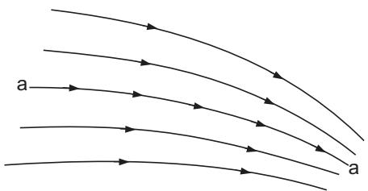

<details>
<summary>text_image</summary>

a
a
</details>

Figure A1.2. Streamlines.


<details>
<summary>flowchart</summary>

```mermaid
graph TD
    A1[" A1 "] --> V1[" V1 "]
    V1 --> A2[" A2 "]
    A2 --> V2[" V2 "]
    V2 --> (1)
    A2 --> (2)
```
</details>

Figure A1.3. Continuity of flow.

# A1.4 Forces Due to Fluids in Motion

Forces occur on fluids due to accelerations in the flow. Applying Newton’s Second Law:

$$
\text { Force } = \text { mass } \times \text { acceleration }
$$

or

$$
\text { Force } = \text { Rate   of   change   of   momentum. }
$$

A typical application is a propeller where thrust (T ) is produced by accelerating the fluid from velocity from $V _ { 1 }$ to $V _ { 2 }$ , and

$$
T = \dot {m} (V _ {2} - V _ {1}), \tag {A1.3}
$$

where m is the mass flow rate.˙

# A1.5 Pressure and Velocity Changes in a Moving Fluid

The changes are described by Bernoulli’s equation as follows:

$$
\frac {P}{\rho g} + \frac {u ^ {2}}{2 g} + z = H = \text { constant   (units   of } m), \tag {A1.4}
$$

which is strictly valid when the flow is frictionless, termed inviscid, steady and of constant density. H represents the total head, or total energy and, under these conditions, is constant for any one fluid particle throughout its motion along any one streamline. In Equation (A1.4), $P / \rho g$ represents the pressure head, $u ^ { 2 } / 2 g$ represents the velocity head (kinetic energy) and z represents the position or potential head (energy) due to gravity. An alternative presentation of Bernoulli’s equation in terms of pressure is as follows:

$$
P + \frac {1}{2} \rho u ^ {2} + \rho g z = P _ {T} = \text { constant   (units   of   pressure,   N / m } ^ {2} \text {) }, \tag {A1.5}
$$

where $P _ { T }$ is total pressure.


<details>
<summary>text_image</summary>

u_S P_S
u_L P_L
P_0
u_0
</details>

Figure A1.4. Pressure and velocity changes.

As an example, consider the flow between two points on a streamline, Figure A1.4, then,

$$
P _ {0} + \frac {1}{2} \rho u _ {0} ^ {2} + \rho g z _ {0} = P _ {L} + \frac {1}{2} \rho u _ {L} ^ {2} + \rho g z _ {L}, \tag {A1.6}
$$

where $P _ { 0 }$ and $u _ { 0 }$ are in the undisturbed flow upstream and $P _ { L }$ and $u _ { L }$ are local to the body.

Similarly, from Figure A1.4,

$$
P _ {0} + \frac {1}{2} \rho u _ {0} ^ {2} + \rho g z _ {0} = P _ {S} + \frac {1}{2} \rho u _ {S} ^ {2} + \rho g z _ {S}. \tag {A1.7}
$$

In the case of air, its density is small relative to other quantities. Hence, the ρgz term becomes small and is often neglected.

Bernoulli’s equation is strictly applicable to inviscid fluids. It can also be noted that whilst, in reality, frictionless or inviscid fluids do not exist, it is a useful assumption that is often made in the description of fluid flows, in particular, in the field of computational fluid dynamics (CFD). If, however, Bernoulli’s equation is applied to real fluids (with viscosity) it does not necessarily lead to significant errors, since the influence of viscosity in steady flow is usually confined to the immediate vicinity of solid boundaries and wakes behind solid bodies. The remainder of the flow, well clear of a solid body and termed the outer flow, behaves effectively as if it were inviscid, even if it is not so. The outer flow is discussed in more detail in Section A1.6.

# A1.6 Boundary Layer

# Origins

When a slightly viscous fluid flows past a body, shear stresses are large only within a thin layer close to the body, called the boundary layer, and in the viscous wake formed by fluid within the boundary layer being swept downstream of the body, Figure A1.5. The boundary layer increases in thickness along the body length.

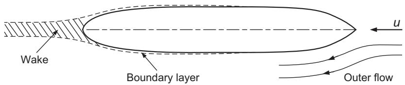

<details>
<summary>text_image</summary>

Wake
Boundary layer
Outer flow
u
</details>

Figure A1.5. Boundary layer and outer flow.


<details>
<summary>text_image</summary>

Laminar flow
Transition
Edge of boundary layer
Turbulent flow
</details>

Figure A1.6. Boundary layer development.

# Outer Flow

Outside the boundary layer, in the so-called outer flow in Figure A1.5, shear stresses are negligibly small and the fluid behaves as if it were totally inviscid, that is, nonviscous or frictionless. In an inviscid fluid, the fluid elements are moving under the influence of pressure alone. Consideration of a spherical element of fluid shows that such pressures act through the centre of the sphere to produce a net force causing a translation motion. There is, however, no mechanism for producing a moment that can change the angular momentum of the element. Consequently, the angular momentum remains constant for all time and if flow initially started from rest, the angular momentum of all fluid elements is zero for all time. Thus, the outer flow has no rotation and is termed irrotational.

# Flow Within the Boundary Layer

Flows within a boundary layer are unstable and a flow that is smooth and steady at the forward end of the boundary layer will break up into a highly unsteady flow which can extend over most of the boundary layer.

Three regions can be distinguished, Figure A1.6, as follows:

1. Laminar flow region: In this region, the flow within the boundary layer is smooth, orderly and steady, or varies only slowly with time.   
2. Transition region: In this region, the smooth flow breaks down.   
3. Turbulent flow region: In this region the flow becomes erratic with a random motion and the boundary layer thickens. Within the turbulent region, the flow can be described by superimposing turbulence velocity components, having a zero mean averaged over a period of time, on top of a steady or slowly varying mean flow. The randomly distributed turbulence velocity components are typically ±20% of the mean velocity. The turbulent boundary layer also has a thin laminar sublayer close to the body surface. It should be noted that flow outside the turbulent boundary layer can still be smooth and steady and turbulent flow is not due to poor body streamlining as it can happen on a flat plate. Figure A1.7 shows typical velocity distributions for laminar and turbulent boundary layers. At the surface of the solid body, the fluid is at rest relative to the body. At the outer edge of the boundary layer, distance δ, the fluid effectively has the full free-stream velocity relative to the body.

The onset of the transition from laminar to turbulent flow will depend on the fluid velocity (v), the distance (l) it has travelled along the body and the fluid kinematic viscosity (ν). This is characterised by the Reynolds number (Re) of the flow, defined as:

$$
R e = \frac {v l}{\nu}.
$$

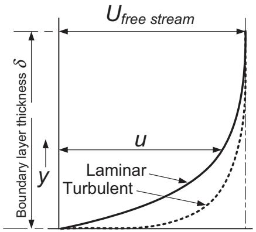

<details>
<summary>text_image</summary>

Ufree stream
δ
Boundary layer thickness δ
u
y
Laminar
Turbulent
</details>

Figure A1.7. Boundary layer velocity profiles.

It is found that when Re exceeds about $0 . 5 \times 1 0 ^ { 6 }$ then, even for a smooth body, the flow will become turbulent. At the same time, the surface finish of the body, for example, its level of roughness, will influence transition from laminar to turbulent flow.

Transition will also depend on the amount of turbulence already in the fluid through which the body travels. Due to the actions of ocean waves, currents, shallow water and other local disruptions, ships will be operating mainly in water with relatively high levels of turbulence. Consequently, their boundary layer will normally be turbulent.

# Displacement Thickness

The boundary layer causes a reduction in flow, shown by the shaded area in Figure A1.8. The flow of an inviscid or frictionless fluid may be reduced by the same amount if the surface is displaced outwards by the distance $\delta ^ { * }$ , where $\delta ^ { * }$ is termed the displacement thickness. The displacement thickness $\delta ^ { * }$ may be employed to reduce the effective span and effective aspect ratio of a control surface whose root area is operating in a boundary layer. Similarly, in theoretical simulations of fluid flow with assumed inviscid flow, and hence no boundary layer present, the surface of the body may be displaced outwards by $\delta ^ { * }$ to produce a body shape equivalent to that with no boundary layer. Approximate estimates of displacement thickness may be made as follows.

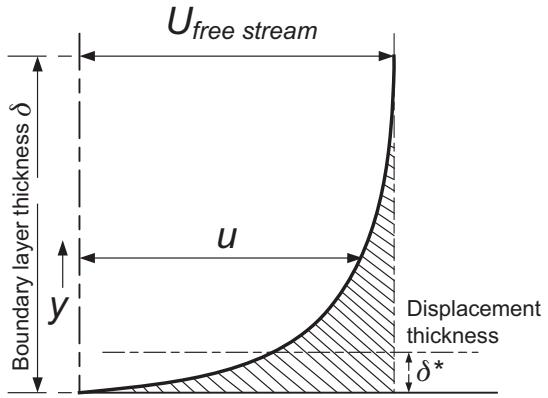

<details>
<summary>text_image</summary>

Ufree stream
Boundary layer thickness δ
u
y
Displacement
thickness
δ*
</details>

Figure A1.8. Boundary layer displacement thickness.

# Laminar Flow

$$
\frac {\delta^ {*}}{x} = 1. 7 2 1 R e _ {x} ^ {- 1 / 2}. \tag {A1.8}
$$

Turbulent Flow, using a 1/7 power law velocity distribution:

$$
\frac {\delta^ {*}}{x} = 0. 0 4 6 3 R e _ {x} ^ {- 1 / 5}. \tag {A1.9}
$$

# A1.7 Flow Separation

For flow along a flat surface, with constant pressure in the direction of flow, the boundary layer grows in thickness with distance, but the flow will not separate from the surface. If the pressure is falling in the direction of the flow, termed a favourable pressure gradient, then the flow is not likely to separate. If, however, the pressure is increasing along the direction of flow, known as an adverse pressure gradient, then there is a relative loss of speed within the boundary layer. This process can reduce the velocity in the inner layers of the boundary layer to zero at some point along the body length, such as point S, Figure A1.9. At such a point, the characteristic mean flow within the boundary layer changes dramatically and the boundary layer starts to become much thicker. The flow is reversed on the body surface, the main boundary layer detaches from the body surface and a series of large vortices or eddies form behind the separation point S. Separated flows are usually unsteady, the vortices periodically breaking away into the wake downstream.

It should be noted that separation can occur in a laminar boundary layer as well as a turbulent one and, indeed, is more likely to occur in the laminar case. Inspection of the boundary layer velocity profiles in Figure A1.7 indicates that the laminar layer has less momentum near the surface than the turbulent layer does and is thus likely to separate earlier, Figure A1.10. Thus, turbulent boundary layers are much more resistant to separation than laminar boundary layers. This leads to the result that drag due to separation is higher in laminar flow than in turbulent flow. This also explains why golf balls with dimples that promote turbulent flow have less drag and travel further than the original smooth golf balls. It is also worth noting that a thick wake following separation should not be confused with the thickening of the boundary layer following transition from laminar to turbulent flow, described earlier.

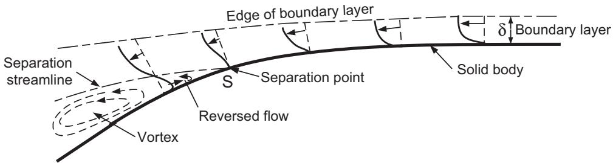

<details>
<summary>text_image</summary>

Edge of boundary layer
δ Boundary layer
Separation streamline
Separation point
Solid body
Reversed flow
Vortex
</details>

Figure A1.9. Flow separation.


<details>
<summary>text_image</summary>

Laminar
Turbulent
u
</details>

Figure A1.10. Separation drag.

# A1.8 Wave Properties

Winds create natural waves on the oceans and ships create waves during their passage through water. A wave system is created by the passage of a disturbance, not the bulk movement of water. For example, a small floating object will simply rise and fall with the passage of a wave beneath it. The water particles move in orbital paths which are approximately circular. These orbital paths decrease exponentially with increasing depth, Figure A1.11. The orbital motion is generally not of concern for large displacement ships. There may be some influence on the wake of twinscrew ships, depending on whether the propellers are near a crest or trough when the wake will be increased or decreased by the orbital motion. Hydrofoil craft may experience a change in effective inflow velocity to the foils. Smaller craft may experience problems with control with, for example, the effects of the orbital motion of a following sea.

The wave contour is given by a trochoid function, which is a path traced out by a point on the radius of a rolling circle, Figure A1.11. The theory of the trochoid can be found in [A1.4] and standard texts such as [A1.5] and [A1.6]. The trochoid is generally applied to ship hydrostatic calculations for the hull in a longitudinal wave. Other applications tend to use a sine wave which can include the orbital motion of the water particles and is easier to manipulate mathematically. The actual difference between a trochoid and a sine wave is small [A1.6].

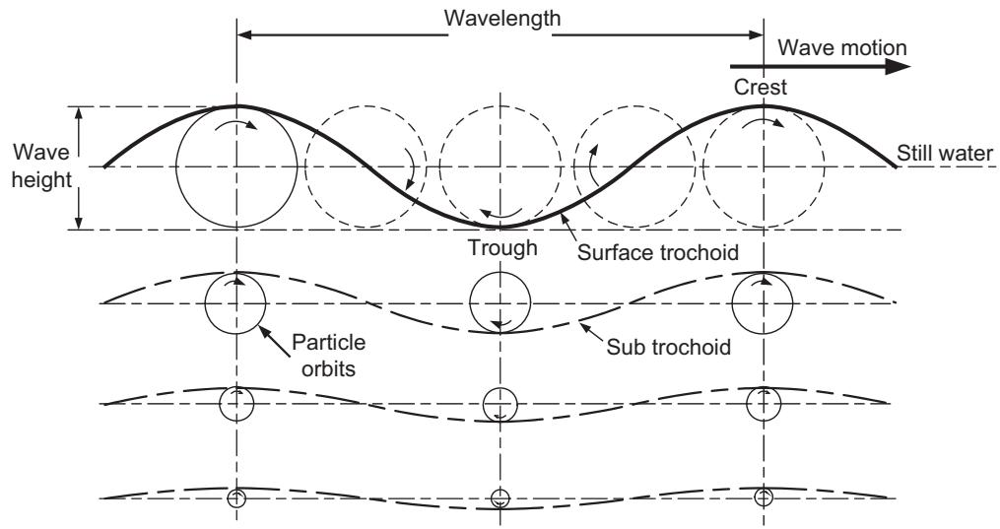

<details>
<summary>text_image</summary>

Wavelength
Wave motion
Crest
Still water
Wave height
Trough
Surface trochoid
Particle orbits
Sub trochoid
</details>

Figure A1.11. Deep water wave.


<details>
<summary>text_image</summary>

Still water
Wave motion
Particle orbits
Sea bed
</details>

Figure A1.12. Shallow water wave.

# Wave Speed

Wave theory [A1.7] yields the wave velocity c as follows:

$$
c = \left[ g \frac {\lambda}{2 \pi}. \tanh \left(\frac {2 \pi h}{\lambda}\right) \right] ^ {1 / 2}, \tag {A1.10}
$$

where h is the water depth from the still water level and λ is the wavelength, crest to crest.

# Deep Water

When $h / \lambda$ is large,

$$
\left(\tanh \frac {2 \pi h}{\lambda}\right)\rightarrow 1. 0
$$

and

$$
c ^ {2} = \frac {g \lambda}{2 \pi} \quad \text { or } \quad c = \sqrt {\frac {g \lambda}{2 \pi}}. \tag {A1.11}
$$

This deep water relationship is suitable for approximately $\begin{array} { r } { \frac { h } { \lambda } \geq \frac { 1 } { 2 } } \end{array}$ . Also, $\begin{array} { r } { c = \frac { \lambda } { T _ { W } } } \end{array}$ , where $T _ { W }$ is the wave period.

If ω is the angular velocity of the orbital motion, then $\begin{array} { r } { \omega = \frac { 2 \pi } { T _ { W } } } \end{array}$ rads/sec and wave frequency is as follows:

$$
f _ {W} = \frac {1}{T _ {W}} = \frac {\omega}{2 \pi}. \tag {A1.12}
$$

# Shallow Water

With a ground effect, the particle paths take up an elliptical motion, Figure A1.12. When $h / \lambda$ is small,

$$
\left(\tanh \frac {2 \pi h}{\lambda}\right)\rightarrow \frac {2 \pi h}{\lambda}
$$

and

$$
c ^ {2} = g h \quad \text { or } \quad c = \sqrt {g h}. \tag {A1.13}
$$

The velocity now depends only on the water depth and waves of different wavelength propagate at the same speed. This shallow water relationship is suitable for approximately $\begin{array} { r } { \frac { h } { \lambda } \le \frac { 1 } { 2 0 } \cdot c = \sqrt { g h } } \end{array}$ is known as the critical speed.

# REFERENCES (APPENDIX A1)

A1.1 Molland, A.F. and Turnock, S.R. Marine Rudders and Control Surfaces. Butterworth-Heinemann, Oxford, UK, 2007.   
A1.2 Massey, B.S. and Ward-Smith J. Mechanics of Fluids. 8th Edition. Taylor and Francis, London, 2006.   
A1.3 Duncan, W.J., Thom, A.S. and Young, A.D. Mechanics of Fluids. Edward Arnold, Port Melbourne, Australia, 1974.   
A1.4 Froude, W. On the rolling of ships. Transactions of the Royal Institution of Naval Architects, Vol. 2, 1861, pp. 180–229.   
A1.5 Rossell, H.E. and Chapman, L.B. Principles of Naval Architecture. The Society of Naval Architects and Marine Engineers, New York, 1939.   
A1.6 Molland, A.F. (ed.) The Maritime Engineering Reference Book. Butterworth-Heinemann, Oxford, 2008.   
A1.7 Lamb, H. Hydrodynamics. Cambridge University Press, Cambridge, 1962.

# Derivation of Eggers Formula for Wave Resistance

A summary derivation of the Eggers formula for wave resistance was given in Chapter 7. The following provides a more detailed account of the derivation.

The Eggers series for the far field wave pattern was derived in Chapter 7 as:

$$
\zeta = \sum_ {n = 0} ^ {\infty} \left[ \xi_ {n} \cos \left(x \gamma_ {n} \cos \theta_ {n}\right) + \eta_ {n} \sin \left(x \gamma_ {n} \cos \theta_ {n}\right) \right] \cos \left(\frac {2 \pi n y}{b}\right).
$$

In terms of velocity potential the wave elevation is given by the following:

$$
\zeta = - \frac {c}{g} \left. \frac {\partial \theta}{\delta x} \right| _ {z = 0}.
$$

Using this result it can be shown that the velocity potential,

$$
\phi = \frac {g}{c} \sum_ {n = 0} ^ {\infty} \frac {\cosh \gamma_ {n} (z + h)}{\lambda_ {n} \cosh (\gamma_ {n} h)} [ \eta_ {n} \cos \lambda_ {n} x - \xi_ {n} \sin \lambda_ {n} x ] \cos \frac {2 \pi n y}{b},
$$

corresponds to the Eggers wave pattern, where $\lambda _ { n } = \gamma _ { n }$ cos $\theta _ { n }$ (Note, in this instance, that $\lambda _ { n }$ is a constant, not wavelength).

It satisfies the Laplace equation $\begin{array} { r } { \frac { \partial ^ { 2 } \phi } { \partial x ^ { 2 } } + \frac { \partial ^ { 2 } \phi } { \partial y ^ { 2 } } + \frac { \partial ^ { 2 } \phi } { \partial z ^ { 2 } } = 0 } \end{array}$ as required and the boundary conditions $\begin{array} { r } { { \frac { \partial \phi } { \partial z } } = 0 } \end{array}$ on $z = - h$ and $\begin{array} { r } { \frac { \partial \phi } { \partial y } = 0 } \end{array}$ on $y = \pm \frac { b } { 2 }$ , i.e. condition of no flow through tank walls.

From the momentum analysis of the flow around a hull, see Chapter 3, Equation (3.10), the wave pattern resistance is:

$$
R _ {w} = \left\{\frac {1}{2} \rho g \int_ {- b / 2} ^ {b / 2} \zeta_ {B} ^ {2} d y + \frac {1}{2} \rho \int_ {- b / 2} ^ {b / 2} \int_ {- h} ^ {0} (v ^ {2} + w ^ {2} - u ^ {2}) d z d y \right\}
$$

since the wave elevation is assumed to be small.

Each term can be evaluated in this expression from the following:

$$
u = \frac {\partial \phi}{\partial x} v = \frac {\partial \phi}{\partial y} w = \frac {\partial \phi}{\partial z}
$$

e.g.

$$
u = \frac {\partial \phi}{\partial x} = \frac {- g}{c} \sum_ {n = 0} ^ {\infty} \frac {\cosh \gamma_ {n} (z + h)}{\cosh (\gamma_ {n} h)} [ \eta_ {n} \sin \lambda_ {n} x + \xi_ {n} \cos \lambda_ {n} x ] \cos \frac {2 \pi n y}{b}
$$

$$
u ^ {2} \text {   leads   to   } \left(\cos \frac {2 \pi n y}{b}\right) ^ {2}, \text {   hence   to   solve,   let   } n ^ {2} = n \times m
$$

now

$$
\begin{array}{l} \int_ {- b / 2} ^ {b / 2} \cos \left(\frac {2 \pi n y}{b}\right) \cos \left(\frac {2 \pi m y}{b}\right) d y = \frac {1}{2} \int_ {- b / 2} ^ {b / 2} \left[ \cos \left(\frac {2 \pi y (n + m)}{b}\right) \right. \\ \left. + \cos \left(\frac {2 \pi y (n - m)}{b}\right) \right] d y \\ = \left\{ \begin{array}{l l} 0 & \text {for} n \neq m \\ \frac {b}{2} & \text {for} n = m \neq 0 \\ b & \text {for} n = m = 0. \end{array} \right. \\ \end{array}
$$

Using this result,

$$
\int_ {- b / 2} ^ {b / 2} \left(\frac {\partial \phi}{\partial x}\right) ^ {2} d y = \frac {g ^ {2} b}{2 c ^ {2}} \sum_ {n = 0} ^ {\infty} ^ {\prime} \left(\frac {\cosh \gamma_ {n} (z + h)}{\cosh (\gamma_ {n} h)}\right) ^ {2} [ \eta_ {n} \sin \lambda_ {n} x + \xi_ {n} \cos \lambda_ {n} x ] ^ {2}
$$

(note: $\sum ^ { \prime }$ denotes that the $n \ = \ 0$ term is doubled). As [cosh $\gamma _ { n } \left( z + h \right) ] ^ { 2 } =$ $\frac { 1 } { 2 }$ [cosh $2 \gamma _ { n } \left( z + h \right) + 1 ]$ , we can substitute and then integrate to get the following:

$$
\int_ {- b / 2} ^ {b / 2} \int_ {- h} ^ {0} \left(\frac {\partial \phi}{\partial x}\right) ^ {2} d y = \frac {g ^ {2} b}{4 c ^ {2}} \sum_ {n = 0} ^ {\infty^ {\prime}} [ \eta_ {n} \sin \lambda_ {n} x + \xi_ {n} \cos \lambda_ {n} x ] ^ {2} \frac {\left[ z + \frac {\sinh 2 \gamma_ {n} (z + h)}{2 \gamma_ {n}} \right] _ {z = - h} ^ {0}}{\cosh^ {2} (\gamma_ {n} h)},
$$

then, substituting the integration in the z direction, we get the following:

$$
\int_ {- b / 2} ^ {b / 2} \int_ {- h} ^ {0} u ^ {2} d y = \frac {g ^ {2} b}{4 c ^ {2}} \sum_ {n = 0} ^ {\infty} ^ {\prime} [ \eta_ {n} \sin \lambda_ {n} x + \xi_ {n} \cos \lambda_ {n} x ] ^ {2} \left(\frac {\sinh 2 \gamma_ {n} h + 2 \gamma_ {n} h}{2 \gamma_ {n} \cosh^ {2} \gamma_ {n} h}\right).
$$

From wave speed relation,

$$
\gamma_ {n} \cos^ {2} \theta_ {n} = \frac {g}{c ^ {2}} \tanh \gamma_ {n} h
$$

$$
{\frac {g}{c ^ {2}}} = {\frac {\gamma_ {n} \cos^ {2} \theta_ {n}}{\tanh \gamma_ {n} h}}
$$

$$
\int_ {- b / 2} ^ {b / 2} \int_ {- h} ^ {0} u ^ {2} d y = \frac {g b}{4} \sum_ {n = 0} ^ {\infty} [ \eta_ {n} \sin \lambda_ {n} x + \xi_ {n} \cos \lambda_ {n} x ] ^ {2} \cos^ {2} \theta_ {n} \left(1 + \frac {2 \gamma_ {n} h}{\sinh 2 \gamma_ {n} h}\right).
$$

A similar analysis can be carried through for the other terms in $R _ { w }$ and it is found that the total contribution to $R _ { w }$ for the nth term $( n \neq 0 )$

finally becomes the following:

$$
\begin{array}{l} \delta R _ {w} = \frac {1}{4} \rho g b \left\{\left(\xi_ {n} \cos \lambda_ {n} x + \eta_ {n} \sin \lambda_ {n} x\right) ^ {2} \right. \\ - \frac {1}{2} \left[ \eta_ {n} \sin \lambda_ {n} x + \xi_ {n} \cos \lambda_ {n} x \right] ^ {2} \cos^ {2} \theta_ {n} \left(1 + \frac {2 \gamma_ {n} h}{\sinh 2 \gamma_ {n} h}\right) \\ + \frac {1}{2} \left[ \eta_ {n} \cos \lambda_ {n} x - \xi_ {n} \sin \lambda_ {n} x \right] ^ {2} \left(1 - \frac {2 \gamma_ {n} h}{\sinh 2 \gamma_ {n} h}\right) \\ \left. + \frac {1}{2} \left[ \eta_ {n} \cos \lambda_ {n} x - \xi_ {n} \sin \lambda_ {n} x \right] ^ {2} \sin^ {2} \theta_ {n} \left(1 + \frac {2 \gamma_ {n} h}{\sinh 2 \gamma_ {n} h}\right) \right\}. \\ \end{array}
$$

On expanding the $( ) ^ { 2 }$ terms and noting $\cos ^ { 2 } + \sin ^ { 2 } = 1$ , this gives the following:

$$
\delta R _ {w} = \frac {1}{4} \rho g b \left(\xi_ {n} ^ {2} + \eta_ {n} ^ {2}\right) \left\{\left(1 - \frac {1}{2} \cos^ {2} \theta_ {n} \left[ 1 + \frac {2 \gamma_ {n} h}{\sinh 2 \gamma_ {n} h} \right]\right) \right\}.
$$

The term for $n = 0$ is special and the complete result, valid at all speeds is, as follows:

$$
\begin{array}{l} R _ {w} = \frac {1}{4} \rho g b \left\{\left(\xi_ {0} ^ {2} + \eta_ {0} ^ {2}\right) \left(1 - \frac {2 \gamma_ {0} h}{\sinh 2 \gamma_ {0} h}\right) \right. \\ \left. + \sum_ {n = 1} ^ {\infty} \left(\xi_ {n} ^ {2} + \eta_ {n} ^ {2}\right) \left[ 1 - \frac {1}{2} \cos^ {2} \theta_ {n} \left(1 + \frac {2 \gamma_ {n} h}{\sinh 2 \gamma_ {n} h}\right) \right] \right\}, \tag {A2.1} \\ \end{array}
$$

i.e. Eggers formula for wave resistance.

For the special case of deep water, noting sinh $ \infty$ , this simplifies to the following:

$$
R _ {w} = \frac {1}{4} \rho g b \left\{\left(\xi_ {0} ^ {2} + \eta_ {0} ^ {2}\right) + \sum_ {n = 1} ^ {\infty} \left(\xi_ {n} ^ {2} + \eta_ {n} ^ {2}\right) \left[ 1 - \frac {1}{2} \cos^ {2} \theta_ {n} \right] \right\}. \tag {A2.2}
$$

The nth term in this series represents the contribution $\delta R _ { w }$ (or $\delta C _ { w } =$ $\delta R _ { w } / 1 / _ { 2 } \rho S V ^ { 2 } )$ to the wave resistance due to the nth component of the wave pattern. It depends only on the square of the amplitude of the wave components and its phase $\tan ^ { - 1 } { \eta _ { n } \xi _ { n } }$ is not relevant. Hence, if the coefficients $\gamma _ { n }$ and $\theta _ { n }$ have been determined, the wave resistance may readily be found once the coefficients $\xi _ { n }$ and $\eta _ { n }$ have been determined. As described in Chapter 7, $\xi _ { n }$ and $\eta _ { n }$ can be found by measuring the wave pattern elevation. Chapter 9 describes how $\xi _ { n }$ and $\eta _ { n }$ can be found theoretically.

# Tabulations of Resistance Design Data

Table A3.1 Isherwood wind resistance coefficients

Table A3.2 Sabit: BSRA resistance regression coefficients: load draught

Table A3.3 Sabit: BSRA resistance regression coefficients: medium draught

Table A3.4 Sabit: BSRA resistance regression coefficients: light draught

Table A3.5 Sabit: Series 60 resistance regression coefficients

Table A3.6 Moor and Small: average -c values

Table A3.7 Hollenbach: resistance regression coefficients

Table A3.8 Taylor–Gertler: series resistance data $C _ { P } = 0 . 5 0$

Table A3.9 Taylor–Gertler: series resistance data $C _ { P } = 0 . 6 0$

Table A3.10 Taylor–Gertler: series resistance data $C _ { P } = 0 . 7 0$

Table A3.11 Taylor–Gertler: series resistance data $C _ { P } = 0 . 8 0$

Table A3.12 Zborowski: twin-screw series resistance data

Table A3.13 Yeh: Series 64 resistance data $C _ { P } = 0 . 3 5$

Table A3.14 Yeh: Series 64 resistance data $C _ { P } = 0 . 4 5$

Table A3.15 Yeh: Series 64 resistance data $C _ { P } = 0 . 5 5$

Table A3.16 Bailey: NPL series resistance data

Table A3.17 Radojcic et al.: NTUA double-chine series resistance regression coefficients

Table A3.18 Radojcic et al.: NTUA double-chine series trim regression coefficients

Table A3.19 Radojcic: Series 62 planing craft: resistance regression coefficients

Table A3.20 Radojcic: Series 62 planing craft: trim regression coefficients

Table A3.21 Radojcic: Series 62 planing craft: wetted area regression coefficients

Table A3.22 Radojcic: Series 62 planing craft: wetted length regression coefficients

Table A3.23 Oortsmerssen: small ships: resistance regression coefficients

Table A3.24 WUMTIA resistance regression coefficients for C-factor: round bilge

Table A3.25 WUMTIA resistance regression coefficients for C-factor: hard chine

Table A3.26 Molland et al.: Southampton catamaran series resistance data

Table A3.27 Muller-Graf and Zips: VWS catamaran series resistance regression ¨ coefficients

It should be noted that some data, such as the coefficients for the Holtrop and Mennen regressions, Savitsky’s equations for planing craft and resistance data for yachts, are contained fully within the text in Chapter 10.

Table A3.1. Isherwood wind resistance coefficients 

<table><tr><td colspan="8">Isherwood wind force coefficients</td></tr><tr><td> $\gamma_R$ (deg.)</td><td>A0</td><td>A1</td><td>A2</td><td>A3</td><td>A4</td><td>A5</td><td>A6</td></tr><tr><td>0</td><td>2.152</td><td>-5.00</td><td>0.243</td><td>-0.164</td><td>-</td><td>-</td><td>-</td></tr><tr><td>10</td><td>1.714</td><td>-3.33</td><td>0.145</td><td>-0.121</td><td>-</td><td>-</td><td>-</td></tr><tr><td>20</td><td>1.818</td><td>-3.97</td><td>0.211</td><td>-0.143</td><td>-</td><td>-</td><td>0.033</td></tr><tr><td>30</td><td>1.965</td><td>-4.81</td><td>0.243</td><td>-0.154</td><td>-</td><td>-</td><td>0.041</td></tr><tr><td>40</td><td>2.333</td><td>-5.99</td><td>0.247</td><td>-0.190</td><td>-</td><td>-</td><td>0.042</td></tr><tr><td>50</td><td>1.726</td><td>-6.54</td><td>0.189</td><td>-0.173</td><td>0.348</td><td>-</td><td>0.048</td></tr><tr><td>60</td><td>0.913</td><td>-4.68</td><td>-</td><td>-0.104</td><td>0.482</td><td>-</td><td>0.052</td></tr><tr><td>70</td><td>0.457</td><td>-2.88</td><td>-</td><td>-0.068</td><td>0.346</td><td>-</td><td>0.043</td></tr><tr><td>80</td><td>0.341</td><td>-0.91</td><td>-</td><td>-0.031</td><td>-</td><td>-</td><td>0.032</td></tr><tr><td>90</td><td>0.355</td><td>-</td><td>-</td><td>-</td><td>-0.247</td><td>-</td><td>0.018</td></tr><tr><td>100</td><td>0.601</td><td>-</td><td>-</td><td>-</td><td>-0.372</td><td>-</td><td>-0.020</td></tr><tr><td>110</td><td>0.651</td><td>1.29</td><td>-</td><td>-</td><td>-0.582</td><td>-</td><td>-0.031</td></tr><tr><td>120</td><td>0.564</td><td>2.54</td><td>-</td><td>-</td><td>-0.748</td><td>-</td><td>-0.024</td></tr><tr><td>130</td><td>-0.142</td><td>3.58</td><td>-</td><td>0.047</td><td>-0.700</td><td>-</td><td>-0.028</td></tr><tr><td>140</td><td>-0.677</td><td>3.64</td><td>-</td><td>0.069</td><td>-0.529</td><td>-</td><td>-0.032</td></tr><tr><td>150</td><td>-0.723</td><td>3.14</td><td>-</td><td>0.064</td><td>-0.475</td><td>-</td><td>-0.032</td></tr><tr><td>160</td><td>-2.148</td><td>2.56</td><td>-</td><td>0.081</td><td>-</td><td>1.27</td><td>-0.027</td></tr><tr><td>170</td><td>-2.707</td><td>3.97</td><td>-0.175</td><td>0.126</td><td>-</td><td>1.81</td><td>-</td></tr><tr><td>180</td><td>-2.529</td><td>3.76</td><td>-0.174</td><td>0.128</td><td>-</td><td>1.55</td><td>-</td></tr></table>

Table A3.2. Sabit: BSRA resistance regression coefficients: load draught 

<table><tr><td colspan="4">BSRA series regression coefficients</td><td colspan="4">Load draught condition</td></tr><tr><td> $V_{K}/\sqrt{L_{f}}$ </td><td>0.50</td><td>0.55</td><td>0.60</td><td>0.65</td><td>0.70</td><td>0.75</td><td>0.80</td></tr><tr><td>a1</td><td>-0.7750</td><td>-0.7612</td><td>-0.7336</td><td>-0.6836</td><td>-0.5760</td><td>-0.3290</td><td>-0.0384</td></tr><tr><td>a2</td><td>0.2107</td><td>0.2223</td><td>0.2399</td><td>0.2765</td><td>0.3161</td><td>0.3562</td><td>0.4550</td></tr><tr><td>a3</td><td>0.0872</td><td>0.0911</td><td>0.0964</td><td>0.0995</td><td>0.1108</td><td>0.1134</td><td>0.0661</td></tr><tr><td>a4</td><td>0.0900</td><td>0.0768</td><td>0.0701</td><td>0.0856</td><td>0.1563</td><td>0.4449</td><td>1.0124</td></tr><tr><td>a5</td><td>0.0116</td><td>0.0354</td><td>0.0210</td><td>0.0496</td><td>0.2020</td><td>0.3557</td><td>0.2985</td></tr><tr><td>a6</td><td>0.0883</td><td>0.0842</td><td>0.0939</td><td>0.1270</td><td>0.1790</td><td>0.1272</td><td>0.0930</td></tr><tr><td>a7</td><td>0.0081</td><td>0.0151</td><td>0.0177</td><td>0.0175</td><td>0.0170</td><td>0.0066</td><td>0.0118</td></tr><tr><td>a8</td><td>0.0631</td><td>0.0644</td><td>0.0656</td><td>0.0957</td><td>0.1193</td><td>0.1415</td><td>0.5080</td></tr><tr><td>a9</td><td>0.0429</td><td>0.0650</td><td>0.1062</td><td>0.1463</td><td>0.1706</td><td>0.1238</td><td>0.2203</td></tr><tr><td>a10</td><td>-0.0249</td><td>-0.0187</td><td>-0.0270</td><td>-0.0502</td><td>-0.0699</td><td>-0.0051</td><td>-0.0514</td></tr><tr><td>a11</td><td>-0.0124</td><td>0.0292</td><td>0.0647</td><td>0.1629</td><td>0.3574</td><td>0.2882</td><td>0.2110</td></tr><tr><td>a12</td><td>0.0236</td><td>-0.0245</td><td>-0.0776</td><td>-0.1313</td><td>-0.3034</td><td>-0.2508</td><td>0.0486</td></tr><tr><td>a13</td><td>-0.0301</td><td>-0.0442</td><td>-0.0537</td><td>-0.0863</td><td>-0.0944</td><td>-0.0115</td><td>0.0046</td></tr><tr><td>a14</td><td>0.0877</td><td>0.1124</td><td>0.1151</td><td>0.1133</td><td>0.0839</td><td>-0.0156</td><td>-0.1433</td></tr><tr><td>a15</td><td>-0.1243</td><td>-0.1341</td><td>-0.0775</td><td>0.0355</td><td>0.1715</td><td>0.2569</td><td>0.2680</td></tr><tr><td>a16</td><td>-0.0269</td><td>-0.0006</td><td>0.1145</td><td>0.2255</td><td>0.2006</td><td>0.0138</td><td>0.2283</td></tr></table>

Table A3.3. Sabit: BSRA resistance regression coefficients: medium draught 

<table><tr><td colspan="4">BSRA series regression coefficients</td><td colspan="4">Medium draught condition</td></tr><tr><td> $V_{K}/\sqrt{L_f}$ </td><td>0.50</td><td>0.55</td><td>0.60</td><td>0.65</td><td>0.70</td><td>0.75</td><td>0.80</td></tr><tr><td>b1</td><td>-0.6979</td><td>-0.6799</td><td>-0.6443</td><td>-0.5943</td><td>-0.4908</td><td>-0.2874</td><td>-0.0317</td></tr><tr><td>b2</td><td>0.2191</td><td>0.2297</td><td>0.2598</td><td>0.2870</td><td>0.3273</td><td>0.3701</td><td>0.4490</td></tr><tr><td>b3</td><td>0.1180</td><td>0.1231</td><td>0.1224</td><td>0.1381</td><td>0.1399</td><td>0.1389</td><td>0.1033</td></tr><tr><td>b4</td><td>0.1568</td><td>0.1510</td><td>0.2079</td><td>0.1913</td><td>0.2681</td><td>0.5093</td><td>0.9315</td></tr><tr><td>b5</td><td>-0.0948</td><td>-0.0736</td><td>-0.1715</td><td>-0.0707</td><td>0.0233</td><td>0.1098</td><td>0.1370</td></tr><tr><td>b6</td><td>0.0671</td><td>0.0647</td><td>0.0788</td><td>0.1072</td><td>0.1392</td><td>0.1079</td><td>0.0825</td></tr><tr><td>b7</td><td>-0.0030</td><td>0.0063</td><td>-0.0057</td><td>0.0171</td><td>0.0104</td><td>-0.0108</td><td>-0.0043</td></tr><tr><td>b8</td><td>0.0463</td><td>0.0359</td><td>0.0442</td><td>0.0691</td><td>0.0858</td><td>0.1353</td><td>0.3402</td></tr><tr><td>b9</td><td>0.0501</td><td>0.0688</td><td>0.1181</td><td>0.1431</td><td>0.1817</td><td>0.1973</td><td>0.2402</td></tr><tr><td>b10</td><td>-0.0169</td><td>-0.0186</td><td>-0.0153</td><td>-0.0332</td><td>-0.0466</td><td>-0.0154</td><td>-0.0481</td></tr><tr><td>b11</td><td>0.0094</td><td>0.0057</td><td>0.0061</td><td>0.0998</td><td>0.2114</td><td>0.1805</td><td>0.1123</td></tr><tr><td>b12</td><td>0.0255</td><td>0.0542</td><td>0.0759</td><td>0.0084</td><td>-0.0491</td><td>0.0308</td><td>0.3415</td></tr><tr><td>b13</td><td>0.0448</td><td>0.0306</td><td>0.0649</td><td>0.0041</td><td>0.0006</td><td>0.0485</td><td>0.0619</td></tr><tr><td>b14</td><td>-0.0468</td><td>-0.0163</td><td>-0.0996</td><td>-0.0180</td><td>-0.0467</td><td>-0.1125</td><td>-0.2319</td></tr><tr><td>b15</td><td>-0.1128</td><td>-0.1075</td><td>-0.0748</td><td>0.0127</td><td>0.1538</td><td>0.1922</td><td>0.1293</td></tr><tr><td>b16</td><td>-0.0494</td><td>-0.0198</td><td>0.0622</td><td>0.1492</td><td>0.1591</td><td>0.0687</td><td>-0.0222</td></tr></table>

Table A3.4. Sabit: BSRA resistance regression coefficients: light draught 

<table><tr><td colspan="4">BSRA series regression coefficients</td><td colspan="4">Light draught condition</td></tr><tr><td> $V_{K}/\sqrt{L_{f}}$ </td><td>0.50</td><td>0.55</td><td>0.60</td><td>0.65</td><td>0.70</td><td>0.75</td><td>0.80</td></tr><tr><td>c1</td><td>-0.6318</td><td>-0.6068</td><td>-0.5584</td><td>-0.4868</td><td>-0.3846</td><td>-0.2050</td><td>0.0098</td></tr><tr><td>c2</td><td>0.2760</td><td>0.2876</td><td>0.3126</td><td>0.3476</td><td>0.3678</td><td>0.4012</td><td>0.4901</td></tr><tr><td>c3</td><td>0.1179</td><td>0.1242</td><td>0.1340</td><td>0.1356</td><td>0.1392</td><td>0.1566</td><td>0.1583</td></tr><tr><td>c4</td><td>0.1572</td><td>0.1636</td><td>0.1683</td><td>0.1797</td><td>0.2718</td><td>0.4848</td><td>0.8435</td></tr><tr><td>c5</td><td>-0.0918</td><td>-0.0662</td><td>-0.0387</td><td>0.0145</td><td>0.0722</td><td>0.1451</td><td>0.1736</td></tr><tr><td>c6</td><td>0.0231</td><td>0.0231</td><td>0.0498</td><td>0.0458</td><td>0.0480</td><td>0.0316</td><td>0.0232</td></tr><tr><td>c7</td><td>-0.0048</td><td>-0.0001</td><td>-0.0053</td><td>-0.0041</td><td>-0.0144</td><td>-0.0210</td><td>-0.0141</td></tr><tr><td>c8</td><td>0.0045</td><td>0.0129</td><td>0.0184</td><td>0.0118</td><td>0.0211</td><td>0.0728</td><td>0.2510</td></tr><tr><td>c9</td><td>0.0106</td><td>0.0262</td><td>0.0686</td><td>0.0849</td><td>0.1237</td><td>0.1174</td><td>0.1483</td></tr><tr><td>c10</td><td>0.0065</td><td>0.0010</td><td>-0.0089</td><td>-0.0089</td><td>-0.0176</td><td>0.0089</td><td>0.0100</td></tr><tr><td>c11</td><td>-0.0313</td><td>0.0066</td><td>0.0376</td><td>0.0513</td><td>0.0471</td><td>0.0212</td><td>0.0122</td></tr><tr><td>c12</td><td>0.1180</td><td>0.1091</td><td>0.1128</td><td>0.1692</td><td>0.2713</td><td>0.3626</td><td>0.5950</td></tr><tr><td>c13</td><td>0.0484</td><td>0.0359</td><td>0.0061</td><td>-0.0255</td><td>-0.0170</td><td>0.0312</td><td>0.0697</td></tr><tr><td>c14</td><td>-0.0770</td><td>-0.0507</td><td>-0.0173</td><td>0.0286</td><td>-0.0189</td><td>-0.0471</td><td>-0.1412</td></tr><tr><td>c15</td><td>-0.0479</td><td>-0.0568</td><td>-0.0407</td><td>0.0650</td><td>0.2150</td><td>0.2722</td><td>0.3212</td></tr><tr><td>c16</td><td>-0.0599</td><td>-0.0439</td><td>0.0088</td><td>0.0891</td><td>0.0918</td><td>0.0497</td><td>0.0637</td></tr></table>

Table A3.5. Sabit: Series 60 resistance regression coefficients 

<table><tr><td colspan="5">Series 60 resistance regression coefficients</td><td colspan="5">Load draught condition</td></tr><tr><td> $V_{K}/\sqrt{L_f}$ </td><td>0.50</td><td>0.55</td><td>0.60</td><td>0.65</td><td>0.70</td><td>0.75</td><td>0.80</td><td>0.85</td><td>0.90</td></tr><tr><td>a1</td><td>-0.8244</td><td>-0.8249</td><td>-0.8278</td><td>-0.7970</td><td>-0.7562</td><td>-0.6619</td><td>-0.5200</td><td>-0.3570</td><td>-0.0267</td></tr><tr><td>a2</td><td>0.1906</td><td>0.1865</td><td>0.2050</td><td>0.2332</td><td>0.2496</td><td>0.2607</td><td>0.3185</td><td>0.3528</td><td>0.1333</td></tr><tr><td>a3</td><td>0.1164</td><td>0.1133</td><td>0.1042</td><td>0.1116</td><td>0.1221</td><td>0.1298</td><td>0.1302</td><td>0.1533</td><td>0.1015</td></tr><tr><td>a4</td><td>-0.0519</td><td>0.0060</td><td>0.0832</td><td>0.1075</td><td>0.1494</td><td>0.2603</td><td>0.5236</td><td>0.5455</td><td>0.4568</td></tr><tr><td>a5</td><td>0.0057</td><td>-0.0109</td><td>-0.0451</td><td>-0.0165</td><td>0.0472</td><td>0.1491</td><td>0.2289</td><td>0.4001</td><td>0.4677</td></tr><tr><td>a6</td><td>0.0072</td><td>0.0198</td><td>0.0211</td><td>0.0172</td><td>0.0216</td><td>0.0361</td><td>-0.0017</td><td>-0.0027</td><td>0.0181</td></tr><tr><td>a7</td><td>-0.0052</td><td>-0.0036</td><td>0.0067</td><td>0.0068</td><td>0.0064</td><td>0.0033</td><td>-0.0023</td><td>-0.0025</td><td>0.0175</td></tr><tr><td>a8</td><td>0.1134</td><td>0.1109</td><td>0.0933</td><td>0.1041</td><td>0.1585</td><td>0.1859</td><td>0.2930</td><td>0.2579</td><td>0.0506</td></tr><tr><td>a9</td><td>0.0670</td><td>0.0917</td><td>0.0708</td><td>0.0826</td><td>0.1428</td><td>0.1562</td><td>0.1742</td><td>0.1861</td><td>0.1558</td></tr><tr><td>a10</td><td>0.0483</td><td>0.0510</td><td>0.0400</td><td>0.0409</td><td>0.0414</td><td>0.0403</td><td>0.0368</td><td>0.0118</td><td>0.0279</td></tr><tr><td>a11</td><td>-0.1276</td><td>-0.0745</td><td>-0.0729</td><td>-0.0879</td><td>-0.0744</td><td>-0.0636</td><td>-0.1171</td><td>-0.1500</td><td>-0.0988</td></tr><tr><td>a12</td><td>0.1125</td><td>0.0971</td><td>0.1269</td><td>0.1882</td><td>0.2115</td><td>0.2289</td><td>0.3315</td><td>0.4253</td><td>0.0834</td></tr><tr><td>a13</td><td>-0.0481</td><td>-0.0213</td><td>0.0232</td><td>0.0265</td><td>0.0188</td><td>0.0103</td><td>0.0132</td><td>-0.0068</td><td>-0.0151</td></tr><tr><td>a14</td><td>0.0372</td><td>0.0206</td><td>-0.0105</td><td>-0.0049</td><td>0.0135</td><td>0.0378</td><td>0.0190</td><td>0.0789</td><td>0.0582</td></tr><tr><td>a15</td><td>-0.0954</td><td>-0.1924</td><td>-0.0855</td><td>-0.0189</td><td>0.0018</td><td>0.0793</td><td>0.1247</td><td>0.2562</td><td>0.3376</td></tr><tr><td>a16</td><td>-0.0629</td><td>0.0108</td><td>0.0036</td><td>0.0581</td><td>0.0884</td><td>0.0671</td><td>-0.0053</td><td>0.0601</td><td>0.1429</td></tr></table>

Table A3.6. Moor and Small: average -c values 

<table><tr><td> $LCB$ </td><td>2.00 A</td><td>1.75 A</td><td>1.50 A</td><td>1.25 A</td><td>1.00 A</td><td>0.75 A</td><td>0.50 A</td><td>0.25 A</td><td>Amidships</td><td>0.25 F</td><td>0.50 F</td><td>0.75 F</td><td>1.00 F</td><td>1.25 F</td><td>1.50 F</td><td>1.75 F</td><td>2.00 F</td><td>2.25 F</td><td>2.50 F</td></tr><tr><td> $C_B$ </td><td></td><td></td><td></td><td></td><td></td><td></td><td></td><td></td><td colspan="11">10 knots  $V/\sqrt{L}=0.50$ </td></tr><tr><td>0.625</td><td>0.643</td><td>0.644</td><td>0.645</td><td>0.646</td><td>0.647</td><td>0.647</td><td>0.647</td><td>0.649</td><td>0.649</td><td>0.650</td><td>0.650</td><td>0.650</td><td>-</td><td>-</td><td>-</td><td>-</td><td>-</td><td>-</td><td>-</td></tr><tr><td>0.650</td><td>0.645</td><td>0.645</td><td>0.645</td><td>0.645</td><td>0.645</td><td>0.645</td><td>0.645</td><td>0.645</td><td>0.645</td><td>0.645</td><td>0.645</td><td>0.645</td><td>0.645</td><td>0.645</td><td>0.645</td><td>0.645</td><td>-</td><td>-</td><td>-</td></tr><tr><td>0.675</td><td>0.650</td><td>0.649</td><td>0.648</td><td>0.648</td><td>0.648</td><td>0.647</td><td>0.646</td><td>0.646</td><td>0.646</td><td>0.646</td><td>0.645</td><td>0.644</td><td>0.642</td><td>0.642</td><td>0.641</td><td>0.640</td><td>-</td><td>-</td><td>-</td></tr><tr><td>0.700</td><td>-</td><td>-</td><td>-</td><td>0.657</td><td>0.656</td><td>0.654</td><td>0.652</td><td>0.650</td><td>0.649</td><td>0.648</td><td>0.646</td><td>0.645</td><td>0.643</td><td>0.642</td><td>0.640</td><td>0.640</td><td>0.638</td><td>0.637</td><td>0.636</td></tr><tr><td>0.725</td><td>-</td><td>-</td><td>-</td><td>-</td><td>-</td><td>0.668</td><td>0.665</td><td>0.661</td><td>0.659</td><td>0.656</td><td>0.653</td><td>0.650</td><td>0.648</td><td>0.646</td><td>0.644</td><td>0.642</td><td>0.640</td><td>0.638</td><td>0.636</td></tr><tr><td>0.750</td><td>-</td><td>-</td><td>-</td><td>-</td><td>-</td><td>-</td><td>-</td><td>0.683</td><td>0.678</td><td>0.671</td><td>0.667</td><td>0.664</td><td>0.660</td><td>0.656</td><td>0.653</td><td>0.650</td><td>0.647</td><td>0.644</td><td>0.642</td></tr><tr><td>0.775</td><td>-</td><td>-</td><td>-</td><td>-</td><td>-</td><td>-</td><td>-</td><td>-</td><td>-</td><td>0.700</td><td>0.695</td><td>0.688</td><td>0.681</td><td>0.675</td><td>0.669</td><td>0.665</td><td>0.660</td><td>0.657</td><td>0.655</td></tr><tr><td>0.800</td><td>-</td><td>-</td><td>-</td><td>-</td><td>-</td><td>-</td><td>-</td><td>-</td><td>-</td><td>0.746</td><td>0.738</td><td>0.729</td><td>0.719</td><td>0.710</td><td>0.703</td><td>0.697</td><td>0.691</td><td>0.685</td><td>0.680</td></tr><tr><td>0.825</td><td>-</td><td>-</td><td>-</td><td>-</td><td>-</td><td>-</td><td>-</td><td>-</td><td>-</td><td>-</td><td>-</td><td>-</td><td>0.790</td><td>0.784</td><td>0.777</td><td>0.771</td><td>0.768</td><td>-</td><td>-</td></tr><tr><td></td><td></td><td></td><td></td><td></td><td></td><td></td><td></td><td></td><td colspan="11">11 knots  $V/L=0.55$ </td></tr><tr><td>0.625</td><td>0.640</td><td>0.643</td><td>0.645</td><td>0.646</td><td>0.646</td><td>0.647</td><td>0.647</td><td>0.650</td><td>0.652</td><td>0.653</td><td>0.656</td><td>0.657</td><td>-</td><td>-</td><td>-</td><td>-</td><td>-</td><td>-</td><td>-</td></tr><tr><td>0.650</td><td>0.642</td><td>0.643</td><td>0.645</td><td>0.645</td><td>0.645</td><td>0.646</td><td>0.646</td><td>0.647</td><td>0.650</td><td>0.650</td><td>0.651</td><td>0.652</td><td>0.652</td><td>0.653</td><td>0.655</td><td>0.656</td><td>-</td><td>-</td><td>-</td></tr><tr><td>0.675</td><td>0.646</td><td>0.647</td><td>0.648</td><td>0.648</td><td>0.648</td><td>0.648</td><td>0.648</td><td>0.648</td><td>0.649</td><td>0.649</td><td>0.650</td><td>0.650</td><td>0.650</td><td>0.650</td><td>0.651</td><td>0.652</td><td>-</td><td>-</td><td>-</td></tr><tr><td>0.700</td><td>-</td><td>-</td><td>-</td><td>0.655</td><td>0.655</td><td>0.654</td><td>0.653</td><td>0.653</td><td>0.653</td><td>0.653</td><td>0.653</td><td>0.653</td><td>0.652</td><td>0.652</td><td>0.651</td><td>0.651</td><td>0.651</td><td>0.651</td><td>0.650</td></tr><tr><td>0.725</td><td>-</td><td>-</td><td>-</td><td>-</td><td>-</td><td>0.666</td><td>0.665</td><td>0.664</td><td>0.663</td><td>0.661</td><td>0.660</td><td>0.659</td><td>0.658</td><td>0.657</td><td>0.654</td><td>0.654</td><td>0.652</td><td>0.652</td><td>0.650</td></tr><tr><td>0.750</td><td>-</td><td>-</td><td>-</td><td>-</td><td>-</td><td>-</td><td>-</td><td>0.680</td><td>0.679</td><td>0.676</td><td>0.676</td><td>0.674</td><td>0.670</td><td>0.667</td><td>0.664</td><td>0.662</td><td>0.660</td><td>0.658</td><td>0.654</td></tr><tr><td>0.775</td><td>-</td><td>-</td><td>-</td><td>-</td><td>-</td><td>-</td><td>-</td><td>-</td><td>-</td><td>0.701</td><td>0.699</td><td>0.694</td><td>0.690</td><td>0.686</td><td>0.681</td><td>0.678</td><td>0.675</td><td>0.671</td><td>0.666</td></tr><tr><td>0.800</td><td>-</td><td>-</td><td>-</td><td>-</td><td>-</td><td>-</td><td>-</td><td>-</td><td>-</td><td>0.737</td><td>0.733</td><td>0.729</td><td>0.727</td><td>0.722</td><td>0.718</td><td>0.713</td><td>0.710</td><td>0.704</td><td>0.700</td></tr><tr><td>0.825</td><td>-</td><td>-</td><td>-</td><td>-</td><td>-</td><td>-</td><td>-</td><td>-</td><td>-</td><td>-</td><td>-</td><td>-</td><td>0.791</td><td>0.790</td><td>0.790</td><td>0.789</td><td>0.789</td><td>-</td><td>-</td></tr><tr><td></td><td></td><td></td><td></td><td></td><td></td><td></td><td></td><td></td><td colspan="11">12 knots  $V/\sqrt{L}=0.60$ </td></tr><tr><td>6.625</td><td>0.658</td><td>0.659</td><td>0.659</td><td>0.659</td><td>0.659</td><td>0.659</td><td>0.659</td><td>0.660</td><td>0.660</td><td>0.661</td><td>0.662</td><td>0.662</td><td>-</td><td>-</td><td>-</td><td>-</td><td>-</td><td>-</td><td>-</td></tr><tr><td>0.650</td><td>0.653</td><td>0.655</td><td>0.655</td><td>0.655</td><td>0.655</td><td>0.655</td><td>0.655</td><td>0.658</td><td>0.658</td><td>0.659</td><td>0.659</td><td>0.659</td><td>0.660</td><td>0.660</td><td>0.660</td><td>0.661</td><td>-</td><td>-</td><td>-</td></tr><tr><td>0.675</td><td>0.655</td><td>0.657</td><td>0.657</td><td>0.657</td><td>0.657</td><td>0.657</td><td>0.657</td><td>0.659</td><td>0.660</td><td>0.660</td><td>0.660</td><td>0.660</td><td>0.660</td><td>0.661</td><td>0.661</td><td>0.661</td><td>-</td><td>-</td><td>-</td></tr><tr><td>0.700</td><td>-</td><td>-</td><td>-</td><td>0.665</td><td>0.664</td><td>0.663</td><td>0.663</td><td>0.665</td><td>0.665</td><td>0.666</td><td>0.666</td><td>0.666</td><td>0.665</td><td>0.665</td><td>0.664</td><td>0.664</td><td>0.664</td><td>0.664</td><td>0.664</td></tr><tr><td>0.725</td><td>-</td><td>-</td><td>-</td><td>-</td><td>-</td><td>0.680</td><td>0.680</td><td>0.680</td><td>0.680</td><td>0.679</td><td>0.677</td><td>0.676</td><td>0.673</td><td>0.672</td><td>0.670</td><td>0.670</td><td>0.668</td><td>0.668</td><td>0.667</td></tr><tr><td>0.750</td><td>-</td><td>-</td><td>-</td><td>-</td><td>-</td><td>-</td><td>-</td><td>0.712</td><td>0.707</td><td>0.702</td><td>0.698</td><td>0.692</td><td>0.687</td><td>0.683</td><td>0.680</td><td>0.679</td><td>0.680</td><td>0.680</td><td>0.680</td></tr><tr><td>0.775</td><td>-</td><td>-</td><td>-</td><td>-</td><td>-</td><td>-</td><td>-</td><td>-</td><td>-</td><td>0.738</td><td>0.725</td><td>0.715</td><td>0.708</td><td>0.703</td><td>0.700</td><td>0.700</td><td>0.702</td><td>0.706</td><td>0.712</td></tr><tr><td>0.800</td><td>-</td><td>-</td><td>-</td><td>-</td><td>-</td><td>-</td><td>-</td><td>-</td><td>-</td><td>0.784</td><td>0.760</td><td>0.745</td><td>0.735</td><td>0.730</td><td>0.731</td><td>0.738</td><td>0.751</td><td>0.774</td><td>0.808</td></tr><tr><td>0.825</td><td>-</td><td>-</td><td>-</td><td>-</td><td>-</td><td>-</td><td>-</td><td>-</td><td>-</td><td>-</td><td>-</td><td>-</td><td>0.775</td><td>0.776</td><td>0.796</td><td>0.836</td><td>0.890</td><td>-</td><td>-</td></tr></table>

(continued)

Table A3.6. Moor and Small: average -c values (continued) 

<table><tr><td> $LCB$ </td><td>2.00 A</td><td>1.75 A</td><td>1.50 A</td><td>1.25 A</td><td>1.00 A</td><td>0.75 A</td><td>0.50 A</td><td>0.25 A</td><td>Amidships</td><td>0.25 F</td><td>0.50 F</td><td>0.75 F</td><td>1.00 F</td><td>1.25 F</td><td>1.50 F</td><td>1.75 F</td><td>2.00 F</td><td>2.25 F</td><td>2.50 F</td></tr><tr><td> $C_B$ </td><td></td><td></td><td></td><td></td><td></td><td></td><td></td><td></td><td colspan="11">13 knots  $V/\sqrt{L}=0.65$ </td></tr><tr><td>0.625</td><td>0.680</td><td>0.680</td><td>0.680</td><td>0.680</td><td>0.680</td><td>0.680</td><td>0.680</td><td>0.679</td><td>0.679</td><td>0.678</td><td>0.678</td><td>0.678</td><td>-</td><td>-</td><td>-</td><td>-</td><td>-</td><td>-</td><td>-</td></tr><tr><td>0.650</td><td>0.676</td><td>0.676</td><td>0.676</td><td>0.676</td><td>0.676</td><td>0.676</td><td>0.676</td><td>0.676</td><td>0.676</td><td>0.676</td><td>0.676</td><td>0.676</td><td>0.676</td><td>0.676</td><td>0.676</td><td>0.676</td><td>-</td><td>-</td><td>-</td></tr><tr><td>0.675</td><td>0.674</td><td>0.676</td><td>0.676</td><td>0.677</td><td>0.677</td><td>0.677</td><td>0.677</td><td>0.678</td><td>0.678</td><td>0.678</td><td>0.678</td><td>0.678</td><td>0.679</td><td>0.679</td><td>0.679</td><td>0.679</td><td>-</td><td>-</td><td>-</td></tr><tr><td>0.700</td><td>-</td><td>-</td><td>-</td><td>0.684</td><td>0.684</td><td>0.684</td><td>0.684</td><td>0.684</td><td>0.684</td><td>0.684</td><td>0.684</td><td>0.684</td><td>0.683</td><td>0.683</td><td>0.683</td><td>0.683</td><td>0.682</td><td>0.682</td><td>0.681</td></tr><tr><td>0.725</td><td>-</td><td>-</td><td>-</td><td>-</td><td>-</td><td>0.703</td><td>0.703</td><td>0.701</td><td>0.700</td><td>0.699</td><td>0.697</td><td>0.696</td><td>0.695</td><td>0.693</td><td>0.693</td><td>0.693</td><td>0.689</td><td>0.689</td><td>0.689</td></tr><tr><td>0.750</td><td>-</td><td>-</td><td>-</td><td>-</td><td>-</td><td>-</td><td>-</td><td>0.744</td><td>0.735</td><td>0.727</td><td>0.720</td><td>0.716</td><td>0.712</td><td>0.710</td><td>0.710</td><td>0.710</td><td>0.709</td><td>0.710</td><td>0.712</td></tr><tr><td>0.775</td><td>-</td><td>-</td><td>-</td><td>-</td><td>-</td><td>-</td><td>-</td><td>-</td><td>-</td><td>0.773</td><td>0.759</td><td>0.751</td><td>0.745</td><td>0.740</td><td>0.739</td><td>0.739</td><td>0.746</td><td>0.756</td><td>0.770</td></tr><tr><td>0.800</td><td>-</td><td>-</td><td>-</td><td>-</td><td>-</td><td>-</td><td>-</td><td>-</td><td>-</td><td>0.841</td><td>0.820</td><td>0.806</td><td>0.799</td><td>0.795</td><td>0.795</td><td>0.803</td><td>0.818</td><td>0.843</td><td>0.885</td></tr><tr><td>0.825</td><td>-</td><td>-</td><td>-</td><td>-</td><td>-</td><td>-</td><td>-</td><td>-</td><td>-</td><td>-</td><td>-</td><td>-</td><td>0.885</td><td>0.888</td><td>0.902</td><td>0.929</td><td>0.973</td><td>-</td><td>-</td></tr><tr><td></td><td></td><td></td><td></td><td></td><td></td><td></td><td></td><td></td><td colspan="11">14 knots  $V/\sqrt{L}=0.70$ </td></tr><tr><td>0.625</td><td>0.684</td><td>0.684</td><td>0.684</td><td>0.683</td><td>0.682</td><td>0.682</td><td>0.682</td><td>0.681</td><td>0.681</td><td>0.680</td><td>0.680</td><td>0.678</td><td>-</td><td>-</td><td>-</td><td>-</td><td>-</td><td>-</td><td>-</td></tr><tr><td>0.650</td><td>0.684</td><td>0.684</td><td>0.684</td><td>0.684</td><td>0.684</td><td>0.684</td><td>0.684</td><td>0.684</td><td>0.684</td><td>0.684</td><td>0.684</td><td>0.684</td><td>0.684</td><td>0.684</td><td>0.684</td><td>0.684</td><td>-</td><td>-</td><td>-</td></tr><tr><td>0.675</td><td>0.684</td><td>0.684</td><td>0.684</td><td>0.685</td><td>0.686</td><td>0.687</td><td>0.688</td><td>0.689</td><td>0.690</td><td>0.691</td><td>0.694</td><td>0.695</td><td>0.697</td><td>0.698</td><td>0.700</td><td>0.702</td><td>-</td><td>-</td><td>-</td></tr><tr><td>0.700</td><td>-</td><td>-</td><td>-</td><td>0.687</td><td>0.689</td><td>0.692</td><td>0.695</td><td>0.697</td><td>0.698</td><td>0.702</td><td>0.705</td><td>0.707</td><td>0.711</td><td>0.714</td><td>0.720</td><td>0.721</td><td>0.727</td><td>0.730</td><td>0.734</td></tr><tr><td>0.725</td><td>-</td><td>-</td><td>-</td><td>-</td><td>-</td><td>0.704</td><td>0.708</td><td>0.712</td><td>0.717</td><td>0.720</td><td>0.724</td><td>0.729</td><td>0.733</td><td>0.738</td><td>0.745</td><td>0.748</td><td>0.754</td><td>0.760</td><td>0.766</td></tr><tr><td>0.750</td><td>-</td><td>-</td><td>-</td><td>-</td><td>-</td><td>-</td><td>-</td><td>0.754</td><td>0.754</td><td>0.756</td><td>0.757</td><td>0.761</td><td>0.765</td><td>0.769</td><td>0.777</td><td>0.784</td><td>0.792</td><td>0.802</td><td>0.813</td></tr><tr><td>0.775</td><td>-</td><td>-</td><td>-</td><td>-</td><td>-</td><td>-</td><td>-</td><td>-</td><td>-</td><td>0.810</td><td>0.810</td><td>0.810</td><td>0.812</td><td>0.815</td><td>0.822</td><td>0.833</td><td>0.850</td><td>0.871</td><td>0.898</td></tr><tr><td>0.800</td><td>-</td><td>-</td><td>-</td><td>-</td><td>-</td><td>-</td><td>-</td><td>-</td><td>-</td><td>0.891</td><td>0.883</td><td>0.880</td><td>0.880</td><td>0.889</td><td>0.903</td><td>0.927</td><td>0.957</td><td>0.998</td><td>1.052</td></tr><tr><td>0.825</td><td>-</td><td>-</td><td>-</td><td>-</td><td>-</td><td>-</td><td>-</td><td>-</td><td>-</td><td>-</td><td>-</td><td>-</td><td>1.005</td><td>1.020</td><td>1.044</td><td>1.080</td><td>1.134</td><td>-</td><td>-</td></tr><tr><td></td><td></td><td></td><td></td><td></td><td></td><td></td><td></td><td></td><td colspan="11">15 knots  $V/\sqrt{L}=0.75$ </td></tr><tr><td>0.625</td><td>0.689</td><td>0.690</td><td>0.688</td><td>0.688</td><td>0.688</td><td>0.688</td><td>0.688</td><td>0.686</td><td>0.687</td><td>0.688</td><td>0.688</td><td>0.688</td><td>-</td><td>-</td><td>-</td><td>-</td><td>-</td><td>-</td><td>-</td></tr><tr><td>0.650</td><td>0.687</td><td>0.688</td><td>0.689</td><td>0.689</td><td>0.689</td><td>0.690</td><td>0.690</td><td>0.691</td><td>0.692</td><td>0.693</td><td>0.693</td><td>0.694</td><td>0.694</td><td>0.696</td><td>0.697</td><td>0.698</td><td>-</td><td>-</td><td>-</td></tr><tr><td>0.675</td><td>0.687</td><td>0.691</td><td>0.693</td><td>0.696</td><td>0.698</td><td>0.701</td><td>0.702</td><td>0.706</td><td>0.707</td><td>0.711</td><td>0.714</td><td>0.716</td><td>0.719</td><td>0.722</td><td>0.724</td><td>0.725</td><td>-</td><td>-</td><td>-</td></tr><tr><td>0.700</td><td>-</td><td>-</td><td>-</td><td>0.714</td><td>0.720</td><td>0.723</td><td>0.728</td><td>0.732</td><td>0.737</td><td>0.741</td><td>0.746</td><td>0.751</td><td>0.757</td><td>0.762</td><td>0.766</td><td>0.771</td><td>0.776</td><td>0.781</td><td>0.787</td></tr><tr><td>0.725</td><td>-</td><td>-</td><td>-</td><td>-</td><td>-</td><td>0.771</td><td>0.775</td><td>0.781</td><td>0.787</td><td>0.791</td><td>0.797</td><td>0.801</td><td>0.808</td><td>0.813</td><td>0.822</td><td>0.829</td><td>0.838</td><td>0.852</td><td>0.863</td></tr><tr><td>0.750</td><td>-</td><td>-</td><td>-</td><td>-</td><td>-</td><td>-</td><td>-</td><td>-</td><td>-</td><td>0.856</td><td>0.856</td><td>0.859</td><td>0.866</td><td>0.877</td><td>0.891</td><td>0.908</td><td>0.928</td><td>0.951</td><td>0.976</td></tr><tr><td>0.775</td><td>-</td><td>-</td><td>-</td><td>-</td><td>-</td><td>-</td><td>-</td><td>-</td><td>-</td><td>-</td><td>0.932</td><td>0.931</td><td>0.937</td><td>0.952</td><td>0.974</td><td>1.002</td><td>1.037</td><td>1.076</td><td>1.120</td></tr><tr><td>0.800</td><td>-</td><td>-</td><td>-</td><td>-</td><td>-</td><td>-</td><td>-</td><td>-</td><td>-</td><td>-</td><td>1.020</td><td>1.021</td><td>1.029</td><td>1.047</td><td>1.077</td><td>1.116</td><td>1.164</td><td>1.220</td><td>1.275</td></tr></table>

Table A3.6. Moor and Small: average -c values (continued) 

<table><tr><td> $LCB$ </td><td>2.00 A</td><td>1.75 A</td><td>1.50 A</td><td>1.25 A</td><td>1.00 A</td><td>0.75 A</td><td>0.50 A</td><td>0.25 A</td><td>Amidships</td><td>0.25 F</td><td>0.50 F</td><td>0.75 F</td><td>1.00 F</td><td>1.25 F</td><td>1.50 F</td><td>1.75 F</td></tr><tr><td> $C_B$ </td><td colspan="16">16 knots  $V/\sqrt{L}=0.80$ </td></tr><tr><td>0.625</td><td>0.686</td><td>0.689</td><td>0.691</td><td>0.694</td><td>0.696</td><td>0.700</td><td>0.701</td><td>0.704</td><td>0.708</td><td>0.710</td><td>0.719</td><td>0.731</td><td>-</td><td>-</td><td>-</td><td>-</td></tr><tr><td>0.650</td><td>0.688</td><td>0.690</td><td>0.693</td><td>0.696</td><td>0.699</td><td>0.704</td><td>0.706</td><td>0.712</td><td>0.718</td><td>0.725</td><td>0.734</td><td>0.746</td><td>0.759</td><td>0.775</td><td>0.796</td><td>0.820</td></tr><tr><td>0.675</td><td>0.690</td><td>0.696</td><td>0.700</td><td>0.706</td><td>0.712</td><td>0.718</td><td>0.725</td><td>0.732</td><td>0.739</td><td>0.749</td><td>0.760</td><td>0.772</td><td>0.788</td><td>0.804</td><td>0.824</td><td>0.848</td></tr><tr><td>0.700</td><td>-</td><td>-</td><td>-</td><td>0.742</td><td>0.750</td><td>0.760</td><td>0.770</td><td>0.780</td><td>0.792</td><td>0.805</td><td>0.818</td><td>0.832</td><td>0.849</td><td>0.866</td><td>0.883</td><td>0.905</td></tr><tr><td>0.725</td><td>-</td><td>-</td><td>-</td><td>-</td><td>-</td><td>0.860</td><td>0.870</td><td>0.881</td><td>0.892</td><td>0.902</td><td>0.914</td><td>0.928</td><td>0.941</td><td>0.957</td><td>0.972</td><td>0.998</td></tr><tr><td>0.750</td><td>-</td><td>-</td><td>-</td><td>-</td><td>-</td><td>-</td><td>-</td><td>-</td><td>-</td><td>1.053</td><td>1.052</td><td>1.056</td><td>1.061</td><td>1.072</td><td>1.087</td><td>1.119</td></tr><tr><td>0.775</td><td>-</td><td>-</td><td>-</td><td>-</td><td>-</td><td>-</td><td>-</td><td>-</td><td>-</td><td>-</td><td>-</td><td>-</td><td>-</td><td>1.197</td><td>1.215</td><td>1.268</td></tr><tr><td colspan="17">17 knots  $V/\sqrt{L}=0.85$ </td></tr><tr><td>0.625</td><td>0.716</td><td>0.717</td><td>0.719</td><td>0.723</td><td>0.725</td><td>0.729</td><td>0.737</td><td>0.748</td><td>0.759</td><td>0.773</td><td>0.790</td><td>0.813</td><td>-</td><td>-</td><td>-</td><td>-</td></tr><tr><td>0.650</td><td>0.737</td><td>0.738</td><td>0.740</td><td>0.742</td><td>0.746</td><td>0.749</td><td>0.756</td><td>0.766</td><td>0.778</td><td>0.790</td><td>0.808</td><td>0.829</td><td>0.855</td><td>0.887</td><td>-</td><td>-</td></tr><tr><td>0.675</td><td>0.765</td><td>0.768</td><td>0.771</td><td>0.775</td><td>0.778</td><td>0.784</td><td>0.792</td><td>0.800</td><td>0.810</td><td>0.825</td><td>0.842</td><td>0.867</td><td>0.894</td><td>0.932</td><td>-</td><td>-</td></tr><tr><td>0.700</td><td>-</td><td>-</td><td>-</td><td>-</td><td>-</td><td>0.855</td><td>0.859</td><td>0.865</td><td>0.875</td><td>0.890</td><td>0.909</td><td>0.933</td><td>0.962</td><td>1.009</td><td>-</td><td>-</td></tr><tr><td>0.725</td><td>-</td><td>-</td><td>-</td><td>-</td><td>-</td><td>-</td><td>-</td><td>-</td><td>-</td><td>1.000</td><td>1.011</td><td>1.029</td><td>1.058</td><td>1.107</td><td>-</td><td>-</td></tr><tr><td colspan="17">18 knots  $V/\sqrt{L}=0.90$ </td></tr><tr><td>0.625</td><td>0.824</td><td>0.834</td><td>0.847</td><td>0.862</td><td>0.879</td><td>0.898</td><td>0.919</td><td>0.942</td><td>0.967</td><td>0.992</td><td>-</td><td>-</td><td>-</td><td>-</td><td>-</td><td>-</td></tr><tr><td>0.650</td><td>0.862</td><td>0.866</td><td>0.876</td><td>0.887</td><td>0.902</td><td>0.920</td><td>0.940</td><td>0.960</td><td>0.981</td><td>1.004</td><td>-</td><td>-</td><td>-</td><td>-</td><td>-</td><td>-</td></tr><tr><td>0.675</td><td>0.897</td><td>0.900</td><td>0.907</td><td>0.918</td><td>0.932</td><td>0.950</td><td>0.968</td><td>0.988</td><td>1.010</td><td>1.032</td><td>-</td><td>-</td><td>-</td><td>-</td><td>-</td><td>-</td></tr><tr><td>0.700</td><td>-</td><td>-</td><td>-</td><td>-</td><td>-</td><td>0.989</td><td>1.010</td><td>1.033</td><td>1.059</td><td>1.085</td><td>-</td><td>-</td><td>-</td><td>-</td><td>-</td><td>-</td></tr></table>

Table A3.7. Hollenbach: resistance regression coefficients 

<table><tr><td colspan="6">Hollenbach: Resistance regression coefficients</td></tr><tr><td rowspan="3"></td><td colspan="2">Mean</td><td rowspan="3">Twin-screw</td><td colspan="2">Minimum</td></tr><tr><td colspan="2">Single-screw</td><td>Single-screw</td><td rowspan="2">Twin-screw</td></tr><tr><td>Design draught</td><td>Ballast draught</td><td>Design draught</td></tr><tr><td>a1</td><td>-0.3382</td><td>-0.7139</td><td>-0.2748</td><td>-0.3382</td><td>-0.2748</td></tr><tr><td>a2</td><td>0.8086</td><td>0.2558</td><td>0.5747</td><td>0.8086</td><td>0.5747</td></tr><tr><td>a3</td><td>-6.0258</td><td>1.1606</td><td>-6.7610</td><td>-6.0258</td><td>-6.7610</td></tr><tr><td>a4</td><td>-3.5632</td><td>0.4534</td><td>-4.3834</td><td>-3.5632</td><td>-4.3834</td></tr><tr><td>a5</td><td>9.4405</td><td>11.222</td><td>8.8158</td><td>0</td><td>0</td></tr><tr><td>a6</td><td>0.0146</td><td>0.4524</td><td>-0.1418</td><td>0</td><td>0</td></tr><tr><td>a7</td><td>0</td><td>0</td><td>-0.1258</td><td>0</td><td>0</td></tr><tr><td>a8</td><td>0</td><td>0</td><td>0.0481</td><td>0</td><td>0</td></tr><tr><td>a9</td><td>0</td><td>0</td><td>0.1699</td><td>0</td><td>0</td></tr><tr><td>a10</td><td>0</td><td>0</td><td>0.0728</td><td>0</td><td>0</td></tr><tr><td>b11</td><td>-0.57424</td><td>-1.50162</td><td>-5.34750</td><td>-0.91424</td><td>3.27279</td></tr><tr><td>b12</td><td>13.3893</td><td>12.9678</td><td>55.6532</td><td>13.38930</td><td>-44.1138</td></tr><tr><td>b13</td><td>90.5960</td><td>-36.7985</td><td>-114.905</td><td>90.59600</td><td>171.692</td></tr><tr><td>b21</td><td>4.6614</td><td>5.55536</td><td>19.2714</td><td>4.6614</td><td>-11.5012</td></tr><tr><td>b22</td><td>-39.721</td><td>-45.8815</td><td>-192.388</td><td>-39.7210</td><td>166.559</td></tr><tr><td>b23</td><td>-351.483</td><td>121.820</td><td>388.333</td><td>-351.483</td><td>-644.456</td></tr><tr><td>b31</td><td>-1.14215</td><td>-4.33571</td><td>-14.35710</td><td>-1.14215</td><td>12.4626</td></tr><tr><td>b32</td><td>-12.3296</td><td>36.0782</td><td>142.73800</td><td>-12.3296</td><td>-179.505</td></tr><tr><td>b33</td><td>459.254</td><td>-85.3741</td><td>-254.76200</td><td>459.25400</td><td>680.921</td></tr><tr><td>c1</td><td>Fr/Fr·krit</td><td>10CB(Fr/Fr·krit -1)</td><td>Fr/Fr·krit</td><td>-</td><td>-</td></tr><tr><td>d1</td><td>0.854</td><td>0.032</td><td>0.8970</td><td>-</td><td>-</td></tr><tr><td>d2</td><td>-1.228</td><td>0.803</td><td>-1.4570</td><td>-</td><td>-</td></tr><tr><td>d3</td><td>0.497</td><td>-0.739</td><td>0.7670</td><td>-</td><td>-</td></tr><tr><td>e1</td><td>2.1701</td><td>1.9994</td><td>1.8319</td><td>-</td><td>-</td></tr><tr><td>e2</td><td>-0.1602</td><td>-0.1446</td><td>-0.1237</td><td>-</td><td>-</td></tr><tr><td>f1</td><td>0.17</td><td>0.15</td><td>0.16</td><td>0.17</td><td>0.14</td></tr><tr><td>f2</td><td>0.20</td><td>0.10</td><td>0.24</td><td>0.20</td><td>0</td></tr><tr><td>f3</td><td>0.60</td><td>0.50</td><td>0.60</td><td>0.60</td><td>0</td></tr><tr><td>g1</td><td>0.642</td><td>0.42</td><td>0.50</td><td>0.614</td><td>0.952</td></tr><tr><td>g2</td><td>-0.635</td><td>-0.20</td><td>0.66</td><td>-0.717</td><td>-1.406</td></tr><tr><td>g3</td><td>0.150</td><td>0</td><td>0.50</td><td>0.261</td><td>0.643</td></tr><tr><td>h1</td><td>1.204</td><td>1.194</td><td>1.206</td><td>-</td><td>-</td></tr><tr><td>Ship length L(m)</td><td>42.0–205.0</td><td>50.2–224.8</td><td>30.6–206.8</td><td>42.0–205.0</td><td>30.6–206.8</td></tr><tr><td>L/∇1/3</td><td>4.49–6.01</td><td>5.45–7.05</td><td>4.41–7.27</td><td>4.49–6.01</td><td>4.41–7.27</td></tr><tr><td>CB</td><td>0.60–0.83</td><td>0.56–0.79</td><td>0.51–0.78</td><td>0.60–0.83</td><td>0.51–0.78</td></tr><tr><td>L/B</td><td>4.71–7.11</td><td>4.95–6.62</td><td>3.96–7.13</td><td>4.71–7.11</td><td>3.96–7.13</td></tr><tr><td>B/T</td><td>1.99–4.00</td><td>2.97–6.12</td><td>2.31–6.11</td><td>1.99–4.00</td><td>2.31–6.11</td></tr><tr><td>LOS/LWL</td><td>1.00–1.05</td><td>1.00–1.05</td><td>1.00–1.05</td><td>1.00–1.05</td><td>1.00–1.05</td></tr><tr><td>LWL/L</td><td>1.00–1.06</td><td>0.95–1.00</td><td>1.0–1.07</td><td>1.00–1.06</td><td>1.00–1.07</td></tr><tr><td>DP/T</td><td>0.43–0.84</td><td>0.66–1.05</td><td>0.50–0.86</td><td>0.43–0.84</td><td>0.50–0.86</td></tr></table>

Table A3.8. Taylor–Gertler: series resistance data $C _ { P } = 0 . 5 0$ 

<table><tr><td colspan="7">Taylor-Gertler series data:  $C_R \times 1000$ </td><td colspan="12"> $C_P = 0.50$ </td></tr><tr><td> $L/\nabla^{1/3}$ </td><td colspan="3">5.5</td><td colspan="3">6.0</td><td colspan="3">7.0</td><td colspan="3">8.0</td><td colspan="3">9.0</td><td colspan="3">10.0</td></tr><tr><td>B/T</td><td>2.25</td><td>3.00</td><td>3.75</td><td>2.25</td><td>3.00</td><td>3.75</td><td>2.25</td><td>3.00</td><td>3.75</td><td>2.25</td><td>3.00</td><td>3.75</td><td>2.25</td><td>3.00</td><td>3.75</td><td>2.25</td><td>3.00</td><td>3.75</td></tr><tr><td>Fr</td><td></td><td></td><td></td><td></td><td></td><td></td><td></td><td></td><td></td><td></td><td></td><td></td><td></td><td></td><td></td><td></td><td></td><td></td></tr><tr><td>0.16</td><td>0.45</td><td>0.54</td><td>0.65</td><td>0.38</td><td>0.46</td><td>0.55</td><td>0.30</td><td>0.33</td><td>0.44</td><td>0.24</td><td>0.28</td><td>0.37</td><td>0.22</td><td>0.26</td><td>0.34</td><td>0.20</td><td>0.25</td><td>0.33</td></tr><tr><td>0.18</td><td>0.48</td><td>0.55</td><td>0.67</td><td>0.39</td><td>0.47</td><td>0.57</td><td>0.30</td><td>0.34</td><td>0.45</td><td>0.26</td><td>0.28</td><td>0.38</td><td>0.22</td><td>0.27</td><td>0.34</td><td>0.20</td><td>0.25</td><td>0.33</td></tr><tr><td>0.20</td><td>0.50</td><td>0.60</td><td>0.71</td><td>0.41</td><td>0.48</td><td>0.59</td><td>0.31</td><td>0.35</td><td>0.47</td><td>0.28</td><td>0.29</td><td>0.39</td><td>0.23</td><td>0.27</td><td>0.37</td><td>0.20</td><td>0.25</td><td>0.33</td></tr><tr><td>0.22</td><td>0.55</td><td>0.73</td><td>0.84</td><td>0.47</td><td>0.58</td><td>0.72</td><td>0.35</td><td>0.42</td><td>0.52</td><td>0.29</td><td>0.36</td><td>0.43</td><td>0.24</td><td>0.30</td><td>0.40</td><td>0.20</td><td>0.27</td><td>0.37</td></tr><tr><td>0.24</td><td>0.68</td><td>0.97</td><td>1.12</td><td>0.58</td><td>0.79</td><td>0.90</td><td>0.43</td><td>0.62</td><td>0.65</td><td>0.30</td><td>0.51</td><td>0.52</td><td>0.25</td><td>0.40</td><td>0.48</td><td>0.20</td><td>0.33</td><td>0.43</td></tr><tr><td>0.26</td><td>0.83</td><td>1.11</td><td>1.32</td><td>0.67</td><td>0.91</td><td>1.05</td><td>0.49</td><td>0.72</td><td>0.75</td><td>0.37</td><td>0.59</td><td>0.60</td><td>0.27</td><td>0.48</td><td>0.52</td><td>0.20</td><td>0.39</td><td>0.48</td></tr><tr><td>0.28</td><td>0.88</td><td>1.11</td><td>1.40</td><td>0.70</td><td>0.92</td><td>1.11</td><td>0.52</td><td>0.75</td><td>0.80</td><td>0.39</td><td>0.58</td><td>0.60</td><td>0.28</td><td>0.47</td><td>0.51</td><td>0.20</td><td>0.38</td><td>0.46</td></tr><tr><td>0.30</td><td>-</td><td>1.40</td><td>1.63</td><td>0.85</td><td>1.16</td><td>1.32</td><td>0.59</td><td>0.81</td><td>0.87</td><td>0.41</td><td>0.60</td><td>0.61</td><td>0.32</td><td>0.50</td><td>0.55</td><td>0.22</td><td>0.44</td><td>0.46</td></tr><tr><td>0.32</td><td>-</td><td>2.20</td><td>2.55</td><td>1.42</td><td>1.71</td><td>1.91</td><td>0.98</td><td>1.15</td><td>1.18</td><td>0.68</td><td>0.85</td><td>0.83</td><td>0.51</td><td>0.70</td><td>0.70</td><td>0.40</td><td>0.60</td><td>0.59</td></tr><tr><td>0.34</td><td>-</td><td>-</td><td>-</td><td>2.71</td><td>3.10</td><td>3.20</td><td>1.78</td><td>1.90</td><td>1.96</td><td>1.20</td><td>1.30</td><td>1.30</td><td>0.95</td><td>1.05</td><td>1.06</td><td>0.68</td><td>0.86</td><td>0.81</td></tr><tr><td>0.36</td><td>-</td><td>-</td><td>-</td><td>-</td><td>4.91</td><td>5.00</td><td>2.96</td><td>3.00</td><td>3.00</td><td>1.97</td><td>1.97</td><td>2.00</td><td>1.45</td><td>1.50</td><td>1.51</td><td>1.00</td><td>1.16</td><td>1.14</td></tr><tr><td>0.38</td><td></td><td></td><td></td><td></td><td>-</td><td>-</td><td>4.32</td><td>4.32</td><td>4.58</td><td>2.83</td><td>2.82</td><td>3.00</td><td>2.03</td><td>2.05</td><td>2.10</td><td>1.40</td><td>1.50</td><td>1.51</td></tr><tr><td>0.40</td><td></td><td></td><td></td><td></td><td></td><td></td><td>-</td><td>-</td><td>-</td><td>3.71</td><td>3.80</td><td>3.95</td><td>2.58</td><td>2.63</td><td>2.64</td><td>1.75</td><td>1.82</td><td>1.90</td></tr><tr><td>0.42</td><td></td><td></td><td></td><td></td><td></td><td></td><td></td><td></td><td></td><td>4.40</td><td>4.50</td><td>4.65</td><td>2.93</td><td>3.08</td><td>3.10</td><td>1.98</td><td>2.10</td><td>2.20</td></tr><tr><td>0.44</td><td></td><td></td><td></td><td></td><td></td><td></td><td></td><td></td><td></td><td>4.83</td><td>5.02</td><td>5.17</td><td>3.20</td><td>3.40</td><td>3.45</td><td>2.10</td><td>2.26</td><td>2.40</td></tr><tr><td>0.46</td><td></td><td></td><td></td><td></td><td></td><td></td><td></td><td></td><td></td><td>5.05</td><td>-</td><td>-</td><td>3.32</td><td>3.58</td><td>3.63</td><td>2.18</td><td>2.34</td><td>2.52</td></tr><tr><td>0.48</td><td></td><td></td><td></td><td></td><td></td><td></td><td></td><td></td><td></td><td>5.16</td><td></td><td></td><td>3.38</td><td>3.59</td><td>3.71</td><td>2.20</td><td>2.36</td><td>2.60</td></tr><tr><td>0.50</td><td></td><td></td><td></td><td></td><td></td><td></td><td></td><td></td><td></td><td>5.15</td><td></td><td></td><td>3.38</td><td>3.60</td><td>3.72</td><td>2.19</td><td>2.35</td><td>2.61</td></tr><tr><td>0.52</td><td></td><td></td><td></td><td></td><td></td><td></td><td></td><td></td><td></td><td>5.08</td><td></td><td></td><td>3.35</td><td>3.59</td><td>3.71</td><td>2.15</td><td>2.30</td><td>2.60</td></tr><tr><td>0.54</td><td></td><td></td><td></td><td></td><td></td><td></td><td></td><td></td><td></td><td>4.93</td><td></td><td></td><td>3.28</td><td>3.50</td><td>3.65</td><td>2.10</td><td>2.25</td><td>2.58</td></tr><tr><td>0.56</td><td></td><td></td><td></td><td></td><td></td><td></td><td></td><td></td><td></td><td>4.72</td><td></td><td></td><td>3.17</td><td>3.41</td><td>3.51</td><td>2.05</td><td>2.18</td><td>2.51</td></tr><tr><td>0.58</td><td></td><td></td><td></td><td></td><td></td><td></td><td></td><td></td><td></td><td>4.45</td><td></td><td></td><td>3.00</td><td>3.30</td><td>3.41</td><td>1.99</td><td>2.15</td><td>2.47</td></tr></table>

Table A3.9. Taylor–Gertler: series resistance data $C _ { P } = 0 . 6 0$ 

<table><tr><td colspan="7">Taylor-Gertler series data:  $C_R \times 1000$ </td><td colspan="12"> $C_P = 0.60$ </td></tr><tr><td> $L/\nabla^{1/3}$ </td><td colspan="3">5.5</td><td colspan="3">6.0</td><td colspan="3">7.0</td><td colspan="3">8.0</td><td colspan="3">9.0</td><td colspan="3">10.0</td></tr><tr><td>B/T</td><td>2.25</td><td>3.00</td><td>3.75</td><td>2.25</td><td>3.00</td><td>3.75</td><td>2.25</td><td>3.00</td><td>3.75</td><td>2.25</td><td>3.00</td><td>3.75</td><td>2.25</td><td>3.00</td><td>3.75</td><td>2.25</td><td>3.00</td><td>3.75</td></tr><tr><td>Fr</td><td></td><td></td><td></td><td></td><td></td><td></td><td></td><td></td><td></td><td></td><td></td><td></td><td></td><td></td><td></td><td></td><td></td><td></td></tr><tr><td>0.16</td><td>0.50</td><td>0.60</td><td>0.75</td><td>0.42</td><td>0.51</td><td>0.65</td><td>0.35</td><td>0.42</td><td>0.51</td><td>0.29</td><td>0.38</td><td>0.48</td><td>0.22</td><td>0.32</td><td>0.44</td><td>0.23</td><td>0.30</td><td>0.42</td></tr><tr><td>0.18</td><td>0.50</td><td>0.60</td><td>0.77</td><td>0.42</td><td>0.51</td><td>0.65</td><td>0.35</td><td>0.42</td><td>0.53</td><td>0.29</td><td>0.38</td><td>0.49</td><td>0.22</td><td>0.32</td><td>0.44</td><td>0.23</td><td>0.30</td><td>0.42</td></tr><tr><td>0.20</td><td>0.52</td><td>0.64</td><td>0.80</td><td>0.43</td><td>0.54</td><td>0.68</td><td>0.34</td><td>0.42</td><td>0.55</td><td>0.29</td><td>0.39</td><td>0.49</td><td>0.22</td><td>0.33</td><td>0.44</td><td>0.23</td><td>0.30</td><td>0.42</td></tr><tr><td>0.22</td><td>0.60</td><td>0.74</td><td>0.90</td><td>0.51</td><td>0.61</td><td>0.75</td><td>0.38</td><td>0.49</td><td>0.59</td><td>0.30</td><td>0.45</td><td>0.51</td><td>0.25</td><td>0.38</td><td>0.45</td><td>0.23</td><td>0.35</td><td>0.43</td></tr><tr><td>0.24</td><td>0.71</td><td>0.85</td><td>0.96</td><td>0.61</td><td>0.74</td><td>0.82</td><td>0.47</td><td>0.64</td><td>0.64</td><td>0.37</td><td>0.58</td><td>0.54</td><td>0.30</td><td>0.50</td><td>0.49</td><td>0.25</td><td>0.46</td><td>0.45</td></tr><tr><td>0.26</td><td>1.01</td><td>1.06</td><td>1.21</td><td>0.87</td><td>0.98</td><td>1.02</td><td>0.66</td><td>0.87</td><td>0.85</td><td>0.49</td><td>0.76</td><td>0.69</td><td>0.37</td><td>0.64</td><td>0.57</td><td>0.28</td><td>0.56</td><td>0.49</td></tr><tr><td>0.28</td><td>1.67</td><td>1.64</td><td>1.80</td><td>1.43</td><td>1.37</td><td>1.50</td><td>1.00</td><td>1.20</td><td>1.12</td><td>0.71</td><td>0.98</td><td>0.87</td><td>0.51</td><td>0.77</td><td>0.70</td><td>0.38</td><td>0.64</td><td>0.57</td></tr><tr><td>0.30</td><td>-</td><td>2.45</td><td>2.50</td><td>2.08</td><td>2.11</td><td>2.08</td><td>1.40</td><td>1.51</td><td>1.45</td><td>1.00</td><td>1.18</td><td>1.09</td><td>0.55</td><td>0.91</td><td>0.80</td><td>0.46</td><td>0.70</td><td>0.61</td></tr><tr><td>0.32</td><td>-</td><td>2.90</td><td>3.04</td><td>2.29</td><td>2.45</td><td>2.57</td><td>1.48</td><td>1.68</td><td>1.75</td><td>1.05</td><td>1.29</td><td>1.26</td><td>0.56</td><td>0.95</td><td>0.92</td><td>0.46</td><td>0.75</td><td>0.70</td></tr><tr><td>0.34</td><td>-</td><td>-</td><td>-</td><td>2.50</td><td>2.83</td><td>3.08</td><td>1.60</td><td>2.00</td><td>2.05</td><td>1.10</td><td>1.47</td><td>1.41</td><td>0.63</td><td>1.07</td><td>1.01</td><td>0.52</td><td>0.80</td><td>0.78</td></tr><tr><td>0.36</td><td>-</td><td>-</td><td>-</td><td>3.30</td><td>3.62</td><td>3.84</td><td>2.12</td><td>2.58</td><td>2.59</td><td>1.41</td><td>1.74</td><td>1.75</td><td>0.86</td><td>1.20</td><td>1.19</td><td>0.69</td><td>0.92</td><td>0.82</td></tr><tr><td>0.38</td><td>-</td><td>-</td><td>-</td><td>5.10</td><td>5.10</td><td>5.31</td><td>3.12</td><td>3.40</td><td>3.50</td><td>1.95</td><td>2.28</td><td>2.30</td><td>1.19</td><td>1.47</td><td>1.60</td><td>0.92</td><td>1.12</td><td>1.08</td></tr><tr><td>0.40</td><td>-</td><td>-</td><td>-</td><td>-</td><td>-</td><td>-</td><td>-</td><td>-</td><td>-</td><td>2.62</td><td>2.98</td><td>3.01</td><td>1.50</td><td>1.90</td><td>2.07</td><td>1.20</td><td>1.41</td><td>1.38</td></tr><tr><td>0.42</td><td></td><td></td><td></td><td></td><td></td><td></td><td></td><td></td><td></td><td>3.20</td><td>3.58</td><td>3.60</td><td>1.79</td><td>2.32</td><td>2.40</td><td>1.40</td><td>1.60</td><td>1.58</td></tr><tr><td>0.44</td><td></td><td></td><td></td><td></td><td></td><td></td><td></td><td></td><td></td><td>3.60</td><td>4.03</td><td>4.07</td><td>2.03</td><td>2.64</td><td>2.65</td><td>1.52</td><td>1.74</td><td>1.70</td></tr><tr><td>0.46</td><td></td><td></td><td></td><td></td><td></td><td></td><td></td><td></td><td></td><td>3.82</td><td>4.31</td><td>4.38</td><td>2.19</td><td>2.80</td><td>2.87</td><td>1.61</td><td>1.80</td><td>1.81</td></tr><tr><td>0.48</td><td></td><td></td><td></td><td></td><td></td><td></td><td></td><td></td><td></td><td>3.95</td><td>4.42</td><td>4.58</td><td>2.19</td><td>2.89</td><td>3.00</td><td>1.68</td><td>1.85</td><td>1.89</td></tr><tr><td>0.50</td><td></td><td></td><td></td><td></td><td></td><td></td><td></td><td></td><td></td><td>4.02</td><td>-</td><td>-</td><td>2.20</td><td>2.92</td><td>3.10</td><td>1.70</td><td>1.86</td><td>1.91</td></tr><tr><td>0.52</td><td></td><td></td><td></td><td></td><td></td><td></td><td></td><td></td><td></td><td>4.00</td><td>-</td><td>-</td><td>2.20</td><td>2.94</td><td>3.11</td><td>1.70</td><td>1.86</td><td>1.92</td></tr><tr><td>0.54</td><td></td><td></td><td></td><td></td><td></td><td></td><td></td><td></td><td></td><td>3.92</td><td></td><td></td><td>2.19</td><td>2.93</td><td>3.09</td><td>1.67</td><td>1.85</td><td>1.90</td></tr><tr><td>0.56</td><td></td><td></td><td></td><td></td><td></td><td></td><td></td><td></td><td></td><td>3.81</td><td></td><td></td><td>2.10</td><td>2.85</td><td>2.95</td><td>1.62</td><td>1.81</td><td>1.88</td></tr><tr><td>0.58</td><td></td><td></td><td></td><td></td><td></td><td></td><td></td><td></td><td></td><td>3.66</td><td></td><td></td><td>2.00</td><td>2.75</td><td>2.85</td><td>1.60</td><td>1.78</td><td>1.80</td></tr></table>

Table A3.10. Taylor–Gertler: series resistance data $C _ { P } = 0 . 7 0$ 

<table><tr><td colspan="7">Taylor-Gertler series data:  $C_R \times 1000$ </td><td colspan="12"> $C_P = 0.70$ </td></tr><tr><td> $L/\nabla^{1/3}$ </td><td colspan="3">5.5</td><td colspan="3">6.0</td><td colspan="3">7.0</td><td colspan="3">8.0</td><td colspan="3">9.0</td><td colspan="3">10.0</td></tr><tr><td>B/T</td><td>2.25</td><td>3.00</td><td>3.75</td><td>2.25</td><td>3.00</td><td>3.75</td><td>2.25</td><td>3.00</td><td>3.75</td><td>2.25</td><td>3.00</td><td>3.75</td><td>2.25</td><td>3.00</td><td>3.75</td><td>2.25</td><td>3.00</td><td>3.75</td></tr><tr><td>Fr</td><td></td><td></td><td></td><td></td><td></td><td></td><td></td><td></td><td></td><td></td><td></td><td></td><td></td><td></td><td></td><td></td><td></td><td></td></tr><tr><td>0.16</td><td>0.52</td><td>0.68</td><td>0.83</td><td>0.43</td><td>0.58</td><td>0.74</td><td>0.33</td><td>0.47</td><td>0.62</td><td>0.29</td><td>0.38</td><td>0.56</td><td>0.25</td><td>-</td><td>-</td><td>0.23</td><td>-</td><td>-</td></tr><tr><td>0.18</td><td>0.57</td><td>0.72</td><td>0.84</td><td>0.46</td><td>0.60</td><td>0.75</td><td>0.35</td><td>0.48</td><td>0.62</td><td>0.29</td><td>0.38</td><td>0.56</td><td>0.25</td><td>-</td><td>-</td><td>0.23</td><td></td><td>-</td></tr><tr><td>0.20</td><td>0.68</td><td>0.87</td><td>0.97</td><td>0.57</td><td>0.73</td><td>0.85</td><td>0.40</td><td>0.57</td><td>0.69</td><td>0.30</td><td>0.45</td><td>0.58</td><td>0.26</td><td>-</td><td>-</td><td>0.23</td><td></td><td>-</td></tr><tr><td>0.22</td><td>0.89</td><td>1.10</td><td>1.19</td><td>0.77</td><td>1.00</td><td>1.03</td><td>0.58</td><td>0.79</td><td>0.85</td><td>0.44</td><td>0.60</td><td>0.70</td><td>0.34</td><td></td><td></td><td>0.29</td><td></td><td>-</td></tr><tr><td>0.24</td><td>1.20</td><td>1.40</td><td>1.49</td><td>1.07</td><td>1.30</td><td>1.32</td><td>0.86</td><td>1.07</td><td>1.09</td><td>0.68</td><td>0.78</td><td>0.87</td><td>0.52</td><td></td><td></td><td>0.40</td><td></td><td>-</td></tr><tr><td>0.26</td><td>1.68</td><td>1.84</td><td>2.00</td><td>1.50</td><td>1.67</td><td>1.75</td><td>1.20</td><td>1.37</td><td>1.39</td><td>0.95</td><td>1.03</td><td>1.10</td><td>0.73</td><td></td><td></td><td>0.56</td><td></td><td>-</td></tr><tr><td>0.28</td><td>3.24</td><td>3.13</td><td>3.24</td><td>2.70</td><td>2.71</td><td>2.82</td><td>1.90</td><td>2.09</td><td>2.14</td><td>1.42</td><td>1.52</td><td>1.57</td><td>1.02</td><td></td><td></td><td>0.80</td><td></td><td>-</td></tr><tr><td>0.30</td><td>-</td><td>-</td><td>-</td><td>4.95</td><td>-</td><td>-</td><td>3.17</td><td>3.21</td><td>3.28</td><td>2.25</td><td>2.30</td><td>2.30</td><td>1.62</td><td></td><td></td><td>1.14</td><td></td><td>-</td></tr><tr><td>0.32</td><td></td><td></td><td></td><td>5.71</td><td></td><td></td><td>3.70</td><td>3.90</td><td>3.90</td><td>2.40</td><td>2.60</td><td>2.60</td><td>1.71</td><td></td><td></td><td>1.24</td><td></td><td>-</td></tr><tr><td>0.34</td><td></td><td></td><td></td><td>5.69</td><td></td><td></td><td>3.52</td><td>4.04</td><td>4.20</td><td>2.29</td><td>2.60</td><td>2.69</td><td>1.62</td><td></td><td></td><td>1.15</td><td></td><td>-</td></tr><tr><td>0.36</td><td></td><td></td><td></td><td>5.58</td><td></td><td></td><td>3.60</td><td>4.13</td><td>4.30</td><td>2.23</td><td>2.63</td><td>2.80</td><td>1.56</td><td></td><td></td><td>1.14</td><td></td><td>-</td></tr><tr><td>0.38</td><td></td><td></td><td></td><td>6.12</td><td></td><td></td><td>3.88</td><td>4.42</td><td>4.65</td><td>2.43</td><td>2.78</td><td>3.00</td><td>1.72</td><td></td><td></td><td>1.24</td><td></td><td>-</td></tr><tr><td>0.40</td><td></td><td></td><td></td><td>-</td><td></td><td></td><td>-</td><td>-</td><td>-</td><td>2.82</td><td>3.08</td><td>3.40</td><td>2.00</td><td></td><td></td><td>1.37</td><td></td><td>-</td></tr><tr><td>0.42</td><td></td><td></td><td></td><td></td><td></td><td></td><td></td><td></td><td></td><td>3.20</td><td>3.50</td><td>3.65</td><td>2.19</td><td></td><td></td><td>1.45</td><td></td><td>-</td></tr><tr><td>0.44</td><td></td><td></td><td></td><td></td><td></td><td></td><td></td><td></td><td></td><td>3.50</td><td>3.86</td><td>4.00</td><td>2.33</td><td></td><td></td><td>1.55</td><td></td><td>-</td></tr><tr><td>0.46</td><td></td><td></td><td></td><td></td><td></td><td></td><td></td><td></td><td></td><td>3.67</td><td>4.02</td><td>4.28</td><td>2.45</td><td></td><td></td><td>1.60</td><td></td><td>-</td></tr><tr><td>0.48</td><td></td><td></td><td></td><td></td><td></td><td></td><td></td><td></td><td></td><td>3.78</td><td>-</td><td>-</td><td>2.50</td><td></td><td></td><td>1.65</td><td></td><td>-</td></tr><tr><td>0.50</td><td></td><td></td><td></td><td></td><td></td><td></td><td></td><td></td><td></td><td>3.80</td><td></td><td></td><td>2.52</td><td></td><td></td><td>1.66</td><td></td><td>-</td></tr><tr><td>0.52</td><td></td><td></td><td></td><td></td><td></td><td></td><td></td><td></td><td></td><td>3.80</td><td></td><td></td><td>2.52</td><td></td><td></td><td>1.65</td><td></td><td>-</td></tr><tr><td>0.54</td><td></td><td></td><td></td><td></td><td></td><td></td><td></td><td></td><td></td><td>3.79</td><td></td><td></td><td>2.51</td><td></td><td></td><td>1.65</td><td></td><td>-</td></tr><tr><td>0.56</td><td></td><td></td><td></td><td></td><td></td><td></td><td></td><td></td><td></td><td>3.73</td><td></td><td></td><td>2.45</td><td></td><td></td><td>1.62</td><td></td><td>-</td></tr><tr><td>0.58</td><td></td><td></td><td></td><td></td><td></td><td></td><td></td><td></td><td></td><td>3.60</td><td></td><td></td><td>2.40</td><td></td><td></td><td>1.59</td><td></td><td>-</td></tr></table>

Table A3.11. Taylor–Gertler: series resistance data $C _ { P } = 0 . 8 0$ 

<table><tr><td colspan="7">Taylor-Gertler series data:  $C_R \times 1000$ </td><td colspan="12"> $C_P = 0.80$ </td></tr><tr><td> $L/\nabla^{1/3}$ </td><td colspan="3">5.5</td><td colspan="3">6.0</td><td colspan="3">7.0</td><td colspan="3">8.0</td><td colspan="3">9.0</td><td colspan="3">10.0</td></tr><tr><td>B/T</td><td>2.25</td><td>3.00</td><td>3.75</td><td>2.25</td><td>3.00</td><td>3.75</td><td>2.25</td><td>3.00</td><td>3.75</td><td>2.25</td><td>3.00</td><td>3.75</td><td>2.25</td><td>3.00</td><td>3.75</td><td>2.25</td><td>3.00</td><td>3.75</td></tr><tr><td>Fr</td><td></td><td></td><td></td><td></td><td></td><td></td><td></td><td></td><td></td><td></td><td></td><td></td><td></td><td></td><td></td><td></td><td></td><td></td></tr><tr><td>0.16</td><td>0.62</td><td>0.82</td><td>0.92</td><td>0.53</td><td>0.75</td><td>0.84</td><td>0.41</td><td>0.62</td><td>0.71</td><td>0.35</td><td>0.43</td><td>0.65</td><td>0.33</td><td>-</td><td>-</td><td>0.32</td><td>-</td><td>-</td></tr><tr><td>0.18</td><td>0.83</td><td>1.03</td><td>1.05</td><td>0.73</td><td>0.97</td><td>0.95</td><td>0.58</td><td>0.82</td><td>0.82</td><td>0.51</td><td>0.61</td><td>0.74</td><td>0.49</td><td></td><td></td><td>0.46</td><td></td><td>-</td></tr><tr><td>0.20</td><td>1.32</td><td>1.34</td><td>1.38</td><td>1.20</td><td>1.28</td><td>1.27</td><td>0.96</td><td>1.12</td><td>1.13</td><td>0.78</td><td>0.89</td><td>1.05</td><td>0.69</td><td></td><td></td><td>0.62</td><td></td><td>-</td></tr><tr><td>0.22</td><td>2.10</td><td>1.92</td><td>1.98</td><td>1.90</td><td>1.82</td><td>1.85</td><td>1.55</td><td>1.62</td><td>1.63</td><td>1.26</td><td>1.35</td><td>1.52</td><td>1.07</td><td></td><td></td><td>0.91</td><td></td><td>-</td></tr><tr><td>0.24</td><td>2.90</td><td>3.05</td><td>2.90</td><td>2.67</td><td>2.88</td><td>2.73</td><td>2.27</td><td>2.50</td><td>2.48</td><td>1.90</td><td>1.99</td><td>2.15</td><td>1.55</td><td></td><td></td><td>1.30</td><td></td><td>-</td></tr><tr><td>0.26</td><td>-</td><td>-</td><td>-</td><td>3.60</td><td>-</td><td>-</td><td>2.97</td><td>3.40</td><td>3.18</td><td>2.28</td><td>2.57</td><td>2.58</td><td>1.77</td><td></td><td></td><td>1.45</td><td></td><td>-</td></tr><tr><td>0.28</td><td>-</td><td>-</td><td>-</td><td>-</td><td>-</td><td>-</td><td>3.48</td><td>-</td><td>-</td><td>2.58</td><td>2.99</td><td>3.02</td><td>2.06</td><td></td><td></td><td>1.70</td><td></td><td>-</td></tr><tr><td>0.30</td><td></td><td></td><td></td><td></td><td></td><td></td><td>5.20</td><td>-</td><td>-</td><td>3.70</td><td>4.00</td><td>3.87</td><td>2.77</td><td></td><td></td><td>2.20</td><td></td><td>-</td></tr><tr><td>0.32</td><td></td><td></td><td></td><td></td><td></td><td></td><td>6.51</td><td>-</td><td>-</td><td>4.23</td><td>4.85</td><td>4.55</td><td>3.05</td><td></td><td></td><td>2.18</td><td></td><td>-</td></tr><tr><td>0.34</td><td></td><td></td><td></td><td></td><td></td><td></td><td>6.71</td><td>-</td><td>-</td><td>4.25</td><td>4.73</td><td>4.63</td><td>2.97</td><td></td><td></td><td>2.06</td><td></td><td>-</td></tr><tr><td>0.36</td><td></td><td></td><td></td><td></td><td></td><td></td><td>6.35</td><td>-</td><td>-</td><td>4.10</td><td>4.50</td><td>4.66</td><td>2.77</td><td></td><td></td><td>1.96</td><td></td><td>-</td></tr><tr><td>0.38</td><td></td><td></td><td></td><td></td><td></td><td></td><td>6.01</td><td>-</td><td>-</td><td>3.92</td><td>4.38</td><td>4.52</td><td>2.68</td><td></td><td></td><td>1.90</td><td></td><td>-</td></tr><tr><td>0.40</td><td></td><td></td><td></td><td></td><td></td><td></td><td></td><td></td><td></td><td>3.93</td><td>-</td><td>-</td><td>2.65</td><td></td><td></td><td>1.85</td><td></td><td>-</td></tr><tr><td>0.42</td><td></td><td></td><td></td><td></td><td></td><td></td><td></td><td></td><td></td><td>4.07</td><td>-</td><td>-</td><td>2.69</td><td></td><td></td><td>1.80</td><td></td><td>-</td></tr><tr><td>0.44</td><td></td><td></td><td></td><td></td><td></td><td></td><td></td><td></td><td></td><td>4.18</td><td>-</td><td>-</td><td>2.74</td><td></td><td></td><td>1.79</td><td></td><td>-</td></tr><tr><td>0.46</td><td></td><td></td><td></td><td></td><td></td><td></td><td></td><td></td><td></td><td>4.26</td><td>-</td><td>-</td><td>2.80</td><td></td><td></td><td>1.77</td><td></td><td>-</td></tr><tr><td>0.48</td><td></td><td></td><td></td><td></td><td></td><td></td><td></td><td></td><td></td><td>4.28</td><td>-</td><td>-</td><td>2.80</td><td></td><td></td><td>1.75</td><td></td><td>-</td></tr><tr><td>0.50</td><td></td><td></td><td></td><td></td><td></td><td></td><td></td><td></td><td></td><td>4.27</td><td>-</td><td>-</td><td>2.80</td><td></td><td></td><td>1.78</td><td></td><td>-</td></tr><tr><td>0.52</td><td></td><td></td><td></td><td></td><td></td><td></td><td></td><td></td><td></td><td>4.19</td><td>-</td><td>-</td><td>2.79</td><td></td><td></td><td>1.80</td><td></td><td>-</td></tr><tr><td>0.54</td><td></td><td></td><td></td><td></td><td></td><td></td><td></td><td></td><td></td><td>4.12</td><td>-</td><td>-</td><td>2.76</td><td></td><td></td><td>1.80</td><td></td><td>-</td></tr><tr><td>0.56</td><td></td><td></td><td></td><td></td><td></td><td></td><td></td><td></td><td></td><td>4.03</td><td>-</td><td>-</td><td>2.70</td><td></td><td></td><td>1.79</td><td></td><td>-</td></tr><tr><td>0.58</td><td></td><td></td><td></td><td></td><td></td><td></td><td></td><td></td><td></td><td>3.92</td><td>-</td><td>-</td><td>2.65</td><td></td><td></td><td>1.78</td><td></td><td>-</td></tr></table>

Table A3.12. Zborowski: twin-screw series resistance data 

<table><tr><td colspan="14">Zborowski: twin-screw series resistance data  $C_{TM} \times 1000$ </td></tr><tr><td colspan="14">a: Series with B/T and L/ $\nabla^{1/3}$  variation [ $C_B = 0.518$ ]</td></tr><tr><td>B/T</td><td>L/ $\nabla^{1/3}$ </td><td>Fr</td><td>0.25</td><td>0.26</td><td>0.27</td><td>0.28</td><td>0.29</td><td>0.30</td><td>0.31</td><td>0.32</td><td>0.33</td><td>0.34</td><td>0.35</td></tr><tr><td rowspan="3">2.25</td><td>6.00</td><td></td><td>5.169</td><td>5.168</td><td>5.183</td><td>5.193</td><td>5.227</td><td>5.296</td><td>5.355</td><td>5.520</td><td>5.794</td><td>6.225</td><td>6.829</td></tr><tr><td>6.50</td><td></td><td>5.300</td><td>5.279</td><td>5.262</td><td>5.253</td><td>5.245</td><td>5.270</td><td>5.333</td><td>5.469</td><td>5.657</td><td>6.013</td><td>6.527</td></tr><tr><td>7.00</td><td></td><td>5.028</td><td>5.022</td><td>5.095</td><td>5.112</td><td>5.089</td><td>5.132</td><td>5.158</td><td>5.237</td><td>5.431</td><td>5.728</td><td>6.084</td></tr><tr><td rowspan="3">2.80</td><td>6.00</td><td></td><td>5.427</td><td>5.430</td><td>5.420</td><td>5.420</td><td>5.440</td><td>5.500</td><td>5.580</td><td>5.740</td><td>6.060</td><td>6.490</td><td>7.030</td></tr><tr><td>6.50</td><td></td><td>5.374</td><td>5.336</td><td>5.338</td><td>5.327</td><td>5.342</td><td>5.379</td><td>5.444</td><td>5.569</td><td>5.823</td><td>6.198</td><td>6.651</td></tr><tr><td>7.00</td><td></td><td>5.202</td><td>5.217</td><td>5.220</td><td>5.220</td><td>5.203</td><td>5.220</td><td>5.271</td><td>5.385</td><td>5.558</td><td>5.819</td><td>6.185</td></tr><tr><td rowspan="3">3.35</td><td>6.00</td><td></td><td>5.351</td><td>5.356</td><td>5.383</td><td>5.379</td><td>5.400</td><td>5.450</td><td>5.530</td><td>5.677</td><td>5.987</td><td>6.428</td><td>6.963</td></tr><tr><td>6.50</td><td></td><td>5.354</td><td>5.306</td><td>5.311</td><td>5.313</td><td>5.319</td><td>5.340</td><td>5.395</td><td>5.538</td><td>5.790</td><td>6.170</td><td>6.620</td></tr><tr><td>7.00</td><td></td><td>5.104</td><td>5.103</td><td>5.104</td><td>5.091</td><td>5.098</td><td>5.120</td><td>5.162</td><td>5.269</td><td>5.435</td><td>5.699</td><td>6.074</td></tr><tr><td colspan="14">b: Series with  $C_B$  variations [L/ $\nabla^{1/3}$ =6.5]</td></tr><tr><td>B/T</td><td> $C_B$ </td><td>Fr</td><td>0.25</td><td>0.26</td><td>0.27</td><td>0.28</td><td>0.29</td><td>0.30</td><td>0.31</td><td>0.32</td><td>0.33</td><td>0.34</td><td>0.35</td></tr><tr><td rowspan="4">3.35</td><td>0.518</td><td></td><td>5.354</td><td>5.306</td><td>5.311</td><td>5.313</td><td>5.319</td><td>5.340</td><td>5.395</td><td>5.538</td><td>5.790</td><td>6.170</td><td>6.620</td></tr><tr><td>0.564</td><td></td><td>5.298</td><td>5.310</td><td>5.395</td><td>5.461</td><td>5.534</td><td>5.625</td><td>5.270</td><td>5.752</td><td>5.940</td><td>6.166</td><td>6.378</td></tr><tr><td>0.605</td><td></td><td>5.458</td><td>5.500</td><td>5.600</td><td>5.720</td><td>5.858</td><td>6.097</td><td>6.236</td><td>6.370</td><td>6.470</td><td>6.580</td><td>6.717</td></tr><tr><td>0.645</td><td></td><td>6.055</td><td>6.083</td><td>6.179</td><td>6.360</td><td>6.598</td><td>6.923</td><td>7.228</td><td>7.405</td><td>7.500</td><td>7.606</td><td>7.773</td></tr></table>

Table A3.13. Yeh: Series 64 resistance data $C _ { B } = 0 . 3 5$ 

<table><tr><td colspan="10">Yeh: Series 64 resistance data  $C_B = 0.35 \, C_R \times 1000$ </td></tr><tr><td> $L/\nabla^{1/3}$ </td><td colspan="3">9.3</td><td colspan="3">10.5</td><td colspan="3">12.4</td></tr><tr><td>B/T $V_{K}/\sqrt{L_f}$ </td><td>2.0</td><td>3.0</td><td>4.0</td><td>2.0</td><td>3.0</td><td>4.0</td><td>2.0</td><td>3.0</td><td>4.0</td></tr><tr><td>0.2</td><td>1.533</td><td>1.500</td><td>1.403</td><td>1.869</td><td>1.830</td><td>1.718</td><td>1.100</td><td>1.075</td><td>1.003</td></tr><tr><td>0.4</td><td>0.950</td><td>0.929</td><td>0.868</td><td>0.889</td><td>0.869</td><td>0.813</td><td>0.854</td><td>0.835</td><td>0.782</td></tr><tr><td>0.6</td><td>1.477</td><td>1.348</td><td>1.172</td><td>1.053</td><td>1.149</td><td>1.194</td><td>0.936</td><td>1.070</td><td>0.862</td></tr><tr><td>0.8</td><td>1.362</td><td>1.448</td><td>1.310</td><td>1.093</td><td>1.005</td><td>1.135</td><td>0.923</td><td>1.076</td><td>0.932</td></tr><tr><td>1.0</td><td>1.539</td><td>1.617</td><td>1.422</td><td>1.191</td><td>1.083</td><td>1.182</td><td>0.954</td><td>0.990</td><td>0.828</td></tr><tr><td>1.2</td><td>1.633</td><td>1.701</td><td>1.463</td><td>1.227</td><td>1.115</td><td>1.192</td><td>0.913</td><td>0.933</td><td>0.771</td></tr><tr><td>1.4</td><td>1.687</td><td>1.747</td><td>1.509</td><td>1.194</td><td>1.106</td><td>1.167</td><td>0.882</td><td>0.865</td><td>0.709</td></tr><tr><td>1.6</td><td>1.708</td><td>1.732</td><td>1.502</td><td>1.139</td><td>1.067</td><td>1.117</td><td>0.794</td><td>0.778</td><td>0.693</td></tr><tr><td>1.8</td><td>1.690</td><td>1.636</td><td>1.501</td><td>1.076</td><td>1.003</td><td>1.071</td><td>0.720</td><td>0.706</td><td>0.665</td></tr><tr><td>2.0</td><td>1.561</td><td>1.477</td><td>1.462</td><td>1.014</td><td>0.931</td><td>0.990</td><td>0.672</td><td>0.645</td><td>0.660</td></tr><tr><td>2.2</td><td>1.433</td><td>1.332</td><td>1.390</td><td>0.956</td><td>0.850</td><td>0.918</td><td>0.652</td><td>0.639</td><td>0.667</td></tr><tr><td>2.4</td><td>1.300</td><td>1.200</td><td>1.310</td><td>0.872</td><td>0.789</td><td>0.863</td><td>0.619</td><td>0.626</td><td>0.662</td></tr><tr><td>2.6</td><td>1.183</td><td>1.091</td><td>1.216</td><td>0.801</td><td>0.742</td><td>0.825</td><td>0.588</td><td>0.625</td><td>0.643</td></tr><tr><td>2.8</td><td>1.076</td><td>1.014</td><td>1.126</td><td>0.752</td><td>0.710</td><td>0.794</td><td>0.580</td><td>0.632</td><td>0.603</td></tr><tr><td>3.0</td><td>0.998</td><td>0.959</td><td>1.052</td><td>0.718</td><td>0.690</td><td>0.777</td><td>0.570</td><td>0.644</td><td>0.579</td></tr><tr><td>3.2</td><td>0.937</td><td>0.919</td><td>1.000</td><td>0.686</td><td>0.690</td><td>0.765</td><td>0.567</td><td>0.642</td><td>0.576</td></tr><tr><td>3.4</td><td>0.899</td><td>0.901</td><td>0.979</td><td>0.679</td><td>0.700</td><td>0.747</td><td>0.576</td><td>0.646</td><td>0.583</td></tr><tr><td>3.6</td><td>0.870</td><td>0.892</td><td>0.967</td><td>0.686</td><td>0.709</td><td>0.769</td><td>0.580</td><td>0.658</td><td>0.593</td></tr><tr><td>3.8</td><td>0.849</td><td>0.887</td><td>0.962</td><td>0.700</td><td>0.722</td><td>0.774</td><td>0.591</td><td>0.671</td><td>0.601</td></tr><tr><td>4.0</td><td>0.836</td><td>0.885</td><td>0.952</td><td>0.715</td><td>0.736</td><td>0.776</td><td>0.604</td><td>0.678</td><td>0.611</td></tr><tr><td>4.2</td><td>0.833</td><td>0.889</td><td>0.947</td><td>0.728</td><td>0.747</td><td>0.778</td><td>0.615</td><td>0.688</td><td>0.626</td></tr><tr><td>4.4</td><td>0.830</td><td>0.894</td><td>0.939</td><td>0.741</td><td>0.756</td><td>0.777</td><td>0.625</td><td>0.695</td><td>0.632</td></tr><tr><td>4.6</td><td>0.832</td><td>0.898</td><td>0.932</td><td>0.750</td><td>0.766</td><td>0.775</td><td>0.633</td><td>0.704</td><td>0.639</td></tr><tr><td>4.8</td><td>0.836</td><td>0.898</td><td>0.926</td><td>0.759</td><td>0.772</td><td>0.775</td><td>0.643</td><td>0.709</td><td>0.646</td></tr><tr><td>5.0</td><td>0.836</td><td>0.895</td><td>0.918</td><td>0.763</td><td>0.776</td><td>0.772</td><td>0.649</td><td>0.713</td><td>0.651</td></tr></table>

Table A3.14. Yeh: Series 64 resistance data $C _ { B } = 0 . 4 5$ 

<table><tr><td colspan="10">Yeh: Series 64 resistance data  $C_B = 0.45 \, C_R \times 1000$ </td></tr><tr><td> $L/\nabla^{1/3}$ </td><td colspan="3">8.6</td><td colspan="3">9.6</td><td colspan="3">11.3</td></tr><tr><td>B/T</td><td>2.0</td><td>3.0</td><td>4.0</td><td>2.0</td><td>3.0</td><td>4.0</td><td>2.0</td><td>3.0</td><td>4.0</td></tr><tr><td> $V_K/\sqrt{L_f}$ </td><td></td><td></td><td></td><td></td><td></td><td></td><td></td><td></td><td></td></tr><tr><td>0.2</td><td>3.187</td><td>3.120</td><td>2.968</td><td>2.778</td><td>2.781</td><td>2.585</td><td>3.693</td><td>3.584</td><td>3.377</td></tr><tr><td>0.4</td><td>2.201</td><td>2.155</td><td>2.051</td><td>2.112</td><td>1.816</td><td>1.487</td><td>1.766</td><td>1.407</td><td>1.643</td></tr><tr><td>0.6</td><td>2.076</td><td>2.127</td><td>1.936</td><td>1.900</td><td>1.637</td><td>1.237</td><td>1.592</td><td>1.273</td><td>1.482</td></tr><tr><td>0.8</td><td>2.161</td><td>2.331</td><td>2.069</td><td>1.541</td><td>1.445</td><td>1.135</td><td>1.263</td><td>0.996</td><td>1.252</td></tr><tr><td>1.0</td><td>2.157</td><td>2.455</td><td>1.851</td><td>1.326</td><td>1.259</td><td>1.236</td><td>1.041</td><td>0.865</td><td>1.116</td></tr><tr><td>1.2</td><td>2.832</td><td>2.775</td><td>2.375</td><td>1.556</td><td>1.551</td><td>1.478</td><td>0.992</td><td>0.829</td><td>0.788</td></tr><tr><td>1.4</td><td>3.042</td><td>2.981</td><td>2.695</td><td>1.732</td><td>1.697</td><td>1.618</td><td>0.952</td><td>0.901</td><td>0.762</td></tr><tr><td>1.6</td><td>2.915</td><td>2.924</td><td>2.587</td><td>1.682</td><td>1.648</td><td>1.572</td><td>0.880</td><td>0.761</td><td>0.743</td></tr><tr><td>1.8</td><td>2.723</td><td>2.700</td><td>2,346</td><td>1.572</td><td>1.540</td><td>1.468</td><td>0.781</td><td>0.686</td><td>0.727</td></tr><tr><td>2.0</td><td>2.536</td><td>2.418</td><td>2.111</td><td>1.469</td><td>1.439</td><td>1.372</td><td>0.689</td><td>0.649</td><td>0.690</td></tr><tr><td>2.2</td><td>2.254</td><td>2.145</td><td>1.926</td><td>1.341</td><td>1.314</td><td>1.253</td><td>0.615</td><td>0.613</td><td>0.634</td></tr><tr><td>2.4</td><td>1.984</td><td>1.909</td><td>1.776</td><td>1.221</td><td>1.189</td><td>1.127</td><td>0.547</td><td>0.562</td><td>0.569</td></tr><tr><td>2.6</td><td>1.766</td><td>1.707</td><td>1.643</td><td>1.107</td><td>1.072</td><td>1.028</td><td>0.483</td><td>0.503</td><td>0.507</td></tr><tr><td>2.8</td><td>1.545</td><td>1.541</td><td>1.524</td><td>1.007</td><td>0.971</td><td>0.945</td><td>0.438</td><td>0.455</td><td>0.464</td></tr><tr><td>3.0</td><td>1.381</td><td>1.414</td><td>1.425</td><td>0.919</td><td>0.891</td><td>0.892</td><td>0.401</td><td>0.415</td><td>0.438</td></tr><tr><td>3.2</td><td>1.298</td><td>1.318</td><td>1.334</td><td>0.839</td><td>0.839</td><td>0.851</td><td>0.379</td><td>0.411</td><td>0.424</td></tr><tr><td>3.4</td><td>1.248</td><td>1.265</td><td>1.270</td><td>0.789</td><td>0.815</td><td>0.826</td><td>0.373</td><td>0.408</td><td>0.422</td></tr><tr><td>3.6</td><td>1.218</td><td>1.228</td><td>1.224</td><td>0.777</td><td>0.804</td><td>0.811</td><td>0.385</td><td>0.413</td><td>0.427</td></tr><tr><td>3.8</td><td>1.206</td><td>1.206</td><td>1.200</td><td>0.806</td><td>0.806</td><td>0.816</td><td>0.405</td><td>0.432</td><td>0.441</td></tr><tr><td>4.0</td><td>1.194</td><td>1.188</td><td>1.182</td><td>0.777</td><td>0.814</td><td>0.822</td><td>0.424</td><td>0.454</td><td>0.459</td></tr><tr><td>4.2</td><td>1.184</td><td>1.180</td><td>1.168</td><td>0.784</td><td>0.828</td><td>0.833</td><td>0.451</td><td>0.479</td><td>0.481</td></tr><tr><td>4.4</td><td>1.175</td><td>1.176</td><td>1.163</td><td>0.797</td><td>0.841</td><td>0.842</td><td>0.478</td><td>0.506</td><td>0.508</td></tr><tr><td>4.6</td><td>1.172</td><td>1.173</td><td>1.160</td><td>0.808</td><td>0.852</td><td>0.851</td><td>0.507</td><td>0.533</td><td>0.537</td></tr><tr><td>4.8</td><td>1.166</td><td>1.172</td><td>1.159</td><td>0.819</td><td>0.862</td><td>0.862</td><td>0.539</td><td>0.564</td><td>0.563</td></tr><tr><td>5.0</td><td>1.162</td><td>1.173</td><td>1.161</td><td>0.825</td><td>0.871</td><td>0.871</td><td>0.566</td><td>0.592</td><td>0.587</td></tr></table>

Table A3.15. Yeh: Series 64 resistance data $C _ { B } = 0 . 5 5$ 

<table><tr><td colspan="10">Yeh: Series 64 resistance data  $C_B = 0.55 \, C_R \times 1000$ </td></tr><tr><td> $L/\nabla^{1/3}$ </td><td colspan="3">8.0</td><td colspan="3">8.9</td><td colspan="3">10.5</td></tr><tr><td>B/T</td><td>2.0</td><td>3.0</td><td>4.0</td><td>2.0</td><td>3.0</td><td>4.0</td><td>2.0</td><td>3.0</td><td>4.0</td></tr><tr><td> $V_K/\sqrt{L_f}$ </td><td></td><td></td><td></td><td></td><td></td><td></td><td></td><td></td><td></td></tr><tr><td>0.2</td><td>2.888</td><td>2.856</td><td>2.750</td><td>2.504</td><td>2.476</td><td>2.383</td><td>2.065</td><td>2.041</td><td>1.963</td></tr><tr><td>0.4</td><td>2.593</td><td>2.565</td><td>2.473</td><td>1.206</td><td>1.192</td><td>0.923</td><td>1.282</td><td>1.267</td><td>1.218</td></tr><tr><td>0.6</td><td>2.504</td><td>2.478</td><td>2.389</td><td>1.095</td><td>1.082</td><td>1.041</td><td>1.162</td><td>1.149</td><td>1.105</td></tr><tr><td>0.8</td><td>2.612</td><td>2.585</td><td>2.494</td><td>1.450</td><td>1.435</td><td>0.824</td><td>1.203</td><td>1.190</td><td>1.075</td></tr><tr><td>1.0</td><td>2.440</td><td>2.415</td><td>2.330</td><td>1.984</td><td>1.963</td><td>1.357</td><td>1.403</td><td>1.388</td><td>1.157</td></tr><tr><td>1.2</td><td>2.846</td><td>2.817</td><td>2.718</td><td>2.472</td><td>2.446</td><td>1.864</td><td>1.610</td><td>1.560</td><td>1.253</td></tr><tr><td>1.4</td><td>3.163</td><td>3.131</td><td>3.023</td><td>2.734</td><td>2.536</td><td>2.246</td><td>1.552</td><td>1.512</td><td>1.273</td></tr><tr><td>1.6</td><td>3.169</td><td>3.208</td><td>3.052</td><td>2.489</td><td>2.521</td><td>2.266</td><td>1.471</td><td>1.455</td><td>1.245</td></tr><tr><td>1.8</td><td>2.975</td><td>2.993</td><td>2.946</td><td>2.302</td><td>2.335</td><td>2.044</td><td>1.385</td><td>1.356</td><td>1.168</td></tr><tr><td>2.0</td><td>2.711</td><td>2.754</td><td>2.797</td><td>2.042</td><td>2.058</td><td>1.915</td><td>1.278</td><td>1.229</td><td>1.084</td></tr><tr><td>2.2</td><td>2.397</td><td>2.477</td><td>2.580</td><td>1.788</td><td>1.815</td><td>1.685</td><td>1.165</td><td>1.114</td><td>0.981</td></tr><tr><td>2.4</td><td>2.086</td><td>2.206</td><td>2.352</td><td>1.567</td><td>1.609</td><td>1.503</td><td>1.063</td><td>1.019</td><td>0.881</td></tr><tr><td>2.6</td><td>1.856</td><td>1.967</td><td>2.134</td><td>1.390</td><td>1.452</td><td>1.364</td><td>0.970</td><td>0.925</td><td>0.778</td></tr><tr><td>2.8</td><td>1.648</td><td>1.764</td><td>1.928</td><td>1.251</td><td>1.332</td><td>1.263</td><td>0.903</td><td>0.852</td><td>0.706</td></tr><tr><td>3.0</td><td>1.477</td><td>1.595</td><td>1.757</td><td>1.144</td><td>1.247</td><td>1.163</td><td>0.831</td><td>0.801</td><td>0.656</td></tr><tr><td>3.2</td><td>1.347</td><td>1.478</td><td>1.643</td><td>1.067</td><td>1.186</td><td>1.109</td><td>0.818</td><td>0.777</td><td>0.648</td></tr><tr><td>3.4</td><td>1.261</td><td>1.393</td><td>1.561</td><td>1.012</td><td>1.149</td><td>1.062</td><td>0.802</td><td>0.766</td><td>0.657</td></tr><tr><td>3.6</td><td>1.205</td><td>1.329</td><td>1.497</td><td>0.963</td><td>1.133</td><td>1.032</td><td>0.804</td><td>0.774</td><td>0.666</td></tr><tr><td>3.8</td><td>1.170</td><td>1.289</td><td>1.446</td><td>0.932</td><td>1.124</td><td>1.006</td><td>0.820</td><td>0.786</td><td>0.676</td></tr><tr><td>4.0</td><td>1.152</td><td>1.258</td><td>1.415</td><td>0.908</td><td>1.115</td><td>0.991</td><td>0.831</td><td>0.799</td><td>0.689</td></tr><tr><td>4.2</td><td>1.140</td><td>1.257</td><td>1.378</td><td>0.900</td><td>1.121</td><td>0.986</td><td>0.848</td><td>0.808</td><td>0.731</td></tr><tr><td>4.4</td><td>1.152</td><td>1.303</td><td>1.425</td><td>0.904</td><td>1.120</td><td>0.998</td><td>0.863</td><td>0.813</td><td>0.751</td></tr><tr><td>4.6</td><td>1.212</td><td>1.382</td><td>1.491</td><td>0.932</td><td>1.117</td><td>1.012</td><td>0.877</td><td>0.819</td><td>0.764</td></tr><tr><td>4.8</td><td>1.321</td><td>1.487</td><td>1.576</td><td>0.998</td><td>1.169</td><td>1.049</td><td>0.886</td><td>0.822</td><td>0.779</td></tr><tr><td>5.0</td><td>1.441</td><td>1.592</td><td>1.660</td><td>1.097</td><td>1.222</td><td>1.094</td><td>0.898</td><td>0.825</td><td>0.791</td></tr></table>

Table A3.16. Bailey: NPL series resistance data 

<table><tr><td colspan="14">NPL series resistance data  $C_R \times 1000$ </td></tr><tr><td> $L/\nabla^{1/3}$ </td><td colspan="3">4.47</td><td colspan="3">4.86</td><td colspan="3">5.23</td><td colspan="4">5.76</td></tr><tr><td>B/T $V_K/\sqrt{L_f}$ </td><td>1.72</td><td>2.43</td><td>3.19</td><td>2.19</td><td>3.16</td><td>4.08</td><td>1.94</td><td>2.75</td><td>5.10</td><td>1.93</td><td>2.59</td><td>3.67</td><td>6.80</td></tr><tr><td>0.8</td><td>4.800</td><td>5.167</td><td>5.533</td><td>3.524</td><td>4.088</td><td>4.651</td><td>3.251</td><td>4.250</td><td>4.172</td><td>3.373</td><td>3.953</td><td>3.900</td><td>3.768</td></tr><tr><td>0.9</td><td>5.163</td><td>5.758</td><td>6.352</td><td>4.062</td><td>4.691</td><td>5.319</td><td>3.846</td><td>4.563</td><td>4.789</td><td>3.777</td><td>4.209</td><td>4.187</td><td>4.311</td></tr><tr><td>1.0</td><td>5.673</td><td>6.472</td><td>7.270</td><td>4.722</td><td>5.391</td><td>6.060</td><td>4.449</td><td>5.098</td><td>5.480</td><td>4.240</td><td>4.499</td><td>4.547</td><td>4.900</td></tr><tr><td>1.1</td><td>6.429</td><td>7.292</td><td>8.155</td><td>5.453</td><td>6.100</td><td>6.746</td><td>5.125</td><td>5.603</td><td>6.040</td><td>4.687</td><td>4.899</td><td>5.002</td><td>5.485</td></tr><tr><td>1.2</td><td>7.382</td><td>8.491</td><td>9.599</td><td>6.456</td><td>7.119</td><td>7.782</td><td>5.834</td><td>6.406</td><td>6.900</td><td>5.244</td><td>5.470</td><td>5.580</td><td>6.068</td></tr><tr><td>1.3</td><td>8.833</td><td>10.087</td><td>11.340</td><td>8.007</td><td>8.559</td><td>9.110</td><td>6.955</td><td>7.557</td><td>7.908</td><td>6.134</td><td>6.316</td><td>6.506</td><td>6.749</td></tr><tr><td>1.4</td><td>11.510</td><td>12.580</td><td>13.650</td><td>10.334</td><td>10.782</td><td>11.230</td><td>8.526</td><td>9.132</td><td>9.290</td><td>7.572</td><td>7.498</td><td>7.805</td><td>7.428</td></tr><tr><td>1.5</td><td>15.711</td><td>16.005</td><td>16.298</td><td>13.133</td><td>13.481</td><td>13.828</td><td>11.111</td><td>11.081</td><td>11.108</td><td>9.383</td><td>9.205</td><td>9.278</td><td>8.055</td></tr><tr><td>1.6</td><td>20.312</td><td>19.854</td><td>19.395</td><td>16.482</td><td>16.398</td><td>16.315</td><td>13.558</td><td>13.278</td><td>13.225</td><td>10.568</td><td>11.012</td><td>10.525</td><td>8.835</td></tr><tr><td>1.7</td><td>23.559</td><td>23.440</td><td>23.320</td><td>18.603</td><td>18.482</td><td>18.360</td><td>15.336</td><td>14.974</td><td>14.040</td><td>11.103</td><td>11.963</td><td>10.818</td><td>9.380</td></tr><tr><td>1.8</td><td>24.854</td><td>25.445</td><td>26.035</td><td>18.947</td><td>18.671</td><td>18.395</td><td>15.749</td><td>15.144</td><td>13.885</td><td>11.114</td><td>12.013</td><td>10.461</td><td>9.095</td></tr><tr><td>1.9</td><td>25.171</td><td>25.160</td><td>25.148</td><td>18.237</td><td>17.873</td><td>17.508</td><td>15.068</td><td>14.332</td><td>13.118</td><td>10.561</td><td>11.143</td><td>9.726</td><td>8.509</td></tr><tr><td>2.0</td><td>24.636</td><td>24.119</td><td>23.601</td><td>16.851</td><td>16.636</td><td>16.421</td><td>13.950</td><td>13.122</td><td>12.381</td><td>9.622</td><td>10.087</td><td>8.991</td><td>7.895</td></tr><tr><td>2.1</td><td>23.400</td><td>22.627</td><td>21.853</td><td>15.690</td><td>15.417</td><td>15.143</td><td>12.991</td><td>12.236</td><td>11.493</td><td>8.881</td><td>9.267</td><td>8.431</td><td>7.357</td></tr><tr><td>2.2</td><td>21.461</td><td>20.834</td><td>20.204</td><td>14.452</td><td>14.228</td><td>14.004</td><td>12.046</td><td>11.248</td><td>10.624</td><td>8.177</td><td>8.548</td><td>7.869</td><td>6.792</td></tr><tr><td>2.3</td><td>19.723</td><td>19.095</td><td>18.475</td><td>13.340</td><td>13.087</td><td>12.835</td><td>11.126</td><td>10.387</td><td>9.755</td><td>7.535</td><td>7.903</td><td>7.333</td><td>6.328</td></tr><tr><td>2.4</td><td>18.134</td><td>17.365</td><td>16.955</td><td>12.327</td><td>12.071</td><td>11.815</td><td>10.305</td><td>9.549</td><td>8.865</td><td>7.004</td><td>7.321</td><td>6.845</td><td>5.888</td></tr><tr><td>2.5</td><td>16.571</td><td>16.113</td><td>15.655</td><td>11.314</td><td>11.104</td><td>10.895</td><td>9.533</td><td>8.761</td><td>8.175</td><td>6.498</td><td>6.850</td><td>6.383</td><td>5.499</td></tr><tr><td>2.6</td><td>15.306</td><td>14.954</td><td>14.584</td><td>10.500</td><td>10.302</td><td>10.104</td><td>8.812</td><td>8.147</td><td>7.634</td><td>6.104</td><td>6.429</td><td>6.019</td><td>5.184</td></tr><tr><td>2.7</td><td>13.982</td><td>13.788</td><td>13.603</td><td>9.661</td><td>9.507</td><td>9.353</td><td>8.140</td><td>7.584</td><td>7.163</td><td>5.760</td><td>6.033</td><td>5.656</td><td>4.869</td></tr><tr><td>2.8</td><td>12.876</td><td>12.799</td><td>12.721</td><td>8.921</td><td>8.816</td><td>8.711</td><td>7.555</td><td>7.044</td><td>6.772</td><td>5.376</td><td>5.711</td><td>5.342</td><td>4.604</td></tr><tr><td>2.9</td><td>11.836</td><td>11.738</td><td>11.999</td><td>8.307</td><td>8.252</td><td>8.196</td><td>7.007</td><td>6.605</td><td>6.431</td><td>5.081</td><td>5.378</td><td>5.028</td><td>4.364</td></tr><tr><td>3.0</td><td>10.896</td><td>11.142</td><td>11.387</td><td>7.742</td><td>7.774</td><td>7.805</td><td>6.610</td><td>6.265</td><td>6.191</td><td>4.810</td><td>5.130</td><td>4.789</td><td>4.174</td></tr><tr><td>3.1</td><td>10.055</td><td>10.460</td><td>10.864</td><td>7.402</td><td>7.458</td><td>7.513</td><td>6.287</td><td>5.975</td><td>5.950</td><td>4.551</td><td>4.895</td><td>4.548</td><td>4.059</td></tr><tr><td>3.2</td><td>9.139</td><td>9.820</td><td>10.501</td><td>7.112</td><td>7.167</td><td>7.221</td><td>6.027</td><td>5.710</td><td>5.734</td><td>4.367</td><td>4.698</td><td>4.358</td><td>3.919</td></tr><tr><td>3.3</td><td>-</td><td>-</td><td>-</td><td>6.972</td><td>6.989</td><td>7.005</td><td>5.792</td><td>5.545</td><td>5.594</td><td>4.195</td><td>4.513</td><td>4.218</td><td>3.804</td></tr><tr><td>3.4</td><td></td><td></td><td></td><td>6.966</td><td>6.954</td><td>6.941</td><td>5.633</td><td>5.429</td><td>5.504</td><td>4.048</td><td>4.354</td><td>4.053</td><td>3.714</td></tr><tr><td>3.5</td><td></td><td></td><td></td><td>7.005</td><td>6.940</td><td>6.875</td><td>5.501</td><td>5.389</td><td>5.363</td><td>3.900</td><td>4.268</td><td>3.912</td><td>3.674</td></tr><tr><td>3.6</td><td></td><td></td><td></td><td>7.094</td><td>7.015</td><td>6.935</td><td>5.413</td><td>5.348</td><td>5.309</td><td>3.802</td><td>4.233</td><td>3.846</td><td>3.708</td></tr><tr><td>3.7</td><td></td><td></td><td></td><td>7.209</td><td>7.115</td><td>7.021</td><td>5.376</td><td>5.432</td><td>5.256</td><td>3.704</td><td>4.224</td><td>3.755</td><td>3.693</td></tr><tr><td>3.8</td><td></td><td></td><td></td><td>7.299</td><td>7.192</td><td>7.084</td><td>5.377</td><td>5.469</td><td>5.269</td><td>3.644</td><td>4.249</td><td>3.739</td><td>3.731</td></tr><tr><td>3.9</td><td></td><td></td><td></td><td>7.413</td><td>7.292</td><td>7.171</td><td>5.402</td><td>5.608</td><td>5.281</td><td>3.558</td><td>4.275</td><td>3.748</td><td>3.743</td></tr><tr><td>4.0</td><td></td><td></td><td></td><td>7.552</td><td>7.418</td><td>7.284</td><td>5.464</td><td>5.722</td><td>5.292</td><td>3.522</td><td>4.374</td><td>3.706</td><td>3.729</td></tr><tr><td>4.1</td><td></td><td></td><td></td><td>7.716</td><td>7.594</td><td>7.472</td><td>5.527</td><td>5.912</td><td>5.455</td><td>3.475</td><td>4.500</td><td>3.740</td><td>3.766</td></tr></table>

Table A3.16. Bailey: NPL series resistance data (continued) 

<table><tr><td colspan="12">NPL series resistance data  $C_R \times 1000$ </td></tr><tr><td> $L/\nabla^{1/3}$ </td><td colspan="4">6.59</td><td colspan="4">7.10</td><td colspan="3">8.30</td></tr><tr><td>B/T $V_K/\sqrt{L_f}$ </td><td>2.01</td><td>2.90</td><td>3.88</td><td>5.49</td><td>2.51</td><td>3.63</td><td>4.86</td><td>6.87</td><td>4.02</td><td>4.90</td><td>5.80</td></tr><tr><td>0.8</td><td>3.584</td><td>2.899</td><td>2.889</td><td>3.149</td><td>3.308</td><td>2.449</td><td>3.426</td><td>2.347</td><td>2.864</td><td>2.389</td><td>1.913</td></tr><tr><td>0.9</td><td>3.785</td><td>3.165</td><td>3.081</td><td>3.436</td><td>3.504</td><td>2.654</td><td>3.454</td><td>2.485</td><td>2.921</td><td>2.432</td><td>1.943</td></tr><tr><td>1.0</td><td>3.973</td><td>3.479</td><td>3.446</td><td>3.846</td><td>3.754</td><td>2.893</td><td>3.496</td><td>2.670</td><td>2.977</td><td>2.492</td><td>2.007</td></tr><tr><td>1.1</td><td>4.176</td><td>3.839</td><td>3.808</td><td>4.251</td><td>4.018</td><td>3.140</td><td>3.632</td><td>2.999</td><td>3.017</td><td>2.536</td><td>2.055</td></tr><tr><td>1.2</td><td>4.388</td><td>4.346</td><td>4.166</td><td>4.729</td><td>4.381</td><td>3.460</td><td>3.828</td><td>3.302</td><td>3.073</td><td>2.593</td><td>2.112</td></tr><tr><td>1.3</td><td>4.734</td><td>5.086</td><td>4.661</td><td>5.304</td><td>4.904</td><td>3.932</td><td>4.159</td><td>3.627</td><td>3.150</td><td>2.690</td><td>2.229</td></tr><tr><td>1.4</td><td>5.550</td><td>6.038</td><td>5.417</td><td>5.778</td><td>5.631</td><td>4.503</td><td>4.514</td><td>3.926</td><td>3.315</td><td>2.830</td><td>2.344</td></tr><tr><td>1.5</td><td>7.033</td><td>6.550</td><td>6.121</td><td>6.124</td><td>6.169</td><td>4.879</td><td>4.691</td><td>4.147</td><td>3.471</td><td>2.996</td><td>2.520</td></tr><tr><td>1.6</td><td>7.577</td><td>6.700</td><td>6.397</td><td>6.319</td><td>6.255</td><td>5.016</td><td>4.704</td><td>4.342</td><td>3.438</td><td>3.054</td><td>2.670</td></tr><tr><td>1.7</td><td>7.661</td><td>6.636</td><td>6.396</td><td>6.313</td><td>6.177</td><td>4.964</td><td>4.627</td><td>4.360</td><td>3.303</td><td>3.024</td><td>2.744</td></tr><tr><td>1.8</td><td>7.520</td><td>6.398</td><td>6.194</td><td>6.081</td><td>5.954</td><td>4.763</td><td>4.514</td><td>4.228</td><td>3.149</td><td>2.933</td><td>2.717</td></tr><tr><td>1.9</td><td>7.113</td><td>6.095</td><td>5.927</td><td>5.771</td><td>5.567</td><td>4.393</td><td>4.322</td><td>3.969</td><td>2.987</td><td>2.788</td><td>2.589</td></tr><tr><td>2.0</td><td>6.538</td><td>5.604</td><td>5.523</td><td>5.412</td><td>5.179</td><td>4.095</td><td>4.056</td><td>3.685</td><td>2.825</td><td>2.624</td><td>2.423</td></tr><tr><td>2.1</td><td>6.068</td><td>5.263</td><td>5.130</td><td>5.102</td><td>4.859</td><td>3.903</td><td>3.888</td><td>3.525</td><td>2.668</td><td>2.506</td><td>2.344</td></tr><tr><td>2.2</td><td>5.647</td><td>4.883</td><td>4.786</td><td>4.740</td><td>4.539</td><td>3.673</td><td>3.670</td><td>3.339</td><td>2.523</td><td>2.375</td><td>2.226</td></tr><tr><td>2.3</td><td>5.245</td><td>4.515</td><td>4.505</td><td>4.504</td><td>4.243</td><td>3.430</td><td>3.477</td><td>3.178</td><td>2.383</td><td>2.246</td><td>2.108</td></tr><tr><td>2.4</td><td>4.898</td><td>4.246</td><td>4.185</td><td>4.292</td><td>3.982</td><td>3.249</td><td>3.283</td><td>2.965</td><td>2.250</td><td>2.132</td><td>2.013</td></tr><tr><td>2.5</td><td>4.589</td><td>4.016</td><td>3.953</td><td>4.005</td><td>3.744</td><td>3.080</td><td>3.101</td><td>2.854</td><td>2.141</td><td>2.000</td><td>1.919</td></tr><tr><td>2.6</td><td>4.342</td><td>3.771</td><td>3.733</td><td>3.817</td><td>3.547</td><td>2.960</td><td>2.930</td><td>2.740</td><td>2.044</td><td>1.953</td><td>1.862</td></tr><tr><td>2.7</td><td>4.094</td><td>3.539</td><td>3.533</td><td>3.654</td><td>3.343</td><td>2.803</td><td>2.785</td><td>2.627</td><td>1.947</td><td>1.876</td><td>1.805</td></tr><tr><td>2.8</td><td>3.896</td><td>3.355</td><td>3.341</td><td>3.490</td><td>3.182</td><td>2.692</td><td>2.639</td><td>2.538</td><td>1.861</td><td>1.816</td><td>1.771</td></tr><tr><td>2.9</td><td>3.660</td><td>3.209</td><td>3.158</td><td>3.326</td><td>3.009</td><td>2.536</td><td>2.531</td><td>2.450</td><td>1.781</td><td>1.753</td><td>1.725</td></tr><tr><td>3.0</td><td>3.493</td><td>3.038</td><td>3.024</td><td>3.187</td><td>2.860</td><td>2.440</td><td>2.422</td><td>2.335</td><td>1.727</td><td>1.715</td><td>1.703</td></tr><tr><td>3.1</td><td>3.319</td><td>2.917</td><td>2.914</td><td>2.996</td><td>2.724</td><td>2.355</td><td>2.312</td><td>2.296</td><td>1.665</td><td>1.667</td><td>1.669</td></tr><tr><td>3.2</td><td>3.182</td><td>2.795</td><td>2.830</td><td>2.906</td><td>2.624</td><td>2.296</td><td>2.265</td><td>2.205</td><td>1.623</td><td>1.641</td><td>1.659</td></tr><tr><td>3.3</td><td>3.058</td><td>2.685</td><td>2.771</td><td>2.817</td><td>2.519</td><td>2.236</td><td>2.206</td><td>2.141</td><td>1.580</td><td>1.628</td><td>1.675</td></tr><tr><td>3.4</td><td>2.971</td><td>2.625</td><td>2.711</td><td>2.777</td><td>2.439</td><td>2.202</td><td>2.196</td><td>2.101</td><td>1.543</td><td>1.604</td><td>1.665</td></tr><tr><td>3.5</td><td>2.877</td><td>2.553</td><td>2.689</td><td>2.661</td><td>2.370</td><td>2.166</td><td>2.199</td><td>2.060</td><td>1.512</td><td>1.608</td><td>1.704</td></tr><tr><td>3.6</td><td>2.833</td><td>2.530</td><td>2.665</td><td>2.569</td><td>2.338</td><td>2.180</td><td>2.214</td><td>2.044</td><td>1.487</td><td>1.615</td><td>1.743</td></tr><tr><td>3.7</td><td>2.789</td><td>2.494</td><td>2.693</td><td>2.529</td><td>2.307</td><td>2.189</td><td>2.241</td><td>1.978</td><td>1.468</td><td>1.626</td><td>1.783</td></tr><tr><td>3.8</td><td>2.807</td><td>2.483</td><td>2.720</td><td>2.438</td><td>2.288</td><td>2.209</td><td>2.256</td><td>1.962</td><td>1.474</td><td>1.644</td><td>1.847</td></tr><tr><td>3.9</td><td>2.777</td><td>2.497</td><td>2.760</td><td>2.422</td><td>2.282</td><td>2.248</td><td>2.321</td><td>1.921</td><td>1.493</td><td>1.696</td><td>1.899</td></tr><tr><td>4.0</td><td>2.794</td><td>2.523</td><td>2.862</td><td>2.354</td><td>2.287</td><td>2.311</td><td>2.411</td><td>1.904</td><td>1.530</td><td>1.765</td><td>1.999</td></tr><tr><td>4.1</td><td>2.813</td><td>2.576</td><td>2.977</td><td>2.339</td><td>2.319</td><td>2.376</td><td>2.551</td><td>1.888</td><td>1.580</td><td>1.835</td><td>2.089</td></tr></table>

Table A3.17. Radojcic et al.: NTUA double-chine series resistance regression coefficients 

<table><tr><td colspan="2">NTUA double-chine series resistance regression coefficients:  $C_R = \Sigma a_i \cdot x_i$ </td></tr><tr><td>Variables</td><td>Coefficients</td></tr><tr><td> $x_i$ </td><td> $a_i$ </td></tr><tr><td>1</td><td>81.947561</td></tr><tr><td> $Fr(L/\nabla^{1/3})^2$ </td><td>-18.238522</td></tr><tr><td> $(L/\nabla^{1/3})$ </td><td>-44.283380</td></tr><tr><td> $(B/T)$ </td><td>-7.775629</td></tr><tr><td> $(L/B)(B/T)$ </td><td>1.731934</td></tr><tr><td> $Fr^2(L/\nabla^{1/3})^2$ </td><td>17.075124</td></tr><tr><td> $Fr^3(B/T)^2$ </td><td>12.079902</td></tr><tr><td> $Fr^5(B/T)$ </td><td>273.294648</td></tr><tr><td> $Fr^5(B/T)^2$ </td><td>-16.121701</td></tr><tr><td> $(B/T)^2$ </td><td>1.294730</td></tr><tr><td> $Fr(B/T)^3$ </td><td>-0.187700</td></tr><tr><td> $Fr^7(B/T)^3$ </td><td>-1.459234</td></tr><tr><td> $Fr^6(B/T)^3$ </td><td>3.399356</td></tr><tr><td> $(L/B)(B/T)^2$ </td><td>-0.235111</td></tr><tr><td> $(L/\nabla^{1/3})^2$ </td><td>5.323100</td></tr><tr><td> $(L/B)^2(L/\nabla^{1/3})$ </td><td>-0.021188</td></tr><tr><td> $Fr(L/\nabla^{1/3})$ </td><td>108.448244</td></tr><tr><td> $Fr^2(L/\nabla^{1/3})$ </td><td>-92.667206</td></tr><tr><td> $Fr^7(B/T)(L/\nabla^{1/3})^2$ </td><td>0.176635</td></tr><tr><td> $Fr^6(B/T)$ </td><td>-216.312999</td></tr><tr><td> $Fr^6(B/T)(L/\nabla^{1/3})$ </td><td>-3.354160</td></tr><tr><td> $Fr(L/\nabla^{1/3})^4$ </td><td>0.070018</td></tr><tr><td> $Fr(B/T)(L/\nabla^{1/3})$ </td><td>1.145943</td></tr><tr><td> $(L/\nabla^{1/3})^4$ </td><td>-0.017590</td></tr><tr><td> $Fr^2(L/\nabla^{1/3})^4$ </td><td>-0.062264</td></tr><tr><td> $Fr^7(B/T)(L/B)$ </td><td>-0.264296</td></tr><tr><td> $Fr^3(B/T)$ </td><td>-105.059107</td></tr><tr><td> $Fr^7(B/T)$ </td><td>55.703462</td></tr><tr><td> $Fr^5(B/T)^3$ </td><td>-1.810860</td></tr><tr><td> $Fr^7(B/T)^2$ </td><td>4.310164</td></tr><tr><td> $Fr^3(L/\nabla^{1/3})^2$ </td><td>-1.240887</td></tr></table>

Table A3.18. Radojcic et al.: NTUA double-chine series trim regression coefficients 

<table><tr><td colspan="2">NTUA double-chine series trim regression coefficients:  $\tau = \Sigma b_i \cdot x_i$ </td></tr><tr><td>Variables</td><td>Coefficients</td></tr><tr><td> $x_i$ </td><td> $b_i$ </td></tr><tr><td>1</td><td>1.444311</td></tr><tr><td> $Fr(L/B)$ </td><td>-33.570197</td></tr><tr><td> $Fr(L/B)(L/\nabla^{1/3})$ </td><td>0.246174</td></tr><tr><td> $Fr^3(L/B)$ </td><td>-158.702695</td></tr><tr><td> $Fr^4(L/\nabla^{1/3})^2$ </td><td>-4.977716</td></tr><tr><td> $Fr^3(L/\nabla^{1/3})^2$ </td><td>7.433941</td></tr><tr><td> $Fr^3(L/B)^2$ </td><td>4.833377</td></tr><tr><td> $Fr^4(L/\nabla^{1/3})$ </td><td>8.684395</td></tr><tr><td> $Fr^2(L/B)^2(L/\nabla^{1/3})$ </td><td>0.095234</td></tr><tr><td> $Fr(L/B)^2$ </td><td>1.661479</td></tr><tr><td> $Fr^5(L/B)$ </td><td>-18.319249</td></tr><tr><td> $Fr^2(L/\nabla^{1/3})$ </td><td>-9.214203</td></tr><tr><td> $(L/B)(L/\nabla^{1/3})^2$ </td><td>-0.006817</td></tr><tr><td> $(L/B)^2$ </td><td>-0.123263</td></tr><tr><td> $Fr^5(B/T)(L/\nabla^{1/3})^2$ </td><td>0.038370</td></tr><tr><td> $Fr^4(L/B)$ </td><td>82.474887</td></tr><tr><td> $Fr^5(L/B)^3$ </td><td>-0.066572</td></tr><tr><td> $Fr^2(L/B)(L/\nabla^{1/3})$ </td><td>-1.861194</td></tr><tr><td> $Fr(B/T)$ </td><td>1.562730</td></tr><tr><td> $Fr^2(L/\nabla^{1/3})^2$ </td><td>-3.780954</td></tr><tr><td> $(B/T)(L/\nabla^{1/3})$ </td><td>-0.091927</td></tr><tr><td> $Fr^5(L/\nabla^{1/3})$ </td><td>-2.133727</td></tr><tr><td> $(L/B)$ </td><td>2.371311</td></tr><tr><td> $Fr^2(L/B)$ </td><td>128.709296</td></tr><tr><td> $Fr^2(L/B)^2$ </td><td>-5.739856</td></tr><tr><td> $Fr^4(L/\nabla^{1/3})^2(B/T)$ </td><td>-0.067986</td></tr><tr><td> $Fr(L/\nabla^{1/3})^2$ </td><td>1.120683</td></tr><tr><td> $Fr^5(L/\nabla^{1/3})^2$ </td><td>1.040239</td></tr></table>

Table A3.19. Radojcic: Series 62 planing craft: resistance regression coefficients 

<table><tr><td colspan="4">Series 62</td><td colspan="5">Resistance data</td></tr><tr><td rowspan="2">Coeff</td><td colspan="8"> $Fr_{\nabla}$ </td></tr><tr><td>1.0</td><td>1.25</td><td>1.5</td><td>1.75</td><td>2.0</td><td>2.5</td><td>3.0</td><td>3.5</td></tr><tr><td>b0</td><td>0.061666</td><td>0.092185</td><td>0.102614</td><td>0.109973</td><td>0.123424</td><td>0.133448</td><td>0.13738</td><td>0.1271</td></tr><tr><td>b1</td><td>-0.02069</td><td>-0.04135</td><td>-0.03582</td><td>-0.03369</td><td>-0.0304</td><td>-0.02033</td><td>-0.00487</td><td>0</td></tr><tr><td>b2</td><td>-0.01159</td><td>-0.01133</td><td>-0.00928</td><td>-0.00722</td><td>-0.00997</td><td>0</td><td>0.015175</td><td>0.013447</td></tr><tr><td>b3</td><td>-0.03102</td><td>-0.05631</td><td>-0.04982</td><td>-0.04533</td><td>-0.04212</td><td>-0.02675</td><td>-0.01721</td><td>0.025926</td></tr><tr><td>b4</td><td>0</td><td>0</td><td>0</td><td>0</td><td>0</td><td>0</td><td>0.014291</td><td>0.029002</td></tr><tr><td>b5</td><td>0</td><td>0</td><td>0</td><td>0</td><td>0</td><td>0.010282</td><td>0.018113</td><td>0.040553</td></tr><tr><td>b6</td><td>0.00286</td><td>0.012382</td><td>0.009146</td><td>0.009664</td><td>0.011089</td><td>0</td><td>0</td><td>0</td></tr><tr><td>b7</td><td>0</td><td>0</td><td>0</td><td>0</td><td>0</td><td>0</td><td>0</td><td>0</td></tr><tr><td>b8</td><td>0</td><td>0</td><td>0</td><td>0</td><td>0</td><td>0</td><td>0</td><td>0</td></tr><tr><td>b9</td><td>0</td><td>0</td><td>0</td><td>0</td><td>0</td><td>0</td><td>0</td><td>0</td></tr><tr><td>b10</td><td>0</td><td>0</td><td>0</td><td>0</td><td>0</td><td>-0.00839</td><td>-0.01831</td><td>-0.01585</td></tr><tr><td>b11</td><td>0.009057</td><td>0.014487</td><td>0.012373</td><td>0.018814</td><td>0.021142</td><td>0.016951</td><td>0.014405</td><td>0.037687</td></tr><tr><td>b12</td><td>0.0063</td><td>0.016982</td><td>0.016704</td><td>0.016669</td><td>0.014986</td><td>0.014537</td><td>0.009484</td><td>0</td></tr><tr><td>b13</td><td>0.021537</td><td>0.035708</td><td>0.024975</td><td>0.016109</td><td>0.004506</td><td>-0.00454</td><td>0</td><td>0.016351</td></tr><tr><td>b14</td><td>0</td><td>0</td><td>0</td><td>0</td><td>0</td><td>0</td><td>0.007653</td><td>0.024701</td></tr><tr><td>b15</td><td>0</td><td>0</td><td>0</td><td>0</td><td>0</td><td>0</td><td>0</td><td>0</td></tr><tr><td>b16</td><td>0</td><td>0</td><td>0</td><td>0</td><td>0</td><td>0</td><td>0</td><td>0</td></tr><tr><td>b17</td><td>0</td><td>0</td><td>0</td><td>-0.00585</td><td>-0.01213</td><td>-0.01539</td><td>-0.02448</td><td>-0.03109</td></tr><tr><td>b18</td><td>0</td><td>0</td><td>0</td><td>0</td><td>0.010251</td><td>0.011794</td><td>0</td><td>-0.03996</td></tr><tr><td>b19</td><td>-0.01066</td><td>-0.01427</td><td>-0.0097</td><td>-0.00777</td><td>0</td><td>0</td><td>-0.00778</td><td>-0.02575</td></tr><tr><td>b20</td><td>0</td><td>0</td><td>0</td><td>0</td><td>-0.00928</td><td>-0.02265</td><td>-0.0239</td><td>0</td></tr><tr><td>b21</td><td>0</td><td>0</td><td>0</td><td>0</td><td>0</td><td>0</td><td>0</td><td>0</td></tr><tr><td>b22</td><td>0</td><td>0</td><td>0</td><td>0</td><td>0</td><td>0</td><td>0</td><td>0</td></tr><tr><td>b23</td><td>0</td><td>0.004174</td><td>0.00535</td><td>0.007986</td><td>0.011154</td><td>0.011167</td><td>0</td><td>-0.04083</td></tr><tr><td>b24</td><td>0</td><td>0</td><td>0</td><td>0</td><td>0</td><td>0</td><td>0</td><td>0</td></tr><tr><td>b25</td><td>0</td><td>0</td><td>0</td><td>0</td><td>0</td><td>0</td><td>0</td><td>0</td></tr><tr><td>b26</td><td>0</td><td>0</td><td>0</td><td>0</td><td>0</td><td>0</td><td>0</td><td>0</td></tr></table>

Table A3.20 Radojcic: Series 62 planing craft: trim regression coefficients 

<table><tr><td colspan="4">Series 62</td><td colspan="5">Trim data</td></tr><tr><td rowspan="2">Coeff</td><td colspan="8"> $Fr_{\nabla}$ </td></tr><tr><td>1.0</td><td>1.25</td><td>1.5</td><td>1.75</td><td>2.0</td><td>2.5</td><td>3.0</td><td>3.5</td></tr><tr><td>a0</td><td>1.33336</td><td>2.75105</td><td>3.20994</td><td>3.463689</td><td>3.933821</td><td>4.339123</td><td>3.840853</td><td>4.02473</td></tr><tr><td>a1</td><td>-1.03703</td><td>-1.86276</td><td>-1.79649</td><td>-2.26844</td><td>-2.7588</td><td>-2.48144</td><td>-1.9728</td><td>-1.38826</td></tr><tr><td>a2</td><td>-1.83433</td><td>-1.53407</td><td>-1.55056</td><td>-1.72094</td><td>-1.84238</td><td>-1.53977</td><td>-0.9005</td><td>-0.83942</td></tr><tr><td>a3</td><td>-1.15781</td><td>-2.57566</td><td>-2.73104</td><td>-2.87897</td><td>-2.67157</td><td>-1.63892</td><td>-0.75973</td><td>1.021179</td></tr><tr><td>a4</td><td>-0.44248</td><td>-0.36603</td><td>-0.38527</td><td>-0.48195</td><td>-0.42807</td><td>-0.73198</td><td>-0.74778</td><td>0</td></tr><tr><td>a5</td><td>0</td><td>0</td><td>0</td><td>0</td><td>0</td><td>0</td><td>0</td><td>0</td></tr><tr><td>a6</td><td>0.48222</td><td>1.149628</td><td>1.323168</td><td>1.300026</td><td>1.135659</td><td>0.30212</td><td>-0.45416</td><td>-0.41309</td></tr><tr><td>a7</td><td>0</td><td>0</td><td>0</td><td>0</td><td>0</td><td>0</td><td>0</td><td>0</td></tr><tr><td>a8</td><td>1.560221</td><td>0.783089</td><td>0.771597</td><td>0.744954</td><td>0.606753</td><td>0</td><td>-0.48899</td><td>0</td></tr><tr><td>a9</td><td>0</td><td>0</td><td>0</td><td>0</td><td>0</td><td>-0.53871</td><td>-0.65202</td><td>-1.02696</td></tr><tr><td>a10</td><td>0</td><td>0</td><td>0</td><td>0</td><td>0</td><td>0</td><td>0</td><td>0</td></tr><tr><td>a11</td><td>0.231295</td><td>0.72789</td><td>0.781132</td><td>1.087874</td><td>1.485322</td><td>0.835769</td><td>0.815711</td><td>0.570996</td></tr><tr><td>a12</td><td>0.817052</td><td>0.990262</td><td>0.933988</td><td>0.891951</td><td>0.820895</td><td>0.673848</td><td>0.508176</td><td>-0.53188</td></tr><tr><td>a13</td><td>0.777217</td><td>1.637322</td><td>1.661001</td><td>1.45161</td><td>0.619359</td><td>-0.73224</td><td>-0.6305</td><td>-0.24371</td></tr><tr><td>a14</td><td>0.420958</td><td>0.480769</td><td>0.611616</td><td>0.722073</td><td>0.773467</td><td>0.329024</td><td>0</td><td>0</td></tr><tr><td>a15</td><td>0</td><td>0</td><td>0</td><td>0</td><td>0</td><td>0</td><td>0</td><td>0</td></tr><tr><td>a16</td><td>0</td><td>-0.76619</td><td>-1.02118</td><td>-0.45775</td><td>0</td><td>0.460668</td><td>0</td><td>0</td></tr><tr><td>a17</td><td>0</td><td>0</td><td>0</td><td>0</td><td>0</td><td>0</td><td>0</td><td>0</td></tr><tr><td>a18</td><td>0</td><td>0</td><td>0</td><td>0</td><td>0</td><td>0</td><td>0</td><td>-1.01829</td></tr><tr><td>a19</td><td>-1.31998</td><td>-1.06647</td><td>-0.75931</td><td>-0.46489</td><td>0</td><td>0.748834</td><td>0.686297</td><td>0</td></tr><tr><td>a20</td><td>0</td><td>0</td><td>0</td><td>0</td><td>0</td><td>0</td><td>0</td><td>0</td></tr><tr><td>a21</td><td>0</td><td>0</td><td>0</td><td>0</td><td>0</td><td>0</td><td>0</td><td>0</td></tr><tr><td>a22</td><td>0</td><td>0</td><td>0</td><td>0</td><td>0</td><td>0</td><td>0</td><td>0</td></tr><tr><td>a23</td><td>0</td><td>0</td><td>0</td><td>0</td><td>0</td><td>0.242369</td><td>0.778294</td><td>-1.01221</td></tr><tr><td>a24</td><td>0</td><td>0</td><td>0</td><td>0</td><td>0</td><td>0</td><td>0</td><td>0</td></tr><tr><td>a25</td><td>1.776541</td><td>0.985106</td><td>0.827274</td><td>0.700908</td><td>0.315896</td><td>1.059782</td><td>0.898469</td><td>0</td></tr><tr><td>a26</td><td>0</td><td>0</td><td>0</td><td>0</td><td>0</td><td>0</td><td>0</td><td>0</td></tr></table>

Table A3.21. Radojcic: Series 62 planing craft: wetted area regression coefficients 

<table><tr><td colspan="4">Series 62</td><td colspan="5">Wetted area</td></tr><tr><td rowspan="2">Coeff</td><td colspan="8"> $Fr_{\nabla}$ </td></tr><tr><td>1.0</td><td>1.25</td><td>1.5</td><td>1.75</td><td>2.0</td><td>2.5</td><td>3.0</td><td>3.5</td></tr><tr><td>c0</td><td>7.359729</td><td>7.282876</td><td>7.208292</td><td>7.15098</td><td>7.018296</td><td>5.95292</td><td>5.432009</td><td>5.362447</td></tr><tr><td>c1</td><td>1.67294</td><td>1.903142</td><td>1.88377</td><td>1.971286</td><td>2.035661</td><td>2.115156</td><td>2.009723</td><td>2.02278</td></tr><tr><td>c2</td><td>-0.07193</td><td>-0.17774</td><td>-0.17757</td><td>0.014623</td><td>0.160293</td><td>0.628621</td><td>0.83802</td><td>1.347096</td></tr><tr><td>c3</td><td>0.428002</td><td>0.725644</td><td>0.994301</td><td>1.292172</td><td>1.47999</td><td>1.477329</td><td>1.269205</td><td>0.722797</td></tr><tr><td>c4</td><td>-0.06056</td><td>-0.11251</td><td>-0.02734</td><td>0.130288</td><td>0.298054</td><td>0.728084</td><td>0.858963</td><td>1.619465</td></tr><tr><td>c5</td><td>0</td><td>0</td><td>0</td><td>0</td><td>0</td><td>0</td><td>0</td><td>0</td></tr><tr><td>c6</td><td>0</td><td>0</td><td>0</td><td>0</td><td>0</td><td>0</td><td>0</td><td>0</td></tr><tr><td>c7</td><td>0</td><td>0</td><td>0</td><td>0</td><td>0</td><td>0</td><td>0</td><td>0</td></tr><tr><td>c8</td><td>0</td><td>0</td><td>0</td><td>0</td><td>0</td><td>0</td><td>0</td><td>0</td></tr><tr><td>c9</td><td>0</td><td>0</td><td>0</td><td>0</td><td>0</td><td>0</td><td>0</td><td>0</td></tr><tr><td>c10</td><td>0</td><td>0</td><td>0</td><td>0</td><td>0</td><td>0</td><td>0</td><td>0</td></tr><tr><td>c11</td><td>0</td><td>0</td><td>0</td><td>0</td><td>0</td><td>0</td><td>0</td><td>0</td></tr><tr><td>c12</td><td>0.274736</td><td>-0.03968</td><td>-0.22836</td><td>-0.58284</td><td>-0.81368</td><td>-0.63394</td><td>-0.53871</td><td>-0.16625</td></tr><tr><td>c13</td><td>-0.38915</td><td>-0.49279</td><td>-0.60403</td><td>-0.63793</td><td>-0.71262</td><td>0.098037</td><td>-0.00353</td><td>-0.46934</td></tr><tr><td>c14</td><td>0</td><td>0</td><td>0</td><td>0</td><td>0</td><td>0</td><td>0</td><td>0</td></tr><tr><td>c15</td><td>0</td><td>0</td><td>0</td><td>0</td><td>0</td><td>0</td><td>0</td><td>0</td></tr><tr><td>c16</td><td>0</td><td>0</td><td>0</td><td>0</td><td>0</td><td>0</td><td>0</td><td>0</td></tr><tr><td>c17</td><td>0</td><td>0</td><td>0</td><td>0</td><td>0</td><td>0</td><td>0</td><td>0</td></tr><tr><td>c18</td><td>0</td><td>0</td><td>0</td><td>0</td><td>0</td><td>0</td><td>0</td><td>0</td></tr><tr><td>c19</td><td>0.449769</td><td>0.584691</td><td>0.545012</td><td>0.286942</td><td>0.247044</td><td>-0.26484</td><td>-0.38301</td><td>0.295878</td></tr><tr><td>c20</td><td>0</td><td>0</td><td>0</td><td>0</td><td>0</td><td>0</td><td>0</td><td>0</td></tr><tr><td>c21</td><td>0</td><td>0</td><td>0</td><td>0</td><td>0</td><td>0</td><td>0</td><td>0</td></tr><tr><td>c22</td><td>0</td><td>0</td><td>0</td><td>0</td><td>0</td><td>0</td><td>0</td><td>0</td></tr><tr><td>c23</td><td>0</td><td>0</td><td>0</td><td>0</td><td>0</td><td>0</td><td>0</td><td>0</td></tr><tr><td>c24</td><td>0</td><td>0</td><td>0</td><td>0</td><td>0</td><td>0</td><td>0</td><td>0</td></tr><tr><td>c25</td><td>0</td><td>0</td><td>0</td><td>0</td><td>0</td><td>0</td><td>0</td><td>0</td></tr><tr><td>c26</td><td>0</td><td>0</td><td>0</td><td>0</td><td>0</td><td>0</td><td>0</td><td>0</td></tr></table>

Table A3.22. Radojcic: Series 62 planing craft: wetted length regression coefficients 

<table><tr><td colspan="4">Series 62</td><td colspan="5">Wetted length</td></tr><tr><td rowspan="2">Coeff</td><td colspan="8"> $Fr_{\nabla}$ </td></tr><tr><td>1.0</td><td>1.25</td><td>1.5</td><td>1.75</td><td>2.0</td><td>2.5</td><td>3.0</td><td>3.5</td></tr><tr><td>d0</td><td>0.77418</td><td>0.765015</td><td>0.752199</td><td>0.736158</td><td>0.701285</td><td>0.612134</td><td>0.562071</td><td>0.535208</td></tr><tr><td>d1</td><td>-0.12184</td><td>-0.10418</td><td>-0.09482</td><td>-0.07337</td><td>-0.05133</td><td>-0.01425</td><td>0</td><td>0</td></tr><tr><td>d2</td><td>0.184347</td><td>0.131686</td><td>0.103753</td><td>0.109122</td><td>0.117522</td><td>0.146182</td><td>0.154206</td><td>0.158171</td></tr><tr><td>d3</td><td>0.023393</td><td>0.047758</td><td>0.072623</td><td>0.097962</td><td>0.116865</td><td>0.116218</td><td>0.092023</td><td>0.0546</td></tr><tr><td>d4</td><td>-0.2557</td><td>-0.1944</td><td>-0.14539</td><td>-0.10503</td><td>-0.05034</td><td>0</td><td>0.023845</td><td>0.034613</td></tr><tr><td>d5</td><td>0</td><td>0</td><td>0</td><td>0</td><td>0</td><td>0</td><td>0</td><td>0</td></tr><tr><td>d6</td><td>0</td><td>0</td><td>0</td><td>0</td><td>0</td><td>0</td><td>0</td><td>0</td></tr><tr><td>d7</td><td>-0.01291</td><td>-0.09672</td><td>-0.11006</td><td>-0.11534</td><td>-0.11284</td><td>-0.07581</td><td>-0.03929</td><td>-0.03873</td></tr><tr><td>d8</td><td>0</td><td>0</td><td>0</td><td>0</td><td>0</td><td>0</td><td>0</td><td>0</td></tr><tr><td>d9</td><td>0</td><td>0</td><td>0</td><td>0</td><td>0</td><td>0</td><td>0</td><td>0</td></tr><tr><td>d10</td><td>0</td><td>0</td><td>0</td><td>0</td><td>0</td><td>0</td><td>0</td><td>0</td></tr><tr><td>d11</td><td>0</td><td>0</td><td>0</td><td>0</td><td>0</td><td>0</td><td>0</td><td>0</td></tr><tr><td>d12</td><td>0</td><td>0</td><td>0</td><td>0</td><td>0</td><td>0</td><td>0</td><td>0</td></tr><tr><td>d13</td><td>0</td><td>-0.02083</td><td>-0.04265</td><td>-0.0649</td><td>-0.05404</td><td>0</td><td>0</td><td>0</td></tr><tr><td>d14</td><td>0</td><td>0</td><td>0</td><td>0</td><td>0</td><td>0</td><td>0</td><td>0</td></tr><tr><td>d15</td><td>0</td><td>0</td><td>0</td><td>0</td><td>0</td><td>0</td><td>0</td><td>0</td></tr><tr><td>d16</td><td>0</td><td>0</td><td>0</td><td>0</td><td>0</td><td>0</td><td>0</td><td>0</td></tr><tr><td>d17</td><td>0</td><td>0</td><td>0</td><td>0</td><td>0</td><td>0</td><td>0</td><td>0</td></tr><tr><td>d18</td><td>0</td><td>0</td><td>0</td><td>0</td><td>0</td><td>0</td><td>0</td><td>0</td></tr><tr><td>d19</td><td>0</td><td>0</td><td>0</td><td>0</td><td>0</td><td>0</td><td>0</td><td>0</td></tr><tr><td>d20</td><td>-0.36473</td><td>-0.239</td><td>-0.15159</td><td>-0.12144</td><td>-0.06682</td><td>-0.04427</td><td>-0.01844</td><td>-0.02929</td></tr><tr><td>d21</td><td>0</td><td>0</td><td>0</td><td>0</td><td>0</td><td>0</td><td>0</td><td>0</td></tr><tr><td>d22</td><td>0</td><td>0</td><td>0</td><td>0</td><td>0</td><td>0</td><td>0</td><td>0</td></tr><tr><td>d23</td><td>0</td><td>0</td><td>0</td><td>0</td><td>0</td><td>0</td><td>0</td><td>0</td></tr><tr><td>d24</td><td>0</td><td>0</td><td>0</td><td>0</td><td>0</td><td>0</td><td>0</td><td>0</td></tr><tr><td>d25</td><td>0</td><td>0</td><td>0</td><td>0</td><td>0</td><td>0</td><td>0</td><td>0</td></tr><tr><td>d26</td><td>0</td><td>0</td><td>0</td><td>0</td><td>0</td><td>0</td><td>0</td><td>0</td></tr></table>

Table A3.23. Oortmerssen: small ships: resistance regression coefficients 

<table><tr><td colspan="5">Oortmerssen: Resistance regression coefficients</td></tr><tr><td>i =</td><td>1</td><td>2</td><td>3</td><td>4</td></tr><tr><td>di, 0</td><td>79.32134</td><td>6714.88397</td><td>-908.44371</td><td>3012.14549</td></tr><tr><td>di, 1</td><td>-0.09287</td><td>19.83000</td><td>2.52704</td><td>2.71437</td></tr><tr><td>di, 2</td><td>-0.00209</td><td>2.66997</td><td>-0.35794</td><td>0.25521</td></tr><tr><td>di, 3</td><td>-246.45896</td><td>-19662.02400</td><td>755.18660</td><td>-9198.80840</td></tr><tr><td>di, 4</td><td>187.13664</td><td>14099.90400</td><td>-48.93952</td><td>6886.60416</td></tr><tr><td>di, 5</td><td>-1.42893</td><td>137.33613</td><td>9.86873</td><td>-159.92694</td></tr><tr><td>di, 6</td><td>0.11898</td><td>-13.36938</td><td>-0.77652</td><td>16.23621</td></tr><tr><td>di, 7</td><td>0.15727</td><td>-4.49852</td><td>3.79020</td><td>-0.82014</td></tr><tr><td>di, 8</td><td>-0.00064</td><td>0.02100</td><td>-0.01879</td><td>0.00225</td></tr><tr><td>di, 9</td><td>-2.52862</td><td>216.44923</td><td>-9.24399</td><td>236.37970</td></tr><tr><td>di, 10</td><td>0.50619</td><td>-35.07602</td><td>1.28571</td><td>-44.17820</td></tr><tr><td>di, 11</td><td>1.62851</td><td>-128.72535</td><td>250.64910</td><td>207.25580</td></tr></table>

Table A3.24. WUMTIA resistance regression coefficients for C-factor: round bilge 

<table><tr><td colspan="12">WUMTIA Resistance regression coefficients: round bilge</td></tr><tr><td>Parameter</td><td> $Fr_{\nabla}$ </td><td>0.50</td><td>0.75</td><td>1.00</td><td>1.25</td><td>1.50</td><td>1.75</td><td>2.00</td><td>2.25</td><td>2.50</td><td>2.75</td></tr><tr><td rowspan="2"> $(L/\nabla^{1/3})$ </td><td> $a_0$ </td><td>1136.829</td><td>-4276.159</td><td>-921.0902</td><td>-449.8701</td><td>-605.9794</td><td>-437.3817</td><td>351.1909</td><td>813.1732</td><td>-622.9426</td><td>-1219.095</td></tr><tr><td> $a_1$ </td><td>-54.50337</td><td>859.2251</td><td>460.6681</td><td>243.5577</td><td>3.073361</td><td>40.51505</td><td>-183.7483</td><td>-194.1047</td><td>200.5628</td><td>346.1326</td></tr><tr><td> $(L/B)$ </td><td> $a_2$ </td><td>-261.8232</td><td>98.15745</td><td>2.604913</td><td>59.9026</td><td>-32.77933</td><td>-87.85154</td><td>-101.2289</td><td>-63.92188</td><td>-138.7268</td><td>-139.0729</td></tr><tr><td> $(S/L^2)^{0.5}$ </td><td> $a_3$ </td><td>-2695.885</td><td>16369.41</td><td>737.8893</td><td>-223.2636</td><td>4097.999</td><td>3101.983</td><td>956.9388</td><td>-1884.341</td><td>2745.177</td><td>4659.579</td></tr><tr><td> $(L/\nabla^{1/3})^2$ </td><td> $a_4$ </td><td>5.365086</td><td>-153.5496</td><td>-75.42524</td><td>-40.36861</td><td>-1.682758</td><td>-4.308722</td><td>35.62357</td><td>36.56844</td><td>-31.93601</td><td>-56.785</td></tr><tr><td> $(L/B)^2$ </td><td> $a_5$ </td><td>59.31649</td><td>-24.77183</td><td>-0.706952</td><td>-12.58654</td><td>6.486023</td><td>20.96359</td><td>25.14769</td><td>17.01779</td><td>36.50832</td><td>36.71361</td></tr><tr><td> $(S/L^2)$ </td><td> $a_6$ </td><td>5300.271</td><td>-32787.07</td><td>-2325.398</td><td>7.616481</td><td>-7823.835</td><td>-6339.599</td><td>-2061.44</td><td>3417.534</td><td>-5770.126</td><td>-9650.592</td></tr><tr><td> $(L/\nabla^{1/3})^3$ </td><td> $a_7$ </td><td>-0.136343</td><td>9.031855</td><td>4.114508</td><td>2.222081</td><td>0.200794</td><td>0.104035</td><td>-2.254183</td><td>-2.264704</td><td>1.682685</td><td>3.096224</td></tr><tr><td> $(L/B)^3$ </td><td> $a_8$ </td><td>-4.207338</td><td>1.970939</td><td>0.112712</td><td>0.901679</td><td>-0.341222</td><td>-1.586765</td><td>-2.004468</td><td>-1.429349</td><td>-3.082187</td><td>-3.124286</td></tr><tr><td> $(S/L^2)^{3/2}$ </td><td> $a_9$ </td><td>-3592.034</td><td>21484.47</td><td>2095.625</td><td>274.9351</td><td>4961.028</td><td>4302.659</td><td>1473.702</td><td>-2022.774</td><td>4046.07</td><td>6655.716</td></tr></table>

Table A3.25. WUMTIA resistance regression coefficients for C-factor: hard chine 

<table><tr><td colspan="12">WUMTIA resistance regression coefficients: hard chine</td></tr><tr><td>Parameter</td><td> $Fr_{\nabla}$ </td><td>0.50</td><td>0.75</td><td>1.00</td><td>1.25</td><td>1.50</td><td>1.75</td><td>2.00</td><td>2.25</td><td>2.50</td><td>2.75</td></tr><tr><td></td><td> $a_0$ </td><td>89.22488</td><td>-113.6004</td><td>45.69113</td><td>17.73174</td><td>73.06773</td><td>113.3937</td><td>158.9419</td><td>214.5219</td><td>237.5662</td><td>298.0709</td></tr><tr><td> $(L/\nabla^{1/3})$ </td><td> $a_1$ </td><td>-121.3817</td><td>83.82636</td><td>-27.37823</td><td>-16.27857</td><td>-30.75841</td><td>-29.30795</td><td>-36.04947</td><td>-62.45653</td><td>-83.58921</td><td>-104.4391</td></tr><tr><td> $(L/B)$ </td><td> $a_2$ </td><td>201.9296</td><td>10.56977</td><td>32.59633</td><td>32.93866</td><td>18.25139</td><td>-12.03086</td><td>-31.44896</td><td>-28.86708</td><td>-10.46636</td><td>-16.86174</td></tr><tr><td> $(L/\nabla^{1/3})^2$ </td><td> $a_3$ </td><td>19.60451</td><td>-12.83540</td><td>5.164941</td><td>3.565837</td><td>5.486712</td><td>5.134334</td><td>5.980537</td><td>10.57904</td><td>14.01806</td><td>16.13167</td></tr><tr><td> $(L/B)^2$ </td><td> $a_4$ </td><td>-49.30790</td><td>-2.686623</td><td>-5.827831</td><td>-6.978205</td><td>-3.283823</td><td>4.229486</td><td>8.982328</td><td>7.123322</td><td>2.163294</td><td>5.264803</td></tr><tr><td> $(L/\nabla^{1/3})^3$ </td><td> $a_5$ </td><td>-1.058321</td><td>0.630652</td><td>-0.285075</td><td>-0.186828</td><td>-0.273739</td><td>-0.257980</td><td>-0.298946</td><td>-0.566186</td><td>-0.753518</td><td>-0.791785</td></tr><tr><td> $(L/B)^3$ </td><td> $a_6$ </td><td>4.033562</td><td>0.348702</td><td>0.399769</td><td>0.504987</td><td>0.196993</td><td>-0.395147</td><td>-0.771390</td><td>-0.528270</td><td>-0.099098</td><td>-0.524063</td></tr></table>

Table A3.26. Molland et al.: Southampton catamaran series resistance data $C _ { R } \times I O O O$ 

<table><tr><td rowspan="2">Fr</td><td colspan="5">Model 3b residuary resistance ( $C_T - C_{\text{FTTC}}$ )</td><td rowspan="2">Fr</td><td colspan="5">Model 5a residuary resistance ( $C_T - C_{\text{FTTC}}$ )</td></tr><tr><td>Monohull</td><td> $S/L = 0.2$ </td><td> $S/L = 0.3$ </td><td> $S/L = 0.4$ </td><td> $S/L = 0.5$ </td><td>Monohull</td><td> $S/L = 0.2$ </td><td> $S/L = 0.3$ </td><td> $S/L = 0.4$ </td><td> $S/L = 0.5$ </td></tr><tr><td>0.200</td><td>2.971</td><td>3.192</td><td>3.214</td><td>2.642</td><td>2.555</td><td>0.200</td><td>1.862</td><td>2.565</td><td>2.565</td><td>2.381</td><td>2.592</td></tr><tr><td>0.250</td><td>3.510</td><td>4.540</td><td>3.726</td><td>4.019</td><td>3.299</td><td>0.250</td><td>2.485</td><td>3.074</td><td>2.991</td><td>3.031</td><td>3.123</td></tr><tr><td>0.300</td><td>3.808</td><td>5.303</td><td>4.750</td><td>4.464</td><td>3.938</td><td>0.300</td><td>3.009</td><td>3.959</td><td>3.589</td><td>3.686</td><td>3.473</td></tr><tr><td>0.350</td><td>4.800</td><td>6.771</td><td>5.943</td><td>5.472</td><td>4.803</td><td>0.350</td><td>3.260</td><td>4.018</td><td>3.756</td><td>3.589</td><td>3.716</td></tr><tr><td>0.400</td><td>5.621</td><td>8.972</td><td>7.648</td><td>7.085</td><td>6.589</td><td>0.400</td><td>3.677</td><td>4.472</td><td>4.604</td><td>4.616</td><td>4.403</td></tr><tr><td>0.450</td><td>8.036</td><td>12.393</td><td>12.569</td><td>10.934</td><td>9.064</td><td>0.450</td><td>4.103</td><td>6.068</td><td>5.563</td><td>5.099</td><td>4.929</td></tr><tr><td>0.500</td><td>9.038</td><td>14.874</td><td>14.237</td><td>12.027</td><td>10.112</td><td>0.500</td><td>3.884</td><td>5.805</td><td>4.950</td><td>4.581</td><td>4.501</td></tr><tr><td>0.550</td><td>8.543</td><td>15.417</td><td>12.275</td><td>10.538</td><td>9.394</td><td>0.550</td><td>3.442</td><td>4.914</td><td>4.221</td><td>4.015</td><td>3.966</td></tr><tr><td>0.600</td><td>7.626</td><td>12.818</td><td>10.089</td><td>8.962</td><td>8.361</td><td>0.600</td><td>3.063</td><td>4.065</td><td>3.596</td><td>3.516</td><td>3.499</td></tr><tr><td>0.650</td><td>6.736</td><td>8.371</td><td>8.123</td><td>7.592</td><td>7.488</td><td>0.650</td><td>2.736</td><td>3.429</td><td>3.138</td><td>3.126</td><td>3.140</td></tr><tr><td>0.700</td><td>5.954</td><td></td><td>6.852</td><td>6.642</td><td>6.726</td><td>0.700</td><td>2.461</td><td>3.004</td><td>2.827</td><td>2.845</td><td>2.882</td></tr><tr><td>0.750</td><td>5.383</td><td></td><td>5.934</td><td>5.921</td><td>6.078</td><td>0.750</td><td>2.278</td><td>2.705</td><td>2.615</td><td>2.658</td><td>2.699</td></tr><tr><td>0.800</td><td>4.911</td><td></td><td>5.289</td><td>5.373</td><td>5.537</td><td>0.800</td><td>2.138</td><td>2.494</td><td>2.465</td><td>2.519</td><td>2.559</td></tr><tr><td>0.850</td><td>4.484</td><td></td><td>4.814</td><td>4.949</td><td>5.046</td><td>0.850</td><td>2.038</td><td>2.342</td><td>2.351</td><td>2.406</td><td>2.453</td></tr><tr><td>0.900</td><td>4.102</td><td></td><td>4.452</td><td>4.543</td><td>4.624</td><td>0.900</td><td>1.931</td><td>2.231</td><td>2.260</td><td>2.308</td><td>2.354</td></tr><tr><td>0.950</td><td>3.785</td><td></td><td>4.172</td><td>4.236</td><td>4.335</td><td>0.950</td><td>1.871</td><td>2.153</td><td>2.183</td><td>2.238</td><td>2.272</td></tr><tr><td>1.000</td><td>3.579</td><td></td><td>3.936</td><td>3.996</td><td>4.099</td><td>1.000</td><td>1.818</td><td>2.100</td><td>2.124</td><td>2.179</td><td>2.201</td></tr><tr><td rowspan="2">Fr</td><td colspan="5">Mode 4a residuary resistance ( $C_T - C_{\text{FITTC}}$ )</td><td rowspan="2">Fr</td><td colspan="5">Model 5b residuary resistance ( $C_T - C_{\text{FITTC}}$ )</td></tr><tr><td>Monohull</td><td> $S/L = 0.2$ </td><td> $S/L = 0.3$ </td><td> $S/L = 0.4$ </td><td> $S/L = 0.5$ </td><td>Monohull</td><td> $S/L = 0.2$ </td><td> $S/L = 0.3$ </td><td> $S/L = 0.4$ </td><td> $S/L = 0.5$ </td></tr><tr><td>0.200</td><td>1.909</td><td>2.327</td><td>2.564</td><td>2.495</td><td>2.719</td><td>0.200</td><td>1.406</td><td>2.288</td><td>2.849</td><td>2.538</td><td>3.006</td></tr><tr><td>0.250</td><td>2.465</td><td>3.148</td><td>3.315</td><td>2.937</td><td>3.484</td><td>0.250</td><td>2.362</td><td>2.843</td><td>3.200</td><td>3.260</td><td>3.093</td></tr><tr><td>0.300</td><td>3.273</td><td>3.954</td><td>4.283</td><td>4.396</td><td>3.875</td><td>0.300</td><td>2.632</td><td>3.643</td><td>3.539</td><td>3.693</td><td>3.330</td></tr><tr><td>0.350</td><td>3.585</td><td>5.073</td><td>4.576</td><td>4.064</td><td>4.173</td><td>0.350</td><td>2.890</td><td>4.194</td><td>3.952</td><td>3.711</td><td>3.437</td></tr><tr><td>0.400</td><td>4.100</td><td>4.874</td><td>5.871</td><td>5.900</td><td>5.109</td><td>0.400</td><td>3.514</td><td>4.520</td><td>4.687</td><td>4.622</td><td>4.303</td></tr><tr><td>0.450</td><td>5.305</td><td>8.111</td><td>7.953</td><td>7.220</td><td>6.299</td><td>0.450</td><td>3.691</td><td>5.506</td><td>5.218</td><td>4.960</td><td>4.648</td></tr><tr><td>0.500</td><td>5.526</td><td>8.365</td><td>7.150</td><td>6.650</td><td>6.140</td><td>0.500</td><td>3.518</td><td>5.581</td><td>4.903</td><td>4.632</td><td>4.324</td></tr><tr><td>0.550</td><td>5.086</td><td>7.138</td><td>5.990</td><td>5.692</td><td>5.615</td><td>0.550</td><td>3.125</td><td>4.927</td><td>4.323</td><td>4.057</td><td>3.804</td></tr><tr><td>0.600</td><td>4.431</td><td>5.878</td><td>5.090</td><td>4.880</td><td>4.981</td><td>0.600</td><td>2.851</td><td>4.177</td><td>3.783</td><td>3.504</td><td>3.286</td></tr><tr><td>0.650</td><td>3.924</td><td>4.815</td><td>4.392</td><td>4.269</td><td>4.387</td><td>0.650</td><td>2.599</td><td>3.555</td><td>3.302</td><td>3.090</td><td>2.872</td></tr><tr><td>0.700</td><td>3.477</td><td>4.047</td><td>3.949</td><td>3.834</td><td>3.911</td><td>0.700</td><td>2.285</td><td>3.051</td><td>2.989</td><td>2.759</td><td>2.576</td></tr><tr><td>0.750</td><td>3.128</td><td>3.556</td><td>3.594</td><td>3.512</td><td>3.570</td><td>0.750</td><td>2.155</td><td>2.744</td><td>2.752</td><td>2.515</td><td>2.396</td></tr><tr><td>0.800</td><td>2.904</td><td>3.224</td><td>3.187</td><td>3.252</td><td>3.296</td><td>0.800</td><td>2.010</td><td>2.529</td><td>2.584</td><td>2.327</td><td>2.310</td></tr><tr><td>0.850</td><td>2.706</td><td>2.923</td><td>2.966</td><td>3.054</td><td>3.070</td><td>0.850</td><td>1.938</td><td>2.383</td><td>2.462</td><td>2.163</td><td>2.322</td></tr><tr><td>0.900</td><td>2.544</td><td>2.729</td><td>2.839</td><td>2.881</td><td>2.873</td><td>0.900</td><td>1.830</td><td>2.298</td><td>2.375</td><td>2.111</td><td>2.382</td></tr><tr><td>0.950</td><td>2.398</td><td>2.550</td><td>2.657</td><td>2.767</td><td>2.707</td><td>0.950</td><td>1.852</td><td>2.221</td><td>2.324</td><td>2.128</td><td>1.852</td></tr><tr><td>1.000</td><td>2.272</td><td>2.433</td><td>2.437</td><td>2.687</td><td>2.558</td><td>1.000</td><td>1.803</td><td>2.186</td><td>2.279</td><td>2.145</td><td>1.803</td></tr><tr><td rowspan="2">Fr</td><td colspan="5">Model 4b residuary resistance ( $C_T - C_{\text{FITTC}}$ )</td><td rowspan="2">Fr</td><td colspan="5">Model 5c residuary resistance ( $C_T - C_{\text{FITTC}}$ )</td></tr><tr><td>Monohull</td><td> $S/L = 0.2$ </td><td> $S/L = 0.3$ </td><td> $S/L = 0.4$ </td><td> $S/L = 0.5$ </td><td>Monohull</td><td> $S/L = 0.2$ </td><td> $S/L = 0.3$ </td><td> $S/L = 0.4$ </td><td> $S/L = 0.5$ </td></tr><tr><td>0.200</td><td>2.613</td><td>2.929</td><td>2.841</td><td>2.721</td><td>2.820</td><td>0.200</td><td>2.517</td><td>2.731</td><td>2.801</td><td>2.718</td><td>2.983</td></tr><tr><td>0.250</td><td>2.629</td><td>3.686</td><td>3.374</td><td>3.365</td><td>3.396</td><td>0.250</td><td>2.756</td><td>3.256</td><td>3.199</td><td>3.203</td><td>3.290</td></tr><tr><td>0.300</td><td>3.532</td><td>4.311</td><td>4.113</td><td>4.150</td><td>3.902</td><td>0.300</td><td>3.010</td><td>3.445</td><td>3.599</td><td>3.386</td><td>3.371</td></tr><tr><td>0.350</td><td>3.763</td><td>3.483</td><td>4.816</td><td>4.557</td><td>4.329</td><td>0.350</td><td>3.273</td><td>3.937</td><td>3.779</td><td>3.623</td><td>3.625</td></tr><tr><td>0.400</td><td>4.520</td><td>5.897</td><td>5.934</td><td>5.940</td><td>5.716</td><td>0.400</td><td>3.687</td><td>4.635</td><td>4.813</td><td>4.731</td><td>4.519</td></tr><tr><td>0.450</td><td>5.402</td><td>7.748</td><td>7.777</td><td>7.078</td><td>6.741</td><td>0.450</td><td>3.891</td><td>5.908</td><td>5.543</td><td>4.969</td><td>4.644</td></tr><tr><td>0.500</td><td>5.389</td><td>8.420</td><td>7.669</td><td>6.922</td><td>6.581</td><td>0.500</td><td>3.621</td><td>5.864</td><td>5.016</td><td>4.513</td><td>4.340</td></tr><tr><td>0.550</td><td>4.865</td><td>8.099</td><td>6.639</td><td>6.145</td><td>5.921</td><td>0.550</td><td>3.232</td><td>5.095</td><td>4.274</td><td>3.945</td><td>3.855</td></tr><tr><td>0.600</td><td>4.276</td><td>7.159</td><td>5.471</td><td>5.315</td><td>5.209</td><td>0.600</td><td>3.048</td><td>4.231</td><td>3.703</td><td>3.495</td><td>3.512</td></tr><tr><td>0.650</td><td>3.787</td><td>6.008</td><td>4.620</td><td>4.605</td><td>4.593</td><td>0.650</td><td>2.685</td><td>3.576</td><td>3.267</td><td>3.183</td><td>3.187</td></tr><tr><td>0.700</td><td>3.394</td><td>4.769</td><td>4.061</td><td>4.098</td><td>4.125</td><td>0.700</td><td>2.417</td><td>3.074</td><td>2.930</td><td>2.920</td><td>2.936</td></tr><tr><td>0.750</td><td>3.098</td><td>4.041</td><td>3.641</td><td>3.718</td><td>3.786</td><td>0.750</td><td>2.205</td><td>2.771</td><td>2.741</td><td>2.717</td><td>2.779</td></tr><tr><td>0.800</td><td>2.848</td><td>3.605</td><td>3.326</td><td>3.440</td><td>3.520</td><td>0.800</td><td>2.076</td><td>2.558</td><td>2.632</td><td>2.564</td><td>2.594</td></tr><tr><td>0.850</td><td>2.647</td><td></td><td>3.153</td><td>3.247</td><td>3.319</td><td>0.850</td><td>1.903</td><td>2.434</td><td>2.607</td><td>2.476</td><td>2.514</td></tr><tr><td>0.900</td><td>2.476</td><td></td><td>2.917</td><td>3.078</td><td>3.131</td><td>0.900</td><td>1.863</td><td>2.346</td><td>2.599</td><td>2.404</td><td>2.454</td></tr><tr><td>0.950</td><td>2.361</td><td></td><td>2.834</td><td>2.968</td><td>2.988</td><td>0.950</td><td>1.915</td><td>2.259</td><td>2.550</td><td>2.341</td><td>2.358</td></tr><tr><td>1.000</td><td>2.347</td><td></td><td></td><td>2.882</td><td>2.870</td><td>1.000</td><td>1.785</td><td>2.213</td><td>2.481</td><td>2.256</td><td>2.281</td></tr><tr><td rowspan="2">Fr</td><td colspan="5">Model 4c residuary resistance ( $C_T - C_{FTTTC}$ )</td><td rowspan="2">Fr</td><td colspan="5">Model 6a residuary resistance ( $C_T - C_{FTTTC}$ )</td></tr><tr><td>Monohull</td><td> $S/L = 0.2$ </td><td> $S/L = 0.3$ </td><td> $S/L = 0.4$ </td><td> $S/L = 0.5$ </td><td>Monohull</td><td> $S/L = 0.2$ </td><td> $S/L = 0.3$ </td><td> $S/L = 0.4$ </td><td> $S/L = 0.5$ </td></tr><tr><td>0.200</td><td>2.169</td><td>2.983</td><td>2.830</td><td>2.801</td><td>2.690</td><td>0.200</td><td>1.916</td><td>2.727</td><td>2.660</td><td>2.807</td><td>2.484</td></tr><tr><td>0.250</td><td>2.506</td><td>3.718</td><td>3.459</td><td>3.412</td><td>3.336</td><td>0.250</td><td>2.257</td><td>3.379</td><td>3.244</td><td>3.595</td><td>3.515</td></tr><tr><td>0.300</td><td>2.987</td><td>4.401</td><td>4.110</td><td>4.067</td><td>3.960</td><td>0.300</td><td>2.443</td><td>3.792</td><td>3.548</td><td>3.761</td><td>3.665</td></tr><tr><td>0.350</td><td>3.349</td><td>5.336</td><td>4.777</td><td>4.321</td><td>4.275</td><td>0.350</td><td>2.527</td><td>3.665</td><td>3.381</td><td>3.754</td><td>3.566</td></tr><tr><td>0.400</td><td>4.371</td><td>5.905</td><td>5.850</td><td>5.919</td><td>5.722</td><td>0.400</td><td>2.723</td><td>4.377</td><td>4.403</td><td>4.257</td><td>4.009</td></tr><tr><td>0.450</td><td>5.525</td><td>8.567</td><td>8.454</td><td>7.605</td><td>7.061</td><td>0.450</td><td>2.796</td><td>4.703</td><td>4.593</td><td>4.339</td><td>3.998</td></tr><tr><td>0.500</td><td>5.512</td><td>9.474</td><td>7.892</td><td>7.013</td><td>6.633</td><td>0.500</td><td>2.658</td><td>4.592</td><td>3.974</td><td>3.855</td><td>3.635</td></tr><tr><td>0.550</td><td>5.021</td><td>8.316</td><td>6.625</td><td>6.087</td><td>5.907</td><td>0.550</td><td>2.434</td><td>3.799</td><td>3.382</td><td>3.338</td><td>3.243</td></tr><tr><td>0.600</td><td>4.473</td><td>6.845</td><td>5.522</td><td>5.249</td><td>5.204</td><td>0.600</td><td>2.246</td><td>3.193</td><td>2.994</td><td>2.955</td><td>2.916</td></tr><tr><td>0.650</td><td>3.995</td><td>5.584</td><td>4.720</td><td>4.617</td><td>4.637</td><td>0.650</td><td>2.111</td><td>2.812</td><td>2.703</td><td>2.689</td><td>2.651</td></tr><tr><td>0.700</td><td>3.632</td><td>4.718</td><td>4.167</td><td>4.165</td><td>4.203</td><td>0.700</td><td>1.917</td><td>2.534</td><td>2.496</td><td>2.505</td><td>2.475</td></tr><tr><td>0.750</td><td>3.360</td><td>4.216</td><td>3.785</td><td>3.845</td><td>3.871</td><td>0.750</td><td>1.781</td><td>2.367</td><td>2.348</td><td>2.379</td><td>2.336</td></tr><tr><td>0.800</td><td>3.119</td><td>3.784</td><td>3.503</td><td>3.587</td><td>3.608</td><td>0.800</td><td>1.633</td><td>2.253</td><td>2.261</td><td>2.304</td><td>2.243</td></tr><tr><td>0.850</td><td>2.922</td><td>3.459</td><td>3.276</td><td>3.364</td><td>3.387</td><td>0.850</td><td>1.544</td><td>2.176</td><td>2.194</td><td>2.230</td><td>2.171</td></tr><tr><td>0.900</td><td>2.743</td><td>3.276</td><td>3.089</td><td>3.165</td><td>3.190</td><td>0.900</td><td>1.478</td><td>2.110</td><td>2.155</td><td>2.146</td><td>2.093</td></tr><tr><td>0.950</td><td>2.603</td><td>3.076</td><td>2.934</td><td>3.003</td><td>3.017</td><td>0.950</td><td>1.528</td><td>2.062</td><td>2.110</td><td>2.047</td><td>2.021</td></tr><tr><td>1.000</td><td>2.481</td><td>2.904</td><td>2.821</td><td>2.875</td><td>2.875</td><td>1.000</td><td>1.521</td><td>2.027</td><td>2.064</td><td>1.976</td><td>1.962</td></tr><tr><td rowspan="2">Fr</td><td colspan="5">Model 6b residuary resistance ( $C_T - C_{\text{FTTC}}$ )</td><td rowspan="2">Fr</td><td colspan="5">Model 6c residuary resistance ( $C_T - C_{\text{FTTC}}$ )</td></tr><tr><td>Monohull</td><td> $S/L = 0.2$ </td><td> $S/L = 0.3$ </td><td> $S/L = 0.4$ </td><td> $S/L = 0.5$ </td><td>Monohull</td><td> $S/L = 0.2$ </td><td> $S/L = 0.3$ </td><td> $S/L = 0.4$ </td><td> $S/L = 0.5$ </td></tr><tr><td>0.200</td><td>1.755</td><td>2.864</td><td>2.297</td><td>2.933</td><td>2.353</td><td>0.200</td><td>1.882</td><td>2.979</td><td>1.909</td><td>2.608</td><td>2.515</td></tr><tr><td>0.250</td><td>2.136</td><td>3.217</td><td>3.235</td><td>3.203</td><td>2.335</td><td>0.250</td><td>2.395</td><td>3.169</td><td>3.328</td><td>3.056</td><td>2.911</td></tr><tr><td>0.300</td><td>2.255</td><td>3.769</td><td>3.162</td><td>3.251</td><td>2.833</td><td>0.300</td><td>2.581</td><td>3.539</td><td>3.401</td><td>3.252</td><td>3.191</td></tr><tr><td>0.350</td><td>2.150</td><td>3.667</td><td>3.299</td><td>3.502</td><td>3.158</td><td>0.350</td><td>2.666</td><td>3.531</td><td>3.309</td><td>3.385</td><td>3.366</td></tr><tr><td>0.400</td><td>2.639</td><td>4.007</td><td>3.721</td><td>3.913</td><td>3.479</td><td>0.400</td><td>2.785</td><td>3.684</td><td>3.774</td><td>3.813</td><td>3.629</td></tr><tr><td>0.450</td><td>2.696</td><td>4.534</td><td>4.092</td><td>3.950</td><td>3.570</td><td>0.450</td><td>2.816</td><td>4.229</td><td>3.932</td><td>3.813</td><td>3.676</td></tr><tr><td>0.500</td><td>2.510</td><td>4.379</td><td>3.771</td><td>3.592</td><td>3.393</td><td>0.500</td><td>2.626</td><td>4.154</td><td>3.719</td><td>3.527</td><td>3.446</td></tr><tr><td>0.550</td><td>2.338</td><td>3.734</td><td>3.202</td><td>3.196</td><td>3.085</td><td>0.550</td><td>2.394</td><td>3.573</td><td>3.256</td><td>3.187</td><td>3.145</td></tr><tr><td>0.600</td><td>2.084</td><td>3.144</td><td>2.762</td><td>2.866</td><td>2.662</td><td>0.600</td><td>2.177</td><td>3.080</td><td>2.855</td><td>2.866</td><td>2.851</td></tr><tr><td>0.650</td><td>1.900</td><td>2.738</td><td>2.507</td><td>2.635</td><td>2.565</td><td>0.650</td><td>2.006</td><td>2.809</td><td>2.595</td><td>2.609</td><td>2.608</td></tr><tr><td>0.700</td><td>1.747</td><td>2.477</td><td>2.355</td><td>2.468</td><td>2.378</td><td>0.700</td><td>1.866</td><td>2.504</td><td>2.437</td><td>2.432</td><td>2.487</td></tr><tr><td>0.750</td><td>1.656</td><td>2.311</td><td>2.249</td><td>2.339</td><td>2.268</td><td>0.750</td><td>1.754</td><td>2.305</td><td>2.331</td><td>2.345</td><td>2.358</td></tr><tr><td>0.800</td><td>1.575</td><td>2.184</td><td>2.158</td><td>2.241</td><td>2.214</td><td>0.800</td><td>1.682</td><td>2.165</td><td>2.199</td><td>2.232</td><td>2.297</td></tr><tr><td>0.850</td><td>1.527</td><td>2.093</td><td>2.068</td><td>2.172</td><td>2.112</td><td>0.850</td><td>1.633</td><td>2.138</td><td>2.167</td><td>2.210</td><td>2.249</td></tr><tr><td>0.900</td><td>1.523</td><td>2.052</td><td>2.056</td><td>2.129</td><td>2.064</td><td>0.900</td><td>1.568</td><td>2.108</td><td>2.120</td><td>2.174</td><td>2.227</td></tr><tr><td>0.950</td><td>1.482</td><td>2.020</td><td>2.046</td><td>2.089</td><td>2.048</td><td>0.950</td><td>1.628</td><td>2.078</td><td>2.121</td><td>2.149</td><td>2.227</td></tr><tr><td>1.000</td><td>1.426</td><td>2.001</td><td>2.001</td><td>2.063</td><td>2.036</td><td>1.000</td><td>1.672</td><td>2.067</td><td>2.134</td><td>2.157</td><td>2.193</td></tr></table>

Table A3.27. Muller-Graf and Zips: VWS catamaran series resistance coefficients ¨ 

<table><tr><td colspan="10">VWS catamaran series resistance coefficients  $R_R/\Delta = \Sigma (XRi \times CRi)/100$ </td></tr><tr><td rowspan="2">Parameter X Ri</td><td colspan="9">CRi</td></tr><tr><td> $Fr_{\nabla}$ </td><td>1.0</td><td>1.25</td><td>1.50</td><td>1.75</td><td>2.00</td><td>2.50</td><td>3.0</td><td>3.5</td></tr><tr><td>X0 = 1</td><td></td><td>2.348312</td><td>4.629531</td><td>5.635988</td><td>5.627470</td><td>5.690865</td><td>6.209794</td><td>7.243674</td><td>7.555179</td></tr><tr><td>X1 = f(L/b)</td><td></td><td>-0.706875</td><td>-2.708625</td><td>-2.371713</td><td>-2.266895</td><td>-2.500808</td><td>-2.900769</td><td>-3.246017</td><td>-2.647421</td></tr><tr><td>X2 = f( $\beta_M$ )</td><td></td><td>-0.272668</td><td>-0.447266</td><td>-0.328047</td><td>-0.428999</td><td>-0.422339</td><td>-0.391296</td><td>0</td><td>0.453125</td></tr><tr><td>X3 = f( $\delta_W$ )</td><td></td><td>0.558673</td><td>0</td><td>0</td><td>0</td><td>-0.288437</td><td>-0.447655</td><td>0</td><td>0</td></tr><tr><td>X4 = X12</td><td></td><td>0.256967</td><td>0.701719</td><td>0.349687</td><td>0.416250</td><td>0.571875</td><td>0.832031</td><td>0.554213</td><td>0.332042</td></tr><tr><td>X5 = X13</td><td></td><td>0</td><td>0</td><td>0.165938</td><td>0.342187</td><td>0.496875</td><td>0.658719</td><td>1.196250</td><td>1.884844</td></tr><tr><td>X6 = X22</td><td></td><td>0</td><td>0.148359</td><td>0</td><td>0</td><td>0</td><td>0</td><td>0</td><td>-0.276875</td></tr><tr><td>X7 = X31/2</td><td></td><td>0</td><td>0</td><td>0</td><td>0</td><td>0</td><td>0</td><td>-1.87743</td><td>0</td></tr><tr><td>X8 = X31/3</td><td></td><td>-0.152163</td><td>0</td><td>-0.251026</td><td>-0.429128</td><td>-0.450245</td><td>-0.866917</td><td>0</td><td>0</td></tr><tr><td>X9 = X31/4</td><td></td><td>0</td><td>0</td><td>0</td><td>0</td><td>0</td><td>0</td><td>0</td><td>-1.036289</td></tr><tr><td>X10 = X1 × X2</td><td></td><td>0</td><td>0.149062</td><td>0.090188</td><td>0.089625</td><td>0.076125</td><td>0</td><td>-0.332250</td><td>-0.767250</td></tr><tr><td>X11 = X1 × X6</td><td></td><td>-0.151312</td><td>-0.090188</td><td>-0.135563</td><td>-0.194250</td><td>-0.190125</td><td>-0.225938</td><td>-0.211125</td><td>0</td></tr><tr><td>X12 = X4 × X6</td><td></td><td>-0.0592</td><td>-0.322734</td><td>0</td><td>0</td><td>0</td><td>0</td><td>0</td><td>0</td></tr><tr><td>X13 = X4 × X2</td><td></td><td>0</td><td>-0.148359</td><td>-0.096328</td><td>0</td><td>0</td><td>0</td><td>0</td><td>0</td></tr><tr><td>X14 = X1 × X3</td><td></td><td>0</td><td>0.409500</td><td>0.484800</td><td>0</td><td>0.817200</td><td>1.189350</td><td>1.007700</td><td>0</td></tr><tr><td>X15 = X4 × X7</td><td></td><td>0</td><td>0</td><td>0</td><td>0</td><td>0</td><td>0</td><td>0.588758</td><td>0.683505</td></tr><tr><td>X16 = X1 × X9</td><td></td><td>0</td><td>0</td><td>0</td><td>0</td><td>0</td><td>0</td><td>0</td><td>-0.241426</td></tr><tr><td>X17 = X1 × X73</td><td></td><td>0</td><td>0</td><td>0</td><td>0.704463</td><td>0</td><td>0</td><td>0</td><td>0</td></tr><tr><td>X18 = X2 × X8</td><td></td><td>-0.083789</td><td>0</td><td>0</td><td>0.120516</td><td>0.137585</td><td>0.257507</td><td>0</td><td>0</td></tr></table>

# APPENDIX A4

# Tabulations of Propulsor Design Data

Table A4.1 Wageningen propeller series polynomial coefficients

Table A4.2 Wageningen propeller series polynomial coefficients: influence of Re

Table A4.3 Gawn propeller series polynomial coefficients

Table A4.4 KCA propeller series polynomial coefficients

Table A4.5 KCA propeller series polynomial coefficients: influence of cavitation

Table A4.6: Series 60 relative rotative efficiency regression coefficients

It should be noted that some data, such as the design charts for the Wageningen series, Gawn series, ducted propellers, supercavitating and surface-piercing propellers, are contained fully within the text in Chapter 16.

Table A4.1. Wageningen propeller series polynomial coefficients 

<table><tr><td colspan="12">Wageningen propeller series polynomial coefficients</td></tr><tr><td colspan="6">Thrust  $K_T$ </td><td colspan="6">Torque  $K_Q$ </td></tr><tr><td>n</td><td> $C_n$ </td><td>s</td><td>t</td><td>u</td><td>v</td><td>n</td><td> $C_n$ </td><td>s</td><td>t</td><td>u</td><td>v</td></tr><tr><td>1</td><td>0.00880496</td><td>0</td><td>0</td><td>0</td><td>0</td><td>1</td><td>0.00379368</td><td>0</td><td>0</td><td>0</td><td>0</td></tr><tr><td>2</td><td>-0.20455400</td><td>1</td><td>0</td><td>0</td><td>0</td><td>2</td><td>0.00886523</td><td>2</td><td>0</td><td>0</td><td>0</td></tr><tr><td>3</td><td>0.16635100</td><td>0</td><td>1</td><td>0</td><td>0</td><td>3</td><td>-0.032241</td><td>1</td><td>1</td><td>0</td><td>0</td></tr><tr><td>4</td><td>0.15811400</td><td>0</td><td>2</td><td>0</td><td>0</td><td>4</td><td>0.00344778</td><td>0</td><td>2</td><td>0</td><td>0</td></tr><tr><td>5</td><td>-0.14758100</td><td>2</td><td>0</td><td>1</td><td>0</td><td>5</td><td>-0.0408811</td><td>0</td><td>1</td><td>1</td><td>0</td></tr><tr><td>6</td><td>-0.48149700</td><td>1</td><td>1</td><td>1</td><td>0</td><td>6</td><td>-0.108009</td><td>1</td><td>1</td><td>1</td><td>0</td></tr><tr><td>7</td><td>0.41543700</td><td>0</td><td>2</td><td>1</td><td>0</td><td>7</td><td>-0.0885381</td><td>2</td><td>1</td><td>1</td><td>0</td></tr><tr><td>8</td><td>0.01440430</td><td>0</td><td>0</td><td>0</td><td>1</td><td>8</td><td>0.188561</td><td>0</td><td>2</td><td>1</td><td>0</td></tr><tr><td>9</td><td>-0.05300540</td><td>2</td><td>0</td><td>0</td><td>1</td><td>9</td><td>-0.00370871</td><td>1</td><td>0</td><td>0</td><td>1</td></tr><tr><td>10</td><td>0.01434810</td><td>0</td><td>1</td><td>0</td><td>1</td><td>10</td><td>0.00513696</td><td>0</td><td>1</td><td>0</td><td>1</td></tr><tr><td>11</td><td>0.06068260</td><td>1</td><td>1</td><td>0</td><td>1</td><td>11</td><td>0.0209449</td><td>1</td><td>1</td><td>0</td><td>1</td></tr><tr><td>12</td><td>-0.01258940</td><td>0</td><td>0</td><td>1</td><td>1</td><td>12</td><td>0.00474319</td><td>2</td><td>1</td><td>0</td><td>1</td></tr><tr><td>13</td><td>0.01096890</td><td>1</td><td>0</td><td>1</td><td>1</td><td>13</td><td>-0.00723408</td><td>2</td><td>0</td><td>1</td><td>1</td></tr><tr><td>14</td><td>-0.13369800</td><td>0</td><td>3</td><td>0</td><td>0</td><td>14</td><td>0.00438388</td><td>1</td><td>1</td><td>1</td><td>1</td></tr><tr><td>15</td><td>0.00638407</td><td>0</td><td>6</td><td>0</td><td>0</td><td>15</td><td>-0.0269403</td><td>0</td><td>2</td><td>1</td><td>1</td></tr><tr><td>16</td><td>-0.00132718</td><td>2</td><td>6</td><td>0</td><td>0</td><td>16</td><td>0.0558082</td><td>3</td><td>0</td><td>1</td><td>0</td></tr><tr><td>17</td><td>0.16849600</td><td>3</td><td>0</td><td>1</td><td>0</td><td>17</td><td>0.0161886</td><td>0</td><td>3</td><td>1</td><td>0</td></tr><tr><td>18</td><td>-0.05072140</td><td>0</td><td>0</td><td>2</td><td>0</td><td>18</td><td>0.00318086</td><td>1</td><td>3</td><td>1</td><td>0</td></tr><tr><td>19</td><td>0.08545590</td><td>2</td><td>0</td><td>2</td><td>0</td><td>19</td><td>0.015896</td><td>0</td><td>0</td><td>2</td><td>0</td></tr><tr><td>20</td><td>-0.05044750</td><td>3</td><td>0</td><td>2</td><td>0</td><td>20</td><td>0.0471729</td><td>1</td><td>0</td><td>2</td><td>0</td></tr><tr><td>21</td><td>0.01046500</td><td>1</td><td>6</td><td>2</td><td>0</td><td>21</td><td>0.0196283</td><td>3</td><td>0</td><td>2</td><td>0</td></tr><tr><td>22</td><td>-0.00648272</td><td>2</td><td>6</td><td>2</td><td>0</td><td>22</td><td>-0.0502782</td><td>0</td><td>1</td><td>2</td><td>0</td></tr><tr><td>23</td><td>-0.00841728</td><td>0</td><td>3</td><td>0</td><td>1</td><td>23</td><td>-0.030055</td><td>3</td><td>1</td><td>2</td><td>0</td></tr><tr><td>24</td><td>0.01684240</td><td>1</td><td>3</td><td>0</td><td>1</td><td>24</td><td>0.0417122</td><td>2</td><td>2</td><td>2</td><td>0</td></tr><tr><td>25</td><td>-0.00102296</td><td>3</td><td>3</td><td>0</td><td>1</td><td>25</td><td>-0.0397722</td><td>0</td><td>3</td><td>2</td><td>0</td></tr><tr><td>26</td><td>-0.03177910</td><td>0</td><td>3</td><td>1</td><td>1</td><td>26</td><td>-0.00350024</td><td>0</td><td>6</td><td>2</td><td>0</td></tr><tr><td>27</td><td>0.01860400</td><td>1</td><td>0</td><td>2</td><td>1</td><td>27</td><td>-0.0106854</td><td>3</td><td>0</td><td>0</td><td>1</td></tr><tr><td>28</td><td>-0.00410798</td><td>0</td><td>2</td><td>2</td><td>1</td><td>28</td><td>0.00110903</td><td>3</td><td>3</td><td>0</td><td>1</td></tr><tr><td>29</td><td>-0.000606848</td><td>0</td><td>0</td><td>0</td><td>2</td><td>29</td><td>-0.000313912</td><td>0</td><td>6</td><td>0</td><td>1</td></tr><tr><td>30</td><td>-0.004981900</td><td>1</td><td>0</td><td>0</td><td>2</td><td>30</td><td>0.0035985</td><td>3</td><td>0</td><td>1</td><td>1</td></tr><tr><td>31</td><td>0.002598300</td><td>2</td><td>0</td><td>0</td><td>2</td><td>31</td><td>-0.00142121</td><td>0</td><td>6</td><td>1</td><td>1</td></tr><tr><td>32</td><td>-0.000560528</td><td>3</td><td>0</td><td>0</td><td>2</td><td>32</td><td>-0.00383637</td><td>1</td><td>0</td><td>2</td><td>1</td></tr><tr><td>33</td><td>-0.001636520</td><td>1</td><td>2</td><td>0</td><td>2</td><td>33</td><td>0.0126803</td><td>0</td><td>2</td><td>2</td><td>1</td></tr><tr><td>34</td><td>-0.000328787</td><td>1</td><td>6</td><td>0</td><td>2</td><td>34</td><td>-0.00318278</td><td>2</td><td>3</td><td>2</td><td>1</td></tr><tr><td>35</td><td>0.000116502</td><td>2</td><td>6</td><td>0</td><td>2</td><td>35</td><td>0.00334268</td><td>0</td><td>6</td><td>2</td><td>1</td></tr><tr><td>36</td><td>0.000690904</td><td>0</td><td>0</td><td>1</td><td>2</td><td>36</td><td>-0.00183491</td><td>1</td><td>1</td><td>0</td><td>2</td></tr><tr><td>37</td><td>0.004217490</td><td>0</td><td>3</td><td>1</td><td>2</td><td>37</td><td>0.000112451</td><td>3</td><td>2</td><td>0</td><td>2</td></tr><tr><td>38</td><td>0.0000565229</td><td>3</td><td>6</td><td>1</td><td>2</td><td>38</td><td>-0.0000297228</td><td>3</td><td>6</td><td>0</td><td>2</td></tr><tr><td>39</td><td>-0.001465640</td><td>0</td><td>3</td><td>2</td><td>2</td><td>39</td><td>0.000269551</td><td>1</td><td>0</td><td>1</td><td>2</td></tr><tr><td></td><td></td><td></td><td></td><td></td><td></td><td>40</td><td>0.00083265</td><td>2</td><td>0</td><td>1</td><td>2</td></tr><tr><td></td><td></td><td></td><td></td><td></td><td></td><td>41</td><td>0.00155334</td><td>0</td><td>2</td><td>1</td><td>2</td></tr><tr><td></td><td></td><td></td><td></td><td></td><td></td><td>42</td><td>0.000302683</td><td>0</td><td>6</td><td>1</td><td>2</td></tr><tr><td></td><td></td><td></td><td></td><td></td><td></td><td>43</td><td>-0.0001843</td><td>0</td><td>0</td><td>2</td><td>2</td></tr><tr><td></td><td></td><td></td><td></td><td></td><td></td><td>44</td><td>-0.000425399</td><td>0</td><td>3</td><td>2</td><td>2</td></tr><tr><td></td><td></td><td></td><td></td><td></td><td></td><td>45</td><td>0.0000869243</td><td>3</td><td>3</td><td>2</td><td>2</td></tr><tr><td></td><td></td><td></td><td></td><td></td><td></td><td>46</td><td>-0.0004659</td><td>0</td><td>6</td><td>2</td><td>2</td></tr><tr><td></td><td></td><td></td><td></td><td></td><td></td><td>47</td><td>0.0000554194</td><td>1</td><td>6</td><td>2</td><td>2</td></tr></table>

Table A4.2. Wageningen propeller series polynomial coefficients: influence of Re 

<table><tr><td colspan="4">Wageningen propeller series polynomial coefficients: influence of  $Re$ </td></tr><tr><td colspan="2"> $\Delta K_{T} = \Sigma ai \cdot Pi$ </td><td colspan="2"> $\Delta K_{Q} = \Sigma bi Pi$ </td></tr><tr><td> $Pi$ </td><td> $ai$ </td><td> $Pi$ </td><td> $bi$ </td></tr><tr><td>1</td><td>0.0003534850</td><td>1</td><td>-0.00059141200</td></tr><tr><td> $(A_{E}/A_{0})J^{2}$ </td><td>-0.0033375800</td><td> $(P/D)$ </td><td>0.00696898000</td></tr><tr><td> $(A_{E}/A_{0})(P/D)J$ </td><td>-0.0047812500</td><td> $Z \cdot (P/D)^{6}$ </td><td>-0.00006666540</td></tr><tr><td> $(\log Re - 0.301)^{2} \cdot (A_{E}/A_{0}) \cdot J^{2}$ </td><td>0.0002577920</td><td> $(A_{E}/A_{0})^{2}$ </td><td>0.01608180000</td></tr><tr><td> $(\log Re - 0.301)(P/D)^{6}J^{2}$ </td><td>0.0000643192</td><td> $(\log Re - 0.301) \cdot (P/D)$ </td><td>-0.00093809000</td></tr><tr><td> $(\log Re - 0.301)^{2} \cdot (P/D)^{6} \cdot J^{2}$ </td><td>-0.0000110636</td><td> $(\log Re - 0.301) \cdot (P/D)^{2}$ </td><td>-0.00059593000</td></tr><tr><td> $(\log Re - 0.301)^{2} \cdot Z \cdot (A_{E}/A_{0}) \cdot J^{2}$ </td><td>-0.0000276305</td><td> $(\log Re - 0.301)^{2} \cdot (P/D)^{2}$ </td><td>0.00007820990</td></tr><tr><td> $(\log Re - 0.301) \cdot Z \cdot (A_{E}/A_{0}) \cdot (P/D) \cdot J$ </td><td>0.0000954000</td><td> $(\log Re - 0.301) \cdot Z \cdot (A_{E}/A_{0}) \cdot J^{2}$ </td><td>0.00000521990</td></tr><tr><td> $(\log Re - 0.301) \cdot Z^{2} \cdot (A_{E}/A_{0}) (P/D)^{3} \cdot J$ </td><td>0.0000032049</td><td> $(\log Re - 0.301)^{2} \cdot Z \cdot (A_{E}/A_{0}) \cdot (P/D) \cdot J$ </td><td>-0.00000088528</td></tr><tr><td></td><td></td><td> $(\log Re - 0.301) \cdot Z \cdot (P/D)^{6}$ </td><td>0.00002301710</td></tr><tr><td></td><td></td><td> $(\log Re - 0.301)^{2} \cdot Z \cdot (P/D)^{6}$ </td><td>-0.00000184341</td></tr><tr><td></td><td></td><td> $(\log Re - 0.301)(A_{E}/A_{0})^{2}$ </td><td>-0.00400252000</td></tr><tr><td></td><td></td><td> $(\log Re - 0.301)^{2}(A_{E}/A_{0})^{2}$ </td><td>0.00022091500</td></tr></table>

Table A4.3. Gawn propeller series polynomial coefficients 

<table><tr><td colspan="12">Gawn propeller series polynomial coefficients</td></tr><tr><td colspan="6">Thrust  $K_T$ </td><td colspan="6">Torque  $K_Q$ </td></tr><tr><td>n</td><td> $C_n$ </td><td>s</td><td>t</td><td>u</td><td>v</td><td>n</td><td> $C_n$ </td><td>s</td><td>t</td><td>u</td><td>v</td></tr><tr><td>1</td><td>-0.0558636300</td><td>0</td><td>0</td><td>0</td><td>0</td><td>1</td><td>0.0051589800</td><td>0</td><td>0</td><td>0</td><td>0</td></tr><tr><td>2</td><td>-0.2173010900</td><td>1</td><td>0</td><td>0</td><td>0</td><td>2</td><td>0.0160666800</td><td>2</td><td>0</td><td>0</td><td>0</td></tr><tr><td>3</td><td>0.260531400</td><td>0</td><td>1</td><td>0</td><td>0</td><td>3</td><td>-0.044115300</td><td>1</td><td>1</td><td>0</td><td>0</td></tr><tr><td>4</td><td>0.158114000</td><td>0</td><td>2</td><td>0</td><td>0</td><td>4</td><td>0.0068222300</td><td>0</td><td>2</td><td>0</td><td>0</td></tr><tr><td>5</td><td>-0.147581000</td><td>2</td><td>0</td><td>1</td><td>0</td><td>5</td><td>-0.040881100</td><td>0</td><td>1</td><td>1</td><td>0</td></tr><tr><td>6</td><td>-0.481497000</td><td>1</td><td>1</td><td>1</td><td>0</td><td>6</td><td>-0.077329670</td><td>1</td><td>1</td><td>1</td><td>0</td></tr><tr><td>7</td><td>0.3781227800</td><td>0</td><td>2</td><td>1</td><td>0</td><td>7</td><td>-0.088538100</td><td>2</td><td>1</td><td>1</td><td>0</td></tr><tr><td>8</td><td>0.0144043000</td><td>0</td><td>0</td><td>0</td><td>1</td><td>8</td><td>0.1693750200</td><td>0</td><td>2</td><td>1</td><td>0</td></tr><tr><td>9</td><td>-0.0530054000</td><td>2</td><td>0</td><td>0</td><td>1</td><td>9</td><td>-0.003708710</td><td>1</td><td>0</td><td>0</td><td>1</td></tr><tr><td>10</td><td>0.0143481000</td><td>0</td><td>1</td><td>0</td><td>1</td><td>10</td><td>0.0051369600</td><td>0</td><td>1</td><td>0</td><td>1</td></tr><tr><td>11</td><td>0.0606826000</td><td>1</td><td>1</td><td>0</td><td>1</td><td>11</td><td>0.0209449000</td><td>1</td><td>1</td><td>0</td><td>1</td></tr><tr><td>12</td><td>-0.0125894000</td><td>0</td><td>0</td><td>1</td><td>1</td><td>12</td><td>0.0047431900</td><td>2</td><td>1</td><td>0</td><td>1</td></tr><tr><td>13</td><td>0.0109689000</td><td>1</td><td>0</td><td>1</td><td>1</td><td>13</td><td>-0.007234080</td><td>2</td><td>0</td><td>1</td><td>1</td></tr><tr><td>14</td><td>-0.1336980000</td><td>0</td><td>3</td><td>0</td><td>0</td><td>14</td><td>0.0043838800</td><td>1</td><td>1</td><td>1</td><td>1</td></tr><tr><td>15</td><td>0.0024115700</td><td>0</td><td>6</td><td>0</td><td>0</td><td>15</td><td>-0.026940300</td><td>0</td><td>2</td><td>1</td><td>1</td></tr><tr><td>16</td><td>-0.0005300200</td><td>2</td><td>6</td><td>0</td><td>0</td><td>16</td><td>0.0558082000</td><td>3</td><td>0</td><td>1</td><td>0</td></tr><tr><td>17</td><td>0.1684960000</td><td>3</td><td>0</td><td>1</td><td>0</td><td>17</td><td>0.0161886000</td><td>0</td><td>3</td><td>1</td><td>0</td></tr><tr><td>18</td><td>0.0263454200</td><td>0</td><td>0</td><td>2</td><td>0</td><td>18</td><td>0.0031808600</td><td>1</td><td>3</td><td>1</td><td>0</td></tr><tr><td>19</td><td>0.0436013600</td><td>2</td><td>0</td><td>2</td><td>0</td><td>19</td><td>0.0129043500</td><td>0</td><td>0</td><td>2</td><td>0</td></tr><tr><td>20</td><td>-0.0311849300</td><td>3</td><td>0</td><td>2</td><td>0</td><td>20</td><td>0.024450840</td><td>1</td><td>0</td><td>2</td><td>0</td></tr><tr><td>21</td><td>0.0124921500</td><td>1</td><td>6</td><td>2</td><td>0</td><td>21</td><td>0.0070064300</td><td>3</td><td>0</td><td>2</td><td>0</td></tr><tr><td>22</td><td>-0.0064827200</td><td>2</td><td>6</td><td>2</td><td>0</td><td>22</td><td>-0.027190460</td><td>0</td><td>1</td><td>2</td><td>0</td></tr><tr><td>23</td><td>-0.0084172800</td><td>0</td><td>3</td><td>0</td><td>1</td><td>23</td><td>-0.016645860</td><td>3</td><td>1</td><td>2</td><td>0</td></tr><tr><td>24</td><td>0.0168424000</td><td>1</td><td>3</td><td>0</td><td>1</td><td>24</td><td>0.0300449000</td><td>2</td><td>2</td><td>2</td><td>0</td></tr><tr><td>25</td><td>-0.0010229600</td><td>3</td><td>3</td><td>0</td><td>1</td><td>25</td><td>-0.033697490</td><td>0</td><td>3</td><td>2</td><td>0</td></tr><tr><td>26</td><td>-0.0317791000</td><td>0</td><td>3</td><td>1</td><td>1</td><td>26</td><td>-0.003500240</td><td>0</td><td>6</td><td>2</td><td>0</td></tr><tr><td>27</td><td>0.018604000</td><td>1</td><td>0</td><td>2</td><td>1</td><td>27</td><td>-0.010685400</td><td>3</td><td>0</td><td>0</td><td>1</td></tr><tr><td>28</td><td>-0.0041079800</td><td>0</td><td>2</td><td>2</td><td>1</td><td>28</td><td>0.0011090300</td><td>3</td><td>3</td><td>0</td><td>1</td></tr><tr><td>29</td><td>-0.0006068480</td><td>0</td><td>0</td><td>0</td><td>2</td><td>29</td><td>-0.000313912</td><td>0</td><td>6</td><td>0</td><td>1</td></tr><tr><td>30</td><td>-0.0049819000</td><td>1</td><td>0</td><td>0</td><td>2</td><td>30</td><td>0.0035895000</td><td>3</td><td>0</td><td>1</td><td>1</td></tr><tr><td>31</td><td>0.0025963000</td><td>2</td><td>0</td><td>0</td><td>2</td><td>31</td><td>-0.001421210</td><td>0</td><td>6</td><td>1</td><td>1</td></tr><tr><td>32</td><td>-0.0005605280</td><td>3</td><td>0</td><td>0</td><td>2</td><td>32</td><td>-0.003836370</td><td>1</td><td>0</td><td>2</td><td>1</td></tr><tr><td>33</td><td>-0.0016365200</td><td>1</td><td>2</td><td>0</td><td>2</td><td>33</td><td>0.0126803000</td><td>0</td><td>2</td><td>2</td><td>1</td></tr><tr><td>34</td><td>-0.0003287870</td><td>1</td><td>6</td><td>0</td><td>2</td><td>34</td><td>-0.003182780</td><td>2</td><td>3</td><td>2</td><td>1</td></tr><tr><td>35</td><td>0.0001165020</td><td>2</td><td>6</td><td>0</td><td>2</td><td>35</td><td>0.0033426800</td><td>0</td><td>6</td><td>2</td><td>1</td></tr><tr><td>36</td><td>0.0006909040</td><td>0</td><td>0</td><td>1</td><td>2</td><td>36</td><td>-0.001834910</td><td>1</td><td>1</td><td>0</td><td>2</td></tr><tr><td>37</td><td>0.0042174900</td><td>0</td><td>3</td><td>1</td><td>2</td><td>37</td><td>0.0001124510</td><td>3</td><td>2</td><td>0</td><td>2</td></tr><tr><td>38</td><td>0.0000565229</td><td>3</td><td>6</td><td>1</td><td>2</td><td>38</td><td>-0.0000297228</td><td>3</td><td>6</td><td>0</td><td>2</td></tr><tr><td>39</td><td>-0.0014656400</td><td>0</td><td>3</td><td>2</td><td>2</td><td>39</td><td>0.000269551</td><td>1</td><td>0</td><td>1</td><td>2</td></tr><tr><td></td><td></td><td></td><td></td><td></td><td></td><td>40</td><td>0.0008326500</td><td>2</td><td>0</td><td>1</td><td>2</td></tr><tr><td></td><td></td><td></td><td></td><td></td><td></td><td>41</td><td>0.0015533400</td><td>0</td><td>2</td><td>1</td><td>2</td></tr><tr><td></td><td></td><td></td><td></td><td></td><td></td><td>42</td><td>0.0003026830</td><td>0</td><td>6</td><td>1</td><td>2</td></tr><tr><td></td><td></td><td></td><td></td><td></td><td></td><td>43</td><td>-0.000184300</td><td>0</td><td>0</td><td>2</td><td>2</td></tr><tr><td></td><td></td><td></td><td></td><td></td><td></td><td>44</td><td>-0.000425399</td><td>0</td><td>3</td><td>2</td><td>2</td></tr><tr><td></td><td></td><td></td><td></td><td></td><td></td><td>45</td><td>0.0000869243</td><td>3</td><td>3</td><td>2</td><td>2</td></tr><tr><td></td><td></td><td></td><td></td><td></td><td></td><td>46</td><td>-0.0004659000</td><td>0</td><td>6</td><td>2</td><td>2</td></tr><tr><td></td><td></td><td></td><td></td><td></td><td></td><td>47</td><td>0.0000554194</td><td>1</td><td>6</td><td>2</td><td>2</td></tr></table>

Table A4.4. KCA propeller series polynomial coefficients 

<table><tr><td colspan="11">KCA propeller series polynomial coefficients</td></tr><tr><td></td><td> $C_t$ </td><td>e</td><td>x</td><td>y</td><td>z</td><td> $C_q$ </td><td>e</td><td>x</td><td>y</td><td>z</td></tr><tr><td>1</td><td>0.1193852</td><td>0</td><td>0</td><td>0</td><td>0</td><td>1.5411660</td><td>-3</td><td>0</td><td>0</td><td>0</td></tr><tr><td>2</td><td>-0.6574682</td><td>0</td><td>0</td><td>0</td><td>1</td><td>0.1091688</td><td>0</td><td>0</td><td>0</td><td>1</td></tr><tr><td>3</td><td>0.3493294</td><td>0</td><td>0</td><td>1</td><td>0</td><td>-0.3102420</td><td>0</td><td>0</td><td>0</td><td>2</td></tr><tr><td>4</td><td>0.4119366</td><td>0</td><td>0</td><td>1</td><td>1</td><td>0.1547428</td><td>0</td><td>0</td><td>0</td><td>3</td></tr><tr><td>5</td><td>-0.1991927</td><td>0</td><td>0</td><td>2</td><td>1</td><td>-4.3706150</td><td>-2</td><td>0</td><td>1</td><td>0</td></tr><tr><td>6</td><td>5.8630510</td><td>-2</td><td>0</td><td>2</td><td>2</td><td>0.2490295</td><td>0</td><td>0</td><td>1</td><td>2</td></tr><tr><td>7</td><td>-1.1077350</td><td>-2</td><td>0</td><td>2</td><td>3</td><td>-0.1594602</td><td>0</td><td>0</td><td>1</td><td>3</td></tr><tr><td>8</td><td>-0.1341679</td><td>0</td><td>1</td><td>0</td><td>0</td><td>8.5367470</td><td>-2</td><td>0</td><td>2</td><td>0</td></tr><tr><td>9</td><td>0.2628839</td><td>0</td><td>1</td><td>0</td><td>1</td><td>-9.5121630</td><td>-2</td><td>0</td><td>2</td><td>1</td></tr><tr><td>10</td><td>-0.5217023</td><td>0</td><td>1</td><td>1</td><td>1</td><td>-9.3203070</td><td>-3</td><td>0</td><td>2</td><td>2</td></tr><tr><td>11</td><td>0.2970728</td><td>0</td><td>1</td><td>2</td><td>0</td><td>3.2878050</td><td>-2</td><td>0</td><td>2</td><td>3</td></tr><tr><td>12</td><td>6.1525800</td><td>-2</td><td>2</td><td>1</td><td>3</td><td>5.4960340</td><td>-2</td><td>1</td><td>0</td><td>1</td></tr><tr><td>13</td><td>-2.4708400</td><td>-2</td><td>2</td><td>2</td><td>3</td><td>-4.8650630</td><td>-2</td><td>1</td><td>1</td><td>0</td></tr><tr><td>14</td><td>-4.0801660</td><td>-3</td><td>1</td><td>6</td><td>0</td><td>-0.1062500</td><td>0</td><td>1</td><td>1</td><td>1</td></tr><tr><td>15</td><td>4.1542010</td><td>-3</td><td>1</td><td>6</td><td>1</td><td>8.5299550</td><td>-2</td><td>1</td><td>2</td><td>0</td></tr><tr><td>16</td><td>-1.1364520</td><td>-3</td><td>2</td><td>6</td><td>0</td><td>1.1010230</td><td>-2</td><td>2</td><td>0</td><td>3</td></tr><tr><td>17</td><td>-</td><td>-</td><td>-</td><td>-</td><td>-</td><td>-3.1517560</td><td>-3</td><td>2</td><td>2</td><td>2</td></tr></table>

Table A4.5. KCA propeller series polynomial coefficients: influence of cavitation 

<table><tr><td colspan="13">KCA propeller series polynomial coefficients: influence of cavitation</td></tr><tr><td></td><td> $d_t$ </td><td>e</td><td>s</td><td>t</td><td>u</td><td>v</td><td> $d_q$ </td><td>e</td><td>s</td><td>t</td><td>u</td><td>v</td></tr><tr><td>1</td><td>6.688144</td><td>-2</td><td>0</td><td>0</td><td>0</td><td>0</td><td>4.024475</td><td>-3</td><td>0</td><td>0</td><td>0</td><td>0</td></tr><tr><td>2</td><td>3.579195</td><td>0</td><td>0</td><td>0</td><td>2</td><td>0</td><td>1.202447</td><td>-1</td><td>0</td><td>0</td><td>2</td><td>0</td></tr><tr><td>3</td><td>-5.700350</td><td>0</td><td>0</td><td>0</td><td>3</td><td>0</td><td>-9.836070</td><td>-2</td><td>1</td><td>1</td><td>0</td><td>0</td></tr><tr><td>4</td><td>-1.359994</td><td>0</td><td>1</td><td>1</td><td>0</td><td>0</td><td>-8.318840</td><td>-1</td><td>1</td><td>1</td><td>1</td><td>0</td></tr><tr><td>5</td><td>-8.111903</td><td>0</td><td>1</td><td>1</td><td>1</td><td>0</td><td>5.098177</td><td>0</td><td>1</td><td>1</td><td>3</td><td>0</td></tr><tr><td>6</td><td>4.770548</td><td>1</td><td>1</td><td>1</td><td>3</td><td>0</td><td>-5.192839</td><td>-1</td><td>2</td><td>1</td><td>1</td><td>0</td></tr><tr><td>7</td><td>-2.313208</td><td>-1</td><td>2</td><td>1</td><td>0</td><td>0</td><td>2.641109</td><td>0</td><td>2</td><td>2</td><td>0</td><td>0</td></tr><tr><td>8</td><td>-1.387858</td><td>1</td><td>2</td><td>1</td><td>2</td><td>0</td><td>-1.688934</td><td>1</td><td>2</td><td>2</td><td>3</td><td>0</td></tr><tr><td>9</td><td>4.992201</td><td>1</td><td>2</td><td>1</td><td>3</td><td>0</td><td>4.928417</td><td>-2</td><td>0</td><td>0</td><td>1</td><td>1</td></tr><tr><td>10</td><td>-7.161204</td><td>1</td><td>2</td><td>1</td><td>4</td><td>0</td><td>1.024274</td><td>-2</td><td>0</td><td>0</td><td>0</td><td>2</td></tr><tr><td>11</td><td>1.721436</td><td>1</td><td>2</td><td>2</td><td>0</td><td>0</td><td>-1.194521</td><td>-1</td><td>0</td><td>1</td><td>1</td><td>1</td></tr><tr><td>12</td><td>2.322218</td><td>1</td><td>2</td><td>2</td><td>1</td><td>0</td><td>5.498736</td><td>-2</td><td>1</td><td>0</td><td>1</td><td>1</td></tr><tr><td>13</td><td>-1.156897</td><td>2</td><td>2</td><td>2</td><td>2</td><td>0</td><td>-2.488235</td><td>-1</td><td>1</td><td>1</td><td>0</td><td>1</td></tr><tr><td>14</td><td>5.014178</td><td>-2</td><td>0</td><td>0</td><td>0</td><td>2</td><td>-5.832879</td><td>-1</td><td>0</td><td>0</td><td>5</td><td>0</td></tr><tr><td>15</td><td>-6.555364</td><td>-2</td><td>0</td><td>0</td><td>1</td><td>2</td><td>1.503955</td><td>-1</td><td>0</td><td>3</td><td>0</td><td>0</td></tr><tr><td>16</td><td>2.852867</td><td>-1</td><td>1</td><td>0</td><td>1</td><td>1</td><td>-3.316121</td><td>0</td><td>3</td><td>3</td><td>0</td><td>0</td></tr><tr><td>17</td><td>-8.081759</td><td>-1</td><td>1</td><td>1</td><td>0</td><td>1</td><td>3.890792</td><td>0</td><td>3</td><td>3</td><td>1</td><td>0</td></tr><tr><td>18</td><td>8.671852</td><td>1</td><td>3</td><td>2</td><td>5</td><td>0</td><td>1.682032</td><td>1</td><td>3</td><td>3</td><td>3</td><td>0</td></tr><tr><td>19</td><td>-3.727835</td><td>1</td><td>3</td><td>3</td><td>0</td><td>0</td><td>-</td><td>-</td><td>-</td><td>-</td><td>-</td><td>-</td></tr><tr><td>20</td><td>8.043970</td><td>1</td><td>3</td><td>3</td><td>1</td><td>0</td><td>-</td><td>-</td><td>-</td><td>-</td><td>-</td><td>-</td></tr></table>

Table A4.6. Series 60 relative rotative efficiency regression coefficients 

<table><tr><td colspan="10">Series 60 relative rotative efficiency regression coefficients, load draught condition</td></tr><tr><td> $V_{K}/\sqrt{L_f}$ </td><td>0.50</td><td>0.55</td><td>0.60</td><td>0.65</td><td>0.70</td><td>0.75</td><td>0.80</td><td>0.85</td><td>0.90</td></tr><tr><td>d1</td><td>0.1825</td><td>0.2300</td><td>0.2734</td><td>0.3271</td><td>0.3661</td><td>0.3748</td><td>0.3533</td><td>0.3356</td><td>-0.4972</td></tr><tr><td>d2</td><td>-0.2491</td><td>-0.2721</td><td>-0.2895</td><td>-0.3076</td><td>-0.2667</td><td>-0.2155</td><td>-0.2139</td><td>-0.1158</td><td>-1.3337</td></tr><tr><td>d3</td><td>-0.1100</td><td>-0.1046</td><td>-0.1061</td><td>-0.1006</td><td>-0.0884</td><td>-0.0582</td><td>-0.0616</td><td>0.0056</td><td>-0.5433</td></tr><tr><td>d4</td><td>0.5135</td><td>0.4472</td><td>-0.3708</td><td>0.2956</td><td>0.1927</td><td>0.1226</td><td>0.1211</td><td>0.1683</td><td>-1.3800</td></tr><tr><td>d5</td><td>-0.4949</td><td>-0.4104</td><td>-0.3446</td><td>-0.3111</td><td>-0.2275</td><td>-0.1495</td><td>-0.2094</td><td>-0.1753</td><td>-0.5107</td></tr><tr><td>d6</td><td>0.1810</td><td>0.1604</td><td>0.1147</td><td>0.0382</td><td>0.0376</td><td>0.0935</td><td>0.1504</td><td>0.1477</td><td>0.0631</td></tr><tr><td>d7</td><td>-0.0579</td><td>-0.0631</td><td>-0.0879</td><td>-0.1190</td><td>-0.1130</td><td>-0.0921</td><td>-0.0954</td><td>-0.0966</td><td>-0.0752</td></tr><tr><td>d8</td><td>-0.0242</td><td>0.0237</td><td>0.0518</td><td>0.0405</td><td>-0.0591</td><td>-0.1327</td><td>-0.0936</td><td>0.0029</td><td>-1.1904</td></tr><tr><td>d9</td><td>-0.2544</td><td>-0.2958</td><td>-0.2720</td><td>-0.2688</td><td>-0.3438</td><td>-0.3352</td><td>-0.2724</td><td>-0.1821</td><td>-0.3510</td></tr><tr><td>d10</td><td>0.1006</td><td>0.0513</td><td>0.0101</td><td>-0.0310</td><td>-0.0279</td><td>-0.0006</td><td>0.0215</td><td>-0.0150</td><td>-0.0601</td></tr><tr><td>d11</td><td>0.2174</td><td>0.2904</td><td>0.2999</td><td>0.2666</td><td>0.1486</td><td>0.1591</td><td>0.2869</td><td>0.3187</td><td>0.2347</td></tr><tr><td>d12</td><td>0.0571</td><td>-0.0811</td><td>-0.2046</td><td>-0.3065</td><td>-0.1286</td><td>-0.0518</td><td>-0.1748</td><td>-0.1018</td><td>-1.9488</td></tr><tr><td>d13</td><td>0.4328</td><td>0.3663</td><td>0.2863</td><td>0.1974</td><td>0.1296</td><td>0.0855</td><td>0.2038</td><td>0.2525</td><td>0.3341</td></tr><tr><td>d14</td><td>-0.4880</td><td>-0.4161</td><td>-0.3420</td><td>-0.2699</td><td>-0.1713</td><td>-0.0513</td><td>-0.1365</td><td>-0.0933</td><td>-1.0238</td></tr><tr><td>d15</td><td>0.1961</td><td>0.1269</td><td>0.0683</td><td>0.0334</td><td>0.1639</td><td>0.2359</td><td>0.1411</td><td>0.0616</td><td>0.5313</td></tr></table>

# Index

actuator disc theory, 2, 343

Admiralty coefficient, 308

air cushion vehicles (ACVs), 16. See also hovercraft

air drag

general, 90

diagram, 50

estimation, 46, 427

reducing, 49

values, 47

air resistance, 9, 28, 45, 88

airwakes, 49

angle of entrance, 322

angle of run, 329

anti-fouling

paints, 55

coatings, 63

anti-foulings, 3

appendage drag

background, 36

data, 41

estimating, 40, 441

high speed craft, 28

scaling, 40

appendages, 10, 426

average -c data, 200

average hull roughness (AHR), 54

ballast, 27

ballast condition, 450, 460

bank effects, 100

base-ventilating sections, 43

Beaufort number, 57, 93

Bernoulli’s equation, 13, 19, 476

Betz formula, 119

bilge keels, 9, 36, 41, 88

bioinspiration, 255

blade area ratio, 247, 265

blade element-momentum theory (BEMT), 2, 180, 339, 343–366, 469

blade element theory, 2, 346

blockage

corrections, 25, 100, 102

effects, 25, 181

bluff bodies, 41, 45

BMEP, 307, 311

body plan, 27

bollard pull condition, 383, 464

bossings, 36, 41, 43, 329

boundary element method (BEM), 338

boundary layer

general, 19, 35, 39, 109, 168, 181, 477

displacement thickness, 479

inner region, 56, 111

laminar, 478, 480

laminar sub-layer, 51, 111, 478

law of the wall, 111, 342

model, 39

ship, 39, 170

thickness, 37, 39

transition, 478

turbulent, 51, 478, 480

velocity profile, 38, 56, 114

Bowden-Davidson formula, 87

bow thrusters, 45. See also lateral thrust units

box shapes, 50

BSRA series, 23, 90, 189, 192–199

bulb, stern, 332

bulbous bow, 32, 45, 179, 194, 323–328, 426

Burrill chart, 282

buttock slope, 332

calibration, 110, 113

calibration procedure, 25

camber, 276

camber, effective, 352

captive tests, 28

cargo ship, 422

catamaran, 14, 133, 437

catamaran

forms, 99

hulls, 15

cavitation

general, 2, 41, 248, 270

avoidance, 281

bubble, 270, 273, 277, 466

bucket, 275

Burrill chart, 282

check, 282, 339, 428, 444

criterion, 272

detailed check, 466

erosion, 339

hub vortex, 274

inception, 340

limits, 275

sheet, 270, 273, 277, 466

tip vortex, 274

tunnel, 108, 267, 280

CCD camera, 140

centre of effort, 28

centre of pressure, 16

CFD

general, 37, 90, 119, 136, 140, 167

analysis, 172, 286

flow over superstructures, 49

flow solver, 176

hull form design, 334

predictions of wake, 151

RANS based, 342

software, 177

validation, 2

circulating water channel, 25, 40, 108, 115

climatic design, 57

coatings

self polishing, 54, 55

silicone-based foul release, 54, 55

coefficients

circular, 21, 23

Froude, 21

ITTC, 21

propeller, 266

resistance, 21

slenderness, 21

viscous, 21, 70

wetted area, 21

compensating moment, 27

components of propulsive power, 7

components of ship power, 10

components of ship resistance, 12

concept design, 172

containerships, 60, 331, 424

continuous service rating (CSR), 11, 64, 299

contra-rotating propellers, 2, 249

controllable-pitch propellers, 8, 248, 301, 385

control surface drag, 42

control surfaces, 40

correlation

allowance, 11, 53, 90

factor, 86, 94

line, 78

model-ship, 85

corresponding speeds, 1, 36, 39

costs

construction, 3

disposal, 3

fuel, 3

maintenance, 64

current, 92

curvature corrections, 353

cycloidal propeller. See vertical axis propeller

deadrise angle, 212

air, 474

water, 474

detached eddy simulation (DES), 170

diesel, engine, 8, 298

diesel electric, 298

dimensional analysis, 33, 35, 75, 173, 266

direct numerical simulation (DNS), 170

Dirichlet inlet condition, 181

docking, frequency, 56

drift, 24, 51

ducted propeller, 5, 8, 248, 268, 333, 385

ducts, 2

dye streaks, 109

dynamic similarity, 35

dynamometer, 25, 28, 72, 136

economic factors, 3

economics of hull surface finish, 55

efficiency

hull, 10, 369

open water, 7, 10, 369

propeller, 60, 267

propulsive, 3

quasi-propulsive, 9, 10, 256, 369

relative rotative, 10, 145, 155, 369

relative rotative, data, 411–413

transmission, 9

Eggers formula, resistance, 130, 133, 484, 486

Eggers series, 125, 131, 178, 484

electric, 8

emissions, 3

energy dissipation, 12, 17, 109

environmental factors, 3

extrapolation, 26

extrapolation methods, 14

extrapolation, model-ship, 69, 77, 85

extrapolator, 72

fast ferries, 49, 50

fences, anti-ventilation, 17

catamaran, 437

passenger, 432

passenger/car, 435

twin screw, 429

finite element analysis, 286, 342

finite volumes (FV), 176, 180

fish, 255

five hole Pitot, 136, 151ˆ

flow

buttock, 332

continuity of, 18, 475

cross, 37, 43

curvature, 17

curvature corrections, 353

curvature effects, 352

distortion, 49

laminar, 25, 38, 41, 42, 76, 111, 115, 478

measurement, 136

separated, 37, 137

separation, 109, 111, 145, 182, 480

steady, 474

transitional, 76, 115, 478

turbulent, 25, 38, 111, 115, 478

uniform, 474

unsteady, 174

visualisation, 25, 109, 329

foil section, 17

force

normal, 109

pressure, 12

tangential, shear 12, 109

form factor, 40, 70, 79, 87, 89, 141

fouling, 5, 9, 11, 51, 54, 63

fouling, rate of, 63

fractional draught data, 190, 201, 423

free surface, 171, 181

friction formulae, flat plate, 72

friction moment correction, 27

Froude, 1, 69

Froude

circular notation, 21, 23, 76

coefficients, 21

depth number, 26, 93, 97

experiments, 72

friction line, 86, 90

f values, 76

law, 36, 69

number 33, 69

fuel consumption, 7

gas turbine, 8, 297

Gawn propeller series, 377

geosims

general, 33, 40

models, 40

series, 71

tests, 40

geometrically similar forms, 1

Goldstein K factors, 345

golf balls, 480

gravity wave, 133

greenhouse gas emissions, 4

Green’s function, 170, 172, 177

Greyhound, 1

grid, 176

Grigson formula, 79

Havelock, 104

heave, 26, 27, 28

heel, 28, 230

helicopter landing, 49

high speed craft, 26, 28

hollows, resistance curve, 31

hot film gauge, 136

hot film probe, 110

hot wire anemometry, 136

hovercraft, drag, 16

hovercraft lift fan power, 17

Hughes, 78, 114

hull

form, 4

form design, 313

shape, 104

surface pressure, 25

hull parameters, 2

hull parameters, choice, 314

hull resistance, naked, 9

hump, main, 32

hump, prismatic, 32

humps, resistance curve, 31

hydraulic radius, 102

hydrofoil anti-ventilation fences, 17

hydrofoil craft, 16, 481

hydrofoil drag, 17

hydrofoils, 41

hydrostatic force, 16

inclined shaft, 398

induced drag, 15, 19, 109. See also induced resistance

inflow factors, 349

interference drag, 41, 43

International Maritime Organisation (IMO), 4

International Measurement System (IMS), 230

International Standards Organisation (ISO), 108

International Towing Tank Conference (ITTC), 2, 108, 175

ITTC

coefficients, 21

1957 formula, 53, 78

1957 line, 44

1978 Performance Prediction Method, 54, 87

keels, 16, 40

Kelvin

sources, 177

wave, 29

wave pattern, 98, 126

wave system, 125

wave theory, 30

kites, 4, 257

Kort nozzle. See ducted propeller

KVLCC2 hull form, 180, 183

laminar flow. See flow

large eddy simulation (LES), 170, 338

laser doppler anemometer (LDA), 56, 151

laser doppler velocimetry (LDV), 90, 136, 138, 151

lateral projected area, 48 lateral thrust units, 254, 405. See also bow thrusters

leeway, 51, 230

lift, 28

lifting line theories, 340

lifting-surface method, 3, 338

light emitting diodes (LED), 138

liquid crystals, 115

longitudinal centre of buoyancy (LCB), 315

longitudinal centre of gravity (LCG), 27

longitudinal cut, 133

Lucy Ashton, 40, 72, 122

manoeuvring, 322

margin, engine operation, 64. See also power margins

mass, machinery, 7

maximum continuous rating (MCR), 11, 64

mean apparent amplitude (MAA), 54

measurement

flow field, 136

non-invasive, 136

skin friction, 25

Melville Jones formula, 119–121

MEMS technology, 110

mesh

generation, 176, 180

quality, 342

resolution, 184

size, 338

metacentric height, 320

midship area, 32

midship coefficient, 317

model

experiments, 80

resistance tests, 2

scale, 25, 108

size, 25

speed, 24

tests, 7, 38

total resistance, 23

models, 52

momentum analysis, 17, 130

momentum theory, 2, 343–345

Mumford’s indicies, 200

Navier-Stokes equations, 168

neutral buoyancy particles, 109

Newton’s second law, 476

noise, 3

nuclear submarine, 296

numerical methods, 166, 191, 277

numerical methods, for propellers, 337

Offshore Racing Congress, 230, 408

open water tests, propeller, 88, 152, 278

optimisation, 172, 185

paint streaks, 37, 109

panel methods, 3

paraffin wax, 25, 74

parametric studies, 172

parasitic drag, 25

particle image velocimetry (PIV), 20, 37, 139, 151

passenger ships, 49

patrol boat, 446

photogrammetry, 137

Pitot probe, five hole, 136, 151ˆ

Pitot static tube, 13, 24, 56, 151ˆ

planing craft, 16, 27, 212, 313, 450, 453

planks, 74

podded propellers, 2, 5, 8, 268, 331, 332, 386–391

pollution, 3

potential

drag, 97, 100

flow, 170

theory, 20

power

components of, 5, 10

delivered, 3, 7, 9

effective, 3, 7, 9

increase, 60, 62

increases, due to wind and waves, 57

installed, 7, 9, 11

margins, 9, 56, 57, 62

margins, service, 63

reserve, 11

thrust, 9

pram stern, 331

pressure, measure, 108

pressure

distributions, 273

gradient, 110, 113

measurements, 117

rake, 119, 121

stagnation, 15

static, 166

transducer, 116

vapour, 270

Preston tube, 109, 111

pre-swirl duct, 256

pre-swirl fins, 2, 256

prismatic coefficient, 32, 317

Prohaska, 80

projected area, 46, 88

projected area, lateral, 48

projected area, transverse, 48

propeller

blades, number of, 369

blade strength estimates, 284–293, 467

boat, 267

boss cap fins, 2, 256

CFD analysis, 286

coefficients, 266

data, presentation, 266

design, 1, 3, 379, 429

efficiency, 61, 267. See also efficiency

-engine matching, 64, 299

finite element analysis, 286, 342

-hull interaction, 4, 7

law, 301

locked, 399

off-design, 61, 99, 303–305, 338

off-design calculations, 460–464

open water data, 267

open water tests, 88, 152, 278

scale effect, 85

section data, 352

section design, 2, 350

section thickness, 340

section types, 275

shafting, 23

simple beam theory, 286

strength calculations, 340

strength formulae, 292

stresses, 285, 467

surface finish, 55

theories, 2, 338

tip clearance, 330

tip fins, 2

tip off-loading, 281

propeller geometry

blade area ratio, 247, 265

blade root thickness, 285

blade sections, 262

blade thickness ratio, 265

boss/diameter ratio, 265

camber, section 276

generator line, 261

mass distribution, 293

nose shape, 276

outline, developed, 262

outline, expanded, 262

outline, projected, 262

pitch, 299

pitch, effective, 264

pitch, geometric, 261, 263

pitch, hydrodynamic, 264

rake, 261

rake distribution, 293

skew, 247, 261, 282, 338

sweep, 2

thickness, 276

propulsion, 1

propulsion

engines, 8

layouts, 299

machinery, 11, 57, 296

systems, 7, 172

propulsion plants

diesel, 298

electric, 8, 298

gas turbines, 297

multi-engined plant, 302

steam turbines, 296

propulsor data

cavitating propellers, 391

controllable pitch propellers, 385

ducted propellers, 385

Gawn propeller series, 377

oars, 407

paddle wheels, 270, 405

podded propellers, 386–391

sails, 408–411

supercavitating propellers, 392

surface piercing propellers, 395

vertical axis (cycloidal) propellers, 270, 404

Wageningen propeller series, 371–377

waterjets, 270, 400–404

propulsor types

contra-rotating propeller, 2, 249

controllable-pitch propeller, 8, 248, 301, 385

cycloidal propeller. See vertical axis propeller

ducted propeller, 248

electrolytic propulsion, 255

kites, 4, 257

Kort nozzle. See ducted propeller

marine propeller, 247

oars, 254

paddle wheels, 253

podded propeller, 5, 251, 268

ram jets, 255

rotors, 257

sails, 253

self-pitching propellers, 399

solar, 257

supercavitating propeller, 5, 248, 268

surface piercing propeller, 5, 248, 268

tandem propeller, 250

vertical axis (cycloidal) propeller, 2, 252

Voith Schneider propeller. See vertical axis propeller

waterjet propulsion, 252

wave device, 257

wind assisted, 257

wind turbines, 257

Z-drive unit, 250

quasi-propulsive coefficient, 9, 10, 256, 369.

See also efficiency

Rankine source, 172

RANS, 169, 180

RANS

propeller analysis, 342

simulations, 183

solvers, 3, 79

regression analysis, 86, 190

resistance

added in waves, 64

air, 9, 45, 88, 93

calm water, 10

coefficients, 21

components, 12

data, 188

frictional, 1, 12, 21, 28, 41

hull, naked 9

induced, 14, 15, 16, 109. See also induced drag

measurement, 23, 108

pressure, 12, 109, 115

residuary, 1, 35

separation, 38, 47, 51

skin friction, 16, 23, 38, 110, 182

resistance (cont.)

spray, 14, 16, 41, 42

still air, 50, 94

test, 24, 26

total, 21, 35, 87

total viscous, 71, 81

transom, 14

viscous, 13, 21, 35, 109, 118

viscous pressure, 70

wave, 13, 21, 35, 37, 70, 97, 100, 123, 486

wave breaking, 14

wave making, 2, 16

wave pattern, 81

wind, 57. See also air drag

resistance regression data

fractional draught, 190, 201

Hollenbach, 190, 205

Holtrop and Mennen, 190, 202–204

Radojcic, 190

Sabit BSRA series, 190, 196

Sabit Series 60, 199

Van Oortmerssen, 190, 220

WUMTIA, 190, 212, 221

resistance series

BSRA, 23, 90, 189, 192–199

Compton semi-planing, 189

Dawson coasters, 189

Delft yacht series, 190, 229

Latiharju, 189

Lindblad twin screw, 189

MARAD, 189

NPL, 27, 189, 210

NTUA, 189, 211

Ridgely-Nevitt trawlers, 189

Robson, 189

Savitsky equations, 189, 212, 216–219, 450, 453

Series 60, 189

Series 62, 189, 212–216

Series 63, 189

Series 64, 27, 189, 208

Series 65, 189

SKLAD, 189

Southampton catamaran series, 189, 223–227

SSPA series, 189

Taylor-Gertler series, 189, 206

tugs, 189

USCG, 189

VWS catamaran series, 189, 227

Zborowski series, 189, 208

Reynold’s averaged Navier-Stokes. See RANS

Reynolds number, 33, 69, 170

Reynolds stress, 136, 138, 169

rise of floor (ROF), 318

risk assessment, passage, 105

roll moment, 28

roll stabilisation, 4

rotors, 4, 257

roughness

general, 11, 51, 63, 309

allowance, 54, 77, 87

criterion, 53

density, 52

form of, 54

hull, 86

levels, 53

location, 52

measured hull, 86

measurements, 87

of surface, 74

values of, 54

rough water, ships in, 2

rough weather, 5

rudders, 9, 16, 17, 36, 40, 42, 43, 329

rudders, twisted, 2, 256

sailing craft, 28

sailing vessels, 16, 26

sails, 4, 253, 408–411

Savitsky equations, 189, 212, 216–219, 450, 453

general, 1, 12, 34, 108

equation, 35

laws, 7, 14

methods, 69

scale effect, 25, 85

scale effect factor, 40

Schoenherr formula, 76

Schoenherr friction line, 53, 206

seakeeping, 322, 328, 332

sectional area curve (SAC), 318

self-propulsion test analysis, 420

self-propulsion tests, 95, 152–155

semi-displacement craft, 26, 313

separation, flow, 109, 111, 145, 182, 480

shaft brackets, 9, 36, 42, 329

shafting, 9, 17

shafts, 43

shallow draught vessels, 333

shallow water, 2, 5, 26, 63, 82, 93, 97, 103, 126, 133, 179, 482

shear stress, 108, 109, 110, 166, 474

shielding effects, 46, 47

ship resistance, 1, 7

shot blasting, 54

sideforce, 15, 28

Simon Boliver, 72

sink, 23

sinkage, 26, 97, 178

skew, 247, 261, 338

skin friction

general, 37, 97, 110, 339

coefficient, 69

correction, 27, 192

data, 36

drag, 97, 100. See also skin friction resistance

measurement, 25, 110

slamming, 57, 313

slender body theory, 173

slip, negative or apparent, 2, 310

slip, true, 310

smooth turbulent line, 52, 76

solar energy, 4, 257

soliton. See solitary wave

sources, 178

speed

critical, 98, 99, 103, 105

loss, 58, 60, 101

loss, percentage, 58

sub-critical, 98, 126

supercritical, 98, 126

trans-critical, 98

spray, 28, 41

spray

rails, 16

root, 28

squat, 103

stabilisation, roll, 4

stabilisers, fin, 9, 36, 42, 43

stability, 314, 320

stagnation pressure, 15

standard series data, 7. See also resistance series and propulsor data

Stanton tube, 111

steam turbine, 8, 296

stern shape parameter, 82

stern wedge, 330

straight framed ships, 321

strain gauge, 25, 111

Stratford flow, 332

streamline, 475

streamlined, 50

strut drag, 42

struts, 41

supercavitating propellers, 5, 248, 268, 392

superstructure, 28, 45

superstructure, drag, 45, 50

superstructure, streamlined, 47

superstructure, flow over, 49

surface

drift, 51

finish, 55

panel code, 338

panel method, 171, 340

surface piercing propellers, 5, 248, 268

tanker, 423, 460

taper ratio, 234

Taylor, 22

test tank, 23

test tank data, 418

thin ship theory, 177

three-dimensional effects, 14

thrust

deduction, 10, 145, 155, 332, 369

deduction data, 156–162

identity, 95, 154

line, 27

loading, 2

measurements, 53

tip vortex, 342, 358

torque identity, 155

tow fitting, 28

tow force, 27, 28

towing force, 23

towing tank, 23, 108, 121, 166

trade patterns, 54

transducer, load, 40

transducer, pressure, 116

transition, 115

transmission losses, 11

transom immersion, 179

transom stern, 15, 179, 330

transverse

cut, 132

frontal area, 46

projected area, 48

wave interference, 29, 133

waves, 29, 32

trials

BSRA wind correction, 93

conditions, 91

measurements, 91

procedures, 91

ship speed, 90, 464

tributyltin (TBT), 55

trim, 4, 16, 23, 26, 27, 28, 97, 116, 178

trim angle, 16

trimaran, 15

trimming moments, 28

tufts, 37, 109

tug, 189, 305, 448, 462

tunnel stern, 333

Turbinia, 2, 250

turbulence, 145

turbulence

levels, 110

stimulation, 25, 27

turbulence stimulators

sand strips, 25

trip studs, 25

trip wires, 25

turbulent flow. See flow

turnaround times, 54

twin skeg forms, 331

twisted stern, 256

‘U’ forms, 323

‘U’ sections, 329

uncertainty, 26, 108, 141, 166, 173

unsteady flow, 174, 475

unsteady motion, 98

validation, code, 175

‘V’ forms, 323

‘V’ sections, 329

velocity

distribution, power law, 39

friction, 111

gradient, 37, 38, 93, 110, 111

gradient effects, 39

perturbation, 19

potential, 170, 484

prediction program (VPP), 230, 408, 455

profile, 38, 109, 110

relative, 46, 50

ventilation, 41, 271

vibration, propeller excited, 369

virtual stern, 179

viscosity

general, 12, 110

air, 474

coefficient of dynamic, 474

coefficient of kinematic, 474

values, 26, 474

water, 474

viscous shear, 19

Voith Schneider propeller. See vertical axis propeller

Von Karman, 76

Von Karman constant, 56

vortex generator, 41

vortex identification, 343

vortex lattice method, 3

voyage analysis, 55, 57, 306–311

voyage analysis, developments, 311

voyage data, 57

Wageningen propeller series, 89, 371–377

wake

general, 2, 12

adapted propeller, 356–359, 471

analysis, 421

CFD predictions, 151

circumferential, 148, 150

data, 156–162

distribution, 122, 147

effective, 147, 150

fraction, 4, 10, 89, 95, 144, 155, 332, 369

frictional, 146

measurement, 149, 151

nominal, 146

non-uniform, 273

potential, 146

radial, 149

scale effects, 155

surveys, 329

tangential, 162

tangential, effect of, 359

tangential, velocity, 360

traverse, 133

viscous, 342

volumetric mean, 150

wave, 146

warship, 49, 440

wash. See wave wash

water depth, 97

water depth, restricted, 63

waterjets, 2, 5, 8, 252, 400–404

wave

bow, 31

breaking, 101, 122, 141

buoy, 57

components, 124

crest, 30, 114

decay, 104

divergent, 29, 98, 104

diverging, 178

elevation, 20, 121, 484

energy, 105, 179

envelope, 127

gravity, free surface, 133, 168

height, 57, 93, 104

height, maximum, 104

height measurement, 132

orbital paths, 481

orbital velocities, 19, 114

orbit motion, 20, 481

pattern, 12, 109, 124, 133, 179

pattern measurements, 19

period, 482

profile, 27

propagation, 98, 104

properties, 481

shallow water, 482

solitary, 98

sources, 129

speed, 97, 482

stern, 31

theory, 30, 482

transverse, 29, 98, 104, 178

transverse interference, 29

trochoid, 481

trough, 31, 114

wash, 3, 103, 179

wave velocities

induced, 19

orbital, 19

perturbation, 19

subsurface, 20, 145

weather, 9, 11

weather factor, 309

weather margin, 64

weather routeing, 4, 57, 62

weighted power increase, 62

wetted length, 16, 27, 214

wetted surface area

general, 21, 23, 205, 235

displacement ships, 235

planing hulls, 239

running, 27, 28

semi-displacement ships, 236

static, 27

yacht forms, 239

wind

gradient, natural, 50, 93

gradient effects, 50

head, 45

induced forces, 51

measurements, 50

resistance, 57

speed, 57, 93

tunnel, 40, 46, 108, 111, 115

tunnel tests, 57, 81

turbines, 4, 257

wireless data transmission, 110

work boat, 448

yacht

model test, 28

performance, 454

resistance estimate, 229–234

yachts, 15, 26, 52

yaw, 16, 28

Z-Drive unit, 250