# Ship Motions and Sea Loads

By Nils Salvesen, $^{1}$ Associate Member, E. O. Tuck, $^{2}$ Associate Member, and Odd Faltinsen, $^{3}$ Visitor

A new strip theory is presented for predicting heave, pitch, sway, roll, and yaw motions as well as wave-induced vertical and horizontal shear forces, bending moments, and torsional moments for a ship advancing at constant speed with arbitrary heading in regular waves. A computer program based on this theory and with accurate close-fit section representation has been developed. Comparisons between computed values and experimental data show satisfactory agreement in general. In particular, very good agreement is shown for the heave and pitch motions and the vertical loads. Accurate results are also obtained for the coupled sway-roll motions in beam waves. Although comparisons are not yet available for the sway-roll-yaw motions in oblique waves, the satisfactory agreement shown for the horizontal loads in oblique waves suggests that the theory may also predict the horizontal motions quite well.

# 1. Introduction

# Preface

THE ULTIMATE criterion for the hull design of a ship should be the performance of the ship in a realistic seaway. Prediction of the ship motions and the dynamic sea loads is such a complex problem, however, that the naval architect has been forced to use the ship's effective power performance in calm water and the ship's maximum bending moment in the static "one-over-twenty" wave as his main design criteria. Until very recently ship motions and wave-induced loads were barely considered in the design procedure.

The design of high-speed dry-cargo ships and huge tankers has made us more aware of the importance of reducing the ship motions and of minimizing the wave-induced loads. Considering the importance of the seaworthiness problem, it is very encouraging indeed to note the tremendous advancement in this field over the past two decades.

The well-known paper of St. Denis and Pierson (1953) $^{4}$ on the application of the principle of superposition to the ship-motion problem started a new era in this field by hypothesizing that the responses of a ship to irregular waves can be considered as the summation of the responses to regular waves of all frequencies. Today the validity of the application of the superposition to ship motion and sea loads is generally accepted in our field, and in particular for the vertical motions and loads this validity “may be considered as proven, beyond the fondest hopes of earlier investigators” (Ogilvie, 1964). Assuming that the principle of superposition is also valid for the horizontal responses, the complex problem of predicting ship motions and sea loads in a seaway can be reduced to the two problems: (i) the prediction of the ship motions and loads in regular sinusoidal waves and (ii) the prediction of the statistical responses in irregular waves using the regular wave results.

If the responses for a ship in regular waves are known, there are now available procedures which follow the method of St. Denis and Pierson for determining the statistical responses not only for a given sea state, but for a distribution of sea conditions which a ship may encounter in its life span (Abrahamsen, 1967). However, a major difficulty in seaworthiness analysis has been to make accurate predictions of motions and sea loads for a ship in regular waves. Therefore the objective of this paper is to present a practical numerical method with sufficient engineering accuracy for predicting the heave, pitch, sway, roll, and yaw motions as well as the wave-induced shear forces, bending moments, and torsional moments for a ship advancing at constant speed at arbitrary heading in regular sinusoidal waves.

With the motion and load theory presented here and with the available statistical methods, it is felt that the naval architect will have a useful tool for determining the seaworthiness characteristics of a ship. If the designer knows the geometric description and the weight distribution and has adequate information about the sea environment, he can calculate the motions and the dynamic loads for a ship in a seaway with reasonable accuracy.

# Historical Background

Since the St. Denis and Pierson paper, there have been spectacular developments in both experimental and theoretical methods for predicting ship responses in regular waves. Large experimental facilities for testing models in oblique waves were in full operation in 1956 at the Netherlands Ship Model Basin and a year later at the Davidson Laboratory, and during the next ten years such facilities were built at the Naval Ship Research and Development Center, the Admiralty Experimental Works in Haslar, England, and at the Ship Research Institute in Mitaka, Tokyo. $^{5}$ Furthermore, most of the tanks originally designed for resistance and propulsion tests have been equipped with wavemakers so that they can be used for head- and following-wave experiments. Numerous ship-motion and wave-load tests have been conducted in these facilities, but perhaps the most significant and comprehensive tests are the systematic experiments conducted at NSMB in Wageningen on sixteen different Series 60 hull forms. The motions, the power increase, and the wave-induced loads were measured for each hull in head, following, and oblique regular waves (Vossers, Swaan, Rijken, 1960 and 1961). These data have been invaluable in the study of the hull-form effect on seakeeping characteristics. Unfortunately, for hull forms not closely related to the Series 60 forms there exist no similar systematic experimental data. In fact for the non-Series 60 forms most of the published data have been only for heave and pitch motions in head seas.

Since ship-motion and sea-load experiments are extremely expensive and time consuming, it is not usually feasible to perform these experiments for individual ship designs. Therefore the paper of St. Denis and Pierson has further emphasized the importance of the development of theoretical and numerical methods for predicting the regular wave responses. The strip theory for heave and pitch motions in head waves of Korvin-Kroukovsky and Jacobs (1957) was the first motion theory suitable for numerical computations which had adequate accuracy for engineering applications. This theory was later extended by Jacobs (1958) to include the wave-induced vertical shear forces and bending moments for a ship in regular head waves.

It is now apparent that the theory of Korvin-Kroukovsky and Jacobs did not receive the recognition it deserved. Purists felt that the theory was not derived in a rational mathematical manner but rather by use of “physical intuition.” Today, however, after more sophisticated motion theories have been derived and more accurate experimental data are available, it is becoming clear that this original strip theory is one of the most significant contributions in the field of seakeeping. It has been demonstrated in numerous publications over the past ten years that the theory predicts the heave and pitch motions as well as the vertical shear forces and bending moments with amazing accuracy for regular cruiser stern ships at moderate speeds in head waves.

The Korvin-Kroukovsky and Jacobs theory has since been modified and extended. For example, W. E. Smith (1967) has shown that a modified strip theory by Gerritsma and Beukelman (1967) predicts the head-seas motions for a high-speed destroyer hull which agree quite well with experiments. In particular, by the use of close-fit methods, very significant improvements have been made in the computation of the sectional added-mass and damping coefficients, and Smith and Salvesen (1970) have demonstrated that the head-seas motions can be predicted quite accurately even for high-speed hulls with large bulbous bows when such close-fit methods are applied. It should also be noted that attempts have been made to extend the original head-seas strip theory to the case of heave and pitch in oblique seas; however, these extended oblique-seas theories are not that accurate since the diffraction effect in the exciting force has not been treated properly.

Even though the agreement between experiments and the Korvin-Kroukovsky and Jacobs strip theory has usually been quite satisfactory, a major objection to this theory has been that the forward-speed terms in the coefficients of the equations of motion do not satisfy the symmetry relationship proved by Timman and Newman (1962). During the past year, however, new strip theories for heave and pitch motions in head waves have been derived independently in Germany by Söding (1969), in Japan by Tasai and Takaki (1969), and in the Soviet Union by Borodai and Netsvetayev (1969). All of these new strip theories have identical forward-speed terms satisfying the Timman and Newman symmetry relationships, and, interestingly enough, the equations of motion for heave and pitch in head waves derived in the present work have the same speed terms as those given in these three recent publications.

It should be mentioned that Ogilvie and Tuck (1969) have derived a completely new strip theory for head seas by using slender-body theory. Unfortunately, there are some integral terms in their theory which have not yet been evaluated; thus their theory cannot be fully utilized or judged at this time.

For the sway, yaw, and roll motions and for the horizontal wave-induced loads, there exist few computational methods. Tasai (1967) has derived a strip theory for the sway-yaw-roll motions, but this theory is only applicable for the case of zero forward speed. Grim and Schenzle (1969), on the other hand, have considered forward-speed effects in their strip theory, which does include the sway-yaw-roll motions as well as the horizontal loads. However, the forward-speed terms in their equations of motion do not satisfy the Timman and Newman (1962) symmetry relationships and their theory lacks many of the forward-speed terms included in the theory presented herein. Furthermore, comparisons between experiments and the theory of Grim and Schenzle exist only for the case of zero forward speed.

# Present Theory

The theory presented herein can predict the heave, pitch, sway, roll, and yaw motions as well as the wave-induced vertical and horizontal shear forces, bending moments, and torsional moments for a ship advancing at constant speed in regular waves.

Only the final equations are stated in the main text while a detailed derivation of the hydrodynamic coefficients is presented in the Appendices. The derived equations of motion consist of two sets of linear coupled differential equations with frequency- and speed-dependent coefficients. One set of equations is for the heave-pitch motions and the other is set for the sway-yaw-roll motions. The equations for the wave-induced loads are expressed in terms of the resulting motions and the derived hydrodynamic coefficients.

A computer program based on this theory has been developed jointly by the Naval Ship Research and Development Center, Washington, D. C. and Det norske Veritas, Oslo, Norway. The ship-motion part of the program was originally written by Werner Frank at the NSRDC. Frank (1967) also developed the close-fit source-distribution technique used in the program for computing the two-dimensional added-mass and damping coefficients. The program was later improved and extended at Det norske Veritas to include the wave-induced loads. All the numerical results presented here have been computed by this program on the Univac 1108 at Det norske Veritas. A documentation of the program including a users manual and a program listing will soon be available as an NSRDC Report.

Comparisons between computed values and experimental data are also presented. The agreement is very satisfactory for the heave and pitch motions and the vertical loads in oblique and following waves as well as in head waves. Good agreement between theory and experiments is also obtained for the coupled sway-roll motions in beam waves, while owing to lack of experimental data it has not been possible to make comparisons for the sway-roll-yaw motions in oblique waves. Nevertheless, the good agreement shown for the horizontal shear forces, bending moments, and torsional moments in oblique waves suggests that the theory may also predict the horizontal motions quite well.

# 2. Ship Motions

The equations of motion are presented in this section for a ship advancing at constant mean forward speed with arbitrary heading in regular sinusoidal waves. The equations for pitch and heave motions in head waves are compared with the original strip theory of Korvin-Kroukovsky and Jacobs (1957). Comparisons between computed and experimental motion values are also shown.

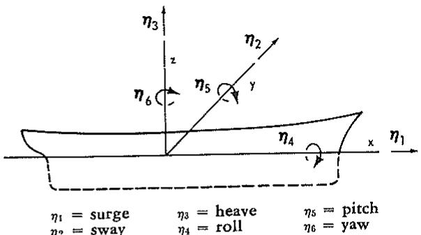

text_image

η₃
z
η₂
η₆
η₅
y
η₄
x
η₁
η₁ = surge
η₃ = heave
η₅ = pitch
η₂ = sway
η₄ = roll
η₆ = yaw

Fig. 1 Sign convention for translatory and angular displacements

# General Formulation of Equations of Motion

It is assumed that the oscillatory motions are linear and harmonic. Let $(x,y,z)$ be a right-handed coordinate system fixed with respect to the mean position of the ship with z vertically upward through the center of gravity of the ship, x in the direction of forward motion, and the origin in the plane of the undisturbed free surface. Let the translatory displacements in the x, y, and z directions with respect to the origin be $\eta_{1}$ , $\eta_{2}$ , and $\eta_{3}$ , respectively, so that $\eta_{1}$ is the surge, $\eta_{2}$ is the sway, and $\eta_{3}$ is the heave displacement. Furthermore, let the angular displacement of the rotational motion about the x, y, and z axes be $\eta_{4}$ , $\eta_{5}$ , and $\eta_{6}$ , respectively, so that $\eta_{4}$ is the roll, $\eta_{5}$ is the pitch, and $\eta_{6}$ is the yaw angle. The coordinate system and the translatory and angular displacements are shown in Fig. 1.

Under the assumptions that the responses are linear and harmonic, the six linear coupled differential equations of motion can be written, using subscript notation, in the following abbreviated form:

$$
\begin{array}{l} \sum_ {k = 1} ^ {6} \left[ (M _ {j k} + A _ {j k}) \ddot {\eta} _ {k} + B _ {j k} \dot {\eta} _ {k} + C _ {j k} \eta_ {k} \right] \\ = F _ {j} e ^ {i \omega t}; j = 1 \dots 6 \tag {1} \\ \end{array}
$$

where $M_{jk}$ are the components of the generalized mass matrix for the ship, $A_{jk}$ and $B_{jk}$ are the added-mass and damping coefficients, $^{6}$ $C_{jk}$ are the hydrostatic restoring coefficients, $^{7}$ and $F_{j}$ are the complex amplitudes of the exciting force and moment, with the force and moment given by the real part of $F_{2}e^{i\omega t}.8$ $F_{1}, F_{2}$ , and $F_{3}$ refer to the amplitudes of the surge, sway, and heave exciting forces, while $F_{4}, F_{5}$ , and $F_{6}$ are the amplitudes of the roll, pitch, and yaw exciting moments; $\omega$ is the frequency of encounter and is the same as the frequency of the response. The dots stand for time derivatives so that $\dot{\eta}_{k}$ and $\ddot{\eta}_{k}$ are velocity and acceleration terms.

If it is assumed that the ship has lateral symmetry (symmetric about the x, z plane) and that the center of gravity is located at $(0, 0, z_{c})$ , then the generalized mass matrix is given by

$$
M _ {j k} = \left[ \begin{array}{c c c c c c} M & 0 & 0 & 0 & M z _ {c} & 0 \\ 0 & M & 0 & - M z _ {c} & 0 & 0 \\ 0 & 0 & M & 0 & 0 & 0 \\ 0 & - M z _ {c} & 0 & I _ {4} & 0 & - I _ {4 6} \\ M z _ {c} & 0 & 0 & 0 & I _ {5} & 0 \\ 0 & 0 & 0 & - I _ {4 6} & 0 & I _ {6} \end{array} \right] \tag {2}
$$

where M is the mass of the ship, $I_{j}$ is the moment of inertia in the jth mode, and $I_{jk}$ is the product of inertia. Here the inertia terms are with respect to the coordinate system shown in Fig. 1. The only product of inertia which appears is $I_{46}$ , the roll-yaw product, which vanishes if the ship has fore-and-aft symmetry and is small otherwise. The other nondiagonal elements all vanish if the origin of the coordinate system coincides with the center of gravity of the ship; however, it is frequently more convenient to take the origin in the water plane, in which case $z_{c}$ is not equal to zero.

For ships with lateral symmetry it also follows that the added-mass (or damping) coefficients are

$$
A _ {j k} (\text {or} B _ {j k}) = \left[ \begin{array}{c c c c c c} A _ {1 1} & 0 & A _ {1 3} & 0 & A _ {1 5} & 0 \\ 0 & A _ {2 2} & 0 & A _ {2 4} & 0 & A _ {2 6} \\ A _ {3 1} & 0 & A _ {3 3} & 0 & A _ {3 5} & 0 \\ 0 & A _ {4 2} & 0 & A _ {4 4} & 0 & A _ {4 6} \\ A _ {5 1} & 0 & A _ {5 3} & 0 & A _ {5 5} & 0 \\ 0 & A _ {6 2} & 0 & A _ {6 4} & 0 & A _ {6 6} \end{array} \right] \tag {3}
$$

Furthermore, for a ship in the free surface the only nonzero linear hydrostatic restoring coefficients are

$$
C _ {3 3}, C _ {4 4}, C _ {5 5}, \text { and } C _ {3 5} = C _ {5 3} \tag {4}
$$

If the generalized mass matrix (2), the added-mass and damping coefficients (3), and the restoring coefficients (4) are substituted in the equations of motions (1), it is seen that for a ship with lateral symmetry, the six coupled equations of motions (1) reduce to two sets of equations: one set of three coupled equations for surge, heave, and pitch and another set of three coupled equations for sway, roll, and yaw. Thus, for a ship with lateral symmetry, surge, heave, and pitch are not coupled with sway, roll, and yaw.

If one assumes that the ship has a long slender hull form in addition to lateral symmetry, then it can be shown (as seen in Appendix 1) that the hydrodynamic forces associated with the surge motion are much smaller than the forces associated with the five other modes of motion so that it is consistent within these assumptions not to include surge. Hence the three coupled equations of motion for surge, heave, and pitch reduce to two coupled equations for pitch and heave.

# Heave and Pitch Motions

Under the assumption that the oscillatory motions are linear and harmonic, it follows from equations (1) through (4) that for a ship with lateral symmetry and a slender hull form the coupled equations of motion for heave and pitch can be written in the form

$$
\begin{array}{l} (M + A _ {3 3}) \ddot {\eta} _ {3} + B _ {3 3} \dot {\eta} _ {3} + C _ {3 3} \eta_ {3} + A _ {3 5} \ddot {\eta} _ {5} \\ + B _ {3 5} \dot {\eta} _ {5} + C _ {3 5} \eta_ {5} = F _ {3} e ^ {i \omega t} \tag {5} \\ \end{array}
$$

$$
\begin{array}{l} A _ {5 3} \ddot {\eta} _ {3} + B _ {5 3} \dot {\eta} _ {3} + C _ {5 3} \eta_ {3} + (I _ {5} + A _ {5 5}) \ddot {\eta} _ {5} \\ + B _ {5 5} \dot {\eta} _ {5} + C _ {5 5} \eta_ {5} = F _ {5} e ^ {i \omega t} \tag {6} \\ \end{array}
$$

The relationships for the added-mass and damping coefficients, $A_{jk}$ and $B_{jk}$ , and the amplitude of the exciting force and moment, $F_{3}$ and $F_{5}$ , are derived in Appendix 1. However, the main assumptions made in the derivation in Appendix 1 are significant in the application of the theory and therefore will be restated here. First of all it is assumed that all viscous effects can be disregarded. Hence, the only damping considered is the damping due to the energy loss in creating free-surface waves. This assumption is justified because the viscous damping is very small for the vertical ship motions. Furthermore, in order to linearize the

# -Nomenclature

(Additional nomenclature used in the Appendices are defined only as they appear)   
$A_{jk} =$ added-mass coefficients ( $j, k = 1, 2 \ldots 6$ ) $A_{jk}^0 =$ speed-independent part of $A_{jk}$ $A_{WP} =$ area of water plane $B =$ ship beam $B_{jk} =$ damping coefficients $B_{jk}^0 =$ speed-independent part of $B_{jk}$ $B_{44}^* =$ viscous damping in roll $C_{jk} =$ hydrostatic restoring coefficients $C_x =$ cross section at $x$ $D_j =$ hydrodynamic force and moment due to body motion $E_j =$ exciting force and moment on portion of hull $F_j =$ exciting force and moment $F_n =$ Froude number $\overline{GM} =$ metacentric height $I_j =$ moment of inertia in $j$ th mode $I_{jk} =$ product of inertia $I_{WP} =$ moment of inertia of water plane $K =$ damping coefficient $L =$ length between perpendiculars $M =$ mass of ship $M_{jk} =$ generalized mass matrix for ship $M_{WP} =$ moment of water plane $N_j =$ two-dimensional sectional generalized normal components ( $j = 2, 3, 4$ ) $R_j =$ restoring force on portion of hull $U =$ ship speed $V_j =$ dynamic load components (see Fig. 9 for definitions) $a =$ submerged sectional area $a_{jk} =$ two-dimensional sectional added-mass coefficient $a_{jk^A} = a_{jk}$ for aftermost section $b =$ sectional ship beam

$b_{jk} =$ two-dimensional sectional damping coefficient

$b_{jk}^{A} = b_{jk}$ for aftermost section

$b_{4i}^{*}$ = sectional viscous damping in roll

d = sectional draft

$dl =$ element of arc along a cross section

$f_{j} =$ sectional Froude-Kriloff "force"

$g =$ gravitational acceleration

$h_j =$ sectional diffraction "force"

$h_j^A = h_j$ for aftermost section

$i_{x} =$ sectional mass moment of inertia about $x$ -axis

$j,k = \text{subscripts}(j,k = 1,2\ldots 6)$

k = wave number

m = sectional mass per unit length

om = sectional metacentric height

s = sectional area coefficient

$l =$ time variable

$x,y,z =$ coordinate system as defined in Fig. 1

$x_{A} = x$ -coordinate of aftermost cross section

$z_{c} = z$ -coordinate of center of gravity

$\bar{z} = z$ -coordinate of sectional center of gravity

$\nabla =$ displaced volume of ship

$\alpha =$ incident wave amplitude

$\beta =$ angle between incident wave and ship heading $(\beta = 180$ deg for head seas); see Fig. 2

$\eta_{j} =$ displacements, $(j = 1,2\dots 6$ refer to surge, sway, heave, roll, pitch, and yaw respectively; see Fig. 1)

$\lambda =$ wave length

$\xi =$ variable of integration in $x$ -direction

ρ = mass density of water

$\psi_{j} =$ two-dimensional velocity potential

$\omega =$ frequency of encounter

$\omega_0 =$ wave frequency

potential problem, it is assumed that the wave-resistance perturbation potential and all its derivatives are small enough to be ignored in the formulation of the motion problem. $^{9}$ Physically this means that the free-surface waves created by the ship advancing at constant speed in calm water are assumed to have no effect on the motions. This appears to be a reasonable assumption for fine slender hull forms.

Finally, in order to reduce the three-dimensional problem to a summation of two-dimensional problems, it is necessary to assume that the frequency is (relatively) high. This means that the waves created by the ship's oscillations should have a wave length of the order of the ship beam rather than the ship length. This is a critical assumption since the maximum responses are in the fairly low-frequency range (the long-wave range); however, the pitch and heave motions in the low-frequency range are dominated by the hydrostatic forces so that inaccuracies in the hydrodynamic coefficients in this range have a minor effect on the final results.

The added-mass and damping coefficients as derived in Appendix 1 are

$$
A _ {3 3} = \int a _ {3 3} d \xi - \frac {U}{\omega^ {2}} b _ {3 3} ^ {\Lambda} \tag {7}
$$

$$
B _ {3 3} = \int b _ {3 3} d \xi + U a _ {3 3} ^ {\Lambda} \tag {8}
$$

$$
\begin{array}{l} A _ {3 5} = - \int \xi a _ {3 3} d \xi - \frac {U}{\omega^ {2}} B _ {3 3} ^ {0} \\ + \frac {U}{\omega^ {2}} x _ {A} b _ {3 3} ^ {A} - \frac {U ^ {2}}{\omega^ {2}} a _ {3 3} ^ {A} \tag {9} \\ \end{array}
$$

$$
B _ {3 5} = - \int \xi b _ {3 3} d \xi + U A _ {3 3} ^ {0}
$$

$$
- U x _ {A} a _ {3 3} ^ {- 1} - \frac {U ^ {2}}{\omega^ {2}} b _ {3 3} ^ {- 1} \tag {10}
$$

$$
A _ {5 3} = - \int \xi a _ {3 3} d \xi + \frac {U}{\omega^ {2}} B _ {3 3} ^ {0} + \frac {U}{\omega^ {2}} x _ {A} b _ {3 3} ^ {A} \tag {11}
$$

$$
B _ {5 3} = - \int \xi b _ {3 3} d \xi - U A _ {3 3} ^ {0} - U x _ {A} a _ {3 3} ^ {A} \tag {12}
$$

$$
\begin{array}{l} A _ {5 5} = \int \xi^ {2} a _ {3 3} d \xi + \frac {U ^ {2}}{\omega^ {2}} A _ {3 3} ^ {0} \\ - \frac {U}{\omega^ {2}} x _ {A} ^ {2} b _ {3 3} ^ {A} + \frac {U ^ {2}}{\omega^ {2}} x _ {A} a _ {3 3} ^ {A} \tag {13} \\ \end{array}
$$

$$
B _ {5 5} = \int \xi^ {2} b _ {3 3} d \xi + \frac {U ^ {2}}{\omega^ {2}} B _ {3 3} ^ {0}
$$

$$
+ U x _ {A} ^ {2} a _ {3 3} ^ {A} + \frac {U ^ {2}}{\omega^ {2}} x _ {A} b _ {3 3} ^ {A} \tag {14}
$$

Here $a_{33}$ and $b_{33}$ are the two-dimensional sectional added-mass and damping coefficients for heave. All the integrals are over the length of the ship and $U$ is the forward speed of the ship. $A_{33^0}$ and $B_{33^0}$ refer to the speed-independent part of $A_{33}$ and $B_{33}$ ; $x_A$ is the $x$ -coordinate of the aftermost cross-section of the ship; and $a_{33^A}$ and $b_{33^A}$ are the added-mass and damping coefficients for the aftermost section.

The hydrostatic restoring coefficients, which are independent of frequency and forward speed, follow directly from hydrostatic considerations as

$$
C _ {3 3} = \rho g f b d \xi = \rho g A _ {W P} \tag {15}
$$

$$
C _ {3 5} = C _ {5 3} = - \rho g f \xi b d \xi = - \rho g M _ {W P} \tag {16}
$$

$$
C _ {5 5} = \rho g \int \xi^ {2} b d \xi = \rho g I _ {W P} \tag {17}
$$

Here b is the sectional beam of the ship, p is the mass density of the water, g is the gravitational acceleration, and the integration is over the length of the ship. $A_{WP}$ , $M_{WP}$ , and $I_{WP}$ are the area, moment, and moment of inertia of the water plane.

The amplitudes of the exciting force and moment as derived in Appendix 1 are

$$
F _ {3} = \rho \alpha \int (f _ {3} + h _ {3}) d \xi + \rho \alpha \frac {U}{i \omega} h _ {3} ^ {4} \tag {18}
$$

$$
\begin{array}{l} F _ {5} = - \rho \alpha \int \left[ \xi \left(f _ {3} + h _ {3}\right) + \frac {U}{i \omega} h _ {3} \right] d \xi \\ - \rho \alpha \frac {U}{i \omega} x _ {A} h _ {3} ^ {A} \tag {19} \\ \end{array}
$$

with the sectional Froude-Kriloff "force" defined by

$$
f _ {3} (x) = g e ^ {- i k x \cos \beta} \int_ {C _ {z}} N _ {3} e ^ {i k y \sin \beta} e ^ {k z} d l \tag {20}
$$

and the sectional diffraction "force" by

$$
\begin{array}{l} h _ {3} (x) = \omega_ {0} e ^ {- i k x \cos \beta} \int_ {C _ {r}} \left(i N _ {3} - N _ {2} \right. \\ \times \sin \beta) e ^ {i k y \sin \beta} e ^ {k z} \psi_ {3} d l \tag {21} \\ \end{array}
$$

Here $\alpha$ is the wave amplitude, k is the wave number, $\beta$ is the heading angle (see Fig. 2 for definitions), dl is an element of arc along the cross section $C_{x}$ , and $\omega_{0} = \sqrt{g\overline{k}}$ is the wave frequency which is related to $\omega$ , the frequency of encounter, by

$$
\omega_ {0} = \omega + k U \cos \beta \tag {22}
$$

Furthermore, $h_{3}^{A}$ refers to $h_{3}$ for the aftermost section, $N_{2}$ and $N_{3}$ are the components in the y and z directions of the two-dimensional outward unit normal vector in the y-z plane, and $\psi_{3}$ is the velocity potential for the two-dimensional problem of a cylinder with the same shape as the given cross-section, $C_{z}$ , oscillating in heave in the free surface.

Examination of the relationships for the coefficients in the equations of motion, equations (7) through (17), and the relationships for the exciting force and moment, (18) and (19), shows that the coefficients and the excitation can be obtained easily by simple numerical integration over the length of the ship if one knows the sectional two-dimensional added mass $a_{33}$ , damping $b_{33}$ , and velocity potential $\psi_{3}$ . The computation of these two-dimensional hydrodynamic quantities is the most difficult and time-consuming part of computing the ship motions. It is necessary to determine these quantities for approximately twenty sections along the length of the ship and, since these quantities are frequency dependent, they have to be computed at each station for some 20 to 30 frequencies. Accurate estimates for these sectional quantities are absolutely necessary in order to obtain useful final results. A discussion is presented in Appendix 2 of available numerical methods for solving the two-dimensional problem together with a comparison between computed and experimental values of the sectional added mass, damping, and exciting force.

In the hydrodynamic coefficients, (7) through (14), and in the exciting force and moment, (18) and (19), there are several end terms associated with the added mass, the damping, and the diffraction at the aftermost section, $a_{33}^{A}$ , $b_{33}^{A}$ , and $h_{3}^{A}$ . Such end terms are usually not included in strip theories. However, computations have shown that these end terms have a considerable effect on the motions of ships with wide transom sterns. One may question altogether the justification for applying strip theory to transom-stern ships because of the sudden geometric change at the stern which apparently violates the assumption of small changes in the longitudinal direction. On the other hand, if it is recalled that at higher speeds the flow pattern at the transom has no sudden jump it seems reasonable to assume that the changes in the hydrodynamic quantities in the longitudinal direction can be considered small even at the transom so that the strip-theory assumption can be restored. Strictly speaking, the only real justification for including such end terms in computing the motions for transom-stern ships is that the computed results seem to agree better with experiments when these terms are included.

Comparison with other theories. At this point it is of interest to compare the equations of motion presented here with the original strip theory for heave and pitch in head waves by Korvin-Kroukovsky and Jacobs (1957). The equations of motion (5) and (6) have the same form in both theories and the coefficients are also the same for the zero-speed case, while the excitation and the speed terms in the coefficients differ. In the notations and conventions of this paper, the hydrodynamic added-mass and damping coefficients given by Korvin-Kroukovsky and Jacobs may be written in the form

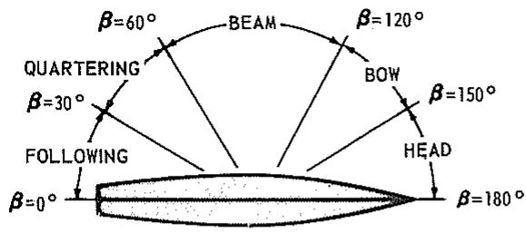

text_image

β=60°
BEAM
β=120°
QUARTERING
β=30°
BOW
β=150°
FOLLOWING
HEAD
β=0°
β=180°

Fig. 2 Definition of incident-wave directions

$$
A _ {3 3} = \int a _ {3 3} d \xi \tag {23}
$$

$$
B _ {3 3} = \int b _ {3 3} d \xi + U a _ {3 3} ^ {A} \tag {24}
$$

$$
A _ {3 5} = - \int \xi a _ {3 3} d \xi - \frac {U}{\omega^ {2}} B _ {3 3} ^ {0} - \frac {U ^ {2}}{\omega^ {2}} a _ {3 3} ^ {4} \tag {25}
$$

$$
B _ {3 5} = - \int \xi b _ {3 3} d \xi + U A _ {3 3} ^ {0} - U x _ {A} a _ {3 3} ^ {A}. \tag {26}
$$

$$
A _ {5 3} = - \int \xi a _ {3 3} d \xi \tag {27}
$$

$$
B _ {5 3} = - \int \xi b _ {3 3} d \xi - U A _ {3 3} ^ {0} - U x _ {A} a _ {3 3} ^ {A} \tag {28}
$$

$$
A _ {3 3} = \int \xi^ {2} a _ {3 3} d \xi + \frac {U}{\omega^ {2}} B _ {3 3} ^ {0} + \frac {U ^ {2}}{\omega^ {2}} A _ {3 3} ^ {0}
$$

$$
+ \frac {U ^ {2}}{\omega^ {2}} x _ {A} a _ {3 3} ^ {A} \tag {29}
$$

$$
B _ {5 5} = \int \xi^ {2} b _ {3 3} d \xi + U x _ {A} ^ {2} a _ {3 3} ^ {A} \tag {30}
$$

One should note that the end terms, $a_{33}^{A}$ , were not included in the final form of the coefficients given by Korvin-Kroukovsky and Jacobs (1957). They assumed that the added mass at the aftermost section $a_{33}^{A}$ was equal to zero. If $a_{33}^{A}$ is assumed to be nonzero, then the end terms given in the foregoing follow directly from the work of Korvin-Kroukovsky and Jacobs.

In comparing the coefficients presented here, (7) through (14), with those derived by Korvin-Kroukovsky and Jacobs, (23) through (30), the coefficients will be considered first without the end terms. Then the two sets of coefficients are the same except for $A_{53}$ , $A_{55}$ , and $B_{55}$ . In the theory of Korvin-Kroukovsky and Jacobs, both the coefficients $A_{53}$ and $B_{55}$ are speed independent (disregarding end terms), while their coefficient $A_{55}$ has an additional speed term, $UB_{33}^{0}/\omega^{2}$ . Numerical computations indicate that the speed term in the added-mass cross-coupling coefficient, $A_{53}$ , which is included in this theory but not in Korvin-Kroukovsky and Jacobs, has a considerable effect on the computed motions, while the difference in the speed terms associated with the coefficients $A_{55}$ and $B_{55}$ seems to have less numerical significance.

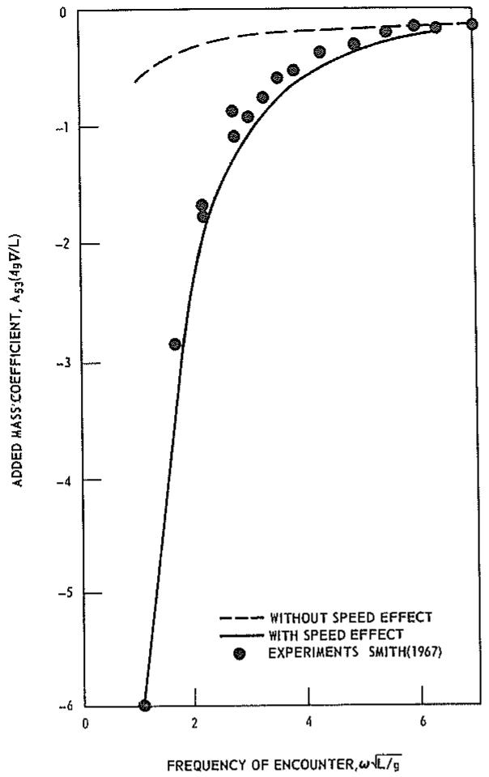

line

| FREQUENCY OF ENCOUNTER, ω√L/g | ADDED MASS COEFFICIENT, A53(ω̂_9 ∅/L) |
| ----------------------------- | -------------------------------------- |
| 0.5                           | -6.0                                   |
| 1.0                           | -3.0                                   |
| 1.5                           | -2.0                                   |
| 2.0                           | -1.5                                   |
| 2.5                           | -1.0                                   |
| 3.0                           | -0.5                                   |
| 3.5                           | -0.2                                   |
| 4.0                           | -0.1                                   |
| 4.5                           | -0.05                                  |
| 5.0                           | -0.02                                  |
| 5.5                           | -0.01                                  |
| 6.0                           | -0.005                                 |
| 6.5                           | -0.002                                 |

Fig. 3 Added-mass cross-coupling coefficient, $A_{53}$ , for Friesland at $\mathbf{F}_{\mathfrak{n}} = 0.45$

The speed effect on $A_{53}$ as presented in this theory is believed to be correct for two reasons: (i) Timman and Newman (1962) have proved, for a slender ship with pointed ends ( $a_{33}^{A} = b_{33}^{A} = 0$ ), that $A_{35}$ and $A_{53}$ must have the same forward speed terms but opposite sign. The coefficients given here satisfy this symmetry requirement. (ii) Experiments by W. E. Smith (1967) presented in Fig. 3 show that $A_{53}$ has a fairly strong speed dependence. The points in the figure represent his experimental results for the Friesland destroyer hull at $F_{n} = 0.45$ and the two curves show calculated values. The broken line is the computed coefficient, $A_{53}$ , without speed effects, whereas the solid line includes the speed term $UB_{33}^{0}/\omega^{2}$ [see equation (11)]. Furthermore, it is interesting to note that the experiments by Smith (1967) for the coefficient $B_{55}$ indicate that it is also speed dependent and comparisons seem to support the speed terms presented here in equation (14).

Consideration of the end terms in the coefficients presented here, equations (7) through (14), and in the coefficients by Korvin-Kroukovsky and Jacobs, (23) through (30), shows that Korvin-Kroukovsky and Jacobs only have the end terms associated with the added mass, $a_{33}^{4}$ , and none of the end terms associated with the damping, $b_{33}^{4}$ , which are included in this theory.

In order to compare the exciting force and moment derived here for arbitrary heading, (18) and (19), and those derived by Korvin-Kroukovsky and Jacobs for head waves, it is necessary to rework some of the expressions. Considering only head waves ( $\beta = 180$ deg) the sectional diffraction “force” (21) becomes

$$
h _ {3} = i \omega_ {0} e ^ {i k x} \int_ {C _ {x}} N _ {3} \psi_ {3} e ^ {k z} d l \tag {31}
$$

Korvin-Kroukovsky and Jacobs made an empirical assumption in their work that the exponential part of the integrand, $e^{kz}$ , could be replaced by $e^{-kds}$ where d is the sectional draft and s is the sectional area coefficient (area divided by beam and draft). If this assumption is used, the exponential term can be expressed in terms of the added mass $u_{33}$ and damping $b_{33}$ as

$$
\begin{array}{l} h _ {3} \cong i \omega_ {0} e ^ {i k x} e ^ {- k d s} \int_ {C _ {x}} N _ {3} \psi_ {3} d l \\ = - \frac {1}{\rho} \frac {\omega_ {0}}{\omega} e ^ {i k x} e ^ {- k d s} (\omega^ {2} t _ {3 3} - i \omega b _ {3 3}) \tag {32} \\ \end{array}
$$

Use of the same assumption when computing sectional Froude-Kriloff "force," (20), results in

$$
f _ {3} = g e ^ {i k x} e ^ {- k d s} \int_ {C _ {x}} N _ {3} d l = g e ^ {i k x} e ^ {- k d s} b \tag {33}
$$

where b is the sectional beam. If these two relations, (32) and (33), are substituted in the equations for the exciting force and moment, (18) and (19), it follows that the exciting force can be written in the simplified form

$$
\begin{array}{l} F _ {3} = \alpha \int e ^ {i k \xi} e ^ {- k d s} \left\{\rho g b - \omega_ {0} (\omega a _ {3 3} - i b _ {3 3}) \right\} d \xi \\ - \alpha \frac {U}{i \omega} e ^ {i k x _ {A}} e ^ {- k d s} \omega_ {0} \left(\omega l _ {3 3} ^ {A} - i b _ {3 3} ^ {A}\right) \tag {34} \\ \end{array}
$$

and the exciting moment in the form

$$
\begin{array}{l} F _ {5} = - \alpha \int e ^ {i k \xi} e ^ {- k d s} \left\{\xi [ \rho g b - \omega_ {0} (\omega a _ {3 3} - i b _ {3 3}) ] \right. \\ \left. - \frac {U}{i \omega} \omega_ {0} \left(\omega a _ {3 3} - \underline {{i b _ {3 3}}}\right) \right\} d \xi \\ + \alpha \frac {U}{i \omega} e ^ {i k x _ {A}} e ^ {- k d s} \omega_ {0} x _ {A} \left(\omega a _ {3 3} ^ {A} - i b _ {3 3} ^ {A}\right) \tag {35} \\ \end{array}
$$

Comparison of these relationships for the exciting force and moment for head waves with the work by Korvin-Kroukovsky and Jacobs shows that the three underlined terms in (34) and (35) are not included in their theory. Numerical investigations have shown that these three additional terms in the exciting force and moment have only a small effect on the computed motions.

It should be pointed out that for predictions in head waves it is much easier and faster computationally to use the exciting force and moment in the form (34) and (35) rather than in the more general form (18) and (19). However, numerical computations have shown that it is only accurate to replace the term $e^{ks}$ by $e^{-kds}$ for sections with very regular shapes. For example, for bulbous-bow sections, use of the exciting force and moment by Korvin-Kroukovsky and Jacobs and the exciting force and moment expressed in (34) and (35) would give inaccurate results.

The original strip theory of Korvin-Kroukovsky and Jacobs has been modified and extended by several investigators [see, for example, Gerritsma and Beukelman (1967)]. These modified theories all lack the additional speed terms included here and they did not satisfy the Timman-Newman (1962) symmetry relationship. However, during the last year Söding (1969), Tasai and Takaki (1969), and Borodai and Netsvetayev (1969) independently presented new strip theories for heave and pitch motions. These theories are similar and, except for the end-effect terms, they all have the same forward-speed-effect terms as those given in the present work. It should be emphasized, on the other hand, that in the derivatives of these theories the "strip-theory" approximations were applied in the initial formulation of the problem, while in the present derivation the hydrodynamic coefficients in the equations of motion [equations (117) through (123) in Appendix 1] and the exciting force and moment [equation (146)] have been derived without use of any strip-theory approximations. The strip-theory approximations have been introduced in this work only in order to simplify the numerical computations; therefore, the forward-speed terms and the end terms derived here are in no way restricted by the strip-theory approximations.

Comparison with experiments. A few comparisons between computed and experimental values for heave and pitch motions will be presented here in order to demonstrate the generally satisfactory agreement. Figure 4 shows the heave and pitch amplitudes and phases for the Mariner hull form in head waves at Froude number 0.20. $^{10}$ The points in the figure represent experimental results by Salvesen and Smith (1970) while the solid line is computed by the present theory and the broken line by the theory of Korvin-Kroukovsky and Jacobs (1957). For the heave and pitch phases the difference between the two theories is so small that only the curve for the present theory is shown in the figure. Note that the pitch amplitude, $\eta_{5}$ , is scaled by the wave amplitude, $\alpha$ , and multiplied by half the ship length, L/2, so that the pitch values, $\eta_{5}L/2\alpha$ , shown on the plot are nondimensional vertical bow displacements due to pitch. $^{11}$ It is seen in Fig. 4 that both theories agree quite well with the experiments and that for the pitch amplitudes the present theory seems to agree somewhat better with the experiments than the theory of Korvin-Kroukovsky and Jacobs.

Figure 5 gives theoretical and experimental pitch and heave values for the Davidson A hull form in head waves at Froude number 0.45. $^{12}$ The Davidson A is a destroyer form with a very large bulbous bow and a transom stern. An accurate account of the effects of the bulb is obtained by using the Frank close-fit method in computing the sectional added mass and damping for both theories. The end-effect terms as previously discussed were included in both theories. The experimental values shown in Fig. 5 were measured by Smith and Salvesen (1970) using a free-running model. The vertical motions were measured by sonic transducers in order to eliminate the mechanical damping which was present in the heave staff. $^{13}$ It is seen in Fig. 5 that for this hull form both the heave and pitch amplitudes computed by the present theory agree slightly better with the experiments than does the theory of Korvin-Kroukovsky and Jacobs.

Finally, in Fig. 6 the pitch amplitudes $^{14}$ in oblique and following waves are shown for the Series 60 standard hull form with block coefficient 0.80 at Froude number 0.15. The curve represents computations by the present theory and the points are results by Wahab (1967). Satisfactory agreement between theory and experiments is seen for bow, quartering, and following waves while there is some discrepancy for beam waves.

# Sway, Roll, and Yaw Motions

It follows from the general formulation of the equations of motion [equations (1) through (4)] that for a ship with lateral symmetry the coupled differential equations governing the sway, roll, and yaw motions can be written in the form

$$
\begin{array}{l} (A _ {2 2} + M) \ddot {\eta} _ {2} + B _ {2 2} \dot {\eta} _ {2} + (A _ {2 4} - M z _ {c}) \ddot {\eta} _ {4} \\ + B _ {2 4} \dot {\eta} _ {4} + A _ {2 6} \ddot {\eta} _ {6} + B _ {2 6} \dot {\eta} _ {6} = F _ {2} e ^ {i \omega t} \tag {36} \\ \end{array}
$$

$$
(A _ {4 2} - M z _ {c}) \ddot {\eta} _ {2} + B _ {4 2} \dot {\eta} _ {2} + (A _ {4 4} + I _ {4}) \ddot {\eta} _ {4} + B _ {4 4} \dot {\eta} _ {4}
$$

$$
+ C _ {4 4} \eta_ {4} + (A _ {4 6} - I _ {4 6}) \ddot {\eta} _ {6} + B _ {4 6} \dot {\eta} _ {6} = F _ {4} e ^ {i \omega t} \tag {37}
$$

$$
\begin{array}{l} A _ {6 2} \ddot {\eta} _ {2} + B _ {6 2} \dot {\eta} _ {2} + (A _ {6 4} - I _ {4 6}) \ddot {\eta} _ {4} + B _ {6 4} \dot {\eta} _ {4} \\ + \left(A _ {6 6} + I _ {6}\right) \ddot {\eta} _ {6} + B _ {6 6} \dot {\eta} _ {6} = F _ {6} e ^ {i \omega t} \tag {38} \\ \end{array}
$$

The added-mass and damping coefficients, $A_{jk}$ and $B_{jk}$ , as derived in Appendix 1 using linear potential-flow theory, cannot be used for the case of sway, yaw, and roll without including a correction for viscous damping. Comparison between theory and experiments shows that the roll-damping coefficient, $B_{44}$ , is significantly affected by viscosity even in the absence of bilge keels, and the amplitude of the roll displacement can be computed with reasonable accuracy in near-resonance condition only if the viscous roll damping is included [see Vugts (1968)]. Therefore the hydrodynamic coefficient given in Appendix 1 will be used with an additional term, $B_{44}^*$ , which represents quasi-linear viscous-damping effects in roll $^{15}$ :

$$
A _ {2 2} = \int a _ {2 2} d \xi - \frac {U}{\omega^ {2}} b _ {2 2} ^ {A} \tag {39}
$$

$$
B _ {2 2} = \int b _ {2 2} d \xi + U a _ {2 2} ^ {A} \tag {40}
$$

$$
A _ {2 4} = A _ {4 2} = \int a _ {2 4} d \xi - \frac {U}{\omega^ {2}} b _ {2 4} ^ {A} \tag {41}
$$

$$
B _ {2 4} = B _ {4 2} = \int b _ {2 4} d \xi + U a _ {2 4} ^ {A} \tag {42}
$$

$$
\begin{array}{l} A _ {2 6} = \int \xi a _ {2 2} d \xi + \frac {U}{\omega^ {2}} B _ {2 2} ^ {0} - \frac {U}{\omega^ {2}} x _ {A} b _ {2 2} ^ {A} \\ + \frac {U ^ {2}}{\omega^ {2}} a _ {2 2} ^ {A} \tag {43} \\ \end{array}
$$

$$
B _ {2 6} = \int \xi b _ {2 2} d \xi - U A _ {2 2} ^ {0} + U x _ {A} a _ {2 2} ^ {A} + \frac {U ^ {2}}{\omega^ {2}} b _ {2 2} ^ {A} \tag {44}
$$

$$
A _ {4 4} = \int a _ {4 4} d \xi - \frac {U}{\omega^ {2}} b _ {4 4} ^ {A} \tag {45}
$$

$$
B _ {4 4} = \int b _ {4 4} d \xi + U a _ {4 4} ^ {A} + B _ {4 4} ^ {*} \tag {46}
$$

$$
\begin{array}{l} A _ {4 6} = \int_ {\xi} ^ {\xi} a _ {2 4} d \xi + \frac {U}{\omega^ {2}} B _ {2 4} ^ {0} - \frac {U}{\omega^ {2}} x _ {A} b _ {2 4} ^ {A} \\ + \frac {U ^ {2}}{\omega^ {2}} a _ {2 4} ^ {A} \tag {47} \\ \end{array}
$$

$$
B _ {4 6} = \int \xi b _ {2 4} d \xi - U A _ {2 4} ^ {0}
$$

$$
+ U x _ {A} a _ {2 4} ^ {A} + \frac {U ^ {2}}{\omega^ {2}} b _ {2 4} ^ {A} \tag {48}
$$

$$
A _ {6 2} = \int \xi a _ {2 2} d \xi - \frac {U}{\omega^ {2}} B _ {2 2} ^ {0} - \frac {U}{\omega^ {2}} x _ {A} b _ {2 2} ^ {A} \tag {49}
$$

$$
B _ {6 2} = \int \xi b _ {2 2} d \xi + U A _ {2 2} ^ {0} + U x _ {A} a _ {2 2} ^ {A} \tag {50}
$$

$$
A _ {6 4} = f \xi a _ {2 4} d \xi - \frac {U}{\omega^ {2}} B _ {2 4} ^ {0} - \frac {U}{\omega^ {2}} x _ {A} b _ {2 4} ^ {A} \tag {51}
$$

$$
B _ {6 4} = \int \xi b _ {2 4} d \xi + U A _ {2 4} ^ {0} + U x _ {A} a _ {2 4} ^ {A} \tag {52}
$$

$$
\begin{array}{l} A _ {6 6} = \int \xi^ {2} a _ {2 2} d \xi + \frac {U ^ {2}}{\omega^ {2}} A _ {2 2} ^ {0} - \frac {U}{\omega^ {2}} x _ {A} ^ {2} b _ {2 2} ^ {A} \\ + \frac {U ^ {2}}{\omega^ {2}} x _ {A} a _ {2 2} ^ {A} \tag {53} \\ \end{array}
$$

$$
B _ {6 6} = \int \xi^ {2} b _ {2 2} d \xi + \frac {U ^ {2}}{\omega^ {2}} B _ {2 2} ^ {0} + U x _ {A} ^ {2} a _ {2 2} ^ {A}
$$

$$
+ \frac {U ^ {2}}{\omega^ {2}} x _ {A} b _ {2 2} ^ {A} \tag {54}
$$

Here the integrations are over the length of the ship, $a_{22}$ and $b_{22}$ are the two-dimensional sectional added mass and damping in sway, $a_{44}$ and $b_{44}$ are the sectional added mass and damping in roll, and $a_{24}$ and $b_{24}$ are the two-dimensional added-mass and damping coefficients due to cross coupling between sway and roll. In Appendix 2, numerical methods for computing the sectional added-mass and damping coefficients are described and comparisons between computed and experimental values for these two-dimensional sectional quantities are made. After the sectional coefficients are determined all the hydrodynamic coefficients in the equation of motion can be obtained by straightforward integration over the length of the ship. It should be recalled that $A_{jk^{0}}$ and $B_{jk^{0}}$ refer to the speed-independent part of the coefficients and that $x_{A}, a_{jk^{A}}$ , and $b_{jk^{A}}$ refer to values at the aftermost section.

For heave and pitch motions there were four hydrostatic restoring coefficients, equations (15) through (17), while for sway, yaw, and roll there is only the one restoring coefficient:

$$
C _ {4 4} = \rho g \nabla \overline {{G M}} \tag {55}
$$

where $\nabla$ is the displaced volume of the ship and $\overline{GM}$ is the metacentric height.

It follows from the results in Appendix I that the amplitude of the sway exciting force is

$$
F _ {2} = \alpha \rho \int (f _ {2} + h _ {2}) d \xi + \alpha \rho \frac {U}{i \omega} h _ {2} ^ {\cdot 4} \tag {56}
$$

that the amplitude of the roll exciting moment is

$$
F _ {4} = \alpha \rho \int (f _ {4} + h _ {4}) d \xi + \alpha \rho \frac {U}{i \omega} h _ {4} ^ {A} \tag {57}
$$

and that the amplitude of the yaw exciting moment is

$$
\begin{array}{l} F _ {6} = \alpha \rho \int \left[ \xi (f _ {2} + h _ {2}) + \frac {U}{i \omega} h _ {2} \right] d \xi \\ + \alpha \rho \frac {U}{i \omega} x _ {A} h _ {2} ^ {4} \tag {58} \\ \end{array}
$$

where the sectional Froude-Kriloff "forces" are

$$
f _ {j} = g e ^ {- i k x \cos \beta} \int_ {C _ {x}} N _ {j} e ^ {i k y \sin \beta} e ^ {k z} d l; j = 2, 4. \tag {59}
$$

and the sectional diffraction "forces" are

$$
h _ {j} = \omega_ {0} e ^ {- i k x \cos \beta} \int_ {C _ {r}} (i N _ {3} - N _ {2} \sin \beta) e ^ {i k y \sin \beta} e ^ {k z} \psi_ {j} d l;
$$

$$
j = 2, 4 \tag {60}
$$

Thus, the exciting forces and moments can be obtained by simple numerical integrations first over Fig. 4 Heave and pitch amplitudes and phases for Mariner in head waves at $F_{n} = 0.20$

the cross section, $C_{x}$ , and then over the length of the ship if the sectional two-dimensional velocity potentials for sway and roll, $\psi_{2}$ and $\psi_{4}$ , are known. Methods for computing these two-dimensional potentials are discussed in Appendix 2.

The work of Grim and Schenzle (1969) is the only previously published work known to the authors on the equations of motion for sway, roll, and yaw for a ship with forward speed. A detailed comparison between the equations derived by Grim and Schenzle and those presented here would require too much space; however, it should be noted that the coefficients in the equations of motion given here satisfy the symmetry relationship stated by Timman and Newman (1962) while the coefficients used by Grim and Schenzle lack several of the forward-speed terms included here and do not satisfy this symmetry relationship.

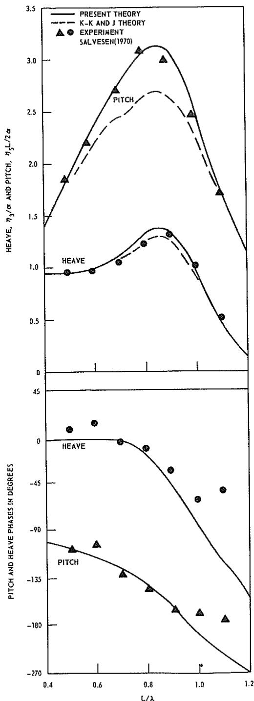

line

| L/λ | PRESENT THEORY (HEAVE) | K-K AND J THEORY (HEAVE) | EXPERIMENT (HEAVE) | PRESENT THEORY (PITCH) | K-K AND J THEORY (PITCH) | EXPERIMENT (PITCH) |
| --- | --- | --- | --- | --- | --- | --- |
| 0.4 | 1.4 | 1.4 | 1.4 | -135 | -135 | -135 |
| 0.6 | 2.2 | 2.2 | 2.2 | -130 | -130 | -130 |
| 0.8 | 3.1 | 3.1 | 3.1 | -120 | -120 | -120 |
| 1.0 | 2.5 | 2.5 | 2.5 | -100 | -100 | -100 |
| 1.2 | 1.2 | 1.2 | 1.2 | -270 | -270 | -270 |

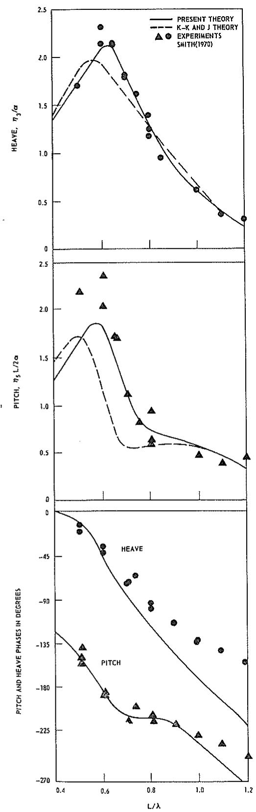

line

| L/λ | HEAVE, η₃/α (PRESENT THEORY) | HEAVE, η₃/α (K–K AND J THEORY) | HEAVE, η₃/α (EXPERIMENTS SMITH(1970)) | PITCH, η₅ L/2α (PRESENT THEORY) | PITCH, η₅ L/2α (K–K AND J THEORY) | PITCH, η₅ L/2α (EXPERIMENTS SMITH(1970)) | PITCH and HEAVE PHASES IN DEGREES (PRESENT THEORY) | PITCH and HEAVE PHASES IN DEGREES (K–K AND J THEORY) |
| --- | --- | --- | --- | --- | --- | --- | --- | --- |
| 0.4 | 1.4 | 1.5 | 1.7 | 1.3 | 1.5 | 2.3 | -135 | -180 |
| 0.6 | 2.1 | 2.0 | 2.2 | 1.8 | 1.7 | 2.4 | -45 | -160 |
| 0.8 | 1.4 | 1.3 | 1.5 | 0.6 | 0.6 | 0.9 | -90 | -180 |
| 1.0 | 0.7 | 0.6 | 0.8 | 0.5 | 0.5 | 0.4 | -135 | -225 |
| 1.2 | 0.3 | 0.3 | 0.4 | 0.3 | 0.3 | 0.3 | -270 | -270 |

Fig. 5 Heave and pitch amplitudes and phases for Davidson A in head waves at $F_{n} = 0.45$

As was stated, the roll motions in the near-resonance condition are strongly affected by viscous damping. This can be seen in Fig. 7, where theoretical and experimental roll amplitudes for a round-bilge rectangular cylinder in beam waves are shown. The points in the figure are experimental values from Vugts (1968a). The broken line is the computed roll amplitude using linear potential-flow theory including wave damping but neglecting viscous effects, while the solid line represents the computed roll amplitude including both wave and viscous damping. The maximum roll amplitude computed by potential theory is not shown in the figure, but it is several times larger than the maximum measured amplitude. The viscous roll damping has been computed by equations derived by Kato (1958) for skin friction and by Tanaka (1960) for eddy-making resistance. Use of these results of Kato and Tanaka permits the viscous roll-damping effects which are nonlinear with respect to the roll velocity, $\dot{\eta}_4$ , to be introduced in the equations of motion as the quasi-linear term

$$
B _ {4 4} ^ {*} = K \dot {\eta} _ {4 \max} \tag {61}
$$

where K depends on the frequency, the viscosity, the bilge-keel dimensions, and the hull geometry. Here $\dot{\eta}_{A_{max}}$ is the maximum roll velocity and must be estimated before the motions are computed. If the difference between the estimated and the computed $\dot{\eta}_{A_{max}}$ is too large, a new value for $\dot{\eta}_{A_{max}}$ must be estimated and the motions are then recomputed.

Vugts (1968a) has reported experimental sway and roll amplitudes for several cylinder forms in beam waves and, as shown in Fig. 7 for a sample case, the agreement between his test results and the computed motions is generally satisfactory when the viscous effects are included by equation (61). Furthermore, comparisons have been made with sway and roll experiments by Tasai (1965) for Series 60, $C_{B} = 0.70$ in beam waves at zero speed. As seen in Fig. 8, the agreement between the computed and experimental motions is quite good. The dip in the computed curve is due to the coupling of roll into sway in the roll-resonance condition.

Unfortunately, it is not possible to make a detailed comparison between experiments and theory for the sway, yaw, and roll motions in oblique waves. For those few experiments where these motions have been measured, adequate information about the weight distribution needed for computing the responses is not available in most of the cases. Therefore it is difficult to make general statements with respect to the accuracy of sway, yaw, and roll motions in oblique seas as computed by this theory. On the other hand, the satisfactory agreement between experiments and theory shown in Section 3 herein for the horizontal wave-induced loads may be taken as an indication that the computed motions should be reasonable.

# 3. Sea Loads

Relationships are presented in this section for the dynamic shear forces and torsional and bending moments for a ship advancing at constant mean speed at arbitrary heading in regular sinusoidal waves. Comparisons between computed and experimental wave-induced loads are made.

# Dynamic Load Equations

Let the shear and compression force at a cross section of the ship be

$$
\mathbf {V} = V _ {1} \mathbf {i} + V _ {2} \mathbf {j} + V _ {3} \mathbf {k} \tag {62}
$$

where $V_{1}$ is the compression, $^{16}$ $V_{2}$ is the horizontal shear force, and $V_{3}$ is the vertical shear force. Similarly, let the bending and torsional moment at a section be

$$
\mathbf {M} = V _ {4} \mathbf {i} + V _ {5} \mathbf {j} + V _ {6} \mathbf {k} \tag {63}
$$

where $V_{4}$ is the torsional moment, $V_{5}$ is the vertical bending moment, and $V_{6}$ is the horizontal bending moment. $^{17}$ The sign convention used for the dynamic wave-load components is shown in Fig. 9. Note that $V_{5}$ is actually the bending moment about the horizontal axis but it has become customary among naval architects to refer to

Fig. 6 Pitch amplitudes for Series 60, $C_B = 0.80$ in bow, beam, quartering and following waves at $F_n = 0.15$

$V_{5}$ as the vertical bending moment since it is the moment due to the vertical forces. Similarly $V_{6}$ , which is the moment about the vertical axis, is referred to as the horizontal bending moment since it is due to the horizontal forces.

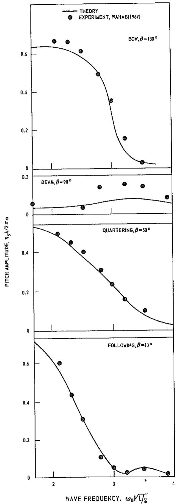

line

| Wave Frequency, ω₀√t/ε | PITCH AMPLITUDE, η₅λ/2πα (THEORY) | PITCH AMPLITUDE, η₅λ/2πα (EXPERIMENT, WAHAB(1967)) |
| ---------------------- | ---------------------------------- | ----------------------------------------------------- |
| 2.0                    | ~0.65                              | ~0.65                                                 |
| 2.5                    | ~0.55                              | ~0.55                                                 |
| 3.0                    | ~0.35                              | ~0.35                                                 |
| 3.5                    | ~0.15                              | ~0.15                                                 |
| 4.0                    | ~0.05                              | ~0.05                                                 |

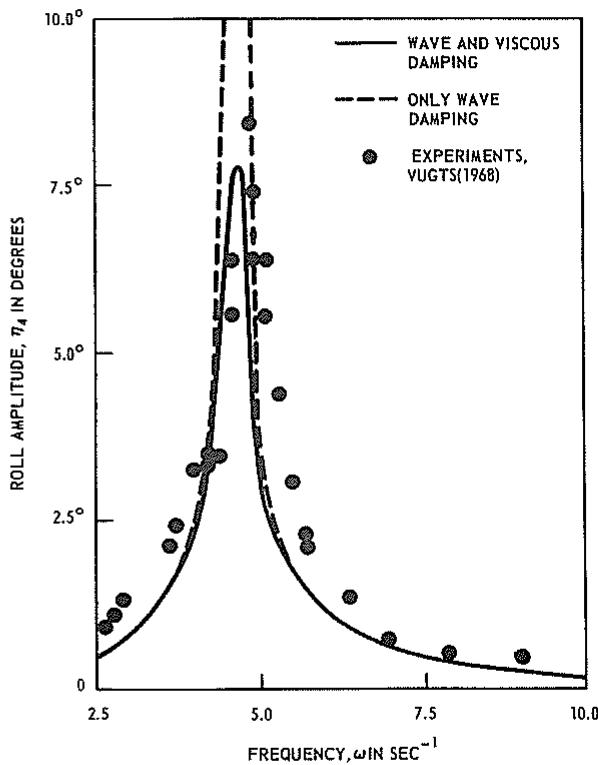

line

| FREQUENCY, ωIN SEC⁻¹ | ROLL AMPLITUDE, η₄ IN DEGREES |
| --------------------- | ----------------------------- |
| 2.5                   | ~0.5                          |
| 3.0                   | ~1.5                          |
| 3.5                   | ~2.5                          |
| 4.0                   | ~3.5                          |
| 4.5                   | ~5.0                          |
| 5.0                   | ~7.5                          |
| 5.5                   | ~6.0                          |
| 6.0                   | ~4.0                          |
| 6.5                   | ~2.0                          |
| 7.0                   | ~1.0                          |
| 7.5                   | ~0.5                          |
| 8.0                   | ~0.3                          |
| 8.5                   | ~0.2                          |
| 9.0                   | ~0.1                          |
| 9.5                   | ~0.05                         |
| 10.0                  | ~0.0                          |

Fig. 7 Theoretical and experimental roll amplitudes for rectangular cylinder in beam waves

The dynamic shear force at a cross section is the difference between the inertia force and the sum of external forces acting on the portion of the hull forward of the section in question. If the external force is separated into the static restoring force $R_{j}$ , the exciting force $E_{j}$ , and the hydrodynamic force due to the body motion $D_{j}$ , we find that

$$
V _ {j} = I _ {j} - R _ {j} - E _ {j} - D _ {j} \tag {64}
$$

if $I_{j}$ is the inertia force. Similarly, the torsional and bending moments are equal to the difference between the moment due to the inertia force and the moment due to the sum of the external forces, so that equation (64) applies to the torsional and bending moments (j = 4, 5, 6) as well as the shear forces (j = 2, 3).

The inertia force is the mass times the acceleration. If the inertia force is expressed in terms of the sectional inertia force (the sectional mass times the sectional acceleration), we find that

$$
I _ {2} = \int m (\ddot {\eta} _ {2} + \xi \ddot {\eta} _ {6} - \bar {z} \ddot {\eta} _ {4}) d \xi \tag {65}
$$

$$
I _ {3} = \int m (\ddot {\eta} _ {3} - \xi \ddot {\eta} _ {5}) d \xi \tag {66}
$$

If a similar procedure is followed for the moment-of-inertia terms, we find that

$$
I _ {4} = \int \left\{i _ {x} \ddot {\eta} _ {4} - m \ddot {z} \left(\ddot {\eta} _ {2} + \xi \ddot {\eta} _ {6}\right) \right\} d \xi \tag {67}
$$

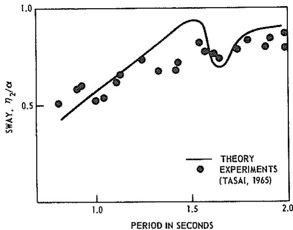

line

| PERIOD IN SECONDS | SWAY, η₂/α |
| ----------------- | ---------- |
| 0.8               | 0.5        |
| 0.9               | 0.6        |
| 1.0               | 0.7        |
| 1.1               | 0.8        |
| 1.2               | 0.9        |
| 1.3               | 0.85       |
| 1.4               | 0.95       |
| 1.5               | 0.8        |
| 1.6               | 0.7        |
| 1.7               | 0.85       |
| 1.8               | 0.9        |
| 1.9               | 0.95       |
| 2.0               | 0.98       |

Fig. 8 Sway amplitude for Series 60, $C_{B} = 0.70$ in beam waves at zero speed

$$
I _ {5} = - f m (\xi - x) \left(\ddot {\eta} _ {3} - \xi \ddot {\eta} _ {5}\right) d \xi \tag {68}
$$

$$
I _ {6} = \int m (\xi - x) (\ddot {\eta} _ {2} + \xi \ddot {\eta} _ {6} - \bar {z} \ddot {\eta} _ {4}) d \xi \tag {69}
$$

Here m is the sectional mass per unit length of the ship, $\bar{z}$ is the vertical position of center of gravity of the sectional mass, and $i_{x}$ is the sectional mass moment of inertia about the x-axis. The integration is over the length of the ship forward of the cross section being considered.

The hydrostatic restoring forces and moments are given by

$$
R _ {3} = - \rho g \int b (\eta_ {3} - \xi \eta_ {5}) d \xi \tag {70}
$$

$$
R _ {4} = g \eta_ {4} \int (\rho a \overline {{o m}} - m \bar {z}) d \xi \tag {71}
$$

$$
R _ {5} = \rho g f b (\xi - x) (\eta_ {3} - \xi \eta_ {5}) d \xi \tag {72}
$$

with $R_{2}=0$ and $R_{6}=0$ . Here b is the sectional beam, a is the submerged sectional area, and $\overline{om}$ is the distance between the water plane and the sectional metacenter.

The exciting force and moment over the portion of the ship forward of the cross section x can be obtained directly from equations (151), (152), and (153) in Appendix 1 by replacing the moment arm $\xi$ with $(\xi - x)$ . It follows from this that the exciting force and moment components are

$$
\begin{array}{l} E _ {j} = \rho \alpha \left\{\int (f _ {j} + h _ {j}) d \xi \right. \\ \left. + \left(\frac {U}{i \omega} h _ {j}\right) _ {\xi = x} \right\} e ^ {i \omega t}; j = 2, 3, 4 \tag {73} \\ \end{array}
$$

$$
E _ {5} = - \rho \alpha \int [ (\xi - x) (f _ {3} + h _ {3})
$$

$$
\left. + \frac {U}{i \omega} h _ {3} \right] d \xi e ^ {i \omega t} \quad (\overline {{{{t}}}} 4)
$$

$$
\begin{array}{l} E _ {6} = \rho \alpha \int [ (\xi - x) (f _ {2} + h _ {2}) \\ \left. + \frac {U}{i \omega} h _ {2} \right] d \xi e ^ {i \omega t} \tag {75} \\ \end{array}
$$

The sectional Froude-Kriloff "force" is given by

$$
f _ {j} = g e ^ {- i k \xi \cos \beta} \int_ {C \xi} N _ {j} e ^ {i k y \sin \beta} e ^ {k z} d l; j = 2, 3, 4 \tag {76}
$$

and the sectional diffraction "force" is given by

$$
\begin{array}{l} h _ {j} = \omega_ {0} e ^ {- i k \xi \cos \beta} \int_ {C _ {\xi}} (i N _ {3} - N _ {2} \sin \beta) e ^ {i k y \sin \beta} e ^ {k z} \psi_ {j} d l; \\ j = 2, 3, 4 \tag {77} \\ \end{array}
$$

The hydrodynamic force and moment due to the body motion on the portion of the ship forward of a given cross section have been derived in Appendix 3 and can be written in terms of the sectional added mass and damping ( $a_{jk}$ and $b_{jk}$ ) and the velocity and acceleration ( $\dot{\eta}_{j}$ and $\ddot{\eta}_{j}$ ) in component form as

$$
\begin{array}{l} D _ {2} = - \int \left\{a _ {2 2} (\ddot {\eta} _ {2} + \xi \ddot {\eta} _ {6}) + b _ {2 2} (\dot {\eta} _ {2} + \xi \dot {\eta} _ {6}) \right. \\ + a _ {2 4} \dot {\eta} _ {4} + b _ {2 4} \dot {\eta} _ {4} + \frac {U}{\omega^ {2}} b _ {2 2} \ddot {\eta} _ {6} - U a _ {2 2} \dot {\eta} _ {6} \Big \} d \xi \\ - \left[ U a _ {2 2} (\dot {\eta} _ {2} + \xi \dot {\eta} _ {6}) - \frac {U}{\omega^ {2}} b _ {2 2} (\ddot {\eta} _ {2} + \xi \ddot {\eta} _ {6}) \right. \\ \left. + \frac {U ^ {2}}{\omega^ {2}} \left(a _ {2 2} \ddot {\eta} _ {6} + b _ {2 2} \dot {\eta} _ {6}\right) + U \left(a _ {2 4} \dot {\eta} _ {4} - \frac {1}{\omega^ {2}} b _ {2 4} \ddot {\eta} _ {4}\right) \right] _ {\xi = x} \tag {78} \\ \end{array}
$$

$$
\begin{array}{l} D _ {3} = - \int \left\{a _ {3 3} (\ddot {\eta} _ {3} - \xi \ddot {\eta} _ {5}) + b _ {3 3} (\dot {\eta} _ {3} - \xi \dot {\eta} _ {5}) \right. \\ \left. - \frac {U}{\omega^ {2}} b _ {3 3} \ddot {\eta} _ {5} + U a _ {3 3} \dot {\eta} _ {5} \right\} d \xi - \left[ U a _ {3 3} (\dot {\eta} _ {3} - \xi \dot {\eta} _ {5}) \right. \\ \left. - \frac {U}{\omega^ {2}} b _ {3 3} \left(\ddot {\eta} _ {3} - \xi \ddot {\eta} _ {5}\right) - \frac {U ^ {2}}{\omega^ {2}} \left(a _ {3 3} \ddot {\eta} _ {5} + b _ {3 3} \dot {\eta} _ {5}\right) \right] _ {\xi = x} \tag {79} \\ \end{array}
$$

$$
\begin{array}{l} D _ {4} = - \int \left\{a _ {4 4} \ddot {\eta} _ {4} + (b _ {4 4} + b _ {4 4} ^ {*}) \dot {\eta} _ {4} \right. \\ + a _ {2 4} \left(\ddot {\eta} _ {2} + \xi \ddot {\eta} _ {6}\right) + b _ {2 4} \left(\dot {\eta} _ {2} + \xi \dot {\eta} _ {6}\right) + \frac {U}{\omega^ {2}} b _ {2 4} \ddot {\eta} _ {6} \\ - \left. U a _ {2 4} \dot {\eta} _ {6} \right\} d \xi - \left[ U a _ {2 1} (\dot {\eta} _ {2} + \xi \dot {\eta} _ {6}) \right. \\ - \frac {U}{\omega^ {2}} b _ {2 4} (\ddot {\eta} _ {2} + \xi \ddot {\eta} _ {6}) + \frac {U ^ {2}}{\omega^ {2}} (a _ {2 4} \ddot {\eta} _ {0} + b _ {2 4} \dot {\eta} _ {6}) \\ + U \left(a _ {4 4} \dot {\eta} _ {4} - \frac {1}{\omega^ {2}} b _ {4 4} \ddot {\eta} _ {4}\right) \bigg ] _ {\xi = x} \tag {80} \\ \end{array}
$$

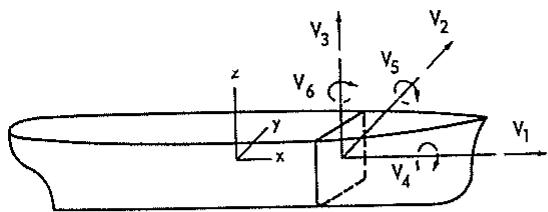

text_image

V₃
V₂
z
y
x
v₆
v₅
v₁
v₄

$$
\begin{array}{l} V _ {1} = \text { compression   force } \quad V _ {4} = \text { torsional   moment } \\ \begin{array}{c} \dot {V} _ {2} = \text { horizontal   shear } \\ \text { force } \end{array} \quad \begin{array}{c} V _ {5} = \text { vertical   bending } \\ \text { moment } \end{array} \\ V _ {3} = \text { vertical   shear } \quad V _ {0} = \text { horizontal   bending   force } \quad \text { moment } \\ \end{array}
$$

Fig. 9 Sign convention for dynamic wave-load components

$$
\begin{array}{l} D _ {5} = \int (\xi - x) \left\{a _ {3 3} \left(\ddot {\eta} _ {3} - \xi \ddot {\eta} _ {5}\right) + b _ {3 3} \left(\dot {\eta} _ {3} - \xi \dot {\eta} _ {5}\right) \right\} d \xi \\ + \int \left\{U a _ {3 3} (\dot {\eta} _ {3} - x \dot {\eta} _ {5}) - \frac {U}{\omega^ {2}} b _ {3 3} (\ddot {\eta} _ {3} - x \ddot {\eta} _ {5}) \right. \\ \left. - \frac {U ^ {2}}{\omega^ {2}} \left(a _ {3 3} \ddot {\eta} _ {5} + b _ {3 3} \dot {\eta} _ {5}\right) \right\} d \xi \tag {81} \\ \end{array}
$$

$$
\begin{array}{l} D _ {6} = - \int (\xi - x) \left\{a _ {2 2} \left(\ddot {\eta} _ {2} + \xi \ddot {\eta} _ {6}\right) + b _ {2 2} \left(\dot {\eta} _ {2} + \xi \dot {\eta} _ {6}\right) \right. \\ + a _ {2 4} \ddot {\eta} _ {4} + b _ {2 4} \dot {\eta} _ {4} \} d \xi - \int \left\{U a _ {2 2} (\dot {\eta} _ {2} + x \dot {\eta} _ {6}) \right. \\ - \frac {U}{\omega^ {2}} b _ {2 2} (\ddot {\eta} _ {2} + x \ddot {\eta} _ {6}) + \frac {U ^ {2}}{\omega^ {2}} (a _ {2 2} \ddot {\eta} _ {6} + b _ {2 2} \dot {\eta} _ {6}) \\ + U a _ {2 4} \dot {\eta} _ {4} - \frac {U}{\omega^ {2}} b _ {2 4} \ddot {\eta} _ {4} \Bigg \} d \xi \tag {82} \\ \end{array}
$$

with $D_{1}$ negligible. The coefficient $b_{44}^{*}$ in equation (80) is the viscous sectional roll-damping coefficient and is computed in the same way as the damping coefficient, $B_{44}^{*}$ , given by equation (61).

This completes the relationships for the dynamic shear force and bending and torsional moments. Comparison of the equations presented here with those of W. R. Jacobs (1958) for vertical shear forces and bending moments in head waves shows that the only difference between the two theories is in the forward-speed terms in the excitation and in the hydrodynamic force and moment due to the body motion. These differences in the forward-speed terms are quite similar to the differences between the present theory and the theory of Korvin-Kroukovsky and Jacobs (1957) for the equations of motions as was discussed in Section 2. Computations have shown that these differences in the speed terms have an appreciable effect on the computed vertical shear forces and bending moments in the higher speed range ( $F_{n} \geq 0.25$ ).

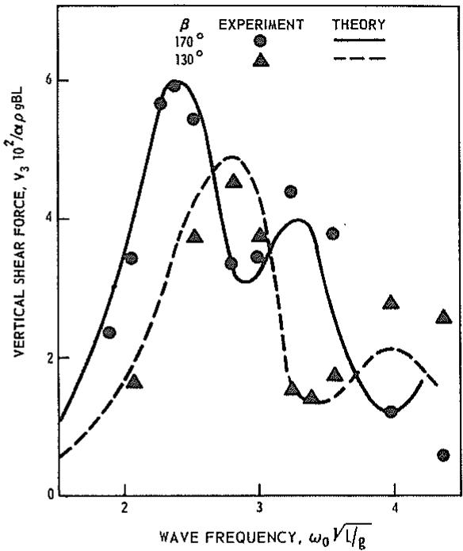

line

| WAVE FREQUENCY, ω₀ √l/g | VERTICAL SHEAR FORCE, V₃ 10²/αρgBL (EXPERIMENT) | VERTICAL SHEAR FORCE, V₃ 10²/αρgBL (THEORY) |
| ------------------------ | ----------------------------------------------- | --------------------------------------------- |
| 2.0                      | 2.5                                             | 1.5                                           |
| 2.5                      | 6.0                                             | 4.5                                           |
| 3.0                      | 3.5                                             | 3.0                                           |
| 3.5                      | 4.0                                             | 1.5                                           |
| 4.0                      | 1.0                                             | 2.0                                           |
| 4.5                      | 0.5                                             | 2.5                                           |

Fig. 10 Vertical shear-force amplitudes at midship for Series 60, $C_B = 0.80$ in head and bow waves at $F_n = 0.15$

Söding (1969) has also derived the vertical shear forces and bending moments for a ship in head waves. His shear and moment equations are identical to those presented here for the case of head waves. However, Grim and Schenzle (1969) have derived the horizontal shear forces and bending moment as well as torsional moments for a ship advancing at arbitrary heading in regular waves. Their theory lacks several of the speed terms included here and, unfortunately, since they give detailed comparisons between their theory and experiments only for the zero-forward-speed case, little is known about the accuracy of their speed terms.

# Comparison with Experiments

Vossers et al. (1961) have conducted a very systematic complete set of wave-load experiments. They measured both the vertical and horizontal wave-induced loads for several Series-60 hull forms in head, following, and oblique waves. Unfortunately the experiments were performed at only 6 different wave lengths and these are not really enough for a comparison between theory and experiments. More detailed tests were rerun by Wahab (1967) using the standard Series-60 hull form with $C_B = 0.80$ . These tests were conducted at several wave lengths and most of the test conditions were run at least twice. We believe that the experiments by Wahab are the best available for a comparative study of the wave-induced loads.

Vertical loads. A comparison between computed and experimental vertical shear-force amplitudes for the Series-60 hull form ( $C_{B} = 0.80$ ) in head and bow waves at Froude number 0.15 is shown in Fig. 10. It should be noted that head waves with $\beta = 180$ deg cannot be run conveniently at the seakeeping tank in Wageningen, so that the head-wave experiments were conducted by Wahab with $\beta = 170$ deg. The numerical head-wave computations are also for $\beta = 170$ deg. Furthermore, one should note that the maximum wave-induced vertical shear forces occur close to the forward and aft quarter lengths while, in order to reduce expenses, the model Wahab used in the experiments was equipped with gages for measuring the wave loads at the midship section only. Fig. 10 shows quite satisfactory agreement with small discrepancies in the higher frequency range.

Similar agreement is found in Fig. 11, where the vertical bending-moment amplitudes in head, quartering, and following waves are compared. (Note that $\beta$ is 10 deg for following waves.) Considering the difficulties involved in making accurate measurements for such experiments and the drastic assumptions made in deriving the theory, the agreement between experiments and theory seen in Figs. 10 and 11 is little short of amazing.

Wahab (1967) also presented a comparison between theory and his vertical-load experiments. The computed values were obtained by an extension of the theory of Korvin-Kroukovsky and Jacobs (1957) to include oblique waves. Wahab's comparisons show less satisfactory results than shown here. $^{18}$

Horizontal loads. Comparisons between theory and experiments for the wave-induced horizontal shear forces, bending moments, and torsional moments are shown in Figs. 12, 13, and 14 respectively. The comparisons are for the Series 60 hull form with block coefficient 0.80 at Froude number 0.15. The experimental points shown in these figures are by Wahab and are all measured at the midship section. Figures 12, 13, and 14 show quite satisfactory agreement between the present theory and experiments. This is extremely encouraging, especially since no other comparisons between computed and experimental wave-induced horizontal loads for a ship with forward speed exist.

It has been recognized for some time that, for vertical motions and loads, strip theories usually give quite reasonable results. However, little has been known about the use of strip theory in prediction of the horizontal motions and loads. It has been believed that sway-yaw-roll motions are quite nonlinear and that viscous effects are appreciable so that a linear strip theory would be inadequate for determining these motions or loads. Because of lack of experimental results it has not been possible here to show that the theory can predict the sway-yaw-roll motions with sufficient accuracy; nevertheless, the good agreement shown for the horizontal shear forces, bending moments, and torsional moments suggests that the theory has strong potential for determining the horizontal loads and perhaps also the horizontal motions. The wave loads are computed from the motions so the good agreement between theory and experiments for the loads is a strong indication that the computed motions may be quite accurate.

Comparison between the present theory and experiments has also been made for the horizontal wave loads of a containership model at zero speed. In the experiments conducted by Hattendorff and Alte (1968) the wave loads were measured at both the midship and twenty percent of the length aft of midship. Figure 15 shows some samples from these comparisons and the correlation between theory and experiments appears very satisfactory for this case.

Finally, in Fig. 16 the computed torsional moment is plotted as a function of longitudinal position along the hull length for a containership in bow waves. This figure shows that the maximum computed wave-induced torsional moment may not occur at midship but at a considerable distance aft of midship. It should be recalled that the maximum vertical and horizontal bending moments are very close to midship for most ship forms. This difference is emphasized here because most available experimental data for the torsional moments have been measured at the midship section and thus may incorrectly be used in design as an estimate for the maximum torsional moment.

# 4. Concluding Remarks

It appears that the computational method presented here can be a valuable design tool for predicting ship motions and sea loads. Similar computational schemes for predicting the heave and pitch motions and the vertical loads have already proven to be of great value to the U. S. Navy and to Det norske Veritas in hull and structural design of ships. The computer program based on this theory has been applied in concept-design studies of very large tankers at Det norske Veritas. For such large hulls the wave-induced loads are essential criteria in the evaluation of the structural feasibility. Furthermore, the present computational method has been shown to be very useful in estimating the torsional moment and horizontal shear forces for open hull forms such as those of containerships.

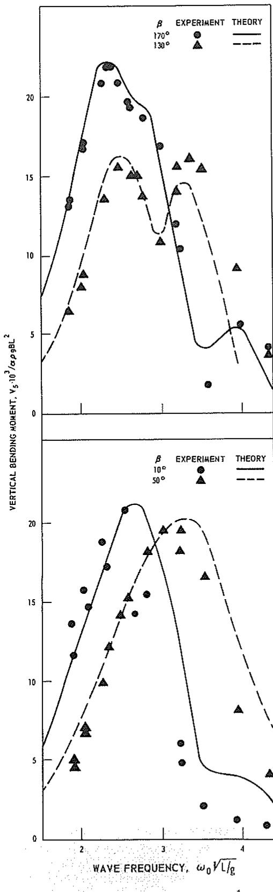

line

| Wave Frequency, ω₀√L/g | Vertical Bending Moment, V₅·10³/αρ9BL² (β=170°) | Vertical Bending Moment, V₅·10³/αρ9BL² (β=50°) |
| ---------------------- | ----------------------------------------------- | ----------------------------------------------- |
| 2.0                    | ~13.5                                           | ~6.5                                            |
| 2.5                    | ~21.5                                           | ~14.0                                           |
| 3.0                    | ~18.0                                           | ~16.0                                           |
| 3.5                    | ~12.0                                           | ~14.5                                           |
| 4.0                    | ~5.5                                            | ~4.0                                            |

Fig. 11 Vertical bending-moment amplitudes at midship for Series 60, $C_{B} = 0.80$ in head, bow, quartering, and following waves at $F_{n} = 0.15$

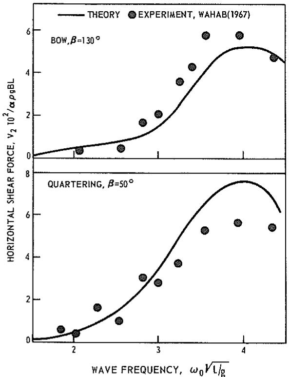

line

| WAVE FREQUENCY, ω₀√L/g | BOW, β=130° (HORIZONTAL SHEAR FORCE, V₂ 10²/αρgBL) | QUARTERING, β=50° (HORIZONTAL SHEAR FORCE, V₂ 10²/αρgBL) |
| ------------------------ | -------------------------------------------------- | ---------------------------------------------------------- |
| 2.0                      | ~0.5                                               | ~0.5                                                       |
| 2.5                      | ~1.5                                               | ~1.5                                                       |
| 3.0                      | ~2.5                                               | ~2.5                                                       |
| 3.5                      | ~4.0                                               | ~4.0                                                       |
| 4.0                      | ~5.5                                               | ~5.5                                                       |
| 4.5                      | ~5.0                                               | ~5.0                                                       |

Fig. 12 Horizontal shear-force amplitudes at midship for Series 60, $C_{B} = 0.80$ in bow and quartering waves

The usefulness of this computational method is not restricted to the design of single-hull ships. Presently NSRDC and Det norske Veritas are extending the method to the case of catamarans, trimarans, and drilling platforms. The computer program now being completed for predicting motions and sea loads for catamarans will be of invaluable help in a planned feasibility study of the use of catamarans in the U. S. Navy.

The potential of the present theory is quite evident; however, in order to utilize it more fully, further research is necessary. There is a particular need for a more extensive evaluation of the accuracy and the range of applicability of the sway-roll-yaw and the horizontal-load computations. For the horizontal responses, satisfactory agreement between theory and experiment is shown here only for the horizontal loads for one particular hull form, the Series 60, $C_B = 0.80$ at $F_n = 0.15$ . This good agreement is very encouraging, but the following research is required to confirm more precisely the accuracy of this theory:

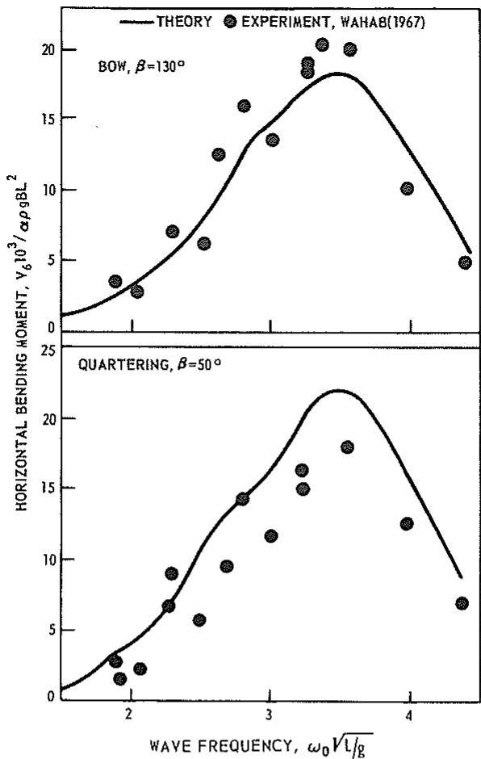

line

| Wave Frequency, ω₀√L/g | Horizontal Bending Moment, V₆¹⁰³/αρgBL² (BOW, β=130°) | Horizontal Bending Moment, V₆¹⁰³/αρgBL² (QUARTERING, β=50°) |
| ---------------------- | -------------------------------------------------------- | ---------------------------------------------------------- |
| 2.0                    | ~3.0                                                     | ~2.0                                                       |
| 2.2                    | ~4.5                                                     | ~3.5                                                       |
| 2.4                    | ~6.0                                                     | ~5.0                                                       |
| 2.6                    | ~8.0                                                     | ~7.0                                                       |
| 2.8                    | ~10.0                                                    | ~9.0                                                       |
| 3.0                    | ~13.0                                                    | ~12.0                                                      |
| 3.2                    | ~16.0                                                    | ~15.0                                                      |
| 3.4                    | ~18.0                                                    | ~17.0                                                      |
| 3.6                    | ~19.0                                                    | ~18.0                                                      |
| 3.8                    | ~18.0                                                    | ~16.0                                                      |
| 4.0                    | ~15.0                                                    | ~12.0                                                      |
| 4.2                    | ~10.0                                                    | ~7.0                                                       |
| 4.4                    | ~5.0                                                     | ~5.0                                                       |

Fig. 13 Horizontal bending-moment amplitudes at midship for Series 60, $C_B = 0.80$ in bow and quartering waves at $F_n = 0.15$

1. Investigation of the justification for assuming in the derivations that the derivatives of the steady perturbation potential, $\phi_{s}$ , can be considered small. Even though the demonstrated agreement between theory and experiments seems to indicate that the steady perturbation potential $\phi_{s}$ and its derivatives have only a small effect on the ship motions and the wave loads, this assumption does not appear consistent with the basic assumption of slender-body theory.   
2. Experimental evaluation of the various coefficients in the sway-roll-yaw equations of motion. (Such experiments have recently been conducted

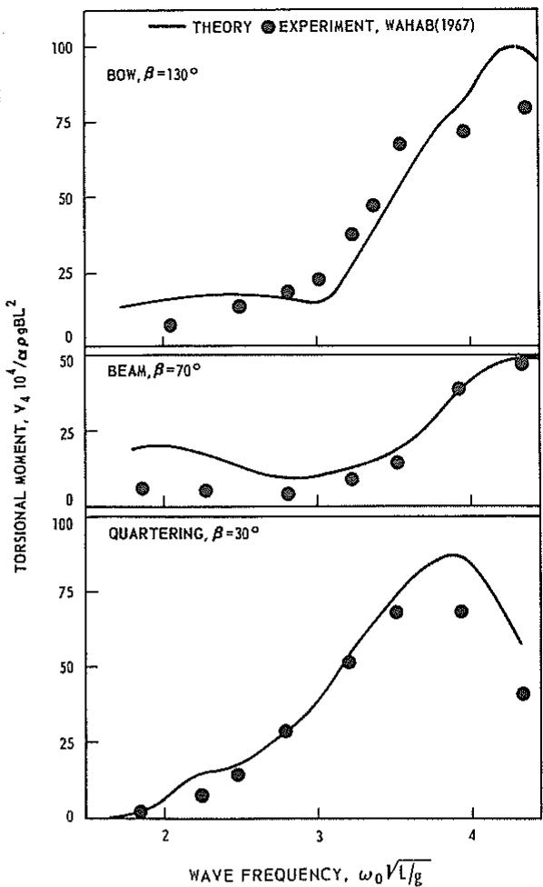

line

| Wave Frequency, ω₀√L/g | TORSIONAL MOMENT, Y₄ 10⁴/αρsBL² (BOW, β=130°) | TORSIONAL MOMENT, Y₄ 10⁴/αρsBL² (BEAM, β=70°) | TORSIONAL MOMENT, Y₄ 10⁴/αρsBL² (QUARTERING, β=30°) |
| ---------------------- | --------------------------------------------- | --------------------------------------------- | -------------------------------------------------- |
| 2.0                    | ~15                                           | ~20                                           | ~5                                                 |
| 2.5                    | ~15                                           | ~10                                           | ~15                                                |
| 3.0                    | ~20                                           | ~10                                           | ~30                                                |
| 3.5                    | ~40                                           | ~20                                           | ~50                                                |
| 4.0                    | ~80                                           | ~40                                           | ~70                                                |
| 4.5                    | ~100                                          | ~50                                           | ~40                                                |

Fig. 14 Torsional-moment amplitudes at midship for Series 60, $C_B = 0.80$ in bow, beam, and quartering waves at $\mathbf{F}_{\mathrm{n}} = 0.15$

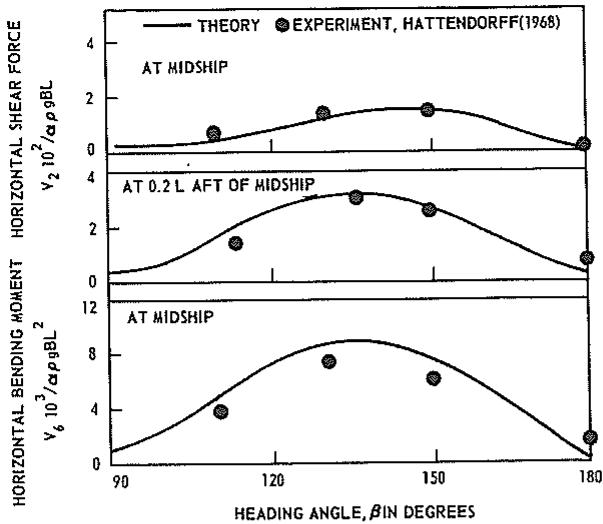

line

| HEADING ANGLE, βIN DEGREES | V₂ 10² /αρgBL (HORIZONTAL SHEAR FORCE) | V₂ 10² /αρgBL (AT MIDSHIP) | V₂ 10² /αρgBL (AT 0.2 L AFT OF MIDSHIP) | V₆ 10³ /αρgBL² (HORIZONTAL BENDING MOMENT) | V₆ 10³ /αρgBL² (AT MIDSHIP) |
| ------------------------- | -------------------------------------- | -------------------------- | ---------------------------------------- | ---------------------------------------- | --------------------------- |
| 90                        | ~0.2                                   | ~0.2                       | ~0.2                                     | ~0.2                                     | ~0.2                        |
| 120                       | ~1.5                                   | ~1.5                       | ~3.5                                     | ~4.0                                     | ~4.0                        |
| 150                       | ~1.8                                   | ~1.8                       | ~3.0                                     | ~7.5                                     | ~7.5                        |
| 180                       | ~0.2                                   | ~0.2                       | ~0.8                                     | ~2.5                                     | ~2.5                        |

Fig. 15 Horizontal shear-force and bending-moment amplitudes versus heading angle for a containership at zero speed ( $L/\lambda = 0.80$ )

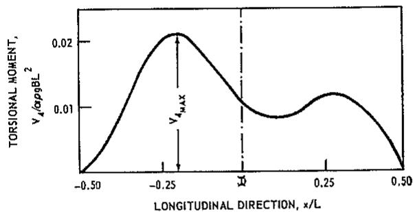

line

| LONGITUDINAL DIRECTION, x/L | TORSIONAL MOMENT, V_A/αρβBL² |
| -------------------------- | --------------------------- |
| -0.50                      | 0.000                       |
| -0.25                      | 0.020                       |
| 0.00                       | 0.010                       |
| 0.25                       | 0.015                       |
| 0.50                       | 0.000                       |

Fig. 16 Computed torsional-moment amplitude for containership in bow waves ( $\beta = 120$ deg) with $L/\lambda = 2.0$ and at $F_{n} = 0.20$

at the Technische Hogeschool of Delft, but the final results are not yet available.)

3. A carefully conducted sway-roll-yaw motion experiment with investigation of possible nonlinearities in the responses. Significant nonlinearities can be expected for high-speed hulls in quartering waves.   
4. A more general experimental evaluation of the horizontal wave loads. Preliminary experiments indicate that these responses are nonlinear for hull forms with low block coefficients.   
5. Investigation of the effects of rudder action on the wave-induced motions and loads.

However, it should be stressed that, even without this additional research, the present computational method should be of great assistance to the naval architect in determining the seaworthiness characteristics of new ship designs.

# References

E. Abrahamsen, "Recent Developments in the Practical Philosophy of Ship Structural Design," SNAME Spring Meeting, 1967.   
I. K. Borodai and Y. A. Netsvetayev, "Ship Motions in Ocean Waves" (in Russian), Sudo-storenie, Leningrad, 1969.   
O. Faltinsen, "A study of the two-dimensional added-mass and damping coefficients by the Frank close-fit method," Det norske Veritas, Oslo, Norway, Report No. 69-10-S, 1969a.   
O. Faltinsen, “A comparison of Frank close-fit method with some other methods used to find two-dimensional hydrodynamical forces and moments for bodies which are oscillating harmonically in an ideal fluid,” Det norske Veritas, Oslo, Norway, Report No. 69-43-S, 1969b.   
O. Faltinsen, "Comparison between theory and

experiments of wave-induced loads for Series 60 hull with $C_B = 0.80$ ," Det norske Veritas, Oslo, Norway, Report No. 70-27-S, 1970.   
W. Frank, "Oscillation of Cylinders In or Below the Free Surface of Deep Fluids," NSRDC, Washington, D. C., Report 2375, 1967.   
W. Frank and N. Salvesen, "The Frank Close-Fit Ship-Motion Computer Program," NSRDC, Washington, D. C., Report 3289, 1970.   
J. Gerritsma and W. Beukelman, "Analysis of the modified strip theory for the calculation of ship motions and wave bending moments," International Shipbuilding Progress, Vol. 14, No. 156, 1967.   
O. Grim and P. Schenzle, "Berechnung der Torsionsbelastung eines Schiffes un Seegang," Institut für Schiffbau der Universität Hamburg, Bericht Nr 236 amd Nr 237, 1969.   
H. G. Hattendorff and R. Alte, "Seegangs versuche mit dem Modell eines Containerschiffes in regelmässigen Wellen," Forschungszentrum des Deutschen Schiffbaus, Hamburg, Bericht Nr 3, 1968.   
W. R. Jacobs, "The Analytical Calculation of Ship Bending Moments in Regular Waves," Journal of Ship Research, Vol. 2, No. 1, 1958.   
H. Kato, "On the frictional resistance to the roll of ships" (in Japanese), Journal of Zosen Kiokai, Vol. 102, 1958.   
B. V. Korvin-Kroukovsky and W. R. Jacobs, "Pitching and Heaving Motions of a Ship in Regular Waves," TRANS. SNAME, Vol. 65, 1957.   
J. N. Newman, "The Second-Order Time-Average Vertical Force on a Submerged Slender Body Moving Beneath a Regular Wave System," (in preparation, 1970).   
T. F. Ogilvie, "Recent Progress Toward the Understanding and Prediction of Ship Motion," Proceedings of the ONR Fifth Symposium on Naval Hydrodynamics, Bergen, Norway, 1964.   
T. F. Ogilvie and E. O. Tuck, "A Rational Strip-Theory of Ship Motion: Part I," Department of Naval Architecture, The University of Michigan, Report No. 013, 1969.   
W. R. Porter, "Pressure Distributions, Added-Mass and Damping Coefficients for Cylinders Oscillating in a Free Surface," Institute of Engineering Research, University of California Report, 1960.   
M. St. Denis and W. J. Pierson, "On the Motion of Ships in Confused Seas," TRANS. SNAME, Vol. 61, 1953.   
N. Salvesen and W. E. Smith, "Comparison of Ship-Motion Theory and Experiment for Mariner Hull and Destroyer with Modified Bow," NSRDC, Washington, D. C., Report 3337, 1970.   
W. E. Smith, "Computation of Pitch and Heav-

ing Motions for Arbitrary Ship Forms," International Shipbuilding Progress, Vol. 14, No. 155, 1967.   
W. E. Smith and N. Salvesen, "Comparison of Ship-Motion Theory and Experiment for Destroyer with Large Bulb," Journal of Ship Research, Vol. 14, No. 1, 1970.   
H. Söding, "Eine Modifikation der Streifenmethode," Schiffstechnik Bd. 16, Heft 80, 1969.   
N. Tanaka, “A Study on the Bilge Keels, Part 4, On the eddy-making resistance to the rolling of a ship hull,” Japan Society of Naval Architects, Vol. 109, 1960.   
F. Tasai, "On the Damping Force and Added Mass of Ships Heaving and Pitching," Report of Research Institute for Applied Mechanics, Kyuchu University, 1960.   
F. Tasai, "Ship Motions in Beam Seas," Research Institute for Applied Mechanics, Vol. XIII, No. 45, 1965.   
F. Tasai, "On the swaying, yawing and rolling motions of ships in oblique waves," International Shipbuilding Progress, Vol. 14, No. 153, 1967.   
F. Tasai and M. Takaki, "Theory and calculation of ship responses in regular waves" (in Japanese), Symposium on Seaworthiness of Ships, Japan Society of Naval Architects, 1969.   
R. Timman and J. N. Newman, "The Coupled Damping Coefficients of Symmetric Slips," Journal of Ship Research, Vol. 5, No. 4, 1962.   
G. Vossers, W. A. Swaan, and H. Rijken, "Experiments with Series 60 Models in Waves," TRANS. SNAME, Vol. 68, 1960.   
G. Vossers, W. A. Swaan, and H. Rijken, "Vertical and Lateral Bending Moment Measurements on Series 60 Models," International Shipbuilding Progress, Vol. 8, No. 83, 1961.   
J. H. Vugts, "Cylinder Motions in Beam Waves," Netherlands Ship Research Center TNC Report No. 115S, 1968a.   
J. H. Vugts, "The Hydrodynamic Coefficient for Swaying, Heaving and Rolling Cylinders in a Free Surface," Laboratorium voor Scheeps bouwkunde, Technische Hogeschool Delft, Report No. 194, 1968b.   
R. Wahab, “Amidships Forces and Moments on a $C_{B} = 0.80$ Series 60 Model in Waves from Various Directions,” Netherlands Ship Research Center TNO Report No. 100S, 1967.

# Appendix 1

# Hydrodynamic Coefficients and Exciting Force and Moment

In this appendix the added-mass and damping coefficients in the equations of motion and the wave exciting force and moment are derived.

# Mathematical Formulation

Consider a ship advancing at constant mean forward speed with arbitrary heading in regular sinusoidal waves. It is assumed that the resulting oscillatory motions are linear and harmonic. Let $(x,y,z)$ be a right-handed orthogonal coordinate system fixed with respect to the mean position of the ship, with z vertically upward through the center of gravity of the ship, x in the direction of forward motion and the origin in the plane of the undisturbed free surface. Suppose that the ship oscillates as a rigid body in six degrees of freedom with amplitudes $\zeta_{j}$ ( $j = 1, 2 \ldots 6$ ). Here j = 1, 2, 3, 4, 5, and 6 refer to surge, sway, heave, roll, pitch, and yaw, respectively.

If viscous effects are disregarded the fluid motion can be assumed to be irrotational, so that the problem can be formulated in terms of potential-flow theory. We know that the total velocity potential $\Phi(x,y,z;t)$ must satisfy, in addition to the Laplace equation, the following “exact” $^{19}$ boundary conditions:

$$
\frac {D F}{D t} = 0 \tag {83}
$$

on the hull surface where the hull is defined by $F(x',y',z') = 0$ with $(x',y',z')$ a coordinate system fixed in the ship, and

$$
\frac {D p}{D t} = - \rho \frac {D}{D t} \left(\frac {\partial \Phi}{\partial t} + \frac {1}{2} \right| \nabla \Phi | ^ {2} + g z) = 0 \tag {84}
$$

on the unknown free surface given by $z = Z(x, y; t)$ , plus suitable radiation conditions at infinity. $^{20}$ Here g is the gravitational acceleration and $\rho$ is the mass density of the fluid.

Separating the velocity potential $\Phi(x,y,z;t)$ into two parts, one the time-independent steady contribution due to the forward motion of the ship and the other the time-dependent part associated with the incident wave system and the unsteady body motion, we get

$$
\begin{array}{l} \Phi (x, y, z; t) = [ - U x + \phi_ {S} (x, y, z) ] \\ + \phi_ {T} (x, y, z) e ^ {i \omega t} \tag {85} \\ \end{array}
$$

Here $-Ux + \phi_{s}$ is the steady contribution with U the forward speed of the ship, $\phi_{T}$ is the complex amplitude of the unsteady potential, and $\omega$ is the frequency of encounter in the moving reference frame. It is understood that real part is to be taken in expressions involving $e^{i\omega t}$ .

In order to linearize the boundary conditions (83) and (84) it will be assumed that the geometry of the hull is such that the steady perturbation potential $\phi_S$ and its derivatives are small, and further that by considering only small oscillatory motions the potential $\phi_T$ and its derivatives can also be assumed to be small. Under these assumptions the problem can be linearized by disregarding higher-order terms in both $\phi_S$ and $\phi_T$ as well as terms involving cross products between $\phi_S$ and $\phi_T$ . One should note that these assumptions do not appear consistent with the basic assumption of slender-body theory which states that the derivatives in the transverse direction are larger than the longitudinal derivatives. The assumptions applied here lead to equations of motion in a form which can be quite easily solved numerically while the use of slender-body theory results in a similar strip theory but with some additional integral terms which have not yet been evaluated [see Ogilvie and Tuck, (1969)]. Preliminary numerical investigations seem to indicate that these integral terms will have a very small effect on the computed motions. Considering that our main objective here is to derive a motion and load theory with sufficient accuracy and in a form suitable for routine numerical computations, it seems justified in this derivation to assume that the derivatives of perturbation potentials can be considered small.

Furthermore, in linearizing the problem it will be convenient to linearly decompose the amplitude of the time-dependent part of the potential

$$
\phi_ {T} = \phi_ {I} + \phi_ {D} + \sum_ {j = 1} ^ {6} \zeta_ {j} \phi_ {j} \tag {86}
$$

where $\phi_{I}$ is the incident wave potential, $\phi_{D}$ is the diffraction potential, and $\phi_{j}$ is the contribution to the velocity potential from the jth mode of motion.

Including only linear terms and applying Taylor expansions about the mean-hull position in the hull condition (83) and about the undisturbed free surface, z = 0 in the free-surface condition (84), it can be shown that the individual potentials must satisfy the following linear boundary conditions:

a. The steady perturbation potential, $\phi_{S}$ must satisfy the body condition

$\frac{\partial}{\partial n}[-Ux + \phi_{s}] = 0$ on the hull at mean position (87)

and the free-surface condition

$$
U ^ {2} \frac {\partial^ {2} \phi_ {S}}{\partial x ^ {2}} + g \frac {\partial \phi_ {S}}{z Q} = 0 \text {   on   } z = 0 \tag {88}
$$

b. The incident wave potential, $\phi_{I}$ and the diffraction potential, $\phi_{D}$ must satisfy

$$
\frac {\partial \phi_ {I}}{\partial n} + \frac {\partial \phi_ {D}}{\partial n} = 0 \text {   on   the   hull   at   mean   position } \tag {89}
$$

and

$$
\begin{array}{l} \left[ \left(i \omega - U \frac {\partial}{\partial x}\right) ^ {2} + g \frac {\partial}{\partial z} \right] (\phi_ {I}, \phi_ {D}) \\ = 0 \text {   on   } z = 0 \tag {90} \\ \end{array}
$$

c. The oscillatory potential components, $\phi_j$ ( $j = 1, 2 \ldots 6$ ), must satisfy

$$
\frac {\partial \phi_ {j}}{\partial n} = i \omega n _ {j} + U m _ {j} \text {   on   the   hull   at   mean   position } \tag {91}
$$

and

$$
\left(i \omega - U \frac {\partial}{\partial x}\right) ^ {2} \phi_ {j} + g \frac {\partial}{\partial z} \phi_ {j} = 0 \text {   on   } z = 0 \tag {92}
$$

where the generalized normal, $n_j$ , is defined by

$$
(n _ {1}, n _ {2}, n _ {3}) = \mathrm{n} \text { and } (n _ {4}, n _ {5}, n _ {6}) = \mathrm{r} \times \mathrm{n} \tag {93}
$$

with n the outward unit normal vector and r the position vector with respect to the origin of the coordinate system and where $m_{j} = 0$ for j = 1, 2, 3, 4 while

$$
m _ {5} = n _ {3} \text { and } m _ {6} = n _ {2} \tag {94}
$$

The hull condition (91) can be further simplified by dividing the oscillatory potential into two parts

$$
\phi_ {j} = \phi_ {j} ^ {0} + \frac {U}{i \omega} \phi_ {j} ^ {U} \tag {95}
$$

where $\phi^0$ will be shown to be speed independent.

This results in the two hull conditions

$$
\frac {\partial \phi_ {j} ^ {0}}{\partial n} = i \omega n _ {j} \text { and } \frac {\partial \phi_ {j} ^ {U}}{\partial n} = i \omega m _ {j} \tag {96}
$$

Now since both $\phi_j^0$ and $\phi_j^U$ must satisfy the Laplace equation, the same free-surface condition, (92) and the same infinity conditions, $^{21}$ it follows from the hull conditions (96) and the relationships (94) that $\phi_j^U = 0$ for $j = 1, 2, 3, 4$ and that

$$
\phi_ {5} ^ {U} = \phi_ {3} ^ {0} \text { while } \phi_ {6} ^ {U} = - \phi_ {2} ^ {0} \tag {97}
$$

Thus, we see that the oscillatory potential components can be expressed in terms of the speed-independent part of the potential, $\phi_{j}^{0}$ , as

$$
\phi_ {j} = \phi_ {j} ^ {0} \text { for } j = 1, 2, 3, 4 \tag {98}
$$

$$
\phi_ {5} = \phi_ {5} ^ {0} + \frac {U}{i \omega} \phi_ {3} ^ {0} \tag {99}
$$

$$
\phi_ {6} = \phi_ {6} ^ {0} - \frac {U}{i \omega} \phi_ {2} ^ {0} \tag {100}
$$

where $\phi_j^0$ ( $j = 1, 2 \ldots 6$ ) must satisfy the conditions

$$
\frac {\partial \phi_ {j} ^ {0}}{\partial n} = i \omega n _ {j} \text {   on   the   mean   hull   position } \tag {101}
$$

and

$$
\left(i \omega - U \frac {\partial}{\partial x}\right) ^ {2} \phi_ {j} ^ {0} + g \frac {\partial \phi_ {j} ^ {0}}{\partial z} = 0 \text {   on   } z = 0 \tag {102}
$$

In addition to these linear boundary conditions the potentials $\phi_{S}, \phi_{I}, \phi_{D}$ , and $\phi_{J}$ must each satisfy the Laplace equation in the fluid domain and the appropriate conditions at infinity.

This completes the formulation of the linear conditions on the potentials. The next step is to obtain the hydrodynamic forces and moments acting on the hull. By Bernoulli's equation the pressure in the fluid is

$$
p = - \rho \left(\frac {\partial \Phi}{\partial t} + \frac {1}{2} | \nabla \Phi | ^ {2} + g z\right) \tag {103}
$$

If the pressure is expanded in a Taylor series about the undisturbed position of the hull and the pressure expression is then linearized by including only terms to first order in $\phi_{s}$ and $\phi_{T}$ , it follows (ignoring the steady pressure terms) that the linearized time-dependent pressure on the hull is

$$
\begin{array}{l} p = - \rho (i \omega - U \frac {\partial}{\partial x}) \phi_ {T} e ^ {i \omega t} \\ - \rho g (\zeta_ {3} + \zeta_ {4} y - \zeta_ {5} x) e ^ {i \omega t} (1 0 4) \\ \end{array}
$$

where within the accuracy of the linearization the pressure can be conveniently evaluated at the undisturbed position of the hull. The last term in equation (104) gives the ordinary buoyancy restoring force and moment which shall be ignored in this appendix. $^{22}$ Integration of the pressure (104) (ignoring the buoyancy term) over the hull surface yields the hydrodynamic force and moment amplitudes:

$$
H _ {j} = - \rho \iint_ {S} n _ {j} \left(i \omega - U \frac {\partial}{\partial x}\right) \phi_ {T} d s,
$$

$$
j = 1, 2 \dots 6 \tag {105}
$$

Here the integration is over the mean position of the hull surface $S$ , and $H_{1}, H_{2}, H_{3}$ are the force components in the $x, y, z$ directions while $H_{4}, H_{5}, H_{6}$ are the moments about the $x, y, z$ axes. By applying equation (86) the force and moment can be divided into two parts as

$$
H _ {j} = F _ {j} + G _ {j} \tag {106}
$$

where $F_{j}$ is the exciting force and moment:

$$
F _ {j} = - \rho \iint_ {S} n _ {j} \left(i \omega - U \frac {\partial}{\partial x}\right) \left(\phi_ {I} + \phi_ {D}\right) d s \tag {107}
$$

and $G_{j}$ is the force and moment due to the six degrees of body motion:

$$
G _ {j} = - \rho \iint_ {S} n _ {j} \left(i \omega - U \frac {\partial}{\partial x}\right) \sum_ {k = 1} ^ {6} \zeta_ {k} \phi_ {k} d s
$$

$$
= \sum_ {k = 1} ^ {6} T _ {j k} \zeta_ {k} \tag {108}
$$

Here $T_{jk}$ denotes the hydrodynamic force and moment in the $j$ th direction per unit oscillatory displacement in the $k$ th mode:

$$
T _ {j k} = - \rho \iint_ {S} n _ {j} \left(i \omega - U \frac {\partial}{\partial x}\right) \phi_ {k} d s \tag {109}
$$

After separating $T_{jk}$ into real and imaginary parts as

$$
T _ {j k} = \omega^ {2} A _ {j k} - i \omega B _ {j k} \tag {110}
$$

the equation of motion can be written in the form

$$
\begin{array}{l} \sum_ {k = 1} ^ {6} \left[ - \omega^ {2} (M _ {j k} + A _ {j k}) + i \omega B _ {j k} \right. \\ + C _ {j k} ] \zeta_ {k} = F _ {j} \tag {111} \\ \end{array}
$$

where $M_{jk}$ is the generalized mass matrix for the ship, $A_{jk}$ and $B_{jk}$ are the added-mass and damping coefficients, and $C_{jk}$ are the hydrostatic restoring coefficients resulting from the buoyancy term in the pressure equation (104).

The problem left is to determine the added-mass and damping coefficients [given by the real and imaginary part of (109)] and the exciting force and moment (107). The coefficients will be derived first and then the exciting force and moment will be obtained.

# Hydrodynamic Coefficients

The hydrodynamic coefficients in the equations of motion were expressed in equation (109) in terms of the oscillatory potential $\phi_k$ ( $k = 1,2\ldots 6$ ) integrated over the hull surface. The relationship for the coefficients will now be reduced to integrals over the length of the ship of the sectional two-dimensional added mass and damping.

First we shall need a variant of Stokes' theorem. A well-known form of Stokes' theorem (Milne-Thomson, § 2.50) is

$$
\iint_ {S} (\mathbf {n} \times \nabla) \times \mathbf {q} d s = \int_ {C} \mathrm{d} \mathbf {l} \times \mathbf {q} \tag {112}
$$

where $S$ is a surface situated in the fluid with the closed curve $C$ as boundary. Here $\mathbf{q}$ is any vector function and $\mathrm{dl}$ is the direction element of arc $C$ . Applying (112) to the portion of the hull surface $S$ forward of cross sections $C_x$ , the closed curve $C$ will consist of $C_x$ plus the waterline forward of the sections. Now by letting $\mathbf{q} = \phi U\mathbf{i}$ (for the case $j = 1,2,3$ ) and $\mathbf{q} = \phi U\mathbf{i} \times \mathbf{r}$ (for the case $j = 4,5,6$ ) and applying certain vector relationships given on page 70 of Ogilvie and Tuck (1969), the following variant of Stokes' theorem can be derived:

$$
\iint_ {S} n _ {j} U \frac {\partial}{\partial x} \phi d s = U \iint_ {S} m _ {j} \phi d s - U \int_ {C _ {s}} n _ {j} \phi d l \tag {113}
$$

where $\phi$ is a differentiable scalar function. Here the line integral along the waterline has been ignored by assuming that the angle between the waterline and the x-axis is small.

Applying (113) in the relationship for the added-mass and damping coefficients (109), we have

$$
\begin{array}{l} T _ {j k} = - \rho i \omega \iint_ {S} n _ {j} \phi_ {k} d s \\ + U \rho \iint_ {S} m _ {j} \phi_ {k} d s - U \rho \int_ {C _ {A}} n _ {j} \phi_ {k} d l \tag {114} \\ \end{array}
$$

where $C_A$ refers to the aftermost cross section of the ship. Now in view of equation (95) we may define the speed-independent part of $T_{jk}$ as

$$
T _ {j k} ^ {0} = - \rho i \omega \iint_ {S} n _ {j} \phi_ {k} ^ {0} d s \tag {115}
$$

and the speed-independent part of the line integral at any cross section $C_x$ as

$$
t _ {j k} = - \rho i \omega \int_ {C z} n _ {j} \phi_ {k} ^ {0} d s \tag {116}
$$

The added-mass and damping coefficients (114) can now be expressed in terms of the speed-independent terms (115) and (116) by applying the expressions for the potential (98), (99), and (100). It follows that for $j, k = 1, 2, 3, 4$

$$
T _ {j k} = T _ {j k} ^ {0} + \frac {U}{i \omega} t _ {j k} ^ {- 1} \tag {117}
$$

where $t_{jk}^{-1}$ refers to the line integral (116) evaluated at the aftermost section.

For $j = 5, 6$ and $k = 1, 2, 3, 4$ .

$$
T _ {5 k} = T _ {5 k} ^ {0} - \frac {U}{i \omega} T _ {3 k} ^ {0} + \frac {U}{i \omega} t _ {5 k} ^ {A} \tag {118}
$$

$$
T _ {6 k} = T _ {6 k} ^ {0} + \frac {U}{i \omega} T _ {2 k} ^ {0} + \frac {U}{i \omega} t _ {6 k} ^ {A} \tag {119}
$$

For $j = 1, 2, 3, 4$ and $k = 5, 6$

$$
T _ {j 3} = T _ {j 3 ^ {0}} + \frac {U}{i \omega} T _ {j 3 ^ {0}} + \frac {U}{i \omega} t _ {j 3 ^ {A}} - \frac {U ^ {2}}{\omega^ {2}} t _ {j 3 ^ {A}}. \tag {120}
$$

$$
T _ {j 6} = T _ {j 6} ^ {0} - \frac {U}{i \omega} T _ {j 2} ^ {0} + \frac {U}{i \omega} t _ {j 6} ^ {A} + \frac {U ^ {2}}{\omega^ {2}} t _ {j 2} ^ {A} \tag {121}
$$

For $j = k = 5,6$

$$
T _ {5 5} = T _ {5 5} ^ {0} + \frac {U ^ {2}}{\omega^ {2}} T _ {3 3} ^ {0} + \frac {U}{i \omega} t _ {5 5} ^ {\lambda} - \frac {U ^ {2}}{\omega^ {2}} t _ {5 3} ^ {\lambda} \tag {122}
$$

$$
T _ {6 6} = T _ {6 6} ^ {0} + \frac {U ^ {2}}{\omega^ {2}} T _ {2 2} ^ {0} + \frac {U}{i \omega} t _ {6 6} ^ {A} + \frac {U ^ {2}}{\omega^ {2}} t _ {6 2} ^ {A} \tag {123}
$$

In obtaining equations (122) and (123) the following symmetry relationship for the zero-speed coefficients

$$
T _ {j k} ^ {0} = T _ {k j} ^ {0} \tag {124}
$$

has been applied. $^{23}$ The proof of this symmetry relationship is easily shown by introducing the hull condition (101) in the equation for the zero-speed coefficients (115) and then applying Green's theorem [see equation (143)].

It should be emphasized that in the derivation of ship-motion strip theories it has been customary to apply the “strip-theory” assumptions in the initial formulation of the problem, while in the present derivation no “strip-theory” assumptions have been made to this point apart from the a priori assumption that the geometry of the hull is such that there is no coupling between the steady perturbation field and the unsteady field. That is, the coefficients in the equations of motion including the forward-speed terms are in principle valid for quite bluff bodies, e.g., spheres. In fact, the results to this point are exact within linear potential theory for bluff bodies at zero forward speed. $^{24}$ In particular it is important to note that the end terms, $t_{jk}^1$ , in the coefficients (117) through (123) are not a result of applying "strip-theory" approximations but rather stem from the line integral in the Stokes theorem (112).

The speed-dependent coefficients have been expressed in equations (117) through (123) in terms of the speed-independent surface integral (115) and line integral (116). The next step is to simplify further the zero-speed terms to a form suitable for a numerical evaluation. This can best be obtained by applying the following “strip-theory” approximations. If we consider that the beam and the draft of the ship are much smaller than her length (i.e., the hull is long and slender), then it is consistent with the previous assumptions to set $ds = d\xi dl$ in the surface integral (115), so that

$$
T _ {j k} ^ {0} = - \rho i \omega \int_ {L} \int_ {C _ {z}} n _ {j} \phi_ {k} ^ {0} d l d \xi = \int_ {L} t _ {j k} d \xi \tag {125}
$$

where L means that the integration is over the length of the ship and $\xi$ is the variable of integration in the x-direction. Here $\phi_{k}^{0}$ is the oscillatory potential satisfying, in addition to the three-dimensional Laplace equation, the hull condition (101), the free-surface condition (102), and the appropriate infinity conditions. Since the hull is assumed to be long and slender it follows that in the neighborhood of the hull $\partial/\partial x \ll \partial/\partial y$ or $\partial/\partial z$ . It also follows that the component of the hull normal in the x-direction is much smaller than the normal components in the y- and z-directions.

$$
n _ {1} \ll n _ {2} \text { or } n _ {3} \tag {126}
$$

so that we may replace three of the components of the three-dimensional generalized normal, $n_{j}(j = 2, 3, 4)$ , with the two-dimensional generalized normal in the y-z plane, $N_{j} (j = 2, 3, 4)$ , and set

$$
n _ {5} = - x N _ {3} \text {   and   } n _ {6} = x N _ {2} \tag {127}
$$

In order to reduce the free-surface condition (102), it will be necessary to assume that the frequency of encounter is high, $\omega \gg U (\partial/\partial x)$ , which requires that the wave length is approximately of the same order as the ship beam. This is a very critical assumption and it makes the theoretical justification for the strip theory somewhat questionable in the low-frequency range. $^{25}$

Under these assumptions the three-dimensional Laplace equation and the boundary conditions to be satisfied by $\phi_{k}^{0}$ for k = 2, 3, ± reduce to the two-dimensional Laplace equation and the conditions for the two-dimensional problem of a cylinder with cross section $C_{x}$ oscillating in the free surface, so that we may set at a given cross section

$$
\phi_ {k} ^ {0} = \psi_ {k} \text { for } k = 2, 3, 4 \tag {128}
$$

where $\psi_{k}$ is the potential for the sectional two-dimensional problem. It also follows from the hull condition (101) and equation (127) that at a given section

$$
\phi_ {5} ^ {0} = - x \psi_ {3} \text { and } \phi_ {6} ^ {0} = x \psi_ {2} \tag {129}
$$

while $\phi_1^0 \ll \phi_k^0$ ( $k = 2, 3 \ldots 6$ ).

Hence, we see that for $j = 2, 3, 4$

$$
t _ {j j} = - \rho i \omega \int_ {C _ {x}} N _ {j} \psi_ {j} d l = \omega^ {2} a _ {j j} - i \omega b _ {j j} \tag {130}
$$

where $a_{jj}$ and $b_{jj}$ are the sectional two-dimensional added-mass and damping coefficients for sway, heave, and roll (j = 2, 3, and 4). Similarly, the sectional sway-roll cross-coupling coefficient is

$$
t _ {2 4} = - \rho i \omega \int_ {C _ {x}} N _ {2} \psi_ {4} d l = \omega^ {2} u _ {2 4} - i \omega b _ {2 4} \tag {131}
$$

It follows now that the zero-speed added-mass and damping coefficients, $T_{jk}^{0} = \omega^{2} A_{jk}^{0} - i \omega B_{jk}^{0}$ , can be expressed in terms of the sectional two-dimensional added-mass and damping coefficients, $t_{22}$ , $t_{33}$ , $t_{44}$ , and $t_{24}$ . If we consider only ships with lateral symmetry we find that the only nonzero coefficients are

$$
T _ {2 2} ^ {0} = \int t _ {2 2} d \xi
$$

$$
T _ {2 6} ^ {0} = T _ {6 2} ^ {0} = f \xi l _ {2 2} d \xi
$$

$$
T _ {6 6} ^ {0} = \int \xi^ {2} t _ {2 2} d \xi
$$

$$
T _ {3 3} ^ {0} = \int t _ {3 3} d \xi
$$

$$
T _ {3 5} ^ {0} = T _ {5 3} ^ {0} = - f \xi t _ {3 3} d \xi \tag {132}
$$

$$
T _ {5 5} ^ {0} = \int \xi^ {2} t _ {3 3} d \xi
$$

$$
T _ {4 4} ^ {0} = f t _ {4 4} d \xi
$$

$$
T _ {2 4} ^ {0} = T _ {4 2} ^ {0} = \int t _ {2 4} d \xi
$$

$$
T _ {4 6} ^ {0} = T _ {6 4} ^ {0} = \int \xi t _ {2 4} d \xi
$$

where the integrations are over the length of the ship. The numerical techniques available for computing the sectional added mass and damping $(t_{22}, t_{33}, t_{44}$ and $t_{24})$ are discussed in Appendix 2.

Finally, introducing equations (130), (131), and (132) into the expressions for $T_{jk}$ , (117) through (123), and recalling that $T_{jk} = \omega^{2}A_{jk} - i\omega B_{jk}$ enables the added-mass and damping coefficients, $A_{jk}$ and $B_{jk}$ , to be expressed in terms of the sectional added mass and damping, $a_{jk}$ and $b_{jk}$ , integrated over the length of the ship. These final relationships for the added-mass and damping coefficients are stated in the main text, equations (7) through (14) and equations (39) through (54).

# Exciting Force and Moment

The exciting force and moment as expressed in equation (107) are

$$
F _ {j} = - \rho \iint_ {S} n _ {j} \left(i \omega - U \frac {\partial}{\partial x}\right) \left(\phi_ {I} + \phi_ {D}\right) d s,
$$

$$
j = 1, 2 \dots 6 \tag {133}
$$

It will be most convenient here to separate the exciting force into two parts: the incident wave part, $F_{j}^{I}$ , and the diffraction part, $F_{j}^{D}$ , so that

$$
F _ {j} = F _ {j} ^ {I} + F _ {j} ^ {D} \tag {134}
$$

with

$$
F _ {j} ^ {I} = - \rho \iint_ {S} n _ {j} \left(i \omega - U \frac {\partial}{\partial x}\right) \phi_ {I} d s \tag {135}
$$

and

$$
F _ {j} ^ {D} = - \rho \iint_ {S} n _ {j} \left(i \omega - U \frac {\partial}{\partial x}\right) \phi_ {D} d s \tag {136}
$$

In accordance with classical linear gravity-wave theory, the potential for the incident wave satisfying the free-surface condition (90) is

$$
\phi_ {I} = \frac {i g \alpha}{\omega_ {0}} e ^ {- i k (x \cos \beta - y \sin \beta)} e ^ {k z} \tag {137}
$$

where $\alpha$ is the wave amplitude, k is the wave number, $\beta$ is the heading angle ( $\beta = 0$ for following waves), and $\omega_{0} = \sqrt{g k}$ is the wave frequency which is related to the frequency of encounter $\omega$ by

$$
\omega_ {0} = \omega + k U \cos \beta \tag {138}
$$

Introducing the wave potential (137) in the expression for the incident wave part of the exciting force and moment (135) gives

$$
F _ {j} ^ {I} = - \rho i \iint_ {S} n _ {j} (\omega + U k \cos \beta) \phi_ {I} d s \tag {139}
$$

Equation (138) reduces this to

$$
F _ {j} ^ {I} = - \rho i \omega_ {0} \iint_ {S} n _ {j} \phi_ {l} d s \tag {140}
$$

which is the well-known Froude-Kriloff force and moment, and can be computed easily. Now, returning to the diffraction part of the exciting force and moment (136), application of the Stokes theorem (113) gives

$$
\begin{array}{l} F _ {j} ^ {D} = - \rho \iint_ {S} (i \omega n _ {j} - U m _ {j}) \phi_ {D} d s \\ - \rho U \int_ {C _ {A}} n _ {j} \phi_ {D} d l \tag {141} \\ \end{array}
$$

The hull condition (96) states that

$$
i \omega n _ {j} = \frac {\partial \phi_ {j} ^ {0}}{\partial n} \text { and } i \omega m _ {j} = \frac {\partial \phi_ {j} ^ {U}}{\partial n}
$$

After introducing these conditions in (141) we find that

$$
\begin{array}{l} F _ {j} ^ {D} = - \rho \iint_ {S} \frac {\partial}{\partial n} \left(\phi_ {j} ^ {0} - \frac {U}{i \omega} \phi_ {j} ^ {U}\right) \phi_ {D} d s \\ - \frac {\rho U}{i \omega} \int \frac {\partial \phi_ {j} ^ {0}}{\partial n} \phi_ {D} d l \tag {142} \\ \end{array}
$$

For any two functions $\phi$ and $\psi$ satisfying the same Laplace equation, the free-surface condition (92), the radiation condition at infinity, and the "bottom" condition, we find by using Green's second identity, that

$$
\iint_ {S} \phi \frac {\partial \psi}{\partial n} d s = \iint_ {S} \psi \frac {\partial \phi}{\partial n} d s \tag {143}
$$

Since this relationship is also valid for the two-dimensional case, it can be applied to both the surface integral and the line integral in (142) so that

$$
\begin{array}{l} F _ {j} ^ {D} = - \rho \iint_ {S} \left(\phi_ {j} ^ {0} - \frac {U}{i \omega} \phi_ {j} ^ {U}\right) \frac {\partial \phi_ {D}}{\partial n} d s \\ - \frac {\rho U}{i \omega} \int_ {C A} \phi J ^ {0} \frac {\partial \phi_ {D}}{\partial n} d l \tag {144} \\ \end{array}
$$

Then use of the hull boundary condition (89), i.e.,

$$
\frac {\partial \phi_ {D}}{\partial n} = - \frac {\partial \phi_ {I}}{\partial n}
$$

shows that the diffraction part of the exciting force and moment becomes

$$
\begin{array}{l} F _ {j} ^ {D} = \rho \iint_ {S} \left(\phi_ {j} ^ {0} - \frac {U}{i \omega} \phi_ {j} ^ {U}\right) \frac {\partial \phi_ {I}}{\partial n} d s \\ + \frac {\rho U}{i \omega} \int_ {C A} \phi_ {j} ^ {0} \frac {\partial \phi_ {I}}{\partial n} d l \tag {145} \\ \end{array}
$$

Now by equation (97), $\phi_5^U = \phi_3^0$ and $\phi_6^U = -\phi_2^0$ while $\phi_j^U = 0$ for $j = 1, 2, 3, 4$ . Using these relationships in equation (145) and combining equations (140) and (145), we find that the total exciting force and moment are

$$
\begin{array}{l} F _ {j} = - \rho \iint_ {S} \left\{i \omega_ {0} n _ {j} \phi_ {I} - \frac {\partial \phi_ {I}}{\partial n} \phi_ {j} ^ {0} \right\} d s \\ \mp \left[ \frac {\rho U}{i \omega} \iint_ {S} \frac {\partial \phi_ {I}}{\partial n} \phi_ {3, 2} ^ {0} d s \right] _ {j = 5, 6} + \frac {\rho U}{i \omega} \int_ {C A} \frac {\partial \phi_ {I}}{\partial n} \phi_ {j} ^ {0} d l \tag {146} \\ \end{array}
$$

where the minus sign goes with $j = 5$ and the plus sign with $j = 6$ , and where $\phi_I$ is given by equation (137) and

$$
\frac {\partial \phi_ {I}}{\partial n} = (i n _ {2} \sin \beta + n _ {3}) k \phi_ {I} \tag {147}
$$

After introducing (137) and (147) in equation (146) and setting $ds = dld\xi$ we find that

$$
\begin{array}{l} F _ {j} = \rho \alpha \int_ {L} e ^ {- i k \xi \cos \beta} \int_ {C _ {\xi}} e ^ {i k y \sin \beta} e ^ {k z} \Bigl \{g n _ {j} \\ + \omega_ {0} (i n _ {3} - n _ {2} \sin \beta) \phi_ {j} ^ {0} \mp \omega_ {0} \frac {U}{i \omega} [ (i n _ {3} - n _ {2} \sin \beta) \\ \left. \times \phi_ {3, 2} ^ {0} ] _ {j = 5, 6} \right\} d l d \xi + \frac {U}{i \omega} \omega_ {0} e ^ {- i k x \cos \beta} \int_ {C A} e ^ {i k y \sin \beta} e ^ {k z} \\ \times (i n _ {3} - n _ {2} \sin \beta) \phi_ {j} ^ {0} d l \tag {148} \\ \end{array}
$$

Use of the relationships resulting from the “strip theory” assumption (127, 128, 129) and defining the sectional Froude-Kriloff “force” by

$$
\begin{array}{l} f _ {j} (x) = g e ^ {- i k x \cos \beta} \int_ {C _ {x}} N _ {j} e ^ {i k y \sin \beta} e ^ {k z} d l; \\ j = 2, 3, 4 \tag {149} \\ \end{array}
$$

and the sectional diffraction "force" by

$$
\begin{array}{l} h _ {j} (x) = \omega_ {0} e ^ {- i k x \cos \beta} \int_ {C _ {r}} \left(i N _ {3} - N _ {2} \sin \beta\right) \\ \times e ^ {i k y \sin \beta} e ^ {k z} \psi_ {j} d l; j = 2, 3, 4 \tag {150} \\ \end{array}
$$

enables the exciting force and moment to be written in the final desired form

$$
\begin{array}{l} F _ {j} = \rho \alpha \int_ {L} (f _ {j} + h _ {j}) d \xi + \rho \alpha \frac {U}{i \omega} h _ {j} ^ {\mathrm{A}}; \\ j = 2, 3, 4 \tag {151} \\ \end{array}
$$

$$
\begin{array}{l} F _ {3} = - \rho \alpha \int_ {L} \left[ \xi \left(f _ {3} + h _ {3}\right) + \frac {U}{i \omega} h _ {3} \right] d \xi \\ - \rho \alpha \frac {U}{i \omega} x _ {A} h _ {3} ^ {A} \tag {152} \\ \end{array}
$$

$$
\begin{array}{l} F _ {6} = \rho \alpha \int_ {L} \left[ \xi (f _ {2} + h _ {2}) + \frac {U}{i \omega} h _ {2} \right] d \xi \\ + \rho \alpha^ {e} \frac {U}{i \omega} x _ {A} h _ {2} ^ {A} \tag {153} \\ \end{array}
$$

while $F_{1} \ll F_{k} (k = 2, 3 \ldots 6)$ . Here $h_{j}^{A}$ refers to $h_j(x)$ evaluated at the aftermost section. With the potential $\psi_j$ ( $j = 2, 3, 4$ ) for the two-dimensional problem known, the exciting force and moment (151, 152, 153) can now be obtained by straightforward integration. Known numerical solutions for the two-dimensional problem are discussed in Appendix 2.

# Appendix 2

# Two-Dimensional Sectional Added Mass, Damping, and Excitation

The first step in computing the ship motions and the sea loads is to determine the two-dimensional added mass, damping, and excitation for each of the ship sections. This is the most complicated and time-consuming part of the computation. Since accurate estimates for these sectional quantities are absolutely necessary in order to obtain useful final results, a discussion is presented in this appendix of available methods for solving the two-dimensional problem together with a comparison between theory and experiments.

More specifically, the hydrodynamic coefficients in the equations of motion, $A_{jk}$ and $B_{jk}$ , are all expressed in terms of two-dimensional sectional added-mass and damping coefficients for sway $(a_{22}, b_{22})$ , heave $(a_{33}, b_{33})$ , roll $(a_{44}, b_{44})$ , and coupled sway-roll $(a_{24}, b_{24})$ . Similarly, the exciting forces and moments, $F_j$ , are expressed in terms of the two-dimensional excitation: the sectional Froude-Kriloff and diffraction "forces," $f_j$ and $h_j$ .

There are three methods commonly in use for computing these two-dimensional sectional hydrodynamic quantities:

i. The Lewis-form method   
ii. The Tasai-Porter close-fit mapping method   
iii. The Frank close-fit source-distribution method.

In all three methods the viscous effects are ignored and linear water-wave theory is applied. The problem then consists of determining the velocity potential for a cylinder oscillating in the otherwise undisturbed free surface in the three modes: sway, heave, and roll. Having determined the velocity potential, the added mass, damping, and excitation can be obtained by integrating the pressures given by the Bernoulli equation. The essential difference between these three methods is in the way the cylinder-wall condition is satisfied. $^{27}$

In the first method, the geometrical shape of the section is mathematically represented by the Lewis form $^{28}$ which has the same beam, draft, and area as the given section, but not necessarily the actual shape of the given section. This method is fast and quite accurate for many common ship-section forms; however, it cannot be applied, for example, to sections with large bulbs or to sections with very small sectional area. For more details, see Frank and Salvesen (1970). In the Tasai-Porter close-fit mapping method the ship sections are conformally mapped into a circle by applying a mapping function with as many coefficients as necessary in order to get the desired close-fit accuracy [Tasai (1960) and Porter (1960)]. Originally, there were some difficulties in determining the mapping coefficients and it was in 1967 that the method was first applied successfully to compute the motions for arbitrary hull forms [W. E. Smith, (1967)]. In the last method, the Frank close-fit source-distribution method [Frank, (1967)], the shape of the section is represented by a given number of offset points (about eight to twelve points) with straight-line segments between the points. The velocity potential is obtained by distributing pulsating source singularities with constant strength over each of the straight segments. $^{29}$ This method, in its original form, broke down in the very-high-frequency range at certain “irregular” frequencies. However, Faltinsen (1969a) has shown that this difficulty can be avoided by applying a numerical fairing technique.

Generally speaking, it can be stated that both close-fit methods apply with very satisfactory accuracy to practically any section shape and seem to be equally suited for ship-motion computations. One should note, on the other hand, that both close-fit methods require much more computer time than the Lewis-form method.

Turning now to the comparison between theory and experiments, Fig. 17 shows the sectional added mass and damping for sway, heave, roll, and coupled sway-roll, while Fig. 18 shows the sectional sway-exciting force and roll-exciting moment for beam seas. The theoretical values have been computed by the Frank close-fit method $^{30}$ and the experiments have been conducted at the Technische Hogeschool in Delft by J. H. Vugts (1968b). All of the comparisons shown are for a cylinder with a rectangular cross section with rounded bilges and beam-draft ratio equal to two; in other words, the section shape is quite similar to the midship section for a high-block-coefficient ship.

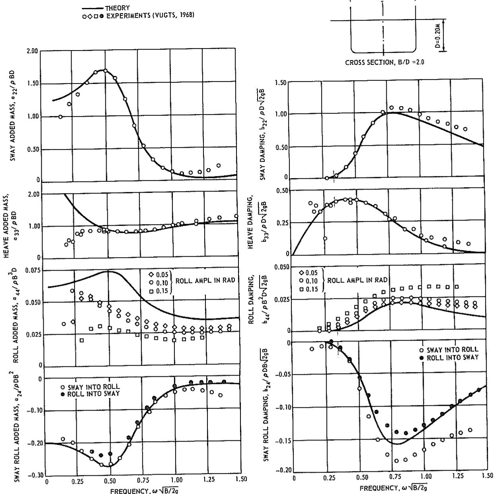

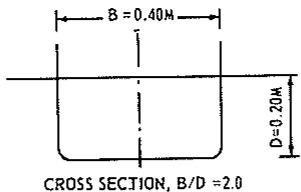

text_image

B = 0.40M
D = 0.20M
CROSS SECTION, B/D = 2.0

Fig. 17 Two-dimensional added-mass and damping coefficients for sway, heave, roll, and sway-roll

It is seen in Fig. 17 that the agreement between theory and experiment in general is very satisfactory. Noticeable discrepancy is found only in a couple of places. For the heave added mass and damping, a large discrepancy between theory and experiment is seen in the very-low-frequency range. This is most likely due to experimental errors, as pointed out by Vugts (1968b). However, the vertical motions in the very-low-frequency range (the long-wave range) are dominated by the hydrostatic forces so that any error in the added mass or damping in this frequency range has practically no effect on the computed motions or sea loads. Large discrepancies between theory and experiment are also seen for the roll added mass and damping in the entire frequency range. Vugts states that, owing to the experimental errors, he feels that “the measured roll added mass is too small,” and it is felt that this may be a major reason for this discrepancy. As far as the roll damping is concerned, the difference between theory and experiment is believed to be caused by viscous effects. For the case of roll added mass and damping one also notes some nonlinearity with respect to roll amplitude. For the sway and heave cases, such nonlinearity was not present.

It is interesting to note in Fig. 17 that the experimental values for added mass and damping for coupled sway-roll clearly show a difference between the case of “sway into roll” and the case of “roll into sway,” while our linear potential theory predicts that the hydrodynamic coefficients should be the same for these two cases; namely $a_{24} = a_{42}$ and $b_{24} = b_{42}$ . However, in spite of this difference, the theory seems to predict the coupled coefficients with sufficient accuracy.

In Fig. 18 a comparison between theory and experiment is shown for the sectional sway-exciting force and roll-exciting moment for beam seas. It is seen that the agreement is extremely good.

It should be pointed out that Vugts (1968b) also has conducted experiments for several other section shapes and comparison with theory shows agreement similar to what is found for the cases presented here. It seems reasonable to conclude, therefore, that, except for the roll damping coefficient which is noticeably influenced by viscous effects, the linear potential-flow theory with accurate section representation can be used in determining the two-dimensional hydrodynamic coefficients which are needed in computing the ship motions and sea loads.

# Appendix 3

# Shear Force and Bending Moment

In this appendix the part of the sectional shear force and bending and torsional moments associated with the hydrodynamic force and moment due to the body motion is derived.

If we consider only the portion of the hull surface, $S^{*}$ , forward of a given cross section, $C_{x}$ , equation (108) shows that the hydrodynamic force and moment due to the six degrees of body motion are

Fig. 18 Two-dimensional sway-exciting force and roll-exciting moment

$$
G _ {j} ^ {*} = - \rho \iint_ {S ^ {*}} n _ {j} ^ {*} (i \omega - U \frac {\partial}{\partial x}) \sum_ {j = 1} ^ {6} \zeta_ {j} \phi_ {j} d s \tag {154}
$$

Here the asterisk refers to the portion of the hull forward of $C_{x}$ and the generalized normal and the moment are with respect to the section, $C_{x}$ .

Application of the Stokes theorem (113) shows that

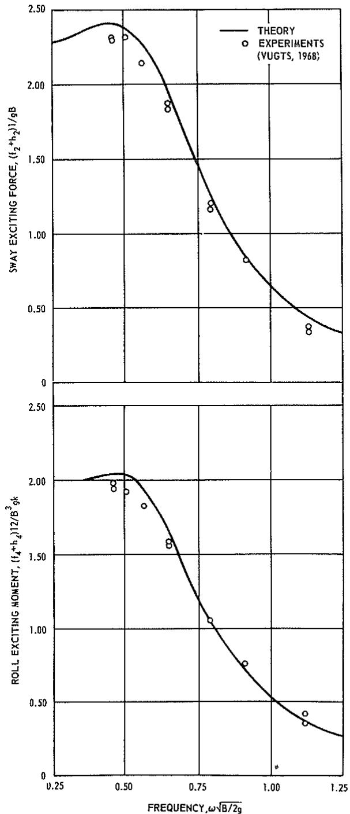

line

| FREQUENCY, ω√(B/2g) | SWAY EXCITING FORCE, (I₂⁺b₂)/10^6 g | ROLL EXCITING MOMENT, (I₄⁺b₄)/12/Bₖ⁷ |
| ------------------- | ----------------------------------- | ------------------------------------ |
| 0.25                | ~2.3                                | ~2.0                                 |
| 0.50                | ~2.4                                | ~2.0                                 |
| 0.75                | ~1.5                                | ~1.0                                 |
| 1.00                | ~0.5                                | ~0.5                                 |
| 1.25                | ~0.3                                | ~0.3                                 |

$$
\begin{array}{l} G _ {j} ^ {*} = \rho \sum_ {k = 1} ^ {6} \zeta_ {k} \left\{- i \omega \iint_ {S ^ {*}} n _ {j} ^ {*} \phi_ {k} d s \right. \\ + U \iint_ {S ^ {*}} m _ {j} \phi_ {k} d s - U \int_ {C _ {x}} n _ {j} ^ {*} \phi_ {k} d l \Bigg \} \tag {155} \\ \end{array}
$$

Now setting $ds = dld\xi$ , we have

$$
G _ {j} ^ {*} = \rho \sum_ {k = 1} ^ {6} \zeta_ {k} \left\{- i \omega \int_ {L ^ {*}} \int_ {C _ {x}} n _ {j} ^ {*} \phi_ {k} d l d \xi \right.
$$

$$
+ U \int_ {L ^ {*}} \int_ {C _ {z}} m _ {j} \phi_ {k} d l d \xi - U \int_ {C _ {z}} n _ {j} ^ {*} \phi_ {k} d l \Bigg \} \tag {156}
$$

Here $L^*$ is the length of the hull forward of cross section $C_x$ . If the “strip-theory” assumptions are introduced, as in Appendix 1, it follows that the six components of the generalized three-dimensional normal can be expressed in terms of the two-dimensional general $N_j$ in the form

$$
\begin{array}{l} n _ {j} ^ {*} = (0, N _ {2}, N _ {3}, N _ {4}, \\ - (\xi - x) N _ {3}, (\xi - x) N _ {2}) \tag {157} \\ \end{array}
$$

and the velocity potential at a given section can be expressed in terms of the two-dimensional potential, $\psi_{k}$ (k = 2, 3, 4), as

$$
\phi_ {1} \approx 0 \text {   and   } \phi_ {k} = \psi_ {k}; k = 2, 3, 4
$$

$$
\phi_ {5} = - \xi \psi_ {3} + \frac {U}{i \omega} \psi_ {3} \tag {158}
$$

$$
\phi_ {6} = \xi \psi_ {2} - \frac {U}{i \omega} \psi_ {2}
$$

Use of equations (157) and (158) in equation (156) enables the force and moment amplitudes to be expressed in terms of the sectional line integral

$$
t _ {j k} = - \rho i \omega \int_ {C} N _ {j} \psi_ {k} d l; j, k = 2, 3, 4 \tag {159}
$$

The force amplitude components are

$$
\begin{array}{l} G _ {2} ^ {*} = \int_ {L ^ {*}} \left\{\left(\zeta_ {2} + \xi \zeta_ {6} - \frac {U}{i \omega} \zeta_ {6}\right) t _ {2 2} + \zeta_ {4} \zeta_ {2 4} \right\} d \xi \\ + \frac {U}{i \omega} \left[ \left(\zeta_ {2} + \xi \zeta_ {6} - \frac {U}{i \omega} \zeta_ {6}\right) t _ {2 2} + \zeta_ {4} t _ {2 4} \right] _ {\xi = x} \tag {160} \\ \end{array}
$$

$$
G _ {3} ^ {*} = \int_ {L ^ {*}} \left(\zeta_ {3} - \xi \zeta_ {5} + \frac {U}{i \omega} \zeta_ {5}\right) t _ {3 3} d \xi
$$

$$
+ \frac {U}{i \omega} \left[ \left(\zeta_ {3} - \xi \zeta_ {5} + \frac {U}{i \omega} \zeta_ {5}\right) t _ {3 8} \right] _ {\xi = x} \tag {161}
$$

and the moment amplitude components are

$$
\begin{array}{l} G _ {4} ^ {*} = \int_ {L ^ {*}} \left\{\left(\zeta_ {2} + \xi \zeta_ {6} - \frac {U}{i \omega} \zeta_ {6}\right) t _ {2 4} + \zeta_ {4} t _ {4 4} \right\} d \xi \\ + \frac {U}{i \omega} \left[ \left(\zeta_ {2} + \xi \zeta_ {6} - \frac {U}{i \omega} \zeta_ {6}\right) t _ {2 4} + \zeta_ {4} t _ {4 4} \right] _ {\xi = x} \tag {162} \\ \end{array}
$$

$$
G _ {5} ^ {*} = - \int_ {L ^ {*}} (\xi - x) \left(\zeta_ {3} - \xi \zeta_ {5}\right) t _ {3 3} d \xi
$$

$$
+ \frac {U}{i \omega} \left(- \zeta_ {3} + x \zeta_ {5} - \frac {U}{i \omega} \zeta_ {5}\right) \int_ {L ^ {*}} t _ {3 3} d \xi \tag {163}
$$

$$
\begin{array}{l} G _ {6} ^ {*} = \int_ {L ^ {*}} \left\{\left(\xi - x\right) \left(\zeta_ {2} + \xi \zeta_ {6}\right) t _ {2 2} + (\xi - x) \zeta_ {4} t _ {2 4} \right\} d \xi \\ + \frac {U}{i \omega} \left(\zeta_ {2} + x \zeta_ {6} - \frac {U}{i \omega} \zeta_ {6}\right) \int_ {L ^ {*}} t _ {2 2} d \xi \\ + \frac {U}{i \omega} \zeta_ {4} \int_ {L ^ {*}} t _ {2 4} d \xi \tag {164} \\ \end{array}
$$

One may go one step further and express these force and moment components in terms of real variables. If we let

$$
D _ {j} = \operatorname{Re} G _ {j} ^ {*} e ^ {i \omega t} \text { and } \eta_ {j} = \operatorname{Re} \zeta_ {j} e ^ {i \omega t} \tag {165}
$$

and use $\omega^{2}a_{jk}-i\omega b_{jk}=t_{jk}$ , the hydrodynamic force and moment due to the body motion are those presently in the main text of the paper, equations (78) through (82), in terms of the velocity and acceleration, $\dot{\eta}_{j}$ and $\ddot{\eta}_{j}$ , and the sectional added-mass and damping coefficients, $a_{jk}$ and $b_{jk}$ .