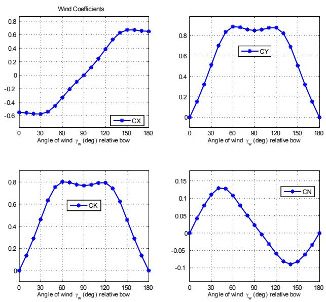
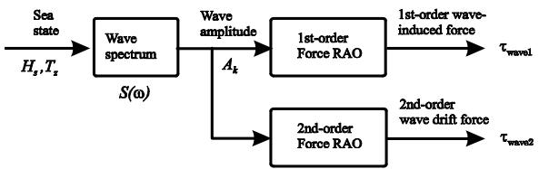
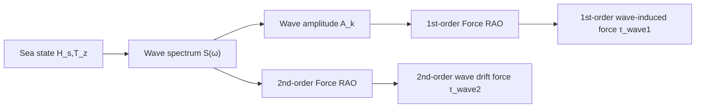
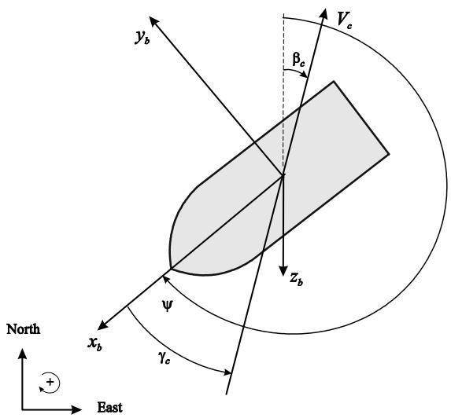
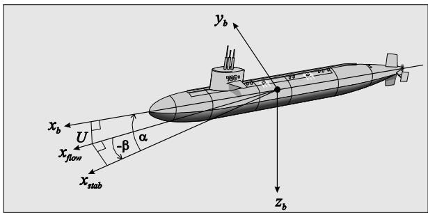

# HOW TO INCORPORATE WIND, WAVES AND OCEAN CURRENTS IN THE MARINE CRAFT EQUATIONS OF MOTION

Thor I. Fossen

Department of Engineering Cybernetics, Norwegian University of Science and Technology, NO-7491 Trondheim, NORWAY

Abstract: This paper demystiÖes how ocean currents together with wind and wave loads ináuence the marine craft equations of motion. In the literature there exists great confusion of the use of absolute and relative velocity terms when modeling rigid-body and hydrodynamic forces. The article is useful for engineers who want to simulate and predict the motions of marine craft exposed to wind, wave and ocean currents as well as control engineers evaluating the performance of marine craft control systems. The results are also very useful for testing and tuning of integral action time constants for compensation of ocean current and 2nd-order wave-induced drift forces.

Keywords: Marine systems, wind, waves, ocean currents, equations of motion

## INTRODUCTION

The equations of motion for underwater vehicles, ships, ocean structures and high-speed craft are usually derived using Newtonian and Lagrangian mechanics (Fossen, 1994, 2011). The resulting models are nonlinear mass-damper-springs which include rigid-body, hydrostatic and hydrodynamic generalized forces. The motions are coupled in six degrees of freedom (DOF). Marine craft are exposed to environmental forces due to wind, waves and ocean currents, which act like forcing on the mass-damper-spring system. In hydrodynamics it is common to assume linear superposition such that forcing due to wind and waves can be treated as generalized forces that can be directly added to the nonlinear equations of motion. However, generalized forces due to ocean currents do not follow the law of linear superposition and there exists much diversity and misunderstandings in the existing literature on how to include the e§ects of ocean currents in the equations of motion.

This paper addresses the e§ect of ocean currents on marine craft in a tutorial perspective by using the concept of relative velocity, that is the velocity of the craft with respect to the ocean current, to effectively describe current-induced forces. Differ: ent properties and representations of the marine craft equations of motion are discussed and it is shown how the current velocity enters the equations. Nonlinear models for time-domain simulations and control systems design are presented using the compact vectorial notation of Fossen (1994, 2011).

## 1. MARINE CRAFT EQUATIONS OF MOTION

In Fossen (1991) it was shown that the coupled 6-DOF equations of a marine craft could be expressed as:

$$
\dot {\boldsymbol {\eta}} = \mathbf {J} (\boldsymbol {\eta}) \boldsymbol {\nu} \tag {1}
$$

$$
\mathbf {M} \dot {\boldsymbol {\nu}} + \mathbf {C} (\boldsymbol {\nu}) \boldsymbol {\nu} + \mathbf {D} (\boldsymbol {\nu}) \boldsymbol {\nu} + \mathbf {g} (\boldsymbol {\eta}) = \boldsymbol {\tau} \tag {2}
$$

where $\pmb { \eta } = [ N , E , D , \phi , \theta , \psi ] ^ { \top }$ and $\pmb { \nu } = [ u , v , w , p , q , r ] ^ { \top }$ are the generalized position and velocity vectors,

respectively. The rotation and angular velocity transformation matrices between body coordinates (BODY) and the North-East-Down (NED) geographical reference frames are denoted $\mathbf { R } _ { b } ^ { n }$ and $\mathbf { T } _ { \Theta } .$ respectively. The other quantities follow the notation of (Fossen, 1994, 2011):

$$
\begin{array}{l} \mathbf {J} (\boldsymbol {\eta}) = \left[ \begin{array}{c c} \mathbf {R} _ {b} ^ {n} & \mathbf {0} _ {6 \times 6} \\ \mathbf {0} _ {6 \times 6} & \mathbf {T} _ {\Theta} \end{array} \right] \\ \mathbf {M} = \mathbf {M} _ {R B} + \mathbf {M} _ {A} \\ \mathbf {C} (\boldsymbol {\nu}) = \mathbf {C} _ {R B} (\boldsymbol {\nu}) + \mathbf {C} _ {A} (\boldsymbol {\nu}) \\ \mathbf {D} (\boldsymbol {\nu}) \\ \mathbf {g} (\boldsymbol {\eta}) \\ \end{array}
$$

The subscripts RB and A are used for the rigidbody and added mass terms, respectively. The rigid-body system inertia matrix $\mathbf { M } _ { R B }$ satisÖes:

$$
\mathbf {M} _ {R B} = \mathbf {M} _ {R B} ^ {\top} > 0, \quad \dot {\mathbf {M}} _ {R B} = \mathbf {0} _ {6 \times 6}
$$

$$
\mathbf {M} _ {R B} = \left[ \begin{array}{c c} m \mathbf {I} _ {3 \times 3} & - m \mathbf {S} (\mathbf {r} _ {g} ^ {b}) \\ m \mathbf {S} (\mathbf {r} _ {g} ^ {b}) & \mathbf {I} _ {b} \end{array} \right]
$$

where

$$
\mathbf {S} (\boldsymbol {\lambda}) = - \mathbf {S} ^ {\top} (\boldsymbol {\lambda}) = \left[ \begin{array}{c c c} 0 & - \lambda_ {3} & \lambda_ {2} \\ \lambda_ {3} & 0 & - \lambda_ {1} \\ - \lambda_ {2} & \lambda_ {1} & 0 \end{array} \right], \boldsymbol {\lambda} = \left[ \begin{array}{l} \lambda_ {1} \\ \lambda_ {2} \\ \lambda_ {3} \end{array} \right] \tag {3}
$$

is the cross-product operator deÖned such that $\pmb { \lambda } \times \mathbf { a } : = \mathbf { S } ( \pmb { \lambda } ) \mathbf { a }$ .

The matrix ${ \bf C } _ { R B }$ in (2) represents the Coriolis $\boldsymbol { \omega } _ { b / n } ^ { b } \times \mathbf { v } _ { b / n } ^ { b }$ and the centripetal vector term $\boldsymbol { \omega } _ { b / n } ^ { b } \times ( \boldsymbol { \omega } _ { b / n } ^ { b } \times { \bf r } _ { g } ^ { b } )$ . Contrary to the representation of $\mathbf { M } _ { R B } $ , it is possible to Önd a large number of representations for the matrix $\mathbf { C } _ { R B }$ : We will present some useful representations below.

Theorem 1. (Coriolis-Centripetal Matrix from M). Consider the $6 \times 6$ constant system inertia matrix:

$$
\mathbf {M} = \mathbf {M} ^ {\top} = \left[ \begin{array}{l l} \mathbf {M} _ {1 1} & \mathbf {M} _ {1 2} \\ \mathbf {M} _ {2 1} & \mathbf {M} _ {2 2} \end{array} \right] > 0 \tag {4}
$$

where $\mathbf { M } _ { 2 1 } = \mathbf { M } _ { 1 2 } ^ { \top }$ . Then the Coriolis-centripetal matrix can always be parameterized such that $\mathbf { C } ( \nu ) = - \mathbf { C } ^ { \top } ( \nu )$ by choosing:

$$
\begin{array}{l} \mathbf {C} (\boldsymbol {\nu}) = \left[ \begin{array}{c} \mathbf {0} _ {3 \times 3} \\ - \mathbf {S} (\mathbf {M} _ {1 1} \boldsymbol {\nu} _ {1} + \mathbf {M} _ {1 2} \boldsymbol {\nu} _ {2}) \end{array} \right. \\ \left. \begin{array}{l} - \mathbf {S} (\mathbf {M} _ {1 1} \boldsymbol {\nu} _ {1} + \mathbf {M} _ {1 2} \boldsymbol {\nu} _ {2}) \\ - \mathbf {S} (\mathbf {M} _ {2 1} \boldsymbol {\nu} _ {1} + \mathbf {M} _ {2 2} \boldsymbol {\nu} _ {2}) \end{array} \right] \tag {5} \\ \end{array}
$$

with $\nu _ { 1 } : = [ u , v , w ] ^ { \top }$ and $\pmb { \nu } _ { 2 } : = [ p , q , r ] ^ { \top }$ .

Proof: Sagatun and Fossen (1991).

The rigid-body Coriolis and centripetal matrix $\mathbf { C } _ { R B } ( \nu )$ can always be parametrized such that it is skew-symmetrical:

$$
\mathbf {C} _ {R B} (\boldsymbol {\nu}) = - \mathbf {C} _ {R B} ^ {\top} (\boldsymbol {\nu}), \quad \forall \boldsymbol {\nu} \in \mathbb {R} ^ {6} \tag {6}
$$

The skew-symmetric property is very useful when designing nonlinear motion control systems since the quadratic form $\nu ^ { \top } { \bf C } _ { R B } ( \nu ) \nu ~ \equiv ~ 0$ : This is exploited in energy-based designs where Lyapunov functions play a key role. There exists several parametrizations (Fossen and Fjellstad, 1995) that satisfy (6).

Lagrangian parametrization: Application of Theorem 1 with $\textbf { M } = \textbf { M } _ { R B }$ yields the following expression:

$$
\begin{array}{l} \mathbf {C} _ {R B} (\boldsymbol {\nu}) = \left[ \begin{array}{c} \mathbf {0} _ {3 \times 3} \\ - m \mathbf {S} (\boldsymbol {\nu} _ {1}) - m \mathbf {S} (\mathbf {S} (\boldsymbol {\nu} _ {2}) \mathbf {r} _ {g} ^ {b}) \end{array} \right. \\ \left. \begin{array}{c} - m \mathbf {S} (\boldsymbol {\nu} _ {1}) - m \mathbf {S} (\mathbf {S} (\boldsymbol {\nu} _ {2}) \mathbf {r} _ {g} ^ {b}) \\ m \mathbf {S} (\mathbf {S} (\boldsymbol {\nu} _ {1}) \mathbf {r} _ {g} ^ {b}) - \mathbf {S} (\mathbf {I} _ {b} \boldsymbol {\nu} _ {2}) \end{array} \right] (7) \\ \end{array}
$$

Linear velocity-independent parametrization: By using the cross-product property $\begin{array} { r l } { \mathbf { S } ( \pmb { \nu } _ { 1 } ) \pmb { \nu } _ { 2 } } & { { } = } \end{array}$ $- \mathbf { S } ( \pmb { \nu } _ { 2 } ) \pmb { \nu } _ { 1 }$ , it is possible to move $\mathbf { S } ( \nu _ { 1 } ) \nu _ { 2 }$ from $C _ { R B } ^ { \{ 1 2 \} }$ to $C _ { R B } ^ { \{ 1 1 \} }$ in (7). This gives an expression for $\mathbf { C } _ { R B } ( \nu )$ that is independent of linear velocity $\nu _ { 1 } \colon$ :

$$
\mathbf {C} _ {R B} (\boldsymbol {\nu}) = \left[ \begin{array}{c c} m \mathbf {S} (\boldsymbol {\nu} _ {2}) & - m \mathbf {S} (\boldsymbol {\nu} _ {2}) \mathbf {S} (\mathbf {r} _ {g} ^ {b}) \\ m \mathbf {S} (\mathbf {r} _ {g} ^ {b}) \mathbf {S} (\boldsymbol {\nu} _ {2}) & - \mathbf {S} (\mathbf {I} _ {b} \boldsymbol {\nu} _ {2}) \end{array} \right] (8)
$$

Remark 1. Formula (8) is useful when irrotationa ocean currents enter the equations of motion since $\mathbf { C } _ { R B } ( \nu )$ does not depend on the linear velocity $\nu _ { 1 }$ (uses only angular velocity $\nu _ { 2 }$ and lever arm $\mathbf { r } _ { g } ^ { b } )$ . This is discussed in Section 3.2.

Gravitational and buoyancy forces for surface vessels show a linear behavior $\mathbf { g } ( \pmb { \eta } ) = \mathbf { G } \pmb { \eta }$ where

$$
\mathbf {G} = \left[ \begin{array}{c c c c c c} 0 & 0 & 0 & 0 & 0 & 0 \\ 0 & 0 & 0 & 0 & 0 & 0 \\ 0 & 0 & - Z _ {z} & 0 & - Z _ {\theta} & 0 \\ 0 & 0 & 0 & - K _ {\phi} & 0 & 0 \\ 0 & 0 & - M _ {z} & 0 & - M _ {\theta} & 0 \\ 0 & 0 & 0 & 0 & 0 & 0 \end{array} \right] \tag {9}
$$

For underwater vehicles

$$
\begin{array}{l} \mathbf {g} (\boldsymbol {\eta}) = \left[ \begin{array}{c} (W - B) \sin (\theta) \\ - (W - B) \cos (\theta) \sin (\phi) \\ - (W - B) \cos (\theta) \cos (\phi) \\ - (y _ {g} W - y _ {b} B) \cos (\theta) \cos (\phi) \\ (z _ {g} W - z _ {b} B) \sin (\theta) \\ - (x _ {g} W - x _ {b} B) \cos (\theta) \sin (\phi) \end{array} \right. \\ \left. \begin{array}{l} + (z _ {g} W - z _ {b} B) \cos (\theta) \sin (\phi) \\ + (x _ {g} W - x _ {b} B) \cos (\theta) \cos (\phi) \\ - (y _ {g} W - y _ {b} B) \sin (\theta) \end{array} \right] (1 0) \\ \end{array}
$$

where the gravitational and buoyancy forces act through the centers of gravity (CG) and buoyancy (CB ) deÖned by the vectors $\mathbf { r } _ { g } ^ { b } : = [ x _ { g } , y _ { g } , z _ { g } ] ^ { \top }$ and $\mathbf { r } _ { b } ^ { b } : = [ x _ { b } , y _ { b } , z _ { b } ] ^ { \top }$ ; respectively.

  
Fig. 1. Wind coe¢ cients $C _ { X } , C _ { Y } , C _ { K }$ and $C _ { N }$ for a research vessel.

## 2. SUPERPOSITION OF WIND AND WAVE-INDUCED FORCES

For control systems design it is common to assume the principle of superposition when considering wind and wave-induced forces such that (2) takes the following form:

$$
\mathbf {M} \dot {\boldsymbol {\nu}} + \mathbf {C} (\boldsymbol {\nu}) \boldsymbol {\nu} + \mathbf {D} (\boldsymbol {\nu}) \boldsymbol {\nu} + \mathbf {g} (\boldsymbol {\eta}) = \boldsymbol {\tau} _ {\text { wind }} + \boldsymbol {\tau} _ {\text { wave }} + \boldsymbol {\tau} \tag {11}
$$

where $\pmb { \tau } _ { \mathrm { w i n d } } \in \mathbb { R } ^ { 6 }$ and $\tau _ { \mathrm { w a v e } } \in \mathbb { R } ^ { 6 }$ represent the generalized forces due to wind and waves.

## 2.1 Wind forces and moments

Wind can be deÖned as the movement of air relative to the surface of the Earth. For a marine craft moving at a forward speed, the wind forces and moments:

$$
\boldsymbol {\tau} _ {\text { wind }} = \frac {1}{2} \rho_ {a} V _ {r w} ^ {2} \left[ \begin{array}{c} C _ {X} (\gamma_ {r w}) A _ {F w} \\ C _ {Y} (\gamma_ {r w}) A _ {L w} \\ C _ {Z} (\gamma_ {r w}) A _ {F w} \\ C _ {K} (\gamma_ {r w}) A _ {L w} H _ {L _ {w}} \\ C _ {M} (\gamma_ {r w}) A _ {F w} H _ {F _ {w}} \\ C _ {N} (\gamma_ {r w}) A _ {L w} L _ {o a} \end{array} \right] \tag {12}
$$

are functions of relative wind speed $V _ { r w }$ and angle of attack $\gamma _ { r w }$ according to:

$$
V _ {r w} = \sqrt {u _ {r w} ^ {2} + v _ {r w} ^ {2}} \tag {13}
$$

$$
\gamma_ {r w} = - \mathrm{atan2} (v _ {r w}, u _ {r w}) \tag {14}
$$

which both are functions of the relative velocities:

$$
u _ {r w} = u - u _ {w} \tag {15}
$$

$$
v _ {r w} = v - v _ {w} \tag {16}
$$

The nondimensional wind coe¢ cients $C _ { X } , \ C _ { Y }$ ; $C _ { Z } , C _ { K } , C _ { M }$ and $C _ { N }$ are usually computed using $h = 1 0$ m as reference height while $\rho _ { a }$ is the air density. The frontal and lateral projected wind areas are denoted by $A _ { F w }$ and $A _ { L w }$ while $L _ { o a }$ is the length over all. The mean heights of the areas $A _ { F w }$ and $A _ { L w }$ are denoted by $H _ { L _ { w } }$ and $H _ { F _ { w } }$ , respectively. Figure 1 shows four wind coe¢ cients for a typical research vessel (Blendermann, 1994). Wind coe¢ cients for other vessels are found in Fossen (2011) and references therein.

## 2.2 Wave-induced forces and moments

The Örst- and second-order wave forces for varying wave directions $\beta _ { i }$ and wave frequencies $\omega _ { k }$ are denoted \~fdofg ( $\tilde { \tau } _ { \mathrm { w a v e 1 } } ^ { \mathrm { \{ d o f \} } } ( \omega _ { k } , \beta _ { i } )$ and $\tilde { \tau } _ { \mathrm { w a v e 2 } } ^ { \{ \mathrm { d o f } \} } ( \omega _ { k } , \beta _ { i } )$ where dof $\in \ \{ 1 , 2 , 3 , 4 , 5 , 6 \}$ . The normalized force response amplitude operators (RAOs) are complex variables given by (WAMIT Inc., 2010):

$$
F _ {\text { wave1 }} ^ {\{\text { dof } \}} (\omega_ {k}, \beta_ {i}) = \left| \frac {\tilde {\tau} _ {\text { wave1 }} ^ {\{\text { dof } \}} (\omega_ {k} , \beta_ {i})}{\rho g A _ {k}} \right| e ^ {j \angle \tilde {\tau} _ {\text { wave1 }} ^ {\{\text { dof } \}} (\omega_ {k}, \beta_ {i})}
$$

$$
F _ {\mathrm{wave2}} ^ {\{\mathrm{dof} \}} (\omega_ {k}, \beta_ {i}) = \left| \frac {\tilde {\tau} _ {\mathrm{wave2}} ^ {\{\mathrm{dof} \}} (\omega_ {k} , \beta_ {i})}{\rho g A _ {k} ^ {2}} \right| e ^ {j \angle \tilde {\tau} _ {\mathrm{wave2}} ^ {\{\mathrm{dof} \}} (\omega_ {k}, \beta_ {i})}
$$

The output from the hydrodynamic code is usually an ASCII Öle containing RAOs in table format. Let us denote the imaginary and real parts of the force RAOs by; $\mathrm { I m } _ { \mathrm { w a v e 1 } } \{ \mathrm { d o f } \} ( k , i )$ and $\mathrm { R e } _ { \mathrm { w a v e 1 } } \{ \mathrm { d o f } \} ( k , i )$ . The amplitudes and phases for di§erent frequencies $\omega _ { k }$ and wave directions $\beta _ { i }$ for the Örst-order wave-induced forces can be computed according to the formulae:

$$
\begin{array}{l} \left| F _ {\text { wave1 }} ^ {\{\text { dof } \}} (\omega_ {k}, \beta_ {i}) \right| = \left(\text { Im } _ {\text { wave1 }} \{\text { dof } \} (k, i) ^ {2} \right. \\ \left. + \operatorname{Re} _ {\text { wave1 }} \{\mathrm{dof} \} (k, i) ^ {2}\right) ^ {1 / 2} \tag {17} \\ \end{array}
$$

$$
\angle F _ {\text { wave1 }} ^ {\{\text { dof } \}} (\omega_ {k}, \beta_ {i}) = \text { atan2 } \left(\text { Im } _ {\text { wave1 }} \{\text { dof } \} (k, i), \right.
$$

$$
\mathrm{Re} _ {\text { wave1 }} \{\text { dof } \} (k, i)) \tag {18}
$$

The amplitudes and phases for the second-order mean forces are:

$$
\left| F _ {\text { wave2 }} ^ {\{\text { dof } \}} (\omega_ {k}, \beta_ {i}) \right| = \text { Re } _ {\text { wave2 }} \{\text { dof } \} (k, i) \tag {19}
$$

$$
\angle F _ {\text { wave2 }} ^ {\{\text { dof } \}} (\omega_ {k}, \beta_ {i}) = 0 \tag {20}
$$

Since the Örst- and second-order wave forces are represented in terms of the complex variables dof $F _ { \mathrm { w a v e 1 } } ^ { \mathrm { \ ' f d o f } } ( \omega _ { k } , \beta _ { i } )$ $F _ { \mathrm { w a v e 2 } } ^ { \{ \mathrm { d o f } \} } ( \omega _ { k } , \beta _ { i } )$ for sinusoidal excitations can be computed using di§erent wave spectra. A frequently used family of wave spectra is:

$$
S (\omega) = A \omega^ {- 5} \exp (- B \omega^ {- 4}) \tag {21}
$$

where di§erent values for A and B are used. These values depend on geographical location and wind speed (see Chapter 8.2, Fossen 2011).

flowchart

Fig. 2. Computation of Örst- and second-order wave-induced forces from force RAOs.

When computing the wave-induced forces, linear superposition is employed as illustrated in Fig. 2. The relationship between the a wave spectrum $S ( \omega _ { k } )$ and the wave amplitude $A _ { k }$ for a wave component k is (Faltinsen, 1990):

$$
\frac {1}{2} A _ {k} ^ {2} = S (\omega_ {k}) \Delta \omega \tag {22}
$$

where ! is a constant di§erence between the frequencies. Let the wave-induced forces in 6 DOF be denoted by the vectors:

$$
\boldsymbol {\tau} _ {\text { wave1 }} = \left[ \tau_ {\text { wave1 }} ^ {\{1 \}}, \tau_ {\text { wave1 }} ^ {\{2 \}},..., \tau_ {\text { wave1 }} ^ {\{6 \}} \right] ^ {\top}
$$

$$
\boldsymbol {\tau} _ {\text { wave2 }} = \left[ \tau_ {\text { wave2 }} ^ {\{1 \}}, \tau_ {\text { wave2 }} ^ {\{2 \}},..., \tau_ {\text { wave2 }} ^ {\{6 \}} \right] ^ {\top}
$$

For the no spreading case, the wave direction $\beta =$ constant such that:

$$
\tau_ {\mathrm{wave1}} ^ {\{\mathrm{dof} \}} = \sum_ {k = 1} ^ {N} \rho g \left| F _ {\mathrm{wave1}} ^ {\{\mathrm{dof} \}} (\omega_ {k}, \beta) \right|
$$

$$
A _ {k} \cos \left(\omega_ {e} (U, \omega_ {k}, \beta) t + \angle F _ {\text { wave1 }} ^ {\{\text { dof } \}} (\omega_ {k}, \beta) + \epsilon_ {k}\right) \tag {23}
$$

$$
\tau_ {\mathrm{wave2}} ^ {\{\mathrm{dof} \}} = \sum_ {k = 1} ^ {N} \rho g \left| F _ {\mathrm{wave2}} ^ {\{\mathrm{dof} \}} (\omega_ {k}, \beta) \right|
$$

$$
A _ {k} ^ {2} \cos \left(\omega_ {e} (U, \omega_ {k}, \beta) t + \epsilon_ {k}\right) \tag {24}
$$

where

$$
\omega_ {e} (U, \omega_ {k}, \beta) = \omega_ {k} - \frac {\omega_ {k} ^ {2}}{g} U \cos (\beta) \tag {25}
$$

is the encounter frequency. The assumption that = constant can be relaxed to model spreading of the main wave propagation direction (see Chapter 8.3, Fossen 2011).

## 3. EQUATIONS OF MOTION INCLUDING OCEAN CURRENTS

Ocean currents are horizontal and vertical circulation systems of ocean waters produced by gravity, wind friction and water density variation in different parts of the ocean. Besides wind-generated currents, the heat exchange at the sea surface together with salinity changes, develop an additional sea current component, usually referred to as thermohaline currents.

The oceans are conveniently divided into two water spheres, the cold and warm water sphere. Since the Earth is rotating, the Coriolis force will try to turn the major currents to the East in the northern hemisphere and West in the southern hemisphere. Finally, the major ocean circulations will also have a tidal component arising from planetary interactions and gravity. In coastal regions and fjords, tidal components can reach very high speeds, in fact speeds of 2ñ3 m/s or more have been measured.

The forces on a marine craft due to ocean currents can be accounted for by replacing the generalized velocity vector in the hydrodynamic terms with relative velocities:

$$
\boldsymbol {\nu} _ {r} = \boldsymbol {\nu} - \boldsymbol {\nu} _ {c} \tag {26}
$$

where $\nu _ { c } \in \mathbb { R } ^ { 6 }$ is the velocity of the ocean current expressed in BODY.

DeÖnition 1. (Irrotational áuid). The generalized ocean current velocity of an irrotational áuid is:

$$
\boldsymbol {\nu} _ {c} = \left[ \underbrace {u _ {c} , v _ {c} , w _ {c}} _ {\mathbf {v} _ {c} ^ {b}}, 0, 0, 0 \right] ^ {\top} \tag {27}
$$

where $\mathbf { v } _ { c } ^ { b } = [ u _ { c } , v _ { c } , w _ { c } ] ^ { \top }$ is the linear velocity.

The ocean current linear velocity vector satisÖes:

$$
\mathbf {v} _ {c} ^ {n} = \mathbf {R} _ {b} ^ {n} (\boldsymbol {\Theta} _ {n b}) \mathbf {v} _ {c} ^ {b} \tag {28}
$$

where $\begin{array} { r } { \Theta _ { n b } ~ = ~ [ \phi , \theta , \psi ] ^ { \top } } \end{array}$ are the Euler angles between BODY and NED, and $\mathbf { R } _ { b } ^ { n } ( \Theta _ { n b } ) \in S O ( 3 )$ is the corresponding rotation matrix.

DeÖnition 2. (Irrotational constant ocean current). An irrotational constant ocean current in NED satisÖes:

$$
\dot {\mathbf {v}} _ {c} ^ {n} = \dot {\mathbf {R}} _ {b} ^ {n} (\boldsymbol {\Theta} _ {n b}) \mathbf {v} _ {c} ^ {b} + \mathbf {R} _ {b} ^ {n} (\boldsymbol {\Theta} _ {n b}) \dot {\mathbf {v}} _ {c} ^ {b} := \mathbf {0} \tag {29}
$$

where

$$
\dot {\mathbf {R}} _ {b} ^ {n} (\boldsymbol {\Theta} _ {n b}) = \mathbf {R} _ {b} ^ {n} (\boldsymbol {\Theta} _ {n b}) \mathbf {S} (\boldsymbol {\omega} _ {b / n} ^ {b}) \tag {30}
$$

This implies that the ocean current linear velocity vector in BODY coordinates is given by:

$$
\dot {\mathbf {v}} _ {c} ^ {b} = - \mathbf {S} (\boldsymbol {\omega} _ {b / n} ^ {b}) \mathbf {v} _ {c} ^ {b} \tag {31}
$$

## 3.1 Equations of Motion including Ocean Currents

In order to simulate irrotational ocean currents and their e§ect on marine craft motion, the following model can be applied:

$$
\begin{array}{l} \underbrace {\mathbf {M} _ {R B} \dot {\boldsymbol {\nu}} + \mathbf {C} _ {R B} (\boldsymbol {\nu}) \boldsymbol {\nu} + \mathbf {g} (\boldsymbol {\eta})} _ {\text { rigid - body   and   hydrostatic   terms }} \\ + \underbrace {\mathbf {M} _ {A} \dot {\boldsymbol {\nu}} _ {r} + \mathbf {C} _ {A} (\boldsymbol {\nu} _ {r}) \boldsymbol {\nu} _ {r} + \mathbf {D} (\boldsymbol {\nu} _ {r}) \boldsymbol {\nu} _ {r}} _ {\text { hydrodynamic   terms }} \\ = \boldsymbol {\tau} _ {\text { wind }} + \boldsymbol {\tau} _ {\text { wave }} + \boldsymbol {\tau} \tag {32} \\ \end{array}
$$

where

$$
\boldsymbol {\nu} _ {r} = \left[ \begin{array}{c} \mathbf {v} ^ {b} - \mathbf {v} _ {c c} ^ {b} \\ \boldsymbol {\omega} _ {b / n} ^ {b} \end{array} \right] \tag {33}
$$

is the relative velocity vector. Notice that the rigid-body kinetics is independent of the ocean current.

## 3.2 Equations of Relative Velocity

It is possible to simplify (32) by exploiting the structure of ${ \bf C } _ { R B } ( \nu _ { r } )$ :

Theorem 2. If the Coriolis and centripetal matrix ${ \bf C } _ { R B } ( \nu _ { r } )$ is parametrized independent of linear velocity $\nu _ { 1 } ~ = ~ [ u , v , w ] ^ { \top }$ , for instance by using (8), and the ocean current is irrotational and constant (DeÖnition 2), the rigid-body kinetics satisÖes (HegrenÊs, 2010):

$$
\mathbf {M} _ {R B} \dot {\boldsymbol {\nu}} + \mathbf {C} _ {R B} (\boldsymbol {\nu}) \boldsymbol {\nu} \equiv \mathbf {M} _ {R B} \dot {\boldsymbol {\nu}} _ {r} + \mathbf {C} _ {R B} (\boldsymbol {\nu} _ {r}) \boldsymbol {\nu} _ {r} (3 4)
$$

PROOF. Since the Coriolis and centripetal matrix represented by (8) is independent of linear velocity $\pmb { \nu } _ { 1 } = [ u , v , w ] ^ { \top }$ , it follows that $\mathbf { C } _ { R B } ( \nu _ { r } ) =$ $\mathbf { C } _ { R B } ( \nu )$ . The property:

$$
\mathbf {M} _ {R B} \dot {\boldsymbol {\nu}} _ {c} + \mathbf {C} _ {R B} (\boldsymbol {\nu} _ {r}) \boldsymbol {\nu} _ {c} = \mathbf {0} \tag {35}
$$

is proven by expanding the matrices $\mathbf { M } _ { R B }$ and ${ \bf C } _ { R B } ( \nu _ { r } )$ ; and corresponding acceleration and velocity vectors according to:

$$
\begin{array}{l} \left[ \begin{array}{c c} m \mathbf {I} _ {3 \times 3} & - m \mathbf {S} (\mathbf {r} _ {g} ^ {b}) \\ m \mathbf {S} (\mathbf {r} _ {g} ^ {b}) & \mathbf {I} _ {b} \end{array} \right] \left[ \begin{array}{c} - \mathbf {S} (\pmb {\omega} _ {b / n} ^ {b}) \mathbf {v} _ {c} ^ {b} \\ \mathbf {0} _ {3 \times 1} \end{array} \right] \\ + \left[ \begin{array}{c c} m \mathbf {S} (\boldsymbol {\omega} _ {b / n} ^ {b}) & - m \mathbf {S} (\boldsymbol {\omega} _ {b / n} ^ {b}) \mathbf {S} (\mathbf {r} _ {g} ^ {b}) \\ m \mathbf {S} (\mathbf {r} _ {g} ^ {b}) \mathbf {S} (\boldsymbol {\omega} _ {b / n} ^ {b}) & - \mathbf {S} (\mathbf {I} _ {b} \boldsymbol {\omega} _ {b / n} ^ {b}) \end{array} \right] \left[ \begin{array}{c} \mathbf {v} _ {c} ^ {b} \\ \mathbf {0} _ {3 \times 1} \end{array} \right] = \mathbf {0} \\ \end{array}
$$

Finally, it follows that:

$$
\begin{array}{l} \mathbf {M} _ {R B} \dot {\pmb {\nu}} + \mathbf {C} _ {R B} (\pmb {\nu}) \pmb {\nu} = \mathbf {M} _ {R B} [ \dot {\pmb {\nu}} _ {r} + \dot {\pmb {\nu}} _ {c} ] \\ + \mathbf {C} _ {R B} (\boldsymbol {\nu} _ {r}) [ \boldsymbol {\nu} _ {r} + \boldsymbol {\nu} _ {c} ] \\ = \mathbf {M} _ {R B} \dot {\boldsymbol {\nu}} _ {r} + \mathbf {C} _ {R B} (\boldsymbol {\nu} _ {r}) \boldsymbol {\nu} _ {r} \tag {36} \\ \end{array}
$$

Theorem 2 when applied to (32) gives the di§erential equations:

$$
\dot {\boldsymbol {\eta}} = \mathbf {J} (\boldsymbol {\eta}) \boldsymbol {\nu} _ {r} + \left[ \begin{array}{c} \mathbf {v} _ {c} ^ {n} \\ \mathbf {0} \end{array} \right] \tag {37}
$$

$$
\mathbf {M} \dot {\boldsymbol {\nu}} _ {r} + \mathbf {C} (\boldsymbol {\nu} _ {r}) \boldsymbol {\nu} _ {r} + \mathbf {D} (\boldsymbol {\nu} _ {r}) \boldsymbol {\nu} _ {r} + \mathbf {g} (\boldsymbol {\eta}) = \boldsymbol {\tau} _ {\text { wind }} + \boldsymbol {\tau} _ {\text { wave }} + \boldsymbol {\tau} \tag {38}
$$

where $\mathbf { M } = \mathbf { M } _ { R B } + \mathbf { M } _ { A }$ and $\mathbf { C } ( \pmb { \nu } _ { r } ) = \mathbf { C } _ { R B } ( \pmb { \nu } _ { r } ) -$ + ${ \bf C } _ { A } ( \pmb { \nu } _ { r } )$ . Notice that only $\nu _ { r }$ and not  is used in (38) if compared to (32). The model (37)ñ(38) includes the bias $\dot { \mathbf { v } } _ { c } ^ { n } = \mathbf { 0 }$ at the kinematic level while (32) models drift due to ocean currents at the kinetic level using $\pmb { \nu } _ { r } = \pmb { \nu } - \pmb { \nu } _ { c }$ .

## 3.3 Equations of Motion for Zero Speed

For low-speed applications such as DP, ocean currents and damping can be modeled by three current coe¢ cients $C _ { X } , C _ { Y }$ and $C _ { N }$ . These can be experimentally obtained using scale models in wind tunnels. The resulting forces are measured on the model, which is restrained from moving.

text_image

y_b
V_c
β_c
z_b
ψ
x_b
γ_c
North
East

Fig. 3. Current speed $V _ { c } ,$ current direction $\beta _ { c }$ and current angle of attack $\gamma _ { c }$ relative bow.

In many textbooks and papers, for instance Blendermann (1994), wind and current coe¢ cients are deÖned relative to the bow using a counter clockwise rotation $\gamma _ { c }$ (see Figure 3). The current forces on a marine craft at rest can be expressed in terms of the area-based current coe¢ cients $C _ { X } , C _ { Y }$ and $C _ { N }$ as:

$$
X _ {\text { current }} = \frac {1}{2} \rho A _ {F c} C _ {X} (\gamma_ {c}) V _ {c} ^ {2} \tag {39}
$$

$$
Y _ {\text { current }} = \frac {1}{2} \rho A _ {L c} C _ {Y} (\gamma_ {c}) V _ {c} ^ {2} \tag {40}
$$

$$
N _ {\text { current }} = \frac {1}{2} \rho A _ {L c} L _ {o a} C _ {N} (\gamma_ {c}) V _ {c} ^ {2} \tag {41}
$$

where $V _ { c }$ is the speed of the ocean current. The frontal and lateral projected currents areas are denoted $A _ { F c }$ and $A _ { L c } ,$ respectively while $L _ { o a }$ is the length over all and $\rho$ is the density of water.

For vehicles at rest and motions limited to surge, sway and yaw, ocean currents are linearly superimposed according to:

$$
\begin{array}{l} \mathbf {M} \dot {\boldsymbol {\nu}} + \mathbf {C} (\boldsymbol {\nu}) \boldsymbol {\nu} + \mathbf {D} (\boldsymbol {\nu}) \boldsymbol {\nu} + \mathbf {g} (\boldsymbol {\eta}) = \\ \boldsymbol {\tau} _ {\text { current }} + \boldsymbol {\tau} _ {\text { wind }} + \boldsymbol {\tau} _ {\text { wave }} + \boldsymbol {\tau} \\ \end{array}
$$

$\mathrm { w h e r e } \ \tau _ { \mathrm { c u r r e n t } } = [ X _ { \mathrm { c u r r e n t } } , Y _ { \mathrm { c u r r e n t } } , N _ { \mathrm { c u r r e n t } } ] ^ { \top } .$

The current coe¢ cients can also be used at forward speed $U > 0$ and related to the surge resistance, cross-áow drag and the Munk moment used in maneuvering theory by using the concept of relative velocity (see Chapter 7.3, Fossen 2011).

## 4. OCEAN CURRENT SIMULATIONMODELS

Let the ocean current speed be denoted by $V _ { c }$ while its direction relative to the moving craft is expressed in terms of two angles: angle of attack $\alpha _ { c }$ and sideslip angle $\beta _ { c }$ as shown in Figure 4. For computer simulations the ocean current speed and direction can be generated by using Örst-order GaussñMarkov processes:

$$
\dot {V} _ {c} + \mu_ {1} V _ {c} = w _ {1} \tag {42}
$$

$$
\dot {\alpha} _ {c} + \mu_ {2} \alpha_ {c} = w _ {2} \tag {43}
$$

$$
\dot {\beta} _ {c} + \mu_ {3} \beta_ {c} = w _ {3} \tag {44}
$$

where $w _ { i } ~ ( i { \mathrm { ~ = ~ } } 1 , 2 , 3 )$ are zero-mean Gaussian white noise processes and $\mu _ { i } \ \ge \ 0 \ ( i \ = \ 1 , 2 , 3 )$ are constants. If $\mu _ { 1 } = \mu _ { 2 } = \mu _ { 3 } = 0$ , the models reduce to a random walks, corresponding to time integration of white noise. A saturating element is usually used in the integration process to limit the current speed to:

$$
V _ {\min} \leq V _ {c} (t) \leq V _ {\max} \tag {45}
$$

The direction of the current can also be Öxed by specifying constant values for $\alpha _ { c }$ and $\beta _ { c } .$ :

3-D Irrotational Ocean Current Model: A 3-D irrotational ocean current model is obtained by transforming the ocean current speed $V _ { c }$ and directions $( \alpha _ { c } , \beta _ { c } )$ from FLOW axes to NED velocities:

$$
\begin{array}{l} \mathbf {v} _ {c} ^ {n} = \mathbf {R} _ {y, \alpha_ {c}} ^ {\top} \mathbf {R} _ {z, - \beta_ {c}} ^ {\top} \left[ \begin{array}{l} V _ {c} \\ 0 \\ 0 \end{array} \right] \\ = \left[ \begin{array}{l} V _ {c} \cos (\alpha_ {c}) \cos (\beta_ {c}) \\ V _ {c} \sin (\beta_ {c}) \\ V _ {c} \sin (\alpha_ {c}) \cos (\beta_ {c}) \end{array} \right] \tag {46} \\ \end{array}
$$

where the principal rotations $\mathbf { R } _ { y , \alpha _ { c } }$ and $\mathbf { R } _ { z , - \beta _ { c } }$ are recognized as:

$$
\mathbf {R} _ {y, \alpha} = \left[ \begin{array}{c c c} \cos (\alpha) & 0 & \sin (\alpha) \\ 0 & 1 & 0 \\ - \sin (\alpha) & 0 & \cos (\alpha) \end{array} \right] \tag {47}
$$

$$
\mathbf {R} _ {z, - \beta} = \left[ \begin{array}{c c c} \cos (\beta) & \sin (\beta) & 0 \\ - \sin (\beta) & \cos (\beta) & 0 \\ 0 & 0 & 1 \end{array} \right] \tag {48}
$$

This expression can be transformed from NED to BODY using the Euler angle rotation matrix $\mathbf { R } _ { b } ^ { n }$ . Consequently,

$$
\left[ \begin{array}{l} u _ {c} \\ v _ {c} \\ w _ {c} \end{array} \right] = \mathbf {R} _ {b} ^ {n} (\boldsymbol {\Theta} _ {n b}) ^ {\top} \left[ \begin{array}{l} V _ {c} \cos (\alpha_ {c}) \cos (\beta_ {c}) \\ V _ {c} \sin (\beta_ {c}) \\ V _ {c} \sin (\alpha_ {c}) \cos (\beta_ {c}) \end{array} \right] \tag {49}
$$

2-D Irrotational Ocean Current Model: For motions in the horizontal plane, the 3-D equations (49) reduce to:

$$
u _ {c} = V _ {c} \cos (\beta_ {c} - \psi) \tag {50}
$$

$$
v _ {c} = V _ {c} \sin (\beta_ {c} - \psi) \tag {51}
$$

for $\alpha _ { c } = 0$ and $\phi = \theta = 0$ . Consequently,

$$
V _ {c} = \sqrt {u _ {c} ^ {2} + v _ {c} ^ {2}} \tag {52}
$$

text_image

y_b
98000
U
x_flow
-β
α
x_stab
z_b

Fig. 4. Angle of attack and sideslip angle for a marine craft.

## 5. CONCLUSIONS

A tutorial on how to include models for wind, waves and ocean currents for marine craft has been presented. The concept of equations of relative motions is used to model the e§ect of ocean currents while wind and wave-induced forces are added under the assumption of linear superposition. The article is intended for control engineers who want to simulate and predict the motions of marine craft exposed to wind, wave and ocean currents and use time-series to evaluate the performance of control systems.

## REFERENCES

W. Blendermann. Parameter IdentiÖcation of Wind Loads on Ships. J. Wind Eng. Ind. Aerodyn, JWEIA-51:339ñ351, 1994.  
O. M. Faltinsen. Sea Loads on Ships and O§ shore Structures. Cambridge University Press, 1990.  
T. I. Fossen. Nonlinear Modeling and Control of Underwater Vehicles. PhD thesis, Department of Engineering Cybernetics, Norwegian University of Science and Technology, Trondheim, Norway, June 1991.  
T. I. Fossen. Guidance and Control of Ocean Vehicles. John Wiley and Sons Ltd., 1994. ISBN 0-471-94113-1.  
T. I. Fossen. Handbook of Marine Craft Hydrodynamics and Motion Control. John Wiley and Sons Ltd., 2011. ISBN 978-1-1199-9149-6.  
T. I. Fossen and O. E. Fjellstad. Nonlinear Modelling of Marine Vehicles in 6 Degrees of Freedom. International Journal of Mathematical Modelling of Systems, JMMS-1(1):17ñ28, 1995.  
ÿyvind HegrenÊs. Autonomous Navigation for Underwater Vehicles. PhD thesis, Dept. of Engineering Cybernetics, Norwegian University of Science and Technology, Trondheim, Norway, 2010.  
S. I. Sagatun and T.I. Fossen. Lagrangian Formulation of Underwater VehiclesíDynamics. In Proceedings of the IEEE International Conference on Systems, Man and Cybernetics, pages 1029ñ1034, Charlottesville, VA, October 1991.  
WAMIT Inc. WAMIT User Manual. <www.wamit.com>, 2010.